# day1

## PART1. 虚拟机配置

```
root@ubuntu:~# cat /etc/netplan/01-netcfg.yaml 
```

```yaml
network:
    version: 2
    renderer: networkd
    ethernets:
      eth0:
        dhcp4: no
        dhcp6: no
        addresses:
          - 192.168.0.160/24
        gateway4: 192.168.0.1
        nameservers:
            addresses: [8.8.8.8,114.114.114.114]
```

```
root@ubuntu:~# sudo netplan apply
```

## PART2. Ceph简介

### 2.1 为什么要用Ceph?

像nfs服务,属于单体架构,不具备高可用特性.使用nfs + rsync,也可以做到分布式存储,但这个分布式的实现是依靠其他第三方服务来实现的,并不是nfs自身的功能.

商业存储(例如NAS,Network Attached Storage)虽然是分布式存储,但价格昂贵.因此前几年也有了一个流行词:去IOE(IBM Oracle EMC),即:去掉IBM的小型机,Oracle的数据库和emc存储.

因此最终人们选择开源的分布式存储.

### 2.2 Ceph概述

Ceph是一个开源的分布式存储系统,同时支持对象存储、块设备、文件系统.

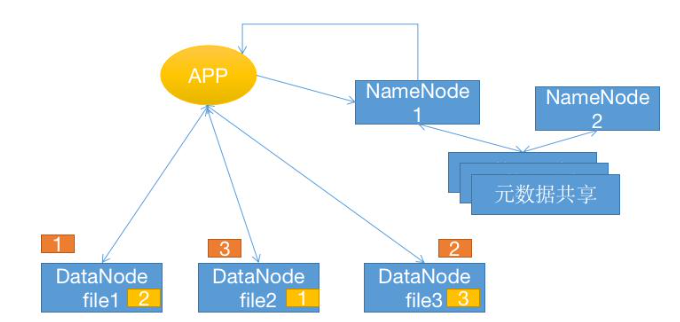

当数据被写入到Ceph中时,数据的元数据(即文件的属性信息,属主、属主、文件名、大小、时间戳等)由NameNode负责记录.后续查询时,该元数据中包含了对应数据所在的服务器.

DataNode负责提供数据的读写请求及高可用功能.当一份数据写入(Ceph以4M为单位拆分数据,即4M为存储的最小单元)时,先写入主osd(osd是Ceph中一个存储数据的服务),写入完成后,主osd向其他osd同步.同步工作完成后才会向客户端返回成功.Ceph存储数据时使用1主2备(备份节点数量可设置,但太多了就会写放大)的配置,且2备必须在2个不同的服务器上.通过副本池机制,保证数据的高可用.

和其他的分布式系统一样,主osd挂了,slave osd会自动选举.但"主osd"这个概念,是针对每一份数据而言的.也就是说对于不同的数据,其主osd是不同的.使用Ceph时,建议集群中的DataNode节点单独配置网卡给Ceph,该网卡用于同步数据.

### 2.3 Ceph基础

Ceph是一个开源的分布式存储系统,同时支持对象存储、块设备、文件系统.

Ceph是一个对象(object,此处的object指的是要存储的数据)式存储系统,它把每一个待管理的数据流(文件等数据)切分为一到多个固定大小(默认4MB)的对象数据,并以它为原子单元(原子是构成元素的最小单元)完成数据的读写.对象数据的底层存储服务是由多个存储主机(host,此处的host指的就是物理机,用于存储的物理机,磁盘、IO、网卡等配置一定要跟得上)组成的存储集群,该集群也被称之为RADOS(reliable(多副本) automatic(自动校验) distributed(分布式 osd会分散到不同的host上) object store)存储集群,即可靠的、自动化的、分布式的对象存储系统.
librados是RADOS存储集群的API,支持C/C++/JAVA/python/ruby/php/go等编程语言客户端.

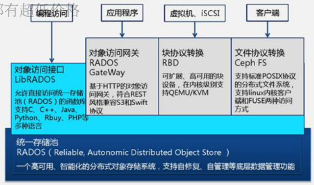

底层是RADOS存储池,该存储池支持自动恢复.即:如果有一个存储节点宕机了,如果挂的是osd的备份节点,则不用恢复,因为数据在osd的主节点上还有.但为了保证数据的备份数和指定的副本数一致,Ceph还是会在其他节点上再写一份备份.对于Ceph的存储节点来讲,Ceph会创建osd进程,osd进程的数量与存储节点上的磁盘数量相同.

#### 2.3.1 Ceph发展史

Ceph项目起源于2003年在加州大学圣克鲁兹分校攻读博士期间的研究课题(Lustre环境中的可扩展问题).

Lustre是一种平行分布式文件系统,早在1999年,由皮特·布拉姆(Peter Braam)创建的集群文件系统公司(Cluster File Systems Inc)开始研发,并于2003年发布Lustre 1.0版本.

2007年Sage Weil(塞奇·威尔)毕业后,Sage Weil继续全职从事 Ceph工作,2010年3月19日,Linus Torvalds将Ceph客户端合并到 2010年5月16日发布的Linux内核版本2.6.34,2012年SageWeil创建了InktankStorage用于为Ceph提供专业服务和支持,2014年4月 Redhat以1.75亿美元收购inktank公司并开源.

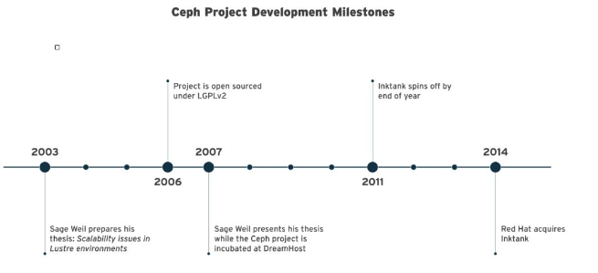

#### 2.3.2 Ceph的设计思想

Ceph的设计旨在实现以下目标:

- 每一组件皆可扩展
- 无单点故障
- 基于软件(而非专用设备)并且开源(无供应商锁定)
- 在现有的廉价硬件上运行
- 尽可能自动管理,减少用户干预

#### 2.3.3 Ceph的版本历史

Ceph的第一个版本是0.1,发布日期为2008年1月,多年来ceph的版本号一直采用递归更新的方式没变,直到2015年4月0.94.1(Hammer的第一个修正版)发布后,为了避免0.99(以及0.100或1.00),后期的命名方式发生了改变:

- x.0.z:开发版(给早期测试者和勇士们)
- x.1.z:候选版(用于测试集群、高手们)
- x.2.z:稳定、修正版(给用户们)

x从就算起,它代表Infernalis(首字母I是英文字母表中的第9个字母),这样第9个发布周期的第1个开发版就是9.0.0,后续依次是 9.0.0->9.0.1->9.0.2等;测试版本为9.1.0->9.1.1->9.1.2,稳定版本为9.2.0->9.2.1->9.2.2.

到2017年底,Ceph项目都采取每年发布两个稳定版本的做法,从 Jewel版到Nautilus之前,Ceph经历过一段时间的每间隔9个月发布一个新版本,Nautilus版本开始改为每年春季3月份发布一个稳定版本,并提供长达26个月左右的后期版本更新.

[Ceph项目地址](https://github.com/ceph/ceph)

[Ceph文档](https://docs.ceph.com/en/latest/start/intro/)

通常Ceph的升级,是新买一批服务器,安装新版本的Ceph;再把旧版本的Ceph中的数据导过去.

#### 2.3.4 Ceph集群角色定义

[Ceph中文文档(截至笔记编写时,该url已不可访问)](http://ceph.org.cn/category/docs/)

[Ceph手册](https://www.bookstack.cn/read/ceph-10-zh/0a8e59252377487c.md)

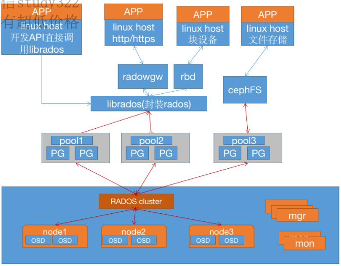

一个Ceph集群的组成部分:

- 若干的Ceph OSD节点(OSD:object storage daemon,对象存储守护程序),通常用于存储的节点至少3个.

- 至少需要1个Ceph Monitors监视器(进程名称:ceph-mon),Ceph Monitors的数量必须为奇数(1,3,5,7).通常Ceph Monitors会单独跑在一个节点上,不会和存储端放在一起.
- 2个或2个以上的Ceph管理器(managers):运行Ceph文件系统客户端时还需要高可用的Ceph Metadata Server(文件系统元数据服务器,是一个客户端组件,是另一个单独的服务).manager负责跟踪运行时指标和Ceph集群的当前状态,包括存储利用率,当前性能指标和系统负载等.

##### a. Monitor(ceph-mon)ceph监视器

在一个主机上运行的一个守护进程,用于维护集群状态映射(maintains maps of the cluster state),比如ceph集群中有多少存储池、每个存储池有多少PG以及存储池和PG的映射关系等, monitor map, manager map, the OSD map, the MDS map, and the CRUSH map,这些映射是Ceph守护程序相互协调所需的关键群集状态,此外监视器还负责管理守护程序和客户端之间的身份验证(认证使用cephX协议).通常至少需要三个监视器才能实现冗余和高可用性.

##### b. Manager(ceph-mgr)的功能

在一个主机上运行的一个守护进程,Ceph Manager守护程序(ceph-mgr)负责跟踪运行时指标和Ceph集群的当前状态,包括存储利用率,当前性能指标和系统负载.Ceph Manager守护程序还托管基于python 的模块来管理和公开Ceph集群信息,包括基于Web的Ceph仪表板和 REST API,高可用性通常至少需要两个管理器.

##### c. Ceph OSDs(对象存储守护程序 ceph-osd)

提供存储数据,操作系统上的一个磁盘就是一个OSD守护程序,OSD用于处理ceph集群数据复制,恢复,重新平衡,并通过检查其他Ceph OSD 守护程序的心跳来向Ceph监视器和管理器提供一些监视信息.通常至少需要3个Ceph OSD才能实现冗余和高可用性.

##### d. MDS(Ceph元数据服务器 ceph-mds)

代表ceph文件系统(NFS/CIFS)存储元数据(即Ceph块设备和Ceph 对象存储不使用MDS)

##### e. Ceph的管理节点

1. ceph的常用管理接口是一组命令行工具程序,例如rados、ceph、rbd等命令,ceph管理员可以从某个特定的ceph-mon节点执行管理操作
2. 推荐使用部署专用的管理节点对ceph进行配置管理、升级与后期维护,方便后期权限管理,管理节点的权限只对管理人员开放,可以避免一些不必要的误操作的发生

##### f. Ceph术语

- cephx:使用cephx认证协议进行客户端身份认证
- Ceph Object Gateway:如果启用对象存储,则需要给对象存储配置网关以便外部能够访问到.Ceph Object Gateway会监听指定的端口,以便实现这个目的,Ceph Object Gateway又称为:RADOS Gateway,RGW,RADOS网关

#### 2.3.5 Ceph逻辑组织架构

- Pool:存储池(也可以认为是分区),存储池的大小取决于底层的存储空间.数据通过存储在不同的存储池中,实现逻辑隔离.类似Kubernetes中的namespace
- PG(placement group):一个pool内部可以有多个PG存在,pool和PG都是抽象的逻辑概念,1个pool中有多少个PG可以通过公式计算.PG把存储池中的数据又做了一个逻辑上的分组,1个PG中有多种磁盘的组合,通常是16、32或64种组合关系.PG把一组比较大的数据拆分,有多少个PG就拆分成多少分,每个pg中都是多个副本.可以提高Ceph集群的读写性能,提高集群的读写性能.每个pg对应多块磁盘.Ceph的多副本存储使得运维可以不用在服务器上对磁盘做RAID了.
- OSD(Object Stroage Daemon):每一块磁盘都对应一个osd进程,1个主机由1个或多个osd组成.

ceph集群部署好之后,要先创建存储池才能向ceph写入数据,文件在向 ceph保存之前要先进行一致性hash计算,计算后会把文件保存在某个对应的PG上,此文件一定属于某个pool的一个PG,再通过PG保存在 OSD上.

数据对象在写到主OSD之后再同步对从OSD以实现数据的高可用.

##### 存储文件过程

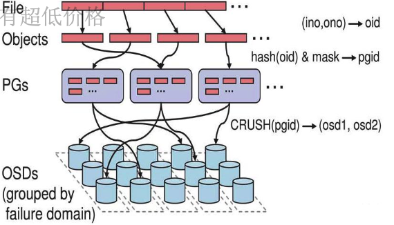

- step1. 计算文件到对象的映射

	计算文件到对象的映射,假如file为客户端要读写的文件,根据公式`oid(object id) = ino + ono`,计算oid.其中:

	- ino:inode number(INO),File的元数据序列号,File的唯一id
	- object number(ONO),File切分产生的某个object的序号,默认以4M切分一个块大小

- step2. 通过hash算法计算出文件对应的pool中的PG

	通过一致性HASH计算Object到PG,Object->PG映射`hash(oid) & mask-> pgid`
	
	此处的一致性HASH是指:在写操作时,会存储多份Object的副本.对于这多份副本而言,其HASH的结果都是一样的.
	
- step3. 通过CRUSH把对象映射到PG中的OSD

	通过CRUSH算法计算PG到OSD,PG->OSD映射`[CRUSH(pgid)->(osd1,osd2,osd3)]`
	
- step4. PG中的主OSD将对象写入到硬盘
- step5. 主OSD将数据同步给备份OSD,并等待备份OSD返回确认
- step6. 主OSD将写入完成返回给客户端

#### 2.3.6 Ceph元数据保存方式

Ceph对象数据的元数据信息放在哪里呢?对象数据的元数据以key-value的形式存在,在RADOS中有两种实现:xattrs和omap

##### a. xattrs

是将元数据保存在对象对应文件的扩展属性中并保存到系统磁盘上,这要求支持对象存储的本地文件系统(一般是XFS)支持扩展属性.

##### b. omap

是object map的简称,是将元数据保存在本地文件系统之外的独立key-value存储系统中,在使用filestore时是leveldb,在使用bluestore时是rocksdb,由于filestore存在功能问题(需要将磁盘格式化为XFS格式)及元数据高可用问题等问题,因此在目前ceph主要使用bluestore

###### b1. filestore与leveldb

ceph早期基于filestore使用google的levelDB保存对象的元数据,LevelDb是一个持久化存储的KV系统,和Redis这种内存型的KV 系统不同,leveldb不会像Redis一样将数据放在内存从而占用大量的内存空间,而是将大部分数据存储到磁盘上,但是需要把磁盘上的leveldb空间格式化为文件系统(XFS).

FileStore将数据保存到与Posix兼容的文件系统(例如Btrfs、XFS、Ext4).在Ceph后端使用传统的Linux文件系统尽管提供了一些好处,但也有代价,如性能、对象属性与磁盘本地文件系统属性匹配存在限制等.

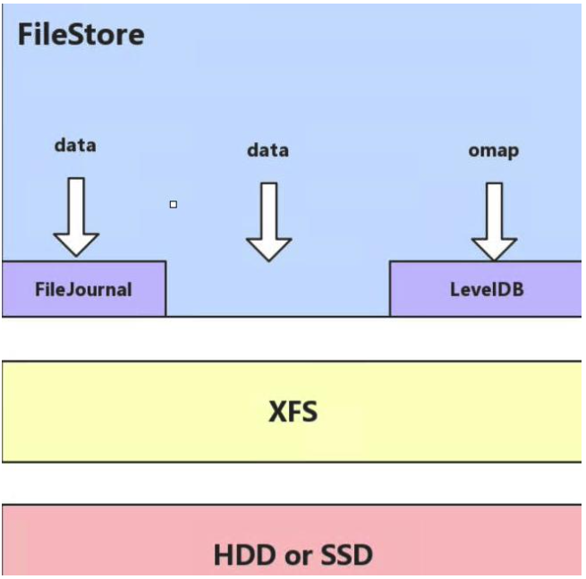

###### b2. bluestore与rocksdb

由于levelDB依然需要需要磁盘文件系统的支持,后期facebook对levelDB进行改进,成为了[RocksDB](https://github.com/facebook/rocksdb).RocksDB将对象数据的元数据保存在 RocksDB,但是RocksDB的数据又放在哪里呢?放在内存怕丢失,放在本地磁盘但是解决不了高可用,ceph对象数据放在了每个OSD中,那么就在在当前OSD中划分出一部分空间,格式化为BlueFS文件系统用于保存 RocksDB中的元数据信息(称为 BlueStore),并实现元数据的高可用,BlueStore最大的特点是构建在裸磁盘设备之上,并且对诸如SSD 等新的存储设备做了很多优化工作:

- 对全SSD及全NVMe SSD闪存适配
- 绕过本地文件系统层,直接管理裸设备,缩短IO路径
- 严格分离元数据和数据,提高索引效率
- 使用KV索引,解决文件系统目录结构遍历效率低的问题
- 支持多种设备类型
- 解决日志"双写"问题
- 期望带来至少2倍的写性能提升和同等读性能
- 增加数据校验及数据压缩等功能

RocksDB通过中间层BlueRocksDB访问文件系统的接口.这个文件系统与传统的Linux文件系统(例如Ext4和XFS)是不同的,它不是在VFS下面的通用文件系统,而是一个用户态的逻辑.BlueFS通过函数接口(API,非POSIX)的方式为BlueRocksDB提供类似文件系统的能力

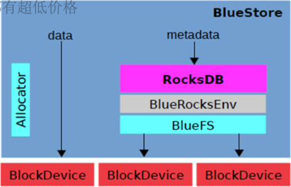

BlueStore的逻辑架构如上图所示,模块的划分都还比较清晰,我们来看下各模块的作用:

- Allocator:负责裸设备的空间管理分配
- RocksDB:rocksdb是facebook基于leveldb开发的一款kv数据库,BlueStore将元数据全部存放至RocksDB中,这些元数据包括存储预写式日志、数据对象元数据、Ceph的omap数据信息、以及分配器的元数据
- BlueRocksEnv:这是RocksDB与BlueFS交互的接口;RocksDB提供了文件操作的接口EnvWrapper(Env封装器),可以通过继承来实现该接口来自定义底层的读写操作,BlueRocksEnv就是继承自EnvWrapper实现对BlueFS的读写
- BlueFS:是BlueStore针对RocksDB开发的轻量级文件系统,用于存放RocksDB产生的.sst和.log等文件
- BlockDecive:BlueStore抛弃了传统的ext4、xfs文件系统,使用直接管理裸盘的方式;BlueStore支持同时使用多种不同类型的设备,在逻辑上BlueStore将存储空间划分为三层:慢速(Slow)空间、高速(DB)空间、超高速(WAL)空间,不同的空间可以指定使用不同的设备类型,当然也可使用同一块设备

BlueStore的设计考虑了FileStore中存在的一些硬伤,抛弃了传统的文件系统直接管理裸设备,缩短了IO路径,同时采用ROW的方式,避免了日志双写的问题,在写入性能上有了极大的提高

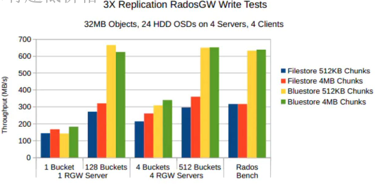

#### 2.3.7 Ceph CRUSH算法简介

CRUSH:Controllers replication under scalable hashing.即:可控的、可复制的、可伸缩的一致性hash算法

CRUSH是直接计算出指定的数据存放在哪个磁盘上的.但磁盘是可变的资源,今天可能集群总共15块硬盘,明天可能就是18块.所以磁盘是动态的资源,因此要使用一个算法来维护磁盘的状态变化.

CRUSH是在Monitors上计算的,因为只有Monitors有整个集群的pool、PG、OSD全部信息

Ceph使用CURSH算法来存放和管理数据,它是Ceph的智能数据分发机制.Ceph使用CRUSH算法来准确计算数据应该被保存到哪里,以及应该从哪里读取.和保存元数据不同的是,CRUSH按需计算出元数据,因此它就消除了对中心式的服务器/网关的需求,它使得Ceph客户端能够计算出元数据,该过程也称为CRUSH查找,然后和OSD直接通信.

1. 如果是把对象直接映射到OSD之上会导致对象与OSD的对应关系过于紧密和耦合,当OSD由于故障发生变更时将会对整个ceph集群产生影响
2. 于是ceph将一个对象映射到RADOS集群的时候分为两步:
	
	- step1. 首先使用一致性hash算法将对象名称映射到PG上
	- step2. 然后将PGID基于CRUSH算法映射到OSD即可查到对象

3. 以上两个过程都是以"实时计算"的方式完成,而没有使用传统的查询数据与块设备的对应表的方式,这样有效避免了组件的"中心化"问题,也解决了查询性能和冗余问题.使得ceph集群扩展不再受查询的性能限制.

4. 这个实时计算操作使用的就是CRUSH算法

CRUSH是一种分布式算法,类似于一致性hash算法,用于为RADOS存储集群控制数据的分配.

## PART3. 部署Ceph集群

### 3.1 部署方式

[ceph-ansible(python)](https://github.com/ceph/ceph-ansible)

[ceph-salt(python)](https://github.com/ceph/ceph-salt)

[ceph-container(shell)](https://github.com/ceph/ceph-container)

[ceph-chef(ruby)](https://github.com/ceph/ceph-chef)

[cephadm(ceph15后加入的ceph部署工具)](https://docs.ceph.com/en/latest/cephadm/)

### 3.2 服务器准备

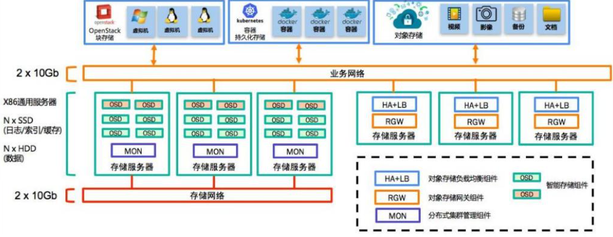

#### osd服务器4台

4台服务器作为ceph集群OSD存储服务器,每台服务器支持两个网络,public网络针对客户端访问,cluster网络用于集群管理及数据同步,每台三块或以上的磁盘.

|主机名|公网IP|内网IP|
|:-:|:-:|:-:|
|ceph-osd-1|192.168.0.161|172.16.1.161|
|ceph-osd-2|192.168.0.162|172.16.1.162|
|ceph-osd-3|192.168.0.163|172.16.1.163|
|ceph-osd-4|192.168.0.164|172.16.1.164|

注意:osd服务器作为存储节点,需要实现挂载多块硬盘.本实验中我在每个osd服务器上均挂载了4块容量为50GB的硬盘,文件系统均为xfs.

#### mon服务器3台

3台服务器作为ceph集群Mon监视服务器,每台服务器可以和ceph集群的cluster网络通信

|主机名|公网IP|内网IP|
|:-:|:-:|:-:|
|ceph-mon-1|192.168.0.165|172.16.1.165|
|ceph-mon-2|192.168.0.166|172.16.1.166|
|ceph-mon-3|192.168.0.167|172.16.1.167|

#### mgr服务器2台

2台服务器作为ceph-mgr管理服务器,可以和ceph集群的cluster网络通信.

|主机名|公网IP|内网IP|
|:-:|:-:|:-:|
|ceph-mgr-1|192.168.0.168|172.16.1.168|
|ceph-mgr-1|192.168.0.169|172.16.1.169|

#### deploy服务器1台

1台服务器用于部署ceph集群,即安装Ceph-deploy,也可以和ceph-mgr等复用

|主机名|公网IP|内网IP|
|:-:|:-:|:-:|
|ceph-deploy-1|192.168.0.170|172.16.1.170|

#### client服务器2台

2台服务器作为ceph的客户端使用.即通过ceph上传、下载、删除、修改文件

|主机名|公网IP|内网IP|
|:-:|:-:|:-:|
|ceph-client-1|192.168.0.171|172.16.1.171|
|ceph-client-2|192.168.0.172|172.16.1.172|

### 3.3 系统环境准备

- 需安装时间同步服务
- 关闭selinux和防火墙
- 配置域名解析或通过DNS解析

### 3.4 部署RADOS集群

[阿里云镜像源](https://mirrors.aliyun.com/ceph/)

[清华大学镜像源](https://mirrors.tuna.tsinghua.edu.cn/ceph/)

注意:Ceph从Octopus版本开始,不支持Centos7.

#### 3.4.1 仓库准备

##### Centos安装Ceph

- 配置yum源:

`wget -q -O- 'https://mirrors.tuna.tsinghua.edu.cn/ceph/keys/release.asc' | sudo apt-key add -`

- 安装:

`yum install https://mirrors.aliyun.com/ceph/rpm-octopus/el7/noarch/ceph-release-1-1.el7.noarch.rp m -y`

- 各节点配置epel仓库:

`yum install epel-release -y`

##### Ubuntu18.04.x安装Ceph

###### a. 各节点导入key

此处仅写出在`ceph-osd-1`节点上的导入过程,其他节点操作均相同

```
root@ceph-osd-1:~# sudo wget -q -O- 'https://mirrors.tuna.tsinghua.edu.cn/ceph/keys/release.asc' | sudo apt-key add -
OK
```

注意,ceph的客户端也要导入这个key,否则不能安装ceph-common.

##### b. 配置ceph源

此处仅写出在`ceph-osd-1`节点上的导入过程,其他节点操作均相同

```
root@ceph-osd-1:~# sudo echo "deb https://mirrors.tuna.tsinghua.edu.cn/ceph/debian-pacific bionic main" >> /etc/apt/sources.list
```

注意,ceph的客户端也要配置ceph源,否则不能安装ceph-common.

完成后更新源信息.

```
root@ceph-osd-1:~# apt update
Hit:1 http://mirrors.aliyun.com/ubuntu bionic InRelease
Get:2 http://mirrors.aliyun.com/ubuntu bionic-security InRelease [88.7 kB]
Get:3 http://mirrors.aliyun.com/ubuntu bionic-updates InRelease [88.7 kB]      
Get:4 https://mirrors.tuna.tsinghua.edu.cn/ceph/debian-pacific bionic InRelease [8,572 B]
Get:5 https://mirrors.tuna.tsinghua.edu.cn/ceph/debian-pacific bionic/main amd64 Packages [17.2 kB]
Get:6 http://mirrors.aliyun.com/ubuntu bionic-proposed InRelease [242 kB]      
Get:7 https://mirrors.tuna.tsinghua.edu.cn/ceph/debian-pacific bionic/main i386 Packages [3,302 B]
Get:8 http://mirrors.aliyun.com/ubuntu bionic-backports InRelease [74.6 kB]    
Fetched 523 kB in 2s (308 kB/s)                           
Reading package lists... Done
Building dependency tree       
Reading state information... Done
176 packages can be upgraded. Run 'apt list --upgradable' to see them.
```

若更新源信息报错不信任源,则检查服务器是否安装`ca-certificates`,若未安装则执行命令`sudo apt-get install --reinstall ca-certificates`,再`apt update`即可

#### 3.4.2 创建ceph用户

推荐使用指定的普通用户部署和运行ceph集群,普通用户只要能以非交互方式执行sudo命令执行一些特权命令即可,新版的ceph-deploy可以指定包含root的在内只要可以执行sudo命令的用户,不过仍然推荐使用普通用户,比如ceph、cephuser、cephadmin这样的用户去管理ceph集群.

##### 创建用户

在各个节点上均需创建ceph用户.此处我们创建一个用户名为`ceph`,密码为`1`的用户.

```
root@ceph-mon-1:~# groupadd -r -g 2022 ceph && useradd -r -m -s /bin/bash -u 2022 -g 2022 ceph && echo ceph:1 | chpasswd
root@ceph-mon-1:~# 
root@ceph-osd-1:~# id ceph
uid=2022(ceph) gid=2022(ceph) groups=2022(ceph)
```

##### 提权

后续操作中需要以ceph用户的身份和非交互形式执行一些安装包的命令,故需给该用户提权.

```
root@ceph-osd-1:~# echo "ceph ALL=(ALL) NOPASSWD: ALL" >> /etc/sudoers
```

##### 配置免秘钥登录

把`ceph-deploy`角色的服务器的公钥复制到被管理的服务器上.

- step1. 在`ceph-deploy-1`服务器上,切换到`ceph`用户,并生成一个秘钥对:

```
root@ceph-deploy-1:~# su - ceph
ceph@ceph-deploy-1:~$ ssh-keygen
Generating public/private rsa key pair.
Enter file in which to save the key (/home/ceph/.ssh/id_rsa): 
Created directory '/home/ceph/.ssh'.
Enter passphrase (empty for no passphrase): 
Enter same passphrase again: 
Your identification has been saved in /home/ceph/.ssh/id_rsa.
Your public key has been saved in /home/ceph/.ssh/id_rsa.pub.
The key fingerprint is:
SHA256:qKFQgcvJYfJoMBFJIxNCqU6fr1x2HUf1Jscbc4OXx6c ceph@ceph-deploy-1
The key's randomart image is:
+---[RSA 2048]----+
|XXo          .   |
|O=..        . +..|
|B=+        . o @=|
|+B.    .  .   =.O|
|= . o . S. .  E. |
| o + o  . o      |
|  . oo . .       |
|  . o..          |
|   o.            |
+----[SHA256]-----+
```

- step2. 将公钥拷贝到被管理的所有节点上

```
ceph@ceph-deploy-1:~$ ssh-copy-id ceph@172.16.1.161
/usr/bin/ssh-copy-id: INFO: Source of key(s) to be installed: "/home/ceph/.ssh/id_rsa.pub"
The authenticity of host '172.16.1.161 (172.16.1.161)' can't be established.
ECDSA key fingerprint is SHA256:VH6te5reEMu455zs8p/cEdwGb0RoRgMFs2cSe15s85c.
Are you sure you want to continue connecting (yes/no)? yes
/usr/bin/ssh-copy-id: INFO: attempting to log in with the new key(s), to filter out any that are already installed
/usr/bin/ssh-copy-id: INFO: 1 key(s) remain to be installed -- if you are prompted now it is to install the new keys
ceph@172.16.1.161's password: 

Number of key(s) added: 1

Now try logging into the machine, with:   "ssh 'ceph@172.16.1.161'"
and check to make sure that only the key(s) you wanted were added.
```

拷贝到其他服务器上的操作均相同,故此处仅展示拷贝到`ceph-osd-1`服务器的过程.

- step3. 测试

使用ssh连接其他服务器,检测是否能够免秘钥登录

```
ceph@ceph-deploy-1:~$ ssh ceph@172.16.1.161
Welcome to Ubuntu 18.04.5 LTS (GNU/Linux 4.15.0-112-generic x86_64)

 * Documentation:  https://help.ubuntu.com
 * Management:     https://landscape.canonical.com
 * Support:        https://ubuntu.com/advantage

  System information as of Tue Mar  8 15:51:11 CST 2022

  System load:  0.0               Processes:           100
  Usage of /:   8.8% of 48.96GB   Users logged in:     1
  Memory usage: 8%                IP address for eth0: 192.168.0.161
  Swap usage:   0%                IP address for eth1: 172.16.1.161

 * Super-optimized for small spaces - read how we shrank the memory
   footprint of MicroK8s to make it the smallest full K8s around.

   https://ubuntu.com/blog/microk8s-memory-optimisation

186 packages can be updated.
135 updates are security updates.

New release '20.04.4 LTS' available.
Run 'do-release-upgrade' to upgrade to it.


ceph@ceph-osd-1:~$ 
```

#### 3.4.3 配置主机域名解析

本步骤在所有节点上都要做,此处以`ceph-osd-1`节点为例,修改主机hosts信息:

```
root@ceph-osd-1:~# vim /etc/hosts
root@ceph-osd-1:~# cat /etc/hosts
127.0.0.1	localhost
127.0.1.1	ubuntu.example.local	ubuntu

# The following lines are desirable for IPv6 capable hosts
::1     localhost ip6-localhost ip6-loopback
ff02::1 ip6-allnodes
ff02::2 ip6-allrouters

172.16.1.161	ceph-osd1.example.local			ceph-osd-1
172.16.1.162	ceph-osd2.example.local			ceph-osd-2
172.16.1.163	ceph-osd3.example.local			ceph-osd-3
172.16.1.164	ceph-osd4.example.local			ceph-osd-4
172.16.1.165	ceph-mon1.example.local			ceph-mon-1
172.16.1.166	ceph-mon2.example.local			ceph-mon-2
172.16.1.167	ceph-mon3.example.local			ceph-mon-3
172.16.1.168	ceph-mgr1.example.local			ceph-mgr-1
172.16.1.169	ceph-mgr2.example.local			ceph-mgr-2
172.16.1.170	ceph-deploy1.example.local		ceph-deploy-1
```

#### 3.4.4 安装ceph部署工具

##### Ubuntu平台安装

在所有节点上执行如下命令:

```
root@ceph-deploy-1:~# apt-cache madison ceph-deploy
ceph-deploy |      2.0.1 | https://mirrors.tuna.tsinghua.edu.cn/ceph/debian-pacific bionic/main amd64 Packages
ceph-deploy |      2.0.1 | https://mirrors.tuna.tsinghua.edu.cn/ceph/debian-pacific bionic/main i386 Packages
ceph-deploy | 1.5.38-0ubuntu1 | http://mirrors.aliyun.com/ubuntu bionic/universe amd64 Packages
ceph-deploy | 1.5.38-0ubuntu1 | http://mirrors.aliyun.com/ubuntu bionic/universe i386 Packages
ceph-deploy | 1.5.38-0ubuntu1 | http://mirrors.aliyun.com/ubuntu bionic/universe Sources
```

```
root@ceph-deploy-1:~# sudo apt install ceph-deploy
Reading package lists... Done
Building dependency tree       
Reading state information... Done
The following additional packages will be installed:
  libpython-stdlib libpython2.7-minimal libpython2.7-stdlib python
  python-minimal python-pkg-resources python-setuptools python2.7
  python2.7-minimal
Suggested packages:
  python-doc python-tk python-setuptools-doc python2.7-doc binutils
  binfmt-support
The following NEW packages will be installed:
  ceph-deploy libpython-stdlib libpython2.7-minimal libpython2.7-stdlib python
  python-minimal python-pkg-resources python-setuptools python2.7
  python2.7-minimal
0 upgraded, 10 newly installed, 0 to remove and 176 not upgraded.
Need to get 4,521 kB of archives.
After this operation, 19.4 MB of additional disk space will be used.
Do you want to continue? [Y/n] y
Get:1 http://mirrors.aliyun.com/ubuntu bionic-security/main amd64 libpython2.7-minimal amd64 2.7.17-1~18.04ubuntu1.6 [335 kB]
Get:2 https://mirrors.tuna.tsinghua.edu.cn/ceph/debian-pacific bionic/main amd64 ceph-deploy all 2.0.1 [97.2 kB]
Get:3 http://mirrors.aliyun.com/ubuntu bionic-security/main amd64 python2.7-minimal amd64 2.7.17-1~18.04ubuntu1.6 [1,291 kB]
Get:4 http://mirrors.aliyun.com/ubuntu bionic/main amd64 python-minimal amd64 2.7.15~rc1-1 [28.1 kB]
Get:5 http://mirrors.aliyun.com/ubuntu bionic-security/main amd64 libpython2.7-stdlib amd64 2.7.17-1~18.04ubuntu1.6 [1,917 kB]
Get:6 http://mirrors.aliyun.com/ubuntu bionic-security/main amd64 python2.7 amd64 2.7.17-1~18.04ubuntu1.6 [248 kB]
Get:7 http://mirrors.aliyun.com/ubuntu bionic/main amd64 libpython-stdlib amd64 2.7.15~rc1-1 [7,620 B]
Get:8 http://mirrors.aliyun.com/ubuntu bionic/main amd64 python amd64 2.7.15~rc1-1 [140 kB]
Get:9 http://mirrors.aliyun.com/ubuntu bionic/main amd64 python-pkg-resources all 39.0.1-2 [128 kB]
Get:10 http://mirrors.aliyun.com/ubuntu bionic/main amd64 python-setuptools all 39.0.1-2 [329 kB]
Fetched 4,521 kB in 18s (253 kB/s)                                             
Selecting previously unselected package libpython2.7-minimal:amd64.
(Reading database ... 83152 files and directories currently installed.)
Preparing to unpack .../0-libpython2.7-minimal_2.7.17-1~18.04ubuntu1.6_amd64.deb ...
Unpacking libpython2.7-minimal:amd64 (2.7.17-1~18.04ubuntu1.6) ...
Selecting previously unselected package python2.7-minimal.
Preparing to unpack .../1-python2.7-minimal_2.7.17-1~18.04ubuntu1.6_amd64.deb ...
Unpacking python2.7-minimal (2.7.17-1~18.04ubuntu1.6) ...
Selecting previously unselected package python-minimal.
Preparing to unpack .../2-python-minimal_2.7.15~rc1-1_amd64.deb ...
Unpacking python-minimal (2.7.15~rc1-1) ...
Selecting previously unselected package libpython2.7-stdlib:amd64.
Preparing to unpack .../3-libpython2.7-stdlib_2.7.17-1~18.04ubuntu1.6_amd64.deb ...
Unpacking libpython2.7-stdlib:amd64 (2.7.17-1~18.04ubuntu1.6) ...
Selecting previously unselected package python2.7.
Preparing to unpack .../4-python2.7_2.7.17-1~18.04ubuntu1.6_amd64.deb ...
Unpacking python2.7 (2.7.17-1~18.04ubuntu1.6) ...
Selecting previously unselected package libpython-stdlib:amd64.
Preparing to unpack .../5-libpython-stdlib_2.7.15~rc1-1_amd64.deb ...
Unpacking libpython-stdlib:amd64 (2.7.15~rc1-1) ...
Setting up libpython2.7-minimal:amd64 (2.7.17-1~18.04ubuntu1.6) ...
Setting up python2.7-minimal (2.7.17-1~18.04ubuntu1.6) ...
Linking and byte-compiling packages for runtime python2.7...
Setting up python-minimal (2.7.15~rc1-1) ...
Selecting previously unselected package python.
(Reading database ... 83900 files and directories currently installed.)
Preparing to unpack .../python_2.7.15~rc1-1_amd64.deb ...
Unpacking python (2.7.15~rc1-1) ...
Selecting previously unselected package python-pkg-resources.
Preparing to unpack .../python-pkg-resources_39.0.1-2_all.deb ...
Unpacking python-pkg-resources (39.0.1-2) ...
Selecting previously unselected package python-setuptools.
Preparing to unpack .../python-setuptools_39.0.1-2_all.deb ...
Unpacking python-setuptools (39.0.1-2) ...
Selecting previously unselected package ceph-deploy.
Preparing to unpack .../ceph-deploy_2.0.1_all.deb ...
Unpacking ceph-deploy (2.0.1) ...
Setting up libpython2.7-stdlib:amd64 (2.7.17-1~18.04ubuntu1.6) ...
Setting up python2.7 (2.7.17-1~18.04ubuntu1.6) ...
Setting up libpython-stdlib:amd64 (2.7.15~rc1-1) ...
Setting up python (2.7.15~rc1-1) ...
Setting up python-pkg-resources (39.0.1-2) ...
Setting up python-setuptools (39.0.1-2) ...
Setting up ceph-deploy (2.0.1) ...
Processing triggers for mime-support (3.60ubuntu1) ...
Processing triggers for man-db (2.8.3-2ubuntu0.1) ...
```

##### Centos平台安装

```
sudo yum install ceph-deploy python-setuptools python2-subprocess3
```

#### 3.4.5 初始化mon节点

- step1. 以普通用户`ceph`身份创建用于保存集群初始化配置信息的目录

```
root@ceph-deploy-1:/home/ceph# su - ceph
ceph@ceph-deploy-1:~$ mkdir ceph-cluster
ceph@ceph-deploy-1:~/ceph-cluster$ pwd
/home/ceph/ceph-cluster
```

注意,初始化节点的操作要在某个目录中做,因为会生成配置文件.

`ceph-deploy`命令相关参数:

- `new`:开始部署一个新的ceph存储集群,并生成CLUSTER.conf集群配置文件和keyring认证文件
- `install`:在远程主机上安装ceph相关的软件包,可以通过`--release`指定安装的版本
- `rgw`:管理RGW守护程序(RADOSGW,对象存储网关)
- `mgr`:管理MGR守护程序(ceph-mgr,Ceph Manager DaemonCeph管理器守护程序)
- `mds`:管理MDS守护程序(Ceph Metadata Server,ceph源数据服务器)
- `mon`:管理MON守护程序(ceph-mon,ceph监视器)
- `gatherkeys`:从指定获取提供新节点的验证keys,这些keys会在添加新的MON/OSD/MD
- `disk`:管理远程主机磁盘
- `osd`:在远程主机准备数据磁盘,即将指定远程主机的指定磁盘添加到ceph集群作为osd使用
- `repo`:远程主机仓库管理
- `admin`:推送ceph集群配置文件和client.admin认证文件到远程主机
- `config`:将ceph.conf配置文件推送到远程主机或从远程主机拷贝
- `uninstall`:从远端主机删除安装包
- `purgedata`:从`/var/lib/ceph`删除ceph数据,会删除`/etc/ceph`下的内容
- `purge`:删除远端主机的安装包和所有数据
- `forgetkeys`:从本地主机删除所有的验证keyring,包括client.admin,monitor,bootstrap等认证文件
- `pkg`:管理远端主机的安装包
- `calamari`:安装并配置一个calamari web节点,calamari是一个web监控平台

- step2. 以`root`身份安装python2

本步骤在所有节点上都要做,此处仅展示在`ceph-osd-1`上的安装过程

```
root@ceph-osd-1:~# apt install python2.7 -y
Reading package lists... Done
Building dependency tree       
Reading state information... Done
The following additional packages will be installed:
  libpython2.7-minimal libpython2.7-stdlib python2.7-minimal
Suggested packages:
  python2.7-doc binutils binfmt-support
The following NEW packages will be installed:
  libpython2.7-minimal libpython2.7-stdlib python2.7 python2.7-minimal
0 upgraded, 4 newly installed, 0 to remove and 176 not upgraded.
Need to get 3,791 kB of archives.
After this operation, 16.0 MB of additional disk space will be used.
Get:1 http://mirrors.aliyun.com/ubuntu bionic-security/main amd64 libpython2.7-minimal amd64 2.7.17-1~18.04ubuntu1.6 [335 kB]
Get:2 http://mirrors.aliyun.com/ubuntu bionic-security/main amd64 python2.7-minimal amd64 2.7.17-1~18.04ubuntu1.6 [1,291 kB]
Get:3 http://mirrors.aliyun.com/ubuntu bionic-security/main amd64 libpython2.7-stdlib amd64 2.7.17-1~18.04ubuntu1.6 [1,917 kB]
Get:4 http://mirrors.aliyun.com/ubuntu bionic-security/main amd64 python2.7 amd64 2.7.17-1~18.04ubuntu1.6 [248 kB]
Fetched 3,791 kB in 19s (202 kB/s)                                             
Selecting previously unselected package libpython2.7-minimal:amd64.
(Reading database ... 83152 files and directories currently installed.)
Preparing to unpack .../libpython2.7-minimal_2.7.17-1~18.04ubuntu1.6_amd64.deb ...
Unpacking libpython2.7-minimal:amd64 (2.7.17-1~18.04ubuntu1.6) ...
Selecting previously unselected package python2.7-minimal.
Preparing to unpack .../python2.7-minimal_2.7.17-1~18.04ubuntu1.6_amd64.deb ...
Unpacking python2.7-minimal (2.7.17-1~18.04ubuntu1.6) ...
Selecting previously unselected package libpython2.7-stdlib:amd64.
Preparing to unpack .../libpython2.7-stdlib_2.7.17-1~18.04ubuntu1.6_amd64.deb ...
Unpacking libpython2.7-stdlib:amd64 (2.7.17-1~18.04ubuntu1.6) ...
Selecting previously unselected package python2.7.
Preparing to unpack .../python2.7_2.7.17-1~18.04ubuntu1.6_amd64.deb ...
Unpacking python2.7 (2.7.17-1~18.04ubuntu1.6) ...
Setting up libpython2.7-minimal:amd64 (2.7.17-1~18.04ubuntu1.6) ...
Setting up libpython2.7-stdlib:amd64 (2.7.17-1~18.04ubuntu1.6) ...
Setting up python2.7-minimal (2.7.17-1~18.04ubuntu1.6) ...
Linking and byte-compiling packages for runtime python2.7...
Setting up python2.7 (2.7.17-1~18.04ubuntu1.6) ...
Processing triggers for mime-support (3.60ubuntu1) ...
Processing triggers for man-db (2.8.3-2ubuntu0.1) ...
```

```
root@ceph-osd-1:~# ln -sv /usr/bin/python2.7 /usr/bin/python2
'/usr/bin/python2' -> '/usr/bin/python2.7'
```

注:此时`ceph-deploy-1`节点已经安装了python2,无需重复安装.

- step3. 以普通用户`ceph`身份,在`ceph-deploy-1`上初始化集群

```
root@ceph-deploy-1:/home/ceph# su - ceph
ceph@ceph-deploy-1:~$ cd ~/ceph-cluster/
ceph@ceph-deploy-1:~/ceph-cluster$ pwd
/home/ceph/ceph-cluster
```

```
allen@ceph-deploy-1:~/ceph-cluster$ ceph-deploy new --help
usage: ceph-deploy new [-h] [--no-ssh-copykey] [--fsid FSID]
                       [--cluster-network CLUSTER_NETWORK]
                       [--public-network PUBLIC_NETWORK]
                       MON [MON ...]

Start deploying a new cluster, and write a CLUSTER.conf and keyring for it.

positional arguments:
  MON                   initial monitor hostname, fqdn, or hostname:fqdn pair

optional arguments:
  -h, --help            show this help message and exit
  --no-ssh-copykey      do not attempt to copy SSH keys
  --fsid FSID           provide an alternate FSID for ceph.conf generation
  --cluster-network CLUSTER_NETWORK
                        specify the (internal) cluster network
  --public-network PUBLIC_NETWORK
                        specify the public network for a cluster
```

根据帮助信息可知:

- `MON`:指定monitor节点的主机,以主机名或fqdn域名,或主机名:fqdn的方式指定
- `--cluster-network`:集群内部使用的内网网段
- `--public-network`:集群对外提供服务的外网网段

```
ceph@ceph-deploy-1:~/ceph-cluster$ ceph-deploy new --public-network 192.168.0.0/24 --cluster-network 172.16.1.0/24 ceph-mon-1
[ceph_deploy.conf][DEBUG ] found configuration file at: /home/ceph/.cephdeploy.conf
[ceph_deploy.cli][INFO  ] Invoked (2.0.1): /usr/bin/ceph-deploy new --public-network 192.168.0.0/24 --cluster-network 172.16.1.0/24 ceph-mon-1
[ceph_deploy.cli][INFO  ] ceph-deploy options:
[ceph_deploy.cli][INFO  ]  username                      : None
[ceph_deploy.cli][INFO  ]  verbose                       : False
[ceph_deploy.cli][INFO  ]  overwrite_conf                : False
[ceph_deploy.cli][INFO  ]  quiet                         : False
[ceph_deploy.cli][INFO  ]  cd_conf                       : <ceph_deploy.conf.cephdeploy.Conf instance at 0x7f3f7f5fbdc0>
[ceph_deploy.cli][INFO  ]  cluster                       : ceph
[ceph_deploy.cli][INFO  ]  ssh_copykey                   : True
[ceph_deploy.cli][INFO  ]  mon                           : ['ceph-mon-1']
[ceph_deploy.cli][INFO  ]  func                          : <function new at 0x7f3f7c8b6ad0>
[ceph_deploy.cli][INFO  ]  public_network                : 192.168.0.0/24
[ceph_deploy.cli][INFO  ]  ceph_conf                     : None
[ceph_deploy.cli][INFO  ]  cluster_network               : 172.16.1.0/24
[ceph_deploy.cli][INFO  ]  default_release               : False
[ceph_deploy.cli][INFO  ]  fsid                          : None
[ceph_deploy.new][DEBUG ] Creating new cluster named ceph
[ceph_deploy.new][INFO  ] making sure passwordless SSH succeeds
[ceph-mon-1][DEBUG ] connected to host: ceph-deploy-1 
[ceph-mon-1][INFO  ] Running command: ssh -CT -o BatchMode=yes ceph-mon-1
[ceph_deploy.new][WARNIN] could not connect via SSH
[ceph_deploy.new][INFO  ] will connect again with password prompt
The authenticity of host 'ceph-mon-1 (172.16.1.165)' can't be established.
ECDSA key fingerprint is SHA256:VH6te5reEMu455zs8p/cEdwGb0RoRgMFs2cSe15s85c.
Are you sure you want to continue connecting (yes/no)? yes
Warning: Permanently added 'ceph-mon-1' (ECDSA) to the list of known hosts.
ceph@ceph-mon-1's password: 
[ceph-mon-1][DEBUG ] connected to host: ceph-mon-1 
[ceph-mon-1][DEBUG ] detect platform information from remote host
[ceph-mon-1][DEBUG ] detect machine type
[ceph-mon-1][WARNIN] .ssh/authorized_keys does not exist, will skip adding keys
ceph@ceph-mon-1's password: 
[ceph-mon-1][DEBUG ] connection detected need for sudo
ceph@ceph-mon-1's password: 
[ceph-mon-1][DEBUG ] connected to host: ceph-mon-1 
[ceph-mon-1][DEBUG ] detect platform information from remote host
[ceph-mon-1][DEBUG ] detect machine type
[ceph-mon-1][DEBUG ] find the location of an executable
[ceph-mon-1][INFO  ] Running command: sudo /bin/ip link show
[ceph-mon-1][INFO  ] Running command: sudo /bin/ip addr show
[ceph-mon-1][DEBUG ] IP addresses found: [u'172.16.1.165', u'192.168.0.165']
[ceph_deploy.new][DEBUG ] Resolving host ceph-mon-1
[ceph_deploy.new][DEBUG ] Monitor ceph-mon-1 at 192.168.0.165
[ceph_deploy.new][DEBUG ] Monitor initial members are ['ceph-mon-1']
[ceph_deploy.new][DEBUG ] Monitor addrs are [u'192.168.0.165']
[ceph_deploy.new][DEBUG ] Creating a random mon key...
[ceph_deploy.new][DEBUG ] Writing monitor keyring to ceph.mon.keyring...
[ceph_deploy.new][DEBUG ] Writing initial config to ceph.conf...
```

安装完成后查看目录:

```
ceph@ceph-deploy-1:~/ceph-cluster$ ll
total 24
drwxrwxr-x 2 ceph ceph 4096 Mar  8 20:34 ./
drwxr-xr-x 6 ceph ceph 4096 Mar  8 20:34 ../
-rw-rw-r-- 1 ceph ceph  263 Mar  8 20:34 ceph.conf
-rw-rw-r-- 1 ceph ceph 4165 Mar  8 20:34 ceph-deploy-ceph.log
-rw------- 1 ceph ceph   73 Mar  8 20:34 ceph.mon.keyring
```

- step4. 在`ceph-mon-1`节点上,安装ceph-mon

上一步只是生成了一个配置文件,并没有在`ceph-mon-1`节点上做任何操作.所以此时ceph-mon服务是处于不可用状态的.

```
root@ceph-mon-1:~# ceph-deploy mon --help
usage: ceph-deploy mon [-h] {add,create,create-initial,destroy} ...

Ceph MON Daemon management

positional arguments:
  {add,create,create-initial,destroy}
    add                 Add a monitor to an existing cluster:
                        	ceph-deploy mon add node1
                        Or:
                        	ceph-deploy mon add --address 192.168.1.10 node1
                        If the section for the monitor exists and defines a `mon addr` that
                        will be used, otherwise it will fallback by resolving the hostname to an
                        IP. If `--address` is used it will override all other options.
    create              Deploy monitors by specifying them like:
                        	ceph-deploy mon create node1 node2 node3
                        If no hosts are passed it will default to use the
                        `mon initial members` defined in the configuration.
    create-initial      Will deploy for monitors defined in `mon initial
                        members`, wait until they form quorum and then
                        gatherkeys, reporting the monitor status along the
                        process. If monitors don't form quorum the command
                        will eventually time out.
    destroy             Completely remove Ceph MON from remote host(s)

optional arguments:
  -h, --help            show this help message and exit
```

- `add`:添加一个mon节点
- `create`:创建一个mon节点
- `create-initial`:初始化mon节点,第一次创建mon节点时,使用该参数

在创建mon节点时,需要安装一些包.这些包最好提前安装好.

在所有mon节点(`ceph-mon-1`、`ceph-mon-2`、`ceph-mon-3`)上执行如下命令:

```
root@ceph-mon-1:~# apt install ceph-mon -y
Reading package lists... Done
Building dependency tree       
Reading state information... Done
The following additional packages will be installed:
  binutils binutils-common binutils-x86-64-linux-gnu ceph-base ceph-common
  ceph-fuse ceph-mds guile-2.0-libs ibverbs-providers libaio1 libbabeltrace1
  ...
Processing triggers for systemd (237-3ubuntu10.42) ...
Processing triggers for man-db (2.8.3-2ubuntu0.1) ...
Processing triggers for rsyslog (8.32.0-1ubuntu4) ...
Processing triggers for ufw (0.36-0ubuntu0.18.04.1) ...
Processing triggers for ureadahead (0.100.0-21) ...
Processing triggers for libc-bin (2.27-3ubuntu1.2) ...
root@ceph-mon-1:~# 
```

过程中对收发邮件的配置全部按照默认配置,一路回车即可

- step5. 初始化mon节点

在`ceph-deploy-1`节点上,执行如下命令:

```
ceph@ceph-deploy-1:~/ceph-cluster$ ceph-deploy mon create-initial
[ceph_deploy.conf][DEBUG ] found configuration file at: /home/ceph/.cephdeploy.conf
[ceph_deploy.cli][INFO  ] Invoked (2.0.1): /usr/bin/ceph-deploy mon create-initial
[ceph_deploy.cli][INFO  ] ceph-deploy options:
[ceph_deploy.cli][INFO  ]  username                      : None
[ceph_deploy.cli][INFO  ]  verbose                       : False
[ceph_deploy.cli][INFO  ]  overwrite_conf                : False
[ceph_deploy.cli][INFO  ]  subcommand                    : create-initial
[ceph_deploy.cli][INFO  ]  quiet                         : False
[ceph_deploy.cli][INFO  ]  cd_conf                       : <ceph_deploy.conf.cephdeploy.Conf instance at 0x7f40f8f44fa0>
[ceph_deploy.cli][INFO  ]  cluster                       : ceph
[ceph_deploy.cli][INFO  ]  func                          : <function mon at 0x7f40f8f27ad0>
[ceph_deploy.cli][INFO  ]  ceph_conf                     : None
[ceph_deploy.cli][INFO  ]  keyrings                      : None
[ceph_deploy.cli][INFO  ]  default_release               : False
[ceph_deploy.mon][DEBUG ] Deploying mon, cluster ceph hosts ceph-mon-1
[ceph_deploy.mon][DEBUG ] detecting platform for host ceph-mon-1 ...
ceph@ceph-mon-1's password: 
[ceph-mon-1][DEBUG ] connection detected need for sudo
ceph@ceph-mon-1's password: 
[ceph-mon-1][DEBUG ] connected to host: ceph-mon-1 
[ceph-mon-1][DEBUG ] detect platform information from remote host
[ceph-mon-1][DEBUG ] detect machine type
[ceph-mon-1][DEBUG ] find the location of an executable
[ceph_deploy.mon][INFO  ] distro info: Ubuntu 18.04 bionic
[ceph-mon-1][DEBUG ] determining if provided host has same hostname in remote
[ceph-mon-1][DEBUG ] get remote short hostname
[ceph-mon-1][DEBUG ] deploying mon to ceph-mon-1
[ceph-mon-1][DEBUG ] get remote short hostname
[ceph-mon-1][DEBUG ] remote hostname: ceph-mon-1
[ceph-mon-1][DEBUG ] write cluster configuration to /etc/ceph/{cluster}.conf
[ceph-mon-1][DEBUG ] create the mon path if it does not exist
[ceph-mon-1][DEBUG ] checking for done path: /var/lib/ceph/mon/ceph-ceph-mon-1/done
[ceph-mon-1][DEBUG ] done path does not exist: /var/lib/ceph/mon/ceph-ceph-mon-1/done
[ceph-mon-1][INFO  ] creating keyring file: /var/lib/ceph/tmp/ceph-ceph-mon-1.mon.keyring
[ceph-mon-1][DEBUG ] create the monitor keyring file
[ceph-mon-1][INFO  ] Running command: sudo ceph-mon --cluster ceph --mkfs -i ceph-mon-1 --keyring /var/lib/ceph/tmp/ceph-ceph-mon-1.mon.keyring --setuser 2022 --setgroup 2022
[ceph-mon-1][INFO  ] unlinking keyring file /var/lib/ceph/tmp/ceph-ceph-mon-1.mon.keyring
[ceph-mon-1][DEBUG ] create a done file to avoid re-doing the mon deployment
[ceph-mon-1][DEBUG ] create the init path if it does not exist
[ceph-mon-1][INFO  ] Running command: sudo systemctl enable ceph.target
[ceph-mon-1][INFO  ] Running command: sudo systemctl enable ceph-mon@ceph-mon-1
[ceph-mon-1][WARNIN] Created symlink /etc/systemd/system/ceph-mon.target.wants/ceph-mon@ceph-mon-1.service → /lib/systemd/system/ceph-mon@.service.
[ceph-mon-1][INFO  ] Running command: sudo systemctl start ceph-mon@ceph-mon-1
[ceph-mon-1][INFO  ] Running command: sudo ceph --cluster=ceph --admin-daemon /var/run/ceph/ceph-mon.ceph-mon-1.asok mon_status
[ceph-mon-1][DEBUG ] ********************************************************************************
[ceph-mon-1][DEBUG ] status for monitor: mon.ceph-mon-1
[ceph-mon-1][DEBUG ] {
[ceph-mon-1][DEBUG ]   "election_epoch": 3, 
[ceph-mon-1][DEBUG ]   "extra_probe_peers": [], 
[ceph-mon-1][DEBUG ]   "feature_map": {
[ceph-mon-1][DEBUG ]     "mon": [
[ceph-mon-1][DEBUG ]       {
[ceph-mon-1][DEBUG ]         "features": "0x3f01cfb9fffdffff", 
[ceph-mon-1][DEBUG ]         "num": 1, 
[ceph-mon-1][DEBUG ]         "release": "luminous"
[ceph-mon-1][DEBUG ]       }
[ceph-mon-1][DEBUG ]     ]
[ceph-mon-1][DEBUG ]   }, 
[ceph-mon-1][DEBUG ]   "features": {
[ceph-mon-1][DEBUG ]     "quorum_con": "4540138297136906239", 
[ceph-mon-1][DEBUG ]     "quorum_mon": [
[ceph-mon-1][DEBUG ]       "kraken", 
[ceph-mon-1][DEBUG ]       "luminous", 
[ceph-mon-1][DEBUG ]       "mimic", 
[ceph-mon-1][DEBUG ]       "osdmap-prune", 
[ceph-mon-1][DEBUG ]       "nautilus", 
[ceph-mon-1][DEBUG ]       "octopus", 
[ceph-mon-1][DEBUG ]       "pacific", 
[ceph-mon-1][DEBUG ]       "elector-pinging"
[ceph-mon-1][DEBUG ]     ], 
[ceph-mon-1][DEBUG ]     "required_con": "2449958747317026820", 
[ceph-mon-1][DEBUG ]     "required_mon": [
[ceph-mon-1][DEBUG ]       "kraken", 
[ceph-mon-1][DEBUG ]       "luminous", 
[ceph-mon-1][DEBUG ]       "mimic", 
[ceph-mon-1][DEBUG ]       "osdmap-prune", 
[ceph-mon-1][DEBUG ]       "nautilus", 
[ceph-mon-1][DEBUG ]       "octopus", 
[ceph-mon-1][DEBUG ]       "pacific", 
[ceph-mon-1][DEBUG ]       "elector-pinging"
[ceph-mon-1][DEBUG ]     ]
[ceph-mon-1][DEBUG ]   }, 
[ceph-mon-1][DEBUG ]   "monmap": {
[ceph-mon-1][DEBUG ]     "created": "2022-03-08T13:09:49.456861Z", 
[ceph-mon-1][DEBUG ]     "disallowed_leaders: ": "", 
[ceph-mon-1][DEBUG ]     "election_strategy": 1, 
[ceph-mon-1][DEBUG ]     "epoch": 1, 
[ceph-mon-1][DEBUG ]     "features": {
[ceph-mon-1][DEBUG ]       "optional": [], 
[ceph-mon-1][DEBUG ]       "persistent": [
[ceph-mon-1][DEBUG ]         "kraken", 
[ceph-mon-1][DEBUG ]         "luminous", 
[ceph-mon-1][DEBUG ]         "mimic", 
[ceph-mon-1][DEBUG ]         "osdmap-prune", 
[ceph-mon-1][DEBUG ]         "nautilus", 
[ceph-mon-1][DEBUG ]         "octopus", 
[ceph-mon-1][DEBUG ]         "pacific", 
[ceph-mon-1][DEBUG ]         "elector-pinging"
[ceph-mon-1][DEBUG ]       ]
[ceph-mon-1][DEBUG ]     }, 
[ceph-mon-1][DEBUG ]     "fsid": "ca4d26ca-9a65-42a0-b61c-991e96d81b62", 
[ceph-mon-1][DEBUG ]     "min_mon_release": 16, 
[ceph-mon-1][DEBUG ]     "min_mon_release_name": "pacific", 
[ceph-mon-1][DEBUG ]     "modified": "2022-03-08T13:09:49.456861Z", 
[ceph-mon-1][DEBUG ]     "mons": [
[ceph-mon-1][DEBUG ]       {
[ceph-mon-1][DEBUG ]         "addr": "192.168.0.165:6789/0", 
[ceph-mon-1][DEBUG ]         "crush_location": "{}", 
[ceph-mon-1][DEBUG ]         "name": "ceph-mon-1", 
[ceph-mon-1][DEBUG ]         "priority": 0, 
[ceph-mon-1][DEBUG ]         "public_addr": "192.168.0.165:6789/0", 
[ceph-mon-1][DEBUG ]         "public_addrs": {
[ceph-mon-1][DEBUG ]           "addrvec": [
[ceph-mon-1][DEBUG ]             {
[ceph-mon-1][DEBUG ]               "addr": "192.168.0.165:3300", 
[ceph-mon-1][DEBUG ]               "nonce": 0, 
[ceph-mon-1][DEBUG ]               "type": "v2"
[ceph-mon-1][DEBUG ]             }, 
[ceph-mon-1][DEBUG ]             {
[ceph-mon-1][DEBUG ]               "addr": "192.168.0.165:6789", 
[ceph-mon-1][DEBUG ]               "nonce": 0, 
[ceph-mon-1][DEBUG ]               "type": "v1"
[ceph-mon-1][DEBUG ]             }
[ceph-mon-1][DEBUG ]           ]
[ceph-mon-1][DEBUG ]         }, 
[ceph-mon-1][DEBUG ]         "rank": 0, 
[ceph-mon-1][DEBUG ]         "weight": 0
[ceph-mon-1][DEBUG ]       }
[ceph-mon-1][DEBUG ]     ], 
[ceph-mon-1][DEBUG ]     "stretch_mode": false, 
[ceph-mon-1][DEBUG ]     "tiebreaker_mon": ""
[ceph-mon-1][DEBUG ]   }, 
[ceph-mon-1][DEBUG ]   "name": "ceph-mon-1", 
[ceph-mon-1][DEBUG ]   "outside_quorum": [], 
[ceph-mon-1][DEBUG ]   "quorum": [
[ceph-mon-1][DEBUG ]     0
[ceph-mon-1][DEBUG ]   ], 
[ceph-mon-1][DEBUG ]   "quorum_age": 1, 
[ceph-mon-1][DEBUG ]   "rank": 0, 
[ceph-mon-1][DEBUG ]   "state": "leader", 
[ceph-mon-1][DEBUG ]   "stretch_mode": false, 
[ceph-mon-1][DEBUG ]   "sync_provider": []
[ceph-mon-1][DEBUG ] }
[ceph-mon-1][DEBUG ] ********************************************************************************
[ceph-mon-1][INFO  ] monitor: mon.ceph-mon-1 is running
[ceph-mon-1][INFO  ] Running command: sudo ceph --cluster=ceph --admin-daemon /var/run/ceph/ceph-mon.ceph-mon-1.asok mon_status
[ceph_deploy.mon][INFO  ] processing monitor mon.ceph-mon-1
ceph@ceph-mon-1's password: 
[ceph-mon-1][DEBUG ] connection detected need for sudo
ceph@ceph-mon-1's password: 
[ceph-mon-1][DEBUG ] connected to host: ceph-mon-1 
[ceph-mon-1][DEBUG ] detect platform information from remote host
[ceph-mon-1][DEBUG ] detect machine type
[ceph-mon-1][DEBUG ] find the location of an executable
[ceph-mon-1][INFO  ] Running command: sudo ceph --cluster=ceph --admin-daemon /var/run/ceph/ceph-mon.ceph-mon-1.asok mon_status
[ceph_deploy.mon][INFO  ] mon.ceph-mon-1 monitor has reached quorum!
[ceph_deploy.mon][INFO  ] all initial monitors are running and have formed quorum
[ceph_deploy.mon][INFO  ] Running gatherkeys...
[ceph_deploy.gatherkeys][INFO  ] Storing keys in temp directory /tmp/tmpiTLwcZ
ceph@ceph-mon-1's password: 
[ceph-mon-1][DEBUG ] connection detected need for sudo
ceph@ceph-mon-1's password: 
[ceph-mon-1][DEBUG ] connected to host: ceph-mon-1 
[ceph-mon-1][DEBUG ] detect platform information from remote host
[ceph-mon-1][DEBUG ] detect machine type
[ceph-mon-1][DEBUG ] get remote short hostname
[ceph-mon-1][DEBUG ] fetch remote file
[ceph-mon-1][INFO  ] Running command: sudo /usr/bin/ceph --connect-timeout=25 --cluster=ceph --admin-daemon=/var/run/ceph/ceph-mon.ceph-mon-1.asok mon_status
[ceph-mon-1][INFO  ] Running command: sudo /usr/bin/ceph --connect-timeout=25 --cluster=ceph --name mon. --keyring=/var/lib/ceph/mon/ceph-ceph-mon-1/keyring auth get client.admin
[ceph-mon-1][INFO  ] Running command: sudo /usr/bin/ceph --connect-timeout=25 --cluster=ceph --name mon. --keyring=/var/lib/ceph/mon/ceph-ceph-mon-1/keyring auth get client.bootstrap-mds
[ceph-mon-1][INFO  ] Running command: sudo /usr/bin/ceph --connect-timeout=25 --cluster=ceph --name mon. --keyring=/var/lib/ceph/mon/ceph-ceph-mon-1/keyring auth get client.bootstrap-mgr
[ceph-mon-1][INFO  ] Running command: sudo /usr/bin/ceph --connect-timeout=25 --cluster=ceph --name mon. --keyring=/var/lib/ceph/mon/ceph-ceph-mon-1/keyring auth get client.bootstrap-osd
[ceph-mon-1][INFO  ] Running command: sudo /usr/bin/ceph --connect-timeout=25 --cluster=ceph --name mon. --keyring=/var/lib/ceph/mon/ceph-ceph-mon-1/keyring auth get client.bootstrap-rgw
[ceph_deploy.gatherkeys][INFO  ] Storing ceph.client.admin.keyring
[ceph_deploy.gatherkeys][INFO  ] Storing ceph.bootstrap-mds.keyring
[ceph_deploy.gatherkeys][INFO  ] Storing ceph.bootstrap-mgr.keyring
[ceph_deploy.gatherkeys][INFO  ] keyring 'ceph.mon.keyring' already exists
[ceph_deploy.gatherkeys][INFO  ] Storing ceph.bootstrap-osd.keyring
[ceph_deploy.gatherkeys][INFO  ] Storing ceph.bootstrap-rgw.keyring
[ceph_deploy.gatherkeys][INFO  ] Destroy temp directory /tmp/tmpiTLwcZ
ceph@ceph-deploy-1:~/ceph-cluster$ 
```

注意,此处之所以需要输入密码,并不是之前配置的非交互ssh登录失效了.而是刚刚在mon节点上安装ceph-mon时重新创建了ceph用户,导致密钥失效.

查看目录`$HOME/ceph-cluster`:

```
ceph@ceph-deploy-1:~/ceph-cluster$ ll
total 56
drwxrwxr-x 2 ceph ceph  4096 Mar  8 21:10 ./
drwxr-xr-x 6 ceph ceph  4096 Mar  8 21:06 ../
-rw------- 1 ceph ceph   113 Mar  8 21:09 ceph.bootstrap-mds.keyring
-rw------- 1 ceph ceph   113 Mar  8 21:10 ceph.bootstrap-mgr.keyring
-rw------- 1 ceph ceph   113 Mar  8 21:10 ceph.bootstrap-osd.keyring
-rw------- 1 ceph ceph   113 Mar  8 21:10 ceph.bootstrap-rgw.keyring
-rw------- 1 ceph ceph   151 Mar  8 21:09 ceph.client.admin.keyring
-rw-rw-r-- 1 ceph ceph   265 Mar  8 21:08 ceph.conf
-rw-rw-r-- 1 ceph ceph 18477 Mar  8 21:10 ceph-deploy-ceph.log
-rw------- 1 ceph ceph    73 Mar  8 21:08 ceph.mon.keyring
```

可以看到,多了一些内容.

#### 3.4.6 初始化ceph存储节点

##### 3.4.6.1 修改ceph镜像源

###### a. ceph-mimic版本

###### b. ceph-nautilus版本

###### c. ceph-octopus版本

###### d. ceph-pacific版本

##### 3.4.6.2 修改epel镜像源

#### 3.4.7 配置mon节点并生成及同步密钥

##### 3.4.7.1 Ubuntu安装ceph-mon

安装与初始化mon节点见上文.

##### 3.4.7.2 Centos安装ceph-mon

#### 3.4.8 验证mon节点

到`ceph-mon-1`上查看mon进程:

```
root@ceph-mon-1:~# ps -ef|grep mon
message+   545     1  0 14:25 ?        00:00:00 /usr/bin/dbus-daemon --system --address=systemd: --nofork --nopidfile --systemd-activation --syslog-only
daemon     583     1  0 14:25 ?        00:00:00 /usr/sbin/atd -f
root       584     1  0 14:25 ?        00:00:00 /usr/lib/accountsservice/accounts-daemon
ceph     27328     1  0 21:09 ?        00:00:00 /usr/bin/ceph-mon -f --cluster ceph --id ceph-mon-1 --setuser ceph --setgroup ceph
root     27926  1136  0 21:16 pts/0    00:00:00 grep --color=auto mon
```

可以看到,ceph-mon进程已经启动了.

#### 3.4.9 分发admin密钥

在`ceph-deploy-1`节点把配置文件和admin密钥拷贝至Ceph集群需要执行ceph管理命令的节点,从而不需要后期通过ceph命令对ceph集群进行管理配置的时候每次都需要指定ceph-mon节点地址和ceph.client.admin.keyring文件,另外各ceph-mon节点也需要同步ceph的集群配置文件与认证文件.

- step1. 在`ceph-deploy-1`节点和所有osd节点上安装集群管理工具`ceph-common`

若此时为普通用户`ceph`,则需先ssh以root身份连接到`ceph-deploy-1`节点,执行安装命令.

```
ceph@ceph-deploy-1:~/ceph-cluster$ ssh root@localhost
The authenticity of host 'localhost (::1)' can't be established.
ECDSA key fingerprint is SHA256:VH6te5reEMu455zs8p/cEdwGb0RoRgMFs2cSe15s85c.
Are you sure you want to continue connecting (yes/no)? yes
Warning: Permanently added 'localhost' (ECDSA) to the list of known hosts.
root@localhost's password: 
Welcome to Ubuntu 18.04.5 LTS (GNU/Linux 4.15.0-112-generic x86_64)

 * Documentation:  https://help.ubuntu.com
 * Management:     https://landscape.canonical.com
 * Support:        https://ubuntu.com/advantage

  System information as of Tue Mar  8 21:21:32 CST 2022

  System load:  0.0               Processes:           110
  Usage of /:   8.9% of 48.96GB   Users logged in:     1
  Memory usage: 9%                IP address for eth0: 192.168.0.170
  Swap usage:   0%                IP address for eth1: 172.16.1.170


186 packages can be updated.
135 updates are security updates.

New release '20.04.4 LTS' available.
Run 'do-release-upgrade' to upgrade to it.


Last login: Tue Mar  8 17:16:25 2022
root@ceph-deploy-1:~#
```

```
root@ceph-deploy-1:~# apt update
Hit:1 http://mirrors.aliyun.com/ubuntu bionic InRelease
Get:2 http://mirrors.aliyun.com/ubuntu bionic-security InRelease [88.7 kB]       
Get:3 http://mirrors.aliyun.com/ubuntu bionic-updates InRelease [88.7 kB]                       
Get:4 http://mirrors.aliyun.com/ubuntu bionic-proposed InRelease [242 kB]                                                 
Get:5 http://mirrors.aliyun.com/ubuntu bionic-backports InRelease [74.6 kB]                  
Hit:6 https://mirrors.tuna.tsinghua.edu.cn/ceph/debian-pacific bionic InRelease                                       
Fetched 494 kB in 2s (220 kB/s)                              
Reading package lists... Done
Building dependency tree       
Reading state information... Done
176 packages can be upgraded. Run 'apt list --upgradable' to see them.
```

```
root@ceph-deploy-1:~# apt-cache madison ceph-common
ceph-common | 16.2.7-1bionic | https://mirrors.tuna.tsinghua.edu.cn/ceph/debian-pacific bionic/main amd64 Packages
ceph-common | 12.2.13-0ubuntu0.18.04.10 | http://mirrors.aliyun.com/ubuntu bionic-security/main amd64 Packages
ceph-common | 12.2.13-0ubuntu0.18.04.10 | http://mirrors.aliyun.com/ubuntu bionic-updates/main amd64 Packages
ceph-common | 12.2.4-0ubuntu1 | http://mirrors.aliyun.com/ubuntu bionic/main amd64 Packages
      ceph | 12.2.4-0ubuntu1 | http://mirrors.aliyun.com/ubuntu bionic/main Sources
      ceph | 12.2.13-0ubuntu0.18.04.10 | http://mirrors.aliyun.com/ubuntu bionic-security/main Sources
      ceph | 12.2.13-0ubuntu0.18.04.10 | http://mirrors.aliyun.com/ubuntu bionic-updates/main Sources
```

```
root@ceph-deploy-1:~# apt install ceph-common=16.2.7-1bionic
Reading package lists... Done
Building dependency tree       
Reading state information... Done
ceph-common is already the newest version (16.2.7-1bionic).
0 upgraded, 0 newly installed, 0 to remove and 176 not upgraded.
1 not fully installed or removed.
After this operation, 0 B of additional disk space will be used.
Do you want to continue? [Y/n] y
Setting up ceph-common (16.2.7-1bionic) ...
Setting system user ceph properties..usermod: user ceph is currently used by process 23706
dpkg: error processing package ceph-common (--configure):
 installed ceph-common package post-installation script subprocess returned error exit status 8
Processing triggers for libc-bin (2.27-3ubuntu1.2) ...
Errors were encountered while processing:
 ceph-common
E: Sub-process /usr/bin/dpkg returned an error code (1)
```

查看`/etc/ceph`,若有`rbdmap`即可.此安装报错并不影响.且该命令在ceph集群的osd节点上执行均无报错.原因不详.[解决方案](https://www.cnblogs.com/hei-hei-hei/p/11903847.html)

```
root@ceph-deploy-1:~# ls /etc/ceph/
rbdmap
```

- step2. 在`ceph-deploy-1`节点上,将`/home/ceph/ceph-cluster`下的所有文件拷贝到`/var/lib/ceph`下

```
root@ceph-deploy-1:~# cd /home/ceph/ceph-cluster/
root@ceph-deploy-1:/home/ceph/ceph-cluster# cp * /var/lib/ceph/
root@ceph-deploy-1:/home/ceph/ceph-cluster# ll /var/lib/ceph/
total 56
drwxr-xr-x  2 root root  4096 Mar  8 22:21 ./
drwxr-xr-x 38 root root  4096 Mar  8 21:22 ../
-rw-------  1 root root   113 Mar  8 22:21 ceph.bootstrap-mds.keyring
-rw-------  1 root root   113 Mar  8 22:21 ceph.bootstrap-mgr.keyring
-rw-------  1 root root   113 Mar  8 22:21 ceph.bootstrap-osd.keyring
-rw-------  1 root root   113 Mar  8 22:21 ceph.bootstrap-rgw.keyring
-rw-------  1 root root   151 Mar  8 22:21 ceph.client.admin.keyring
-rw-r--r--  1 root root   265 Mar  8 22:21 ceph.conf
-rw-r--r--  1 root root 18477 Mar  8 22:21 ceph-deploy-ceph.log
-rw-------  1 root root    73 Mar  8 22:21 ceph.mon.keyring
```

```
ceph@ceph-deploy-1:/var/lib/ceph$ sudo mkdir ceph-cluster
ceph@ceph-deploy-1:/var/lib/ceph$ sudo mv * ./ceph-cluster/
mv: cannot move 'ceph-cluster' to a subdirectory of itself, './ceph-cluster/ceph-cluster'
ceph@ceph-deploy-1:/var/lib/ceph$ ls
ceph-cluster
ceph@ceph-deploy-1:/var/lib/ceph$ cd ceph-cluster/
ceph@ceph-deploy-1:/var/lib/ceph/ceph-cluster$ ls
ceph.bootstrap-mds.keyring  ceph.bootstrap-rgw.keyring  ceph-deploy-ceph.log
ceph.bootstrap-mgr.keyring  ceph.client.admin.keyring   ceph.mon.keyring
ceph.bootstrap-osd.keyring  ceph.conf
ceph@ceph-deploy-1:/var/lib/ceph/ceph-cluster$ 
```

- step3. 推送ceph认证文件

实际上就是将`ceph.conf`和`ceph.client.admin.keyring`推送到远端主机上(`ceph.client.admin.keyring`是初始化时ceph生成的).推送的目标路径为:`/etc/ceph/`

此处推送给自己(`ceph-deploy-1`)和osd节点即可

```
ceph@ceph-deploy-1:/var/lib/ceph/ceph-cluster$ sudo ceph-deploy admin ceph-deploy-1 ceph-osd-1 ceph-osd-2 ceph-osd-3 ceph-osd-4
[ceph_deploy.conf][DEBUG ] found configuration file at: /home/ceph/.cephdeploy.conf
[ceph_deploy.cli][INFO  ] Invoked (2.0.1): /usr/bin/ceph-deploy admin ceph-deploy-1
[ceph_deploy.cli][INFO  ] ceph-deploy options:
[ceph_deploy.cli][INFO  ]  username                      : None
[ceph_deploy.cli][INFO  ]  verbose                       : False
[ceph_deploy.cli][INFO  ]  overwrite_conf                : False
[ceph_deploy.cli][INFO  ]  quiet                         : False
[ceph_deploy.cli][INFO  ]  cd_conf                       : <ceph_deploy.conf.cephdeploy.Conf instance at 0x7f7a8a856190>
[ceph_deploy.cli][INFO  ]  cluster                       : ceph
[ceph_deploy.cli][INFO  ]  client                        : ['ceph-deploy-1']
[ceph_deploy.cli][INFO  ]  func                          : <function admin at 0x7f7a8b157a50>
[ceph_deploy.cli][INFO  ]  ceph_conf                     : None
[ceph_deploy.cli][INFO  ]  default_release               : False
[ceph_deploy.admin][DEBUG ] Pushing admin keys and conf to ceph-deploy-1
[ceph-deploy-1][DEBUG ] connected to host: ceph-deploy-1 
[ceph-deploy-1][DEBUG ] detect platform information from remote host
[ceph-deploy-1][DEBUG ] detect machine type
[ceph-deploy-1][DEBUG ] write cluster configuration to /etc/ceph/{cluster}.conf
...
[ceph-osd-4][DEBUG ] connected to host: ceph-osd-4 
[ceph-osd-4][DEBUG ] detect platform information from remote host
[ceph-osd-4][DEBUG ] detect machine type
[ceph-osd-4][DEBUG ] write cluster configuration to /etc/ceph/{cluster}.conf
```

查看推送结果:

```
ceph@ceph-deploy-1:/var/lib/ceph/ceph-cluster$ sudo ls /etc/ceph/
ceph.client.admin.keyring  ceph.conf  rbdmap  tmpKEE8Sh
```

#### 3.4.10 ceph节点验证密钥

- step4. 修改认证文件的权限

认证文件的属主和属组为了安全考虑,默认设置为了root用户和root组,如果需要ceph用户也能执行ceph命令,那么就需要对ceph用户进行授权.

此操作在deploy节点和osd节点上都要做

```
ceph@ceph-deploy-1:/var/lib/ceph/ceph-cluster$ sudo setfacl -m u:ceph:rw /etc/ceph/ceph.client.admin.keyring
```

- step5. 查看集群状态

```
ceph@ceph-deploy-1:/var/lib/ceph/ceph-cluster$ ceph -s
  cluster:
    id:     ca4d26ca-9a65-42a0-b61c-991e96d81b62
    health: HEALTH_WARN
            mon is allowing insecure global_id reclaim
 
  services:
    mon: 1 daemons, quorum ceph-mon-1 (age 89m)
    mgr: no daemons active
    osd: 0 osds: 0 up, 0 in
 
  data:
    pools:   0 pools, 0 pgs
    objects: 0 objects, 0 B
    usage:   0 B used, 0 B / 0 B avail
    pgs:   
```

此时集群处于报警状态,后续处理.

#### 3.4.11 配置manager节点

ceph的Luminious及以上版本有manager节点,早期的版本没有

在所有mgr节点上安装`ceph-mgr`:

```
root@ceph-mgr-1:~# apt install ceph-mgr -y
Reading package lists... Done
Building dependency tree       
Reading state information... Done
The following additional packages will be installed:
  binutils binutils-common binutils-x86-64-linux-gnu blt bridge-utils
  ceph-base ceph-common ceph-fuse ceph-mds ceph-mgr-cephadm ceph-mgr-dashboard
  ceph-mgr-diskprediction-local ceph-mgr-k8sevents ceph-mgr-modules-core
  cephadm containerd cpp cpp-7 docker.io fonts-lyx g++ g++-7 gcc gcc-7
...
Setting up ceph-mgr-k8sevents (16.2.7-1bionic) ...
Setting up ceph-mgr-dashboard (16.2.7-1bionic) ...
Processing triggers for fontconfig (2.12.6-0ubuntu2) ...
Processing triggers for ufw (0.36-0ubuntu0.18.04.1) ...
Processing triggers for ureadahead (0.100.0-21) ...
Processing triggers for libc-bin (2.27-3ubuntu1.2) ...
Processing triggers for systemd (237-3ubuntu10.42) ...
Processing triggers for man-db (2.8.3-2ubuntu0.1) ...
Processing triggers for rsyslog (8.32.0-1ubuntu4) ...
root@ceph-mgr-1:~# 
```

#### 3.4.12 部署ceph-mgr节点

- step1. 在deploy节点,为普通用户`ceph`创建一个ssh密钥并拷贝到所有mgr节点

```
ceph@ceph-deploy-1:~/ceph-cluster$ ssh-keygen
Generating public/private rsa key pair.
Enter file in which to save the key (/home/ceph/.ssh/id_rsa): y
Enter passphrase (empty for no passphrase): 
Enter same passphrase again: 
Your identification has been saved in y.
Your public key has been saved in y.pub.
The key fingerprint is:
SHA256:eLnnYVs/GNIccOO71VETdISeRqOQb9mfipPJJQ8aMJk ceph@ceph-deploy-1
The key's randomart image is:
+---[RSA 2048]----+
|           .  .=+|
|          + o +.o|
|        o  * B oo|
|       E .  B =. |
|      . S  + + oo|
|       . o.o=...o|
|        . B.X=.  |
|         = Xo+.  |
|          o . .. |
+----[SHA256]-----+
ceph@ceph-deploy-1:~/ceph-cluster$ ssh-copy-id 172.16.1.168
/usr/bin/ssh-copy-id: INFO: Source of key(s) to be installed: "/home/ceph/.ssh/id_rsa.pub"
/usr/bin/ssh-copy-id: INFO: attempting to log in with the new key(s), to filter out any that are already installed
/usr/bin/ssh-copy-id: INFO: 1 key(s) remain to be installed -- if you are prompted now it is to install the new keys
ceph@172.16.1.168's password: 

Number of key(s) added: 1

Now try logging into the machine, with:   "ssh '172.16.1.168'"
and check to make sure that only the key(s) you wanted were added.
ceph@ceph-deploy-1:~/ceph-cluster$ ssh-copy-id 172.16.1.169
/usr/bin/ssh-copy-id: INFO: Source of key(s) to be installed: "/home/ceph/.ssh/id_rsa.pub"
/usr/bin/ssh-copy-id: INFO: attempting to log in with the new key(s), to filter out any that are already installed
/usr/bin/ssh-copy-id: INFO: 1 key(s) remain to be installed -- if you are prompted now it is to install the new keys
ceph@172.16.1.169's password: 

Number of key(s) added: 1

Now try logging into the machine, with:   "ssh '172.16.1.169'"
and check to make sure that only the key(s) you wanted were added.
```

- step2. 在deploy节点上,执行如下命令用以创建mgr服务:

此处我们先加一个mgr节点,后续再加

```
ceph@ceph-deploy-1:~/ceph-cluster$ ceph-deploy mgr create ceph-mgr-1
[ceph_deploy.conf][DEBUG ] found configuration file at: /home/ceph/.cephdeploy.conf
[ceph_deploy.cli][INFO  ] Invoked (2.0.1): /usr/bin/ceph-deploy mgr create ceph-mgr-1
[ceph_deploy.cli][INFO  ] ceph-deploy options:
[ceph_deploy.cli][INFO  ]  username                      : None
[ceph_deploy.cli][INFO  ]  verbose                       : False
[ceph_deploy.cli][INFO  ]  mgr                           : [('ceph-mgr-1', 'ceph-mgr-1')]
[ceph_deploy.cli][INFO  ]  overwrite_conf                : False
[ceph_deploy.cli][INFO  ]  subcommand                    : create
[ceph_deploy.cli][INFO  ]  quiet                         : False
[ceph_deploy.cli][INFO  ]  cd_conf                       : <ceph_deploy.conf.cephdeploy.Conf instance at 0x7fad5fe24be0>
[ceph_deploy.cli][INFO  ]  cluster                       : ceph
[ceph_deploy.cli][INFO  ]  func                          : <function mgr at 0x7fad60283150>
[ceph_deploy.cli][INFO  ]  ceph_conf                     : None
[ceph_deploy.cli][INFO  ]  default_release               : False
[ceph_deploy.mgr][DEBUG ] Deploying mgr, cluster ceph hosts ceph-mgr-1:ceph-mgr-1
The authenticity of host 'ceph-mgr-1 (172.16.1.168)' can't be established.
ECDSA key fingerprint is SHA256:VH6te5reEMu455zs8p/cEdwGb0RoRgMFs2cSe15s85c.
Are you sure you want to continue connecting (yes/no)? yes
Warning: Permanently added 'ceph-mgr-1' (ECDSA) to the list of known hosts.
[ceph-mgr-1][DEBUG ] connection detected need for sudo
[ceph-mgr-1][DEBUG ] connected to host: ceph-mgr-1 
[ceph-mgr-1][DEBUG ] detect platform information from remote host
[ceph-mgr-1][DEBUG ] detect machine type
[ceph_deploy.mgr][INFO  ] Distro info: Ubuntu 18.04 bionic
[ceph_deploy.mgr][DEBUG ] remote host will use systemd
[ceph_deploy.mgr][DEBUG ] deploying mgr bootstrap to ceph-mgr-1
[ceph-mgr-1][DEBUG ] write cluster configuration to /etc/ceph/{cluster}.conf
[ceph-mgr-1][WARNIN] mgr keyring does not exist yet, creating one
[ceph-mgr-1][DEBUG ] create a keyring file
[ceph-mgr-1][DEBUG ] create path recursively if it doesn't exist
[ceph-mgr-1][INFO  ] Running command: sudo ceph --cluster ceph --name client.bootstrap-mgr --keyring /var/lib/ceph/bootstrap-mgr/ceph.keyring auth get-or-create mgr.ceph-mgr-1 mon allow profile mgr osd allow * mds allow * -o /var/lib/ceph/mgr/ceph-ceph-mgr-1/keyring
[ceph-mgr-1][INFO  ] Running command: sudo systemctl enable ceph-mgr@ceph-mgr-1
[ceph-mgr-1][WARNIN] Created symlink /etc/systemd/system/ceph-mgr.target.wants/ceph-mgr@ceph-mgr-1.service → /lib/systemd/system/ceph-mgr@.service.
[ceph-mgr-1][INFO  ] Running command: sudo systemctl start ceph-mgr@ceph-mgr-1
[ceph-mgr-1][INFO  ] Running command: sudo systemctl enable ceph.target
```

#### 3.4.13 验证ceph-mgr节点

在`ceph-mgr-1`节点上执行如下命令:

```
root@ceph-mgr-1:~# ps -ef|grep ceph
ceph      2466     1 17 11:30 ?        00:00:08 /usr/bin/ceph-mgr -f --cluster ceph --id ceph-mgr-1 --setuser ceph --setgroup ceph
root      2656 22915  0 11:31 pts/0    00:00:00 grep --color=auto ceph
root     27659     1  0 11:12 ?        00:00:00 /usr/bin/python3.6 /usr/bin/cep-crash
```

#### 3.4.14 ceph-deploy管理ceph集群

#### 3.4.15 测试ceph命令

在`ceph-deploy-1`节点上执行如下命令:

```
ceph@ceph-deploy-1:~/ceph-cluster$ ceph -s
  cluster:
    id:     ca4d26ca-9a65-42a0-b61c-991e96d81b62
    health: HEALTH_WARN
            mon is allowing insecure global_id reclaim
            OSD count 0 < osd_pool_default_size 3
 
  services:
    mon: 1 daemons, quorum ceph-mon-1 (age 2h)
    mgr: ceph-mgr-1(active, since 29s)
    osd: 0 osds: 0 up, 0 in
 
  data:
    pools:   0 pools, 0 pgs
    objects: 0 objects, 0 B
    usage:   0 B used, 0 B / 0 B avail
    pgs:     
```

可以看到,集群中已经有mgr服务了(部署mgr节点之前,mgr处于`no daemons active`状态),但对mon节点有一个警告信息:允许非安全的global_id.

解决办法:修改配置,不允许非安全global_id执行操作

```
ceph@ceph-deploy-1:~/ceph-cluster$ ceph config set mon auth_allow_insecure_global_id_reclaim false
```

查看结果:

```
ceph@ceph-deploy-1:~/ceph-cluster$ ceph -s
  cluster:
    id:     ca4d26ca-9a65-42a0-b61c-991e96d81b62
    health: HEALTH_WARN
            OSD count 0 < osd_pool_default_size 3
 
  services:
    mon: 1 daemons, quorum ceph-mon-1 (age 6h)
    mgr: ceph-mgr-1(active, since 3h)
    osd: 0 osds: 0 up, 0 in
 
  data:
    pools:   0 pools, 0 pgs
    objects: 0 objects, 0 B
    usage:   0 B used, 0 B / 0 B avail
    pgs:      
```

此时只报警:没有OSD节点

#### 3.4.16 准备OSD节点

这一步需要先初始化节点,也就是在osd节点上装一些基本的包.

- step1. 在`ceph-deploy-1`节点上,将用户`ceph`的ssh密钥拷贝到所有osd节点上

```
ceph@ceph-deploy-1:~/ceph-cluster$ ssh-copy-id 172.16.1.161
/usr/bin/ssh-copy-id: INFO: Source of key(s) to be installed: "/home/ceph/.ssh/id_rsa.pub"
/usr/bin/ssh-copy-id: INFO: attempting to log in with the new key(s), to filter out any that are already installed
/usr/bin/ssh-copy-id: INFO: 1 key(s) remain to be installed -- if you are prompted now it is to install the new keys
ceph@172.16.1.161's password: 

Number of key(s) added: 1

Now try logging into the machine, with:   "ssh '172.16.1.161'"
and check to make sure that only the key(s) you wanted were added.
```

- step2. 在`ceph-deploy-1`节点上执行如下命令,初始化osd节点:

```
ceph@ceph-deploy-1:~/ceph-cluster$ ceph-deploy install --no-adjust-repos --nogpgcheck ceph-osd-1 ceph-osd-2 ceph-osd-3 ceph-osd-4
[ceph_deploy.conf][DEBUG ] found configuration file at: /home/ceph/.cephdeploy.conf
[ceph_deploy.cli][INFO  ] Invoked (2.0.1): /usr/bin/ceph-deploy install --no-adjust-repos --nogpgcheck ceph-osd-1
[ceph_deploy.cli][INFO  ] ceph-deploy options:
[ceph_deploy.cli][INFO  ]  verbose                       : False
[ceph_deploy.cli][INFO  ]  testing                       : None
[ceph_deploy.cli][INFO  ]  cd_conf                       : <ceph_deploy.conf.cephdeploy.Conf instance at 0x7f083c341be0>
[ceph_deploy.cli][INFO  ]  cluster                       : ceph
[ceph_deploy.cli][INFO  ]  dev_commit                    : None
[ceph_deploy.cli][INFO  ]  install_mds                   : False
[ceph_deploy.cli][INFO  ]  stable                        : None
[ceph_deploy.cli][INFO  ]  default_release               : False
...
[ceph-osd-1][DEBUG ] Setting up ceph (16.2.7-1bionic) ...
[ceph-osd-1][DEBUG ] Processing triggers for systemd (237-3ubuntu10.42) ...
[ceph-osd-1][DEBUG ] Processing triggers for man-db (2.8.3-2ubuntu0.1) ...
[ceph-osd-1][DEBUG ] Processing triggers for ureadahead (0.100.0-21) ...
[ceph-osd-1][DEBUG ] Processing triggers for libc-bin (2.27-3ubuntu1.2) ...
[ceph-osd-1][INFO  ] Running command: sudo ceph --version
[ceph-osd-1][DEBUG ] ceph version 16.2.7 (dd0603118f56ab514f133c8d2e3adfc983942503) pacific (stable)
ceph@ceph-deploy-1:~/ceph-cluster$ 
```

- `--no-adjust-repos`:不替换osd节点上的repo文件.因为之前已经手动配置过安装源了.如果在centos上安装,一定要加这个参数.
- `--nogpgcheck`:不校验包的完整性.

此过程会在指定的`ceph-osd-1`节点按照串行的方式逐个服务器安装epel源和ceph源并安装命令`ceph`和`ceph-radosgw`.

- step2. 列出osd节点的磁盘信息

```
ceph@ceph-deploy-1:~/ceph-cluster$ ceph-deploy disk list ceph-osd-1 ceph-osd-2 ceph-osd-3 ceph-osd-4
[ceph_deploy.conf][DEBUG ] found configuration file at: /home/ceph/.cephdeploy.conf
[ceph_deploy.cli][INFO  ] Invoked (2.0.1): /usr/bin/ceph-deploy disk list ceph-osd-1 ceph-osd-2 ceph-osd-3 ceph-osd-4
[ceph_deploy.cli][INFO  ] ceph-deploy options:
[ceph_deploy.cli][INFO  ]  username                      : None
[ceph_deploy.cli][INFO  ]  verbose                       : False
[ceph_deploy.cli][INFO  ]  debug                         : False
[ceph_deploy.cli][INFO  ]  overwrite_conf                : False
[ceph_deploy.cli][INFO  ]  subcommand                    : list
[ceph_deploy.cli][INFO  ]  quiet                         : False
[ceph_deploy.cli][INFO  ]  cd_conf                       : <ceph_deploy.conf.cephdeploy.Conf instance at 0x7fb85bf5ef50>
[ceph_deploy.cli][INFO  ]  cluster                       : ceph
[ceph_deploy.cli][INFO  ]  host                          : ['ceph-osd-1', 'ceph-osd-2', 'ceph-osd-3', 'ceph-osd-4']
[ceph_deploy.cli][INFO  ]  func                          : <function disk at 0x7fb85bf392d0>
[ceph_deploy.cli][INFO  ]  ceph_conf                     : None
[ceph_deploy.cli][INFO  ]  default_release               : False
[ceph-osd-1][DEBUG ] connection detected need for sudo
[ceph-osd-1][DEBUG ] connected to host: ceph-osd-1 
[ceph-osd-1][DEBUG ] detect platform information from remote host
[ceph-osd-1][DEBUG ] detect machine type
[ceph-osd-1][DEBUG ] find the location of an executable
[ceph-osd-1][INFO  ] Running command: sudo fdisk -l
[ceph-osd-1][INFO  ] Disk /dev/sda: 50 GiB, 53687091200 bytes, 104857600 sectors
[ceph-osd-1][INFO  ] Disk /dev/sdc: 50 GiB, 53687091200 bytes, 104857600 sectors
[ceph-osd-1][INFO  ] Disk /dev/sdd: 50 GiB, 53687091200 bytes, 104857600 sectors
[ceph-osd-1][INFO  ] Disk /dev/sdb: 50 GiB, 53687091200 bytes, 104857600 sectors
[ceph-osd-2][DEBUG ] connection detected need for sudo
[ceph-osd-2][DEBUG ] connected to host: ceph-osd-2 
[ceph-osd-2][DEBUG ] detect platform information from remote host
[ceph-osd-2][DEBUG ] detect machine type
[ceph-osd-2][DEBUG ] find the location of an executable
[ceph-osd-2][INFO  ] Running command: sudo fdisk -l
[ceph-osd-2][INFO  ] Disk /dev/sda: 50 GiB, 53687091200 bytes, 104857600 sectors
[ceph-osd-2][INFO  ] Disk /dev/sdb: 50 GiB, 53687091200 bytes, 104857600 sectors
[ceph-osd-2][INFO  ] Disk /dev/sdc: 50 GiB, 53687091200 bytes, 104857600 sectors
[ceph-osd-2][INFO  ] Disk /dev/sdd: 50 GiB, 53687091200 bytes, 104857600 sectors
[ceph-osd-3][DEBUG ] connection detected need for sudo
[ceph-osd-3][DEBUG ] connected to host: ceph-osd-3 
[ceph-osd-3][DEBUG ] detect platform information from remote host
[ceph-osd-3][DEBUG ] detect machine type
[ceph-osd-3][DEBUG ] find the location of an executable
[ceph-osd-3][INFO  ] Running command: sudo fdisk -l
[ceph-osd-3][INFO  ] Disk /dev/sda: 50 GiB, 53687091200 bytes, 104857600 sectors
[ceph-osd-3][INFO  ] Disk /dev/sdb: 50 GiB, 53687091200 bytes, 104857600 sectors
[ceph-osd-3][INFO  ] Disk /dev/sdc: 50 GiB, 53687091200 bytes, 104857600 sectors
[ceph-osd-3][INFO  ] Disk /dev/sdd: 50 GiB, 53687091200 bytes, 104857600 sectors
The authenticity of host 'ceph-osd-4 (172.16.1.164)' can't be established.
ECDSA key fingerprint is SHA256:VH6te5reEMu455zs8p/cEdwGb0RoRgMFs2cSe15s85c.
Are you sure you want to continue connecting (yes/no)? yes
Warning: Permanently added 'ceph-osd-4' (ECDSA) to the list of known hosts.
[ceph-osd-4][DEBUG ] connection detected need for sudo
[ceph-osd-4][DEBUG ] connected to host: ceph-osd-4 
[ceph-osd-4][DEBUG ] detect platform information from remote host
[ceph-osd-4][DEBUG ] detect machine type
[ceph-osd-4][DEBUG ] find the location of an executable
[ceph-osd-4][INFO  ] Running command: sudo fdisk -l
[ceph-osd-4][INFO  ] Disk /dev/sda: 50 GiB, 53687091200 bytes, 104857600 sectors
[ceph-osd-4][INFO  ] Disk /dev/sdb: 50 GiB, 53687091200 bytes, 104857600 sectors
[ceph-osd-4][INFO  ] Disk /dev/sdc: 50 GiB, 53687091200 bytes, 104857600 sectors
[ceph-osd-4][INFO  ] Disk /dev/sdd: 50 GiB, 53687091200 bytes, 104857600 sectors
```

- step3. 擦除磁盘

需对所有osd节点的所有要使用的磁盘进行擦除.此处仅以ceph-osd-1节点为例展示.

注意:此处所有osd节点上要擦除的磁盘,需处于闲置(非挂载)状态.

```
ceph@ceph-deploy-1:~/ceph-cluster$ ceph-deploy disk zap ceph-osd-1 /dev/sdb
[ceph_deploy.conf][DEBUG ] found configuration file at: /home/ceph/.cephdeploy.conf
[ceph_deploy.cli][INFO  ] Invoked (2.0.1): /usr/bin/ceph-deploy disk zap ceph-osd-1 /dev/sdb
[ceph_deploy.cli][INFO  ] ceph-deploy options:
[ceph_deploy.cli][INFO  ]  username                      : None
[ceph_deploy.cli][INFO  ]  verbose                       : False
[ceph_deploy.cli][INFO  ]  debug                         : False
[ceph_deploy.cli][INFO  ]  overwrite_conf                : False
[ceph_deploy.cli][INFO  ]  subcommand                    : zap
[ceph_deploy.cli][INFO  ]  quiet                         : False
[ceph_deploy.cli][INFO  ]  cd_conf                       : <ceph_deploy.conf.cephdeploy.Conf instance at 0x7fe32f22cf50>
[ceph_deploy.cli][INFO  ]  cluster                       : ceph
[ceph_deploy.cli][INFO  ]  host                          : ceph-osd-1
[ceph_deploy.cli][INFO  ]  func                          : <function disk at 0x7fe32f2082d0>
[ceph_deploy.cli][INFO  ]  ceph_conf                     : None
[ceph_deploy.cli][INFO  ]  default_release               : False
[ceph_deploy.cli][INFO  ]  disk                          : ['/dev/sdb']
[ceph_deploy.osd][DEBUG ] zapping /dev/sdb on ceph-osd-1
[ceph-osd-1][DEBUG ] connection detected need for sudo
[ceph-osd-1][DEBUG ] connected to host: ceph-osd-1 
[ceph-osd-1][DEBUG ] detect platform information from remote host
[ceph-osd-1][DEBUG ] detect machine type
[ceph-osd-1][DEBUG ] find the location of an executable
[ceph_deploy.osd][INFO  ] Distro info: Ubuntu 18.04 bionic
[ceph-osd-1][DEBUG ] zeroing last few blocks of device
[ceph-osd-1][DEBUG ] find the location of an executable
[ceph-osd-1][INFO  ] Running command: sudo /usr/sbin/ceph-volume lvm zap /dev/sdb
[ceph-osd-1][WARNIN] --> Zapping: /dev/sdb
[ceph-osd-1][WARNIN] --> --destroy was not specified, but zapping a whole device will remove the partition table
[ceph-osd-1][WARNIN] Running command: /bin/dd if=/dev/zero of=/dev/sdb bs=1M count=10 conv=fsync
[ceph-osd-1][WARNIN] --> Zapping successful for: <Raw Device: /dev/sdb>
```

```
ceph@ceph-deploy-1:~/ceph-cluster$ ceph-deploy disk zap ceph-osd-1 /dev/sdc
[ceph_deploy.conf][DEBUG ] found configuration file at: /home/ceph/.cephdeploy.conf
[ceph_deploy.cli][INFO  ] Invoked (2.0.1): /usr/bin/ceph-deploy disk zap ceph-osd-1 /dev/sdc
[ceph_deploy.cli][INFO  ] ceph-deploy options:
[ceph_deploy.cli][INFO  ]  username                      : None
[ceph_deploy.cli][INFO  ]  verbose                       : False
[ceph_deploy.cli][INFO  ]  debug                         : False
[ceph_deploy.cli][INFO  ]  overwrite_conf                : False
[ceph_deploy.cli][INFO  ]  subcommand                    : zap
[ceph_deploy.cli][INFO  ]  quiet                         : False
[ceph_deploy.cli][INFO  ]  cd_conf                       : <ceph_deploy.conf.cephdeploy.Conf instance at 0x7f959ef4df50>
[ceph_deploy.cli][INFO  ]  cluster                       : ceph
[ceph_deploy.cli][INFO  ]  host                          : ceph-osd-1
[ceph_deploy.cli][INFO  ]  func                          : <function disk at 0x7f959ef292d0>
[ceph_deploy.cli][INFO  ]  ceph_conf                     : None
[ceph_deploy.cli][INFO  ]  default_release               : False
[ceph_deploy.cli][INFO  ]  disk                          : ['/dev/sdc']
[ceph_deploy.osd][DEBUG ] zapping /dev/sdc on ceph-osd-1
[ceph-osd-1][DEBUG ] connection detected need for sudo
[ceph-osd-1][DEBUG ] connected to host: ceph-osd-1 
[ceph-osd-1][DEBUG ] detect platform information from remote host
[ceph-osd-1][DEBUG ] detect machine type
[ceph-osd-1][DEBUG ] find the location of an executable
[ceph_deploy.osd][INFO  ] Distro info: Ubuntu 18.04 bionic
[ceph-osd-1][DEBUG ] zeroing last few blocks of device
[ceph-osd-1][DEBUG ] find the location of an executable
[ceph-osd-1][INFO  ] Running command: sudo /usr/sbin/ceph-volume lvm zap /dev/sdc
[ceph-osd-1][WARNIN] --> Zapping: /dev/sdc
[ceph-osd-1][WARNIN] --> --destroy was not specified, but zapping a whole device will remove the partition table
[ceph-osd-1][WARNIN] Running command: /bin/dd if=/dev/zero of=/dev/sdc bs=1M count=10 conv=fsync
[ceph-osd-1][WARNIN] --> Zapping successful for: <Raw Device: /dev/sdc>
```

```
ceph@ceph-deploy-1:~/ceph-cluster$ ceph-deploy disk zap ceph-osd-1 /dev/sdd
[ceph_deploy.conf][DEBUG ] found configuration file at: /home/ceph/.cephdeploy.conf
[ceph_deploy.cli][INFO  ] Invoked (2.0.1): /usr/bin/ceph-deploy disk zap ceph-osd-1 /dev/sdd
[ceph_deploy.cli][INFO  ] ceph-deploy options:
[ceph_deploy.cli][INFO  ]  username                      : None
[ceph_deploy.cli][INFO  ]  verbose                       : False
[ceph_deploy.cli][INFO  ]  debug                         : False
[ceph_deploy.cli][INFO  ]  overwrite_conf                : False
[ceph_deploy.cli][INFO  ]  subcommand                    : zap
[ceph_deploy.cli][INFO  ]  quiet                         : False
[ceph_deploy.cli][INFO  ]  cd_conf                       : <ceph_deploy.conf.cephdeploy.Conf instance at 0x7f92e6d67f50>
[ceph_deploy.cli][INFO  ]  cluster                       : ceph
[ceph_deploy.cli][INFO  ]  host                          : ceph-osd-1
[ceph_deploy.cli][INFO  ]  func                          : <function disk at 0x7f92e6d432d0>
[ceph_deploy.cli][INFO  ]  ceph_conf                     : None
[ceph_deploy.cli][INFO  ]  default_release               : False
[ceph_deploy.cli][INFO  ]  disk                          : ['/dev/sdd']
[ceph_deploy.osd][DEBUG ] zapping /dev/sdd on ceph-osd-1
[ceph-osd-1][DEBUG ] connection detected need for sudo
[ceph-osd-1][DEBUG ] connected to host: ceph-osd-1 
[ceph-osd-1][DEBUG ] detect platform information from remote host
[ceph-osd-1][DEBUG ] detect machine type
[ceph-osd-1][DEBUG ] find the location of an executable
[ceph_deploy.osd][INFO  ] Distro info: Ubuntu 18.04 bionic
[ceph-osd-1][DEBUG ] zeroing last few blocks of device
[ceph-osd-1][DEBUG ] find the location of an executable
[ceph-osd-1][INFO  ] Running command: sudo /usr/sbin/ceph-volume lvm zap /dev/sdd
[ceph-osd-1][WARNIN] --> Zapping: /dev/sdd
[ceph-osd-1][WARNIN] --> --destroy was not specified, but zapping a whole device will remove the partition table
[ceph-osd-1][WARNIN] Running command: /bin/dd if=/dev/zero of=/dev/sdd bs=1M count=10 conv=fsync
[ceph-osd-1][WARNIN] --> Zapping successful for: <Raw Device: /dev/sdd>
```

其他osd节点操作均相同.

#### 3.4.17 添加OSD

添加OSD时,要考虑在OSD上存放何种数据,通常都是把所有种类的数据存放在一起:

- Data:即ceph保存的对象数据
- Block:rocks DB数据,即元数据
- block-wal:数据库的wal日志,即预写日志

- 若OSD节点只有1块磁盘,则必然所有种类的数据要放在一起.
- 若OSD节点有2块磁盘,则:
	
	- SSD:
		
		- block
		- block-wal

	- 机械硬盘:

		- data

- 若OSD有3块磁盘:

	- NVME:

		- block
	
	- SSD:

		- block-wal

	- 机械硬盘:

		- data

对不同格式数据指定不同磁盘存储:

```
# 指定存放block数据
ceph-deploy osd create {node} --data 存放数据的路径(可以不写) --block-db 磁盘
# 指定存放block-wal数据
ceph-deploy osd create {node} --data 存放数据的路径(可以不写) --block-wal 磁盘
# 指定存放block数据同时指定存放block-wal数据
ceph-deploy osd create {node} --data 存放block数据的路径(可以不写) --block-db 存放block数据的磁盘 --block-wal 存放block-wal数据的磁盘
```

通常是不区分存储的数据格式的.

执行如下命令添加OSD:

```
ceph@ceph-deploy-1:~/ceph-cluster$ ceph-deploy osd create ceph-osd-1 --data /dev/sdb
[ceph_deploy.conf][DEBUG ] found configuration file at: /home/ceph/.cephdeploy.conf
[ceph_deploy.cli][INFO  ] Invoked (2.0.1): /usr/bin/ceph-deploy osd create ceph-osd-1 --data /dev/sdb
[ceph_deploy.cli][INFO  ] ceph-deploy options:
[ceph_deploy.cli][INFO  ]  verbose                       : False
[ceph_deploy.cli][INFO  ]  bluestore                     : None
[ceph_deploy.cli][INFO  ]  cd_conf                       : <ceph_deploy.conf.cephdeploy.Conf instance at 0x7feeeefc1370>
[ceph_deploy.cli][INFO  ]  cluster                       : ceph
[ceph_deploy.cli][INFO  ]  fs_type                       : xfs
[ceph_deploy.cli][INFO  ]  block_wal                     : None
[ceph_deploy.cli][INFO  ]  default_release               : False
[ceph_deploy.cli][INFO  ]  username                      : None
[ceph_deploy.cli][INFO  ]  journal                       : None
[ceph_deploy.cli][INFO  ]  subcommand                    : create
[ceph_deploy.cli][INFO  ]  host                          : ceph-osd-1
[ceph_deploy.cli][INFO  ]  filestore                     : None
[ceph_deploy.cli][INFO  ]  func                          : <function osd at 0x7feeef011250>
[ceph_deploy.cli][INFO  ]  ceph_conf                     : None
[ceph_deploy.cli][INFO  ]  zap_disk                      : False
[ceph_deploy.cli][INFO  ]  data                          : /dev/sdb
[ceph_deploy.cli][INFO  ]  block_db                      : None
[ceph_deploy.cli][INFO  ]  dmcrypt                       : False
[ceph_deploy.cli][INFO  ]  overwrite_conf                : False
[ceph_deploy.cli][INFO  ]  dmcrypt_key_dir               : /etc/ceph/dmcrypt-keys
[ceph_deploy.cli][INFO  ]  quiet                         : False
[ceph_deploy.cli][INFO  ]  debug                         : False
[ceph_deploy.osd][DEBUG ] Creating OSD on cluster ceph with data device /dev/sdb
[ceph-osd-1][DEBUG ] connection detected need for sudo
[ceph-osd-1][DEBUG ] connected to host: ceph-osd-1 
[ceph-osd-1][DEBUG ] detect platform information from remote host
[ceph-osd-1][DEBUG ] detect machine type
[ceph-osd-1][DEBUG ] find the location of an executable
[ceph_deploy.osd][INFO  ] Distro info: Ubuntu 18.04 bionic
[ceph_deploy.osd][DEBUG ] Deploying osd to ceph-osd-1
[ceph-osd-1][DEBUG ] write cluster configuration to /etc/ceph/{cluster}.conf
[ceph-osd-1][WARNIN] osd keyring does not exist yet, creating one
[ceph-osd-1][DEBUG ] create a keyring file
[ceph-osd-1][DEBUG ] find the location of an executable
[ceph-osd-1][INFO  ] Running command: sudo /usr/sbin/ceph-volume --cluster ceph lvm create --bluestore --data /dev/sdb
[ceph-osd-1][WARNIN] Running command: /usr/bin/ceph-authtool --gen-print-key
[ceph-osd-1][WARNIN] Running command: /usr/bin/ceph --cluster ceph --name client.bootstrap-osd --keyring /var/lib/ceph/bootstrap-osd/ceph.keyring -i - osd new 7785f35c-2468-4dd9-a4dc-a0a7e4eb7c6b
[ceph-osd-1][WARNIN] Running command: /sbin/vgcreate --force --yes ceph-7796c9a4-cac7-4801-b9b8-790a4a2f7324 /dev/sdb
[ceph-osd-1][WARNIN]  stdout: Physical volume "/dev/sdb" successfully created.
[ceph-osd-1][WARNIN]  stdout: Volume group "ceph-7796c9a4-cac7-4801-b9b8-790a4a2f7324" successfully created
[ceph-osd-1][WARNIN] Running command: /sbin/lvcreate --yes -l 12799 -n osd-block-7785f35c-2468-4dd9-a4dc-a0a7e4eb7c6b ceph-7796c9a4-cac7-4801-b9b8-790a4a2f7324
[ceph-osd-1][WARNIN]  stdout: Logical volume "osd-block-7785f35c-2468-4dd9-a4dc-a0a7e4eb7c6b" created.
[ceph-osd-1][WARNIN] Running command: /usr/bin/ceph-authtool --gen-print-key
[ceph-osd-1][WARNIN] Running command: /bin/mount -t tmpfs tmpfs /var/lib/ceph/osd/ceph-0
[ceph-osd-1][WARNIN] --> Executable selinuxenabled not in PATH: /usr/local/sbin:/usr/local/bin:/usr/sbin:/usr/bin:/sbin:/bin:/snap/bin/usr/local/bin:/bin:/usr/bin:/usr/local/sbin:/usr/sbin:/sbin
[ceph-osd-1][WARNIN] Running command: /bin/chown -h ceph:ceph /dev/ceph-7796c9a4-cac7-4801-b9b8-790a4a2f7324/osd-block-7785f35c-2468-4dd9-a4dc-a0a7e4eb7c6b
[ceph-osd-1][WARNIN] Running command: /bin/chown -R ceph:ceph /dev/dm-0
[ceph-osd-1][WARNIN] Running command: /bin/ln -s /dev/ceph-7796c9a4-cac7-4801-b9b8-790a4a2f7324/osd-block-7785f35c-2468-4dd9-a4dc-a0a7e4eb7c6b /var/lib/ceph/osd/ceph-0/block
[ceph-osd-1][WARNIN] Running command: /usr/bin/ceph --cluster ceph --name client.bootstrap-osd --keyring /var/lib/ceph/bootstrap-osd/ceph.keyring mon getmap -o /var/lib/ceph/osd/ceph-0/activate.monmap
[ceph-osd-1][WARNIN]  stderr: 2022-03-09T16:04:04.408+0800 7ff57261d700 -1 auth: unable to find a keyring on /etc/ceph/ceph.client.bootstrap-osd.keyring,/etc/ceph/ceph.keyring,/etc/ceph/keyring,/etc/ceph/keyring.bin,: (2) No such file or directory
[ceph-osd-1][WARNIN] 2022-03-09T16:04:04.408+0800 7ff57261d700 -1 AuthRegistry(0x7ff56c05b818) no keyring found at /etc/ceph/ceph.client.bootstrap-osd.keyring,/etc/ceph/ceph.keyring,/etc/ceph/keyring,/etc/ceph/keyring.bin,, disabling cephx
[ceph-osd-1][WARNIN]  stderr: got monmap epoch 1
[ceph-osd-1][WARNIN] Running command: /usr/bin/ceph-authtool /var/lib/ceph/osd/ceph-0/keyring --create-keyring --name osd.0 --add-key AQBzXyhisWiZChAARfRVSShpcyrvQrod27i9lQ==
[ceph-osd-1][WARNIN]  stdout: creating /var/lib/ceph/osd/ceph-0/keyring
[ceph-osd-1][WARNIN]  stdout: added entity osd.0 auth(key=AQBzXyhisWiZChAARfRVSShpcyrvQrod27i9lQ==)
[ceph-osd-1][WARNIN] Running command: /bin/chown -R ceph:ceph /var/lib/ceph/osd/ceph-0/keyring
[ceph-osd-1][WARNIN] Running command: /bin/chown -R ceph:ceph /var/lib/ceph/osd/ceph-0/
[ceph-osd-1][WARNIN] Running command: /usr/bin/ceph-osd --cluster ceph --osd-objectstore bluestore --mkfs -i 0 --monmap /var/lib/ceph/osd/ceph-0/activate.monmap --keyfile - --osd-data /var/lib/ceph/osd/ceph-0/ --osd-uuid 7785f35c-2468-4dd9-a4dc-a0a7e4eb7c6b --setuser ceph --setgroup ceph
[ceph-osd-1][WARNIN]  stderr: 2022-03-09T16:04:04.896+0800 7fbd5ad84f00 -1 bluestore(/var/lib/ceph/osd/ceph-0/) _read_fsid unparsable uuid
[ceph-osd-1][WARNIN] --> ceph-volume lvm prepare successful for: /dev/sdb
[ceph-osd-1][WARNIN] Running command: /bin/chown -R ceph:ceph /var/lib/ceph/osd/ceph-0
[ceph-osd-1][WARNIN] Running command: /usr/bin/ceph-bluestore-tool --cluster=ceph prime-osd-dir --dev /dev/ceph-7796c9a4-cac7-4801-b9b8-790a4a2f7324/osd-block-7785f35c-2468-4dd9-a4dc-a0a7e4eb7c6b --path /var/lib/ceph/osd/ceph-0 --no-mon-config
[ceph-osd-1][WARNIN] Running command: /bin/ln -snf /dev/ceph-7796c9a4-cac7-4801-b9b8-790a4a2f7324/osd-block-7785f35c-2468-4dd9-a4dc-a0a7e4eb7c6b /var/lib/ceph/osd/ceph-0/block
[ceph-osd-1][WARNIN] Running command: /bin/chown -h ceph:ceph /var/lib/ceph/osd/ceph-0/block
[ceph-osd-1][WARNIN] Running command: /bin/chown -R ceph:ceph /dev/dm-0
[ceph-osd-1][WARNIN] Running command: /bin/chown -R ceph:ceph /var/lib/ceph/osd/ceph-0
[ceph-osd-1][WARNIN] Running command: /bin/systemctl enable ceph-volume@lvm-0-7785f35c-2468-4dd9-a4dc-a0a7e4eb7c6b
[ceph-osd-1][WARNIN]  stderr: Created symlink /etc/systemd/system/multi-user.target.wants/ceph-volume@lvm-0-7785f35c-2468-4dd9-a4dc-a0a7e4eb7c6b.service → /lib/systemd/system/ceph-volume@.service.
[ceph-osd-1][WARNIN] Running command: /bin/systemctl enable --runtime ceph-osd@0
[ceph-osd-1][WARNIN]  stderr: Created symlink /run/systemd/system/ceph-osd.target.wants/ceph-osd@0.service → /lib/systemd/system/ceph-osd@.service.
[ceph-osd-1][WARNIN] Running command: /bin/systemctl start ceph-osd@0
[ceph-osd-1][WARNIN] --> ceph-volume lvm activate successful for osd ID: 0
[ceph-osd-1][WARNIN] --> ceph-volume lvm create successful for: /dev/sdb
[ceph-osd-1][INFO  ] checking OSD status...
[ceph-osd-1][DEBUG ] find the location of an executable
[ceph-osd-1][INFO  ] Running command: sudo /usr/bin/ceph --cluster=ceph osd stat --format=json
[ceph_deploy.osd][DEBUG ] Host ceph-osd-1 is now ready for osd use.
```

可以看到,osd的id是从0开始计算的.osd节点上的每块磁盘是一个osd.

此时查看集群情况:

```
ceph@ceph-deploy-1:~/ceph-cluster$ ceph -s
  cluster:
    id:     ca4d26ca-9a65-42a0-b61c-991e96d81b62
    health: HEALTH_WARN
            OSD count 1 < osd_pool_default_size 3
 
  services:
    mon: 1 daemons, quorum ceph-mon-1 (age 7h)
    mgr: ceph-mgr-1(active, since 4h)
    osd: 1 osds: 1 up (since 78s), 1 in (since 87s)
 
  data:
    pools:   0 pools, 0 pgs
    objects: 0 objects, 0 B
    usage:   4.8 MiB used, 50 GiB / 50 GiB avail
    pgs:   
```

可以看到,此时集群里已经有1个OSD了.

到`ceph-osd-1`节点上查看进程:

```
root@ceph-osd-1:~# ps -ef|grep osd
ceph        9809       1  0 16:04 ?        00:00:01 /usr/bin/ceph-osd -f --cluster ceph --id 0 --setuser ceph --setgroup ceph
root       10329    4424  0 16:10 pts/0    00:00:00 grep --color=auto osd
```

注意`/usr/bin/ceph-osd -f --cluster ceph --id 0 --setuser ceph --setgroup ceph`中的`--id 0`,指的就是OSD的id.

OSD的id和每个OSD节点上的每块硬盘有一个映射关系,这个映射关系需要人工记录下来,未来如果某一块硬盘坏了,ceph就是通过该硬盘对应的OSD的id来报警的.

后续对其他OSD节点的磁盘做同样的操作即可.

最终将4个osd节点都加入集群,每个节点上有3块磁盘加入,其效果如下:

```
ceph@ceph-deploy-1:~/ceph-cluster$ ceph -s
  cluster:
    id:     ca4d26ca-9a65-42a0-b61c-991e96d81b62
    health: HEALTH_OK
 
  services:
    mon: 1 daemons, quorum ceph-mon-1 (age 7h)
    mgr: ceph-mgr-1(active, since 4h)
    osd: 12 osds: 12 up (since 4s), 12 in (since 13s)
 
  data:
    pools:   1 pools, 1 pgs
    objects: 0 objects, 0 B
    usage:   73 MiB used, 600 GiB / 600 GiB avail
    pgs:     1 active+clean
```

#### 3.4.18 设置OSD服务自启动

新版本的ceph在创建osd时,已经将对应的进程加入开机器自动的列表了.

#### 3.4.19 验证ceph集群

#### 3.4.20 从RADOS移除OSD

Ceph集群中的一个OSD是一个node节点的服务进程且对应于一个物理磁盘设备,是一个专用的守护进程.在某OSD设备出现故障,或管理员出于管理之需确实要移除特定的OSD设备时,需要先停止相关的守护进程,而后再进行移除操作.对于Luminous及其之后的版本来说,停止和移除命令的格式分别如下所示:

1. 停用设备:`ceph osd out {osd-num}`
2. 停止进程:`sudo systemctl stop ceph-osd@{osd-num}`
3. 移除设备:`ceph osd purge {id} --yes-i-really-mean-it`

删除操作时,会将待删除磁盘上的数据写入到其他的OSD上,如果数据量大,则这个过程会持续一段时间.真实使用时,需查看磁盘的负载,等到负载没那么大时,再删除第2块磁盘.

对于Luminous之前的版本来说m管理员需要依次手动执行如下步骤删除OSD设备:

1. 于CRUSH运行图中移除设备:`ceph osd crush remove {name}`
2. 移除OSD的认证key:`ceph auth del osd.{osd-num}`
3. 最后移除OSD设备:`ceph osd rm {osd-num}`

#### 3.4.21 测试上传与下载数据

存取数据时,客户端必须首先连接至RADOS集群上某存储池,然后根据对象名称由相关的CRUSH规则完成数据对象寻址.于是,为了测试集群的数据存取功能,这里首先创建一个用于测试的存储池mypool,并设定其PG数量为32个.

```
ceph@ceph-deploy-1:~/ceph-cluster$ ceph osd pool create mypool 32 32
pool 'mypool' created
```

查看存储池:

```
ceph@ceph-deploy-1:~/ceph-cluster$ ceph osd pool ls
device_health_metrics
mypool
```

或:

```
ceph@ceph-deploy-1:~/ceph-cluster$ rados lspools
device_health_metrics
mypool
```

其中,`mypool`是存储池的名字,第1个`32`是存储池中pg的数量,第2个`32`是存储池中pgp(pgp用于描述pg有多少种不同的组合)的数量.

验证PG与PGP的组合:

```
ceph@ceph-deploy-1:~/ceph-cluster$ ceph pg ls-by-pool mypool
PG    OBJECTS  DEGRADED  MISPLACED  UNFOUND  BYTES  OMAP_BYTES*  OMAP_KEYS*  LOG  STATE         SINCE  VERSION  REPORTED  UP           ACTING       SCRUB_STAMP                      DEEP_SCRUB_STAMP               
2.0         0         0          0        0      0            0           0    0  active+clean     4m      0'0     74:10    [3,6,0]p3    [3,6,0]p3  2022-03-09T17:33:09.894780+0800  2022-03-09T17:33:09.894780+0800
2.1         0         0          0        0      0            0           0    0  active+clean     4m      0'0     74:10    [9,0,6]p9    [9,0,6]p9  2022-03-09T17:33:09.894780+0800  2022-03-09T17:33:09.894780+0800
2.2         0         0          0        0      0            0           0    0  active+clean     4m      0'0     74:10   [5,1,10]p5   [5,1,10]p5  2022-03-09T17:33:09.894780+0800  2022-03-09T17:33:09.894780+0800
2.3         0         0          0        0      0            0           0    0  active+clean     4m      0'0     74:10  [11,5,8]p11  [11,5,8]p11  2022-03-09T17:33:09.894780+0800  2022-03-09T17:33:09.894780+0800
2.4         0         0          0        0      0            0           0    0  active+clean     4m      0'0     74:10    [1,7,9]p1    [1,7,9]p1  2022-03-09T17:33:09.894780+0800  2022-03-09T17:33:09.894780+0800
2.5         0         0          0        0      0            0           0    0  active+clean     4m      0'0     74:10    [8,0,4]p8    [8,0,4]p8  2022-03-09T17:33:09.894780+0800  2022-03-09T17:33:09.894780+0800
2.6         0         0          0        0      0            0           0    0  active+clean     4m      0'0     74:10   [1,6,10]p1   [1,6,10]p1  2022-03-09T17:33:09.894780+0800  2022-03-09T17:33:09.894780+0800
2.7         0         0          0        0      0            0           0    0  active+clean     4m      0'0     74:10   [3,10,2]p3   [3,10,2]p3  2022-03-09T17:33:09.894780+0800  2022-03-09T17:33:09.894780+0800
2.8         0         0          0        0      0            0           0    0  active+clean     4m      0'0     74:10    [9,7,0]p9    [9,7,0]p9  2022-03-09T17:33:09.894780+0800  2022-03-09T17:33:09.894780+0800
2.9         0         0          0        0      0            0           0    0  active+clean     4m      0'0     74:10    [1,4,9]p1    [1,4,9]p1  2022-03-09T17:33:09.894780+0800  2022-03-09T17:33:09.894780+0800
2.a         0         0          0        0      0            0           0    0  active+clean     4m      0'0     74:10    [6,1,9]p6    [6,1,9]p6  2022-03-09T17:33:09.894780+0800  2022-03-09T17:33:09.894780+0800
2.b         0         0          0        0      0            0           0    0  active+clean     4m      0'0     74:10   [8,5,10]p8   [8,5,10]p8  2022-03-09T17:33:09.894780+0800  2022-03-09T17:33:09.894780+0800
2.c         0         0          0        0      0            0           0    0  active+clean     4m      0'0     74:10    [6,0,5]p6    [6,0,5]p6  2022-03-09T17:33:09.894780+0800  2022-03-09T17:33:09.894780+0800
2.d         0         0          0        0      0            0           0    0  active+clean     4m      0'0     74:10   [6,10,2]p6   [6,10,2]p6  2022-03-09T17:33:09.894780+0800  2022-03-09T17:33:09.894780+0800
2.e         0         0          0        0      0            0           0    0  active+clean     4m      0'0     74:10    [2,8,9]p2    [2,8,9]p2  2022-03-09T17:33:09.894780+0800  2022-03-09T17:33:09.894780+0800
2.f         0         0          0        0      0            0           0    0  active+clean     4m      0'0     74:10    [8,9,4]p8    [8,9,4]p8  2022-03-09T17:33:09.894780+0800  2022-03-09T17:33:09.894780+0800
2.10        0         0          0        0      0            0           0    0  active+clean     4m      0'0     74:10  [10,7,0]p10  [10,7,0]p10  2022-03-09T17:33:09.894780+0800  2022-03-09T17:33:09.894780+0800
2.11        0         0          0        0      0            0           0    0  active+clean     4m      0'0     74:10    [9,3,1]p9    [9,3,1]p9  2022-03-09T17:33:09.894780+0800  2022-03-09T17:33:09.894780+0800
2.12        0         0          0        0      0            0           0    0  active+clean     4m      0'0     74:10    [7,1,3]p7    [7,1,3]p7  2022-03-09T17:33:09.894780+0800  2022-03-09T17:33:09.894780+0800
2.13        0         0          0        0      0            0           0    0  active+clean     4m      0'0     74:10    [9,4,2]p9    [9,4,2]p9  2022-03-09T17:33:09.894780+0800  2022-03-09T17:33:09.894780+0800
2.14        0         0          0        0      0            0           0    0  active+clean     4m      0'0     74:10   [3,7,11]p3   [3,7,11]p3  2022-03-09T17:33:09.894780+0800  2022-03-09T17:33:09.894780+0800
2.15        0         0          0        0      0            0           0    0  active+clean     4m      0'0     74:10    [9,1,8]p9    [9,1,8]p9  2022-03-09T17:33:09.894780+0800  2022-03-09T17:33:09.894780+0800
2.16        0         0          0        0      0            0           0    0  active+clean     4m      0'0     74:10   [5,7,11]p5   [5,7,11]p5  2022-03-09T17:33:09.894780+0800  2022-03-09T17:33:09.894780+0800
2.17        0         0          0        0      0            0           0    0  active+clean     4m      0'0     74:10    [5,6,2]p5    [5,6,2]p5  2022-03-09T17:33:09.894780+0800  2022-03-09T17:33:09.894780+0800
2.18        0         0          0        0      0            0           0    0  active+clean     4m      0'0     74:10    [9,4,6]p9    [9,4,6]p9  2022-03-09T17:33:09.894780+0800  2022-03-09T17:33:09.894780+0800
2.19        0         0          0        0      0            0           0    0  active+clean     4m      0'0     74:10    [0,4,7]p0    [0,4,7]p0  2022-03-09T17:33:09.894780+0800  2022-03-09T17:33:09.894780+0800
2.1a        0         0          0        0      0            0           0    0  active+clean     4m      0'0     74:10    [3,8,2]p3    [3,8,2]p3  2022-03-09T17:33:09.894780+0800  2022-03-09T17:33:09.894780+0800
2.1b        0         0          0        0      0            0           0    0  active+clean     4m      0'0     74:10   [6,5,11]p6   [6,5,11]p6  2022-03-09T17:33:09.894780+0800  2022-03-09T17:33:09.894780+0800
2.1c        0         0          0        0      0            0           0    0  active+clean     4m      0'0     74:10    [8,4,1]p8    [8,4,1]p8  2022-03-09T17:33:09.894780+0800  2022-03-09T17:33:09.894780+0800
2.1d        0         0          0        0      0            0           0    0  active+clean     4m      0'0     74:10  [10,6,3]p10  [10,6,3]p10  2022-03-09T17:33:09.894780+0800  2022-03-09T17:33:09.894780+0800
2.1e        0         0          0        0      0            0           0    0  active+clean     4m      0'0     74:10    [2,7,9]p2    [2,7,9]p2  2022-03-09T17:33:09.894780+0800  2022-03-09T17:33:09.894780+0800
2.1f        0         0          0        0      0            0           0    0  active+clean     4m      0'0     74:10    [0,3,8]p0    [0,3,8]p0  2022-03-09T17:33:09.894780+0800  2022-03-09T17:33:09.894780+0800

* NOTE: Omap statistics are gathered during deep scrub and may be inaccurate soon afterwards depending on utilization. See http://docs.ceph.com/en/latest/dev/placement-group/#omap-statistics for further details.
```

一种更直观的方式查看PG的组合:

```ceph@ceph-deploy-1:~/ceph-cluster$ ceph pg ls-by-pool mypool|awk '{print $1, $2, $15}'
PG OBJECTS ACTING
2.0 0 [3,6,0]p3
2.1 0 [9,0,6]p9
2.2 0 [5,1,10]p5
2.3 0 [11,5,8]p11
2.4 0 [1,7,9]p1
2.5 0 [8,0,4]p8
2.6 0 [1,6,10]p1
2.7 0 [3,10,2]p3
2.8 0 [9,7,0]p9
2.9 0 [1,4,9]p1
2.a 0 [6,1,9]p6
2.b 0 [8,5,10]p8
2.c 0 [6,0,5]p6
2.d 0 [6,10,2]p6
2.e 0 [2,8,9]p2
2.f 0 [8,9,4]p8
2.10 0 [10,7,0]p10
2.11 0 [9,3,1]p9
2.12 0 [7,1,3]p7
2.13 0 [9,4,2]p9
2.14 0 [3,7,11]p3
2.15 0 [9,1,8]p9
2.16 0 [5,7,11]p5
2.17 0 [5,6,2]p5
2.18 0 [9,4,6]p9
2.19 0 [0,4,7]p0
2.1a 0 [3,8,2]p3
2.1b 0 [6,5,11]p6
2.1c 0 [8,4,1]p8
2.1d 0 [10,6,3]p10
2.1e 0 [2,7,9]p2
2.1f 0 [0,3,8]p0
```

其中第一列(PG列)中,以`2.0`为例:`2`为pool的id,`0`是pg的id.

其中第3列(ACTING)中,以`[3,6,0]p3`为例:`[3, 6, 0]`表示id为3的osd、id为6的osd、id为0的osd构成了一个pg,该组合中主osd的id为3,备份osd的id为6和0.这种分布一定是跨主机的.

查看osd和主机的对应关系:

```
ceph@ceph-deploy-1:~/ceph-cluster$ ceph osd tree
ID  CLASS  WEIGHT   TYPE NAME            STATUS  REWEIGHT  PRI-AFF
-1         0.58557  root default                                  
-3         0.14639      host ceph-osd-1                           
 0    hdd  0.04880          osd.0            up   1.00000  1.00000
 1    hdd  0.04880          osd.1            up   1.00000  1.00000
 2    hdd  0.04880          osd.2            up   1.00000  1.00000
-5         0.14639      host ceph-osd-2                           
 3    hdd  0.04880          osd.3            up   1.00000  1.00000
 4    hdd  0.04880          osd.4            up   1.00000  1.00000
 5    hdd  0.04880          osd.5            up   1.00000  1.00000
-7         0.14639      host ceph-osd-3                           
 6    hdd  0.04880          osd.6            up   1.00000  1.00000
 7    hdd  0.04880          osd.7            up   1.00000  1.00000
 8    hdd  0.04880          osd.8            up   1.00000  1.00000
-9         0.14639      host ceph-osd-4                           
 9    hdd  0.04880          osd.9            up   1.00000  1.00000
10    hdd  0.04880          osd.10           up   1.00000  1.00000
11    hdd  0.04880          osd.11           up   1.00000  1.00000
```

##### 3.4.21.1 上传文件

此处由于我们还没有部署客户端,所以先使用`rados`命令模拟.此处我们用一个大于4MB的文件,来查看分片存储情况.

```
ceph@ceph-deploy-1:~/ceph-cluster$ sudo rados put Closer.mp3 /home/ceph/Closer.mp3 --pool=mypool
```

##### 3.4.21.2 列出文件

查看存储池内的文件:

```
ceph@ceph-deploy-1:~/ceph-cluster$ rados ls --pool=mypool
Closer.mp3
```

##### 3.4.21.3 文件信息

查看指定文件被拆分为对象的情况:

```
ceph@ceph-deploy-1:~/ceph-cluster$ ceph osd map mypool Closer.mp3
osdmap e75 pool 'mypool' (2) object 'Closer.mp3' -> pg 2.21df0aa8 (2.8) -> up ([9,7,0], p9) acting ([9,7,0], p9)
```

##### 3.4.21.4 下载文件

```
ceph@ceph-deploy-1:~/ceph-test-file$ sudo rados get Closer.mp3 --pool=mypool /home/ceph/ceph-test-file/Closer.mp3
ceph@ceph-deploy-1:~/ceph-test-file$ ls
Closer.mp3
```

##### 3.4.21.5 修改文件

上传文件时,使用同名覆盖在ceph存储中已存在的文件即可

```
ceph@ceph-deploy-1:~/ceph-test-file$ sudo rados put Closer.mp3 /home/ceph/ceph-test-file/feildsOfHope.mp3 --pool=mypool
ceph@ceph-deploy-1:~/ceph-test-file$ rados ls --pool=mypool
Closer.mp3
ceph@ceph-deploy-1:~/ceph-test-file$ ceph osd map mypool Closer.mp3
osdmap e91 pool 'mypool' (2) object 'Closer.mp3' -> pg 2.21df0aa8 (2.8) -> up ([3,7,0], p3) acting ([3,7,0], p3)
```

##### 3.4.21.6 删除文件

```
ceph@ceph-deploy-1:~$ sudo rados rm Closer.mp3 --pool=mypool
ceph@ceph-deploy-1:~$ rados ls --pool=mypool
```

### 3.5 扩展ceph集群实现高可用

主要是扩展ceph集群的mon节点以及mgr节点,以实现集群高可用.

#### 3.5.1 扩展ceph-mon节点

Ceph-mon是原生具备自选举以实现高可用机制的ceph服务,节点数量通常是奇数.

- step1. 在`ceph-mon-2`和`ceph-mon-3`上安装`ceph-mon`和`ceph-common`
- step2. 在`ceph-deploy-1`上添加mon节点

```
ceph@ceph-deploy-1:~/ceph-cluster$ ceph-deploy mon add ceph-mon-2
[ceph_deploy.conf][DEBUG ] found configuration file at: /home/ceph/.cephdeploy.conf
[ceph_deploy.cli][INFO  ] Invoked (2.0.1): /usr/bin/ceph-deploy mon add ceph-mon-2
[ceph_deploy.cli][INFO  ] ceph-deploy options:
[ceph_deploy.cli][INFO  ]  username                      : None
[ceph_deploy.cli][INFO  ]  verbose                       : False
[ceph_deploy.cli][INFO  ]  overwrite_conf                : False
[ceph_deploy.cli][INFO  ]  subcommand                    : add
[ceph_deploy.cli][INFO  ]  quiet                         : False
[ceph_deploy.cli][INFO  ]  cd_conf                       : <ceph_deploy.conf.cephdeploy.Conf instance at 0x7ff7dbc55fa0>
[ceph_deploy.cli][INFO  ]  cluster                       : ceph
[ceph_deploy.cli][INFO  ]  mon                           : ['ceph-mon-2']
[ceph_deploy.cli][INFO  ]  func                          : <function mon at 0x7ff7dbc38ad0>
[ceph_deploy.cli][INFO  ]  address                       : None
[ceph_deploy.cli][INFO  ]  ceph_conf                     : None
[ceph_deploy.cli][INFO  ]  default_release               : False
[ceph_deploy.mon][INFO  ] ensuring configuration of new mon host: ceph-mon-2
[ceph_deploy.admin][DEBUG ] Pushing admin keys and conf to ceph-mon-2
The authenticity of host 'ceph-mon-2 (172.16.1.166)' can't be established.
ECDSA key fingerprint is SHA256:VH6te5reEMu455zs8p/cEdwGb0RoRgMFs2cSe15s85c.
Are you sure you want to continue connecting (yes/no)? yes
Warning: Permanently added 'ceph-mon-2' (ECDSA) to the list of known hosts.
[ceph-mon-2][DEBUG ] connection detected need for sudo
[ceph-mon-2][DEBUG ] connected to host: ceph-mon-2 
[ceph-mon-2][DEBUG ] detect platform information from remote host
[ceph-mon-2][DEBUG ] detect machine type
[ceph-mon-2][DEBUG ] write cluster configuration to /etc/ceph/{cluster}.conf
[ceph_deploy.mon][DEBUG ] Adding mon to cluster ceph, host ceph-mon-2
[ceph_deploy.mon][DEBUG ] using mon address by resolving host: 172.16.1.166
[ceph_deploy.mon][DEBUG ] detecting platform for host ceph-mon-2 ...
[ceph-mon-2][DEBUG ] connection detected need for sudo
[ceph-mon-2][DEBUG ] connected to host: ceph-mon-2 
[ceph-mon-2][DEBUG ] detect platform information from remote host
[ceph-mon-2][DEBUG ] detect machine type
[ceph-mon-2][DEBUG ] find the location of an executable
[ceph_deploy.mon][INFO  ] distro info: Ubuntu 18.04 bionic
[ceph-mon-2][DEBUG ] determining if provided host has same hostname in remote
[ceph-mon-2][DEBUG ] get remote short hostname
[ceph-mon-2][DEBUG ] adding mon to ceph-mon-2
[ceph-mon-2][DEBUG ] get remote short hostname
[ceph-mon-2][DEBUG ] write cluster configuration to /etc/ceph/{cluster}.conf
[ceph-mon-2][DEBUG ] create the mon path if it does not exist
[ceph-mon-2][DEBUG ] checking for done path: /var/lib/ceph/mon/ceph-ceph-mon-2/done
[ceph-mon-2][DEBUG ] done path does not exist: /var/lib/ceph/mon/ceph-ceph-mon-2/done
[ceph-mon-2][INFO  ] creating keyring file: /var/lib/ceph/tmp/ceph-ceph-mon-2.mon.keyring
[ceph-mon-2][DEBUG ] create the monitor keyring file
[ceph-mon-2][INFO  ] Running command: sudo ceph --cluster ceph mon getmap -o /var/lib/ceph/tmp/ceph.ceph-mon-2.monmap
[ceph-mon-2][WARNIN] got monmap epoch 1
[ceph-mon-2][INFO  ] Running command: sudo ceph-mon --cluster ceph --mkfs -i ceph-mon-2 --monmap /var/lib/ceph/tmp/ceph.ceph-mon-2.monmap --keyring /var/lib/ceph/tmp/ceph-ceph-mon-2.mon.keyring --setuser 2022 --setgroup 2022
[ceph-mon-2][INFO  ] unlinking keyring file /var/lib/ceph/tmp/ceph-ceph-mon-2.mon.keyring
[ceph-mon-2][DEBUG ] create a done file to avoid re-doing the mon deployment
[ceph-mon-2][DEBUG ] create the init path if it does not exist
[ceph-mon-2][INFO  ] Running command: sudo systemctl enable ceph.target
[ceph-mon-2][INFO  ] Running command: sudo systemctl enable ceph-mon@ceph-mon-2
[ceph-mon-2][WARNIN] Created symlink /etc/systemd/system/ceph-mon.target.wants/ceph-mon@ceph-mon-2.service → /lib/systemd/system/ceph-mon@.service.
[ceph-mon-2][INFO  ] Running command: sudo systemctl start ceph-mon@ceph-mon-2
[ceph-mon-2][INFO  ] Running command: sudo ceph --cluster=ceph --admin-daemon /var/run/ceph/ceph-mon.ceph-mon-2.asok mon_status
[ceph-mon-2][WARNIN] ceph-mon-2 is not defined in `mon initial members`
[ceph-mon-2][WARNIN] monitor ceph-mon-2 does not exist in monmap
[ceph-mon-2][INFO  ] Running command: sudo ceph --cluster=ceph --admin-daemon /var/run/ceph/ceph-mon.ceph-mon-2.asok mon_status
[ceph-mon-2][DEBUG ] ********************************************************************************
[ceph-mon-2][DEBUG ] status for monitor: mon.ceph-mon-2
[ceph-mon-2][DEBUG ] {
[ceph-mon-2][DEBUG ]   "election_epoch": 0, 
[ceph-mon-2][DEBUG ]   "extra_probe_peers": [], 
[ceph-mon-2][DEBUG ]   "feature_map": {
[ceph-mon-2][DEBUG ]     "mon": [
[ceph-mon-2][DEBUG ]       {
[ceph-mon-2][DEBUG ]         "features": "0x3f01cfb9fffdffff", 
[ceph-mon-2][DEBUG ]         "num": 1, 
[ceph-mon-2][DEBUG ]         "release": "luminous"
[ceph-mon-2][DEBUG ]       }
[ceph-mon-2][DEBUG ]     ]
[ceph-mon-2][DEBUG ]   }, 
[ceph-mon-2][DEBUG ]   "features": {
[ceph-mon-2][DEBUG ]     "quorum_con": "0", 
[ceph-mon-2][DEBUG ]     "quorum_mon": [], 
[ceph-mon-2][DEBUG ]     "required_con": "2449958197560098820", 
[ceph-mon-2][DEBUG ]     "required_mon": [
[ceph-mon-2][DEBUG ]       "kraken", 
[ceph-mon-2][DEBUG ]       "luminous", 
[ceph-mon-2][DEBUG ]       "mimic", 
[ceph-mon-2][DEBUG ]       "osdmap-prune", 
[ceph-mon-2][DEBUG ]       "nautilus", 
[ceph-mon-2][DEBUG ]       "octopus", 
[ceph-mon-2][DEBUG ]       "pacific", 
[ceph-mon-2][DEBUG ]       "elector-pinging"
[ceph-mon-2][DEBUG ]     ]
[ceph-mon-2][DEBUG ]   }, 
[ceph-mon-2][DEBUG ]   "monmap": {
[ceph-mon-2][DEBUG ]     "created": "2022-03-08T13:09:49.456861Z", 
[ceph-mon-2][DEBUG ]     "disallowed_leaders: ": "", 
[ceph-mon-2][DEBUG ]     "election_strategy": 1, 
[ceph-mon-2][DEBUG ]     "epoch": 1, 
[ceph-mon-2][DEBUG ]     "features": {
[ceph-mon-2][DEBUG ]       "optional": [], 
[ceph-mon-2][DEBUG ]       "persistent": [
[ceph-mon-2][DEBUG ]         "kraken", 
[ceph-mon-2][DEBUG ]         "luminous", 
[ceph-mon-2][DEBUG ]         "mimic", 
[ceph-mon-2][DEBUG ]         "osdmap-prune", 
[ceph-mon-2][DEBUG ]         "nautilus", 
[ceph-mon-2][DEBUG ]         "octopus", 
[ceph-mon-2][DEBUG ]         "pacific", 
[ceph-mon-2][DEBUG ]         "elector-pinging"
[ceph-mon-2][DEBUG ]       ]
[ceph-mon-2][DEBUG ]     }, 
[ceph-mon-2][DEBUG ]     "fsid": "ca4d26ca-9a65-42a0-b61c-991e96d81b62", 
[ceph-mon-2][DEBUG ]     "min_mon_release": 16, 
[ceph-mon-2][DEBUG ]     "min_mon_release_name": "pacific", 
[ceph-mon-2][DEBUG ]     "modified": "2022-03-08T13:09:49.456861Z", 
[ceph-mon-2][DEBUG ]     "mons": [
[ceph-mon-2][DEBUG ]       {
[ceph-mon-2][DEBUG ]         "addr": "192.168.0.165:6789/0", 
[ceph-mon-2][DEBUG ]         "crush_location": "{}", 
[ceph-mon-2][DEBUG ]         "name": "ceph-mon-1", 
[ceph-mon-2][DEBUG ]         "priority": 0, 
[ceph-mon-2][DEBUG ]         "public_addr": "192.168.0.165:6789/0", 
[ceph-mon-2][DEBUG ]         "public_addrs": {
[ceph-mon-2][DEBUG ]           "addrvec": [
[ceph-mon-2][DEBUG ]             {
[ceph-mon-2][DEBUG ]               "addr": "192.168.0.165:3300", 
[ceph-mon-2][DEBUG ]               "nonce": 0, 
[ceph-mon-2][DEBUG ]               "type": "v2"
[ceph-mon-2][DEBUG ]             }, 
[ceph-mon-2][DEBUG ]             {
[ceph-mon-2][DEBUG ]               "addr": "192.168.0.165:6789", 
[ceph-mon-2][DEBUG ]               "nonce": 0, 
[ceph-mon-2][DEBUG ]               "type": "v1"
[ceph-mon-2][DEBUG ]             }
[ceph-mon-2][DEBUG ]           ]
[ceph-mon-2][DEBUG ]         }, 
[ceph-mon-2][DEBUG ]         "rank": 0, 
[ceph-mon-2][DEBUG ]         "weight": 0
[ceph-mon-2][DEBUG ]       }
[ceph-mon-2][DEBUG ]     ], 
[ceph-mon-2][DEBUG ]     "stretch_mode": false, 
[ceph-mon-2][DEBUG ]     "tiebreaker_mon": ""
[ceph-mon-2][DEBUG ]   }, 
[ceph-mon-2][DEBUG ]   "name": "ceph-mon-2", 
[ceph-mon-2][DEBUG ]   "outside_quorum": [], 
[ceph-mon-2][DEBUG ]   "quorum": [], 
[ceph-mon-2][DEBUG ]   "rank": -1, 
[ceph-mon-2][DEBUG ]   "state": "probing", 
[ceph-mon-2][DEBUG ]   "stretch_mode": false, 
[ceph-mon-2][DEBUG ]   "sync_provider": []
[ceph-mon-2][DEBUG ] }
[ceph-mon-2][DEBUG ] ********************************************************************************
[ceph-mon-2][INFO  ] monitor: mon.ceph-mon-2 is currently at the state of probing
```

对`ceph-mon-3`节点也按照同样的操作即可.

#### 3.5.2 验证ceph-mon状态

```
ceph@ceph-deploy-1:~/ceph-cluster$ ceph -s
  cluster:
    id:     ca4d26ca-9a65-42a0-b61c-991e96d81b62
    health: HEALTH_WARN
            clock skew detected on mon.ceph-mon-3
 
  services:
    mon: 3 daemons, quorum ceph-mon-1,ceph-mon-2,ceph-mon-3 (age 100s)
    mgr: ceph-mgr-1(active, since 2d)
    osd: 12 osds: 12 up (since 55m), 12 in (since 2d)
 
  data:
    pools:   2 pools, 33 pgs
    objects: 0 objects, 0 B
    usage:   83 MiB used, 600 GiB / 600 GiB avail
    pgs:     33 active+clean
```

可以看到,此时mon也是有3个节点了.

```
ceph@ceph-deploy-1:~/ceph-cluster$ ceph quorum_status --format json-pretty

{
    "election_epoch": 12,
    "quorum": [
        0,
        1,
        2
    ],
    "quorum_names": [
        "ceph-mon-1",
        "ceph-mon-2",
        "ceph-mon-3"
    ],
    "quorum_leader_name": "ceph-mon-1",
    "quorum_age": 758,
    "features": {
        "quorum_con": "4540138297136906239",
        "quorum_mon": [
            "kraken",
            "luminous",
            "mimic",
            "osdmap-prune",
            "nautilus",
            "octopus",
            "pacific",
            "elector-pinging"
        ]
    },
    "monmap": {
        "epoch": 3,
        "fsid": "ca4d26ca-9a65-42a0-b61c-991e96d81b62",
        "modified": "2022-03-11T08:38:25.700455Z",
        "created": "2022-03-08T13:09:49.456861Z",
        "min_mon_release": 16,
        "min_mon_release_name": "pacific",
        "election_strategy": 1,
        "disallowed_leaders: ": "",
        "stretch_mode": false,
        "tiebreaker_mon": "",
        "features": {
            "persistent": [
                "kraken",
                "luminous",
                "mimic",
                "osdmap-prune",
                "nautilus",
                "octopus",
                "pacific",
                "elector-pinging"
            ],
            "optional": []
        },
        "mons": [
            {
                "rank": 0,
                "name": "ceph-mon-1",
                "public_addrs": {
                    "addrvec": [
                        {
                            "type": "v2",
                            "addr": "192.168.0.165:3300",
                            "nonce": 0
                        },
                        {
                            "type": "v1",
                            "addr": "192.168.0.165:6789",
                            "nonce": 0
                        }
                    ]
                },
                "addr": "192.168.0.165:6789/0",
                "public_addr": "192.168.0.165:6789/0",
                "priority": 0,
                "weight": 0,
                "crush_location": "{}"
            },
            {
                "rank": 1,
                "name": "ceph-mon-2",
                "public_addrs": {
                    "addrvec": [
                        {
                            "type": "v2",
                            "addr": "192.168.0.166:3300",
                            "nonce": 0
                        },
                        {
                            "type": "v1",
                            "addr": "192.168.0.166:6789",
                            "nonce": 0
                        }
                    ]
                },
                "addr": "192.168.0.166:6789/0",
                "public_addr": "192.168.0.166:6789/0",
                "priority": 0,
                "weight": 0,
                "crush_location": "{}"
            },
            {
                "rank": 2,
                "name": "ceph-mon-3",
                "public_addrs": {
                    "addrvec": [
                        {
                            "type": "v2",
                            "addr": "192.168.0.167:3300",
                            "nonce": 0
                        },
                        {
                            "type": "v1",
                            "addr": "192.168.0.167:6789",
                            "nonce": 0
                        }
                    ]
                },
                "addr": "192.168.0.167:6789/0",
                "public_addr": "192.168.0.167:6789/0",
                "priority": 0,
                "weight": 0,
                "crush_location": "{}"
            }
        ]
    }
}
```

`mons[0].rank`实际上起到的是id的作用,用于区分不同的mon节点.

#### 3.5.3 扩展mgr节点

- step1. 在`ceph-mgr-2`上安装`ceph-mgr`
- step2. 在`ceph-deploy-1`上添加mgr节点

```
ceph@ceph-deploy-1:~/ceph-cluster$ ceph-deploy mgr create ceph-mgr-2
[ceph_deploy.conf][DEBUG ] found configuration file at: /home/ceph/.cephdeploy.conf
[ceph_deploy.cli][INFO  ] Invoked (2.0.1): /usr/bin/ceph-deploy mgr create ceph-mgr-2
[ceph_deploy.cli][INFO  ] ceph-deploy options:
[ceph_deploy.cli][INFO  ]  username                      : None
[ceph_deploy.cli][INFO  ]  verbose                       : False
[ceph_deploy.cli][INFO  ]  mgr                           : [('ceph-mgr-2', 'ceph-mgr-2')]
[ceph_deploy.cli][INFO  ]  overwrite_conf                : False
[ceph_deploy.cli][INFO  ]  subcommand                    : create
[ceph_deploy.cli][INFO  ]  quiet                         : False
[ceph_deploy.cli][INFO  ]  cd_conf                       : <ceph_deploy.conf.cephdeploy.Conf instance at 0x7ff7a3da0be0>
[ceph_deploy.cli][INFO  ]  cluster                       : ceph
[ceph_deploy.cli][INFO  ]  func                          : <function mgr at 0x7ff7a41ff150>
[ceph_deploy.cli][INFO  ]  ceph_conf                     : None
[ceph_deploy.cli][INFO  ]  default_release               : False
[ceph_deploy.mgr][DEBUG ] Deploying mgr, cluster ceph hosts ceph-mgr-2:ceph-mgr-2
The authenticity of host 'ceph-mgr-2 (172.16.1.169)' can't be established.
ECDSA key fingerprint is SHA256:VH6te5reEMu455zs8p/cEdwGb0RoRgMFs2cSe15s85c.
Are you sure you want to continue connecting (yes/no)? yes
Warning: Permanently added 'ceph-mgr-2' (ECDSA) to the list of known hosts.
[ceph-mgr-2][DEBUG ] connection detected need for sudo
[ceph-mgr-2][DEBUG ] connected to host: ceph-mgr-2 
[ceph-mgr-2][DEBUG ] detect platform information from remote host
[ceph-mgr-2][DEBUG ] detect machine type
[ceph_deploy.mgr][INFO  ] Distro info: Ubuntu 18.04 bionic
[ceph_deploy.mgr][DEBUG ] remote host will use systemd
[ceph_deploy.mgr][DEBUG ] deploying mgr bootstrap to ceph-mgr-2
[ceph-mgr-2][DEBUG ] write cluster configuration to /etc/ceph/{cluster}.conf
[ceph-mgr-2][WARNIN] mgr keyring does not exist yet, creating one
[ceph-mgr-2][DEBUG ] create a keyring file
[ceph-mgr-2][DEBUG ] create path recursively if it doesn't exist
[ceph-mgr-2][INFO  ] Running command: sudo ceph --cluster ceph --name client.bootstrap-mgr --keyring /var/lib/ceph/bootstrap-mgr/ceph.keyring auth get-or-create mgr.ceph-mgr-2 mon allow profile mgr osd allow * mds allow * -o /var/lib/ceph/mgr/ceph-ceph-mgr-2/keyring
[ceph-mgr-2][INFO  ] Running command: sudo systemctl enable ceph-mgr@ceph-mgr-2
[ceph-mgr-2][WARNIN] Created symlink /etc/systemd/system/ceph-mgr.target.wants/ceph-mgr@ceph-mgr-2.service → /lib/systemd/system/ceph-mgr@.service.
[ceph-mgr-2][INFO  ] Running command: sudo systemctl start ceph-mgr@ceph-mgr-2
[ceph-mgr-2][INFO  ] Running command: sudo systemctl enable ceph.target
```

- step3. 同步配置文件到`ceph-mgr-2`节点

```
ceph@ceph-deploy-1:~/ceph-cluster$ ceph-deploy admin ceph-mgr-2
[ceph_deploy.conf][DEBUG ] found configuration file at: /home/ceph/.cephdeploy.conf
[ceph_deploy.cli][INFO  ] Invoked (2.0.1): /usr/bin/ceph-deploy admin ceph-mgr-2
[ceph_deploy.cli][INFO  ] ceph-deploy options:
[ceph_deploy.cli][INFO  ]  username                      : None
[ceph_deploy.cli][INFO  ]  verbose                       : False
[ceph_deploy.cli][INFO  ]  overwrite_conf                : False
[ceph_deploy.cli][INFO  ]  quiet                         : False
[ceph_deploy.cli][INFO  ]  cd_conf                       : <ceph_deploy.conf.cephdeploy.Conf instance at 0x7f229223f140>
[ceph_deploy.cli][INFO  ]  cluster                       : ceph
[ceph_deploy.cli][INFO  ]  client                        : ['ceph-mgr-2']
[ceph_deploy.cli][INFO  ]  func                          : <function admin at 0x7f2292b40a50>
[ceph_deploy.cli][INFO  ]  ceph_conf                     : None
[ceph_deploy.cli][INFO  ]  default_release               : False
[ceph_deploy.admin][DEBUG ] Pushing admin keys and conf to ceph-mgr-2
[ceph-mgr-2][DEBUG ] connection detected need for sudo
[ceph-mgr-2][DEBUG ] connected to host: ceph-mgr-2 
[ceph-mgr-2][DEBUG ] detect platform information from remote host
[ceph-mgr-2][DEBUG ] detect machine type
[ceph-mgr-2][DEBUG ] write cluster configuration to /etc/ceph/{cluster}.conf
```

注意:mgr没有自选举的功能.但一般2个mgr节点也就够用了.

#### 3.5.4 验证mgr节点状态

```
ceph@ceph-deploy-1:~/ceph-cluster$ ceph -s
  cluster:
    id:     ca4d26ca-9a65-42a0-b61c-991e96d81b62
    health: HEALTH_OK
 
  services:
    mon: 3 daemons, quorum ceph-mon-1,ceph-mon-2,ceph-mon-3 (age 23m)
    mgr: ceph-mgr-1(active, since 2d), standbys: ceph-mgr-2
    osd: 12 osds: 12 up (since 77m), 12 in (since 2d)
 
  data:
    pools:   2 pools, 33 pgs
    objects: 0 objects, 0 B
    usage:   83 MiB used, 600 GiB / 600 GiB avail
    pgs:     33 active+clean
```

mgr服务没有自选举机制,多个mgr节点之间是主从关系.`active`状态的mgr为主节点,`standbys`状态的mgr为从节点

## PART4. ceph集群应用基础

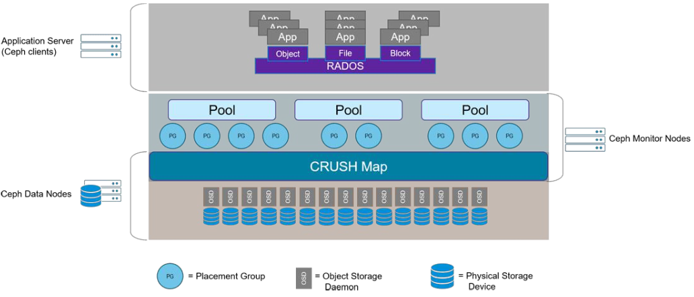

### 4.1 块设备RBD

RBD(RADOS Block Devices)即为块存储的一,RBD通过librbd库与OSD进行交互,RBD为KVM等虚拟化技术和云服务(如OpenStack和CloudStack)提供高性能和无限可扩展性的存储后端,这些系统依赖于libvirt和QEMU实用程序与RBD进行集成,客户端基于librbd库即可将RADOS存储集群用作块设备,不过,用于rbd的存储池需要事先启用rbd功能并进行初始化.例如,下面的命令创建一个名为myrbd1的存储池,并在启用rbd功能后对其进行初始化:

#### 4.1.1 创建RBD

- step1. 创建一个用于块存储的存储池

```
ceph@ceph-deploy-1:~$ ceph osd pool create myrbd1 64 64
pool 'myrbd1' created
```

- step2. 对该存储池启用RBD功能

```
ceph@ceph-deploy-1:~$ ceph osd pool application enable myrbd1 rbd
enabled application 'rbd' on pool 'myrbd1'
```

- step3. 初始化

```
ceph@ceph-deploy-1:~$ rbd pool init -p myrbd1
```

- `-p`:即`--pool`

#### 4.1.2 创建并验证img

rbd存储池并不能直接用于块设备,而是需要事先在其中按需创建映像(image),并把映像文件作为块设备使用,`rbd`命令可用于创建、查看及删除块设备相在的映像(image),以及克隆映像、创建快照、将映像回滚到快照和查看快照等管理操作,例如,下面的命令能够创建一个名为myimg1的映像:

```
ceph@ceph-deploy-1:~$ rbd create myimg1 --size 5G --pool myrbd1
```

镜像并不是所有的服务器都能挂载,因为镜像需要内核支持.上述创建方式没有指定镜像格式,因此使用的是默认格式和默认特性.默认特性有很多,如果内核版本不够新的话会不支持.也可以在创建镜像时指定格式:

```
ceph@ceph-deploy-1:~$ rbd create myimg2 --size 3G --pool myrbd1 --image-format 2 --image-feature layering
```

- `--image-format`:镜像格式
- `--image-feature`:镜像特性

后续会使用到myimg2,由于centos内核版本较低无法挂载,因此只开启部分特性.除layering外,其它特性需要高版本内核支持.

- 列出指定的pool中所有的img

```
ceph@ceph-deploy-1:~$ rbd ls --pool myrbd1
myimg1
myimg2
```

- 查看指定镜像的详细信息

```
ceph@ceph-deploy-1:~$ rbd --image myimg1 --pool myrbd1 info
rbd image 'myimg1':
	size 5 GiB in 1280 objects
	order 22 (4 MiB objects)
	snapshot_count: 0
	id: 8584c69ab2c
	block_name_prefix: rbd_data.8584c69ab2c
	format: 2
	features: layering, exclusive-lock, object-map, fast-diff, deep-flatten
	op_features: 
	flags: 
	create_timestamp: Sat Mar 12 14:21:06 2022
	access_timestamp: Sat Mar 12 14:21:06 2022
	modify_timestamp: Sat Mar 12 14:21:06 2022
```

可以看到,镜像默认的特性除`layering`外,还有很多其他特性.

- `order`:表示对象的大小.其中数字部分表示的是2的多少次方,2^22 Bytes = 4194304Bytes / 1024 = 4096KB / 1024 = 4MB
- `snapshot_count`:快照数量
- `id`:镜像id
- `block_name_prefix`:块名称前缀.向该镜像写入数据时,会加上这个前缀

```
ceph@ceph-deploy-1:~$ rbd --image myimg2 --pool myrbd1 info
rbd image 'myimg2':
	size 3 GiB in 768 objects
	order 22 (4 MiB objects)
	snapshot_count: 0
	id: 858767f37e71
	block_name_prefix: rbd_data.858767f37e71
	format: 2
	features: layering
	op_features: 
	flags: 
	create_timestamp: Sat Mar 12 14:25:43 2022
	access_timestamp: Sat Mar 12 14:25:43 2022
	modify_timestamp: Sat Mar 12 14:25:43 2022
```

#### 4.1.3 客户端使用块存储

##### 4.1.3.1 当前ceph状态

```
ceph@ceph-deploy-1:~$ ceph df
--- RAW STORAGE ---
CLASS     SIZE    AVAIL    USED  RAW USED  %RAW USED
hdd    600 GiB  600 GiB  83 MiB    83 MiB       0.01
TOTAL  600 GiB  600 GiB  83 MiB    83 MiB       0.01
 
--- POOLS ---
POOL                   ID  PGS  STORED  OBJECTS    USED  %USED  MAX AVAIL
device_health_metrics   1    1     0 B        0     0 B      0    190 GiB
mypool                  2   32     0 B        0     0 B      0    190 GiB
myrbd1                  3   64   404 B        7  48 KiB      0    190 GiB
```

其中RAW STORAGE表示软性存储,是ceph底层存储.

##### 4.1.3.2 在客户端安装ceph-common

###### a. ceontos

- step1. 配置yum源

`yum intall epel-release`

`yum install https://mirrors.aliyun.com/ceph/rpm-octopus/el7/noarch/ceph-release-1-1.el7.noarch.rp m -y`

- step2. 安装ceph-common

`yum install ceph-common`

- step3. deploy服务器同步认证文件

```
[ceph@ceph-deploy-1 ceph-cluster]$ scp ceph.conf ceph.client.admin.keyring root@192.168.0.171:/etc/ceph/
```

###### b. Ubuntu

安装ceph-common按上文所述步骤即可.安装完成后将认证文件通过`scp`拷贝到客户端服务器上即可.

##### 4.1.3.3 客户端映射img

```
root@ceph-client-1:~# rbd -p myrbd1 map myimg2
/dev/rbd0
```

映射myimg2是可以的.但映射myimg1就会由于特性不支持的缘故失败:

```
root@ceph-client-1:~# rbd -p myrbd1 map myimg1
rbd: sysfs write failed
RBD image feature set mismatch. You can disable features unsupported by the kernel with "rbd feature disable myrbd1/myimg1 object-map fast-diff deep-flatten".
In some cases useful info is found in syslog - try "dmesg | tail".
rbd: map failed: (6) No such device or address
```

关闭特性后映射:

```
root@ceph-client-1:~# rbd feature disable myrbd1/myimg1 object-map fast-diff deep-flatten
root@ceph-client-1:~# rbd -p myrbd1 map myimg1
/dev/rbd1
```

##### 4.1.3.4 客户端验证RBD

```
root@ceph-client-1:~# lsblk
NAME   MAJ:MIN RM  SIZE RO TYPE MOUNTPOINT
fd0      2:0    1    4K  0 disk 
sda      8:0    0   50G  0 disk 
└─sda1   8:1    0   50G  0 part /
sr0     11:0    1  951M  0 rom  
rbd0   252:0    0    3G  0 disk 
rbd1   252:16   0    5G  0 disk 
```

```
root@ceph-client-1:~# fdisk -l
Disk /dev/sda: 50 GiB, 53687091200 bytes, 104857600 sectors
Units: sectors of 1 * 512 = 512 bytes
Sector size (logical/physical): 512 bytes / 512 bytes
I/O size (minimum/optimal): 512 bytes / 512 bytes
Disklabel type: dos
Disk identifier: 0x8155f5f1

Device     Boot Start       End   Sectors Size Id Type
/dev/sda1  *     2048 104855551 104853504  50G 83 Linux


Disk /dev/rbd0: 3 GiB, 3221225472 bytes, 6291456 sectors
Units: sectors of 1 * 512 = 512 bytes
Sector size (logical/physical): 512 bytes / 512 bytes
I/O size (minimum/optimal): 4194304 bytes / 4194304 bytes


Disk /dev/rbd1: 5 GiB, 5368709120 bytes, 10485760 sectors
Units: sectors of 1 * 512 = 512 bytes
Sector size (logical/physical): 512 bytes / 512 bytes
I/O size (minimum/optimal): 4194304 bytes / 4194304 bytes
```

对于`ceph-client-1`节点来讲,`dev/rbd0`和`dev/rbd1`看起来像是本地磁盘,但实际上是ceph提供的.

##### 4.1.3.5 客户端格式化磁盘并挂载使用

###### a. 格式化

- 将`dev/rbd0`格式化为ext4格式

```
root@ceph-client-1:~# mkfs.ext4 /dev/rbd0
mke2fs 1.44.1 (24-Mar-2018)
Discarding device blocks: done                            
Creating filesystem with 786432 4k blocks and 196608 inodes
Filesystem UUID: ea739bf9-f681-4187-90dd-90040b206940
Superblock backups stored on blocks: 
	32768, 98304, 163840, 229376, 294912

Allocating group tables: done                            
Writing inode tables: done                            
Creating journal (16384 blocks): done
Writing superblocks and filesystem accounting information:      
done
```

- 将`dev/rbd1`格式化为xfs格式

```
root@ceph-client-1:~# mkfs.xfs /dev/rbd1
meta-data=/dev/rbd1              isize=512    agcount=9, agsize=162816 blks
         =                       sectsz=512   attr=2, projid32bit=1
         =                       crc=1        finobt=1, sparse=0, rmapbt=0, reflink=0
data     =                       bsize=4096   blocks=1310720, imaxpct=25
         =                       sunit=1024   swidth=1024 blks
naming   =version 2              bsize=4096   ascii-ci=0 ftype=1
log      =internal log           bsize=4096   blocks=2560, version=2
         =                       sectsz=512   sunit=8 blks, lazy-count=1
realtime =none                   extsz=4096   blocks=0, rtextents=0
```

###### b. 挂载

```
root@ceph-client-1:~# mkdir /mnt/rbd0
root@ceph-client-1:~# mkdir /mnt/rbd1
root@ceph-client-1:~# mount /dev/rbd0 /mnt/rbd0
root@ceph-client-1:~# mount /dev/rbd1 /mnt/rbd1
```

###### c. 查看结果

```
root@ceph-client-1:~# df -TH
Filesystem     Type      Size  Used Avail Use% Mounted on
udev           devtmpfs  1.1G     0  1.1G   0% /dev
tmpfs          tmpfs     210M  5.7M  204M   3% /run
/dev/sda1      ext4       53G  4.9G   46G  10% /
tmpfs          tmpfs     1.1G     0  1.1G   0% /dev/shm
tmpfs          tmpfs     5.3M     0  5.3M   0% /run/lock
tmpfs          tmpfs     1.1G     0  1.1G   0% /sys/fs/cgroup
tmpfs          tmpfs     210M     0  210M   0% /run/user/0
/dev/rbd0      ext4      3.2G  9.5M  3.0G   1% /mnt/rbd0
/dev/rbd1      xfs       5.4G   41M  5.4G   1% /mnt/rbd1
```

后续可以设置MySQL等服务,让这些服务将数据写入到挂载点上,实际上就相当于写入到ceph上了.

##### 4.1.3.6 客户端验证

###### a. 客户端写入

```
root@ceph-client-1:~# ll /var/log/dpkg.log 
-rw-r--r-- 1 root root 559198 Mar 12 22:16 /var/log/dpkg.log
root@ceph-client-1:~# cp /var/log/dpkg.log /mnt/rbd0
```

###### b. 在deploy上查看

```
ceph@ceph-deploy-1:~/ceph-cluster$ ceph df
--- RAW STORAGE ---
CLASS     SIZE    AVAIL     USED  RAW USED  %RAW USED
hdd    600 GiB  600 GiB  320 MiB   320 MiB       0.05
TOTAL  600 GiB  600 GiB  320 MiB   320 MiB       0.05
 
--- POOLS ---
POOL                   ID  PGS  STORED  OBJECTS     USED  %USED  MAX AVAIL
device_health_metrics   1    1     0 B        0      0 B      0    190 GiB
mypool                  2   32     0 B        0      0 B      0    190 GiB
myrbd1                  3   64  77 MiB       44  230 MiB   0.04    190 GiB
```

##### 4.1.3.7 ceph验证数据

```
ceph@ceph-deploy-1:~/ceph-cluster$ ceph df
--- RAW STORAGE ---
CLASS     SIZE    AVAIL     USED  RAW USED  %RAW USED
hdd    600 GiB  600 GiB  320 MiB   320 MiB       0.05
TOTAL  600 GiB  600 GiB  320 MiB   320 MiB       0.05
 
--- POOLS ---
POOL                   ID  PGS  STORED  OBJECTS     USED  %USED  MAX AVAIL
device_health_metrics   1    1     0 B        0      0 B      0    190 GiB
mypool                  2   32     0 B        0      0 B      0    190 GiB
myrbd1                  3   64  77 MiB       44  230 MiB   0.04    190 GiB
```

### 4.2 ceph radosgw(RGW)对象存储

RGW提供的是REST接口,客户端通过http与其进行交互,完成数据的增删改查等管理操作.

radosgw用在需要使用RESTful API接口访问ceph数据的场合,因此在使用RBD即块存储的场合或者使用cephFS的场合可以不用启用radosgw功能.

#### 4.2.1 部署radosgw服务

- step1. 安装

##### a. Ubuntu

在`ceph-mgr-1`节点上,安装radosgw

```
root@ceph-mgr-1:~# apt-cache madison radosgw
   radosgw | 16.2.7-1bionic | https://mirrors.tuna.tsinghua.edu.cn/ceph/debian-pacific bionic/main amd64 Packages
   radosgw | 12.2.13-0ubuntu0.18.04.10 | http://mirrors.aliyun.com/ubuntu bionic-security/main amd64 Packages
   radosgw | 12.2.13-0ubuntu0.18.04.10 | http://mirrors.aliyun.com/ubuntu bionic-updates/main amd64 Packages
   radosgw | 12.2.4-0ubuntu1 | http://mirrors.aliyun.com/ubuntu bionic/main amd64 Packages
      ceph | 12.2.4-0ubuntu1 | http://mirrors.aliyun.com/ubuntu bionic/main Sources
      ceph | 12.2.13-0ubuntu0.18.04.10 | http://mirrors.aliyun.com/ubuntu bionic-security/main Sources
      ceph | 12.2.13-0ubuntu0.18.04.10 | http://mirrors.aliyun.com/ubuntu bionic-updates/main Sources
```

```
root@ceph-mgr-1:~# apt install radosgw
Reading package lists... Done
Building dependency tree       
Reading state information... Done
The following NEW packages will be installed:
  radosgw
0 upgraded, 1 newly installed, 0 to remove and 180 not upgraded.
Need to get 10.5 MB of archives.
After this operation, 41.1 MB of additional disk space will be used.
Get:1 https://mirrors.tuna.tsinghua.edu.cn/ceph/debian-pacific bionic/main amd64 radosgw amd64 16.2.7-1bionic [10.5 MB]
Fetched 10.5 MB in 5s (2,153 kB/s)                           
Selecting previously unselected package radosgw.
(Reading database ... 99285 files and directories currently installed.)
Preparing to unpack .../radosgw_16.2.7-1bionic_amd64.deb ...
Unpacking radosgw (16.2.7-1bionic) ...
Setting up radosgw (16.2.7-1bionic) ...
Created symlink /etc/systemd/system/multi-user.target.wants/ceph-radosgw.target → /lib/systemd/system/ceph-radosgw.target.
Created symlink /etc/systemd/system/ceph.target.wants/ceph-radosgw.target → /lib/systemd/system/ceph-radosgw.target.
Processing triggers for libc-bin (2.27-3ubuntu1.2) ...
Processing triggers for systemd (237-3ubuntu10.42) ...
Processing triggers for man-db (2.8.3-2ubuntu0.1) ...
Processing triggers for ureadahead (0.100.0-21) ...
```

##### b. Centos

执行`yum install radosgw`即可

- step2. 启动

在`ceph-deploy-1`节点上,执行如下命令,创建rgw:

```
ceph@ceph-deploy-1:~/ceph-cluster$ ceph-deploy --overwrite-conf rgw create ceph-mgr-1
[ceph_deploy.conf][DEBUG ] found configuration file at: /home/ceph/.cephdeploy.conf
[ceph_deploy.cli][INFO  ] Invoked (2.0.1): /usr/bin/ceph-deploy --overwrite-conf rgw create ceph-mgr-1
[ceph_deploy.cli][INFO  ] ceph-deploy options:
[ceph_deploy.cli][INFO  ]  username                      : None
[ceph_deploy.cli][INFO  ]  verbose                       : False
[ceph_deploy.cli][INFO  ]  rgw                           : [('ceph-mgr-1', 'rgw.ceph-mgr-1')]
[ceph_deploy.cli][INFO  ]  overwrite_conf                : True
[ceph_deploy.cli][INFO  ]  subcommand                    : create
[ceph_deploy.cli][INFO  ]  quiet                         : False
[ceph_deploy.cli][INFO  ]  cd_conf                       : <ceph_deploy.conf.cephdeploy.Conf instance at 0x7f37dfbc1f00>
[ceph_deploy.cli][INFO  ]  cluster                       : ceph
[ceph_deploy.cli][INFO  ]  func                          : <function rgw at 0x7f37e046c750>
[ceph_deploy.cli][INFO  ]  ceph_conf                     : None
[ceph_deploy.cli][INFO  ]  default_release               : False
[ceph_deploy.rgw][DEBUG ] Deploying rgw, cluster ceph hosts ceph-mgr-1:rgw.ceph-mgr-1
[ceph-mgr-1][DEBUG ] connection detected need for sudo
[ceph-mgr-1][DEBUG ] connected to host: ceph-mgr-1 
[ceph-mgr-1][DEBUG ] detect platform information from remote host
[ceph-mgr-1][DEBUG ] detect machine type
[ceph_deploy.rgw][INFO  ] Distro info: Ubuntu 18.04 bionic
[ceph_deploy.rgw][DEBUG ] remote host will use systemd
[ceph_deploy.rgw][DEBUG ] deploying rgw bootstrap to ceph-mgr-1
[ceph-mgr-1][DEBUG ] write cluster configuration to /etc/ceph/{cluster}.conf
[ceph-mgr-1][WARNIN] rgw keyring does not exist yet, creating one
[ceph-mgr-1][DEBUG ] create a keyring file
[ceph-mgr-1][DEBUG ] create path recursively if it doesn't exist
[ceph-mgr-1][INFO  ] Running command: sudo ceph --cluster ceph --name client.bootstrap-rgw --keyring /var/lib/ceph/bootstrap-rgw/ceph.keyring auth get-or-create client.rgw.ceph-mgr-1 osd allow rwx mon allow rw -o /var/lib/ceph/radosgw/ceph-rgw.ceph-mgr-1/keyring
[ceph-mgr-1][INFO  ] Running command: sudo systemctl enable ceph-radosgw@rgw.ceph-mgr-1
[ceph-mgr-1][WARNIN] Created symlink /etc/systemd/system/ceph-radosgw.target.wants/ceph-radosgw@rgw.ceph-mgr-1.service → /lib/systemd/system/ceph-radosgw@.service.
[ceph-mgr-1][INFO  ] Running command: sudo systemctl start ceph-radosgw@rgw.ceph-mgr-1
[ceph-mgr-1][INFO  ] Running command: sudo systemctl enable ceph.target
[ceph_deploy.rgw][INFO  ] The Ceph Object Gateway (RGW) is now running on host ceph-mgr-1 and default port 7480
```

- `--overwrite-conf`:在远程主机上覆盖已有的配置文件

在`ceph-mgr-1`节点上查看:

```
root@ceph-mgr-1:~# ll /etc/ceph
total 20
drwxr-xr-x   2 root root 4096 Mar 14 10:16 ./
drwxr-xr-x 110 root root 4096 Mar 14 10:12 ../
-rw-------   1 root root  151 Mar 11 16:57 ceph.client.admin.keyring
-rw-r--r--   1 root root  265 Mar 14 10:16 ceph.conf
-rw-r--r--   1 root root   92 Dec  8 00:26 rbdmap
-rw-------   1 root root    0 Mar  9 11:30 tmpeZn0GA
```

可以看到,配置文件`ceph.conf`是被更新过的

注:rgw服务默认监听端口为7480

```
root@ceph-mgr-1:~# ss -tnl
State    Recv-Q    Send-Q        Local Address:Port        Peer Address:Port    
LISTEN   0         128           127.0.0.53%lo:53               0.0.0.0:*       
LISTEN   0         128                 0.0.0.0:22               0.0.0.0:*       
LISTEN   0         128                 0.0.0.0:7480             0.0.0.0:*       
LISTEN   0         100                 0.0.0.0:25               0.0.0.0:*       
LISTEN   0         128               127.0.0.1:39741            0.0.0.0:*       
LISTEN   0         128           192.168.0.168:6800             0.0.0.0:*       
LISTEN   0         128           192.168.0.168:6801             0.0.0.0:*       
LISTEN   0         128                    [::]:22                  [::]:*       
LISTEN   0         128                    [::]:7480                [::]:*       
LISTEN   0         100                    [::]:25                  [::]:* 
```

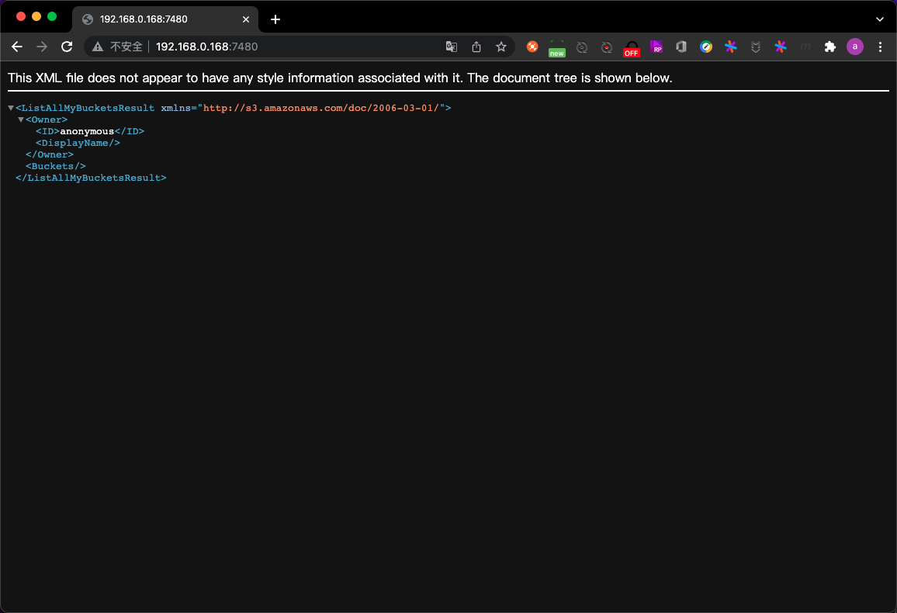

#### 4.2.2 验证raodsgw服务

```
root@ceph-mgr-1:~# ps -aux|grep radosgw
ceph      2716  0.5  5.6 6277268 56764 ?       Ssl  10:16   0:01 /usr/bin/radosgw -f --cluster ceph --name client.rgw.ceph-mgr-1 --setuser ceph --setgroup ceph
root      3397  0.0  0.1  14436  1112 pts/0    S+   10:22   0:00 grep --color=auto radosgw
```

#### 4.2.3 验证ceph状态

```
ceph@ceph-deploy-1:~/ceph-cluster$ ceph -s
  cluster:
    id:     ca4d26ca-9a65-42a0-b61c-991e96d81b62
    health: HEALTH_OK
 
  services:
    mon: 3 daemons, quorum ceph-mon-1,ceph-mon-2,ceph-mon-3 (age 52m)
    mgr: ceph-mgr-1(active, since 50m), standbys: ceph-mgr-2
    osd: 12 osds: 12 up (since 54m), 12 in (since 4d)
    rgw: 1 daemon active (1 hosts, 1 zones)
 
  data:
    pools:   7 pools, 201 pgs
    objects: 233 objects, 92 MiB
    usage:   431 MiB used, 600 GiB / 600 GiB avail
    pgs:     201 active+clean
```

可以看到,rgw服务已经处于active状态了

#### 4.2.4 验证radosgw存储池

初始化完成radosgw之后,会初始化默认的存储池如下:

```
ceph@ceph-deploy-1:~/ceph-cluster$ ceph osd pool ls
device_health_metrics
mypool
myrbd1
.rgw.root
default.rgw.log
default.rgw.control
default.rgw.meta
```


