# day10-kubernetes

## PART1. K8S Pod版本更新流程及命令行实现升级与回滚

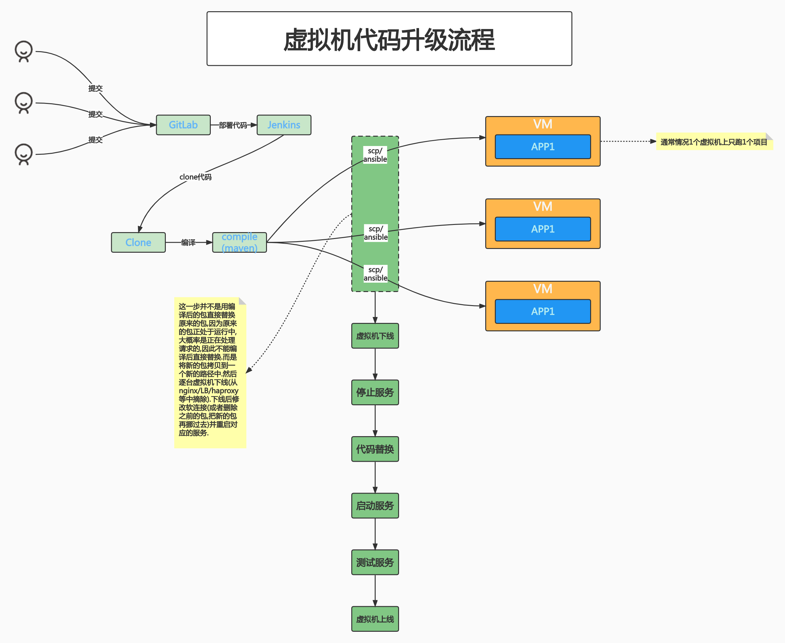

通常这种部署是灰度的,也就是说,并不是一次将3台VM都更新成新版本的代码,而是先更新一部分.观察这一部分的运行情况,确认运行起来是没有bug的,再将其他VM的代码也更新为新版本的.若发现新版本的代码是有问题的,则将更新的这部分VM回退到旧版本的代码.

[K8S中的代码升级流程](https://kubernetes.io/zh/docs/tutorials/kubernetes-basics/update/update-intro/)

[金丝雀部署](https://kubernetes.io/zh/docs/concepts/workloads/controllers/deployment/#canary-deployment)

### 1.1 灰度发布案例

此处以之前部署的nginx为例,演示灰度发布.

- step1. 修改nginx的配置,使其有多个Pod,方便后续演示

```
root@k8s-master-1:/# cd ~/k8s-data/nginx-webapp-yaml/
root@k8s-master-1:~/k8s-data/nginx-webapp-yaml# vim nginx-webapp-deployment.yaml
root@k8s-master-1:~/k8s-data/nginx-webapp-yaml# cat nginx-webapp-deployment.yaml
```

```yaml
kind: Deployment
apiVersion: apps/v1
metadata:
  labels:
    app: erp-nginx-webapp-deployment-label
  name: erp-nginx-webapp-deployment
  namespace: erp
spec:
  replicas: 3
  selector:
    matchLabels:
      app: erp-nginx-webapp-selector
  template:
    metadata:
      labels:
        app: erp-nginx-webapp-selector
    spec:
      containers:
        - name: erp-nginx-webapp-container
          image: harbor.k8s.com/erp/nginx-webapp:v3
          imagePullPolicy: Always
          ports:
            - containerPort: 80
              protocol: TCP
              name: http
            - containerPort: 443
              protocol: TCP
              name: https
          resources:
            limits:
              cpu: 300m
              memory: 256Mi
            requests:
              cpu: 200m
              memory: 128Mi
          volumeMounts:
            - name: nginx-webapp-images
              # 此处的挂载点是打镜像时创建的路径
              mountPath: /usr/local/nginx/html/webapp/images
              readOnly: false
            - name: nginx-webapp-static
              # 此处的挂载点是打镜像时创建的路径
              mountPath: /usr/local/nginx/html/webapp/static
              readOnly: false
      volumes:
        - name: nginx-webapp-images
          nfs:
            server: 172.16.1.189
            path: /data/k8sdata/nginx-webapp/images
        - name: nginx-webapp-static
          nfs:
            server: 172.16.1.189
            path: /data/k8sdata/nginx-webapp/static
```

```
root@k8s-master-1:~/k8s-data/nginx-webapp-yaml# kubectl apply -f nginx-webapp-deployment.yaml 
deployment.apps/erp-nginx-webapp-deployment configured
root@k8s-master-1:~/k8s-data/nginx-webapp-yaml# kubectl get pod -n erp
NAME                                            READY   STATUS    RESTARTS   AGE
dubbo-admin-deploy-697654f7d9-vh22h             1/1     Running   1          3h13m
erp-consumer-deployment-79d5876d79-szs9z        1/1     Running   0          3h13m
erp-jenkins-deployment-696696cb65-jwvp2         1/1     Running   0          3h13m
erp-nginx-webapp-deployment-65fb86d9f6-h6l5c    1/1     Running   1          3h13m
erp-nginx-webapp-deployment-65fb86d9f6-kzc8g    1/1     Running   0          38s
erp-nginx-webapp-deployment-65fb86d9f6-nmv8f    1/1     Running   0          38s
erp-provider-deployment-747df899c4-w8nqc        1/1     Running   0          3h13m
erp-tomcat-webapp-deployment-84bbf6b865-99x8f   1/1     Running   0          3h13m
erp-tomcat-webapp-deployment-84bbf6b865-jtz6m   1/1     Running   0          3h13m
mysql-0                                         2/2     Running   0          3h13m
mysql-1                                         2/2     Running   0          3h10m
mysql-2                                         2/2     Running   0          3h9m
redis-deployment-6d85975b47-9n6gp               1/1     Running   0          3h13m
wordpress-app-deployment-7fcb55bd59-4fpxj       2/2     Running   0          3h13m
zookeeper1-7ff6fbfbf-spw6l                      1/1     Running   0          3h13m
zookeeper2-94cfd4596-7rzjq                      1/1     Running   0          3h13m
zookeeper3-7f55657779-bppxr                     1/1     Running   0          3h13m
```

可以看到,`erp-nginx-webapp-deployment`现在有3个副本了.注意现在的RS为`65fb86d9f6`

- step2. 拉取一个不同版本的nginx镜像并上传至harbor

```
root@ks8-harbor-2:~# docker pull nginx:1.22.0
1.22.0: Pulling from library/nginx
42c077c10790: Pull complete 
dedc95281b4f: Pull complete 
919c6c8c0471: Pull complete 
7075bb870b9e: Pull complete 
e93f5d620ba9: Pull complete 
90a8adeea75b: Pull complete 
Digest: sha256:f00db45b878cd3c18671bcb062fce4bfb365b82fd97d89dfaff2ab7b9fb66b80
Status: Downloaded newer image for nginx:1.22.0
docker.io/library/nginx:1.22.0
root@ks8-harbor-2:~# docker tag nginx:1.22.0 harbor.k8s.com/erp/nginx:1.22.0
root@ks8-harbor-2:~# docker push harbor.k8s.com/erp/nginx:1.22.0
The push refers to repository [harbor.k8s.com/erp/nginx]
b470eef4f5d8: Pushed 
043c34f72e3d: Pushed 
daef241ddc79: Pushed 
53ae93fa7fcc: Pushed 
e83a53e226df: Pushed 
ad6562704f37: Pushed 
1.22.0: digest: sha256:62accd5c832bf46871dfd604f86db86a8d2e0e9e4a376c4a05469718a56702d4 size: 1570
```

- step3. 更新Pod

注:更新镜像的命令格式为:`kubectl set image 资源类型/资源名称 容器名称=新镜像地址 -n 命名空间名称`

注:`deployment.spec.strategy.rollingUpdate.maxSurge`参数用于控制在更新镜像版本期间,可以临时创建出比副本数多百分之多少(或个数)的pod,若百分比则计算具体数值时向上取整

注:`deployment.spec.strategy.rollingUpdate.maxUnavailable`参数用于指定在升级期间最⼤不可⽤的pod数,可
以是整数或者当前pod的百分⽐,默认是25%.

注:以上两个值不能同时为0,如果`maxUnavailable`最⼤不可⽤pod为0且`maxSurge`超出pod数也为0,那么将
会导致pod⽆法进⾏滚动更新.

这两个参数是可以通过`kubectl describe deployment`查看到的:

```
root@k8s-master-1:~/k8s-data/nginx-webapp-yaml# kubectl describe deployment erp-nginx-webapp-deployment -n erp
Name:                   erp-nginx-webapp-deployment
Namespace:              erp
CreationTimestamp:      Wed, 27 Apr 2022 02:04:03 +0800
Labels:                 app=erp-nginx-webapp-deployment-label
Annotations:            deployment.kubernetes.io/revision: 3
Selector:               app=erp-nginx-webapp-selector
Replicas:               3 desired | 3 updated | 3 total | 3 available | 0 unavailable
StrategyType:           RollingUpdate
MinReadySeconds:        0
RollingUpdateStrategy:  25% max unavailable, 25% max surge
Pod Template:
  Labels:  app=erp-nginx-webapp-selector
  Containers:
   erp-nginx-webapp-container:
    Image:       harbor.k8s.com/erp/nginx-webapp:v3
    Ports:       80/TCP, 443/TCP
    Host Ports:  0/TCP, 0/TCP
    Limits:
      cpu:     300m
      memory:  256Mi
    Requests:
      cpu:        200m
      memory:     128Mi
    Environment:  <none>
    Mounts:
      /usr/local/nginx/html/webapp/images from nginx-webapp-images (rw)
      /usr/local/nginx/html/webapp/static from nginx-webapp-static (rw)
  Volumes:
   nginx-webapp-images:
    Type:      NFS (an NFS mount that lasts the lifetime of a pod)
    Server:    172.16.1.189
    Path:      /data/k8sdata/nginx-webapp/images
    ReadOnly:  false
   nginx-webapp-static:
    Type:      NFS (an NFS mount that lasts the lifetime of a pod)
    Server:    172.16.1.189
    Path:      /data/k8sdata/nginx-webapp/static
    ReadOnly:  false
Conditions:
  Type           Status  Reason
  ----           ------  ------
  Progressing    True    NewReplicaSetAvailable
  Available      True    MinimumReplicasAvailable
OldReplicaSets:  <none>
NewReplicaSet:   erp-nginx-webapp-deployment-65fb86d9f6 (3/3 replicas created)
Events:
  Type    Reason             Age   From                   Message
  ----    ------             ----  ----                   -------
  Normal  ScalingReplicaSet  40m   deployment-controller  Scaled up replica set erp-nginx-webapp-deployment-65fb86d9f6 to 3
```

描述信息中的`RollingUpdateStrategy`,即为滚动升级策略中,关于`maxUnavailable`和`maxSurge`相关的参数.

更新Pod:

```
root@k8s-master-1:~/k8s-data/nginx-webapp-yaml# kubectl set image deployment/erp-nginx-webapp-deployment erp-nginx-webapp-container=harbor.k8s.com/erp/nginx:1.22.0 -n erp
deployment.apps/erp-nginx-webapp-deployment image updated
```

```
root@k8s-master-1:~/k8s-data/nginx-webapp-yaml# kubectl get pod -n erp
NAME                                            READY   STATUS    RESTARTS   AGE
dubbo-admin-deploy-697654f7d9-vh22h             1/1     Running   1          3h59m
erp-consumer-deployment-79d5876d79-szs9z        1/1     Running   0          3h59m
erp-jenkins-deployment-696696cb65-jwvp2         1/1     Running   0          3h59m
erp-nginx-webapp-deployment-86699ff9f6-kf6sn    1/1     Running   0          87s
erp-nginx-webapp-deployment-86699ff9f6-krdhc    1/1     Running   0          91s
erp-nginx-webapp-deployment-86699ff9f6-w7xx8    1/1     Running   0          82s
erp-provider-deployment-747df899c4-w8nqc        1/1     Running   0          3h59m
erp-tomcat-webapp-deployment-84bbf6b865-99x8f   1/1     Running   0          3h59m
erp-tomcat-webapp-deployment-84bbf6b865-jtz6m   1/1     Running   0          3h59m
mysql-0                                         2/2     Running   0          3h59m
mysql-1                                         2/2     Running   0          3h56m
mysql-2                                         2/2     Running   0          3h55m
redis-deployment-6d85975b47-9n6gp               1/1     Running   0          3h59m
wordpress-app-deployment-7fcb55bd59-4fpxj       2/2     Running   0          3h59m
zookeeper1-7ff6fbfbf-spw6l                      1/1     Running   0          3h59m
zookeeper2-94cfd4596-7rzjq                      1/1     Running   0          3h59m
zookeeper3-7f55657779-bppxr                     1/1     Running   0          3h59m
```

可以看到,更新后的RS为`86699ff9f6`.

```
root@k8s-master-1:~/k8s-data/nginx-webapp-yaml# kubectl get rs -n erp
NAME                                      DESIRED   CURRENT   READY   AGE
dubbo-admin-deploy-697654f7d9             1         1         1       9d
erp-consumer-deployment-79d5876d79        1         1         1       9d
erp-jenkins-deployment-696696cb65         1         1         1       9d
erp-nginx-webapp-deployment-5584658db     0         0         0       33d
erp-nginx-webapp-deployment-65fb86d9f6    0         0         0       19d
erp-nginx-webapp-deployment-699bc7887f    0         0         0       33d
erp-nginx-webapp-deployment-86699ff9f6    3         3         3       2m33s
erp-provider-deployment-747df899c4        1         1         1       9d
erp-tomcat-webapp-deployment-84bbf6b865   2         2         2       19d
redis-deployment-6d85975b47               1         1         1       13d
wordpress-app-deployment-7fcb55bd59       1         1         1       9d
zookeeper1-7ff6fbfbf                      1         1         1       33d
zookeeper2-94cfd4596                      1         1         1       33d
zookeeper3-7f55657779                     1         1         1       33d
```

可以看到,旧的RS也没有被删除掉.不删除旧的RS,是为了便于回滚.

- step4. 再将镜像换成之前的版本

```
root@k8s-master-1:~/k8s-data/nginx-webapp-yaml# kubectl set image deployment/erp-nginx-webapp-deployment erp-nginx-webapp-container=harbor.k8s.com/erp/nginx-webapp:v3 -n erp --record
deployment.apps/erp-nginx-webapp-deployment image updated
```

注:`--record`参数表示记录升级过程

```
root@k8s-master-1:~/k8s-data/nginx-webapp-yaml# kubectl get pod -n erp
NAME                                            READY   STATUS              RESTARTS   AGE
dubbo-admin-deploy-697654f7d9-vh22h             1/1     Running             1          4h2m
erp-consumer-deployment-79d5876d79-szs9z        1/1     Running             0          4h2m
erp-jenkins-deployment-696696cb65-jwvp2         1/1     Running             0          4h2m
erp-nginx-webapp-deployment-65fb86d9f6-2dkl9    1/1     Running             0          3s
erp-nginx-webapp-deployment-65fb86d9f6-46dbt    1/1     Running             0          6s
erp-nginx-webapp-deployment-65fb86d9f6-58lq8    0/1     ContainerCreating   0          1s
erp-nginx-webapp-deployment-86699ff9f6-kf6sn    1/1     Running             0          4m20s
erp-nginx-webapp-deployment-86699ff9f6-krdhc    0/1     Terminating         0          4m24s
erp-provider-deployment-747df899c4-w8nqc        1/1     Running             0          4h2m
erp-tomcat-webapp-deployment-84bbf6b865-99x8f   1/1     Running             0          4h2m
erp-tomcat-webapp-deployment-84bbf6b865-jtz6m   1/1     Running             0          4h2m
mysql-0                                         2/2     Running             0          4h2m
mysql-1                                         2/2     Running             0          3h59m
mysql-2                                         2/2     Running             0          3h58m
redis-deployment-6d85975b47-9n6gp               1/1     Running             0          4h2m
wordpress-app-deployment-7fcb55bd59-4fpxj       2/2     Running             0          4h2m
zookeeper1-7ff6fbfbf-spw6l                      1/1     Running             0          4h2m
zookeeper2-94cfd4596-7rzjq                      1/1     Running             0          4h2m
zookeeper3-7f55657779-bppxr                     1/1     Running             0          4h2m
```

```
root@k8s-master-1:~/k8s-data/nginx-webapp-yaml# kubectl get pod -n erp
NAME                                            READY   STATUS        RESTARTS   AGE
dubbo-admin-deploy-697654f7d9-vh22h             1/1     Running       1          4h2m
erp-consumer-deployment-79d5876d79-szs9z        1/1     Running       0          4h2m
erp-jenkins-deployment-696696cb65-jwvp2         1/1     Running       0          4h2m
erp-nginx-webapp-deployment-65fb86d9f6-2dkl9    1/1     Running       0          7s
erp-nginx-webapp-deployment-65fb86d9f6-46dbt    1/1     Running       0          10s
erp-nginx-webapp-deployment-65fb86d9f6-58lq8    1/1     Running       0          5s
erp-nginx-webapp-deployment-86699ff9f6-kf6sn    0/1     Terminating   0          4m24s
erp-provider-deployment-747df899c4-w8nqc        1/1     Running       0          4h2m
erp-tomcat-webapp-deployment-84bbf6b865-99x8f   1/1     Running       0          4h2m
erp-tomcat-webapp-deployment-84bbf6b865-jtz6m   1/1     Running       0          4h2m
mysql-0                                         2/2     Running       0          4h2m
mysql-1                                         2/2     Running       0          3h59m
mysql-2                                         2/2     Running       0          3h58m
redis-deployment-6d85975b47-9n6gp               1/1     Running       0          4h2m
wordpress-app-deployment-7fcb55bd59-4fpxj       2/2     Running       0          4h2m
zookeeper1-7ff6fbfbf-spw6l                      1/1     Running       0          4h2m
zookeeper2-94cfd4596-7rzjq                      1/1     Running       0          4h2m
zookeeper3-7f55657779-bppxr                     1/1     Running       0          4h2m
```

```
root@k8s-master-1:~/k8s-data/nginx-webapp-yaml# kubectl get pod -n erp
NAME                                            READY   STATUS    RESTARTS   AGE
dubbo-admin-deploy-697654f7d9-vh22h             1/1     Running   1          4h3m
erp-consumer-deployment-79d5876d79-szs9z        1/1     Running   0          4h3m
erp-jenkins-deployment-696696cb65-jwvp2         1/1     Running   0          4h3m
erp-nginx-webapp-deployment-65fb86d9f6-2dkl9    1/1     Running   0          63s
erp-nginx-webapp-deployment-65fb86d9f6-46dbt    1/1     Running   0          66s
erp-nginx-webapp-deployment-65fb86d9f6-58lq8    1/1     Running   0          61s
erp-provider-deployment-747df899c4-w8nqc        1/1     Running   0          4h3m
erp-tomcat-webapp-deployment-84bbf6b865-99x8f   1/1     Running   0          4h3m
erp-tomcat-webapp-deployment-84bbf6b865-jtz6m   1/1     Running   0          4h3m
mysql-0                                         2/2     Running   0          4h3m
mysql-1                                         2/2     Running   0          4h
mysql-2                                         2/2     Running   0          3h59m
redis-deployment-6d85975b47-9n6gp               1/1     Running   0          4h3m
wordpress-app-deployment-7fcb55bd59-4fpxj       2/2     Running   0          4h3m
zookeeper1-7ff6fbfbf-spw6l                      1/1     Running   0          4h3m
zookeeper2-94cfd4596-7rzjq                      1/1     Running   0          4h3m
zookeeper3-7f55657779-bppxr                     1/1     Running   0          4h3m
```

可以看到,更新的过程是逐个替换的,而非直接将3个Pod都更新成新版本的镜像.

### 1.2 查看deployement的版本信息

```
root@k8s-master-1:~/k8s-data/nginx-webapp-yaml# kubectl rollout history deployment/erp-nginx-webapp-deployment -n erp
deployment.apps/erp-nginx-webapp-deployment 
REVISION  CHANGE-CAUSE
1         <none>
2         <none>
6         <none>
7         kubectl set image deployment/erp-nginx-webapp-deployment erp-nginx-webapp-container=harbor.k8s.com/erp/nginx-webapp:v3 --namespace=erp --record=true
```

此处提供的版本信息,可以用于回滚.

```
root@k8s-master-1:~/k8s-data/nginx-webapp-yaml# kubectl rollout history deployment/erp-nginx-webapp-deployment -n erp --revision=2
deployment.apps/erp-nginx-webapp-deployment with revision #2
Pod Template:
  Labels:	app=erp-nginx-webapp-selector
	pod-template-hash=699bc7887f
  Containers:
   erp-nginx-webapp-container:
    Image:	harbor.k8s.com/erp/nginx-webapp:v2
    Ports:	80/TCP, 443/TCP
    Host Ports:	0/TCP, 0/TCP
    Limits:
      cpu:	300m
      memory:	256Mi
    Requests:
      cpu:	200m
      memory:	128Mi
    Environment:	<none>
    Mounts:
      /usr/local/nginx/html/webapp/images from nginx-webapp-images (rw)
      /usr/local/nginx/html/webapp/static from nginx-webapp-static (rw)
  Volumes:
   nginx-webapp-images:
    Type:	NFS (an NFS mount that lasts the lifetime of a pod)
    Server:	172.16.1.189
    Path:	/data/k8sdata/nginx-webapp/images
    ReadOnly:	false
   nginx-webapp-static:
    Type:	NFS (an NFS mount that lasts the lifetime of a pod)
    Server:	172.16.1.189
    Path:	/data/k8sdata/nginx-webapp/static
    ReadOnly:	false
```

注:`--revision`参数可以查看指定版本的详细信息.且K8S是根据镜像来记录Deployment版本信息的,而非是根据执行`kubectl set image`命令的次数来记录的.

### 1.3 回滚到上一个版本

- step1. 查看Pod中当前镜像版本及历史更新信息

```
root@k8s-master-1:~/k8s-data/nginx-webapp-yaml# kubectl get pod -n erp
NAME                                            READY   STATUS    RESTARTS   AGE
dubbo-admin-deploy-697654f7d9-vh22h             1/1     Running   1          4h26m
erp-consumer-deployment-79d5876d79-szs9z        1/1     Running   0          4h26m
erp-jenkins-deployment-696696cb65-jwvp2         1/1     Running   0          4h26m
erp-nginx-webapp-deployment-65fb86d9f6-74fw7    1/1     Running   0          113s
erp-nginx-webapp-deployment-65fb86d9f6-cfn4g    1/1     Running   0          111s
erp-nginx-webapp-deployment-65fb86d9f6-nv5z7    1/1     Running   0          116s
erp-provider-deployment-747df899c4-w8nqc        1/1     Running   0          4h26m
erp-tomcat-webapp-deployment-84bbf6b865-99x8f   1/1     Running   0          4h26m
erp-tomcat-webapp-deployment-84bbf6b865-jtz6m   1/1     Running   0          4h26m
mysql-0                                         2/2     Running   0          4h26m
mysql-1                                         2/2     Running   0          4h22m
mysql-2                                         2/2     Running   0          4h22m
redis-deployment-6d85975b47-9n6gp               1/1     Running   0          4h26m
wordpress-app-deployment-7fcb55bd59-4fpxj       2/2     Running   0          4h26m
zookeeper1-7ff6fbfbf-spw6l                      1/1     Running   0          4h26m
zookeeper2-94cfd4596-7rzjq                      1/1     Running   0          4h26m
zookeeper3-7f55657779-bppxr                     1/1     Running   0          4h26m
```

```
root@k8s-master-1:~/k8s-data/nginx-webapp-yaml# kubectl describe pod erp-nginx-webapp-deployment-65fb86d9f6-74fw7 -n erp
Name:         erp-nginx-webapp-deployment-65fb86d9f6-74fw7
Namespace:    erp
Priority:     0
Node:         192.168.0.193/192.168.0.193
Start Time:   Mon, 30 May 2022 11:13:42 +0800
Labels:       app=erp-nginx-webapp-selector
              pod-template-hash=65fb86d9f6
Annotations:  <none>
Status:       Running
IP:           10.200.76.180
IPs:
  IP:           10.200.76.180
Controlled By:  ReplicaSet/erp-nginx-webapp-deployment-65fb86d9f6
Containers:
  erp-nginx-webapp-container:
    Container ID:   docker://7682c4e2087a8be8fc0c00b7f8aef12d9fb52baed769076c4af749b617d26926
    Image:          harbor.k8s.com/erp/nginx-webapp:v3
    Image ID:       docker-pullable://harbor.k8s.com/erp/nginx-webapp@sha256:587d0e0fd196e0bf931bcc2a19fb41d50c0a2ec74acfd674ab6b87ab9e08277c
    Ports:          80/TCP, 443/TCP
    Host Ports:     0/TCP, 0/TCP
    State:          Running
      Started:      Mon, 30 May 2022 11:13:43 +0800
    Ready:          True
    Restart Count:  0
    Limits:
      cpu:     300m
      memory:  256Mi
    Requests:
      cpu:        200m
      memory:     128Mi
    Environment:  <none>
    Mounts:
      /usr/local/nginx/html/webapp/images from nginx-webapp-images (rw)
      /usr/local/nginx/html/webapp/static from nginx-webapp-static (rw)
      /var/run/secrets/kubernetes.io/serviceaccount from kube-api-access-w95lw (ro)
Conditions:
  Type              Status
  Initialized       True 
  Ready             True 
  ContainersReady   True 
  PodScheduled      True 
Volumes:
  nginx-webapp-images:
    Type:      NFS (an NFS mount that lasts the lifetime of a pod)
    Server:    172.16.1.189
    Path:      /data/k8sdata/nginx-webapp/images
    ReadOnly:  false
  nginx-webapp-static:
    Type:      NFS (an NFS mount that lasts the lifetime of a pod)
    Server:    172.16.1.189
    Path:      /data/k8sdata/nginx-webapp/static
    ReadOnly:  false
  kube-api-access-w95lw:
    Type:                    Projected (a volume that contains injected data from multiple sources)
    TokenExpirationSeconds:  3607
    ConfigMapName:           kube-root-ca.crt
    ConfigMapOptional:       <nil>
    DownwardAPI:             true
QoS Class:                   Burstable
Node-Selectors:              <none>
Tolerations:                 node.kubernetes.io/not-ready:NoExecute op=Exists for 300s
                             node.kubernetes.io/unreachable:NoExecute op=Exists for 300s
Events:
  Type    Reason     Age   From               Message
  ----    ------     ----  ----               -------
  Normal  Scheduled  2m7s  default-scheduler  Successfully assigned erp/erp-nginx-webapp-deployment-65fb86d9f6-74fw7 to 192.168.0.193
  Normal  Pulling    2m6s  kubelet            Pulling image "harbor.k8s.com/erp/nginx-webapp:v3"
  Normal  Pulled     2m6s  kubelet            Successfully pulled image "harbor.k8s.com/erp/nginx-webapp:v3" in 26.42922ms
  Normal  Created    2m6s  kubelet            Created container erp-nginx-webapp-container
  Normal  Started    2m6s  kubelet            Started container erp-nginx-webapp-container
```

```
root@k8s-master-1:~/k8s-data/nginx-webapp-yaml# kubectl rollout history deployment/erp-nginx-webapp-deployment -n erp
deployment.apps/erp-nginx-webapp-deployment 
REVISION  CHANGE-CAUSE
1         <none>
2         <none>
8         kubectl set image deployment/erp-nginx-webapp-deployment erp-nginx-webapp-container=harbor.k8s.com/erp/nginx:1.22.0 --namespace=erp --record=true
9         kubectl set image deployment/erp-nginx-webapp-deployment erp-nginx-webapp-container=harbor.k8s.com/erp/nginx-webapp:v3 --namespace=erp --record=true
```

- step2. 回滚到上一个版本

```
root@k8s-master-1:~/k8s-data/nginx-webapp-yaml# kubectl rollout undo deployment/erp-nginx-webapp-deployment -n erp
deployment.apps/erp-nginx-webapp-deployment rolled back
```

- step3. 查看结果

```
root@k8s-master-1:~/k8s-data/nginx-webapp-yaml# kubectl get pod -n erp
NAME                                            READY   STATUS    RESTARTS   AGE
dubbo-admin-deploy-697654f7d9-vh22h             1/1     Running   1          4h33m
erp-consumer-deployment-79d5876d79-szs9z        1/1     Running   0          4h33m
erp-jenkins-deployment-696696cb65-jwvp2         1/1     Running   0          4h33m
erp-nginx-webapp-deployment-86699ff9f6-6tbzd    1/1     Running   0          104s
erp-nginx-webapp-deployment-86699ff9f6-kzwrl    1/1     Running   0          102s
erp-nginx-webapp-deployment-86699ff9f6-vg4rr    1/1     Running   0          100s
erp-provider-deployment-747df899c4-w8nqc        1/1     Running   0          4h33m
erp-tomcat-webapp-deployment-84bbf6b865-99x8f   1/1     Running   0          4h33m
erp-tomcat-webapp-deployment-84bbf6b865-jtz6m   1/1     Running   0          4h33m
mysql-0                                         2/2     Running   0          4h33m
mysql-1                                         2/2     Running   0          4h29m
mysql-2                                         2/2     Running   0          4h29m
redis-deployment-6d85975b47-9n6gp               1/1     Running   0          4h33m
wordpress-app-deployment-7fcb55bd59-4fpxj       2/2     Running   0          4h33m
zookeeper1-7ff6fbfbf-spw6l                      1/1     Running   0          4h33m
zookeeper2-94cfd4596-7rzjq                      1/1     Running   0          4h33m
zookeeper3-7f55657779-bppxr                     1/1     Running   0          4h33m
```

```
root@k8s-master-1:~/k8s-data/nginx-webapp-yaml# kubectl describe pod erp-nginx-webapp-deployment-86699ff9f6-6tbzd -n erp
Name:         erp-nginx-webapp-deployment-86699ff9f6-6tbzd
Namespace:    erp
Priority:     0
Node:         192.168.0.193/192.168.0.193
Start Time:   Mon, 30 May 2022 11:21:02 +0800
Labels:       app=erp-nginx-webapp-selector
              pod-template-hash=86699ff9f6
Annotations:  <none>
Status:       Running
IP:           10.200.76.185
IPs:
  IP:           10.200.76.185
Controlled By:  ReplicaSet/erp-nginx-webapp-deployment-86699ff9f6
Containers:
  erp-nginx-webapp-container:
    Container ID:   docker://8866c9b23f2de984fd37636bc2f9e62974c7152abeec12929251bdbebed1c0ac
    Image:          harbor.k8s.com/erp/nginx:1.22.0
    Image ID:       docker-pullable://harbor.k8s.com/erp/nginx@sha256:62accd5c832bf46871dfd604f86db86a8d2e0e9e4a376c4a05469718a56702d4
    Ports:          80/TCP, 443/TCP
    Host Ports:     0/TCP, 0/TCP
    State:          Running
      Started:      Mon, 30 May 2022 11:21:03 +0800
    Ready:          True
    Restart Count:  0
    Limits:
      cpu:     300m
      memory:  256Mi
    Requests:
      cpu:        200m
      memory:     128Mi
    Environment:  <none>
    Mounts:
      /usr/local/nginx/html/webapp/images from nginx-webapp-images (rw)
      /usr/local/nginx/html/webapp/static from nginx-webapp-static (rw)
      /var/run/secrets/kubernetes.io/serviceaccount from kube-api-access-9rdzp (ro)
Conditions:
  Type              Status
  Initialized       True 
  Ready             True 
  ContainersReady   True 
  PodScheduled      True 
Volumes:
  nginx-webapp-images:
    Type:      NFS (an NFS mount that lasts the lifetime of a pod)
    Server:    172.16.1.189
    Path:      /data/k8sdata/nginx-webapp/images
    ReadOnly:  false
  nginx-webapp-static:
    Type:      NFS (an NFS mount that lasts the lifetime of a pod)
    Server:    172.16.1.189
    Path:      /data/k8sdata/nginx-webapp/static
    ReadOnly:  false
  kube-api-access-9rdzp:
    Type:                    Projected (a volume that contains injected data from multiple sources)
    TokenExpirationSeconds:  3607
    ConfigMapName:           kube-root-ca.crt
    ConfigMapOptional:       <nil>
    DownwardAPI:             true
QoS Class:                   Burstable
Node-Selectors:              <none>
Tolerations:                 node.kubernetes.io/not-ready:NoExecute op=Exists for 300s
                             node.kubernetes.io/unreachable:NoExecute op=Exists for 300s
Events:
  Type    Reason     Age   From               Message
  ----    ------     ----  ----               -------
  Normal  Scheduled  117s  default-scheduler  Successfully assigned erp/erp-nginx-webapp-deployment-86699ff9f6-6tbzd to 192.168.0.193
  Normal  Pulling    116s  kubelet            Pulling image "harbor.k8s.com/erp/nginx:1.22.0"
  Normal  Pulled     116s  kubelet            Successfully pulled image "harbor.k8s.com/erp/nginx:1.22.0" in 28.689081ms
  Normal  Created    116s  kubelet            Created container erp-nginx-webapp-container
  Normal  Started    116s  kubelet            Started container erp-nginx-webapp-container
```

可以看到,回滚之后的镜像和版本信息中的上一个版本是相符的.

```
root@k8s-master-1:~/k8s-data/nginx-webapp-yaml# kubectl rollout history deployment/erp-nginx-webapp-deployment -n erp
deployment.apps/erp-nginx-webapp-deployment 
REVISION  CHANGE-CAUSE
1         <none>
2         <none>
9         kubectl set image deployment/erp-nginx-webapp-deployment erp-nginx-webapp-container=harbor.k8s.com/erp/nginx-webapp:v3 --namespace=erp --record=true
10        kubectl set image deployment/erp-nginx-webapp-deployment erp-nginx-webapp-container=harbor.k8s.com/erp/nginx:1.22.0 --namespace=erp --record=true
```

查看版本信息可以发现,之前的版本信息被放在了最新的位置上.

注意:undo后如果在undo,则还会回到第1次undo之前的版本.也就是说,不能通过多次使用undo来实现回滚到很早之前的版本.

### 1.3 回滚到指定版本

```
root@k8s-master-1:~/k8s-data/nginx-webapp-yaml# kubectl rollout undo deployment/erp-nginx-webapp-deployment --to-revision=9 -n erp
deployment.apps/erp-nginx-webapp-deployment rolled back
```

注:`--to-revision`参数用于指定回滚到哪一个版本的镜像.

```
root@k8s-master-1:~/k8s-data/nginx-webapp-yaml# kubectl rollout history deployment/erp-nginx-webapp-deployment -n erp
deployment.apps/erp-nginx-webapp-deployment 
REVISION  CHANGE-CAUSE
1         <none>
2         <none>
10        kubectl set image deployment/erp-nginx-webapp-deployment erp-nginx-webapp-container=harbor.k8s.com/erp/nginx:1.22.0 --namespace=erp --record=true
11        kubectl set image deployment/erp-nginx-webapp-deployment erp-nginx-webapp-container=harbor.k8s.com/erp/nginx-webapp:v3 --namespace=erp --record=true
```

```
root@k8s-master-1:~/k8s-data/nginx-webapp-yaml# kubectl get pod -n erp
NAME                                            READY   STATUS    RESTARTS   AGE
dubbo-admin-deploy-697654f7d9-vh22h             1/1     Running   1          5h
erp-consumer-deployment-79d5876d79-szs9z        1/1     Running   0          5h
erp-jenkins-deployment-696696cb65-jwvp2         1/1     Running   0          5h
erp-nginx-webapp-deployment-65fb86d9f6-2wh4r    1/1     Running   0          2m31s
erp-nginx-webapp-deployment-65fb86d9f6-2xmrl    1/1     Running   0          2m33s
erp-nginx-webapp-deployment-65fb86d9f6-l9dgr    1/1     Running   0          2m35s
erp-provider-deployment-747df899c4-w8nqc        1/1     Running   0          5h
erp-tomcat-webapp-deployment-84bbf6b865-99x8f   1/1     Running   0          5h
erp-tomcat-webapp-deployment-84bbf6b865-jtz6m   1/1     Running   0          5h1m
mysql-0                                         2/2     Running   0          5h
mysql-1                                         2/2     Running   0          4h57m
mysql-2                                         2/2     Running   0          4h57m
redis-deployment-6d85975b47-9n6gp               1/1     Running   0          5h
wordpress-app-deployment-7fcb55bd59-4fpxj       2/2     Running   0          5h
zookeeper1-7ff6fbfbf-spw6l                      1/1     Running   0          5h
zookeeper2-94cfd4596-7rzjq                      1/1     Running   0          5h
zookeeper3-7f55657779-bppxr                     1/1     Running   0          5h
```

```
root@k8s-master-1:~/k8s-data/nginx-webapp-yaml# kubectl describe pod erp-nginx-webapp-deployment-65fb86d9f6-2wh4r  -n erp
Name:         erp-nginx-webapp-deployment-65fb86d9f6-2wh4r
Namespace:    erp
Priority:     0
Node:         192.168.0.193/192.168.0.193
Start Time:   Mon, 30 May 2022 11:47:56 +0800
Labels:       app=erp-nginx-webapp-selector
              pod-template-hash=65fb86d9f6
Annotations:  <none>
Status:       Running
IP:           10.200.76.182
IPs:
  IP:           10.200.76.182
Controlled By:  ReplicaSet/erp-nginx-webapp-deployment-65fb86d9f6
Containers:
  erp-nginx-webapp-container:
    Container ID:   docker://223e765ff335dabb62b9e601bec2edc21ddb3f55b1aab8728b5d6119eb1a3528
    Image:          harbor.k8s.com/erp/nginx-webapp:v3
    Image ID:       docker-pullable://harbor.k8s.com/erp/nginx-webapp@sha256:587d0e0fd196e0bf931bcc2a19fb41d50c0a2ec74acfd674ab6b87ab9e08277c
    Ports:          80/TCP, 443/TCP
    Host Ports:     0/TCP, 0/TCP
    State:          Running
      Started:      Mon, 30 May 2022 11:47:58 +0800
    Ready:          True
    Restart Count:  0
    Limits:
      cpu:     300m
      memory:  256Mi
    Requests:
      cpu:        200m
      memory:     128Mi
    Environment:  <none>
    Mounts:
      /usr/local/nginx/html/webapp/images from nginx-webapp-images (rw)
      /usr/local/nginx/html/webapp/static from nginx-webapp-static (rw)
      /var/run/secrets/kubernetes.io/serviceaccount from kube-api-access-x8rl7 (ro)
Conditions:
  Type              Status
  Initialized       True 
  Ready             True 
  ContainersReady   True 
  PodScheduled      True 
Volumes:
  nginx-webapp-images:
    Type:      NFS (an NFS mount that lasts the lifetime of a pod)
    Server:    172.16.1.189
    Path:      /data/k8sdata/nginx-webapp/images
    ReadOnly:  false
  nginx-webapp-static:
    Type:      NFS (an NFS mount that lasts the lifetime of a pod)
    Server:    172.16.1.189
    Path:      /data/k8sdata/nginx-webapp/static
    ReadOnly:  false
  kube-api-access-x8rl7:
    Type:                    Projected (a volume that contains injected data from multiple sources)
    TokenExpirationSeconds:  3607
    ConfigMapName:           kube-root-ca.crt
    ConfigMapOptional:       <nil>
    DownwardAPI:             true
QoS Class:                   Burstable
Node-Selectors:              <none>
Tolerations:                 node.kubernetes.io/not-ready:NoExecute op=Exists for 300s
                             node.kubernetes.io/unreachable:NoExecute op=Exists for 300s
Events:
  Type    Reason     Age    From               Message
  ----    ------     ----   ----               -------
  Normal  Scheduled  2m41s  default-scheduler  Successfully assigned erp/erp-nginx-webapp-deployment-65fb86d9f6-2wh4r to 192.168.0.193
  Normal  Pulling    2m41s  kubelet            Pulling image "harbor.k8s.com/erp/nginx-webapp:v3"
  Normal  Pulled     2m41s  kubelet            Successfully pulled image "harbor.k8s.com/erp/nginx-webapp:v3" in 30.147831ms
  Normal  Created    2m40s  kubelet            Created container erp-nginx-webapp-container
  Normal  Started    2m40s  kubelet            Started container erp-nginx-webapp-container

```

### 1.4 灰度发布

#### 1.4.1 通过暂停更新的方式实现灰度发布

这种方式是在更新镜像时,通过暂停更新的命令,暂停更新,使得同一个deployment控制器下的Pod中,有一部分是更新后的镜像,有一部分是尚未更新的镜像.

```
# kubectl set image deployment/erp-nginx-webapp-deployment erp-nginx-webapp-container=harbor.k8s.com/erp/nginx:1.22.0 -n erp --record=true
# kubectl rollout pause deployment/erp-nginx-webapp-deployment -n erp
```

注意:这两条命令必须连着敲.敲慢了就都更新完了.所以这种方式听着就相当不靠谱.

若灰度没有问题,则取消暂停,让更新继续执行即可:

```
# kubectl rollout resume deployment/erp-nginx-webapp-deployment -n erp
```

若灰度有问题,则执行undo,进行回滚

#### 1.4.2 通过yaml文件的方式实现灰度发布

此处我们构建2个nginx应用的镜像,用于模拟同一个应用的V1版本和V2版本.

##### 1.4.2.1 构建V1版本镜像

- step1. 编写一个页面作为V1版本代码

```
root@ks8-harbor-2:~# cd /opt/
containerd/ k8s-data/   
root@ks8-harbor-2:~# cd /opt/k8s-data/
root@ks8-harbor-2:/opt/k8s-data# mkdir gray-released-img
root@ks8-harbor-2:/opt/k8s-data# cd gray-released-img/
root@ks8-harbor-2:/opt/k8s-data/gray-released-img# mkdir v1
root@ks8-harbor-2:/opt/k8s-data/gray-released-img# cd v1/
root@ks8-harbor-2:/opt/k8s-data/gray-released-img/v1# vim index.html
root@ks8-harbor-2:/opt/k8s-data/gray-released-img/v1# cat index.html
```

```html 
<!DOCTYPE html>
<html>
<head>
	<meta charset="utf-8">
	<meta name="viewport" content="width=device-width, initial-scale=1">
	<title>gray released app V1</title>
</head>
<body>
	<h1>gray relaeased app v1 index page</h1>
</body>
</html>
```

```
root@ks8-harbor-2:/opt/k8s-data/gray-released-img/v1# tar zcf gray-released-app.tar.gz index.html 
```

- step2. 编写nginx.conf

```
root@ks8-harbor-2:/opt/k8s-data/gray-released-img/v1# vim nginx.conf
root@ks8-harbor-2:/opt/k8s-data/gray-released-img/v1# cat nginx.conf 
user  nginx nginx;
worker_processes  auto;

daemon off;

events {
    worker_connections  1024;
}


http {
    include       mime.types;
    default_type  application/octet-stream;

    sendfile        on;
    keepalive_timeout  65;

    server {
        listen       80;
        server_name  localhost;

        location / {
            root   html;
            index  index.html index.htm;
        }

        error_page   500 502 503 504  /50x.html;
        location = /50x.html {
            root   html;
        }

    }

}
```

- step3. 编写Dockerfile

```
root@ks8-harbor-2:/opt/k8s-data/gray-released-img/v1# vim Dockerfile 
root@ks8-harbor-2:/opt/k8s-data/gray-released-img/v1# cat Dockerfile
```

```Dockerfile
FROM harbor.k8s.com/pub-images/nginx-base:v1.18.0
ADD nginx.conf /usr/local/nginx/conf/nginx.conf
ADD gray-released-app.tar.gz /usr/local/nginx/html/
EXPOSE 80 443
CMD ["nginx"]
```

- step4. 编写构建镜像的脚本

```
root@ks8-harbor-2:/opt/k8s-data/gray-released-img/v1# vim build-command.sh
root@ks8-harbor-2:/opt/k8s-data/gray-released-img/v1# cat build-command.sh
```

```shell
#!/bin/bash
TAG=$1
docker build -t harbor.k8s.com/erp/gray-released-app:${TAG} . 
echo "build image complete.Start push image to harbor now."
sleep 1
docker push harbor.k8s.com/erp/gray-released-app:${TAG}
echo "Push image successfully."
```

- step5. 构建并推送镜像

```
root@ks8-harbor-2:/opt/k8s-data/gray-released-img/v1# chmod a+x *.sh
root@ks8-harbor-2:/opt/k8s-data/gray-released-img/v1# bash build-command.sh v1
Sending build context to Docker daemon  6.656kB
Step 1/5 : FROM harbor.k8s.com/pub-images/nginx-base:v1.18.0
 ---> e59b79b986d5
Step 2/5 : ADD nginx.conf /usr/local/nginx/conf/nginx.conf
 ---> 7418a54f6cdc
Step 3/5 : ADD gray-released-app.tar.gz /usr/local/nginx/html/
 ---> 896430424884
Step 4/5 : EXPOSE 80 443
 ---> Running in 574695e7432f
Removing intermediate container 574695e7432f
 ---> 4d962d35ee67
Step 5/5 : CMD ["nginx"]
 ---> Running in eeaefbc4698f
Removing intermediate container eeaefbc4698f
 ---> e22f0496dff1
Successfully built e22f0496dff1
Successfully tagged harbor.k8s.com/erp/gray-released-app:v1
build image complete.Start push image to harbor now.
The push refers to repository [harbor.k8s.com/erp/gray-released-app]
2c8a57cb0632: Pushed 
2fc00f3d287b: Pushed 
3e556698af01: Layer already exists 
7ec25d195c38: Layer already exists 
a3d52d356904: Layer already exists 
9af9a18fb5a7: Layer already exists 
0c09dd020e8e: Layer already exists 
fb82b029bea0: Layer already exists 
v1: digest: sha256:bb9573b989c25c1d625535c8898e4f672b81ef8c93ad9b2ce091ab5c5cdbbdf3 size: 2002
Push image successfully.
```

- step6. 测试

```
root@ks8-harbor-2:/opt/k8s-data/gray-released-img/v1# docker run -it -p 8008:80 --rm harbor.k8s.com/erp/gray-released-app:v1 bash
[root@9c093bcc939d /]# /usr/sbin/nginx 
```


##### 1.4.2.2 构建V2版本镜像

- step1. 编写一个页面作为V2版本代码

```
root@ks8-harbor-2:/opt/k8s-data/gray-released-img/v1# cd ..
root@ks8-harbor-2:/opt/k8s-data/gray-released-img/v1# mkdir v2
root@ks8-harbor-2:/opt/k8s-data/gray-released-img# cd v2/
root@ks8-harbor-2:/opt/k8s-data/gray-released-img/v2# vim index.html 
root@ks8-harbor-2:/opt/k8s-data/gray-released-img/v2# cat index.html
```

```html
<!DOCTYPE html>
<html>
<head>
	<meta charset="utf-8">
	<meta name="viewport" content="width=device-width, initial-scale=1">
	<title>gray released app V2</title>
</head>
<body>
	<h1>gray relaeased app v2 index page</h1>
</body>
</html>
```

```
root@ks8-harbor-2:/opt/k8s-data/gray-released-img/v2# tar zcf gray-released-app.tar.gz index.html 
```

- step2. 编写nginx.conf

```
root@ks8-harbor-2:/opt/k8s-data/gray-released-img/v2# vim nginx.conf
root@ks8-harbor-2:/opt/k8s-data/gray-released-img/v2# cat nginx.conf
user  nginx nginx;
worker_processes  auto;

daemon off;

events {
    worker_connections  1024;
}


http {
    include       mime.types;
    default_type  application/octet-stream;

    sendfile        on;
    keepalive_timeout  65;

    server {
        listen       80;
        server_name  localhost;

        location / {
            root   html;
            index  index.html index.htm;
        }

        error_page   500 502 503 504  /50x.html;
        location = /50x.html {
            root   html;
        }

    }

}
```

- step3. 编写Dockerfile

```
root@ks8-harbor-2:/opt/k8s-data/gray-released-img/v2# vim Dockerfile 
root@ks8-harbor-2:/opt/k8s-data/gray-released-img/v2# cat Dockerfile
```

```Dockerfile
FROM harbor.k8s.com/pub-images/nginx-base:v1.18.0
ADD nginx.conf /usr/local/nginx/conf/nginx.conf
ADD gray-released-app.tar.gz /usr/local/nginx/html/
EXPOSE 80 443
CMD ["nginx"]
```

- step4. 编写构建镜像的脚本

```
root@ks8-harbor-2:/opt/k8s-data/gray-released-img/v2# vim build-command.sh 
root@ks8-harbor-2:/opt/k8s-data/gray-released-img/v2# cat build-command.sh
```

```shell
#!/bin/bash
TAG=$1
docker build -t harbor.k8s.com/erp/gray-released-app:${TAG} . 
echo "build image complete.Start push image to harbor now."
sleep 1
docker push harbor.k8s.com/erp/gray-released-app:${TAG}
echo "Push image successfully."
```

- step5. 构建并推送镜像

```
root@ks8-harbor-2:/opt/k8s-data/gray-released-img/v2# chmod a+x *.sh
root@ks8-harbor-2:/opt/k8s-data/gray-released-img/v2# bash build-command.sh v2
Sending build context to Docker daemon  6.656kB
Step 1/5 : FROM harbor.k8s.com/pub-images/nginx-base:v1.18.0
 ---> e59b79b986d5
Step 2/5 : ADD nginx.conf /usr/local/nginx/conf/nginx.conf
 ---> Using cache
 ---> 7418a54f6cdc
Step 3/5 : ADD gray-released-app.tar.gz /usr/local/nginx/html/
 ---> 7c98da97f37c
Step 4/5 : EXPOSE 80 443
 ---> Running in a63e452408e6
Removing intermediate container a63e452408e6
 ---> c5754ae7aa09
Step 5/5 : CMD ["nginx"]
 ---> Running in f85dcbd39a7f
Removing intermediate container f85dcbd39a7f
 ---> 8977d19e72ac
Successfully built 8977d19e72ac
Successfully tagged harbor.k8s.com/erp/gray-released-app:v2
build image complete.Start push image to harbor now.
The push refers to repository [harbor.k8s.com/erp/gray-released-app]
30011a67e397: Pushed 
2fc00f3d287b: Layer already exists 
3e556698af01: Layer already exists 
7ec25d195c38: Layer already exists 
a3d52d356904: Layer already exists 
9af9a18fb5a7: Layer already exists 
0c09dd020e8e: Layer already exists 
fb82b029bea0: Layer already exists 
v2: digest: sha256:9dc267d507391d81c425fe434d46ffe2818ddda82abecb3c940e34749a8ca670 size: 2002
Push image successfully.
```

- step6. 测试

```
root@ks8-harbor-2:/opt/k8s-data/gray-released-img/v2# docker run -it -p 8008:80 --rm harbor.k8s.com/erp/gray-released-app:v2 bash
[root@8f5347833620 /]# /usr/sbin/nginx 
```

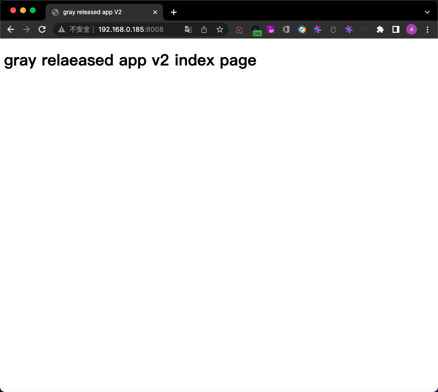

##### 1.4.2.3 在K8S上运行V1版本镜像

- step1. 创建V1版本的Pod

```
root@k8s-master-1:~# cd /root/k8s-data/
root@k8s-master-1:~/k8s-data# mkdir gray-released-yaml
root@k8s-master-1:~/k8s-data# cd gray-released-yaml/
root@k8s-master-1:~/k8s-data/gray-released-yaml# vim gray-released-deployment-v1.yaml
root@k8s-master-1:~/k8s-data/gray-released-yaml# cat gray-released-deployment-v1.yaml
```

```yaml
kind: Deployment
apiVersion: apps/v1
metadata:
  labels:
    app: erp-gray-released-deployment-v1
  name: erp-gray-released-deployment-v1
  namespace: erp
spec:
  replicas: 4
  selector:
    matchLabels:
      app: erp-gray-released-app
      version: v1
  template:
    metadata:
      labels:
        app: erp-gray-released-app
        version: v1
    spec:
      containers:
        - name: erp-gray-released-app-container
          image: harbor.k8s.com/erp/gray-released-app:v1
          imagePullPolicy: Always
          ports:
            - containerPort: 80
              protocol: TCP
              name: http
            - containerPort: 443
              protocol: TCP
              name: https
```

```
root@k8s-master-1:~/k8s-data/gray-released-yaml# kubectl apply -f gray-released-deployment-v1.yaml --record
deployment.apps/erp-gray-released-deployment-v1 created
root@k8s-master-1:~/k8s-data/gray-released-yaml# kubectl get pod -n erp
NAME                                               READY   STATUS    RESTARTS   AGE
...
erp-gray-released-deployment-v1-8578b8c8cb-2tvmt   1/1     Running   0          16s
erp-gray-released-deployment-v1-8578b8c8cb-65n9j   1/1     Running   0          6m27s
erp-gray-released-deployment-v1-8578b8c8cb-n9ds6   1/1     Running   0          16s
erp-gray-released-deployment-v1-8578b8c8cb-xjrr9   1/1     Running   0          16s
...
```

- step2. 创建service

```
root@k8s-master-1:~/k8s-data/gray-released-yaml# vim gray-released-service.yaml
root@k8s-master-1:~/k8s-data/gray-released-yaml# cat gray-released-service.yaml
```

```yaml
kind: Service
apiVersion: v1
metadata:
  labels:
    app: erp-gray-released-service-label
  name: erp-gray-released-service
  namespace: erp
spec:
  type: NodePort
  ports:
    - name: http
      port: 80
      protocol: TCP
      targetPort: 80
      nodePort: 40042
    - name: https
      port: 443
      protocol: TCP
      targetPort: 443
      nodePort: 41443
  selector:
    # 注意:此处并没有写version标签,只写了app标签
    # 选择器在多个标签之间的关系是逻辑且 因为后续还要通过该service
    # 访问v2版本的pod 所以如果此处再写一个version标签 则通过该service
    # 就只能访问到v1版本的pod了
    app: erp-gray-released-app
```

```
root@k8s-master-1:~/k8s-data/gray-released-yaml# kubectl apply -f gray-released-service.yaml 
service/erp-gray-released-service created
root@k8s-master-1:~/k8s-data/gray-released-yaml# kubectl get svc -n erp
NAME                        TYPE        CLUSTER-IP       EXTERNAL-IP   PORT(S)                                        AGE
...
erp-gray-released-service   NodePort    10.100.107.92    <none>        80:40042/TCP,443:41443/TCP                     7s
...
root@k8s-master-1:~/k8s-data/gray-released-yaml# kubectl get ep -n erp
NAME                        ENDPOINTS                                                           AGE
...
erp-gray-released-service   10.200.76.140:443,10.200.76.142:443,10.200.76.151:443 + 5 more...   53s
...
```

注意看endpoint,由于1个service定义了2个端口(80和443),且之前创建了4个pod,所以此处endpoint有8个.

- step4. 测试访问


- step5. 创建V2版本的Pod

```
root@k8s-master-1:~/k8s-data/gray-released-yaml# vim gray-released-deployment-v2.yaml
root@k8s-master-1:~/k8s-data/gray-released-yaml# cat gray-released-deployment-v2.yaml
```

```yaml
kind: Deployment
apiVersion: apps/v1
metadata:
  labels:
    app: erp-gray-released-deployment-v2
  name: erp-gray-released-deployment-v2
  namespace: erp
spec:
  replicas: 1
  selector:
    matchLabels:
      app: erp-gray-released-app
      version: v2
  template:
    metadata:
      labels:
        app: erp-gray-released-app
        version: v2
    spec:
      containers:
        - name: erp-gray-released-app-container
          image: harbor.k8s.com/erp/gray-released-app:v2
          imagePullPolicy: Always
          ports:
            - containerPort: 80
              protocol: TCP
              name: http
            - containerPort: 443
              protocol: TCP
              name: https
```

```
root@k8s-master-1:~/k8s-data/gray-released-yaml# kubectl apply -f gray-released-deployment-v2.yaml --record
deployment.apps/erp-gray-released-deployment-v2 created
root@k8s-master-1:~/k8s-data/gray-released-yaml# kubectl get pod -n erp
NAME                                               READY   STATUS    RESTARTS   AGE
...
erp-gray-released-deployment-v1-8578b8c8cb-2tvmt   1/1     Running   0          12m
erp-gray-released-deployment-v1-8578b8c8cb-65n9j   1/1     Running   0          18m
erp-gray-released-deployment-v1-8578b8c8cb-n9ds6   1/1     Running   0          12m
erp-gray-released-deployment-v1-8578b8c8cb-xjrr9   1/1     Running   0          12m
erp-gray-released-deployment-v2-5ffb788c54-m6hpb   1/1     Running   0          18s
...
root@k8s-master-1:~/k8s-data/gray-released-yaml# kubectl get ep -n erp
NAME                        ENDPOINTS                                                           AGE
...
erp-gray-released-service   10.200.76.140:443,10.200.76.142:443,10.200.76.151:443 + 7 more...   8m48s
...
```

注意:此处为了测试灰度是否正常工作,故先创建1个灰度pod.且通过endpoint可以发现(刚才是+5more,现在是+7more了)service已经选择到这个新创建的pod了.

- step6. 测试访问


此时刷新页面,v1的pod和v2的pod都有可能被访问到

假设新版本没有问题,需要将所有流量转发到V2版本的pod上.则:

- step7. 增加V2版本Pod的数量

```
root@k8s-master-1:~/k8s-data/gray-released-yaml# vim gray-released-deployment-v2.yaml 
root@k8s-master-1:~/k8s-data/gray-released-yaml# cat gray-released-deployment-v2.yaml
```

```yaml
kind: Deployment
apiVersion: apps/v1
metadata:
  labels:
    app: erp-gray-released-deployment-v2
  name: erp-gray-released-deployment-v2
  namespace: erp
spec:
  replicas: 4
  selector:
    matchLabels:
      app: erp-gray-released-app
      version: v2
  template:
    metadata:
      labels:
        app: erp-gray-released-app
        version: v2
    spec:
      containers:
        - name: erp-gray-released-app-container
          image: harbor.k8s.com/erp/gray-released-app:v2
          imagePullPolicy: Always
          ports:
            - containerPort: 80
              protocol: TCP
              name: http
            - containerPort: 443
              protocol: TCP
              name: https
```

```
root@k8s-master-1:~/k8s-data/gray-released-yaml# kubectl apply -f gray-released-deployment-v2.yaml --record
deployment.apps/erp-gray-released-deployment-v2 configured
root@k8s-master-1:~/k8s-data/gray-released-yaml# kubectl get pod -n erp
NAME                                               READY   STATUS    RESTARTS   AGE
...
erp-gray-released-deployment-v1-8578b8c8cb-2tvmt   1/1     Running   0          27m
erp-gray-released-deployment-v1-8578b8c8cb-65n9j   1/1     Running   0          34m
erp-gray-released-deployment-v1-8578b8c8cb-n9ds6   1/1     Running   0          27m
erp-gray-released-deployment-v1-8578b8c8cb-xjrr9   1/1     Running   0          27m
erp-gray-released-deployment-v2-5ffb788c54-82wbh   1/1     Running   0          4s
erp-gray-released-deployment-v2-5ffb788c54-m6hpb   1/1     Running   0          15m
erp-gray-released-deployment-v2-5ffb788c54-qt59f   1/1     Running   0          4s
erp-gray-released-deployment-v2-5ffb788c54-z6h4m   1/1     Running   0          4s
...
```

- step8. 修改service的选择器,使service只选择v2版本的pod

```
root@k8s-master-1:~/k8s-data/gray-released-yaml# vim gray-released-service.yaml 
root@k8s-master-1:~/k8s-data/gray-released-yaml# cat gray-released-service.yaml
```

```yaml
kind: Service
apiVersion: v1
metadata:
  labels:
    app: erp-gray-released-service-label
  name: erp-gray-released-service
  namespace: erp
spec:
  type: NodePort
  ports:
    - name: http
      port: 80
      protocol: TCP
      targetPort: 80
      nodePort: 40042
    - name: https
      port: 443
      protocol: TCP
      targetPort: 443
      nodePort: 41443
  selector:
    # 注意:此处并没有写version标签,只写了app标签
    # 选择器在多个标签之间的关系是逻辑且 因为后续还要通过该service
    # 访问v2版本的pod 所以如果此处再写一个version标签 则通过该service
    # 就只能访问到v1版本的pod了
    app: erp-gray-released-app
    version: v2
```

```
root@k8s-master-1:~/k8s-data/gray-released-yaml# kubectl apply -f gray-released-service.yaml
service/erp-gray-released-service configured
root@k8s-master-1:~/k8s-data/gray-released-yaml# kubectl get ep -n erp
NAME                        ENDPOINTS    
...
erp-gray-released-service   10.200.76.137:443,10.200.76.144:443,10.200.76.145:443 + 5 more...   27m
...
```

通过endpoint可以发现,service现在只匹配4个pod了.

- step9. 测试访问


此时就只能访问到V2版本的pod了.

- step10. 删除V1版本的pod

```
root@k8s-master-1:~/k8s-data/gray-released-yaml# kubectl delete -f gray-released-deployment-v1.yaml 
deployment.apps "erp-gray-released-deployment-v1" deleted
root@k8s-master-1:~/k8s-data/gray-released-yaml# kubectl get pod -n erp
NAME                                               READY   STATUS        RESTARTS   AGE
...
erp-gray-released-deployment-v2-5ffb788c54-82wbh   1/1     Running       0          16m
erp-gray-released-deployment-v2-5ffb788c54-m6hpb   1/1     Running       0          32m
erp-gray-released-deployment-v2-5ffb788c54-qt59f   1/1     Running       0          16m
erp-gray-released-deployment-v2-5ffb788c54-z6h4m   1/1     Running       0          16m
...
```

## PART2. k8s结合Jenkins与gitlab实现代码升级与回滚

### 2.1 服务器规划

|主机名|公网IP|内网IP|
|:-:|:-:|:-:|
|gitlab-server|192.168.0.194|172.16.1.194|
|jenkins-server|192.168.0.195|172.16.1.195|

### 2.2 安装jenkins

#### 2.2.1 安装JAVA环境和daemon

```
root@jenkins-server-1:~# apt install openjdk-11-jdk -y
...
done.
done.
Processing triggers for mime-support (3.60ubuntu1) ...
Processing triggers for ureadahead (0.100.0-21) ...
Processing triggers for libc-bin (2.27-3ubuntu1.2) ...
Processing triggers for systemd (237-3ubuntu10.42) ...
Processing triggers for man-db (2.8.3-2ubuntu0.1) ...
```

验证JAVA版本:

```
root@jenkins-server-1:~# java -version
openjdk version "11.0.15" 2022-04-19
OpenJDK Runtime Environment (build 11.0.15+10-Ubuntu-0ubuntu0.18.04.1)
OpenJDK 64-Bit Server VM (build 11.0.15+10-Ubuntu-0ubuntu0.18.04.1, mixed mode, sharing)
```

```
root@jenkins-server-1:~# apt install daemon -y
...
Processing triggers for man-db (2.8.3-2ubuntu0.1) ...
Processing triggers for ureadahead (0.100.0-21) ...
Processing triggers for systemd (237-3ubuntu10.42) ...
```

#### 2.2.2 安装Jenkins

[jenkins2.303.2下载地址](https://get.jenkins.io/debian-stable/jenkins_2.303.2_all.deb)

```
root@jenkins-server-1:~# ls
jenkins_2.303.2_all.deb
```

```
root@jenkins-server-1:~# dpkg -i jenkins_2.303.2_all.deb 
(Reading database ... 70055 files and directories currently installed.)
Preparing to unpack jenkins_2.303.2_all.deb ...
Unpacking jenkins (2.303.2) over (2.303.2) ...
Setting up jenkins (2.303.2) ...
Processing triggers for ureadahead (0.100.0-21) ...
Processing triggers for systemd (237-3ubuntu10.42) ...
```

#### 2.2.3 修改Jenkins配置

```
root@jenkins-server-1:~# systemctl stop jenkins
root@jenkins-server-1:~# vim /etc/default/jenkins 
root@jenkins-server-1:~# cat /etc/default/jenkins
# defaults for Jenkins automation server

# pulled in from the init script; makes things easier.
NAME=jenkins

# arguments to pass to java

# Allow graphs etc. to work even when an X server is present
# 关闭csrf 以便gitlab提交代码后能够触发自动构建的hook
JAVA_ARGS="-Djava.awt.headless=true -Dhudson.security.csrf.GlobalCrumbIssuerConfiguration.DISABLE_CSRF_PROTECTION=true"

#JAVA_ARGS="-Xmx256m"

# make jenkins listen on IPv4 address
#JAVA_ARGS="-Djava.net.preferIPv4Stack=true"

PIDFILE=/var/run/$NAME/$NAME.pid

# user and group to be invoked as (default to jenkins)
# 此处不要直接把变量修改为root 因为变量在这个配置中还有用 将用户修改为root
JENKINS_USER=root
JENKINS_GROUP=root

# location of the jenkins war file
JENKINS_WAR=/usr/share/$NAME/$NAME.war

# jenkins home location
JENKINS_HOME=/var/lib/$NAME

# set this to false if you don't want Jenkins to run by itself
# in this set up, you are expected to provide a servlet container
# to host jenkins.
RUN_STANDALONE=true

# log location.  this may be a syslog facility.priority
JENKINS_LOG=/var/log/$NAME/$NAME.log
#JENKINS_LOG=daemon.info

# Whether to enable web access logging or not.
# Set to "yes" to enable logging to /var/log/$NAME/access_log
JENKINS_ENABLE_ACCESS_LOG="no"

# OS LIMITS SETUP
#   comment this out to observe /etc/security/limits.conf
#   this is on by default because http://github.com/jenkinsci/jenkins/commit/2fb288474e980d0e7ff9c4a3b768874835a3e92e
#   reported that Ubuntu's PAM configuration doesn't include pam_limits.so, and as a result the # of file
#   descriptors are forced to 1024 regardless of /etc/security/limits.conf
MAXOPENFILES=8192

# set the umask to control permission bits of files that Jenkins creates.
#   027 makes files read-only for group and inaccessible for others, which some security sensitive users
#   might consider benefitial, especially if Jenkins runs in a box that's used for multiple purposes.
#   Beware that 027 permission would interfere with sudo scripts that run on the master (JENKINS-25065.)
#
#   Note also that the particularly sensitive part of $JENKINS_HOME (such as credentials) are always
#   written without 'others' access. So the umask values only affect job configuration, build records,
#   that sort of things.
#
#   If commented out, the value from the OS is inherited,  which is normally 022 (as of Ubuntu 12.04,
#   by default umask comes from pam_umask(8) and /etc/login.defs

# UMASK=027

# port for HTTP connector (default 8080; disable with -1)
HTTP_PORT=8080


# servlet context, important if you want to use apache proxying
PREFIX=/$NAME

# arguments to pass to jenkins.
# --javahome=$JAVA_HOME
# --httpListenAddress=$HTTP_HOST (default 0.0.0.0)
# --httpPort=$HTTP_PORT (default 8080; disable with -1)
# --httpsPort=$HTTP_PORT
# --argumentsRealm.passwd.$ADMIN_USER=[password]
# --argumentsRealm.roles.$ADMIN_USER=admin
# --webroot=~/.jenkins/war
# --prefix=$PREFIX

JENKINS_ARGS="--webroot=/var/cache/$NAME/war --httpPort=$HTTP_PORT"
root@jenkins-server-1:~# systemctl restart jenkins
```

查看浏览器访问的密码:

```
root@jenkins-server-1:~# cat /var/lib/jenkins/secrets/initialAdminPassword 
8a09d6898bfb4a018a1df0f3be936647
```

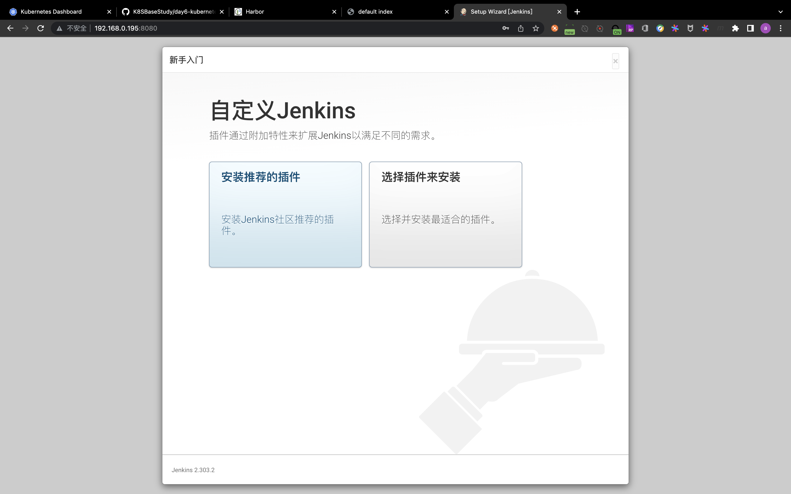

此处安装推荐插件即可.

注:如果上不了网,可以提前下载好插件,并放置到`/var/lib/jenkins/plugins/`目录中即可.

安装好插件后重启jenkins,才能使插件生效.

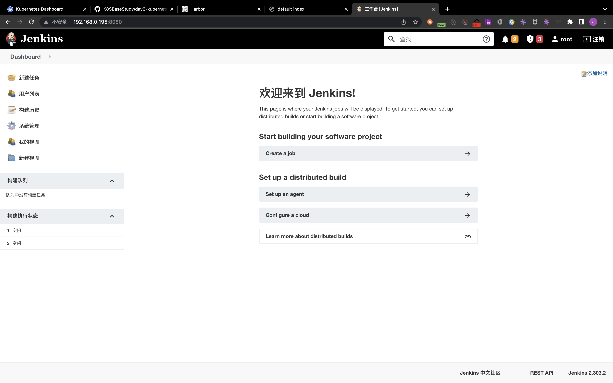

#### 2.2.4 测试Jenkins

- step1. 创建任务

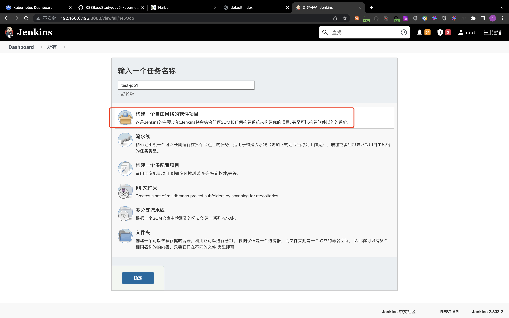

- step2. 配置任务

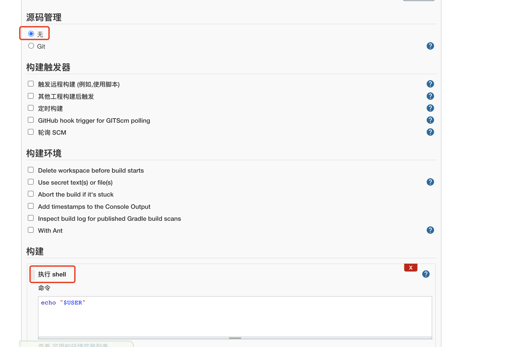

除标红处外,其他都不点.

- step3. 执行构建

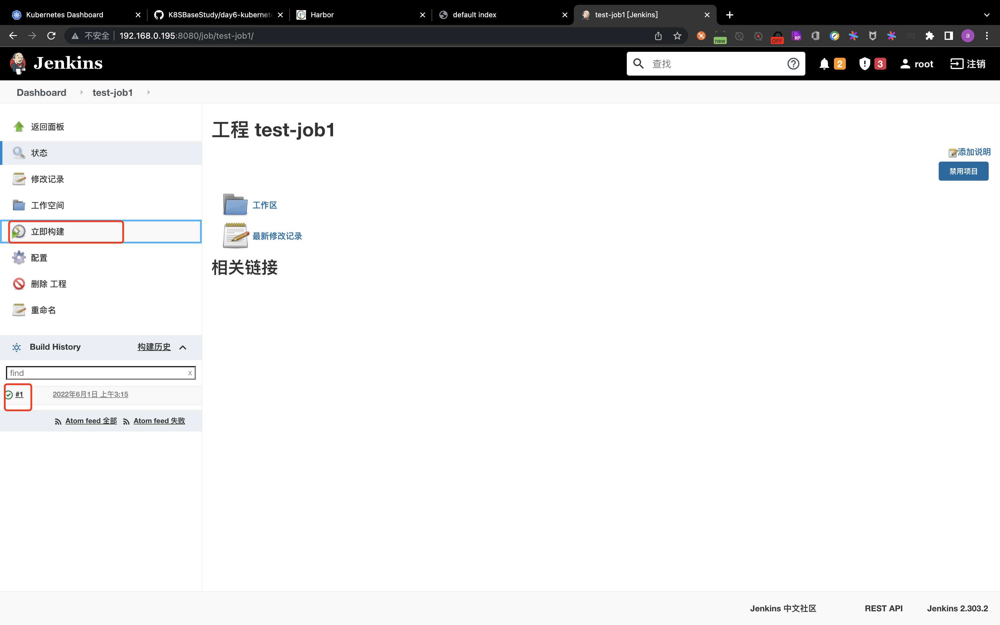

- step4. 查看构建结果

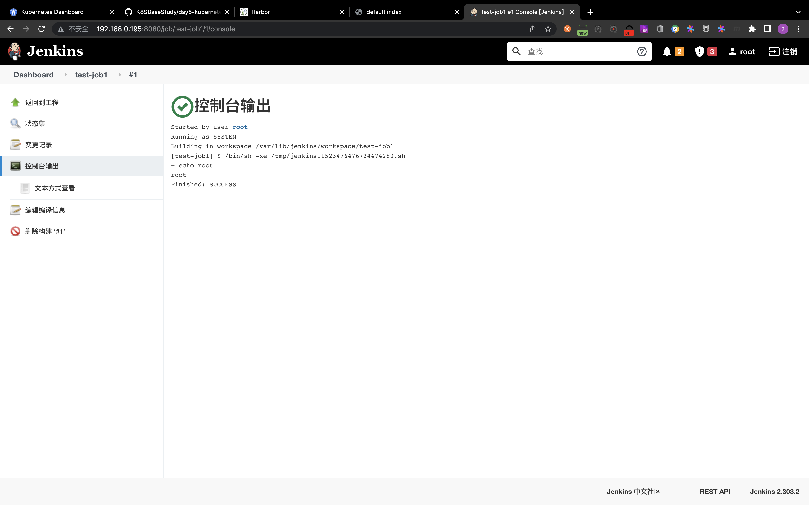

#### 2.2.5 安装访问gitlab的插件

此处需安装GitLab、Generic Webhook Trigger、Gitlab API、GitLab Authentication、GitLab Logo这5个插件.到插件管理的页面搜索并下载即可.

下载完成后重启jenkins:

```
root@jenkins-server-1:~# systemctl restart jenkins
```

### 2.3 安装gitlab

#### 2.3.1 安装gitlab

[gitlab14.2.5下载地址](https://mirrors.tuna.tsinghua.edu.cn/gitlab-ce/ubuntu/pool/bionic/main/g/gitlab-ce/gitlab-ce_14.2.5-ce.0_amd64.deb)

注:此处我的环境安装14.X的版本有问题,故安装15.0

```
root@gitlab-server-1:~# curl -LO https://packages.gitlab.com/install/repositories/gitlab/gitlab-ce/script.deb.sh
root@gitlab-server-1:~# bash script.deb.sh 
Detected operating system as Ubuntu/bionic.
Checking for curl...
Detected curl...
Checking for gpg...
Detected gpg...
Running apt-get update... done.
Installing apt-transport-https... done.
Installing /etc/apt/sources.list.d/gitlab_gitlab-ce.list...done.
Importing packagecloud gpg key... done.
Running apt-get update... done.

The repository is setup! You can now install packages.
root@gitlab-server-1:~# apt install gitlab-ce
...
Thank you for installing GitLab!
GitLab was unable to detect a valid hostname for your instance.
Please configure a URL for your GitLab instance by setting `external_url`
configuration in /etc/gitlab/gitlab.rb file.
Then, you can start your GitLab instance by running the following command:
  sudo gitlab-ctl reconfigure

For a comprehensive list of configuration options please see the Omnibus GitLab readme
https://gitlab.com/gitlab-org/omnibus-gitlab/blob/master/README.md

Help us improve the installation experience, let us know how we did with a 1 minute survey:
https://gitlab.fra1.qualtrics.com/jfe/form/SV_6kVqZANThUQ1bZb?installation=omnibus&release=15-0
```

#### 2.3.2 配置gitlab

```
root@gitlab-server-1:~# vim /etc/gitlab/gitlab.rb
root@gitlab-server-1:~# cat /etc/gitlab/gitlab.rb
...
external_url 'http://192.168.0.194'
...
root@gitlab-server-1:~# gitlab-ctl reconfigure
...
NOTE: Because these credentials might be present in your log files in plain text, it is highly recommended to reset the password following https://docs.gitlab.com/ee/security/reset_user_password.html#reset-your-root-password.

gitlab Reconfigured!
```

此处仅配置外部访问的url即可.可以写域名,也可以写IP地址.

查看初始密码:

```
root@gitlab-server-1:~# cat /etc/gitlab/initial_root_password
# WARNING: This value is valid only in the following conditions
#          1. If provided manually (either via `GITLAB_ROOT_PASSWORD` environment variable or via `gitlab_rails['initial_root_password']` setting in `gitlab.rb`, it was provided before database was seeded for the first time (usually, the first reconfigure run).
#          2. Password hasn't been changed manually, either via UI or via command line.
#
#          If the password shown here doesn't work, you must reset the admin password following https://docs.gitlab.com/ee/security/reset_user_password.html#reset-your-root-password.

Password: x3FlVPHtXP+T09xLJBLe0zAwLi//lOmWw3JBfBNMWrs=

# NOTE: This file will be automatically deleted in the first reconfigure run after 24 hours.
```

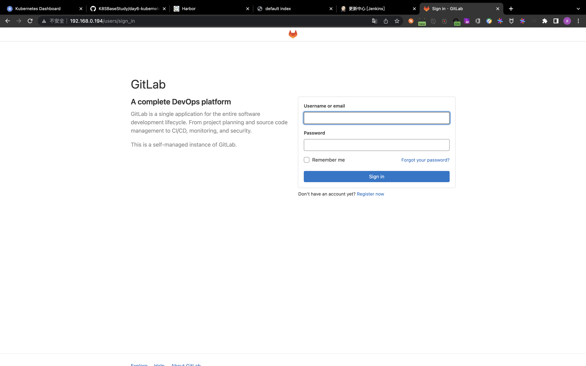

注:若需调整为中文,可以在Preferences中修改Localization选项

#### 2.3.3 配置群组、用户、项目

##### a. 配置群组

菜单->管理员->新建群组

群组相当于一个项目.但从微服务的角度来看,一个项目中有很多个微服务,每一个微服务都是gitlab中定义的一个项目;这些微服务构成的这个项目在gitlab中称为群组.

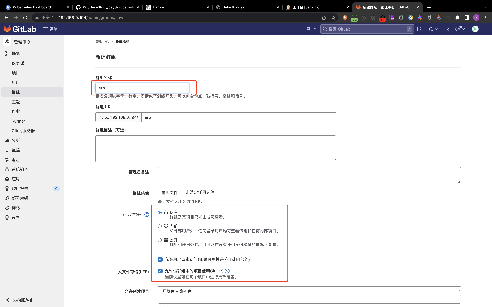

##### b. 配置用户

菜单->管理员->新建用户

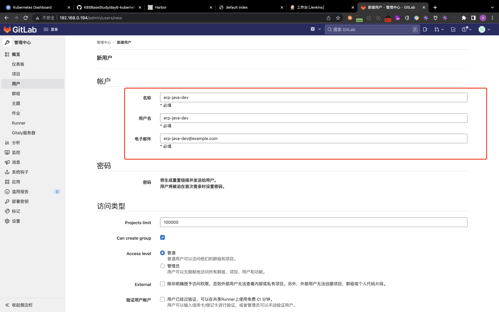

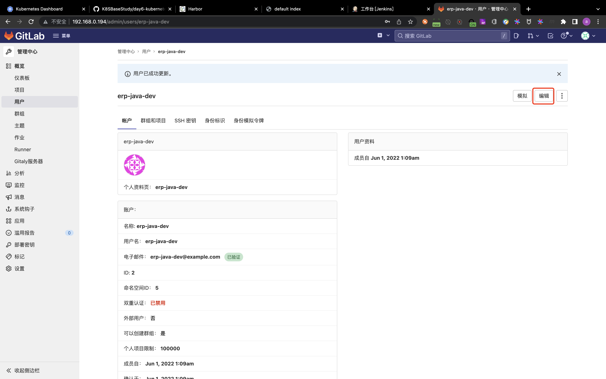

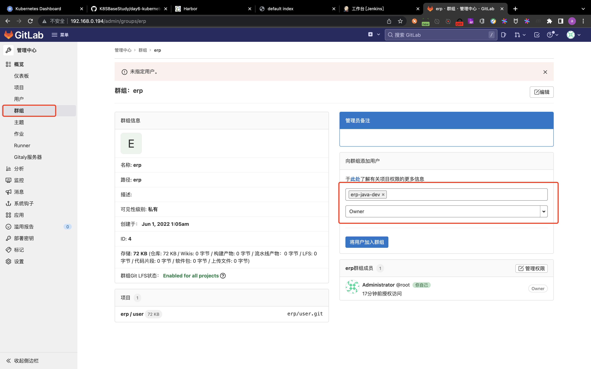

添加后需以普通用户身份登录一次gitlab并修改密码.否则后续克隆仓库将出现权限问题.

##### c. 配置项目

菜单->管理员->新建项目

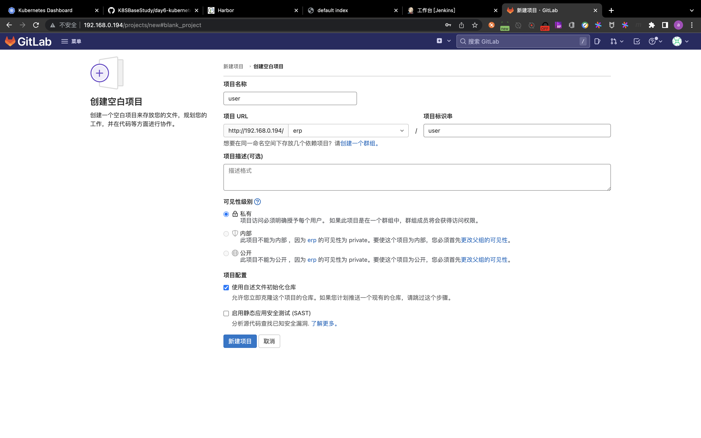

此处我们假设现有一erp项目,其中有一个微服务名为user.

##### d. 提交代码至仓库

此处写一个html文件,假设该html文件即为微服务user的v1版本代码.

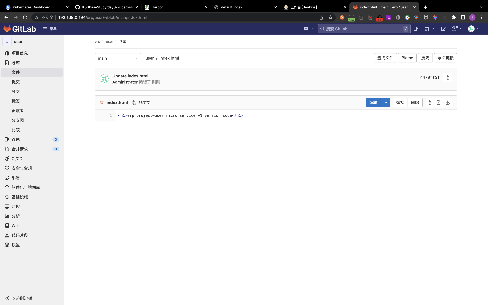

##### e. 在jenkins服务器上测试克隆仓库

- step1. 安装git

```
root@jenkins-server-1:~# apt install git -y
...
Setting up git (1:2.17.1-1ubuntu0.11) ...
```

- step2. 克隆仓库

```
root@jenkins-server-1:~# git clone http://192.168.0.194/erp/user.git
Cloning into 'user'...
Username for 'http://192.168.0.194': erp-java-dev
Password for 'http://erp-java-dev@192.168.0.194': 
remote: Enumerating objects: 6, done.
remote: Counting objects: 100% (6/6), done.
remote: Compressing objects: 100% (4/4), done.
remote: Total 6 (delta 0), reused 0 (delta 0), pack-reused 0
Unpacking objects: 100% (6/6), done.
root@jenkins-server-1:~# ls
jenkins_2.303.2_all.deb  user
root@jenkins-server-1:~# cat ./user/index.html 
<h1>erp project-user micro service v1 version code</h1>
```

- step3. 修改代码并提交

```
root@jenkins-server-1:~# cd user/
root@jenkins-server-1:~/user# vim index.html 
root@jenkins-server-1:~/user# cat index.html
<h1>erp project-user micro service v1 version code and modify by erp-java-dev</h1>
root@jenkins-server-1:~/user# git add .
root@jenkins-server-1:~/user# git config --global user.name "erp-java-dev"
root@jenkins-server-1:~/user# git config --global user.email erp-java-dev@example.com
root@jenkins-server-1:~/user# git commit -m "modify code for test push"
[main 019422a] modify code for test push
 1 file changed, 1 insertion(+), 1 deletion(-)
root@jenkins-server-1:~/user# git push
Username for 'http://192.168.0.194': erp-java-dev
Password for 'http://erp-java-dev@192.168.0.194': 
Counting objects: 3, done.
Compressing objects: 100% (2/2), done.
Writing objects: 100% (3/3), 329 bytes | 329.00 KiB/s, done.
Total 3 (delta 0), reused 0 (delta 0)
To http://192.168.0.194/erp/user.git
   4470ff5..019422a  main -> main
```

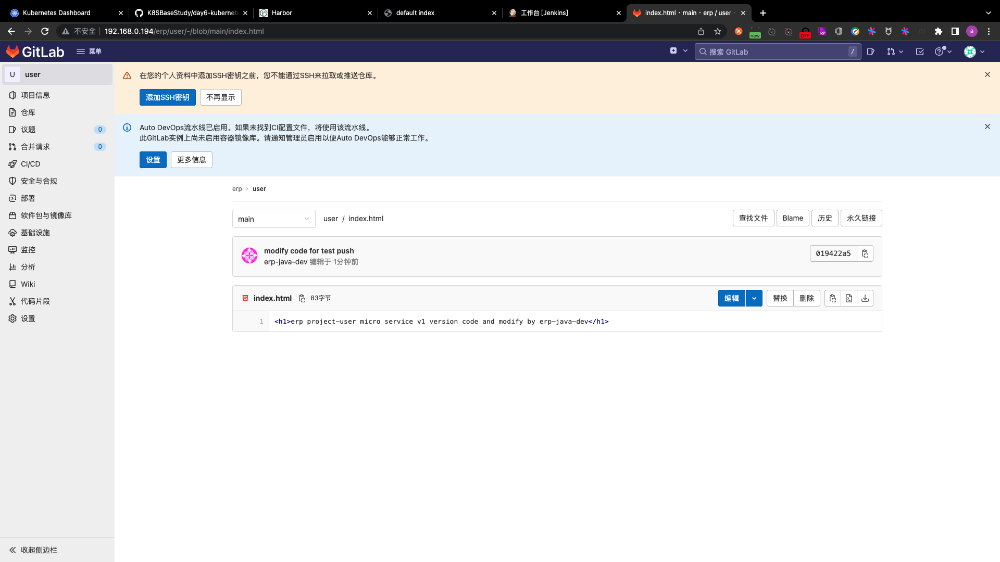

### 2.4 设置gitlab信任jenkins

通常我们拉取代码时,都是需要交互式的输入用户名和密码的.但这种方式在自动化部署时就不能使用了.自动化部署要求jenkins能够自动到gitlab上拉取代码,因此需要让gitlab信任jenkins的拉取请求.

右上角用户头像->偏好设置->SSH密钥

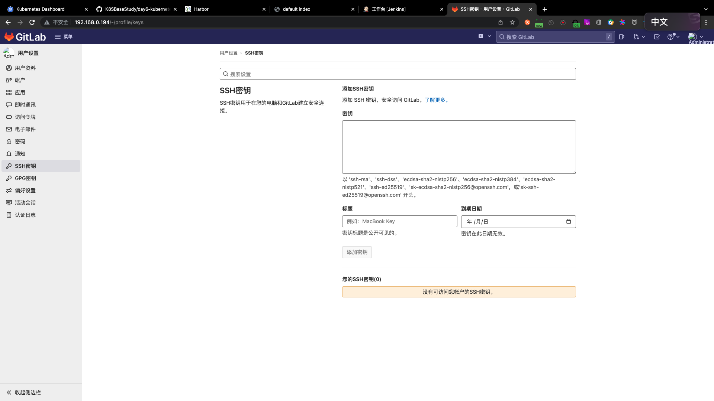

公钥放在gitlab上,私钥放在jenkins上即可.

- step1. 在jenkins服务器上生成一个秘钥对

```
root@jenkins-server-1:~# ssh-keygen 
Generating public/private rsa key pair.
Enter file in which to save the key (/root/.ssh/id_rsa): 
Created directory '/root/.ssh'.
Enter passphrase (empty for no passphrase): 
Enter same passphrase again: 
Your identification has been saved in /root/.ssh/id_rsa.
Your public key has been saved in /root/.ssh/id_rsa.pub.
The key fingerprint is:
SHA256:mFB6P7w7e1PRQe+ovGA+GLt7c/crzVqX+eecB9eHjew root@jenkins-server-1
The key's randomart image is:
+---[RSA 2048]----+
|      .      ..  |
|     o        .. |
|    o .      . ..|
|     o =    . .o |
|      o S    o.+o|
|        .o ...= B|
|        .+o.o.o*o|
|        ++*..oE+*|
|        =B.=.oo=O|
+----[SHA256]-----+
```

- step2. 将公钥存储至gitlab

```
root@jenkins-server-1:~# cat /root/.ssh/id_rsa.pub 
ssh-rsa AAAAB3NzaC1yc2EAAAADAQABAAABAQCdpttfApP8fNZ7zpYZuhZ4QVvvnhFznq5tvCyfr5KxQuh6tnm9C32HHPexmvFLbHuC6rru4eLUi6czQihR8feRkrpjZUCa7dt2e1Ca+kw4UGBUUHjYWHhZ3yxjm2RGZUYDqqQn9aeuBOE6FbnKuzekT/Lgb8Vko3qlaa5/FOUSR5ix0fbg5q+U2+CM3LcnIUqPhzeaB9oDcIOb+sQyYmJJGHWsTO+uemrTpS8r4BYDhnciJ2es8H7vLaD8GKjfW/09M2QKVKx4U/Gv9VKO1zKiFapG7DEJfNma5kkh0k9hYjMTKQM9AqkRIN/KHg7lpnWJsntnnh+E6sm6b9cxvGhH root@jenkins-server-1
```

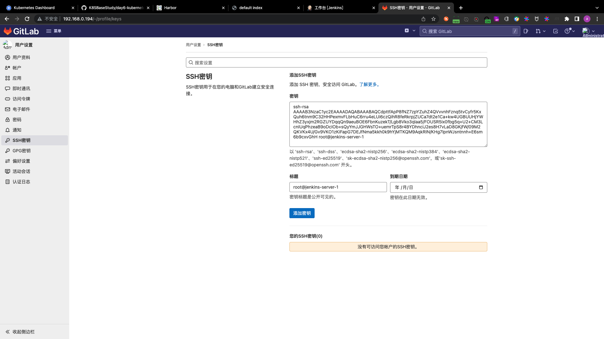

点击添加密钥即可.

- step3. 删除之前使用http克隆的项目,并使用ssh重新克隆

```
root@jenkins-server-1:~# rm -rf user
root@jenkins-server-1:~# git clone git@192.168.0.194:erp/user.git
Cloning into 'user'...
The authenticity of host '192.168.0.194 (192.168.0.194)' can't be established.
ECDSA key fingerprint is SHA256:tzITLmgANAQRCks+Gv9ZXsd/gNdzLSZ5tp1uWa2agP0.
Are you sure you want to continue connecting (yes/no)? yes
Warning: Permanently added '192.168.0.194' (ECDSA) to the list of known hosts.
remote: Enumerating objects: 9, done.
remote: Counting objects: 100% (9/9), done.
remote: Compressing objects: 100% (6/6), done.
remote: Total 9 (delta 0), reused 0 (delta 0), pack-reused 0
Receiving objects: 100% (9/9), done.
```

注:此处只有第一次克隆时需要输入`yes`,后续再使用ssh克隆就不需要交互了.

### 2.5 设置jenkins在构建时执行脚本

#### 2.5.1 测试jenkins是否能够执行脚本

此处还是拿之前的test-job1作为测试构建任务,先测试jenkins是否能够正常调用脚本.

```
root@jenkins-server-1:~# mkdir -p /data/scripts
root@jenkins-server-1:~# cd /data/scripts
root@jenkins-server-1:/data/scripts# vim test-job1.sh
root@jenkins-server-1:/data/scripts# cat test-job1.sh
#!/bin/bash
echo 123
```

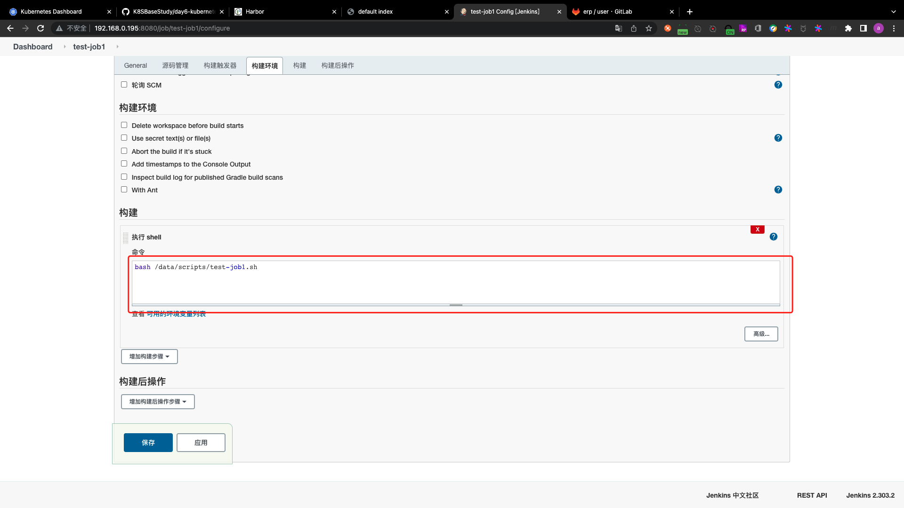

配置完成后点击立即构建,并查看结果:

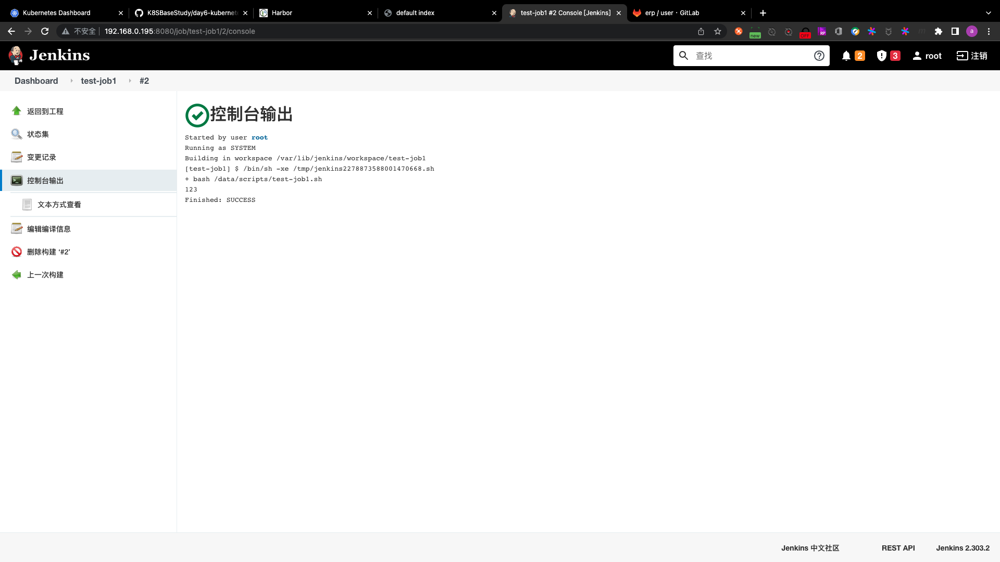

#### 2.5.2 测试jenkins调用脚本时传递参数

此处我们尝试让jenkins调用shell脚本时传递变量.

修改脚本:

```
root@jenkins-server-1:/data/scripts# vim test-job1.sh
root@jenkins-server-1:/data/scripts# cat test-job1.sh
#!/bin/bash
echo $1
```

配置构建时的选项参数:

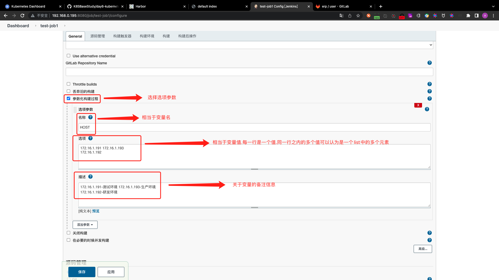

调用脚本时传递参数:

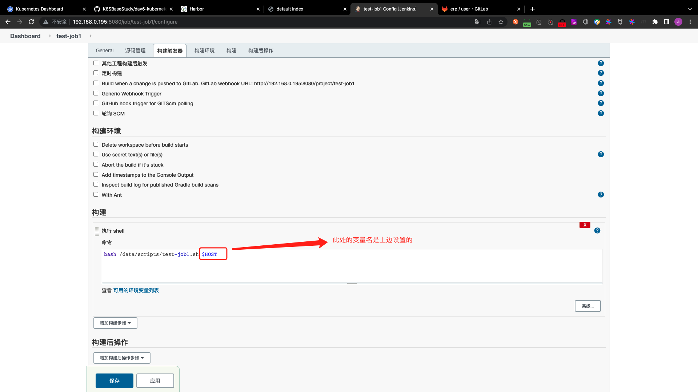

点击保存即可.保存后发现不再有立即构建按钮了.

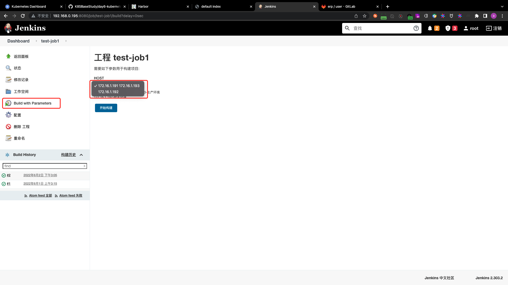

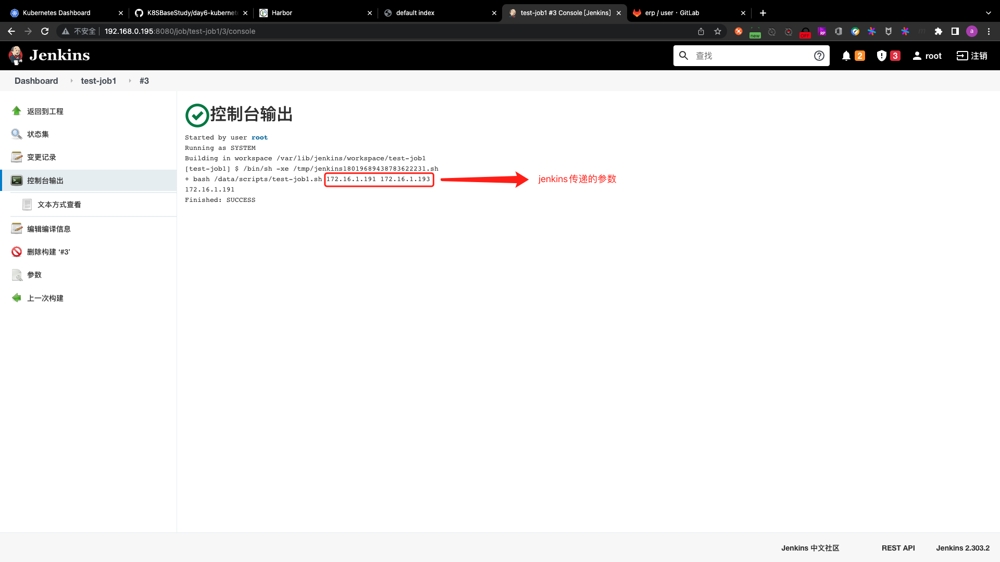

#### 2.5.3 以tomcat-webapp为例,演示CICD流程

- step1. 编写自动构建的脚本

```
root@jenkins-server-1:/data/scripts# vim tomcat-webapp-job.sh
root@jenkins-server-1:/data/scripts# cat tomcat-webapp-job.sh
```

```shell
#!/bin/bash
# Author: Roach
# Date: 2022-06-02
# Version: v1

# 记录脚本开始执行的时间
startTime=`date +'%Y-%m-%d %H:%M:%S'`

# 脚本存放的路径
SHELL_DIR="/root/scripts"

# 脚本名称
SHELL_NAME="$0"

# K8S集群的master节点IP
K8S_CONTROLLER="172.16.1.181"

# 制作镜像的服务器节点IP
IMAGE_BUILDER="172.16.1.185"

# 获取当前日期 精确到秒 用于构建镜像时的版本号
DATE=`date +%Y-%m-%d_%H_%M_%S`

# 定义执行脚本时的操作 操作只能为部署或回滚
METHOD=$1

# 若操作为部署 则指定部署哪个分支的代码
Branch=$2

# 若未指定分支 则分支为dev
if test -z $Branch;then
	Branch=dev
fi

# 本函数用于克隆代码
function Code_Clone(){
	# 项目的git地址
	Git_URL="git@192.168.0.194:erp/user.git"

	# 取项目名
	DIR_NAME=`echo ${Git_URL} | awk -F "/" '{print $2}' | awk -F "." '{print $1}'`

	# 定义代码存放目录
	DATA_DIR="/data/gitdata/erp"
	Git_dir="${DATA_DIR}/${DIR_NAME}"

	# 拉取代码 此处拉取的方式为删除已存在的代码 然后重新克隆
	# 删除已存在的代码
	cd ${DATA_DIR} && echo "delete previous version of code and clone the latest version of code with current branch" && sleep 1 && rm -rf ${DIR_NAME}

	# 克隆代码
	echo "clone from branch:${Branch} will be start soon" && sleep 1
	git clone -b ${Branch} ${Git_URL}

	# 编译代码
	# 此处要看具体是什么语言的代码
	# java代码如下:
	# cd ${Git_dir} && mvn clean package
	# go代码如下:
	# go build xxx(二进制文件名)

	# 将代码打成压缩包
	sleep 1
	cd ${Git_dir}
	tar zcf app.tar.gz ./*
}

# 本函数用于将打包好的压缩文件拷贝到制作镜像的服务器
function Copy_file(){
	echo "compress code into package finish.Copy to image builder node:${IMAGE_BUILDER} will be start soon" && sleep 1
	scp app.tar.gz root@${IMAGE_BUILDER}:/opt/k8s-data/biz-img/tomcatapp
	echo "copy package finish.node:${IMAGE_BUILDER} build image will be start soon" && sleep 1
}

# 本函数用于到制作镜像的服务器上制作镜像并上传至harbor
function Make_Image(){
	echo "build image and push to harbor start" && sleep 1
	# 以制作镜像的日期(精确到秒)作为镜像的版本号 构建并推送镜像至harbor
	ssh root@${IMAGE_BUILDER} "cd /opt/k8s-data/biz-img/tomcatapp && bash build-command.sh ${DATE}"
	echo "build image and push to harbor finish" && sleep 1
}

# 本函数用于到K8S的master节点上更新yaml文件中的镜像版本号 
# 从而保持yaml文件中的镜像版本号与K8S中的版本号一致
function Update_k8s_yaml(){
	echo "update image which exist in yaml will be start soon" && sleep 1
	ssh root@${K8S_CONTROLLER} "cd /root/k8s-data/tomcat-webapp-yaml && sed -i 's/image: harbor.k8s.*/image: harbor.k8s.com\/erp\/tomcat-webapp:${DATE}/g' tomcat-webapp-deployment.yaml"
	echo "update image which exist in yaml finish.Update container will be start soon" && sleep 1
}

# 本函数用于更新K8S中容器的版本 通过使用kubectl set image的方式更新 不推荐使用此方式
function Update_k8s_container_by_set_image(){
	ssh root@${K8S_CONTROLLER} "kubectl set image deployment/erp-tomcat-webapp-deployment erp-tomcat-webapp-container=harbor.k8s.com/erp/tomcat-webapp:${DATE} -n erp"
}

# 本函数用于更新K8S中容器的版本 通过kubectl apply -f的方式更新 推荐使用此方式
function Update_k8s_container_by_apply_yaml(){
	ssh root@${K8S_CONTROLLER} "cd /root/k8s-data/tomcat-webapp-yaml && kubectl apply -f tomcat-webapp-deployment.yaml --record"
	echo "update image which exist in k8s finish" && sleep 1
	echo "now image version is:harbor.k8s.com/erp/tomcat-webapp:${DATE}"

	# 计算脚本累计执行时间 若不需要可删除
	endTime=`date +'%Y-%m-%d %H:%M:%S'`
	start_seconds=$(date --date="$startTime" +%s);
	end_seconds=$(date --date="$endTime" +%s);
	echo "update image cost: "$((end_seconds-start_seconds))" seconds"
}

# 本函数用于将K8S中的镜像回滚到上一个版本
function Rollback_last_version(){
	echo "rollback to last version will be start soon"
	ssh root@${K8S_CONTROLLER} "kubectl rollout undo deployment/erp-tomcat-webapp-deployment -n erp"
	sleep 1
	echo "rollback to last version finish"
}

# 本函数用于使用帮助
usage(){
	echo "the way to deploy is: ${SHELL_DIR}/${SHELL_NAME} deploy"
	echo "the way to rollback last version is: ${SHELL_DIR}/${SHELL_NAME} Rollback_last_version"
}

# 主函数
main(){
	case ${METHOD} in
	deploy)
	  Code_Clone;
	  Copy_file;
	  Make_Image;
	  Update_k8s_yaml;
	  Update_k8s_container_by_apply_yaml;
	;;
	rollback_last_version)
	  Rollback_last_version;
	;;
	*)
	  usage;
	esac;
}

main $1 $2
```

- step2. 在jenkins节点上创建保存代码的路径

```
root@jenkins-server-1:/data/scripts# mkdir -p /data/gitdata/erp
```

- step3. 将ssh的key拷贝到构建镜像的节点和K8S的master节点,实现免秘钥认证

```
root@jenkins-server-1:/data/scripts# ssh-copy-id 172.16.1.185
/usr/bin/ssh-copy-id: INFO: Source of key(s) to be installed: "/root/.ssh/id_rsa.pub"
The authenticity of host '172.16.1.185 (172.16.1.185)' can't be established.
ECDSA key fingerprint is SHA256:tzITLmgANAQRCks+Gv9ZXsd/gNdzLSZ5tp1uWa2agP0.
Are you sure you want to continue connecting (yes/no)? yes
/usr/bin/ssh-copy-id: INFO: attempting to log in with the new key(s), to filter out any that are already installed
/usr/bin/ssh-copy-id: INFO: 1 key(s) remain to be installed -- if you are prompted now it is to install the new keys
root@172.16.1.185's password: 

Number of key(s) added: 1

Now try logging into the machine, with:   "ssh '172.16.1.185'"
and check to make sure that only the key(s) you wanted were added.
```

```
root@jenkins-server-1:/data/scripts# ssh-copy-id 172.16.1.181
/usr/bin/ssh-copy-id: INFO: Source of key(s) to be installed: "/root/.ssh/id_rsa.pub"
The authenticity of host '172.16.1.181 (172.16.1.181)' can't be established.
ECDSA key fingerprint is SHA256:tzITLmgANAQRCks+Gv9ZXsd/gNdzLSZ5tp1uWa2agP0.
Are you sure you want to continue connecting (yes/no)? yes
/usr/bin/ssh-copy-id: INFO: attempting to log in with the new key(s), to filter out any that are already installed
/usr/bin/ssh-copy-id: INFO: 1 key(s) remain to be installed -- if you are prompted now it is to install the new keys
root@172.16.1.181's password: 

Number of key(s) added: 1

Now try logging into the machine, with:   "ssh '172.16.1.181'"
and check to make sure that only the key(s) you wanted were added.
```

- step4. 在gitlab上创建新的分支dev

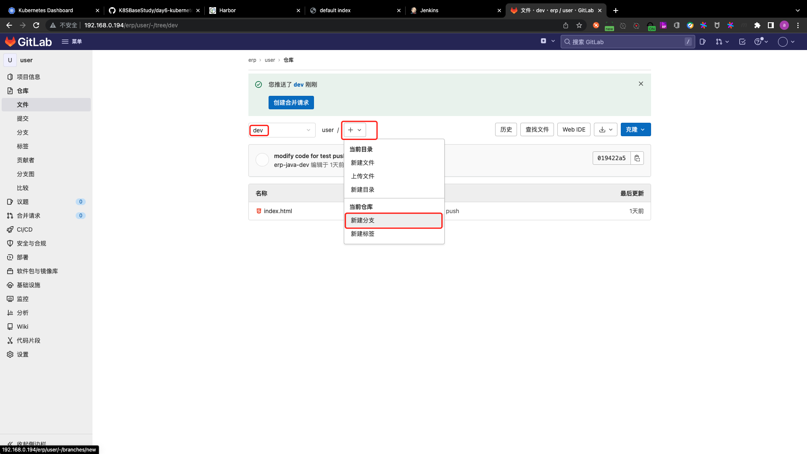

- step5. 在jenkins上创建新的构建任务,并设置脚本对应的参数

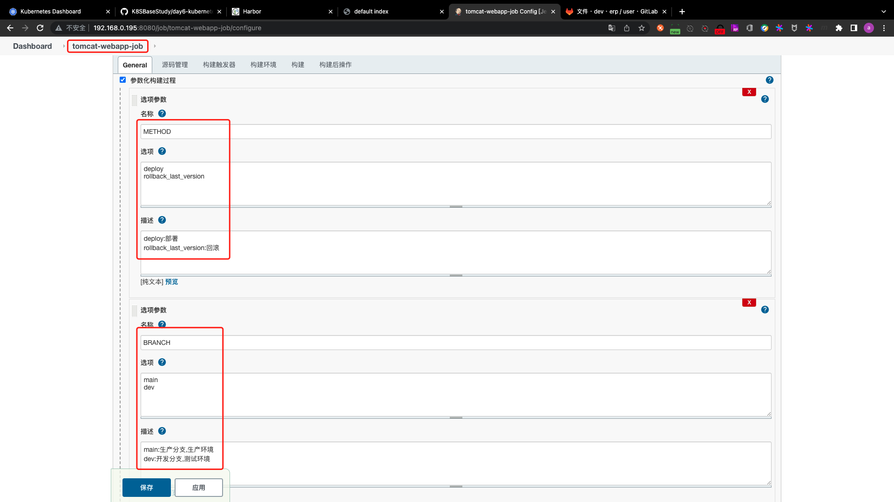

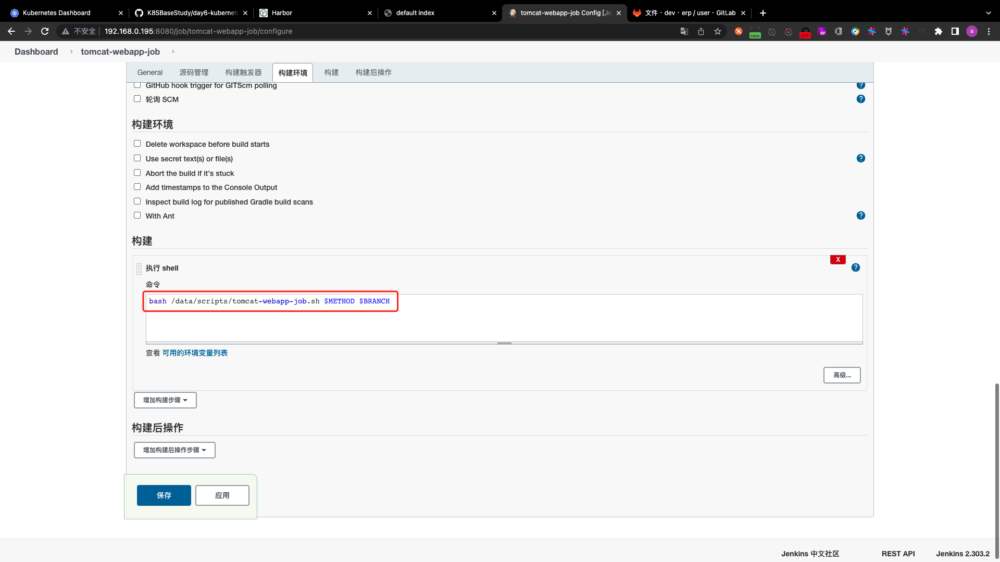

- step5. 测试构建

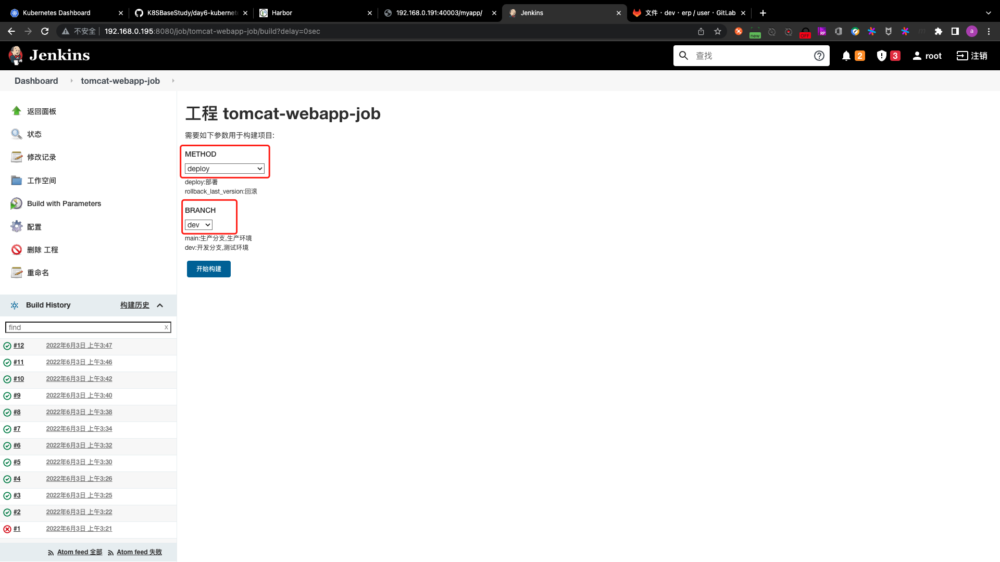

注意:这个shell脚本肯定是需要反复调试的,所以在构建时调用的函数,每一个都需要测试.图中之前构建的很多次,就是在测试每一个函数的功能是否正确.

- step6. 测试访问

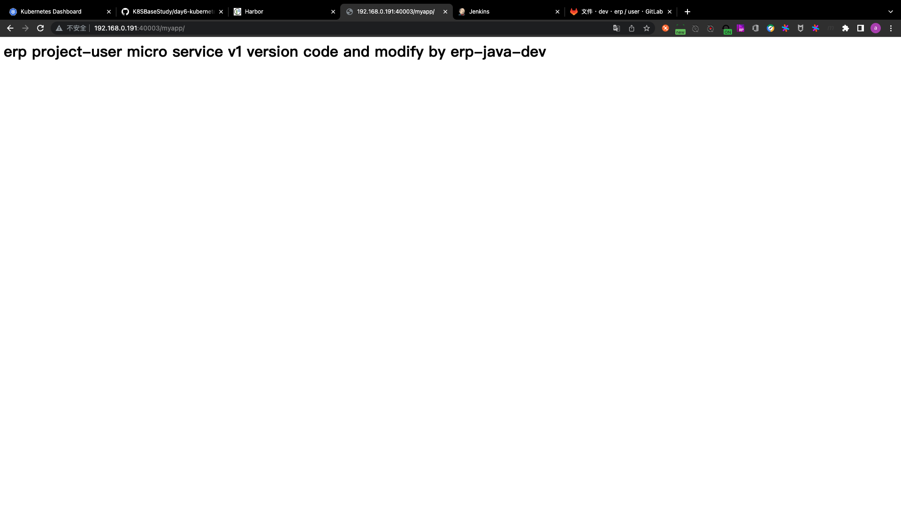

## PART3. k8s结合ELK实现日志收集

实现pod中⽇志收集⾄ELK,⾃定义字段数据格式转换、排序、基于⽇志实现pod⾃愈、⾃动扩容等.

[日志架构](https://kubernetes.io/zh/docs/concepts/cluster-administration/logging/)

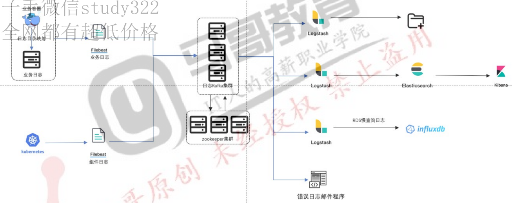

如果是虚拟机的话,那么可以将日志分为3种:

1. 系统日志.Centos存储在`/var/log/message`,Ubuntu存储在`/var/log/syslog`
2. 应用程序的错误日志,用于debug.比如nginx的error.log
3. 应用程序的访问日志,用于访问统计分析.比如nginx的access.log

应用程序的错误日志和访问日志不能放在一起,因为格式不同.

收集日志的方案也有2种:

1. 在K8S上运行一个daemonset,把宿主机的日志挂载到容器中,让收集每一个节点的日志.

	优点:简单
	
	缺点:无法区分出访问日志和错误日志
	
	例:将`var/lib/docker`下的所有日志都挂载到daemonset上.
	
	```
	root@k8s-node-1:~# find /var/lib/docker -name *.log
	...
	/var/lib/docker/containerd/daemon/io.containerd.runtime.v1.linux/moby/06e09a0baa87e87c817f474842a24a1b9aa537a187eca9154196d6b1d6fd8fad/shim.stdout.log
	/var/lib/docker/containerd/daemon/io.containerd.runtime.v1.linux/moby/06e09a0baa87e87c817f474842a24a1b9aa537a187eca9154196d6b1d6fd8fad/shim.stderr.log
	/var/lib/docker/containerd/daemon/io.containerd.runtime.v1.linux/moby/568f774b95b64c526751592caa51f7215fd00c9d2aeca937fa4087c5c38c6e31/shim.stdout.log
	/var/lib/docker/containerd/daemon/io.containerd.runtime.v1.linux/moby/568f774b95b64c526751592caa51f7215fd00c9d2aeca937fa4087c5c38c6e31/shim.stderr.log
	/var/lib/docker/containerd/daemon/io.containerd.runtime.v1.linux/moby/40f23c8dee99813c3e4b90fecbc7b10579950fb36f6fb13984496dfdec8d2c8c/shim.stdout.log
	/var/lib/docker/containerd/daemon/io.containerd.runtime.v1.linux/moby/40f23c8dee99813c3e4b90fecbc7b10579950fb36f6fb13984496dfdec8d2c8c/shim.stderr.log
	...
	```
	
	可以看到,虽然都能找到日志,但无法对这些日志进行分类.
	
2. 在每个pod中启动一个日志收集工具

	可以使用filebeat、logstash等.推荐使用filebeat,因为轻量级.
	
	filebeat的安装方式也有2种:
	
	1. 在1个pod的1个容器中,中先启动filebeat进程,再启动web服务
	2. 在1个pod中创建2个容器.1个运行filebeat,另一个运行web服务

	第2种方式实现起来有难度.难点在于,同一个pod中的多个容器虽然共享同一个网络,但各自的文件系统是独立的.因此需要给web服务容器设置一个emptyDir或hostPath,让web服务容器将日志写到这个路径中.在让filebeat的容器去读取宿主机上这个路径的日志并收集.这种方式下,官方称日志收集的容器为sidecar容器.
	
	因此通常使用第1种方式.但第1种方式需要在打镜像的时候就把filebeat安装好.

### 3.1 服务器规划

|主机名|公网IP|内网IP|
|:-:|:-:|:-:|
|es-1|192.168.0.196|172.16.1.196|
|es-2|192.168.0.197|172.16.1.197|
|es-3|192.168.0.198|172.16.1.198|
|logstash-1|192.168.0.199|172.16.1.199|
|logstash-2|192.168.0.200|172.16.1.200|
|kafka-1|192.168.0.201|172.16.1.201|
|kafka-2|192.168.0.202|172.16.1.202|
|kafka-3|192.168.0.203|172.16.1.203|

### 3.2 安装ElasticSearch

#### 3.2.1 安装并配置ElasticSearch

[ES安装包](https://www.elastic.co/cn/downloads/past-releases#elasticsearch)

此处使用的版本为[7.6.2](https://www.elastic.co/cn/downloads/past-releases/elasticsearch-7-6-2),带JDK的安装包.

- step1. 下载安装包

此处3个ES节点都要安装.

```
root@es-1:~# ls
elasticsearch-7.6.2-amd64.deb
```

- step2. 安装

```
root@es-1:~# dpkg -i elasticsearch-7.6.2-amd64.deb 
Selecting previously unselected package elasticsearch.
(Reading database ... 67125 files and directories currently installed.)
Preparing to unpack elasticsearch-7.6.2-amd64.deb ...
Creating elasticsearch group... OK
Creating elasticsearch user... OK
Unpacking elasticsearch (7.6.2) ...
Setting up elasticsearch (7.6.2) ...
Created elasticsearch keystore in /etc/elasticsearch
Processing triggers for ureadahead (0.100.0-21) ...
Processing triggers for systemd (237-3ubuntu10.42) ...
```

这一步也是3个ES节点都要做

- step3. 修改配置文件

	此处每个ES的节点需要修改的配置值不同,把3个节点修改后的配置都列出来了.
	
	```
	root@es-1:~# vim /etc/elasticsearch/elasticsearch.yml 
	root@es-1:~# cat /etc/elasticsearch/elasticsearch.yml
	```
	
	```yaml
	# ======================== Elasticsearch Configuration =========================
	#
	# NOTE: Elasticsearch comes with reasonable defaults for most settings.
	#       Before you set out to tweak and tune the configuration, make sure you
	#       understand what are you trying to accomplish and the consequences.
	#
	# The primary way of configuring a node is via this file. This template lists
	# the most important settings you may want to configure for a production cluster.
	#
	# Please consult the documentation for further information on configuration options:
	# https://www.elastic.co/guide/en/elasticsearch/reference/index.html
	#
	# ---------------------------------- Cluster -----------------------------------
	#
	# Use a descriptive name for your cluster:
	#
	cluster.name: k8s-elk-cluster
	#
	# ------------------------------------ Node ------------------------------------
	#
	# Use a descriptive name for the node:
	#
	node.name: node-1
	#
	# Add custom attributes to the node:
	#
	#node.attr.rack: r1
	#
	# ----------------------------------- Paths ------------------------------------
	#
	# Path to directory where to store the data (separate multiple locations by comma):
	#
	path.data: /var/lib/elasticsearch
	#
	# Path to log files:
	#
	path.logs: /var/log/elasticsearch
	#
	# ----------------------------------- Memory -----------------------------------
	#
	# Lock the memory on startup:
	#
	#bootstrap.memory_lock: true
	#
	# Make sure that the heap size is set to about half the memory available
	# on the system and that the owner of the process is allowed to use this
	# limit.
	#
	# Elasticsearch performs poorly when the system is swapping the memory.
	#
	# ---------------------------------- Network -----------------------------------
	#
	# Set the bind address to a specific IP (IPv4 or IPv6):
	#
	network.host: 192.168.0.196
	#
	# Set a custom port for HTTP:
	#
	http.port: 9200
	#
	# For more information, consult the network module documentation.
	#
	# --------------------------------- Discovery ----------------------------------
	#
	# Pass an initial list of hosts to perform discovery when this node is started:
	# The default list of hosts is ["127.0.0.1", "[::1]"]
	#
	discovery.seed_hosts: ["192.168.0.196", "192.168.0.197", "192.168.0.198"]
	#
	# Bootstrap the cluster using an initial set of master-eligible nodes:
	#
	cluster.initial_master_nodes: ["192.168.0.196", "192.168.0.197", "192.168.0.198"]
	#
	# For more information, consult the discovery and cluster formation module documentation.
	#
	# ---------------------------------- Gateway -----------------------------------
	#
	# Block initial recovery after a full cluster restart until N nodes are started:
	#
	gateway.recover_after_nodes: 2
	#
	# For more information, consult the gateway module documentation.
	#
	# ---------------------------------- Various -----------------------------------
	#
	# Require explicit names when deleting indices:
	#
	action.destructive_requires_name: true
	```
	
	```
	root@es-2:~# vim /etc/elasticsearch/elasticsearch.yml 
	root@es-2:~# cat /etc/elasticsearch/elasticsearch.yml
	```
	
	```yaml
	# ======================== Elasticsearch Configuration =========================
	#
	# NOTE: Elasticsearch comes with reasonable defaults for most settings.
	#       Before you set out to tweak and tune the configuration, make sure you
	#       understand what are you trying to accomplish and the consequences.
	#
	# The primary way of configuring a node is via this file. This template lists
	# the most important settings you may want to configure for a production cluster.
	#
	# Please consult the documentation for further information on configuration options:
	# https://www.elastic.co/guide/en/elasticsearch/reference/index.html
	#
	# ---------------------------------- Cluster -----------------------------------
	#
	# Use a descriptive name for your cluster:
	#
	cluster.name: k8s-elk-cluster
	#
	# ------------------------------------ Node ------------------------------------
	#
	# Use a descriptive name for the node:
	#
	node.name: node-2
	#
	# Add custom attributes to the node:
	#
	#node.attr.rack: r1
	#
	# ----------------------------------- Paths ------------------------------------
	#
	# Path to directory where to store the data (separate multiple locations by comma):
	#
	path.data: /var/lib/elasticsearch
	#
	# Path to log files:
	#
	path.logs: /var/log/elasticsearch
	#
	# ----------------------------------- Memory -----------------------------------
	#
	# Lock the memory on startup:
	#
	#bootstrap.memory_lock: true
	#
	# Make sure that the heap size is set to about half the memory available
	# on the system and that the owner of the process is allowed to use this
	# limit.
	#
	# Elasticsearch performs poorly when the system is swapping the memory.
	#
	# ---------------------------------- Network -----------------------------------
	#
	# Set the bind address to a specific IP (IPv4 or IPv6):
	#
	network.host: 192.168.0.197
	#
	# Set a custom port for HTTP:
	#
	http.port: 9200
	#
	# For more information, consult the network module documentation.
	#
	# --------------------------------- Discovery ----------------------------------
	#
	# Pass an initial list of hosts to perform discovery when this node is started:
	# The default list of hosts is ["127.0.0.1", "[::1]"]
	#
	discovery.seed_hosts: ["192.168.0.196", "192.168.0.197", "192.168.0.198"]
	#
	# Bootstrap the cluster using an initial set of master-eligible nodes:
	#
	cluster.initial_master_nodes: ["192.168.0.196", "192.168.0.197", "192.168.0.198"]
	#
	# For more information, consult the discovery and cluster formation module documentation.
	#
	# ---------------------------------- Gateway -----------------------------------
	#
	# Block initial recovery after a full cluster restart until N nodes are started:
	#
	gateway.recover_after_nodes: 2
	#
	# For more information, consult the gateway module documentation.
	#
	# ---------------------------------- Various -----------------------------------
	#
	# Require explicit names when deleting indices:
	#
	action.destructive_requires_name: true
	```
	
	```
	root@es-3:~# vim /etc/elasticsearch/elasticsearch.yml 
	root@es-3:~# cat /etc/elasticsearch/elasticsearch.yml
	```
	
	```yaml
	# ======================== Elasticsearch Configuration =========================
	#
	# NOTE: Elasticsearch comes with reasonable defaults for most settings.
	#       Before you set out to tweak and tune the configuration, make sure you
	#       understand what are you trying to accomplish and the consequences.
	#
	# The primary way of configuring a node is via this file. This template lists
	# the most important settings you may want to configure for a production cluster.
	#
	# Please consult the documentation for further information on configuration options:
	# https://www.elastic.co/guide/en/elasticsearch/reference/index.html
	#
	# ---------------------------------- Cluster -----------------------------------
	#
	# Use a descriptive name for your cluster:
	#
	cluster.name: k8s-elk-cluster
	#
	# ------------------------------------ Node ------------------------------------
	#
	# Use a descriptive name for the node:
	#
	node.name: node-3
	#
	# Add custom attributes to the node:
	#
	#node.attr.rack: r1
	#
	# ----------------------------------- Paths ------------------------------------
	#
	# Path to directory where to store the data (separate multiple locations by comma):
	#
	path.data: /var/lib/elasticsearch
	#
	# Path to log files:
	#
	path.logs: /var/log/elasticsearch
	#
	# ----------------------------------- Memory -----------------------------------
	#
	# Lock the memory on startup:
	#
	#bootstrap.memory_lock: true
	#
	# Make sure that the heap size is set to about half the memory available
	# on the system and that the owner of the process is allowed to use this
	# limit.
	#
	# Elasticsearch performs poorly when the system is swapping the memory.
	#
	# ---------------------------------- Network -----------------------------------
	#
	# Set the bind address to a specific IP (IPv4 or IPv6):
	#
	network.host: 192.168.0.198
	#
	# Set a custom port for HTTP:
	#
	http.port: 9200
	#
	# For more information, consult the network module documentation.
	#
	# --------------------------------- Discovery ----------------------------------
	#
	# Pass an initial list of hosts to perform discovery when this node is started:
	# The default list of hosts is ["127.0.0.1", "[::1]"]
	#
	discovery.seed_hosts: ["192.168.0.196", "192.168.0.197", "192.168.0.198"]
	#
	# Bootstrap the cluster using an initial set of master-eligible nodes:
	#
	cluster.initial_master_nodes: ["192.168.0.196", "192.168.0.197", "192.168.0.198"]
	#
	# For more information, consult the discovery and cluster formation module documentation.
	#
	# ---------------------------------- Gateway -----------------------------------
	#
	# Block initial recovery after a full cluster restart until N nodes are started:
	#
	gateway.recover_after_nodes: 2
	#
	# For more information, consult the gateway module documentation.
	#
	# ---------------------------------- Various -----------------------------------
	#
	# Require explicit names when deleting indices:
	#
	action.destructive_requires_name: true
	```
	
	- `cluster.name`:ES集群的所有节点必须有相同的`cluster.name`,否则表示不同ES集群
	- `node.name`:相当于集群中每一个节点的ID,每个节点必须不同
	- `path.data`:ES数据存储路径.通常单独指定到SSD上.此处没有SSD,所以就没指定
	- `path.logs`:ES日志存储路径.通常也是指定到SSD上.此处没有SSD,所以就没指定
	- `bootstrap.memory_lock`:设置ES开启时是否直接将分配的内存占用.占用的内存大小可以在`etc/elasticsearch/jvm.option`中设置.此处没改,因为内存不富裕.
	- `network.host`:监听的主机地址.此处每个主机写自己的IP即可
	- `http.port`:监听的端口,此处使用默认端口9200
	- `discovery.seed_hosts`:在启动ES时进行通告,用于选举master节点
	- `cluster.initial_master_nodes`:该选项中的节点可以被选举为master节点
	- `gateway.recover_after_nodes`:当集群执行恢复操作时,指定必须至少处于启动状态的节点个数才可以进行恢复操作.通常取集群一半的节点数量(向上取整)
	- `action.destructive_requires_name`:删除index时是否允许模糊匹配,通常情况下不开这个选项.该选项值为true表示不允许模糊匹配.

- step4. 重启ES服务

```
root@es-1:~# systemctl restart elasticsearch.service
```

```
root@es-2:~# systemctl restart elasticsearch.service 
```

```
root@es-3:~# systemctl restart elasticsearch.service
```

重启之后要查看2个地方:

1. ES的日志

```
root@es-1:~# cat /var/log/elasticsearch/k8s-elk-cluster.log 
[2022-06-03T08:07:21,917][INFO ][o.e.e.NodeEnvironment    ] [node-1] using [1] data paths, mounts [[/ (/dev/sda1)]], net usable_space [14.9gb], net total_space [19.5gb], types [ext4]
[2022-06-03T08:07:21,922][INFO ][o.e.e.NodeEnvironment    ] [node-1] heap size [1007.3mb], compressed ordinary object pointers [true]
[2022-06-03T08:07:22,529][INFO ][o.e.n.Node               ] [node-1] node name [node-1], node ID [zRApEU_FQDOJ7ydHldXI6g], cluster name [k8s-elk-cluster]
[2022-06-03T08:07:22,531][INFO ][o.e.n.Node               ] [node-1] version[7.6.2], pid[1632], build[default/deb/ef48eb35cf30adf4db14086e8aabd07ef6fb113f/2020-03-26T06:34:37.794943Z], OS[Linux/4.15.0-112-generic/amd64], JVM[AdoptOpenJDK/OpenJDK 64-Bit Server VM/13.0.2/13.0.2+8]
[2022-06-03T08:07:22,531][INFO ][o.e.n.Node               ] [node-1] JVM home [/usr/share/elasticsearch/jdk]
[2022-06-03T08:07:22,531][INFO ][o.e.n.Node               ] [node-1] JVM arguments [-Des.networkaddress.cache.ttl=60, -Des.networkaddress.cache.negative.ttl=10, -XX:+AlwaysPreTouch, -Xss1m, -Djava.awt.headless=true, -Dfile.encoding=UTF-8, -Djna.nosys=true, -XX:-OmitStackTraceInFastThrow, -Dio.netty.noUnsafe=true, -Dio.netty.noKeySetOptimization=true, -Dio.netty.recycler.maxCapacityPerThread=0, -Dio.netty.allocator.numDirectArenas=0, -Dlog4j.shutdownHookEnabled=false, -Dlog4j2.disable.jmx=true, -Djava.locale.providers=COMPAT, -Xms1g, -Xmx1g, -XX:+UseConcMarkSweepGC, -XX:CMSInitiatingOccupancyFraction=75, -XX:+UseCMSInitiatingOccupancyOnly, -Djava.io.tmpdir=/tmp/elasticsearch-17438389850482845380, -XX:+HeapDumpOnOutOfMemoryError, -XX:HeapDumpPath=/var/lib/elasticsearch, -XX:ErrorFile=/var/log/elasticsearch/hs_err_pid%p.log, -Xlog:gc*,gc+age=trace,safepoint:file=/var/log/elasticsearch/gc.log:utctime,pid,tags:filecount=32,filesize=64m, -XX:MaxDirectMemorySize=536870912, -Des.path.home=/usr/share/elasticsearch, -Des.path.conf=/etc/elasticsearch, -Des.distribution.flavor=default, -Des.distribution.type=deb, -Des.bundled_jdk=true]
[2022-06-03T08:07:31,945][INFO ][o.e.p.PluginsService     ] [node-1] loaded module [aggs-matrix-stats]
[2022-06-03T08:07:31,947][INFO ][o.e.p.PluginsService     ] [node-1] loaded module [analysis-common]
[2022-06-03T08:07:31,947][INFO ][o.e.p.PluginsService     ] [node-1] loaded module [flattened]
[2022-06-03T08:07:31,950][INFO ][o.e.p.PluginsService     ] [node-1] loaded module [frozen-indices]
[2022-06-03T08:07:31,951][INFO ][o.e.p.PluginsService     ] [node-1] loaded module [ingest-common]
[2022-06-03T08:07:31,951][INFO ][o.e.p.PluginsService     ] [node-1] loaded module [ingest-geoip]
[2022-06-03T08:07:31,951][INFO ][o.e.p.PluginsService     ] [node-1] loaded module [ingest-user-agent]
[2022-06-03T08:07:31,951][INFO ][o.e.p.PluginsService     ] [node-1] loaded module [lang-expression]
[2022-06-03T08:07:31,952][INFO ][o.e.p.PluginsService     ] [node-1] loaded module [lang-mustache]
[2022-06-03T08:07:31,952][INFO ][o.e.p.PluginsService     ] [node-1] loaded module [lang-painless]
[2022-06-03T08:07:31,953][INFO ][o.e.p.PluginsService     ] [node-1] loaded module [mapper-extras]
[2022-06-03T08:07:31,953][INFO ][o.e.p.PluginsService     ] [node-1] loaded module [parent-join]
...
```

2. 是否监听了9200端口

```
root@es-1:~# ss -tnl|grep 9200
LISTEN  0        128         [::ffff:192.168.0.196]:9200                *:*   
root@es-1:~# ss -tnl|grep 9300
LISTEN  0        128         [::ffff:192.168.0.196]:9300                *:*  
```

9200是客户端端口,9300是集群内部通信用的端口.用于集群通告、数据同步等

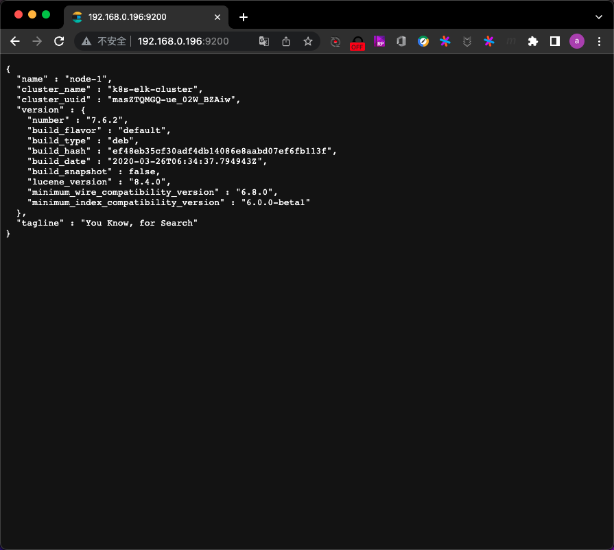

#### 3.2.2 配置Chrome插件

在谷歌应用商店中搜索Multi Elasticsearch Head,安装即可.


点击NEW,写入ES节点的IP地址和端口即可.

### 3.3 安装zookeeper和kafka

#### 3.3.1 安装JDK

```
root@kafka-1:~# apt update
```

```
root@kafka-1:~# apt install openjdk-8-jdk -y
...
Setting up openjdk-8-jdk:amd64 (8u312-b07-0ubuntu1~18.04) ...
update-alternatives: using /usr/lib/jvm/java-8-openjdk-amd64/bin/appletviewer to provide /usr/bin/appletviewer (appletviewer) in auto mode
update-alternatives: using /usr/lib/jvm/java-8-openjdk-amd64/bin/jconsole to provide /usr/bin/jconsole (jconsole) in auto mode
Processing triggers for libgdk-pixbuf2.0-0:amd64 (2.36.11-2) ...
Processing triggers for libc-bin (2.27-3ubuntu1.2) ...
```

这两部操作3个Kafka节点都要做.

#### 3.3.2 安装zookeeper

[zk3.5.9下载地址](https://dlcdn.apache.org/zookeeper/zookeeper-3.5.9/apache-zookeeper-3.5.9-bin.tar.gz)

- step1. 下载安装包

```
root@kafka-1:~# ls
apache-zookeeper-3.5.9-bin.tar.gz
```

此操作3个Kafka节点都要做.

- step2. 解压缩

```
root@kafka-1:~# mkdir /apps
root@kafka-1:~# mv apache-zookeeper-3.5.9-bin.tar.gz /apps/
root@kafka-1:~# cd /apps/
root@kafka-1:/apps# tar xvf apache-zookeeper-3.5.9-bin.tar.gz 
...apache-zookeeper-3.5.9-bin/lib/jackson-core-2.10.5.jar
apache-zookeeper-3.5.9-bin/lib/json-simple-1.1.1.jar
apache-zookeeper-3.5.9-bin/lib/jline-2.14.6.jar
```

- step3. 修改配置

	```
	root@kafka-1:/apps# cd apache-zookeeper-3.5.9-bin/
	root@kafka-1:/apps/apache-zookeeper-3.5.9-bin# cd conf/
	root@kafka-1:/apps/apache-zookeeper-3.5.9-bin/conf# cp zoo_sample.cfg zoo.cfg
	root@kafka-1:/apps/apache-zookeeper-3.5.9-bin/conf# vim zoo.cfg 
	root@kafka-1:/apps/apache-zookeeper-3.5.9-bin/conf# cat zoo.cfg
	# The number of milliseconds of each tick
	tickTime=2000
	# The number of ticks that the initial 
	# synchronization phase can take
	initLimit=10
	# The number of ticks that can pass between 
	# sending a request and getting an acknowledgement
	syncLimit=5
	# the directory where the snapshot is stored.
	# do not use /tmp for storage, /tmp here is just 
	# example sakes.
	dataDir=/data/zookeeper
	# the port at which the clients will connect
	clientPort=2181
	# the maximum number of client connections.
	# increase this if you need to handle more clients
	maxClientCnxns=60
	#
	# Be sure to read the maintenance section of the 
	# administrator guide before turning on autopurge.
	#
	# http://zookeeper.apache.org/doc/current/zookeeperAdmin.html#sc_maintenance
	#
	# The number of snapshots to retain in dataDir
	autopurge.snapRetainCount=3
	# Purge task interval in hours
	# Set to "0" to disable auto purge feature
	autopurge.purgeInterval=1
	
	server.1=192.168.0.201:2888:3888
	server.2=192.168.0.202:2888:3888
	server.3=192.168.0.203:2888:3888
	```
	
	- `tickTime`:每个票据的毫秒数.
	- `initLimit`:初始化时的执行次数.`initLimit`*`tickTime`即为ZK启动的超时控制.若超过这个时间ZK还没有启动成功,则判定为启动失败.
	- `syncLimit`:节点同步的次数.`syncLimit`*`tickTime`即为ZK中的一个节点的连接时长.若超过这个时间该节点还没有连接成功,则判定该节点挂了.
	- `dataDir`:ZK的数据存储目录
	- `clientPort`:客户端端口
	- `maxClientCnxns`:定义单个IP的最大连接数
	- `autopurge.snapRetainCount`:清理快照时保留的快照数量
	- `autopurge.purgeInterval`:每小时清理快照的次数
	- `server.1`:此处的1表示节点的ID,只要是唯一值即可.2888端口用于leader节点向slaver节点同步数据;3888端口用于同步状态,做选举和通告使用.

- step4. 同步配置到其他ZK节点

```
root@kafka-1:/apps/apache-zookeeper-3.5.9-bin/conf# scp zoo.cfg 192.168.0.202:/apps/apache-zookeeper-3.5.9-bin/conf
The authenticity of host '192.168.0.202 (192.168.0.202)' can't be established.
ECDSA key fingerprint is SHA256:ZbuZwjglHwZzlpX8dCFlpItWDzBK1x8/fmydaaGvwAc.
Are you sure you want to continue connecting (yes/no)? yes
Warning: Permanently added '192.168.0.202' (ECDSA) to the list of known hosts.
root@192.168.0.202's password: 
zoo.cfg                                                                                                                                                                                                                                       100% 1020     1.2MB/s   00:00    
root@kafka-1:/apps/apache-zookeeper-3.5.9-bin/conf# scp zoo.cfg 192.168.0.203:/apps/apache-zookeeper-3.5.9-bin/conf
The authenticity of host '192.168.0.203 (192.168.0.203)' can't be established.
ECDSA key fingerprint is SHA256:ZbuZwjglHwZzlpX8dCFlpItWDzBK1x8/fmydaaGvwAc.
Are you sure you want to continue connecting (yes/no)? yes
Warning: Permanently added '192.168.0.203' (ECDSA) to the list of known hosts.
root@192.168.0.203's password: 
zoo.cfg 
```

- step5. 创建数据存储目录

这一步所有ZK节点都要做

```
root@kafka-1:/apps/apache-zookeeper-3.5.9-bin/conf# mkdir -p /data/zookeeper
```

- step6. 每个节点创建ID

ZK的节点ID不会自行生成,需要用户手动创建.

注意:此处写入的ID的值要和配置文件中节点IP对应的ID值是一致的.

```
root@kafka-1:/apps/apache-zookeeper-3.5.9-bin/conf# echo 1 > /data/zookeeper/myid
```

```
root@kafka-2:/apps/apache-zookeeper-3.5.9-bin/conf# echo 2 > /data/zookeeper/myid
```

```
root@kafka-3:/apps/apache-zookeeper-3.5.9-bin/conf# echo 3 > /data/zookeeper/myid
```

- step7. 启动ZK

这一步手要快一点.因为配置了ZK的启动时间限制在20s之内.超时就起不来了.

```
root@kafka-1:/apps/apache-zookeeper-3.5.9-bin# ./bin/zkServer.sh start
/usr/bin/java
ZooKeeper JMX enabled by default
Using config: /apps/apache-zookeeper-3.5.9-bin/bin/../conf/zoo.cfg
Starting zookeeper ... STARTED
```

```
root@kafka-2:/apps/apache-zookeeper-3.5.9-bin/conf# cd ..
root@kafka-2:/apps/apache-zookeeper-3.5.9-bin# ./bin/zkServer.sh start
/usr/bin/java
ZooKeeper JMX enabled by default
Using config: /apps/apache-zookeeper-3.5.9-bin/bin/../conf/zoo.cfg
Starting zookeeper ... STARTED
```

```
root@kafka-3:/apps/apache-zookeeper-3.5.9-bin# ./bin/zkServer.sh start
/usr/bin/java
ZooKeeper JMX enabled by default
Using config: /apps/apache-zookeeper-3.5.9-bin/bin/../conf/zoo.cfg
Starting zookeeper ... STARTED
```

- step8. 查看ZK状态

```
root@kafka-1:/apps/apache-zookeeper-3.5.9-bin# ./bin/zkServer.sh status
/usr/bin/java
ZooKeeper JMX enabled by default
Using config: /apps/apache-zookeeper-3.5.9-bin/bin/../conf/zoo.cfg
Client port found: 2181. Client address: localhost. Client SSL: false.
Mode: follower
```

```
root@kafka-2:/apps/apache-zookeeper-3.5.9-bin# ./bin/zkServer.sh status
/usr/bin/java
ZooKeeper JMX enabled by default
Using config: /apps/apache-zookeeper-3.5.9-bin/bin/../conf/zoo.cfg
Client port found: 2181. Client address: localhost. Client SSL: false.
Mode: follower
```

```
root@kafka-3:/apps/apache-zookeeper-3.5.9-bin# ./bin/zkServer.sh status
/usr/bin/java
ZooKeeper JMX enabled by default
Using config: /apps/apache-zookeeper-3.5.9-bin/bin/../conf/zoo.cfg
Client port found: 2181. Client address: localhost. Client SSL: false.
Mode: leader
```

注意:此处若有节点状态为standAlone,就说明ZK起来了但是集群没配置对,需要重新配置.

#### 3.3.3 安装Kafka

- step1. 下载安装包

[Kafka2.4.1下载地址](https://archive.apache.org/dist/kafka/2.4.1/kafka_2.13-2.4.1.tgz)

```
root@kafka-1:~# ls
kafka_2.13-2.4.1.tgz
```

- step2. 安装kafka

```
root@kafka-1:~# mv kafka_2.13-2.4.1.tgz /apps/
root@kafka-1:~# cd /apps/
root@kafka-1:/apps# tar xvf kafka_2.13-2.4.1.tgz 
...
kafka_2.13-2.4.1/libs/kafka-streams-scala_2.13-2.4.1.jar
kafka_2.13-2.4.1/libs/kafka-streams-test-utils-2.4.1.jar
kafka_2.13-2.4.1/libs/kafka-streams-examples-2.4.1.jar
```

- step3. 配置kakfa

	此处每个节点的配置文件是不同的.
	
	- kafka-1的配置:
	
	```
	root@kafka-1:/apps# cd kafka_2.13-2.4.1/
	root@kafka-1:/apps/kafka_2.13-2.4.1# vim config/server.properties 
	root@kafka-1:/apps/kafka_2.13-2.4.1# cat config/server.properties
	# Licensed to the Apache Software Foundation (ASF) under one or more
	# contributor license agreements.  See the NOTICE file distributed with
	# this work for additional information regarding copyright ownership.
	# The ASF licenses this file to You under the Apache License, Version 2.0
	# (the "License"); you may not use this file except in compliance with
	# the License.  You may obtain a copy of the License at
	#
	#    http://www.apache.org/licenses/LICENSE-2.0
	#
	# Unless required by applicable law or agreed to in writing, software
	# distributed under the License is distributed on an "AS IS" BASIS,
	# WITHOUT WARRANTIES OR CONDITIONS OF ANY KIND, either express or implied.
	# See the License for the specific language governing permissions and
	# limitations under the License.
		
	# see kafka.server.KafkaConfig for additional details and defaults
		
	############################# Server Basics #############################
		
	# The id of the broker. This must be set to a unique integer for each broker.
	broker.id=1
		
	############################# Socket Server Settings #############################
		
	# The address the socket server listens on. It will get the value returned from 
	# java.net.InetAddress.getCanonicalHostName() if not configured.
	#   FORMAT:
	#     listeners = listener_name://host_name:port
	#   EXAMPLE:
	#     listeners = PLAINTEXT://your.host.name:9092
	listeners=PLAINTEXT://192.168.0.201:9092
	...
	
	# Maps listener names to security protocols, the default is for them to be the same. See the config documentation for more details
	#listener.security.protocol.map=PLAINTEXT:PLAINTEXT,SSL:SSL,SASL_PLAINTEXT:SASL_PLAINTEXT,SASL_SSL:SASL_SSL
	
	# The number of threads that the server uses for receiving requests from the network and sending responses to the network
	num.network.threads=3
	
	# The number of threads that the server uses for processing requests, which may include disk I/O
	num.io.threads=8
	
	# The send buffer (SO_SNDBUF) used by the socket server
	socket.send.buffer.bytes=102400
	
	# The receive buffer (SO_RCVBUF) used by the socket server
	socket.receive.buffer.bytes=102400
	
	# The maximum size of a request that the socket server will accept (protection against OOM)
	socket.request.max.bytes=104857600
	
	
	############################# Log Basics #############################
	
	# A comma separated list of directories under which to store log files
	log.dirs=/data/kafka-logs
	...
	# 中间没有要改的了 就不写了
	zookeeper.connect=192.168.0.201:2181,192.168.0.202:2181,192.168.0.203:2181
	# 后边没有要改的了 就不写了
	```
	
	- kafka-2的配置:
	
	```
	root@kafka-2:/apps# cd kafka_2.13-2.4.1/
	root@kafka-2:/apps/kafka_2.13-2.4.1# vim config/server.properties 
	root@kafka-2:/apps/kafka_2.13-2.4.1# cat config/server.properties
	# Licensed to the Apache Software Foundation (ASF) under one or more
	# contributor license agreements.  See the NOTICE file distributed with
	# this work for additional information regarding copyright ownership.
	# The ASF licenses this file to You under the Apache License, Version 2.0
	# (the "License"); you may not use this file except in compliance with
	# the License.  You may obtain a copy of the License at
	#
	#    http://www.apache.org/licenses/LICENSE-2.0
	#
	# Unless required by applicable law or agreed to in writing, software
	# distributed under the License is distributed on an "AS IS" BASIS,
	# WITHOUT WARRANTIES OR CONDITIONS OF ANY KIND, either express or implied.
	# See the License for the specific language governing permissions and
	# limitations under the License.
		
	# see kafka.server.KafkaConfig for additional details and defaults
		
	############################# Server Basics #############################
		
	# The id of the broker. This must be set to a unique integer for each broker.
	broker.id=2
		
	############################# Socket Server Settings #############################
		
	# The address the socket server listens on. It will get the value returned from 
	# java.net.InetAddress.getCanonicalHostName() if not configured.
	#   FORMAT:
	#     listeners = listener_name://host_name:port
	#   EXAMPLE:
	#     listeners = PLAINTEXT://your.host.name:9092
	listeners=PLAINTEXT://192.168.0.202:9092
	
	# Maps listener names to security protocols, the default is for them to be the same. See the config documentation for more details
	#listener.security.protocol.map=PLAINTEXT:PLAINTEXT,SSL:SSL,SASL_PLAINTEXT:SASL_PLAINTEXT,SASL_SSL:SASL_SSL
	
	# The number of threads that the server uses for receiving requests from the network and sending responses to the network
	num.network.threads=3
	
	# The number of threads that the server uses for processing requests, which may include disk I/O
	num.io.threads=8
	
	# The send buffer (SO_SNDBUF) used by the socket server
	socket.send.buffer.bytes=102400
	
	# The receive buffer (SO_RCVBUF) used by the socket server
	socket.receive.buffer.bytes=102400
	
	# The maximum size of a request that the socket server will accept (protection against OOM)
	socket.request.max.bytes=104857600
	
	
	############################# Log Basics #############################
	
	# A comma separated list of directories under which to store log files
	log.dirs=/data/kafka-logs
	...
	zookeeper.connect=192.168.0.201:2181,192.168.0.202:2181,192.168.0.203:2181
	...
	```
	
	- kafka-3的配置:
	
	```
	root@kafka-3:/apps# cd kafka_2.13-2.4.1/
	root@kafka-3:/apps/kafka_2.13-2.4.1# vim config/server.properties 
	root@kafka-3:/apps/kafka_2.13-2.4.1# cat config/server.properties
	# Licensed to the Apache Software Foundation (ASF) under one or more
	# contributor license agreements.  See the NOTICE file distributed with
	# this work for additional information regarding copyright ownership.
	# The ASF licenses this file to You under the Apache License, Version 2.0
	# (the "License"); you may not use this file except in compliance with
	# the License.  You may obtain a copy of the License at
	#
	#    http://www.apache.org/licenses/LICENSE-2.0
	#
	# Unless required by applicable law or agreed to in writing, software
	# distributed under the License is distributed on an "AS IS" BASIS,
	# WITHOUT WARRANTIES OR CONDITIONS OF ANY KIND, either express or implied.
	# See the License for the specific language governing permissions and
	# limitations under the License.
		
	# see kafka.server.KafkaConfig for additional details and defaults
		
	############################# Server Basics #############################
		
	# The id of the broker. This must be set to a unique integer for each broker.
	broker.id=3
		
	############################# Socket Server Settings #############################
		
	# The address the socket server listens on. It will get the value returned from 
	# java.net.InetAddress.getCanonicalHostName() if not configured.
	#   FORMAT:
	#     listeners = listener_name://host_name:port
	#   EXAMPLE:
	#     listeners = PLAINTEXT://your.host.name:9092
	listeners=PLAINTEXT://192.168.0.203:9092
	
	# Maps listener names to security protocols, the default is for them to be the same. See the config documentation for more details
	#listener.security.protocol.map=PLAINTEXT:PLAINTEXT,SSL:SSL,SASL_PLAINTEXT:SASL_PLAINTEXT,SASL_SSL:SASL_SSL
	
	# The number of threads that the server uses for receiving requests from the network and sending responses to the network
	num.network.threads=3
	
	# The number of threads that the server uses for processing requests, which may include disk I/O
	num.io.threads=8
	
	# The send buffer (SO_SNDBUF) used by the socket server
	socket.send.buffer.bytes=102400
	
	# The receive buffer (SO_RCVBUF) used by the socket server
	socket.receive.buffer.bytes=102400
	
	# The maximum size of a request that the socket server will accept (protection against OOM)
	socket.request.max.bytes=104857600
	
	
	############################# Log Basics #############################
	
	# A comma separated list of directories under which to store log files
	log.dirs=/data/kafka-logs
	...
	zookeeper.connect=192.168.0.201:2181,192.168.0.202:2181,192.168.0.203:2181
   ...
	```
	
	- `broker.id`:节点ID.集群中的节点ID不能重复且必须为int
	- `listeners`:kafka的监听地址.写本机IP即可
	- `log.dirs`:kafka日志存储目录
	- `zookeeper.connect`:zookeeper的地址和端口
	
	其他参数不用改.

- step4. 创建kafka日志存储路径

此操作3个kafka节点都要做

```
root@kafka-1:/apps/kafka_2.13-2.4.1# mkdir /data/kafka-logs
```

- step5. 启动kafka

此操作3个节点都要做

```
root@kafka-1:/apps/kafka_2.13-2.4.1# ln -sv /apps/kafka_2.13-2.4.1 /apps/kafka
'/apps/kafka' -> '/apps/kafka_2.13-2.4.1'
root@kafka-1:/apps/kafka_2.13-2.4.1# /apps/kafka/bin/kafka-server-start.sh -daemon /apps/kafka/config/server.properties
```

- step6. 测试

```
root@kafka-1:/apps/kafka_2.13-2.4.1# ss -tnl |grep 9092
LISTEN 0        50          [::ffff:192.168.0.201]:9092                 *:*   
```

### 3.4 业务镜像收集日志

#### 3.4.1 安装filebeat

实际上这一步已经做过了.在[构建系统镜像](https://github.com/rayallen20/K8SBaseStudy/blob/master/day8-kubernetes/day8-kubernetes.md#11-%E6%9E%84%E5%BB%BA%E5%9F%BA%E7%A1%80%E9%95%9C%E5%83%8F)时,就已经安装了filebeat.

#### 3.4.2 配置filebeat

##### 3.4.2.1 构建镜像

此处以tomcat为例,重新构建一个带有filebeat的镜像

- step1. 创建一些html文件模拟业务代码并打包

```
root@ks8-harbor-2:/opt/k8s-data# mkdir tomcat-app-log-img
root@ks8-harbor-2:/opt/k8s-data# cd tomcat-app-log-img/
root@ks8-harbor-2:/opt/k8s-data/tomcat-app-log-img# mkdir app
root@ks8-harbor-2:/opt/k8s-data/tomcat-app-log-img# cd app/
root@ks8-harbor-2:/opt/k8s-data/tomcat-app-log-img/app# vim index.html
root@ks8-harbor-2:/opt/k8s-data/tomcat-app-log-img/app# cat index.html
```

```html
<!DOCTYPE html>
<html lang="en">
<head>
    <meta charset="UTF-8">
    <title>app服务首页</title>
</head>
<body>
<h1>app V1 index page with log</h1>
</body>
</html>
```

打包:

```
root@ks8-harbor-2:/opt/k8s-data/tomcat-app-log-img/app# cd ..
root@ks8-harbor-2:/opt/k8s-data/tomcat-app-log-img# tar -zcvf app.tar.gz ./app/
./app/
./app/index.html
```

- step2. 编写catalina.sh

```
root@ks8-harbor-2:/opt/k8s-data/tomcat-app-log-img# vim catalina.sh
root@ks8-harbor-2:/opt/k8s-data/tomcat-app-log-img# cat catalina.sh
```

```shell
#!/bin/sh

# Licensed to the Apache Software Foundation (ASF) under one or more
# contributor license agreements.  See the NOTICE file distributed with
# this work for additional information regarding copyright ownership.
# The ASF licenses this file to You under the Apache License, Version 2.0
# (the "License"); you may not use this file except in compliance with
# the License.  You may obtain a copy of the License at
#
#     http://www.apache.org/licenses/LICENSE-2.0
#
# Unless required by applicable law or agreed to in writing, software
# distributed under the License is distributed on an "AS IS" BASIS,
# WITHOUT WARRANTIES OR CONDITIONS OF ANY KIND, either express or implied.
# See the License for the specific language governing permissions and
# limitations under the License.

# -----------------------------------------------------------------------------
# Control Script for the CATALINA Server
#
# Environment Variable Prerequisites
#
#   Do not set the variables in this script. Instead put them into a script
#   setenv.sh in CATALINA_BASE/bin to keep your customizations separate.
#
#   CATALINA_HOME   May point at your Catalina "build" directory.
#
#   CATALINA_BASE   (Optional) Base directory for resolving dynamic portions
#                   of a Catalina installation.  If not present, resolves to
#                   the same directory that CATALINA_HOME points to.
#
#   CATALINA_OUT    (Optional) Full path to a file where stdout and stderr
#                   will be redirected.
#                   Default is $CATALINA_BASE/logs/catalina.out
#
#   CATALINA_OPTS   (Optional) Java runtime options used when the "start",
#                   "run" or "debug" command is executed.
#                   Include here and not in JAVA_OPTS all options, that should
#                   only be used by Tomcat itself, not by the stop process,
#                   the version command etc.
#                   Examples are heap size, GC logging, JMX ports etc.
#
#   CATALINA_TMPDIR (Optional) Directory path location of temporary directory
#                   the JVM should use (java.io.tmpdir).  Defaults to
#                   $CATALINA_BASE/temp.
#
#   JAVA_HOME       Must point at your Java Development Kit installation.
#                   Required to run the with the "debug" argument.
#
#   JRE_HOME        Must point at your Java Runtime installation.
#                   Defaults to JAVA_HOME if empty. If JRE_HOME and JAVA_HOME
#                   are both set, JRE_HOME is used.
#
#   JAVA_OPTS       (Optional) Java runtime options used when any command
#                   is executed.
#                   Include here and not in CATALINA_OPTS all options, that
#                   should be used by Tomcat and also by the stop process,
#                   the version command etc.
#                   Most options should go into CATALINA_OPTS.
#
#   JAVA_ENDORSED_DIRS (Optional) Lists of of colon separated directories
#                   containing some jars in order to allow replacement of APIs
#                   created outside of the JCP (i.e. DOM and SAX from W3C).
#                   It can also be used to update the XML parser implementation.
#                   Note that Java 9 no longer supports this feature.
#                   Defaults to $CATALINA_HOME/endorsed.
#
#   JPDA_TRANSPORT  (Optional) JPDA transport used when the "jpda start"
#                   command is executed. The default is "dt_socket".
#
#   JPDA_ADDRESS    (Optional) Java runtime options used when the "jpda start"
#                   command is executed. The default is localhost:8000.
#
#   JPDA_SUSPEND    (Optional) Java runtime options used when the "jpda start"
#                   command is executed. Specifies whether JVM should suspend
#                   execution immediately after startup. Default is "n".
#
#   JPDA_OPTS       (Optional) Java runtime options used when the "jpda start"
#                   command is executed. If used, JPDA_TRANSPORT, JPDA_ADDRESS,
#                   and JPDA_SUSPEND are ignored. Thus, all required jpda
#                   options MUST be specified. The default is:
#
#                   -agentlib:jdwp=transport=$JPDA_TRANSPORT,
#                       address=$JPDA_ADDRESS,server=y,suspend=$JPDA_SUSPEND
#
#   JSSE_OPTS       (Optional) Java runtime options used to control the TLS
#                   implementation when JSSE is used. Default is:
#                   "-Djdk.tls.ephemeralDHKeySize=2048"
#
#   CATALINA_PID    (Optional) Path of the file which should contains the pid
#                   of the catalina startup java process, when start (fork) is
#                   used
#
#   LOGGING_CONFIG  (Optional) Override Tomcat's logging config file
#                   Example (all one line)
#                   LOGGING_CONFIG="-Djava.util.logging.config.file=$CATALINA_BASE/conf/logging.properties"
#
#   LOGGING_MANAGER (Optional) Override Tomcat's logging manager
#                   Example (all one line)
#                   LOGGING_MANAGER="-Djava.util.logging.manager=org.apache.juli.ClassLoaderLogManager"
#
#   USE_NOHUP       (Optional) If set to the string true the start command will
#                   use nohup so that the Tomcat process will ignore any hangup
#                   signals. Default is "false" unless running on HP-UX in which
#                   case the default is "true"
# -----------------------------------------------------------------------------

JAVA_OPTS="-server -Xms1g -Xmx1g -Xss512k -Xmn1g -XX:CMSInitiatingOccupancyFraction=65  -XX:+UseFastAccessorMethods -XX:+AggressiveOpts -XX:+UseBiasedLocking -XX:+DisableExplicitGC -XX:MaxTenuringThreshold=10 -XX:NewSize=2048M -XX:MaxNewSize=2048M -XX:NewRatio=2 -XX:PermSize=128m -XX:MaxPermSize=512m -XX:CMSFullGCsBeforeCompaction=5 -XX:+ExplicitGCInvokesConcurrent -XX:+UseConcMarkSweepGC -XX:+UseParNewGC -XX:+CMSParallelRemarkEnabled"

# OS specific support.  $var _must_ be set to either true or false.
cygwin=false
darwin=false
os400=false
hpux=false
case "`uname`" in
CYGWIN*) cygwin=true;;
Darwin*) darwin=true;;
OS400*) os400=true;;
HP-UX*) hpux=true;;
esac

# resolve links - $0 may be a softlink
PRG="$0"

while [ -h "$PRG" ]; do
  ls=`ls -ld "$PRG"`
  link=`expr "$ls" : '.*-> \(.*\)$'`
  if expr "$link" : '/.*' > /dev/null; then
    PRG="$link"
  else
    PRG=`dirname "$PRG"`/"$link"
  fi
done

# Get standard environment variables
PRGDIR=`dirname "$PRG"`

# Only set CATALINA_HOME if not already set
[ -z "$CATALINA_HOME" ] && CATALINA_HOME=`cd "$PRGDIR/.." >/dev/null; pwd`

# Copy CATALINA_BASE from CATALINA_HOME if not already set
[ -z "$CATALINA_BASE" ] && CATALINA_BASE="$CATALINA_HOME"

# Ensure that any user defined CLASSPATH variables are not used on startup,
# but allow them to be specified in setenv.sh, in rare case when it is needed.
CLASSPATH=

if [ -r "$CATALINA_BASE/bin/setenv.sh" ]; then
  . "$CATALINA_BASE/bin/setenv.sh"
elif [ -r "$CATALINA_HOME/bin/setenv.sh" ]; then
  . "$CATALINA_HOME/bin/setenv.sh"
fi

# For Cygwin, ensure paths are in UNIX format before anything is touched
if $cygwin; then
  [ -n "$JAVA_HOME" ] && JAVA_HOME=`cygpath --unix "$JAVA_HOME"`
  [ -n "$JRE_HOME" ] && JRE_HOME=`cygpath --unix "$JRE_HOME"`
  [ -n "$CATALINA_HOME" ] && CATALINA_HOME=`cygpath --unix "$CATALINA_HOME"`
  [ -n "$CATALINA_BASE" ] && CATALINA_BASE=`cygpath --unix "$CATALINA_BASE"`
  [ -n "$CLASSPATH" ] && CLASSPATH=`cygpath --path --unix "$CLASSPATH"`
fi

# Ensure that neither CATALINA_HOME nor CATALINA_BASE contains a colon
# as this is used as the separator in the classpath and Java provides no
# mechanism for escaping if the same character appears in the path.
case $CATALINA_HOME in
  *:*) echo "Using CATALINA_HOME:   $CATALINA_HOME";
       echo "Unable to start as CATALINA_HOME contains a colon (:) character";
       exit 1;
esac
case $CATALINA_BASE in
  *:*) echo "Using CATALINA_BASE:   $CATALINA_BASE";
       echo "Unable to start as CATALINA_BASE contains a colon (:) character";
       exit 1;
esac

# For OS400
if $os400; then
  # Set job priority to standard for interactive (interactive - 6) by using
  # the interactive priority - 6, the helper threads that respond to requests
  # will be running at the same priority as interactive jobs.
  COMMAND='chgjob job('$JOBNAME') runpty(6)'
  system $COMMAND

  # Enable multi threading
  export QIBM_MULTI_THREADED=Y
fi

# Get standard Java environment variables
if $os400; then
  # -r will Only work on the os400 if the files are:
  # 1. owned by the user
  # 2. owned by the PRIMARY group of the user
  # this will not work if the user belongs in secondary groups
  . "$CATALINA_HOME"/bin/setclasspath.sh
else
  if [ -r "$CATALINA_HOME"/bin/setclasspath.sh ]; then
    . "$CATALINA_HOME"/bin/setclasspath.sh
  else
    echo "Cannot find $CATALINA_HOME/bin/setclasspath.sh"
    echo "This file is needed to run this program"
    exit 1
  fi
fi

# Add on extra jar files to CLASSPATH
if [ ! -z "$CLASSPATH" ] ; then
  CLASSPATH="$CLASSPATH":
fi
CLASSPATH="$CLASSPATH""$CATALINA_HOME"/bin/bootstrap.jar

if [ -z "$CATALINA_OUT" ] ; then
  CATALINA_OUT="$CATALINA_BASE"/logs/catalina.out
fi

if [ -z "$CATALINA_TMPDIR" ] ; then
  # Define the java.io.tmpdir to use for Catalina
  CATALINA_TMPDIR="$CATALINA_BASE"/temp
fi

# Add tomcat-juli.jar to classpath
# tomcat-juli.jar can be over-ridden per instance
if [ -r "$CATALINA_BASE/bin/tomcat-juli.jar" ] ; then
  CLASSPATH=$CLASSPATH:$CATALINA_BASE/bin/tomcat-juli.jar
else
  CLASSPATH=$CLASSPATH:$CATALINA_HOME/bin/tomcat-juli.jar
fi

# Bugzilla 37848: When no TTY is available, don't output to console
have_tty=0
if [ "`tty`" != "not a tty" ]; then
    have_tty=1
fi

# For Cygwin, switch paths to Windows format before running java
if $cygwin; then
  JAVA_HOME=`cygpath --absolute --windows "$JAVA_HOME"`
  JRE_HOME=`cygpath --absolute --windows "$JRE_HOME"`
  CATALINA_HOME=`cygpath --absolute --windows "$CATALINA_HOME"`
  CATALINA_BASE=`cygpath --absolute --windows "$CATALINA_BASE"`
  CATALINA_TMPDIR=`cygpath --absolute --windows "$CATALINA_TMPDIR"`
  CLASSPATH=`cygpath --path --windows "$CLASSPATH"`
  JAVA_ENDORSED_DIRS=`cygpath --path --windows "$JAVA_ENDORSED_DIRS"`
fi

if [ -z "$JSSE_OPTS" ] ; then
  JSSE_OPTS="-Djdk.tls.ephemeralDHKeySize=2048"
fi
JAVA_OPTS="$JAVA_OPTS $JSSE_OPTS"

# Register custom URL handlers
# Do this here so custom URL handles (specifically 'war:...') can be used in the security policy
JAVA_OPTS="$JAVA_OPTS -Djava.protocol.handler.pkgs=org.apache.catalina.webresources"

# Set juli LogManager config file if it is present and an override has not been issued
if [ -z "$LOGGING_CONFIG" ]; then
  if [ -r "$CATALINA_BASE"/conf/logging.properties ]; then
    LOGGING_CONFIG="-Djava.util.logging.config.file=$CATALINA_BASE/conf/logging.properties"
  else
    # Bugzilla 45585
    LOGGING_CONFIG="-Dnop"
  fi
fi

if [ -z "$LOGGING_MANAGER" ]; then
  LOGGING_MANAGER="-Djava.util.logging.manager=org.apache.juli.ClassLoaderLogManager"
fi

# Java 9 no longer supports the java.endorsed.dirs
# system property. Only try to use it if
# JAVA_ENDORSED_DIRS was explicitly set
# or CATALINA_HOME/endorsed exists.
ENDORSED_PROP=ignore.endorsed.dirs
if [ -n "$JAVA_ENDORSED_DIRS" ]; then
    ENDORSED_PROP=java.endorsed.dirs
fi
if [ -d "$CATALINA_HOME/endorsed" ]; then
    ENDORSED_PROP=java.endorsed.dirs
fi

# Uncomment the following line to make the umask available when using the
# org.apache.catalina.security.SecurityListener
#JAVA_OPTS="$JAVA_OPTS -Dorg.apache.catalina.security.SecurityListener.UMASK=`umask`"

if [ -z "$USE_NOHUP" ]; then
    if $hpux; then
        USE_NOHUP="true"
    else
        USE_NOHUP="false"
    fi
fi
unset _NOHUP
if [ "$USE_NOHUP" = "true" ]; then
    _NOHUP=nohup
fi

# Add the JAVA 9 specific start-up parameters required by Tomcat
JDK_JAVA_OPTIONS="$JDK_JAVA_OPTIONS --add-opens=java.base/java.lang=ALL-UNNAMED"
JDK_JAVA_OPTIONS="$JDK_JAVA_OPTIONS --add-opens=java.rmi/sun.rmi.transport=ALL-UNNAMED"
export JDK_JAVA_OPTIONS

# ----- Execute The Requested Command -----------------------------------------

# Bugzilla 37848: only output this if we have a TTY
if [ $have_tty -eq 1 ]; then
  echo "Using CATALINA_BASE:   $CATALINA_BASE"
  echo "Using CATALINA_HOME:   $CATALINA_HOME"
  echo "Using CATALINA_TMPDIR: $CATALINA_TMPDIR"
  if [ "$1" = "debug" ] ; then
    echo "Using JAVA_HOME:       $JAVA_HOME"
  else
    echo "Using JRE_HOME:        $JRE_HOME"
  fi
  echo "Using CLASSPATH:       $CLASSPATH"
  if [ ! -z "$CATALINA_PID" ]; then
    echo "Using CATALINA_PID:    $CATALINA_PID"
  fi
fi

if [ "$1" = "jpda" ] ; then
  if [ -z "$JPDA_TRANSPORT" ]; then
    JPDA_TRANSPORT="dt_socket"
  fi
  if [ -z "$JPDA_ADDRESS" ]; then
    JPDA_ADDRESS="localhost:8000"
  fi
  if [ -z "$JPDA_SUSPEND" ]; then
    JPDA_SUSPEND="n"
  fi
  if [ -z "$JPDA_OPTS" ]; then
    JPDA_OPTS="-agentlib:jdwp=transport=$JPDA_TRANSPORT,address=$JPDA_ADDRESS,server=y,suspend=$JPDA_SUSPEND"
  fi
  CATALINA_OPTS="$JPDA_OPTS $CATALINA_OPTS"
  shift
fi

if [ "$1" = "debug" ] ; then
  if $os400; then
    echo "Debug command not available on OS400"
    exit 1
  else
    shift
    if [ "$1" = "-security" ] ; then
      if [ $have_tty -eq 1 ]; then
        echo "Using Security Manager"
      fi
      shift
      exec "$_RUNJDB" "$LOGGING_CONFIG" $LOGGING_MANAGER $JAVA_OPTS $CATALINA_OPTS \
        -D$ENDORSED_PROP="$JAVA_ENDORSED_DIRS" \
        -classpath "$CLASSPATH" \
        -sourcepath "$CATALINA_HOME"/../../java \
        -Djava.security.manager \
        -Djava.security.policy=="$CATALINA_BASE"/conf/catalina.policy \
        -Dcatalina.base="$CATALINA_BASE" \
        -Dcatalina.home="$CATALINA_HOME" \
        -Djava.io.tmpdir="$CATALINA_TMPDIR" \
        org.apache.catalina.startup.Bootstrap "$@" start
    else
      exec "$_RUNJDB" "$LOGGING_CONFIG" $LOGGING_MANAGER $JAVA_OPTS $CATALINA_OPTS \
        -D$ENDORSED_PROP="$JAVA_ENDORSED_DIRS" \
        -classpath "$CLASSPATH" \
        -sourcepath "$CATALINA_HOME"/../../java \
        -Dcatalina.base="$CATALINA_BASE" \
        -Dcatalina.home="$CATALINA_HOME" \
        -Djava.io.tmpdir="$CATALINA_TMPDIR" \
        org.apache.catalina.startup.Bootstrap "$@" start
    fi
  fi

elif [ "$1" = "run" ]; then

  shift
  if [ "$1" = "-security" ] ; then
    if [ $have_tty -eq 1 ]; then
      echo "Using Security Manager"
    fi
    shift
    eval exec "\"$_RUNJAVA\"" "\"$LOGGING_CONFIG\"" $LOGGING_MANAGER $JAVA_OPTS $CATALINA_OPTS \
      -D$ENDORSED_PROP="\"$JAVA_ENDORSED_DIRS\"" \
      -classpath "\"$CLASSPATH\"" \
      -Djava.security.manager \
      -Djava.security.policy=="\"$CATALINA_BASE/conf/catalina.policy\"" \
      -Dcatalina.base="\"$CATALINA_BASE\"" \
      -Dcatalina.home="\"$CATALINA_HOME\"" \
      -Djava.io.tmpdir="\"$CATALINA_TMPDIR\"" \
      org.apache.catalina.startup.Bootstrap "$@" start
  else
    eval exec "\"$_RUNJAVA\"" "\"$LOGGING_CONFIG\"" $LOGGING_MANAGER $JAVA_OPTS $CATALINA_OPTS \
      -D$ENDORSED_PROP="\"$JAVA_ENDORSED_DIRS\"" \
      -classpath "\"$CLASSPATH\"" \
      -Dcatalina.base="\"$CATALINA_BASE\"" \
      -Dcatalina.home="\"$CATALINA_HOME\"" \
      -Djava.io.tmpdir="\"$CATALINA_TMPDIR\"" \
      org.apache.catalina.startup.Bootstrap "$@" start
  fi

elif [ "$1" = "start" ] ; then

  if [ ! -z "$CATALINA_PID" ]; then
    if [ -f "$CATALINA_PID" ]; then
      if [ -s "$CATALINA_PID" ]; then
        echo "Existing PID file found during start."
        if [ -r "$CATALINA_PID" ]; then
          PID=`cat "$CATALINA_PID"`
          ps -p $PID >/dev/null 2>&1
          if [ $? -eq 0 ] ; then
            echo "Tomcat appears to still be running with PID $PID. Start aborted."
            echo "If the following process is not a Tomcat process, remove the PID file and try again:"
            ps -f -p $PID
            exit 1
          else
            echo "Removing/clearing stale PID file."
            rm -f "$CATALINA_PID" >/dev/null 2>&1
            if [ $? != 0 ]; then
              if [ -w "$CATALINA_PID" ]; then
                cat /dev/null > "$CATALINA_PID"
              else
                echo "Unable to remove or clear stale PID file. Start aborted."
                exit 1
              fi
            fi
          fi
        else
          echo "Unable to read PID file. Start aborted."
          exit 1
        fi
      else
        rm -f "$CATALINA_PID" >/dev/null 2>&1
        if [ $? != 0 ]; then
          if [ ! -w "$CATALINA_PID" ]; then
            echo "Unable to remove or write to empty PID file. Start aborted."
            exit 1
          fi
        fi
      fi
    fi
  fi

  shift
  touch "$CATALINA_OUT"
  if [ "$1" = "-security" ] ; then
    if [ $have_tty -eq 1 ]; then
      echo "Using Security Manager"
    fi
    shift
    eval $_NOHUP "\"$_RUNJAVA\"" "\"$LOGGING_CONFIG\"" $LOGGING_MANAGER $JAVA_OPTS $CATALINA_OPTS \
      -D$ENDORSED_PROP="\"$JAVA_ENDORSED_DIRS\"" \
      -classpath "\"$CLASSPATH\"" \
      -Djava.security.manager \
      -Djava.security.policy=="\"$CATALINA_BASE/conf/catalina.policy\"" \
      -Dcatalina.base="\"$CATALINA_BASE\"" \
      -Dcatalina.home="\"$CATALINA_HOME\"" \
      -Djava.io.tmpdir="\"$CATALINA_TMPDIR\"" \
      org.apache.catalina.startup.Bootstrap "$@" start \
      >> "$CATALINA_OUT" 2>&1 "&"

  else
    eval $_NOHUP "\"$_RUNJAVA\"" "\"$LOGGING_CONFIG\"" $LOGGING_MANAGER $JAVA_OPTS $CATALINA_OPTS \
      -D$ENDORSED_PROP="\"$JAVA_ENDORSED_DIRS\"" \
      -classpath "\"$CLASSPATH\"" \
      -Dcatalina.base="\"$CATALINA_BASE\"" \
      -Dcatalina.home="\"$CATALINA_HOME\"" \
      -Djava.io.tmpdir="\"$CATALINA_TMPDIR\"" \
      org.apache.catalina.startup.Bootstrap "$@" start \
      >> "$CATALINA_OUT" 2>&1 "&"

  fi

  if [ ! -z "$CATALINA_PID" ]; then
    echo $! > "$CATALINA_PID"
  fi

  echo "Tomcat started."

elif [ "$1" = "stop" ] ; then

  shift

  SLEEP=5
  if [ ! -z "$1" ]; then
    echo $1 | grep "[^0-9]" >/dev/null 2>&1
    if [ $? -gt 0 ]; then
      SLEEP=$1
      shift
    fi
  fi

  FORCE=0
  if [ "$1" = "-force" ]; then
    shift
    FORCE=1
  fi

  if [ ! -z "$CATALINA_PID" ]; then
    if [ -f "$CATALINA_PID" ]; then
      if [ -s "$CATALINA_PID" ]; then
        kill -0 `cat "$CATALINA_PID"` >/dev/null 2>&1
        if [ $? -gt 0 ]; then
          echo "PID file found but no matching process was found. Stop aborted."
          exit 1
        fi
      else
        echo "PID file is empty and has been ignored."
      fi
    else
      echo "\$CATALINA_PID was set but the specified file does not exist. Is Tomcat running? Stop aborted."
      exit 1
    fi
  fi

  eval "\"$_RUNJAVA\"" $LOGGING_MANAGER $JAVA_OPTS \
    -D$ENDORSED_PROP="\"$JAVA_ENDORSED_DIRS\"" \
    -classpath "\"$CLASSPATH\"" \
    -Dcatalina.base="\"$CATALINA_BASE\"" \
    -Dcatalina.home="\"$CATALINA_HOME\"" \
    -Djava.io.tmpdir="\"$CATALINA_TMPDIR\"" \
    org.apache.catalina.startup.Bootstrap "$@" stop

  # stop failed. Shutdown port disabled? Try a normal kill.
  if [ $? != 0 ]; then
    if [ ! -z "$CATALINA_PID" ]; then
      echo "The stop command failed. Attempting to signal the process to stop through OS signal."
      kill -15 `cat "$CATALINA_PID"` >/dev/null 2>&1
    fi
  fi

  if [ ! -z "$CATALINA_PID" ]; then
    if [ -f "$CATALINA_PID" ]; then
      while [ $SLEEP -ge 0 ]; do
        kill -0 `cat "$CATALINA_PID"` >/dev/null 2>&1
        if [ $? -gt 0 ]; then
          rm -f "$CATALINA_PID" >/dev/null 2>&1
          if [ $? != 0 ]; then
            if [ -w "$CATALINA_PID" ]; then
              cat /dev/null > "$CATALINA_PID"
              # If Tomcat has stopped don't try and force a stop with an empty PID file
              FORCE=0
            else
              echo "The PID file could not be removed or cleared."
            fi
          fi
          echo "Tomcat stopped."
          break
        fi
        if [ $SLEEP -gt 0 ]; then
          sleep 1
        fi
        if [ $SLEEP -eq 0 ]; then
          echo "Tomcat did not stop in time."
          if [ $FORCE -eq 0 ]; then
            echo "PID file was not removed."
          fi
          echo "To aid diagnostics a thread dump has been written to standard out."
          kill -3 `cat "$CATALINA_PID"`
        fi
        SLEEP=`expr $SLEEP - 1 `
      done
    fi
  fi

  KILL_SLEEP_INTERVAL=5
  if [ $FORCE -eq 1 ]; then
    if [ -z "$CATALINA_PID" ]; then
      echo "Kill failed: \$CATALINA_PID not set"
    else
      if [ -f "$CATALINA_PID" ]; then
        PID=`cat "$CATALINA_PID"`
        echo "Killing Tomcat with the PID: $PID"
        kill -9 $PID
        while [ $KILL_SLEEP_INTERVAL -ge 0 ]; do
            kill -0 `cat "$CATALINA_PID"` >/dev/null 2>&1
            if [ $? -gt 0 ]; then
                rm -f "$CATALINA_PID" >/dev/null 2>&1
                if [ $? != 0 ]; then
                    if [ -w "$CATALINA_PID" ]; then
                        cat /dev/null > "$CATALINA_PID"
                    else
                        echo "The PID file could not be removed."
                    fi
                fi
                echo "The Tomcat process has been killed."
                break
            fi
            if [ $KILL_SLEEP_INTERVAL -gt 0 ]; then
                sleep 1
            fi
            KILL_SLEEP_INTERVAL=`expr $KILL_SLEEP_INTERVAL - 1 `
        done
        if [ $KILL_SLEEP_INTERVAL -lt 0 ]; then
            echo "Tomcat has not been killed completely yet. The process might be waiting on some system call or might be UNINTERRUPTIBLE."
        fi
      fi
    fi
  fi

elif [ "$1" = "configtest" ] ; then

    eval "\"$_RUNJAVA\"" $LOGGING_MANAGER $JAVA_OPTS \
      -D$ENDORSED_PROP="\"$JAVA_ENDORSED_DIRS\"" \
      -classpath "\"$CLASSPATH\"" \
      -Dcatalina.base="\"$CATALINA_BASE\"" \
      -Dcatalina.home="\"$CATALINA_HOME\"" \
      -Djava.io.tmpdir="\"$CATALINA_TMPDIR\"" \
      org.apache.catalina.startup.Bootstrap configtest
    result=$?
    if [ $result -ne 0 ]; then
        echo "Configuration error detected!"
    fi
    exit $result

elif [ "$1" = "version" ] ; then

    "$_RUNJAVA"   \
      -classpath "$CATALINA_HOME/lib/catalina.jar" \
      org.apache.catalina.util.ServerInfo

else

  echo "Usage: catalina.sh ( commands ... )"
  echo "commands:"
  if $os400; then
    echo "  debug             Start Catalina in a debugger (not available on OS400)"
    echo "  debug -security   Debug Catalina with a security manager (not available on OS400)"
  else
    echo "  debug             Start Catalina in a debugger"
    echo "  debug -security   Debug Catalina with a security manager"
  fi
  echo "  jpda start        Start Catalina under JPDA debugger"
  echo "  run               Start Catalina in the current window"
  echo "  run -security     Start in the current window with security manager"
  echo "  start             Start Catalina in a separate window"
  echo "  start -security   Start in a separate window with security manager"
  echo "  stop              Stop Catalina, waiting up to 5 seconds for the process to end"
  echo "  stop n            Stop Catalina, waiting up to n seconds for the process to end"
  echo "  stop -force       Stop Catalina, wait up to 5 seconds and then use kill -KILL if still running"
  echo "  stop n -force     Stop Catalina, wait up to n seconds and then use kill -KILL if still running"
  echo "  configtest        Run a basic syntax check on server.xml - check exit code for result"
  echo "  version           What version of tomcat are you running?"
  echo "Note: Waiting for the process to end and use of the -force option require that \$CATALINA_PID is defined"
  exit 1

fi
```

- step3. 编写server.xml

```
root@ks8-harbor-2:/opt/k8s-data/tomcat-app-log-img# vim server.xml
root@ks8-harbor-2:/opt/k8s-data/tomcat-app-log-img# cat server.xml
```

```xml
<?xml version='1.0' encoding='utf-8'?>
<!--
  Licensed to the Apache Software Foundation (ASF) under one or more
  contributor license agreements.  See the NOTICE file distributed with
  this work for additional information regarding copyright ownership.
  The ASF licenses this file to You under the Apache License, Version 2.0
  (the "License"); you may not use this file except in compliance with
  the License.  You may obtain a copy of the License at

      http://www.apache.org/licenses/LICENSE-2.0

  Unless required by applicable law or agreed to in writing, software
  distributed under the License is distributed on an "AS IS" BASIS,
  WITHOUT WARRANTIES OR CONDITIONS OF ANY KIND, either express or implied.
  See the License for the specific language governing permissions and
  limitations under the License.
-->
<!-- Note:  A "Server" is not itself a "Container", so you may not
     define subcomponents such as "Valves" at this level.
     Documentation at /docs/config/server.html
 -->
<Server port="8005" shutdown="SHUTDOWN">
  <Listener className="org.apache.catalina.startup.VersionLoggerListener" />
  <!-- Security listener. Documentation at /docs/config/listeners.html
  <Listener className="org.apache.catalina.security.SecurityListener" />
  -->
  <!--APR library loader. Documentation at /docs/apr.html -->
  <Listener className="org.apache.catalina.core.AprLifecycleListener" SSLEngine="on" />
  <!-- Prevent memory leaks due to use of particular java/javax APIs-->
  <Listener className="org.apache.catalina.core.JreMemoryLeakPreventionListener" />
  <Listener className="org.apache.catalina.mbeans.GlobalResourcesLifecycleListener" />
  <Listener className="org.apache.catalina.core.ThreadLocalLeakPreventionListener" />

  <!-- Global JNDI resources
       Documentation at /docs/jndi-resources-howto.html
  -->
  <GlobalNamingResources>
    <!-- Editable user database that can also be used by
         UserDatabaseRealm to authenticate users
    -->
    <Resource name="UserDatabase" auth="Container"
              type="org.apache.catalina.UserDatabase"
              description="User database that can be updated and saved"
              factory="org.apache.catalina.users.MemoryUserDatabaseFactory"
              pathname="conf/tomcat-users.xml" />
  </GlobalNamingResources>

  <!-- A "Service" is a collection of one or more "Connectors" that share
       a single "Container" Note:  A "Service" is not itself a "Container",
       so you may not define subcomponents such as "Valves" at this level.
       Documentation at /docs/config/service.html
   -->
  <Service name="Catalina">

    <!--The connectors can use a shared executor, you can define one or more named thread pools-->
    <!--
    <Executor name="tomcatThreadPool" namePrefix="catalina-exec-"
        maxThreads="150" minSpareThreads="4"/>
    -->


    <!-- A "Connector" represents an endpoint by which requests are received
         and responses are returned. Documentation at :
         Java HTTP Connector: /docs/config/http.html (blocking & non-blocking)
         Java AJP  Connector: /docs/config/ajp.html
         APR (HTTP/AJP) Connector: /docs/apr.html
         Define a non-SSL/TLS HTTP/1.1 Connector on port 8080
    -->
    <Connector port="8080" protocol="HTTP/1.1"
               connectionTimeout="20000"
               redirectPort="8443" />
    <!-- A "Connector" using the shared thread pool-->
    <!--
    <Connector executor="tomcatThreadPool"
               port="8080" protocol="HTTP/1.1"
               connectionTimeout="20000"
               redirectPort="8443" />
    -->
    <!-- Define a SSL/TLS HTTP/1.1 Connector on port 8443
         This connector uses the NIO implementation that requires the JSSE
         style configuration. When using the APR/native implementation, the
         OpenSSL style configuration is required as described in the APR/native
         documentation -->
    <!--
    <Connector port="8443" protocol="org.apache.coyote.http11.Http11NioProtocol"
               maxThreads="150" SSLEnabled="true" scheme="https" secure="true"
               clientAuth="false" sslProtocol="TLS" />
    -->

    <!-- Define an AJP 1.3 Connector on port 8009 -->
    <Connector port="8009" protocol="AJP/1.3" redirectPort="8443" />


    <!-- An Engine represents the entry point (within Catalina) that processes
         every request.  The Engine implementation for Tomcat stand alone
         analyzes the HTTP headers included with the request, and passes them
         on to the appropriate Host (virtual host).
         Documentation at /docs/config/engine.html -->

    <!-- You should set jvmRoute to support load-balancing via AJP ie :
    <Engine name="Catalina" defaultHost="localhost" jvmRoute="jvm1">
    -->
    <Engine name="Catalina" defaultHost="localhost">

      <!--For clustering, please take a look at documentation at:
          /docs/cluster-howto.html  (simple how to)
          /docs/config/cluster.html (reference documentation) -->
      <!--
      <Cluster className="org.apache.catalina.ha.tcp.SimpleTcpCluster"/>
      -->

      <!-- Use the LockOutRealm to prevent attempts to guess user passwords
           via a brute-force attack -->
      <Realm className="org.apache.catalina.realm.LockOutRealm">
        <!-- This Realm uses the UserDatabase configured in the global JNDI
             resources under the key "UserDatabase".  Any edits
             that are performed against this UserDatabase are immediately
             available for use by the Realm.  -->
        <Realm className="org.apache.catalina.realm.UserDatabaseRealm"
               resourceName="UserDatabase"/>
      </Realm>

      <!-- appBase:存放代码的路径 unpackWARs:自动解压缩 修改为false autoDeploy:自动部署 修改为false -->
      <Host name="localhost"  appBase="/data/tomcat/webapps"  unpackWARs="false" autoDeploy="false">

        <!-- SingleSignOn valve, share authentication between web applications
             Documentation at: /docs/config/valve.html -->
        <!--
        <Valve className="org.apache.catalina.authenticator.SingleSignOn" />
        -->

        <!-- Access log processes all example.
             Documentation at: /docs/config/valve.html
             Note: The pattern used is equivalent to using pattern="common" -->
        <Valve className="org.apache.catalina.valves.AccessLogValve" directory="logs"
               prefix="localhost_access_log" suffix=".txt"
               pattern="%h %l %u %t &quot;%r&quot; %s %b" />

      </Host>
    </Engine>
  </Service>
</Server>
```

- step4. 编写启动tomcat的脚本run_tomcat.sh

```
root@ks8-harbor-2:/opt/k8s-data/tomcat-app-log-img# vim run_tomcat.sh
root@ks8-harbor-2:/opt/k8s-data/tomcat-app-log-img# cat run_tomcat.sh
```

```shell
#!/bin/bash
# 此处要先启动filebeat 在启动web服务
/usr/share/filebeat/bin/filebeat -e -c /etc/filebeat/filebeat.yml -path.home /usr/share/filebeat -path.config /etc/filebeat -path.data /var/lib/filebeat -path.logs /var/log/filebeat &
su - nginx -c "/apps/tomcat/bin/catalina.sh start"
tail -f /etc/hosts
```

- step5. 编写Dockerfile

```
root@ks8-harbor-2:/opt/k8s-data/tomcat-app-log-img# vim Dockerfile
root@ks8-harbor-2:/opt/k8s-data/tomcat-app-log-img# cat Dockerfile
```

```Dockerfile
FROM harbor.k8s.com/pub-images/tomcat-base:v8.5.43
MAINTAINER Roach 40486453@qq.com

ADD catalina.sh /apps/tomcat/bin/catalina.sh
ADD server.xml /apps/tomcat/conf/server.xml
ADD app.tar.gz /data/tomcat/webapps/myapp/
ADD run_tomcat.sh /apps/tomcat/bin/run_tomcat.sh

# 此处需将tomcat的安装路径和业务代码的存放路径的属主属组修改为和nginx容器中运行
# nginx的用户相同的用户
RUN chown -R nginx.nginx /data/ /apps/

# 安装filebeat
# ADD filebeat-7.6.2-x86_64.rpm /tmp
# RUN yum install -y /tmp/filebeat-7.6.2-x86_64.rpm
ADD filebeat.yml /etc/filebeat/filebeat.yml 

EXPOSE 8080 8443

CMD ["/apps/tomcat/bin/run_tomcat.sh"]
```

注意:若之前没安装filebeat,可以在此处安装

- step6. 编写构建业务镜像的脚本build-command.sh

```
root@ks8-harbor-2:/opt/k8s-data/tomcat-app-log-img# vim build-command.sh
root@ks8-harbor-2:/opt/k8s-data/tomcat-app-log-img# cat build-command.sh
```

```shell
#!/bin/bash
TAG=$1
docker build -t  harbor.k8s.com/erp/tomcat-webapp-log:${TAG} .
sleep 3
docker push  harbor.k8s.com/erp/tomcat-webapp-log:${TAG}
```

- step7. 编写filebeat的配置文件filebeat.yml

```
root@ks8-harbor-2:/opt/k8s-data/tomcat-app-log-img# vim filebeat.yml
root@ks8-harbor-2:/opt/k8s-data/tomcat-app-log-img# cat filebeat.yml
```

```yaml
filebeat.inputs:
# catalina启动日志
- type: log
  enabled: true
  # 要获取的日志路径
  paths:
    - /apps/tomcat/logs/catalina.out
  # 用于区分不同日志的字段
  fields:
    type: tomcat-catalina
- type: log
  enabled: true
  paths:
    - /apps/tomcat/logs/localhost_access_log.*.txt
  fields:
    type: tomcat-accesslog
setup.template.settings:
  index.number_of_shards: 1
output.kafka:
  hosts: ["192.168.0.201:9092", "192.168.0.202:9092", "192.168.0.203:9092"]
  # 1个topic中存了访问日志和错误日志2种日志
  topic: "erp-tomcat-app"
  # 写入时是否开启轮询
  partition.round_robin:
    reachable_only: false
  # 是否等待应答
  required_acks: 1
  # 可以节省带宽 但是会消耗CPU资源
  compression: gzip
  max_message_bytes: 1000000
```

- step8. 构建镜像

```
root@ks8-harbor-2:/opt/k8s-data/tomcat-app-log-img# chmod a+x *.sh
root@ks8-harbor-2:/opt/k8s-data/tomcat-app-log-img# bash build-command.sh v1
Sending build context to Docker daemon  24.13MB
Step 1/10 : FROM harbor.k8s.com/pub-images/tomcat-base:v8.5.43
 ---> ac083b512a5e
Step 2/10 : MAINTAINER Roach 40486453@qq.com
 ---> Using cache
 ---> c4b11096ebee
Step 3/10 : ADD catalina.sh /apps/tomcat/bin/catalina.sh
 ---> Using cache
 ---> a83642814cbe
Step 4/10 : ADD server.xml /apps/tomcat/conf/server.xml
 ---> Using cache
 ---> f4c4cdfe22c6
Step 5/10 : ADD app.tar.gz /data/tomcat/webapps/myapp/
 ---> Using cache
 ---> ac4ba6be6571
Step 6/10 : ADD run_tomcat.sh /apps/tomcat/bin/run_tomcat.sh
 ---> Using cache
 ---> 302e07240fc4
Step 7/10 : RUN chown -R nginx.nginx /data/ /apps/
 ---> Using cache
 ---> 05d367dc0768
Step 8/10 : ADD filebeat.yml /etc/filebeat/filebeat.yml
 ---> 2114cd65e1e8
Step 9/10 : EXPOSE 8080 8443
 ---> Running in 7a9519eb2fc6
Removing intermediate container 7a9519eb2fc6
 ---> 64696271ed85
Step 10/10 : CMD ["/apps/tomcat/bin/run_tomcat.sh"]
 ---> Running in cd0f457f86aa
Removing intermediate container cd0f457f86aa
 ---> 133bf6bc0713
Successfully built 133bf6bc0713
Successfully tagged harbor.k8s.com/erp/tomcat-webapp-log:v1
The push refers to repository [harbor.k8s.com/erp/tomcat-webapp-log]
35d33988c464: Pushed 
deb26251abf9: Pushed 
466e71dac997: Pushed 
e58b30696a6a: Pushed 
f2ce1438f2ed: Pushed 
f2d38c02d1c9: Pushed 
2bd93493f37e: Mounted from erp/dubboadmin 
055705620574: Mounted from erp/dubboadmin 
00316608f3f7: Mounted from erp/dubboadmin 
039fc3b13371: Mounted from erp/dubboadmin 
4ac69e34cb8f: Mounted from erp/dubboadmin 
2ee5b94985e2: Mounted from erp/dubboadmin 
9af9a18fb5a7: Mounted from erp/gray-released-app 
0c09dd020e8e: Mounted from erp/gray-released-app 
fb82b029bea0: Mounted from erp/gray-released-app 
v1: digest: sha256:b4e3161d8f3a0f98cf11515a043721b4dcc4b7fcb347aa7626beb7e42d3a7ad3 size: 3459
```

##### 3.4.2.2 在K8S上运行tomcat-webapp-log

- step1. 创建pod

```
root@k8s-master-1:~# cd k8s-data/
root@k8s-master-1:~/k8s-data# mkdir tomcat-app-log-yaml
root@k8s-master-1:~/k8s-data# cd tomcat-app-log-yaml/
root@k8s-master-1:~/k8s-data/tomcat-app-log-yaml# vim tomcat-app-log-deployment.yaml
root@k8s-master-1:~/k8s-data/tomcat-app-log-yaml# cat tomcat-app-log-deployment.yaml
```

```yaml
kind: Deployment
apiVersion: apps/v1
metadata:
  labels:
    app: erp-tomcat-app-logdeployment-label
  name: erp-tomcat-app-log-deployment
  namespace:
    erp
spec:
  replicas: 1
  selector:
    matchLabels:
      app: erp-tomcat-app-log-selector
  template:
    metadata:
      labels:
        app: erp-tomcat-app-log-selector
    spec:
      containers:
        - name: erp-tomcat-app-log-container
          image: harbor.k8s.com/erp/tomcat-webapp-log:v1
          imagePullPolicy: Always
          ports:
            - containerPort: 8080
              protocol: TCP
              name: http
          resources:
            limits:
              cpu: 1
              memory: "512Mi"
            requests:
              cpu: 500m
              memory: "512Mi"
```

```
root@k8s-master-1:~/k8s-data/tomcat-app-log-yaml# kubectl apply -f tomcat-app-log-deployment.yaml 
deployment.apps/erp-tomcat-app-log-deployment created
root@k8s-master-1:~/k8s-data/tomcat-app-log-yaml# kubectl get pod -n erp
NAME                                               READY   STATUS    RESTARTS   AGE
...
erp-tomcat-app-log-deployment-65766797f6-nb8t6     1/1     Running   0          16s
...
```

- step2. 创建service

```
root@k8s-master-1:~/k8s-data/tomcat-app-log-yaml# vim tomcat-app-log-service.yaml
root@k8s-master-1:~/k8s-data/tomcat-app-log-yaml# cat tomcat-app-log-service.yaml
```

```yaml
kind: Service
apiVersion: v1
metadata: 
  labels:
    app: erp-tomcat-app-log-service-label
  name: erp-tomcat-app-log-service
  namespace: erp
spec:
  type: NodePort
  ports:
  - name: http
    port: 80
    protocol: TCP
    targetPort: 8080
    nodePort: 40083
  selector:
    app: erp-tomcat-app-log-selector
```

```
root@k8s-master-1:~/k8s-data/tomcat-app-log-yaml# kubectl apply -f tomcat-app-log-service.yaml 
service/erp-tomcat-app-log-service created
root@k8s-master-1:~/k8s-data/tomcat-app-log-yaml# kubectl get svc -n erp
NAME                         TYPE        CLUSTER-IP       EXTERNAL-IP   PORT(S)                                        AGE
...
erp-tomcat-app-log-service   NodePort    10.100.73.243    <none>        80:40083/TCP                                   5s
...
```

- step3. 测试


#### 3.4.3 查看kafka中的topic

[offset explorer下载地址](https://www.kafkatool.com/download.html)

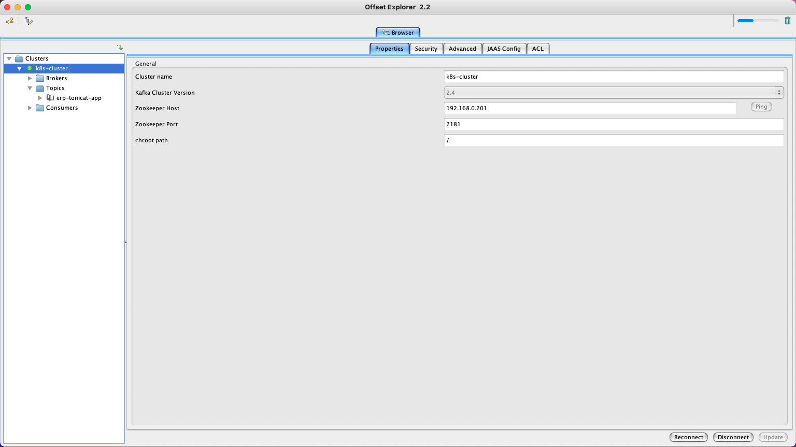

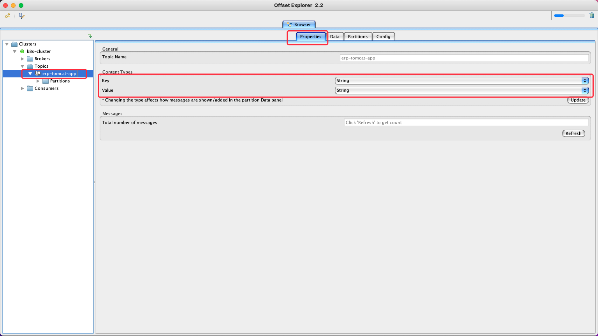

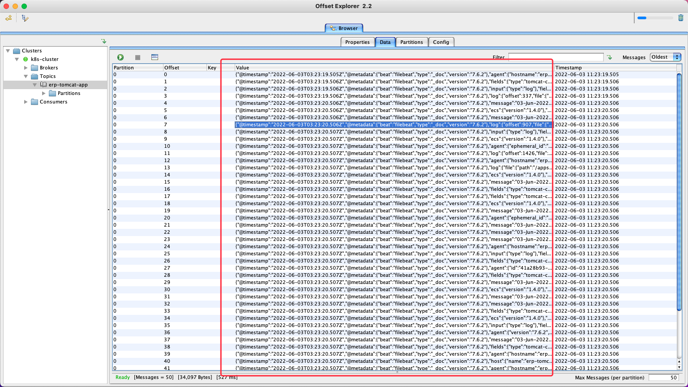

### 3.5 安装并配置logstash

- step1. 安装jdk

```
root@logstash-1:~# apt update
```

```
root@logstash-1:~# apt install openjdk-11-jdk -y
...done.
Processing triggers for mime-support (3.60ubuntu1) ...
Processing triggers for ureadahead (0.100.0-21) ...
Processing triggers for libc-bin (2.27-3ubuntu1.2) ...
Processing triggers for systemd (237-3ubuntu10.42) ...
Processing triggers for man-db (2.8.3-2ubuntu0.1) ...
```

- step2. 安装logstash

[logstash7.6.2下载地址](https://artifacts.elastic.co/downloads/logstash/logstash-7.6.2.deb)

```
root@logstash-1:~# ls
logstash-7.6.2.deb
```

```
root@logstash-1:~# dpkg -i logstash-7.6.2.deb 
Selecting previously unselected package logstash.
(Reading database ... 70036 files and directories currently installed.)
Preparing to unpack logstash-7.6.2.deb ...
Unpacking logstash (1:7.6.2-1) ...
Setting up logstash (1:7.6.2-1) ...
Using provided startup.options file: /etc/logstash/startup.options
OpenJDK 64-Bit Server VM warning: Option UseConcMarkSweepGC was deprecated in version 9.0 and will likely be removed in a future release.
WARNING: An illegal reflective access operation has occurred
WARNING: Illegal reflective access by com.headius.backport9.modules.Modules to method sun.nio.ch.NativeThread.signal(long)
WARNING: Please consider reporting this to the maintainers of com.headius.backport9.modules.Modules
WARNING: Use --illegal-access=warn to enable warnings of further illegal reflective access operations
WARNING: All illegal access operations will be denied in a future release
/usr/share/logstash/vendor/bundle/jruby/2.5.0/gems/pleaserun-0.0.30/lib/pleaserun/platform/base.rb:112: warning: constant ::Fixnum is deprecated
Successfully created system startup script for Logstash
```

- step3. 配置logstash

```
root@logstash-1:~# cd /etc/logstash/conf.d/
root@logstash-1:/etc/logstash/conf.d# vim kafka-to-es.conf
root@logstash-1:/etc/logstash/conf.d# cat kafka-to-es.conf
input {
  kafka {
    bootstrap_servers => "192.168.0.201:9092,192.168.0.202:9092,192.168.0.203:9092"
    topics => ["erp-tomcat-app"]
    codec => "json"	
  }
}

output {
  stdout {
    codec => rubydebug
  }
}
```

配置分为2部分:数据入口和数据出口

配置数据入口方向,本例中logstash的数据入口是kafka,因此定义入口为kafka

- `bootstrap_servers`:指定kafka的服务器地址
- `topics`:指定消费的topic

配置数据出口方向,本例中应该使用ES.但此处先测试能否从kafka中消费到数据.所以先输出到标准输出.

- step4. 启动logstash

测试配置文件:

```
root@logstash-1:/etc/logstash/conf.d# /usr/share/logstash/bin/logstash -f kafka-to-es.conf -t
OpenJDK 64-Bit Server VM warning: Option UseConcMarkSweepGC was deprecated in version 9.0 and will likely be removed in a future release.
WARNING: An illegal reflective access operation has occurred
WARNING: Illegal reflective access by com.headius.backport9.modules.Modules (file:/usr/share/logstash/logstash-core/lib/jars/jruby-complete-9.2.9.0.jar) to method sun.nio.ch.NativeThread.signal(long)
WARNING: Please consider reporting this to the maintainers of com.headius.backport9.modules.Modules
WARNING: Use --illegal-access=warn to enable warnings of further illegal reflective access operations
WARNING: All illegal access operations will be denied in a future release
WARNING: Could not find logstash.yml which is typically located in $LS_HOME/config or /etc/logstash. You can specify the path using --path.settings. Continuing using the defaults
Could not find log4j2 configuration at path /usr/share/logstash/config/log4j2.properties. Using default config which logs errors to the console
[WARN ] 2022-06-03 12:24:15.315 [LogStash::Runner] multilocal - Ignoring the 'pipelines.yml' file because modules or command line options are specified
[INFO ] 2022-06-03 12:24:16.412 [LogStash::Runner] Reflections - Reflections took 47 ms to scan 1 urls, producing 20 keys and 40 values 
Configuration OK
[INFO ] 2022-06-03 12:24:16.767 [LogStash::Runner] runner - Using config.test_and_exit mode. Config Validation Result: OK. Exiting Logstash
```

其中,`-f`参数指定配置文件,`-t`参数表示测试配置文件中的语法是否有误.

启动lagstash:

```
root@logstash-1:/etc/logstash/conf.d# /usr/share/logstash/bin/logstash -f kafka-to-es.conf
...
{
           "ecs" => {
        "version" => "1.4.0"
    },
      "@version" => "1",
          "host" => {
        "name" => "erp-tomcat-app-log-deployment-65766797f6-nb8t6"
    },
         "input" => {
        "type" => "log"
    },
           "log" => {
        "offset" => 3112,
          "file" => {
            "path" => "/apps/tomcat/logs/localhost_access_log.2022-06-03.txt"
        }
    },
       "message" => "10.200.109.64 - - [03/Jun/2022:12:27:23 +0800] \"GET /myapp/app/index.html HTTP/1.1\" 304 -",
         "agent" => {
            "hostname" => "erp-tomcat-app-log-deployment-65766797f6-nb8t6",
                  "id" => "41a28b93-8000-410f-8a58-34212c8878b7",
        "ephemeral_id" => "ba1918ee-76d2-4af8-82e5-4914ca285d4d",
                "type" => "filebeat",
             "version" => "7.6.2"
    },
        "fields" => {
        "type" => "tomcat-accesslog"
    },
    "@timestamp" => 2022-06-03T04:27:37.658Z
}
{
           "ecs" => {
        "version" => "1.4.0"
    },
      "@version" => "1",
          "host" => {
        "name" => "erp-tomcat-app-log-deployment-65766797f6-nb8t6"
    },
         "input" => {
        "type" => "log"
    },
           "log" => {
        "offset" => 3292,
          "file" => {
            "path" => "/apps/tomcat/logs/localhost_access_log.2022-06-03.txt"
        }
    },
       "message" => "10.200.109.64 - - [03/Jun/2022:12:27:23 +0800] \"GET /myapp/app/index.html HTTP/1.1\" 304 -",
         "agent" => {
            "hostname" => "erp-tomcat-app-log-deployment-65766797f6-nb8t6",
                  "id" => "41a28b93-8000-410f-8a58-34212c8878b7",
        "ephemeral_id" => "ba1918ee-76d2-4af8-82e5-4914ca285d4d",
                "type" => "filebeat",
             "version" => "7.6.2"
    },
        "fields" => {
        "type" => "tomcat-accesslog"
    },
    "@timestamp" => 2022-06-03T04:27:37.658Z
}
...
```

- step5. 修改配置文件,将输出指向ES

```
root@logstash-1:/etc/logstash/conf.d# vim kafka-to-es.conf 
root@logstash-1:/etc/logstash/conf.d# cat kafka-to-es.conf
input {
  kafka {
    bootstrap_servers => "192.168.0.201:9092,192.168.0.202:9092,192.168.0.203:9092"
    topics => ["erp-tomcat-app"]
    codec => "json"	
  }
}

output {
  if [fields][type] == "tomcat-accesslog" {
    elasticsearch {
      hosts => ["192.168.0.196:9200","192.168.0.197:9200","192.168.0.198:9200"]
      index => "erp-tomcat-app-accesslog-%{+yyyy.MM.dd}"
    }
  }

  if [fields][type] == "tomcat-catalina" {
    elasticsearch {
      hosts => ["192.168.0.196:9200","192.168.0.197:9200","192.168.0.198:9200"]
      index => "erp-tomcat-app-tomcat-catalinalog-%{+yyyy.MM.dd}"
    }
  }


  # stdout {
  #   codec => rubydebug
  # }
}
```

此处给index加了一个变量,是为了便于管理.通常日志不会全量保留.此处加了一个日期变量,就可以按日期删除,实现仅保留几天的日志.

- step6. 启动logstash

```
root@logstash-1:/etc/logstash/conf.d# /usr/share/logstash/bin/logstash -f kafka-to-es.conf
...
[INFO ] 2022-06-03 12:37:32.547 [[main]<kafka] AppInfoParser - Kafka version: 2.3.0
[INFO ] 2022-06-03 12:37:32.547 [[main]<kafka] AppInfoParser - Kafka commitId: fc1aaa116b661c8a
[INFO ] 2022-06-03 12:37:32.547 [[main]<kafka] AppInfoParser - Kafka startTimeMs: 1654231052545
[INFO ] 2022-06-03 12:37:32.555 [Ruby-0-Thread-15: :1] KafkaConsumer - [Consumer clientId=logstash-0, groupId=logstash] Subscribed to topic(s): erp-tomcat-app
[INFO ] 2022-06-03 12:37:32.737 [Ruby-0-Thread-15: :1] Metadata - [Consumer clientId=logstash-0, groupId=logstash] Cluster ID: ySuEvdlmQyGGoyUss8K47w
[INFO ] 2022-06-03 12:37:32.741 [Ruby-0-Thread-15: :1] AbstractCoordinator - [Consumer clientId=logstash-0, groupId=logstash] Discovered group coordinator 192.168.0.203:9092 (id: 2147483644 rack: null)
[INFO ] 2022-06-03 12:37:32.744 [Ruby-0-Thread-15: :1] ConsumerCoordinator - [Consumer clientId=logstash-0, groupId=logstash] Revoking previously assigned partitions []
[INFO ] 2022-06-03 12:37:32.744 [Ruby-0-Thread-15: :1] AbstractCoordinator - [Consumer clientId=logstash-0, groupId=logstash] (Re-)joining group
[INFO ] 2022-06-03 12:37:32.757 [Ruby-0-Thread-15: :1] AbstractCoordinator - [Consumer clientId=logstash-0, groupId=logstash] (Re-)joining group
[INFO ] 2022-06-03 12:37:32.765 [Ruby-0-Thread-15: :1] AbstractCoordinator - [Consumer clientId=logstash-0, groupId=logstash] Successfully joined group with generation 3
[INFO ] 2022-06-03 12:37:32.769 [Ruby-0-Thread-15: :1] ConsumerCoordinator - [Consumer clientId=logstash-0, groupId=logstash] Setting newly assigned partitions: erp-tomcat-app-0
[INFO ] 2022-06-03 12:37:32.780 [Ruby-0-Thread-15: :1] ConsumerCoordinator - [Consumer clientId=logstash-0, groupId=logstash] Setting offset for partition erp-tomcat-app-0 to the committed offset FetchPosition{offset=94, offsetEpoch=Optional[0], currentLeader=LeaderAndEpoch{leader=192.168.0.202:9092 (id: 2 rack: null), epoch=0}}
[INFO ] 2022-06-03 12:37:32.786 [Api Webserver] agent - Successfully started Logstash API endpoint {:port=>9600}
```

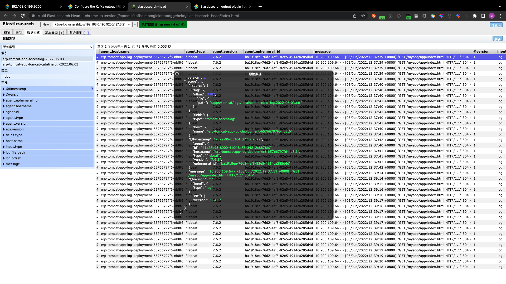

- step7. 后台运行logstash

```
root@logstash-1:/etc/logstash/conf.d# cd ~
root@logstash-1:~# /usr/share/logstash/bin/logstash -f /etc/logstash/conf.d/kafka-to-es.conf &
...
```

### 3.6 安装并配置kibana

注意:kibana要求版本必须和ES是相同的.

- step1. 下载安装包

[kibana7.6.2安装包](https://artifacts.elastic.co/downloads/kibana/kibana-7.6.2-amd64.deb)

kibana就是个前端工具,随便找一个节点装上就行.此处安装在es-1节点上.

```
root@es-1:~# ls
elasticsearch-7.6.2-amd64.deb  kibana-7.6.2-amd64.deb
```

- step2. 安装

```
root@es-1:~# dpkg -i kibana-7.6.2-amd64.deb 
Selecting previously unselected package kibana.
(Reading database ... 68079 files and directories currently installed.)
Preparing to unpack kibana-7.6.2-amd64.deb ...
Unpacking kibana (7.6.2) ...
Setting up kibana (7.6.2) ...
Processing triggers for ureadahead (0.100.0-21) ...
Processing triggers for systemd (237-3ubuntu10.42) ...
```

- step3. 配置

	```
	root@es-1:~# vim /etc/kibana/kibana.yml 
	root@es-1:~# cat /etc/kibana/kibana.yml
	```
	
	```yaml
	# Kibana is served by a back end server. This setting specifies the port to use.
	server.port: 5601
	
	# Specifies the address to which the Kibana server will bind. IP addresses and host names are both valid values.
	# The default is 'localhost', which usually means remote machines will not be able to connect.
	# To allow connections from remote users, set this parameter to a non-loopback address.
	server.host: "192.168.0.196"
	
	# Enables you to specify a path to mount Kibana at if you are running behind a proxy.
	# Use the `server.rewriteBasePath` setting to tell Kibana if it should remove the basePath
	# from requests it receives, and to prevent a deprecation warning at startup.
	# This setting cannot end in a slash.
	#server.basePath: ""
	
	# Specifies whether Kibana should rewrite requests that are prefixed with
	# `server.basePath` or require that they are rewritten by your reverse proxy.
	# This setting was effectively always `false` before Kibana 6.3 and will
	# default to `true` starting in Kibana 7.0.
	#server.rewriteBasePath: false
	
	# The maximum payload size in bytes for incoming server requests.
	#server.maxPayloadBytes: 1048576
	
	# The Kibana server's name.  This is used for display purposes.
	#server.name: "your-hostname"
	
	# The URLs of the Elasticsearch instances to use for all your queries.
	elasticsearch.hosts: ["http://192.168.0.196:9200"]
	
	# When this setting's value is true Kibana uses the hostname specified in the server.host
	# setting. When the value of this setting is false, Kibana uses the hostname of the host
	# that connects to this Kibana instance.
	#elasticsearch.preserveHost: true
	
	# Kibana uses an index in Elasticsearch to store saved searches, visualizations and
	# dashboards. Kibana creates a new index if the index doesn't already exist.
	#kibana.index: ".kibana"
	
	# The default application to load.
	#kibana.defaultAppId: "home"
	
	# If your Elasticsearch is protected with basic authentication, these settings provide
	# the username and password that the Kibana server uses to perform maintenance on the Kibana
	# index at startup. Your Kibana users still need to authenticate with Elasticsearch, which
	# is proxied through the Kibana server.
	#elasticsearch.username: "kibana"
	#elasticsearch.password: "pass"
	
	# Enables SSL and paths to the PEM-format SSL certificate and SSL key files, respectively.
	# These settings enable SSL for outgoing requests from the Kibana server to the browser.
	#server.ssl.enabled: false
	#server.ssl.certificate: /path/to/your/server.crt
	#server.ssl.key: /path/to/your/server.key
	
	# Optional settings that provide the paths to the PEM-format SSL certificate and key files.
	# These files are used to verify the identity of Kibana to Elasticsearch and are required when
	# xpack.security.http.ssl.client_authentication in Elasticsearch is set to required.
	#elasticsearch.ssl.certificate: /path/to/your/client.crt
	#elasticsearch.ssl.key: /path/to/your/client.key
	
	# Optional setting that enables you to specify a path to the PEM file for the certificate
	# authority for your Elasticsearch instance.
	#elasticsearch.ssl.certificateAuthorities: [ "/path/to/your/CA.pem" ]
	
	# To disregard the validity of SSL certificates, change this setting's value to 'none'.
	#elasticsearch.ssl.verificationMode: full
	
	# Time in milliseconds to wait for Elasticsearch to respond to pings. Defaults to the value of
	# the elasticsearch.requestTimeout setting.
	#elasticsearch.pingTimeout: 1500
	
	# Time in milliseconds to wait for responses from the back end or Elasticsearch. This value
	# must be a positive integer.
	#elasticsearch.requestTimeout: 30000
	
	# List of Kibana client-side headers to send to Elasticsearch. To send *no* client-side
	# headers, set this value to [] (an empty list).
	#elasticsearch.requestHeadersWhitelist: [ authorization ]
	
	# Header names and values that are sent to Elasticsearch. Any custom headers cannot be overwritten
	# by client-side headers, regardless of the elasticsearch.requestHeadersWhitelist configuration.
	#elasticsearch.customHeaders: {}
	
	# Time in milliseconds for Elasticsearch to wait for responses from shards. Set to 0 to disable.
	#elasticsearch.shardTimeout: 30000
	
	# Time in milliseconds to wait for Elasticsearch at Kibana startup before retrying.
	#elasticsearch.startupTimeout: 5000
	
	# Logs queries sent to Elasticsearch. Requires logging.verbose set to true.
	#elasticsearch.logQueries: false
	
	# Specifies the path where Kibana creates the process ID file.
	#pid.file: /var/run/kibana.pid
	
	# Enables you specify a file where Kibana stores log output.
	#logging.dest: stdout
	
	# Set the value of this setting to true to suppress all logging output.
	#logging.silent: false
	
	# Set the value of this setting to true to suppress all logging output other than error messages.
	#logging.quiet: false
	
	# Set the value of this setting to true to log all events, including system usage information
	# and all requests.
	#logging.verbose: false
	
	# Set the interval in milliseconds to sample system and process performance
	# metrics. Minimum is 100ms. Defaults to 5000.
	#ops.interval: 5000
	
	# Specifies locale to be used for all localizable strings, dates and number formats.
	# Supported languages are the following: English - en , by default , Chinese - zh-CN .
	#i18n.locale: "en"
	```
	
	- `server.port`:服务端口.通常打开注释就行,不用改.
	- `server.host`:监听的IP地址.写本机的IP即可.
	- `elasticsearch.hosts`:ES的地址.此处随便写ES集群中的一个节点的IP就行
	- `i18n.locale`:可以修改为`zh-CN`.

- step4. 重启kibana

```
root@es-1:~# systemctl restart kibana.service
root@es-1:~# ss -tnl|grep 5601
LISTEN  0        128                  192.168.0.196:5601          0.0.0.0:* 
```

- step5. 在kibana上查看ES的数据

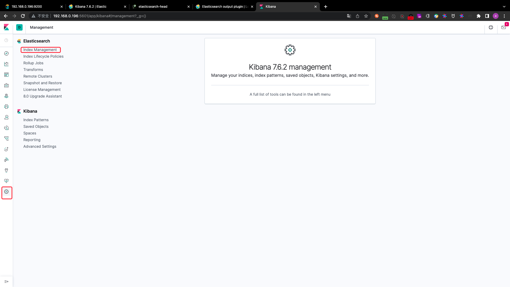

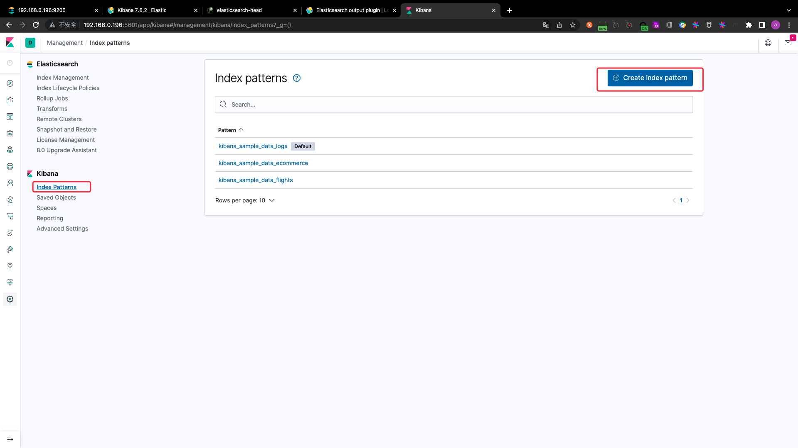

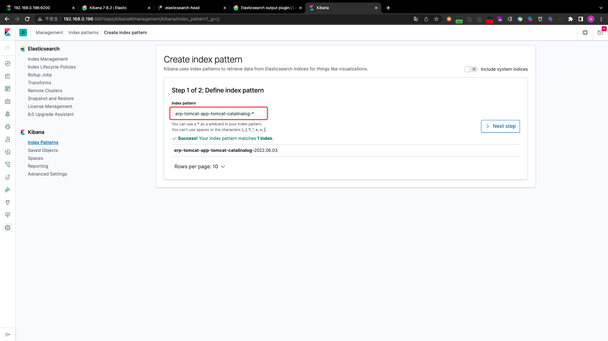

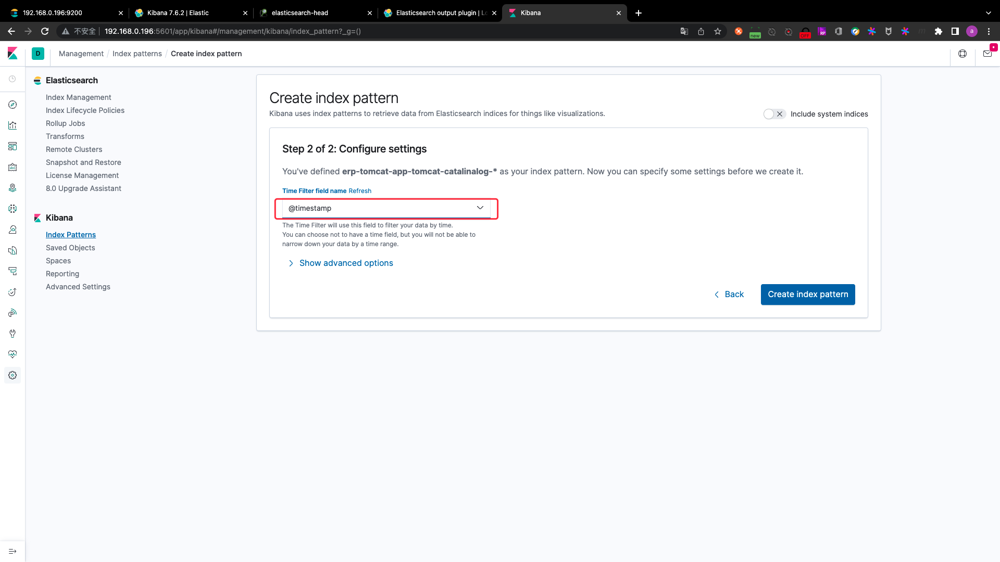

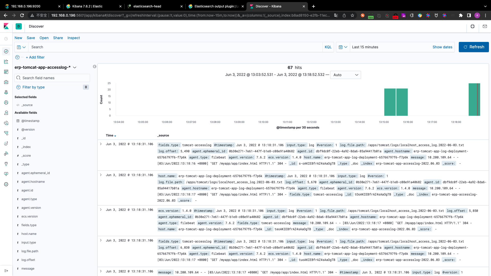