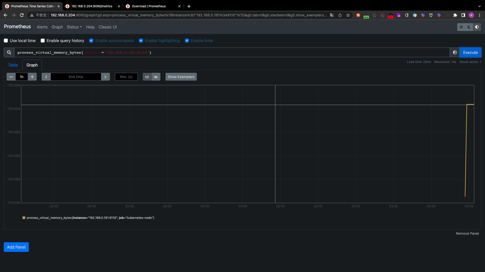
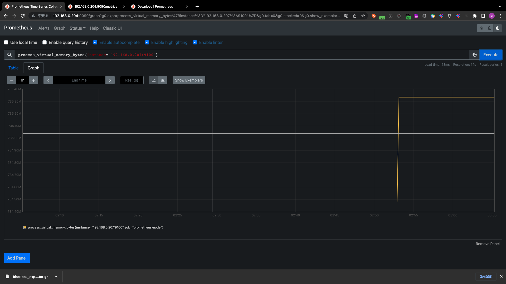
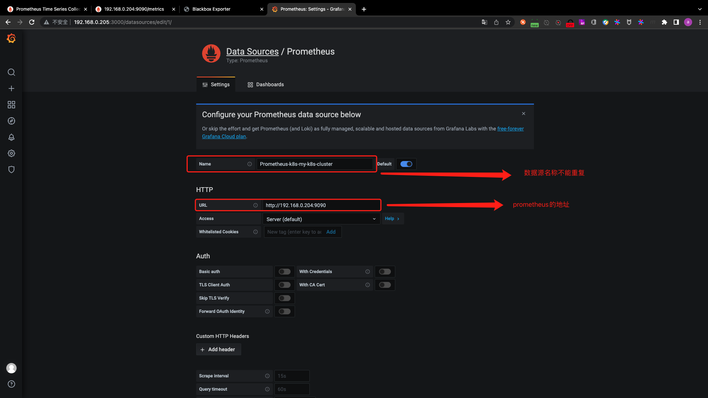
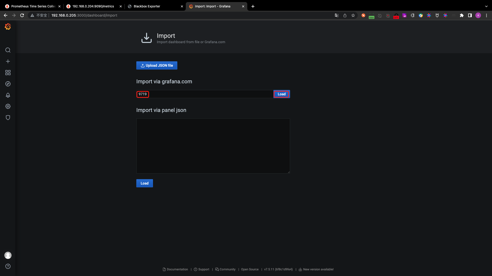
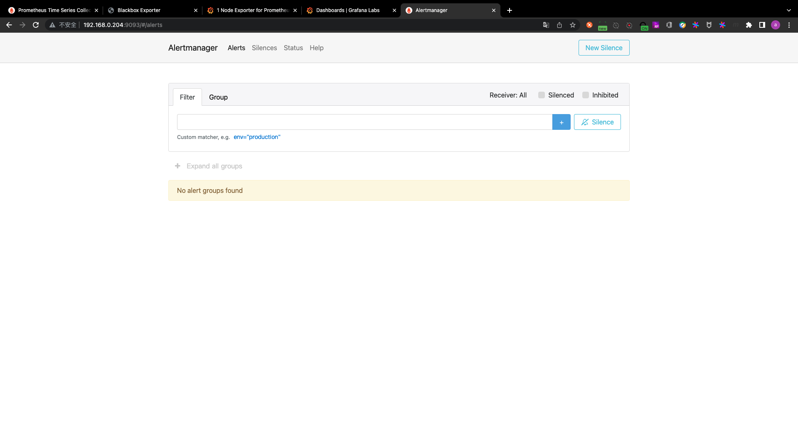
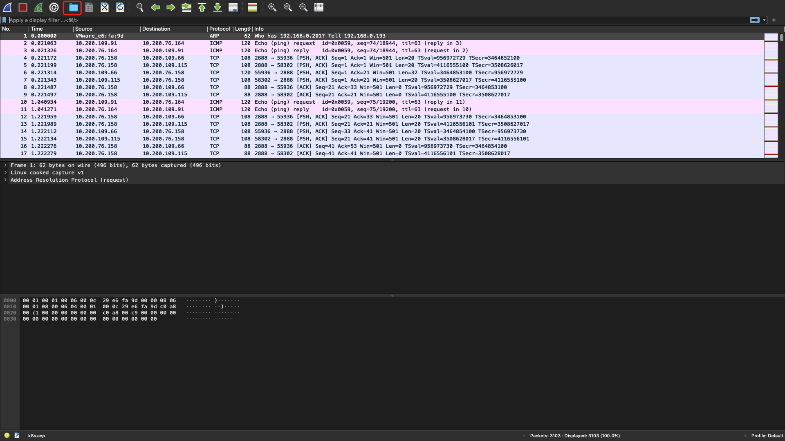

# day12-kubernetes

## PART1. 监控简介

亚马逊副总裁、CTO 沃纳·沃格斯(Werner Voegls)说过:"You build it, you run it, you monitor it."(你构建了它,你运行它,你就有责任监控它.)


### 1.1 监控概述

- 系统层监控:CPU、内存、网卡、磁盘利用率、带宽利用率、延迟、丢包率、交换机、路由器、防火墙等基础设施监控
- web监控:打开速度、URL 打开状态码、API 接口可用性
- 业务监控:订单交易量、活跃用户量、支付量
- 中间件监控:数据库、redis、kafka、MQ、API等

### 1.2 监控规划


### 1.3 监控方案

开源监控软件:cacti、nagios、zabbix、smokeping、open-falcon、prometheus、商业监控等

#### 1.3.1 Cacti

早期项目

[官网](https://www.cacti.net/)

[github项目地址](https://github.com/Cacti/cacti)

- Cacti是基于LAMP平台展现的网络流量监测及分析工具,通过SNMP技术或自定义脚本从目标设备/主机获取监控指标信息
- 其次进行数据存储,调用模板将数据存到数据库,使用rrdtool存储和更新数据,通过rrdtool绘制结果图形
- 最后进行数据展现,通过Web方式将监控结果呈现出来,常用于在数据中心监控网络设备

#### 1.3.2 Nagios

早期项目

[官网](https://www.nagios.org/)

Nagios用来监视系统和网络的开源应用软件,利用其众多的插件实现对本机和远端服务的监控,当被监控对象发生异常时,会及时向管理员告警,提供一批预设好的监控插件,用户可以直接调用,也可以自定义Shell脚本来监控服务,适合各企业的业务监控,可通过Web页面显示对象状态、日志、告警信息,分层告警机制及自定义监控相对薄弱.

#### 1.3.3 SmokePing

主要是监控网络性能的

[官网](https://oss.oetiker.ch/smokeping/)

Smokeping是一款用于网络性能监测的开源监控软件,主要用于对IDC的网络状况,网络质量,稳定性等做检测,通过rrdtool制图方式,图形化的展示网络的时延情况,进而能够清楚的判断出网络的即时通信情况.

#### 1.3.4 Open-falcon

[官网](https://www.open-falcon.org/)

[github项目地址](https://github.com/XiaoMi/open-falcon)

小米公司开源出来的监控软件open-falcon(鹰隼),监控能力和性能较强.

#### 1.3.5 Nightngale(夜莺)

[官网](https://n9e.didiyun.com/)

一款经过大规模生产环境验证的、分布式高性能的运维监控系统,由滴滴基于open-falcon二次开发后开源出来的分布式监控系统.

#### 1.3.6 Zabbix

[官网](https://www.zabbix.com/cn/)

目前使用较多的开源监控软件,可横向扩展、自定义监控项、支持多种监控方式、可监控网络与服务等

#### 1.3.7 商业监控解决方案

[监控宝](https://www.jiankongbao.com/)

[听云](https://www.tingyun.com/)

#### 1.3.8 Prometheus

Prometheus是基于go语言开发的一套开源的监控、报警和时间序列数据库的组合,是由SoundCloud公司开发的开源监控系统,Prometheus于2016年加入CNCF(Cloud Native Computing Foundation,云原生计算基金会),2018年8月9日prometheus成为CNCF基金会继kubernetes之后毕业的第二个项目,prometheus在容器和微服务领域中得到了广泛的应用,其特点主要如下:

- 使用key-value的多维度格式保存数据
- 数据不使用MySQL这样的传统数据库,而是使用时序数据库,目前是使用的[TSDB](https://www.aliyun.com/product/hitsdb)
- 支持第三方dashboard实现更好的图形界面,如grafana(Grafana2.5.0版本及以上)
- 功能组件化
- 不需要依赖存储,数据可以本地保存也可以远程保存
- 服务自动化发现
- 强大的数据查询语句(PromQL,Prometheus Query Language)
- 支持不同语言开发的客户端
- 官方和社区推出很多[exporter](https://prometheus.io/docs/instrumenting/exporters/)(exporter用于在被监控节点上收集数据并以API的方式展示,可以认为exporter就是客户端)


图中展示的就是一个exporter.Prometheus server向exporter发起一个GET请求,拿到exporter提供的数据后保存,就完成了1次收集.这就意味着,收集数据的服务对客户端语言没有要求,只要能够按照Prometheus server定义的数据结构提供数据即可.

## PART2. Prometheus简介与安装

服务器规划:

|主机名|公网IP|内网IP|
|:-:|:-:|:-:|
|prometheus-server-1|192.168.0.204|172.16.1.204|
|prometheus-server-2|192.168.0.205|172.16.1.205|
|prometheus-server-3|192.168.0.206|172.16.1.206|
|prometheus-node-1|192.168.0.207|172.16.1.207|
|prometheus-node-2|192.168.0.208|172.16.1.208|
|prometheus-node-3|192.168.0.209|172.16.1.209|

### 2.1 组件介绍

- prometheus server:主服务,接受外部http请求,收集、存储与查询数据等
- prometheus targets:静态收集的目标服务数据
- service discovery:动态发现服务
- prometheus alerting:报警通知
- push gateway:数据收集代理服务器(类似于zabbix proxy)
- data visualization and export:数据可视化与数据导出(访问客户端)


### 2.2 Prometheus server安装


[官方安装文档](https://prometheus.io/docs/prometheus/latest/installation/)

prometheus可以通过多种方式安装

#### 2.2.1 通过容器启动

使用docker运行prometheus,要考虑如何管理配置文件的问题

此处使用prometheus-server-2节点演示:

```
root@prometheus-server-2:~# docker pull prom/prometheus:v2.31.1
v2.31.1: Pulling from prom/prometheus
aa2a8d90b84c: Pull complete 
b45d31ee2d7f: Pull complete 
7d3b94bc0edd: Pull complete 
ddd09594f788: Pull complete 
620e8dfd5447: Pull complete 
21b2df964046: Pull complete 
ddbba1a8341e: Pull complete 
ceb78b2ad8d8: Pull complete 
cf4a6b37f5be: Pull complete 
ae4192f5013d: Pull complete 
f87c90634d35: Pull complete 
1860fdfbca21: Pull complete 
Digest: sha256:a8779cfe553e0331e9046268e26c539fa39ecf90d59836d828163e65e8f4fa35
Status: Downloaded newer image for prom/prometheus:v2.31.1
docker.io/prom/prometheus:v2.31.1
```

运行时先不考虑配置文件的问题:

```
root@prometheus-server-2:~# docker run -p 9090:9090 prom/prometheus:v2.31.1
ts=2022-06-09T14:03:02.457Z caller=main.go:406 level=info msg="No time or size retention was set so using the default time retention" duration=15d
ts=2022-06-09T14:03:02.457Z caller=main.go:444 level=info msg="Starting Prometheus" version="(version=2.31.1, branch=HEAD, revision=411021ada9ab41095923b8d2df9365b632fd40c3)"
ts=2022-06-09T14:03:02.457Z caller=main.go:449 level=info build_context="(go=go1.17.3, user=root@9419c9c2d4e0, date=20211105-20:35:02)"
ts=2022-06-09T14:03:02.457Z caller=main.go:450 level=info host_details="(Linux 4.15.0-112-generic #113-Ubuntu SMP Thu Jul 9 23:41:39 UTC 2020 x86_64 8997d8e2f324 (none))"
ts=2022-06-09T14:03:02.458Z caller=main.go:451 level=info fd_limits="(soft=1048576, hard=1048576)"
ts=2022-06-09T14:03:02.458Z caller=main.go:452 level=info vm_limits="(soft=unlimited, hard=unlimited)"
ts=2022-06-09T14:03:02.460Z caller=web.go:542 level=info component=web msg="Start listening for connections" address=0.0.0.0:9090
ts=2022-06-09T14:03:02.461Z caller=tls_config.go:195 level=info component=web msg="TLS is disabled." http2=false
ts=2022-06-09T14:03:02.461Z caller=main.go:839 level=info msg="Starting TSDB ..."
ts=2022-06-09T14:03:02.464Z caller=head.go:479 level=info component=tsdb msg="Replaying on-disk memory mappable chunks if any"
ts=2022-06-09T14:03:02.464Z caller=head.go:513 level=info component=tsdb msg="On-disk memory mappable chunks replay completed" duration=2.231µs
ts=2022-06-09T14:03:02.464Z caller=head.go:519 level=info component=tsdb msg="Replaying WAL, this may take a while"
ts=2022-06-09T14:03:02.464Z caller=head.go:590 level=info component=tsdb msg="WAL segment loaded" segment=0 maxSegment=0
ts=2022-06-09T14:03:02.465Z caller=head.go:596 level=info component=tsdb msg="WAL replay completed" checkpoint_replay_duration=24.677µs wal_replay_duration=374.161µs total_replay_duration=515.473µs
ts=2022-06-09T14:03:02.466Z caller=main.go:866 level=info fs_type=EXT4_SUPER_MAGIC
ts=2022-06-09T14:03:02.466Z caller=main.go:869 level=info msg="TSDB started"
ts=2022-06-09T14:03:02.466Z caller=main.go:996 level=info msg="Loading configuration file" filename=/etc/prometheus/prometheus.yml
ts=2022-06-09T14:03:02.466Z caller=main.go:1033 level=info msg="Completed loading of configuration file" filename=/etc/prometheus/prometheus.yml totalDuration=549.55µs db_storage=573ns remote_storage=1.346µs web_handler=276ns query_engine=667ns scrape=207.599µs scrape_sd=13.559µs notify=20.006µs notify_sd=6.101µs rules=899ns
ts=2022-06-09T14:03:02.467Z caller=main.go:811 level=info msg="Server is ready to receive web requests."
```


这种方式用的不多,故不详细介绍

#### 2.2.2 在线安装

这种方式安装的prometheus的版本不会太高,因为仓库里没有比较新的版本.

```
root@prometheus-server-2:~# apt-cache madison prometheus
prometheus | 2.1.0+ds-1 | http://us.archive.ubuntu.com/ubuntu bionic/universe amd64 Packages
```

直接安装即可:

```
root@prometheus-server-2:~# apt install prometheus
...
Processing triggers for man-db (2.8.3-2ubuntu0.1) ...
Processing triggers for ureadahead (0.100.0-21) ...
Processing triggers for systemd (237-3ubuntu10.42) ...
```


#### 2.2.3 operator部署

[opeartor项目地址](https://github.com/prometheus-operator/kube-prometheus)

operator是coreos官方(不是prometheus官方)提供的安装方式.需要在K8S的管理端(master节点)上部署.

```
# git clone https://github.com/prometheus-operator/kube-prometheus.git
# cd kube-prometheus/
# kubectl apply -f manifests/setup
# kubectl apply -f manifests/
```

- step1. 拉取项目

此处由于我的K8S集群版本为1.21,故只能拉取release-0.9版本的operator

```
root@k8s-master-1:~# git clone -b release-0.9 https://github.com/prometheus-operator/kube-prometheus.git
Cloning into 'kube-prometheus'...
remote: Enumerating objects: 16271, done.
remote: Counting objects: 100% (192/192), done.
remote: Compressing objects: 100% (89/89), done.
remote: Total 16271 (delta 129), reused 141 (delta 96), pack-reused 16079
Receiving objects: 100% (16271/16271), 8.11 MiB | 102.00 KiB/s, done.
Resolving deltas: 100% (10459/10459), done.
```

- step2. 执行安装的yaml文件

```
root@k8s-master-1:~# cd kube-prometheus/manifests/setup/
root@k8s-master-1:~/kube-prometheus/manifests/setup# ls
0namespace-namespace.yaml                                             prometheus-operator-0probeCustomResourceDefinition.yaml           prometheus-operator-0thanosrulerCustomResourceDefinition.yaml  prometheus-operator-serviceAccount.yaml
prometheus-operator-0alertmanagerConfigCustomResourceDefinition.yaml  prometheus-operator-0prometheusCustomResourceDefinition.yaml      prometheus-operator-clusterRoleBinding.yaml                    prometheus-operator-service.yaml
prometheus-operator-0alertmanagerCustomResourceDefinition.yaml        prometheus-operator-0prometheusruleCustomResourceDefinition.yaml  prometheus-operator-clusterRole.yaml
prometheus-operator-0podmonitorCustomResourceDefinition.yaml          prometheus-operator-0servicemonitorCustomResourceDefinition.yaml  prometheus-operator-deployment.yaml
root@k8s-master-1:~/kube-prometheus/manifests/setup# kubectl apply -f .
namespace/monitoring created
customresourcedefinition.apiextensions.k8s.io/alertmanagerconfigs.monitoring.coreos.com created
customresourcedefinition.apiextensions.k8s.io/alertmanagers.monitoring.coreos.com created
customresourcedefinition.apiextensions.k8s.io/podmonitors.monitoring.coreos.com created
customresourcedefinition.apiextensions.k8s.io/probes.monitoring.coreos.com created
customresourcedefinition.apiextensions.k8s.io/prometheuses.monitoring.coreos.com created
customresourcedefinition.apiextensions.k8s.io/prometheusrules.monitoring.coreos.com created
customresourcedefinition.apiextensions.k8s.io/servicemonitors.monitoring.coreos.com created
customresourcedefinition.apiextensions.k8s.io/thanosrulers.monitoring.coreos.com created
clusterrole.rbac.authorization.k8s.io/prometheus-operator created
clusterrolebinding.rbac.authorization.k8s.io/prometheus-operator created
deployment.apps/prometheus-operator created
service/prometheus-operator created
serviceaccount/prometheus-operator created
```

- step3. 检测容器是否启动

```
root@k8s-master-1:~/kube-prometheus/manifests/setup# kubectl get pod -n monitoring
NAME                                   READY   STATUS    RESTARTS   AGE
prometheus-operator-75d9b475d9-z9hh8   2/2     Running   0          101s
```

- step4. 部署prometheus

```
root@k8s-master-1:~/kube-prometheus/manifests/setup# cd ..
root@k8s-master-1:~/kube-prometheus/manifests# ls
alertmanager-alertmanager.yaml             grafana-dashboardDatasources.yaml                    kube-state-metrics-clusterRoleBinding.yaml  prometheus-adapter-apiService.yaml                          prometheus-clusterRole.yaml
alertmanager-podDisruptionBudget.yaml      grafana-dashboardDefinitions.yaml                    kube-state-metrics-clusterRole.yaml         prometheus-adapter-clusterRoleAggregatedMetricsReader.yaml  prometheus-operator-prometheusRule.yaml
alertmanager-prometheusRule.yaml           grafana-dashboardSources.yaml                        kube-state-metrics-deployment.yaml          prometheus-adapter-clusterRoleBindingDelegator.yaml         prometheus-operator-serviceMonitor.yaml
alertmanager-secret.yaml                   grafana-deployment.yaml                              kube-state-metrics-prometheusRule.yaml      prometheus-adapter-clusterRoleBinding.yaml                  prometheus-podDisruptionBudget.yaml
alertmanager-serviceAccount.yaml           grafana-serviceAccount.yaml                          kube-state-metrics-serviceAccount.yaml      prometheus-adapter-clusterRoleServerResources.yaml          prometheus-prometheusRule.yaml
alertmanager-serviceMonitor.yaml           grafana-serviceMonitor.yaml                          kube-state-metrics-serviceMonitor.yaml      prometheus-adapter-clusterRole.yaml                         prometheus-prometheus.yaml
alertmanager-service.yaml                  grafana-service.yaml                                 kube-state-metrics-service.yaml             prometheus-adapter-configMap.yaml                           prometheus-roleBindingConfig.yaml
blackbox-exporter-clusterRoleBinding.yaml  kube-prometheus-prometheusRule.yaml                  node-exporter-clusterRoleBinding.yaml       prometheus-adapter-deployment.yaml                          prometheus-roleBindingSpecificNamespaces.yaml
blackbox-exporter-clusterRole.yaml         kubernetes-prometheusRule.yaml                       node-exporter-clusterRole.yaml              prometheus-adapter-podDisruptionBudget.yaml                 prometheus-roleConfig.yaml
blackbox-exporter-configuration.yaml       kubernetes-serviceMonitorApiserver.yaml              node-exporter-daemonset.yaml                prometheus-adapter-roleBindingAuthReader.yaml               prometheus-roleSpecificNamespaces.yaml
blackbox-exporter-deployment.yaml          kubernetes-serviceMonitorCoreDNS.yaml                node-exporter-prometheusRule.yaml           prometheus-adapter-serviceAccount.yaml                      prometheus-serviceAccount.yaml
blackbox-exporter-serviceAccount.yaml      kubernetes-serviceMonitorKubeControllerManager.yaml  node-exporter-serviceAccount.yaml           prometheus-adapter-serviceMonitor.yaml                      prometheus-serviceMonitor.yaml
blackbox-exporter-serviceMonitor.yaml      kubernetes-serviceMonitorKubelet.yaml                node-exporter-serviceMonitor.yaml           prometheus-adapter-service.yaml                             prometheus-service.yaml
blackbox-exporter-service.yaml             kubernetes-serviceMonitorKubeScheduler.yaml          node-exporter-service.yaml                  prometheus-clusterRoleBinding.yaml                          setup
root@k8s-master-1:~/kube-prometheus/manifests# grep k8s.gcr.io ./*
./kube-state-metrics-deployment.yaml:        image: k8s.gcr.io/kube-state-metrics/kube-state-metrics:v2.1.1
./prometheus-adapter-deployment.yaml:        image: k8s.gcr.io/prometheus-adapter/prometheus-adapter:v0.9.0
```

注意:这两个镜像不科学上网下不下来,得先下到自己的harbor仓库中

```
root@ks8-harbor-2:~# docker pull bitnami/kube-state-metrics:2.1.1
2.1.1: Pulling from bitnami/kube-state-metrics
2e4c6c15aa52: Pull complete 
13e12a9585e3: Pull complete 
7747b935266f: Pull complete 
dbd484a99ad1: Pull complete 
314989dae046: Pull complete 
Digest: sha256:6f9ef36908e58a1e79a42925f7c5b5e0c151430eb917d161dd6ec920ace765c9
Status: Downloaded newer image for bitnami/kube-state-metrics:2.1.1
docker.io/bitnami/kube-state-metrics:2.1.1
root@ks8-harbor-2:~# docker tag bitnami/kube-state-metrics:2.1.1 harbor.k8s.com/operator/kube-state-metrics:2.1.1
root@ks8-harbor-2:~# docker push harbor.k8s.com/operator/kube-state-metrics:2.1.1
The push refers to repository [harbor.k8s.com/operator/kube-state-metrics]
3833b025563d: Pushed 
f7fe56afe3ce: Pushed 
39d4d1867f9e: Pushed 
027852007ad2: Pushed 
209a01d06165: Pushed 
2.1.1: digest: sha256:6f9ef36908e58a1e79a42925f7c5b5e0c151430eb917d161dd6ec920ace765c9 size: 1366
```

```
root@ks8-harbor-2:~# docker pull willdockerhub/prometheus-adapter:v0.9.0
v0.9.0: Pulling from willdockerhub/prometheus-adapter
0d7d70899875: Pull complete 
9101555ad5ba: Pull complete 
Digest: sha256:1ee5ec118dc55988794b4132b5518de885e35f71a1dcab9c7ba5f811616f9edd
Status: Downloaded newer image for willdockerhub/prometheus-adapter:v0.9.0
docker.io/willdockerhub/prometheus-adapter:v0.9.0
root@ks8-harbor-2:~# docker tag willdockerhub/prometheus-adapter:v0.9.0 harbor.k8s.com/operator/prometheus-adapter:v0.9.0
root@ks8-harbor-2:~# docker push harbor.k8s.com/operator/prometheus-adapter:v0.9.0
The push refers to repository [harbor.k8s.com/operator/prometheus-adapter]
487bf6315880: Pushed 
07363fa84210: Pushed 
v0.9.0: digest: sha256:2ffef2ecfa11f052de52a214ff17dc8209d168a9aeb9f3ab74c238308524caf4 size: 739
```

然后替换yaml文件中的镜像地址即可

```
root@k8s-master-1:~/kube-prometheus/manifests# kubectl apply -f .
alertmanager.monitoring.coreos.com/main created
Warning: policy/v1beta1 PodDisruptionBudget is deprecated in v1.21+, unavailable in v1.25+; use policy/v1 PodDisruptionBudget
poddisruptionbudget.policy/alertmanager-main created
prometheusrule.monitoring.coreos.com/alertmanager-main-rules created
...
serviceaccount/prometheus-k8s created
servicemonitor.monitoring.coreos.com/prometheus-k8s created
```

```
root@k8s-master-1:~/kube-prometheus/manifests# kubectl get pod -n monitoring
NAME                                   READY   STATUS    RESTARTS   AGE
alertmanager-main-0                    2/2     Running   2          47m
alertmanager-main-1                    2/2     Running   2          47m
alertmanager-main-2                    2/2     Running   2          47m
blackbox-exporter-6798fb5bb4-2cxwh     3/3     Running   3          47m
grafana-7476b4c65b-rlbn9               1/1     Running   1          47m
kube-state-metrics-f79f987fd-jrbwk     3/3     Running   4          47m
node-exporter-86cjr                    2/2     Running   2          47m
node-exporter-pxzf6                    2/2     Running   0          47m
node-exporter-sl64b                    2/2     Running   2          47m
node-exporter-txwss                    2/2     Running   0          47m
node-exporter-tznnk                    2/2     Running   0          47m
node-exporter-vzd8z                    2/2     Running   0          47m
prometheus-adapter-fd9975c8c-kg8fn     1/1     Running   2          47m
prometheus-adapter-fd9975c8c-trrxp     1/1     Running   3          47m
prometheus-k8s-0                       2/2     Running   2          47m
prometheus-k8s-1                       2/2     Running   2          47m
prometheus-operator-75d9b475d9-z9hh8   2/2     Running   4          71m
```

其中`prometheus-k8s-X`、`grafana-xxx-xxx`是需要访问的,但需要修改yaml文件.因为operator默认配置的service都是ClusterIP类型的service.

```
root@k8s-master-1:~/kube-prometheus/manifests# kubectl get svc -n monitoring
NAME                    TYPE        CLUSTER-IP       EXTERNAL-IP   PORT(S)                      AGE
alertmanager-main       ClusterIP   10.100.207.241   <none>        9093/TCP                     156m
alertmanager-operated   ClusterIP   None             <none>        9093/TCP,9094/TCP,9094/UDP   156m
blackbox-exporter       ClusterIP   10.100.227.19    <none>        9115/TCP,19115/TCP           156m
grafana                 ClusterIP   10.100.119.21    <none>        3000/TCP                     156m
kube-state-metrics      ClusterIP   None             <none>        8443/TCP,9443/TCP            156m
node-exporter           ClusterIP   None             <none>        9100/TCP                     156m
prometheus-adapter      ClusterIP   10.100.141.165   <none>        443/TCP                      156m
prometheus-k8s          ClusterIP   10.100.60.202    <none>        9090/TCP                     156m
prometheus-operated     ClusterIP   None             <none>        9090/TCP                     156m
prometheus-operator     ClusterIP   None             <none>        8443/TCP                     3h1m
```

有2种方式可以访问:

1. 修改service的yaml文件,将service修改为NodePort类型
2. 临时访问:`kubectl --namespace monitoring port-forward --address 0.0.0.0 svc/prometheus-k8s 
9090:9090`和` kubectl --namespace monitoring port-forward --address 0.0.0.0 svc/grafana 3000:3000`.即把当前节点上的任何一个网卡地址的9090端口转发到名为`prometheus-k8s`的service中;把当前节点上的任何一个网卡地址的3000端口转发到名为`grafana`的service中

- step5. 修改名为`prometheus-k8s`的service的yaml文件,使得prometheus可以被外部访问

```
root@k8s-master-1:~/kube-prometheus/manifests# vim prometheus-service.yaml
root@k8s-master-1:~/kube-prometheus/manifests# cat prometheus-service.yaml
```

```yaml
apiVersion: v1
kind: Service
metadata:
  labels:
    app.kubernetes.io/component: prometheus
    app.kubernetes.io/name: prometheus
    app.kubernetes.io/part-of: kube-prometheus
    app.kubernetes.io/version: 2.29.1
    prometheus: k8s
  name: prometheus-k8s
  namespace: monitoring
spec:
  type: NodePort
  ports:
  - name: web
    port: 9090
    nodePort: 39090
    targetPort: web
  selector:
    app: prometheus
    app.kubernetes.io/component: prometheus
    app.kubernetes.io/name: prometheus
    app.kubernetes.io/part-of: kube-prometheus
    prometheus: k8s
  sessionAffinity: ClientIP
```

```
root@k8s-master-1:~/kube-prometheus/manifests# kubectl apply -f prometheus-service.yaml
service/prometheus-k8s configured
root@k8s-master-1:~/kube-prometheus/manifests# kubectl get svc -n monitoring
NAME                    TYPE        CLUSTER-IP       EXTERNAL-IP   PORT(S)                      AGE
alertmanager-main       ClusterIP   10.100.207.241   <none>        9093/TCP                     165m
alertmanager-operated   ClusterIP   None             <none>        9093/TCP,9094/TCP,9094/UDP   165m
blackbox-exporter       ClusterIP   10.100.227.19    <none>        9115/TCP,19115/TCP           165m
grafana                 ClusterIP   10.100.119.21    <none>        3000/TCP                     165m
kube-state-metrics      ClusterIP   None             <none>        8443/TCP,9443/TCP            164m
node-exporter           ClusterIP   None             <none>        9100/TCP                     164m
prometheus-adapter      ClusterIP   10.100.141.165   <none>        443/TCP                      164m
prometheus-k8s          NodePort    10.100.60.202    <none>        9090:39090/TCP               164m
prometheus-operated     ClusterIP   None             <none>        9090/TCP                     164m
prometheus-operator     ClusterIP   None             <none>        8443/TCP                     3h9m
```


- step6. 修改名为`grafana`的service的yaml文件,使得grafana可以被外部访问

```
root@k8s-master-1:~/kube-prometheus/manifests# vim grafana-service.yaml 
root@k8s-master-1:~/kube-prometheus/manifests# cat grafana-service.yaml
```

```yaml
apiVersion: v1
kind: Service
metadata:
  labels:
    app.kubernetes.io/component: grafana
    app.kubernetes.io/name: grafana
    app.kubernetes.io/part-of: kube-prometheus
    app.kubernetes.io/version: 8.1.1
  name: grafana
  namespace: monitoring
spec:
  type: NodePort
  ports:
  - name: http
    port: 3000
    targetPort: http
    nodePort: 33000
  selector:
    app.kubernetes.io/component: grafana
    app.kubernetes.io/name: grafana
    app.kubernetes.io/part-of: kube-prometheus
```

```
root@k8s-master-1:~/kube-prometheus/manifests# kubectl apply -f grafana-service.yaml
service/grafana configured
root@k8s-master-1:~/kube-prometheus/manifests# kubectl get svc -n monitoring
NAME                    TYPE        CLUSTER-IP       EXTERNAL-IP   PORT(S)                      AGE
alertmanager-main       ClusterIP   10.100.207.241   <none>        9093/TCP                     168m
alertmanager-operated   ClusterIP   None             <none>        9093/TCP,9094/TCP,9094/UDP   168m
blackbox-exporter       ClusterIP   10.100.227.19    <none>        9115/TCP,19115/TCP           168m
grafana                 NodePort    10.100.119.21    <none>        3000:33000/TCP               168m
kube-state-metrics      ClusterIP   None             <none>        8443/TCP,9443/TCP            168m
node-exporter           ClusterIP   None             <none>        9100/TCP                     168m
prometheus-adapter      ClusterIP   10.100.141.165   <none>        443/TCP                      168m
prometheus-k8s          NodePort    10.100.60.202    <none>        9090:39090/TCP               168m
prometheus-operated     ClusterIP   None             <none>        9090/TCP                     168m
prometheus-operator     ClusterIP   None             <none>        8443/TCP                     3h12m
```


这种方式的优点在于:部署简单

但缺点也很明显:修改配置麻烦,因为要修改对应的ConfigMap

```
root@k8s-master-1:~/kube-prometheus/manifests# kubectl get configmap -n monitoring
NAME                                                  DATA   AGE
adapter-config                                        1      3h7m
blackbox-exporter-configuration                       1      3h7m
grafana-dashboard-alertmanager-overview               1      3h7m
grafana-dashboard-apiserver                           1      3h7m
grafana-dashboard-cluster-total                       1      3h7m
grafana-dashboard-controller-manager                  1      3h7m
grafana-dashboard-k8s-resources-cluster               1      3h7m
grafana-dashboard-k8s-resources-namespace             1      3h7m
grafana-dashboard-k8s-resources-node                  1      3h7m
grafana-dashboard-k8s-resources-pod                   1      3h7m
grafana-dashboard-k8s-resources-workload              1      3h7m
grafana-dashboard-k8s-resources-workloads-namespace   1      3h7m
grafana-dashboard-kubelet                             1      3h7m
grafana-dashboard-namespace-by-pod                    1      3h7m
grafana-dashboard-namespace-by-workload               1      3h7m
grafana-dashboard-node-cluster-rsrc-use               1      3h7m
grafana-dashboard-node-rsrc-use                       1      3h7m
grafana-dashboard-nodes                               1      3h7m
grafana-dashboard-persistentvolumesusage              1      3h7m
grafana-dashboard-pod-total                           1      3h7m
grafana-dashboard-prometheus                          1      3h7m
grafana-dashboard-prometheus-remote-write             1      3h7m
grafana-dashboard-proxy                               1      3h7m
grafana-dashboard-scheduler                           1      3h7m
grafana-dashboard-workload-total                      1      3h7m
grafana-dashboards                                    1      3h7m
kube-root-ca.crt                                      1      3h31m
prometheus-k8s-rulefiles-0                            7      3h7m
```

#### 2.2.4 官方二进制

##### 2.2.4.1 下载官方二进制

[二进制包下载地址](https://prometheus.io/download/)

[prometheus-2.31.1下载地址](https://github.com/prometheus/prometheus/releases/download/v2.31.1/prometheus-2.31.1.linux-amd64.tar.gz)

```
root@prometheus-server-1:~# mkdir /apps
root@prometheus-server-1:~# mv prometheus-2.31.1.linux-amd64.tar.gz /apps/
root@prometheus-server-1:~# cd /apps/
root@prometheus-server-1:/apps# ls
prometheus-2.31.1.linux-amd64.tar.gz
root@prometheus-server-1:/apps# tar xvf prometheus-2.31.1.linux-amd64.tar.gz 
prometheus-2.31.1.linux-amd64/
prometheus-2.31.1.linux-amd64/consoles/
...
prometheus-2.31.1.linux-amd64/prometheus
prometheus-2.31.1.linux-amd64/promtool
```

做软链接的目的:方便后续写service文件

```
root@prometheus-server-1:/apps# ln -sv /apps/prometheus-2.31.1.linux-amd64 /apps/prometheus
'/apps/prometheus' -> '/apps/prometheus-2.31.1.linux-amd64'
```

先启动服务,测试访问(注:这种方式启动后,重启比较麻烦,因为要杀进程)

```
root@prometheus-server-1:/apps/prometheus# ./prometheus 
ts=2022-06-10T01:59:43.807Z caller=main.go:406 level=info msg="No time or size retention was set so using the default time retention" duration=15d
ts=2022-06-10T01:59:43.807Z caller=main.go:444 level=info msg="Starting Prometheus" version="(version=2.31.1, branch=HEAD, revision=411021ada9ab41095923b8d2df9365b632fd40c3)"
ts=2022-06-10T01:59:43.807Z caller=main.go:449 level=info build_context="(go=go1.17.3, user=root@9419c9c2d4e0, date=20211105-20:35:02)"
ts=2022-06-10T01:59:43.807Z caller=main.go:450 level=info host_details="(Linux 4.15.0-112-generic #113-Ubuntu SMP Thu Jul 9 23:41:39 UTC 2020 x86_64 prometheus-server-1 (none))"
ts=2022-06-10T01:59:43.807Z caller=main.go:451 level=info fd_limits="(soft=1024, hard=1048576)"
ts=2022-06-10T01:59:43.807Z caller=main.go:452 level=info vm_limits="(soft=unlimited, hard=unlimited)"
ts=2022-06-10T01:59:43.808Z caller=web.go:542 level=info component=web msg="Start listening for connections" address=0.0.0.0:9090
ts=2022-06-10T01:59:43.809Z caller=main.go:839 level=info msg="Starting TSDB ..."
ts=2022-06-10T01:59:43.846Z caller=tls_config.go:195 level=info component=web msg="TLS is disabled." http2=false
ts=2022-06-10T01:59:43.869Z caller=head.go:479 level=info component=tsdb msg="Replaying on-disk memory mappable chunks if any"
ts=2022-06-10T01:59:43.869Z caller=head.go:513 level=info component=tsdb msg="On-disk memory mappable chunks replay completed" duration=2.657µs
ts=2022-06-10T01:59:43.869Z caller=head.go:519 level=info component=tsdb msg="Replaying WAL, this may take a while"
ts=2022-06-10T01:59:43.873Z caller=head.go:590 level=info component=tsdb msg="WAL segment loaded" segment=0 maxSegment=0
ts=2022-06-10T01:59:43.873Z caller=head.go:596 level=info component=tsdb msg="WAL replay completed" checkpoint_replay_duration=20.34µs wal_replay_duration=4.500453ms total_replay_duration=4.538246ms
ts=2022-06-10T01:59:43.882Z caller=main.go:866 level=info fs_type=EXT4_SUPER_MAGIC
ts=2022-06-10T01:59:43.882Z caller=main.go:869 level=info msg="TSDB started"
ts=2022-06-10T01:59:43.882Z caller=main.go:996 level=info msg="Loading configuration file" filename=prometheus.yml
ts=2022-06-10T01:59:44.019Z caller=main.go:1033 level=info msg="Completed loading of configuration file" filename=prometheus.yml totalDuration=137.063897ms db_storage=704ns remote_storage=938ns web_handler=476ns query_engine=790ns scrape=136.062747ms scrape_sd=168.562µs notify=82.676µs notify_sd=45.245µs rules=4.002µs
ts=2022-06-10T01:59:44.020Z caller=main.go:811 level=info msg="Server is ready to receive web requests."
```


##### 2.2.4.2 创建service文件

```
root@prometheus-server-1:/apps/prometheus# vim /etc/systemd/system/prometheus.service
root@prometheus-server-1:/apps/prometheus# cat /etc/systemd/system/prometheus.service
[Unit]
Description=Prometheus Server
Documentation=https://prometheus.io/docs/introduction/overview/
After=network.target
[Service]
Restart=on-failure
WorkingDirectory=/apps/prometheus/
ExecStart=/apps/prometheus/prometheus --config.file=/apps/prometheus/prometheus.yml
[Install]
WantedBy=multi-user.target
```

##### 2.2.4.3 启动prometheus服务

```
root@prometheus-server-1:/apps/prometheus# systemctl daemon-reload
root@prometheus-server-1:/apps/prometheus# systemctl restart prometheus
root@prometheus-server-1:/apps/prometheus# systemctl enable prometheus
Created symlink /etc/systemd/system/multi-user.target.wants/prometheus.service → /etc/systemd/system/prometheus.service.
```

##### 2.2.4.4 验证prometheus界面




### 2.3 node_exporter安装

node_exporter用于收集并导出node节点的指标数据

注意:node_exporter不能收集运行在宿主机上的容器的指标数据

此处我们先监控`prometheus-node-1`、`prometheus-node-2`和`prometheus-node-3`这3个节点

node_exporter以监听端口(默认9100)并提供API的方式为prometheus提供数据

node_exporter在0.18版本后有一次大版本变更,直接是1.0了

#### 2.3.1 下载官方二进制

[node_exporter1.2.2官方二进制下载地址](https://github.com/prometheus/node_exporter/releases/download/v1.2.2/node_exporter-1.2.2.linux-amd64.tar.gz)

注:以下操作在3个prometheus-node节点和3个k8s-node节点上都要做

```
root@prometheus-node-1:~# mkdir /apps
root@prometheus-node-1:~# cd /apps/
root@prometheus-node-1:/apps# ls
node_exporter-1.2.2.linux-amd64.tar.gz
root@prometheus-node-1:/apps# tar xvf node_exporter-1.2.2.linux-amd64.tar.gz 
node_exporter-1.2.2.linux-amd64/
node_exporter-1.2.2.linux-amd64/LICENSE
node_exporter-1.2.2.linux-amd64/NOTICE
node_exporter-1.2.2.linux-amd64/node_exporter
root@prometheus-node-1:/apps# ln -sv /apps/node_exporter-1.2.2.linux-amd64 /apps/node_exporter
'/apps/node_exporter' -> '/apps/node_exporter-1.2.2.linux-amd64'
```

先启动服务,测试访问:

```
root@prometheus-node-1:/apps/node_exporter# ./node_exporter 
level=info ts=2022-06-10T02:29:47.681Z caller=node_exporter.go:182 msg="Starting node_exporter" version="(version=1.2.2, branch=HEAD, revision=26645363b486e12be40af7ce4fc91e731a33104e)"
level=info ts=2022-06-10T02:29:47.681Z caller=node_exporter.go:183 msg="Build context" build_context="(go=go1.16.7, user=root@b9cb4aa2eb17, date=20210806-13:44:18)"
level=warn ts=2022-06-10T02:29:47.681Z caller=node_exporter.go:185 msg="Node Exporter is running as root user. This exporter is designed to run as unpriviledged user, root is not required."
level=info ts=2022-06-10T02:29:47.681Z caller=filesystem_common.go:110 collector=filesystem msg="Parsed flag --collector.filesystem.mount-points-exclude" flag=^/(dev|proc|sys|var/lib/docker/.+)($|/)
level=info ts=2022-06-10T02:29:47.681Z caller=filesystem_common.go:112 collector=filesystem msg="Parsed flag --collector.filesystem.fs-types-exclude" flag=^(autofs|binfmt_misc|bpf|cgroup2?|configfs|debugfs|devpts|devtmpfs|fusectl|hugetlbfs|iso9660|mqueue|nsfs|overlay|proc|procfs|pstore|rpc_pipefs|securityfs|selinuxfs|squashfs|sysfs|tracefs)$
level=info ts=2022-06-10T02:29:47.682Z caller=node_exporter.go:108 msg="Enabled collectors"
level=info ts=2022-06-10T02:29:47.682Z caller=node_exporter.go:115 collector=arp
level=info ts=2022-06-10T02:29:47.682Z caller=node_exporter.go:115 collector=bcache
level=info ts=2022-06-10T02:29:47.682Z caller=node_exporter.go:115 collector=bonding
level=info ts=2022-06-10T02:29:47.682Z caller=node_exporter.go:115 collector=btrfs
level=info ts=2022-06-10T02:29:47.682Z caller=node_exporter.go:115 collector=conntrack
level=info ts=2022-06-10T02:29:47.682Z caller=node_exporter.go:115 collector=cpu
level=info ts=2022-06-10T02:29:47.682Z caller=node_exporter.go:115 collector=cpufreq
level=info ts=2022-06-10T02:29:47.682Z caller=node_exporter.go:115 collector=diskstats
level=info ts=2022-06-10T02:29:47.682Z caller=node_exporter.go:115 collector=edac
level=info ts=2022-06-10T02:29:47.682Z caller=node_exporter.go:115 collector=entropy
level=info ts=2022-06-10T02:29:47.682Z caller=node_exporter.go:115 collector=fibrechannel
level=info ts=2022-06-10T02:29:47.682Z caller=node_exporter.go:115 collector=filefd
level=info ts=2022-06-10T02:29:47.682Z caller=node_exporter.go:115 collector=filesystem
level=info ts=2022-06-10T02:29:47.682Z caller=node_exporter.go:115 collector=hwmon
level=info ts=2022-06-10T02:29:47.682Z caller=node_exporter.go:115 collector=infiniband
level=info ts=2022-06-10T02:29:47.682Z caller=node_exporter.go:115 collector=ipvs
level=info ts=2022-06-10T02:29:47.682Z caller=node_exporter.go:115 collector=loadavg
level=info ts=2022-06-10T02:29:47.682Z caller=node_exporter.go:115 collector=mdadm
level=info ts=2022-06-10T02:29:47.682Z caller=node_exporter.go:115 collector=meminfo
level=info ts=2022-06-10T02:29:47.682Z caller=node_exporter.go:115 collector=netclass
level=info ts=2022-06-10T02:29:47.682Z caller=node_exporter.go:115 collector=netdev
level=info ts=2022-06-10T02:29:47.682Z caller=node_exporter.go:115 collector=netstat
level=info ts=2022-06-10T02:29:47.682Z caller=node_exporter.go:115 collector=nfs
level=info ts=2022-06-10T02:29:47.682Z caller=node_exporter.go:115 collector=nfsd
level=info ts=2022-06-10T02:29:47.682Z caller=node_exporter.go:115 collector=nvme
level=info ts=2022-06-10T02:29:47.682Z caller=node_exporter.go:115 collector=powersupplyclass
level=info ts=2022-06-10T02:29:47.682Z caller=node_exporter.go:115 collector=pressure
level=info ts=2022-06-10T02:29:47.682Z caller=node_exporter.go:115 collector=rapl
level=info ts=2022-06-10T02:29:47.682Z caller=node_exporter.go:115 collector=schedstat
level=info ts=2022-06-10T02:29:47.682Z caller=node_exporter.go:115 collector=sockstat
level=info ts=2022-06-10T02:29:47.682Z caller=node_exporter.go:115 collector=softnet
level=info ts=2022-06-10T02:29:47.682Z caller=node_exporter.go:115 collector=stat
level=info ts=2022-06-10T02:29:47.682Z caller=node_exporter.go:115 collector=tapestats
level=info ts=2022-06-10T02:29:47.682Z caller=node_exporter.go:115 collector=textfile
level=info ts=2022-06-10T02:29:47.682Z caller=node_exporter.go:115 collector=thermal_zone
level=info ts=2022-06-10T02:29:47.682Z caller=node_exporter.go:115 collector=time
level=info ts=2022-06-10T02:29:47.682Z caller=node_exporter.go:115 collector=timex
level=info ts=2022-06-10T02:29:47.682Z caller=node_exporter.go:115 collector=udp_queues
level=info ts=2022-06-10T02:29:47.682Z caller=node_exporter.go:115 collector=uname
level=info ts=2022-06-10T02:29:47.682Z caller=node_exporter.go:115 collector=vmstat
level=info ts=2022-06-10T02:29:47.682Z caller=node_exporter.go:115 collector=xfs
level=info ts=2022-06-10T02:29:47.682Z caller=node_exporter.go:115 collector=zfs
level=info ts=2022-06-10T02:29:47.682Z caller=node_exporter.go:199 msg="Listening on" address=:9100
level=info ts=2022-06-10T02:29:47.683Z caller=tls_config.go:191 msg="TLS is disabled." http2=false
```


#### 2.3.2 创建service文件

```
root@prometheus-node-1:/apps/node_exporter# vim /etc/systemd/system/node-exporter.service
root@prometheus-node-1:/apps/node_exporter# cat /etc/systemd/system/node-exporter.service
[Unit]
Description=Prometheus Node Exporter
After=network.target
[Service]
ExecStart=/apps/node_exporter/node_exporter
[Install]
WantedBy=multi-user.target
```

此处由于K8S占用了9100端口,故需要给k8s-node节点的node-exporter换端口:

```
root@k8s-node-1:/apps/node_exporter# lsof -i:9100
lsof: no pwd entry for UID 65532
lsof: no pwd entry for UID 65532
lsof: no pwd entry for UID 65532
lsof: no pwd entry for UID 65532
COMMAND    PID     USER   FD   TYPE DEVICE SIZE/OFF NODE NAME
node_expo 4398   nobody    3u  IPv4  46888      0t0  TCP localhost:9100 (LISTEN)
node_expo 4398   nobody    8u  IPv4 409472      0t0  TCP localhost:9100->localhost:59724 (ESTABLISHED)
lsof: no pwd entry for UID 65532
kube-rbac 4616    65532    3u  IPv4  60328      0t0  TCP k8s-node-1:9100 (LISTEN)
lsof: no pwd entry for UID 65532
kube-rbac 4616    65532    7u  IPv4 364319      0t0  TCP k8s-node-1:9100->192.168.0.192:26653 (ESTABLISHED)
lsof: no pwd entry for UID 65532
kube-rbac 4616    65532    9u  IPv4 423424      0t0  TCP k8s-node-1:9100->10.200.109.87:38430 (ESTABLISHED)
lsof: no pwd entry for UID 65532
kube-rbac 4616    65532   11u  IPv4 411943      0t0  TCP localhost:59724->localhost:9100 (ESTABLISHED)
```

```
root@k8s-node-1:/apps/node_exporter# vim /etc/systemd/system/node-exporter.service
root@k8s-node-1:/apps/node_exporter# cat /etc/systemd/system/node-exporter.service
[Unit]
Description=Prometheus Node Exporter
After=network.target
[Service]
ExecStart=/apps/node_exporter/node_exporter --web.listen-address=":9110"

[Install]
WantedBy=multi-user.target
```

#### 2.3.3 启动node-exporter服务

```
root@prometheus-node-1:/apps/node_exporter# systemctl daemon-reload 
root@prometheus-node-1:/apps/node_exporter# systemctl restart node-exporter
root@prometheus-node-1:/apps/node_exporter# systemctl enable node-exporter
Created symlink /etc/systemd/system/multi-user.target.wants/node-exporter.service → /etc/systemd/system/node-exporter.service.
```

#### 2.3.4 验证node-exporter web界面


此处应该3个prometheus-node节点和3个k8s-node节点都能访问

### 2.4 Prometheus采集node指标数据

配置Prometheus通过node exporter采集node节点的监控指标数据

```
root@prometheus-server-1:/apps/prometheus# vim /apps/prometheus/prometheus.yml 
root@prometheus-server-1:/apps/prometheus# cat /apps/prometheus/prometheus.yml
```

#### 2.4.1 编辑prometheus配置文件

```yaml
# my global config
global:
  # 数据收集间隔时间 不配置的话默认为1分钟
  scrape_interval: 15s # Set the scrape interval to every 15 seconds. Default is every 1 minute.
  # 规则扫描间隔时间 不配置的话默认为1分钟
  evaluation_interval: 15s # Evaluate rules every 15 seconds. The default is every 1 minute.
  # 超时时间 不配置的话默认为10秒
  # scrape_timeout is set to the global default (10s).

# Alertmanager configuration
# 报警通知配置
alerting:
  alertmanagers:
    - static_configs:
        - targets:
          # - alertmanager:9093

# Load rules once and periodically evaluate them according to the global 'evaluation_interval'.
# 规则配置
rule_files:
  # - "first_rules.yml"
  # - "second_rules.yml"

# A scrape configuration containing exactly one endpoint to scrape:
# Here it's Prometheus itself.
# 数据采集目标配置
scrape_configs:
  # The job name is added as a label `job=<job_name>` to any timeseries scraped from this config.
  - job_name: "prometheus"

    # metrics_path defaults to '/metrics'
    # scheme defaults to 'http'.

    static_configs:
      - targets: ["localhost:9090"]

  - job_name: "prometheus-node"
    static_configs:
      - targets: ["192.168.0.207:9100","192.168.0.208:9100","192.168.0.209:9100"]
  - job_name: "kubernetes-node"
    static_configs:
      - targets: ["192.168.0.191:9110","192.168.0.192:9110","192.168.0.193:9110"]
```


#### 2.4.2 重启prometheus服务

```
root@prometheus-server-1:/apps/prometheus# systemctl restart prometheus.service 
```

#### 2.4.3 prometheus验证node节点状态




### 2.5 blackbox exporter

[blackbox_exporter](https://prometheus.io/download/#blackbox_exporter)是Prometheus官方提供的一个exporter,可以通过HTTP,HTTPS,DNS,TCP和ICMP对被监控节点进行监控和数据采集

- HTTP/HTPPS:URL/API可用性检测
- TCP:端口监听检测
- ICMP:主机存活检测
- DNS:域名解析

#### 2.5.1 部署blackbox exporter

[blackbox exporter0.19.0下载地址](https://github.com/prometheus/blackbox_exporter/releases/download/v0.19.0/blackbox_exporter-0.19.0.linux-amd64.tar.gz)

注:以下操作仅在prometheus-node-1节点上做即可

```
root@prometheus-node-1:/apps# ls
blackbox_exporter-0.19.0.linux-amd64.tar.gz
node_exporter
node_exporter-1.2.2.linux-amd64
node_exporter-1.2.2.linux-amd64.tar.gz
root@prometheus-node-1:/apps# tar xvf blackbox_exporter-0.19.0.linux-amd64.tar.gz 
blackbox_exporter-0.19.0.linux-amd64/
blackbox_exporter-0.19.0.linux-amd64/blackbox.yml
blackbox_exporter-0.19.0.linux-amd64/LICENSE
blackbox_exporter-0.19.0.linux-amd64/NOTICE
blackbox_exporter-0.19.0.linux-amd64/blackbox_exporter
root@prometheus-node-1:/apps# ln -sv /apps/blackbox_exporter-0.19.0.linux-amd64 /apps/blackbox_exporter
'/apps/blackbox_exporter' -> '/apps/blackbox_exporter-0.19.0.linux-amd64'
```

#### 2.5.2 编辑配置文件

blackbox exporter的配置文件并不在它的安装路径中.而是需要将配置以job的形式写到prometheus的配置文件(prometheus.yml)中.prometheus将监控指标发送给blackbox exporter,然后blackbox exporter再去监控URL.因此这要求blackbox exporter所在节点与被监控URL的节点,网络上是通的.

blackbox exporter获取到监控数据后,再上报给prometheus,prometheus将数据存储到TSDB中.这样就完成了一个监控周期.

也就是说,并不需要编辑blackbox exporter的配置文件

#### 2.5.3 创建blackbox exporter启动文件

```
root@prometheus-node-1:/apps# vim /etc/systemd/system/blackbox-exporter.service
root@prometheus-node-1:/apps# cat /etc/systemd/system/blackbox-exporter.service
[Unit]
Description=Prometheus Blackbox Exporter
After=network.target

[Service]
Type=simple
User=root
Group=root
ExecStart=/apps/blackbox_exporter/blackbox_exporter \
 --config.file=/apps/blackbox_exporter/blackbox.yml \
 --web.listen-address=:9115
Restart=on-failure
[Install]
WantedBy=multi-user.target
```

#### 2.5.4 启动服务

```
root@prometheus-node-1:/apps# systemctl daemon-reload 
root@prometheus-node-1:/apps# systemctl restart blackbox-exporter.service
root@prometheus-node-1:/apps# systemctl enable blackbox-exporter.service
Created symlink /etc/systemd/system/multi-user.target.wants/blackbox-exporter.service → /etc/systemd/system/blackbox-exporter.service.
```

#### 2.5.5 验证web界面


#### 2.5.6 blackbox exporter实现URL监控

prometheus调用blackbox exporter实现对URL/ICMP的监控

##### 2.5.6.1 URL监控配置

```
root@prometheus-server-1:/apps# vim prometheus/prometheus.yml 
root@prometheus-server-1:/apps# cat prometheus/prometheus.yml
```

```yaml
# my global config
global:
  # 数据收集间隔时间 不配置的话默认为1分钟
  scrape_interval: 15s # Set the scrape interval to every 15 seconds. Default is every 1 minute.
  # 规则扫描间隔时间 不配置的话默认为1分钟
  evaluation_interval: 15s # Evaluate rules every 15 seconds. The default is every 1 minute.
  # 超时时间 不配置的话默认为10秒
  # scrape_timeout is set to the global default (10s).

# Alertmanager configuration
# 报警通知配置
alerting:
  alertmanagers:
    - static_configs:
        - targets:
          # - alertmanager:9093

# Load rules once and periodically evaluate them according to the global 'evaluation_interval'.
# 规则配置
rule_files:
  # - "first_rules.yml"
  # - "second_rules.yml"

# A scrape configuration containing exactly one endpoint to scrape:
# Here it's Prometheus itself.
# 数据采集目标配置
scrape_configs:
  # The job name is added as a label `job=<job_name>` to any timeseries scraped from this config.
  - job_name: "prometheus"

    # metrics_path defaults to '/metrics'
    # scheme defaults to 'http'.

    static_configs:
      - targets: ["localhost:9090"]

  - job_name: "prometheus-node"
    static_configs:
      - targets: ["192.168.0.207:9100","192.168.0.208:9100","192.168.0.209:9100"]
  - job_name: "kubernetes-node"
    static_configs:
      - targets: ["192.168.0.191:9110","192.168.0.192:9110","192.168.0.193:9110"]
  # 网站监控
  - job_name: 'http_status'
    metrics_path: /probe
    params:
      # 指定blackbox的模块
      module: [http_2xx]
    static_configs:
      # 定义要监控的URL
      # 这要求blackbox服务器能够解析这些域名并能够访问这些网站
      - targets: ['http://www.xiaomi.com', 'http://www.gemzen.cn']
        # 自行添加的k-v格式数据 用于promeQL的查询
        labels:
          instance: http_status
          group: web
    #relabel通过将 __address__(当前目标地址)写入__param_target标签来创建一个label
    relabel_configs:
      # __address__是一个变量 表示targets中每一个URL的IP地址
      # source_labels和target_label是一个k-v 二者生成一个新的label
      # 其中target_label是key source_labels是value
      - source_labels: [__address__]
        # 本例中__param_target即为www.xiaomi.com 和 www.gemzen.com
        target_label: __param_target
      - source_labels: [__param_target]
        # url类似于K8S中pod的label
        # 本例中就会有2个k-v url:www.xiaomi.com 和 url:www.gemzen.com
        # 用于绘图用 只是监控的话可以不加
        target_label: url
      - target_label: __address__
        # replacement:是blackbox的地址 表示将监控项传递给blackbox
        replacement: 192.168.0.207:9115
```

```
root@prometheus-server-1:/apps# systemctl restart prometheus.service
```

##### 2.5.6.2 prometheus 验证数据


##### 2.5.6.3 blackbox exporter界面验证数据


#### 2.5.7 blackbox exporter实现ICMP监控

##### 2.5.7.1 ICMP监控配置

```
root@prometheus-server-1:/apps# 
root@prometheus-server-1:/apps# vim prometheus/prometheus.yml 
root@prometheus-server-1:/apps# cat prometheus/prometheus.yml
```

```yaml
# my global config
global:
  # 数据收集间隔时间 不配置的话默认为1分钟
  scrape_interval: 15s # Set the scrape interval to every 15 seconds. Default is every 1 minute.
  # 规则扫描间隔时间 不配置的话默认为1分钟
  evaluation_interval: 15s # Evaluate rules every 15 seconds. The default is every 1 minute.
  # 超时时间 不配置的话默认为10秒
  # scrape_timeout is set to the global default (10s).

# Alertmanager configuration
# 报警通知配置
alerting:
  alertmanagers:
    - static_configs:
        - targets:
          # - alertmanager:9093

# Load rules once and periodically evaluate them according to the global 'evaluation_interval'.
# 规则配置
rule_files:
  # - "first_rules.yml"
  # - "second_rules.yml"

# A scrape configuration containing exactly one endpoint to scrape:
# Here it's Prometheus itself.
# 数据采集目标配置
scrape_configs:
  # The job name is added as a label `job=<job_name>` to any timeseries scraped from this config.
  - job_name: "prometheus"

    # metrics_path defaults to '/metrics'
    # scheme defaults to 'http'.

    static_configs:
      - targets: ["localhost:9090"]

  - job_name: "prometheus-node"
    static_configs:
      - targets: ["192.168.0.207:9100","192.168.0.208:9100","192.168.0.209:9100"]
  - job_name: "kubernetes-node"
    static_configs:
      - targets: ["192.168.0.191:9110","192.168.0.192:9110","192.168.0.193:9110"]
  # 网站监控
  - job_name: 'http_status'
    metrics_path: /probe
    params:
      # 指定blackbox的模块
      module: [http_2xx]
    static_configs:
      # 定义要监控的URL
      # 这要求blackbox服务器能够解析这些域名并能够访问这些网站
      - targets: ['http://www.xiaomi.com', 'http://www.gemzen.cn']
        # 自行添加的k-v格式数据 用于promeQL的查询
        labels:
          instance: http_status
          group: web
    #relabel通过将 __address__(当前目标地址)写入__param_target标签来创建一个label
    relabel_configs:
      # __address__是一个变量 表示targets中每一个URL的IP地址
      # source_labels和target_label是一个k-v 二者生成一个新的label
      # 其中target_label是key source_labels是value
      - source_labels: [__address__]
        # 本例中__param_target即为www.xiaomi.com 和 www.gemzen.com
        target_label: __param_target
      - source_labels: [__param_target]
        # url类似于K8S中pod的label
        # 本例中就会有2个k-v url:www.xiaomi.com 和 url:www.gemzen.com
        # 用于绘图用 只是监控的话可以不加
        target_label: url
      - target_label: __address__
        # replacement:是blackbox的地址 表示将监控项传递给blackbox
        replacement: 192.168.0.207:9115
  # icmp 检测
  - job_name: 'ping_status'
    metrics_path: /probe
    params:
      module: [icmp]
    static_configs:
      - targets: ["192.168.0.191","223.6.6.6"]
        labels:
          instance: 'ping_status'
          group: 'icmp'
    relabel_configs:
      - source_labels: [__address__]
        target_label: __param_target
      - source_labels: [__param_target]
        #以ip为key __param_target为value 创建一个k-v作为label
        target_label: ip
      - target_label: __address__
        replacement: 192.168.0.207:9115
```

##### 2.5.7.2 prometheus验证数据


##### 2.5.7.3 blackbox exporter验证数据


#### 2.5.8 blackbox exporter实现端口监控

##### 2.5.8.1 端口监控配置

```
root@prometheus-server-1:/apps# vim prometheus/prometheus.yml 
root@prometheus-server-1:/apps# cat prometheus/prometheus.yml
```

```yaml
# my global config
global:
  # 数据收集间隔时间 不配置的话默认为1分钟
  scrape_interval: 15s # Set the scrape interval to every 15 seconds. Default is every 1 minute.
  # 规则扫描间隔时间 不配置的话默认为1分钟
  evaluation_interval: 15s # Evaluate rules every 15 seconds. The default is every 1 minute.
  # 超时时间 不配置的话默认为10秒
  # scrape_timeout is set to the global default (10s).

# Alertmanager configuration
# 报警通知配置
alerting:
  alertmanagers:
    - static_configs:
        - targets:
          # - alertmanager:9093

# Load rules once and periodically evaluate them according to the global 'evaluation_interval'.
# 规则配置
rule_files:
  # - "first_rules.yml"
  # - "second_rules.yml"

# A scrape configuration containing exactly one endpoint to scrape:
# Here it's Prometheus itself.
# 数据采集目标配置
scrape_configs:
  # The job name is added as a label `job=<job_name>` to any timeseries scraped from this config.
  - job_name: "prometheus"

    # metrics_path defaults to '/metrics'
    # scheme defaults to 'http'.

    static_configs:
      - targets: ["localhost:9090"]

  - job_name: "prometheus-node"
    static_configs:
      - targets: ["192.168.0.207:9100","192.168.0.208:9100","192.168.0.209:9100"]
  - job_name: "kubernetes-node"
    static_configs:
      - targets: ["192.168.0.191:9110","192.168.0.192:9110","192.168.0.193:9110"]
  # 网站监控
  - job_name: 'http_status'
    metrics_path: /probe
    params:
      # 指定blackbox的模块
      module: [http_2xx]
    static_configs:
      # 定义要监控的URL
      # 这要求blackbox服务器能够解析这些域名并能够访问这些网站
      - targets: ['http://www.xiaomi.com', 'http://www.gemzen.cn']
        # 自行添加的k-v格式数据 用于promeQL的查询
        labels:
          instance: http_status
          group: web
    #relabel通过将 __address__(当前目标地址)写入__param_target标签来创建一个label
    relabel_configs:
      # __address__是一个变量 表示targets中每一个URL的IP地址
      # source_labels和target_label是一个k-v 二者生成一个新的label
      # 其中target_label是key source_labels是value
      - source_labels: [__address__]
        # 本例中__param_target即为www.xiaomi.com 和 www.gemzen.com
        target_label: __param_target
      - source_labels: [__param_target]
        # url类似于K8S中pod的label
        # 本例中就会有2个k-v url:www.xiaomi.com 和 url:www.gemzen.com
        # 用于绘图用 只是监控的话可以不加
        target_label: url
      - target_label: __address__
        # replacement:是blackbox的地址 表示将监控项传递给blackbox
        replacement: 192.168.0.207:9115
  # icmp 检测
  - job_name: 'ping_status'
    metrics_path: /probe
    params:
      module: [icmp]
    static_configs:
      - targets: ["192.168.0.191","223.6.6.6"]
        labels:
          instance: 'ping_status'
          group: 'icmp'
    relabel_configs:
      - source_labels: [__address__]
        target_label: __param_target
      - source_labels: [__param_target]
        #以ip为key __param_target为value 创建一个k-v作为label
        target_label: ip
      - target_label: __address__
        replacement: 192.168.0.207:9115
  # 端口监控
  - job_name: 'port_status'
    metrics_path: /probe
    params:
      module: [tcp_connect]
    static_configs:
      - targets: ['192.168.0.181:30002', '192.168.0.181:6443', '192.168.0.184:80', '192.168.0.204:9090']
        labels:
          instance: 'port_status'
          group: 'port'
    relabel_configs:
      - source_labels: [__address__]
        target_label: __param_target
      - source_labels: [__param_target]
        target_label: ip
      - target_label: __address__
        replacement: 192.168.0.207:9115
```

```
root@prometheus-server-1:/apps# systemctl restart prometheus.service 
```

##### 2.5.8.2 prometheus验证数据


##### 2.5.8.3 blackbox exporter界面验证数据


## PART3. PromQL简介

Prometheus提供一个函数式的表达式语言PromQL(Prometheus Query Language),可以使用户实时地查找和聚合时间序列数据,表达式计算结果可以在图表中展示,也可以在Prometheus表达式浏览器中以表格形式展示,或者作为数据源,以HTTP API的方式提供给外部系统使用.

### 3.1 PromQL基本查询

- `node_memory_MemTotal_bytes`:查询node节点总内存大小
- `node_memory_MemTotal_bytes{instance="192.168.0.191:9110"}`:查询指定节点的总内存大小
- `node_memory_MemFree_bytes`:查询node节点剩余可用内存
- `node_memory_MemFree_bytes{instance="192.168.0.191:9110"}`:查询指定节点的剩余可用内存
- `node_disk_io_time_seconds_total{device="sda"}`:查询指定磁盘的每秒磁盘IO
- `node_disk_io_time_seconds_total{device="sda",instance="192.168.0.191:9110"}`:查询指定节点的指定磁盘的每秒磁盘IO
- `node_filesystem_free_bytes{device="/dev/sda1",fstype="ext4",mountpoint="/"}`:查询指定磁盘的磁盘剩余空间
- `node_load1{instance="192.168.0.191:9110"}`:查询指定节点的CPU1分钟负载
- `node_load5{instance="192.168.0.191:9110"}`:查询指定节点的CPU5分钟负载
- `node_load15{instance="192.168.0.191:9110"}`:查询指定节点的CPU15分钟负载


只有PromeQL写对了,你自己绘制的图才能出的来

### 3.2 PromQL数据类型

- instant vector:瞬时向量.是一组时间序列,每个时间序列包含单个数据样本.例如,`node_memory_MemTotal_bytes`查询当前剩余内存就是一个瞬时向量,该表达式的返回值中只会包含该时间序列中的最新的一个样本值,而相应的这样的表达式称之为瞬时向量表达式
- range vector:范围向量.是指在任何一个时间范围内,抓取的所有度量指标数据.比如最近一天的网卡流量趋势图
- scalar:标量.是一个浮点数类型的数据值.使用`node_load1`获取到时一个瞬时向量,但是可用使用内置函数`scalar()`将瞬时向量转换为标量
- string:字符串.字符串类型的数据目前使用较少

### 3.3 PromeQL匹配器

- `=`:选择与提供的字符串完全相同的标签
- `!=`:选择与提供的字符串不相同的标签
- `=~`:按正则表达式选择与提供的字符串(或子字符串)相匹配的标签
- `!~`:按正则表达式选择与提供的字符串(或子字符串)不匹配的标签

查询格式:`<metric name>{<label name>=<label value>, ...}`

举例:

- `node_load1{instance="192.168.0.181:9100"}`
- `node_load1{job="promethues-node"}`
- `node_load1{job="promethues-node",instance="172.31.7.111:9100"}`

### 3.4 PromeQL时间范围

- `s`:秒
- `m`:分钟
- `h`:小时
- `d`:天
- `w`:周
- `y`:年

- `node_memory_MemTotal_bytes{}`:瞬时向量表达式,选择当前最新的数据
- `node_memory_MemTotal_bytes{}[5m]`:区间向量表达式,选择以当前时间为基准,5分钟之内的数据
- `node_load1{instance="192.168.0.191:9110"}[5m]`:查看指定节点的区间向量数据

### 3.5 PromeQL运算符

- `+`:加法
- `-`:减法
- `*`:乘法
- `/`:除法
- `%`:模
- `^`:幂运算

例:

- `node_memory_MemFree_bytes/1024/1024`:将内存单位进行从Bytes到Mb的转换
- `node_disk_read_bytes_total{device="sda"} + node_disk_written_bytes_total{device="sda"}`:计算磁盘每秒读写数据量

### 3.6 PromeQL聚合运算

- `min()`:最小值
- `max()`:最大值
- `stddev()`:标准差
- `stdvar()`:方差
- `count()`:计数
- `count_values()`:对value进行计数
- `bottomk()`:样本值中最小的K个元素
- `topk()`:样本值中最大的K个元素
- `quantile()`:分布统计

例:

- `bottomk(2, node_disk_read_bytes_total{device="sda"} + node_disk_written_bytes_total{device="sda"})`:查看磁盘IO最小的2个数据

## PART4. grafana

### 4.1 安装并启动grafana

[官方安装文档](https://grafana.com/docs/)

grafana是一个开源的可视化工具,可以调用prometheus、mysql等数据源进行更绚丽的前端可视化.

[下载地址](https://grafana.com/grafana/download)

此处使用的版本为grafana 7.5.11

- step1. 安装依赖

```
root@prometheus-server-2:~# apt-get install -y adduser libfontconfig1
...
Processing triggers for man-db (2.8.3-2ubuntu0.1) ...
Processing triggers for libc-bin (2.27-3ubuntu1.2) ...
```

- step2. 下载安装包并安装

```
root@prometheus-server-2:~# cd /usr/local/src/
root@prometheus-server-2:/usr/local/src# ls
grafana_7.5.11_amd64.deb
root@prometheus-server-2:/usr/local/src# dpkg -i grafana_7.5.11_amd64.deb 
...
Processing triggers for ureadahead (0.100.0-21) ...
Processing triggers for systemd (237-3ubuntu10.42) ...
```

- step3. 编辑配置文件

此处如果是单副本的grafana,则可以不修改.如果是多副本的grafana,需要修改配置文件(`/etc/grafana/grafana.ini`)的database部分,需要让所有grafana的副本使用同一个数据源.

- step4. 重启grafana服务

```
root@prometheus-server-2:/usr/local/src# systemctl restart grafana-server.service
root@prometheus-server-2:/usr/local/src# systemctl enable grafana-server.service 
Synchronizing state of grafana-server.service with SysV service script with /lib/systemd/systemd-sysv-install.
Executing: /lib/systemd/systemd-sysv-install enable grafana-server
Created symlink /etc/systemd/system/multi-user.target.wants/grafana-server.service → /usr/lib/systemd/system/grafana-server.service.
root@prometheus-server-2:~# systemctl start grafana-server.service 
```

### 4.2 登录web界面


默认用户名和密码均为admin

添加数据源:




### 4.3 导入node exporter模板

#### 4.3.1 搜索并下载模板

[模板市场地址](https://grafana.com/grafana/dashboards/)


#### 4.3.2 通过模板ID导入


#### 4.3.3 选择数据源并导入


#### 4.3.4 验证dashboard


### 4.4 导入blackbox exporter模板

#### 4.4.1 通过模板ID导入



注:如果grafana服务器无法上网,则找个能上网的节点,在模板市场中下载时点Download JSON.然后在grafana节点上导入时,选择Import via panel json即可

#### 4.4.2 选择数据源并导入


#### 4.4.3 验证dashboard


### 4.5 导入ICMP exporter模板

#### 4.5.1 通过模板ID导入


#### 4.5.2 选择数据源并导入


#### 4.5.3 验证dashboard


## PART5. 监控Pod

cadvisor由谷歌开源,cadvisor不仅可以搜集一台机器上所有运行的容器信息,还提供基础查询界面和http接口,方便其他组件如Prometheus进行数据抓取,cadvisor可以对节点机器上的资源及容器进行实时监控和性能数据采集,包括CPU使用情况、内存使用情况、网络吞吐量及文件系统使用情况.

k8s1.12之前cadvisor集成在node节点的上kubelet服务中,从1.12版本开始分离为两个组件,因此需要在node节点单独部署cadvisor.

[github项目地址](https://github.com/google/cadvisor)

### 5.1 cadvisor镜像准备

- step1. 下载镜像

由于某些众所周知的原因,gcr.io的镜像无法直接下载,因此只能去docker hub上找(因为阿里云的镜像仓库里也没有)

```
root@ks8-harbor-2:~# docker pull zcube/cadvisor:v0.39.3
v0.39.3: Pulling from zcube/cadvisor
59bf1c3509f3: Already exists 
08a642132b86: Pull complete 
846a5edc4ec1: Pull complete 
9e26289f1a93: Pull complete 
0f847992818a: Pull complete 
Digest: sha256:199461a1dbf6bf1fabc195376eac65e6953bd608a457b7b29f127cb76fc12a21
Status: Downloaded newer image for zcube/cadvisor:v0.39.3
docker.io/zcube/cadvisor:v0.39.3
```

- step2. 打tag

```
root@ks8-harbor-2:~# docker tag docker.io/zcube/cadvisor:v0.39.3 harbor.k8s.com/operator/cadvisor:v0.39.3
```

- step3. 上传镜像至harbor

```
root@ks8-harbor-2:~# docker push harbor.k8s.com/operator/cadvisor:v0.39.3
The push refers to repository [harbor.k8s.com/operator/cadvisor]
f6c120a1dc2d: Pushed 
090d9c597d10: Pushed 
d00a7d4b2c54: Pushed 
c366b90364d4: Pushed 
8d3ac3489996: Mounted from baseimages/alpine 
v0.39.3: digest: sha256:f074b3b96f0a6b3805ab85c804044ebc1a1b4e61038b84e2bdcfc78ab3c1b815 size: 1373
```

### 5.2 启动cadvisor容器

以下操作需在K8S的每个节点上执行:

```
root@k8s-node-1:/apps/node_exporter# docker run -it -d \
>  --restart=always \
>  --volume=/:/rootfs:ro \
>  --volume=/var/run:/var/run:ro \
>  --volume=/sys:/sys:ro \
>  --volume=/var/lib/docker/:/var/lib/docker:ro \
>  --volume=/dev/disk/:/dev/disk:ro \
>  --publish=8080:8080 \
>  --detach=true \
>  --name=cadvisor \
>  --privileged \
>  --device=/dev/kmsg \
>  harbor.k8s.com/operator/cadvisor:v0.39.3
96b3b4ca6b1b709c70bb453a51163104d8e687fe059652f6b09e76c9abf309c7
```

### 5.3 验证cadvisor web界面


### 5.4 prometheus采集cadvisor数据

```
root@prometheus-server-1:/apps/prometheus# vim prometheus.yml 
root@prometheus-server-1:/apps/prometheus# cat prometheus.yml
```

```yaml
# my global config
global:
  # 数据收集间隔时间 不配置的话默认为1分钟
  scrape_interval: 15s # Set the scrape interval to every 15 seconds. Default is every 1 minute.
  # 规则扫描间隔时间 不配置的话默认为1分钟
  evaluation_interval: 15s # Evaluate rules every 15 seconds. The default is every 1 minute.
  # 超时时间 不配置的话默认为10秒
  # scrape_timeout is set to the global default (10s).

# Alertmanager configuration
# 报警通知配置
alerting:
  alertmanagers:
    - static_configs:
        - targets:
          # - alertmanager:9093

# Load rules once and periodically evaluate them according to the global 'evaluation_interval'.
# 规则配置
rule_files:
  # - "first_rules.yml"
  # - "second_rules.yml"

# A scrape configuration containing exactly one endpoint to scrape:
# Here it's Prometheus itself.
# 数据采集目标配置
scrape_configs:
  # The job name is added as a label `job=<job_name>` to any timeseries scraped from this config.
  - job_name: "prometheus"

    # metrics_path defaults to '/metrics'
    # scheme defaults to 'http'.

    static_configs:
      - targets: ["localhost:9090"]

  - job_name: "prometheus-node"
    static_configs:
      - targets: ["192.168.0.207:9100","192.168.0.208:9100","192.168.0.209:9100"]
  - job_name: "kubernetes-node"
    static_configs:
      - targets: ["192.168.0.191:9110","192.168.0.192:9110","192.168.0.193:9110"]
  # 网站监控
  - job_name: 'http_status'
    metrics_path: /probe
    params:
      # 指定blackbox的模块
      module: [http_2xx]
    static_configs:
      # 定义要监控的URL
      # 这要求blackbox服务器能够解析这些域名并能够访问这些网站
      - targets: ['http://www.xiaomi.com', 'http://www.gemzen.cn']
        # 自行添加的k-v格式数据 用于promeQL的查询
        labels:
          instance: http_status
          group: web
    #relabel通过将 __address__(当前目标地址)写入__param_target标签来创建一个label
    relabel_configs:
      # __address__是一个变量 表示targets中每一个URL的IP地址
      # source_labels和target_label是一个k-v 二者生成一个新的label
      # 其中target_label是key source_labels是value
      - source_labels: [__address__]
        # 本例中__param_target即为www.xiaomi.com 和 www.gemzen.com
        target_label: __param_target
      - source_labels: [__param_target]
        # url类似于K8S中pod的label
        # 本例中就会有2个k-v url:www.xiaomi.com 和 url:www.gemzen.com
        # 用于绘图用 只是监控的话可以不加
        target_label: url
      - target_label: __address__
        # replacement:是blackbox的地址 表示将监控项传递给blackbox
        replacement: 192.168.0.207:9115
  # icmp 检测
  - job_name: 'ping_status'
    metrics_path: /probe
    params:
      module: [icmp]
    static_configs:
      - targets: ["192.168.0.191","223.6.6.6"]
        labels:
          instance: 'ping_status'
          group: 'icmp'
    relabel_configs:
      - source_labels: [__address__]
        target_label: __param_target
      - source_labels: [__param_target]
        #以ip为key __param_target为value 创建一个k-v作为label
        target_label: ip
      - target_label: __address__
        replacement: 192.168.0.207:9115
  # 端口监控
  - job_name: 'port_status'
    metrics_path: /probe
    params:
      module: [tcp_connect]
    static_configs:
      - targets: ['192.168.0.181:30002', '192.168.0.181:6443', '192.168.0.184:80', '192.168.0.204:9090']
        labels:
          instance: 'port_status'
          group: 'port'
    relabel_configs:
      - source_labels: [__address__]
        target_label: __param_target
      - source_labels: [__param_target]
        target_label: ip
      - target_label: __address__
        replacement: 192.168.0.207:9115
  #容器监控
  - job_name: 'prometheus-containers'
    static_configs:
      - targets: ["192.168.0.191:8080","192.168.0.192:8080","192.168.0.193:8080"]
```

```
root@prometheus-server-1:/apps/prometheus# systemctl restart prometheus.service
```

### 5.5 prometheus验证数据


### 5.6 grafana添加pod监控模板

模板ID为395和897.还可以使用8588.但里边的一些dashboard的PromeQL也得自己调一下.

## PART6. prometheus报警设置

### 6.1 prometheus报警设置

prometheus--->触发阈值--->超出持续时间--->alertmanager--->分组、抑制、静默--->媒体类型--->邮件、钉钉、微信等

- group:分组.将类似性质的警报合并为单个通知,比如网络通知、主机通知、服务通知
- sliences:静默.是一种简单的特定时间静音的机制,例如:服务器要升级维护,就可以提前设置这个时间段告警静默
- inhibition:抑制.当警报发出后,停止重复发送由此警报引发的其他警报.即合并一个故障引起的多个报警事件,可以消除冗余告警


### 6.2 下载并报警组件alertmanager

[github项目地址](https://github.com/prometheus/alertmanager)

[alertmanager0.23.0二进制包下载地址](https://github.com/prometheus/alertmanager/releases/download/v0.23.0/alertmanager-0.23.0.linux-amd64.tar.gz)

```
root@prometheus-server-1:/apps# ls
alertmanager-0.23.0.linux-amd64.tar.gz  prometheus  prometheus-2.31.1.linux-amd64  prometheus-2.31.1.linux-amd64.tar.gz
root@prometheus-server-1:/apps# tar xvf alertmanager-0.23.0.linux-amd64.tar.gz 
alertmanager-0.23.0.linux-amd64/
alertmanager-0.23.0.linux-amd64/alertmanager.yml
alertmanager-0.23.0.linux-amd64/LICENSE
alertmanager-0.23.0.linux-amd64/NOTICE
alertmanager-0.23.0.linux-amd64/alertmanager
alertmanager-0.23.0.linux-amd64/amtool
root@prometheus-server-1:/apps# ln -sv /apps/alertmanager-0.23.0.linux-amd64 /apps/alertmanager
'/apps/alertmanager' -> '/apps/alertmanager-0.23.0.linux-amd64'
```

```
root@prometheus-server-1:/apps# vim /etc/systemd/system/alertmanager.service
root@prometheus-server-1:/apps# cat /etc/systemd/system/alertmanager.service
[Unit]
Description=Prometheus Server
Documentation=https://prometheus.io/docs/introduction/overview/
After=network.target
[Service]
Restart=on-failure
WorkingDirectory=/apps/alertmanager
ExecStart=/apps/alertmanager/alertmanager
[Install]
WantedBy=multi-user.target
```

### 6.3 配置alertmanager

[官方配置文档示例](https://prometheus.io/docs/alerting/latest/configuration/)

```yaml
global:
  smtp_from: # 发件人邮箱地址
  smtp_smarthost: # 邮箱smtp地址
  smtp_auth_username: # 发件人的登陆用户名 默认和发件人地址一致
  smtp_auth_password: # 发件人的登陆密码 有时候是授权码
  smtp_require_tls: # 是否需要tls协议 默认是true
  wechart_api_url: # 企业微信API地址
  wechart_api_secret: # 企业微信API secret
  wechart_api_corp_id: #企业微信corp id信息
  resolve_timeout: # 在指定时间内没有产生新的事件就发送恢复通知
```

#### 6.3.1 配置示例

```
root@prometheus-server-1:/apps/alertmanager# vim alertmanager.yml
root@prometheus-server-1:/apps/alertmanager# cat alertmanager.yml
```

```yaml
global:
  #在指定时间内没有产生新的事件就发送恢复通知
  resolve_timeout: 5m
  # 邮箱服务的smtp地址
  smtp_smarthost: 'smtp.qq.com:465'
  # 发件人邮箱地址
  smtp_from: '发件人邮箱地址'
  # 发件人的登录用户名 默认和发件人地址一致
  smtp_auth_username: '发件人邮箱地址'
  # 发件人的邮箱授权码
  smtp_auth_password: '发件人邮箱授权码'
  # 通常是域名后缀
  smtp_hello: '@qq.com'
  # 是否需要tls协议 默认为true
  smtp_require_tls: false

# route用于设置报警的分发策略 
route:
  # 采用哪个标签来作为分组依据 在prometheus的报警规则文件(rule.yml)中
  # 可以配置标签名
  group_by: ['alertname'] 
  # 分组告警等待时间 即:告警产生后等待10s 然后若有同组告警 一起发出
  group_wait: 10s
  # 两组告警之间的间隔时间
  group_interval: 2s
  # 重复告警的间隔时间 用于减少相同邮件的发送频率
  repeat_interval: 2m
  # 接收人信息 即receivers.name 可以有多个
  receiver: 'web.hook'
receivers:
- name: 'web.hook'
  # webhook_configs:
  # - url: 'http://127.0.0.1:5001/'
  email_configs:
    - to: '收件人邮箱'

# 抑制的规则
inhibit_rules:
  # 源匹配级别 当匹配成功发出通知 但是其他的通知将被抑制
  - source_match:
      # 要发送的警告级别
      severity: 'critical'
    # 抑制级别 在同一时刻内同时出现source_match中定义的警告级别和target_match中定义的警告级别时
    # target_match中定义的警告级别将不会被发送
    target_match:
      severity: 'warning'
    equal: ['alertname', 'dev', 'instance']
```

#### 6.3.2 启动并验证

alertmanager默认监听端口为9093

```
root@prometheus-server-1:/apps/alertmanager# systemctl restart alertmanager.service 
root@prometheus-server-1:/apps/alertmanager# systemctl enable alertmanager.service
Created symlink /etc/systemd/system/multi-user.target.wants/alertmanager.service → /etc/systemd/system/alertmanager.service.
root@prometheus-server-1:/apps/alertmanager# lsof -i:9093
COMMAND    PID USER   FD   TYPE DEVICE SIZE/OFF NODE NAME
alertmana 2734 root    8u  IPv6  51463      0t0  TCP *:9093 (LISTEN)
```



#### 6.3.3 prometheus报警配置

```
root@prometheus-server-1:/apps/prometheus# vim prometheus.yml
root@prometheus-server-1:/apps/prometheus# cat prometheus.yml
```

```yaml
# my global config
global:
  # 数据收集间隔时间 不配置的话默认为1分钟
  scrape_interval: 15s # Set the scrape interval to every 15 seconds. Default is every 1 minute.
  # 规则扫描间隔时间 不配置的话默认为1分钟
  evaluation_interval: 15s # Evaluate rules every 15 seconds. The default is every 1 minute.
  # 超时时间 不配置的话默认为10秒
  # scrape_timeout is set to the global default (10s).

# Alertmanager configuration
# 报警通知配置
alerting:
  alertmanagers:
    - static_configs:
        - targets:
          - 192.168.0.204:9093

# Load rules once and periodically evaluate them according to the global 'evaluation_interval'.
# 规则配置 可以配置多个规则文件 可能按照容器规则/节点规则等不同资源的规则划分
# 也可能按照网络规则/磁盘规则等硬件设备的规则划分
rule_files:
  # 可以写规则文件的绝对路径
  - "/apps/prometheus/rules.yml"
  # - "first_rules.yml"
  # - "second_rules.yml"

# A scrape configuration containing exactly one endpoint to scrape:
# Here it's Prometheus itself.
# 数据采集目标配置
scrape_configs:
  # The job name is added as a label `job=<job_name>` to any timeseries scraped from this config.
  - job_name: "prometheus"

    # metrics_path defaults to '/metrics'
    # scheme defaults to 'http'.

    static_configs:
      - targets: ["localhost:9090"]

  - job_name: "prometheus-node"
    static_configs:
      - targets: ["192.168.0.207:9100","192.168.0.208:9100","192.168.0.209:9100"]
  - job_name: "kubernetes-node"
    static_configs:
      - targets: ["192.168.0.191:9110","192.168.0.192:9110","192.168.0.193:9110"]
  # 网站监控
  - job_name: 'http_status'
    metrics_path: /probe
    params:
      # 指定blackbox的模块
      module: [http_2xx]
    static_configs:
      # 定义要监控的URL
      # 这要求blackbox服务器能够解析这些域名并能够访问这些网站
      - targets: ['http://www.xiaomi.com', 'http://www.gemzen.cn']
        # 自行添加的k-v格式数据 用于promeQL的查询
        labels:
          instance: http_status
          group: web
    #relabel通过将 __address__(当前目标地址)写入__param_target标签来创建一个label
    relabel_configs:
      # __address__是一个变量 表示targets中每一个URL的IP地址
      # source_labels和target_label是一个k-v 二者生成一个新的label
      # 其中target_label是key source_labels是value
      - source_labels: [__address__]
        # 本例中__param_target即为www.xiaomi.com 和 www.gemzen.com
        target_label: __param_target
      - source_labels: [__param_target]
        # url类似于K8S中pod的label
        # 本例中就会有2个k-v url:www.xiaomi.com 和 url:www.gemzen.com
        # 用于绘图用 只是监控的话可以不加
        target_label: url
      - target_label: __address__
        # replacement:是blackbox的地址 表示将监控项传递给blackbox
        replacement: 192.168.0.207:9115
  # icmp 检测
  - job_name: 'ping_status'
    metrics_path: /probe
    params:
      module: [icmp]
    static_configs:
      - targets: ["192.168.0.191","223.6.6.6"]
        labels:
          instance: 'ping_status'
          group: 'icmp'
    relabel_configs:
      - source_labels: [__address__]
        target_label: __param_target
      - source_labels: [__param_target]
        #以ip为key __param_target为value 创建一个k-v作为label
        target_label: ip
      - target_label: __address__
        replacement: 192.168.0.207:9115
  # 端口监控
  - job_name: 'port_status'
    metrics_path: /probe
    params:
      module: [tcp_connect]
    static_configs:
      - targets: ['192.168.0.181:30002', '192.168.0.181:6443', '192.168.0.184:80', '192.168.0.204:9090']
        labels:
          instance: 'port_status'
          group: 'port'
    relabel_configs:
      - source_labels: [__address__]
        target_label: __param_target
      - source_labels: [__param_target]
        target_label: ip
      - target_label: __address__
        replacement: 192.168.0.207:9115
  #容器监控
  - job_name: 'prometheus-containers'
    static_configs:
      - targets: ["192.168.0.191:8080","192.168.0.192:8080","192.168.0.193:8080"]
```

注意:

- `alerting.alertmanagers.static_configs.targets`,写的是alertmanager服务的地址和端口
- `rule_files`下写的rules.yml此时不存在,需要自己创建并在该文件中定义报警规则

#### 6.3.4 创建报警规则文件

```
root@prometheus-server-1:/apps/prometheus# vim /apps/prometheus/rules.yml
root@prometheus-server-1:/apps/prometheus# cat /apps/prometheus/rules.yml
```

```yaml
groups:
  - name: alertmanager_pod.rules
    rules:
    - alert: Pod_all_cpu_usage
      expr: (sum by(name)(rate(container_cpu_usage_seconds_total{image!=""}[5m]))*100) > 1
      # 2次检查之间的时间间隔 altermanager不会在第1次检查失败时就发送告警信息
      # 而是在第1次检查失败时将alert的状态置为pending
      # 当第2次检查还是失败时 将alert的状态置为firing并发送邮件
      for: 2m
      # 警告的标签
      labels:
        # 警告级别
        severity: critical
        # 警告对应的资源 pod/node或其他对应的资源
        service: pods
      annotations:
        # 告警内容
        # $labels.name 容器名称
        # $value 计算之前的值 此处即为rate(container_cpu_usage_seconds_total{image!=""}[5m]
        description: 容器 {{ $labels.name }} CPU 资源利用率大于 10% , (current value is {{ $value }})
        summary: Dev CPU 负载告警
    - alert: Pod_all_memory_usage
      # 已用内存大于2G
      expr: sort_desc(avg by(name)(irate(container_memory_usage_bytes{name!=""}[5m])))/1024/1024/1024 > 2
      # 可用内存大于2G
      # expr: sort_desc(avg by(name)(irate(node_memory_MemFree_bytes {name!=""}[5m])))/1024/1024/1024 > 2
      for: 2m
      labels:
        severity: critical
      annotations:
        description: 容器 {{ $labels.name }} Memory 资源利用率大于 2G , (current value is {{ $value }})
        summary: Dev Memory 负载告警
    - alert: Pod_all_network_receive_usage
      # 1分钟内接收超过50M的数据
      expr: sum by (name)(irate(container_network_receive_bytes_total{container_name="POD"}[1m]))/1024/1024 > 50
      for: 2m
      labels:
        severity: critical
      annotations:
        description: 容器 {{ $labels.name }} network_receive 资源利用率大于 50M , (current value is {{ $value }})
    - alert: Node内存可用大小
      # 故意写错的 为了能触发告警
      expr: node_memory_MemFree_bytes > 1
      for: 2m
      labels:
        severity: critical
      annotations:
        description: 容器可用内存小于100k
```

#### 6.3.5 规则验证

```
root@prometheus-server-1:/apps/prometheus# ./promtool check rules ./rules.yml 
Checking ./rules.yml
  SUCCESS: 4 rules found
```

#### 6.3.6 重启prometheus并验证规则

```
root@prometheus-server-1:/apps/prometheus# systemctl restart prometheus.service
```


#### 6.3.7 已发送告警邮件


#### 6.3.8 验证告警邮件


## 附:抓包

- step1. 抓包并保存到文件

```
root@k8s-node-1:~# tcpdump -i any -nn host 192.168.0.193 -w k8s.acp
tcpdump: listening on any, link-type LINUX_SLL (Linux cooked), capture size 262144 bytes
^C3103 packets captured
3111 packets received by filter
0 packets dropped by kernel
```

期间我使用了一个运行在k8s-node-3上的pod,一直在ping一个运行在k8s-node-1上的pod

- step2. 把文件拉到本地,用抓包分析工具查看

[wireshark下载地址](https://www.wireshark.org/#download)




 
P.S:

- Ubuntu查看系统日志:`/var/log/syslog`
- Centos查看系统日志:`/var/log/message`