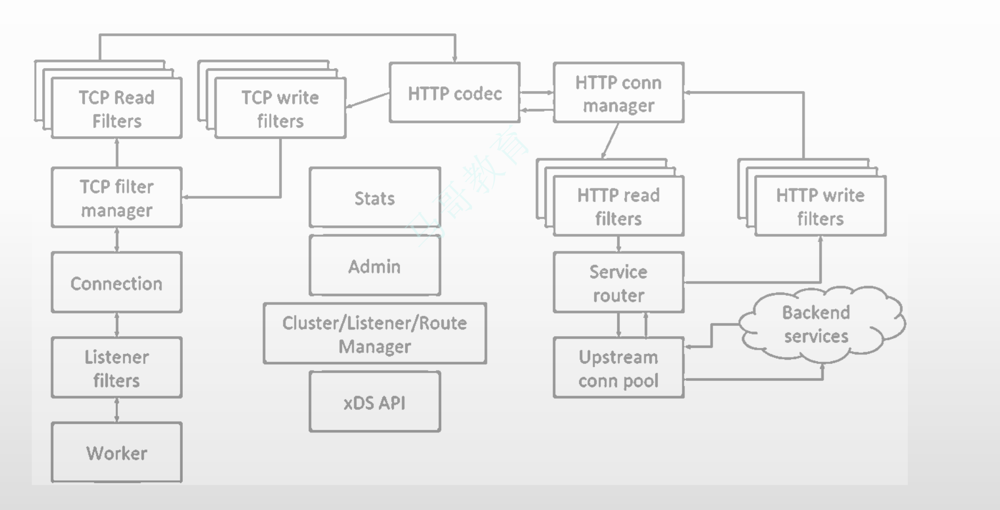

# day13-serviceMesh





## PART1. 微服务的出现及治理方式演进

### 1.1 程序架构风格与微服务

#### a. 程序架构概述

- Architecture:架构.架构一词源于建筑领域,用于指规划、设计和建造建筑物的过程及产物;引入计算机领域后,软件架构就成为描述软件规划设计的专有名词
- 简言之,软件架构是有关软件整体结构与组件的抽象描述,用于**指导大型软件系统各个方面的设计**
- 架构的形式与特点:

	- 以文档和代码呈现:架构既包含设计过程,也包括设计的产物,可以是各类设计文档、设计图,也可以是一些技术验证代码、Demo或其他相关的程序;文档是设计的载体,而代码是系统功能实现的载体
	- 架构服务于业务:即架构的首要功能是服务于业务功能.因此,架构设计需要一定的前瞻性来容纳业务的变动
	- 架构影响团队的组织形式:业务的拆分方法和技术框架的选择必然会影响研发团队的组织形式.反过来,研发组织的结构和成熟度也会对最终所采取的技术架构产生重要影响
	- 每个架构都有特定的架构风格
	- 架构需要不断地发展演进

- 典型的企业级应用系统或互联网应用大多都是通过Web提供一组业务服务能力,它通常包括:

	- 运行于服务器端,以后端编程语言构建的**业务逻辑处理**部分
	- 用于存储业务数据的**关系数据库或其他类型的存储系统**
	- 提供给用户操作的、运行于浏览器或APP中**具有UI的业务逻辑展示和输入**部分

- 根据软件系统在运行期间的表现风格和部署结构,大体可以将其粗略地划分为2类:

	- 单体架构:整个系统的所有功能单元部署到同一进程(所有代码可以打包成一个或多个文件)
	- 分布式架构:整个系统的功能单元分散到不同的进程,然后由多个进程共同提供不同的业务能力

#### 1.1.1 单体架构

进一步细分:

- 简单单体模式
- MVC模式
- 前后端分离模式
- 组件模式
- 类库模式

#### 1.1.2 分布式架构:SOA、MSA

- SOA:面向服务的架构
- MSA:微服务架构

#### 1.1.3 分布式应用的需求

Bilgin Ibryam在其一篇文章中将分布式应用的需求分为生命周期、网络、状态和绑定4个方面.显然,要满足这些需求并创建出良好的分布式应用绝非易事.


在这幅图中,K8S解决了Lifecycle方面的问题.而Service Mesh要解决的是Networking方面的问题.

- 生命周期

	- 编写业务功能时,编程语言会指定生态系统中的可用库、打包格式和运行时(runtime)等
	
		- 例如:JAVA使用.jar打包格式,它将依赖到的所有Maven库视为生态系统,并使用JVM作为运行时
	
	- 随着发布周期变得更短,生命周期中更为重要的是**以自动化的方式部署**的能力、从错误中**恢复**的能力和**扩展**服务的能力

		- 这组能力广泛地代表了应用程序生命周期的需求

- 网络

	- 从某种意义上来说,如今几乎所有的应用程序都是分布式应用程序,它们都需要网络,但现代分布式系统需要从更广泛的角度去掌控网络

		- 包括服务发现和错误恢复、实现现代**软件发布**技术和各种**跟踪及遥测**等
	
	- 为了满足需要,我们甚至会在这个类别中包含不同的消息交换模式、点对点和发布/订阅方式,以及智能路由机制等

- 状态

	- 此处的状态是指服务的状态

		- 一般我们认为,服务最好是无状态的
		- 但管理服务的平台本身却是需要状态的(即有状态)

	- 平台负责实现可靠的服务编排和工作流、分布式单例、临时调度(即周期式作业`crontab`)、幂等性、状态的错误恢复、缓存等.这些功能都依赖于底层的状态

- 绑定

	- 分布式系统的组件不仅要相互通信,而且要和现代的或以往的旧式外部系统集成

		- 这就要求连接器(connector)能够转换各种协议、支持不同的消息格式,如轮询、事件驱动、请求/应答.转换消息格式,甚至能够执行自定义的错误恢复过程和安全机制

### 1.2 分布式架构治理模式演进


ESB:Enterprise Service Bus,企业服务总线

#### 1.2.1 SOA提出的分布式系统的构建原则

- 各服务由规范定义的标准化API提供,这些API通过服务描述的定义将消费者的实现与服务提供者的实现分离

	- 服务应该按照**契约优先**而非代码优先的规则来开发
	- 服务间通信基于面向文档的消息,而非特定语言的RPC协议,从而将服务同齐实现语言解耦

- 各服务彼此独立,它们在时间、空间、技术和团队上是松散的耦合关系
- 各服务应该是无状态的,这样就可以灵活调用它们,而无需关心不同上下文中的会话状态
- 各服务应该是自治和自包含的,以便它们可以独立部署、版本控制、自我管理和恢复
- 各服务可以被发现和组合,例如:

	- 可以通过使用**服务注册中心**来实现服务发现,从而可以将服务消费者动态绑定到服务提供者
	- 来自不同系统的业务服务可以在业务流程中进行编排和组装

#### 1.2.2 SOA

SOA是建设企业IT生态系统的架构指导思想中的一种,它把服务视作基本的业务功能单元,由平台中立性的接口契约定义.SOA目前的实现方式有2种:

- 分布式服务化:常见的实现有Dubbo、Finagle和ICE等
- 集中式管理:以ESB为基础支撑技术,较流行的商业实现有WMB(IBM)、OSB(Oracle),开源实现有Mule、ServiceMix和OpenESB等

SOA的两大基石:

- RPC:远程过程调用,是一种通用目的系统通信手段,它把被调用者称为服务提供者(Provider),把调用者称为服务消费者(Consumer),并将对象转换为便于网络传输的二进制或文本数据的过程称为序列化(Serialization)

	- 常见的RPC技术有Cobra、RMI、WebService、JSON-RPC、XML-RPC、Thrift、Protocol Buffer和gRPC等
	- 按照调用方式,可分为4种模式:RR(Request-Response)、Oneway(单向调用)、Future(异步)和Callback(回调)

- MQ:N个系统之间互相通信时,利用MQ可以进行系统间解耦,并借助于失败策略、重试等机制完成错误处理

	- Point-to-Point:点对点模式
	- Pub/Sub:发布订阅模式

#### 1.2.3 ESB -> Micro Services Architecture -> Cloud Native

##### 1.2.3.1 ESB

###### a. 传统分布式中间件ESB

早期的SOA系统的服务间多采用"点对点"模型,服务调用和集成逻辑也通常嵌入到了应用程序中实现

- 适合服务数量较少的系统,简单、高效
- 服务数量增多到一定程度时,连接路径和复杂度急剧增加,为应对这种治理挑战而引入了ESB

ESB提供服务间的连接、转换和中介功能

- 将企业内部系统和各种服务连接到服务总线上,实现信息系统之间的松耦合架构
- 简化了系统集成,使IT系统架构更加灵活,并降低了企业内部信息共享的成本


###### b. ESB的局限性

从技术上将,ESB架构将业务逻辑与服务集成分离,从而实现更好的集中式服务治理,但随着应用规模的增大和服务数量的增加,也暴露了严重的问题:

- 强调甚至过分强调业务系统的可重用性,结果导致大量的服务集成实现逻辑沉入了ESB,很难维护、迁移和扩展,进而成为ESB的沉重负担
- 基于集中式消息处理系统,主要挑战是单体架构以及业务逻辑和平台之间的紧密技术耦合,这反而又导致了技术和组织的中心化
- 开发并部署服务到这样的系统中时,它和分布式系统框架产生的紧密耦合,限制了服务的进一步演化
- 智能管道和哑端点的ESB系统架构无法适应快速变化和大规模创新


##### 1.2.3.2 Micro Services Architecture

###### a. 分布式微服务架构MSA

随着互联网的快速大规模增长,企业IT架构的重点从传统的记录系统转变为参与系统,这类的参与系统必须支持快速迭代和低成本试错,因而"微服务"的概念一出现就深得人心

- 记录系统的代表:企业资源规划ERP和供应链管理SCM等
- 参与系统的代表:在线电商系统、网上银行系统等

微服务的规范定义:

- 最早出现于2011年的"微服务"在2014年由Martin Fowler通过一篇著名的文章发扬光大.该文章可抽象出以下几个关键点:

	- 由一些独立的服务共同组成应用系统
	- 每个服务单独部署、独立运行在自己的进程中
	- 每个服务都是独立的业务
	- 分布式管理

- 遵循低耦合、高内聚的原则

微服务中的调用链路相比于传统的分布式系统长了很多,于链路上发生故障的概率也必然随之增大,而且存在性能损耗.于是,系统规划时必须考虑如何进行雪崩预防、功能降级、超时、重试、熔断、服务隔离等服务管理

微服务强调的基本原则:

- 核心思想是通过应用功能的拆分和解耦来简化业务系统的实现
- 强调将应用功能划分为一组松散耦合的服务,每个服务都遵循**单一职责**的原则
- 每个服务都可以独立部署和交付,极大地提高了业务敏捷性
- 每个服务都可以独立伸缩,以适应互联网的规模

潜在的问题:

- 将一个大的单体应用拆分为多个微服务,使得IT系统的研发协作、交付和维护变得更加复杂
- 幸运的是,容器技术、DevOps和微服务架构的自然融合,使得微服务落地称为更加简便的实现可能

SOA向MSA进化的代表产品:

- Apache Dubbo
- Spring Cloud

###### b. 微服务实践细节

微服务落地过程中,必须要仔细解决如下问题:

- 客户端如何访问这些服务?

	- 各服务的是线上可能是无状态的,因而需要统一进行用户的登录信息和权限管理(OAuth)
	- 在服务和客户端之间提供一个代理(API GateWay)来统一管控流量

- 服务彼此间如何通信?

	- 同步调用:REST或RPC
	- 异步消息调用

- 如何进行服务发现?

	- 客户端发现
	- 服务端发现

- 如何应对服务故障?

	- 重试
	- 限流
	- 熔断
	- 负载均衡
	- 降级(本地缓存)


###### c. 微服务治理框架

为了客服服务通信和治理的复杂性,例如服务发现、融合、限流和端到端跟踪的挑战,需要用到专门的微服务治理框架

- 微服务框架,如HSF、Dubbo或Spring Cloud,将这些能力打包成代码库,形成SDK
- 程序员开发微服务时,将这些代码库内置于应用程序中,并岁应用程序一起发布和维护

存在的问题:库模型可能会抽象出满足微服务架构所需要的特性,但它本身仍然是一个需要维护的组件

- 学习和使用库需要相当程度力量的投入
- 本质上,服务通信和治理是横向连接不同部门的系统,因此二者和业务逻辑是正交的;但是,在微服务架构中,实现和生命周期是与业务逻辑耦合的,微服务框架的升级会导致整个服务应用的重新构建和重新部署
- 代码库通常与特定语言绑定,因此难以支持企业应用程序的多语言实现


##### 1.2.3.3 Cloud Native

###### a. Sidecar

下一个合乎逻辑的步骤:

- 将库中的功能整合进Network Stack是不可能的,许多从业者找到的解决方案是使用一个小巧的透明代理来实现
- 使用Sidecar以辅助进程的方式,在应用程序旁边提供高级网络功能

Sidecar:

- 让服务集中解决业务逻辑的问题,网络相关的功能则与业务逻辑玻璃,并封装为独立的运行单元并作为服务的反向透明代理,从而不再与业务紧密关联
- 换句话说,微服务的业务程序独立运行,而网络功能则以独立的代理层工作于客户端与服务之间,专门为代理的服务提供熔断、限流、追踪、指标采集和服务发现等功能


###### b. 为什么使用Sidecar机制?

Out-of-process architecture


#### 1.2.4 服务网格的迭代

##### 1.2.4.1 Service Mesh的雏形

将服务治理能力下沉到基础设施中,并将它们部署为服务消费者和服务提供者的独立流程

- 每个服务都使用一个专用的代理Sidecar来完成高级网络功能
- 各服务间仅通过Sidecar代理互相通信
- 各代理之间形成了一个网状网络,2017年,William为其创建了一个专用定义,并称之为Service Mesh

A service mesh is a **dedicated infrastructure layer** for handling service-to-service communication.It's responsible for the reliable delivery of requests through the complex topology of services that comprise a modern, cloud native application.In practice, the service mesh is typically implemented as **an array of lightweight network proxies** that are deployed alongside application code, without the application needing to be aware.


##### 1.2.4.2 新一代(第二代)Service Mesh

为Service Mesh中各独立工作的代理提供集中式的"控制平面"

- 实际的服务流量仍然直接在各代理之间完成,但控制平面知道每个代理实例的信息(例如路由、IP地址等信息)
- 控制平面使代理能够实现如访问控制和指标收集之类的功能


## PART2. 微服务基础

### 2.1 康威定律

设计系统的组织由于受到约束,这些设计往往表现为组织内部沟通结构的副本 -- Melvin Conway(1967)

- 换言之,组织设计系统来反应这个组织内的人的沟通结构

目前被引申为4条定律:

- 组织设计的产品,等价于组织的沟通结构
- 罗马并非一天建成的,学会先解决首要问题:

	- 时间再充裕,也不可能将一件事情做完美,但总有时间做完一件事情
	- 忽略次要的需求,"先完成,再完善"

- 线性系统和线性组织架构有潜在的异质同态特性:

	- 创立独立的子系统,减少沟通成本
	- "线性子系统"或"分布式子系统"对应着不同的产品结构

		

- 演进中,较之小系统,大系统具有更强的分解倾向

	- 任何一个系统,天然具有熵增倾向


### 2.2 微服务及其生态体系

#### 2.2.1 从不同维度(方向)上切分微服务

一个应用被切分为微服务,可以被分为3个维度上进行切分:


- X轴方向:在多个相同的实例之间试下你请求的负载均衡,是扩展单体应用的常用方法

	

	- 提升吞吐量
	- 提高可用性

- Z轴方向:Z轴扩展的目标是根据请求的某个属性来路由请求,通常也需要运行单体应用的多个实例,但每个实例仅负责数据的1个子集

	

	- 例如:应用程序可能会使用请求包头中包含的userID来路由请求
	- 后端多个程序实例各自仅负责处理指定范围内的用于请求

- Y轴方向:微服务化.Y轴扩展的目标是根据功能把应用拆分为多个子应用(服务),这是一种功能性分解机制

	

	- 每个服务是一个小的应用程序,它实现了一组相关的功能
	- 服务也可以在需要的时候借助于X轴或Y轴进行扩展
	- 本质上是分布式系统

#### 2.2.2 MSA(Micro Services Architecture)架构

微服务如何体现"微"的特性?

- 体积小:微小的甚至不超过100行代码
- 开发周期短:必须在2周内完成开发或迭代

Netflix的架构师Adrian Cockcroft认为,微服务架构是面向服务的架构,它们由**松耦合**和**具有边界上下文**的元素组成

而世界知名的软件大师Chris Richardson在"Microservices Patterns"一书中通过一种三维可扩展模型"扩展立方体"给出了不一样的定义:

- 把应用程序**功能性分解**为一组服务的架构风格,每一个服务都是由一组专注的、内聚的功能职责构成
- 微服务的大小并不重要,更好的目标是将精心设计的服务定义为能够由小团队开发的服务,并且将会时间最短,与其他团队协作最少
- 微服务架构应用程序通过一些小的、松耦合的服务组织在一起,从而提升开发效率、可维护性、可测试性和可部署性

微服务的逻辑:微服务与单体架构最显著的区别在于,单体应用程序只是单个应用程序,而微服务则是许多小的应用程序协同工作


K8S就相当于于PaaS云平台的功能.

微服务可以分为聚合服务(业务前台)和基础服务(业务中台)


微服务的适用性:


单体优先:


微服务网关:


配置中心的另一个功能:比如618的抢购功能,通常是凌晨12点才开始.但绝不可能等到凌晨12点才发布服务.而是在配置中有一个开关,凌晨12点开关才打开.服务才可以被访问.其实服务早就发布了.

服务发现和路由体系:


微服务间同步通信的方式:RPC和REST


服务框架和治理:开发人员只考虑业务逻辑的实现即可.运维人员解决周边问题


监控体系和监控分类:


## PART3. 服务网格

### 3.1 基本功能及其演进简史

#### 3.1.1 微服务架构面临什么样的问题?

1. 服务间通信管理将面临巨大挑战

	
	
	服务网格试图解决的是网络方面的问题,例如重试、熔断等功能.之所以如此,是因为我们在构建微服务时,是假设微服务间的网络通信是可靠的.显然,事实并非如此.
	
2. 分布式计算的8个谬论(Fallacies of Distributed Computing Explained)

	网络通信是微服务架构的痛点,其原因在于:

	- 网络是可靠的
	- 网络延迟是0
	- 带宽是无限的
	- 网络是安全的
	- 网络拓扑从不改变
	- 只有1个管理员
	- 传输成本是0
	- 网络是同构的

	

	为了确保微服务开发时,研发人员假设的通信诉求成立.必须要解决这些问题,但这些问题又不可能被完全消除掉,因此只能通过一些辅助手段来降低这些问题产生的影响,进而达成研发人员的通信诉求.
	
	服务网格设计之初的核心目标就在于:帮助分布式服务去克服这些问题.例如:

	- 网络不可靠时,发出一个请求迟迟没有得到响应,怎么办? -- 超时重试
	- 当客户端调用服务端,服务端表示无暇响应,怎么办? -- 熔断

	这些都是服务网格通过一些功能,来试图消除或减轻当网络通信出现问题时所带来的影响
	
#### 3.1.2 微服务体系下服务治理面临的挑战

事实上,分布式环境中,网络的不可靠性无法忽略,可靠地解决如下问题,方能确保结果落地:

- 服务注册和服务发现
- 客户端重试
- 可配置的超时机制
- 负载均衡
- 限速
- 熔断
- 服务间路由
- 异常点检测
- 健康状态检查
- 流量整型
- 流量镜像
- 边缘路由
- 按需路由
- A/B测试
- 内部发布
- 故障注入
- 统计和度量
- 日志
- 分布式跟踪

服务网格正是在这种需求下,逐步演进而形成的新一代解决方案

服务网格的4大功能:

1. 流量治理
2. 策略(黑白名单、访问控制)
3. 安全
	
	- CNI网络查件如果没有天然实现tls的注入,那么就是明文传输.对于多租户的网络而言,这种方式是及不安全的.服务网格可以自动注入证书,实现双向认证和TLS加密通信

4. 可观测性

	- 指标
	- 日志
	- 分布式跟踪

#### 3.1.3 服务网格的概念

服务网格(Service Mesh)的概念源于Buoyant公司的CEO Willian Morgan的文章"What's a service mesh? And do I need one?".是指专注于处理服务间通信的**基础设施**,它负责在现代云原生应用组成的复杂拓扑中**可靠地传递请求**

治理模式:除了处理业务逻辑相关的功能外,每个微服务还必须实现此前单体应用模型中用于网络间通信的基础功能,甚至还包括分布式应用程序之间的通信环境中应该实现的其他网络功能,例如熔断、限流、应用跟踪、指标采集、服务发现和负载均衡等

服务网格的实现模型经过3代演进:

- 内嵌于应用程序
- SDK
- Sidecar


#### 3.1.4 服务网格的基本功能

1. 控制服务间通信:熔断、重试、超时、故障注入、负载均衡和故障转移等
2. 服务发现:通过专用的服务总线发现服务端点
3. 可观测:指标数据采集、监控、分布式日志记录和分布式追踪
4. 安全性:TLS/SSL通信和密钥管理
5. 身份认证和授权检查:身份认证,以及基于黑白名单或RBAC(ABAC:基于属性的访问控制)的访问控制功能
6. 部署:对容器技术的原生支持,例如Docker和Kubernetes等
7. 服务间的通信协议:HTTP1.1、HTTP2.0、gRPC等
8. 健康状态检测:监测上游服务的健康状态

#### 3.1.5 控制平面(Control Plane)

##### 3.1.5.1 数据平面与控制平面

- 数据平面:触及系统中的每个数据包请求,负责服务发现、健康检查、路由、负载均衡、身份验证/授权和可观测性等(执行方)
- 控制平面:为网格中的所有正在运行的数据平面提供策略和配置,从而将所有数据平面联合构建为分布式系统,它不接触系统中的任何数据包或请求(决策方)

	- 负责的任务包括例如:

		- 确定2个服务Service X到Service Y之间的路由
		- Service Y相关集群的负载均衡机制
		- 断路策略
		- 流量转移机制
		- 将决策下发给Service X和Service Y的Sidecar

##### 3.1.5.2 控制平面组件

- 工作负载调度程序:借助底层的基础设施(例如Kubernetes)完成服务及其Sidecar运行位置的调度决策
- 服务发现:服务网格中的服务发现
- Sidecar代理配置API:各Sidecar代理以最终一致的方式从各种系统组件获取配置
- 控制平面UI:管理人员的操作接口,用于配置全局级别的设置,例如部署、身份认证和授权、路由及负载均衡等

#### 3.1.6 服务网格的特点

Service Mesh解决方案极大降低了业务逻辑与网络功能之间的耦合度,能够快捷、方便地集成到现有的业务环境中,并提供了多语言、多协议的支持,运维和管理成本被大大压缩,且研发人员能够将精力集中于业务逻辑本身,而无须再关注业务代码以外的其他功能

一旦启用Service Mesh,服务间的通信将遵循以下通信逻辑:

- 微服务彼此间不会直接进行通信,而是由各服务前端的称为Service Mesh的代理程序进行
- Service Mesh内置支持服务发现、熔断、负载均衡等网络相关的用于控制服务间通信的各种高级功能
- Service Mesh与编程语言无关,开发人员可以使用任何编程语言编写的微服务的业务逻辑,各服务之间也可以使用不同的编程语言开发
- 服务间的通信的局部故障(超时、限流、熔断)可以由Service Mesh自动处理,可以减少雪崩式故障的发生
- Service Mesh中的各服务的代理程序由控制平面(Control Plane)集中管理;各代理程序之间的通信网络也称为数据平面(Data Plane)
- 部署于容器编排平台时,各代理程序会以微服务容器的Sidecar模式运行

#### 3.1.7 典型企业应用云原生架构升级实践:容器+服务网格快速实现灰度发布与治理


#### 3.1.8 服务网格和K8S之间的关系

- Kubernetes

	- 解决容器编排与调度的问题
	- 本质上是应用的生命周期管理工具
	- 为服务网格提供基础支撑

- Service Mesh

	- 解决分布式应用间的通信问题
	- 本质上服务通信治理工具
	- 是对K8S在网络功能方面的扩展和延伸


#### 3.1.9 Service Mesh技术标准


UDPA:数据平面的规范

SMI:控制平面的规范

#### 3.1.10 Service Mesh产品发展史


#### 3.1.11 服务网格的部署模式

服务网格的部署模式有2种:主机共享代理及Sidecar容器

1. 主机共享代理

	- 适用于同一主机上存在许多容器的场景,并且还可利用连接池来提高吞吐量
	- 但1个代理进程故障将终止其所在主机上的整个容器队列,受影响的不仅仅是单个服务
	- 实现方式中,常见的是运行在Kubernetes上的DaemonSet

2. Sidecar容器

	- 代理进程注入每个Pod定义,以便和主容器一同运行
	- Sidecar进程应该尽可能轻量且功能完善
	- 实现方案:Linkerd、Envoy、Conduit


### 3.2 主流实现

Service Mesh的代表产品:

在实现上,数据平面的主流解决方案有:Linkerd、Nginx、Envoy、HAProxy、Traefik等

而控制平面的实现主要有:Istio、Nelson、SmartStack等

- Linked

	- 由Buoyant公司于2016年率先创建的开源高性能网络代理程序(数据平面),是业界第一款Service Mesh产品,引领并促进了相关技术的快速发展
	- Linkerd使用Namerd提供控制平面,实现中心化管理和存储路由规则、服务发现配置、支持运行时动态路由等功能

- Envoy

	- 核心功能在于数据平面,于2016年由Lyft公司创建并开源,目标是成为通用的数据平面
	- 云原生应用,既可用作前端代理,亦可实现Service Mesh中的服务间通信
	- Envoy常被用于实现API Gateway(如Ambassador)以及Kubernetes的Ingress Controller(例如gloo等),不过,基于Envoy实现的Service Mesh产品Istio有着更广泛的用户基础

- Istio

	- 相比前两者来说,Istio发布时间较晚,它于2017年5月才面世,但却是目前最火热的Service Mesh解决方案,得到了Google、IBM、Lyft和Redhat等公司的大力推广和支持
	- 目前仅支持部署在Kubernetes之上,其数据平面由Envoy实现

### 3.3 云原生时代的服务网格

#### 3.3.1 云原生时代的微服务分布式体系

1. 生命周期

	- 容器和Kubernetes将打包、分发和部署应用程序的方法演化成了与编程语言无关的格式
	- 对Kubernetes来说,需要管理的最小原子单元是容器,并且它专注于容器级别和流程模型上.交付分布式原子单元
	
		- Kubernetes在管理应用程序的生命周期、健康检查、恢复、部署和扩展方面做的都很出色,但是在运行于容器内的分布式应用的其他方面却没有做的很好,例如灵活的网络,状态管理和绑定
	
	- 尽管Kubernetes拥有有状态的工作负载、服务发现、cron作业及其他功能,但是所有这些原语都是在容器级别的,并且在容器内部,开发人员必须使用特定于语言的库才能实现更高级的功能
	
		- 这其实就是推动诸如Envoy、Linkerd、Consul、Knative、Dapr、Camel-K等项目的原因
	
	换言之,Kubernetes只做部署、编排、调度(部署调度)的工作
	
	

2. 网络

	- Kubernetes提供的围绕服务发现的基本网络功能(CNI)打下了良好的基础,但这对于线代应用程序来说却仍有不足

		- 随着微服务数量的增加和部署速度的加快,在不改动服务的前提下,对更高级的发布策略,管理安全性,指标,跟踪,从错误中恢复,模拟错误等方面的需求变动变得越来越具有吸引力,并产生了一种新的软件类别,称为服务网格

	- 服务网格将网络相关的关注点从包含业务逻辑的服务转移出来,放到一个单独的运行时中,该运行时可能是Sidecar,也可能是节点级代理
	- 服务网格可以执行高级路由、协助完成测试、处理某些方面的安全性问题,甚至可以支持特定于应用的协议(例如,Envoy支持Kafka、MongoDB、Redis和MySQL等)
	- 除了典型的服务网格外,还有其他项目,例如[Skupper](https://skupper.io/)等,它们证实了将网络能力放入外部运行时代理的趋势

		- Skupper通过第7层虚拟网络解决了多集群通信的难题,并提供了高级路由及连接能力
		- 但是,它没有将Skupper嵌入到业务服务运行时中,而是在每个Kubernetes命名空间中运行一个共享的Sidecar实例

3. 状态

	- 状态的管理比较困难,因而应该将其委派给专门的存储软件和托管服务

		- 缓存、工作流管理、单例、幂等、事务管理、cron作业触发器和状态化错误处理等都隶属于状态管理的范畴
	
	- 对那些建立在云环境上的服务来讲,状态化工作流的管理是必备功能,例如AWS的Step函数、Azure的Durable函数等
	- 在容器化的部署中,CloudState和Dapr都依赖Sidecar模型,以提供分布式应用程序中状态化抽象更好的解耦
	- 未来的发展趋势中,状态管理应该会通过一个专门的Sidecar应用来完成

4. 绑定

	- 微服务体系下,从应用程序中解耦分布式需求同样也会伴随着"绑定"
	
		- 尽管连接器、协议转换、消息转换、错误处理和安全相关的中间层都可以从应用中转移出来,但目前尚未实现,Knative和Dapr等项目正朝着这个方向努力

	- Apache Camel-K项目采用了另一种有趣的办法

		- 它借助于一个智能的Kubernetes Operator利用来自Kubernetes和Knative附加的平台能力来构建应用程序运行时,而非在主应用程序周边运行一个Sidecar形式的代理
		- Operator成了唯一的代理程序,它负责提供应用所需的各种分布式系统原语
		- 不同之处在于,有些分布式原语添加到了应用程序运行时中,而有些则是在平台中实现(也可能包括Sidecar)

#### 3.3.2 未来的架构趋势

除了生命周期外,现在我们已然可以直接使用网络监测、状态抽象、声明性事件以及端点绑定等功能,而EIP(企业集成模式)则是该列表中的下一个元素


在核心业务之外,附加3个Sidecar.图中的Lifecycle部分不算Sidecar,因为kubernetes实现了生命周期的管理,而kubernetes并不是以Sidecar的形式为核心业务提供能力的.

1. 解决网络问题的:Istio + Envoy
2. 解决绑定问题的:Knative
3. 解决状态问题的:dapr

这也就意味着,在未来,业务容器是核心,但需要为业务容器部署3个辅助容器.这样的模式下,实际上这3个Sidecar共同构成了一个套件(suit).

如果我们把不同领域进行创新的各种云原生项目进行叠加,那么最终将得到类似下图的组合形式:


- 需要注意的是,上图只是用于说明,它有目的地选择了具有代表性的项目,并把它们映射为分布式原语的一种
- 实际上,我们不会同时使用所有这些项目,因为它们中的一些是重叠的,并且工作负载模型也并不兼容

## PART4. 云原生

### 4.1 云计算的发展历程

"云"中的资源在使用者看来是可以无限扩展的,并且可以**随时获取,按需使用,随时扩展**,按使用付费.这种特性经常被称为像水电一样使用IT基础设施.


### 4.2 云原生的定义

#### 4.2.1 pivotal对云原生的定义


#### 4.2.2 CNCF对云原生的定义


2018年,CNCF在关于云原生定义v1.0版本中这样描述云原生技术体系:

- 云原生技术有利于各组织在公有云、私有云和混合云等新型动态环境中,构建和运行可弹性扩展的应用
- 云原生的代表技术包括**容器、服务网格、微服务、不可变基础设施和声明式API**

云原生计算基金会(CNCF)致力于培育和维护一个厂商中立的开源生态系统,来推广云原生技术


### 4.3 云原生架构的参考示例


### 4.4 企业IT建设的三阶段两转变


## PART5. Envoy基础

### 5.1 什么是Envoy

Envoy作为新一代服务网格中,以独立进程方式实现高级网络功能的轻量级7层服务代理程序.通常以Sidecar的形式运行在应用程序旁边.但也可以作为整个网络的边缘代理来运行.

- 7层代理
- 作为基础设施存在
- 在通信上专用于大型SOA架构

Envoy的高级特性:

- 进程外的架构(以Sidecar的模式运行)
- 3层/4层过滤器(更像是Nginx的模块)

	- 也就是在网络层和传输层实现了一些网络管理功能

- 7层过滤器

	- 相比于3层/4层过滤器,7层过滤器只能支持一部分比较主流的7层协议(例如HTTP/HTTPS)

- 原生支持HTTP2
- 支持HTTP3
- 7层路由的高级功能
- gRPC
- 服务发现和动态配置
- 健康状态检测
- 高级路由
- 前端/边缘路由(代理支持)
- 可观测性

#### 5.1.1 Envoy的工作逻辑


Envoy有2个工作位置:

1. 在网格内部,在每一个应用程序(work load)旁边运行一个实例(instance).这种场景下,Envoy以Sidecar的形式提供服务.只代理到当前work load的正向请求和反向请求.也就是说work load对外发出的请求可以由Envoy来代理;同时外部对该work load的请求也可以由Envoy来代理.通常称为sidecar proxy

2. 也可以作为前端负载均衡器,类似于API Gateway.位于整个网络的边缘处,代理整个应用.该Envoy作为边缘处的代理,接收请求后分发给后端的若干个Sidecar形式的Envoy.每个Sidecar形式的Envoy再把请求分发给本地的work load.这种边缘处的Envoy,通常称为front envoy或front proxy.注意:front proxy是不需要运行在应用程序周边的,front proxy是独立运行的.

通常我们提到的高级网络功能(客户端侧透明路由、决策、TLS的发起与终结、熔断、状态收集、指标监控等)都是在front proxy处实现的.当然,sidecar proxy也可以做,只要启用配置即可.

#### 5.1.2 Envoy的特性


- 基于xDS的动态配置
- 区域感知路由

	- 能够实现在接收一个请求之后,尽量根据配置把请求发送给请求所在的区域内的后端,这样能够有更快的响应

- 基于优先级的路由

	- 假设此时有1组服务器(10台),其中7台性能较好,剩余3台性能较差.此时就可以把7台性能较好的服务器的优先级定义的高一些,使得所有请求尽可能由前面7台服务器来进行响应.除非这7台中有某一台故障了,可以将溢出的流量调度到剩余3台服务器上去.

- 熔断
- 异常探测

	- 可以被动侦测.假设某服务上游有3台服务器,其中2台服务器工作正常,而最后一台服务器的流量总是响应5XX.则此时探测器就可以得知这台服务器是有问题的.当错误码的数量到达一定比例时,会临时将这台服务器弹出.后续的流量只会调度给那2台好的服务器.但是这个状态是有一个窗口的.比如过一段时间(假设时长为3分钟)后,这台出问题的服务器会继续参与调度

- 重试和重试策略
- 流量镜像
- 请求竞速
- 限速(限流)
- 访问日志
- 重试预算

#### 5.1.3 Envoy的显著特性

- 性能、可扩展性及动态可配置性

	- 性能:除了大量功能外,Envoy还提供极高的吞吐量和低尾延迟差异,同时消耗相对较少的CPU和RAM
	- 可扩展性:Envoy在L4和L7上提供丰富的可插拔过滤器功能,允许用户轻松添加新功能
	- API可配置性:Envoy提供了一组可由控制平面服务实现的管理API,也称为xDS(x表示超级,DS:discovery service,实际上这里并不是发现服务,而是发现配置) API

		- 若控制平面实现了所有这些API,则可以使用通用引导配置在整个基础架构中运行Envoy
		- 所有进一步的配置更改都可通过管理服务器无缝地进行动态传递,使得Envoy永远不需要重新启动(其实Envoy也支持热重启,类似nginx restart)
		- 于是,这使得Envoy成为一个通用数据平面,当与足够复杂的控制平面相结合时,可大大降低整体操作复杂性

- Envoy xDS存在v1、v2和v3三个版本

	- v1 API:仅使用JSON/REST,本质上是轮询,性能较低
	- v2 API:是v1的演进,而不是革命,它是v1功能的超集,新的API模式使用proto3指定,并同时以gRPC和REST+JSON/YAML端点实现
		- 2021年第1季度结束支持

	- v3 API:当前支持的版本,支持start_tls、拒绝传入的tcp连接、4096位的tls密钥、SkyWalking(分布式链路追踪系统)和WASM(一种动态编译机制)等

- Envoy已经成为线代服务网格和边缘网关的"通用数据平面API",Istio、Ambassador和Gloo等项目均势为此数据平面代理提供的控制平面

### 5.2 Envoy组件拓扑


- incoming requests:即客户端.在Envoy的术语中,我们称之为下游(downstream)
- outgoing request:即服务端.也就是被代理的后端,我们称之为上游(upstream)
- listener:侦听器.对于Envoy来讲,任何请求的接入,必须要靠在配置文件中启用(定义)的,名为listener的组件来实现.

	- 在Envoy中,listener负责监听socket.socket被监听后,客户端就可以与Envoy建立连接了.之后就可以发报文到Envoy了.

- filter chains:过滤器链.用于拼装一系列的过滤器,这一系列的过滤器负责处理报文.报文进到Envoy之后,根据配置文件中定义的多个过滤器,逐一过滤并处理报文后,向后端代理.从图中可以看到,3路不同的请求,分别有各自的过滤器链来进行处理.filter chains是定义在listener之上的.也就是说listener不但要指定监听的端口,同时还要指定listener中有几个过滤器来处理这个请求.这里所谓的处理,指的是解包、卸载TLS会话等工作.其中至少要配置一个用于代理的filter,无论你使用的是3/4层代理还是7层代理
- cluster manager:集群管理器.就是图中的cluster definitions.listener用于负责将客户端请求接入,cluster manager负责把用于处理(响应)客户端请求的后端服务器归并成组.类似于Nginx中的upstream.Nginx中可以定义多个upstream,同样的,cluster manager也可以管理多个cluster,每个cluster中包含多个server.通常在前端的filter chains中,有一个filter用于指定该请求后续被哪个cluster处理,相当于请求路由.通常我们说的一些高级功能,例如流量分割(90%的流量给cluster1,10%的流量给cluster2)或URL分割(url1给cluster1,url2给cluster2),甚至流量镜像(流量本来是发送给cluster1的,但发送给cluster1的同时,自动发送给cluster2)就是在这里完成的

	- 需要注意的是,cluster是由cluster manager定义而来的.cluster manager并不负责处理请求,cluster负责处理请求.cluster manager只是负责定义cluster.
	- cluster manager定义cluster,实际上也是向控制平面发送请求,由响应的内容动态生成cluster的.包括listener也是有它的listener manager的.向控制平面发送请求并接收响应时,使用的协议就是xDS.

### 5.3 Envoy xDS核心术语


关于listener和filter chains的配置,可以指定静态的文件,也可以在配置文件中指定management server,Envoy启动后连接该服务器,根据服务器下发的配置来生成自己的配置(xDS协议).


注意:从图中的多个Discovery Server可以看出,1个Envoy可以有不止1个的management server.

- Listen Discovery Server:负责让Envoy配置listener,或者说让Envoy动态发现自己应有的listener配置
- Cluster Discovery Server:用于发现集群配置
- Route Discovery Server:发现路由配置
- Endpoint Discovery Server:发现端点配置
- Secret Discovery Server:这里的Secret和K8S中的Secret资源对象很像,也是用于配置敏感数据(主要是证书和私钥)的
- Endpoint:端点.就是能够正常处理网络通信的一个组件,通常是一个拥有socket的主机(可能是容器).在Envoy中它是一个逻辑组件,实际上1个Endpoint对应1个Server.也就是说通过EDS(Endpoint Discovery Server)发现的每一个server,映射进Envoy内部中就叫做一个Endpoint
- Cluster:当多个Endpoint属于同一组时,这些Endpoint就被定义成了一个Cluster

- Host:主机.一个具有网络通信能力的端点,例如服务器、移动智能设备等
- Cluster:集群是Envoy连接到的一组逻辑上相似的端点;在v2中,RDS通过路由指向集群,CDS提供集群配置,而Envoy通过EDS发现集群成员,即端点
- Downstream:下游.下游主机连接到Envoy,发送请求并接收响应,它们是Envoy的客户端
- Upstream:上游.上游主机接收来自Envoy的连接和请求并返回响应,它们是Envoy代理的后端服务器
- Endpoint:端点即上游主机.是一个或多个集群成员,可通过EDS发现
- Listener:侦听器.侦听器是能够由下游客户端连接的命名网络位置,例如端口或unix域套接字等
- Locality:位置.上游端点运行的区域拓扑,通常有三级.包括地域(region)、区域(zone)和子区域(subzone)
- Management Server:管理服务器.实现v3 API的服务器,它支持复制和分片,并且能偶在不同的物理机器上实现针对不同xDS API的API服务
- Region:地域.区域所属的地理位置
- Zone:区域.AWS中的可用区(AZ)或GCP中的区域等
- SubZone:子区域.Envoy实例或端点运行的区域内的位置,用于支持区域内的多个负载均衡目标
- xDS:CDS、EDS、HDS、LDS、RLS(Rate Limit)、RDS、SDS、VHDS和RTDS等API的统称
- Mesh和Envoy Mesh

### 5.4 Envoy的部署类型

Envoy通常用于以容器编排系统为底层环境的网格中,并以sidecar的形式与主程序容器运行为单个pod;非编排系统环境中测试时,可以将主程序与Envoy运行于同一容器,或手动组织主程序容器与Envoy容器共享同一网络名称空间

具体使用时的常见部署类型:

- Front Proxy:类似于API Gateway

- Sidecar Proxy:也就是图中的第1行.2个作用.

	- 入栈侦听器:Ingress Listener.代为接收客户端请求并代理给应用
	- 出栈侦听器:Egress Listener.本地服务作为客户端,去请求别的服务时,这部分流量也由Sidecar代理
	- 像图中的Service A要访问Service D时,如果要配置TLS,那么证书配置在Service A的Egress Listener和Service B的Ingress Listener上即可.通常运行在Pod中的应用只监听127.0.0.1,以免请求不经代理直接泄露出去.流量出去的时候(比如请求别人时)是可以不经代理的.因为应用监听什么地址和应用要请求什么是两件毫不相关的事儿.因而Ingress Listener通常是必要的;Egress Listener通常是非必要的.但为了真正实现网格通信的逻辑,Egress Listener也应该定义出来

- Externel Service Egress Listener:也就是图中的第3行.假设运行在pod应用Service C此时要访问网格外部的一个服务.为了把流量发送到外部,让pod像访问本地服务一样访问外部服务,可以把外部服务通过Externel Service Egress Listener引入到集群内部中来.在某种意义上来讲,Externel Service Egress Listener是适配K8S中的行为概念的.K8S中有4种Service类型:

	- ClusterIP
	- NodePort
	- LoadBalancer
	- ExternalService
	- 实际上Externel Service Egress Listener就类似于K8S中的ExternalService.是用于引入外部服务的一种方式之一.当然还有其他方式,比如自定义Endpoint
	- 这种场景下,Service C只需要访问自己的Egress Listener即可.Egress Listener将流量代理到网格外部去


- Service to service only


- Service to service egress listener


- Service to service ingress listener


- Service to service Plus front proxy


- Service to service, front proxy, and double proxy

	- 双代理的目标是尽可能接近用户地终止TLS,和客户端连接会更高效

	
	
## PART6. 配置Envoy

在使用Envoy时,不建议自己编译.建议直接使用镜像.建议使用dockerhub上,envoy的官方镜像

- [envoy-alpine](https://hub.docker.com/r/envoyproxy/envoy-alpine):基于alpine的基础镜像构建的
- [envoy](https://hub.docker.com/r/envoyproxy/envoy):基于ubuntu的基础镜像构建的

### 6.1 Envoy配置概述

- 启动时从Bootstrap Configuration(引导配置文件)中加载初始配置
- 支持动态配置

	- xDS API
	
		- 从配置文件加载配置
		- 从管理服务器(Management Server)基于xDS协议加载配置
		- 大段配置的加载

	- runtime

		- 某些关键特性(Feature flags)保存为k-v格式的数据
		- 支持多层配置和覆盖机制
		- 小范围的修改

- 启用全动态配置机制后,仅极少数场景需要重新启动Envoy进程

	- 支持热重启

### 6.2 Envoy的配置方式

Envoy的架构支持非常灵活的配置方式:简单部署场景可以使用纯静态配置,而更复杂的部署场景则可以逐步添加需要的动态配置机制

- 纯静态配置:用户自行提供侦听器、过滤器链、集群及HTTP路由(http代理场景),上游端点的发现仅可通过DNS服务进行,且配置的重新加载必须通过内置的热重启(hot restart)完成
- 仅使用EDS:EDS提供的端点发现功能可有效规避DNS的限制(响应中的最大记录数等)
- 使用EDS和CDS:CDS能够让Envoy以优雅的方式添加、更新和删除上游集群,于是,初始配置时,Envoy无须事先了解所有上游集群
- EDS、CDS和RDS:动态发现路由配置;RDS与EDS、CDS一起使用时,为用户提供了构建复杂路由拓扑的能力(流量转移、蓝/绿部署等)
- EDS、CDS、RDS和LDS:动态发现侦听器配置,包括内嵌的过滤器链;启用此四种发现服务后,除了较罕见的配置变动、证书轮替或更新Envoy程序之外,几乎无须再热重启Envoy
- EDS、CDS、RDS、LDS和SDS:动态发现侦听器密钥相关的证书、私钥及TLS会话票据,以及对证书验证逻辑的配置(受信任的根证书和撤销机制等)

### 6.3 Envoy配置中的重要概念

Envoy配置示例:

```json
{
"node": "{...}",
"static_resources": "{...}",
"dynamic_resources": "{...}",
"cluster_manager": "{...}",
"hds_config": "{...}",
"flags_path": "...",
"stats_sinks": [],
"stats_config": "{...}",
"stats_flush_interval": "{...}",
"stats_flush_on_admin": "...",
"watchdog": "{...}",
"watchdogs": "{...}",
"tracing": "{...}",
"layered_runtime": "{...}",
"admin": "{...}",
"overload_manager": "{...}",
"enable_dispatcher_stats": "...",
"header_prefix": "...",
"stats_server_version_override": "{...}",
"use_tcp_for_dns_lookups": "...",
"bootstrap_extensions": [],
"fatal_actions": [],
"default_socket_interface": "..."
}
```

最为重要的配置段有3个:

1. `static_resources`:静态配置的资源,用于配置静态的listener、cluster和secret
2. `dynamic_resources`:动态配置的资源,用于配置基于xDS API获取listener、cluster和secret配置的`lds_config`、`cds_config`和`ads_config`.需要注意的是,即使使用动态配置,也需要静态配置.因为Management Server的地址是静态指定的
3. SDS的配置(示例中没有)

其他偶尔用到的有:

- `admin`:Envoy内置的管理接口
- `node`:节点标识,以呈现给管理服务器并且用于标识目的
- `tracing`:分布式跟踪
- `layered_runtime`:层级化的运行时,支持使用RTDS从管理服务器动态加载
- `hds_config`:使用HDS从管理服务器加载上游主机健康状态检测相关的配置
- `overload_manager`:过载管理器
- `stats_sinks`:统计信息接收器

一般来说,侦听器和集群是最为常用基础配置,无论是以静态或者是动态方式提供

#### 6.3.1 envoy配置概览

注:为了避免一上来就过于复杂,因此先使用`docker-compose`来演示,演示节点使用`ks8-harbor-2`

##### 6.3.1.1 http-front-proxy的配置

先来看一个front-proxy的配置:

此处envoy相当于一个边缘代理,只是本例中是一个7层的HTTP代理.边缘代理也可以是3/4层的TCP代理.

注:该front-proxy只是为了先看看envoy的配置结构,并不是真的把它跑起来了.虽然它真的能跑起来.

- step1. 编写envoy的配置文件`envoy.yaml`

```
root@ks8-harbor-2:~# mkdir http-front-proxy
root@ks8-harbor-2:~# cd http-front-proxy/
root@ks8-harbor-2:~/http-front-proxy# vim envoy.yaml
root@ks8-harbor-2:~/http-front-proxy# cat envoy.yaml
```

```yaml
# 纯静态配置
static_resources:
  # 定义侦听器
  listeners:
    # 侦听器名称
  - name: listener_0
    address:
      # 侦听器监听的socket
      socket_address: { address: 0.0.0.0, port_value: 80 }
    # 侦听器的过滤器链
    filter_chains:
    - filters:
      # 过滤器名称
      # 此处该过滤器就是负责实现7层HTTP协议代理的过滤器
      - name: envoy.filters.network.http_connection_manager
        # 类型化配置定义
        typed_config:
          # @type字段的值是内建的固定字符串
          "@type": type.googleapis.com/envoy.extensions.filters.network.http_connection_manager.v3.HttpConnectionManager
          # 统计日志的前缀
          stat_prefix: ingress_http
          # 编解码方式
          codec_type: AUTO
          # 路由配置
          route_config:
            name: local_route
            # 虚拟主机配置
            virtual_hosts:
              # 虚拟主机名称
            - name: web_service_1
              # 此处和虚拟主机的配置一样 访问domains字段中域名的流量
              # 匹配前缀起始于根路径的 派发给集群local_cluster
              # 此处匹配条件由match字段定义 指定集群由route字段指定
              domains: ["*.ik8s.io", "ik8s.io"]
              routes:
              - match: { prefix: "/" }
                route: { cluster: local_cluster }
            - name: web_service_2
              # 访问domains字段中域名的流量 重定向给host_redirect字段
              # 中定义的域名 但此处host_redirect字段定义的域名
              # 就是web_service_1中的domains
              domains: ["*.gemzen.cn","gemzen.cn"]
              routes:
              - match: { prefix: "/" }
                redirect:
                  host_redirect: "www.ik8s.io"
          http_filters:
          - name: envoy.filters.http.router
  # 定义若干个集群
  clusters:
    # 集群名称
  - name: local_cluster
    # 连接超时时长
    connect_timeout: 0.25s
    # 集群类型 或者说是集群发现方法 用于定义集群的端点从哪来的
    # STATIC表示纯静态定义 也可以基于EDS发现 或者DNS发现
    type: STATIC
    # 定义负载均衡策略为轮询
    lb_policy: ROUND_ROBIN
    # 定义后端端点
    load_assignment:
      cluster_name: local_cluster
      # 定义端点
      endpoints:
        # 此处的lb不是load balance的意思
        # 而是基于位置的定义 Locality Base的缩写
      - lb_endpoints:
        - endpoint:
            address:
              # 定义endpoint的地址和端口
              socket_address: { address: 172.31.2.11, port_value: 8080 }
        - endpoint:
            address:
              socket_address: { address: 172.31.2.12, port_value: 8080 }
```

- step2. 编写容器编排文件`docker-compose.yaml`

```
root@ks8-harbor-2:~/http-front-proxy# vim docker-compose.yaml
root@ks8-harbor-2:~/http-front-proxy# cat docker-compose.yaml
```

```yaml
version: '3.3'

services:
  envoy:
    image: envoyproxy/envoy-alpine:v1.21-latest
    volumes:
    - ./envoy.yaml:/etc/envoy/envoy.yaml
    networks:
      envoymesh:
        ipv4_address: 172.31.2.2
        aliases:
        - front-proxy
    depends_on:
    - webserver01
    - webserver02

  webserver01:
    image: ikubernetes/demoapp:v1.0
    environment:
      - PORT=8080
    hostname: webserver01
    networks:
      envoymesh:
        ipv4_address: 172.31.2.11
        aliases:
        - webserver01

  webserver02:
    image: ikubernetes/demoapp:v1.0
    environment:
      - PORT=8080
    hostname: webserver02
    networks:
      envoymesh:
        ipv4_address: 172.31.2.12
        aliases:
        - webserver02

networks:
  envoymesh:
    driver: bridge
    ipam:
      config:
        - subnet: 172.31.2.0/24
```

##### 6.3.1.2 http-ingress的配置

###### a. 环境说明

2个Service

- envoy: Sidecar proxy
- webserver01: 第1个后端服务,监听地址为127.0.0.1,监听端口为8080

##### b. 容器编排

- step1. 编写envoy配置文件`envoy.yaml`

```
root@ks8-harbor-2:~/http-front-proxy# cd ..
root@ks8-harbor-2:~# mkdir http-ingress
root@ks8-harbor-2:~# cd http-ingress/
root@ks8-harbor-2:~/http-ingress# vim envoy.yaml
root@ks8-harbor-2:~/http-ingress# cat envoy.yaml
```

```yaml
static_resources:
  # 监听器配置 监听对外通信的地址
  listeners:
  - name: listener_0
    address:
      # 监听器监听的socket的地址和端口
      socket_address: { address: 0.0.0.0, port_value: 80 }
    filter_chains:
    - filters:
      - name: envoy.filters.network.http_connection_manager
        typed_config:
          "@type": type.googleapis.com/envoy.extensions.filters.network.http_connection_manager.v3.HttpConnectionManager
          stat_prefix: ingress_http
          codec_type: AUTO
          route_config:
            name: local_route
            virtual_hosts:
            - name: web_service_1
              domains: ["*"]
              routes:
              - match: { prefix: "/" }
                route: { cluster: local_cluster }
          http_filters:
          - name: envoy.filters.http.router

  # 集群配置
  clusters:
  - name: local_cluster
    connect_timeout: 0.25s
    type: STATIC
    lb_policy: ROUND_ROBIN
    load_assignment:
      cluster_name: local_cluster
      endpoints:
      - lb_endpoints:
        - endpoint:
            address:
              # 端点监听本地的8080端口
              socket_address: { address: 127.0.0.1, port_value: 8080 }
```

- step2. 编写容器编排文件`docker-compose.yaml`

```
root@ks8-harbor-2:~/http-ingress# vim docker-compose.yaml
root@ks8-harbor-2:~/http-ingress# cat docker-compose.yaml
version: '3'
```

```yaml
# 定义服务
services:
  # 服务名称
  # 定义envoy以sidecar的形式运行在应用旁边
  envoy:
    # envoy使用的镜像
    image: envoyproxy/envoy-alpine:v1.21-latest
    volumes:
      # 将同路径下的envoy.yaml 挂载到容器的/etc/envoy/目录下
      # 该路径为envoy启动时默认加载的配置文件路径
    - ./envoy.yaml:/etc/envoy/envoy.yaml
    environment:
      - ENVOY_UID=0
      - ENVOY_GID=0
    networks:
      envoymesh:
        # 指定envoy的IP地址
        ipv4_address: 172.31.3.2
        aliases:
        - ingress

  webserver01:
    # 课上用的一个小镜像 用于模拟web服务
    # 可以以传递环境变量的方式改变该服务监听的地址和端口
    image: ikubernetes/demoapp:v1.0
    environment:
      # 指定程序监听的端口和地址
      - PORT=8080
      - HOST=127.0.0.1
    # 网络模式 共享名称为envoy的服务的网络
    # 所以实际上webserver01服务(容器)和envoy服务(容器)是共享
    # 同一个网络名称空间的 这样才能模拟出sidecar的结构
    # 此处"service:" 是固定字符串 "envoy"是服务(容器)的名称
    network_mode: "service:envoy"
    # 定义依赖关系
    depends_on:
    - envoy

# 网络定义 该网络是用户空间手动定义的
networks:
  # envoymesh为网络名称
  envoymesh:
    # 驱动类型为本地桥接
    driver: bridge
    # 地址分配
    ipam:
      config:
        # 自定义的网段
        - subnet: 172.31.3.0/24
```

###### c. 运行和测试

- step1. 创建

```
root@ks8-harbor-2:~/http-ingress# docker-compose up
Creating network "http-ingress_envoymesh" with driver "bridge"
Pulling envoy (envoyproxy/envoy-alpine:v1.21-latest)...
v1.21-latest: Pulling from envoyproxy/envoy-alpine
8663204ce13b: Pull complete
3cc0d1f3e6c4: Pull complete
69003ba69d65: Pull complete
ed6082b65da3: Pull complete
cfc26dd6c2ea: Pull complete
f4bd9beeff1e: Pull complete
39d8e0d22ea2: Pull complete
Digest: sha256:64f9605dd54e1dafe362339da064a58edc31cbcc259e70b89fbab1bf95e976fc
Status: Downloaded newer image for envoyproxy/envoy-alpine:v1.21-latest
Pulling webserver01 (ikubernetes/demoapp:v1.0)...
v1.0: Pulling from ikubernetes/demoapp
c9b1b535fdd9: Pull complete
3cbce035cd7c: Pull complete
b83463f478a5: Pull complete
34b1f286d5e2: Pull complete
Digest: sha256:6698b205eb18fb0171398927f3a35fe27676c6bf5757ef57a35a4b055badf2c3
Status: Downloaded newer image for ikubernetes/demoapp:v1.0
Creating http-ingress_envoy_1 ... done
Creating http-ingress_webserver01_1 ... done
Attaching to http-ingress_envoy_1, http-ingress_webserver01_1
envoy_1        | [2022-06-22 11:06:36.102][1][info][main] [source/server/server.cc:381] initializing epoch 0 (base id=0, hot restart version=11.104)
envoy_1        | [2022-06-22 11:06:36.109][1][info][main] [source/server/server.cc:383] statically linked extensions:
envoy_1        | [2022-06-22 11:06:36.109][1][info][main] [source/server/server.cc:385]   envoy.filters.listener: envoy.filters.listener.http_inspector, envoy.filters.listener.original_dst, envoy.filters.listener.original_src, envoy.filters.listener.proxy_protocol, envoy.filters.listener.tls_inspector, envoy.listener.http_inspector, envoy.listener.original_dst, envoy.listener.original_src, envoy.listener.proxy_protocol, envoy.listener.tls_inspector
envoy_1        | [2022-06-22 11:06:36.109][1][info][main] [source/server/server.cc:385]   envoy.stats_sinks: envoy.dog_statsd, envoy.graphite_statsd, envoy.metrics_service, envoy.stat_sinks.dog_statsd, envoy.stat_sinks.graphite_statsd, envoy.stat_sinks.hystrix, envoy.stat_sinks.metrics_service, envoy.stat_sinks.statsd, envoy.stat_sinks.wasm, envoy.statsd
envoy_1        | [2022-06-22 11:06:36.109][1][info][main] [source/server/server.cc:385]   envoy.retry_host_predicates: envoy.retry_host_predicates.omit_canary_hosts, envoy.retry_host_predicates.omit_host_metadata, envoy.retry_host_predicates.previous_hosts
envoy_1        | [2022-06-22 11:06:36.109][1][info][main] [source/server/server.cc:385]   envoy.matching.action: composite-action, skip
envoy_1        | [2022-06-22 11:06:36.109][1][info][main] [source/server/server.cc:385]   envoy.grpc_credentials: envoy.grpc_credentials.aws_iam, envoy.grpc_credentials.default, envoy.grpc_credentials.file_based_metadata
envoy_1        | [2022-06-22 11:06:36.109][1][info][main] [source/server/server.cc:385]   envoy.thrift_proxy.filters: envoy.filters.thrift.header_to_metadata, envoy.filters.thrift.rate_limit, envoy.filters.thrift.router
envoy_1        | [2022-06-22 11:06:36.109][1][info][main] [source/server/server.cc:385]   envoy.dubbo_proxy.route_matchers: default
envoy_1        | [2022-06-22 11:06:36.109][1][info][main] [source/server/server.cc:385]   envoy.rbac.matchers: envoy.rbac.matchers.upstream_ip_port
envoy_1        | [2022-06-22 11:06:36.109][1][info][main] [source/server/server.cc:385]   envoy.tracers: envoy.dynamic.ot, envoy.lightstep, envoy.tracers.datadog, envoy.tracers.dynamic_ot, envoy.tracers.lightstep, envoy.tracers.opencensus, envoy.tracers.skywalking, envoy.tracers.xray, envoy.tracers.zipkin, envoy.zipkin
envoy_1        | [2022-06-22 11:06:36.109][1][info][main] [source/server/server.cc:385]   envoy.access_logger.extension_filters: envoy.access_loggers.extension_filters.cel
envoy_1        | [2022-06-22 11:06:36.109][1][info][main] [source/server/server.cc:385]   envoy.http.cache: envoy.extensions.http.cache.simple
envoy_1        | [2022-06-22 11:06:36.109][1][info][main] [source/server/server.cc:385]   envoy.tls.cert_validator: envoy.tls.cert_validator.default, envoy.tls.cert_validator.spiffe
envoy_1        | [2022-06-22 11:06:36.109][1][info][main] [source/server/server.cc:385]   envoy.resource_monitors: envoy.resource_monitors.fixed_heap, envoy.resource_monitors.injected_resource
envoy_1        | [2022-06-22 11:06:36.109][1][info][main] [source/server/server.cc:385]   envoy.bootstrap: envoy.bootstrap.wasm, envoy.extensions.network.socket_interface.default_socket_interface
envoy_1        | [2022-06-22 11:06:36.109][1][info][main] [source/server/server.cc:385]   envoy.dubbo_proxy.filters: envoy.filters.dubbo.router
envoy_1        | [2022-06-22 11:06:36.109][1][info][main] [source/server/server.cc:385]   envoy.http.stateful_header_formatters: preserve_case
envoy_1        | [2022-06-22 11:06:36.109][1][info][main] [source/server/server.cc:385]   envoy.http.original_ip_detection: envoy.http.original_ip_detection.custom_header, envoy.http.original_ip_detection.xff
envoy_1        | [2022-06-22 11:06:36.109][1][info][main] [source/server/server.cc:385]   envoy.http.stateful_session: envoy.http.stateful_session.cookie
...
```

- step2. 测试

再开一个新的终端并运行:

```
root@ks8-harbor-2:~# cd http-ingress/
root@ks8-harbor-2:~/http-ingress# curl 172.31.3.2
iKubernetes demoapp v1.0 !! ClientIP: 127.0.0.1, ServerName: b3fbfa07c236, ServerIP: 172.31.3.2!
```

此处显示的ClientIP是`127.0.0.1`,显然发起请求的IP地址不是本地.这是因为后端服务(webserver01)被代理时,代理监听的地址是`127.0.0.1`,而实际上这个`127.0.0.1`是envoy,而非发起请求的IP地址

查看请求过程:

```
root@ks8-harbor-2:~/http-ingress# curl -v 172.31.3.2
* Rebuilt URL to: 172.31.3.2/
*   Trying 172.31.3.2...
* TCP_NODELAY set
* Connected to 172.31.3.2 (172.31.3.2) port 80 (#0)
> GET / HTTP/1.1
> Host: 172.31.3.2
> User-Agent: curl/7.58.0
> Accept: */*
> 
< HTTP/1.1 200 OK
< content-type: text/html; charset=utf-8
< content-length: 97
< server: envoy
< date: Wed, 22 Jun 2022 11:16:16 GMT
< x-envoy-upstream-service-time: 1
< 
iKubernetes demoapp v1.0 !! ClientIP: 127.0.0.1, ServerName: b3fbfa07c236, ServerIP: 172.31.3.2!
* Connection #0 to host 172.31.3.2 left intact
```

注意`x-envoy-upstream-service-time`,可以发现服务端是由envoy负责处理响应的.

这就是一个最简单的实现反向代理的Sidecar envoy的相关配置.

- step3. 停止

```
root@ks8-harbor-2:~/http-ingress# docker-compose down
Removing http-ingress_webserver01_1 ... done
Removing http-ingress_envoy_1       ... done
Removing network http-ingress_envoymesh
```

##### 6.3.1.3 http-egress的配置

###### a. 环境说明

3个Service:

- envoy:作为egress Sidecar,地址为172.31.4.2
- webserver01:第1个外部服务,地址为172.31.4.11
- webserver02:第2个外部服务,地址为172.31.4.12

###### b. 容器编排

- step1. 编写envoy的配置文件`envoy.yaml`

```
root@ks8-harbor-2:~# mkdir http-egress
root@ks8-harbor-2:~# cd http-egress/
root@ks8-harbor-2:~/http-egress# vim envoy.yaml
root@ks8-harbor-2:~/http-egress# cat envoy.yaml
```

```yaml
static_resources:
  listeners:
  - name: listener_0
    address:
      # 此处envoy和web服务共享同一个网络空间
      # 因此如果web服务要对外发送一个请求 那么这个请求是可以通过地址+端口的方式
      # 直接到达envoy的
      # 此处web服务是作为服务端 对外发送请求 envoy是服务端
      # 此处envoy的地址和端口 是用于被web服务访问的
      socket_address: { address: 127.0.0.1, port_value: 80 }
    filter_chains:
    - filters:
      - name: envoy.filters.network.http_connection_manager
        typed_config:
          "@type": type.googleapis.com/envoy.extensions.filters.network.http_connection_manager.v3.HttpConnectionManager
          stat_prefix: ingress_http
          codec_type: AUTO
          route_config:
            name: local_route
            virtual_hosts:
            - name: web_service_1
              domains: ["*"]
              routes:
              - match: { prefix: "/" }
                route: { cluster: web_cluster }
          http_filters:
          - name: envoy.filters.http.router

  clusters:
    # 此处的clusters是外部的
    # 此处的外部可以理解为是envoy+web服务这个容器外部的集群
    # 上边定义的侦听器面向本地的web服务的 而此处定义的cluster是外部的服务
  - name: web_cluster
    connect_timeout: 0.25s
    type: STATIC
    lb_policy: ROUND_ROBIN
    load_assignment:
      cluster_name: web_cluster
      endpoints:
      - lb_endpoints:
        - endpoint:
            address:
              socket_address: { address: 172.31.4.11, port_value: 80 }
        - endpoint:
            address:
              socket_address: { address: 172.31.4.12, port_value: 80 }
```

- step2. 编写容器编排文件`docker-compose.yaml`

```
root@ks8-harbor-2:~/http-egress# vim docker-compose.yaml
root@ks8-harbor-2:~/http-egress# cat docker-compose.yaml
```

```yaml
version: '3.3'

services:
  # envoy服务(容器)
  envoy:
    image: envoyproxy/envoy-alpine:v1.21-latest
    volumes:
    - ./envoy.yaml:/etc/envoy/envoy.yaml
    networks:
      envoymesh:
        # envoy的地址
        ipv4_address: 172.31.4.2
        aliases:
        - front-proxy
    depends_on:
    - webserver01
    - webserver02

  # client服务(容器)是envoy的客户端
  # 为了模拟envoy作为egress Sidecar的效果
  # 需要进入client服务(容器) 并使用该服务的交互式接口
  client:
    # 该镜像也是课上演示用的
    image: ikubernetes/admin-toolbox:v1.0
    # 和envoy服务(容器)共享同一个Network Namespace
    network_mode: "service:envoy"
    depends_on:
    - envoy

  # webserver01服务(容器)即为envoy的配置文件中定义的"外部"的服务
  # 此处为了降低复杂度 webserver01和webserver02是没有加Sidecar的
  # 如果从合规的视角来看 webserver01和webserver02是应该有ingress Sidecar的
  webserver01:
    image: ikubernetes/demoapp:v1.0
    hostname: webserver01
    networks:
      envoymesh:
        ipv4_address: 172.31.4.11
        aliases:
        - webserver01

  # webserver02服务(容器)也是envoy的配置文件中定义的"外部"的服务
  webserver02:
    image: ikubernetes/demoapp:v1.0
    hostname: webserver02
    networks:
      envoymesh:
        ipv4_address: 172.31.4.12
        aliases:
        - webserver02

networks:
  envoymesh:
    driver: bridge
    ipam:
      config:
        - subnet: 172.31.4.0/24
```

###### c. 运行和测试

- step1. 创建

```
root@ks8-harbor-2:~/http-egress# docker-compose up
http-egress_webserver01_1 is up-to-date
http-egress_webserver02_1 is up-to-date
Starting http-egress_envoy_1 ... done
Starting http-egress_client_1 ... done
Attaching to http-egress_webserver01_1, http-egress_webserver02_1, http-egress_envoy_1, http-egress_client_1
envoy_1        | [2022-06-22 16:32:56.580][1][info][main] [source/server/server.cc:381] initializing epoch 0 (base id=0, hot restart version=11.104)
envoy_1        | [2022-06-22 16:32:56.580][1][info][main] [source/server/server.cc:383] statically linked extensions:
envoy_1        | [2022-06-22 16:32:56.580][1][info][main] [source/server/server.cc:385]   envoy.wasm.runtime: envoy.wasm.runtime.null, envoy.wasm.runtime.v8
envoy_1        | [2022-06-22 16:32:56.580][1][info][main] [source/server/server.cc:385]   envoy.upstream_options: envoy.extensions.upstreams.http.v3.HttpProtocolOptions, envoy.upstreams.http.http_protocol_options
envoy_1        | [2022-06-22 16:32:56.580][1][info][main] [source/server/server.cc:385]   envoy.transport_sockets.upstream: envoy.transport_sockets.alts, envoy.transport_sockets.quic, envoy.transport_sockets.raw_buffer, envoy.transport_sockets.starttls, envoy.transport_sockets.tap, envoy.transport_sockets.tcp_stats, envoy.transport_sockets.tls, envoy.transport_sockets.upstream_proxy_protocol, raw_buffer, starttls, tls
envoy_1        | [2022-06-22 16:32:56.580][1][info][main] [source/server/server.cc:385]   envoy.thrift_proxy.filters: envoy.filters.thrift.header_to_metadata, envoy.filters.thrift.rate_limit, envoy.filters.thrift.router
envoy_1        | [2022-06-22 16:32:56.580][1][info][main] [source/server/server.cc:385]   envoy.http.stateful_header_formatters: preserve_case
...
```

- step2. 再启动一个终端,进入client容器(服务),发送请求给envoy

注:此处由于`k8s-harbor-2`节点的docker和docker-compose版本问题,故将实验环境更改为`k8s-haproxy-2`节点.

```
root@k8s-haproxy-2:~# cd http-egress/
root@k8s-haproxy-2:~/http-egress# docker-compose exec client /bin/sh
[root@d1c2c4b367c9 /]# curl 127.0.0.1
iKubernetes demoapp v1.0 !! ClientIP: 172.31.4.2, ServerName: webserver02, ServerIP: 172.31.4.12!
[root@d1c2c4b367c9 /]# curl 127.0.0.1
iKubernetes demoapp v1.0 !! ClientIP: 172.31.4.2, ServerName: webserver01, ServerIP: 172.31.4.11!
[root@d1c2c4b367c9 /]# curl 127.0.0.1
iKubernetes demoapp v1.0 !! ClientIP: 172.31.4.2, ServerName: webserver02, ServerIP: 172.31.4.12!
[root@d1c2c4b367c9 /]# curl 127.0.0.1
iKubernetes demoapp v1.0 !! ClientIP: 172.31.4.2, ServerName: webserver01, ServerIP: 172.31.4.11!
[root@d1c2c4b367c9 /]# exit
```

注意:由于envoy配置的转发策略为轮询,所以此处发送请求时,会对后端的2个服务轮询发送请求

- step3. 停止

```
root@k8s-haproxy-2:~/http-egress# docker-compose down
[+] Running 5/0
 ⠿ Container http-egress-client-1       Removed                                                                                                                                                                                                                            0.0s
 ⠿ Container http-egress-envoy-1        Removed                                                                                                                                                                                                                            0.0s
 ⠿ Container http-egress-webserver02-1  Removed                                                                                                                                                                                                                            0.0s
 ⠿ Container http-egress-webserver01-1  Removed                                                                                                                                                                                                                            0.0s
 ⠿ Network http-egress_envoymesh        Removed                                                                                                                                                                                                                            0.0s
```

##### 6.3.1.3 tcp-front-proxy的配置

实际上front-proxy就是边缘代理.只是这种边缘代理,既可以是3/4层的TCP代理,也可以是7层的HTTP代理.

###### a. 环境说明

3个Service:

- envoy:Front Proxy,地址为172.31.1.2.该envoy作为front proxy独立运行
- webserver01:第一个后端服务,地址为172.31.1.11
- webserver02:第一个后端服务,地址为172.31.1.12

###### b. 容器编排

```
root@k8s-haproxy-2:~/http-egress# cd ..
root@k8s-haproxy-2:~# mkdir tcp-front-proxy
root@k8s-haproxy-2:~# cd tcp-front-proxy
root@k8s-haproxy-2:~/tcp-front-proxy# vim envoy.yaml
root@k8s-haproxy-2:~/tcp-front-proxy# cat envoy.yaml
```

```yaml 
static_resources:
  listeners:
    name: listener_0
    address:
      socket_address: { address: 0.0.0.0, port_value: 80 }
    filter_chains:
    - filters:
      # 注意:此处使用的是tcp_proxy
      # tcp_proxy是一个有代理功能的过滤器
      - name: envoy.tcp_proxy
        typed_config:
          "@type": type.googleapis.com/envoy.extensions.filters.network.tcp_proxy.v3.TcpProxy
          stat_prefix: tcp
          cluster: local_cluster

  clusters:
  - name: local_cluster
    connect_timeout: 0.25s
    type: STATIC
    lb_policy: ROUND_ROBIN
    load_assignment:
      cluster_name: local_cluster
      endpoints:
      - lb_endpoints:
        # 上游服务器1
        - endpoint:
            address:
              socket_address: { address: 172.31.1.11, port_value: 8080 }
        # 上游服务器2
        - endpoint:
            address:
              socket_address: { address: 172.31.1.12, port_value: 8080 }
```

```
root@k8s-haproxy-2:~/tcp-front-proxy# vim docker-compose.yaml 
root@k8s-haproxy-2:~/tcp-front-proxy# cat docker-compose.yaml
```

```yaml
version: '3.3'

services:
  envoy:
    image: envoyproxy/envoy-alpine:v1.21-latest
    volumes:
    - ./envoy.yaml:/etc/envoy/envoy.yaml
    networks:
      envoymesh:
        ipv4_address: 172.31.1.2
        aliases:
        - front-proxy
    depends_on:
    - webserver01
    - webserver02

  webserver01:
    image: ikubernetes/demoapp:v1.0
    environment:
      - PORT=8080
    hostname: webserver01
    networks:
      envoymesh:
        ipv4_address: 172.31.1.11
        aliases:
        - webserver01

  webserver02:
    image: ikubernetes/demoapp:v1.0
    environment:
      - PORT=8080
    hostname: webserver02
    networks:
      envoymesh:
        ipv4_address: 172.31.1.12
        aliases:
        - webserver02

networks:
  envoymesh:
    driver: bridge
    ipam:
      config:
        - subnet: 172.31.1.0/24
```

###### c. 运行和测试

- step1. 创建

```
root@k8s-haproxy-2:~/tcp-front-proxy# docker-compose up
[+] Running 4/4
 ⠿ Network tcp-front-proxy_envoymesh        Created                                                                                                                                                                                                                        0.0s
 ⠿ Container tcp-front-proxy-webserver02-1  Created                                                                                                                                                                                                                        0.1s
 ⠿ Container tcp-front-proxy-webserver01-1  Created                                                                                                                                                                                                                        0.1s
 ⠿ Container tcp-front-proxy-envoy-1        Created                                                                                                                                                                                                                        0.1s
Attaching to tcp-front-proxy-envoy-1, tcp-front-proxy-webserver01-1, tcp-front-proxy-webserver02-1
tcp-front-proxy-envoy-1        | [2022-06-23 14:51:13.896][1][info][main] [source/server/server.cc:381] initializing epoch 0 (base id=0, hot restart version=11.104)
tcp-front-proxy-envoy-1        | [2022-06-23 14:51:13.897][1][info][main] [source/server/server.cc:383] statically linked extensions:
tcp-front-proxy-envoy-1        | [2022-06-23 14:51:13.897][1][info][main] [source/server/server.cc:385]   envoy.stats_sinks: envoy.dog_statsd, envoy.graphite_statsd, envoy.metrics_service, envoy.stat_sinks.dog_statsd, envoy.stat_sinks.graphite_statsd, envoy.stat_sinks.hystrix, envoy.stat_sinks.metrics_service, envoy.stat_sinks.statsd, envoy.stat_sinks.wasm, envoy.statsd
...
```

- step2. 再启动一个终端,尝试请求envoy

```
root@k8s-haproxy-2:~/tcp-front-proxy# curl 172.31.1.2
iKubernetes demoapp v1.0 !! ClientIP: 172.31.1.2, ServerName: webserver02, ServerIP: 172.31.1.12!
root@k8s-haproxy-2:~/tcp-front-proxy# curl 172.31.1.2
iKubernetes demoapp v1.0 !! ClientIP: 172.31.1.2, ServerName: webserver01, ServerIP: 172.31.1.11!
root@k8s-haproxy-2:~/tcp-front-proxy# curl 172.31.1.2
iKubernetes demoapp v1.0 !! ClientIP: 172.31.1.2, ServerName: webserver02, ServerIP: 172.31.1.12!
root@k8s-haproxy-2:~/tcp-front-proxy# curl 172.31.1.2
iKubernetes demoapp v1.0 !! ClientIP: 172.31.1.2, ServerName: webserver01, ServerIP: 172.31.1.11!
```

- step3. 停止

```
root@k8s-haproxy-2:~/tcp-front-proxy# docker-compose down
[+] Running 4/0
 ⠿ Container tcp-front-proxy-envoy-1        Removed                                                                                                                                                                                                                        0.0s
 ⠿ Container tcp-front-proxy-webserver01-1  Removed                                                                                                                                                                                                                        0.0s
 ⠿ Container tcp-front-proxy-webserver02-1  Removed                                                                                                                                                                                                                        0.0s
 ⠿ Network tcp-front-proxy_envoymesh        Removed    
```

#### 6.3.2 envoy配置解释

##### 6.3.2.1 Listener

- 独立部署时,建议每个主机仅部署单个Envoy实例,并在必要时于此实例上运行一到多个侦听器
- Enovy支持TCP和UDP两种类型的侦听器
- 每个侦听器独立进行定义的,有自己独立的过滤器链

##### 6.3.2.2 filter

之前提到的各种高级功能都是要手动配置过滤器来实现的.filter包括:

- rate limiting
- TLS client authentication
- HTTP connection management
- raw TCP proxy
- etc.

filter分为2类:

- 3/4层(网络层/传输层)过滤器.这种过滤器只能在OSI网络模型的3/4层做一些处理,比如过滤源地址/目标地址,检查源端口/目标端口等.更复杂的做不到
- 7层过滤器:7层过滤器必须在某个3/4层过滤器的基础上实现.

3/4层过滤器中又分为:

- 代理类:TCP Proxy、HTTP connection manager、Thrift Proxy、Mongo proxy、Dubbo Proxy、ZooKeeper proxy、MySQL proxy和Redis proxy等
- 其它:Client TLS authentication、Rate limit、Role Based Access Control (RBAC) Network Filter和Upstream Cluster from SNI等

其中需要提到的是HTTP connection manager

- HTTP connection manager自身是L3/L4过路器,它能够将原始字节转换为HTTP级别消息和事件(例如headers和body等)
- 它还处理所有HTTP连接和请求共有的功能,例如访问日志记录、请求ID生成和跟踪、请求/响应头操作、路由表管理和统计信息等
- 与L3/L4过滤器堆栈相似,Envoy还支持在HTTP连接管理器中使用HTTP级过滤器堆栈

	- HTTP过滤器在L7运行,它们访问和操作HTTP请求和响应.例如gRPC-JSON Transcoder Filter为gRPC后端公开REST API,并将请求和响应转换为相应的格式
	- 常用的HTTP过滤器有Router、Rate limit、Health check、Gzip和Fault Injection等


图中的HTTP filters是7层过滤器.只有启用4层过滤器HTTP connection manager,才能用这些7层过滤器

##### 6.3.2.3 cluster(上游集群)

Envoy可配置任意数量的上游集群,并使用Cluster Manager进行管理

- 由集群管理器负责管理的各集群可以由用户静态配置,也可借助于CDS API动态获取.不但集群可以被发现,集群中的每一个端点(endpoint)也能被发现
- 集群中的每个成员由endpoint进行标识,它可由用户静态配置,也可通过EDS或DNS服务动态发现.EDS是xDS中独有的协议,DNS是公共基础服务.

发现配置的类型(即`clusters.type`字段)包括:

- Static:静态配置
- Strict DNS:严格DNS,Envoy将持续(每隔几分钟或几秒钟)和异步地解析指定的DNS目标,并将DNS结果中的返回的每个IP地址视为上游集群中可用成员.也就是说DNS结果中返回的每个IP地址都将被envoy视为一个endpoint.一般而言,集群是本地的集群,DNS也是本地的服务,通常使用Strict DNS
- Logical DNS:逻辑DNS,集群仅使用在需要启动新连接时返回的第一个IP地址,而非严格获取DNS查询的结果并假设它们构成整个上游集群;适用于必须通过DNS访问的大规模Web服务集群.假设DNS查询结果返回了5个IP地址,仅把第1个IP地址视作endpoint.其他4个不管.假设你要访问`google.com`,那么它的IP地址有很多,你只需要1个就够了.这种场景通常使用Logical DNS
- Original destination:当传入连接通过iptables的REDIRECT或TPROXY target或使用代理协议重定向到Envoy时,可以使用原始目标集群.简单理解就是使用覆写之前的地址
- Endpoint discovery service(EDS):EDS是一种基于GRPC或REST-JSON API的xDS管理服务器获取集群成员的服务发现方式.是envoy独有的
- Custom cluster:Envoy还支持在集群配置上的`cluster_type`字段中指定使用自定义集群发现机制

用的比较多的是Static和Strict DNS,偶尔面向外部做集群,将外部的服务引入到集群内部时会使用Logical DNS

- 每个Cluster主要由集群名称(`cluster.name`),以及集群中的端点(`cluster.endpoints`,通常是提供服务的IP地址和端口)所组成
- Envoy Cluster支持纯静态定义方式来指定端点,也允许以动态方式发现各端点,甚至还支持自定义的发现机制
- 支持用户定义多种高级功能,例如,负载均衡策略、主动健康状态检查、被动健康状态检查和断路器等


##### 6.3.2.4 Strict DNS演示

###### a. 环境说明

3个Service:

- envoy:作为egress Sidecar,地址为172.31.4.2.该envoy中,集群的类型为Strict DNS.
- webserver01:第1个外部服务,地址为172.31.4.11
- webserver02:第2个外部服务,地址为172.31.4.12

###### b. 容器编排

```
root@k8s-haproxy-2:~/strict-dns# vim docker-compose.yaml
root@k8s-haproxy-2:~/strict-dns# cat docker-compose.yaml
```

```yaml
version: '3.3'

services:
  envoy:
    image: envoyproxy/envoy-alpine:v1.21-latest
    volumes:
    - ./envoy.yaml:/etc/envoy/envoy.yaml
    networks:
      envoymesh:
        ipv4_address: 172.31.4.2
        aliases:
        - front-proxy
    depends_on:
    - webserver01
    - webserver02
    
  client:
    image: ikubernetes/admin-toolbox:v1.0
    network_mode: "service:envoy"
    depends_on:
    - envoy

  webserver01:
    image: ikubernetes/demoapp:v1.0
    hostname: webserver01
    networks:
      envoymesh:
        ipv4_address: 172.31.4.11
        aliases:
        - webserver01
        # 此处把别名当做域名 让envoy访问
        # 把别名当做域名是docker-compose内置的服务功能
        - myservice

  webserver02:
    image: ikubernetes/demoapp:v1.0
    hostname: webserver02
    networks:
      envoymesh:
        ipv4_address: 172.31.4.12
        aliases:
        - webserver02
        # 此处把别名当做域名 让envoy访问
        - myservice

networks:
  envoymesh:
    driver: bridge
    ipam:
      config:
        - subnet: 172.31.4.0/24
```

```
root@k8s-haproxy-2:~/strict-dns# vim envoy.yaml
root@k8s-haproxy-2:~/strict-dns# cat envoy.yaml
```

```yaml
static_resources:
  listeners:
  - name: listener_0
    address:
      socket_address: { address: 127.0.0.1, port_value: 80 }
    filter_chains:
    - filters:
      - name: envoy.filters.network.http_connection_manager
        typed_config:
          "@type": type.googleapis.com/envoy.extensions.filters.network.http_connection_manager.v3.HttpConnectionManager
          stat_prefix: ingress_http
          codec_type: AUTO
          route_config:
            name: local_route
            virtual_hosts:
            - name: web_service_1
              domains: ["*"]
              routes:
              - match: { prefix: "/" }
                route: { cluster: web_cluster }
          http_filters:
          - name: envoy.filters.http.router

  clusters:
  - name: web_cluster
    connect_timeout: 0.25s
    # 类型字段通常全大写
    type: STRICT_DNS
    lb_policy: ROUND_ROBIN
    load_assignment:
      cluster_name: web_cluster
      endpoints:
      - lb_endpoints:
        - endpoint:
            address:
              # 注意此处写的是服务(容器)别名的名称
              socket_address: { address: myservice, port_value: 80 }
```

###### c. 运行与测试

- step1. 创建

```
root@k8s-haproxy-2:~/strict-dns# docker-compose up
[+] Running 5/5
 ⠿ Network strict-dns_envoymesh        Created                                                                                                                                                                                                                             0.0s
 ⠿ Container strict-dns-webserver02-1  Created                                                                                                                                                                                                                             0.1s
 ⠿ Container strict-dns-webserver01-1  Created                                                                                                                                                                                                                             0.2s
 ⠿ Container strict-dns-envoy-1        Created                                                                                                                                                                                                                             0.1s
 ⠿ Container strict-dns-client-1       Created                                                                                                                                                                                                                             0.1s
Attaching to strict-dns-client-1, strict-dns-envoy-1, strict-dns-webserver01-1, strict-dns-webserver02-1
strict-dns-envoy-1        | [2022-06-23 18:52:22.546][1][info][main] [source/server/server.cc:381] initializing epoch 0 (base id=0, hot restart version=11.104)
strict-dns-envoy-1        | [2022-06-23 18:52:22.546][1][info][main] [source/server/server.cc:383] statically linked extensions:
...
```

- step2. 再启动一个终端,进入client容器(服务)并尝试请求envoy

```
root@k8s-haproxy-2:~/strict-dns# docker-compose exec client /bin/sh
[root@eaf306240b52 /]# curl 127.0.0.1
iKubernetes demoapp v1.0 !! ClientIP: 172.31.4.2, ServerName: webserver02, ServerIP: 172.31.4.12!
[root@eaf306240b52 /]# curl 127.0.0.1
iKubernetes demoapp v1.0 !! ClientIP: 172.31.4.2, ServerName: webserver01, ServerIP: 172.31.4.11!
[root@eaf306240b52 /]# curl 127.0.0.1
iKubernetes demoapp v1.0 !! ClientIP: 172.31.4.2, ServerName: webserver02, ServerIP: 172.31.4.12!
[root@eaf306240b52 /]# curl 127.0.0.1
iKubernetes demoapp v1.0 !! ClientIP: 172.31.4.2, ServerName: webserver01, ServerIP: 172.31.4.11!
```
- step3. 停止

```
^CGracefully stopping... (press Ctrl+C again to force)
[+] Running 4/4
 ⠿ Container strict-dns-client-1       Stopped                                                                                                                                                                                                                            10.1s
 ⠿ Container strict-dns-envoy-1        Stopped                                                                                                                                                                                                                             0.1s
 ⠿ Container strict-dns-webserver01-1  Stopped                                                                                                                                                                                                                            10.2s
 ⠿ Container strict-dns-webserver02-1  Stopped                                                                                                                                                                                                                            10.2s
canceled
root@k8s-haproxy-2:~/strict-dns# docker-compose down
[+] Running 5/0
 ⠿ Container strict-dns-client-1       Removed                                                                                                                                                                                                                             0.0s
 ⠿ Container strict-dns-envoy-1        Removed                                                                                                                                                                                                                             0.0s
 ⠿ Container strict-dns-webserver01-1  Removed                                                                                                                                                                                                                             0.0s
 ⠿ Container strict-dns-webserver02-1  Removed                                                                                                                                                                                                                             0.0s
 ⠿ Network strict-dns_envoymesh        Removed                                                                                                                                                                                                                             0.0s
```

在本示例中,envoy中定义的端点(endpoint)只有1个,但实际上这个端点背后有若干个主机.

### 6.4 Envoy线程模型

Envoy使用单进程多线程的架构模型,一个主线程(Main thread)负责实现各类管理任务,而一些工作线程(Worker threads)则负责执行监听、过滤和转发等代理服务器的核心功能

- 主线程:负责Envoy程序的启动和关闭、xDS API调用处理(包括DNS、健康状态检测和集群管理等)、运行时配置、统计数据刷新、管理接口维护和其它线程管理(信号和热重启等)等,相关的所有事件均以异步非阻塞模式完成
- 工作线程:默认情况下,Envoy根据当前主机CPU核心数来创建等同数量的工作线程.不过,管理员也可以通过程序选项`--concurrency`具体指定.每个工作线程运行一个非阻塞型事件循环,负责为每个侦听器监听指定的套接字、接收新请求、为每个连接初始一个过滤器栈并处理此连接整个生命周期中的所有事件
- 文件刷写线程:Envoy写入的每个文件都有一个专用、独立的阻塞型刷写线程.当工作线程需要写入文件时,数据实际上被移入内存缓冲区,最终通过文件刷写线程同步至文件中


一般而言,只有这种单进程多线程的架构,才能实现热升级/平滑重启的功能.

### 6.5 Envoy连接处理

 Envoy通过侦听器监听套接字并接收客户端请求.而Envoy的所有工作线程会同时共同监听用户配置的所有套接字，对于某次连接请求,由内核负责将其派发至某个具体的工作线程处理;随后,相关的工作线程基于特定的处理逻辑分别由相关组件依次完成连接管理



## PART7. Envoy快速入门

### 7.1 Cluster简易静态配置

- 通常,集群代表了一组提供相同服务的上游服务器(端点)的组合,它可由用户静态配置,也能够通过CDS动态获取
- 集群需要在"预热"环节完成之后方能转为可用状态,这意味着集群管理器通过DNS解析或EDS服务完成端点初始化,以及健康状态检测成功之后才可用

```yaml
clusters:
    # 集群的唯一名称,且未提供alt_stat_name时该字段值将会被用于统计信息中
  - name: ...
    # 统计信息中使用的集群名称
    alt_state_name: ...
    # 用于解析集群(生成集群端点)时使用的服务发现类型,可用值有STATIC、STRICT_DNS、LOGICAL_DNS、ORIGINAL_DST和EDS等
    type: ...
    # 负载均衡算法,支持ROUND_ROBIN(轮询)、LEAST_REQUEST(最小请求数)、RING_HASH(哈希环/一致性哈希)、RANDOM(随机调度)、MAGLEV(一致性哈希,和RING_HASH的区别在于环上的节点数量是固定的,65536个,其性能相比RING_HASH更好,但支持的节点较RING_HASH而言少一些)和CLUSTER_PROVIDED(集群自身提供的调度算法)
    lb_policy:
    # 用于为STATIC、STRICT_DNS或LOGICAL_DNS类型的集群指定成员获取方式 EDS类型的集群成员获取要使用eds_cluster_config字段配置
    load_assignment:
      # 集群名称 该字段值最好和clusters.name保持一致
      cluster_name: ...
      # 端点列表
      endpoints: 
      # 标识上游主机所处位置,通常以region、zone等进行标识
      # 区域感知路由的场景下 该字段值非常有用
      - locality: {}
      # 属于指定位置的端点列表
      lb_endpoints: 
      # 端点的名称
      - endpoint_name: ...
        # 端点定义
        endpoint:
          # 端点地址标识
          socket_adddress: 
            # 端点地址
            address: ... 
            # 端点端口
            port_value： ... 
            # 协议类型
            protocol: ... 
```

### 7.2 Cluster配置实例

静态Cluster的各端点可以在配置中直接给出,也可借助DNS服务进行动态发现

```yaml
clusters:
- name: web_cluster
  connect_timeout: 0.25s
  # 类型字段通常全大写
  type: STRICT_DNS
  lb_policy: ROUND_ROBIN
  load_assignment:
    cluster_name: web_cluster
    endpoints:
    - lb_endpoints:
      - endpoint:
          address:
            socket_address: { address: myservice, port_value: 80 }
```

### 7.3 L4过滤器tcp_proxy

TCP代理过滤器在下游客户端及上游集群之间执行1:1网络连接代理

- 它可以单独用作隧道替换,也可以同其他过滤器(如MongoDB过滤器或速率限制过滤器)结合使用
- TCP代理过滤器严格执行由全局资源管理的,为每个上游集群的全局资源管理器设定的连接限制

	- TCP代理过滤器检查上游集群的资源管理器是否可以在不超过该集群的最大连接数的情况下创建连接

- TCP代理过滤器可直接将请求路由至指定的集群,也能够在多个目标集群间基于权重进行调度转发

配置语法:

```json
{
  "stat_prefix": "...", # 用于统计数据中输出时使用的前缀字符
  "cluster": "...", # 路由到的目标集群标识
  "weighted_clusters": "{...}", # 基于权重的路由 即加权路由
  "metadata_match": "{...}", 
  "idle_timeout": "{...}", # 上下游连接间的超时时长,即没有发送和接收报文的超时时长
  "access_log": [], # 访问日志
  "max_connect_attempts": "{...}" # 最大连接尝试次数
}
```

### 7.4 TCP代理配置实例(Front Proxy)

下面的示例基于TCP代理将下游用户(本机)请求代理至后端的两个web服务器

```yaml
static_resources:
  listeners:
  - name: listener_0
    address:
      socket_address: { address: 127.0.0.1, port_value: 80 }
    filter_chains:
    - filters:
      - name: envoy.filters.network.http_connection_manager
        typed_config:
          # 注意:使用的是v3版本的协议 要求envoy的版本1.16+
          "@type": type.googleapis.com/envoy.extensions.filters.network.http_connection_manager.v3.HttpConnectionManager
          stat_prefix: ingress_http
          codec_type: AUTO
          route_config:
            name: local_route
            virtual_hosts:
            - name: web_service_1
              domains: ["*"]
              routes:
              - match: { prefix: "/" }
                route: { cluster: web_cluster }
          http_filters:
          - name: envoy.filters.http.router

  clusters:
  - name: web_cluster
    connect_timeout: 0.25s
    # 类型字段通常全大写
    type: STRICT_DNS
    lb_policy: ROUND_ROBIN
    load_assignment:
      cluster_name: web_cluster
      endpoints:
      - lb_endpoints:
        - endpoint:
            address:
              # 注意此处写的是服务(容器)别名的名称
              socket_address: { address: myservice, port_value: 80 }
```

### 7.5 L4过滤器http_connect_manager

http_connection_manager通过引入L7过滤器链实现了对http协议的操纵,其中router过滤器用于配置路由转发

```yaml
listeners:
  - name: 
    address:
      socket_address: { address: ..., port_value: ..., protocol: ... }
    filter_chains: 
    - filters:
      # 固定字符串
      - name: envoy.filters.network.http_connection_manager
        # 类型化固有配置
        typed_config:
          # 类型名 固有字符串
          "@type": type.googleapis.com/envoy.extensions.filters.network.http_connection_manager.v3.HttpConnectionManager
          # 统计信息中使用的信息前缀 通常为了易读性而配置
          stat_prefix: ... 
          # 静态路由配置 动态配置应该使用rds字段进行指定
          route_config: 
            # 路由配置的名称
            name: ... 
            # 虚拟主机列表 用于构成路由表
            # 此处定义的虚拟主机 监听的socket为listeners.address.socket_address
            virtual_hosts: 
            # 虚拟主机的逻辑名称 用于统计信息 与路由无关
            # 1个socket可以被多个虚拟主机监听 但是需要基于这些虚拟主机的主机名才能实现
            # 因此每个虚拟主机有一个逻辑名称字段
            - name: ... 
              # 当前虚拟主机匹配的域名列表,支持使用"*"通配符
              # 匹配搜索次序为精确匹配、前缀通配、后缀通配及完全通配
              # 定义该虚拟主机适配的主机名 若请求能被该虚拟主机适配 则该虚拟主机处理该请求
              # 否则检查下一个虚拟主机 若所有虚拟主机都无法处理(都不适配)该请求
              # 则该listener无法处理该请求
              domains: []
              # 指定的域名下的路由列表 
              # 执行时按顺序搜索 第一个匹配到路由信息即为使用的路由机制
              routes: []
          # 定义http过滤器链 
          http_filters: 
          # 调用7层的路由过滤器
          - name: envoy.filters.http.router 
```

### 7.6 路由基础配置概览


- match:路由定义有2个过程.第1个过程为match,即流量筛选.只有符合条件的流量才分发到某个特定位置去

	- 基于prefix、path或regex三者其中任何一个进行URL匹配(注:regex将会被safe_regex取代)

		- prefix:检查路径前缀
		- path:检查路径精确值
		- regex:对路径进行正则表达式匹配.实际上图中的regex应该是safe_regex
		- 除这三者外,还可以有一些附加条件,例如:

			- headers:检查请求头
			- parameters:检查某个参数
	
	- 可额外根据headers和query_parameters完成报文匹配
	- 匹配的到报文可有三种路由机制.即流量分发到该虚拟主机时,该虚拟主机所做的操作.

		- redirect:重定向

			- scheme_redirect:协议重定向(例如HTTP重定向到HTTPS)
			- host_redirect:主机重定向
			- path_redirect:路径重定向
			- port_redirect:端口重定向
			- prefix_redirect:后缀重定向

		- direct_response:代理直接响应.由虚拟主机直接响应.需要定义响应码和响应体
		- route:路由至上游服务器.envoy的高级路由功能就是在此处实现的
		
			- 目标路由

				- cluster:直接路由给某个集群
				- `weighted_clusters`:把流量分割给多个集群.weighted_clusters的含义为:基于权重定义了多个集群,每个集群的权重不同,这些集群的权重加起来是一个总和.流量按照权重的比例切割给这些集群
				- cluster_header:和header检查有关.基于请求头中指定的集群信息,请求报文的请求头指定的哪个集群,就路由到哪个集群

			- 路由弹性/流量弹性

				- timeout:超时
				- rate_limits:限流/限速.需要借助外部的限速器进行限速.因为需要有某个角色去实现计算速度的功能
				- retry_policy:重试策略.定义需要重试的场景和重试次数,例如上游响应码为503时、请求超时时重试

			- 更高级的重定向处理

				- prefix_rewrite
				- host_rewrite
			
			- 转发期间可根据`prefix_rewrite`和`host_rewrite`完成URL重写
			- 可额外配置流量管理机制,例如timeout、`retry_policy`、cors、`request_mirror_policy`和`rate_limits`等

### 7.7 HTTP L7路由基础配置

`route_config.virtual_hosts.routes`配置的路由信息用于将下游的客户端请求,路由至合适的上游集群中某Server上

- 其路由方式是将url匹配match字段的定义

	- match字段可通过prefix(前缀)、path(路径)或safe_regex(正则表达式)三者之一来表示匹配模式

- 与match相关的请求将由route(路由规则)、redirect(重定向规则)或direct_response(直接响应)三个字段其中之一完成路由
- 由route定义的路由目标必须是cluster(上游集群名称)、`cluster_header`(根据请求标头中`cluster_header`的值确定目标集群)或weighted_clusters(路由目标有多个集群,每个集群拥有一定的权重)其中之一

```yaml
routes: 
  # 该路由的名称
- name: ... 
  # 匹配规则 请求的URL的前缀
  match: {prefix: ... }
  # 路由条目 目标上游集群
  route: {cluster: }
```

### 7.8 Front Proxy代理配置示例

```yaml
# 纯静态配置
static_resources:
  # 定义侦听器
  listeners:
    # 侦听器名称
  - name: listener_0
    address:
      # 侦听器监听的socket
      socket_address: { address: 0.0.0.0, port_value: 80 }
    # 侦听器的过滤器链
    filter_chains:
    - filters:
      # 过滤器名称
      # 此处该过滤器就是负责实现7层HTTP协议代理的过滤器
      - name: envoy.filters.network.http_connection_manager
        # 类型化配置定义
        typed_config:
          # @type字段的值是内建的固定字符串
          "@type": type.googleapis.com/envoy.extensions.filters.network.http_connection_manager.v3.HttpConnectionManager
          # 统计日志的前缀
          stat_prefix: ingress_http
          # 编解码方式
          codec_type: AUTO
          # 路由配置
          route_config:
            name: local_route
            # 虚拟主机配置
            virtual_hosts:
              # 虚拟主机名称
            - name: web_service_1
              # 此处和虚拟主机的配置一样 访问domains字段中域名的流量
              # 匹配前缀起始于根路径的 派发给集群local_cluster
              # 此处匹配条件由match字段定义 指定集群由route字段指定
              domains: ["*.ik8s.io", "ik8s.io"]
              routes:
              - match: { prefix: "/" }
                route: { cluster: local_cluster }
            - name: web_service_2
              # 访问domains字段中域名的流量 重定向给host_redirect字段
              # 中定义的域名 但此处host_redirect字段定义的域名
              # 就是web_service_1中的domains
              domains: ["*.gemzen.cn","gemzen.cn"]
              routes:
              - match: { prefix: "/" }
                redirect:
                  host_redirect: "www.ik8s.io"
          http_filters:
          - name: envoy.filters.http.router
```

## PART8. Administration interface和Layered Runtime基础

### 8.1 管理接口admin

Envoy内建了一个管理服务(administration server),它支持查询(基于GET查询)和修改(基于POST修改)操作,甚至有可能暴露私有数据(例如统计数据、集群名称和证书信息等),因此非常有必要精心编排其访问控制机制以避免非授权访问

配置格式:

```yaml
admin:
  # 访问日志协议的相关配置 通常需要指定日志过滤器及日志配置等
  # 用于字段admin接口的访问日志格式等信息
  access_log: [] 
  # 管理接口的访问日志文件路径 无须记录访问日志时使用/dev/null
  # 定义访问日志的存储路径
  access_log_path: ... 
  # cpu profiler的输出路径 默认为/var/log/envoy/envoy.prof
  # 若不需记录cpu性能 则不定义该字段即可
  profile_path: ... 
  address: 
    # 监听的套接字
    socket_address: 
      protocol: ...
      address: ...
      port_value: ...
```

简单的配置示例:

```yaml
admin:
  access_log_path: /tmp/admin_access.log
  address:
    # 提示:此处仅为出于方便测试的目的 才设定其监听于对外通信的任意IP地址
    # 安全起见应该使用127.0.0.1
    socket_address: { address: 0.0.0.0, port_value: 9901 }
```

### 8.2 为Envoy添加Admin Interface

此处以6.3.1.1小节的http-front-proxy为例,添加Admin Interface

### 8.2.1 环境说明

3个Service:

- envoy:Front Proxy,地址为172.31.5.2
- webserver01:第一个后端服务,地址为172.31.5.11
- webserver02:第二个后端服务,地址为172.31.5.12

### 8.2.2 容器编排

```
root@k8s-haproxy-2:~# mkdir admin-interface
root@k8s-haproxy-2:~# cd admin-interface/
root@k8s-haproxy-2:~/admin-interface# vim envoy.yaml
root@k8s-haproxy-2:~/admin-interface# cat envoy.yaml
```

```yaml
admin:
  profile_path: /tmp/envoy.prof
  access_log_path: /tmp/admin_access.log
  address:
    socket_address:
       address: 0.0.0.0
       port_value: 9901

static_resources:
  listeners:
  - name: listener_0
    address:
      socket_address: { address: 0.0.0.0, port_value: 80 }
    filter_chains:
    - filters:
      - name: envoy.filters.network.http_connection_manager
        typed_config:
          "@type": type.googleapis.com/envoy.extensions.filters.network.http_connection_manager.v3.HttpConnectionManager
          stat_prefix: ingress_http
          codec_type: AUTO
          route_config:
            name: local_route
            virtual_hosts:
            - name: web_service_1
              domains: ["*.ik8s.io", "ik8s.io"]
              routes:
              - match: { prefix: "/" }
                route: { cluster: local_cluster }
            - name: web_service_2
              domains: ["*.gemzen.cn","gemzen.cn"]
              routes:
              - match: { prefix: "/" }
                redirect:
                  host_redirect: "www.ik8s.io"
          http_filters:
          - name: envoy.filters.http.router
  clusters:
  - name: local_cluster
    connect_timeout: 0.25s
    type: STATIC
    lb_policy: ROUND_ROBIN
    load_assignment:
      cluster_name: local_cluster
      endpoints:
      - lb_endpoints:
        - endpoint:
            address:
              socket_address: { address: 172.31.5.11, port_value: 8080 }
        - endpoint:
            address:
              socket_address: { address: 172.31.5.12, port_value: 8080 }
```

```
root@k8s-haproxy-2:~/admin-interface# vim docker-compose.yaml
root@k8s-haproxy-2:~/admin-interface# cat docker-compose.yaml
```

```yaml
version: '3.3'

services:
  envoy:
    image: envoyproxy/envoy-alpine:v1.21-latest
    volumes:
    - ./envoy.yaml:/etc/envoy/envoy.yaml
    environment:
      - ENVOY_UID=0
      - ENVOY_GID=0
    networks:
      envoymesh:
        ipv4_address: 172.31.5.2
        aliases:
        - front-proxy
    depends_on:
    - webserver01
    - webserver02

  webserver01:
    image: ikubernetes/demoapp:v1.0
    environment:
      - PORT=8080
    hostname: webserver01
    networks:
      envoymesh:
        ipv4_address: 172.31.5.11
        aliases:
        - webserver01

  webserver02:
    image: ikubernetes/demoapp:v1.0
    environment:
      - PORT=8080
    hostname: webserver02
    networks:
      envoymesh:
        ipv4_address: 172.31.5.12
        aliases:
        - webserver02

networks:
  envoymesh:
    driver: bridge
    ipam:
      config:
        - subnet: 172.31.5.0/24
```

### 8.2.3 运行和测试

#### 8.2.3.1 创建

```
root@k8s-haproxy-2:~/admin-interface# docker-compose up
[+] Running 4/4
 ⠿ Network admin-interface_envoymesh        Created                                                                                                                                                                                                                        0.2s
 ⠿ Container admin-interface-webserver02-1  Created                                                                                                                                                                                                                        0.1s
 ⠿ Container admin-interface-webserver01-1  Created                                                                                                                                                                                                                        0.2s
 ⠿ Container admin-interface-envoy-1        Created                                                                                                                                                                                                                        0.1s
Attaching to admin-interface-envoy-1, admin-interface-webserver01-1, admin-interface-webserver02-1
admin-interface-envoy-1        | [2022-06-24 17:21:13.673][1][info][main] [source/server/server.cc:381] initializing epoch 0 (base id=0, hot restart version=11.104)
...
```

#### 8.2.3.2 测试

获取帮助信息:

```
root@k8s-haproxy-2:~# curl 172.31.5.2:9901/help
admin commands are:
  /: Admin home page
  /certs: print certs on machine
  /clusters: upstream cluster status
  /config_dump: dump current Envoy configs (experimental)
  /contention: dump current Envoy mutex contention stats (if enabled)
  /cpuprofiler: enable/disable the CPU profiler
  /drain_listeners: drain listeners
  /healthcheck/fail: cause the server to fail health checks
  /healthcheck/ok: cause the server to pass health checks
  /heapprofiler: enable/disable the heap profiler
  /help: print out list of admin commands
  /hot_restart_version: print the hot restart compatibility version
  /init_dump: dump current Envoy init manager information (experimental)
  /listeners: print listener info
  /logging: query/change logging levels
  /memory: print current allocation/heap usage
  /quitquitquit: exit the server
  /ready: print server state, return 200 if LIVE, otherwise return 503
  /reopen_logs: reopen access logs
  /reset_counters: reset all counters to zero
  /runtime: print runtime values
  /runtime_modify: modify runtime values
  /server_info: print server version/status information
  /stats: print server stats
  /stats/prometheus: print server stats in prometheus format
  /stats/recentlookups: Show recent stat-name lookups
  /stats/recentlookups/clear: clear list of stat-name lookups and counter
  /stats/recentlookups/disable: disable recording of reset stat-name lookup names
  /stats/recentlookups/enable: enable recording of reset stat-name lookup names
```

获取配置信息:

```
root@k8s-haproxy-2:~# curl 172.31.5.2:9901/config_dump
{
 "configs": [
  {
   "@type": "type.googleapis.com/envoy.admin.v3.BootstrapConfigDump",
   "bootstrap": {
    "node": {
     "user_agent_name": "envoy",
     "user_agent_build_version": {
      "version": {
       "major_number": 1,
       "minor_number": 21,
       "patch": 4
      },
      "metadata": {
       "revision.sha": "782ba5e5ab9476770378ec9f1901803e0d38ac41",
       "build.type": "RELEASE",
       "revision.status": "Clean",
       "ssl.version": "BoringSSL"
      }
     },
...
```

列出所有Listener:

```
root@k8s-haproxy-2:~# curl 172.31.5.2:9901/listeners
listener_0::0.0.0.0:80
```

查看envoy是否就绪:

```
root@k8s-haproxy-2:~# curl 172.31.5.2:9901/ready
LIVE
```

查看集群中的端点和状态:

```
root@k8s-haproxy-2:~# curl 172.31.5.2:9901/clusters
local_cluster::observability_name::local_cluster
local_cluster::default_priority::max_connections::1024
local_cluster::default_priority::max_pending_requests::1024
local_cluster::default_priority::max_requests::1024
local_cluster::default_priority::max_retries::3
local_cluster::high_priority::max_connections::1024
local_cluster::high_priority::max_pending_requests::1024
local_cluster::high_priority::max_requests::1024
local_cluster::high_priority::max_retries::3
local_cluster::added_via_api::false
local_cluster::172.31.5.11:8080::cx_active::0
local_cluster::172.31.5.11:8080::cx_connect_fail::0
local_cluster::172.31.5.11:8080::cx_total::0
local_cluster::172.31.5.11:8080::rq_active::0
local_cluster::172.31.5.11:8080::rq_error::0
local_cluster::172.31.5.11:8080::rq_success::0
local_cluster::172.31.5.11:8080::rq_timeout::0
local_cluster::172.31.5.11:8080::rq_total::0
local_cluster::172.31.5.11:8080::hostname::
local_cluster::172.31.5.11:8080::health_flags::healthy
local_cluster::172.31.5.11:8080::weight::1
local_cluster::172.31.5.11:8080::region::
local_cluster::172.31.5.11:8080::zone::
local_cluster::172.31.5.11:8080::sub_zone::
local_cluster::172.31.5.11:8080::canary::false
local_cluster::172.31.5.11:8080::priority::0
local_cluster::172.31.5.11:8080::success_rate::-1.0
local_cluster::172.31.5.11:8080::local_origin_success_rate::-1.0
local_cluster::172.31.5.12:8080::cx_active::0
local_cluster::172.31.5.12:8080::cx_connect_fail::0
local_cluster::172.31.5.12:8080::cx_total::0
local_cluster::172.31.5.12:8080::rq_active::0
local_cluster::172.31.5.12:8080::rq_error::0
local_cluster::172.31.5.12:8080::rq_success::0
local_cluster::172.31.5.12:8080::rq_timeout::0
local_cluster::172.31.5.12:8080::rq_total::0
local_cluster::172.31.5.12:8080::hostname::
local_cluster::172.31.5.12:8080::health_flags::healthy
local_cluster::172.31.5.12:8080::weight::1
local_cluster::172.31.5.12:8080::region::
local_cluster::172.31.5.12:8080::zone::
local_cluster::172.31.5.12:8080::sub_zone::
local_cluster::172.31.5.12:8080::canary::false
local_cluster::172.31.5.12:8080::priority::0
local_cluster::172.31.5.12:8080::success_rate::-1.0
local_cluster::172.31.5.12:8080::local_origin_success_rate::-1.0
```

#### 8.2.3.3 停止

```
^CGracefully stopping... (press Ctrl+C again to force)
[+] Running 3/3
 ⠿ Container admin-interface-envoy-1        Stopped                                                                                                                                                                                                                        0.1s
 ⠿ Container admin-interface-webserver01-1  Stopped                                                                                                                                                                                                                       10.2s
 ⠿ Container admin-interface-webserver02-1  Stopped                                                                                                                                                                                                                       10.2s
canceled
root@k8s-haproxy-2:~/admin-interface# docker-compose down
[+] Running 4/0
 ⠿ Container admin-interface-envoy-1        Removed                                                                                                                                                                                                                        0.0s
 ⠿ Container admin-interface-webserver02-1  Removed                                                                                                                                                                                                                        0.0s
 ⠿ Container admin-interface-webserver01-1  Removed                                                                                                                                                                                                                        0.0s
 ⠿ Network admin-interface_envoymesh        Removed                                                                                                                                                                                                                        0.0s
```

### 8.3 	Envoy运行时配置概述

相较于静态资源配置来说,xDS API的动态配置机制使得Envoy的配置系统极具弹性

- 但有时候配置的变动仅需要修改个别的功能特性,若通过xDS接口完成未免有些动静过大,Runtime便是面向这种场景的配置接口
- Runtime就是一个虚拟文件系统树,可通过一至多个本地文件系统目录、静态资源、RTDS动态发现和Admin Interface进行定义和配置

	- 每个配置称为一个Layer,因而也称为"Layered Runtime",这些Layer最终叠加生效.
	- 可以在1个Envoy上定义多个Runtime,但这些Runtime会在互相叠加后生效.很难从最终合并后的效果来判断究竟是哪一个Runtime生效了,因此不建议启用多层.

- 换句话说,Runtime是与Envoy一起部署的外置实时配置系统,用于支持更改配置设置而无需重启Envoy或更改主配置

	- 运行时配置相关的运行时参数也称为"功能标志(feature flags)"或"决策者(decider)"
	- 通过运行时参数更改的配置将实时生效

- 运行时配置的实现也称为运行时配置供应者

	- Envoy当前支持的运行时配置的实现是由多个层级组成的虚拟文件系统

		- Envoy在配置的目录中监视符号链接的交换空间,并在发生交换时重新加载文件树

	- 但Envoy会使用默认运行时值和"null"提供给程序以确保其正确运行.因此,运行时配置系统并不必不可少s

启用Envoy的运行时配置机制需要在Bootstrap文件中予以启用和配置

- 定义在bootstrap配置文件中的`layered_runtime`顶级字段之下
- 一旦在bootstrap中给出`layered_runtime`字段,则至少要定义出一个layer

`layered_runtime`的配置格式如下:

```yaml
# 配置运行配置供应者 未指定时则使用null供应者 即所有参数均加载其默认值
layered_runtime: 
  # 运行时的层级列表 写在后面的层将覆盖写在前面的层上的配置
  layers: 
  # 运行时的层级名称 仅用于“GET /runtime”时的输出
  - name: ... 
    # 该配置 以及后面三个层级类型(disk_layer admin_layer rtds_layer)
    # 彼此互斥 因此一个列表项中仅可定义一层
    # 静态运行时层级 遵循运行时probobuf JSON表示编码格式
    # 不同于静态的xDS资源 静态运行时层一样可被后面的层所覆盖
    static_layer: {...} 
    # 基于本地磁盘的运行时层级
    disk_layer: {...} 
      # 通过符号链接访问的文件系统树
      symlink_root: ... 
      # 指定要在根目录中加载的子目录
      subdirectory: ... 
      # 是否将服务集群附加至符号链接根目录下的子路径上
      append_service_cluster: ...
    # 管理控制台运行时层级
    # 该层通过/runtime管理端点查看
    # 该层通过/runtime_modify管理端点修改的配置方式
    admin_layer: {...}
    # 运行时发现服务(runtime discovery service)层级
    # 即通过xDS API中的RTDS API动态发现相关的层级配置
    rtds_layer: {...} 
      # 在rtds_config上为RTDS层订阅的资源
      name: ...
      # RTDS的ConfigSource
      rtds_config:
```

运行时配置用于指定包含重新加载配置元素的虚拟文件系统树

- 该虚拟文件可以通过静态引导配置、本地文件系统、管理控制台和RTDS派生的叠加来实现
- 因此，可以将运行时视为由多个层组成的虚拟文件系统

	- 在分层运行时的引导配置中指定各层级,后续的各层级中的运行设置会覆盖较早的层级

一个配置示例,该配置示例定义了4个层级:

```yaml
layered_runtime: 
  layers:
  - name: static_layer_0
    # 静态引导配置层 直接指定配置的运行时参数及其值
    static_layer:
      health_check:
      min_interval: 5
  - name: disk_layer_0
    # 本地磁盘文件系统
    disk_layer: { symlink_root: /srv/runtime/current, subdirectory: envoy }
  - name: disk_layer_1
    # 本地磁盘文件系统 子目录覆盖
    disk_layer: { symlink_root: /srv/runtime/current, subdirectory: envoy_override, append_service_cluster: true }
  - name: admin_layer_0
    # 管理控制台层
    admin_layer: {}
```

注意:`static_layer`中的值可以在运行时修改,修改后立即生效.但Envoy重启后,还是以文件中的值为准.

### 8.4 运行时配置使用演示

#### 8.4.1 环境说明

3个Service:

- envoy:Front Proxy,地址为172.31.14.2
- webserver01:第一个后端服务,地址为172.31.14.11
- webserver02:第一个后端服务,地址为172.31.14.12

#### 8.4.2 容器编排

```
root@k8s-haproxy-2:~# mkdir layered-runtime
root@k8s-haproxy-2:~# cd layered-runtime/
root@k8s-haproxy-2:~/layered-runtime# vim envoy.yaml
root@k8s-haproxy-2:~/layered-runtime# cat envoy.yaml
```

```yaml 
admin:
  profile_path: /tmp/envoy.prof
  access_log_path: /tmp/admin_access.log
  address:
    socket_address:
       address: 0.0.0.0
       port_value: 9901

layered_runtime:
  layers:
  - name: static_layer_0
    static_layer:
      health_check:
        min_interval: 5
  - name: admin_layer_0
    admin_layer: {}

static_resources:
  listeners:
  - name: listener_0
    address:
      socket_address: { address: 0.0.0.0, port_value: 80 }
    filter_chains:
    - filters:
      - name: envoy.filters.network.http_connection_manager
        typed_config:
          "@type": type.googleapis.com/envoy.extensions.filters.network.http_connection_manager.v3.HttpConnectionManager
          stat_prefix: ingress_http
          codec_type: AUTO
          route_config:
            name: local_route
            virtual_hosts:
            - name: web_service_1
              domains: ["*.ik8s.io", "ik8s.io"]
              routes:
              - match: { prefix: "/" }
                route: { cluster: local_cluster }
            - name: web_service_2
              domains: ["*.gemzen.cn","gemzen.cn"]
              routes:
              - match: { prefix: "/" }
                redirect:
                  host_redirect: "www.ik8s.io"
          http_filters:
          - name: envoy.filters.http.router
  clusters:
  - name: local_cluster
    connect_timeout: 0.25s
    type: STATIC
    lb_policy: ROUND_ROBIN
    load_assignment:
      cluster_name: local_cluster
      endpoints:
      - lb_endpoints:
        - endpoint:
            address:
              socket_address: { address: 172.31.14.11, port_value: 8080 }
        - endpoint:
            address:
              socket_address: { address: 172.31.14.12, port_value: 8080 }
```

```
root@k8s-haproxy-2:~/layered-runtime# vim docker-compose.yaml 
root@k8s-haproxy-2:~/layered-runtime# cat docker-compose.yaml
```

```yaml
version: '3.3'

services:
  envoy:
    image: envoyproxy/envoy-alpine:v1.21-latest
    volumes:
    - ./envoy.yaml:/etc/envoy/envoy.yaml
    networks:
      envoymesh:
        ipv4_address: 172.31.14.2
        aliases:
        - front-proxy
    depends_on:
    - webserver01
    - webserver02

  webserver01:
    image: ikubernetes/demoapp:v1.0
    environment:
      - PORT=8080
    hostname: webserver01
    networks:
      envoymesh:
        ipv4_address: 172.31.14.11
        aliases:
        - webserver01

  webserver02:
    image: ikubernetes/demoapp:v1.0
    environment:
      - PORT=8080
    hostname: webserver02
    networks:
      envoymesh:
        ipv4_address: 172.31.14.12
        aliases:
        - webserver02

networks:
  envoymesh:
    driver: bridge
    ipam:
      config:
        - subnet: 172.31.14.0/24
```

#### 8.4.3 运行和测试

##### 8.4.3.1 创建

```
root@k8s-haproxy-2:~/layered-runtime# docker-compose up
[+] Running 4/4
 ⠿ Network layered-runtime_envoymesh        Created                                                                                                                                                                                                                        0.0s
 ⠿ Container layered-runtime-webserver02-1  Created                                                                                                                                                                                                                        0.1s
 ⠿ Container layered-runtime-webserver01-1  Created                                                                                                                                                                                                                        0.1s
 ⠿ Container layered-runtime-envoy-1        Created                                                                                                                                                                                                                        0.1s
Attaching to layered-runtime-envoy-1, layered-runtime-webserver01-1, layered-runtime-webserver02-1
layered-runtime-envoy-1        | [2022-06-25 15:03:14.774][1][info][main] [source/server/server.cc:381] initializing epoch 0 (base id=0, hot restart version=11.104)
...
```

##### 8.4.3.2 测试

```
root@k8s-haproxy-2:~/layered-runtime# curl 172.31.14.2:9901/runtime
{
 "entries": {
  "health_check.min_interval": {
   "layer_values": [
    "5",
    ""
   ],
   "final_value": "5"
  }
 },
 "layers": [
  "static_layer_0",
  "admin_layer_0"
 ]
}
```

##### 8.4.3.3 停止

```
^CGracefully stopping... (press Ctrl+C again to force)
[+] Running 3/3
 ⠿ Container layered-runtime-envoy-1        Stopped                                                                                                                                                                                                                        0.2s
 ⠿ Container layered-runtime-webserver02-1  Stopped                                                                                                                                                                                                                       10.2s
 ⠿ Container layered-runtime-webserver01-1  Stopped                                                                                                                                                                                                                       10.2s
canceled
root@k8s-haproxy-2:~/layered-runtime# docker-compose down
[+] Running 4/0
 ⠿ Container layered-runtime-envoy-1        Removed                                                                                                                                                                                                                        0.0s
 ⠿ Container layered-runtime-webserver02-1  Removed                                                                                                                                                                                                                        0.0s
 ⠿ Container layered-runtime-webserver01-1  Removed                                                                                                                                                                                                                        0.0s
 ⠿ Network layered-runtime_envoymesh        Removed                                                                                                                                                                                                                        0.0s
```

## PART9. Front Proxy and TLS

### 9.1 Front Proxy

在Envoy Mesh中,作为Front Proxy的Envoy通常是独立运行的进程,它将客户端请求代理至Mesh中的各Service,而这些Service中的每个应用实例都会隐藏于一个Sidecar Proxy模式的envoy实例背后.


### 9.2 TLS

Envoy Mesh中的TLS模式大体有如下几种常用场景:

- Front Proxy面向下游客户端提供https服务,但Front Proxy、Mesh内部的各服务间依然使用http协议

	- 即:https->http

- Front Proxy面向下游客户端提供https服务,而且Front Proxy、Mesh内部的各服务间也使用https协议

	- 即https->https.这种场景下,客户端到Envoy一侧二者正常建立TLS连接,请求到达Envoy之后,TLS连接被卸载.再向上游建立连接时,重新建立二级TLS连接.因为客户端请求到达Envoy之后,如果不卸载TLS连接,无法使用7层的高级功能.
	- 但是内部各Service间的通信也有如下2种情形

		- 仅客户端验证服务端证书.这种场景比较多见,因为客户端通常没有证书.除非登录银行等比较重要的站点时,要使用一些类似U盾的东西加载证书.否则客户端不提供证书.也就是说客户端只需加载ca证书来验证服务端证书即可.
		- 客户端与服务端之间互相验证彼此的证书(mTLS).要求双向认证,实现及高强度的安全级别时才会做这种认证.比如TLS+OAuth/JWT的鉴权认证
	- 注意:对于容器化的动态环境来说,证书预配和管理将成为显著难题

- Front Proxy直接以TCP Proxy的代理模式,在下游客户端与上游服务端之间透传tls协议

	- 这种场景下Envoy是一个4层代理.请求到达Envoy后直接透传给上游服务端.也就是说TLS是在客户端与上游服务器之间建立的.Envoy不解析也不卸载TLS,所以Envoy也无法理解位于TLS上层的应用层的内容.因此这种场景下只能使用4层代理
	- https-passthrough
	- 集群内部的东西向流量同样工作于https协议模型

### 9.3 配置Listener面向下游客户端提供TLS通信

通常而言,与下游建立连接的相关配置都配置在Listener上,此时Listener是Server的角色,此时建立TLS连接需要提供证书和公钥给客户端.因此Listener需要配置Cert

与上游建立连接的相关配置都配置在Cluster上.此时Envoy是客户端的角色.如果网格内部是单向TLS连接的话,那么Envoy不需要配置证书,只需指定CA证书即可.如果是双向TLS连接,则Envoy不仅要指定CA证书,还需要配置自己的CA证书Client Cert.

```yaml
admin:
  profile_path: /tmp/envoy.prof
  access_log_path: /tmp/admin_access.log
  address:
    socket_address:
       address: 0.0.0.0
       port_value: 9901

static_resources:
  listeners:
  - name: listener_http
    address:
      # 若使用TLS连接 则此处的端口要求必须基于TLS通信
      # 端口具体是多少无所谓 只是此处为了让使用者知道是TLS通信
      # 故通常使用X443的方式定义端口
      socket_address: { address: 0.0.0.0, port_value: 8443 }
    filter_chains:
    - filters:
      - name: envoy.filters.network.http_connection_manager
        typed_config:
          "@type": type.googleapis.com/envoy.extensions.filters.network.http_connection_manager.v3.HttpConnectionManager
          stat_prefix: ingress_http
          codec_type: AUTO
          route_config:
            name: local_route
            virtual_hosts:
            - name: web_service_01
              domains: ["*"]
              routes:
              - match: { prefix: "/" }
                route: { cluster: web_cluster_01 }
          http_filters:
          - name: envoy.filters.http.router
      # 要实现和下游的TLS连接 需要在和filter对等的级别上建立transport_socket
      # 表示要提供TLS通信的配置
      transport_socket:
        # name字段为固定字符串 表示调用指定的过滤器(或者说扩展)来实现TLS通信的配置
        name: envoy.transport_sockets.tls
        # TLS扩展专用的类型化配置
        typed_config:
          # 固定字符串 注意这个类型的名称为DownstreamTlsContext 即面向下游连接专用的
          "@type": type.googleapis.com/envoy.extensions.transport_sockets.tls.v3.DownstreamTlsContext
          # 通用TLS配置
          common_tls_context:
            # 指明TLS证书
            tls_certificates:
            # The following self-signed certificate pair is generated using:
            # $ openssl req -x509 -newkey rsa:2048 -keyout front-proxy.key -out front-proxy.crt -days 3650 -nodes -subj '/CN=www.gemzen.com'
            #
            # 指明crt证书(Server端证书)的位置
            - certificate_chain:
                # 可以通过容器内部的路径来加载证书
                filename: "/etc/envoy/certs/front-proxy.crt"
              # 指明私钥文件的位置
              private_key:
                filename: "/etc/envoy/certs/front-proxy.key"
```

### 9.4 配置Cluster面向上游服务端端提供TLS通信

面向上游服务端提供TLS时,要配置cluster侧.本示例中缺少了一个validationContext的配置,用于校验对端传过来的证书的.

```yaml
  clusters:
  - name: web_cluster_01
    connect_timeout: 0.25s
    type: STATIC
    lb_policy: ROUND_ROBIN
    load_assignment:
      cluster_name: web_cluster_01
      endpoints:
      - lb_endpoints:
        - endpoint:
            address:
              socket_address: { address: 172.31.8.11, port_value: 443 }
        - endpoint:
            address:
              socket_address: { address: 172.31.8.12, port_value: 443 }
    transport_socket:
      name: envoy.transport_sockets.tls
      typed_config:
        "@type": type.googleapis.com/envoy.extensions.transport_sockets.tls.v3.UpstreamTlsContext
```

### 9.5 https passthrough

TLS passthrough模式的Front Proxy需要使用TCP Proxy类型的Listener,Cluster的相关配置中也无需再指定transport_socket相关的配置.但Envoy Mesh中各Service需要基于tls提供服务

```yaml
admin:
  profile_path: /tmp/envoy.prof
  access_log_path: /tmp/admin_access.log
  address:
    socket_address:
       address: 0.0.0.0
       port_value: 9901

static_resources:
  listeners:
  - name: listener_http
    address:
      # 由于使用passthrough直接透传 所以此处是TCP代理
      socket_address: { address: 0.0.0.0, port_value: 8443 }
    filter_chains:
    - filters:
      # 此处使用的是tcp_proxy
      - name: envoy.filters.network.tcp_proxy
        typed_config:
          "@type": type.googleapis.com/envoy.extensions.filters.network.tcp_proxy.v3.TcpProxy
          cluster: web_cluster_01
          stat_prefix: https_passthrough

  # 集群里也不需要配置transport_socket 因为集群不管是不是TLS连接
  # 集群只知道下游是一个TCP代理 所以集群也不解析 因此也不需要配置证书等内容
  # 因为TLS会话是直接在客户端与服务端之间进行的
  # 这样通信的问题在于:每次TLS会话都是客户端与服务端建立,而后端如果有多个节点
  # 则每次请求都有可能会调度到一个不同的服务器上
  # 这导致TLS Cache(Session Cache)是用不上的
  # 因为TLS会话的交换与建立需要大量的CPU时钟周期参与 通常这个计算过程结束后 都会缓存起来
  # 默认缓存5分钟 也就表示同一个客户端在5分钟之内再次请求的话 就不需要这个计算的过程
  # 直接使用缓存实现TLS加速即可
  clusters:
  - name: web_cluster_01
    connect_timeout: 0.25s
    type: STATIC
    lb_policy: ROUND_ROBIN
    load_assignment:
      cluster_name: web_cluster_01
      endpoints:
      - lb_endpoints:
        - endpoint:
            address:
              socket_address: { address: 172.31.9.11, port_value: 443 }
        - endpoint:
            address:
              socket_address: { address: 172.31.9.12, port_value: 443 }
```

### 9.6 单向TLS与双向TLS的演示

#### 9.6.1 环境说明

Envoy Mesh使用的网络:172.31.90.0/24

6个Service:

- front-envoy:Front Proxy,地址为172.31.90.10
- 3个http后端服务,仅用于提供测试用的上游服务器,可统一由myservice名称解析;front-envoy会通过http(会自动跳转至https)和https侦听器接收对这些服务的访问请求,并将其转为http请求后转至后端服务上;(https-http)

	- service-blue
	- service-red
	- service-green

- 2个https后端服务

	- service-gray:同时提供http和https侦听器,front-envoy在其cluster配置中,会向该服务发起https请求,并会验证其数字证书;(http-https, https-https)
	- service-purple:同时提供http和https侦听器,通过http接收的请求会自动重定向至https,并且https侦听器强制要求验证客户端证书;front-envoy在其cluster配置中,会向该服务发起https请求,向其提供自身的客户端证书后,并会验证其数字证书;

#### 9.6.2 预备操作

##### 生成测试使用的数字证书

脚本`gencerts.sh`运行时,需指定证书的Subject名称(也将做为证书和私钥等文件存放的目录的目录名),以及OpenSSL配置文件中定义的证书扩展类型,这里支持使用两种类型

- envoy_server_cert:为Envoy创建服务器证书,用于同下游客户端建立TLS连接,证书和私钥文件默认名称分别为server.crt和server.key
- envoy_client_cert:为Envoy创建客户端证书,用于同上游服务端建立TLS连接,证书和私钥文件默认名称分别为client.crt和client.key

本例中需要用到的证书和私钥:

- front-envoy:server.crt/server.key,client.crt/client.key(因为front-envoy需要和service-purple做双向TLS连接,因此front-envoy也需要服务器证书)
- service-gray:server.crt/server.key
- service-purple:server.crt/server.key

##### 脚本使用示例

- step1. 编写脚本

```
root@k8s-haproxy-2:~# mkdir tls-static
root@k8s-haproxy-2:~# cd tls-static/
root@k8s-haproxy-2:~/tls-static# vim gencerts.sh
root@k8s-haproxy-2:~/tls-static# cat gencerts.sh
```

```sh
#!/bin/bash -e

function usage() {
    >&2 cat << EOF
Usage: ./envoy-certs-gen.sh
Set the following environment variables to run this script:
    BASE_DOMAIN     Base domain name of the cluster. For example if your API
                    server is running on "my-cluster-k8s.example.com", the
                    base domain is "example.com"
    CA_CERT(optional)         Path to the pem encoded CA certificate of your cluster.
    CA_KEY(optional)          Path to the pem encoded CA key of your cluster.
EOF
    exit 1
}

BASE_DOMAIN=ilinux.io

if [ -z $BASE_DOMAIN ]; then
    usage
fi

export DIR="certs"
if [ $# -eq 1 ]; then
    DIR="$1"
fi

export CERT_DIR=$DIR
[ ! -e $CERT_DIR ] && mkdir -p $CERT_DIR

CA_CERT="$CERT_DIR/CA/ca.crt"
CA_KEY="$CERT_DIR/CA/ca.key"

# Configure expected OpenSSL CA configs.

touch $CERT_DIR/index
touch $CERT_DIR/index.txt
touch $CERT_DIR/index.txt.attr
echo 1000 > $CERT_DIR/serial
# Sign multiple certs for the same CN
echo "unique_subject = no" > $CERT_DIR/index.txt.attr

function openssl_req() {
    openssl genrsa -out ${1}/${2}.key 2048
    echo "Generating ${1}/${2}.csr"
    openssl req -config openssl.conf -new -sha256 \
        -key ${1}/${2}.key -out ${1}/${2}.csr -subj "$3"
}

function openssl_sign() {
    echo "Generating ${3}/${4}.crt"
    openssl ca -batch -config openssl.conf -extensions ${5} -days 3650 -notext \
        -md sha256 -in ${3}/${4}.csr -out ${3}/${4}.crt \
        -cert ${1} -keyfile ${2}
}

if [ ! -e "$CA_KEY" -o ! -e "$CA_CERT" ]; then
    mkdir $CERT_DIR/CA
    openssl genrsa -out $CERT_DIR/CA/ca.key 4096
    openssl req -config openssl.conf \
        -new -x509 -days 3650 -sha256 \
        -key $CERT_DIR/CA/ca.key -extensions v3_ca \
        -out $CERT_DIR/CA/ca.crt -subj "/CN=envoy-ca"
    export CA_KEY="$CERT_DIR/CA/ca.key"
    export CA_CERT="$CERT_DIR/CA/ca.crt"
fi

read -p "Certificate Name and Certificate Extenstions(envoy_server_cert/envoy_client_cert): " CERT EXT
while [ -n "$CERT" -a -n "$EXT" ]; do
    [ ! -e $CERT_DIR/$CERT ] && mkdir $CERT_DIR/$CERT
    if [ "$EXT" == "envoy_server_cert" ]; then 
        openssl_req $CERT_DIR/$CERT server "/CN=$CERT"
        openssl_sign $CERT_DIR/CA/ca.crt $CERT_DIR/CA/ca.key $CERT_DIR/$CERT server $EXT
    else
        openssl_req $CERT_DIR/$CERT client "/CN=$CERT"
        openssl_sign $CERT_DIR/CA/ca.crt $CERT_DIR/CA/ca.key $CERT_DIR/$CERT client $EXT
    fi
    read -p "Certificate Name and Certificate Extenstions(envoy_server_cert/envoy_client_cert): " CERT EXT
done

# Add debug information to directories
#for CERT in $CERT_DIR/*; do
#    [ -d $CERT ] && openssl x509 -in $CERT/*.crt -noout -text > "${CERT%.crt}.txt"
#done

# Clean up openssl config
rm $CERT_DIR/index*
rm $CERT_DIR/100*
rm $CERT_DIR/serial*
for CERT in $CERT_DIR/*; do
    [ -d $CERT ] && rm -f $CERT/*.csr
done
```

- step2. 编写openssl的配置文件

```
root@k8s-haproxy-2:~/tls-static# vim openssl.conf
root@k8s-haproxy-2:~/tls-static# cat openssl.conf
```

```
# environment variable values
BASE_DOMAIN=ilinux.io
CERT_DIR=

[ ca ]
# `man ca`
default_ca = CA_default

[ CA_default ]
# Directory and file locations.
dir               = ${ENV::CERT_DIR}
certs             = $dir
crl_dir           = $dir/crl
new_certs_dir     = $dir
database          = $dir/index.txt
serial            = $dir/serial
# certificate revocation lists.
crlnumber         = $dir/crlnumber
crl               = $dir/crl/intermediate-ca.crl
crl_extensions    = crl_ext
default_crl_days  = 30
default_md        = sha256

name_opt          = ca_default
cert_opt          = ca_default
default_days      = 375
preserve          = no
policy            = policy_loose

[ policy_loose ]
# Allow the CA to sign a range of certificates.
countryName             = optional
stateOrProvinceName     = optional
localityName            = optional
organizationName        = optional
organizationalUnitName  = optional
commonName              = supplied
emailAddress            = optional

[ req ]
# `man req`
default_bits        = 4096
distinguished_name  = req_distinguished_name
string_mask         = utf8only
default_md          = sha256

[ req_distinguished_name ]
countryName                    = Country Name (2 letter code)
stateOrProvinceName            = State or Province Name
localityName                   = Locality Name
0.organizationName             = Organization Name
organizationalUnitName         = Organizational Unit Name
commonName                     = Common Name

# Certificate extensions (`man x509v3_config`)

[ v3_ca ]
subjectKeyIdentifier = hash
authorityKeyIdentifier = keyid:always,issuer
basicConstraints = critical, CA:true, pathlen:0
keyUsage = critical, digitalSignature, cRLSign, keyCertSign

[ client_cert ]
basicConstraints = CA:FALSE
nsCertType = client
nsComment = "OpenSSL Generated Client Certificate"
subjectKeyIdentifier = hash
authorityKeyIdentifier = keyid,issuer
keyUsage = critical, nonRepudiation, digitalSignature, keyEncipherment
extendedKeyUsage = clientAuth

[ server_cert ]
basicConstraints = CA:FALSE
nsCertType = server
nsComment = "OpenSSL Generated Server Certificate"
subjectKeyIdentifier = hash
authorityKeyIdentifier = keyid,issuer:always
keyUsage = critical, digitalSignature, keyEncipherment
extendedKeyUsage = serverAuth

[ envoy_server_cert ]
basicConstraints = CA:FALSE
nsCertType = server
nsComment = "OpenSSL Generated Server Certificate"
subjectKeyIdentifier = hash
authorityKeyIdentifier = keyid,issuer:always
keyUsage = critical, digitalSignature, keyEncipherment
extendedKeyUsage = serverAuth
#subjectAltName = DNS.1:*.${ENV::BASE_DOMAIN}

[ peer_cert ]
basicConstraints = CA:FALSE
nsCertType = server
nsComment = "OpenSSL Generated Server Certificate"
subjectKeyIdentifier = hash
authorityKeyIdentifier = keyid,issuer:always
keyUsage = critical, digitalSignature, keyEncipherment
extendedKeyUsage = serverAuth, clientAuth
subjectAltName = DNS.1:*.${ENV::BASE_DOMAIN}

[ envoy_client_cert ]
basicConstraints = CA:FALSE
nsCertType = client
nsComment = "OpenSSL Generated Client Certificate"
subjectKeyIdentifier = hash
authorityKeyIdentifier = keyid,issuer
keyUsage = critical, nonRepudiation, digitalSignature, keyEncipherment
extendedKeyUsage = clientAuth
```

- step3. 使用脚本生成证书

```
root@k8s-haproxy-2:~/tls-static# ./gencerts.sh 
Generating RSA private key, 4096 bit long modulus (2 primes) # 生成CA证书
......................................................................................++++
..............................................................................................++++
e is 65537 (0x010001)
Certificate Name and Certificate Extenstions(envoy_server_cert/envoy_client_cert): front-envoy envoy_server_cert # 证书主体为front-envoy 证书扩展类型为envoy_server_cert 
Generating RSA private key, 2048 bit long modulus (2 primes)
..........................+++++
.............................................................................+++++
e is 65537 (0x010001)
Generating certs/front-envoy/server.csr
Generating certs/front-envoy/server.crt
Using configuration from openssl.conf
Check that the request matches the signature
Signature ok
Certificate Details:
        Serial Number: 4096 (0x1000)
        Validity
            Not Before: Jun 25 18:07:37 2022 GMT
            Not After : Jun 22 18:07:37 2032 GMT
        Subject:
            commonName                = front-envoy
        X509v3 extensions:
            X509v3 Basic Constraints: 
                CA:FALSE
            Netscape Cert Type: 
                SSL Server
            Netscape Comment: 
                OpenSSL Generated Server Certificate
            X509v3 Subject Key Identifier: 
                DF:B0:9C:90:B3:43:CA:77:BF:62:6A:B1:07:F5:31:53:DB:29:C9:5F
            X509v3 Authority Key Identifier: 
                keyid:AE:CE:21:7F:37:DA:EA:2C:89:8A:40:33:46:A9:32:98:21:9A:66:81
                DirName:/CN=envoy-ca
                serial:47:37:F3:5C:93:1A:EB:1F:DA:EA:E2:E0:22:5C:34:81:B4:D6:7C:EB

            X509v3 Key Usage: critical
                Digital Signature, Key Encipherment
            X509v3 Extended Key Usage: 
                TLS Web Server Authentication
Certificate is to be certified until Jun 22 18:07:37 2032 GMT (3650 days)

Write out database with 1 new entries
Data Base Updated
Certificate Name and Certificate Extenstions(envoy_server_cert/envoy_client_cert): front-envoy envoy_client_cert # 证书主体为front-envoy 证书扩展类型为envoy_client_cert 这个类型是在openssl.conf中定义的
Generating RSA private key, 2048 bit long modulus (2 primes)
....................................................................................+++++
.......................+++++
e is 65537 (0x010001)
Generating certs/front-envoy/client.csr
Generating certs/front-envoy/client.crt
Using configuration from openssl.conf
Check that the request matches the signature
Signature ok
Certificate Details:
        Serial Number: 4097 (0x1001)
        Validity
            Not Before: Jun 25 18:08:20 2022 GMT
            Not After : Jun 22 18:08:20 2032 GMT
        Subject:
            commonName                = front-envoy
        X509v3 extensions:
            X509v3 Basic Constraints: 
                CA:FALSE
            Netscape Cert Type: 
                SSL Client
            Netscape Comment: 
                OpenSSL Generated Client Certificate
            X509v3 Subject Key Identifier: 
                4D:6D:8F:6C:D6:0D:69:6C:10:4E:82:08:02:EB:2D:5F:38:DA:81:BA
            X509v3 Authority Key Identifier: 
                keyid:AE:CE:21:7F:37:DA:EA:2C:89:8A:40:33:46:A9:32:98:21:9A:66:81

            X509v3 Key Usage: critical
                Digital Signature, Non Repudiation, Key Encipherment
            X509v3 Extended Key Usage: 
                TLS Web Client Authentication
Certificate is to be certified until Jun 22 18:08:20 2032 GMT (3650 days)

Write out database with 1 new entries
Data Base Updated
Certificate Name and Certificate Extenstions(envoy_server_cert/envoy_client_cert): service-gray envoy_server_cert
Generating RSA private key, 2048 bit long modulus (2 primes)
.............................+++++
.........+++++
e is 65537 (0x010001)
Generating certs/service-gray/server.csr
Generating certs/service-gray/server.crt
Using configuration from openssl.conf
Check that the request matches the signature
Signature ok
Certificate Details:
        Serial Number: 4098 (0x1002)
        Validity
            Not Before: Jun 25 18:08:38 2022 GMT
            Not After : Jun 22 18:08:38 2032 GMT
        Subject:
            commonName                = service-gray
        X509v3 extensions:
            X509v3 Basic Constraints: 
                CA:FALSE
            Netscape Cert Type: 
                SSL Server
            Netscape Comment: 
                OpenSSL Generated Server Certificate
            X509v3 Subject Key Identifier: 
                18:0C:80:6A:8B:39:84:D0:D2:6F:13:25:91:73:AE:C5:3C:74:6C:68
            X509v3 Authority Key Identifier: 
                keyid:AE:CE:21:7F:37:DA:EA:2C:89:8A:40:33:46:A9:32:98:21:9A:66:81
                DirName:/CN=envoy-ca
                serial:47:37:F3:5C:93:1A:EB:1F:DA:EA:E2:E0:22:5C:34:81:B4:D6:7C:EB

            X509v3 Key Usage: critical
                Digital Signature, Key Encipherment
            X509v3 Extended Key Usage: 
                TLS Web Server Authentication
Certificate is to be certified until Jun 22 18:08:38 2032 GMT (3650 days)

Write out database with 1 new entries
Data Base Updated
Certificate Name and Certificate Extenstions(envoy_server_cert/envoy_client_cert): service-purple envoy_server_cert
Generating RSA private key, 2048 bit long modulus (2 primes)
................................................................+++++
..............................................................+++++
e is 65537 (0x010001)
Generating certs/service-purple/server.csr
Generating certs/service-purple/server.crt
Using configuration from openssl.conf
Check that the request matches the signature
Signature ok
Certificate Details:
        Serial Number: 4099 (0x1003)
        Validity
            Not Before: Jun 25 18:08:54 2022 GMT
            Not After : Jun 22 18:08:54 2032 GMT
        Subject:
            commonName                = service-purple
        X509v3 extensions:
            X509v3 Basic Constraints: 
                CA:FALSE
            Netscape Cert Type: 
                SSL Server
            Netscape Comment: 
                OpenSSL Generated Server Certificate
            X509v3 Subject Key Identifier: 
                B6:AA:0B:E4:15:C5:D1:9C:42:81:09:D9:7A:2E:BF:9E:4E:D7:BB:A4
            X509v3 Authority Key Identifier: 
                keyid:AE:CE:21:7F:37:DA:EA:2C:89:8A:40:33:46:A9:32:98:21:9A:66:81
                DirName:/CN=envoy-ca
                serial:47:37:F3:5C:93:1A:EB:1F:DA:EA:E2:E0:22:5C:34:81:B4:D6:7C:EB

            X509v3 Key Usage: critical
                Digital Signature, Key Encipherment
            X509v3 Extended Key Usage: 
                TLS Web Server Authentication
Certificate is to be certified until Jun 22 18:08:54 2032 GMT (3650 days)

Write out database with 1 new entries
Data Base Updated
Certificate Name and Certificate Extenstions(envoy_server_cert/envoy_client_cert): # 全部完成后按回车即可
root@k8s-haproxy-2:~/tls-static#
```

生成证书后目录结构如下:

```
root@k8s-haproxy-2:~/tls-static# tree ./certs/
./certs/
├── CA
│   ├── ca.crt
│   └── ca.key
├── front-envoy
│   ├── client.crt
│   ├── client.key
│   ├── server.crt
│   └── server.key
├── service-gray
│   ├── server.crt
│   └── server.key
└── service-purple
    ├── server.crt
    └── server.key

4 directories, 10 files
```

- step4. 修改certs目录中所有证书文件的属主为envoy用户(UID:100, GID:101)

```
root@k8s-haproxy-2:~/tls-static# chown -R 100.101 certs/
root@k8s-haproxy-2:~/tls-static# ls -l certs/
total 16
drwxr-xr-x 2 systemd-network systemd-journal 4096 Jun 26 02:07 CA
drwxr-xr-x 2 systemd-network systemd-journal 4096 Jun 26 02:08 front-envoy
drwxr-xr-x 2 systemd-network systemd-journal 4096 Jun 26 02:08 service-gray
drwxr-xr-x 2 systemd-network systemd-journal 4096 Jun 26 02:08 service-purple
```

注意:由于证书文件后续以卷的形式挂载到容器中使用,所以此处在宿主机上看到的用户信息和容器中的用户信息是不符的,这一点是正常的.

#### 9.6.3 容器编排

##### 9.6.3.1 编写front-envoy的envoy配置文件

```
root@k8s-haproxy-2:~/tls-static# vim front-envoy.yaml
root@k8s-haproxy-2:~/tls-static# cat front-envoy.yaml
```

```yaml
node:
  id: front-envoy
  cluster: front-envoy

admin:
  profile_path: /tmp/envoy.prof
  access_log_path: /tmp/admin_access.log
  address:
    socket_address:
       address: 0.0.0.0
       port_value: 9901

layered_runtime:
  layers:
  - name: admin
    admin_layer: {}

static_resources:
  # 定义了各种证书文件的存放路径
  secrets:
    # envoy作为服务端时的证书文件和私钥文件
  - name: server_cert
    tls_certificate:
      certificate_chain:
        filename: "/etc/envoy/certs/server.crt"
      private_key:
        filename: "/etc/envoy/certs/server.key"
    # envoy作为客户端时的证书文件和私钥文件
  - name: client_cert
    tls_certificate:
      certificate_chain:
        filename: "/etc/envoy/certs/client.crt"
      private_key:
        filename: "/etc/envoy/certs/client.key"
    # ca证书
  - name: validation_context
    validation_context:
      trusted_ca:
        filename: "/etc/envoy/ca/ca.crt"

  listeners:
    # http监听器 监听80端口
  - name: listener_http
    address:
      socket_address:
        address: 0.0.0.0
        port_value: 80
    filter_chains:
    - filters:
      - name: envoy.filters.network.http_connection_manager
        typed_config:
          "@type": type.googleapis.com/envoy.extensions.filters.network.http_connection_manager.v3.HttpConnectionManager
          codec_type: auto
          stat_prefix: ingress_http
          access_log:
          - name: envoy.access_loggers.file
            typed_config:
              "@type": type.googleapis.com/envoy.extensions.access_loggers.file.v3.FileAccessLog 
              path: "/dev/stdout"           
          route_config:
            name: local_route
            virtual_hosts:
              # 无论访问哪个虚拟主机 都把请求重定向到https的监听器上
            - name: backend
              domains: ["*"]
              routes:
              - match:
                  prefix: "/"
                redirect:
                  https_redirect: true
                  port_redirect: 443
          http_filters:
          - name: envoy.filters.http.router
            typed_config: {}

    # https监听器 监听443端口
  - name: listener_https
    address:
      socket_address: { address: 0.0.0.0, port_value: 443 }
    filter_chains:
    - filters:
      - name: envoy.filters.network.http_connection_manager
        typed_config:
          "@type": type.googleapis.com/envoy.extensions.filters.network.http_connection_manager.v3.HttpConnectionManager
          stat_prefix: ingress_https
          codec_type: AUTO
          access_log:
          - name: envoy.access_loggers.file
            typed_config:
              "@type": type.googleapis.com/envoy.extensions.access_loggers.file.v3.FileAccessLog 
              path: "/dev/stdout"           
          route_config:
            name: https_route
            virtual_hosts:
            - name: https_route
              domains: ["*"]
              # 路由逻辑的定义
              routes:
              - match:
                  prefix: "/service/gray"
                route:
                  cluster: service-gray
              - match:
                  prefix: "/service/purple"
                route:
                  cluster: service-purple
              - match:
                  prefix: "/"
                route:
                  cluster: mycluster
          http_filters:
          - name: envoy.filters.http.router
            typed_config: {}
      transport_socket:  # DownstreamTlsContext
        name: envoy.transport_sockets.tls
        typed_config:
          "@type": type.googleapis.com/envoy.extensions.transport_sockets.tls.v3.DownstreamTlsContext
          common_tls_context:
            # 此处虽然是使用的sds动态加载 但实际上使用的还是名为server_cert的静态配置
            # 此处由于是envoy的listener面向下游作为服务端 故需要使用服务端的证书
            tls_certificate_sds_secret_configs:
            - name: server_cert

  clusters:
  - name: mycluster
    connect_timeout: 0.25s
    type: STRICT_DNS
    lb_policy: ROUND_ROBIN
    load_assignment:
      cluster_name: mycluster
      endpoints:
      - lb_endpoints:
        - endpoint:
            address:
              socket_address:
                address: myservice
                port_value: 80

  - name: service-gray
    connect_timeout: 0.25s
    type: STRICT_DNS
    lb_policy: ROUND_ROBIN
    load_assignment:
      cluster_name: service-gray
      endpoints:
      - lb_endpoints:
        - endpoint:
            address:
              socket_address:
                address: service-gray
                port_value: 443
    # service-gray集群为单向TLS 只校验客户端证书即可
    transport_socket:
      name: envoy.transport_sockets.tls
      typed_config:
        "@type": type.googleapis.com/envoy.extensions.transport_sockets.tls.v3.UpstreamTlsContext
        common_tls_context:
          validation_context_sds_secret_config:
            name: validation_context

  - name: service-purple
    connect_timeout: 0.25s
    type: STRICT_DNS
    lb_policy: ROUND_ROBIN
    load_assignment:
      cluster_name: service-purple
      endpoints:
      - lb_endpoints:
        - endpoint:
            address:
              socket_address:
                address: service-purple
                port_value: 443
    # service-purple集群是双向TLS通信 
    # 作为服务端时要校验客户端证书 作为客户端时要向对端提供证书
    transport_socket:
      name: envoy.transport_sockets.tls
      typed_config:
        "@type": type.googleapis.com/envoy.extensions.transport_sockets.tls.v3.UpstreamTlsContext
        common_tls_context:
          # 使用静态配置中的客户端证书 作为客户端与上游通信时使用
          # 此处虽然是sds的 但实际上还是静态配置
          tls_certificate_sds_secret_configs:
          - name: client_cert
          validation_context_sds_secret_config:
            # 提供CA证书用于校验来自客户端的证书
            name: validation_context
```

##### 9.6.3.2 编写service-gray的envoy配置文件

```
root@k8s-haproxy-2:~/tls-static# vim service-gray.yaml
root@k8s-haproxy-2:~/tls-static# cat service-gray.yaml
```

```yaml
admin:
  access_log_path: "/dev/null"
  address:
    socket_address:
      address: 0.0.0.0
      port_value: 9901

static_resources:
  listeners:
  - name: listener_http
    address:
      socket_address:
        address: 0.0.0.0
        port_value: 80
    filter_chains:
    - filters:
      - name: envoy.filters.network.http_connection_manager
        typed_config:
          "@type": type.googleapis.com/envoy.extensions.filters.network.http_connection_manager.v3.HttpConnectionManager
          codec_type: auto
          stat_prefix: ingress_http
          access_log:
          - name: envoy.access_loggers.file
            typed_config:
              "@type": type.googleapis.com/envoy.extensions.access_loggers.file.v3.FileAccessLog 
              path: "/dev/stdout"          
          route_config:
            name: local_route
            virtual_hosts:
            - name: service
              domains:
              - "*"
              routes:
              - match:
                  prefix: "/"
                route:
                  cluster: local_service
          http_filters:
          - name: envoy.filters.http.router
            typed_config: {}

  - name: listener_https
    address:
      socket_address: { address: 0.0.0.0, port_value: 443 }
    filter_chains:
    - filters:
      - name: envoy.filters.network.http_connection_manager
        typed_config:
          "@type": type.googleapis.com/envoy.extensions.filters.network.http_connection_manager.v3.HttpConnectionManager
          stat_prefix: ingress_https
          codec_type: AUTO
          access_log:
          - name: envoy.access_loggers.file
            typed_config:
              "@type": type.googleapis.com/envoy.extensions.access_loggers.file.v3.FileAccessLog 
              path: "/dev/stdout"          
          route_config:
            name: https_route
            virtual_hosts:
            - name: https_route
              domains: ["*"]
              routes:
              - match:
                  prefix: "/"
                route:
                  cluster: local_service
          http_filters:
          - name: envoy.filters.http.router
            typed_config: {}
      transport_socket:  # DownstreamTlsContext
        name: envoy.transport_sockets.tls
        typed_config:
          "@type": type.googleapis.com/envoy.extensions.transport_sockets.tls.v3.DownstreamTlsContext
          common_tls_context:
            tls_certificates:    # 基于DataSource 直接给出证书和私钥文件
              certificate_chain:
                filename: "/etc/envoy/certs/server.crt"
              private_key:
                filename: "/etc/envoy/certs/server.key" 

  clusters:
  - name: local_service
    connect_timeout: 0.25s
    type: strict_dns
    lb_policy: round_robin
    load_assignment:
      cluster_name: local_service
      endpoints:
      - lb_endpoints:
        - endpoint:
            address:
              socket_address:
                address: 127.0.0.1
                port_value: 8080
```

##### 9.6.3.3 编写service-purple的envoy配置文件

```
root@k8s-haproxy-2:~/tls-static# vim service-purple.yaml
root@k8s-haproxy-2:~/tls-static# cat service-purple.yaml
```

```yaml
admin:
  access_log_path: "/dev/null"
  address:
    socket_address:
      address: 0.0.0.0
      port_value: 9901

static_resources:
  listeners:
  - name: listener_http
    address:
      socket_address:
        address: 0.0.0.0
        port_value: 80
    filter_chains:
    - filters:
      - name: envoy.filters.network.http_connection_manager
        typed_config:
          "@type": type.googleapis.com/envoy.extensions.filters.network.http_connection_manager.v3.HttpConnectionManager
          codec_type: auto
          stat_prefix: ingress_http
          access_log:
          - name: envoy.access_loggers.file
            typed_config:
              "@type": type.googleapis.com/envoy.extensions.access_loggers.file.v3.FileAccessLog 
              path: "/dev/stdout"          
          route_config:
            name: local_route
            virtual_hosts:
            - name: service
              domains:
              - "*"
              routes:
              - match:
                  prefix: "/"
                redirect:
                  https_redirect: true
                  port_redirect: 443
          http_filters:
          - name: envoy.filters.http.router
            typed_config: {}

  - name: listener_https
    address:
      socket_address: { address: 0.0.0.0, port_value: 443 }
    filter_chains:
    - filters:
      - name: envoy.filters.network.http_connection_manager
        typed_config:
          "@type": type.googleapis.com/envoy.extensions.filters.network.http_connection_manager.v3.HttpConnectionManager
          stat_prefix: ingress_https
          codec_type: AUTO
          access_log:
          - name: envoy.access_loggers.file
            typed_config:
              "@type": type.googleapis.com/envoy.extensions.access_loggers.file.v3.FileAccessLog 
              path: "/dev/stdout"          
          route_config:
            name: https_route
            virtual_hosts:
            - name: https_route
              domains: ["*"]
              routes:
              - match:
                  prefix: "/"
                route:
                  cluster: local_service
          http_filters:
          - name: envoy.filters.http.router
            typed_config: {}
      transport_socket:  # DownstreamTlsContext
        name: envoy.transport_sockets.tls
        typed_config:
          "@type": type.googleapis.com/envoy.extensions.transport_sockets.tls.v3.DownstreamTlsContext
          common_tls_context:
            tls_certificates:    # 基于DataSource 直接给出证书和私钥文件
              certificate_chain:
                filename: "/etc/envoy/certs/server.crt"
              private_key:
                filename: "/etc/envoy/certs/server.key" 
          require_client_certificate: true   # 强制验证客户端证书

  clusters:
  - name: local_service
    connect_timeout: 0.25s
    type: strict_dns
    lb_policy: round_robin
    load_assignment:
      cluster_name: local_service
      endpoints:
      - lb_endpoints:
        - endpoint:
            address:
              socket_address:
                address: 127.0.0.1
                port_value: 8080
```

##### 9.6.3.4 编写容器编排文件

```
root@k8s-haproxy-2:~/tls-static# vim docker-compose.yaml
root@k8s-haproxy-2:~/tls-static# cat docker-compose.yaml
```

```yaml
version: '3.3'

services:
  front-envoy:
    image: envoyproxy/envoy-alpine:v1.20.0
    volumes:
      - ./front-envoy.yaml:/etc/envoy/envoy.yaml
      - ./certs/front-envoy/:/etc/envoy/certs/
      - ./certs/CA/:/etc/envoy/ca/
    networks:
      envoymesh:
        ipv4_address: 172.31.90.10
        aliases:
        - front-envoy
    expose:
      # Expose ports 80 (for general traffic) and 9901 (for the admin server)
      - "80"
      - "443"
      - "9901"
    ports:
      - "8080:80"
      - "8443:443"
      - "9901:9901"

  blue:
    image: ikubernetes/servicemesh-app:latest
    networks:
      envoymesh:
        aliases:
          - myservice
          - service-blue
          - blue
    environment:
      - SERVICE_NAME=blue
    expose:
      - "80"

  green:
    image: ikubernetes/servicemesh-app:latest
    networks:
      envoymesh:
        aliases:
          - myservice
          - service-green
          - green
    environment:
      - SERVICE_NAME=green
    expose:
      - "80"

  red:
    image: ikubernetes/servicemesh-app:latest
    networks:
      envoymesh:
        aliases:
          - myservice
          - service-red
          - red
    environment:
      - SERVICE_NAME=red
    expose:
      - "80"

  gray:
    image: ikubernetes/servicemesh-app:latest
    volumes:
      - ./service-gray.yaml:/etc/envoy/envoy.yaml
      - ./certs/service-gray/:/etc/envoy/certs/
    networks:
      envoymesh:
        ipv4_address: 172.31.90.15
        aliases:
          - gray
          - service-gray
    environment:
      - SERVICE_NAME=gray
    expose:
      - "80"
      - "443"

  purple:
    image: ikubernetes/servicemesh-app:latest
    volumes:
      - ./service-purple.yaml:/etc/envoy/envoy.yaml
      - ./certs/service-purple/:/etc/envoy/certs/
      - ./certs/CA/:/etc/envoy/ca/
    networks:
      envoymesh:
        ipv4_address: 172.31.90.16
        aliases:
          - purple
          - service-purple
    environment:
      - SERVICE_NAME=purple
    expose:
      - "80"
      - "443"

networks:
  envoymesh:
    driver: bridge
    ipam:
      config:
        - subnet: 172.31.90.0/24
```

#### 9.6.4 运行并测试

##### 9.6.4.1 启动服务

```
root@k8s-haproxy-2:~/tls-static# docker-compose up
[+] Running 8/8
 ⠿ front-envoy Pulled                                                                                                                                                                                                                                                     16.4s
   ⠿ a0d0a0d46f8b Already exists                                                                                                                                                                                                                                           0.0s
   ⠿ df5d2e6cef39 Already exists                                                                                                                                                                                                                                           0.0s
   ⠿ 0c457f93cbe5 Already exists                                                                                                                                                                                                                                           0.0s
   ⠿ 204dab64afbb Already exists                                                                                                                                                                                                                                           0.0s
   ⠿ f46b8fd797f2 Already exists                                                                                                                                                                                                                                           0.0s
   ⠿ aa2644db4bf1 Already exists                                                                                                                                                                                                                                           0.0s
   ⠿ 853a483de36d Already exists                                                                                                                                                                                                                                           0.0s
[+] Running 7/7
 ⠿ Network tls-static_envoymesh        Created                                                                                                                                                                                                                             0.2s
 ⠿ Container tls-static-green-1        Created                                                                                                                                                                                                                             0.3s
 ⠿ Container tls-static-red-1          Created                                                                                                                                                                                                                             0.2s
 ⠿ Container tls-static-gray-1         Created                                                                                                                                                                                                                             0.2s
 ⠿ Container tls-static-purple-1       Created                                                                                                                                                                                                                             0.2s
 ⠿ Container tls-static-front-envoy-1  Created                                                                                                                                                                                                                             0.2s
 ⠿ Container tls-static-blue-1         Created                                                                                                                                                                                                                             0.2s
Attaching to tls-static-blue-1, tls-static-front-envoy-1, tls-static-gray-1, tls-static-green-1, tls-static-purple-1, tls-static-red-1
tls-static-green-1        | [2022-06-25 17:56:42.857][8][info][main] [source/server/server.cc:368] initializing epoch 0 (base id=0, hot restart version=11.104)
...
```

##### 9.6.4.2 查看证书和监听的https套接字

- step1. 查看front-envoy启动的Listener

```
root@k8s-haproxy-2:~/layered-runtime# curl 172.31.90.10:9901/listeners
listener_http::0.0.0.0:80
listener_https::0.0.0.0:443
```

可以看到front-envoy上同时监听有http和https相关的套接字(80端口和443端口)

- step2. 查看front-envoy加载的证书

```
root@k8s-haproxy-2:~/layered-runtime# curl 172.31.90.10:9901/certs
{
 "certificates": [
  {
   "ca_cert": [
    {
     "path": "/etc/envoy/ca/ca.crt",
     "serial_number": "3852657c3fc12d51c2f978540611b6c9236d600c",
     "subject_alt_names": [],
     "days_until_expiration": "3649",
     "valid_from": "2022-06-25T17:31:26Z",
     "expiration_time": "2032-06-22T17:31:26Z"
    }
   ],
   "cert_chain": []
  },
  {
   "ca_cert": [
    {
     "path": "/etc/envoy/ca/ca.crt",
     "serial_number": "3852657c3fc12d51c2f978540611b6c9236d600c",
     "subject_alt_names": [],
     "days_until_expiration": "3649",
     "valid_from": "2022-06-25T17:31:26Z",
     "expiration_time": "2032-06-22T17:31:26Z"
    }
   ],
   "cert_chain": [
    {
     "path": "/etc/envoy/certs/client.crt",
     "serial_number": "1001",
     "subject_alt_names": [],
     "days_until_expiration": "3649",
     "valid_from": "2022-06-25T17:31:56Z",
     "expiration_time": "2032-06-22T17:31:56Z"
    }
   ]
  },
  {
   "ca_cert": [],
   "cert_chain": [
    {
     "path": "/etc/envoy/certs/server.crt",
     "serial_number": "1000",
     "subject_alt_names": [],
     "days_until_expiration": "3649",
     "valid_from": "2022-06-25T17:31:35Z",
     "expiration_time": "2032-06-22T17:31:35Z"
    }
   ]
  }
 ]
}
```

可以看到front-envoy加载了证书

- step3. 测试访问服务

直接向front-envoy发起的http请求,将会被自动跳转至https服务上:

```
root@k8s-haproxy-2:~/layered-runtime# curl -I 172.31.90.10/
HTTP/1.1 301 Moved Permanently
location: https://172.31.90.10:443/
date: Sat, 25 Jun 2022 18:00:44 GMT
server: envoy
transfer-encoding: chunked
```

可以看到响应码为301,被重定向到了443端口

直接发起https请求,此处直接使用`openssl s_client`命令进行测试:

```
root@k8s-haproxy-2:~/layered-runtime# openssl s_client -connect 172.31.90.10:443
CONNECTED(00000005)
depth=0 CN = front-envoy
verify error:num=20:unable to get local issuer certificate
verify return:1
depth=0 CN = front-envoy
verify error:num=21:unable to verify the first certificate
verify return:1
---
Certificate chain
 0 s:CN = front-envoy
   i:CN = envoy-ca
---
Server certificate
-----BEGIN CERTIFICATE-----
MIIEkDCCAnigAwIBAgICEAAwDQYJKoZIhvcNAQELBQAwEzERMA8GA1UEAwwIZW52
b3ktY2EwHhcNMjIwNjI1MTczMTM1WhcNMzIwNjIyMTczMTM1WjAWMRQwEgYDVQQD
DAtmcm9udC1lbnZveTCCASIwDQYJKoZIhvcNAQEBBQADggEPADCCAQoCggEBAM45
ufKSFjef+/pvW1UGLMqFvSW2Qa2euiMx6ww7Myrg2NZHRuCZUbTZLOSy0sYsZKEA
+ghSNwj6KDk+knALT51VRlRJvPZXvONwl08m9CMGovD944N0+OjQ3ASvYX/NYgWK
Tkm8Z/uSOZTWXNY+TVh3k72YVQBwjtS5/badSt+YCFSkOsuJMJf/KCtGYF9D320H
nEAB4Xm7EQvqzPqCSi9svPwTsA7RmDZcbTjIGK60D08j3QSTZDeV1u3HgyL3xTQf
l2U25LKLHjkQ8NlAT5oZ2m3mHLlIt0gDwLXWTgsTLmYj0zE5Dcr79eg6yC7hKq3s
BUAVFT/O50JFhKv8ZB0CAwEAAaOB6jCB5zAJBgNVHRMEAjAAMBEGCWCGSAGG+EIB
AQQEAwIGQDAzBglghkgBhvhCAQ0EJhYkT3BlblNTTCBHZW5lcmF0ZWQgU2VydmVy
IENlcnRpZmljYXRlMB0GA1UdDgQWBBSNQ8+LUal8DytKpe/CqBJicdjXNzBOBgNV
HSMERzBFgBSM3APTzshOyxfWwmlzHGRWnB/bj6EXpBUwEzERMA8GA1UEAwwIZW52
b3ktY2GCFDhSZXw/wS1Rwvl4VAYRtskjbWAMMA4GA1UdDwEB/wQEAwIFoDATBgNV
HSUEDDAKBggrBgEFBQcDATANBgkqhkiG9w0BAQsFAAOCAgEAVQLo7MkQxvv3Ggaz
cRZuSVvFyP1k54JqXadKvAVIRb4KOb+GGquq+imHilA1z8k6L6lYUVeMKrsMQ7US
huLF8+nSIUZ1AkbXwu7zCxLBI4nRR0o+BUvEPQRUOLoIw/s5YQuwj3CYiSfmQ7Wk
yHI0N/v8F7wybsEz5aqhnjrqWdj5gVciFoB8jioESM26SkmqvxGRCQ9n0+K/o7BV
Chjve/S19SqjCNMyfCrYXAU1MYr65NgA8SSTUKTJLLhzseJcyqKRPZCNW5oiKnna
uGFMq9uXkF2LQU23c0TZKdfCqrN/67XigIHlSLtchYbVl0IvtyuBG83CZUc9qX7+
kFJbkemeSfQXUYSsRPaxGHAVU5hW0hN7UFXjy++EFYbMxLV21DpU/WNz3xqFPS68
tOdN1DG5XJc9AoDGsoQ/GQD8hQq4+uevsiDvT/B+5rtMNebrQC3UXkP2cmh03YXn
I5+My/Xn5nQ4e3BhTpHS/ArzsEaDPIAHHm9JZg6KV00sPgd74Re56KS2VTnhrZTi
yVuCML0Ie2V8kbxn0zZdo5Z1lzL0Wu2LWiALv1/zi04dqbdKqL59EKLgKUxCmNmt
Ah/XA+KvmJdXbzQmvHChit7yv33oquWLQ2EwCfkvuno4IC8m7e/YzzTzgxprbzwf
RtWTcsmXt9WFr6KmQj+oSU3N4F8=
-----END CERTIFICATE-----
subject=CN = front-envoy

issuer=CN = envoy-ca

---
No client certificate CA names sent
Peer signing digest: SHA256
Peer signature type: RSA-PSS
Server Temp Key: X25519, 253 bits
---
SSL handshake has read 1662 bytes and written 394 bytes
Verification error: unable to verify the first certificate
---
New, TLSv1.3, Cipher is TLS_AES_256_GCM_SHA384
Server public key is 2048 bit
Secure Renegotiation IS NOT supported
Compression: NONE
Expansion: NONE
No ALPN negotiated
Early data was not sent
Verify return code: 21 (unable to verify the first certificate)
---
```

使用`curl`访问service-gray的https服务:

```
root@k8s-haproxy-2:~/layered-runtime# curl -k https://172.31.90.10/service/gray 
Hello from App behind Envoy (service gray)! hostname: 337e4930e215 resolved hostname: 172.31.90.15
```

注:`-k`参数表示忽略提示的风险


使用`curl`访问service-purple的https服务:

```
root@k8s-haproxy-2:~/layered-runtime# curl -k https://172.31.90.10/service/purple
Hello from App behind Envoy (service purple)! hostname: bfd077bec75b resolved hostname: 172.31.90.16
```
