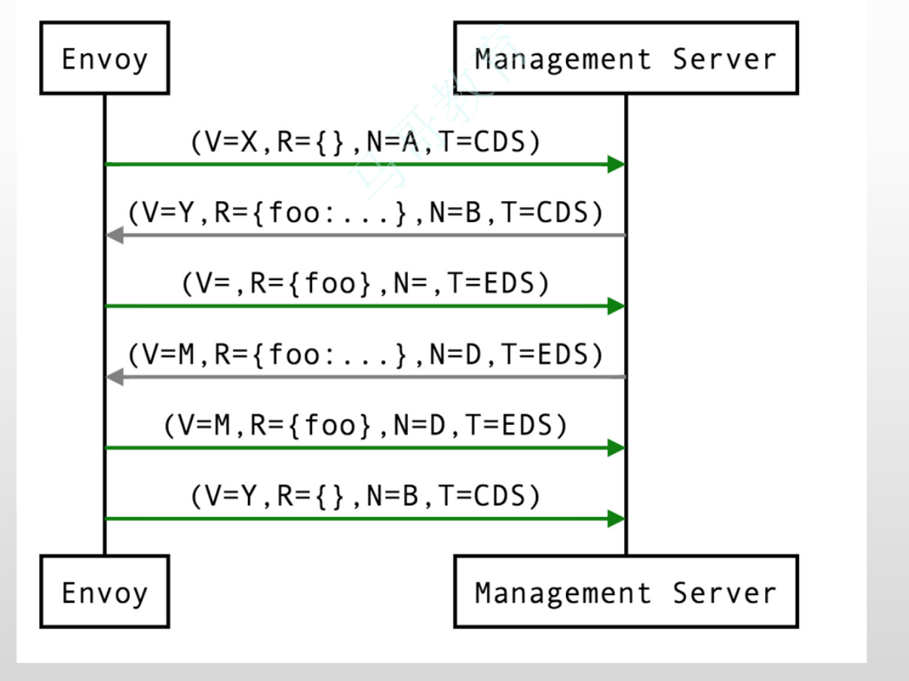

# day14-serviceMesh

使用xDS动态加载配置时,不同的DS可以指向不同的服务器.例如:LDS指向服务器A,CDS指向服务器B.ADS作为聚合服务发现,可以确保配置是同时到达的.像前者所说的不同服务发现指向不同的服务器时,假设LDS依赖CDS,但LDS的配置先于CDS返回了,那么此时配置LDS就会报错.ADS可以确保不发生这样的问题.

xDS支持全量发现和增量发现.

## PART1. xDS API与动态配置

### 1.1 xDS API概述

xDS API为Envoy提供了资源的动态配置机制,它也被称为Data Plane API(数据平面API).

Envoy支持三种类型的配置信息的动态发现机制(也就是我们配置的management server有3种方式返回配置信息),相关的发现服务及其相应的API联合起来称为xDS API

- 基于文件系统发现:指定要监视的文件系统路径.即:把配置文件放在某个目录下,只要文件内容遵循协议格式的,加载这个文件内容就完成了配置,修改这个文件就相当于动态配置.类似nginx修改了配置文件之后执行`nginx reload`命令
- 通过查询一到多个管理服务器(Management Server)发现(建议使用https发现):通过DiscoveryRequest协议报文发送请求,并要求服务方以DiscoveryResponse协议报文进行响应

	- gRPC服务:启动gRPC流(效率较高,因为是建立了一个始终存在的连接并进行监视的)
	- REST服务:轮询REST-JSON URL(基于http,安全性较差且效率低)

- v3 xDS支持如下几种资源类型

	- `envoy.config.listener.v3.Listener`:LDS
	- `envoy.config.route.v3.RouteConfiguration`:RDS
	- `envoy.config.route.v3.ScopedRouteConfiguration`:SRDS.受限的/区域性的/范围性的路由发现配置
	- `envoy.config.route.v3.VirtualHost`:VHDS.虚拟主机发现服务
	- `envoy.config.cluster.v3.Cluster`:CDS
	- `envoy.config.endpoint.v3.ClusterLoadAssignment`:EDS.就是用来发现endpoint的
	- `envoy.extensions.transport_sockets.tls.v3.Secret`:SDS
	- `envoy.service.runtime.v3.Runtime`:RTDS

Envoy对xDS API的管理由后端服务器实现,包括LDS、CDS、RDS、SRDS(Scoped Route)、VHDS(Virtual Host)、EDS、SDS、RTDS(Runtime)等

- 所有这些API都提供了最终的一致性,并且彼此间不存在相互影响
- 部分更高级别的操作(例如执行服务的A/B部署)需要进行排序以防止流量被丢弃,因此,基于一个管理服务器提供多类API时还需要使用聚合发现服务(ADS)API
	- ADS API允许所有其他API通过来自单个管理服务器的单个gRPC双向流进行编组,从而允许对操作进行确定性排序
- 另外,xDS的各API还支持增量传输机制,包括ADS


### 1.2 Bootstrap node配置段

一个Management Server实例可能需要同时响应多个不同的Envoy实例的资源发现请求

- Management Server上的配置需要适配到不同的Envoy实例
- Envoy实例请求发现配置时,需要在请求报文中上报自身的信息

	- 例如id、cluster、metadata和locality等
	- 这些配置信息定义在Bootstrap配置文件中

```yaml
# bootstrap专用的顶级配置段
node:
  # envoy的ID信息 用于让Management Server确认Envoy的信息
  # Management Server进而根据该Envoy的信息下发对应于该Envoy的配置
  # An opaque node identifier for the Envoy node. 
  id: … 
  # 指明Envoy所属的集群
  # Defines the local service cluster name where Envoy is running. 
  cluster: …
  # 指明Envoy的元数据信息 
  # Opaque metadata extending the node identifier. Envoy will pass this directly to the management server.
  metadata: {…} 
  # 指明Envoy所在的位置
  # Locality specifying where the Envoy instance is running.
  locality: 
    region: …
    zone: …
    sub_zone: …
  # 自定义的(模拟的)user_agent的名称
  # Free-form string that identifies the entity requesting config. E.g. “envoy” or “grpc”
  user_agent_name: … 
  # 自定义的user_agent的版本
  # Free-form string that identifies the version of the entity requesting config. E.g. “1.12.2” or “abcd1234” , or “SpecialEnvoyBuild”
  user_agent_version: … 
  user_agent_build_version: # Structured version of the entity requesting config.
    version: …
    metadata: {…}
  extensions: [ ] # List of extensions and their versions supported by the node.
  client_features: [ ]
  listening_addresses: [ ] # Known listening ports on the node as a generic hint to the management server for filtering listeners to be returned
```

其中最重要的2个字段是`node.id`和`node.cluster`

### 1.3 API流程

- 对于典型的HTTP路由方案,xDS API的Management Server需要为其客户端(即Envoy实例)配置的核心资源类型为Listener、RouteConfiguration、Cluster和ClusterLoadAssignment四项.每个Listener资源可以指向一个RouteConfiguration资源(即yaml文件中的`listeners.route_config`字段),该资源可以指向一个或多个Cluster资源,并且每个Cluster资源可以指向一个ClusterLoadAssignment资源

可以认为每个Linstener可以包含1-N个RouteConfiguration;每个RouteConfiguration可以指向1-N个Cluster;每个Cluster包含1个ClusterLoadAssignment;每个ClusterLoadAssignment中包含了1-N个endpoint的信息

- Envoy实例在启动时请求加载所有Listener和Cluster资源,而后,再获取由这些Listener和Cluster所依赖的RouteConfiguration和ClusterLoadAssignment配置.这种情况下,Listener资源和Cluster资源分别代表着客户端配置树上的"根(root)"配置(2个不同的根),因此可以并行加载

Listener的信息是Envoy通过请求Management Server获取到的.Management Server返回给Envoy的Listener信息中的路由信息部分,有可能是配置好的路由,这种场景就属于静态指定的路由;Management Server返回给Envoy的Listener信息中的路由信息部分,还有可能需要再通过RDS再去发现.因此完整的API流程就是:先发现Listener,根据发现到的Listener结果中的路由信息部分,再来判定Route信息是否需要动态加载.

对于Cluster的信息也是一样的流程.Envoy请求Management Server获取Cluster信息.Cluster信息中的ClusterLoadAssignment部分,可能是已经给出的确定的endpoint的信息;也有可能是需要再次进行EDS/DNS发现的.但只有Cluster信息加载完成后,才能确定ClusterLoadAssignment是否需要请求EDS/DNS进行动态加载.

- 但是,类似gRPC一类的非代理式客户端可以仅在启动时请求加载其感兴趣的Listener资源,而后再加载这些特定Listener相关的RouteConfiguration资源;再然后是这些RouteConfiguration资源指向的Cluster资源,以及由这些Cluster资源依赖的ClusterLoadAssignment资源.这种场景下,Listener资源是客户端整个配置树的"根"

### 1.4 Envoy资源的配置源(ConfigSource)

配置源(ConfigSource)用于指定资源配置数据的来源,用于为Listener、Cluster、Route、Endpoint、Secret和VirtualHost等资源提供配置数据

目前,Envoy支持的资源配置源只能是path、`api_config_source`或ads其中之一

- path:直接指定Envoy所在的本地文件系统中的某个文件
- `api_config_source`:需要使用api_type来指定对应的API在发现数据时,数据源的类型

	- REST-JSON API:JSON格式的响应报文.基于REST API进行发现.后端Management Server是一个HTTP/HTTPS Server
	- GRPC API:表示后端Management Server是gRPC协议的
	- Delta GRPC:只有GRPC才支持Delta(即增量配置)

- ads:逻辑和`api_config_source`是相同的.不同之处在于1个API发现多种资源(Listener、Route、Cluster等)

`api_config_source`或ads的数据来自于xDS API Server,即Management Server


### 1.5 基于文件系统的订阅

为Envoy提供动态配置的最简单方法是将其放置在ConfigSource中显式指定的文件路径中.Envoy将使用inotify(Mac OS X上的kqueue)来监视文件的更改,并在更新时解析文件中的DiscoveryResponse报文(即对应的发现协议的响应报文格式).二进制protobufs,JSON,YAML和proto文本都是DiscoveryResponse所支持的数据格式.

无论使用path、`api_config_source`还是ads的方式发现,所有的报文都是通过请求响应模型来传输的.请求报文即为DiscoveryRequest,响应报文即为DiscoveryResponse.

提示:

1. 除了统计计数器和日志以外,没有任何机制可用于文件系统订阅ACK/NACK更新
2. 若配置更新被拒绝,xDS API的最后一个有效配置将继续适用

### 1.6 配置示例:基于文件系统的订阅-以eds为例

以EDS为例.Cluster为静态定义,其各Endpoint通过EDS动态发现.EDS资源其实是在配置链最尾端的.

#### 1.6.1 环境说明

5个Service:

- envoy:Front Proxy,地址为172.31.11.2
- webserver01:第一个后端服务
- webserver01-sidecar:第一个后端服务的Sidecar Proxy,地址为172.31.11.11
- webserver02:第二个后端服务
- webserver02-sidecar:第二个后端服务的Sidecar Proxy,地址为172.31.11.12

首先使用EDS以监控配置文件的方式动态加载endopoint,然后修改该配置文件,观察是否能够动态加载

#### 1.6.2 容器编排

##### 1.6.2.1 编写front-proxy的envoy配置文件

```
root@k8s-haproxy-2:~# mkdir eds-filesystem
root@k8s-haproxy-2:~# cd eds-filesystem/
root@k8s-haproxy-2:~/eds-filesystem# vim front-envoy.yaml
root@k8s-haproxy-2:~/eds-filesystem# cat front-envoy.yaml
```

```yaml
node:
  # 若要使用动态配置 则每个Envoy实例必须有唯一的id标识
  id: envoy_front_proxy
  cluster: Roach_Cluster

admin:
  profile_path: /tmp/envoy.prof
  access_log_path: /tmp/admin_access.log
  address:
    socket_address:
       address: 0.0.0.0
       port_value: 9901

static_resources:
  listeners:
  - name: listener_0
    address:
      socket_address: { address: 0.0.0.0, port_value: 80 }
    filter_chains:
    - filters:
      - name: envoy.filters.network.http_connection_manager
        typed_config:
          "@type": type.googleapis.com/envoy.extensions.filters.network.http_connection_manager.v3.HttpConnectionManager
          stat_prefix: ingress_http
          codec_type: AUTO
          route_config:
            name: local_route
            virtual_hosts:
            - name: web_service_01
              domains: ["*"]
              routes:
              - match: { prefix: "/" }
                route: { cluster: webcluster }
          http_filters:
          - name: envoy.filters.http.router

  clusters:
    # 集群名称
  - name: webcluster
    connect_timeout: 0.25s
    # 集群类型为EDS
    type: EDS
    lb_policy: ROUND_ROBIN
    # 该字段相当于静态配置中的load_assignment字段
    eds_cluster_config:
      # 服务名称
      service_name: webcluster
      # EDS相关的配置 例如数据源的路径(地址)都在这里配置
      eds_config:
        # 指定订阅的文件路径 注意这个路径是指容器内的路径
        # 而非宿主机的路径 因此在后续编写docker-compose文件时
        # 要把对应的eds配置文件挂载到该路径下
        # 注意:配置文件的后缀若为.conf 则资源要以JSON格式定义
        # 配置文件的后缀若为.yaml 则资源要以yaml格式定义
        path: '/etc/envoy/eds.conf.d/eds.yaml'
```

该Enovy作为front-proxy,需要EDS动态加载endpoint的配置信息

##### 1.6.2.2 编写EDS的配置文件

此处需编写2个配置文件,第1个是Enovy启动时加载的配置;第2个是修改后的配置,用于演示动态加载配置的功能.此处在本步骤提前写好该配置文件,后续容器启动后,在容器中直接使用该文件内容覆盖启动时加载的配置文件内容即可

- step1. 编写初始加载的配置

```
root@k8s-haproxy-2:~/eds-filesystem# mkdir eds.conf.d
root@k8s-haproxy-2:~/eds-filesystem# cd eds.conf.d/
root@k8s-haproxy-2:~/eds-filesystem/eds.conf.d# vim eds.yaml
root@k8s-haproxy-2:~/eds-filesystem/eds.conf.d# cat eds.yaml
```

```yaml
resources:
- "@type": type.googleapis.com/envoy.config.endpoint.v3.ClusterLoadAssignment
  # 集群名称 建议与clusters.name一致 clusters.name是集群外部引用时的名称
  # resources.cluster_name是集群内部被集群管理器管理时使用的名称
  cluster_name: webcluster
  endpoints:
  - lb_endpoints:
    - endpoint:
        address:
          socket_address:
            address: 172.31.11.11
            port_value: 80
```

- step2. 编写修改后的配置

```
root@k8s-haproxy-2:~/eds-filesystem/eds.conf.d# vim eds.yaml.v2
root@k8s-haproxy-2:~/eds-filesystem/eds.conf.d# cat eds.yaml.v2
```

```yaml
# version_info字段只是用于标识配置文件的版本有变更
# 无其他含义或作用
version_info: '2'
resources:
- "@type": type.googleapis.com/envoy.config.endpoint.v3.ClusterLoadAssignment
  cluster_name: webcluster
  endpoints:
  - lb_endpoints:
    - endpoint:
        address:
          socket_address:
            address: 172.31.11.11
            port_value: 80
    - endpoint:
        address:
          socket_address:
            address: 172.31.11.12
            port_value: 80
```

##### 1.6.2.3 编写sidecar-proxy的envoy配置文件

该envoy以sidecar的形式作为后端服务webserver01和webserver02的代理工作

```
root@k8s-haproxy-2:~/eds-filesystem/eds.conf.d# cd ..
root@k8s-haproxy-2:~/eds-filesystem# vim envoy-sidecar-proxy.yaml
root@k8s-haproxy-2:~/eds-filesystem# cat envoy-sidecar-proxy.yaml
```

```yaml
admin:
  profile_path: /tmp/envoy.prof
  access_log_path: /tmp/admin_access.log
  address:
    socket_address:
       address: 0.0.0.0
       port_value: 9901

static_resources:
  listeners:
  - name: listener_0
    address:
      socket_address: { address: 0.0.0.0, port_value: 80 }
    filter_chains:
    - filters:
      - name: envoy.filters.network.http_connection_manager
        typed_config:
          "@type": type.googleapis.com/envoy.extensions.filters.network.http_connection_manager.v3.HttpConnectionManager
          stat_prefix: ingress_http
          codec_type: AUTO
          route_config:
            name: local_route
            virtual_hosts:
            - name: local_service 
              domains: ["*"]
              routes:
              - match: { prefix: "/" }
                route: { cluster: local_cluster }
          http_filters:
          - name: envoy.filters.http.router

  clusters:
  - name: local_cluster
    connect_timeout: 0.25s
    type: STATIC
    lb_policy: ROUND_ROBIN
    load_assignment:
      cluster_name: local_cluster
      endpoints:
      - lb_endpoints:
        - endpoint:
            address:
              socket_address: { address: 127.0.0.1, port_value: 8080 }
```

##### 1.6.2.4 编写容器编排文件

```
root@k8s-haproxy-2:~/eds-filesystem# vim docker-compose.yaml
root@k8s-haproxy-2:~/eds-filesystem# cat docker-compose.yaml
```

```yaml
version: '3.3'

services:
  envoy:
    image: envoyproxy/envoy-alpine:v1.21-latest
    environment:
      - ENVOY_UID=0
      - ENVOY_GID=0
    volumes:
      # front-proxy envoy的配置文件
    - ./front-envoy.yaml:/etc/envoy/envoy.yaml
      # eds的配置文件 此处加载多个配置文件 是为了演示后续
      # 配置文件发生变更时 动态更新配置的结果
    - ./eds.conf.d/:/etc/envoy/eds.conf.d/
    networks:
      envoymesh:
        ipv4_address: 172.31.11.2
        aliases:
        - front-proxy
    depends_on:
    - webserver01-sidecar
    - webserver02-sidecar

  webserver01-sidecar:
    image: envoyproxy/envoy-alpine:v1.21-latest
    volumes:
      # sidecar-proxy envoy的配置文件
    - ./envoy-sidecar-proxy.yaml:/etc/envoy/envoy.yaml
    hostname: webserver01
    networks:
      envoymesh:
        ipv4_address: 172.31.11.11
        aliases:
        - webserver01-sidecar

  webserver01:
    image: ikubernetes/demoapp:v1.0
    environment:
      - PORT=8080
      - HOST=127.0.0.1
    network_mode: "service:webserver01-sidecar"
    depends_on:
    - webserver01-sidecar

  webserver02-sidecar:
    image: envoyproxy/envoy-alpine:v1.21-latest
    volumes:
      # sidecar-proxy envoy的配置文件
    - ./envoy-sidecar-proxy.yaml:/etc/envoy/envoy.yaml
    hostname: webserver02
    networks:
      envoymesh:
        ipv4_address: 172.31.11.12
        aliases:
        - webserver02-sidecar

  webserver02:
    image: ikubernetes/demoapp:v1.0
    environment:
      - PORT=8080
      - HOST=127.0.0.1
    network_mode: "service:webserver02-sidecar"
    depends_on:
    - webserver02-sidecar

networks:
  envoymesh:
    driver: bridge
    ipam:
      config:
        - subnet: 172.31.11.0/24
```

完成后目录结构如下:

```
root@k8s-haproxy-2:~/eds-filesystem# tree ./
./
├── docker-compose.yaml
├── eds.conf.d
│   ├── eds.yaml
│   └── eds.yaml.v2
├── envoy-sidecar-proxy.yaml
└── front-envoy.yaml

1 directory, 5 files
```

#### 1.6.3 运行与测试

##### 1.6.3.1 创建

```
root@k8s-haproxy-2:~/eds-filesystem# docker-compose up
[+] Running 6/6
 ⠿ Network eds-filesystem_envoymesh                Created                                                                                                                                                                                                                 0.0s
 ⠿ Container eds-filesystem-webserver01-sidecar-1  Created                                                                                                                                                                                                                 0.1s
 ⠿ Container eds-filesystem-webserver02-sidecar-1  Created                                                                                                                                                                                                                 0.1s
 ⠿ Container eds-filesystem-webserver02-1          Created                                                                                                                                                                                                                 0.1s
 ⠿ Container eds-filesystem-webserver01-1          Created                                                                                                                                                                                                                 0.1s
 ⠿ Container eds-filesystem-envoy-1                Created                                                                                                                                                                                                                 0.1s
Attaching to eds-filesystem-envoy-1, eds-filesystem-webserver01-1, eds-filesystem-webserver01-sidecar-1, eds-filesystem-webserver02-1, eds-filesystem-webserver02-sidecar-1
...
```

##### 1.6.3.2 测试

重新启动一个连接并执行以下操作:

- step1. 测试访问

```
root@k8s-haproxy-2:~/eds-filesystem# curl 172.31.11.2
iKubernetes demoapp v1.0 !! ClientIP: 127.0.0.1, ServerName: webserver01, ServerIP: 172.31.11.11!
```

可以看到请求是可以被正常响应的

- step2. 查看修改配置前,front-envoy cluster的端点信息

```
root@k8s-haproxy-2:~/eds-filesystem# curl 172.31.11.2:9901/clusters
webcluster::observability_name::webcluster
webcluster::default_priority::max_connections::1024
webcluster::default_priority::max_pending_requests::1024
webcluster::default_priority::max_requests::1024
webcluster::default_priority::max_retries::3
webcluster::high_priority::max_connections::1024
webcluster::high_priority::max_pending_requests::1024
webcluster::high_priority::max_requests::1024
webcluster::high_priority::max_retries::3
webcluster::added_via_api::false
webcluster::172.31.11.11:80::cx_active::1
webcluster::172.31.11.11:80::cx_connect_fail::0
webcluster::172.31.11.11:80::cx_total::1
webcluster::172.31.11.11:80::rq_active::0
webcluster::172.31.11.11:80::rq_error::0
webcluster::172.31.11.11:80::rq_success::1
webcluster::172.31.11.11:80::rq_timeout::0
webcluster::172.31.11.11:80::rq_total::1
webcluster::172.31.11.11:80::hostname::
webcluster::172.31.11.11:80::health_flags::healthy
webcluster::172.31.11.11:80::weight::1
webcluster::172.31.11.11:80::region::
webcluster::172.31.11.11:80::zone::
webcluster::172.31.11.11:80::sub_zone::
webcluster::172.31.11.11:80::canary::false
webcluster::172.31.11.11:80::priority::0
webcluster::172.31.11.11:80::success_rate::-1.0
webcluster::172.31.11.11:80::local_origin_success_rate::-1.0
```

注意此时集群中只有172.31.11.11这1个端点

- step3. 进入容器,修改配置

```
root@k8s-haproxy-2:~/eds-filesystem# docker-compose exec -it envoy /bin/sh
/ # cd /etc/envoy/
/etc/envoy # ls
eds.conf.d  envoy.yaml
/etc/envoy # cd eds.conf.d/
/etc/envoy/eds.conf.d # ls
eds.yaml     eds.yaml.v2
/etc/envoy/eds.conf.d # cat eds.yaml.v2 > eds.yaml # 使用eds.yaml.v2的内容直接覆盖eds.yaml
/etc/envoy/eds.conf.d # cat eds.yaml
# version_info字段只是用于标识配置文件的版本有变更
# 无其他含义或作用
version_info: '2'
resources:
- "@type": type.googleapis.com/envoy.config.endpoint.v3.ClusterLoadAssignment
  cluster_name: webcluster
  endpoints:
  - lb_endpoints:
    - endpoint:
        address:
          socket_address:
            address: 172.31.11.11
            port_value: 80
    - endpoint:
        address:
          socket_address:
            address: 172.31.11.12
            port_value: 80
/etc/envoy/eds.conf.d # mv eds.yaml bak # 此处是因为在容器中修改文件内容 所以envoy看到的内核视图不是物理视图 进而很有可能不触发inotify的变动 因此需要强制激活文件更改 
/etc/envoy/eds.conf.d # mv bak eds.yaml
/etc/envoy/eds.conf.d # exit
```

注意:不要就地编辑当前正在使用的配置文件,因为该文件随时都在被监听,可能在修改的过程中就被监听到变化,然后加载新的配置,这样会加载一个还没写完的配置.

- step4. 修改配置后再次查看front-envoy cluster的端点信息

```
root@k8s-haproxy-2:~/eds-filesystem# curl 172.31.11.2:9901/clusters
webcluster::observability_name::webcluster
webcluster::default_priority::max_connections::1024
webcluster::default_priority::max_pending_requests::1024
webcluster::default_priority::max_requests::1024
webcluster::default_priority::max_retries::3
webcluster::high_priority::max_connections::1024
webcluster::high_priority::max_pending_requests::1024
webcluster::high_priority::max_requests::1024
webcluster::high_priority::max_retries::3
webcluster::added_via_api::false
webcluster::172.31.11.11:80::cx_active::1
webcluster::172.31.11.11:80::cx_connect_fail::0
webcluster::172.31.11.11:80::cx_total::1
webcluster::172.31.11.11:80::rq_active::0
webcluster::172.31.11.11:80::rq_error::0
webcluster::172.31.11.11:80::rq_success::1
webcluster::172.31.11.11:80::rq_timeout::0
webcluster::172.31.11.11:80::rq_total::1
webcluster::172.31.11.11:80::hostname::
webcluster::172.31.11.11:80::health_flags::healthy
webcluster::172.31.11.11:80::weight::1
webcluster::172.31.11.11:80::region::
webcluster::172.31.11.11:80::zone::
webcluster::172.31.11.11:80::sub_zone::
webcluster::172.31.11.11:80::canary::false
webcluster::172.31.11.11:80::priority::0
webcluster::172.31.11.11:80::success_rate::-1.0
webcluster::172.31.11.11:80::local_origin_success_rate::-1.0
webcluster::172.31.11.12:80::cx_active::0
webcluster::172.31.11.12:80::cx_connect_fail::0
webcluster::172.31.11.12:80::cx_total::0
webcluster::172.31.11.12:80::rq_active::0
webcluster::172.31.11.12:80::rq_error::0
webcluster::172.31.11.12:80::rq_success::0
webcluster::172.31.11.12:80::rq_timeout::0
webcluster::172.31.11.12:80::rq_total::0
webcluster::172.31.11.12:80::hostname::
webcluster::172.31.11.12:80::health_flags::healthy
webcluster::172.31.11.12:80::weight::1
webcluster::172.31.11.12:80::region::
webcluster::172.31.11.12:80::zone::
webcluster::172.31.11.12:80::sub_zone::
webcluster::172.31.11.12:80::canary::false
webcluster::172.31.11.12:80::priority::0
webcluster::172.31.11.12:80::success_rate::-1.0
webcluster::172.31.11.12:80::local_origin_success_rate::-1.0
```

可以看到现在是有172.31.11.11和172.31.11.12,共2个端点的

- step5. 测试访问

```
root@k8s-haproxy-2:~/eds-filesystem# curl 172.31.11.2
iKubernetes demoapp v1.0 !! ClientIP: 127.0.0.1, ServerName: webserver01, ServerIP: 172.31.11.11!
root@k8s-haproxy-2:~/eds-filesystem# curl 172.31.11.2
iKubernetes demoapp v1.0 !! ClientIP: 127.0.0.1, ServerName: webserver02, ServerIP: 172.31.11.12!
root@k8s-haproxy-2:~/eds-filesystem# curl 172.31.11.2
iKubernetes demoapp v1.0 !! ClientIP: 127.0.0.1, ServerName: webserver01, ServerIP: 172.31.11.11!
root@k8s-haproxy-2:~/eds-filesystem# curl 172.31.11.2
iKubernetes demoapp v1.0 !! ClientIP: 127.0.0.1, ServerName: webserver02, ServerIP: 172.31.11.12!
```

可以看到,后端2个端点是轮询工作的

##### 1.6.3.3 停止

```
^CGracefully stopping... (press Ctrl+C again to force)
[+] Running 5/5
 ⠿ Container eds-filesystem-webserver02-1          Stopped                                                                                                                                                                                                                10.2s
 ⠿ Container eds-filesystem-envoy-1                Stopped                                                                                                                                                                                                                 0.1s
 ⠿ Container eds-filesystem-webserver01-1          Stopped                                                                                                                                                                                                                10.1s
 ⠿ Container eds-filesystem-webserver01-sidecar-1  Stopped                                                                                                                                                                                                                 0.1s
 ⠿ Container eds-filesystem-webserver02-sidecar-1  Stopped                                                                                                                                                                                                                 0.2s
canceled
root@k8s-haproxy-2:~/eds-filesystem# docker-compose down
[+] Running 6/6
 ⠿ Container eds-filesystem-webserver02-1          Removed                                                                                                                                                                                                                 0.0s
 ⠿ Container eds-filesystem-envoy-1                Removed                                                                                                                                                                                                                 0.0s
 ⠿ Container eds-filesystem-webserver01-1          Removed                                                                                                                                                                                                                 0.0s
 ⠿ Container eds-filesystem-webserver02-sidecar-1  Removed                                                                                                                                                                                                                 0.0s
 ⠿ Container eds-filesystem-webserver01-sidecar-1  Removed                                                                                                                                                                                                                 0.0s
 ⠿ Network eds-filesystem_envoymesh                Removed                                                                                                                                                                                                                 0.1s
```

### 1.7 配置示例:基于文件系统的订阅-LDS和CDS

实际上这个demo已经有一些全动态配置的雏形了.

#### 1.7.1 环境说明

5个Service:

- envoy:Front Proxy,地址为172.31.12.2
- webserver01:第一个后端服务
- webserver01-sidecar:第一个后端服务的Sidecar Proxy,地址为172.31.12.11
- webserver02:第二个后端服务
- webserver02-sidecar:第二个后端服务的Sidecar Proxy,地址为172.31.12.12

#### 1.7.2 容器编排

##### 1.7.2.1 编写编写front-proxy的envoy配置文件

```
root@k8s-haproxy-2:~/eds-filesystem# cd ..
root@k8s-haproxy-2:~# mkdir lds-cds-filesystem
root@k8s-haproxy-2:~# cd lds-cds-filesystem/
root@k8s-haproxy-2:~/lds-cds-filesystem# vim front-envoy.yaml
root@k8s-haproxy-2:~/lds-cds-filesystem# cat front-envoy.yaml
```

```yaml
# 若要使用动态配置 则顶级配置字段node必须写
node:
  # id 和 cluster 两个字段也必须写
  id: envoy_front_proxy
  cluster: Roach_Cluster

admin:
  profile_path: /tmp/envoy.prof
  access_log_path: /tmp/admin_access.log
  address:
    socket_address:
       address: 0.0.0.0
       port_value: 9901

dynamic_resources:
  # lds的相关配置
  lds_config:
    path: /etc/envoy/conf.d/lds.yaml
  # cds的相关配置
  cds_config:
    path: /etc/envoy/conf.d/cds.yaml
```

##### 1.7.2.2 编写LDS的配置文件

```
root@k8s-haproxy-2:~/lds-cds-filesystem# mkdir conf.d
root@k8s-haproxy-2:~/lds-cds-filesystem# cd conf.d/
root@k8s-haproxy-2:~/lds-cds-filesystem/conf.d# vim lds.yaml
root@k8s-haproxy-2:~/lds-cds-filesystem/conf.d# cat lds.yaml
```

```yaml
resources:
- "@type": type.googleapis.com/envoy.config.listener.v3.Listener
  name: listener_http
  address:
    socket_address: { address: 0.0.0.0, port_value: 80 }
  filter_chains:
  - filters:
      name: envoy.http_connection_manager
      typed_config:
        "@type": type.googleapis.com/envoy.extensions.filters.network.http_connection_manager.v3.HttpConnectionManager
        stat_prefix: ingress_http
        route_config:
          name: local_route
          virtual_hosts:
          - name: local_service
            domains: ["*"]
            routes:
            - match:
                prefix: "/"
              route:
                cluster: webcluster
        http_filters:
        - name: envoy.filters.http.router
```

##### 1.7.2.3 编写CDS的配置文件

```
root@k8s-haproxy-2:~/lds-cds-filesystem/conf.d# vim cds.yaml
root@k8s-haproxy-2:~/lds-cds-filesystem/conf.d# cat cds.yaml
```

```yaml
resources:
- "@type": type.googleapis.com/envoy.config.cluster.v3.Cluster
  name: webcluster
  connect_timeout: 1s
  type: STRICT_DNS
  load_assignment:
    cluster_name: webcluster
    endpoints:
    - lb_endpoints:
      - endpoint:
          address:
            socket_address:
              # 此处的webserver01和webserver02是docker-compose.yaml
              # 中定义的服务名 将服务名解析为IP地址是docker-compose提供的功能
              address: webserver01
              port_value: 80
      - endpoint:
          address:
            socket_address:
              address: webserver02
              port_value: 80
```

注意:LDS的配置中可以嵌套RDS的配置,CDS的配置中可以嵌套EDS配置.但此处作为演示的demo,为了简单起见,把route信息和endpoint信息全都写成静态的了.

##### 1.7.2.4 编写sidecar-proxy的envoy配置文件

该envoy以sidecar形式为后端服务webserver01和webserver02提供代理

```
root@k8s-haproxy-2:~/lds-cds-filesystem/conf.d# cd ..
root@k8s-haproxy-2:~/lds-cds-filesystem# vim envoy-sidecar-proxy.yaml
root@k8s-haproxy-2:~/lds-cds-filesystem# cat envoy-sidecar-proxy.yaml
```

```yaml
admin:
  profile_path: /tmp/envoy.prof
  access_log_path: /tmp/admin_access.log
  address:
    socket_address:
       address: 0.0.0.0
       port_value: 9901

static_resources:
  listeners:
  - name: listener_0
    address:
      socket_address: { address: 0.0.0.0, port_value: 80 }
    filter_chains:
    - filters:
      - name: envoy.filters.network.http_connection_manager
        typed_config:
          "@type": type.googleapis.com/envoy.extensions.filters.network.http_connection_manager.v3.HttpConnectionManager
          stat_prefix: ingress_http
          codec_type: AUTO
          route_config:
            name: local_route
            virtual_hosts:
            - name: local_service 
              domains: ["*"]
              routes:
              - match: { prefix: "/" }
                route: { cluster: local_cluster }
          http_filters:
          - name: envoy.filters.http.router

  clusters:
  - name: local_cluster
    connect_timeout: 0.25s
    type: STATIC
    lb_policy: ROUND_ROBIN
    load_assignment:
      cluster_name: local_cluster
      endpoints:
      - lb_endpoints:
        - endpoint:
            address:
              socket_address: { address: 127.0.0.1, port_value: 8080 }
```

##### 1.7.2.5 编写容器编排文件

```
root@k8s-haproxy-2:~/lds-cds-filesystem# vim docker-compose.yaml
root@k8s-haproxy-2:~/lds-cds-filesystem# cat docker-compose.yaml
```

```yaml
version: '3.3'

services:
  envoy:
    image: envoyproxy/envoy-alpine:v1.21-latest
    environment:
      - ENVOY_UID=0
      - ENVOY_GID=0
    volumes:
    # front-proxy的envoy配置文件
    - ./front-envoy.yaml:/etc/envoy/envoy.yaml
    # lds和cds动态加载的配置文件
    - ./conf.d/:/etc/envoy/conf.d/
    networks:
      envoymesh:
        ipv4_address: 172.31.12.2
        aliases:
        - front-proxy
    depends_on:
    - webserver01
    - webserver01-app
    - webserver02
    - webserver02-app

  webserver01:
    image: envoyproxy/envoy-alpine:v1.21-latest
    volumes:
    - ./envoy-sidecar-proxy.yaml:/etc/envoy/envoy.yaml
    hostname: webserver01
    networks:
      envoymesh:
        ipv4_address: 172.31.12.11
        aliases:
        - webserver01-sidecar

  webserver01-app:
    image: ikubernetes/demoapp:v1.0
    environment:
      - PORT=8080
      - HOST=127.0.0.1
    network_mode: "service:webserver01"
    depends_on:
    - webserver01

  webserver02:
    image: envoyproxy/envoy-alpine:v1.21-latest
    volumes:
    - ./envoy-sidecar-proxy.yaml:/etc/envoy/envoy.yaml
    hostname: webserver02
    networks:
      envoymesh:
        ipv4_address: 172.31.12.12
        aliases:
        - webserver02-sidecar

  webserver02-app:
    image: ikubernetes/demoapp:v1.0
    environment:
      - PORT=8080
      - HOST=127.0.0.1
    network_mode: "service:webserver02"
    depends_on:
    - webserver02

networks:
  envoymesh:
    driver: bridge
    ipam:
      config:
        - subnet: 172.31.12.0/24
```

完成后目录结构如下:

```
root@k8s-haproxy-2:~/lds-cds-filesystem# tree ./
./
├── conf.d
│   ├── cds.yaml
│   └── lds.yaml
├── docker-compose.yaml
├── envoy-sidecar-proxy.yaml
└── front-envoy.yaml

1 directory, 5 files
```

#### 1.7.3 运行与测试

##### 1.7.3.1 创建

```
root@k8s-haproxy-2:~/lds-cds-filesystem# docker-compose up
[+] Running 6/6
 ⠿ Network lds-cds-filesystem_envoymesh            Created                                                                                                                                                                                                                 0.0s
 ⠿ Container lds-cds-filesystem-webserver02-1      Created                                                                                                                                                                                                                 0.2s
 ⠿ Container lds-cds-filesystem-webserver01-1      Created                                                                                                                                                                                                                 0.1s
 ⠿ Container lds-cds-filesystem-webserver01-app-1  Created                                                                                                                                                                                                                 0.1s
 ⠿ Container lds-cds-filesystem-webserver02-app-1  Created                                                                                                                                                                                                                 0.1s
 ⠿ Container lds-cds-filesystem-envoy-1            Created                                                                                                                                                                                                                 0.1s
Attaching to lds-cds-filesystem-envoy-1, lds-cds-filesystem-webserver01-1, lds-cds-filesystem-webserver01-app-1, lds-cds-filesystem-webserver02-1, lds-cds-filesystem-webserver02-app-1
...
```

##### 1.7.3.2 测试

重新启动一个连接并执行以下操作:

- step1. 测试访问

```
root@k8s-haproxy-2:~# cd lds-cds-filesystem/
root@k8s-haproxy-2:~/lds-cds-filesystem# curl 172.31.12.2
iKubernetes demoapp v1.0 !! ClientIP: 127.0.0.1, ServerName: webserver01, ServerIP: 172.31.12.11!
root@k8s-haproxy-2:~/lds-cds-filesystem# curl 172.31.12.2
iKubernetes demoapp v1.0 !! ClientIP: 127.0.0.1, ServerName: webserver02, ServerIP: 172.31.12.12!
root@k8s-haproxy-2:~/lds-cds-filesystem# curl 172.31.12.2
iKubernetes demoapp v1.0 !! ClientIP: 127.0.0.1, ServerName: webserver01, ServerIP: 172.31.12.11!
root@k8s-haproxy-2:~/lds-cds-filesystem# curl 172.31.12.2
iKubernetes demoapp v1.0 !! ClientIP: 127.0.0.1, ServerName: webserver02, ServerIP: 172.31.12.12!
```

可以看到,访问和轮询机制都是没有问题的

- step2. 查看front-envoy的侦听器信息

```
root@k8s-haproxy-2:~/lds-cds-filesystem# curl 172.31.12.2:9901/listeners
listener_http::0.0.0.0:80
```

可以看到,和front-envoy动态加载的LDS中的配置内容是相符的

- step3. 查看front-envoy的集群信息

```
root@k8s-haproxy-2:~/lds-cds-filesystem# curl 172.31.12.2:9901/clusters
webcluster::observability_name::webcluster
webcluster::default_priority::max_connections::1024
webcluster::default_priority::max_pending_requests::1024
webcluster::default_priority::max_requests::1024
webcluster::default_priority::max_retries::3
webcluster::high_priority::max_connections::1024
webcluster::high_priority::max_pending_requests::1024
webcluster::high_priority::max_requests::1024
webcluster::high_priority::max_retries::3
webcluster::added_via_api::true
webcluster::172.31.12.11:80::cx_active::1
webcluster::172.31.12.11:80::cx_connect_fail::0
webcluster::172.31.12.11:80::cx_total::1
webcluster::172.31.12.11:80::rq_active::0
webcluster::172.31.12.11:80::rq_error::0
webcluster::172.31.12.11:80::rq_success::2
webcluster::172.31.12.11:80::rq_timeout::0
webcluster::172.31.12.11:80::rq_total::2
webcluster::172.31.12.11:80::hostname::webserver01
webcluster::172.31.12.11:80::health_flags::healthy
webcluster::172.31.12.11:80::weight::1
webcluster::172.31.12.11:80::region::
webcluster::172.31.12.11:80::zone::
webcluster::172.31.12.11:80::sub_zone::
webcluster::172.31.12.11:80::canary::false
webcluster::172.31.12.11:80::priority::0
webcluster::172.31.12.11:80::success_rate::-1.0
webcluster::172.31.12.11:80::local_origin_success_rate::-1.0
webcluster::172.31.12.12:80::cx_active::1
webcluster::172.31.12.12:80::cx_connect_fail::0
webcluster::172.31.12.12:80::cx_total::1
webcluster::172.31.12.12:80::rq_active::0
webcluster::172.31.12.12:80::rq_error::0
webcluster::172.31.12.12:80::rq_success::2
webcluster::172.31.12.12:80::rq_timeout::0
webcluster::172.31.12.12:80::rq_total::2
webcluster::172.31.12.12:80::hostname::webserver02
webcluster::172.31.12.12:80::health_flags::healthy
webcluster::172.31.12.12:80::weight::1
webcluster::172.31.12.12:80::region::
webcluster::172.31.12.12:80::zone::
webcluster::172.31.12.12:80::sub_zone::
webcluster::172.31.12.12:80::canary::false
webcluster::172.31.12.12:80::priority::0
webcluster::172.31.12.12:80::success_rate::-1.0
webcluster::172.31.12.12:80::local_origin_success_rate::-1.0
```

可以看到,和front-envoy动态加载的CDS中的配置内容是相符的.实际上这里的端点是基于DNS发现的.而DNS是docker-compose提供的功能.

- step4. 进入容器,修改LDS的配置

```
root@k8s-haproxy-2:~/lds-cds-filesystem# docker-compose exec envoy /bin/sh
/ # cd /etc/envoy/
/etc/envoy # cd conf.d/
/etc/envoy/conf.d # vi lds.yaml 
/etc/envoy/conf.d # cat lds.yaml
```

```yaml 
resources:
- "@type": type.googleapis.com/envoy.config.listener.v3.Listener
  name: listener_http
  address:
    socket_address: { address: 0.0.0.0, port_value: 80 }
  filter_chains:
  - filters:
      name: envoy.http_connection_manager
      typed_config:
        "@type": type.googleapis.com/envoy.extensions.filters.network.http_connection_manager.v3.HttpConnectionManager
        stat_prefix: ingress_http
        route_config:
          name: local_route
          virtual_hosts:
          - name: local_service
            domains: ["*"]
            routes:
            - match:
                prefix: "/"
              route:
                cluster: webcluster
        http_filters:
        - name: envoy.filters.http.router

- "@type": type.googleapis.com/envoy.config.listener.v3.Listener
  name: listener_http_1
  address:
    socket_address: { address: 0.0.0.0, port_value: 8080 }
  filter_chains:
  - filters:
      name: envoy.http_connection_manager
      typed_config:
        "@type": type.googleapis.com/envoy.extensions.filters.network.http_connection_manager.v3.HttpConnectionManager
        stat_prefix: ingress_http
        route_config:
          name: local_route
          virtual_hosts:
          - name: local_service
            domains: ["*"]
            routes:
            - match:
                prefix: "/"
              route:
                cluster: webcluster
        http_filters:
        - name: envoy.filters.http.router
```

此处又定义了一个监听器,名称为`listener_http_1`,监听的端口为8080

```
/etc/envoy/conf.d # mv lds.yaml bak
/etc/envoy/conf.d # mv bak lds.yaml
```

- step5. 回到正在运行容器的SSH,查看日志信息

```
lds-cds-filesystem-envoy-1            | [2022-06-26 17:02:40.439][1][info][upstream] [source/server/lds_api.cc:77] lds: add/update listener 'listener_http_1'
```

日志中直接显示出修改了listener的信息

- step6. 退出容器,再次查看front-envoy的侦听器信息

```
/etc/envoy/conf.d # exit
root@k8s-haproxy-2:~/lds-cds-filesystem# curl 172.31.12.2:9901/listeners
listener_http::0.0.0.0:80
listener_http_1::0.0.0.0:8080
```

可以看到,多了一个侦听器的信息

- step7. 测试新配置的侦听器是否正常工作

```
root@k8s-haproxy-2:~/lds-cds-filesystem# curl 172.31.12.2:8080
iKubernetes demoapp v1.0 !! ClientIP: 127.0.0.1, ServerName: webserver01, ServerIP: 172.31.12.11!
root@k8s-haproxy-2:~/lds-cds-filesystem# curl 172.31.12.2:8080
iKubernetes demoapp v1.0 !! ClientIP: 127.0.0.1, ServerName: webserver02, ServerIP: 172.31.12.12!
root@k8s-haproxy-2:~/lds-cds-filesystem# curl 172.31.12.2:8080
iKubernetes demoapp v1.0 !! ClientIP: 127.0.0.1, ServerName: webserver01, ServerIP: 172.31.12.11!
root@k8s-haproxy-2:~/lds-cds-filesystem# curl 172.31.12.2:8080
iKubernetes demoapp v1.0 !! ClientIP: 127.0.0.1, ServerName: webserver02, ServerIP: 172.31.12.12!
```

可以看到,新配置的侦听器也是可以正常工作的

- step8. 进入容器,修改CDS的配置

```
root@k8s-haproxy-2:~/lds-cds-filesystem# !doc
docker-compose exec envoy /bin/sh
/ # cd /etc/envoy/conf.d/
/etc/envoy/conf.d # vi cds.yaml 
/etc/envoy/conf.d # cat cds.yaml 
```

```yaml
resources:
- "@type": type.googleapis.com/envoy.config.cluster.v3.Cluster
  name: webcluster
  connect_timeout: 1s
  type: STRICT_DNS
  load_assignment:
    cluster_name: webcluster
    endpoints:
    - lb_endpoints:
      - endpoint:
          address:
            socket_address:
              address: webserver01
              port_value: 80
      - endpoint:
          address:
            socket_address:
              address: webserver02
              port_value: 80

- "@type": type.googleapis.com/envoy.config.cluster.v3.Cluster
  name: webcluster02
  connect_timeout: 1s
  type: STRICT_DNS
  load_assignment:
    cluster_name: webcluster02
    endpoints:
    - lb_endpoints:
      - endpoint:
          address:
            socket_address:
              address: webserver01
              port_value: 80
```

可以看到,在CDS的配置文件中,又新添加了一个集群,该集群只有1个endpoint

```
/etc/envoy/conf.d # mv cds.yaml bak
/etc/envoy/conf.d # mv bak cds.yaml
```

- step9. 回到正在运行容器的SSH,查看日志信息

```
lds-cds-filesystem-envoy-1            | [2022-06-26 17:12:07.249][1][info][upstream] [source/common/upstream/cds_api_helper.cc:30] cds: add 2 cluster(s), remove 0 cluster(s)
lds-cds-filesystem-envoy-1            | [2022-06-26 17:12:07.251][1][info][upstream] [source/common/upstream/cds_api_helper.cc:67] cds: added/updated 1 cluster(s), skipped 1 unmodified cluster(s)
```

- step10. 再次修改LDS的配置,使得step4中配置的侦听器将请求转发给step8中创建的集群

```
/etc/envoy/conf.d # vi lds.yaml 
/etc/envoy/conf.d # cat lds.yaml 
```

```yaml
resources:
- "@type": type.googleapis.com/envoy.config.listener.v3.Listener
  name: listener_http
  address:
    socket_address: { address: 0.0.0.0, port_value: 80 }
  filter_chains:
  - filters:
      name: envoy.http_connection_manager
      typed_config:
        "@type": type.googleapis.com/envoy.extensions.filters.network.http_connection_manager.v3.HttpConnectionManager
        stat_prefix: ingress_http
        route_config:
          name: local_route
          virtual_hosts:
          - name: local_service
            domains: ["*"]
            routes:
            - match:
                prefix: "/"
              route:
                cluster: webcluster
        http_filters:
        - name: envoy.filters.http.router

- "@type": type.googleapis.com/envoy.config.listener.v3.Listener
  name: listener_http_1
  address:
    socket_address: { address: 0.0.0.0, port_value: 8080 }
  filter_chains:
  - filters:
      name: envoy.http_connection_manager
      typed_config:
        "@type": type.googleapis.com/envoy.extensions.filters.network.http_connection_manager.v3.HttpConnectionManager
        stat_prefix: ingress_http
        route_config:
          name: local_route
          virtual_hosts:
          - name: local_service
            domains: ["*"]
            routes:
            - match:
                prefix: "/"
              route:
                cluster: webcluster02
        http_filters:
        - name: envoy.filters.http.router

```

```
/etc/envoy/conf.d # mv lds.yaml bak
/etc/envoy/conf.d # mv bak lds.yaml
```

- step11. 回到正在运行容器的SSH,查看日志信息

```
lds-cds-filesystem-envoy-1            | [2022-06-26 17:15:12.026][1][info][upstream] [source/server/lds_api.cc:77] lds: add/update listener 'listener_http_1'
```

- step12. 查看front-envoy的listener信息

```
root@k8s-haproxy-2:~/lds-cds-filesystem# curl 172.31.12.2:9901/listeners
listener_http::0.0.0.0:80
listener_http_1::0.0.0.0:8080
```

侦听器的信息没有变化

- step13. 查看front-envoy的cluster信息

```
root@k8s-haproxy-2:~/lds-cds-filesystem# curl 172.31.12.2:9901/clusters
webcluster02::observability_name::webcluster02
webcluster02::default_priority::max_connections::1024
webcluster02::default_priority::max_pending_requests::1024
webcluster02::default_priority::max_requests::1024
webcluster02::default_priority::max_retries::3
webcluster02::high_priority::max_connections::1024
webcluster02::high_priority::max_pending_requests::1024
webcluster02::high_priority::max_requests::1024
webcluster02::high_priority::max_retries::3
webcluster02::added_via_api::true
webcluster02::172.31.12.11:80::cx_active::0
webcluster02::172.31.12.11:80::cx_connect_fail::0
webcluster02::172.31.12.11:80::cx_total::0
webcluster02::172.31.12.11:80::rq_active::0
webcluster02::172.31.12.11:80::rq_error::0
webcluster02::172.31.12.11:80::rq_success::0
webcluster02::172.31.12.11:80::rq_timeout::0
webcluster02::172.31.12.11:80::rq_total::0
webcluster02::172.31.12.11:80::hostname::webserver01
webcluster02::172.31.12.11:80::health_flags::healthy
webcluster02::172.31.12.11:80::weight::1
webcluster02::172.31.12.11:80::region::
webcluster02::172.31.12.11:80::zone::
webcluster02::172.31.12.11:80::sub_zone::
webcluster02::172.31.12.11:80::canary::false
webcluster02::172.31.12.11:80::priority::0
webcluster02::172.31.12.11:80::success_rate::-1.0
webcluster02::172.31.12.11:80::local_origin_success_rate::-1.0
webcluster::observability_name::webcluster
webcluster::default_priority::max_connections::1024
webcluster::default_priority::max_pending_requests::1024
webcluster::default_priority::max_requests::1024
webcluster::default_priority::max_retries::3
webcluster::high_priority::max_connections::1024
webcluster::high_priority::max_pending_requests::1024
webcluster::high_priority::max_requests::1024
webcluster::high_priority::max_retries::3
webcluster::added_via_api::true
webcluster::172.31.12.11:80::cx_active::1
webcluster::172.31.12.11:80::cx_connect_fail::0
webcluster::172.31.12.11:80::cx_total::1
webcluster::172.31.12.11:80::rq_active::0
webcluster::172.31.12.11:80::rq_error::0
webcluster::172.31.12.11:80::rq_success::4
webcluster::172.31.12.11:80::rq_timeout::0
webcluster::172.31.12.11:80::rq_total::4
webcluster::172.31.12.11:80::hostname::webserver01
webcluster::172.31.12.11:80::health_flags::healthy
webcluster::172.31.12.11:80::weight::1
webcluster::172.31.12.11:80::region::
webcluster::172.31.12.11:80::zone::
webcluster::172.31.12.11:80::sub_zone::
webcluster::172.31.12.11:80::canary::false
webcluster::172.31.12.11:80::priority::0
webcluster::172.31.12.11:80::success_rate::-1.0
webcluster::172.31.12.11:80::local_origin_success_rate::-1.0
webcluster::172.31.12.12:80::cx_active::1
webcluster::172.31.12.12:80::cx_connect_fail::0
webcluster::172.31.12.12:80::cx_total::1
webcluster::172.31.12.12:80::rq_active::0
webcluster::172.31.12.12:80::rq_error::0
webcluster::172.31.12.12:80::rq_success::4
webcluster::172.31.12.12:80::rq_timeout::0
webcluster::172.31.12.12:80::rq_total::4
webcluster::172.31.12.12:80::hostname::webserver02
webcluster::172.31.12.12:80::health_flags::healthy
webcluster::172.31.12.12:80::weight::1
webcluster::172.31.12.12:80::region::
webcluster::172.31.12.12:80::zone::
webcluster::172.31.12.12:80::sub_zone::
webcluster::172.31.12.12:80::canary::false
webcluster::172.31.12.12:80::priority::0
webcluster::172.31.12.12:80::success_rate::-1.0
webcluster::172.31.12.12:80::local_origin_success_rate::-1.0
```

可以看到,集群有2个:webcluster和webcluster02.其中webcluster有2个端点:172.31.12.11和172.31.12.12;webcluster02有1个端点:172.31.12.11

##### 1.7.3.3 停止

```
^CGracefully stopping... (press Ctrl+C again to force)
[+] Running 5/5
 ⠿ Container lds-cds-filesystem-envoy-1            Stopped                                                                                                                                                                                                                 0.2s
 ⠿ Container lds-cds-filesystem-webserver02-app-1  Stopped                                                                                                                                                                                                                10.1s
 ⠿ Container lds-cds-filesystem-webserver01-app-1  Stopped                                                                                                                                                                                                                10.2s
 ⠿ Container lds-cds-filesystem-webserver02-1      Stopped                                                                                                                                                                                                                 0.2s
 ⠿ Container lds-cds-filesystem-webserver01-1      Stopped                                                                                                                                                                                                                 0.2s
canceled
root@k8s-haproxy-2:~/lds-cds-filesystem# docker-compose down
[+] Running 6/6
 ⠿ Container lds-cds-filesystem-envoy-1            Removed                                                                                                                                                                                                                 0.0s
 ⠿ Container lds-cds-filesystem-webserver02-app-1  Removed                                                                                                                                                                                                                 0.0s
 ⠿ Container lds-cds-filesystem-webserver01-app-1  Removed                                                                                                                                                                                                                 0.0s
 ⠿ Container lds-cds-filesystem-webserver01-1      Removed                                                                                                                                                                                                                 0.0s
 ⠿ Container lds-cds-filesystem-webserver02-1      Removed                                                                                                                                                                                                                 0.0s
 ⠿ Network lds-cds-filesystem_envoymesh            Removed                                                                                                                                                                                                                 0.1s
```

### 1.8 gRPC订阅


图中是一个CDS配置的传输过程.

- step1. Envoy向Management Server初始发起请求.即图中的Initial Request阶段.发送一个Discovery Request给Management Server
- step2. Management Server返回一个Discovery Response.响应中包含集群信息(即图中的Clusters)和版本信息(即图中的Version)
- step3. Envoy向Management Server再次发起请求.请求中包含版本信息,表示告知Management Server:自身确认使用该版本的配置.即图中的Initial Ack阶段
- step4. 后续若有配置更新,Management Server向Envoy发起响应,响应中包含更新后的版本信息
- step5. Envoy收到响应,知道有配置变更后,再向Management Server发起请求,该请求中包含新的版本号
- step6. Management Server响应新的配置给Enovy
- step7. Envoy使用更新后的配置

Enovy支持为每个xDS API独立指定gRPC ApiConfigSource,它指向与管理服务器对应的某上游集群.这将为每个xDS资源类型启动一个独立的双向gRPC流,可能会发送给不同的管理服务器.每个流都有自己独立维护的资源版本,且不存在跨资源类型的共享版本机制.在不使用ADS的情况下,每个资源类型可能具有不同的版本,因为Envoy API允许指向不同的EDS/RDS资源配置并对应不同的ConfigSources.API的交付方式采用最终一致性机制.

以上图为例,假设在请求的过程中Management Server给Envoy的响应中Version值为7.那么对Envoy而言确认了配置的版本为7.确认后Management Server又给Enovy发送了一个新的响应,响应中Version值为8.则最终生效的配置为Version=8的配置,而非Version=7的配置

### 1.9 基于gRPC的动态配置格式

此处以LDS为例,它配置Listener以动态方式发现和加载,而内部的路由可由发现的Listener直接提供,也可配置再经由RDS发现.此处为LDS的配置格式,CDS等的配置格式和它一样:

```yaml
dynamic_resouces:
  lds_config:
    api_config_source:
      # API可经由REST或gRPC获取 支持的类型包括REST、gRPC和delta_gRPC 
      # 也就是说api_type字段的值只能是 REST gRPC 和 delta_gRPC 三者之一
      api_type: ... 
      # xDS资源的API版本 对于1.19及之后的Envoy版本 要使用v3
      # 因为1.19之后v2被废弃了
      resource_api_version: ... 
      # 速率限制
      rate_limit_settings: {...} 
      # 提供grpc服务的一到多个服务源
      grpc_services: 
        # xDS传输协议使用的API版本 对于1.19及之后的Envoy版本 要使用v3
        transport_api_version: ... 
        # Envoy内建的grpc客户端 envoy_grpc和google_grpc二者仅能用其一
        # 一般都是使用envoy_grpc 只有google内部才会用google_grpc
        envoy_grpc: 
          # grpc集群的名称
          cluster_name: ... 
        # Google的C++ grpc客户端
        google_grpc: 
        # grpc超时时长
        timeout: ... 
```

注意:提供gRPC API服务的Management Server(控制平面)也需要定义为Envoy上的集群,并由envoy实例通过xDS API进行请求.通常,这些管理服务器需要以静态资源的格式提供.类似于DHCP协议的Server端的地址必须静态配置,而不能经由DHCP协议获取

### 1.10 配置示例:基于GRPC管理服务器订阅(lds和cds)

#### 1.10.1 环境说明

6个Service:

- envoy:Front Proxy,地址为172.31.15.2
- webserver01:第一个后端服务
- webserver01-sidecar:第一个后端服务的Sidecar Proxy,地址为172.31.15.11
- webserver02:第二个后端服务
- webserver02-sidecar:第二个后端服务的Sidecar Proxy,地址为172.31.15.12
- xdsserver:xDS management server,地址为172.31.15.5

#### 1.10.2 容器编排

##### 1.10.2.1 编写编写front-proxy的envoy配置文件

```
root@k8s-haproxy-2:~# mkdir lds-cds-grpc
root@k8s-haproxy-2:~# cd lds-cds-grpc
root@k8s-haproxy-2:~/lds-cds-grpc# vim front-envoy.yaml
root@k8s-haproxy-2:~/lds-cds-grpc# cat front-envoy.yaml
```

```yaml
node:
  id: envoy_front_proxy
  cluster: webcluster

admin:
  profile_path: /tmp/envoy.prof
  access_log_path: /tmp/admin_access.log
  address:
    socket_address:
       address: 0.0.0.0
       port_value: 9901

# 配置的动态加载
dynamic_resources:
  # lds动态配置的配置项
  # lds和xds分别要向不同的Management Server请求
  # 因此需要分开定义 只是本例中二者请求的是同一个服务器
  lds_config:
    resource_api_version: V3
    api_config_source:
      # 传输方式为GRPC
      api_type: GRPC
      transport_api_version: V3
      grpc_services:
      - envoy_grpc:
          # 该字段通过集群名称指定Management Server
          cluster_name: xds_cluster
  
  # cds动态配置的配置项
  cds_config:
    resource_api_version: V3
    api_config_source:
      api_type: GRPC
      transport_api_version: V3
      grpc_services:
      - envoy_grpc:
          cluster_name: xds_cluster

static_resources:
  clusters:
    # Management Server必须是静态定义的 因为无法动态发现Management Server
  - name: xds_cluster
    connect_timeout: 0.25s
    type: STRICT_DNS
    # The extension_protocol_options field is used to provide extension-specific protocol options for upstream connections. 
    # 定义GRPC的工作属性
    typed_extension_protocol_options:
      # 使用v3版本API
      envoy.extensions.upstreams.http.v3.HttpProtocolOptions:
        "@type": type.googleapis.com/envoy.extensions.upstreams.http.v3.HttpProtocolOptions
        explicit_http_config:
          # HTTP2协议的选项为空
          http2_protocol_options: {}
    lb_policy: ROUND_ROBIN
    load_assignment:
      cluster_name: xds_cluster
      endpoints:
      - lb_endpoints:
        - endpoint:
            address:
              socket_address:
                # 此处的地址写的是主机名 将主机名和IP地址做映射的DNS功能
                # 由docker-compse实现 因此此处写的xdsserver 实际上就是
                # docker-compose中定义的xdsserver容器的IP地址 即172.31.15.5
                address: xdsserver
                port_value: 18000

```

##### 1.10.2.2 编写sidecar-proxy的envoy配置文件

```
root@k8s-haproxy-2:~/lds-cds-grpc# vim envoy-sidecar-proxy.yaml
root@k8s-haproxy-2:~/lds-cds-grpc# cat envoy-sidecar-proxy.yaml
```

```yaml
admin:
  profile_path: /tmp/envoy.prof
  access_log_path: /tmp/admin_access.log
  address:
    socket_address:
       address: 0.0.0.0
       port_value: 9901

static_resources:
  listeners:
  - name: listener_0
    address:
      socket_address: { address: 0.0.0.0, port_value: 80 }
    filter_chains:
    - filters:
      - name: envoy.filters.network.http_connection_manager
        typed_config:
          "@type": type.googleapis.com/envoy.extensions.filters.network.http_connection_manager.v3.HttpConnectionManager
          stat_prefix: ingress_http
          codec_type: AUTO
          route_config:
            name: local_route
            virtual_hosts:
            - name: local_service 
              domains: ["*"]
              routes:
              - match: { prefix: "/" }
                route: { cluster: local_cluster }
          http_filters:
          - name: envoy.filters.http.router

  clusters:
  - name: local_cluster
    connect_timeout: 0.25s
    type: STATIC
    lb_policy: ROUND_ROBIN
    load_assignment:
      cluster_name: local_cluster
      endpoints:
      - lb_endpoints:
        - endpoint:
            address:
              socket_address: { address: 127.0.0.1, port_value: 8080 }
```

##### 1.10.2.3 编写初始加载的配置文件

此处我们将初始加载的配置文件和后续更改后的配置放在同一目录下,方便挂载.

需要注意的是,虽然此处是编写的配置文件,但front-envoy并不是以加载文件的方式实现配置读取的.该文件挂载到其他服务器上,front-envoy请求该服务器实现读取配置的功能.即通过xDS实现配置的动态加载.

```
root@k8s-haproxy-2:~/lds-cds-grpc# mkdir resources
root@k8s-haproxy-2:~/lds-cds-grpc# cd resources/
root@k8s-haproxy-2:~/lds-cds-grpc/resources# vim config.yaml
root@k8s-haproxy-2:~/lds-cds-grpc/resources# cat config.yaml
```

```yaml
name: myconfig
spec:
  listeners:
  - name: listener_http
    address: 0.0.0.0
    port: 80
    routes:
    - name: local_route
      prefix: /
      clusters:
      - webcluster
  clusters:
  - name: webcluster
    endpoints:
    - address: 172.31.15.11
      port: 80
```

##### 1.10.2.4 编写修改后的配置文件

和之前相同,当容器都跑起来之后,我们进入Management Server的容器,使用该配置文件的内容直接覆盖初始加载的配置文件内容,达到修改配置的目的

```
root@k8s-haproxy-2:~/lds-cds-grpc/resources# vim config.yaml.v2
root@k8s-haproxy-2:~/lds-cds-grpc/resources# cat config.yaml.v2
name: myconfig
spec:
  listeners:
  - name: listener_http
    address: 0.0.0.0
    port: 80
    routes:
    - name: local_route
      prefix: /
      clusters:
      - webcluster
  clusters:
  - name: webcluster
    endpoints:
    - address: 172.31.15.11
      port: 80
    # 修改后的配置项中多加了一个端点
    - address: 172.31.15.12
      port: 80
```

##### 1.10.2.5 编写容器编排文件

```
root@k8s-haproxy-2:~/lds-cds-grpc/resources# cd ..
root@k8s-haproxy-2:~/lds-cds-grpc# vim docker-compose.yaml
root@k8s-haproxy-2:~/lds-cds-grpc# cat docker-compose.yaml
```

```yaml
version: '3.3'

services:
  envoy:
    image: envoyproxy/envoy-alpine:v1.21-latest
    environment:
      - ENVOY_UID=0
      - ENVOY_GID=0
    volumes:
    - ./front-envoy.yaml:/etc/envoy/envoy.yaml
    networks:
      envoymesh:
        ipv4_address: 172.31.15.2
        aliases:
        - front-proxy
    depends_on:
    - webserver01
    - webserver02
    - xdsserver

  webserver01:
    image: ikubernetes/demoapp:v1.0
    environment:
      - PORT=8080
      - HOST=127.0.0.1
    hostname: webserver01
    networks:
      envoymesh:
        ipv4_address: 172.31.15.11

  webserver01-sidecar:
    image: envoyproxy/envoy-alpine:v1.21-latest
    volumes:
    - ./envoy-sidecar-proxy.yaml:/etc/envoy/envoy.yaml
    network_mode: "service:webserver01"
    depends_on:
    - webserver01

  webserver02:
    image: ikubernetes/demoapp:v1.0
    environment:
      - PORT=8080
      - HOST=127.0.0.1
    hostname: webserver02
    networks:
      envoymesh:
        ipv4_address: 172.31.15.12

  webserver02-sidecar:
    image: envoyproxy/envoy-alpine:v1.21-latest
    volumes:
    - ./envoy-sidecar-proxy.yaml:/etc/envoy/envoy.yaml
    network_mode: "service:webserver02"
    depends_on:
    - webserver02

  xdsserver:
    # 镜像是课上提供的
    image: ikubernetes/envoy-xds-server:v0.1
    environment:
      # 指明监听端口
      - SERVER_PORT=18000
      # 指明为哪个节点提供配置文件
      # 也就是说配置文件是定向的
      - NODE_ID=envoy_front_proxy
      # 指明提供的配置文件
      - RESOURCES_FILE=/etc/envoy-xds-server/config/config.yaml
    volumes:
      # 挂载配置文件到xdsserver
    - ./resources:/etc/envoy-xds-server/config/
    networks:
      envoymesh:
        ipv4_address: 172.31.15.5
        aliases:
        - xdsserver
        - xds-service
    expose:
    - "18000"

networks:
  envoymesh:
    driver: bridge
    ipam:
      config:
        - subnet: 172.31.15.0/24
```

全部完成后,目录结构如下:

```
root@k8s-haproxy-2:~/lds-cds-grpc# tree ./
./
├── docker-compose.yaml
├── envoy-sidecar-proxy.yaml
├── front-envoy.yaml
└── resources
    ├── config.yaml
    └── config.yaml.v2

1 directory, 5 files
```

#### 1.10.3 运行和测试

##### 1.10.3.1 创建

```
root@k8s-haproxy-2:~/lds-cds-grpc# docker-compose up
[+] Running 7/7
 ⠿ Network lds-cds-grpc_envoymesh                Created                                                                                                                                                                                                                   0.1s
 ⠿ Container lds-cds-grpc-webserver01-1          Created                                                                                                                                                                                                                   0.2s
 ⠿ Container lds-cds-grpc-webserver02-1          Created                                                                                                                                                                                                                   0.1s
 ⠿ Container lds-cds-grpc-xdsserver-1            Created                                                                                                                                                                                                                   0.2s
 ⠿ Container lds-cds-grpc-webserver02-sidecar-1  Created                                                                                                                                                                                                                   0.1s
 ⠿ Container lds-cds-grpc-webserver01-sidecar-1  Created                                                                                                                                                                                                                   0.1s
 ⠿ Container lds-cds-grpc-envoy-1                Created                                                                                                                                                                                                                   0.1s
Attaching to lds-cds-grpc-envoy-1, lds-cds-grpc-webserver01-1, lds-cds-grpc-webserver01-sidecar-1, lds-cds-grpc-webserver02-1, lds-cds-grpc-webserver02-sidecar-1, lds-cds-grpc-xdsserver-1
lds-cds-grpc-xdsserver-1            | time="2022-06-27T07:30:49Z" level=debug msg="will serve snapshot {Resources:[{Version:411 Items:map[webcluster:cluster_name:\"webcluster\"  endpoints:{lb_endpoints:{endpoint:{address:{socket_address:{address:\"172.31.15.11\"  port_value:80}}}}}]} {Version:411 Items:map[webcluster:name:\"webcluster\"  type:EDS  eds_cluster_config:{eds_config:{api_config_source:{api_type:GRPC  transport_api_version:V3  grpc_services:{envoy_grpc:{cluster_name:\"xds_cluster\"}}  set_node_on_first_message_only:true}  resource_api_version:V3}}  connect_timeout:{seconds:5}  dns_lookup_family:V4_ONLY]} {Version:411 Items:map[local_route:name:\"local_route\"  virtual_hosts:{name:\"local_service\"  domains:\"*\"  routes:{match:{prefix:\"/\"}  route:{cluster:\"webcluster\"}}}]} {Version:411 Items:map[listener_http:name:\"listener_http\"  address:{socket_address:{address:\"0.0.0.0\"  port_value:80}}  filter_chains:{filters:{name:\"envoy.filters.network.http_connection_manager\"  typed_config:{[type.googleapis.com/envoy.extensions.filters.network.http_connection_manager.v3.HttpConnectionManager]:{stat_prefix:\"http\"  rds:{config_source:{api_config_source:{api_type:GRPC  transport_api_version:V3  grpc_services:{envoy_grpc:{cluster_name:\"xds_cluster\"}}  set_node_on_first_message_only:true}  resource_api_version:V3}  route_config_name:\"local_route\"}  http_filters:{name:\"envoy.filters.http.router\"}}}}}]} {Version:411 Items:map[]} {Version:411 Items:map[]}]}" context=processor
lds-cds-grpc-xdsserver-1            | 2022/06/27 07:30:49 management server listening on 18000
...
```

##### 1.10.3.2 测试

- step1. 测试访问

```
root@k8s-haproxy-2:~# cd lds-cds-grpc/
root@k8s-haproxy-2:~/lds-cds-grpc# curl 172.31.15.2
iKubernetes demoapp v1.0 !! ClientIP: 127.0.0.1, ServerName: webserver01, ServerIP: 172.31.15.11!
root@k8s-haproxy-2:~/lds-cds-grpc# curl 172.31.15.2
iKubernetes demoapp v1.0 !! ClientIP: 127.0.0.1, ServerName: webserver01, ServerIP: 172.31.15.11!
```

此时集群中只有1个端点.这符合配置文件中定义的集群信息.

- step2. 查看集群信息

```
root@k8s-haproxy-2:~/lds-cds-grpc# curl 172.31.15.2:9901/clusters
webcluster::observability_name::webcluster
webcluster::default_priority::max_connections::1024
webcluster::default_priority::max_pending_requests::1024
webcluster::default_priority::max_requests::1024
webcluster::default_priority::max_retries::3
webcluster::high_priority::max_connections::1024
webcluster::high_priority::max_pending_requests::1024
webcluster::high_priority::max_requests::1024
webcluster::high_priority::max_retries::3
webcluster::added_via_api::true
webcluster::172.31.15.11:80::cx_active::1
webcluster::172.31.15.11:80::cx_connect_fail::0
webcluster::172.31.15.11:80::cx_total::1
webcluster::172.31.15.11:80::rq_active::0
webcluster::172.31.15.11:80::rq_error::0
webcluster::172.31.15.11:80::rq_success::3
webcluster::172.31.15.11:80::rq_timeout::0
webcluster::172.31.15.11:80::rq_total::3
webcluster::172.31.15.11:80::hostname::
webcluster::172.31.15.11:80::health_flags::healthy
webcluster::172.31.15.11:80::weight::1
webcluster::172.31.15.11:80::region::
webcluster::172.31.15.11:80::zone::
webcluster::172.31.15.11:80::sub_zone::
webcluster::172.31.15.11:80::canary::false
webcluster::172.31.15.11:80::priority::0
webcluster::172.31.15.11:80::success_rate::-1.0
webcluster::172.31.15.11:80::local_origin_success_rate::-1.0
xds_cluster::observability_name::xds_cluster
xds_cluster::default_priority::max_connections::1024
xds_cluster::default_priority::max_pending_requests::1024
xds_cluster::default_priority::max_requests::1024
xds_cluster::default_priority::max_retries::3
xds_cluster::high_priority::max_connections::1024
xds_cluster::high_priority::max_pending_requests::1024
xds_cluster::high_priority::max_requests::1024
xds_cluster::high_priority::max_retries::3
xds_cluster::added_via_api::false
xds_cluster::172.31.15.5:18000::cx_active::1
xds_cluster::172.31.15.5:18000::cx_connect_fail::0
xds_cluster::172.31.15.5:18000::cx_total::1
xds_cluster::172.31.15.5:18000::rq_active::4
xds_cluster::172.31.15.5:18000::rq_error::0
xds_cluster::172.31.15.5:18000::rq_success::0
xds_cluster::172.31.15.5:18000::rq_timeout::0
xds_cluster::172.31.15.5:18000::rq_total::4
xds_cluster::172.31.15.5:18000::hostname::xdsserver
xds_cluster::172.31.15.5:18000::health_flags::healthy
xds_cluster::172.31.15.5:18000::weight::1
xds_cluster::172.31.15.5:18000::region::
xds_cluster::172.31.15.5:18000::zone::
xds_cluster::172.31.15.5:18000::sub_zone::
xds_cluster::172.31.15.5:18000::canary::false
xds_cluster::172.31.15.5:18000::priority::0
xds_cluster::172.31.15.5:18000::success_rate::-1.0
xds_cluster::172.31.15.5:18000::local_origin_success_rate::-1.0
```

其中集群webcluster是后端服务的集群,其中有1个端点,IP地址为`172.31.15.11`;`xds_cluster`是提供配置的Management Server集群,其中也有1个端点`172.31.15.5`.但是`xds_cluster`是静态定义的,webcluster是动态发现的

- step3. 查看动态发现的集群信息

```
root@k8s-haproxy-2:~/lds-cds-grpc# curl -s 172.31.15.2:9901/config_dump | jq '.configs[1].dynamic_active_clusters'
[
  {
    "version_info": "411",
    "cluster": {
      "@type": "type.googleapis.com/envoy.config.cluster.v3.Cluster",
      "name": "webcluster",
      "type": "EDS",
      "eds_cluster_config": {
        "eds_config": {
          "api_config_source": {
            "api_type": "GRPC",
            "grpc_services": [
              {
                "envoy_grpc": {
                  "cluster_name": "xds_cluster"
                }
              }
            ],
            "set_node_on_first_message_only": true,
            "transport_api_version": "V3"
          },
          "resource_api_version": "V3"
        }
      },
      "connect_timeout": "5s",
      "dns_lookup_family": "V4_ONLY"
    },
    "last_updated": "2022-06-27T07:30:53.678Z"
  }
]
```

可以看到,集群webcluster是动态发现的.且该集群的配置是从一个名为xds_cluster的集群中获取的.

注:`jq`命令需要安装(`apt install jq -y`)

- step4. 查看listeners信息

```
root@k8s-haproxy-2:~/lds-cds-grpc# curl 172.31.15.2:9901/listeners
listener_http::0.0.0.0:80
```

- step5. 查看动态发现的Listeners信息

```
root@k8s-haproxy-2:~/lds-cds-grpc# curl -s 172.31.15.2:9901/config_dump?resource=dynamic_listeners | jq '.configs[0].active_state.listener.address'
{
  "socket_address": {
    "address": "0.0.0.0",
    "port_value": 80
  }
}
```

可以看到,step4中看到的Listener是动态发现的.

- step6. 进入xdsserver容器,修改配置

```
root@k8s-haproxy-2:~/lds-cds-grpc# docker-compose exec xdsserver /bin/sh
/ # cd /etc/envoy-xds-server/config/
/etc/envoy-xds-server/config # cat config.yaml.v2 > config.yaml # 此处不需要特意激活修改 因为之前的例子是OS kernel使用inotify监视文件 此处是镜像中的程序在监视该文件 所以不需要特意激活
/etc/envoy-xds-server/config # cat config.yaml 
```

```yaml
name: myconfig
spec:
  listeners:
  - name: listener_http
    address: 0.0.0.0
    port: 80
    routes:
    - name: local_route
      prefix: /
      clusters:
      - webcluster
  clusters:
  - name: webcluster
    endpoints:
    - address: 172.31.15.11
      port: 80
    # 修改后的配置项中多加了一个端点
    - address: 172.31.15.12
      port: 80
```

```
/etc/envoy-xds-server/config # exit # 修改完毕后退出
```

- step7. 回到正在运行容器的SSH,查看日志信息

```
lds-cds-grpc-envoy-1                | [2022-06-27 07:43:56.148][1][info][upstream] [source/common/upstream/cds_api_helper.cc:30] cds: add 1 cluster(s), remove 1 cluster(s)
lds-cds-grpc-envoy-1                | [2022-06-27 07:43:56.148][1][info][upstream] [source/common/upstream/cds_api_helper.cc:67] cds: added/updated 0 cluster(s), skipped 1 unmodified cluster(s)
```

- step8. 查看集群信息

```
root@k8s-haproxy-2:~/lds-cds-grpc# curl 172.31.15.2:9901/clusters
webcluster::observability_name::webcluster
webcluster::default_priority::max_connections::1024
webcluster::default_priority::max_pending_requests::1024
webcluster::default_priority::max_requests::1024
webcluster::default_priority::max_retries::3
webcluster::high_priority::max_connections::1024
webcluster::high_priority::max_pending_requests::1024
webcluster::high_priority::max_requests::1024
webcluster::high_priority::max_retries::3
webcluster::added_via_api::true
webcluster::172.31.15.11:80::cx_active::1
webcluster::172.31.15.11:80::cx_connect_fail::0
webcluster::172.31.15.11:80::cx_total::1
webcluster::172.31.15.11:80::rq_active::0
webcluster::172.31.15.11:80::rq_error::0
webcluster::172.31.15.11:80::rq_success::3
webcluster::172.31.15.11:80::rq_timeout::0
webcluster::172.31.15.11:80::rq_total::3
webcluster::172.31.15.11:80::hostname::
webcluster::172.31.15.11:80::health_flags::healthy
webcluster::172.31.15.11:80::weight::1
webcluster::172.31.15.11:80::region::
webcluster::172.31.15.11:80::zone::
webcluster::172.31.15.11:80::sub_zone::
webcluster::172.31.15.11:80::canary::false
webcluster::172.31.15.11:80::priority::0
webcluster::172.31.15.11:80::success_rate::-1.0
webcluster::172.31.15.11:80::local_origin_success_rate::-1.0
webcluster::172.31.15.12:80::cx_active::0
webcluster::172.31.15.12:80::cx_connect_fail::0
webcluster::172.31.15.12:80::cx_total::0
webcluster::172.31.15.12:80::rq_active::0
webcluster::172.31.15.12:80::rq_error::0
webcluster::172.31.15.12:80::rq_success::0
webcluster::172.31.15.12:80::rq_timeout::0
webcluster::172.31.15.12:80::rq_total::0
webcluster::172.31.15.12:80::hostname::
webcluster::172.31.15.12:80::health_flags::healthy
webcluster::172.31.15.12:80::weight::1
webcluster::172.31.15.12:80::region::
webcluster::172.31.15.12:80::zone::
webcluster::172.31.15.12:80::sub_zone::
webcluster::172.31.15.12:80::canary::false
webcluster::172.31.15.12:80::priority::0
webcluster::172.31.15.12:80::success_rate::-1.0
webcluster::172.31.15.12:80::local_origin_success_rate::-1.0
xds_cluster::observability_name::xds_cluster
xds_cluster::default_priority::max_connections::1024
xds_cluster::default_priority::max_pending_requests::1024
xds_cluster::default_priority::max_requests::1024
xds_cluster::default_priority::max_retries::3
xds_cluster::high_priority::max_connections::1024
xds_cluster::high_priority::max_pending_requests::1024
xds_cluster::high_priority::max_requests::1024
xds_cluster::high_priority::max_retries::3
xds_cluster::added_via_api::false
xds_cluster::172.31.15.5:18000::cx_active::1
xds_cluster::172.31.15.5:18000::cx_connect_fail::0
xds_cluster::172.31.15.5:18000::cx_total::1
xds_cluster::172.31.15.5:18000::rq_active::4
xds_cluster::172.31.15.5:18000::rq_error::0
xds_cluster::172.31.15.5:18000::rq_success::0
xds_cluster::172.31.15.5:18000::rq_timeout::0
xds_cluster::172.31.15.5:18000::rq_total::4
xds_cluster::172.31.15.5:18000::hostname::xdsserver
xds_cluster::172.31.15.5:18000::health_flags::healthy
xds_cluster::172.31.15.5:18000::weight::1
xds_cluster::172.31.15.5:18000::region::
xds_cluster::172.31.15.5:18000::zone::
xds_cluster::172.31.15.5:18000::sub_zone::
xds_cluster::172.31.15.5:18000::canary::false
xds_cluster::172.31.15.5:18000::priority::0
xds_cluster::172.31.15.5:18000::success_rate::-1.0
xds_cluster::172.31.15.5:18000::local_origin_success_rate::-1.0
```

可以看到,集群webcluster中现在有2个端点了:172.31.15.11和172.31.15.12

- step9. 测试访问

```
root@k8s-haproxy-2:~/lds-cds-grpc# curl 172.31.15.2
iKubernetes demoapp v1.0 !! ClientIP: 127.0.0.1, ServerName: webserver02, ServerIP: 172.31.15.12!
root@k8s-haproxy-2:~/lds-cds-grpc# curl 172.31.15.2
iKubernetes demoapp v1.0 !! ClientIP: 127.0.0.1, ServerName: webserver01, ServerIP: 172.31.15.11!
root@k8s-haproxy-2:~/lds-cds-grpc# curl 172.31.15.2
iKubernetes demoapp v1.0 !! ClientIP: 127.0.0.1, ServerName: webserver02, ServerIP: 172.31.15.12!
root@k8s-haproxy-2:~/lds-cds-grpc# curl 172.31.15.2
iKubernetes demoapp v1.0 !! ClientIP: 127.0.0.1, ServerName: webserver01, ServerIP: 172.31.15.11!
```

可以看到,轮训机制也是生效的

##### 1.10.3.3 停止

```
^CGracefully stopping... (press Ctrl+C again to force)
[+] Running 6/6
 ⠿ Container lds-cds-grpc-webserver02-sidecar-1  Stopped                                                                                                                                                                                                                   0.4s
 ⠿ Container lds-cds-grpc-envoy-1                Stopped                                                                                                                                                                                                                   0.5s
 ⠿ Container lds-cds-grpc-webserver01-sidecar-1  Stopped                                                                                                                                                                                                                   0.4s
 ⠿ Container lds-cds-grpc-webserver01-1          Stopped                                                                                                                                                                                                                  10.3s
 ⠿ Container lds-cds-grpc-webserver02-1          Stopped                                                                                                                                                                                                                  10.3s
 ⠿ Container lds-cds-grpc-xdsserver-1            Stopped                                                                                                                                                                                                                   0.1s
canceled
root@k8s-haproxy-2:~/lds-cds-grpc# docker-compose down
[+] Running 7/7
 ⠿ Container lds-cds-grpc-webserver01-sidecar-1  Removed                                                                                                                                                                                                                   0.0s
 ⠿ Container lds-cds-grpc-webserver02-sidecar-1  Removed                                                                                                                                                                                                                   0.0s
 ⠿ Container lds-cds-grpc-envoy-1                Removed                                                                                                                                                                                                                   0.0s
 ⠿ Container lds-cds-grpc-webserver02-1          Removed                                                                                                                                                                                                                   0.0s
 ⠿ Container lds-cds-grpc-xdsserver-1            Removed                                                                                                                                                                                                                   0.0s
 ⠿ Container lds-cds-grpc-webserver01-1          Removed                                                                                                                                                                                                                   0.0s
 ⠿ Network lds-cds-grpc_envoymesh                Removed                                                                                                                                                                                                                   0.1s
```

### 1.11 ADS

通过前述的交互顺序保证Management Server(简称MS)在资源分发时的流量丢弃是一项很有挑战的工作,而ADS允许单一MS通过单个gRPC流提供所有的API更新.配合仔细规划的更新顺序,ADS可规避更新过程中流量丢失.使用ADS,在单个流上可通过类型URL来进行复用多个独立的DiscoveryRequest/DiscoveryResponse序列



### 1.12 配置示例:基于GRPC管理服务器订阅(ads)

#### 1.12.1 环境说明

六个Service:

- envoy:Front Proxy,地址为172.31.16.2
- webserver01:第一个后端服务
- webserver01-sidecar:第一个后端服务的Sidecar Proxy,地址为172.31.16.11
- webserver02:第二个后端服务
- webserver02-sidecar:第二个后端服务的Sidecar Proxy,地址为172.31.16.12
- xdsserver:xDS management server,地址为172.31.16.5

#### 1.12.2 容器编排

和1.10.2小节的思路相同,只是将lds和cds的配置改为由ads负责发现即可.具体配置文件见`./ads-grpc`.

#### 1.12.3 运行与测试

此处和1.10.3的测试也类似.执行如下命令即可:

```
# 测试访问
curl 172.31.16.2:9901
# 查看集群信息
curl 172.31.16.2:9901/clusters
# 查看动态配置的集群信息
curl -s 172.31.16.2:9901/config_dump | jq '.configs[1].dynamic_active_clusters'
# 查看Listener列表
curl 172.31.16.2:9901/listeners
# 查看动态配置的Listener信息
curl -s 172.31.16.2:9901/config_dump?resource=dynamic_listeners | jq '.configs[0].active_state.listener.address'
# 进入xdsserver容器 修改配置文件
docker-compose exec xdsserver /bin/sh
cd /etc/envoy-xds-server/config
cat config.yaml-v2 > config.yaml
exit
# 再次查看集群信息
curl 172.31.16.2:9901/clusters
```

### 1.13 REST-JSON轮询订阅

v2版本的xDS用的最多的通信方式.性能相比gRPC较低.

- 通过REST端点进行的同步(长)轮询也可用于xDS单例API
- 消息顺序是类似的,只是没有维护到管理服务器的持久流
- 预计在任何时间点只有一个未完成的请求,因此响应nonce在REST-JSON中是可选的
- proto3的JSON规范转换用于编码DiscoveryRequest和DiscoveryResponse消息
- ADS不适用于REST-JSON轮询
- 当轮询周期设置为较小的值时,为了进行长轮询,则还需要避免发送DiscoveryResponse,除非发生了对底层资源的更改

配置格式如下:

```yaml
dynamic_resources:
  lds_config:
    # xDS资源配置遵循的API版本 v1.19版本及以后仅支持V3
    resource_api_version: ... 
    api_config_source:
      # xDS传输协议中使用API版本 v1.19版本及以后仅支持V3
      transport_api_version: ... 
      # API可经由REST或gRPC获取 支持的类型包括REST、GRPC和DELTA_GRPC
      api_type: REST 
      # 提供服务的集群名称列表 仅能与REST类型的API一起使用
      # 多个集群是为了冗余 当有故障时将循环访问
      cluster_names: ... 
      # REST API轮询时间间隔
      refresh_delay: ... 
      # REST API请求超时时长 默认为1s
      request_timeout: ... 
```

配置示例:

```yaml
node:
  id: envoy_front_proxy
  cluster: webcluster

admin:
  profile_path: /tmp/envoy.prof
  access_log_path: /tmp/admin_access.log
  address:
    socket_address:
      address: 0.0.0.0
      port_value: 9901

dynamic_resources:
  cds_config:
    resource_api_version: V3
    api_config_source:
      api_type: REST
      transport_api_version: V3
      # 0.5s
      refresh_delay: {nanos: 500000000} 
      cluster_names: 
      - xds_cluster

  lds_config:
    resource_api_version: V3
    api_config_source:
      api_type: REST
      transport_api_version: V3
      # 0.5s
      refresh_delay: {nanos: 500000000} 
      cluster_names: - xds_cluster

static_resources:
  clusters:
  - name: xds_cluster
    connect_timeout: 0.25s
    type: STRICT_DNS
    lb_policy: ROUND_ROBIN
    load_assignment:
      cluster_name: xds_cluster
      endpoints:
      - lb_endpoints: 
        - endpoint:
            address:
              socket_address:
                address: xdsserver
                port_value: 18001
```

## PART2. 集群管理

### 2.1 集群管理器(Cluster Manager)

Envoy支持同时配置任意数量的上游集群,并基于Cluster Manager.管理它们

- Cluster Manager负责为集群管理上游主机的健康状态、负载均衡机制、连接类型及适用协议等
- 生成集群配置的方式由静态或动态(CDS)两种

集群预热

- 集群在服务器启动或者通过CDS进行初始化时需要一个预热的过程,这意味着集群存在下列状况

	- 初始服务发现加载(例如DNS解析、EDS更新等)完成之前整个Cluster不可用
	- 配置了主动健康状态检查机制时,Envoy会主动发送健康状态检测请求报文至发现的每个上游主机;对每个上游主机而言,初始的主动健康检查成功完成之前该上游主机不可用.当然,该阶段处于初始服务发现加载阶段中,因此即使1个端点被健康状态检测判定为健康,此时整个集群还是不可用的,需要等到集群中的所有端点都完成健康状态检测后,整个集群才可用.

- 于是,新增集群初始化完成之前对Envoy的其它组件来说不可见;而对于需要更新的集群,在其预热完成后通过与旧集群的原子交换来确保不会发生流量中断类的错误

### 2.2 集群配置框架

配置单个集群:

- v3格式的集群配置框架全览

```json
{
	"transport_socket_matches": [],
	"name": "...",
	"alt_stat_name": "...",
	"type": "...",
	"cluster_type": "{...}",
	"eds_cluster_config": "{...}",
	"connect_timeout": "{...}",
	"per_connection_buffer_limit_bytes": "{...}",
	"lb_policy": "...",
	"load_assignment": "{...}",
	"health_checks": [],
	"max_requests_per_connection": "{...}",
	"circuit_breakers": "{...}",
	"upstream_http_protocol_options": "{...}",
	"common_http_protocol_options": "{...}",
	"http_protocol_options": "{...}",
	"http2_protocol_options": "{...}",
	"typed_extension_protocol_options": "{...}",
	"dns_refresh_rate": "{...}",
	"dns_failure_refresh_rate": "{...}",
	"respect_dns_ttl": "...",
	"dns_lookup_family": "...",
	"dns_resolvers": [],
	"use_tcp_for_dns_lookups": "...",
	"outlier_detection": "{...}",
	"cleanup_interval": "{...}",
	"upstream_bind_config": "{...}",
	"lb_subset_config": "{...}",
	"ring_hash_lb_config": "{...}",
	"maglev_lb_config": "{...}",
	"original_dst_lb_config": "{...}",
	"least_request_lb_config": "{...}",
	"common_lb_config": "{...}",
	"transport_socket": "{...}",
	"metadata": "{...}",
	"protocol_selection": "...",
	"upstream_connection_options": "{...}",
	"close_connections_on_host_health_failure": "...",
	"ignore_health_on_host_removal": "...",
	"filters": [],
	"track_timeout_budgets": "...",
	"upstream_config": "{...}",
	"track_cluster_stats": "{...}",
	"preconnect_policy": "{...}",
	"connection_pool_per_downstream_connection": "..."
}
```

本章节中重点关注`health_checks`(主动健康状态检测)、`outlier_detection`(异常点检测/被动健康状态检测,熔断/断路器和该功能有关)、`circuit_breakers`(断路器,和连接池有关).其他参数都是和指定需求相关的

### 2.3 服务发现

集群管理器配置上游集群时需要知道如何解析集群成员,相应的解析机制即为服务发现.集群中的每个成员由endpoint进行标识,它可由用户静态配置,也可通过EDS或DNS服务动态发现:

- Static:静态配置,即显式指定每个上游主机的已解析名称(IP地址/端口或unix域套按字文件)
- Strict DNS:严格DNS,Envoy将持续和异步地解析指定的DNS目标,并将DNS结果中的返回的每个IP地址视为上游集群中可用成员
- Logical DNS:逻辑DNS,集群仅使用在需要启动新连接时返回的第一个IP地址,而非严格获取DNS查询的结果并假设它们构成整个上游集群;适用于必须通过DNS访问的大规模Web服务集群
- Original destination:当传入连接通过iptables的REDIRECT或TPROXY target或使用代理协议重定向到Envoy时,可以使用原始目标集群
- Endpoint discovery service(EDS):EDS是一种基于GRPC或REST-JSON API的xDS管理服务器获取集群成员的服务发现方式
- Custom cluster:Envoy还支持在集群配置上的cluster_type字段中指定使用自定义集群发现机制

### 2.4 最终一致的服务发现

Envoy的服务发现并未采用完全一致的机制,而是假设主机以最终一致的方式加入或离开网格,它结合主动健康状态检查机制来判定集群的健康状态

- 健康与否的决策机制以完全分布式的方式进行,因此可以很好地应对网络分区
- 为集群启用主机健康状态检查机制后,Envoy基于如下方式判定是否路由请求到一个主机


|发现状态|健康状态检测成功|健康状态检测失败|
|:-:|:-:|:-:|
|已发现|路由|不路由(也就是说,只发现端点,并不能代表端点可用.只有端点的健康状态检测为健康后,才有可能将流量路由到该端点上)|
|端点缺失|路由(这种情况下有可能是发现服务的链路有问题,但健康状态检测的链路没问题.这里的路由,并不是指路由到这个缺失的端点,而是指路由到这个集群上)|不路由/删除|

可以认为健康状态监测是发现机制的补充.

### 2.5 故障处理机制
Envoy提供了一系列开箱即用的故障处理机制

- 超时(timeout)(前端路由上实现)
- 有限次数的重试,并支持可变的重试延迟(前端路由上实现)
- 主动健康检查与异常探测(在集群上实现)
- 连接池(在集群上实现)
- 断路器(在集群上实现)

所有这些特性,都可以在运行时动态配置.结合流量管理机制,用户可为每个服务/版本定制所需的故障恢复机制

## PART3. 集群管理--健康状态检测与异常探测

### 3.1 Upstreams健康状态检测

健康状态检测用于确保代理服务器不会将下游客户端的请求代理至工作异常的上游主机.

Envoy支持两种类型的健康状态检测,二者均基于集群进行定义

- 主动检测(Active Health Checking):Envoy周期性地发送探测报文至上游主机,并根据其响应判断其健康状态;Envoy目前支持三种类型的主动检测:

	- HTTP:向上游主机发送HTTP请求报文(要求上游主机必须是一个HTTP服务)
	- L3/L4:向上游主机发送L3/L4请求报文,基于响应的结果判定其健康状态,或仅通过连接状态进行判定(对通用服务适用,只要TCP握手或UDP的探测能够由报文响应回来,即判定状态为健康)
	- Redis:向上游的redis服务器发送Redis PING(redis有ping pong响应)

- 被动检测(Passive Health Checking):Envoy通过异常检测(Outlier Detection)机制进行被动模式的健康状态检测

	- 目前,仅http router、tcp proxy和redis proxy三个过滤器支持异常值检测
	- Envoy支持以下类型的异常检测:

		- 连续5XX:即使不是HTTP协议,也可以使用这种异常.意指所有类型的错误,非http router过滤器生成的错误也会在内部映射为5xx错误代码.
		- 连续网关故障:这种故障专门针对HTTP协议.连续5XX的子集,单纯用于http的502、503或504错误,即网关故障
		- 连续的本地原因故障:Envoy无法连接到上游主机或与上游主机的通信被反复中断
		- 成功率:主机的聚合成功率数据阈值.可以自定义一个百分比阈值,健康的请求在总请求中的占比超过该阈值,则判定端点为健康;否则判定为不健康

集群的主机健康状态检测机制需要显式定义,否则发现的所有上游主机都会被视为可用

定义格式如下:

```yaml
clusters:
  - name: ...
  # 集群相关配置
  ...
  load_assignment:
  endpoints:
  - lb_endpoints: 
    - endpoint:
        health_check_config:
          # 自定义健康状态检测时使用的端口
          port_value: ... 
          ...
          ... 
  # health_checks嵌套在集群配置中的顶级
  health_checks: 
    # 超时时长
  - timeout: ...
    # 时间间隔
    interval: ...
    # 初始检测时间点散开量 以毫秒为单位
    initial_jitter: ...
    # 间隔检测时间点散开量 以毫秒为单位
    interval_jitter: ...
    # 将主机标记为不健康状态的检测阈值 即至少多少次不健康的检测后才将其标记为不可用
    unhealthy_threshold: ...
    # 将主机标记为健康状态的检测阈值 但初始检测成功一次即视主机为健康
    healthy_threshold: ...
    # HTTP类型的检测(7层检测) 包括此种类型在内的以下四种检测类型必须设置一种
    http_health_check: {...}
    # TCP类型的检测(4层检测)
    tcp_health_check: {...}
    # GRPC专用的检测
    grpc_health_check: {...}
    # 自定义检测
    custom_health_check: {...}
    # 布尔型值 是否在多次检测之间重用连接 默认值为true
    reuse_connection: ...
    # 定义未曾调度任何流量至集群时其端点健康检测时间间隔 一旦其接收流量即转为正常的时间间隔
    no_traffic_interval: ...
    # 标记为"unhealthy"状态的端点的健康检测时间间隔 
    # 一旦重新标记为"healthy"即转为正常时间间隔
    unhealthy_interval: ...
    # 端点刚被标记为"unhealthy"状态时的健康检测时间间隔
    # 随后即转为同unhealthy_interval的定义
    unhealthy_edge_interval: ...
    # 端点刚被标记为"healthy"状态时的健康检测时间间隔
    # 随后即转为同interval的定义
    healthy_edge_interval: ...
    # tls相关的配置
    tls_options: {...}
    # Optional key/value pairs that will be used to match a transport socket from those specified in the cluster’s transport socket matches
    transport_socket_match_criteria: {...} 
```

### 3.2 主动健康状态检测示例:TCP

#### 3.2.1 环境说明

5个Service:

- envoy:Front Proxy,地址为172.31.18.2
- webserver01:第一个后端服务
- webserver01-sidecar:第一个后端服务的Sidecar Proxy,地址为172.31.18.11
- webserver02:第二个后端服务
- webserver02-sidecar:第二个后端服务的Sidecar Proxy,地址为172.31.18.12

#### 3.2.2 容器编排

##### 3.2.2.1 编写front-envoy的配置文件

```
root@k8s-haproxy-2:~# mkdir health-check-with-tcp
root@k8s-haproxy-2:~# cd health-check-with-tcp
root@k8s-haproxy-2:~/health-check-with-tcp# vim front-envoy-with-tcp-check.yaml
root@k8s-haproxy-2:~/health-check-with-tcp# cat front-envoy-with-tcp-check.yaml
```

```yaml
admin:
  profile_path: /tmp/envoy.prof
  access_log_path: /tmp/admin_access.log
  address:
    socket_address: { address: 0.0.0.0, port_value: 9901 }

static_resources:
  listeners:
  - name: listener_0
    address:
      socket_address: { address: 0.0.0.0, port_value: 80 }
    filter_chains:
    - filters:
      - name: envoy.filters.network.http_connection_manager
        typed_config:
          "@type": type.googleapis.com/envoy.extensions.filters.network.http_connection_manager.v3.HttpConnectionManager
          stat_prefix: ingress_http
          codec_type: AUTO
          route_config:
            name: local_route
            virtual_hosts:
            - name: webservice
              domains: ["*"]
              routes:
              - match: { prefix: "/" }
                route: { cluster: web_cluster_01 }
          http_filters:
          - name: envoy.filters.http.router
  clusters:
  - name: web_cluster_01
    connect_timeout: 0.25s
    type: STRICT_DNS
    lb_policy: ROUND_ROBIN
    load_assignment:
      cluster_name: web_cluster_01
      endpoints:
      - lb_endpoints:
        - endpoint:
            address:
              socket_address: { address: myservice, port_value: 80 }
    health_checks:
      # 指定主动健康检测的超时时长为5s
    - timeout: 5s
      # 每10s主动发起一次检测
      # 检测密度越高 越早发现故障 
      # 但是同样的 上游服务器的流量压力也就越大
      # 上游服务器的访问日志中 还要把这种健康状态监测的请求日志过滤掉
      interval: 10s
      # 健康状态检测是连续的 上一次检测结果为健康 可能这一次的检测结果就是不健康
      # 但此时的状态为软状态 并不是直接根据这1次的不健康结果就把该端点的状态修改为不健康
      # 而是需要连续几次的检测结果均为不健康 才将端点的状态从健康修改为不健康
      # 此时的状态修改为硬状态 而这里的"连续几次"即为一种阈值 称为非健康阈值
      unhealthy_threshold: 2
      # 当端点状态为不健康时 连续健康多少次之后 将端点的硬状态从不健康修改为健康
      # 即健康阈值 通常从不健康转换到健康 只检测1次即可 此处写2次是为了演示
      # 因为从过去的一直失败的状态 到能够成功检测1次 很有可能出现的情况是端点又上线了
      # 生产环境也有写2次的 通常是为了避免比较玄学的回光返照
      healthy_threshold: 2
      # 使用TCP类型的状态检测
      # 其中空配置表示空负载的tcp检测 表示仅通过连接和状态判定检测结果
      # 可以认为是只发起TCP3握手 将握手建立的结果作为判断是否健康的依据
      # 请求的端口就是endpoint.address.socket_address中指定的端口
      tcp_health_check: {}
      # 非空负载的TCP检测可以使用send和receive来分别指定
      # 请求负荷 和 在响应报文中期望模糊匹配的结果
      # tcp_health_check: {"send":"{}", "receive":[]}
```

##### 3.2.2.2 编写sidecar-proxy的envoy配置文件

```
root@k8s-haproxy-2:~/health-check-with-tcp# vim envoy-sidecar-proxy.yaml
root@k8s-haproxy-2:~/health-check-with-tcp# cat envoy-sidecar-proxy.yaml
```

```yaml
admin:
  profile_path: /tmp/envoy.prof
  access_log_path: /tmp/admin_access.log
  address:
    socket_address:
       address: 0.0.0.0
       port_value: 9901

static_resources:
  listeners:
  - name: listener_0
    address:
      socket_address: { address: 0.0.0.0, port_value: 80 }
    filter_chains:
    - filters:
      - name: envoy.filters.network.http_connection_manager
        typed_config:
          "@type": type.googleapis.com/envoy.extensions.filters.network.http_connection_manager.v3.HttpConnectionManager
          stat_prefix: ingress_http
          codec_type: AUTO
          route_config:
            name: local_route
            virtual_hosts:
            - name: local_service 
              domains: ["*"]
              routes:
              - match: { prefix: "/" }
                route: { cluster: local_cluster }
          http_filters:
          - name: envoy.filters.http.router

  clusters:
  - name: local_cluster
    connect_timeout: 0.25s
    type: STATIC
    lb_policy: ROUND_ROBIN
    load_assignment:
      cluster_name: local_cluster
      endpoints:
      - lb_endpoints:
        - endpoint:
            address:
              socket_address: { address: 127.0.0.1, port_value: 8080 }
```

##### 3.2.2.3 编写容器编排文件

```
root@k8s-haproxy-2:~/health-check-with-tcp# vim docker-compose.yaml
root@k8s-haproxy-2:~/health-check-with-tcp# cat docker-compose.yaml
```

```yaml
version: '3.3'

services:
  envoy:
    image: envoyproxy/envoy-alpine:v1.21-latest
    volumes:
    - ./front-envoy-with-tcp-check.yaml:/etc/envoy/envoy.yaml
    networks:
      envoymesh:
        ipv4_address: 172.31.18.2
        aliases:
        - front-proxy
    depends_on:
    - webserver01-sidecar
    - webserver02-sidecar

  webserver01-sidecar:
    image: envoyproxy/envoy-alpine:v1.21-latest
    volumes:
    - ./envoy-sidecar-proxy.yaml:/etc/envoy/envoy.yaml
    hostname: red
    networks:
      envoymesh:
        ipv4_address: 172.31.18.11
        aliases:
        - myservice

  webserver01:
    image: ikubernetes/demoapp:v1.0
    environment:
      - PORT=8080
      - HOST=127.0.0.1
    network_mode: "service:webserver01-sidecar"
    depends_on:
    - webserver01-sidecar

  webserver02-sidecar:
    image: envoyproxy/envoy-alpine:v1.21-latest
    volumes:
    - ./envoy-sidecar-proxy.yaml:/etc/envoy/envoy.yaml
    hostname: blue
    networks:
      envoymesh:
        ipv4_address: 172.31.18.12
        aliases:
        - myservice

  webserver02:
    image: ikubernetes/demoapp:v1.0
    environment:
      - PORT=8080
      - HOST=127.0.0.1
    network_mode: "service:webserver02-sidecar"
    depends_on:
    - webserver02-sidecar

networks:
  envoymesh:
    driver: bridge
    ipam:
      config:
        - subnet: 172.31.18.0/24
```

#### 3.2.3 运行和测试

##### 3.2.3.1 创建

```
root@k8s-haproxy-2:~/health-check-with-tcp# docker-compose up
[+] Running 6/6
 ⠿ Network health-check-with-tcp_envoymesh                Created                                                                                                                                                                                                          0.0s
 ⠿ Container health-check-with-tcp-webserver01-sidecar-1  Created                                                                                                                                                                                                          0.1s
 ⠿ Container health-check-with-tcp-webserver02-sidecar-1  Created                                                                                                                                                                                                          0.1s
 ⠿ Container health-check-with-tcp-webserver01-1          Created                                                                                                                                                                                                          0.1s
 ⠿ Container health-check-with-tcp-webserver02-1          Created                                                                                                                                                                                                          0.1s
 ⠿ Container health-check-with-tcp-envoy-1                Created                                                                                                                                                                                                          0.2s
Attaching to health-check-with-tcp-envoy-1, health-check-with-tcp-webserver01-1, health-check-with-tcp-webserver01-sidecar-1, health-check-with-tcp-webserver02-1, health-check-with-tcp-webserver02-sidecar-1
...
```

##### 3.2.3.2 测试

```
root@k8s-haproxy-2:~/health-check-with-tcp# curl 172.31.18.2
iKubernetes demoapp v1.0 !! ClientIP: 127.0.0.1, ServerName: red, ServerIP: 172.31.18.11!
root@k8s-haproxy-2:~/health-check-with-tcp# curl 172.31.18.2
iKubernetes demoapp v1.0 !! ClientIP: 127.0.0.1, ServerName: blue, ServerIP: 172.31.18.12!
root@k8s-haproxy-2:~/health-check-with-tcp# curl 172.31.18.2
iKubernetes demoapp v1.0 !! ClientIP: 127.0.0.1, ServerName: red, ServerIP: 172.31.18.11!
root@k8s-haproxy-2:~/health-check-with-tcp# curl 172.31.18.2
iKubernetes demoapp v1.0 !! ClientIP: 127.0.0.1, ServerName: blue, ServerIP: 172.31.18.12!
```

可以看到,能够正常响应.说明后端的端点都能够通过TCP健康状态检测.本例中想要让TCP的健康状态检测失败的话,需要调整上右端点的端口.比较复杂.就不演示了.

##### 3.2.3.3 停止


```
^CGracefully stopping... (press Ctrl+C again to force)
[+] Running 5/5
 ⠿ Container health-check-with-tcp-webserver01-1          Stopped                                                                                                                                                                                                         10.3s
 ⠿ Container health-check-with-tcp-envoy-1                Stopped                                                                                                                                                                                                          0.1s
 ⠿ Container health-check-with-tcp-webserver02-1          Stopped                                                                                                                                                                                                         10.3s
 ⠿ Container health-check-with-tcp-webserver02-sidecar-1  Stopped                                                                                                                                                                                                          0.2s
 ⠿ Container health-check-with-tcp-webserver01-sidecar-1  Stopped                                                                                                                                                                                                          0.2s
canceled
root@k8s-haproxy-2:~/health-check-with-tcp# docker-compose down
[+] Running 6/0
 ⠿ Container health-check-with-tcp-webserver01-1          Removed                                                                                                                                                                                                          0.0s
 ⠿ Container health-check-with-tcp-webserver02-1          Removed                                                                                                                                                                                                          0.0s
 ⠿ Container health-check-with-tcp-envoy-1                Removed                                                                                                                                                                                                          0.0s
 ⠿ Container health-check-with-tcp-webserver01-sidecar-1  Removed                                                                                                                                                                                                          0.0s
 ⠿ Container health-check-with-tcp-webserver02-sidecar-1  Removed                                                                                                                                                                                                          0.0s
 ⠿ Network health-check-with-tcp_envoymesh                Removed                                                                                                                                                                                                          0.0s
```

### 3.3 HTTP类型的检测

http类型的检测可以自定义使用的path、host和期望的响应码等,并能够在必要时修改(添加/删除)请求报文的标头

配置示例如下:

```yaml
health_checks: []
- ...
  http_health_check:
  # 检测时使用的主机标头 默认为空 这种情况下使用集群名称
  # 1个endpoint上可能会有多个虚拟主机 因此需要指定虚拟主机
  # 该配置项为必选配置 不写则使用集群名称
  host: ... 
  # 检测时使用的路径 该配置项为必选配置
  path: ... 
  # 用于验证检测目标集群服务名称的参数 该配置项为可选配置
  # 端点虽然能够响应 但envoy期望来自端点的响应是指定的服务名称
  # 此处的服务是通过服务发现总线发现的服务
  # 对于Istio而言 通常指的就是底层的Kubernetes中的service资源名称
  # 也就是该端点(Pod)所隶属的service的名称 此处写的名称必须与service的名称对应
  service_name_matcher: ... 
  # 向检测报文添加的自定义标头列表
  request_headers_to_add: [] 
  # 从检测报文中移除的标头列表
  request_headers_to_remove: [] 
  # 期望的响应码列表
  expected_statuses: [] 
```

### 3.4 主动健康状态检查:HTTP

#### 3.4.1 环境说明

5个Service:

- envoy:Front Proxy,地址为172.31.18.2
- webserver01:第一个后端服务
- webserver01-sidecar:第一个后端服务的Sidecar Proxy,地址为172.31.18.11
- webserver02:第二个后端服务
- webserver02-sidecar:第二个后端服务的Sidecar Proxy,地址为172.31.18.12

#### 3.4.2 容器编排

##### 3.4.2.1 编写front-envoy的配置文件

该envoy作为集群的边缘代理,对集群`web_cluster_01`中的端点进行HTTP状态检测.

```
root@k8s-haproxy-2:~# mkdir health-check-with-http
root@k8s-haproxy-2:~# cd health-check-with-http/
root@k8s-haproxy-2:~/health-check-with-http# vim front-envoy.yaml
root@k8s-haproxy-2:~/health-check-with-http# cat front-envoy.yaml
```

```yaml
admin:
  profile_path: /tmp/envoy.prof
  access_log_path: /tmp/admin_access.log
  address:
    socket_address: { address: 0.0.0.0, port_value: 9901 }

static_resources:
  listeners:
  - name: listener_0
    address:
      socket_address: { address: 0.0.0.0, port_value: 80 }
    filter_chains:
    - filters:
      - name: envoy.filters.network.http_connection_manager
        typed_config:
          "@type": type.googleapis.com/envoy.extensions.filters.network.http_connection_manager.v3.HttpConnectionManager
          stat_prefix: ingress_http
          codec_type: AUTO
          route_config:
            name: local_route
            virtual_hosts:
            - name: webservice
              domains: ["*"]
              routes:
              - match: { prefix: "/" }
                route: { cluster: web_cluster_01 }
          http_filters:
          - name: envoy.filters.http.router
  clusters:
  - name: web_cluster_01
    connect_timeout: 0.25s
    type: STRICT_DNS
    lb_policy: ROUND_ROBIN
    load_assignment:
      cluster_name: web_cluster_01
      endpoints:
      - lb_endpoints:
        - endpoint:
            address:
              socket_address: { address: myservice, port_value: 80 }
    health_checks:
    - timeout: 5s
      interval: 10s
      unhealthy_threshold: 2
      healthy_threshold: 2
      http_health_check:
        # 本例中该路径支持通过POST的方式修改状态码
        path: /livez
        expected_statuses:
          # 期望的状态码的起始值
          start: 200
          # 期望的状态码的终止值
          # 即:状态码从2XX开始 到3XX为止 均为期望的状态码
          end: 399
```

##### 3.4.2.2 编写sidecar-proxy的envoy配置文件

```
root@k8s-haproxy-2:~/health-check-with-http# vim envoy-sidecar-proxy.yaml
root@k8s-haproxy-2:~/health-check-with-http# cat envoy-sidecar-proxy.yaml
```

```yaml
admin:
  profile_path: /tmp/envoy.prof
  access_log_path: /tmp/admin_access.log
  address:
    socket_address:
       address: 0.0.0.0
       port_value: 9901

static_resources:
  listeners:
  - name: listener_0
    address:
      socket_address: { address: 0.0.0.0, port_value: 80 }
    filter_chains:
    - filters:
      - name: envoy.filters.network.http_connection_manager
        typed_config:
          "@type": type.googleapis.com/envoy.extensions.filters.network.http_connection_manager.v3.HttpConnectionManager
          stat_prefix: ingress_http
          codec_type: AUTO
          route_config:
            name: local_route
            virtual_hosts:
            - name: local_service 
              domains: ["*"]
              routes:
              - match: { prefix: "/" }
                route: { cluster: local_cluster }
          http_filters:
          - name: envoy.filters.http.router

  clusters:
  - name: local_cluster
    connect_timeout: 0.25s
    type: STATIC
    lb_policy: ROUND_ROBIN
    load_assignment:
      cluster_name: local_cluster
      endpoints:
      - lb_endpoints:
        - endpoint:
            address:
              socket_address: { address: 127.0.0.1, port_value: 8080 }
```

##### 3.4.2.3 编写容器编排文件

```
root@k8s-haproxy-2:~/health-check-with-http# vim docker-compose.yaml
root@k8s-haproxy-2:~/health-check-with-http# cat docker-compose.yaml
```

```yaml
version: '3.3'

services:
  envoy:
    image: envoyproxy/envoy-alpine:v1.21-latest
    volumes:
    - ./front-envoy.yaml:/etc/envoy/envoy.yaml
    networks:
      envoymesh:
        ipv4_address: 172.31.18.2
        aliases:
        - front-proxy
    depends_on:
    - webserver01-sidecar
    - webserver02-sidecar

  webserver01-sidecar:
    image: envoyproxy/envoy-alpine:v1.21-latest
    volumes:
    - ./envoy-sidecar-proxy.yaml:/etc/envoy/envoy.yaml
    hostname: red
    networks:
      envoymesh:
        ipv4_address: 172.31.18.11
        aliases:
        - myservice

  webserver01:
    image: ikubernetes/demoapp:v1.0
    environment:
      - PORT=8080
      - HOST=127.0.0.1
    network_mode: "service:webserver01-sidecar"
    depends_on:
    - webserver01-sidecar

  webserver02-sidecar:
    image: envoyproxy/envoy-alpine:v1.21-latest
    volumes:
    - ./envoy-sidecar-proxy.yaml:/etc/envoy/envoy.yaml
    hostname: blue
    networks:
      envoymesh:
        ipv4_address: 172.31.18.12
        aliases:
        - myservice

  webserver02:
    image: ikubernetes/demoapp:v1.0
    environment:
      - PORT=8080
      - HOST=127.0.0.1
    network_mode: "service:webserver02-sidecar"
    depends_on:
    - webserver02-sidecar

networks:
  envoymesh:
    driver: bridge
    ipam:
      config:
        - subnet: 172.31.18.0/24
```

可以看到,实际上被front-proxy进行主动健康状态检测的端点为:172.31.18.11和172.31.18.12(即别名为myservice的`webserver01-sidecar`服务和`webserver02-sidecar`服务)

#### 3.4.3 运行和测试

##### 3.4.3.1 创建

```
root@k8s-haproxy-2:~/health-check-with-http# docker-compose up
[+] Running 6/6
 ⠿ Network health-check-with-http_envoymesh                Created                                                                                                                                                                                                         0.0s
 ⠿ Container health-check-with-http-webserver01-sidecar-1  Created                                                                                                                                                                                                         0.1s
 ⠿ Container health-check-with-http-webserver02-sidecar-1  Created                                                                                                                                                                                                         0.1s
 ⠿ Container health-check-with-http-webserver01-1          Created                                                                                                                                                                                                         0.2s
 ⠿ Container health-check-with-http-envoy-1                Created                                                                                                                                                                                                         0.2s
 ⠿ Container health-check-with-http-webserver02-1          Created                                                                                                                                                                                                         0.1s
Attaching to health-check-with-http-envoy-1, health-check-with-http-webserver01-1, health-check-with-http-webserver01-sidecar-1, health-check-with-http-webserver02-1, health-check-with-http-webserver02-sidecar-1
...
health-check-with-http-webserver02-1          | 127.0.0.1 - - [27/Jun/2022 16:21:16] "GET /livez HTTP/1.1" 200 -
health-check-with-http-webserver01-1          | 127.0.0.1 - - [27/Jun/2022 16:21:16] "GET /livez HTTP/1.1" 200 -
```

可以看到,启动时就已经进行了健康状态检测

##### 3.4.3.2 测试

- step1. 测试访问

```
root@k8s-haproxy-2:~/health-check-with-http# curl 172.31.18.2
iKubernetes demoapp v1.0 !! ClientIP: 127.0.0.1, ServerName: blue, ServerIP: 172.31.18.12!
root@k8s-haproxy-2:~/health-check-with-http# curl 172.31.18.2
iKubernetes demoapp v1.0 !! ClientIP: 127.0.0.1, ServerName: red, ServerIP: 172.31.18.11!
root@k8s-haproxy-2:~/health-check-with-http# curl 172.31.18.2
iKubernetes demoapp v1.0 !! ClientIP: 127.0.0.1, ServerName: blue, ServerIP: 172.31.18.12!
root@k8s-haproxy-2:~/health-check-with-http# curl 172.31.18.2
iKubernetes demoapp v1.0 !! ClientIP: 127.0.0.1, ServerName: red, ServerIP: 172.31.18.11!
```

可以看到,能够正常访问

- step2. 访问端点172.31.18.11的livez接口,观测返回值

```
root@k8s-haproxy-2:~/health-check-with-http# curl 172.31.18.11/livez
OK
```

该程序中,仅当响应码为200时,才会返回OK

- step3. 人为修改端点172.31.18.11的状态码为异常值

```
root@k8s-haproxy-2:~/health-check-with-http# curl -X POST -d 'livez=FAIL' http://172.31.18.11/livez
```

- step4. 再次访问端点172.31.18.11的livez接口,观测返回值

```
root@k8s-haproxy-2:~/health-check-with-http# curl 172.31.18.11/livez
FAIL
```

```
root@k8s-haproxy-2:~/health-check-with-http# curl -I 172.31.18.11/livez
HTTP/1.1 506 Variant Also Negotiates
content-type: text/html; charset=utf-8
content-length: 4
server: envoy
date: Mon, 27 Jun 2022 16:28:38 GMT
x-envoy-upstream-service-time: 0
```

- step5. 查看启动容器的SSH连接中的日志信息

```
...
health-check-with-http-webserver02-1          | 127.0.0.1 - - [27/Jun/2022 16:28:06] "GET /livez HTTP/1.1" 200 -
health-check-with-http-webserver01-1          | 127.0.0.1 - - [27/Jun/2022 16:28:16] "GET /livez HTTP/1.1" 506 -
health-check-with-http-webserver02-1          | 127.0.0.1 - - [27/Jun/2022 16:28:16] "GET /livez HTTP/1.1" 200 -
health-check-with-http-webserver01-1          | 127.0.0.1 - - [27/Jun/2022 16:28:20] "GET /livez HTTP/1.1" 506 -
health-check-with-http-webserver01-1          | 127.0.0.1 - - [27/Jun/2022 16:28:26] "GET /livez HTTP/1.1" 506 -
health-check-with-http-webserver02-1          | 127.0.0.1 - - [27/Jun/2022 16:28:26] "GET /livez HTTP/1.1" 200 -
health-check-with-http-webserver01-1          | 127.0.0.1 - - [27/Jun/2022 16:28:36] "GET /livez HTTP/1.1" 506 -
health-check-with-http-webserver02-1          | 127.0.0.1 - - [27/Jun/2022 16:28:36] "GET /livez HTTP/1.1" 200 -
health-check-with-http-webserver01-1          | 127.0.0.1 - - [27/Jun/2022 16:28:38] "HEAD /livez HTTP/1.1" 506 -
health-check-with-http-webserver01-1          | 127.0.0.1 - - [27/Jun/2022 16:28:46] "GET /livez HTTP/1.1" 506 -
health-check-with-http-webserver02-1          | 127.0.0.1 - - [27/Jun/2022 16:28:46] "GET /livez HTTP/1.1" 200 -
health-check-with-http-webserver01-1          | 127.0.0.1 - - [27/Jun/2022 16:28:56] "GET /livez HTTP/1.1" 506 -
health-check-with-http-webserver02-1          | 127.0.0.1 - - [27/Jun/2022 16:28:56] "GET /livez HTTP/1.1" 200 -
health-check-with-http-webserver01-1          | 127.0.0.1 - - [27/Jun/2022 16:29:06] "GET /livez HTTP/1.1" 506 -
health-check-with-http-webserver02-1          | 127.0.0.1 - - [27/Jun/2022 16:29:06] "GET /livez HTTP/1.1" 200 -
health-check-with-http-webserver01-1          | 127.0.0.1 - - [27/Jun/2022 16:29:16] "GET /livez HTTP/1.1" 506 -
...
```

- step6. 再次测试访问

```
root@k8s-haproxy-2:~/health-check-with-http# curl 172.31.18.2
iKubernetes demoapp v1.0 !! ClientIP: 127.0.0.1, ServerName: blue, ServerIP: 172.31.18.12!
root@k8s-haproxy-2:~/health-check-with-http# curl 172.31.18.2
iKubernetes demoapp v1.0 !! ClientIP: 127.0.0.1, ServerName: blue, ServerIP: 172.31.18.12!
root@k8s-haproxy-2:~/health-check-with-http# curl 172.31.18.2
iKubernetes demoapp v1.0 !! ClientIP: 127.0.0.1, ServerName: blue, ServerIP: 172.31.18.12!
root@k8s-haproxy-2:~/health-check-with-http# curl 172.31.18.2
iKubernetes demoapp v1.0 !! ClientIP: 127.0.0.1, ServerName: blue, ServerIP: 172.31.18.12!
```

可以看到,请求已经不会被路由到端点172.31.18.11上了

- step7. 将端点172.31.18.11的状态码修改为正常值

```
root@k8s-haproxy-2:~/health-check-with-http# curl -X POST -d 'livez=OK' http://172.31.18.11/livez
```

- step8. 查看启动容器的SSH连接中的日志信息

```
...
health-check-with-http-webserver01-1          | 127.0.0.1 - - [27/Jun/2022 16:30:36] "GET /livez HTTP/1.1" 506 -
health-check-with-http-webserver01-1          | 127.0.0.1 - - [27/Jun/2022 16:30:46] "GET /livez HTTP/1.1" 506 -
health-check-with-http-webserver02-1          | 127.0.0.1 - - [27/Jun/2022 16:30:46] "GET /livez HTTP/1.1" 200 -
health-check-with-http-webserver02-1          | 127.0.0.1 - - [27/Jun/2022 16:30:56] "GET /livez HTTP/1.1" 200 -
health-check-with-http-webserver01-1          | 127.0.0.1 - - [27/Jun/2022 16:30:56] "GET /livez HTTP/1.1" 506 -
health-check-with-http-webserver02-1          | 127.0.0.1 - - [27/Jun/2022 16:31:06] "GET /livez HTTP/1.1" 200 -
health-check-with-http-webserver01-1          | 127.0.0.1 - - [27/Jun/2022 16:31:06] "GET /livez HTTP/1.1" 506 -
health-check-with-http-webserver02-1          | 127.0.0.1 - - [27/Jun/2022 16:31:16] "GET /livez HTTP/1.1" 200 -
health-check-with-http-webserver01-1          | 127.0.0.1 - - [27/Jun/2022 16:31:16] "GET /livez HTTP/1.1" 506 -
health-check-with-http-webserver01-1          | 127.0.0.1 - - [27/Jun/2022 16:31:26] "GET /livez HTTP/1.1" 506 -
health-check-with-http-webserver02-1          | 127.0.0.1 - - [27/Jun/2022 16:31:26] "GET /livez HTTP/1.1" 200 -
health-check-with-http-webserver01-1          | 127.0.0.1 - - [27/Jun/2022 16:31:36] "GET /livez HTTP/1.1" 506 -
health-check-with-http-webserver02-1          | 127.0.0.1 - - [27/Jun/2022 16:31:36] "GET /livez HTTP/1.1" 200 -
health-check-with-http-webserver01-1          | 127.0.0.1 - - [27/Jun/2022 16:31:45] "POST /livez HTTP/1.1" 200 -
health-check-with-http-webserver01-1          | 127.0.0.1 - - [27/Jun/2022 16:31:46] "GET /livez HTTP/1.1" 200 -
health-check-with-http-webserver02-1          | 127.0.0.1 - - [27/Jun/2022 16:31:46] "GET /livez HTTP/1.1" 200 -
health-check-with-http-webserver02-1          | 127.0.0.1 - - [27/Jun/2022 16:31:56] "GET /livez HTTP/1.1" 200 -
health-check-with-http-webserver01-1          | 127.0.0.1 - - [27/Jun/2022 16:31:56] "GET /livez HTTP/1.1" 200 -
health-check-with-http-webserver02-1          | 127.0.0.1 - - [27/Jun/2022 16:32:06] "GET /livez HTTP/1.1" 200 -
health-check-with-http-webserver01-1          | 127.0.0.1 - - [27/Jun/2022 16:32:06] "GET /livez HTTP/1.1" 200 -
health-check-with-http-webserver02-1          | 127.0.0.1 - - [27/Jun/2022 16:32:16] "GET /livez HTTP/1.1" 200 -
health-check-with-http-webserver01-1          | 127.0.0.1 - - [27/Jun/2022 16:32:16] "GET /livez HTTP/1.1" 200 -
health-check-with-http-webserver02-1          | 127.0.0.1 - - [27/Jun/2022 16:32:26] "GET /livez HTTP/1.1" 200 -
health-check-with-http-webserver01-1          | 127.0.0.1 - - [27/Jun/2022 16:32:26] "GET /livez HTTP/1.1" 200 -
...
```

可以看到,POST请求提交后,端点172.31.18.11再次恢复正常

- step9. 再次测试访问

```
root@k8s-haproxy-2:~/health-check-with-http# curl 172.31.18.2
iKubernetes demoapp v1.0 !! ClientIP: 127.0.0.1, ServerName: blue, ServerIP: 172.31.18.12!
root@k8s-haproxy-2:~/health-check-with-http# curl 172.31.18.2
iKubernetes demoapp v1.0 !! ClientIP: 127.0.0.1, ServerName: red, ServerIP: 172.31.18.11!
root@k8s-haproxy-2:~/health-check-with-http# curl 172.31.18.2
iKubernetes demoapp v1.0 !! ClientIP: 127.0.0.1, ServerName: blue, ServerIP: 172.31.18.12!
root@k8s-haproxy-2:~/health-check-with-http# curl 172.31.18.2
iKubernetes demoapp v1.0 !! ClientIP: 127.0.0.1, ServerName: red, ServerIP: 172.31.18.11!
```

可以看到,请求又可以被调度到端点172.31.18.11上了

##### 3.4.3.3 停止

```
^CGracefully stopping... (press Ctrl+C again to force)
[+] Running 5/5
 ⠿ Container health-check-with-http-envoy-1                Stopped                                                                                                                                                                                                         0.1s
 ⠿ Container health-check-with-http-webserver02-1          Stopped                                                                                                                                                                                                        10.2s
 ⠿ Container health-check-with-http-webserver01-1          Stopped                                                                                                                                                                                                        10.1s
 ⠿ Container health-check-with-http-webserver01-sidecar-1  Stopped                                                                                                                                                                                                         0.2s
 ⠿ Container health-check-with-http-webserver02-sidecar-1  Stopped                                                                                                                                                                                                         0.1s
canceled
root@k8s-haproxy-2:~/health-check-with-http# docker-compose down
[+] Running 6/0
 ⠿ Container health-check-with-http-envoy-1                Removed                                                                                                                                                                                                         0.0s
 ⠿ Container health-check-with-http-webserver01-1          Removed                                                                                                                                                                                                         0.0s
 ⠿ Container health-check-with-http-webserver02-1          Removed                                                                                                                                                                                                         0.0s
 ⠿ Container health-check-with-http-webserver02-sidecar-1  Removed                                                                                                                                                                                                         0.0s
 ⠿ Container health-check-with-http-webserver01-sidecar-1  Removed                                                                                                                                                                                                         0.0s
 ⠿ Network health-check-with-http_envoymesh                Removed                                                                                                                                                                                                         0.0s
```

### 3.5 异常探测

异常主机驱逐机制:确定主机异常 -> 若尚未驱逐主机,且已驱逐的数量低于允许驱逐的阈值,则允许驱逐主机 -> 主机处于被驱逐状态到达一定时长后 -> 超出时长后自动恢复服务(自动恢复服务后,如果还是确定主机异常,则继续弹出)

异常探测定义示例:

```
clusters:
- name: ...
  ...
  # 和health_check相同 outlier_detection位于集群配置的顶级配置段
  outlier_detection:
    # 因连续5xx错误而弹出主机之前 
    # 允许出现的连续5xx响应或本地原始错误的数量 默认为5
    # 即:连续出现多少次5XX错误后(若中间出现了非5XX的错误,同样不被认为是"连续出现多少次5XX错误") 
    # 端点被判定为异常
    consecutive_5xx: ... 
    # 弹射分析扫描之间的时间间隔 默认为10000ms或10s
    # 可以认为是每10s执行一次弹出端点的操作 健康状态检测可能是每2s执行1次
    # 但弹出操作每隔多长时间执行1次 是由该字段值定义的
    interval: ... 
    # 主机被弹出的基准时长 主机弹出支持退避算法
    # 主机被弹出的实际时长 = 基准时长 * 主机已经弹出的次数 
    # 默认为30000ms或30s
    # 该字段定义了主机每次被弹出后 处于弹出状态的时长
    # 经过该时长后 主机自动被判定为正常 后续如果该主机依然处于异常状态
    # 则经过异常判定的操作后 再次被弹出
    # 假定该值为30s 那么第1次主机被弹出 弹出状态为30s
    # 第2次该主机被弹出 则弹出状态持续60s 以此类推
    base_ejection_time: ...
    # 因异常探测而允许弹出的上游集群中的主机数量百分比 默认为10%
    # 不过 无论如何 至少要弹出一个主机
    # 即:被弹出的端点可以占到集群中的最大比例
    # 假设集群中不到10个主机
    # 那么每次执行弹出操作时 至少也会弹出1个主机 否则弹出操作就没有意义了
    max_ejection_percent: ... 
    # 基于连续的5xx检测到主机异常时主机将被弹出的几率 
    # 可用于禁止弹出或缓慢弹出 默认为100
    # 默认情况下 一旦失败次数到达consecutive_5xx中定义的次数后 主机必然被弹出
    # 但此处定义了一个几率 使得主机被弹出的速度变慢了
    # 例如:50%则需要2次检测才弹出 100%则1次检测就弹出了 即速率变慢
    enforcing_consecutive_5xx: ... 
    # 基于成功率检测到主机异常时主机将被弹出的几率 
    # 可用于禁止弹出或缓慢弹出 默认为100
    enforcing_success_rate: ... 
    # 对集群启动成功率异常检测的最少主机数 默认值为5
    # 即:默认情况下 集群中的主机数少于5 则不启动成功率异常检测
    success_rate_minimum_hosts: ... 
    # 在检测的一次时间间隔中必须收集的总请求的最小值 默认值为100
    # 即:只有在指定的间隔时间中 接收的请求数到达该值的主机 才会参与成功率异常检测
    success_rate_request_volume: ... 
    # 用确定成功率异常值弹出的弹射阈值的因子 
    # 弹射阈值 = 成功率均值 - ( 因子 * 平均成功率标准差 )
    # 不过 此处设置的值需要除以1000以得到因子
    # 例如 需要使用1.3为因子时 需要将该参数值设定为1300
    # 该值越大 弹射阈值越低 也就是说主机被弹出的错误率就越小
    # 此处的弹射阈值 实际上就是每台主机的错误率阈值 
    # 当主机的错误率高于该阈值时 将被弹出
    success_rate_stdev_factor: ... 
    # 因连续网关故障而弹出主机的最少连续故障数 默认为5
    # 即弹出条件 对于一个HTTP服务而言 网关故障(502 503 504)是最常见的
    # 因此该字段很常用 表示对一个HTTP服务的主机 连续出现多少次网关故障 即弹出该主机
    consecutive_gateway_failure: ... 
    # 基于连续网关故障检测到异常状态时而弹出主机的几率的百分比 默认为0
    # 即:由于连续的网关故障 而导致主机弹出的几率
    enforcing_consecutive_gateway_failure: ... 
    # 是否区分本地原因而导致的故障和外部故障 默认为false
    # 此项设置为true时，以下三项方能生效
    split_external_local_origin_errors: ... 
    # 因本地原因的故障而弹出主机的最少故障次数 默认为5
    consecutive_local_origin_failure: ... 
    # 基于连续的本地故障检测到异常状态而弹出主机的几率百分比 默认为100
    enforcing_consecutive_local_origin_failure: ... 
    # 基于本地故障检测的成功率统计检测到异常状态而弹出主机的几率 默认为100
    enforcing_local_origin_success_rate: ... 
    # 确定基于故障百分比的离群值检测时要使用的故障百分比
    # 如果给定主机的故障百分比大于或等于该值 它将被弹出 默认为85
    failure_percentage_threshold: {...} 
    # 基于故障百分比统计信息检测到异常状态时 实际弹出主机的几率的百分比
    # 此设置可用于禁用弹出或使其缓慢上升 默认为0
    enforcing_failure_percentage: {...} 
    # 基于本地故障百分比统计信息检测到异常状态时 实际主机的概率的百分比 默认为0
    enforcing_failure_percentage_local_origin: {...} 
    # 集群中执行基于故障百分比的弹出的主机的最小数量
    # 若集群中的主机总数小于此值 将不会执行基于故障百分比的弹出 默认为5
    failure_percentage_minimum_hosts: {...} 
    # 必须在一个时间间隔(由上面的时间间隔持续时间定义)中收集总请求的最小数量 
    # 以对此主机执行基于故障百分比的弹出
    # 如果数量低于此设置 则不会对此主机执行基于故障百分比的弹出 默认为50
    failure_percentage_request_volume: {...} 
    # 主机弹出的最长时间 
    # 如果未指定 则使用默认值(300000ms或300s) 
    # 或 base_ejection_time值中的大者
    max_ejection_time: {...} 
```

同主动健康检查一样,异常检测也要配置在集群级别.下面的示例用于配置在返回3个连续5xx错误时,将主机弹出30秒:

```yaml
# 连续出现3次5XX错误
consecutive_5xx: "3"
# 弹出30s
base_ejection_time: "30s"
```

在新服务上启用异常检测时应该从不太严格的规则集开始(因为服务刚加入到集群中,可能服务本身也需要一段时间来预热),以便仅弹出具有网关连接错误的主机(HTTP 503),并且仅在10％的时间内弹出它们

```yaml
# 连续3次网关故障
consecutive_gateway_failure: "3"
base_ejection_time: "30s"
# 由于连续的网关故障 而导致主机弹出的几率 10%的几率可以放慢弹出的速度
enforcing_consecutive_gateway_failure: "10"
```

同时,高流量、稳定的服务可以使用统计信息来弹出频繁异常的主机;下面的配置示例将弹出错误率低于群集平均值1个标准差的任何端点,统计信息每10秒进行一次评估,并且算法不会针对任何在10秒内少于500个请求的主机运行

```yaml
interval: "10s"
base_ejection_time: "30s"
# 对小于10台主机的集群不做成功率检测
success_rate_minimum_hosts: "10"
# 只对集群中 每次时间间隔中 接收请求数超过500个的主机进行成功率检测
success_rate_request_volume: "500"
# 主机的错误率 > 集群主机平均成功率 - (1 * 平均成功率的标准差) 时 主机将被弹出
success_rate_stdev_factor: "1000“ # divided by 1000 to get a double
```

### 3.6 异常探测示例

#### 3.6.1 环境说明

7个Service:

- envoy:Front Proxy,地址为172.31.20.2
- webserver01:第一个后端服务
- webserver01-sidecar:第一个后端服务的Sidecar Proxy,地址为172.31.20.11
- webserver02:第二个后端服务
- webserver02-sidecar:第二个后端服务的Sidecar Proxy,地址为172.31.20.12
- webserver03:第三个后端服务
- webserver03-sidecar:第三个后端服务的Sidecar Proxy,地址为172.31.20.13

#### 3.6.2 容器编排

##### 3.6.2.1 编写front-envoy的配置文件

```
root@k8s-haproxy-2:~/health-check-with-tcp# cd ..
root@k8s-haproxy-2:~# mkdir outlier-detection
root@k8s-haproxy-2:~# cd outlier-detection/
root@k8s-haproxy-2:~/outlier-detection# vim front-envoy.yaml
root@k8s-haproxy-2:~/outlier-detection# cat front-envoy.yaml
```

```yaml
admin:
  profile_path: /tmp/envoy.prof
  access_log_path: /tmp/admin_access.log
  address:
    socket_address: { address: 0.0.0.0, port_value: 9901 }

static_resources:
  listeners:
  - name: listener_0
    address:
      socket_address: { address: 0.0.0.0, port_value: 80 }
    filter_chains:
    - filters:
      - name: envoy.filters.network.http_connection_manager
        typed_config:
          "@type": type.googleapis.com/envoy.extensions.filters.network.http_connection_manager.v3.HttpConnectionManager
          stat_prefix: ingress_http
          codec_type: AUTO
          route_config:
            name: local_route
            virtual_hosts:
            - name: webservice
              domains: ["*"]
              routes:
              - match: { prefix: "/" }
                route: { cluster: web_cluster_01 }
          http_filters:
          - name: envoy.filters.http.router
  clusters:
  - name: web_cluster_01
    connect_timeout: 0.25s
    type: STRICT_DNS
    lb_policy: ROUND_ROBIN
    load_assignment:
      cluster_name: web_cluster_01
      endpoints:
      - lb_endpoints:
        - endpoint:
            address:
              socket_address: { address: myservice, port_value: 80 }
    outlier_detection:
      # 连续出现3次5XX错误则弹出
      consecutive_5xx: 3
      # 基准弹出时长10s 即:主机第1次弹出 处于弹出状态的时长为10s
      # 第2次该主机被弹出时 处于弹出状态的时长为20s 以此类推
      base_ejection_time: 10s
      # 最大弹出比例为10%
      max_ejection_percent: 10
```

该envoy对上游集群中的主机,每10s进行1次弹出操作,弹出条件为连续3次出现5XX错误,每个被弹出的主机将处于弹出状态10s,整个集群的最大弹出比例为10%

注意:本例中没有对该envoy配置主动健康状态检测,因此所有被弹出的主机都是被动的异常检测所导致的

##### 2.13.2.2 编写sidecar-proxy的envoy配置文件

```
root@k8s-haproxy-2:~/outlier-detection# vim envoy-sidecar-proxy.yaml
root@k8s-haproxy-2:~/outlier-detection# cat envoy-sidecar-proxy.yaml
```

```yaml
admin:
  profile_path: /tmp/envoy.prof
  access_log_path: /tmp/admin_access.log
  address:
    socket_address:
       address: 0.0.0.0
       port_value: 9901

static_resources:
  listeners:
  - name: listener_0
    address:
      socket_address: { address: 0.0.0.0, port_value: 80 }
    filter_chains:
    - filters:
      - name: envoy.filters.network.http_connection_manager
        typed_config:
          "@type": type.googleapis.com/envoy.extensions.filters.network.http_connection_manager.v3.HttpConnectionManager
          stat_prefix: ingress_http
          codec_type: AUTO
          route_config:
            name: local_route
            virtual_hosts:
            - name: local_service 
              domains: ["*"]
              routes:
              - match: { prefix: "/" }
                route: { cluster: local_cluster }
          http_filters:
          - name: envoy.filters.http.router

  clusters:
  - name: local_cluster
    connect_timeout: 0.25s
    type: STATIC
    lb_policy: ROUND_ROBIN
    load_assignment:
      cluster_name: local_cluster
      endpoints:
      - lb_endpoints:
        - endpoint:
            address:
              socket_address: { address: 127.0.0.1, port_value: 8080 }
```

##### 3.6.2.2 编写容器编排文件

```
root@k8s-haproxy-2:~/outlier-detection# vim docker-compose.yaml
root@k8s-haproxy-2:~/outlier-detection# cat docker-compose.yaml
```

```yaml
version: '3.3'

services:
  envoy:
    image: envoyproxy/envoy-alpine:v1.21-latest
    volumes:
    - ./front-envoy.yaml:/etc/envoy/envoy.yaml
    networks:
      envoymesh:
        ipv4_address: 172.31.20.2
        aliases:
        - front-proxy
    depends_on:
    - webserver01-sidecar
    - webserver02-sidecar
    - webserver03-sidecar

  webserver01-sidecar:
    image: envoyproxy/envoy-alpine:v1.21-latest
    volumes:
    - ./envoy-sidecar-proxy.yaml:/etc/envoy/envoy.yaml
    hostname: red
    networks:
      envoymesh:
        ipv4_address: 172.31.20.11
        aliases:
        - myservice

  webserver01:
    image: ikubernetes/demoapp:v1.0
    environment:
      - PORT=8080
      - HOST=127.0.0.1
    network_mode: "service:webserver01-sidecar"
    depends_on:
    - webserver01-sidecar

  webserver02-sidecar:
    image: envoyproxy/envoy-alpine:v1.21-latest
    volumes:
    - ./envoy-sidecar-proxy.yaml:/etc/envoy/envoy.yaml
    hostname: blue
    networks:
      envoymesh:
        ipv4_address: 172.31.20.12
        aliases:
        - myservice

  webserver02:
    image: ikubernetes/demoapp:v1.0
    environment:
      - PORT=8080
      - HOST=127.0.0.1
    network_mode: "service:webserver02-sidecar"
    depends_on:
    - webserver02-sidecar

  webserver03-sidecar:
    image: envoyproxy/envoy-alpine:v1.21-latest
    volumes:
    - ./envoy-sidecar-proxy.yaml:/etc/envoy/envoy.yaml
    hostname: green
    networks:
      envoymesh:
        ipv4_address: 172.31.20.13
        aliases:
        - myservice

  webserver03:
    image: ikubernetes/demoapp:v1.0
    environment:
      - PORT=8080
      - HOST=127.0.0.1
    network_mode: "service:webserver03-sidecar"
    depends_on:
    - webserver03-sidecar

networks:
  envoymesh:
    driver: bridge
    ipam:
      config:
        - subnet: 172.31.20.0/24
```

#### 3.6.3 运行和测试

##### 3.6.3.1 创建

```
root@k8s-haproxy-2:~/outlier-detection# docker-compose up
[+] Running 8/8
 ⠿ Network outlier-detection_envoymesh                Created                                                                                                                                                                                                              0.0s
 ⠿ Container outlier-detection-webserver03-sidecar-1  Created                                                                                                                                                                                                              0.1s
 ⠿ Container outlier-detection-webserver01-sidecar-1  Created                                                                                                                                                                                                              0.1s
 ⠿ Container outlier-detection-webserver02-sidecar-1  Created                                                                                                                                                                                                              0.1s
 ⠿ Container outlier-detection-webserver03-1          Created                                                                                                                                                                                                              0.1s
 ⠿ Container outlier-detection-webserver02-1          Created                                                                                                                                                                                                              0.1s
 ⠿ Container outlier-detection-webserver01-1          Created                                                                                                                                                                                                              0.1s
 ⠿ Container outlier-detection-envoy-1                Created                                                                                                                                                                                                              0.1s
Attaching to outlier-detection-envoy-1, outlier-detection-webserver01-1, outlier-detection-webserver01-sidecar-1, outlier-detection-webserver02-1, outlier-detection-webserver02-sidecar-1, outlier-detection-webserver03-1, outlier-detection-webserver03-sidecar-1
...
```

##### 3.6.3.2 测试

- step1. 再开一个终端,持续向front-envoy发送请求

```
root@k8s-haproxy-2:~/outlier-detection# while true; do curl 172.31.20.2/livez; sleep 0.5; done
OKOKOKOKOKOKOKOKOKOK
```

注意:此时要请求livez接口,因为后续的调整响应状态码操作是针对该接口做的

- step2. 再开一个终端,人为修改172.31.20.11/livez的响应状态码为5XX

```
root@k8s-haproxy-2:~/outlier-detection# curl -X POST -d 'livez=FAIL' http://172.31.20.11/livez
```

- step3. 查看运行容器的终端

```
outlier-detection-webserver01-1          | 127.0.0.1 - - [27/Jun/2022 18:17:09] "POST /livez HTTP/1.1" 200 -
outlier-detection-webserver03-1          | 127.0.0.1 - - [27/Jun/2022 18:17:09] "GET /livez HTTP/1.1" 200 -
outlier-detection-webserver02-1          | 127.0.0.1 - - [27/Jun/2022 18:17:10] "GET /livez HTTP/1.1" 200 -
outlier-detection-webserver01-1          | 127.0.0.1 - - [27/Jun/2022 18:17:10] "GET /livez HTTP/1.1" 506 -
outlier-detection-webserver03-1          | 127.0.0.1 - - [27/Jun/2022 18:17:11] "GET /livez HTTP/1.1" 200 -
outlier-detection-webserver02-1          | 127.0.0.1 - - [27/Jun/2022 18:17:11] "GET /livez HTTP/1.1" 200 -
outlier-detection-webserver01-1          | 127.0.0.1 - - [27/Jun/2022 18:17:12] "GET /livez HTTP/1.1" 506 -
outlier-detection-webserver03-1          | 127.0.0.1 - - [27/Jun/2022 18:17:12] "GET /livez HTTP/1.1" 200 -
outlier-detection-webserver02-1          | 127.0.0.1 - - [27/Jun/2022 18:17:13] "GET /livez HTTP/1.1" 200 -
outlier-detection-webserver01-1          | 127.0.0.1 - - [27/Jun/2022 18:17:13] "GET /livez HTTP/1.1" 506 -
outlier-detection-webserver02-1          | 127.0.0.1 - - [27/Jun/2022 18:17:14] "GET /livez HTTP/1.1" 200 -
outlier-detection-webserver03-1          | 127.0.0.1 - - [27/Jun/2022 18:17:14] "GET /livez HTTP/1.1" 200 -
outlier-detection-webserver02-1          | 127.0.0.1 - - [27/Jun/2022 18:17:15] "GET /livez HTTP/1.1" 200 -
outlier-detection-webserver03-1          | 127.0.0.1 - - [27/Jun/2022 18:17:15] "GET /livez HTTP/1.1" 200 -
outlier-detection-webserver02-1          | 127.0.0.1 - - [27/Jun/2022 18:17:16] "GET /livez HTTP/1.1" 200 -
outlier-detection-webserver03-1          | 127.0.0.1 - - [27/Jun/2022 18:17:16] "GET /livez HTTP/1.1" 200 -
outlier-detection-webserver02-1          | 127.0.0.1 - - [27/Jun/2022 18:17:17] "GET /livez HTTP/1.1" 200 -
outlier-detection-webserver03-1          | 127.0.0.1 - - [27/Jun/2022 18:17:17] "GET /livez HTTP/1.1" 200 -
outlier-detection-webserver02-1          | 127.0.0.1 - - [27/Jun/2022 18:17:18] "GET /livez HTTP/1.1" 200 -
outlier-detection-webserver03-1          | 127.0.0.1 - - [27/Jun/2022 18:17:18] "GET /livez HTTP/1.1" 200 -
outlier-detection-webserver02-1          | 127.0.0.1 - - [27/Jun/2022 18:17:19] "GET /livez HTTP/1.1" 200 -
outlier-detection-webserver03-1          | 127.0.0.1 - - [27/Jun/2022 18:17:19] "GET /livez HTTP/1.1" 200 -
outlier-detection-webserver02-1          | 127.0.0.1 - - [27/Jun/2022 18:17:20] "GET /livez HTTP/1.1" 200 -
outlier-detection-webserver03-1          | 127.0.0.1 - - [27/Jun/2022 18:17:20] "GET /livez HTTP/1.1" 200 -
outlier-detection-webserver02-1          | 127.0.0.1 - - [27/Jun/2022 18:17:21] "GET /livez HTTP/1.1" 200 -
outlier-detection-webserver03-1          | 127.0.0.1 - - [27/Jun/2022 18:17:21] "GET /livez HTTP/1.1" 200 -
outlier-detection-webserver02-1          | 127.0.0.1 - - [27/Jun/2022 18:17:22] "GET /livez HTTP/1.1" 200 -
outlier-detection-webserver03-1          | 127.0.0.1 - - [27/Jun/2022 18:17:22] "GET /livez HTTP/1.1" 200 -
outlier-detection-webserver02-1          | 127.0.0.1 - - [27/Jun/2022 18:17:23] "GET /livez HTTP/1.1" 200 -
outlier-detection-webserver03-1          | 127.0.0.1 - - [27/Jun/2022 18:17:24] "GET /livez HTTP/1.1" 200 -
outlier-detection-webserver01-1          | 127.0.0.1 - - [27/Jun/2022 18:17:24] "GET /livez HTTP/1.1" 506 -
outlier-detection-webserver03-1          | 127.0.0.1 - - [27/Jun/2022 18:17:25] "GET /livez HTTP/1.1" 200 -
outlier-detection-webserver02-1          | 127.0.0.1 - - [27/Jun/2022 18:17:25] "GET /livez HTTP/1.1" 200 -
outlier-detection-webserver01-1          | 127.0.0.1 - - [27/Jun/2022 18:17:26] "GET /livez HTTP/1.1" 506 -
outlier-detection-webserver03-1          | 127.0.0.1 - - [27/Jun/2022 18:17:26] "GET /livez HTTP/1.1" 200 -
outlier-detection-webserver02-1          | 127.0.0.1 - - [27/Jun/2022 18:17:27] "GET /livez HTTP/1.1" 200 -
outlier-detection-webserver01-1          | 127.0.0.1 - - [27/Jun/2022 18:17:27] "GET /livez HTTP/1.1" 506 -
outlier-detection-webserver03-1          | 127.0.0.1 - - [27/Jun/2022 18:17:28] "GET /livez HTTP/1.1" 200 -
outlier-detection-webserver02-1          | 127.0.0.1 - - [27/Jun/2022 18:17:28] "GET /livez HTTP/1.1" 200 -
```

可以发现,主机`outlier-detection-webserver01-1`(即IP地址为172.31.20.11的主机)每隔10s都会加入集群,然后因为连续3次的5XX,再次被弹出

- step4. 查看运行crul的终端

```
root@k8s-haproxy-2:~/outlier-detection# while true; do curl 172.31.20.2/livez; sleep 0.5; done
OKOKOKOKOKOKOKOKOKOKOKOKOKOKOKOKOKOKOKOKOKOKOKOKOKOKOKOKOKOKOKOKOKOKOKOKOKOKOKOKOKOKOKOKOKOKOKOKOKOKOKOKOKOKOKOKOKOKOKOKOKOKOKOKOKOKOKOKOKOKOKOKOKOKOKOKOKOKOKOKOKOKOKOKOKOKOKOKOKOKOKOKOKOKOKOKOKOKOKOKOKOKOKOKOKOKOKOKOKOKOKOKOKOKOKOKOKOKOKOKOKOKOKOKOKOKOKOKOKOKOKOKOKOKOKOKOKOKOKOKOKOKOKOKOKOKOKOKOKOKOKOKOKOKFAILOKOKFAILOKOKFAILOKOKOKOKOKOKOKOKOKOKOKOKOKOKOKOKOKOKOKOKFAILOKOKFAILOKOKFAILOKOKOKOKOKOKOKOKOKOKOKOKOKOKOKOKOKOKOKOKOKOKOKOKOKOKOKOKOKOKOKOKOKOKOKOKOKOKOKOKOKOKOKOKOKOKOKOKOKOKOKOKOKFAILOKOKFAILOKOKFAILOKOKOKOKOKOKOKOKOKOKOKOKOKOKOKOKOKOKOKOKOKOKOKOKOKOKOKOKOKOKOKOKOKOKOKOKOKOKOKOKOKOKOKOKOKOKOKOKOKOKOKOKOKOKOKOKOKOKOKOKOKOKOKOKOKOKOKOKOKOKOKFAILOKOKFAILOKOKFAILOKOKOKOKOKOKOKOKOKOKOKOKOKOKOKOKOKOKOKOKOKOKOKOKOKOKOKOKOKOKOKOKOKOKOKOKOKOKOKOKOKOKOKOK
```

可以看到,修改后出现3个FAIL响应,然后处于10s的全部OK响应状态;再然后会出现3个FAIL响应,接下来处于20s的全部OK响应状态,以此类推

- step5. 修改172.31.20.11/livez的响应状态码为200

```
root@k8s-haproxy-2:~/outlier-detection# curl -X POST -d 'livez=OK' http://172.31.20.11/livez
```

- step6. 查看运行容器的终端

```
...
outlier-detection-webserver02-1          | 127.0.0.1 - - [27/Jun/2022 18:24:08] "GET /livez HTTP/1.1" 200 -
outlier-detection-webserver03-1          | 127.0.0.1 - - [27/Jun/2022 18:24:08] "GET /livez HTTP/1.1" 200 -
outlier-detection-webserver02-1          | 127.0.0.1 - - [27/Jun/2022 18:24:09] "GET /livez HTTP/1.1" 200 -
outlier-detection-webserver03-1          | 127.0.0.1 - - [27/Jun/2022 18:24:09] "GET /livez HTTP/1.1" 200 -
outlier-detection-webserver02-1          | 127.0.0.1 - - [27/Jun/2022 18:24:10] "GET /livez HTTP/1.1" 200 -
outlier-detection-webserver01-1          | 127.0.0.1 - - [27/Jun/2022 18:24:10] "POST /livez HTTP/1.1" 200 -
outlier-detection-webserver03-1          | 127.0.0.1 - - [27/Jun/2022 18:24:10] "GET /livez HTTP/1.1" 200 -
outlier-detection-webserver02-1          | 127.0.0.1 - - [27/Jun/2022 18:24:11] "GET /livez HTTP/1.1" 200 -
outlier-detection-webserver03-1          | 127.0.0.1 - - [27/Jun/2022 18:24:11] "GET /livez HTTP/1.1" 200 -
outlier-detection-webserver02-1          | 127.0.0.1 - - [27/Jun/2022 18:24:12] "GET /livez HTTP/1.1" 200 -
outlier-detection-webserver03-1          | 127.0.0.1 - - [27/Jun/2022 18:24:12] "GET /livez HTTP/1.1" 200 -
outlier-detection-webserver02-1          | 127.0.0.1 - - [27/Jun/2022 18:24:13] "GET /livez HTTP/1.1" 200 -
outlier-detection-webserver03-1          | 127.0.0.1 - - [27/Jun/2022 18:24:13] "GET /livez HTTP/1.1" 200 -
outlier-detection-webserver02-1          | 127.0.0.1 - - [27/Jun/2022 18:24:14] "GET /livez HTTP/1.1" 200 -
outlier-detection-webserver03-1          | 127.0.0.1 - - [27/Jun/2022 18:24:14] "GET /livez HTTP/1.1" 200 -
outlier-detection-webserver02-1          | 127.0.0.1 - - [27/Jun/2022 18:24:15] "GET /livez HTTP/1.1" 200 -
outlier-detection-webserver03-1          | 127.0.0.1 - - [27/Jun/2022 18:24:15] "GET /livez HTTP/1.1" 200 -
outlier-detection-webserver02-1          | 127.0.0.1 - - [27/Jun/2022 18:24:16] "GET /livez HTTP/1.1" 200 -
outlier-detection-webserver03-1          | 127.0.0.1 - - [27/Jun/2022 18:24:16] "GET /livez HTTP/1.1" 200 -
outlier-detection-webserver02-1          | 127.0.0.1 - - [27/Jun/2022 18:24:17] "GET /livez HTTP/1.1" 200 -
outlier-detection-webserver03-1          | 127.0.0.1 - - [27/Jun/2022 18:24:18] "GET /livez HTTP/1.1" 200 -
outlier-detection-webserver02-1          | 127.0.0.1 - - [27/Jun/2022 18:24:18] "GET /livez HTTP/1.1" 200 -
outlier-detection-webserver03-1          | 127.0.0.1 - - [27/Jun/2022 18:24:19] "GET /livez HTTP/1.1" 200 -
outlier-detection-webserver02-1          | 127.0.0.1 - - [27/Jun/2022 18:24:19] "GET /livez HTTP/1.1" 200 -
outlier-detection-webserver03-1          | 127.0.0.1 - - [27/Jun/2022 18:24:20] "GET /livez HTTP/1.1" 200 -
outlier-detection-webserver02-1          | 127.0.0.1 - - [27/Jun/2022 18:24:20] "GET /livez HTTP/1.1" 200 -
outlier-detection-webserver03-1          | 127.0.0.1 - - [27/Jun/2022 18:24:21] "GET /livez HTTP/1.1" 200 -
outlier-detection-webserver02-1          | 127.0.0.1 - - [27/Jun/2022 18:24:21] "GET /livez HTTP/1.1" 200 -
outlier-detection-webserver03-1          | 127.0.0.1 - - [27/Jun/2022 18:24:22] "GET /livez HTTP/1.1" 200 -
outlier-detection-webserver02-1          | 127.0.0.1 - - [27/Jun/2022 18:24:22] "GET /livez HTTP/1.1" 200 -
outlier-detection-webserver03-1          | 127.0.0.1 - - [27/Jun/2022 18:24:23] "GET /livez HTTP/1.1" 200 -
outlier-detection-webserver02-1          | 127.0.0.1 - - [27/Jun/2022 18:24:23] "GET /livez HTTP/1.1" 200 -
outlier-detection-webserver03-1          | 127.0.0.1 - - [27/Jun/2022 18:24:24] "GET /livez HTTP/1.1" 200 -
outlier-detection-webserver03-1          | 127.0.0.1 - - [27/Jun/2022 18:24:24] "GET /livez HTTP/1.1" 200 -
outlier-detection-webserver02-1          | 127.0.0.1 - - [27/Jun/2022 18:24:25] "GET /livez HTTP/1.1" 200 -
outlier-detection-webserver01-1          | 127.0.0.1 - - [27/Jun/2022 18:24:25] "GET /livez HTTP/1.1" 200 -
outlier-detection-webserver03-1          | 127.0.0.1 - - [27/Jun/2022 18:24:26] "GET /livez HTTP/1.1" 200 -
outlier-detection-webserver02-1          | 127.0.0.1 - - [27/Jun/2022 18:24:26] "GET /livez HTTP/1.1" 200 -
outlier-detection-webserver01-1          | 127.0.0.1 - - [27/Jun/2022 18:24:27] "GET /livez HTTP/1.1" 200 -
outlier-detection-webserver03-1          | 127.0.0.1 - - [27/Jun/2022 18:24:27] "GET /livez HTTP/1.1" 200 -
outlier-detection-webserver02-1          | 127.0.0.1 - - [27/Jun/2022 18:24:28] "GET /livez HTTP/1.1" 200 -
outlier-detection-webserver01-1          | 127.0.0.1 - - [27/Jun/2022 18:24:28] "GET /livez HTTP/1.1" 200 -
outlier-detection-webserver03-1          | 127.0.0.1 - - [27/Jun/2022 18:24:29] "GET /livez HTTP/1.1" 200 -
outlier-detection-webserver02-1          | 127.0.0.1 - - [27/Jun/2022 18:24:29] "GET /livez HTTP/1.1" 200 -
outlier-detection-webserver01-1          | 127.0.0.1 - - [27/Jun/2022 18:24:30] "GET /livez HTTP/1.1" 200 -
outlier-detection-webserver03-1          | 127.0.0.1 - - [27/Jun/2022 18:24:30] "GET /livez HTTP/1.1" 200 -
outlier-detection-webserver02-1          | 127.0.0.1 - - [27/Jun/2022 18:24:31] "GET /livez HTTP/1.1" 200 -
outlier-detection-webserver01-1          | 127.0.0.1 - - [27/Jun/2022 18:24:31] "GET /livez HTTP/1.1" 200 -
outlier-detection-webserver03-1          | 127.0.0.1 - - [27/Jun/2022 18:24:32] "GET /livez HTTP/1.1" 200 -
outlier-detection-webserver02-1          | 127.0.0.1 - - [27/Jun/2022 18:24:32] "GET /livez HTTP/1.1" 200 -
outlier-detection-webserver01-1          | 127.0.0.1 - - [27/Jun/2022 18:24:33] "GET /livez HTTP/1.1" 200 -
outlier-detection-webserver03-1          | 127.0.0.1 - - [27/Jun/2022 18:24:33] "GET /livez HTTP/1.1" 200 -
...
```

可以看到,在主机`outlier-detection-webserver01-1`接收到一个POST请求的一段时间后,该主机又被加入到集群中,正常提供服务了

##### 3.6.3.3 停止

```
^CGracefully stopping... (press Ctrl+C again to force)
[+] Running 7/7
 ⠿ Container outlier-detection-envoy-1                Stopped                                                                                                                                                                                                              0.1s
 ⠿ Container outlier-detection-webserver03-1          Stopped                                                                                                                                                                                                             10.2s
 ⠿ Container outlier-detection-webserver01-1          Stopped                                                                                                                                                                                                             10.2s
 ⠿ Container outlier-detection-webserver02-1          Stopped                                                                                                                                                                                                             10.1s
 ⠿ Container outlier-detection-webserver02-sidecar-1  Stopped                                                                                                                                                                                                              0.1s
 ⠿ Container outlier-detection-webserver03-sidecar-1  Stopped                                                                                                                                                                                                              0.2s
 ⠿ Container outlier-detection-webserver01-sidecar-1  Stopped                                                                                                                                                                                                              0.2s
canceled
root@k8s-haproxy-2:~/outlier-detection# docker-compose down
[+] Running 8/0
 ⠿ Container outlier-detection-envoy-1                Removed                                                                                                                                                                                                              0.0s
 ⠿ Container outlier-detection-webserver01-1          Removed                                                                                                                                                                                                              0.0s
 ⠿ Container outlier-detection-webserver02-1          Removed                                                                                                                                                                                                              0.0s
 ⠿ Container outlier-detection-webserver03-1          Removed                                                                                                                                                                                                              0.0s
 ⠿ Container outlier-detection-webserver02-sidecar-1  Removed                                                                                                                                                                                                              0.0s
 ⠿ Container outlier-detection-webserver03-sidecar-1  Removed                                                                                                                                                                                                              0.0s
 ⠿ Container outlier-detection-webserver01-sidecar-1  Removed                                                                                                                                                                                                              0.0s
 ⠿ Network outlier-detection_envoymesh                Removed                                                                                                                                                                                                              0.0s
```

## PART4. 集群管理--负载均衡策略

### 4.1 负载均衡策略概述

Envoy提供了几种不同的负载均衡策略,并可大体分为全局负载均衡和分布式负载均衡两类

- 分布式负载均衡:Envoy自身基于上游主机(区域感知)的位置及健康状态等来确定如何分配负载至相关端点

	- 主动健康检查
	- 区域感知路由(尝试根据位置将流量调度到不同位置的端点上去)
	- 负载均衡算法(根据算法本身进行调度,与端点所处位置无关)

- 全局负载均衡:这是一种通过单个具有全局权限的组件来统一决策负载机制,Envoy的控制平面即是该类组件之一,它能够通过指定各种参数来调整应用于各端点的负载.集群的前端负载均衡器接收流量后,向后端调度时,则这种全局负载均衡仅在一个集群内生效;只有网格级别的控制平面,能够让全局负载均衡在网格级别内完成全局级别的统一决策

	- 优先级
	- 位置权重
	- 端点权重
	- 端点健康状态

复杂的部署场景可以混合使用两类负载均衡策略,全局负载均衡通过定义高级路由优先级和权重以控制同级别的流量,而分布式负载均衡用于对系统中的微观变动作出反应(例如主动健康检查)

例如:因主机故障,触发弹出操作,这就属于微观范围的;在全局范围内,就可以通过高级路由的优先级和权重控制来解决这个问题.

配置示例:

```yaml
clusters:
- name: ...
  ...
  load_assignment: {...}
  cluster_name: ...
  # LocalityLbEndpoints列表
  # 每个列表项主要由位置、端点列表、权重和优先级四项组成
  endpoints: []
  # 集群的位置定义 本字段包含端点的定义
  # 可以认为是将一个集群 根据位置划分为了不同的子集群
  - locality: {...} 
      region: ...
      zone: ...
      sub_zone: ...
    # 端点列表
    lb_endpoints: []
    # 端点定义
    - endpoint: {...}
        # 端点地址
        address: {...} 
        # 当前端点与健康状态检查相关的配置
        # 本字段中是每个端点对健康状态检测的独有配置
        health_check_config: {...} 
      # 当前端点的负载均衡权重 可选
      load_balancing_weight: ... 
      # 基于匹配的侦听器、过滤器链、路由和端点等为过滤器提供额外信息的元数据
      # 常用用于提供服务配置或辅助负载均衡
      metadata: {...} 
      # 当端点是通过EDS发现时 
      # 此配置项用于设定端点的健康状态
      # 可用值有UNKOWN、HEALTHY、UNHEALTHY、DRAINING、TIMEOUT和DEGRADED
      # 这个状态是人为定义的软状态
      health_status: ... 
    # 权重
    load_balancing_weight: {...} 
    # 优先级 表示的是一组端点的优先级
    priority: ... 
  # 负载均衡策略设定
  policy: {...} 
    # 过载保护机制 丢弃过载流量的机制
    drop_overloads: [] 
    # 整数值 定义超配因子(百分比)
    # 默认值为140 即1.4
    overprovisioning_factor: ... 
    # 过期时长 过期之前未收到任何新流量分配的端点将被视为过时 并标记为不健康 
    # 默认值0表示永不过时
    endpoint_stale_after: ... 
  # 针对特定算法的专用选项
  lb_subset_config: {...}
  ring_hash_lb_config: {...}
  original_dst_lb_config: {...}
  least_request_lb_config: {...}
  common_lb_config: {...}
    # # Panic阈值 默认为50%
    health_panic_threshold: ... 
    # 区域感知路由的相关配置
    zone_aware_lb_config: {...} 
    # 局部权重负载均衡相关的配置
    locality_weighted_lb_config: {...} 
    # 是否在新加入的主机经历第一次健康状态检查之前不予考虑进负载均衡
    ignore_new_hosts_until_first_hc: ... 
```

### 4.2 Envoy的负载均衡算法概述

Cluster Manager使用负载均衡策略将下游请求调度至选中的上游主机,它支持如下几个算法:

- 加权轮询(weighted round robin):算法名称为ROUND_ROBIN
- 加权最少请求(weighted least request):算法名称为LEAST_REQUEST
- 环哈希(ring hash):算法名称为RING_HASH,其工作方式类似于一致性哈希算法.与MAGLEV不同之处在于节点数量可以自己定义
- 磁悬浮(maglev):类似于环哈希,但其大小固定为65537,不能自己定义.且需要各主机映射的节点填满整个环.无论配置的主机和位置权重如何,算法都会尝试确保将每个主机至少映射一次.算法名称为MAGLEV
- 随机(random):未配置健康检查策略时,随机负载均衡算法通常比轮询更好

另外,还有原始目标集群负载均衡机制,其算法为`ORIGINAL_DST_LB`,但仅适用于原始目标集群的调度

哈希算法能够将某一类(某一个)特定的客户端始终与后端的某一个主机建立关联关系.这是一种映射关系.映射关系有很多种.

假设后端有5个端点,那么以数组的方式将这5个端点组合起来,每个端点有自己的下标.当一个请求过来时,用客户端的IP地址进行哈希计算,对节点数量做取模运算.这样只要源IP不变,则对应的哈希码不变,就能够建立特定的关系了.

这样的算法有一个很大的问题:节点数量不能变.当节点数量变化时,之前的取模结果全都不对了,需要重新映射.因此这种算法需要改进.

一致性哈希:做2级计算.把每个后端主机的IP地址做哈希计算,对2^32取模.则节点一定会落在哈希环上的某个位置.当客户端来访问时,还是对客户端的IP地址做哈希计算,哈希码对2^32取模.得到一个结果,这个结果对应环上的一个位置.从环上的这个位置开始,沿顺时针方向找到的第1个节点,即为该IP的服务节点

这种算法的缺陷在于:若节点很少而环很大,则容易产生环偏斜.也就是不均衡.即环上的某个区域内节点密度较大,除该区域外节点密度极低甚至没有.那么这样会导致:所有的请求都由环上密度较大区域中顺时针方向的第1台主机来响应.其他主机都被闲置了.

解决方案:做虚拟节点.对每个真实的物理节点,乘以一个因子(假设该因子值为100,物理节点数量为5,则总共可以得到500个虚拟节点).由于哈希算法结果的离散程度非常大,所以这500个虚拟节点会在环上分布的比较均匀.

每次对2^32做取模运算,还是比较消耗CPU资源的.因此当节点数量较少且客户端请求的数量不多,并发不大时,可以将环的大小调整的小一些(例如2^16/2^8).

需要注意的是:基于客户端IP做映射,是一种粒度比较大的解决方案.随着IPV4越来越紧缺,很多客户端请求都是来自同一个IP地址的,因此这种方案越来越不可行了.因此需要更精准的识别客户端的身份.比如取客户端的cookie做哈希计算;或者对请求的URL中的path部分做哈希计算(这种算法对目标地址做哈希计算,因此对缓存特别有效);或者对请求参数(例如用户名)做哈希计算;

哈希算法是有碍于均衡的,但有些时候为了绑定客户端到主机的映射关系,不得不这么做.

### 4.3 负载算法:加权最少请求

加权最少请求算法根据主机的权重相同或不同而使用不同的算法

- 所有主机的权重均相同

	- 这是一种复杂度为O(1)调度算法,它随机选择N个(默认为2,可配置)可用主机并从中挑选具有最少活动请求的主机
	- 研究表明,这种称之为P2C的算法效果不亚于O(N)复杂度的全扫描算法,它确保了集群中具有最大连接数的端点决不会收到新的请求,直到其连接数小于等于其它主机

- 所有主机的权重并不完全相同,即集群中的两个或更多的主机具有不同的权重

	- 调度算法将使用加权轮询调度的模式,权重将根据主机在请求时的请求负载进行动态调整,方法是权重除以当前的活动请求计数.例如,权重为2且活动请求计数为4的主机的综合权重为2 / 4 = 0.5
	- 该算法在稳态下可提供良好的平衡效果,但可能无法尽快适应不太均衡的负载场景
	- 与P2C不同,主机将永远不会真正排空(因为每个主机上可能都还有连接),即便随着时间的推移它将收到更少的请求,也无法真正排空

LEAST_REQUEST的配置参数:

```yaml
least_request_lb_config:
  # 从健康主机中随机挑选出多少个做为样本进行最少连接数比较
  choice_count: "{...}" 
```

### 4.4 加权最少请求算法示例

#### 4.4.1 环境说明

7个Service:

- envoy:Front Proxy,地址为172.31.22.2
- webserver01:第一个后端服务
- webserver01-sidecar:第一个后端服务的Sidecar Proxy,地址为172.31.22.11
- webserver02:第二个后端服务
- webserver02-sidecar:第二个后端服务的Sidecar Proxy,地址为172.31.22.12
- webserver03:第三个后端服务
- webserver03-sidecar:第三个后端服务的Sidecar Proxy,地址为172.31.22.13

#### 4.4.2 容器编排

##### 4.4.2.1 编写front-envoy的配置文件

```
root@k8s-haproxy-2:~# mkdir least-requests
root@k8s-haproxy-2:~# cd least-requests/
root@k8s-haproxy-2:~/least-requests# vim front-envoy.yaml
root@k8s-haproxy-2:~/least-requests# cat front-envoy.yaml
```

```yaml
admin:
  profile_path: /tmp/envoy.prof
  access_log_path: /tmp/admin_access.log
  address:
    socket_address: { address: 0.0.0.0, port_value: 9901 }

static_resources:
  listeners:
  - name: listener_0
    address:
      socket_address: { address: 0.0.0.0, port_value: 80 }
    filter_chains:
    - filters:
      - name: envoy.filters.network.http_connection_manager
        typed_config:
          "@type": type.googleapis.com/envoy.extensions.filters.network.http_connection_manager.v3.HttpConnectionManager
          stat_prefix: ingress_http
          codec_type: AUTO
          route_config:
            name: local_route
            virtual_hosts:
            - name: webservice
              domains: ["*"]
              routes:
              - match: { prefix: "/" }
                route: { cluster: web_cluster_01 }
          http_filters:
          - name: envoy.filters.http.router

  clusters:
  - name: web_cluster_01
    connect_timeout: 0.25s
    type: STRICT_DNS
    # 负载均衡策略为加权最小请求算法
    # 本例中各端点的权重是不同的 因此不需要配置least_request_lb_config.choice_count
    # 直接取 权重 / 当前活动请求数 即可
    # 权重不同时的调度:以1为基准值(不可能有某个节点的权重比1还小了)记录节点
    # 即:权重为1的主机 记为1个节点
    # 权重为3的主机 记为3个节点
    # 权重为5的主机 记为5个节点
    # 在这些节点之间进行轮询 因此实际效果上来看是9个节点
    lb_policy: LEAST_REQUEST
    load_assignment:
      cluster_name: web_cluster_01
      endpoints:
      - lb_endpoints:
        - endpoint:
            address:
              socket_address:
                address: red
                port_value: 80
          # 权重为1
          load_balancing_weight: 1
        - endpoint:
            address:
              socket_address:
                address: blue
                port_value: 80
          # 权重为3
          load_balancing_weight: 3
        - endpoint:
            address:
              socket_address:
                address: green
                port_value: 80
          # 权重为5
          load_balancing_weight: 5
```

##### 4.4.2.2 编写sidecar-proxy的envoy配置文件

```
root@k8s-haproxy-2:~/least-requests# vim envoy-sidecar-proxy.yaml
root@k8s-haproxy-2:~/least-requests# cat envoy-sidecar-proxy.yaml
```

```yaml
admin:
  profile_path: /tmp/envoy.prof
  access_log_path: /tmp/admin_access.log
  address:
    socket_address:
       address: 0.0.0.0
       port_value: 9901

static_resources:
  listeners:
  - name: listener_0
    address:
      socket_address: { address: 0.0.0.0, port_value: 80 }
    filter_chains:
    - filters:
      - name: envoy.filters.network.http_connection_manager
        typed_config:
          "@type": type.googleapis.com/envoy.extensions.filters.network.http_connection_manager.v3.HttpConnectionManager
          stat_prefix: ingress_http
          codec_type: AUTO
          route_config:
            name: local_route
            virtual_hosts:
            - name: local_service 
              domains: ["*"]
              routes:
              - match: { prefix: "/" }
                route: { cluster: local_cluster }
          http_filters:
          - name: envoy.filters.http.router

  clusters:
  - name: local_cluster
    connect_timeout: 0.25s
    type: STATIC
    lb_policy: ROUND_ROBIN
    load_assignment:
      cluster_name: local_cluster
      endpoints:
      - lb_endpoints:
        - endpoint:
            address:
              socket_address: { address: 127.0.0.1, port_value: 8080 }
```

##### 4.4.2.3 编写容器编排文件

```
root@k8s-haproxy-2:~/least-requests# vim docker-compose.yaml
root@k8s-haproxy-2:~/least-requests# cat docker-compose.yaml
```

```yaml
version: '3.3'

services:
  envoy:
    image: envoyproxy/envoy-alpine:v1.21-latest
    volumes:
    - ./front-envoy.yaml:/etc/envoy/envoy.yaml
    networks:
      envoymesh:
        ipv4_address: 172.31.22.2
        aliases:
        - front-proxy
    depends_on:
    - webserver01-sidecar
    - webserver02-sidecar
    - webserver03-sidecar

  webserver01-sidecar:
    image: envoyproxy/envoy-alpine:v1.21-latest
    volumes:
    - ./envoy-sidecar-proxy.yaml:/etc/envoy/envoy.yaml
    hostname: red
    networks:
      envoymesh:
        ipv4_address: 172.31.22.11
        aliases:
        - myservice
        - red

  webserver01:
    image: ikubernetes/demoapp:v1.0
    environment:
      - PORT=8080
      - HOST=127.0.0.1
    network_mode: "service:webserver01-sidecar"
    depends_on:
    - webserver01-sidecar

  webserver02-sidecar:
    image: envoyproxy/envoy-alpine:v1.21-latest
    volumes:
    - ./envoy-sidecar-proxy.yaml:/etc/envoy/envoy.yaml
    hostname: blue
    networks:
      envoymesh:
        ipv4_address: 172.31.22.12
        aliases:
        - myservice
        - blue

  webserver02:
    image: ikubernetes/demoapp:v1.0
    environment:
      - PORT=8080
      - HOST=127.0.0.1
    network_mode: "service:webserver02-sidecar"
    depends_on:
    - webserver02-sidecar

  webserver03-sidecar:
    image: envoyproxy/envoy-alpine:v1.21-latest
    volumes:
    - ./envoy-sidecar-proxy.yaml:/etc/envoy/envoy.yaml
    hostname: green
    networks:
      envoymesh:
        ipv4_address: 172.31.22.13
        aliases:
        - myservice
        - green

  webserver03:
    image: ikubernetes/demoapp:v1.0
    environment:
      - PORT=8080
      - HOST=127.0.0.1
    network_mode: "service:webserver03-sidecar"
    depends_on:
    - webserver03-sidecar

networks:
  envoymesh:
    driver: bridge
    ipam:
      config:
        - subnet: 172.31.22.0/24
```

##### 4.4.2.4 编写用于统计各个后端端点响应比例的脚本

该脚本的功能为:直接发起服务请求,并根据结果中统计的各后端端点的响应大体比例,判定其是否能够大体符合加权最少连接的调度机制

```
root@k8s-haproxy-2:~/least-requests# vim send-request.sh
root@k8s-haproxy-2:~/least-requests# cat send-request.sh
```

```sh
#!/bin/bash
declare -i red=0
declare -i blue=0
declare -i green=0

#interval="0.1"
counts=300

echo "Send 300 requests, and print the result. This will take a while."
echo ""
echo "Weight of all endpoints:"
echo "Red:Blue:Green = 1:3:5"

for ((i=1; i<=${counts}; i++)); do
	if curl -s http://$1/hostname | grep "red" &> /dev/null; then
		# $1 is the host address of the front-envoy.
		red=$[$red+1]
	elif curl -s http://$1/hostname | grep "blue" &> /dev/null; then
		blue=$[$blue+1]
	else
		green=$[$green+1]
	fi
#	sleep $interval
done

echo ""
echo "Response from:"
echo "Red:Blue:Green = $red:$blue:$green"
```

```
root@k8s-haproxy-2:~/least-requests# chmod a+x *.sh
```

完整目录结构如下:

```
root@k8s-haproxy-2:~/least-requests# tree ./
./
├── docker-compose.yaml
├── envoy-sidecar-proxy.yaml
├── front-envoy.yaml
└── send-request.sh

0 directories, 4 files
```

#### 4.4.3 运行和测试

##### 4.4.3.1 创建

```
root@k8s-haproxy-2:~/least-requests# docker-compose up
[+] Running 8/8
 ⠿ Network least-requests_envoymesh                Created                                                                                                                                                                                                                 0.1s
 ⠿ Container least-requests-webserver02-sidecar-1  Created                                                                                                                                                                                                                 0.2s
 ⠿ Container least-requests-webserver03-sidecar-1  Created                                                                                                                                                                                                                 0.2s
 ⠿ Container least-requests-webserver01-sidecar-1  Created                                                                                                                                                                                                                 0.2s
 ⠿ Container least-requests-webserver03-1          Created                                                                                                                                                                                                                 0.1s
 ⠿ Container least-requests-webserver02-1          Created                                                                                                                                                                                                                 0.2s
 ⠿ Container least-requests-webserver01-1          Created                                                                                                                                                                                                                 0.1s
 ⠿ Container least-requests-envoy-1                Created                                                                                                                                                                                                                 0.2s
Attaching to least-requests-envoy-1, least-requests-webserver01-1, least-requests-webserver01-sidecar-1, least-requests-webserver02-1, least-requests-webserver02-sidecar-1, least-requests-webserver03-1, least-requests-webserver03-sidecar-1
least-requests-envoy-1                | [2022-06-28 08:09:27.903][1][info][main] [source/server/server.cc:381] initializing epoch 0 (base id=0, hot restart version=11.104)
...
```

##### 4.4.3.2 测试

再开一个终端,执行send-request.sh脚本

```
root@k8s-haproxy-2:~# cd least-requests/
root@k8s-haproxy-2:~/least-requests# ./send-request.sh 172.31.22.2
Send 300 requests, and print the result. This will take a while.

Weight of all endpoints:
Red:Blue:Green = 1:3:5

Response from:
Red:Blue:Green = 56:80:164
root@k8s-haproxy-2:~/least-requests# ./send-request.sh 172.31.22.2
Send 300 requests, and print the result. This will take a while.

Weight of all endpoints:
Red:Blue:Green = 1:3:5

Response from:
Red:Blue:Green = 59:104:137
root@k8s-haproxy-2:~/least-requests# ./send-request.sh 172.31.22.2
Send 300 requests, and print the result. This will take a while.

Weight of all endpoints:
Red:Blue:Green = 1:3:5

Response from:
Red:Blue:Green = 59:92:149
```

通过3次的结果可以看出,最终处理响应的比例并不是完全按照静态定义的权重来分配的.因为加权最小请求算法是根据动态权重来选择端点的

##### 4.4.3.3 停止

```
^CGracefully stopping... (press Ctrl+C again to force)
[+] Running 7/7
 ⠿ Container least-requests-webserver03-1          Stopped                                                                                                                                                                                                                10.2s
 ⠿ Container least-requests-webserver01-1          Stopped                                                                                                                                                                                                                10.2s
 ⠿ Container least-requests-envoy-1                Stopped                                                                                                                                                                                                                 0.2s
 ⠿ Container least-requests-webserver02-1          Stopped                                                                                                                                                                                                                10.2s
 ⠿ Container least-requests-webserver02-sidecar-1  Stopped                                                                                                                                                                                                                 0.2s
 ⠿ Container least-requests-webserver03-sidecar-1  Stopped                                                                                                                                                                                                                 0.3s
 ⠿ Container least-requests-webserver01-sidecar-1  Stopped                                                                                                                                                                                                                 0.2s
canceled
root@k8s-haproxy-2:~/least-requests# docker-compose down
[+] Running 8/0
 ⠿ Container least-requests-envoy-1                Removed                                                                                                                                                                                                                 0.0s
 ⠿ Container least-requests-webserver01-1          Removed                                                                                                                                                                                                                 0.0s
 ⠿ Container least-requests-webserver02-1          Removed                                                                                                                                                                                                                 0.0s
 ⠿ Container least-requests-webserver03-1          Removed                                                                                                                                                                                                                 0.0s
 ⠿ Container least-requests-webserver03-sidecar-1  Removed                                                                                                                                                                                                                 0.0s
 ⠿ Container least-requests-webserver02-sidecar-1  Removed                                                                                                                                                                                                                 0.0s
 ⠿ Container least-requests-webserver01-sidecar-1  Removed                                                                                                                                                                                                                 0.0s
 ⠿ Network least-requests_envoymesh                Removed                                                                                                                                                                    
```

### 4.5 负载算法:环哈希

Envoy使用ring/modulo算法对同一集群中的上游主机实行一致性哈希算法,但它需要依赖于在路由中定义了相应的哈希策略时方才有效

- 通过散列主机IP地址的方式将每个主机映射到一个环上
- 然后,通过散列请求的某些属性(比如散列请求的IP地址或cookie)后将其映射在环上,并以顺时针方式找到最接近的对应主机从而完成路由
- 该技术通常也称为"Ketama"散列,并且像所有基于散列的负载均衡器一样,仅在使用协议路由指定要散列的值时才有效

为了避免环偏斜,每个主机都经过哈希处理,并按其权重成比例地放置在环上

- 最佳做法是显式设置`minimum_ring_size`和`maximum_ring_size`参数(这样Envoy能够选择一个合理的环节点数,使用该节点数完成哈希计算),并监视`min_hashes_per_host`和`max_hashes_per_host`指标以确保请求的能得到良好的均衡

配置参数:

```yaml
ring_hash_lb_config:
  # 哈希环的最小值 环越大调度结果越接近权重比 默认为1024 最大值为8M
  "minimum_ring_size": "{...}" 
  # 哈希算法 支持XX_HASH和MURMUR_HASH_2两种 默认为XX_HASH
  "hash_function": "..."
  # 哈希环的最大值 默认为8M 不过 值越大越消耗计算资源
  "maximum_ring_size": "{...}" 
```

使用环哈希等哈希算法时,还要配置路由哈希策略.路由哈希策略用于指定将请求中的哪一部分属性用作哈希计算.

`route.RouteAction.HashPolicy`:

- 用于一致性哈希算法的散列策略列表,即指定将请求报文的哪部分属性进行哈希运算并映射至主机的哈希环上以完成路由
- 策略列表中每个哈希策略都将单独评估,合并后的结果用于路由请求

	- 策略的组合的方法是确定性的,以便相同的哈希策略列表将产生相同的哈希
- 哈希策略检查的请求的特定部分不存时,将会导致无法生成哈希结果
	
	- 如果(且仅当)所有已配置的哈希策略均无法生成哈希,则不会为该路由生成哈希,在这种情况下,其行为与未指定任何哈希策略的行为相同(即环形哈希负载均衡器将选择一个随机后端)

- 若哈希策略将"terminal"属性设置为true,并且已经生成了哈希,则哈希算法将立即返回,而忽略哈希策略列表的其余部分

### 4.6 环哈希示例--根据客户端IP进行哈希运算

#### 4.6.1 环境说明

7个Service:

- envoy:Front Proxy,地址为172.31.25.2
- webserver01:第一个后端服务
- webserver01-sidecar:第一个后端服务的Sidecar Proxy,地址为172.31.25.11
- webserver02:第二个后端服务
- webserver02-sidecar:第二个后端服务的Sidecar Proxy,地址为172.31.25.12
- webserver03:第三个后端服务
- webserver03-sidecar:第三个后端服务的Sidecar Proxy,地址为172.31.25.13

#### 4.6.2 容器编排

##### 4.6.2.1 编写front-envoy的配置文件

```
root@k8s-haproxy-2:~/least-requests# cd ..
root@k8s-haproxy-2:~# mkdir ring_hash_source_ip
root@k8s-haproxy-2:~# cd ring_hash_source_ip
root@k8s-haproxy-2:~/ring_hash_source_ip# vim front-envoy.yaml
root@k8s-haproxy-2:~/ring_hash_source_ip# cat front-envoy.yaml
```

```yaml
admin:
  profile_path: /tmp/envoy.prof
  access_log_path: /tmp/admin_access.log
  address:
    socket_address: { address: 0.0.0.0, port_value: 9901 }

static_resources:
  listeners:
  - name: listener_0
    address:
      socket_address: { address: 0.0.0.0, port_value: 80 }
    filter_chains:
    - filters:
      - name: envoy.filters.network.http_connection_manager
        typed_config:
          "@type": type.googleapis.com/envoy.extensions.filters.network.http_connection_manager.v3.HttpConnectionManager
          stat_prefix: ingress_http
          codec_type: AUTO
          route_config:
            name: local_route
            virtual_hosts:
            - name: webservice
              domains: ["*"]
              routes:
              - match: { prefix: "/" }
                route:
                  cluster: web_cluster_01
                  # 配置路由哈希策略
                  hash_policy:
                    # 对连接参数进行哈希计算
                  - connection_properties:
                      # 指定使用客户端的IP地址作为参与哈希计算的值
                      source_ip: true
          http_filters:
          - name: envoy.filters.http.router

  clusters:
  - name: web_cluster_01
    connect_timeout: 0.5s
    type: STRICT_DNS
    # 指定负载均衡算法为环哈希
    lb_policy: RING_HASH
    ring_hash_lb_config:
      # 哈希环最大值 1048576 = 2^20
      maximum_ring_size: 1048576
      # 哈希环最小值
      minimum_ring_size: 512
    load_assignment:
      cluster_name: web_cluster_01
      endpoints:
      - lb_endpoints:
        - endpoint:
            address:
              socket_address:
                address: myservice
                port_value: 80
    health_checks:
    - timeout: 5s
      interval: 10s
      unhealthy_threshold: 2
      healthy_threshold: 2
      http_health_check:
        path: /livez
        expected_statuses:
          start: 200
          end: 399
```

##### 4.6.2.2 编写sidecar-proxy的envoy配置文件

```
root@k8s-haproxy-2:~/ring_hash_source_ip# vim envoy-sidecar-proxy.yaml
root@k8s-haproxy-2:~/ring_hash_source_ip# cat envoy-sidecar-proxy.yaml
```

```yaml
admin:
  profile_path: /tmp/envoy.prof
  access_log_path: /tmp/admin_access.log
  address:
    socket_address:
       address: 0.0.0.0
       port_value: 9901

static_resources:
  listeners:
  - name: listener_0
    address:
      socket_address: { address: 0.0.0.0, port_value: 80 }
    filter_chains:
    - filters:
      - name: envoy.filters.network.http_connection_manager
        typed_config:
          "@type": type.googleapis.com/envoy.extensions.filters.network.http_connection_manager.v3.HttpConnectionManager
          stat_prefix: ingress_http
          codec_type: AUTO
          route_config:
            name: local_route
            virtual_hosts:
            - name: local_service 
              domains: ["*"]
              routes:
              - match: { prefix: "/" }
                route: { cluster: local_cluster }
          http_filters:
          - name: envoy.filters.http.router

  clusters:
  - name: local_cluster
    connect_timeout: 0.25s
    type: STATIC
    lb_policy: ROUND_ROBIN
    load_assignment:
      cluster_name: local_cluster
      endpoints:
      - lb_endpoints:
        - endpoint:
            address:
              socket_address: { address: 127.0.0.1, port_value: 8080 }
```

##### 4.6.2.3 编写容器编排文件

```
root@k8s-haproxy-2:~/ring_hash_source_ip# vim docker-compose.yaml
root@k8s-haproxy-2:~/ring_hash_source_ip# cat docker-compose.yaml
```

```yaml
version: '3.3'

services:
  envoy:
    image: envoyproxy/envoy-alpine:v1.21-latest
    volumes:
    - ./front-envoy.yaml:/etc/envoy/envoy.yaml
    networks:
      envoymesh:
        ipv4_address: 172.31.25.2
        aliases:
        - front-proxy
    depends_on:
    - webserver01-sidecar
    - webserver02-sidecar
    - webserver03-sidecar

  webserver01-sidecar:
    image: envoyproxy/envoy-alpine:v1.21-latest
    volumes:
    - ./envoy-sidecar-proxy.yaml:/etc/envoy/envoy.yaml
    hostname: red
    networks:
      envoymesh:
        ipv4_address: 172.31.25.11
        aliases:
        - myservice
        - red

  webserver01:
    image: ikubernetes/demoapp:v1.0
    environment:
      - PORT=8080
      - HOST=127.0.0.1
    network_mode: "service:webserver01-sidecar"
    depends_on:
    - webserver01-sidecar

  webserver02-sidecar:
    image: envoyproxy/envoy-alpine:v1.21-latest
    volumes:
    - ./envoy-sidecar-proxy.yaml:/etc/envoy/envoy.yaml
    hostname: blue
    networks:
      envoymesh:
        ipv4_address: 172.31.25.12
        aliases:
        - myservice
        - blue

  webserver02:
    image: ikubernetes/demoapp:v1.0
    environment:
      - PORT=8080
      - HOST=127.0.0.1
    network_mode: "service:webserver02-sidecar"
    depends_on:
    - webserver02-sidecar

  webserver03-sidecar:
    image: envoyproxy/envoy-alpine:v1.21-latest
    volumes:
    - ./envoy-sidecar-proxy.yaml:/etc/envoy/envoy.yaml
    hostname: green
    networks:
      envoymesh:
        ipv4_address: 172.31.25.13
        aliases:
        - myservice
        - green

  webserver03:
    image: ikubernetes/demoapp:v1.0
    environment:
      - PORT=8080
      - HOST=127.0.0.1
    network_mode: "service:webserver03-sidecar"
    depends_on:
    - webserver03-sidecar

networks:
  envoymesh:
    driver: bridge
    ipam:
      config:
        - subnet: 172.31.25.0/24
```

#### 4.6.3 运行和测试

##### 4.6.3.1 创建

```
root@k8s-haproxy-2:~/ring_hash_source_ip# docker-compose up
[+] Running 8/8
 ⠿ Network ring_hash_source_ip_envoymesh                Created                                                                                                                                                                                                            0.1s
 ⠿ Container ring_hash_source_ip-webserver02-sidecar-1  Created                                                                                                                                                                                                            0.2s
 ⠿ Container ring_hash_source_ip-webserver03-sidecar-1  Created                                                                                                                                                                                                            0.1s
 ⠿ Container ring_hash_source_ip-webserver01-sidecar-1  Created                                                                                                                                                                                                            0.2s
 ⠿ Container ring_hash_source_ip-webserver03-1          Created                                                                                                                                                                                                            0.2s
 ⠿ Container ring_hash_source_ip-webserver02-1          Created                                                                                                                                                                                                            0.1s
 ⠿ Container ring_hash_source_ip-webserver01-1          Created                                                                                                                                                                                                            0.1s
 ⠿ Container ring_hash_source_ip-envoy-1                Created                                                                                                                                                                                                            0.2s
Attaching to ring_hash_source_ip-envoy-1, ring_hash_source_ip-webserver01-1, ring_hash_source_ip-webserver01-sidecar-1, ring_hash_source_ip-webserver02-1, ring_hash_source_ip-webserver02-sidecar-1, ring_hash_source_ip-webserver03-1, ring_hash_source_ip-webserver03-sidecar-1
...
```

##### 4.6.3.2 测试

```
root@k8s-haproxy-2:~/ring_hash_source_ip# while true; do curl 172.31.25.2; sleep 1; done
iKubernetes demoapp v1.0 !! ClientIP: 127.0.0.1, ServerName: blue, ServerIP: 172.31.25.12!
iKubernetes demoapp v1.0 !! ClientIP: 127.0.0.1, ServerName: blue, ServerIP: 172.31.25.12!
iKubernetes demoapp v1.0 !! ClientIP: 127.0.0.1, ServerName: blue, ServerIP: 172.31.25.12!
iKubernetes demoapp v1.0 !! ClientIP: 127.0.0.1, ServerName: blue, ServerIP: 172.31.25.12!
...
```

可以看到,此时请求是被路由到同一个端点上去的.除非换一个IP地址,否则请求将持续被路由到该主机

##### 4.6.3.3 停止

```
^CGracefully stopping... (press Ctrl+C again to force)
[+] Running 7/7
 ⠿ Container ring_hash_source_ip-envoy-1                Stopped                                                                                                                                                                                                            0.1s
 ⠿ Container ring_hash_source_ip-webserver02-1          Stopped                                                                                                                                                                                                           10.2s
 ⠿ Container ring_hash_source_ip-webserver03-1          Stopped                                                                                                                                                                                                           10.2s
 ⠿ Container ring_hash_source_ip-webserver01-1          Stopped                                                                                                                                                                                                           10.2s
 ⠿ Container ring_hash_source_ip-webserver01-sidecar-1  Stopped                                                                                                                                                                                                            0.2s
 ⠿ Container ring_hash_source_ip-webserver02-sidecar-1  Stopped                                                                                                                                                                                                            0.2s
 ⠿ Container ring_hash_source_ip-webserver03-sidecar-1  Stopped                                                                                                                                                                                                            0.2s
canceled
root@k8s-haproxy-2:~/ring_hash_source_ip# docker-compose down
[+] Running 8/0
 ⠿ Container ring_hash_source_ip-webserver03-1          Removed                                                                                                                                                                                                            0.0s
 ⠿ Container ring_hash_source_ip-envoy-1                Removed                                                                                                                                                                                                            0.0s
 ⠿ Container ring_hash_source_ip-webserver01-1          Removed                                                                                                                                                                                                            0.0s
 ⠿ Container ring_hash_source_ip-webserver02-1          Removed                                                                                                                                                                                                            0.0s
 ⠿ Container ring_hash_source_ip-webserver02-sidecar-1  Removed                                                                                                                                                                                                            0.0s
 ⠿ Container ring_hash_source_ip-webserver03-sidecar-1  Removed                                                                                                                                                                                                            0.0s
 ⠿ Container ring_hash_source_ip-webserver01-sidecar-1  Removed                                                                                                                                                                                                            0.0s
 ⠿ Network ring_hash_source_ip_envoymesh                Removed                                                                                                                                                                                                            0.0s
```

### 4.7 环哈希示例--根据请求头的User-Agent字段进行哈希运算

#### 4.7.1 环境说明

7个Service:

- envoy:Front Proxy,地址为172.31.25.2
- webserver01:第一个后端服务
- webserver01-sidecar:第一个后端服务的Sidecar Proxy,地址为172.31.25.11
- webserver02:第二个后端服务
- webserver02-sidecar:第二个后端服务的Sidecar Proxy,地址为172.31.25.12
- webserver03:第三个后端服务
- webserver03-sidecar:第三个后端服务的Sidecar Proxy,地址为172.31.25.13

#### 4.7.2 容器编排

##### 4.7.2.1 编写front-envoy的配置文件

```
root@k8s-haproxy-2:~/ring_hash_source_ip# cd ..
root@k8s-haproxy-2:~# mkdir ring_hash_header
root@k8s-haproxy-2:~# cd ring_hash_header
root@k8s-haproxy-2:~/ring_hash_header# vim front-envoy.yaml
root@k8s-haproxy-2:~/ring_hash_header# cat front-envoy.yaml
```

```yaml
admin:
  profile_path: /tmp/envoy.prof
  access_log_path: /tmp/admin_access.log
  address:
    socket_address: { address: 0.0.0.0, port_value: 9901 }

static_resources:
  listeners:
  - name: listener_0
    address:
      socket_address: { address: 0.0.0.0, port_value: 80 }
    filter_chains:
    - filters:
      - name: envoy.filters.network.http_connection_manager
        typed_config:
          "@type": type.googleapis.com/envoy.extensions.filters.network.http_connection_manager.v3.HttpConnectionManager
          stat_prefix: ingress_http
          codec_type: AUTO
          route_config:
            name: local_route
            virtual_hosts:
            - name: webservice
              domains: ["*"]
              routes:
              - match: { prefix: "/" }
                route:
                  cluster: web_cluster_01
                  # 配置路由哈希策略
                  hash_policy:
                    # 对请求报文中的某个标头的值 做哈希计算
                  - header:
                      # 指定用请求头中的User-Agent做哈希计算
                      header_name: User-Agent
          http_filters:
          - name: envoy.filters.http.router

  clusters:
  - name: web_cluster_01
    connect_timeout: 0.5s
    type: STRICT_DNS
    # 指定负载均衡算法为环哈希
    lb_policy: RING_HASH
    ring_hash_lb_config:
      # 哈希环最大值 1048576 = 2^20
      maximum_ring_size: 1048576
      # 哈希环最小值
      minimum_ring_size: 512
    load_assignment:
      cluster_name: web_cluster_01
      endpoints:
      - lb_endpoints:
        - endpoint:
            address:
              socket_address:
                address: myservice
                port_value: 80
    health_checks:
    - timeout: 5s
      interval: 10s
      unhealthy_threshold: 2
      healthy_threshold: 2
      http_health_check:
        path: /livez
        expected_statuses:
          start: 200
          end: 399
```

也就是说,后续测试中只要模拟不同的浏览器即可

##### 4.7.2.2 编写sidecar-proxy的envoy配置文件

```
root@k8s-haproxy-2:~/ring_hash_header# vim envoy-sidecar-proxy.yaml
root@k8s-haproxy-2:~/ring_hash_header# cat envoy-sidecar-proxy.yaml
```

```yaml
admin:
  profile_path: /tmp/envoy.prof
  access_log_path: /tmp/admin_access.log
  address:
    socket_address:
       address: 0.0.0.0
       port_value: 9901

static_resources:
  listeners:
  - name: listener_0
    address:
      socket_address: { address: 0.0.0.0, port_value: 80 }
    filter_chains:
    - filters:
      - name: envoy.filters.network.http_connection_manager
        typed_config:
          "@type": type.googleapis.com/envoy.extensions.filters.network.http_connection_manager.v3.HttpConnectionManager
          stat_prefix: ingress_http
          codec_type: AUTO
          route_config:
            name: local_route
            virtual_hosts:
            - name: local_service 
              domains: ["*"]
              routes:
              - match: { prefix: "/" }
                route: { cluster: local_cluster }
          http_filters:
          - name: envoy.filters.http.router

  clusters:
  - name: local_cluster
    connect_timeout: 0.25s
    type: STATIC
    lb_policy: ROUND_ROBIN
    load_assignment:
      cluster_name: local_cluster
      endpoints:
      - lb_endpoints:
        - endpoint:
            address:
              socket_address: { address: 127.0.0.1, port_value: 8080 }
```

##### 4.7.2.3 编写容器编排文件

```
root@k8s-haproxy-2:~/ring_hash_header# vim docker-compose.yaml
root@k8s-haproxy-2:~/ring_hash_header# cat docker-compose.yaml
```

```yaml
version: '3.3'

services:
  envoy:
    image: envoyproxy/envoy-alpine:v1.21-latest
    volumes:
    - ./front-envoy.yaml:/etc/envoy/envoy.yaml
    networks:
      envoymesh:
        ipv4_address: 172.31.25.2
        aliases:
        - front-proxy
    depends_on:
    - webserver01-sidecar
    - webserver02-sidecar
    - webserver03-sidecar

  webserver01-sidecar:
    image: envoyproxy/envoy-alpine:v1.21-latest
    volumes:
    - ./envoy-sidecar-proxy.yaml:/etc/envoy/envoy.yaml
    hostname: red
    networks:
      envoymesh:
        ipv4_address: 172.31.25.11
        aliases:
        - myservice
        - red

  webserver01:
    image: ikubernetes/demoapp:v1.0
    environment:
      - PORT=8080
      - HOST=127.0.0.1
    network_mode: "service:webserver01-sidecar"
    depends_on:
    - webserver01-sidecar

  webserver02-sidecar:
    image: envoyproxy/envoy-alpine:v1.21-latest
    volumes:
    - ./envoy-sidecar-proxy.yaml:/etc/envoy/envoy.yaml
    hostname: blue
    networks:
      envoymesh:
        ipv4_address: 172.31.25.12
        aliases:
        - myservice
        - blue

  webserver02:
    image: ikubernetes/demoapp:v1.0
    environment:
      - PORT=8080
      - HOST=127.0.0.1
    network_mode: "service:webserver02-sidecar"
    depends_on:
    - webserver02-sidecar

  webserver03-sidecar:
    image: envoyproxy/envoy-alpine:v1.21-latest
    volumes:
    - ./envoy-sidecar-proxy.yaml:/etc/envoy/envoy.yaml
    hostname: green
    networks:
      envoymesh:
        ipv4_address: 172.31.25.13
        aliases:
        - myservice
        - green

  webserver03:
    image: ikubernetes/demoapp:v1.0
    environment:
      - PORT=8080
      - HOST=127.0.0.1
    network_mode: "service:webserver03-sidecar"
    depends_on:
    - webserver03-sidecar

networks:
  envoymesh:
    driver: bridge
    ipam:
      config:
        - subnet: 172.31.25.0/24
```

#### 4.7.3 运行和测试

##### 4.7.3.1 创建

```
root@k8s-haproxy-2:~/ring_hash_header# docker-compose up
[+] Running 8/8
 ⠿ Network ring_hash_header_envoymesh                Created                                                                                                                                                                                                               0.0s
 ⠿ Container ring_hash_header-webserver03-sidecar-1  Created                                                                                                                                                                                                               0.1s
 ⠿ Container ring_hash_header-webserver01-sidecar-1  Created                                                                                                                                                                                                               0.1s
 ⠿ Container ring_hash_header-webserver02-sidecar-1  Created                                                                                                                                                                                                               0.1s
 ⠿ Container ring_hash_header-webserver03-1          Created                                                                                                                                                                                                               0.2s
 ⠿ Container ring_hash_header-webserver01-1          Created                                                                                                                                                                                                               0.2s
 ⠿ Container ring_hash_header-envoy-1                Created                                                                                                                                                                                                               0.2s
 ⠿ Container ring_hash_header-webserver02-1          Created                                                                                                                                                                                                               0.2s
Attaching to ring_hash_header-envoy-1, ring_hash_header-webserver01-1, ring_hash_header-webserver01-sidecar-1, ring_hash_header-webserver02-1, ring_hash_header-webserver02-sidecar-1, ring_hash_header-webserver03-1, ring_hash_header-webserver03-sidecar-1
...
```

##### 4.7.3.2 测试

- step1. 模拟客户端为Chrome浏览器

```
root@k8s-haproxy-2:~/ring_hash_source_ip# while true; do curl -H "User-Agent: Chrome" 172.31.25.2; sleep 1; done
iKubernetes demoapp v1.0 !! ClientIP: 127.0.0.1, ServerName: red, ServerIP: 172.31.25.11!
iKubernetes demoapp v1.0 !! ClientIP: 127.0.0.1, ServerName: red, ServerIP: 172.31.25.11!
iKubernetes demoapp v1.0 !! ClientIP: 127.0.0.1, ServerName: red, ServerIP: 172.31.25.11!
iKubernetes demoapp v1.0 !! ClientIP: 127.0.0.1, ServerName: red, ServerIP: 172.31.25.11!
...
```

- step2. 模拟客户端为360浏览器

```
root@k8s-haproxy-2:~/ring_hash_source_ip# while true; do curl -H "User-Agent: 360" 172.31.25.2; sleep 1; done
iKubernetes demoapp v1.0 !! ClientIP: 127.0.0.1, ServerName: blue, ServerIP: 172.31.25.12!
iKubernetes demoapp v1.0 !! ClientIP: 127.0.0.1, ServerName: blue, ServerIP: 172.31.25.12!
iKubernetes demoapp v1.0 !! ClientIP: 127.0.0.1, ServerName: blue, ServerIP: 172.31.25.12!
...
```

注:此处可能是由于节点太少的缘故,换了几个之后发现只有360能触发不同User-Agent路由到不同主机的结果

注:本例和2.19的例子中,都配置了主动健康状态检测.因此测试的时候都可以人为将端点弹出,进而测试请求是否会漂移到顺时针方向的下一个节点上去

注:若请求已经漂移到其他节点上,当该节点重新加入集群并能够提供服务后,其实是不应该让这个请求再调度回这个节点的.只是这个算法不支持这么做

本例子是一个比较常见的企业需求.例如用手机浏览器请求某网站时,会直接重定向到移动端的页面上.

##### 4.7.3.3 停止

```
^CGracefully stopping... (press Ctrl+C again to force)
[+] Running 7/7
 ⠿ Container ring_hash_header-webserver01-1          Stopped                                                                                                                                                                                                              10.2s
 ⠿ Container ring_hash_header-envoy-1                Stopped                                                                                                                                                                                                               0.1s
 ⠿ Container ring_hash_header-webserver02-1          Stopped                                                                                                                                                                                                              10.1s
 ⠿ Container ring_hash_header-webserver03-1          Stopped                                                                                                                                                                                                              10.2s
 ⠿ Container ring_hash_header-webserver02-sidecar-1  Stopped                                                                                                                                                                                                               0.1s
 ⠿ Container ring_hash_header-webserver03-sidecar-1  Stopped                                                                                                                                                                                                               0.2s
 ⠿ Container ring_hash_header-webserver01-sidecar-1  Stopped                                                                                                                                                                                                               0.3s
canceled
root@k8s-haproxy-2:~/ring_hash_header# docker-compose down
[+] Running 8/8
 ⠿ Container ring_hash_header-webserver02-1          Removed                                                                                                                                                                                                               0.0s
 ⠿ Container ring_hash_header-webserver03-1          Removed                                                                                                                                                                                                               0.0s
 ⠿ Container ring_hash_header-envoy-1                Removed                                                                                                                                                                                                               0.0s
 ⠿ Container ring_hash_header-webserver01-1          Removed                                                                                                                                                                                                               0.0s
 ⠿ Container ring_hash_header-webserver01-sidecar-1  Removed                                                                                                                                                                                                               0.0s
 ⠿ Container ring_hash_header-webserver02-sidecar-1  Removed                                                                                                                                                                                                               0.0s
 ⠿ Container ring_hash_header-webserver03-sidecar-1  Removed                                                                                                                                                                                                               0.0s
 ⠿ Network ring_hash_header_envoymesh                Removed                                                                                                                                                                                                               0.0s
```

### 4.8 负载算法:磁悬浮

Maglev是环哈希算法的一种特殊形式,它使用固定为65537的环大小

- 环构建算法将每个主机按其权重成比例地放置在环上,直到环完全填满为止.例如,如果主机A的权重为1,主机B的权重为2,则主机A将具有21,846项,而主机B将具有43,691项(总计65,537项)
- 该算法尝试将每个主机至少放置一次在表中,而不管配置的主机和位置权重如何,因此在某些极端情况下,实际比例可能与配置的权重不同
- 最佳做法是监视`min_entries_per_host`和`max_entries_per_host`指标以确保没有主机出现异常配置

在需要一致哈希的任何地方,Maglev都可以取代环哈希.同时,与环形哈希算法一样,Magelev仅当在路由中定义了相应的哈希策略时方才有效

- 通常,与环哈希ketama算法相比,Maglev具有显着更快的表查找建立时间以及主机选择时间
- 稳定性略逊于环哈希
- 磁悬浮的缺点在于:一旦主机发生变化(比如权重变化、新增加了主机等),整个哈希环都需要重新计算

### 4.9 Envoy负载均衡算法小结


### 4.10 节点优先级及优先级调度

EDS配置中,属于某个特定位置的一组端点称为LocalityLbEndpoints,它们具有相同的位置(locality)、权重(load_balancing_weight)和优先级(priority)

- locality:从大到小可由region(地域)、zone(区域)和sub_zone(子区域)进行逐级标识
- `load_balancing_weight`:可选参数,用于为每个priority/region/zone/sub_zone配置权重,取值范围`[1, n)`.通常,一个locality权重除以具有相同优先级的所有locality的权重之和即为当前locality的流量比例.endpoint基于locality被划分为不同的组后,每一组有一个公用的优先级`load_balancing_weight`.

	- 此配置仅在启用了位置加权负载均衡机制时才会生效

- priority:此LocalityLbEndpoints组的优先级,默认为最高优先级0.即0表示最高优先级,数值越大优先级越低.priority表示一组endpoint的优先级.可以认为,在优先级为0的一组endpoint到达响应能力上限之前,请求不会被调度到优先级为1的组

通常,Envoy调度时仅挑选最高优先级的一组端点,且仅此优先级的所有端点均不可用时才进行故障转移至下一个优先级的相关端点.

注意,也可在同一位置(此处的位置指地理位置)配置多个LbEndpoints,但这通常仅在不同组需要具有不同的负载均衡权重或不同的优先级时才需要.可以认为是在同一个cluster内部做了二级分割

```json
# endpoint.LocalityLbEndpoints
{
"locality": "{...}",
"lb_endpoints": [],
"load_balancing_weight": "{...}",
# 0为最高优先级 可用范围为[0,N] 但配置时必须按顺序使用各优先级数字 不能跳过
# 默认为0
"priority": "..." 
}
```

调度时,Envoy仅将流量调度至最高优先级的一组端点(LocalityLbEnpoints)

- 在最高优先级的端点变得不健康时,流量才会按比例转移至次一个优先级的端点.例如一个优先级中20%的端点不健康时,也将有20%的流量转移至次一个优先级端点
- 超配因子:也可为一组端点设定超配因子,实现部分端点故障时仍将更大比例的流量导向至本组端点.因为流量转移会导致一个网络延时,所以只要最高优先级组还能够处理请求,尽可能就不要让流量转移.这也是超配因子的作用.即:当优先级最高的组中出现非健康端点时,不迁移流量,而是让本组中的其他端点来处理流量,避免发生流量迁移

	- 计算公式: 转移的流量= 100% - 健康的端点比例 * 超配因子.例如:对于1.4的因子来说,20%的故障比例时,所有流量仍将保留在当前组(100% - 80% * 1.4 = -12% < 0,故不转移流量).当健康的端点比例低于72%时(100% - 72% * 1.4 = -0.8%,健康的端点比例 < 72%时才发生流量转移),才会有部分流量转移至次优先级端点
	- 一个优先级当前处理流量的能力也称为健康评分(健康主机比例 * 超配因子,上限为100%)

- 若各个优先级的健康评分总和(也称为标准化的总健康状态)小于100,则Envoy会认为没有足够的健康端点来分配所有待处理的流量.此时,各级别会根据其健康分值的比例重新分配100%的流量

	例:假设此时有0、1、2共三个优先级组

	- 优先级0组健康主机比例为50%,超配因子为1.2.即总流量的60%(50% * 1.2)由该组端点处理.剩下40%的流量由优先级1组处理
	- 优先级1组健康主机比例为50%,超配因子为1.总流量中剩余40%的流量对于优先级1组而言,只能处理20%(把这剩余的40%流量作为优先级1组的全部流量,则优先级1组只能处理其中的50%,因此优先级1组只能处理剩下的40%的一半,因此优先级1组只能处理20%)
	- 那么此时对于优先级2组而言,就要处理最后的20%的流量.假设优先级2组健康主机比例为50%,超配因子为1.2.也就是说优先级2组只能处理12%的流量.
	- 此时所有的健康评分之和为:60% + 20% + 12% = 92% ＜ 100%.此时Envoy会按照比例(12% : 20% : 60%),重新分配总流量给这3个组,以便剩余8%的流量能够被处理

另外,优先级调度还支持同一优先级内部的端点降级(DEGRADED)机制.其工作方式类同于在两个不同优先级之间的端点分配流量的机制

- 非降级端点健康比例 * 超配因子 ≥ 100%时,降级端点不承接流量
- 非降级端点健康比例 * 超配因子 ＜ 100%时,降级端点承接与100%差额部分的流量

例:一个组内共10个端点,超配因子为1.2.配置其中8个端点为正常端点,另外2个为降级端点(降级端点:常态下是不工作的,当8个正常端点中出现不健康端点时,降级节点才开始工作.可以认为是备用节点,但降级端点也会被Envoy视为可用端点).当降级端点耗尽后,流量就会向优先级次一级的组迁移

### 4.11 Panic阈值

调度期间,Envoy仅考虑上游主机列表中的可用(健康或降级)端点,但可用端点的百分比过低时,Envoy将忽略所有端点(此处的所有端点指的是集群的所有端点)的健康状态并将流量调度给所有端点.此百分比即为Panic阈值,也称为恐慌阈值

- 默认的Panic阈值为50%
- Panic阈值用于避免在流量增长时导致主机故障进入级联状态(就是雪崩)
- 假设集群中此时共50个节点(不管优先级是如何设定的),挂了30个.那么如果将剩余所有流量都调度到健康的20个节点上,很可能把这20个健康的节点都击穿,导致雪崩.为了保护这20个健康的节点,Envoy会将流量调度给所有端点,即使有的请求被调度到非健康端点上,后续无法响应,也这么做
- 逻辑上就和打仗类似,一小股部队被围困时,如果大部队去救,那么有可能被敌人围点打援,直接团灭.所以战略性放弃这部分炮灰,道理一样

Panic阈值可以与优先级一起使用.给定优先级中的可用端点数量下降时,Envoy会将一些流量转移至较低优先级的端点

- 若在低优先级中找到的承载所有流量的端点,则忽略恐慌阈值
- 否则,Envoy会在所有优先级之间分配流量,并在给定的优先级的可用性低于恐慌阈值时将该优先的流量分配至该优先级的所有主机

```json
# Cluster.CommonLbConfig
{
# 百分比数值 定义恐慌阈值 默认为50%
"healthy_panic_threshold": "{...}", 
"zone_aware_lb_config": "{...}",
"locality_weighted_lb_config": "{...}",
"update_merge_window": "{...}",
"ignore_new_hosts_until_first_hc": "..."
}
```

示例:基于不同的locality定义两组不同优先级的端点组

```yaml
clusters:
- name: webcluster1
  connect_timeout: 0.25s
  type: STRICT_DNS
  lb_policy: ROUND_ROBIN
  load_assignment:
    cluster_name: webcluster1
    endpoints:
    - locality:
        region: cn-north-1
      # 优先级0 该端点组的优先级较高
      priority: 0
      lb_endpoints: 
        - endpoint:
            address:
            socket_address:
              address: webservice1
              port_value: 80
    - locality:
        region: cn-north-2
      # 优先级1 该端点组的优先级较高
      priority: 1
      lb_endpoints: 
        - endpoint:
            address:
            socket_address:
              address: webservice2
              port_value: 80
  # 如果有优先级 那么要定义健康状态监测
  # 否则无法得知端点的健康状况
  # 因此说健康状态影响优先级调度结果
  health_checks: 
    - ...
```

### 4.12 优先级示例

#### 4.12.1 环境说明

11个Service:

- envoy:Front Proxy,地址为172.31.29.2
- webserver01:第一个后端服务
- webserver01-sidecar:第一个后端服务的Sidecar Proxy,地址为172.31.29.11, 别名为red和webservice1
- webserver02:第二个后端服务
- webserver02-sidecar:第一个后端服务的Sidecar Proxy,地址为172.31.29.12, 别名为blue和webservice1
- webserver03:第三个后端服务
- webserver03-sidecar:第一个后端服务的Sidecar Proxy,地址为172.31.29.13, 别名为green和webservice1
- webserver04:第四个后端服务
- webserver04-sidecar:第四个后端服务的Sidecar Proxy,地址为172.31.29.14, 别名为gray和webservice2
- webserver05:第五个后端服务
- webserver05-sidecar:第五个后端服务的Sidecar Proxy,地址为172.31.29.15, 别名为black和webservice2

也就是说,后端共5个端点,被分为了2组.

#### 4.12.2 容器编排

##### 4.12.2.1 编写front-envoy的配置文件

```
root@k8s-haproxy-2:~# mkdir priority-levels
root@k8s-haproxy-2:~# cd priority-levels/
root@k8s-haproxy-2:~/priority-levels# vim front-envoy.yaml
root@k8s-haproxy-2:~/priority-levels# cat front-envoy.yaml
```

```yaml
admin:
  access_log_path: "/dev/null"
  address:
    socket_address:
      address: 0.0.0.0
      port_value: 9901

static_resources:
  listeners:
  - address:
      socket_address:
        address: 0.0.0.0
        port_value: 80
    name: listener_http
    filter_chains:
    - filters:
      - name: envoy.filters.network.http_connection_manager
        typed_config:
          "@type": type.googleapis.com/envoy.extensions.filters.network.http_connection_manager.v3.HttpConnectionManager
          codec_type: auto
          stat_prefix: ingress_http
          route_config:
            name: local_route
            virtual_hosts:
            - name: backend
              domains:
              - "*"
              routes:
              - match:
                  prefix: "/"
                route:
                  cluster: webcluster1
          http_filters:
          - name: envoy.filters.http.router

  clusters:
  - name: webcluster1
    connect_timeout: 0.25s
    type: STRICT_DNS
    lb_policy: ROUND_ROBIN
    http2_protocol_options: {}
    load_assignment:
      cluster_name: webcluster1
      policy:
        # 超配因子 1.5 注意超配因子也要*100
        # webservice1共有3个节点 当1个节点宕机时
        # 健康节点比例为67% 67% * 1.5 = 100.5% > 100%
        # 因此不会发生流量迁移
        overprovisioning_factor: 150
      endpoints:
      - locality:
          region: cn-north-1
        # 高优先级
        priority: 0
        lb_endpoints:
        - endpoint:
            address:
              socket_address:
                # 使用webservice1组
                address: webservice1
                port_value: 80
      - locality:
          region: cn-north-2
        # 低优先级
        priority: 1
        lb_endpoints:
        - endpoint:
            address:
              socket_address:
                # 使用webservice2组
                address: webservice2
                port_value: 80
    health_checks:
    - timeout: 5s
      interval: 10s
      unhealthy_threshold: 2
      healthy_threshold: 1
      http_health_check:
        path: /livez
        expected_statuses:
          start: 200
          end: 399
    common_lb_config:
      # 恐慌阈值 百分比数值 默认50%
      healthy_panic_threshold:
        # 此处改个49 仅为演示
        value: 49
```

##### 4.12.2.2 编写sidecar-proxy的envoy配置文件

```
root@k8s-haproxy-2:~/priority-levels# vim envoy-sidecar-proxy.yaml
root@k8s-haproxy-2:~/priority-levels# cat envoy-sidecar-proxy.yaml
```

```yaml
admin:
  profile_path: /tmp/envoy.prof
  access_log_path: /tmp/admin_access.log
  address:
    socket_address:
       address: 0.0.0.0
       port_value: 9901

static_resources:
  listeners:
  - name: listener_0
    address:
      socket_address: { address: 0.0.0.0, port_value: 80 }
    filter_chains:
    - filters:
      - name: envoy.filters.network.http_connection_manager
        typed_config:
          "@type": type.googleapis.com/envoy.extensions.filters.network.http_connection_manager.v3.HttpConnectionManager
          stat_prefix: ingress_http
          codec_type: AUTO
          route_config:
            name: local_route
            virtual_hosts:
            - name: local_service 
              domains: ["*"]
              routes:
              - match: { prefix: "/" }
                route: { cluster: local_cluster }
          http_filters:
          - name: envoy.filters.http.router

  clusters:
  - name: local_cluster
    connect_timeout: 0.25s
    type: STATIC
    lb_policy: ROUND_ROBIN
    load_assignment:
      cluster_name: local_cluster
      endpoints:
      - lb_endpoints:
        - endpoint:
            address:
              socket_address: { address: 127.0.0.1, port_value: 8080 }
```

##### 4.12.2.3 编写容器编排文件

```
root@k8s-haproxy-2:~/priority-levels# vim docker-compose.yaml
root@k8s-haproxy-2:~/priority-levels# cat docker-compose.yaml
```

```yaml
version: '3.3'

services:
  front-envoy:
    image: envoyproxy/envoy-alpine:v1.21-latest
    volumes:
      - ./front-envoy.yaml:/etc/envoy/envoy.yaml
    networks:
      envoymesh:
        ipv4_address: 172.31.29.2
    expose:
      # Expose ports 80 (for general traffic) and 9901 (for the admin server)
      - "80"
      - "9901"
  webserver01-sidecar:
    image: envoyproxy/envoy-alpine:v1.21-latest
    volumes:
    - ./envoy-sidecar-proxy.yaml:/etc/envoy/envoy.yaml
    hostname: red
    networks:
      envoymesh:
        ipv4_address: 172.31.29.11
        aliases:
        - webservice1
        - red

  webserver01:
    image: ikubernetes/demoapp:v1.0
    environment:
      - PORT=8080
      - HOST=127.0.0.1
    network_mode: "service:webserver01-sidecar"
    depends_on:
    - webserver01-sidecar

  webserver02-sidecar:
    image: envoyproxy/envoy-alpine:v1.21-latest
    volumes:
    - ./envoy-sidecar-proxy.yaml:/etc/envoy/envoy.yaml
    hostname: blue
    networks:
      envoymesh:
        ipv4_address: 172.31.29.12
        aliases:
        - webservice1
        - blue

  webserver02:
    image: ikubernetes/demoapp:v1.0
    environment:
      - PORT=8080
      - HOST=127.0.0.1
    network_mode: "service:webserver02-sidecar"
    depends_on:
    - webserver02-sidecar

  webserver03-sidecar:
    image: envoyproxy/envoy-alpine:v1.21-latest
    volumes:
    - ./envoy-sidecar-proxy.yaml:/etc/envoy/envoy.yaml
    hostname: green
    networks:
      envoymesh:
        ipv4_address: 172.31.29.13
        aliases:
        - webservice1
        - green

  webserver03:
    image: ikubernetes/demoapp:v1.0
    environment:
      - PORT=8080
      - HOST=127.0.0.1
    network_mode: "service:webserver03-sidecar"
    depends_on:
    - webserver03-sidecar

  webserver04-sidecar:
    image: envoyproxy/envoy-alpine:v1.21-latest
    volumes:
    - ./envoy-sidecar-proxy.yaml:/etc/envoy/envoy.yaml
    hostname: gray
    networks:
      envoymesh:
        ipv4_address: 172.31.29.14
        aliases:
        - webservice2
        - gray

  webserver04:
    image: ikubernetes/demoapp:v1.0
    environment:
      - PORT=8080
      - HOST=127.0.0.1
    network_mode: "service:webserver04-sidecar"
    depends_on:
    - webserver04-sidecar

  webserver05-sidecar:
    image: envoyproxy/envoy-alpine:v1.21-latest
    volumes:
    - ./envoy-sidecar-proxy.yaml:/etc/envoy/envoy.yaml
    hostname: black
    networks:
      envoymesh:
        ipv4_address: 172.31.29.15
        aliases:
        - webservice2
        - black

  webserver05:
    image: ikubernetes/demoapp:v1.0
    environment:
      - PORT=8080
      - HOST=127.0.0.1
    network_mode: "service:webserver05-sidecar"
    depends_on:
    - webserver05-sidecar

networks:
  envoymesh:
    driver: bridge
    ipam:
      config:
        - subnet: 172.31.29.0/24
```

#### 4.12.3 运行和测试

##### 4.12.3.1 创建

```
root@k8s-haproxy-2:~/priority-levels# docker-compose up
[+] Running 12/12
 ⠿ Network priority-levels_envoymesh                Created                                                                                                                                                                                                                0.2s
 ⠿ Container priority-levels-webserver04-sidecar-1  Created                                                                                                                                                                                                                0.3s
 ⠿ Container priority-levels-webserver01-sidecar-1  Created                                                                                                                                                                                                                0.2s
 ⠿ Container priority-levels-front-envoy-1          Created                                                                                                                                                                                                                0.2s
 ⠿ Container priority-levels-webserver05-sidecar-1  Created                                                                                                                                                                                                                0.3s
 ⠿ Container priority-levels-webserver02-sidecar-1  Created                                                                                                                                                                                                                0.2s
 ⠿ Container priority-levels-webserver03-sidecar-1  Created                                                                                                                                                                                                                0.3s
 ⠿ Container priority-levels-webserver01-1          Created                                                                                                                                                                                                                0.1s
 ⠿ Container priority-levels-webserver02-1          Created                                                                                                                                                                                                                0.2s
 ⠿ Container priority-levels-webserver03-1          Created                                                                                                                                                                                                                0.1s
 ⠿ Container priority-levels-webserver05-1          Created                                                                                                                                                                                                                0.2s
 ⠿ Container priority-levels-webserver04-1          Created                                                                                                                                                                                                                0.2s
Attaching to priority-levels-front-envoy-1, priority-levels-webserver01-1, priority-levels-webserver01-sidecar-1, priority-levels-webserver02-1, priority-levels-webserver02-sidecar-1, priority-levels-webserver03-1, priority-levels-webserver03-sidecar-1, priority-levels-webserver04-1, priority-levels-webserver04-sidecar-1, priority-levels-webserver05-1, priority-levels-webserver05-sidecar-1
...
```

##### 4.12.3.2 测试

- step1. 再开一个终端,持续发送请求(实验途中别ctrl+c了)

```
root@k8s-haproxy-2:~/priority-levels# while true; do curl 172.31.29.2; sleep 1; done
iKubernetes demoapp v1.0 !! ClientIP: 127.0.0.1, ServerName: red, ServerIP: 172.31.29.11!
iKubernetes demoapp v1.0 !! ClientIP: 127.0.0.1, ServerName: green, ServerIP: 172.31.29.13!
iKubernetes demoapp v1.0 !! ClientIP: 127.0.0.1, ServerName: blue, ServerIP: 172.31.29.12!
iKubernetes demoapp v1.0 !! ClientIP: 127.0.0.1, ServerName: red, ServerIP: 172.31.29.11!
iKubernetes demoapp v1.0 !! ClientIP: 127.0.0.1, ServerName: green, ServerIP: 172.31.29.13!
iKubernetes demoapp v1.0 !! ClientIP: 127.0.0.1, ServerName: blue, ServerIP: 172.31.29.12!
...
```

可以看到,没有流量被调度到优先级较低的集群上

- step2. 再开一个终端,人为修改一个端点的健康状况,令其弹出集群

```
root@k8s-haproxy-2:~/priority-levels# curl -X POST -d 'livez=FAIL' http://172.31.29.11/livez
```

- step3. 观察发送请求的终端

```
iKubernetes demoapp v1.0 !! ClientIP: 127.0.0.1, ServerName: green, ServerIP: 172.31.29.13!
iKubernetes demoapp v1.0 !! ClientIP: 127.0.0.1, ServerName: blue, ServerIP: 172.31.29.12!
iKubernetes demoapp v1.0 !! ClientIP: 127.0.0.1, ServerName: green, ServerIP: 172.31.29.13!
iKubernetes demoapp v1.0 !! ClientIP: 127.0.0.1, ServerName: blue, ServerIP: 172.31.29.12!
iKubernetes demoapp v1.0 !! ClientIP: 127.0.0.1, ServerName: green, ServerIP: 172.31.29.13!
```

可以看到,虽然172.31.29.11弹出了,但并没有流量调度到端点组webservice2上.因为超配因子为1.5,所以即使宕机了1个节点(健康比例为67%),高优先级集群仍处理所有流量

- step4. 再修改一个端点的健康状况,再令其弹出集群

```
root@k8s-haproxy-2:~/priority-levels# curl -X POST -d 'livez=FAIL' http://172.31.29.12/livez
```

- step5. 观察发送请求的终端

```
iKubernetes demoapp v1.0 !! ClientIP: 127.0.0.1, ServerName: black, ServerIP: 172.31.29.15!
iKubernetes demoapp v1.0 !! ClientIP: 127.0.0.1, ServerName: gray, ServerIP: 172.31.29.14!
iKubernetes demoapp v1.0 !! ClientIP: 127.0.0.1, ServerName: green, ServerIP: 172.31.29.13!
iKubernetes demoapp v1.0 !! ClientIP: 127.0.0.1, ServerName: black, ServerIP: 172.31.29.15!
iKubernetes demoapp v1.0 !! ClientIP: 127.0.0.1, ServerName: green, ServerIP: 172.31.29.13!
iKubernetes demoapp v1.0 !! ClientIP: 127.0.0.1, ServerName: green, ServerIP: 172.31.29.13!
iKubernetes demoapp v1.0 !! ClientIP: 127.0.0.1, ServerName: green, ServerIP: 172.31.29.13!
iKubernetes demoapp v1.0 !! ClientIP: 127.0.0.1, ServerName: green, ServerIP: 172.31.29.13!
iKubernetes demoapp v1.0 !! ClientIP: 127.0.0.1, ServerName: green, ServerIP: 172.31.29.13!
iKubernetes demoapp v1.0 !! ClientIP: 127.0.0.1, ServerName: green, ServerIP: 172.31.29.13!
iKubernetes demoapp v1.0 !! ClientIP: 127.0.0.1, ServerName: gray, ServerIP: 172.31.29.14!
iKubernetes demoapp v1.0 !! ClientIP: 127.0.0.1, ServerName: black, ServerIP: 172.31.29.15!
iKubernetes demoapp v1.0 !! ClientIP: 127.0.0.1, ServerName: green, ServerIP: 172.31.29.13!
iKubernetes demoapp v1.0 !! ClientIP: 127.0.0.1, ServerName: green, ServerIP: 172.31.29.13!
iKubernetes demoapp v1.0 !! ClientIP: 127.0.0.1, ServerName: gray, ServerIP: 172.31.29.14!
iKubernetes demoapp v1.0 !! ClientIP: 127.0.0.1, ServerName: green, ServerIP: 172.31.29.13!
iKubernetes demoapp v1.0 !! ClientIP: 127.0.0.1, ServerName: green, ServerIP: 172.31.29.13!
```

可以看到,由于集群webservice1此时有2个节点宕机,流量溢出,所以有流量被调度到了集群webservice2上

##### 4.12.3.3 停止

```
^CGracefully stopping... (press Ctrl+C again to force)
[+] Running 11/11
 ⠿ Container priority-levels-webserver04-1          Stopped                                                                                                                                                                                                               10.3s
 ⠿ Container priority-levels-webserver05-1          Stopped                                                                                                                                                                                                               10.3s
 ⠿ Container priority-levels-webserver02-1          Stopped                                                                                                                                                                                                               10.3s
 ⠿ Container priority-levels-webserver01-1          Stopped                                                                                                                                                                                                               10.3s
 ⠿ Container priority-levels-front-envoy-1          Stopped                                                                                                                                                                                                                0.2s
 ⠿ Container priority-levels-webserver03-1          Stopped                                                                                                                                                                                                               10.3s
 ⠿ Container priority-levels-webserver02-sidecar-1  Stopped                                                                                                                                                                                                                0.5s
 ⠿ Container priority-levels-webserver05-sidecar-1  Stopped                                                                                                                                                                                                                0.4s
 ⠿ Container priority-levels-webserver03-sidecar-1  Stopped                                                                                                                                                                                                                0.5s
 ⠿ Container priority-levels-webserver04-sidecar-1  Stopped                                                                                                                                                                                                                0.5s
 ⠿ Container priority-levels-webserver01-sidecar-1  Stopped                                                                                                                                                                                                                0.5s
canceled
root@k8s-haproxy-2:~/priority-levels# docker-compose down
[+] Running 12/12
 ⠿ Container priority-levels-webserver05-1          Removed                                                                                                                                                                                                                0.0s
 ⠿ Container priority-levels-front-envoy-1          Removed                                                                                                                                                                                                                0.0s
 ⠿ Container priority-levels-webserver01-1          Removed                                                                                                                                                                                                                0.1s
 ⠿ Container priority-levels-webserver02-1          Removed                                                                                                                                                                                                                0.0s
 ⠿ Container priority-levels-webserver03-1          Removed                                                                                                                                                                                                                0.0s
 ⠿ Container priority-levels-webserver04-1          Removed                                                                                                                                                                                                                0.0s
 ⠿ Container priority-levels-webserver04-sidecar-1  Removed                                                                                                                                                                                                                0.0s
 ⠿ Container priority-levels-webserver02-sidecar-1  Removed                                                                                                                                                                                                                0.0s
 ⠿ Container priority-levels-webserver03-sidecar-1  Removed                                                                                                                                                                                                                0.0s
 ⠿ Container priority-levels-webserver05-sidecar-1  Removed                                                                                                                                                                                                                0.0s
 ⠿ Container priority-levels-webserver01-sidecar-1  Removed                                                                                                                                                                                                                0.0s
 ⠿ Network priority-levels_envoymesh                Removed                                                                                                                                                                                                                0.0s
```

### 4.13 位置加权负载均衡

位置加权负载均衡(Locality weighted load balancing)即为特定的Locality及相关的LbEndpoints组显式赋予权重,并根据此权重比在各Locality之间分配流量

所有Locality的所有Endpoint均可用时,则根据位置权重在各Locality之间进行加权轮询

- 例如,cn-north-1和cn-north-2两个region的权重分别为1和2时,且各region内的端点均处于健康状态,则流量分配比例为"1:2",即一个集群负责总流量的33%,另一个集群负责总流量的67%
- 启用位置加权负载均衡及位置权重定义的方法

```yaml
cluster:
- name: ...
  ...
  common_lb_config:
    # 启用位置加权负载均衡机制 它没有可用的子参数
    # 但如果不启用该配置 则无法使用load_balancing_weight
    # 因为该参数表示启用位置加权负载均衡机制
    locality_weighted_lb_config: {} 
  ...
  load_assignment:
    endpoints:
      locality: "{...}"
      lb_endpoints": []
      # 整数值 定义当前位置或优先级的权重 最小值为1
      load_balancing_weight: 1
      priority: "..."
```

注意:位置加权负载均衡同区域感知负载均衡互斥,因此,用户仅可在Cluster级别设置`locality_weighted_lb_config`或`zone_aware_lb_config`其中之一,以明确指定启用的负载均衡策略

当某Locality的某些Endpoint不可用时,Envoy则按比例动态调整该Locality的权重.位置加权负载均衡方式也支持为LbEndpoint配置超配因子,默认为1.4.于是,一个Locality(假设为X)的有效权重计算方式如下:

健康评分(健康端点百分比) = 超配因子 * 健康端点数量 / 总端点数量 * 100%

集群有效权重 = 集群位置的权重 * min(100, 健康评分)

调度到该集群的流量比例 = 集群有效权重 / 所有集群总权重

例:假设位置X和Y分别拥有1和2的权重,2个集群的超配因子均为1.4(默认值).则在端点都健康的情况下,X和Y的流量分配比例为1:2.当Y的健康端点比例为60%时,其权重将调整为:2 * (1.4 * 0.6) = 1.68 即:X和Y的流量分配比例为1:1.68

若同时配置了优先级和权重,负载均衡器将会以如下步骤进行调度:

- step1. 选择priority
- step2. 从选出的priority中选择locality
- step3. 从选出的locality中选择Endpoint


位置加权负载均衡配置示例:

```yaml
clusters:
- name: webcluster1
  connect_timeout: 0.25s
  type: STRICT_DNS
  lb_policy: ROUND_ROBIN
  common_lb_config:
    locality_weighted_lb_config: {}
  load_assignment:
    cluster_name: webcluster1
    policy:
      # 超配因子 1.4
      overprovisioning_factor: 140
    endpoints:
    - locality:
        region: cn-north-1
      priority: 0
      # 位置权重
      load_balancing_weight: 1
      lb_endpoints: 
      - endpoint:
          address:
            socket_address:
              address: colored
              port_value: 80
    - locality:
        region: cn-north-2
      priority: 0
      # 位置权重
      load_balancing_weight: 2
      lb_endpoints: 
      - endpoint:
          address:
            socket_address:
              address: myservice
              port_value: 80
```

该集群定义了两个Locality,cn-north-1和cn-north-2.cn-north-1权重为1,cn-north-2权重为2.它们具有相同的优先级0.

当所有端点都健康的状态下,该集群的流量会以1:2的比例分配至cn-north-1和cn-north-2上

假设cn-north-2有2个端点,且一个端点健康状态检测失败时,则流量分配变更为1:1.4

此时cn-north-2的健康评分为: 1.4 * 1 / 2 * 100% = 70%

此时cn-north-2的集群有效权重为: 2 * 70% = 1.4

此时cn-north-1与cn-north-2的流量比为 1:1.4

### 4.14 位置加权负载均衡示例

#### 4.14.1 环境说明

11个Service:

- envoy:Front Proxy,地址为172.31.31.2
- webserver01:第一个后端服务
- webserver01-sidecar:第一个后端服务的Sidecar Proxy,地址为172.31.31.11, 别名为red和webservice1
- webserver02:第二个后端服务
- webserver02-sidecar:第一个后端服务的Sidecar Proxy,地址为172.31.31.12, 别名为blue和webservice1
- webserver03:第三个后端服务
- webserver03-sidecar:第一个后端服务的Sidecar Proxy,地址为172.31.31.13, 别名为green和webservice1
- webserver04:第四个后端服务
- webserver04-sidecar:第四个后端服务的Sidecar Proxy,地址为172.31.31.14, 别名为gray和webservice2
- webserver05:第五个后端服务
- webserver05-sidecar:第五个后端服务的Sidecar Proxy,地址为172.31.31.15, 别名为black和webservice2
- 将webservice1(响应red、blue、green)的响应认为是有色的;webservice2(响应gray、black)的响应认为是无色的.并为webservice1配置位置权重为10,为webservice2配置位置权重为20.观察响应的比例

#### 4.14.2 容器编排

##### 4.14.2.1 编写front-envoy的配置文件

```
root@k8s-haproxy-2:~# mkdir locality-weighted
root@k8s-haproxy-2:~# cd locality-weighted/
root@k8s-haproxy-2:~/locality-weighted# vim front-envoy.yaml
root@k8s-haproxy-2:~/locality-weighted# cat front-envoy.yaml
```

```yaml
admin:
  access_log_path: "/dev/null"
  address:
    socket_address: { address: 0.0.0.0, port_value: 9901 }

static_resources:
  listeners:
  - address:
      socket_address: { address: 0.0.0.0, port_value: 80 }
    name: listener_http
    filter_chains:
    - filters:
      - name: envoy.filters.network.http_connection_manager
        typed_config:
          "@type": type.googleapis.com/envoy.extensions.filters.network.http_connection_manager.v3.HttpConnectionManager
          codec_type: auto
          stat_prefix: ingress_http
          route_config:
            name: local_route
            virtual_hosts:
            - name: backend
              domains:
              - "*"
              routes:
              - match:
                  prefix: "/"
                route:
                  cluster: webcluster1
          http_filters:
          - name: envoy.filters.http.router

  clusters:
  - name: webcluster1
    connect_timeout: 0.25s
    type: STRICT_DNS
    lb_policy: ROUND_ROBIN
    http2_protocol_options: {}
    common_lb_config:
      locality_weighted_lb_config: {}
    load_assignment:
      cluster_name: webcluster1
      policy:
        overprovisioning_factor: 140
      endpoints:
      - locality:
          region: cn-north-1
        priority: 0
        load_balancing_weight: 10
        lb_endpoints:
        - endpoint:
            address:
              socket_address: { address: webservice1, port_value: 80 }
      - locality:
          region: cn-north-2
        priority: 0
        load_balancing_weight: 20
        lb_endpoints:
        - endpoint:
            address:
              socket_address: { address: webservice2, port_value: 80 }
    health_checks:
    - timeout: 5s
      interval: 10s
      unhealthy_threshold: 2
      healthy_threshold: 1
      http_health_check:
        path: /livez
        expected_statuses:
          start: 200
          end: 399
```

##### 4.14.2.2 编写sidecar-proxy的envoy配置文件

```
root@k8s-haproxy-2:~/locality-weighted# vim envoy-sidecar-proxy.yaml
root@k8s-haproxy-2:~/locality-weighted# cat envoy-sidecar-proxy.yaml
```

```yaml
admin:
  profile_path: /tmp/envoy.prof
  access_log_path: /tmp/admin_access.log
  address:
    socket_address:
       address: 0.0.0.0
       port_value: 9901

static_resources:
  listeners:
  - name: listener_0
    address:
      socket_address: { address: 0.0.0.0, port_value: 80 }
    filter_chains:
    - filters:
      - name: envoy.filters.network.http_connection_manager
        typed_config:
          "@type": type.googleapis.com/envoy.extensions.filters.network.http_connection_manager.v3.HttpConnectionManager
          stat_prefix: ingress_http
          codec_type: AUTO
          route_config:
            name: local_route
            virtual_hosts:
            - name: local_service 
              domains: ["*"]
              routes:
              - match: { prefix: "/" }
                route: { cluster: local_cluster }
          http_filters:
          - name: envoy.filters.http.router

  clusters:
  - name: local_cluster
    connect_timeout: 0.25s
    type: STATIC
    lb_policy: ROUND_ROBIN
    load_assignment:
      cluster_name: local_cluster
      endpoints:
      - lb_endpoints:
        - endpoint:
            address:
              socket_address: { address: 127.0.0.1, port_value: 8080 }
```

##### 4.14.2.3 编写容器编排文件

```
root@k8s-haproxy-2:~/locality-weighted# vim docker-compose.yaml
root@k8s-haproxy-2:~/locality-weighted# cat docker-compose.yaml
```

```yaml
version: '3'

services:
  front-envoy:
    image: envoyproxy/envoy-alpine:v1.21-latest
    volumes:
      - ./front-envoy.yaml:/etc/envoy/envoy.yaml
    networks:
      - envoymesh
    expose:
      # Expose ports 80 (for general traffic) and 9901 (for the admin server)
      - "80"
      - "9901"
  webserver01-sidecar:
    image: envoyproxy/envoy-alpine:v1.21-latest
    volumes:
    - ./envoy-sidecar-proxy.yaml:/etc/envoy/envoy.yaml
    hostname: red
    networks:
      envoymesh:
        ipv4_address: 172.31.31.11
        aliases:
        - webservice1
        - red

  webserver01:
    image: ikubernetes/demoapp:v1.0
    environment:
      - PORT=8080
      - HOST=127.0.0.1
    network_mode: "service:webserver01-sidecar"
    depends_on:
    - webserver01-sidecar

  webserver02-sidecar:
    image: envoyproxy/envoy-alpine:v1.21-latest
    volumes:
    - ./envoy-sidecar-proxy.yaml:/etc/envoy/envoy.yaml
    hostname: blue
    networks:
      envoymesh:
        ipv4_address: 172.31.31.12
        aliases:
        - webservice1
        - blue

  webserver02:
    image: ikubernetes/demoapp:v1.0
    environment:
      - PORT=8080
      - HOST=127.0.0.1
    network_mode: "service:webserver02-sidecar"
    depends_on:
    - webserver02-sidecar

  webserver03-sidecar:
    image: envoyproxy/envoy-alpine:v1.21-latest
    volumes:
    - ./envoy-sidecar-proxy.yaml:/etc/envoy/envoy.yaml
    hostname: green
    networks:
      envoymesh:
        ipv4_address: 172.31.31.13
        aliases:
        - webservice1
        - green

  webserver03:
    image: ikubernetes/demoapp:v1.0
    environment:
      - PORT=8080
      - HOST=127.0.0.1
    network_mode: "service:webserver03-sidecar"
    depends_on:
    - webserver03-sidecar

  webserver04-sidecar:
    image: envoyproxy/envoy-alpine:v1.21-latest
    volumes:
    - ./envoy-sidecar-proxy.yaml:/etc/envoy/envoy.yaml
    hostname: gray
    networks:
      envoymesh:
        ipv4_address: 172.31.31.14
        aliases:
        - webservice2
        - gray

  webserver04:
    image: ikubernetes/demoapp:v1.0
    environment:
      - PORT=8080
      - HOST=127.0.0.1
    network_mode: "service:webserver04-sidecar"
    depends_on:
    - webserver04-sidecar

  webserver05-sidecar:
    image: envoyproxy/envoy-alpine:v1.21-latest
    volumes:
    - ./envoy-sidecar-proxy.yaml:/etc/envoy/envoy.yaml
    hostname: black
    networks:
      envoymesh:
        ipv4_address: 172.31.31.15
        aliases:
        - webservice2
        - black

  webserver05:
    image: ikubernetes/demoapp:v1.0
    environment:
      - PORT=8080
      - HOST=127.0.0.1
    network_mode: "service:webserver05-sidecar"
    depends_on:
    - webserver05-sidecar

networks:
  envoymesh:
    driver: bridge
    ipam:
      config:
        - subnet: 172.31.31.0/24
```

#### 4.14.3 运行和测试

##### 4.14.3.1 创建

```
root@k8s-haproxy-2:~/locality-weighted# docker-compose up
[+] Running 12/12
 ⠿ Network locality-weighted_envoymesh                Created                                                                                                                                                                                                              0.1s
 ⠿ Container locality-weighted-webserver04-sidecar-1  Created                                                                                                                                                                                                              0.2s
 ⠿ Container locality-weighted-webserver01-sidecar-1  Created                                                                                                                                                                                                              0.2s
 ⠿ Container locality-weighted-front-envoy-1          Created                                                                                                                                                                                                              0.2s
 ⠿ Container locality-weighted-webserver05-sidecar-1  Created                                                                                                                                                                                                              0.2s
 ⠿ Container locality-weighted-webserver03-sidecar-1  Created                                                                                                                                                                                                              0.3s
 ⠿ Container locality-weighted-webserver02-sidecar-1  Created                                                                                                                                                                                                              0.2s
 ⠿ Container locality-weighted-webserver05-1          Created                                                                                                                                                                                                              0.2s
 ⠿ Container locality-weighted-webserver01-1          Created                                                                                                                                                                                                              0.1s
 ⠿ Container locality-weighted-webserver04-1          Created                                                                                                                                                                                                              0.1s
 ⠿ Container locality-weighted-webserver02-1          Created                                                                                                                                                                                                              0.1s
 ⠿ Container locality-weighted-webserver03-1          Created                                                                                                                                                                                                              0.1s
Attaching to locality-weighted-front-envoy-1, locality-weighted-webserver01-1, locality-weighted-webserver01-sidecar-1, locality-weighted-webserver02-1, locality-weighted-webserver02-sidecar-1, locality-weighted-webserver03-1, locality-weighted-webserver03-sidecar-1, locality-weighted-webserver04-1, locality-weighted-webserver04-sidecar-1, locality-weighted-webserver05-1, locality-weighted-webserver05-sidecar-1
...
```

##### 4.14.3.2 测试

- step1. 起一个终端,持续请求,观察有色响应和无色响应的比例(别ctrl + c了)

```
ServerName: green
ServerName: black
ServerName: gray
ServerName: red
ServerName: black
ServerName: gray
ServerName: blue
ServerName: black
ServerName: gray
ServerName: green
ServerName: black
ServerName: gray
ServerName: red
ServerName: black
ServerName: gray
...
```

可以看到,每有1个有色响应,就会随之而来2个无色响应.说明流量是按照位置权重的比例分配给2个locality的

- step2. 人为调整webservice2中的一个端点的健康状态,使其被弹出

```
root@k8s-haproxy-2:~/locality-weighted# curl -XPOST -d 'livez=FAIL' 172.31.31.14/livez
```

- step3. 观察有色响应和无色响应的比例

```
ServerName: blue
ServerName: black
ServerName: black
ServerName: green
ServerName: black
ServerName: red
ServerName: black
ServerName: black
ServerName: blue
ServerName: black
ServerName: green
ServerName: black
ServerName: red
ServerName: black
ServerName: black
ServerName: blue
ServerName: black
ServerName: green
ServerName: black
ServerName: black
ServerName: red
ServerName: black
ServerName: blue
ServerName: black
ServerName: green
ServerName: black
ServerName: black
ServerName: red
ServerName: black
ServerName: blue
ServerName: black
ServerName: black
ServerName: green
ServerName: black
...
```

可以看到,有色响应的比例上升了

##### 4.14.3.3 停止

```
^CGracefully stopping... (press Ctrl+C again to force)
[+] Running 11/11
 ⠿ Container locality-weighted-webserver05-1          Stopped                                                                                                                                                                                                             10.2s
 ⠿ Container locality-weighted-webserver04-1          Stopped                                                                                                                                                                                                             10.3s
 ⠿ Container locality-weighted-webserver02-1          Stopped                                                                                                                                                                                                             10.3s
 ⠿ Container locality-weighted-webserver01-1          Stopped                                                                                                                                                                                                             10.3s
 ⠿ Container locality-weighted-webserver03-1          Stopped                                                                                                                                                                                                             10.3s
 ⠿ Container locality-weighted-front-envoy-1          Stopped                                                                                                                                                                                                              0.3s
 ⠿ Container locality-weighted-webserver05-sidecar-1  Stopped                                                                                                                                                                                                              0.2s
 ⠿ Container locality-weighted-webserver02-sidecar-1  Stopped                                                                                                                                                                                                              0.4s
 ⠿ Container locality-weighted-webserver04-sidecar-1  Stopped                                                                                                                                                                                                              0.4s
 ⠿ Container locality-weighted-webserver03-sidecar-1  Stopped                                                                                                                                                                                                              0.4s
 ⠿ Container locality-weighted-webserver01-sidecar-1  Stopped                                                                                                                                                                                                              0.4s
canceled
root@k8s-haproxy-2:~/locality-weighted# docker-compose down
[+] Running 12/12
 ⠿ Container locality-weighted-webserver02-1          Removed                                                                                                                                                                                                              0.1s
 ⠿ Container locality-weighted-webserver03-1          Removed                                                                                                                                                                                                              0.0s
 ⠿ Container locality-weighted-front-envoy-1          Removed                                                                                                                                                                                                              0.0s
 ⠿ Container locality-weighted-webserver01-1          Removed                                                                                                                                                                                                              0.0s
 ⠿ Container locality-weighted-webserver05-1          Removed                                                                                                                                                                                                              0.0s
 ⠿ Container locality-weighted-webserver04-1          Removed                                                                                                                                                                                                              0.0s
 ⠿ Container locality-weighted-webserver05-sidecar-1  Removed                                                                                                                                                                                                              0.1s
 ⠿ Container locality-weighted-webserver01-sidecar-1  Removed                                                                                                                                                                                                              0.0s
 ⠿ Container locality-weighted-webserver04-sidecar-1  Removed                                                                                                                                                                                                              0.1s
 ⠿ Container locality-weighted-webserver03-sidecar-1  Removed                                                                                                                                                                                                              0.0s
 ⠿ Container locality-weighted-webserver02-sidecar-1  Removed                                                                                                                                                                                                              0.0s
 ⠿ Network locality-weighted_envoymesh                Removed                                                                                                                                                                                                              0.0s
```

### 4.15 负载均衡器子集(Subset)

Envoy还支持在一个集群中基于子集实现更细粒度的流量分发

- 首先,在集群的上游主机上添加元数据(键值标签),并使用子集选择器(分类元数据)将上游主机划分为子集(和K8S中,给Pod打标签,然后再用标签选择器过滤出指定的Pod的逻辑相似)
- 而后,在路由配置中指定负载均衡器可以选择的且必须具有匹配的元数据的上游主机,从而实现向特定子集的路由
- 各子集内的主机间的负载均衡采用集群定义的策略(lb_policy)

配置了子集,但路由并未指定元数据或不存在与指定元数据匹配的子集时(也就是路由中定义的选择器没有选择到任何一个子集),则子集均衡均衡器为其应用"回退策略"

- `NO_FALLBACK`:请求失败,类似集群中不存在任何主机.此为默认策略
- `ANY_ENDPOINT`:在所有主机间进行调度,不再考虑主机元数据
- `DEFAULT_SUBSET`:调度至默认的子集,该子集需要事先定义

### 4.16 配置负载均衡器的子集

子集必须预定义方可由子集负载均衡器在调度时使用

#### 4.16.1 定义主机元数据

- 定义主机元数据:键值数据

	- 主机的子集元数据必须要定义在`envoy.lb`过滤器下
	- 仅当使用ClusterLoadAssignments定义主机时才支持主机元数据(因为早期的v2版本Envoy有其他更简单的方式定义主机).即只有如下2种端点能够使用主机元数据:

		- 通过EDS发现的端点
		- 通过load_assignment字段定义的端点

配置示例:

```yaml
load_assignment:
  cluster_name: webcluster1
  endpoints:
  - lb_endpoints: 
    - endpoint:
      address:
        socket_address:
          protocol: TCP
          address: ep1
          port_value: 80
      # 端点元数据字段
      metadata:
        # 过滤器元数据字段
        filter_metadata:
          # 指明过滤器名称为envoy.lb
          # 即:该字段名就是过滤器名称
          envoy.lb:
            version: '1.0'
            stage: 'prod'
```

#### 4.16.2 定义子集

- 定义子集:基于子集选择器,目标仅支持键值列表

	- 对于每个选择器,Envoy会遍历主机并检查其"envoy.lb"过滤器元数据,并为每个惟一的键值组合创建一个子集
	- 若某主机元数据可以匹配该选择器中指定每个键,则会将该主机添加至此选择器中.这同时意味着,一个主机可能同时满足多个子集选择器的适配条件.此时,该主机将同时隶属于多个子集
	- 若所有主机均未定义元数据,则不会生成任何子集

配置示例:

```yaml
clusters:
- name ...
  ...
  lb_subset_config:
    # 回退策略 默认为NO_FALLBACK
    fallback_policy: "..." 
    # 回退策略DEFAULT_SUBSET使用的默认子集
    default_subset: "{...}" 
    # 定义子集选择器 在集群上先定义出子集选择器
    # 然后才能在路由中使用子集选择器
    subset_selectors: [] 
    # 定义一个选择器 指定用于归类主机元数据的键列表
    - keys: []
      # 当前选择器专用的回退策略
      fallback_policy: ... 
    # 是否在将请求路由到子集时考虑端点的位置和位置权重 存在一些潜在的缺陷
    locality_weight_aware: "..." 
    # 是否将子集与主机中的主机比率来缩放每个位置的权重
    scale_locality_weight: "..." 
    # 是否在配置回退策略且其相应的子集无法找到主机时尝试从整个集群中选择主机
    panic_mode_any: "..." 
    list_as_any": "..."
```

举例说明选择器:

现有7个端点,它们的键值数据如下表示:

|Endpoint|stage|version|type(表示机器类型)|xlarge(表示是否为大型机)|
|:-:|:-:|:-:|:-:|:-:|
|e1|prod|1.0|std(表示标准机器)|true|
|e2|prod|1.0|std||
|e3|prod|1.1|std||
|e4|prod|1.1|std||
|e5|prod|1.0|bigmem(表示大内存的机器)||
|e6|prod|1.1|bigmem||
|e7|dev|1.2-pre|std||

另有配置文件如下:

```yaml
clusters:
- name: webclusters
  lb_policy: ROUND_ROBIN
  # 子集选择器配置
  lb_subset_config:
    fallback_policy: DEFAULT_SUBSET
  default_subset:
    stage: prod
    version: '1.0'
    type: std
  subset_selectors: 
    # stage和type这2对键值组合起来有多少种可能性
    # stage:prod/dev
    # type:std/bigmem
    # 因此组合起来有4种可能性 即:可以产生4个子集
    # 但是 stage:prod && type:bigmem 这个子集并不存在
    # 因为没有符合该子集条件的端点 所以只有3个子集
  - keys: [stage, type]
  # 同理 stage和version只能产生3个子集
  # prod 1.0
  # prod 1.1
  # dev 1.2-pre
  # 其他子集均没有符合条件的端点
  - keys: [stage, version]
  # 只有3个子集
  # 1.0
  # 1.1
  # 1.2-pre
  - keys: [version]
  # 只有1个子集
  # true 1.0
  - keys: [xlarge, version]
```

最终映射出10个子集:

- stage和type选择器:

	- stage=prod, type=std (e1, e2, e3, e4)
	- stage=prod, type=bigmem (e5, e6) 
	- stage=dev, type=std (e7) 

- stage和version选择器:

	- stage=prod, version=1.0 (e1, e2, e5) 
	- stage=prod, version=1.1 (e3, e4, e6) 
	- stage=dev, version=1.2-pre (e7) 

- version选择器:

	- version=1.0 (e1, e2, e5) 
	- version=1.1 (e3, e4, e6) 
	- version=1.2-pre (e7) 

- xlarge和version选择器:

	- version=1.0, xlarge=true (e1)

额外还有一个默认子集:

- stage=prod, type=std, version=1.0 (e1, e2)


#### 4.16.3 路由元数据匹配

- 路由元数据匹配(metadata_match)

	- 使用负载均衡器子集还要求在路由条目上配置元数据匹配(metadata_match)条件,它用于在路由期间查找特定子集

		- 仅在上游集群中与`metadata_match`中设置的元数据匹配的子集时才能完成流量路由
		- 使用了`weighted_clusters`定义路由目标时,其内部的各目标集群也可定义专用的`metadata_match`

配置格式:

```yaml
routes:
- name: ...
  match: {...}
  # 路由目标 cluster和weighted_clusters只能使用其一
  route: {...} 
    cluster: 
    # 子集负载均衡器使用的端点元数据匹配条件
    # 若使用了weighted_clusters且内部定义了metadata_match
    # 则元数据将被合并 且weighted_cluster中定义的值优先
    # 过滤器名称应指定为envoy.lb
    metadata_match: {...} 
      # 元数据过滤器
      filter_metadata: {...} 
        envoy.lb: {...}
          # 指定条件
          key1: value1
          key2: value2
          ...
    # 加权集群
    weighted_clusters: {...}
      clusters: []
      - name: ...
        weight: ...
        metadata_match: {...}
```

### 4.18 负载均衡器子集配置示例

#### 4.18.1 环境说明

8个Service:

- envoy:Front Proxy,地址为172.31.33.2
- `[e1, e7]`:7个后端服务.每个后端主机的标签如4.16.2小节中的表格所示.此处为简化环境,没有给这7个后端服务配置sidecar proxy.而是直接在容器编排时以alias的方式配置了主机名,Front Proxy也是直接通过主机名解析的IP地址

#### 4.18.2 容器编排

##### 4.18.2.1 编写front-envoy的配置文件

```
root@k8s-haproxy-2:~# mkdir lb-subsets
root@k8s-haproxy-2:~# cd lb-subsets/
root@k8s-haproxy-2:~/lb-subsets# vim front-envoy.yaml
root@k8s-haproxy-2:~/lb-subsets# cat front-envoy.yaml
```

```yaml
admin:
  access_log_path: "/dev/null"
  address:
    socket_address: { address: 0.0.0.0, port_value: 9901 }

static_resources:
  listeners:
  - address:
      socket_address: { address: 0.0.0.0, port_value: 80 }
    name: listener_http
    filter_chains:
    - filters:
      - name: envoy.filters.network.http_connection_manager
        typed_config:
          "@type": type.googleapis.com/envoy.extensions.filters.network.http_connection_manager.v3.HttpConnectionManager
          codec_type: auto
          stat_prefix: ingress_http
          route_config:
            name: local_route
            virtual_hosts:
            - name: backend
              domains:
              - "*"
              routes:
              - match:
                  prefix: "/" 
                  headers:
                    # 若请求头中有字段x-custom-version
                    # 且该字段值为pre-release
                  - name: x-custom-version
                    exact_match: pre-release
                route:
                  cluster: webcluster1
                  metadata_match:
                    filter_metadata:
                      envoy.lb:
                        # 则将流量转发到 version为1.2-pre
                        # stage为dev的子集上
                        # 即:主机e7响应这些请求
                        version: "1.2-pre"
                        stage: "dev"
              - match:
                  prefix: "/"
                  headers:
                    # 若请求头中有字段x-hardware-test
                    # 且该字段值为memory
                  - name: x-hardware-test
                    exact_match: memory
                route:
                  cluster: webcluster1
                  metadata_match:
                    filter_metadata:
                      envoy.lb:
                        # 则将流量转发到 type为bigmem
                        # stage为prod的子集上
                        # 即:主机e5和e6响应这些请求
                        type: "bigmem"
                        stage: "prod"
              - match:
                  prefix: "/"
                route:
                  # 加权集群
                  # 即根据权重将该路由匹配到的流量分配到多个不同的集群上去
                  # 通常用于将一组流量分发到2个不同的版本上去
                  # 此处的加权和负载均衡中的加权目的不同
                  # 此处的加权目的是分割流量 负载均衡中的加权是为了调度流量
                  # 本例中是将匹配到的流量 分割到同一个集群中的2个不同子集上
                  weighted_clusters:
                    clusters:
                    - name: webcluster1
                      # 默认总权重为100 webcluster1权重为90
                      # 即90%的流量给webcluster1中version为1.0的子集中
                      # 再和路由中的元数据匹配(stage为prod)取交集
                      # 即:主机e1 e2 e5负责处理该路由匹配到的90%的流量
                      weight: 90
                      metadata_match:
                        filter_metadata:
                          envoy.lb:
                            version: "1.0"
                    - name: webcluster1
                      # 默认总权重为100 webcluster1权重为10
                      # 即10%的流量给webcluster1中version为1.1的子集中
                      # 再和路由中的元数据匹配(stage为prod)取交集
                      # 即:主机e3 e4 e6负责处理该路由匹配到的10%的流量
                      weight: 10
                      metadata_match:
                        filter_metadata:
                          envoy.lb:
                            version: "1.1"
                  # 将该路由匹配到的流量
                  # 转发到 stage为prod的子集上
                  # 但实际上并没有定义这个子集 
                  # 即lb_subset_config.subset_selectors中并没有定义
                  # 一个keys: ["stage"]
                  # 可以认为该路由匹配到的流量 在选择子集时
                  # 需要先满足 stage为prod 这一条件
                  # 再根据weighted_clusters中的匹配条件
                  # 进行子集筛选
                  # 即:此处的标签是加权集群的公共标签
                  metadata_match:
                    filter_metadata:
                      envoy.lb:
                        stage: "prod"
          http_filters:
          - name: envoy.filters.http.router

  clusters:
  - name: webcluster1
    connect_timeout: 0.5s
    type: STRICT_DNS
    # 流量在每个子集中的负载均衡策略
    lb_policy: ROUND_ROBIN
    load_assignment:
      cluster_name: webcluster1
      endpoints:
      - lb_endpoints:
        - endpoint:
            address:
              socket_address:
                address: e1
                port_value: 80
          metadata:
            filter_metadata:
              envoy.lb:
                stage: "prod"
                version: "1.0"
                type: "std"
                xlarge: true
        - endpoint:
            address:
              socket_address:
                address: e2
                port_value: 80
          metadata:
            filter_metadata:
              envoy.lb:
                stage: "prod"
                version: "1.0"
                type: "std"
        - endpoint:
            address:
              socket_address:
                address: e3
                port_value: 80
          metadata:
            filter_metadata:
              envoy.lb:
                stage: "prod"
                version: "1.1"
                type: "std"
        - endpoint:
            address:
              socket_address:
                address: e4
                port_value: 80
          metadata:
            filter_metadata:
              envoy.lb:
                stage: "prod"
                version: "1.1"
                type: "std"
        - endpoint:
            address:
              socket_address:
                address: e5
                port_value: 80
          metadata:
            filter_metadata:
              envoy.lb:
                stage: "prod"
                version: "1.0"
                type: "bigmem"
        - endpoint:
            address:
              socket_address:
                address: e6
                port_value: 80
          metadata:
            filter_metadata:
              envoy.lb:
                stage: "prod"
                version: "1.1"
                type: "bigmem"
        - endpoint:
            address:
              socket_address:
                address: e7
                port_value: 80
          metadata:
            filter_metadata:
              envoy.lb:
                stage: "dev"
                version: "1.2-pre"
                type: "std"
    lb_subset_config:
      # 当没有匹配的子集时 使用默认子集
      fallback_policy: DEFAULT_SUBSET     
      # 定义默认子集
      # stage为prod
      # version为1.0
      # type为std
      # 即:主机e1 e2构成了默认子集
      default_subset:
        stage: "prod"
        version: "1.0"
        type: "std"
      subset_selectors:
      - keys: ["stage", "type"]
      - keys: ["stage", "version"]
      - keys: ["version"]
      - keys: ["xlarge", "version"]
    health_checks:
    - timeout: 5s
      interval: 10s
      unhealthy_threshold: 2
      healthy_threshold: 1
      http_health_check:
        path: /livez
        expected_statuses:
          start: 200
          end: 399
```

即:

- 若请求头中有字段`x-custom-version`且该字段值为`pre-release`时,流量由主机e7响应
- 若请求头中有字段`x-hardware-test`且该字段值为`memory`时,流量由主机e5和e6响应
- 若请求头中2个字段都有且都是对应的值,则由于先定义的路由先生效的规则,流量还是由主机e7响应
- 若请求头中没有字段`x-custom-version`和字段`x-hardware-test`(或者有这2个字段但值不是能够被路由匹配到的值),则交由加权集群响应.其中:

	- 90%的流量由主机e1 e2 e5负责响应
	- 10%的流量由主机主机e3 e4 e6负责响应

##### 4.18.2.2 编写容器编排文件

```
root@k8s-haproxy-2:~/lb-subsets# vim docker-compose.yaml
root@k8s-haproxy-2:~/lb-subsets# cat docker-compose.yaml
```

```yaml
version: '3'

services:
  front-envoy:
    image: envoyproxy/envoy-alpine:v1.21-latest
    volumes:
      - ./front-envoy.yaml:/etc/envoy/envoy.yaml
    networks:
      envoymesh:
        ipv4_address: 172.31.33.2
    expose:
      # Expose ports 80 (for general traffic) and 9901 (for the admin server)
      - "80"
      - "9901"

  e1:
    image: ikubernetes/demoapp:v1.0
    hostname: e1
    networks:
      envoymesh:
        ipv4_address: 172.31.33.11
        aliases:
          - e1
    expose:
      - "80"

  e2:
    image: ikubernetes/demoapp:v1.0
    hostname: e2
    networks:
      envoymesh:
        ipv4_address: 172.31.33.12
        aliases:
          - e2
    expose:
      - "80"

  e3:
    image: ikubernetes/demoapp:v1.0
    hostname: e3
    networks:
      envoymesh:
        ipv4_address: 172.31.33.13
        aliases:
          - e3
    expose:
      - "80"

  e4:
    image: ikubernetes/demoapp:v1.0
    hostname: e4
    networks:
      envoymesh:
        ipv4_address: 172.31.33.14
        aliases:
          - e4
    expose:
      - "80"

  e5:
    image: ikubernetes/demoapp:v1.0
    hostname: e5
    networks:
      envoymesh:
        ipv4_address: 172.31.33.15
        aliases:
          - e5
    expose:
      - "80"

  e6:
    image: ikubernetes/demoapp:v1.0
    hostname: e6
    networks:
      envoymesh:
        ipv4_address: 172.31.33.16
        aliases:
          - e6
    expose:
      - "80"

  e7:
    image: ikubernetes/demoapp:v1.0
    hostname: e7
    networks:
      envoymesh:
        ipv4_address: 172.31.33.17
        aliases:
          - e7
    expose:
      - "80"

networks:
  envoymesh:
    driver: bridge
    ipam:
      config:
        - subnet: 172.31.33.0/24
```

##### 4.18.2.3 编写用于统计各个后端端点响应比例的脚本

```
root@k8s-haproxy-2:~/lb-subsets# vim test.sh
root@k8s-haproxy-2:~/lb-subsets# cat test.sh
```

```sh
#!/bin/bash
declare -i v10=0
declare -i v11=0

for ((counts=0; counts<200; counts++)); do
	if curl -s http://$1/hostname | grep -E "e[125]" &> /dev/null; then
		# $1 is the host address of the front-envoy.
		v10=$[$v10+1]
	else
		v11=$[$v11+1]
	fi
done

echo "Requests: v1.0:v1.1 = $v10:$v11"
```

```
root@k8s-haproxy-2:~/lb-subsets# chmod a+x *.sh
```

该脚本向front proxy发送200次请求,请求头中不携带任何自定义的字段,观察2个后端子集响应的比例

#### 4.18.3 运行和测试

##### 4.18.3.1 创建

```
root@k8s-haproxy-2:~/lb-subsets# docker-compose up
[+] Running 9/9
 ⠿ Network lb-subsets_envoymesh        Created                                                                                                                                                                                                                             0.2s
 ⠿ Container lb-subsets-e2-1           Created                                                                                                                                                                                                                             0.2s
 ⠿ Container lb-subsets-e3-1           Created                                                                                                                                                                                                                             0.3s
 ⠿ Container lb-subsets-e4-1           Created                                                                                                                                                                                                                             0.3s
 ⠿ Container lb-subsets-e5-1           Created                                                                                                                                                                                                                             0.2s
 ⠿ Container lb-subsets-e6-1           Created                                                                                                                                                                                                                             0.2s
 ⠿ Container lb-subsets-e7-1           Created                                                                                                                                                                                                                             0.3s
 ⠿ Container lb-subsets-front-envoy-1  Created                                                                                                                                                                                                                             0.3s
 ⠿ Container lb-subsets-e1-1           Created                                                                                                                                                                                                                             0.2s
Attaching to lb-subsets-e1-1, lb-subsets-e2-1, lb-subsets-e3-1, lb-subsets-e4-1, lb-subsets-e5-1, lb-subsets-e6-1, lb-subsets-e7-1, lb-subsets-front-envoy-1
...
```

##### 4.18.3.2 测试

- step1. 测试请求头中不携带任何自定义字段时的流量分配比例

```
root@k8s-haproxy-2:~/lb-subsets# ./test.sh 172.31.33.2
Requests: v1.0:v1.1 = 185:15
root@k8s-haproxy-2:~/lb-subsets# ./test.sh 172.31.33.2
Requests: v1.0:v1.1 = 180:20
root@k8s-haproxy-2:~/lb-subsets# ./test.sh 172.31.33.2
Requests: v1.0:v1.1 = 178:22
root@k8s-haproxy-2:~/lb-subsets# ./test.sh 172.31.33.2
Requests: v1.0:v1.1 = 182:18
root@k8s-haproxy-2:~/lb-subsets# ./test.sh 172.31.33.2
Requests: v1.0:v1.1 = 182:18
root@k8s-haproxy-2:~/lb-subsets# ./test.sh 172.31.33.2
Requests: v1.0:v1.1 = 181:19
```

可以看到,流量分配基本为9:1

- step2. 在请求头中携带特定字段`x-hardware-test: memory`,查看流量分配比例

```
root@k8s-haproxy-2:~/lb-subsets# while true; do curl -H "x-hardware-test: memory" 172.31.33.2/hostname;sleep 1; done
ServerName: e5
ServerName: e6
ServerName: e5
ServerName: e6
ServerName: e5
ServerName: e6
ServerName: e5
ServerName: e6
ServerName: e5
ServerName: e6
ServerName: e5
ServerName: e6
ServerName: e5
ServerName: e6
ServerName: e5
ServerName: e6
ServerName: e5
ServerName: e6
ServerName: e5
ServerName: e6
```

可以看到,流量由主机e5和e6轮询响应.此处轮询策略是集群中定义的

- step3. 在请求头中携带特定字段`x-custom-version: pre-release`,查看流量分配比例

```
root@k8s-haproxy-2:~/lb-subsets# while true; do curl -H "x-custom-version: pre-release" 172.31.33.2/hostname;sleep 1; done
ServerName: e7
ServerName: e7
ServerName: e7
ServerName: e7
ServerName: e7
ServerName: e7
ServerName: e7
ServerName: e7
ServerName: e7
ServerName: e7
ServerName: e7
ServerName: e7
ServerName: e7
ServerName: e7
ServerName: e7
ServerName: e7
```

可以看到,流量由主机e7负责响应.因为该子集中只有e7这一个端点

##### 4.18.3.3 停止

```
^CGracefully stopping... (press Ctrl+C again to force)
[+] Running 8/8
 ⠿ Container lb-subsets-front-envoy-1  Stopped                                                                                                                                                                                                                             1.0s
 ⠿ Container lb-subsets-e6-1           Stopped                                                                                                                                                                                                                            10.8s
 ⠿ Container lb-subsets-e5-1           Stopped                                                                                                                                                                                                                            10.8s
 ⠿ Container lb-subsets-e4-1           Stopped                                                                                                                                                                                                                            10.7s
 ⠿ Container lb-subsets-e2-1           Stopped                                                                                                                                                                                                                            10.8s
 ⠿ Container lb-subsets-e3-1           Stopped                                                                                                                                                                                                                            10.8s
 ⠿ Container lb-subsets-e1-1           Stopped                                                                                                                                                                                                                            10.8s
 ⠿ Container lb-subsets-e7-1           Stopped                                                                                                                                                                                                                            10.7s
canceled
root@k8s-haproxy-2:~/lb-subsets# docker-compose down
[+] Running 9/8
 ⠿ Container lb-subsets-e1-1           Removed                                                                                                                                                                                                                             0.1s
 ⠿ Container lb-subsets-e2-1           Removed                                                                                                                                                                                                                             0.1s
 ⠿ Container lb-subsets-e3-1           Removed                                                                                                                                                                                                                             0.1s
 ⠿ Container lb-subsets-e4-1           Removed                                                                                                                                                                                                                             0.1s
 ⠿ Container lb-subsets-e5-1           Removed                                                                                                                                                                                                                             0.1s
 ⠿ Container lb-subsets-e6-1           Removed                                                                                                                                                                                                                             0.1s
 ⠿ Container lb-subsets-e7-1           Removed                                                                                                                                                                                                                             0.1s
 ⠿ Container lb-subsets-front-envoy-1  Removed                                                                                                                                                                                                                             0.1s
 ⠿ Network lb-subsets_envoymesh        Removed                                                                                                                                                                                                                             0.0s
```

### 4.19 区域感知路由

通常,始发集群和上游集群属于不同区域的部署中,Envoy执行区域感知路由.区域感知路由(zone aware routing)用于尽可能地向上游集群(此处的上游集群,不仅指front proxy外边的客户端,还指服务网格中发起请求的service.通常这种请求也是由该service的sidecar proxy负责发送的)中的本地区域发送流量,并大致确保将流量均衡分配至上游相关的所有端点;它依赖于以下几个先决条件:

- 始发集群(客户端)和上游集群(服务端)都未处于恐慌模式
- 启用了区域感知路由
- 始发集群与上游集群具有相同数量的区域
- 上游集群具有能承载所有请求流量的主机

Envoy将流量路由到本地区域还是进行跨区域路由,取决于始发集群和上游集群中健康主机的百分比

- 始发集群的本地区域百分比大于上游集群中本地区域的百分比:Envoy计算可以直接路由到上游集群的本地区域的请求的百分比,其余的请求被路由到其它区域
- 始发集群本地区域百分比小于上游集群中的本地区域百分比:可实现所有请求的本地区域路由,并可承载一部分其它区域的跨区域路由

目前,区域感知路由仅支持0优先级(也就是说和优先级路由互斥):

```yaml
common_lb_config:
  zone_aware_lb_config:
  # 值类型为百分比 
  # 用于配置在多大比例的请求流量上启用区域感知路由机制
  # 默认为100%
  routing_enabled: "{...}", 
  # 配置区域感知路由所需的最小上游集群大小
  # 上游集群大小小于指定的值时即使配置了区域感知路由也不会执行区域感知路由
  # 默认值为6 可用值为64位整数
  min_cluster_size: "{...}" 
```

### 4.20 原始目标负载均衡

调度时,可用的目标上游主机范围将根据下游发出的请求连接上的元数据进行选定,并将请求调度至此范围内的某主机

- 连接请求会被指向到将其重定向至Envoy之前的原始目标地址.换句话说,是直接转发连接到客户端连接的目标地址,即没有做负载均衡

	- 原始连接请求发往Envoy之前会被iptables的REDIRECT或TPROXY重定向,其目标地址也就会发生变动

- 这是专用于原始目标集群(Original destination,即type参数(clusters.tpye)为`ORIGINAL_DST`的集群)的负载均衡器
- 请求中的新目标由负载均衡器添按需添加到集群中,而集群也会周期性地清理不再被使用的目标主机

Envoy也能够基于HTTP标头`x-envoy-original-dst-host`获取原始目标.需要注意的是,原始目标集群不与其它负载均衡策略相兼容

据说这个基本没啥用,真假未知

## PART5. 熔断

### 5.1 熔断

多级服务(可以简单理解为A调用B -> B调用C - C调用D 的多调用层次)调度用场景中,某上游服务因网络故障或服务繁忙无法响应请求时很可能会导致多级上游调用者大规模级联故障,进而导致整个系统不可用,此即为服务的雪崩效应.

- 服务雪崩效应是一种因"服务提供者"的不可用导致"服务消费者"的不可用,并将不可用逐渐放大的过程

服务网格之上的微服务应用中,多级调用的长调用链是比较常见的


熔断:上游服务(被调用者,即服务提供者)因压力过大而变得响应过慢甚至失败时,下游服务(服务消费者)通过暂时切断对上游的请求调用达到牺牲局部,保全上游甚至是整体之目的

- 熔断打开(Open):在固定时间窗口内,检测到的失败指标达到指定的阈值时启动熔断

	- 此时所有请求会直接失败而不再发往后端端点

- 熔断半打开(Half Open):断路器在工作一段时间(称为超时时长/reset时长)后自动切换至半打开状态,并根据下一次请求的返回结果判定状态切换

	- 请求成功:转为熔断关闭状态
	- 请求失败:切回熔断打开状态

- 熔断关闭(Closed):一定时长后,上游服务可能会变得再次可用,此时下游即可关闭熔断,并再次请求其服务

总结起来,熔断是分布式应用常用的一种流量管理模式,它能够让应用程序免受上游服务失败、延迟峰值或其它网络异常的侵害

Envoy在网络级别强制进行断路限制,于是不必独立配置和编码每个应用


### 5.2 Envoy断路器

Envoy支持多种类型的完全分布式断路机制,达到由其定义的阈值(阈值需要借助连接池定义,只有通过连接池才能判定连接数/请求次数等信息)时,相应的断路器即会溢出:

- 集群最大连接数:Envoy同上游集群建立的最大连接数,仅适用于HTTP/1.1,因为HTTP/2可以链路复用
- 集群最大请求数:在给定的时间,集群中的所有主机未完成的最大请求数,仅适用于HTTP/2
- 集群可挂起的最大请求数:连接池满载时所允许的等待队列的最大长度
- 集群最大活动并发重试次数:给定时间内集群中所有主机可以执行的最大并发重试次数
- 集群最大并发连接池:可以同时实例化出的最大连接池数量

每个断路器都可在每个集群及每个优先级的基础上进行配置和跟踪,它们可分别拥有各自不同的设定
 
注意:在Istio中,熔断的功能通过连接池(连接池管理)和故障实例隔离(异常点检测)进行定义,而Envoy的断路器通常仅对应于Istio中的连接池功能
 
- 通过限制某个客户端对目标服务的连接数、访问请求、队列长度和重试次数等,避免对一个服务的过量访问
- 某个服务实例频繁超时或者出错时交其昨时逐出,以避免影响整个服务

### 5.3 连接池和熔断器

连接池的常用指标:

- 最大连接数:表示在任何给定时间内,Envoy与上游集群建立的最大连接数,适用于HTTP/1.1
- 每连接最大请求数:表示在任何给定时间内,上游集群中所有主机可以处理的最大请求数.若设为1则会禁止keep alive特性
- 最大请求重试次数:在指定时间内对目标主机最大重试次数
- 连接超时时间:TCP连接超时时间,最小值必须大于1ms.最大连接数和连接超时时间是对TCP和HTTP都有效的通用连接设置
- 最大等待请求数:待处理请求队列的长度,若该断路器溢出,集群的`upstream_rq_pending_overflow`计数器就会递增

熔断器的常用指标(Istio上下文):

- 连续错误响应个数:在一个检查周期内,连续出现5xx错误的个数,例502、503状态码
- 检查周期:将会对检查周期内的响应码进行筛选
- 隔离实例比例:上游实例中,允许被隔离的最大比例.采用向上取整机制.例如:有10个实例,13%则最多会隔离2个实例
- 最短隔离时间:实例第一次被隔离的时间,之后每次隔离时间为: 隔离次数 * 最短隔离时间 即:隔离时间与隔离次数成正比

### 5.4 配置连接池和断路器

断路器的相关设置由`circuit_breakers`定义;与连接池相关的参数有两个定义在cluster的上下文

配置格式:

```yaml
clusters:
- name: ...
  ...
  # TCP连接的超时时长 即主机网络连接超时
  # 合理的设置可以能够改善因调用服务变慢而导致整个链接变慢的情形
  connect_timeout: ... 
  # 每个连接可以承载的最大请求数 HTTP/1.1和HTTP/2的连接池均受限于此设置
  # 无设置则无限制 1表示禁用keep-alive(1个连接只承载1个请求 那即使开了keep-alive也没意义)
  max_requests_per_connection: ... 
  ...
  # 熔断相关的配置 可选参数
  circuit_breakers: {...} 
    # 适用于特定路由优先级的相关指标及阈值的列表
    threasholds: []
      # 当前断路器的优先级
      # 断路器可能有多个 断路器与断路器之间是有优先级的
    - priority: ... 
      # 可发往上游集群的最大并发连接数 仅适用于HTTP/1 默认为1024
      # 超过指定数量的连接则将其短路
      max_connections: ... 
      # 允许请求服务时的可挂起的最大请求数 默认为1024
      # 超过指定数量的连接则将其短路
      max_pending_requests: ... 
      # Envoy可调度给上游集群的最大并发请求数 默认为1024 仅适用于HTTP/2
      max_requests: ... 
      # 允许发往上游集群的最大并发重试数量(假设配置了retry_policy) 默认为3
      max_retries: ... 
      # 其值为true时表示将公布统计数据以显示断路器打开前所剩余的资源数量 默认为false
      track_remaining: ... 
      # 每个集群可同时打开的最大连接池数量 默认为无限制
      max_connection_pools: ... 
```

- 显然,将`max_connections`和`max_pending_requests`都设置为1,表示如果超过了一个连接同时发起请求,Envoy就会熔断,从而阻止后续的请求或连接

集群级断路器配置示例:

```yaml
clusters: 
- name: service_httpbin
  connect_timeout: 2s
  type: LOGICAL_DNS 
  dns_lookup_family: V4_ONLY
  lb_policy: ROUND_ROBIN
  load_assignment: 
    cluster_name: service_httpbin
    endpoints: 
    - lb_endpoints:
      - endpoint: 
          address: 
            socket_address: 
              address: httpbin.org
              port_value: 80
  circuit_breakers:
    thresholds: 
    # 最大并发连接数:1
    max_connections: 1 
    # 被挂起的最大请求数: 1
    # 即:该集群同一时刻只处理1个请求 超过1个请求就触发熔断器
    max_pending_requests: 1 
    # 最大重试次数:3
    max_retries: 3
```

### 5.5 断路器示例

#### 5.5.1 环境说明

11个Service:

- envoy:Front Proxy,地址为172.31.35.2
- webserver01:第一个后端服务
- webserver01-sidecar:第一个后端服务的Sidecar Proxy,地址为172.31.35.11, 别名为red和webservice1
- webserver02:第二个后端服务
- webserver02-sidecar:第一个后端服务的Sidecar Proxy,地址为172.31.35.12, 别名为blue和webservice1
- webserver03:第三个后端服务
- webserver03-sidecar:第一个后端服务的Sidecar Proxy,地址为172.31.35.13, 别名为green和webservice1
- webserver04:第四个后端服务
- webserver04-sidecar:第四个后端服务的Sidecar Proxy,地址为172.31.35.14, 别名为gray和webservice2
- webserver05:第五个后端服务
- webserver05-sidecar:第五个后端服务的Sidecar Proxy,地址为172.31.35.15, 别名为black和webservice2

本例中,webserver01-sidecar、webserver02-sidecar和webserver03-sidecar构成了一个集群webcluster1,另外2个sidecar构成了另一个集群webcluster2.对集群webcluster1设置了熔断器,熔断机制为:任意时刻能若有超过1个请求被调度到该集群上,则该集群触发熔断机制

#### 5.5.2 容器编排

##### 5.5.2.1 编写front-envoy的配置文件

```
root@k8s-haproxy-2:~# mkdir circuit-breaker
root@k8s-haproxy-2:~# cd circuit-breaker/
root@k8s-haproxy-2:~/circuit-breaker# vim front-envoy.yaml
root@k8s-haproxy-2:~/circuit-breaker# cat front-envoy.yaml
```

```yaml
admin:
  access_log_path: "/dev/null"
  address:
    socket_address: { address: 0.0.0.0, port_value: 9901 }

static_resources:
  listeners:
  - address:
      socket_address: { address: 0.0.0.0, port_value: 80 }
    name: listener_http
    filter_chains:
    - filters:
      - name: envoy.filters.network.http_connection_manager
        typed_config:
          "@type": type.googleapis.com/envoy.extensions.filters.network.http_connection_manager.v3.HttpConnectionManager
          codec_type: auto
          stat_prefix: ingress_http
          route_config:
            name: local_route
            virtual_hosts:
            - name: backend
              domains:
              - "*"
              routes:
              - match:
                  prefix: "/livez"
                route:
                  cluster: webcluster2
              - match:
                  prefix: "/"
                route:
                  cluster: webcluster1
          http_filters:
          - name: envoy.filters.http.router

  clusters:
  - name: webcluster1
    connect_timeout: 0.25s
    type: STRICT_DNS
    lb_policy: ROUND_ROBIN
    load_assignment:
      cluster_name: webcluster1
      endpoints:
      - lb_endpoints:
        - endpoint:
            address:
              socket_address:
                address: webservice1
                port_value: 80
    circuit_breakers:
      thresholds:         
        max_connections: 1
        max_pending_requests: 1
        max_retries: 3

  - name: webcluster2
    connect_timeout: 0.25s
    type: STRICT_DNS
    lb_policy: ROUND_ROBIN
    load_assignment:
      cluster_name: webcluster2
      endpoints:
      - lb_endpoints:
        - endpoint:
            address:
              socket_address:
                address: webservice2
                port_value: 80
    outlier_detection:
      interval: "1s"
      consecutive_5xx: "3"
      consecutive_gateway_failure: "3"
      base_ejection_time: "10s"
      enforcing_consecutive_gateway_failure: "100"
      max_ejection_percent: "30"
      success_rate_minimum_hosts: "2"
```

##### 5.5.2.2 编写sidecar-proxy的envoy配置文件

```
root@k8s-haproxy-2:~/circuit-breaker# vim envoy-sidecar-proxy.yaml
root@k8s-haproxy-2:~/circuit-breaker# cat envoy-sidecar-proxy.yaml
```

```yaml
admin:
  profile_path: /tmp/envoy.prof
  access_log_path: /tmp/admin_access.log
  address:
    socket_address:
       address: 0.0.0.0
       port_value: 9901

static_resources:
  listeners:
  - name: listener_0
    address:
      socket_address: { address: 0.0.0.0, port_value: 80 }
    filter_chains:
    - filters:
      - name: envoy.filters.network.http_connection_manager
        typed_config:
          "@type": type.googleapis.com/envoy.extensions.filters.network.http_connection_manager.v3.HttpConnectionManager
          stat_prefix: ingress_http
          codec_type: AUTO
          route_config:
            name: local_route
            virtual_hosts:
            - name: local_service 
              domains: ["*"]
              routes:
              - match: { prefix: "/" }
                route: { cluster: local_cluster }
          http_filters:
          - name: envoy.filters.http.router

  clusters:
  - name: local_cluster
    connect_timeout: 0.25s
    type: STATIC
    lb_policy: ROUND_ROBIN
    load_assignment:
      cluster_name: local_cluster
      endpoints:
      - lb_endpoints:
        - endpoint:
            address:
              socket_address: { address: 127.0.0.1, port_value: 8080 }
    circuit_breakers:
      thresholds:         
        max_connections: 1
        max_pending_requests: 1
        max_retries: 2
```

##### 5.5.2.3 编写容器编排文件

```
root@k8s-haproxy-2:~/circuit-breaker# vim docker-compose.yaml
root@k8s-haproxy-2:~/circuit-breaker# cat docker-compose.yaml
```

```yaml
version: '3'

services:
  front-envoy:
    image: envoyproxy/envoy-alpine:v1.21-latest
    volumes:
      - ./front-envoy.yaml:/etc/envoy/envoy.yaml
    networks:
      - envoymesh
    expose:
      # Expose ports 80 (for general traffic) and 9901 (for the admin server)
      - "80"
      - "9901"

  webserver01-sidecar:
    image: envoyproxy/envoy-alpine:v1.21-latest
    volumes:
    - ./envoy-sidecar-proxy.yaml:/etc/envoy/envoy.yaml
    hostname: red
    networks:
      envoymesh:
        ipv4_address: 172.31.35.11
        aliases:
        - webservice1
        - red

  webserver01:
    image: ikubernetes/demoapp:v1.0
    environment:
      - PORT=8080
      - HOST=127.0.0.1
    network_mode: "service:webserver01-sidecar"
    depends_on:
    - webserver01-sidecar

  webserver02-sidecar:
    image: envoyproxy/envoy-alpine:v1.21-latest
    volumes:
    - ./envoy-sidecar-proxy.yaml:/etc/envoy/envoy.yaml
    hostname: blue
    networks:
      envoymesh:
        ipv4_address: 172.31.35.12
        aliases:
        - webservice1
        - blue

  webserver02:
    image: ikubernetes/demoapp:v1.0
    environment:
      - PORT=8080
      - HOST=127.0.0.1
    network_mode: "service:webserver02-sidecar"
    depends_on:
    - webserver02-sidecar

  webserver03-sidecar:
    image: envoyproxy/envoy-alpine:v1.21-latest
    volumes:
    - ./envoy-sidecar-proxy.yaml:/etc/envoy/envoy.yaml
    hostname: green
    networks:
      envoymesh:
        ipv4_address: 172.31.35.13
        aliases:
        - webservice1
        - green

  webserver03:
    image: ikubernetes/demoapp:v1.0
    environment:
      - PORT=8080
      - HOST=127.0.0.1
    network_mode: "service:webserver03-sidecar"
    depends_on:
    - webserver03-sidecar

  webserver04-sidecar:
    image: envoyproxy/envoy-alpine:v1.21-latest
    volumes:
    - ./envoy-sidecar-proxy.yaml:/etc/envoy/envoy.yaml
    hostname: gray
    networks:
      envoymesh:
        ipv4_address: 172.31.35.14
        aliases:
        - webservice2
        - gray

  webserver04:
    image: ikubernetes/demoapp:v1.0
    environment:
      - PORT=8080
      - HOST=127.0.0.1
    network_mode: "service:webserver04-sidecar"
    depends_on:
    - webserver04-sidecar

  webserver05-sidecar:
    image: envoyproxy/envoy-alpine:v1.21-latest
    volumes:
    - ./envoy-sidecar-proxy.yaml:/etc/envoy/envoy.yaml
    hostname: black
    networks:
      envoymesh:
        ipv4_address: 172.31.35.15
        aliases:
        - webservice2
        - black

  webserver05:
    image: ikubernetes/demoapp:v1.0
    environment:
      - PORT=8080
      - HOST=127.0.0.1
    network_mode: "service:webserver05-sidecar"
    depends_on:
    - webserver05-sidecar

networks:
  envoymesh:
    driver: bridge
    ipam:
      config:
        - subnet: 172.31.35.0/24
```

##### 5.5.2.4 编写用于模拟请求并发的脚本

```
root@k8s-haproxy-2:~/circuit-breaker# vim send-requests.sh
root@k8s-haproxy-2:~/circuit-breaker# cat send-requests.sh
```

```sh
#!/bin/bash
#
if [ $# -ne 2 ]
then
    echo "USAGE: $0 <URL> <COUNT>"
    exit 1;
fi

URL=$1
COUNT=$2
c=1
#interval="0.2"

while [[ ${c} -le ${COUNT} ]];
do
  #echo "Sending GET request: ${URL}"
  curl -o /dev/null -w '%{http_code}\n' -s ${URL} &
  (( c++ ))
#  sleep $interval
done

wait
```

```
root@k8s-haproxy-2:~/circuit-breaker# chmod a+x *.sh
```

#### 5.5.3 运行和测试

##### 5.5.3.1 创建

```
root@k8s-haproxy-2:~/circuit-breaker# docker-compose up
[+] Running 12/12
 ⠿ Network circuit-breaker_envoymesh                Created                                                                                                                                                                                                                0.1s
 ⠿ Container circuit-breaker-webserver03-sidecar-1  Created                                                                                                                                                                                                                0.3s
 ⠿ Container circuit-breaker-front-envoy-1          Created                                                                                                                                                                                                                0.2s
 ⠿ Container circuit-breaker-webserver04-sidecar-1  Created                                                                                                                                                                                                                0.3s
 ⠿ Container circuit-breaker-webserver01-sidecar-1  Created                                                                                                                                                                                                                0.3s
 ⠿ Container circuit-breaker-webserver05-sidecar-1  Created                                                                                                                                                                                                                0.2s
 ⠿ Container circuit-breaker-webserver02-sidecar-1  Created                                                                                                                                                                                                                0.3s
 ⠿ Container circuit-breaker-webserver05-1          Created                                                                                                                                                                                                                0.1s
 ⠿ Container circuit-breaker-webserver03-1          Created                                                                                                                                                                                                                0.1s
 ⠿ Container circuit-breaker-webserver04-1          Created                                                                                                                                                                                                                0.2s
 ⠿ Container circuit-breaker-webserver02-1          Created                                                                                                                                                                                                                0.1s
 ⠿ Container circuit-breaker-webserver01-1          Created                                                                                                                                                                                                                0.2s
Attaching to circuit-breaker-front-envoy-1, circuit-breaker-webserver01-1, circuit-breaker-webserver01-sidecar-1, circuit-breaker-webserver02-1, circuit-breaker-webserver02-sidecar-1, circuit-breaker-webserver03-1, circuit-breaker-webserver03-sidecar-1, circuit-breaker-webserver04-1, circuit-breaker-webserver04-sidecar-1, circuit-breaker-webserver05-1, circuit-breaker-webserver05-sidecar-1
...
```

##### 5.5.3.2 测试

- step1. 正常速率发送请求

```
root@k8s-haproxy-2:~# cd circuit-breaker/
root@k8s-haproxy-2:~/circuit-breaker# curl 172.31.35.2
iKubernetes demoapp v1.0 !! ClientIP: 127.0.0.1, ServerName: red, ServerIP: 172.31.35.11!
root@k8s-haproxy-2:~/circuit-breaker# curl 172.31.35.2
iKubernetes demoapp v1.0 !! ClientIP: 127.0.0.1, ServerName: green, ServerIP: 172.31.35.13!
root@k8s-haproxy-2:~/circuit-breaker# curl 172.31.35.2
iKubernetes demoapp v1.0 !! ClientIP: 127.0.0.1, ServerName: blue, ServerIP: 172.31.35.12!
root@k8s-haproxy-2:~/circuit-breaker# curl 172.31.35.2
iKubernetes demoapp v1.0 !! ClientIP: 127.0.0.1, ServerName: red, ServerIP: 172.31.35.11!
root@k8s-haproxy-2:~/circuit-breaker# curl 172.31.35.2
iKubernetes demoapp v1.0 !! ClientIP: 127.0.0.1, ServerName: green, ServerIP: 172.31.35.13!
root@k8s-haproxy-2:~/circuit-breaker# curl 172.31.35.2
iKubernetes demoapp v1.0 !! ClientIP: 127.0.0.1, ServerName: blue, ServerIP: 172.31.35.12!
root@k8s-haproxy-2:~/circuit-breaker# curl 172.31.35.2
iKubernetes demoapp v1.0 !! ClientIP: 127.0.0.1, ServerName: red, ServerIP: 172.31.35.11!
root@k8s-haproxy-2:~/circuit-breaker# curl 172.31.35.2
iKubernetes demoapp v1.0 !! ClientIP: 127.0.0.1, ServerName: green, ServerIP: 172.31.35.13!
root@k8s-haproxy-2:~/circuit-breaker# curl 172.31.35.2
iKubernetes demoapp v1.0 !! ClientIP: 127.0.0.1, ServerName: blue, ServerIP: 172.31.35.12!
```

可以看到,人为执行curl命令时,是不会出现5XX错误的

- step2. 调用脚本并发请求

```
root@k8s-haproxy-2:~/circuit-breaker# ./send-requests.sh http://172.31.35.2/ 300
200
200
200
200
503
503
503
503
503
503
503
503
200
200
200
200
200
200
200
200
200
200
200
200
...
```

可以看到,当并发量增大时,服务端开始响应5XX,也就是熔断器生效了

注:[fortio](https://github.com/fortio/fortio)专门用于在微服务环境中做高并发压测的工具

##### 5.5.3.3 停止

```
^CGracefully stopping... (press Ctrl+C again to force)
[+] Running 11/11
 ⠿ Container circuit-breaker-webserver05-1          Stopped                                                                                                                                                                                                               10.4s
 ⠿ Container circuit-breaker-front-envoy-1          Stopped                                                                                                                                                                                                                0.3s
 ⠿ Container circuit-breaker-webserver04-1          Stopped                                                                                                                                                                                                               10.4s
 ⠿ Container circuit-breaker-webserver03-1          Stopped                                                                                                                                                                                                               10.4s
 ⠿ Container circuit-breaker-webserver01-1          Stopped                                                                                                                                                                                                               10.3s
 ⠿ Container circuit-breaker-webserver02-1          Stopped                                                                                                                                                                                                               10.4s
 ⠿ Container circuit-breaker-webserver01-sidecar-1  Stopped                                                                                                                                                                                                                0.2s
 ⠿ Container circuit-breaker-webserver02-sidecar-1  Stopped                                                                                                                                                                                                                0.4s
 ⠿ Container circuit-breaker-webserver03-sidecar-1  Stopped                                                                                                                                                                                                                0.4s
 ⠿ Container circuit-breaker-webserver04-sidecar-1  Stopped                                                                                                                                                                                                                0.4s
 ⠿ Container circuit-breaker-webserver05-sidecar-1  Stopped                                                                                                                                                                                                                0.3s
canceled
root@k8s-haproxy-2:~/circuit-breaker# docker-compose down
[+] Running 12/10
 ⠿ Container circuit-breaker-webserver01-1          Removed                                                                                                                                                                                                                0.1s
 ⠿ Container circuit-breaker-webserver05-1          Removed                                                                                                                                                                                                                0.1s
 ⠿ Container circuit-breaker-front-envoy-1          Removed                                                                                                                                                                                                                0.1s
 ⠿ Container circuit-breaker-webserver02-1          Removed                                                                                                                                                                                                                0.1s
 ⠿ Container circuit-breaker-webserver04-1          Removed                                                                                                                                                                                                                0.1s
 ⠿ Container circuit-breaker-webserver03-1          Removed                                                                                                                                                                                                                0.1s
 ⠿ Container circuit-breaker-webserver02-sidecar-1  Removed                                                                                                                                                                                                                0.1s
 ⠿ Container circuit-breaker-webserver01-sidecar-1  Removed                                                                                                                                                                                                                0.1s
 ⠿ Container circuit-breaker-webserver05-sidecar-1  Removed                                                                                                                                                                                                                0.1s
 ⠿ Container circuit-breaker-webserver03-sidecar-1  Removed                                                                                                                                                                                                                0.1s
 ⠿ Container circuit-breaker-webserver04-sidecar-1  Removed                                                                                                                                                                                                                0.0s
 ⠿ Network circuit-breaker_envoymesh                Removed                                                                                                                                                                                                                0.0s
```

## PART6. HTTP流量管理基础

### 6.1 HTTP连接管理

Envoy通过内置的L4过滤器--HTTP连接管理器,将原始字节转换为HTTP应用层协议级别的消息和事件,例如接收到的标头和主体等,以及处理所有HTTP连接和请求共有的功能,包括访问日志、生成和跟踪请求ID,请求/响应头处理、路由表管理和统计信息等

- 支持HTTP/1.1、WebSockets和HTTP/2,但不支持SPDY
- 关联的路由表可静态配置,亦可经由xDS API中的RDS动态生成
- 内建重试插件,可用于配置重试行为

	- Host Predicates
	- Priority Predicates

- 内建支持302重定向,它可以捕获302重定向响应,合成新请求后将其发送到新的路由匹配(match)所指定的上游端点,并将收到的响应作为对原始请求的响应返回客户端
- 支持适用于HTTP连接及其组成流(constituent streams)的多种可配置超时机制

	- 连接级别:空闲超时和排空超时(GOAWAY)
	- 流级别:空闲超时、每个路由相关的上游端点超时和每个路由相关的gRPC最大超时时长

HTTP协议相关的功能通过各HTTP过滤器实现,这些过滤器大体可分为编码器、解码器和编/解码器三类

- router(envoy.router)是最常的过滤器之一,它基于路由表完成请求的转发或重定向,以及处理重试操作和生成统计信息等

### 6.2 HTTP高级路由

Envoy基于HTTP router过滤器基于路由表完成多种高级路由机制,包括:

- 将域名映射到虚拟主机
- path的前缀(prefix)匹配、精确匹配或正则表达式匹配
- 虚拟主机级别的TLS重定向
- path级别的path/host重定向
- 由Envoy直接生成响应报文
- 显式host rewrite
- prefix rewrite
- 基于HTTP标头或路由配置的请求重试与请求超时
- 基于运行时参数的流量迁移
- 基于权重或百分比的跨集群流量分割
- 基于任意标头匹配路由规则
- 基于优先级的路由
- 基于hash策略的路由
- 等等

### 6.3 HTTP路由及配置框架

路由配置中的顶级元素是虚拟主机

- 每个虚拟主机都有一个逻辑名称以及一组域名,请求报文中的主机头将根据此处的域名进行路由
- 基于域名选择虚拟主机后,将基于配置的路由机制完成请求路由或进行重定向

	- 每个虚拟主机都有一个逻辑名称(name)以及一组域名(domains),请求报文中的主机头将根据此处的域名进行路由
	- 基于域名选择虚拟主机后,将基于配置的路由机制(routes)完成请求路由或进行重定向

配置格式:

```yaml
listeners:
- name:
  address: {...}
  filter_chians: []
  - filters:
    - name: envoy.filters.network.http_connection_manager
      typed_config:
        "@type": type.googleapis.com/envoy.extensions.filters.network.http_connection_manager.v3.HttpConnectionManager
        stat_prefix: ingress_http
        codec_type: AUTO
        # RDS是从该字段开始动态发现的
        route_config:
          name: ...
          virutal_hosts: []
            # 虚拟主机名称 逻辑名称
          - name: ...
            # 虚拟主机的域名 
            # 路由匹配时将请求报文中的host标头值与此处列表项进行匹配检测
            domains: [] 
            # 路由条目
            # 匹配到当前虚拟主机的请求中的path匹配检测 将针对各route中由match定义条件进行
            # 该字段只是表示开启路由配置段 真正指定路由目标的字段是routes.route
            routes: [] 
              # 路由的名称
            - name: ...
              # 常用内嵌字段 prefix|path|sate_regex|connect_matcher
              # 用于定义基于路径前缀、路径、正则表达式或连接匹配器四者之一定义匹配条件
              match: {...} 
              # 常用内嵌字段cluster|cluster_header|weighted_clusters
              # 基于集群、请求报文中的集群标头或加权集群(流量分割)定义路由目标
              # 该字段真正指明了路由的目标
              route: {...}
              # 重定向请求 不可与route或direct_response一同使用
              redirect: {...}
              # 直接响应请求 不可与route和redirect一同使用
              direct_response: {...} 
            # 为此虚拟主机定义的用于收集统计信息的虚拟集群列表
            virtual_clusters: [] 
            ...
          ...
```

### 6.4 路由配置和虚拟主机

虚拟主机是路由配置中的顶级元素.它可以通过`virtual_hosts`字段进行静态配置,也可基于VHDS进行动态发现

```json
# virtual_hosts
{
"name": "...",
"domains": [],
"routes": [],
"require_tls": "...",
"virtual_clusters": [],
"rate_limits": [],
"request_headers_to_add": [],
"request_headers_to_remove": [],
"response_headers_to_add": [],
"response_headers_to_remove": [],
"cors": "{...}",
"typed_per_filter_config": "{...}",
"include_request_attempt_count": "...",
"include_attempt_count_in_response": "...",
"retry_policy": "{...}",
"hedge_policy": "{...}",
"per_request_buffer_limit_bytes": "{...}"
}
```


正常情况下,流量先进入Listener,Listener中通常会定义多个虚拟主机.`domains`用于匹配主机头.这也是匹配的第一步:匹配到对应的虚拟主机.到达对应的虚拟主机后,由`virtual_hosts.routes.match`字段做匹配路由.

虚拟主机级别的路由策略用于为相关的路由属性提供默认配置,用户也可在路由配置上自定义用到的路由属性,例如限流、CORS和重试机制等

Envoy匹配路由时,它基于如下工作过程进行:

- 检测HTTP请求的host标头或`:authority`,并将其同路由配置中定义的虚拟主机作匹配检查
- 在匹配到的虚拟主机配置中按顺序检查虚拟主机中的每个route条目中的匹配条件,直到第一个匹配的为止(短路)
- 若定义了虚拟集群,按顺序检查虚拟主机中的每个虚拟集群,直到第一个匹配的为止

### 6.5 将域名映射到虚拟主机

域名搜索顺序:将请求报文中的host标头值依次与路由表中定义的各Virtualhost的domain属性值进行比较,并于第一次匹配时终止搜索

域名搜索次序:

- 精确匹配.假设客户端请求的主机名为`www.linux.io`,则Envoy先试图查找Listener中定义的所有虚拟主机的domains字段值中,是否存在精确为该值的虚拟主机.若找到精确匹配的虚拟主机,则由该虚拟主机处理这个请求
- 若没找到,则进行前缀通配.例如:某虚拟主机的domains字段定义的域名为`*.linux.io`,客户端请求的主机名为`www.linux.io`.此时,若精确匹配的查找为空,则前缀匹配到`*.linux.io`,由该虚拟主机处理这个请求
- 若没找到,则进行后缀匹配.例如:某虚拟主机的domains字段定义的域名为`linux.*`,客户端请求的主机名为`www.linux.io`.此时,若精确匹配和前缀匹配的查找均为空,则后缀匹配到`linux.*`,由该虚拟主机处理这个请求
- 若没找到,则由通配符`*`来处理


### 6.6 路由配置示例

```yaml
admin:
  profile_path: /tmp/envoy.prof
  access_log_path: /tmp/admin_access.log
  address:
    socket_address:
       address: 0.0.0.0
       port_value: 9901

static_resources:
  listeners:
  - name: listener_0
    address:
      socket_address: { address: 0.0.0.0, port_value: 80 }
    filter_chains:
    - filters:
      - name: envoy.filters.network.http_connection_manager
        typed_config:
          "@type": type.googleapis.com/envoy.extensions.filters.network.http_connection_manager.v3.HttpConnectionManager
          stat_prefix: ingress_http
          codec_type: AUTO
          route_config:
            name: local_route
            virtual_hosts:
            - name: vh_001
              # 定义了3个匹配规则:
              # 精准匹配:ilinux.io
              # 前缀匹配:*.ilinux.io
              # 后缀匹配:ilinux.*
              domains: ["ilinux.io", "*.ilinux.io", "ilinux.*"]
              routes:
              - match:
                  # 若URL精确是 /service/blue
                  # 则使用该路由
                  path: "/service/blue"
                route:
                  # 即:将流量调度到名为blue的集群上
                  cluster: blue
              - match:
                  # 正则匹配
                  safe_regex: 
                    # 模式遵循google_re2语法
                    google_re2: {}
                    # 匹配条件: 以/service/开头
                    # 以blue结尾 中间可以是任何内容
                    regex: "^/service/.*blue$"
                # 重定向到/service/blue
                # 即上一条路由
                redirect:
                  path_redirect: "/service/blue"
              - match:
                  # 若URL精确是 /service/yellow
                  prefix: "/service/yellow"
                # 直接由Envoy响应
                direct_response:
                  # 响应状态码
                  status: 200
                  # 响应体
                  body:
                    # 响应体中直接写内联字符串
                    inline_string: "This page will be provided soon later.\n"
              - match:
                  # 以/为前缀
                  prefix: "/"
                route:
                  # 将流量调度到名为red的集群
                  cluster: red
            - name: vh_002
              # 此处的*类似于设置默认虚拟主机配置
              # 即:没有匹配到任何虚拟主机时 使用该虚拟主机
              domains: ["*"]
              routes:
              - match:
                  prefix: "/"
                route:
                  # 将陆良调度到名为gray的集群
                  cluster: gray
          http_filters:
          - name: envoy.filters.http.router

  clusters:
  - name: blue
    connect_timeout: 0.25s
    type: STRICT_DNS
    lb_policy: ROUND_ROBIN
    http2_protocol_options: {}
    load_assignment:
      cluster_name: blue
      endpoints:
      - lb_endpoints:
        - endpoint:
            address:
              socket_address:
                address: blue
                port_value: 80

  - name: red
    connect_timeout: 0.25s
    type: STRICT_DNS
    lb_policy: ROUND_ROBIN
    http2_protocol_options: {}
    load_assignment:
      cluster_name: red
      endpoints:
      - lb_endpoints:
        - endpoint:
            address:
              socket_address:
                address: red
                port_value: 80

  - name: green
    connect_timeout: 0.25s
    type: STRICT_DNS
    lb_policy: ROUND_ROBIN
    http2_protocol_options: {}
    load_assignment:
      cluster_name: green
      endpoints:
      - lb_endpoints:
        - endpoint:
            address:
              socket_address:
                address: green
                port_value: 80

  - name: gray
    connect_timeout: 0.25s
    type: STRICT_DNS
    lb_policy: ROUND_ROBIN
    http2_protocol_options: {}
    load_assignment:
      cluster_name: gray
      endpoints:
      - lb_endpoints:
        - endpoint:
            address:
              socket_address:
                address: gray
                port_value: 80
```

### 6.7 路由基础配置概览

match:

- 基于prefix、path、`safe_regex`和`connect_matchter`(不常见)四者其中任何一个进行URL匹配

	- 提示:早期版本中的regex(v2)已经被`safe_regex`(v3)取代

- 可额外根据headers和`query_parameters`完成报文匹配
- 匹配的到报文可有三种路由机制

	- redirect
	- `direct_response`
	- route

route:

- 支持cluster、weighted_clusters和`cluster_header`三者之一定义流量路由目标
- 转发期间可根据`prefix_rewrite`和`host_rewrite`完成URL重写
- 还可以额外配置流量管理机制,例如

	- 韧性相关:timeout、`retry_policy`
	- 测试相关:`request_mirror_policies`
	- 流控相关:`rate_limits`
	- 访问控制相关:`cors`


图中的prefix、path、`safe_regex`和`connect_matchter`四者只能定义其中之一,不能同时定义;但可以同时定义headers和parameters,prefix、path、`safe_regex`、`connect_matchter`和headers、parameters取交集

对于匹配到的报文,有3种路由机制:

- redirect

	- scheme_redirect:协议重定向(例如HTTP重定向到HTTPS)
	- host_redirect:主机头重定向
	- path_redirect:路径重定向(只重定向路径)
	- port_redirect:端口重定向(只重定向端口)
	- prefix_redirect:后缀重定向(只重定向前缀)

- direct_response

	- status:定义响应码
	- body:定义响应体

- route

	- 目标路由

		- cluster:直接路由给某个指定集群
		- `weighted_clusters`:把流量分割给加权的多个不同集群(也可能是同一个集群的多个不同子集).`weighted_clusters`的含义为:基于权重定义了多个集群,每个集群的权重不同,这些集群的权重加起来是一个总和.流量按照权重的比例切割给这些集群
		- `cluster_header`:和header检查有关.基于请求头中指定的集群信息,请求报文的请求头指定的哪个集群,就路由到哪个集群.可以认为是一种由客户端指定路由到哪个集群的方式

	- 路由弹性/流量弹性

		- timeout:超时
		- rate_limits:限流/限速.需要借助外部的限速器进行限速.因为需要有某个角色去实现计算速度的功能
		- retry_policy:重试策略.定义需要重试的场景和重试次数,例如上游响应码为503时、请求超时时重试

	- 更高级的重定向处理

		- prefix_rewrite
		- host_rewrite

	- 转发期间可根据`prefix_rewrite`和`host_rewrite`完成URL重写

		- 注意:重写和重定向不是一个概念.重定向是返回给客户端一个响应后,客户端根据这个响应再重新向目标地址发起请求;重写操作对于客户端而言是透明的,是由服务端自行处理的
	
	- 可额外配置流量管理机制,例如timeout、`retry_policy`、cors、`request_mirror_policy`和`rate_limits`等

### 6.8 Envoy http路由配置

路由配置框架:

- 符合匹配条件的请求要由如下三种方式之一处理:

	- route:路由到指定位置
	- redirect:重定向到指定位置
	- direct_response:直接以给定的内容进行响应

- 路由中也可按需在请求及响应报文中添加或删除响应标头

```json
# routes
{ 
"name": "...",
# 定义匹配条件
"match": "{...}", 
# 定义流量路由目标 与redirect和direct_response互斥
"route": "{...}", 
# 将请求进行重定向 与route和direct_response互斥
"redirect": "{...}", 
# 用指定的内容直接响应请求 与redirect和redirect互斥
"direct_response": "{...}", 
# 为路由机制提供额外的元数据 常用于configuration、stats和logging相关功能 通常需要先定义相关的filter
"metadata": "{...}", 
"decorator": "{...}",
"typed_per_filter_config": "{...}",
"request_headers_to_add": [],
"request_headers_to_remove": [],
"response_headers_to_add": [],
"response_headers_to_remove": [],
"tracing": "{...}", 
"per_request_buffer_limit_bytes": "{...}"
}
```

### 6.9 路由匹配(route.RouteMatch)

匹配条件是定义的检测机制,用于过滤出符合条件的请求并对其作出所需的处理,例如路由、重定向或直接响应等.必须要定义prefix、path和`safe_regex`三种匹配条件中的一种形式.除了必须设置上述三者其中之一外,还可额外完成如下限定:

- 区分字符大小写(`case_sensitive`)
- 匹配指定的运行键值表示的比例进行流量迁移(`runtime_fraction`)

	- 不断地修改运行时键值完成流量迁移

- 基于标头的路由:匹配指定的一组标头(headers)
- 基于参数的路由:匹配指定的一组URL查询参数(`query_parameters`)
- 仅匹配grpc流量(grpc)

```json
# routes.match
{
# URL中path前缀匹配条件
"prefix": "...", 
# path精确匹配条件
"path": "...", 
# 整个path（不包含query字串）必须与指定的正则表达式匹配
"safe_regex": "{...}", 
"google_re2": "{...}",
"regex": "..." 
"connect_matcher": "{...}",
"case_sensitive": "{...}",
"runtime_fraction": "{...}",
"headers": [],
"query_parameters": [],
"grpc": "{...}",
"tls_context": "{...}",
"dynamic_metadata": []
}
```

### 6.10 基于标头的路由匹配(route.HeaderMatcher)

指定的路由需要额外匹配指定的一组标头,路由器将根据路由配置中的所有指定标头检查请求的标头

- 若路由中指定的所有标头都存在于请求中且具有相同值,则匹配
- 若配置中未指定标头值,则基于标头的存在性进行判断

标头及其值的上述检查机制仅能定义`exact_match`、`safe_regex_match`、`range_match`、`present_match`、`prefix_match`、`suffix_match`、`contains_match`及`string_match`其中之一

```json
# routes.match.headers
{
# 标头字段的名称
"name": "...", 
# 精确值匹配
"exact_match": "...", 
# 正则表达式模式匹配
"safe_regex_match": "{...}", 
# 值范围匹配 检查标头值是否在指定的范围内
"range_match": “{...}", 
# 标头存在性匹配，检查标头存在与否
"present_match": "...", 
# 值前缀匹配
"prefix_match": "...", 
# 值后缀匹配
"suffix_match": "...", 
# 检测标头值是否包含此处指定的字符串
"contains_match": "...", 
# 检测标头值是否匹配该处指定的字符串
"string_match": "{...}", 
# 是否将匹配的检测结果取反 即:不满足条件时为true 默认为false
# 简单理解就是反向匹配
"invert_match": "..." 
}
```

### 6.11 基于查询参数的路由匹配(route.QueryParameterMatcher)

指定的路由需要额外匹配的一组URL查询参数(可以认为就是GET请求带在URL中的参数).路由器将根据路由配置中指定的所有查询参数检查路径头中的查询字符串.

- 查询参数匹配将请求的URL中查询字符串视为以`&`符号分隔的"键"或"键=值"元素列表(URL中`?`之后的部分即为参数列表)
- 若存在指定的查询参数,则所有参数都必须与URL中的查询字符串匹配
- 匹配条件指定为value、`safe_regex`、`string_match`或`present_match`其中之一

```yaml
# routes.match.query_parameters
query_parameters:
  # 参数名称
  name: "..."
  # 参数值的字符串匹配检查 支持使用以下五种检查方式其中之一进行字符串匹配
  string_match: "{...}" 
    # 精确值
    exact: "..."
    # 前缀匹配
    prefix: "..."
    # 后缀匹配
    suffix: "..."
    # 包含
    contains: "..."
    # 正则
    safe_regex: "{...}" 
    # 忽略大小写
    ignore_case: "..." 
  # 参数的存在性匹配
  present_match: "..."
```

### 6.12 路由目标之一:路由到指定集群(route)

匹配到的流量可路由至如下三种目标之一:

- cluster:路由至指定的上游集群
- `cluster_header`:路由至请求标头中由`cluster_header`的值指定的上游集群(通常为了测试目的才会使用这种分发机制)
- `weighted_clusters`:基于权重将请求路由至多个上游集群,进行流量分割


```json
# routes.route
{
# 路由到指定的目标集群
"cluster": "...", 
"cluster_header": "...",
# 路由并按权重比例分配到多个上游集群
"weighted_clusters": “{...}", 
"cluster_not_found_response_code": "...",
"metadata_match": "{...}",
"prefix_rewrite": "...",
"regex_rewrite": "{...}",
"host_rewrite_literal": "...",
"auto_host_rewrite": "{...}",
"host_rewrite_header": "...",
"host_rewrite_path_regex": "{...}",
"timeout": "{...}",
"idle_timeout": "{...}",
"retry_policy": "{...}",
"request_mirror_policies": [],
"priority": "...",
"rate_limits": [],
"include_vh_rate_limits": "{...}",
"hash_policy": [],
"cors": "{...}",
"max_grpc_timeout": "{...}",
"grpc_timeout_offset": "{...}",
"upgrade_configs": [],
"internal_redirect_policy": "{...}",
"internal_redirect_action": "...",
"max_internal_redirects": "{...}",
"hedge_policy": "{...}",
"max_stream_duration": "{...}"
}
```

### 6.13 路由目标之二:重定向(redirect)

为请求响应一个301应答,从而将请求从一个URL永久重定向至另一个URL.Envoy支持如下重定向行为:

- 协议重定向:`https_redirect`或`scheme_redirect`二者只能使用其一
- 主机重定向:`host_redirect`
- 端口重定向:`port_redirect`
- 路径重定向:`path_redirect`
- 路径前缀重定向:`prefix_redirect`
- 正则表达式模式定义的重定向:`regex_rewrite`
- 重设响应码:`response_code`,默认为301
- `strip_query`:是否在重定向期间删除URL中的查询参数,默认为false

```json
# routes.redirect
{
"https_redirect": "...",
"scheme_redirect": "...",
"host_redirect": "...",
"port_redirect": "...",
"path_redirect": "...",
"prefix_rewrite": "...",
"regex_rewrite": "{...}",
"response_code": "...",
"strip_query": "..."
}
```

### 6.14 路由目标之三:直接响应请求(direct_response)

Envoy还可以直接响应请求

```json
{
"status": "...",
"body": "{...}"
}
```

- status:指定响应码
- body:响应正文,可省略,默认为空.需要指定时应该由body通过如下三种方式之一给出数据源

	- filename:本地文件数据源
	- `inline_bytes`:直接给出的内联字节
	- `inline_string`:直接给出的内联字符串

```json
{
"filename": "...",
"inline_bytes": "...",
"inline_string": "..."
}
```

### 6.15 常用的路由策略

- 基础路由配置

	- 在match中简单通过prefix、path或`safe_regex`指定匹配条件
	- 将匹配到的请求进行重定向、直接响应或路由到指定目标集群

- 高级路由策略

	- 在match中通过prefix、path或`safe_regex`指定匹配条件,并使用高级匹配机制

		- 结合`runtime_fraction`按比例切割流量
		- 结合headers按指定的标头路由,例如基于cookie进行,将其值分组后路由到不同目标
		- 结合`query_parameters`按指定的参数路由,例如基于参数group进行,将其值分组后路由到不同的目标
		- 提示:可灵活组合多种条件构建复杂的匹配机制

	- 复杂路由目标

		- 结合请求报文标头中`cluster_header`的值进行定向路由
		- `weighted_clusters`:将请求根据目标集群权重进行流量分割
		- 配置高级路由属性,例如重试、超时、CORS、限速等

### 6.16 流量管理示例--基础示例

#### 6.16.1 环境说明

8个Service:

- envoy:Front Proxy,地址为172.31.50.10
- 7个后端服务
  - `light_blue`和`dark_blue`:对应于Envoy中的blue集群
  - `light_red`和`dark_red`:对应于Envoy中的red集群
  - `light_green`和`dark_green`:对应Envoy中的green集群
  - gray:对应于Envoy中的gray集群

对应的路由配置为:

- 若请求域名为`ilinux.io`,或`*.ilinux.io`或`ilinux.*`(这几个正则比较简单,但是用文字描述反而可能容易不好理解,故直接写原正则了)

	- 若URL精确为`/service/blue`,则将流量调度到blue集群
	- 若URL以`/service/`开头,且以`blue`结尾,则将流量重定向到blue集群
	- 若URL精确为`/service/yellow`,则直接由envoy响应
	- 以上均不满足,则将流量调度到red集群

- 否则,则将流量调度到gray集群

#### 6.16.2 容器编排

##### 6.16.2.1 编写front-envoy的配置文件

```
root@k8s-haproxy-2:~# mkdir httproute-simple-match
root@k8s-haproxy-2:~# cd httproute-simple-match/
root@k8s-haproxy-2:~/httproute-simple-match# vim front-envoy.yaml
root@k8s-haproxy-2:~/httproute-simple-match# cat front-envoy.yaml
```

```yaml
admin:
  profile_path: /tmp/envoy.prof
  access_log_path: /tmp/admin_access.log
  address:
    socket_address:
       address: 0.0.0.0
       port_value: 9901

static_resources:
  listeners:
  - name: listener_0
    address:
      socket_address: { address: 0.0.0.0, port_value: 80 }
    filter_chains:
    - filters:
      - name: envoy.filters.network.http_connection_manager
        typed_config:
          "@type": type.googleapis.com/envoy.extensions.filters.network.http_connection_manager.v3.HttpConnectionManager
          stat_prefix: ingress_http
          codec_type: AUTO
          route_config:
            name: local_route
            virtual_hosts:
            - name: vh_001
              # 定义了3个匹配规则:
              # 精准匹配:ilinux.io
              # 前缀匹配:*.ilinux.io
              # 后缀匹配:ilinux.*
              domains: ["ilinux.io", "*.ilinux.io", "ilinux.*"]
              routes:
              - match:
                  # 若URL精确是 /service/blue
                  # 则使用该路由
                  path: "/service/blue"
                route:
                  # 即:将流量调度到名为blue的集群上
                  cluster: blue
              - match:
                  # 正则匹配
                  safe_regex: 
                    # 模式遵循google_re2语法
                    google_re2: {}
                    # 匹配条件: 以/service/开头
                    # 以blue结尾 中间可以是任何内容
                    regex: "^/service/.*blue$"
                # 重定向到/service/blue
                # 即上一条路由
                redirect:
                  path_redirect: "/service/blue"
              - match:
                  # 若URL精确是 /service/yellow
                  prefix: "/service/yellow"
                # 直接由Envoy响应
                direct_response:
                  # 响应状态码
                  status: 200
                  # 响应体
                  body:
                    # 响应体中直接写内联字符串
                    inline_string: "This page will be provided soon later.\n"
              - match:
                  # 以/为前缀
                  prefix: "/"
                route:
                  # 将流量调度到名为red的集群
                  cluster: red
            - name: vh_002
              # 此处的*类似于设置默认虚拟主机配置
              # 即:没有匹配到任何虚拟主机时 使用该虚拟主机
              domains: ["*"]
              routes:
              - match:
                  prefix: "/"
                route:
                  # 将陆良调度到名为gray的集群
                  cluster: gray
          http_filters:
          - name: envoy.filters.http.router

  clusters:
  - name: blue
    connect_timeout: 0.25s
    type: STRICT_DNS
    lb_policy: ROUND_ROBIN
    http2_protocol_options: {}
    load_assignment:
      cluster_name: blue
      endpoints:
      - lb_endpoints:
        - endpoint:
            address:
              socket_address:
                address: blue
                port_value: 80

  - name: red
    connect_timeout: 0.25s
    type: STRICT_DNS
    lb_policy: ROUND_ROBIN
    http2_protocol_options: {}
    load_assignment:
      cluster_name: red
      endpoints:
      - lb_endpoints:
        - endpoint:
            address:
              socket_address:
                address: red
                port_value: 80

  - name: green
    connect_timeout: 0.25s
    type: STRICT_DNS
    lb_policy: ROUND_ROBIN
    http2_protocol_options: {}
    load_assignment:
      cluster_name: green
      endpoints:
      - lb_endpoints:
        - endpoint:
            address:
              socket_address:
                address: green
                port_value: 80

  - name: gray
    connect_timeout: 0.25s
    type: STRICT_DNS
    lb_policy: ROUND_ROBIN
    http2_protocol_options: {}
    load_assignment:
      cluster_name: gray
      endpoints:
      - lb_endpoints:
        - endpoint:
            address:
              socket_address:
                address: gray
                port_value: 80
```

##### 6.16.2.2 编写容器编排文件

```
root@k8s-haproxy-2:~/httproute-simple-match# vim docker-compose.yaml
root@k8s-haproxy-2:~/httproute-simple-match# cat docker-compose.yaml
```

```yaml
version: '3'

services:
  front-envoy:
    image: envoyproxy/envoy-alpine:v1.21-latest
    environment:
      - ENVOY_UID=0
      - ENVOY_GID=0
    volumes:
      - ./front-envoy.yaml:/etc/envoy/envoy.yaml
    networks:
      envoymesh:
        ipv4_address: 172.31.50.10
    expose:
      # Expose ports 80 (for general traffic) and 9901 (for the admin server)
      - "80"
      - "9901"

  light_blue:
    image: ikubernetes/servicemesh-app:latest
    networks:
      envoymesh:
        aliases:
          - light_blue
          - blue
    environment:
      - SERVICE_NAME=light_blue
    expose:
      - "80"

  dark_blue:
    image: ikubernetes/servicemesh-app:latest
    networks:
      envoymesh:
        aliases:
          - dark_blue
          - blue
    environment:
      - SERVICE_NAME=dark_blue
    expose:
      - "80"

  light_green:
    image: ikubernetes/servicemesh-app:latest
    networks:
      envoymesh:
        aliases:
          - light_green
          - green
    environment:
      - SERVICE_NAME=light_green
    expose:
      - "80"

  dark_green:
    image: ikubernetes/servicemesh-app:latest
    networks:
      envoymesh:
        aliases:
          - dark_green
          - green
    environment:
      - SERVICE_NAME=dark_green
    expose:
      - "80"

  light_red:
    image: ikubernetes/servicemesh-app:latest
    networks:
      envoymesh:
        aliases:
          - light_red
          - red
    environment:
      - SERVICE_NAME=light_red
    expose:
      - "80"

  dark_red:
    image: ikubernetes/servicemesh-app:latest
    networks:
      envoymesh:
        aliases:
          - dark_red
          - red
    environment:
      - SERVICE_NAME=dark_red
    expose:
      - "80"

  gray:
    image: ikubernetes/servicemesh-app:latest
    networks:
      envoymesh:
        aliases:
          - gray
          - grey
    environment:
      - SERVICE_NAME=gray
    expose:
      - "80"

networks:
  envoymesh:
    driver: bridge
    ipam:
      config:
        - subnet: 172.31.50.0/24
```

#### 6.16.3 运行和测试

##### 6.16.3.1 创建

```
root@k8s-haproxy-2:~/httproute-simple-match# docker-compose up
[+] Running 9/9
 ⠿ Network httproute-simple-match_envoymesh        Created                                                                                                                                                                                                                 0.1s
 ⠿ Container httproute-simple-match-light_blue-1   Created                                                                                                                                                                                                                 0.6s
 ⠿ Container httproute-simple-match-dark_blue-1    Created                                                                                                                                                                                                                 0.5s
 ⠿ Container httproute-simple-match-light_green-1  Created                                                                                                                                                                                                                 0.5s
 ⠿ Container httproute-simple-match-dark_green-1   Created                                                                                                                                                                                                                 0.5s
 ⠿ Container httproute-simple-match-light_red-1    Created                                                                                                                                                                                                                 0.5s
 ⠿ Container httproute-simple-match-gray-1         Created                                                                                                                                                                                                                 0.5s
 ⠿ Container httproute-simple-match-front-envoy-1  Created                                                                                                                                                                                                                 0.5s
 ⠿ Container httproute-simple-match-dark_red-1     Created                                                                                                                                                                                                                 0.5s
Attaching to httproute-simple-match-dark_blue-1, httproute-simple-match-dark_green-1, httproute-simple-match-dark_red-1, httproute-simple-match-front-envoy-1, httproute-simple-match-gray-1, httproute-simple-match-light_blue-1, httproute-simple-match-light_green-1, httproute-simple-match-light_red-1
...
```

##### 6.16.3.2 测试

- step1. 随便写一个无法匹配到虚拟主机`vh_001`的域名,测试流量是否调度到虚拟主机`vh_002`上(因为该虚拟主机的域名定义是`*`)

```
root@k8s-haproxy-2:~# curl -H "Host: www.fuck.com" http://172.31.50.10/service/a
Hello from App behind Envoy (service gray)! hostname: e3abd3bc587c resolved hostname: 172.31.50.7
```

查看运行容器的终端中的日志信息:

```
httproute-simple-match-gray-1         | 127.0.0.1 - - [01/Jul/2022 11:56:33] "GET /service/a HTTP/1.1" 200 -
httproute-simple-match-gray-1         | 127.0.0.1 - - [01/Jul/2022 11:56:36] "GET /service/a HTTP/1.1" 200 -
httproute-simple-match-gray-1         | 127.0.0.1 - - [01/Jul/2022 11:58:25] "GET /service/a HTTP/1.1" 200 -
```

可以看到,是由容器(服务)gray(也就是集群gray)在负责响应该请求

- step2. 访问可以匹配`vh_001`的域名(即测试默认路由,因为`/service/a`只能被`vh_001`中的默认路由匹配)

```
root@k8s-haproxy-2:~# curl -H "Host: www.ilinux.io" http://172.31.50.10/service/a
Hello from App behind Envoy (service dark_red)! hostname: 299e222629a9 resolved hostname: 172.31.50.2
root@k8s-haproxy-2:~# curl -H "Host: www.ilinux.io" http://172.31.50.10/service/a
Hello from App behind Envoy (service light_red)! hostname: 094570c4f784 resolved hostname: 172.31.50.4
root@k8s-haproxy-2:~# curl -H "Host: www.ilinux.io" http://172.31.50.10/service/a
Hello from App behind Envoy (service dark_red)! hostname: 299e222629a9 resolved hostname: 172.31.50.2
root@k8s-haproxy-2:~# curl -H "Host: www.ilinux.io" http://172.31.50.10/service/a
Hello from App behind Envoy (service light_red)! hostname: 094570c4f784 resolved hostname: 172.31.50.4
```

查看运行容器的终端中的日志信息:

```
httproute-simple-match-dark_red-1     | 127.0.0.1 - - [01/Jul/2022 12:01:07] "GET /service/a HTTP/1.1" 200 -
httproute-simple-match-light_red-1    | 127.0.0.1 - - [01/Jul/2022 12:01:08] "GET /service/a HTTP/1.1" 200 -
httproute-simple-match-dark_red-1     | 127.0.0.1 - - [01/Jul/2022 12:01:10] "GET /service/a HTTP/1.1" 200 -
httproute-simple-match-light_red-1    | 127.0.0.1 - - [01/Jul/2022 12:01:11] "GET /service/a HTTP/1.1" 200 -
```

可以看到,由服务`dark_red`和`light_red`(也就是集群red)在负责响应请求

###### b. 测试路由匹配机制

- step1. 访问`/service/blue`

```
root@k8s-haproxy-2:~# curl -H "Host: www.ilinux.io" http://172.31.50.10/service/blue
Hello from App behind Envoy (service light_blue)! hostname: f6db089a7a3e resolved hostname: 172.31.50.3
root@k8s-haproxy-2:~# curl -H "Host: www.ilinux.io" http://172.31.50.10/service/blue
Hello from App behind Envoy (service dark_blue)! hostname: aace479e16c9 resolved hostname: 172.31.50.6
root@k8s-haproxy-2:~# curl -H "Host: www.ilinux.io" http://172.31.50.10/service/blue
Hello from App behind Envoy (service light_blue)! hostname: f6db089a7a3e resolved hostname: 172.31.50.3
root@k8s-haproxy-2:~# curl -H "Host: www.ilinux.io" http://172.31.50.10/service/blue
Hello from App behind Envoy (service dark_blue)! hostname: aace479e16c9 resolved hostname: 172.31.50.6
```

查看运行容器的终端中的日志信息:

```
httproute-simple-match-light_blue-1   | 127.0.0.1 - - [01/Jul/2022 12:03:32] "GET /service/blue HTTP/1.1" 200 -
httproute-simple-match-dark_blue-1    | 127.0.0.1 - - [01/Jul/2022 12:03:36] "GET /service/blue HTTP/1.1" 200 -
httproute-simple-match-light_blue-1   | 127.0.0.1 - - [01/Jul/2022 12:03:36] "GET /service/blue HTTP/1.1" 200 -
httproute-simple-match-dark_blue-1    | 127.0.0.1 - - [01/Jul/2022 12:03:37] "GET /service/blue HTTP/1.1" 200 -
```

可以看到,由服务`dark_blue`和`light_blue`(也就是集群blue)在负责响应请求

- step2. 访问`/service/dark_blue`(即测试以`/service/`开头,且以`blue`结尾的URL是否被重定向)

```
root@k8s-haproxy-2:~# curl -I -H "Host: www.ilinux.io" http://172.31.50.10/service/dark_blue
HTTP/1.1 301 Moved Permanently
location: http://www.ilinux.io/service/blue
date: Fri, 01 Jul 2022 12:06:41 GMT
server: envoy
transfer-encoding: chunked
```

可以看到,响应码为301

- step3. 访问`/serevice/yellow`

```
root@k8s-haproxy-2:~# curl -H "Host: www.ilinux.io" http://172.31.50.10/service/yellow
This page will be provided soon later.
root@k8s-haproxy-2:~# curl -I -H "Host: www.ilinux.io" http://172.31.50.10/service/yellow
HTTP/1.1 200 OK
content-length: 39
content-type: text/plain
date: Fri, 01 Jul 2022 12:08:24 GMT
server: envoy
```

此时查看运行容器的终端中的日志信息,无任何变化,说明请求没有到达上游任何一个集群上

##### 6.16.3.3 停止

```
^CGracefully stopping... (press Ctrl+C again to force)
[+] Running 8/8
 ⠿ Container httproute-simple-match-front-envoy-1  Stopped                                                                                                                                                                                                                 1.6s
 ⠿ Container httproute-simple-match-dark_red-1     Stopped                                                                                                                                                                                                                11.3s
 ⠿ Container httproute-simple-match-light_blue-1   Stopped                                                                                                                                                                                                                11.3s
 ⠿ Container httproute-simple-match-light_red-1    Stopped                                                                                                                                                                                                                11.1s
 ⠿ Container httproute-simple-match-dark_green-1   Stopped                                                                                                                                                                                                                11.2s
 ⠿ Container httproute-simple-match-dark_blue-1    Stopped                                                                                                                                                                                                                11.1s
 ⠿ Container httproute-simple-match-gray-1         Stopped                                                                                                                                                                                                                11.0s
 ⠿ Container httproute-simple-match-light_green-1  Stopped                                                                                                                                                                                                                11.2s
canceled
root@k8s-haproxy-2:~/httproute-simple-match# docker-compose down
[+] Running 9/8
 ⠿ Container httproute-simple-match-dark_red-1     Removed                                                                                                                                                                                                                 0.1s
 ⠿ Container httproute-simple-match-gray-1         Removed                                                                                                                                                                                                                 0.1s
 ⠿ Container httproute-simple-match-front-envoy-1  Removed                                                                                                                                                                                                                 0.1s
 ⠿ Container httproute-simple-match-light_blue-1   Removed                                                                                                                                                                                                                 0.1s
 ⠿ Container httproute-simple-match-dark_blue-1    Removed                                                                                                                                                                                                                 0.2s
 ⠿ Container httproute-simple-match-light_green-1  Removed                                                                                                                                                                                                                 0.1s
 ⠿ Container httproute-simple-match-dark_green-1   Removed                                                                                                                                                                                                                 0.2s
 ⠿ Container httproute-simple-match-light_red-1    Removed                                                                                                                                                                                                                 0.1s
 ⠿ Network httproute-simple-match_envoymesh        Removed                                                                                                                                                                                                                 0.1s
```

### 6.17 流量管理示例--基于标头的路由匹配示例

#### 6.17.1 环境说明

6个Service:

- envoy:Front Proxy,地址为172.31.52.10
- 5个后端服务
  - demoapp-v1.0-1和demoapp-v1.0-2:对应于Envoy中的demoappv10集群
  - demoapp-v1.1-1和demoapp-v1.1-2:对应于Envoy中的demoappv11集群
  - demoapp-v1.2-1:对应于Envoy中的demoappv12集群

#### 6.17.2 容器编排

##### 6.17.2.1 编写front-envoy的配置文件

```
root@k8s-haproxy-2:~/httproute-simple-match# cd ..
root@k8s-haproxy-2:~# mkdir httproute-headers-match
root@k8s-haproxy-2:~# cd httproute-headers-match
root@k8s-haproxy-2:~/httproute-headers-match# vim front-envoy.yaml
root@k8s-haproxy-2:~/httproute-headers-match# cat front-envoy.yaml
```

```yaml
admin:
  profile_path: /tmp/envoy.prof
  access_log_path: /tmp/admin_access.log
  address:
    socket_address:
       address: 0.0.0.0
       port_value: 9901

static_resources:
  listeners:
  - name: listener_0
    address:
      socket_address: { address: 0.0.0.0, port_value: 80 }
    filter_chains:
    - filters:
      - name: envoy.filters.network.http_connection_manager
        typed_config:
          "@type": type.googleapis.com/envoy.extensions.filters.network.http_connection_manager.v3.HttpConnectionManager
          stat_prefix: ingress_http
          codec_type: AUTO
          route_config:
            name: local_route
            virtual_hosts:
            - name: vh_001
              domains: ["*"]
              routes:
              - match:
                  # 默认路由 因为每个URL后边其实默认的path就是/
                  # 例如:访问https://www.baidu.com
                  # 和访问https://www.baidu.com/
                  # 效果是相同的
                  prefix: "/"
                  headers:
                    # 若请求头中含有一个名为X-Canary的字段
                    # 且该字段值为true
                  - name: X-Canary
                    exact_match: "true"
                route:
                  # 则将流量调度到名为demoappv12的集群上
                  cluster: demoappv12
              - match:
                  prefix: "/"
                  query_parameters:
                    # 若请求的参数列表中有一个名为username的参数
                    # 且该参数的值 以vip_开头
                  - name: "username"
                    # 字符串匹配
                    string_match:
                      # 前缀匹配
                      prefix: "vip_"
                route:
                  # 则将流量调度到名为demoappv11的集群上
                  cluster: demoappv11
              - match:
                  # 默认路由 以上2个条件都不符和时
                  prefix: "/"
                route:
                  # 则将流量调度到名为demoappv10的集群上
                  cluster: demoappv10
          http_filters:
          - name: envoy.filters.http.router

  clusters:
  - name: demoappv10
    connect_timeout: 0.25s
    type: STRICT_DNS
    lb_policy: ROUND_ROBIN
    load_assignment:
      cluster_name: demoappv10
      endpoints:
      - lb_endpoints:
        - endpoint:
            address:
              socket_address:
                address: demoappv10
                port_value: 80

  - name: demoappv11
    connect_timeout: 0.25s
    type: STRICT_DNS
    lb_policy: ROUND_ROBIN
    load_assignment:
      cluster_name: demoappv11
      endpoints:
      - lb_endpoints:
        - endpoint:
            address:
              socket_address:
                address: demoappv11
                port_value: 80

  - name: demoappv12
    connect_timeout: 0.25s
    type: STRICT_DNS
    lb_policy: ROUND_ROBIN
    load_assignment:
      cluster_name: demoappv12
      endpoints:
      - lb_endpoints:
        - endpoint:
            address:
              socket_address:
                address: demoappv12
                port_value: 80
```

##### 6.17.2.2 编写容器编排文件

```
root@k8s-haproxy-2:~/httproute-headers-match# vim docker-compose.yaml
root@k8s-haproxy-2:~/httproute-headers-match# cat docker-compose.yaml
```

```yaml
version: '3'

services:
  front-envoy:
    image: envoyproxy/envoy-alpine:v1.21-latest
    environment:
      - ENVOY_UID=0
      - ENVOY_GID=0
    volumes:
      - ./front-envoy.yaml:/etc/envoy/envoy.yaml
    networks:
      envoymesh:
        ipv4_address: 172.31.52.10
    expose:
      # Expose ports 80 (for general traffic) and 9901 (for the admin server)
      - "80"
      - "9901"

  demoapp-v1.0-1:
    image: ikubernetes/demoapp:v1.0
    hostname: demoapp-v1.0-1
    networks:
      envoymesh:
        aliases:
          - demoappv10
    expose:
      - "80"      
      
  demoapp-v1.0-2:
    image: ikubernetes/demoapp:v1.0
    hostname: demoapp-v1.0-2
    networks:
      envoymesh:
        aliases:
          - demoappv10
    expose:
      - "80"  

  demoapp-v1.1-1:
    image: ikubernetes/demoapp:v1.1
    hostname: demoapp-v1.1-1
    networks:
      envoymesh:
        aliases:
          - demoappv11
    expose:
      - "80"      
      
  demoapp-v1.1-2:
    image: ikubernetes/demoapp:v1.1
    hostname: demoapp-v1.1-2
    networks:
      envoymesh:
        aliases:
          - demoappv11
    expose:
      - "80"  
      
  demoapp-v1.2-1:
    image: ikubernetes/demoapp:v1.2
    hostname: demoapp-v1.2-1
    networks:
      envoymesh:
        aliases:
          - demoappv12
    expose:
      - "80"     

networks:
  envoymesh:
    driver: bridge
    ipam:
      config:
        - subnet: 172.31.52.0/24
```

#### 6.17.3 运行和测试

##### 6.17.3.1 创建

```
root@k8s-haproxy-2:~/httproute-headers-match# docker-compose up
[+] Running 7/7
 ⠿ Network httproute-headers-match_envoymesh           Created                                                                                                                                                                                                             0.0s
 ⠿ Container httproute-headers-match-front-envoy-1     Created                                                                                                                                                                                                             0.3s
 ⠿ Container httproute-headers-match-demoapp-v1.0-1-1  Created                                                                                                                                                                                                             0.3s
 ⠿ Container httproute-headers-match-demoapp-v1.0-2-1  Created                                                                                                                                                                                                             0.2s
 ⠿ Container httproute-headers-match-demoapp-v1.1-1-1  Created                                                                                                                                                                                                             0.2s
 ⠿ Container httproute-headers-match-demoapp-v1.1-2-1  Created                                                                                                                                                                                                             0.2s
 ⠿ Container httproute-headers-match-demoapp-v1.2-1-1  Created                                                                                                                                                                                                             0.2s
Attaching to httproute-headers-match-demoapp-v1.0-1-1, httproute-headers-match-demoapp-v1.0-2-1, httproute-headers-match-demoapp-v1.1-1-1, httproute-headers-match-demoapp-v1.1-2-1, httproute-headers-match-demoapp-v1.2-1-1, httproute-headers-match-front-envoy-1
...
```

##### 6.17.3.2 测试

###### a. 请求中不加任何附加表头和参数

```
root@k8s-haproxy-2:~# curl 172.31.52.10/hostname
ServerName: demoapp-v1.0-1
root@k8s-haproxy-2:~# curl 172.31.52.10/hostname
ServerName: demoapp-v1.0-2
root@k8s-haproxy-2:~# curl 172.31.52.10/hostname
ServerName: demoapp-v1.0-1
root@k8s-haproxy-2:~# curl 172.31.52.10/hostname
ServerName: demoapp-v1.0-2
```

查看运行容器的终端中的日志信息:

```
httproute-headers-match-demoapp-v1.0-1-1  |  * Running on http://0.0.0.0:80/ (Press CTRL+C to quit)
httproute-headers-match-demoapp-v1.0-1-1  | 172.31.52.10 - - [01/Jul/2022 12:34:58] "GET /hostname HTTP/1.1" 200 -
httproute-headers-match-demoapp-v1.0-2-1  | 172.31.52.10 - - [01/Jul/2022 12:34:59] "GET /hostname HTTP/1.1" 200 -
httproute-headers-match-demoapp-v1.0-1-1  | 172.31.52.10 - - [01/Jul/2022 12:34:59] "GET /hostname HTTP/1.1" 200 -
httproute-headers-match-demoapp-v1.0-2-1  | 172.31.52.10 - - [01/Jul/2022 12:35:00] "GET /hostname HTTP/1.1" 200 -
```

可以看到,此时由上游集群demoappv10响应请求

###### b. 请求中附加标头X-Canary: true

```
root@k8s-haproxy-2:~# curl -H "X-Canary: true" 172.31.52.10/hostname  
ServerName: demoapp-v1.2-1
```

查看运行容器的终端中的日志信息:

```
httproute-headers-match-demoapp-v1.2-1-1  | 172.31.52.10 - - [01/Jul/2022 12:37:27] "GET /hostname HTTP/1.1" 200 -
```

可以看到,此时由上游集群demoappv12响应请求

###### c. 请求中附加参数username=vip_ilinux

```
root@k8s-haproxy-2:~# curl 172.31.52.10/hostname?username=vip_ilinux
ServerName: demoapp-v1.1-1
root@k8s-haproxy-2:~# curl 172.31.52.10/hostname?username=vip_ilinux
ServerName: demoapp-v1.1-2
root@k8s-haproxy-2:~# curl 172.31.52.10/hostname?username=vip_ilinux
ServerName: demoapp-v1.1-1
root@k8s-haproxy-2:~# curl 172.31.52.10/hostname?username=vip_ilinux
ServerName: demoapp-v1.1-2
```

查看运行容器的终端中的日志信息:

```
httproute-headers-match-demoapp-v1.1-1-1  | 172.31.52.10 - - [01/Jul/2022 12:39:00] "GET /hostname?username=vip_ilinux HTTP/1.1" 200 -
httproute-headers-match-demoapp-v1.1-2-1  | 172.31.52.10 - - [01/Jul/2022 12:39:02] "GET /hostname?username=vip_ilinux HTTP/1.1" 200 -
httproute-headers-match-demoapp-v1.1-1-1  | 172.31.52.10 - - [01/Jul/2022 12:39:02] "GET /hostname?username=vip_ilinux HTTP/1.1" 200 -
httproute-headers-match-demoapp-v1.1-2-1  | 172.31.52.10 - - [01/Jul/2022 12:39:03] "GET /hostname?username=vip_ilinux HTTP/1.1" 200 -
```

可以看到,此时由上游集群demoappv11响应请求

###### d. 请求中附加标头X-Canary: true和参数username=vip_ilinux

```
root@k8s-haproxy-2:~# curl -H "X-Canary: true" 172.31.52.10/hostname?username=vip_ilinux
ServerName: demoapp-v1.2-1
```

查看运行容器的终端中的日志信息:

```
httproute-headers-match-demoapp-v1.2-1-1  | 172.31.52.10 - - [01/Jul/2022 12:41:00] "GET /hostname?username=vip_ilinux HTTP/1.1" 200 -
```

可以看到,此时由上游集群demoappv12响应请求.这是因为匹配到一个路由后就不再匹配了,也就是说参数写什么其实结果都一样了.

```
root@k8s-haproxy-2:~# curl -H "X-Canary: true" 172.31.52.10/hostname?fuck=shit
ServerName: demoapp-v1.2-1
```

##### 6.17.3.3 停止

```
^CGracefully stopping... (press Ctrl+C again to force)
[+] Running 6/6
 ⠿ Container httproute-headers-match-demoapp-v1.0-1-1  Stopped                                                                                                                                                                                                            10.5s
 ⠿ Container httproute-headers-match-demoapp-v1.1-2-1  Stopped                                                                                                                                                                                                            10.4s
 ⠿ Container httproute-headers-match-demoapp-v1.1-1-1  Stopped                                                                                                                                                                                                            10.5s
 ⠿ Container httproute-headers-match-demoapp-v1.0-2-1  Stopped                                                                                                                                                                                                            10.5s
 ⠿ Container httproute-headers-match-demoapp-v1.2-1-1  Stopped                                                                                                                                                                                                            10.2s
 ⠿ Container httproute-headers-match-front-envoy-1     Stopped                                                                                                                                                                                                             0.2s
canceled
root@k8s-haproxy-2:~/httproute-headers-match# docker-compose down
[+] Running 7/0
 ⠿ Container httproute-headers-match-demoapp-v1.2-1-1  Removed                                                                                                                                                                                                             0.0s
 ⠿ Container httproute-headers-match-front-envoy-1     Removed                                                                                                                                                                                                             0.0s
 ⠿ Container httproute-headers-match-demoapp-v1.0-1-1  Removed                                                                                                                                                                                                             0.0s
 ⠿ Container httproute-headers-match-demoapp-v1.0-2-1  Removed                                                                                                                                                                                                             0.0s
 ⠿ Container httproute-headers-match-demoapp-v1.1-1-1  Removed                                                                                                                                                                                                             0.0s
 ⠿ Container httproute-headers-match-demoapp-v1.1-2-1  Removed                                                                                                                                                                                                             0.0s
 ⠿ Network httproute-headers-match_envoymesh           Removed                                                                                                                                                                                                             0.0s
```