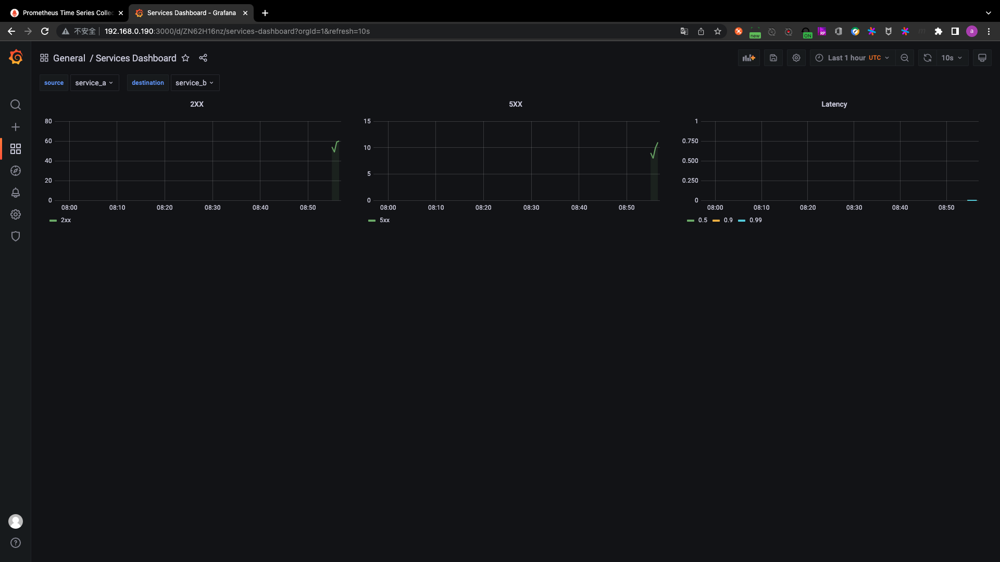
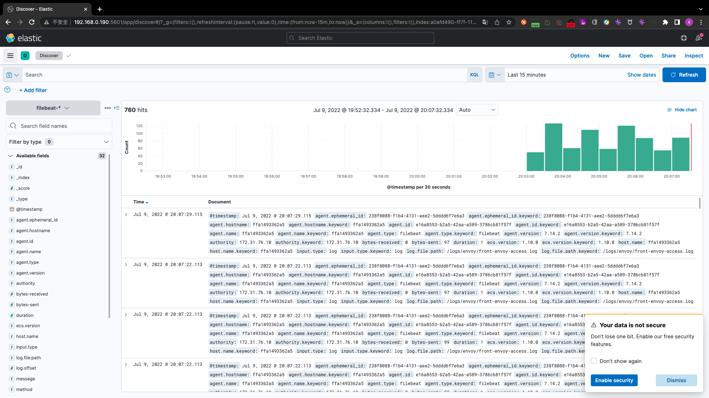
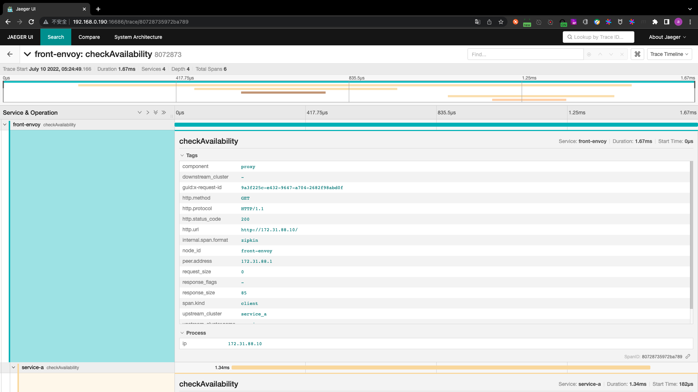

# day15-serviceMesh

## PART1. HTTP流量管理进阶

### 1.1 灰度发布

灰度发布:新版本上线时,无论是出于产品稳定性还是用户接受程度等方面因素的考虑,直接以新代旧都充满风险.于是,通行做法是新老版本同时在线,且一开始仅分出较小比例的流量至新版本,待确认新版本没问题后再逐级加大流量切换

灰度发布是迭代的软件产品在生产环境安全上线的一种重要手段,对于Envoy来说,灰度发布仅是流量治理的一种典型应用.以下是几种常见的场景:

- 金丝雀发布(K8S中的deployment能够完成滚动更新,可以实现和金丝雀发布类似的效果.但是deployment无法精准控制流量比例,只能按照Pod数量来切分流量)
- 蓝绿发布
- A/B测试
- 流量镜像

灰度策略:需要在生产环境发布一个新的待上线版本时,需要事先添加一个灰度版本,而后将原有的生产环境的默认版本的流量引流一部分至此灰度版本,配置的引流机制即为灰度策略.经过评估稳定后,即可配置此灰度版本接管所有流量,并下线老版本

### 1.2 金丝雀发布

金丝雀部署通过在生产环境运行的服务中引一部分实际流量对一个新版本进行测试,测试新版本的性能和表现,然后从这部分的新版本中快速获取用户反馈.

特点:通过在线上运行的服务中,新加入少量的新版本的服务,然后从这少量的新版本中快速获得反馈,根据反馈决定最后的交付形态


### 1.3 蓝绿发布

蓝绿发布提供了一种零宕机的部署方式,不停用老版本的同时部署新版本进行测试,确认没问题后将流量切到新版本

特点:

- 在保留旧版本的同时部署新版本,将两个版本同时在线,新版本和旧版本互相热备
- 通过切换路由权重(weight)的方式(非0即100)实现应用的不同版本上线或者下线,如果有问题可以快速地回滚到老版本


### 1.4 A/B测试

从本质上讲,AB测试是一种实验,通过向用户随机显示页面的两个或多个变体,并使用统计分析来确定哪种变体对于给定的转化目标效果更好.A/B测试可用于测试各种营销元素,例如设计/视觉元素、导航、表单和宣传用语等.A/B测试可以用于测试、比较和分析几乎所有内容

- 最常用于网站以及移动应用程序:将Web或App界面或流程的两个或多个版本,在同一时间维度,分别让两个或多个属性或组成成分相同(相似)的访客群组访问,收集各群组的用户体验数据和业务数据,最后分析评估出最好版本以正式采用
- 主要用于转换率优化,一般在线业务会定期通过A/B测试来优化其目标网页并提高ROI(return on investment)


A/B测试需要同时在线上部署A和B两个对等版本同时接收用户流量,按一定的目标选择策略将一部分用户导向A版本,让另一部分用户使用B版本.分别收集两部分用户的反馈，并根据分析结果确定最终使用的版本.其实就是流量分割


A/B测试中分流的设计直接决定了测试结果是否有效.AB测试是对线上生产环境的测试,在对改进版本所产生效果的好坏不能十分确定时对测试版本的导入流量通常不宜过大,尤其对于那些影响范围较大的改版(如主流程页面的重大调整),影响用户决策的新产品上线和其他具有风险性的功能上线通常采用先从小流量测试开始,然后逐步放大测试流量的方法.但是,测试版本的流量如果太小又可能造成随机结果的引入,试验结果失去统计意义

### 1.5 灰度发布

常用的策略类型大体可分为"基于请求内容发布"和"基于流量比例发布"两种类型

- 基于请求内容发布:配置相应的请求内容规则,满足相应规则服务流量会路由到灰度版本.例如:对于http请求,通过匹配特定的Cookie标头值完成引流

	- Cookie内容:

		- 完全匹配:当且仅当表达式完全符合此情况时,流量才会走到这个版本
		- 正则匹配:此处需要您使用正则表达式来匹配相应的规则

	- 自定义Header:

		- 完全匹配:当且仅当表达式完全符合此情况时,流量才会走到这个版本
		- 正则匹配:此处需要您使用正则表达式来匹配相应的规则

	- 可以自定义请求头的key和value,value支持完全匹配和正则匹配

- 基于流量比例发布:对灰度版本配置期望的流量权重,将服务流量以指定权重比例引流到灰度版本.例如:10%的流量分配为新版本,90%的流量保持在老版本

	- 所有版本的权重之和为100
	- 这种灰度策略也可以称为AB测试

### 1.6 灰度发布的实施方式

- 基于负载均衡器进行灰度发布

	- 在服务入口的支持流量策略的负载均衡器上配置流量分布机制
	- 仅支持对入口服务进行灰度,无法支撑后端服务需求
	- 这种方式只能对入口(7层负载均衡器)对应的1个服务做灰度,但入口背后有很多个微服务,无法针对指定某一个服务做灰度

- 基于Kubernetes进行灰度发布

	- 只能根据新旧版本应用所在的Pod数量比例进行流量分配,流量分配的控制粒度过于粗糙.不够精准
	- 不断滚动更新旧版本Pod到新版本
	
		- 先增后减、先减后增、又增又减

	- 服务入口通常是Service或Ingress
	- 虽然Ingress能够管控东西向流量(集群内的流量),但东西向流量很少真的拿Ingress去管控
	- 若使用Service,则通常需要架2层Service.例如某个微服务有v1版本和v2版本,则首先需要做2个版本的Service(假设v1Service和v2Service),在这2个Service前边还要有一个Service,通过标签选择器,既能选择到v1Service,还能选择到v2Service

- 基于服务网格进行灰度发布

	- 对于Envoy或Istio来说,灰度发布仅是流量治理机制的一种典型应用
	- 通过控制平面,将流量配置策略分发至对目标服务的请求发起方的envoy sidecar上即可
	- 支持基于请求内容的流量分配机制,例如浏览器类型、cookie等
	- 服务访问入口通常是一个单独部署的Envoy Gateway
	- 在网格内部,envoy sidecar最常用的场景是egress.把灰度规则写入到这个egress上即可实现灰度发布

### 1.7 灰度发布的实施过程

- step1. 构建承载实例

	- 滚动更新,分批进行

		- 先下线部分实例,更新后上线
		- 先更新上线部分实例,后下线对应比例的老版本实例并进行版本更新

	- 蓝绿部署

		- 额外准备全量的新版本示例

	- A/B测试

		- 滚动更新机制或蓝绿部署机制的特殊应用

- step2. 配置流量策略

	- 下线并排空旧版本实例的流量
	- 上线并分配流量到新版本实例

		- 慢启动


### 1.8 Envoy流量迁移和分割

新版本上线时,为兼顾到产品的稳定性及用户的接受程度,让新老版本同时在线,将流量按需要分派至不同的版本

- 蓝绿发布
- A/B测试
- 金丝雀发布

HTTP路由器能够将流量按比例分成两个或多个上游集群中虚拟主机中的路由,从而产生两种常见用例

- 版本升级:路由时将流量逐渐从一个集群迁移至另一个集群,实现灰度发布

	- 通过在路由中定义路由相关流量的百分比进行

- A/B测试或多变量测试:同时测试多个相同的服务,路由的流量必须在相同服务的不同版本的集群之间分配

	- 通过在路由中使用基于权重的集群路由完成

### 1.9 高级路由:流量迁移

通过在路由中配置运行时对象,选择特定路由以及相应集群的概率的变动,从而实现将虚拟主机中特定路由的流量逐渐从一个集群迁移到另一个集群

通常是有2个版本的集群.迁移前所有的流量是发往老版本的.若迁移了一部分流量后停止迁移,那么就是一个金丝雀发布的场景(新老版本并存);当确认新版本完全没有问题,将所有流量慢速地迁往新版本集群.这个过程就是一个流量迁移的过程.

对于Enovy而言,流量迁移就是在老版本集群的路由上设定一个runtime键,然后通过`runtime_layer`来修改某个flag来完成微小的变动

在路由匹配方面,Envoy在检测到第一个匹配时即终止后续检测.因而,流量迁移应该如此配置:

- 配置两个使用相同的match条件的路由条目
- 在第一个路由条目中配置`runtime_fraction`对象,并设定其接收的流量比例
- 该流量比例之外的其它请求将由第二个路由条目所捕获

用户再通过不断地通过Envoy的admin接口修改`runtime_fraction`对象的值完成流量迁移

- `curl -XPOST http://envoy_ip:admin_port/runtime_modify?key1=val1&key2=val2`

```yaml
routes:
  # 定义路由匹配参数
- match:
  # 流量过滤条件 三者必须定义其中之一
  prefix|path|regex: ... 
  # 额外匹配指定的运行时键值
  # 每次评估匹配路径时
  # 它必需低于此字段指示的匹配百分比 支持渐进式修改
  runtime_fraction:
    # 运行时键值不可用时 则使用此默认值
    default_value:
      # 指定分子 默认为0
      numerator: 
      # 指定分母 小于分子时 最终百分比为1
      # 分母可固定使用HUNDRED(默认)、TEN_THOUSAND和MILLION
      denominator:
    # 指定要使用的运行时键 其值需要用户自定义
    runtime_key: routing.traffic_shift.KEY 
  route:
    custer: app1_v1
  - match:
    # 此处的匹配条件应该与前一个路由匹配条件相同 以确保能够分割流量
    prefix|path|regex: ... 
  route:
    # 此处的集群通常是前一个路由中的目标集群应用程序的不同版本
    cluster: app1_v2
```

注意:要配置2个路由,但这2个路由的规则完全相同.

通常的配置方法有2种:

- 前1个路由匹配v1版本集群,初始状态将分子设置为100,然后逐渐减小,以便流量泄露到v2版本集群的路由上
- 前1个路由匹配v2版本集群,初始状态将分子设置为0,然后逐渐增大,以便流量泄露到v1版本集群的路由上

### 1.10 流量迁移示例

假设存在某微服务应用demoapp,其1.0和1.1两个版本分别对应于demmoapp-v1.0和demoapp-v1.1两个集群

- 应用新的路由配置时,demoapp-v1.0承载所有的请求流量
- 通过不断地调整运行时参数routing.traffic_shift.demoapp的值来进行流量迁移,最终可将流量完全迁往demoapp-v1.1集群上

	- `curl -XPOST 'http://front_envop_ip:admin_port/runtime_modify?routing.traffic_shift.demoapp=90'`

#### 1.10.1 环境说明

六个Service:

- envoy:Front Proxy,地址为172.31.55.10
- 5个后端服务

  - demoapp-v1.0-1、demoapp-v1.0-2和demoapp-v1.0-3:对应于Envoy中的demoappv10集群
  - demoapp-v1.1-1和demoapp-v1.1-2:对应于Envoy中的demoappv11集群

#### 1.10.2 容器编排

##### 1.10.2.1 编写front-envoy的配置文件

```
root@k8s-haproxy-2:~# mkdir http-traffic-shifting
root@k8s-haproxy-2:~# cd http-traffic-shifting/
root@k8s-haproxy-2:~/http-traffic-shifting# vim front-envoy.yaml
root@k8s-haproxy-2:~/http-traffic-shifting# cat front-envoy.yaml
```

```yaml
admin:
  profile_path: /tmp/envoy.prof
  access_log_path: /tmp/admin_access.log
  address:
    socket_address:
       address: 0.0.0.0
       port_value: 9901

# 激活layerd_runtime层
# 不激活的话 无法使用admin接口
layered_runtime:
  layers:
  - name: admin
    admin_layer: {}
       
static_resources:
  listeners:
  - name: listener_0
    address:
      socket_address: { address: 0.0.0.0, port_value: 80 }
    filter_chains:
    - filters:
      - name: envoy.filters.network.http_connection_manager
        typed_config:
          "@type": type.googleapis.com/envoy.extensions.filters.network.http_connection_manager.v3.HttpConnectionManager
          stat_prefix: ingress_http
          codec_type: AUTO
          route_config:
            name: local_route
            virtual_hosts:
            - name: demoapp
              domains: ["*"]
              routes:
              - match:
                  prefix: "/"
                  runtime_fraction:
                    default_value:
                      # 初始状态分子为100 即由demoappv10集群处理全部流量
                      # 后续通过运行时调整 注意此处没有百分号
                      numerator: 100
                      denominator: HUNDRED
                    runtime_key: routing.traffic_shift.demoapp
                route:
                  cluster: demoappv10
              - match:
                  prefix: "/"
                route:
                  cluster: demoappv11
          http_filters:
          - name: envoy.filters.http.router

  clusters:
  - name: demoappv10
    connect_timeout: 0.25s
    type: STRICT_DNS
    lb_policy: ROUND_ROBIN
    load_assignment:
      cluster_name: demoappv10
      endpoints:
      - lb_endpoints:
        - endpoint:
            address:
              socket_address:
                address: demoappv10
                port_value: 80

  - name: demoappv11
    connect_timeout: 0.25s
    type: STRICT_DNS
    lb_policy: ROUND_ROBIN
    load_assignment:
      cluster_name: demoappv11
      endpoints:
      - lb_endpoints:
        - endpoint:
            address:
              socket_address:
                address: demoappv11
                port_value: 80
```

##### 1.10.2.2 编写容器编排文件

```
root@k8s-haproxy-2:~/http-traffic-shifting# vim docker-compose.yaml
root@k8s-haproxy-2:~/http-traffic-shifting# cat docker-compose.yaml
```

```yaml
version: '3'

services:
  front-envoy:
    image: envoyproxy/envoy-alpine:v1.21-latest
    environment:
      - ENVOY_UID=0
      - ENVOY_GID=0
    volumes:
      - ./front-envoy.yaml:/etc/envoy/envoy.yaml
    networks:
      envoymesh:
        ipv4_address: 172.31.55.10
    expose:
      # Expose ports 80 (for general traffic) and 9901 (for the admin server)
      - "80"
      - "9901"

  demoapp-v1.0-1:
    image: ikubernetes/demoapp:v1.0
    hostname: demoapp-v1.0-1
    networks:
      envoymesh:
        aliases:
          - demoappv10
    expose:
      - "80"      
      
  demoapp-v1.0-2:
    image: ikubernetes/demoapp:v1.0
    hostname: demoapp-v1.0-2
    networks:
      envoymesh:
        aliases:
          - demoappv10
    expose:
      - "80"  
      
  demoapp-v1.0-3:
    image: ikubernetes/demoapp:v1.0
    hostname: demoapp-v1.0-3
    networks:
      envoymesh:
        aliases:
          - demoappv10
    expose:
      - "80" 
      
  demoapp-v1.1-1:
    image: ikubernetes/demoapp:v1.1
    hostname: demoapp-v1.1-1
    networks:
      envoymesh:
        aliases:
          - demoappv11
    expose:
      - "80"      
      
  demoapp-v1.1-2:
    image: ikubernetes/demoapp:v1.1
    hostname: demoapp-v1.1-2
    networks:
      envoymesh:
        aliases:
          - demoappv11
    expose:
      - "80"  

networks:
  envoymesh:
    driver: bridge
    ipam:
      config:
        - subnet: 172.31.55.0/24
```

##### 1.10.2.3 编写用于统计2个集群响应比例的脚本

```
root@k8s-haproxy-2:~/http-traffic-shifting# vim send-request.sh
root@k8s-haproxy-2:~/http-traffic-shifting# cat send-request.sh
```

```sh
#!/bin/bash
declare -i ver10=0
declare -i ver11=0

interval="0.2"

while true; do
	if curl -s http://$1/hostname | grep "demoapp-v1.0" &> /dev/null; then
		# $1 is the host address of the front-envoy.
		ver10=$[$ver10+1]
	else
		ver11=$[$ver11+1]
	fi
	echo "demoapp-v1.0:demoapp-v1.1 = $ver10:$ver11"
	sleep $interval
done
```

```
root@k8s-haproxy-2:~/http-traffic-shifting# chmod a+x *.sh
```

#### 1.10.3 运行和测试

##### 1.10.3.1 创建

```
root@k8s-haproxy-2:~/http-traffic-shifting# docker-compose up
[+] Running 7/7
 ⠿ Network http-traffic-shifting_envoymesh           Created                                                                                                                                                                                                               0.1s
 ⠿ Container http-traffic-shifting-demoapp-v1.0-2-1  Created                                                                                                                                                                                                               0.3s
 ⠿ Container http-traffic-shifting-demoapp-v1.0-3-1  Created                                                                                                                                                                                                               0.2s
 ⠿ Container http-traffic-shifting-demoapp-v1.1-1-1  Created                                                                                                                                                                                                               0.4s
 ⠿ Container http-traffic-shifting-demoapp-v1.1-2-1  Created                                                                                                                                                                                                               0.2s
 ⠿ Container http-traffic-shifting-front-envoy-1     Created                                                                                                                                                                                                               0.3s
 ⠿ Container http-traffic-shifting-demoapp-v1.0-1-1  Created                                                                                                                                                                                                               0.2s
Attaching to http-traffic-shifting-demoapp-v1.0-1-1, http-traffic-shifting-demoapp-v1.0-2-1, http-traffic-shifting-demoapp-v1.0-3-1, http-traffic-shifting-demoapp-v1.1-1-1, http-traffic-shifting-demoapp-v1.1-2-1, http-traffic-shifting-front-envoy-1
http-traffic-shifting-front-envoy-1     | [2022-07-04 06:35:39.343][1][info][main] [source/server/server.cc:381] initializing epoch 0 (base id=0, hot restart version=11.104)
...
```

##### 1.10.3.2 测试

- step1. 再开一个终端,执行脚本.初始状态下所有流量都将由集群demoappv10所承载,因为默认配置中,100%的流量比例将分配给该集群

```
root@k8s-haproxy-2:~/http-traffic-shifting# ./send-request.sh 172.31.55.10
demoapp-v1.0:demoapp-v1.1 = 1:0
demoapp-v1.0:demoapp-v1.1 = 2:0
demoapp-v1.0:demoapp-v1.1 = 3:0
demoapp-v1.0:demoapp-v1.1 = 4:0
demoapp-v1.0:demoapp-v1.1 = 5:0
demoapp-v1.0:demoapp-v1.1 = 6:0
demoapp-v1.0:demoapp-v1.1 = 7:0
...
```

- step2. 保持脚本运行,另开一个终端,动态调整流量分发比例,将分发给demoappv10集群的流量比例调整为90%

```
root@k8s-haproxy-2:~/http-traffic-shifting# curl -XPOST http://172.31.55.10:9901/runtime_modify?routing.traffic_shift.demoapp=90
OK
```

- step3. 观察请求分布情况

```
...
demoapp-v1.0:demoapp-v1.1 = 348:0
demoapp-v1.0:demoapp-v1.1 = 349:0
demoapp-v1.0:demoapp-v1.1 = 350:0
demoapp-v1.0:demoapp-v1.1 = 351:0
demoapp-v1.0:demoapp-v1.1 = 351:1
demoapp-v1.0:demoapp-v1.1 = 352:1
demoapp-v1.0:demoapp-v1.1 = 353:1
demoapp-v1.0:demoapp-v1.1 = 354:1
demoapp-v1.0:demoapp-v1.1 = 355:1
demoapp-v1.0:demoapp-v1.1 = 356:1
demoapp-v1.0:demoapp-v1.1 = 357:1
demoapp-v1.0:demoapp-v1.1 = 358:1
demoapp-v1.0:demoapp-v1.1 = 359:1
demoapp-v1.0:demoapp-v1.1 = 360:1
demoapp-v1.0:demoapp-v1.1 = 361:1
demoapp-v1.0:demoapp-v1.1 = 362:1
demoapp-v1.0:demoapp-v1.1 = 362:2
demoapp-v1.0:demoapp-v1.1 = 363:2
demoapp-v1.0:demoapp-v1.1 = 364:2
demoapp-v1.0:demoapp-v1.1 = 365:2
demoapp-v1.0:demoapp-v1.1 = 366:2
demoapp-v1.0:demoapp-v1.1 = 367:2
demoapp-v1.0:demoapp-v1.1 = 368:2
demoapp-v1.0:demoapp-v1.1 = 369:2
demoapp-v1.0:demoapp-v1.1 = 370:2
demoapp-v1.0:demoapp-v1.1 = 371:2
demoapp-v1.0:demoapp-v1.1 = 372:2
demoapp-v1.0:demoapp-v1.1 = 372:3
demoapp-v1.0:demoapp-v1.1 = 373:3
demoapp-v1.0:demoapp-v1.1 = 374:3
demoapp-v1.0:demoapp-v1.1 = 375:3
demoapp-v1.0:demoapp-v1.1 = 376:3
demoapp-v1.0:demoapp-v1.1 = 377:3
demoapp-v1.0:demoapp-v1.1 = 378:3
demoapp-v1.0:demoapp-v1.1 = 378:4
demoapp-v1.0:demoapp-v1.1 = 379:4
demoapp-v1.0:demoapp-v1.1 = 380:4
demoapp-v1.0:demoapp-v1.1 = 381:4
demoapp-v1.0:demoapp-v1.1 = 382:4
demoapp-v1.0:demoapp-v1.1 = 383:4
demoapp-v1.0:demoapp-v1.1 = 384:4
demoapp-v1.0:demoapp-v1.1 = 385:4
demoapp-v1.0:demoapp-v1.1 = 386:4
demoapp-v1.0:demoapp-v1.1 = 387:4
demoapp-v1.0:demoapp-v1.1 = 388:4
demoapp-v1.0:demoapp-v1.1 = 389:4
demoapp-v1.0:demoapp-v1.1 = 390:4
demoapp-v1.0:demoapp-v1.1 = 391:4
demoapp-v1.0:demoapp-v1.1 = 392:4
demoapp-v1.0:demoapp-v1.1 = 393:4
demoapp-v1.0:demoapp-v1.1 = 394:4
demoapp-v1.0:demoapp-v1.1 = 394:5
demoapp-v1.0:demoapp-v1.1 = 395:5
demoapp-v1.0:demoapp-v1.1 = 396:5
demoapp-v1.0:demoapp-v1.1 = 397:5
...
```

##### 1.10.3.3 停止

```
^CGracefully stopping... (press Ctrl+C again to force)
[+] Running 6/6
 ⠿ Container http-traffic-shifting-demoapp-v1.0-3-1  Stopped                                                                                                                                                                                                              10.5s
 ⠿ Container http-traffic-shifting-demoapp-v1.0-1-1  Stopped                                                                                                                                                                                                              10.5s
 ⠿ Container http-traffic-shifting-front-envoy-1     Stopped                                                                                                                                                                                                               0.5s
 ⠿ Container http-traffic-shifting-demoapp-v1.1-2-1  Stopped                                                                                                                                                                                                              10.5s
 ⠿ Container http-traffic-shifting-demoapp-v1.1-1-1  Stopped                                                                                                                                                                                                              10.5s
 ⠿ Container http-traffic-shifting-demoapp-v1.0-2-1  Stopped                                                                                                                                                                                                              10.5s
canceled
root@k8s-haproxy-2:~/http-traffic-shifting# docker-compose down
[+] Running 7/6
 ⠿ Container http-traffic-shifting-front-envoy-1     Removed                                                                                                                                                                                                               0.1s
 ⠿ Container http-traffic-shifting-demoapp-v1.0-1-1  Removed                                                                                                                                                                                                               0.1s
 ⠿ Container http-traffic-shifting-demoapp-v1.0-2-1  Removed                                                                                                                                                                                                               0.1s
 ⠿ Container http-traffic-shifting-demoapp-v1.0-3-1  Removed                                                                                                                                                                                                               0.1s
 ⠿ Container http-traffic-shifting-demoapp-v1.1-1-1  Removed                                                                                                                                                                                                               0.1s
 ⠿ Container http-traffic-shifting-demoapp-v1.1-2-1  Removed                                                                                                                                                                                                               0.1s
 ⠿ Network http-traffic-shifting_envoymesh           Removed                                                                                                                                                                                                               0.0s
```

### 1.11 高级路由:流量分割

HTTP router过滤器支持在一个路由中指定多个上游具有权重属性的集群,而后将流量基于权重调度至此些集群其中之一.类似流量迁移,流量分割中m分配给每个集群的权重也可以使用运行时参数进行调整

```yaml
routes:
- match: {...}
  route:
    weighted_clusters: {...} 
      # 与当前路由关联的一个或多个集群 必选参数
      clusters: []
        # 目标集群名称
        # 也可以使用 cluster_header 字段来指定集群 二者互斥；
      - name: ...
        # 集群权重 取值范围为0至total_weight
        # 各集群权重之和需等于total_weight
        weight: ... 
        # 子集负载均衡器使用的端点元数据匹配条件 可选参数
        # 仅用于上游集群中具有与此字段中设置的元数据匹配的元数端点以进行流量分配
        metadata_match: {...} 
      # 总权重值 默认为100 envoy中可以更改总权重值 但istio中不能更改
      total_weight: ... 
      # 可选参数 用于设定键前缀 
      # 从而每个集群以 runtime_key_prefix+ . +cluster[i].name 为其键名
      # 并能够以运行时键值的方式为每个集群提供权重 其中 cluster[i].name表示列表中第i个集群名称 
      runtime_key_prefix: ... 
...
```

### 1.12 流量分割示例

仍以demoapp为例,其1.0和1.1两个版本分别对应于demoappv10和demoappv11两个集群

- 初始权重,demoappv10为100,从而要承载所有请求流量,而demoappv11为0.随后可通过运行时参数,将demoappv11的权重设置为100,而demoappv10的为0,从而所有流量切往demoappv11,模拟蓝绿部署过程
- 各自的权重比例亦可可通过运行时参数动态调整

	- `curl -XPOST 'http://172.31.57.10:9901/runtime_modify?routing.traffic_split.demoapp.demoappv10=0&routing.traffic_split.demoapp.demoappv11=100'`

#### 1.12.1 环境说明

六个Service:

- envoy:Front Proxy,地址为172.31.57.10
- 5个后端服务
  - demoapp-v1.0-1、demoapp-v1.0-2和demoapp-v1.0-3:对应于Envoy中的demoappv10集群
  - demoapp-v1.1-1和demoapp-v1.1-2:对应于Envoy中的demoappv11集群

#### 1.12.2 容器编排

##### 1.12.2.1 编写front-envoy的配置文件

```
root@k8s-haproxy-2:~# mkdir http-traffic-splitting
root@k8s-haproxy-2:~# cd http-traffic-splitting
root@k8s-haproxy-2:~/http-traffic-splitting# vim front-envoy.yaml
root@k8s-haproxy-2:~/http-traffic-splitting# cat front-envoy.yaml
```

```yaml
admin:
  profile_path: /tmp/envoy.prof
  access_log_path: /tmp/admin_access.log
  address:
    socket_address:
       address: 0.0.0.0
       port_value: 9901

layered_runtime:
  layers:
  - name: admin
    admin_layer: {}
       
static_resources:
  listeners:
  - name: listener_0
    address:
      socket_address: { address: 0.0.0.0, port_value: 80 }
    filter_chains:
    - filters:
      - name: envoy.filters.network.http_connection_manager
        typed_config:
          "@type": type.googleapis.com/envoy.extensions.filters.network.http_connection_manager.v3.HttpConnectionManager
          stat_prefix: ingress_http
          codec_type: AUTO
          route_config:
            name: local_route
            virtual_hosts:
            - name: demoapp
              domains: ["*"]
              routes:
              routes:
              - match:
                  prefix: "/"
                route:
                  weighted_clusters:
                    clusters:
                    - name: demoappv10
                      # 初始状态所有流量由集群demoappv10负责响应
                      weight: 100
                    - name: demoappv11
                      weight: 0
                    total_weight: 100
                    # 定义键前缀 用于运行时修改权重
                    runtime_key_prefix: routing.traffic_split.demoapp
          http_filters:
          - name: envoy.filters.http.router

  clusters:
  - name: demoappv10
    connect_timeout: 0.25s
    type: STRICT_DNS
    lb_policy: ROUND_ROBIN
    load_assignment:
      cluster_name: demoappv10
      endpoints:
      - lb_endpoints:
        - endpoint:
            address:
              socket_address:
                address: demoappv10
                port_value: 80

  - name: demoappv11
    connect_timeout: 0.25s
    type: STRICT_DNS
    lb_policy: ROUND_ROBIN
    load_assignment:
      cluster_name: demoappv11
      endpoints:
      - lb_endpoints:
        - endpoint:
            address:
              socket_address:
                address: demoappv11
                port_value: 80
```

##### 1.12.2.2 编写容器编排文件

```
root@k8s-haproxy-2:~/http-traffic-splitting# vim docker-compose.yaml
root@k8s-haproxy-2:~/http-traffic-splitting# cat docker-compose.yaml
```

```yaml
version: '3'

services:
  front-envoy:
    image: envoyproxy/envoy-alpine:v1.21-latest
    environment:
      - ENVOY_UID=0
      - ENVOY_GID=0
    volumes:
      - ./front-envoy.yaml:/etc/envoy/envoy.yaml
    networks:
      envoymesh:
        ipv4_address: 172.31.57.10
    expose:
      # Expose ports 80 (for general traffic) and 9901 (for the admin server)
      - "80"
      - "9901"

  demoapp-v1.0-1:
    image: ikubernetes/demoapp:v1.0
    hostname: demoapp-v1.0-1
    networks:
      envoymesh:
        aliases:
          - demoappv10
    expose:
      - "80"      
      
  demoapp-v1.0-2:
    image: ikubernetes/demoapp:v1.0
    hostname: demoapp-v1.0-2
    networks:
      envoymesh:
        aliases:
          - demoappv10
    expose:
      - "80"  
      
  demoapp-v1.0-3:
    image: ikubernetes/demoapp:v1.0
    hostname: demoapp-v1.0-3
    networks:
      envoymesh:
        aliases:
          - demoappv10
    expose:
      - "80" 
      
  demoapp-v1.1-1:
    image: ikubernetes/demoapp:v1.1
    hostname: demoapp-v1.1-1
    networks:
      envoymesh:
        aliases:
          - demoappv11
    expose:
      - "80"      
      
  demoapp-v1.1-2:
    image: ikubernetes/demoapp:v1.1
    hostname: demoapp-v1.1-2
    networks:
      envoymesh:
        aliases:
          - demoappv11
    expose:
      - "80"  

networks:
  envoymesh:
    driver: bridge
    ipam:
      config:
        - subnet: 172.31.57.0/24
```

##### 1.12.2.3 编写用于统计2个集群响应比例的脚本

```
root@k8s-haproxy-2:~/http-traffic-splitting# vim send-request.sh
root@k8s-haproxy-2:~/http-traffic-splitting# cat send-request.sh
```

```sh
#!/bin/bash
declare -i ver10=0
declare -i ver11=0

interval="0.2"

while true; do
	if curl -s http://$1/hostname | grep "demoapp-v1.0" &> /dev/null; then
		# $1 is the host address of the front-envoy.
		ver10=$[$ver10+1]
	else
		ver11=$[$ver11+1]
	fi
	echo "demoapp-v1.0:demoapp-v1.1 = $ver10:$ver11"
	sleep $interval
done
```

```
root@k8s-haproxy-2:~/http-traffic-splitting# chmod a+x *.sh
```

#### 1.12.3 运行和测试

##### 1.12.3.1 创建

```
root@k8s-haproxy-2:~/http-traffic-splitting# docker-compose up
[+] Running 7/7
 ⠿ Network http-traffic-splitting_envoymesh           Created                                                                                                                                                                                                              0.1s
 ⠿ Container http-traffic-splitting-demoapp-v1.0-1-1  Created                                                                                                                                                                                                              0.3s
 ⠿ Container http-traffic-splitting-demoapp-v1.0-2-1  Created                                                                                                                                                                                                              0.3s
 ⠿ Container http-traffic-splitting-demoapp-v1.0-3-1  Created                                                                                                                                                                                                              0.3s
 ⠿ Container http-traffic-splitting-demoapp-v1.1-1-1  Created                                                                                                                                                                                                              0.3s
 ⠿ Container http-traffic-splitting-demoapp-v1.1-2-1  Created                                                                                                                                                                                                              0.3s
 ⠿ Container http-traffic-splitting-front-envoy-1     Created                                                                                                                                                                                                              0.3s
Attaching to http-traffic-splitting-demoapp-v1.0-1-1, http-traffic-splitting-demoapp-v1.0-2-1, http-traffic-splitting-demoapp-v1.0-3-1, http-traffic-splitting-demoapp-v1.1-1-1, http-traffic-splitting-demoapp-v1.1-2-1, http-traffic-splitting-front-envoy-1
http-traffic-splitting-demoapp-v1.0-3-1  |  * Running on http://0.0.0.0:80/ (Press CTRL+C to quit)
...
```

##### 1.12.3.2 测试

- step1. 再开一个终端,执行脚本

```
root@k8s-haproxy-2:~/http-traffic-splitting# ./send-request.sh 172.31.57.10
demoapp-v1.0:demoapp-v1.1 = 1:0
demoapp-v1.0:demoapp-v1.1 = 2:0
demoapp-v1.0:demoapp-v1.1 = 3:0
demoapp-v1.0:demoapp-v1.1 = 4:0
demoapp-v1.0:demoapp-v1.1 = 5:0
demoapp-v1.0:demoapp-v1.1 = 6:0
...
```

此时所有流量都将由集群demoappv10承载.因为配置中demoappv10与demoappv11的权重比为100:0

- step2. 再开一个终端,动态调整流量分发比例

```
root@k8s-haproxy-2:~/http-traffic-splitting# curl -XPOST 'http://172.31.57.10:9901/runtime_modify?routing.traffic_split.demoapp.demoappv10=0&routing.traffic_split.demoapp.demoappv11=100'
OK
```

- 注意:调整时的键名为`runtime_key_prefix字段名称.每个集群的名称=集群权重`
- 注意:各集群的权重之和要等于`total_weight`的值

- step3. 观察请求分布情况

```
...
demoapp-v1.0:demoapp-v1.1 = 301:0
demoapp-v1.0:demoapp-v1.1 = 302:0
demoapp-v1.0:demoapp-v1.1 = 303:0
demoapp-v1.0:demoapp-v1.1 = 304:0
demoapp-v1.0:demoapp-v1.1 = 304:1
demoapp-v1.0:demoapp-v1.1 = 304:2
demoapp-v1.0:demoapp-v1.1 = 304:3
demoapp-v1.0:demoapp-v1.1 = 304:4
demoapp-v1.0:demoapp-v1.1 = 304:5
demoapp-v1.0:demoapp-v1.1 = 304:6
demoapp-v1.0:demoapp-v1.1 = 304:7
demoapp-v1.0:demoapp-v1.1 = 304:8
demoapp-v1.0:demoapp-v1.1 = 304:9
demoapp-v1.0:demoapp-v1.1 = 304:10
demoapp-v1.0:demoapp-v1.1 = 304:11
demoapp-v1.0:demoapp-v1.1 = 304:12
demoapp-v1.0:demoapp-v1.1 = 304:13
demoapp-v1.0:demoapp-v1.1 = 304:14
demoapp-v1.0:demoapp-v1.1 = 304:15
demoapp-v1.0:demoapp-v1.1 = 304:16
demoapp-v1.0:demoapp-v1.1 = 304:17
demoapp-v1.0:demoapp-v1.1 = 304:18
demoapp-v1.0:demoapp-v1.1 = 304:19
demoapp-v1.0:demoapp-v1.1 = 304:20
demoapp-v1.0:demoapp-v1.1 = 304:21
demoapp-v1.0:demoapp-v1.1 = 304:22
demoapp-v1.0:demoapp-v1.1 = 304:23
demoapp-v1.0:demoapp-v1.1 = 304:24
demoapp-v1.0:demoapp-v1.1 = 304:25
demoapp-v1.0:demoapp-v1.1 = 304:26
demoapp-v1.0:demoapp-v1.1 = 304:27
demoapp-v1.0:demoapp-v1.1 = 304:28
demoapp-v1.0:demoapp-v1.1 = 304:29
demoapp-v1.0:demoapp-v1.1 = 304:30
demoapp-v1.0:demoapp-v1.1 = 304:31
demoapp-v1.0:demoapp-v1.1 = 304:32
demoapp-v1.0:demoapp-v1.1 = 304:33
demoapp-v1.0:demoapp-v1.1 = 304:34
demoapp-v1.0:demoapp-v1.1 = 304:35
demoapp-v1.0:demoapp-v1.1 = 304:36
demoapp-v1.0:demoapp-v1.1 = 304:37
demoapp-v1.0:demoapp-v1.1 = 304:38
demoapp-v1.0:demoapp-v1.1 = 304:39
...
```

可以看到,修改后demoappv10集群不再响应流量了.

##### 1.12.3.3 停止

```
^CGracefully stopping... (press Ctrl+C again to force)
[+] Running 6/6
 ⠿ Container http-traffic-splitting-demoapp-v1.1-2-1  Stopped                                                                                                                                                                                                             10.2s
 ⠿ Container http-traffic-splitting-demoapp-v1.1-1-1  Stopped                                                                                                                                                                                                             10.4s
 ⠿ Container http-traffic-splitting-demoapp-v1.0-3-1  Stopped                                                                                                                                                                                                             10.4s
 ⠿ Container http-traffic-splitting-demoapp-v1.0-1-1  Stopped                                                                                                                                                                                                             10.4s
 ⠿ Container http-traffic-splitting-demoapp-v1.0-2-1  Stopped                                                                                                                                                                                                             10.4s
 ⠿ Container http-traffic-splitting-front-envoy-1     Stopped                                                                                                                                                                                                              0.2s
canceled
root@k8s-haproxy-2:~/http-traffic-splitting# docker-compose down
[+] Running 7/0
 ⠿ Container http-traffic-splitting-demoapp-v1.0-2-1  Removed                                                                                                                                                                                                              0.0s
 ⠿ Container http-traffic-splitting-demoapp-v1.0-3-1  Removed                                                                                                                                                                                                              0.0s
 ⠿ Container http-traffic-splitting-demoapp-v1.1-1-1  Removed                                                                                                                                                                                                              0.0s
 ⠿ Container http-traffic-splitting-demoapp-v1.1-2-1  Removed                                                                                                                                                                                                              0.0s
 ⠿ Container http-traffic-splitting-front-envoy-1     Removed                                                                                                                                                                                                              0.0s
 ⠿ Container http-traffic-splitting-demoapp-v1.0-1-1  Removed                                                                                                                                                                                                              0.0s
 ⠿ Network http-traffic-splitting_envoymesh           Removed                                                                                                                                                                                                              0.0s
```

### 1.13 HTTP流量镜像

关于流量镜像:

- 流量镜像,也称为流量复制或影子镜像
- 流量镜像功能通常用于在生产环境进行测试,通过将生产流量镜像拷贝到测试集群或者新版本集群,实现新版本接近真实环境的测试,旨在有效地降低新版本上线的风险

流量镜像可用于以下场景:

- 验证新版本:实时对比镜像流量与生产流量的输出结果,完成新版本目标验证
- 测试:用生产实例的真实流量进行模拟测试
- 隔离测试数据库:与数据处理相关的业务,可使用空的数据存储并加载测试数据,针对该数据进行镜像流量操作,实现测试数据的隔离

### 1.14 配置HTTP流量镜像

将流量转发至一个集群(主集群)的同时再转发到另一个集群(影子集群)

- 无须等待影子集群返回响应
- 支持收集影子集群的常规统计信息,常用于测试
- 默认情况下,路由器会镜像所有请求.也可使用如下参数配置转发的流量比例

	- `runtime_key`:运行时键,用于明确定义向影子集群转发的流量的百分比,取值范围为0-10000,每个数字表示0.01%的请求比例.定义了此键却未指定其值时,默认为0

```yaml
route:
  cluster|weighted_clusters:
  ...
  # 该字段用于定义对请求流量的镜像策略
  request_mirror_policies: []
  - cluster: ...
    runtime_fraction: {...}
      # 运行时键值不可用时 则使用此默认值
      default_value: 
        # 指定分子 默认为0
        numerator: 
        # 指定分母 小于分子时 最终百分比为1
        # 分母固定使用HUNDRED（默认）、TEN_THOUSAND和MILLION
        denominator: 
      # 指定要使用的运行时键 其值需要用户自定义
      # 该值用于指定向影子集群转发的流量的百分比
      # 取值范围为0-10000 每个数字表示0.01%的请求比例 定义了此键却未指定其值是
      # 默认为0
      runtime_key: routing.request_mirror.KEY 
  # 是否对trace span进行采样 默认为true
  trace_sampled: {...} 
```

### 1.15 流量镜像示例

仍以demoapp为例,其1.0和1.1两个版本分别对应于demoappv10和demoappv11两个集群

- 假设新版本demoappv11需要验证其承载正常流量时的工作状况
- 正常请求的所有流量均由demoappv10承载
- 将一部分流量或所有流量镜像至demoappv11集群一份,起始的镜像比例由配置中的比例定义,而后可由`runtime_key`定义的运行键进行动态调整,例如下面的命令将流量镜像比例调整到了100%

	- `curl -XPOST 'http://172.31.60.10:9901/runtime_modify?routing.request_mirror.demoapp=100'`

#### 1.15.1 环境说明

六个Service:

- envoy:Front Proxy,地址为172.31.60.10
- 5个后端服务
  - demoapp-v1.0-1、demoapp-v1.0-2和demoapp-v1.0-3:对应于Envoy中的demoappv10集群
  - demoapp-v1.1-1和demoapp-v1.1-2:对应于Envoy中的demoappv11集群

#### 1.15.2 容器编排

##### 1.15.2.1 编写front-envoy的配置文件

```
root@k8s-haproxy-2:~/http-traffic-splitting# cd ..
root@k8s-haproxy-2:~# mkdir http-request-mirror
root@k8s-haproxy-2:~# cd http-request-mirror
root@k8s-haproxy-2:~/http-request-mirror# vim front-envoy.yaml
root@k8s-haproxy-2:~/http-request-mirror# cat front-envoy.yaml
```

```yaml
admin:
  profile_path: /tmp/envoy.prof
  access_log_path: /tmp/admin_access.log
  address:
    socket_address:
       address: 0.0.0.0
       port_value: 9901

layered_runtime:
  layers:
  - name: admin
    admin_layer: {}
       
static_resources:
  listeners:
  - name: listener_0
    address:
      socket_address: { address: 0.0.0.0, port_value: 80 }
    filter_chains:
    - filters:
      - name: envoy.filters.network.http_connection_manager
        typed_config:
          "@type": type.googleapis.com/envoy.extensions.filters.network.http_connection_manager.v3.HttpConnectionManager
          stat_prefix: ingress_http
          codec_type: AUTO
          route_config:
            name: local_route
            virtual_hosts:
            - name: demoapp
              domains: ["*"]
              routes:
              - match:
                  prefix: "/"
                route:
                  cluster: demoappv10
                  request_mirror_policies:
                  - cluster: demoappv11
                    runtime_fraction:
                      default_value:
                        # 初始配置20%的流量镜像到集群demoappv11上
                        numerator: 20
                        denominator: HUNDRED
                      runtime_key: routing.request_mirror.demoapp
          http_filters:
          - name: envoy.filters.http.router

  clusters:
  - name: demoappv10
    connect_timeout: 0.25s
    type: STRICT_DNS
    lb_policy: ROUND_ROBIN
    load_assignment:
      cluster_name: demoappv10
      endpoints:
      - lb_endpoints:
        - endpoint:
            address:
              socket_address:
                address: demoappv10
                port_value: 80

  - name: demoappv11
    connect_timeout: 0.25s
    type: STRICT_DNS
    lb_policy: ROUND_ROBIN
    load_assignment:
      cluster_name: demoappv11
      endpoints:
      - lb_endpoints:
        - endpoint:
            address:
              socket_address:
                address: demoappv11
                port_value: 80
```

##### 1.15.2.2 编写容器编排文件

```
root@k8s-haproxy-2:~/http-request-mirror# vim docker-compose.yaml
root@k8s-haproxy-2:~/http-request-mirror# cat docker-compose.yaml
```

```yaml
version: '3'

services:
  front-envoy:
    image: envoyproxy/envoy-alpine:v1.21-latest
    environment:
      - ENVOY_UID=0
      - ENVOY_GID=0
    volumes:
      - ./front-envoy.yaml:/etc/envoy/envoy.yaml
    networks:
      envoymesh:
        ipv4_address: 172.31.60.10
    expose:
      # Expose ports 80 (for general traffic) and 9901 (for the admin server)
      - "80"
      - "9901"

  demoapp-v1.0-1:
    image: ikubernetes/demoapp:v1.0
    hostname: demoapp-v1.0-1
    networks:
      envoymesh:
        aliases:
          - demoappv10
    expose:
      - "80"      
      
  demoapp-v1.0-2:
    image: ikubernetes/demoapp:v1.0
    hostname: demoapp-v1.0-2
    networks:
      envoymesh:
        aliases:
          - demoappv10
    expose:
      - "80"  
      
  demoapp-v1.0-3:
    image: ikubernetes/demoapp:v1.0
    hostname: demoapp-v1.0-3
    networks:
      envoymesh:
        aliases:
          - demoappv10
    expose:
      - "80" 
      
  demoapp-v1.1-1:
    image: ikubernetes/demoapp:v1.1
    hostname: demoapp-v1.1-1
    networks:
      envoymesh:
        aliases:
          - demoappv11
    expose:
      - "80"      
      
  demoapp-v1.1-2:
    image: ikubernetes/demoapp:v1.1
    hostname: demoapp-v1.1-2
    networks:
      envoymesh:
        aliases:
          - demoappv11
    expose:
      - "80"  

networks:
  envoymesh:
    driver: bridge
    ipam:
      config:
        - subnet: 172.31.60.0/24
```

##### 1.15.2.3 编写发送请求的脚本

```
root@k8s-haproxy-2:~/http-request-mirror# vim send-request.sh
root@k8s-haproxy-2:~/http-request-mirror# cat send-request.sh
```

```sh
#!/bin/bash
interval="0.5"

while true; do
	curl -s http://$1/hostname
		# $1 is the host address of the front-envoy.
	sleep $interval
done
```

```
root@k8s-haproxy-2:~/http-request-mirror# chmod a+x *.sh
```

#### 1.15.3 运行和测试

##### 1.15.3.1 创建

```
root@k8s-haproxy-2:~/http-request-mirror# docker-compose up
[+] Running 7/7
 ⠿ Network http-request-mirror_envoymesh           Created                                                                                                                                                                                                                 0.1s
 ⠿ Container http-request-mirror-demoapp-v1.0-3-1  Created                                                                                                                                                                                                                 0.2s
 ⠿ Container http-request-mirror-demoapp-v1.1-1-1  Created                                                                                                                                                                                                                 0.2s
 ⠿ Container http-request-mirror-demoapp-v1.1-2-1  Created                                                                                                                                                                                                                 0.2s
 ⠿ Container http-request-mirror-front-envoy-1     Created                                                                                                                                                                                                                 0.2s
 ⠿ Container http-request-mirror-demoapp-v1.0-1-1  Created                                                                                                                                                                                                                 0.2s
 ⠿ Container http-request-mirror-demoapp-v1.0-2-1  Created                                                                                                                                                                                                                 0.2s
Attaching to http-request-mirror-demoapp-v1.0-1-1, http-request-mirror-demoapp-v1.0-2-1, http-request-mirror-demoapp-v1.0-3-1, http-request-mirror-demoapp-v1.1-1-1, http-request-mirror-demoapp-v1.1-2-1, http-request-mirror-front-envoy-1
...
```

##### 1.15.3.2 测试

- step1. 再开一个终端,执行脚本,发送请求

```
root@k8s-haproxy-2:~/http-request-mirror# ./send-request.sh 172.31.60.10
ServerName: demoapp-v1.0-1
ServerName: demoapp-v1.0-2
ServerName: demoapp-v1.0-3
ServerName: demoapp-v1.0-1
ServerName: demoapp-v1.0-2
ServerName: demoapp-v1.0-3
ServerName: demoapp-v1.0-1
ServerName: demoapp-v1.0-2
ServerName: demoapp-v1.0-3
ServerName: demoapp-v1.0-1
ServerName: demoapp-v1.0-2
ServerName: demoapp-v1.0-3
ServerName: demoapp-v1.0-1
ServerName: demoapp-v1.0-2
ServerName: demoapp-v1.0-3
ServerName: demoapp-v1.0-1
ServerName: demoapp-v1.0-2
ServerName: demoapp-v1.0-3
ServerName: demoapp-v1.0-1
ServerName: demoapp-v1.0-2
ServerName: demoapp-v1.0-3
ServerName: demoapp-v1.0-1
ServerName: demoapp-v1.0-2
...
```

- step2. 查看运行容器的终端

此处无法通过响应看出流量是否镜像了.因为所有的响应都是集群demoappv10负责处理的.因此需要查看运行容器的终端,才能确认流量是否到达集群demoappv11

```
...
http-request-mirror-demoapp-v1.0-1-1  | 172.31.60.10 - - [04/Jul/2022 08:22:09] "GET /hostname HTTP/1.1" 200 -
http-request-mirror-demoapp-v1.0-3-1  | 172.31.60.10 - - [04/Jul/2022 08:22:09] "GET /hostname HTTP/1.1" 200 -
http-request-mirror-demoapp-v1.0-2-1  | 172.31.60.10 - - [04/Jul/2022 08:22:10] "GET /hostname HTTP/1.1" 200 -
http-request-mirror-demoapp-v1.0-1-1  | 172.31.60.10 - - [04/Jul/2022 08:22:10] "GET /hostname HTTP/1.1" 200 -
http-request-mirror-demoapp-v1.1-1-1  | 172.31.60.10 - - [04/Jul/2022 08:22:11] "GET /hostname HTTP/1.1" 200 -
http-request-mirror-demoapp-v1.0-3-1  | 172.31.60.10 - - [04/Jul/2022 08:22:11] "GET /hostname HTTP/1.1" 200 -
http-request-mirror-demoapp-v1.0-2-1  | 172.31.60.10 - - [04/Jul/2022 08:22:11] "GET /hostname HTTP/1.1" 200 -
http-request-mirror-demoapp-v1.0-1-1  | 172.31.60.10 - - [04/Jul/2022 08:22:12] "GET /hostname HTTP/1.1" 200 -
http-request-mirror-demoapp-v1.0-3-1  | 172.31.60.10 - - [04/Jul/2022 08:22:12] "GET /hostname HTTP/1.1" 200 -
http-request-mirror-demoapp-v1.0-2-1  | 172.31.60.10 - - [04/Jul/2022 08:22:13] "GET /hostname HTTP/1.1" 200 -
http-request-mirror-demoapp-v1.0-1-1  | 172.31.60.10 - - [04/Jul/2022 08:22:13] "GET /hostname HTTP/1.1" 200 -
http-request-mirror-demoapp-v1.0-3-1  | 172.31.60.10 - - [04/Jul/2022 08:22:14] "GET /hostname HTTP/1.1" 200 -
http-request-mirror-demoapp-v1.0-2-1  | 172.31.60.10 - - [04/Jul/2022 08:22:14] "GET /hostname HTTP/1.1" 200 -
http-request-mirror-demoapp-v1.0-1-1  | 172.31.60.10 - - [04/Jul/2022 08:22:15] "GET /hostname HTTP/1.1" 200 -
http-request-mirror-demoapp-v1.0-3-1  | 172.31.60.10 - - [04/Jul/2022 08:22:15] "GET /hostname HTTP/1.1" 200 -
http-request-mirror-demoapp-v1.0-2-1  | 172.31.60.10 - - [04/Jul/2022 08:22:16] "GET /hostname HTTP/1.1" 200 -
http-request-mirror-demoapp-v1.0-1-1  | 172.31.60.10 - - [04/Jul/2022 08:22:16] "GET /hostname HTTP/1.1" 200 -
http-request-mirror-demoapp-v1.0-3-1  | 172.31.60.10 - - [04/Jul/2022 08:22:17] "GET /hostname HTTP/1.1" 200 -
http-request-mirror-demoapp-v1.0-2-1  | 172.31.60.10 - - [04/Jul/2022 08:22:17] "GET /hostname HTTP/1.1" 200 -
http-request-mirror-demoapp-v1.0-1-1  | 172.31.60.10 - - [04/Jul/2022 08:22:18] "GET /hostname HTTP/1.1" 200 -
http-request-mirror-demoapp-v1.0-3-1  | 172.31.60.10 - - [04/Jul/2022 08:22:18] "GET /hostname HTTP/1.1" 200 -
http-request-mirror-demoapp-v1.0-2-1  | 172.31.60.10 - - [04/Jul/2022 08:22:19] "GET /hostname HTTP/1.1" 200 -
http-request-mirror-demoapp-v1.1-2-1  | 172.31.60.10 - - [04/Jul/2022 08:22:19] "GET /hostname HTTP/1.1" 200 -
http-request-mirror-demoapp-v1.0-1-1  | 172.31.60.10 - - [04/Jul/2022 08:22:19] "GET /hostname HTTP/1.1" 200 -
http-request-mirror-demoapp-v1.1-1-1  | 172.31.60.10 - - [04/Jul/2022 08:22:20] "GET /hostname HTTP/1.1" 200 -
http-request-mirror-demoapp-v1.0-3-1  | 172.31.60.10 - - [04/Jul/2022 08:22:20] "GET /hostname HTTP/1.1" 200 -
http-request-mirror-demoapp-v1.0-2-1  | 172.31.60.10 - - [04/Jul/2022 08:22:20] "GET /hostname HTTP/1.1" 200 -
http-request-mirror-demoapp-v1.0-1-1  | 172.31.60.10 - - [04/Jul/2022 08:22:21] "GET /hostname HTTP/1.1" 200 -
...
```

可以看到,集群demoappv11(即端点demoapp-v1.1-1和demoapp-v1.1-2)是能够收到请求的

- step3. 再开一个终端,动态调整流量镜像的比例

```
root@k8s-haproxy-2:~# curl -XPOST 'http://172.31.60.10:9901/runtime_modify?routing.request_mirror.demoapp=100'
OK
```

此处将流量镜像的比例调整为了100%

- step4. 查看请求分布

```
...
http-request-mirror-demoapp-v1.1-1-1  | 172.31.60.10 - - [04/Jul/2022 08:23:59] "GET /hostname HTTP/1.1" 200 -
http-request-mirror-demoapp-v1.0-1-1  | 172.31.60.10 - - [04/Jul/2022 08:23:59] "GET /hostname HTTP/1.1" 200 -
http-request-mirror-demoapp-v1.1-2-1  | 172.31.60.10 - - [04/Jul/2022 08:23:59] "GET /hostname HTTP/1.1" 200 -
http-request-mirror-demoapp-v1.0-3-1  | 172.31.60.10 - - [04/Jul/2022 08:23:59] "GET /hostname HTTP/1.1" 200 -
http-request-mirror-demoapp-v1.1-1-1  | 172.31.60.10 - - [04/Jul/2022 08:24:00] "GET /hostname HTTP/1.1" 200 -
http-request-mirror-demoapp-v1.0-2-1  | 172.31.60.10 - - [04/Jul/2022 08:24:00] "GET /hostname HTTP/1.1" 200 -
http-request-mirror-demoapp-v1.1-2-1  | 172.31.60.10 - - [04/Jul/2022 08:24:01] "GET /hostname HTTP/1.1" 200 -
http-request-mirror-demoapp-v1.0-1-1  | 172.31.60.10 - - [04/Jul/2022 08:24:01] "GET /hostname HTTP/1.1" 200 -
http-request-mirror-demoapp-v1.1-1-1  | 172.31.60.10 - - [04/Jul/2022 08:24:01] "GET /hostname HTTP/1.1" 200 -
http-request-mirror-demoapp-v1.0-3-1  | 172.31.60.10 - - [04/Jul/2022 08:24:01] "GET /hostname HTTP/1.1" 200 -
http-request-mirror-demoapp-v1.1-2-1  | 172.31.60.10 - - [04/Jul/2022 08:24:02] "GET /hostname HTTP/1.1" 200 -
http-request-mirror-demoapp-v1.0-2-1  | 172.31.60.10 - - [04/Jul/2022 08:24:02] "GET /hostname HTTP/1.1" 200 -
http-request-mirror-demoapp-v1.1-1-1  | 172.31.60.10 - - [04/Jul/2022 08:24:02] "GET /hostname HTTP/1.1" 200 -
http-request-mirror-demoapp-v1.0-1-1  | 172.31.60.10 - - [04/Jul/2022 08:24:02] "GET /hostname HTTP/1.1" 200 -
http-request-mirror-demoapp-v1.1-2-1  | 172.31.60.10 - - [04/Jul/2022 08:24:03] "GET /hostname HTTP/1.1" 200 -
http-request-mirror-demoapp-v1.0-3-1  | 172.31.60.10 - - [04/Jul/2022 08:24:03] "GET /hostname HTTP/1.1" 200 -
http-request-mirror-demoapp-v1.1-1-1  | 172.31.60.10 - - [04/Jul/2022 08:24:03] "GET /hostname HTTP/1.1" 200 -
http-request-mirror-demoapp-v1.0-2-1  | 172.31.60.10 - - [04/Jul/2022 08:24:03] "GET /hostname HTTP/1.1" 200 -
http-request-mirror-demoapp-v1.1-2-1  | 172.31.60.10 - - [04/Jul/2022 08:24:04] "GET /hostname HTTP/1.1" 200 -
http-request-mirror-demoapp-v1.0-1-1  | 172.31.60.10 - - [04/Jul/2022 08:24:04] "GET /hostname HTTP/1.1" 200 -
http-request-mirror-demoapp-v1.1-1-1  | 172.31.60.10 - - [04/Jul/2022 08:24:04] "GET /hostname HTTP/1.1" 200 -
http-request-mirror-demoapp-v1.0-3-1  | 172.31.60.10 - - [04/Jul/2022 08:24:04] "GET /hostname HTTP/1.1" 200 -
http-request-mirror-demoapp-v1.1-2-1  | 172.31.60.10 - - [04/Jul/2022 08:24:05] "GET /hostname HTTP/1.1" 200 -
http-request-mirror-demoapp-v1.0-2-1  | 172.31.60.10 - - [04/Jul/2022 08:24:05] "GET /hostname HTTP/1.1" 200 -
...
```

可以看到,集群demoappv11收到的流量明显增加了

##### 1.15.3.3 停止

```
^CGracefully stopping... (press Ctrl+C again to force)
[+] Running 6/6
 ⠿ Container http-request-mirror-demoapp-v1.1-2-1  Stopped                                                                                                                                                                                                                10.4s
 ⠿ Container http-request-mirror-demoapp-v1.0-3-1  Stopped                                                                                                                                                                                                                10.5s
 ⠿ Container http-request-mirror-demoapp-v1.1-1-1  Stopped                                                                                                                                                                                                                10.5s
 ⠿ Container http-request-mirror-demoapp-v1.0-2-1  Stopped                                                                                                                                                                                                                10.5s
 ⠿ Container http-request-mirror-demoapp-v1.0-1-1  Stopped                                                                                                                                                                                                                10.5s
 ⠿ Container http-request-mirror-front-envoy-1     Stopped                                                                                                                                                                                                                 0.4s
canceled
root@k8s-haproxy-2:~/http-request-mirror# docker-compose down
[+] Running 7/0
 ⠿ Container http-request-mirror-demoapp-v1.0-2-1  Removed                                                                                                                                                                                                                 0.0s
 ⠿ Container http-request-mirror-demoapp-v1.0-3-1  Removed                                                                                                                                                                                                                 0.0s
 ⠿ Container http-request-mirror-demoapp-v1.1-1-1  Removed                                                                                                                                                                                                                 0.0s
 ⠿ Container http-request-mirror-demoapp-v1.1-2-1  Removed                                                                                                                                                                                                                 0.0s
 ⠿ Container http-request-mirror-front-envoy-1     Removed                                                                                                                                                                                                                 0.0s
 ⠿ Container http-request-mirror-demoapp-v1.0-1-1  Removed                                                                                                                                                                                                                 0.0s
 ⠿ Network http-request-mirror_envoymesh           Removed                                                                                                                                                                                                                 0.0s
```

### 1.16 其它可定义的路由管理机制

路由过滤器额外还可执行如下操作:

- `matadata_match`:子集负载均衡器使用的端点元数据匹配条件
- `prefix_rewrite`:前缀重写,即将下游请求的path转发至上游主机时重写为另一个path
- `host_rewrite`:主机头重写
- `auto_host_rewrite`:自动主机头重写,仅适用于`strict_dns`或`logical_dns`类型的集群
- `timeout`:上游超时时长,默认为15s
- `idle_timeout`:路由的空闲超时时长,未指定时表示不超时
- `retry_policy`:重试策略,优先于虚拟主机级别的重试策略
- `cors`:跨域资源共享(Cross Origin Resource Sharing)
- `priority`:路由优先级
- `rate_limits`:速率限制
- `hash_policy`:上游集群使用环哈希算法时为其指定用于环形哈希负载均衡的哈希策略表.通常哈希计算的目标是指定的标头、cookie或者请求报文的源IP地址

## PART2. HTTP服务韧性

### 2.1 混沌工程和故障注入

复杂的分布式服务体系中,故障发生的随机性和不可预测性都大大增加.随着服务化、微服务和持续集成的逐渐普及,快速迭代的门槛越来越低,但是对复杂系统稳定性的考验却在成倍增长.

- 分布式系统天生包含大量的交互、依赖点,故障点层出不穷:硬盘故障、网络故障、流量激增压垮某些组件、外部系统故障、不合理的降级方案等等都会成为常见问题
- 人力无法改变此种局面,更需要做的是致力于在这些异常被触发之前尽可能多地识别出会导致此类异常的系统脆弱环节或组件,进而有针对性地对其加固,以避免故障发生,打造出更具弹性的系统.这正是混沌工程诞生的原因之一

混沌工程是一种通过实证探究的方式来理解系统行为的方法,也是一套通过在系统基础设施上进行实验,主动找出系统中的脆弱环节的方法学

- 混沌工程是在分布式系统上进行实验的学科,旨在提升系统容错性,建立系统抵御生产环境中发生不可预知问题的信心
- 混沌工程的意义在于,能让复杂系统中根深蒂固的混乱和不稳定性浮出表面,让工程师可以更全面地理解这些系统性固有现象,从而在分布式系统中实现更好的工程设计,不断提高系统弹性

混沌工程,故障注入(FIT)和故障测试在侧重点和工具集上有一些重叠

- 混沌工程是发现新信息的实验过程,而故障注入则是对一个特定的条件或变量的测试方法
- 测试和实验有着重要区别

	- 测试通过仅产生二元的结果,即真或者假,从而用于判定测试是否通过.但测试并不能发掘出系统未知的或尚不明确的认知,它仅仅是对已知的系统属性可能的取值进行测验
	- 而实验可以产生新的认知,而且通常还能开辟出一个更广袤的对复杂系统的认知空间

- 混沌工程并非是简单的制造服务中断等故障

	- 并不是全都可以有建设性、高效地发现问题
	- 另外,还存在一些非故障类场景,例如流量激增、资源竞争条件、拜占庭故障、非计划中的或非正常组合的消息处理等等

### 2.2 混沌工程发展简介


- 2010年Netflix内部开发了AWS云上随机终止EC2实例的混沌实验工具:Chaos Monkey
- 2011年Netflix释出了其猴子军团工具集:Simian Army
- 2012年Netflix向社区开源由Java构建Simian Army,其中包括Chaos Monkey V1版本
- 2014年Netflix开始正式公开招聘Chaos Engineer
- 2014年Netflix提出了故障注入测试(FIT),利用微服务架构的特性,控制混沌实验的爆炸半径
- 2015年Netflix释出Chaos Kong,模拟AWS区域(Region)中断的场景
- 2015年Netflix和社区正式提出混沌工程的指导思想–-Principles of Chaos Engineering
- 2016年Kolton Andrus(前Netflix和Amazon Chaos Engineer)创立了Gremlin,正式将混沌实验工具商用化
- 2017年Netflix开源Chaos Monkey由Golang重构的V2版本,必须集成CD工具Spinnaker来使用
- 2017年Netflix释出ChAP(混沌实验自动平台),可视为应用故障注入测试(FIT)的加强版
- 2017年由Netflix前混沌工程师撰写的新书"混沌工程"在网上出版
- 2017年Russell Miles创立了ChaosIQ公司,并开源了chaostoolkit混沌实验框架

### 2.3 混沌工程的现实功用

- 对于架构师:验证系统架构的容错能力,比如验证现在提倡的面向失败设计的系统
- 对于开发和运维:提高故障的应急效率,实现故障告警、定位、恢复的有效和高效性
- 对于测试:弥补传统测试方法留下的空白,混沌工程从系统的角度进行测试,降低故障复发率.这有别于传统测试方法从用户角度的进行方式
- 对于产品和设计:通过混沌事件查看产品的表现,提升客户使用体验

### 2.4 混沌工程实验的输入样例

- 模拟整个云服务区域或整个数据中心故障
- 跨多实例删除部分Kafka topic来重现生产环境中发生过的问题
- 挑选一个时间段,和针对一部分流量,对其涉及的服务间调用注入一些特定的延时
- 方法级别的混乱(运行时注入):让方法随机抛出各种异常
- 在代码中插入一些指令可以允许在这些指令之前运行故障注入
- 强制系统节点间的时间不同步
- 在驱动程序中执行模拟I/O错误的程序
- 让某个Elasticsearch集群CPU超负荷

### 2.5 故障注入输入样例

- CPU高负载
- 磁盘高负载:频繁读写磁盘
- 磁盘空间不足
- 优雅的下线应用:使用应用的stop脚本平滑的停止应用
- 通过kill进程直接停止应用,可能造成数据不一致
- 网络恶化:随机改变一些包数据,使数据内容不正确
- 网络延迟:将包延迟一个特定范围的时间
- 网络丢包:构造一个tcp不会完全失败的丢包率
- 网络黑洞:忽略来自某个ip的包
- 外部服务不可达:将外部服务的域名指向本地环回地址或将访问外部服务的端口的OUTPUT数据包丢弃

### 2.6 HTTP故障注入过滤器

故障注入在Envoy中的实现上类似于重定向、重写和重试,它们通过修改HTTP请求或应答的内容来实现

- 它由专用的故障注入过滤器(fault.injection)实现,用于测试微服务对不同形式的故障韧性

	- 需要使用名称`envoy.filters.http.fault`配置此过滤器

- 通过用户指定的错误代码注入延迟(delay)和请求中止(abort),从而模拟出分阶段的不同故障情形
- 故障范围仅限于通过网络进行通信的应用程序可观察到的范围,不支持模拟本地主机上的CPU和磁盘故障

配置格式:

```json
{
# 注入延迟 延迟和请求中止至少要定义一个
"delay": "{...}", 
# 注入请求中止
"abort": "{...}", 
# 过路器适配的上游集群 即仅生效于指定的目标集群
"upstream_cluster": "...",
# 过滤器适配的请求报文标头列表 匹配检测时 各标头间为 逻辑与 关系
"headers": [], 
# 要注入故障的下游主机列表 未指定时将匹配所有主机
"downstream_nodes": [], 
# 在同一个时间点所允许的最大活动故障数 默认为不限制
# 可以被运行时参数config_http_filters_fault_injection_runtime所覆盖
"max_active_faults": "{...}",
# 响应速率限制 可以被运行时参数fault.http.rate_limit.response_percent所覆盖
# 此为单流或连接级别的限制
"response_rate_limit": "{...}", 
"delay_percent_runtime": "...",
"abort_percent_runtime": "...",
"delay_duration_runtime": "...",
"abort_http_status_runtime": "...",
"max_active_faults_runtime": "...",
"response_rate_limit_percent_runtime": "...",
"abort_grpc_status_runtime": "...",
"disable_downstream_cluster_stats": "..."
}
```

#### 2.6.1 注入延迟

```json
# delay
{
# 固定时长 将请求转发至上游主机之前添加固定延迟
"fixed_delay": "{...}", 
# 基于HTTP标头的指定控制故障延迟 即:在请求报文中添加特定标头以便控制延迟时长 通常使用fixed_delay
"header_delay": "{...}", 
# 将注入迟延的 操作/连接/请求(operations/connections/requests)的百分比 即:将错误注入到多大比例的请求操作上
“percentage”: “{...}” 
}
```

- percentage:numerator参数指定分子,denominator指定分母

### 2.6.2 注入请求中止

一般注入一个5XX的响应码

```json
# abort
{
# 用于中止HTTP请求的状态码
# http_status、grpc_status和header_status三者仅能且必须定义一个
"http_status": "...", 
# 用于中止grpc请求的状态码
"grpc_status": "...", 
# 由HTTP标头控制的中止 header_status字段定义在本字段中
"header_abort": "{...}", 
# 将使用错误代码中止的 请求/操作/连接 的百分比
"percentage": "{...}" 
}
```

### 2.6.3 响应报文的速率限制

```json
# response_rate_limit
{
# 固定速率 单位KiB/s
"fixed_limit": "{"limit_kbps": ...}", 
# 限制为HTTP首部的指定的速率
"header_limit": "{...}", 
# 将注入速率限制为 操作/连接/请求(operations/connections/requests)的百分比
"percentage": "{...}" 
}
```

### 2.7 故障注入示例

本例中将配置3个服务:service_blue、service_red和service_green

- service_blue:为该服务配置了对应的ingress envoy.在该envoy上注入了请求中止故障
- service_red:为该服务配置了对应的ingress envoy.在该envoy上注入了请求延迟故障
- service_green:未配置任何故障

#### 2.7.1 环境说明

四个Service:

- envoy:Front Proxy,地址为172.31.62.10
- 3个后端服务
  - service_blue:对应于Envoy中的blue_abort集群,带有abort故障注入配置
  - service_red:对应于Envoy中的red_delay集群,带有delay故障注入配置
  - service_green:对应于Envoy中的green集群

#### 2.7.2 容器编排

##### 2.7.2.1 编写front-envoy的配置文件

```
root@k8s-haproxy-2:~/http-request-mirror# cd ..
root@k8s-haproxy-2:~# mkdir fault-injection
root@k8s-haproxy-2:~# cd fault-injection/
root@k8s-haproxy-2:~/fault-injection# vim front-envoy.yaml
root@k8s-haproxy-2:~/fault-injection# cat front-envoy.yaml
```

```yaml
admin:
  profile_path: /tmp/envoy.prof
  access_log_path: /tmp/admin_access.log
  address:
    socket_address:
       address: 0.0.0.0
       port_value: 9901

layered_runtime:
  layers:
  - name: admin
    admin_layer: {}
       
static_resources:
  listeners:
  - name: listener_0
    address:
      socket_address: { address: 0.0.0.0, port_value: 80 }
    filter_chains:
    - filters:
      - name: envoy.filters.network.http_connection_manager
        typed_config:
          "@type": type.googleapis.com/envoy.extensions.filters.network.http_connection_manager.v3.HttpConnectionManager
          stat_prefix: ingress_http
          codec_type: AUTO
          route_config:
            name: local_route
            virtual_hosts:
            - name: backend
              domains:
              - "*"
              routes:
              - match:
                  prefix: "/service/blue"
                route:
                  cluster: blue_abort
              - match:
                  prefix: "/service/red"
                route:
                  cluster: red_delay
              - match:
                  prefix: "/service/green"
                route:
                  cluster: green
              - match:
                  prefix: "/service/colors"
                route:
                  cluster: mycluster
          http_filters:
          - name: envoy.filters.http.router

  clusters:
  - name: red_delay
    connect_timeout: 0.25s
    type: STRICT_DNS
    lb_policy: ROUND_ROBIN
    load_assignment:
      cluster_name: red_delay
      endpoints:
      - lb_endpoints:
        - endpoint:
            address:
              socket_address:
                address: service_red
                port_value: 80

  - name: blue_abort
    connect_timeout: 0.25s
    type: STRICT_DNS
    lb_policy: ROUND_ROBIN
    load_assignment:
      cluster_name: blue_abort
      endpoints:
      - lb_endpoints:
        - endpoint:
            address:
              socket_address:
                address: service_blue
                port_value: 80

  - name: green
    connect_timeout: 0.25s
    type: STRICT_DNS
    lb_policy: ROUND_ROBIN
    load_assignment:
      cluster_name: green
      endpoints:
      - lb_endpoints:
        - endpoint:
            address:
              socket_address:
                address: service_green
                port_value: 80

  - name: mycluster
    connect_timeout: 0.25s
    type: STRICT_DNS
    lb_policy: ROUND_ROBIN
    load_assignment:
      cluster_name: mycluster
      endpoints:
      - lb_endpoints:
        - endpoint:
            address:
              socket_address:
                address: colored
                port_value: 80
```

- 发往/service/blue的请求会被调度至blue_abort集群,有可能返回503响应
- 发往/service/red的请求会被调度至red_delay集群,有可能产生10s的延迟
- 发往/service/green的请求将不会产生任何问题
- 发往/service/colors的请求将会被调度至red_delay、blue_abort和green三个集群,它们有的可能被延迟、有的可能被中断

##### 2.7.2.2 编写服务service_blue的sidecar-proxy的envoy配置文件

```
root@k8s-haproxy-2:~/fault-injection# vim service-envoy-fault-injection-abort.yaml
root@k8s-haproxy-2:~/fault-injection# cat service-envoy-fault-injection-abort.yaml
```

```yaml
admin:
  profile_path: /tmp/envoy.prof
  access_log_path: /tmp/admin_access.log
  address:
    socket_address:
       address: 0.0.0.0
       port_value: 9901

layered_runtime:
  layers:
  - name: admin
    admin_layer: {}
       
static_resources:
  listeners:
  - name: listener_0
    address:
      socket_address: { address: 0.0.0.0, port_value: 80 }
    filter_chains:
    - filters:
      - name: envoy.filters.network.http_connection_manager
        typed_config:
          "@type": type.googleapis.com/envoy.extensions.filters.network.http_connection_manager.v3.HttpConnectionManager
          stat_prefix: ingress_http
          codec_type: AUTO
          route_config:
            name: local_route
            virtual_hosts:
            - name: service
              domains: ["*"]
              routes:
              - match:
                  prefix: "/"
                route:
                  cluster: local_service
          http_filters:
            # 使用故障注入过滤器
          - name: envoy.filters.http.fault
            # 过滤器的类型化配置
            typed_config:
              "@type": type.googleapis.com/envoy.extensions.filters.http.fault.v3.HTTPFault
              # 最大活动错误数
              max_active_faults: 100
              # 注入请求中止
              abort:
                # 故障响应码为503
                http_status: 503
                percentage:
                  # 给10%的流量注入故障
                  numerator: 10
                  denominator: HUNDRED
          - name: envoy.filters.http.router
            typed_config: {}

  clusters:
  - name: local_service
    connect_timeout: 0.25s
    type: strict_dns
    lb_policy: round_robin
    load_assignment:
      cluster_name: local_service
      endpoints:
      - lb_endpoints:
        - endpoint:
            address:
              socket_address:
                address: 127.0.0.1
                port_value: 8080
```

该envoy带有abort故障注入配置

##### 2.7.2.3 编写服务service_red的sidecar-proxy的envoy配置文件

```
root@k8s-haproxy-2:~/fault-injection# vim service-envoy-fault-injection-delay.yaml
root@k8s-haproxy-2:~/fault-injection# cat service-envoy-fault-injection-delay.yaml
```

```yaml
admin:
  profile_path: /tmp/envoy.prof
  access_log_path: /tmp/admin_access.log
  address:
    socket_address:
       address: 0.0.0.0
       port_value: 9901

layered_runtime:
  layers:
  - name: admin
    admin_layer: {}
       
static_resources:
  listeners:
  - name: listener_0
    address:
      socket_address: { address: 0.0.0.0, port_value: 80 }
    filter_chains:
    - filters:
      - name: envoy.filters.network.http_connection_manager
        typed_config:
          "@type": type.googleapis.com/envoy.extensions.filters.network.http_connection_manager.v3.HttpConnectionManager
          stat_prefix: ingress_http
          codec_type: AUTO
          route_config:
            name: local_route
            virtual_hosts:
            - name: service
              domains: ["*"]
              routes:
              - match:
                  prefix: "/"
                route:
                  cluster: local_service
          http_filters:
          - name: envoy.filters.http.fault
            typed_config:
              "@type": type.googleapis.com/envoy.extensions.filters.http.fault.v3.HTTPFault
              max_active_faults: 100
              # 注入延迟
              delay:
                # 延迟时间为10s
                fixed_delay: 10s
                percentage:
                  # 给10%的流量注入延迟
                  numerator: 10
                  denominator: HUNDRED
          - name: envoy.filters.http.router
            typed_config: {}

  clusters:
  - name: local_service
    connect_timeout: 0.25s
    type: strict_dns
    lb_policy: round_robin
    load_assignment:
      cluster_name: local_service
      endpoints:
      - lb_endpoints:
        - endpoint:
            address:
              socket_address:
                address: 127.0.0.1
                port_value: 8080
```

该envoy带有delay故障注入配置

##### 2.7.2.4 编写容器编排文件

```
root@k8s-haproxy-2:~/fault-injection# vim docker-compose.yaml
root@k8s-haproxy-2:~/fault-injection# cat docker-compose.yaml
```

```yaml
version: '3.3'

services:
  envoy:
    image: envoyproxy/envoy-alpine:v1.21-latest
    environment:
      - ENVOY_UID=0
      - ENVOY_GID=0
    volumes:
    - ./front-envoy.yaml:/etc/envoy/envoy.yaml
    networks:
      envoymesh:
        ipv4_address: 172.31.62.10
        aliases:
        - front-proxy
    expose:
      # Expose ports 80 (for general traffic) and 9901 (for the admin server)
      - "80"
      - "9901"

  service_blue:
    image: ikubernetes/servicemesh-app:latest
    volumes:
      - ./service-envoy-fault-injection-abort.yaml:/etc/envoy/envoy.yaml
    networks:
      envoymesh:
        aliases:
          - service_blue
          - colored
    environment:
        # 镜像servicemesh-app可以根据传入的参数来改变自身的服务名称
        # 实际上该镜像中有2个进程 一个是网络程序 用flask写的 该程序监听127.0.0.1:80
        # 另一个是sidecar形式的envoy 作为该程序的ingress
      - SERVICE_NAME=blue
    expose:
      - "80"

  service_green:
    image: ikubernetes/servicemesh-app:latest
    networks:
      envoymesh:
        aliases:
          - service_green
          - colored
    environment:
      - SERVICE_NAME=green
    expose:
      - "80"

  service_red:
    image: ikubernetes/servicemesh-app:latest
    volumes:
      - ./service-envoy-fault-injection-delay.yaml:/etc/envoy/envoy.yaml
    networks:
      envoymesh:
        aliases:
          - service_red
          - colored
    environment:
      - SERVICE_NAME=red
    expose:
      - "80"
    
networks:
  envoymesh:
    driver: bridge
    ipam:
      config:
        - subnet: 172.31.62.0/24
```

##### 2.7.2.5 编写显示请求时长格式的文本文件

该文本文件用于格式化显示请求时长.在测试发往/service/red的请求时使用

```
root@k8s-haproxy-2:~/fault-injection# vim curl_format.txt
root@k8s-haproxy-2:~/fault-injection# cat curl_format.txt
```

```
    time_namelookup:  %{time_namelookup}\n
       time_connect:  %{time_connect}\n
    time_appconnect:  %{time_appconnect}\n
   time_pretransfer:  %{time_pretransfer}\n
      time_redirect:  %{time_redirect}\n
 time_starttransfer:  %{time_starttransfer}\n
                    ----------\n
         time_total:  %{time_total}\n
```

#### 2.7.3 运行和测试

##### 2.7.3.1 创建

```
root@k8s-haproxy-2:~/fault-injection# docker-compose up
[+] Running 5/5
 ⠿ Network fault-injection_envoymesh          Created                                                                                                                                                                                                                      0.0s
 ⠿ Container fault-injection-service_green-1  Created                                                                                                                                                                                                                      0.3s
 ⠿ Container fault-injection-service_red-1    Created                                                                                                                                                                                                                      0.3s
 ⠿ Container fault-injection-envoy-1          Created                                                                                                                                                                                                                      0.3s
 ⠿ Container fault-injection-service_blue-1   Created                                                                                                                                                                                                                      0.3s
Attaching to fault-injection-envoy-1, fault-injection-service_blue-1, fault-injection-service_green-1, fault-injection-service_red-1
fault-injection-envoy-1          | [2022-07-04 12:21:13.040][1][info][main] [source/server/server.cc:381] initializing epoch 0 (base id=0, hot restart version=11.104)
...
```

##### 2.7.3.2 测试

- step1. 测试注入的delay故障

```
root@k8s-haproxy-2:~/fault-injection# curl -w"@curl_format.txt" -o /dev/null -s "http://172.31.62.10/service/red"
    time_namelookup:  0.000015
       time_connect:  0.000172
    time_appconnect:  0.000000
   time_pretransfer:  0.002211
      time_redirect:  0.000000
 time_starttransfer:  0.002215
                    ----------
         time_total:  0.002235
root@k8s-haproxy-2:~/fault-injection# curl -w"@curl_format.txt" -o /dev/null -s "http://172.31.62.10/service/red"
    time_namelookup:  0.000017
       time_connect:  0.000163
    time_appconnect:  0.000000
   time_pretransfer:  0.002151
      time_redirect:  0.000000
 time_starttransfer:  0.002156
                    ----------
         time_total:  0.002178
root@k8s-haproxy-2:~/fault-injection# curl -w"@curl_format.txt" -o /dev/null -s "http://172.31.62.10/service/red"
    time_namelookup:  0.000017
       time_connect:  0.000085
    time_appconnect:  0.000000
   time_pretransfer:  0.000097
      time_redirect:  0.000000
 time_starttransfer:  0.002285
                    ----------
         time_total:  0.002307
root@k8s-haproxy-2:~/fault-injection# curl -w"@curl_format.txt" -o /dev/null -s "http://172.31.62.10/service/red"
    time_namelookup:  0.000016
       time_connect:  0.000180
    time_appconnect:  0.000000
   time_pretransfer:  0.002235
      time_redirect:  0.000000
 time_starttransfer:  0.002240
                    ----------
         time_total:  0.002260
root@k8s-haproxy-2:~/fault-injection# curl -w"@curl_format.txt" -o /dev/null -s "http://172.31.62.10/service/red"
    time_namelookup:  0.000015
       time_connect:  0.000156
    time_appconnect:  0.000000
   time_pretransfer:  0.000422
      time_redirect:  0.000000
 time_starttransfer:  10.006970
                    ----------
         time_total:  10.007129
```

可以看到,有一次请求被注入延迟了

- step2. 测试注入的abort故障

```
root@k8s-haproxy-2:~/fault-injection# curl -o /dev/null -w '%{http_code}\n' -s "http://172.31.62.10/service/blue"
200
root@k8s-haproxy-2:~/fault-injection# curl -o /dev/null -w '%{http_code}\n' -s "http://172.31.62.10/service/blue"
200
root@k8s-haproxy-2:~/fault-injection# curl -o /dev/null -w '%{http_code}\n' -s "http://172.31.62.10/service/blue"
503
```

可以看到,有一次请求被中止了

##### 2.7.3.3 停止

```
^CGracefully stopping... (press Ctrl+C again to force)
[+] Running 4/4
 ⠿ Container fault-injection-service_green-1  Stopped                                                                                                                                                                                                                     10.3s
 ⠿ Container fault-injection-service_red-1    Stopped                                                                                                                                                                                                                     10.3s
 ⠿ Container fault-injection-service_blue-1   Stopped                                                                                                                                                                                                                     10.3s
 ⠿ Container fault-injection-envoy-1          Stopped                                                                                                                                                                                                                      0.2s
canceled
root@k8s-haproxy-2:~/fault-injection# docker-compose down
[+] Running 5/0
 ⠿ Container fault-injection-service_blue-1   Removed                                                                                                                                                                                                                      0.0s
 ⠿ Container fault-injection-service_green-1  Removed                                                                                                                                                                                                                      0.0s
 ⠿ Container fault-injection-service_red-1    Removed                                                                                                                                                                                                                      0.0s
 ⠿ Container fault-injection-envoy-1          Removed                                                                                                                                                                                                                      0.0s
 ⠿ Network fault-injection_envoymesh          Removed                                                                                                                                                                                                                      0.1s
```

### 2.8 局部故障处理机制

前边讲到的故障注入,就是为了测试此处配置的局部故障处理机制是否生效的

- retry:分布式环境中对远程资源和服务的调用可能会由于瞬态故障(短时间内可自行恢复的故障)而失败,一般情况下,重试机制可解决此类问题(注入中止故障可测试该机制是否生效)

	- 常见的瞬态故障有网络连接速度慢、超时、资源过量使用或暂时不可用等

-  timeout:此外,也存在因意外事件而导致故障,并且可能需要较长的时间才能得以恢复(注入延迟故障可测试该机制是否生效)

	- 此类故障的严重性范围涵盖从部分连接中断到服务完全失败

		- 连续重试和长时间的等待对该类场景都没有太大意义
		- 应用程序应迅速接受该操作已失败并主动地应对该失败

	- 可以将调用服务的操作配置为实施"超时",若该服务在超时时长内未能响应,则以失败消息响应

- circuit breaker:还有,若服务非常繁忙,则系统某一部分的故障可能会导致级联故障

	- 对此,简单的超时策略可能导致对同一操作的许多并发请求被阻止,直到超时时长耗尽为止
	- 这些被阻止的请求可能包含关键的系统资源,例如内存、线程和数据库连接等

		- 这类资源的耗尽可能导致需要使用相同资源的系统其他可能不相关的部分出现故障
		- 于是,此时最好立即使操作失败,并且仅在可能成功的情况下才尝试调用服务

### 2.9 请求重试

分布式应用环境中的瞬态故障并不少见

- 常见的故障包括与组件和服务的网络连接的暂时丢失、服务暂时不可用或服务繁忙时发生的超时等
- 这类故障通常能自我纠正,并且如果在适当的延迟后重复此前触发了故障的请求操作,则可能会成功

通过透明地重试失败的操作,使应用程序在尝试连接到服务或网络资源时能够处理瞬态故障,可以显著提高应用程序的稳定性


如图所示,用户是不知道内部发生了重试的.随机调度或轮询调度很有可能解决这种瞬态故障

常见的瞬态处理策略有如下三个:

- 重试:对于暂时性或不常见类型的故障,反复请求通常可以获得正确结果
- 延迟后重试:若故障是由较常见的连接故障或繁忙故障引起,通常需要一些时间纠正连接问题或清除积压工作,应用程序则应等待适当的时间,然后重试请求
- 取消:对于并非暂时性故障,或即便反复请求也不太可能成功的故障,则应用程序应取消该操作并报告异常

对于更常见的瞬态故障,应合理设定两次重试之间的时间间隔,以便尽可能均匀地传播来自应用程序多个实例的请求,从而减少繁忙服务持续超载的机率.显然,如果应用程序的许多实例因不断重试请求而使服务不堪重负,则恢复该服务将花费更长的时间

可以在重试尝试之间增加延迟的方式重复此过程,直到尝试了最大数量的请求为止.延迟可以增量或指数方式增加,具体取决于故障的类型以及在此期间得到纠正的可能性

### 2.10 请求重试的注意事项

1. 重试策略需要匹配应用程序的业务需求和故障的性质,对于某些非关键操作,最好是快速失败而不是重试几次并影响应用程序的吞吐量

	- 对于交互式Web应用程序,在较短的延迟后进行少量重试,而后向用户显示适当的消息,例如"请稍后重试"
	- 对于批处理应用,增加重试次数可能会更合适,但重试次数之间的延迟应成倍或指数级增加

2. 若大量重试后请求仍然失败,最好防止进一步的请求进入同一服务,并立即报告失败

	- 在一定的过期时长后,设定服务暂时允许一个或多个请求通过,以查看它们是否成功,这是断路器的功能

3. 还需要考虑操作幂等与否

	- 对于幂等性操作,重试本质上是安全的
	- 否则,重试可能导致该操作被执行多次,并产生意外的副作用

4. 请求可能会由于多种原因而失败,它们可能分别会引发不同的异常,重试策略应根据异常的类型调整两次重试之间的时间间隔

	- 有些异常可能是迅速可解决的故障
	- 有些异常则可能会持续更长时间

5. 确保所有重试代码已针对各种故障情况进行了全面测试,以检查它们是否会严重影响应用程序的性能或可靠性,是否对服务和资源造成过多负担,是否产生竞争状况或瓶颈

### 2.11 HTTP请求重试(route.RetryPolicy)

Envoy支持在虚拟主机(对所有路由生效)及路由级别(仅对该路由生效)配置中以及通过特定请求的标头配置重试.路由级别重试的优先级高于虚拟主机级别

重试策略的相关属性包括重试次数和重试条件等

- 最大重试次数:可重试的最大次数

	- 在每次重试之间使用指数退避算法
	- 单次重试操作有其超时时长
	- 所有重试都包含在整个请求的超时时长之内,以避免由于大量重试而导致的超长请求时间

- 重试条件:是指进行重试的前提条件,例如网络故障、5xx类的响应码等.502、503、504是网关故障的特有响应码,通常将它们作为一个子集,单独应对

配置格式:

```json
# retry_policy
{
# 重试发生的条件 
# 其功能同x-envoy-retry-on和x-envoy-retry-grpc-on标头相同
"retry_on": "..." 
# 重试次数 默认值为1
# 其功能同x-envoy-max-retries标头相同 但采用二者中配置的最大值
"num_retries": "{...}" 
# 每次重试时同上游端点建立连接的超时时长
"per_try_timeout": "{...}" 
# 配置重试优先级策略 用于在各优先级之间分配负载
"retry_priority": "{...}"
# 重试时使用的主机断言(predicate)列表 各断言用于拒绝主机
# 在选择重试主机时将参考该列表中的各断言 若存在任何谓词拒绝了该主机 则需要重新尝试选择其它主机
"retry_host_predicate": [] 
"retry_options_predicates": [] 
# 允许尝试重新选择主机的最大次数 默认为1
"host_selection_retry_max_attempts": "..." 
# 除了retry_on指定的条件之外 用于触发重试操作的http状态码列表
"retriable_status_codes": [] 
# 配置用于控制回退算法的参数 默认基本间隔为25ms 
# 给定基本间隔B 和 重试次数N 重试的退避范围为 [0, (2^N−1)*B) 
# 最大间隔默认为基本间隔(250ms)的10倍
"retry_back_off": "{...}" 
# 定义控制重试回退策略的参数
"rate_limited_retry_back_off": "{...}"
# 触发重试的HTTP响应标头列表 上游端点的响应报文与列表中的任何标头匹配时将触发重试
"retriable_headers": []
# 必须在用于重试的请求报文中使用的HTTP标头列表
"retriable_request_headers": [] 
}
```

### 2.12 HTTP请求重试条件(route.RetryPolicy)

- 重试条件(同x-envoy-retry-on标头)
	- 5xx:上游主机返回5xx响应码,或者根本未予响应(断开/重置/读取超时)
	- gateway-error:网关错误,类似于5xx策略,但仅为502、503或504的应用进行重试.gateway-error是5xx的子集
	- connection-failure:在TCP级别与上游服务建立连接失败时进行重试
	- retriable-4xx:上游服务器返回可重复的4xx响应码时进行重试
	- refused-stream:上游服器务使用REFUSED——STREAM错误码重置时进行重试
	- retriable-status-codes:上游服务器的响应码与重试策略或x-envoy-retriable-status-codes标头值中定义的响应码匹配时进行重试
	- reset:上游主机完全不响应时(disconnect/reset/read超时),Envoy将进行重试
	- retriable-headers:如果上游服务器响应报文匹配重试策略或x-envoy-retriable-header-names标头中包含的任何标头,则Envoy将尝试重试
	- envoy-ratelimited:标头中存在x-envoy-ratelimited时进行重试

用的比较多的一般只有5xx、gateway-error、connection-failure

- 重试条件2(同x-envoy-retry-grpc-on标头,专用于gRPC)

	- cancelled:gRPC应答标头中的状态码是"cancelled"时进行重试
	- deadline-exceeded:gRPC应答标头中的状态码是"deadline-exceeded"时进行重试
	- internal:gRPC应答标头中的状态码是"internal"时进行重试
	- resource-exhausted:gRPC应答标头中的状态码是"resource-exhausted"时进行重试
	- unavailable:gRPC应答标头中的状态码是"unavailable"时进行重试

- 默认情况下,Envoy不会进行任何类型的重试操作,除非明确定义

### 2.13 重试和超时机制配置示例

本例中:

- 第一个路由使用了重试策略,重试条件为"5xx",且最大重试次数为3
- 第二个路由使用了超时机制,超时时长为10s

#### 2.13.1 环境说明

四个Service:

- envoy:Front Proxy,地址为172.31.65.10
- 3个后端服务
  - `service_blue`:对应于Envoy中的blue_abort集群,带有abort故障注入配置,地址为172.31.65.5
  - `service_red`:对应于Envoy中的red_delay集群,带有delay故障注入配置,地址为172.31.65.7
  - `service_green`:对应于Envoy中的green集群,地址为172.31.65.6

#### 2.13.2 容器编排

##### 2.13.2.1 编写front-envoy的配置文件

```
root@k8s-haproxy-2:~# mkdir retries
root@k8s-haproxy-2:~# cd retries/
root@k8s-haproxy-2:~/retries# vim front-envoy.yaml
root@k8s-haproxy-2:~/retries# cat front-envoy.yaml 
```

```yaml
admin:
  profile_path: /tmp/envoy.prof
  access_log_path: /tmp/admin_access.log
  address:
    socket_address:
       address: 0.0.0.0
       port_value: 9901

layered_runtime:
  layers:
  - name: admin
    admin_layer: {}
       
static_resources:
  listeners:
  - name: listener_0
    address:
      socket_address: { address: 0.0.0.0, port_value: 80 }
    filter_chains:
    - filters:
      - name: envoy.filters.network.http_connection_manager
        typed_config:
          "@type": type.googleapis.com/envoy.extensions.filters.network.http_connection_manager.v3.HttpConnectionManager
          stat_prefix: ingress_http
          codec_type: AUTO
          route_config:
            name: local_route
            virtual_hosts:
            - name: backend
              domains:
              - "*"
              routes:
              - match:
                  prefix: "/service/blue"
                route:
                  # 该集群的sidecar envoy注入了中断故障
                  cluster: blue_abort
                  retry_policy:
                    # 重试条件 响应码为5xx
                    retry_on: "5xx"
                    # 重试次数 3次
                    num_retries: 3                  
              - match:
                  prefix: "/service/red"
                route:
                  # 该集群的sidecar envoy注入了延迟故障
                  cluster: red_delay
                  # 设定一个短于延迟的时间 以便快速失败
                  # 通常timeout就是用于快速失败的 因此一般设定的时长都会短于
                  # 后端延迟故障的时长
                  timeout: 1s
              - match:
                  prefix: "/service/green"
                route:
                  cluster: green
              - match:
                  prefix: "/service/colors"
                route:
                  # 把后端所有节点整合为一个集群来处理
                  # 那么就意味着 请求有可能被中断 有可能超时 也有可能没有任何问题
                  # 所以既有应对瞬态故障的重试 也有应对延迟的超时时长
                  cluster: mycluster
                  retry_policy:
                    retry_on: "5xx"
                    num_retries: 3                  
                  timeout: 1s
          http_filters:
          - name: envoy.filters.http.router

  clusters:
  - name: red_delay
    connect_timeout: 0.25s
    type: STRICT_DNS
    lb_policy: ROUND_ROBIN
    load_assignment:
      cluster_name: red_delay
      endpoints:
      - lb_endpoints:
        - endpoint:
            address:
              socket_address:
                address: service_red
                port_value: 80

  - name: blue_abort
    connect_timeout: 0.25s
    type: STRICT_DNS
    lb_policy: ROUND_ROBIN
    load_assignment:
      cluster_name: blue_abort
      endpoints:
      - lb_endpoints:
        - endpoint:
            address:
              socket_address:
                address: service_blue
                port_value: 80

  - name: green
    connect_timeout: 0.25s
    type: STRICT_DNS
    lb_policy: ROUND_ROBIN
    load_assignment:
      cluster_name: green
      endpoints:
      - lb_endpoints:
        - endpoint:
            address:
              socket_address:
                address: service_green
                port_value: 80

  - name: mycluster
    connect_timeout: 0.25s
    type: STRICT_DNS
    lb_policy: ROUND_ROBIN
    load_assignment:
      cluster_name: mycluster
      endpoints:
      - lb_endpoints:
        - endpoint:
            address:
              socket_address:
                address: colored
                port_value: 80
```

- 发往/service/blue的请求,有可能出现中止,故配置重试,以便能够应对瞬态故障
- 发往/service/red的请求,有可能出现超时,故配置超时时长,以便能够快速失败
- 发往/service/clolors的请求,以上两种情况都有可能出现,故配置重试策略和超时时长

##### 2.13.2.2 编写服务service_blue的sidecar-proxy的envoy配置文件

```
root@k8s-haproxy-2:~/retries# vim service-envoy-fault-injection-abort.yaml
root@k8s-haproxy-2:~/retries# cat service-envoy-fault-injection-abort.yaml
```

```yaml
admin:
  profile_path: /tmp/envoy.prof
  access_log_path: /tmp/admin_access.log
  address:
    socket_address:
       address: 0.0.0.0
       port_value: 9901

layered_runtime:
  layers:
  - name: admin
    admin_layer: {}
       
static_resources:
  listeners:
  - name: listener_0
    address:
      socket_address: { address: 0.0.0.0, port_value: 80 }
    filter_chains:
    - filters:
      - name: envoy.filters.network.http_connection_manager
        typed_config:
          "@type": type.googleapis.com/envoy.extensions.filters.network.http_connection_manager.v3.HttpConnectionManager
          stat_prefix: ingress_http
          codec_type: AUTO
          route_config:
            name: local_route
            virtual_hosts:
            - name: service
              domains: ["*"]
              routes:
              - match:
                  prefix: "/"
                route:
                  cluster: local_service
          http_filters:
          - name: envoy.filters.http.fault
            typed_config:
              "@type": type.googleapis.com/envoy.extensions.filters.http.fault.v3.HTTPFault
              max_active_faults: 100
              abort:
                http_status: 503
                percentage:
                  numerator: 50
                  denominator: HUNDRED
          - name: envoy.filters.http.router
            typed_config: {}

  clusters:
  - name: local_service
    connect_timeout: 0.25s
    type: strict_dns
    lb_policy: round_robin
    load_assignment:
      cluster_name: local_service
      endpoints:
      - lb_endpoints:
        - endpoint:
            address:
              socket_address:
                address: 127.0.0.1
                port_value: 8080
```

该envoy带有abort故障注入配置.且故障概率为50%

##### 2.13.2.3 编写服务service_red的sidecar-proxy的envoy配置文件

```
root@k8s-haproxy-2:~/retries# vim service-envoy-fault-injection-delay.yaml
root@k8s-haproxy-2:~/retries# cat service-envoy-fault-injection-delay.yaml
```

```yaml
admin:
  profile_path: /tmp/envoy.prof
  access_log_path: /tmp/admin_access.log
  address:
    socket_address:
       address: 0.0.0.0
       port_value: 9901

layered_runtime:
  layers:
  - name: admin
    admin_layer: {}
       
static_resources:
  listeners:
  - name: listener_0
    address:
      socket_address: { address: 0.0.0.0, port_value: 80 }
    filter_chains:
    - filters:
      - name: envoy.filters.network.http_connection_manager
        typed_config:
          "@type": type.googleapis.com/envoy.extensions.filters.network.http_connection_manager.v3.HttpConnectionManager
          stat_prefix: ingress_http
          codec_type: AUTO
          route_config:
            name: local_route
            virtual_hosts:
            - name: service
              domains: ["*"]
              routes:
              - match:
                  prefix: "/"
                route:
                  cluster: local_service
          http_filters:
          - name: envoy.filters.http.fault
            typed_config:
              "@type": type.googleapis.com/envoy.extensions.filters.http.fault.v3.HTTPFault
              max_active_faults: 100
              delay:
                fixed_delay: 10s
                percentage:
                  numerator: 50
                  denominator: HUNDRED
          - name: envoy.filters.http.router
            typed_config: {}

  clusters:
  - name: local_service
    connect_timeout: 0.25s
    type: strict_dns
    lb_policy: round_robin
    load_assignment:
      cluster_name: local_service
      endpoints:
      - lb_endpoints:
        - endpoint:
            address:
              socket_address:
                address: 127.0.0.1
                port_value: 8080
```

该envoy带有delay故障注入配置.且故障概率为50%

##### 2.13.2.4 编写容器编排文件

```
root@k8s-haproxy-2:~/retries# vim docker-compose.yaml
root@k8s-haproxy-2:~/retries# cat docker-compose.yaml
```

```yaml
version: '3.3'

services:
  envoy:
    image: envoyproxy/envoy-alpine:v1.21-latest
    environment:
      - ENVOY_UID=0
      - ENVOY_GID=0
    volumes:
    - ./front-envoy.yaml:/etc/envoy/envoy.yaml
    networks:
      envoymesh:
        ipv4_address: 172.31.65.10
        aliases:
        - front-proxy
    expose:
      # Expose ports 80 (for general traffic) and 9901 (for the admin server)
      - "80"
      - "9901"

  service_blue:
    image: ikubernetes/servicemesh-app:latest
    volumes:
      - ./service-envoy-fault-injection-abort.yaml:/etc/envoy/envoy.yaml
    networks:
      envoymesh:
        ipv4_address: 172.31.65.5
        aliases:
          - service_blue
          - colored
    environment:
      - SERVICE_NAME=blue
    expose:
      - "80"

  service_green:
    image: ikubernetes/servicemesh-app:latest
    networks:
      envoymesh:
        ipv4_address: 172.31.65.6
        aliases:
          - service_green
          - colored
    environment:
      - SERVICE_NAME=green
    expose:
      - "80"

  service_red:
    image: ikubernetes/servicemesh-app:latest
    volumes:
      - ./service-envoy-fault-injection-delay.yaml:/etc/envoy/envoy.yaml
    networks:
      envoymesh:
        ipv4_address: 172.31.65.7
        aliases:
          - service_red
          - colored
    environment:
      - SERVICE_NAME=red
    expose:
      - "80"
    
networks:
  envoymesh:
    driver: bridge
    ipam:
      config:
        - subnet: 172.31.65.0/24
```

##### 2.13.2.5 编写显示请求时长格式的文本文件

```
root@k8s-haproxy-2:~/retries# vim curl_format.txt
root@k8s-haproxy-2:~/retries# cat curl_format.txt
```

```
    time_namelookup:  %{time_namelookup}\n
       time_connect:  %{time_connect}\n
    time_appconnect:  %{time_appconnect}\n
   time_pretransfer:  %{time_pretransfer}\n
      time_redirect:  %{time_redirect}\n
 time_starttransfer:  %{time_starttransfer}\n
                    ----------\n
         time_total:  %{time_total}\n
```

##### 2.13.2.6 编写持续发送请求的脚本

```
root@k8s-haproxy-2:~/retries# vim send-requests.sh
root@k8s-haproxy-2:~/retries# cat send-requests.sh
```

```sh
#!/bin/bash
#
if [ $# -ne 2 ]
then
    echo "USAGE: $0 <URL> <COUNT>"
    exit 1;
fi

URL=$1
COUNT=$2
c=1
#interval="0.2"

while [[ ${c} -le ${COUNT} ]];
do
  #echo "Sending GET request: ${URL}"
  curl -o /dev/null -w '%{http_code}\n' -s ${URL}
  (( c++ ))
#  sleep $interval
done
```

```
root@k8s-haproxy-2:~/retries# chmod a+x *.sh
```

#### 2.13.3 运行和测试

##### 2.13.3.1 创建

```
root@k8s-haproxy-2:~/retries# docker-compose up
[+] Running 5/5
 ⠿ Network retries_envoymesh          Created                                                                                                                                                                                                                              0.0s
 ⠿ Container retries-service_blue-1   Created                                                                                                                                                                                                                              0.2s
 ⠿ Container retries-service_green-1  Created                                                                                                                                                                                                                              0.2s
 ⠿ Container retries-service_red-1    Created                                                                                                                                                                                                                              0.2s
 ⠿ Container retries-envoy-1          Created                                                                                                                                                                                                                              0.2s
Attaching to retries-envoy-1, retries-service_blue-1, retries-service_green-1, retries-service_red-1
...
```

##### 2.13.3.2 测试

- step1. 测试注入的delay故障

此时不再会出现等待10s的情况.因为front proxy的envoy处配置了等待时长最多为1s

```
root@k8s-haproxy-2:~/retries# curl -w"@curl_format.txt" -o /dev/null -s "http://172.31.65.10/service/red"
    time_namelookup:  0.000050
       time_connect:  0.000349
    time_appconnect:  0.000000
   time_pretransfer:  0.001581
      time_redirect:  0.000000
 time_starttransfer:  0.998174
                    ----------
         time_total:  0.998335
root@k8s-haproxy-2:~/retries# curl -w"@curl_format.txt" -o /dev/null -s "http://172.31.65.10/service/red"
    time_namelookup:  0.000016
       time_connect:  0.000201
    time_appconnect:  0.000000
   time_pretransfer:  0.000643
      time_redirect:  0.000000
 time_starttransfer:  1.002772
                    ----------
         time_total:  1.002907
root@k8s-haproxy-2:~/retries# curl -w"@curl_format.txt" -o /dev/null -s "http://172.31.65.10/service/red"
    time_namelookup:  0.000016
       time_connect:  0.000193
    time_appconnect:  0.000000
   time_pretransfer:  0.000614
      time_redirect:  0.000000
 time_starttransfer:  0.996797
                    ----------
         time_total:  0.996920
root@k8s-haproxy-2:~/retries# curl -w"@curl_format.txt" -o /dev/null -s "http://172.31.65.10/service/red"
    time_namelookup:  0.000015
       time_connect:  0.000165
    time_appconnect:  0.000000
   time_pretransfer:  0.003281
      time_redirect:  0.000000
 time_starttransfer:  0.003284
                    ----------
         time_total:  0.003316
root@k8s-haproxy-2:~/retries# curl -w"@curl_format.txt" -o /dev/null -s "http://172.31.65.10/service/red"
    time_namelookup:  0.000016
       time_connect:  0.000181
    time_appconnect:  0.000000
   time_pretransfer:  0.000479
      time_redirect:  0.000000
 time_starttransfer:  0.999097
                    ----------
         time_total:  0.999183
root@k8s-haproxy-2:~/retries# curl -w"@curl_format.txt" -o /dev/null -s "http://172.31.65.10/service/red"
    time_namelookup:  0.000015
       time_connect:  0.000152
    time_appconnect:  0.000000
   time_pretransfer:  0.002088
      time_redirect:  0.000000
 time_starttransfer:  0.002092
                    ----------
         time_total:  0.002125
```

实际上响应时长为1s的,就是超时了

- step2. 测试注入的abort故障

反复向/service/blue发起多次请求,后端被Envoy注入中断的请求,会因为响应的503响应码而触发自定义的重试操作.最大3次的重试,仍有可能在连续多次的错误响应后依旧响应错误信息,但其比例会大大降低(至少不会是配置中定义的50%)

```
root@k8s-haproxy-2:~/retries# ./send-requests.sh 172.31.65.10/service/blue 100 
200
200
200
200
200
200
200
200
200
200
200
200
200
200
200
503
200
200
200
200
200
200
200
200
200
200
200
200
200
200
200
200
200
200
200
200
200
200
200
200
503
200
200
200
200
200
200
200
200
200
200
200
200
200
200
200
200
200
200
200
200
200
200
200
200
503
200
200
200
200
200
200
200
200
200
200
200
200
200
200
200
200
200
200
200
200
200
200
200
200
200
200
200
200
200
200
200
200
200
503
```

可以看到,100次请求中,503的比例不足50%.甚至可以说很少

- step3. 发往/service/green的请求,因后端无故障注入而几乎全部得到正常响应

```
root@k8s-haproxy-2:~/retries# ./send-requests.sh 172.31.65.10/service/green 100
200
200
200
200
200
200
200
200
200
200
200
200
200
200
200
200
200
200
200
200
...
```

- step4. 发往/service/colors的请求,会被调度至red_delay、blue_abort和green三个集群,它们有的可能被延迟、有的可能被中断

```
root@k8s-haproxy-2:~/retries# ./send-requests.sh 172.31.65.10/service/colors 100
200
200
200
200
504
200
504
200
200
200
200
200
200
200
200
200
200
200
504
200
200
200
504
200
200
200
200
200
200
200
200
200
504
200
200
200
200
200
200
200
200
200
504
200
200
200
200
504
200
200
200
200
200
200
200
200
504
200
200
200
200
200
200
200
200
200
200
200
200
200
504
200
200
200
200
200
200
200
200
504
200
200
200
200
200
200
200
200
200
200
200
200
200
504
200
504
200
504
200
200
```

注:504是由于请求超时导致的

##### 2.13.3.3 停止

```
^CGracefully stopping... (press Ctrl+C again to force)
[+] Running 4/4
 ⠿ Container retries-service_green-1  Stopped                                                                                                                                                                                                                             10.3s
 ⠿ Container retries-envoy-1          Stopped                                                                                                                                                                                                                              0.1s
 ⠿ Container retries-service_red-1    Stopped                                                                                                                                                                                                                             10.4s
 ⠿ Container retries-service_blue-1   Stopped                                                                                                                                                                                                                             10.3s
canceled
root@k8s-haproxy-2:~/retries# docker-compose down
[+] Running 5/0
 ⠿ Container retries-envoy-1          Removed                                                                                                                                                                                                                              0.0s
 ⠿ Container retries-service_blue-1   Removed                                                                                                                                                                                                                              0.0s
 ⠿ Container retries-service_green-1  Removed                                                                                                                                                                                                                              0.0s
 ⠿ Container retries-service_red-1    Removed                                                                                                                                                                                                                              0.0s
 ⠿ Network retries_envoymesh          Removed                                                                                                                                                                                                                              0.0s
```

### 2.14 重试插件及相关配置

重试操作会触发重新选择目标主机:

- 重试期间选择主机与首次处理请求时选择主机的方式相同,具体的选择行为由调度策略决定
- 重试插件为用户提供了配置重试期间重新选择主机的方式

重试插件可配置的主机选择方式可分为两类,且它们可以组合使用:

- Host Predicates:主机断言.用于拒绝重试选择一个主机的断言,任何主机匹配断言列表中的任何断言时将会被拒绝,并导致重试进行主机选择.即:定义重试时不允许使用的主机

	- `envoy.retry_host_predicates.previous_hosts`:跟踪以前尝试过的主机,并拒绝已经尝试过的主机
	- `envoy.retry_host_predicates.omit_canary_hosts`:拒绝任何标记为Canary的主机,其标记配置在端点的过滤器过滤的元数据中

- Priority Predicates:优先级断言.用于调整重试尝试选择优先级时使用的优先级负载,此类断言仅能指定一个

	- `envoy.retry_priority.previous_priorities`:跟踪先前尝试的优先级,并据此调整优先级负载以便在后续的重试尝试中将其它优先级作为目标

主机选择会持续进行到配置的谓词(谓词即断言配置的值)接受主机或达到可配置的最大尝试次数为止.下面是配置示例:

```yaml
retry_policy:
  # 重试时选择主机的断言
  retry_host_predicate: 
    # 使用以前尝试过的主机 并拒绝本次重试时已经使用过的主机
  - name: envoy.retry_host_predicates.previous_hosts
  # 主机选择重试最大尝试次数
  host_selection_retry_max_attempts: 3
  retry_priority:
    # 跟踪之前尝试的优先级
    name: envoy.retry_priorities.previous_priorities
    config:
      # 优先级刷新的次数
      update_frequency: 2
```

### 2.15 CORS

跨域资源共享(CORS)是HTTP的访问控制机制

- 它使用额外的HTTP头来告诉浏览器,让运行在一个origin(domain)上的Web应用被准许访问来自不同源服务器上的指定的资源
- 当一个资源从与该资源本身所在的服务器不同的域、协议或端口请求一个资源时,资源会发起一个跨域HTTP请求
- 比如:站点`http://domain-a.com`的某HTML页面通过``的`src`请求`http://domain-b.com/image.jpg`.网络上的许多页面都会加载来自不同域的CSS样式表,图像和脚本等资源

出于安全原因,浏览器限制从脚本内发起的跨源HTTP请求

- 例如,XMLHttpRequest和Fetch API遵循同源策略
- 这意味着使用这些API的Web应用程序只能从加载应用程序的同一个域请求HTTP资源,除非响应报文包含了正确CORS响应头

跨域资源共享(CORS)机制允许Web应用服务器进行跨域访问控制,从而使跨域数据传输得以安全进行

### 2.16 Envoy跨域资源共享(route.CorsPolicy)

CORS是一种通过指定能够访问当前域的那些特定的或所有路由而来的外部域来强制对资源进行客户端访问控制的方法

- 出于安全方面的原因,浏览器会限制从脚本发起的跨域HTTP请求
- 因而,浏览器使用HTTP标头的存在来确定是否允许来自不同来源的响应

Envoy的cors过滤器用于许可Web应用服务器进行跨域访问控制

- 通过在HTTP标头中追加一些额外的信息来通知浏览器允许跨域访问
- 在虚拟主机或路由级别可配置的CORS策略相关控制参数如下

```yaml
cors:
  # 允许共享的资源列表 *表示所有
  allow_origin: []
  # 正则表达式模式表示的允许共享的资源
  allow_origin_regex: [] 
  # 允许资源访问时使用的HTTP方法列表
  # 内容将被序列化到access-control-allow-methods标头
  allow_methods: "..." 
  # 允许在请求资源时使用HTTP标头列表 内容将被序列化到access-control-allow-headers标头
  allow_headers: "..." 
  # 浏览器可访问的HTTP标头白名单 内容将被序列化到access-control-expose-headers标头
  expose_headers: "..." 
  # 请求的缓存时长 内容将被序列化到access-control-max-age标头
  max_age: "..." 
  # 布尔型值 是否允许服务调用方法使用凭据发起实际请求
  allow_credentials: {...} 
  # 布尔型值 是否启用CORS 默认为启用 
  # 此参数即将弃用 并由filter_enabled取代
  enabled: {...} 
  # 是否启用CORS过滤器 若启用
  # 此处需要定义启用此过滤器的请求百分比 默认为100/HUNDRED
  filter_enabled: "{...}" 
  default_value:
    numerator: ...
    denominator: ...
  runtime_key: ...
  # 是否仅在阴影模式下启用过滤器的请求的百分比
  # 若启用 其默认值为100/HUNDRED 它将评估请求的来源以确定其是否有效
  # 但不强制执行任何策略 
  # 若同时启用了filter_enabled和shadow_enabled 则filter_enabled标志优先
  shadow_enabled: {...} 
```

### 2.17 配置跨域资源共享(route.CorsPolicy)

CORS过滤器支持两种运行时设定:

- `filter_enabled`:在请求上启用过滤器的百分比,默认为100/HUNDRED

	- 设置`filter_enabled`参数的`runtime_key`的值可在运行时启用或禁用CROS过滤器

- `shadow_enabled`:于影子模式下在请求上启用CORS过滤器的百分比,默认值为0.用于评估请求的Origin以确定它是否有效,但并不会强制任何策略

	- 设置`shadow_enabled`参数的`runtime_key`的值可在运行时启用或禁用CROS过滤器

Envoy的cors机制需要按如下方式配置:

- 在过滤器列表中定义cors过滤器
- 在虚拟主机或路由中配置cors策略

	- 禁用:禁用CORS
	- 启用:启用CORS,且允许的请求者为`*`
	- 受限:启用CORS,且允许的请求者需要自定义

### 2.18 CORS配置示例

此处老师上课没有演示,代码仓库里只有一个v2版本的示例.见cors目录下的配置文件

## PART3. 可观测应用--指标

### 3.1 可观测性应用

日志、指标和跟踪是应用程序可观测性的三大支柱,前二者更多的是属于传统的"以主机为中心"的模型,而跟踪则"以流程为中心"

- 日志:日志是随时间发生的离散事件的不可变时间戳记录,对单体应用很有效,但分布式系统的故障通常会由多个不同组件之间的互连事件触发

	- ElasticStack、Splunk、Fluentd...

- 指标:由监控系统时序性收集和记录的固定类型的可聚合数据,同样对单体应用较有效,但它们无法提供足够的信息来理解分布式系统中调用(RPC)的生命周期

	-  Statsd、Prometheus...

- 跟踪:跟踪是跟随一个事务或一个请求从开始到结束的整体生命周期的过程,包括其所流经的组件

	- 一系列具有因果排序的事件,有助于了解分布式系统中相关请求的生命周期
	- 有助于用户了解在特定事件发生之前发生的事件,从而构建完整的事务流程

- 分布式跟踪:分布式跟踪是跟踪和分析分布式系统中所有服务中的请求或事务发生的情况的过程

	- "跟踪"意味着获取在每个服务中生成原始数据
	- "分析"意味着使用各种搜索、聚合、可视化和其它分析工具,帮助用户挖掘原始跟踪数据的价值

### 3.2 Envoy状态统计

Envoy运行过程中会生成大量的统计数据,这些统计数据大体可以分为三类:

- 下游:与传入Envoy的连接相关的统计信息,主要由侦听器、HTTP连接管理器和TCP代理过滤器等生成
- 上游:与离开Envoy的连接相关的统计信息,主要由连接池、路由器过滤器和TCP代理过滤器等生成
- Envoy服务器:记录了Envoy服务器实例的工作细节,例如服务器正常运行时间或分配的内存量等

Envoy统计的数据类型主要有三类,数据类型均为无符号整数:

- Counter:累加型的计数器数据,单调递增,例如total requests等.对这类数据,得到一个值其实没有太大意义,更多的是对这类数据做增长速率计算
- Gauge:常规的指标数据,可增可降,例如current active requests等
- Histogram:柱状图数据,主要用于统计一些数据的分布情况,用于计算在一定范围内的分布情况,同时还提供了度量指标值的总和,例如upstream request time

几乎所有的统计数据都可以通过admin接口的/stats获取到.但是/stats接口不是一个适合Prometheus采集的接口.

### 3.3 Stats Sink

因此Enovy内部内置了一个组件Stats Sink,统计数据可以通过该组件暴露至Envoy外部并存储于后端系统中(例如statsd等),也允许外部的指标系统采集并存储统计数据.而且自v2版本起,Envoy还支持使用自定义的Sink.

针对不同的存储要使用与该存储适配的Stats Sink.例如存储至influxDB,要使用influxDB对应的Stats Sink.因此只需激活对应的Stats Sink即可.下图即为将统计数据收集至StatsD的示意图


注意:Envoy的StatsD Sink不支持标签化的指标

### 3.4 stats相关的配置

stats的配置参数位于Bootstrap配置文件的顶级配置段:

```json
# stats
{
...
# stats_sink列表 统计数据接收器可以有多个(类型不同 influxDB/Grafana/Prometheus)
"stats_sinks": [],
# stats内部处理机制
"stats_config": "{...}",
# stats数据刷写至sinks的频率 出于性能考虑 Envoy仅周期性刷写counters和gauges 默认时长为5000ms
"stats_flush_interval": "{...}",
# 仅在admin接口上收到查询请求时才刷写数据
"stats_flush_on_admin": "..."
...
}
```

`stats_sinks`为Envoy的可选配置,统计数据默认没有配置任何暴露机制,但需要存储长期的指标数据则应该手动定制此配置

```yaml
stats_sinks:
  # 要初始化的Sink的名称
  # 名称必须匹配于Envoy内置支持的sink
  # 包括 envoy.stat_sinks.dog_statsd
  # envoy.stat_sinks.graphite_statsd
  # envoy.stat_sinks.hystrix
  # envoy.stat_sinks.metrics_service
  # envoy.stat_sinks.statsd
  # envoy.stat_sinks.wasm
  # 它们的功用类似于Prometheus的exporter
  name: ... 
  # Sink的配置 各Sink的配置方式有所不同
  # 下面给出的参数是为statd专用
  typed_config: {...} 
    # StatsdSink服务的访问端点 通常应该使用该字段
    # 本字段用于指定统计数据的后端存储地址
    # 也可以使用下面的tcp_cluster_name指定为配置在Envoy上的Sink服务器组成集群
    address: {...}
    # StatsdSink集群的名称 与address互斥
    # StatsD所对应的后端存储 实际上也应该被定义为一个集群的格式
    # 由StatsD将收集到的指标数据直接存入该集群
    tcp_cluster_name: ... 
    # StatsdSink自定义的数据前缀 可选参数
    prefix: ... 
```

Envoy的统计信息由规范字符串表示法进行标识,这些字符串的动态部分可被剥离标签(tag),并可由用户通过tag specifier进行配置

- `config.metrics.v3.StatsConfig`
- `config.metrics.v3.TagSpecifier`

### 3.5 将统计数据保存至Prometheus的拓扑结构

- StatsD的指标表示格式:`<metricname>:<value>|<type>`.指标名称使用`/`分割

	- 例如:`test_api_call.orders-api.timer./v1/orders:84|ms`

- Prometheus的指标表示格式:`<time series name>{<label name>=<label value>,...}`
- 因此,需要额外对接一个组件用于抓换数据格式,这个组件就是`statsd_exporter`


如图所示,Prometheus是去`statsd_exporter`上抓取数据的.

### 3.6 Prometheus架构图


### 3.7 配置示例:将统计数据存入Prometheus

#### 3.7.1 环境说明

7个Service:

- envoy:Front Proxy,地址为172.31.68.10.该envoy配置了stats sink.并将统计数据采集至`statsd_exporter`
- service_blue:地址为172.31.68.11.该服务配置了sidecar proxy形式的envoy,且该envoy配置了stats sink.并将统计数据采集至`statsd_exporter`
- service_red:地址为172.31.68.12.该服务配置了sidecar proxy形式的envoy,且该envoy配置了stats sink.并将统计数据采集至`statsd_exporter`
- service_green:地址为172.31.68.13.该服务配置了sidecar proxy形式的envoy,且该envoy配置了stats sink.并将统计数据采集至`statsd_exporter`
- statsd-exporter:地址为172.31.68.6,用于将stats sink收集到的数据转换为prometheus能够采集的格式
- prometheus:地址为172.31.68.7
- grafana:地址为172.31.68.8
- 其中`service_blue`、`service_red`、`service_green`构成了集群myservice

#### 3.7.2 容器编排

##### 3.7.2.1 编写front-envoy的配置文件

```
root@k8s-haproxy-2:~# mkdir statsd-sink-and-prometheus
root@k8s-haproxy-2:~# cd statsd-sink-and-prometheus
root@k8s-haproxy-2:~/statsd-sink-and-prometheus# vim front-envoy.yaml
root@k8s-haproxy-2:~/statsd-sink-and-prometheus# cat front-envoy.yaml
```

```yaml
node:
  id: front-envoy
  cluster: mycluster

admin:
  profile_path: /tmp/envoy.prof
  access_log_path: /tmp/admin_access.log
  address:
    socket_address:
       address: 0.0.0.0
       port_value: 9901

layered_runtime:
  layers:
  - name: admin
    admin_layer: {}

# 启用stats_sinks
stats_sinks:
- name: envoy.statsd
  typed_config:
    "@type": type.googleapis.com/envoy.config.metrics.v3.StatsdSink
    # 指标接收器采集到数据后 存储至名为statsd_exporter的集群中
    tcp_cluster_name: statsd_exporter
    prefix: front-envoy

static_resources:
  listeners:
  - name: listener_0
    address:
      socket_address: { address: 0.0.0.0, port_value: 80 }
    filter_chains:
    - filters:
      - name: envoy.filters.network.http_connection_manager
        typed_config:
          "@type": type.googleapis.com/envoy.extensions.filters.network.http_connection_manager.v3.HttpConnectionManager
          stat_prefix: ingress_http
          codec_type: AUTO
          route_config:
            name: local_route
            virtual_hosts:
            - name: service
              domains: ["*"]
              routes:
              - match:
                  prefix: "/"
                route:   
                  cluster: colord
                  retry_policy:
                    retry_on: "5xx"
                    num_retries: 3                  
                  timeout: 1s                  
          http_filters:
          - name: envoy.filters.http.router

  clusters:
  - name: colord
    connect_timeout: 0.25s
    type: strict_dns
    lb_policy: ROUND_ROBIN
    load_assignment:
      cluster_name: colord
      endpoints:
      - lb_endpoints:
        - endpoint:
            address:
              socket_address:
                address: myservice
                port_value: 80

  - name: statsd_exporter
    connect_timeout: 0.25s
    type: strict_dns
    lb_policy: ROUND_ROBIN
    load_assignment:
      cluster_name: statsd_exporter
      endpoints:
      - lb_endpoints:
        - endpoint:
            address:
              socket_address:
                address: statsd_exporter
                port_value: 9125
```

##### 3.7.2.2 编写sidecar-proxy的envoy配置文件

###### a. 编写service_blue的sidecar-proxy的envoy配置文件

```
root@k8s-haproxy-2:~/statsd-sink-and-prometheus# mkdir service_blue
root@k8s-haproxy-2:~/statsd-sink-and-prometheus# cd service_blue/
root@k8s-haproxy-2:~/statsd-sink-and-prometheus/service_blue# vim service-envoy.yaml
root@k8s-haproxy-2:~/statsd-sink-and-prometheus/service_blue# cat service-envoy.yaml
```

```yaml
node:
  id: service_blue
  cluster: mycluster

stats_sinks:
- name: envoy.statsd
  typed_config:
    "@type": type.googleapis.com/envoy.config.metrics.v3.StatsdSink
    tcp_cluster_name: statsd_exporter
    prefix: service_blue

admin:
  profile_path: /tmp/envoy.prof
  access_log_path: /tmp/admin_access.log
  address:
    socket_address:
       address: 0.0.0.0
       port_value: 9901

layered_runtime:
  layers:
  - name: admin
    admin_layer: {}
       
static_resources:
  listeners:
  - name: listener_0
    address:
      socket_address: { address: 0.0.0.0, port_value: 80 }
    filter_chains:
    - filters:
      - name: envoy.filters.network.http_connection_manager
        typed_config:
          "@type": type.googleapis.com/envoy.extensions.filters.network.http_connection_manager.v3.HttpConnectionManager
          stat_prefix: ingress_http
          codec_type: AUTO
          route_config:
            name: local_route
            virtual_hosts:
            - name: service
              domains: ["*"]
              routes:
              - match:
                  prefix: "/"
                route:
                  cluster: local_service
          http_filters:
          - name: envoy.filters.http.fault
            typed_config:
              "@type": type.googleapis.com/envoy.extensions.filters.http.fault.v3.HTTPFault
              max_active_faults: 100
              abort:
                http_status: 503
                percentage:
                  numerator: 10
                  denominator: HUNDRED
          - name: envoy.filters.http.router
            typed_config: {}

  clusters:
  - name: local_service
    connect_timeout: 0.25s
    type: strict_dns
    lb_policy: round_robin
    load_assignment:
      cluster_name: local_service
      endpoints:
      - lb_endpoints:
        - endpoint:
            address:
              socket_address:
                address: 127.0.0.1
                port_value: 8080

  - name: statsd_exporter
    connect_timeout: 0.25s
    type: strict_dns
    lb_policy: ROUND_ROBIN
    load_assignment:
      cluster_name: statsd_exporter
      endpoints:
      - lb_endpoints:
        - endpoint:
            address:
              socket_address:
                address: statsd_exporter
                port_value: 9125
```

###### b. 编写service_red的sidecar-proxy的envoy配置文件

```
root@k8s-haproxy-2:~/statsd-sink-and-prometheus/service_blue# cd ..
root@k8s-haproxy-2:~/statsd-sink-and-prometheus# mkdir service_red
root@k8s-haproxy-2:~/statsd-sink-and-prometheus# cd service_red
root@k8s-haproxy-2:~/statsd-sink-and-prometheus/service_red# vim service-envoy.yaml
root@k8s-haproxy-2:~/statsd-sink-and-prometheus/service_red# cat service-envoy.yaml
```

```yaml
node:
  id: service_red
  cluster: mycluster

stats_sinks:
- name: envoy.statsd
  typed_config:
    "@type": type.googleapis.com/envoy.config.metrics.v3.StatsdSink
    tcp_cluster_name: statsd_exporter
    prefix: service_red

admin:
  profile_path: /tmp/envoy.prof
  access_log_path: /tmp/admin_access.log
  address:
    socket_address:
       address: 0.0.0.0
       port_value: 9901

layered_runtime:
  layers:
  - name: admin
    admin_layer: {}
       
static_resources:
  listeners:
  - name: listener_0
    address:
      socket_address: { address: 0.0.0.0, port_value: 80 }
    filter_chains:
    - filters:
      - name: envoy.filters.network.http_connection_manager
        typed_config:
          "@type": type.googleapis.com/envoy.extensions.filters.network.http_connection_manager.v3.HttpConnectionManager
          stat_prefix: ingress_http
          codec_type: AUTO
          route_config:
            name: local_route
            virtual_hosts:
            - name: service
              domains: ["*"]
              routes:
              - match:
                  prefix: "/"
                route:
                  cluster: local_service
          http_filters:
          - name: envoy.filters.http.fault
            typed_config:
              "@type": type.googleapis.com/envoy.extensions.filters.http.fault.v3.HTTPFault
              max_active_faults: 100
              delay:
                fixed_delay: 2s
                percentage:
                  numerator: 10
                  denominator: HUNDRED
          - name: envoy.filters.http.router
            typed_config: {}

  clusters:
  - name: local_service
    connect_timeout: 0.25s
    type: strict_dns
    lb_policy: round_robin
    load_assignment:
      cluster_name: local_service
      endpoints:
      - lb_endpoints:
        - endpoint:
            address:
              socket_address:
                address: 127.0.0.1
                port_value: 8080

  - name: statsd_exporter
    connect_timeout: 0.25s
    type: STRICT_DNS
    lb_policy: ROUND_ROBIN
    load_assignment:
      cluster_name: statsd_exporter
      endpoints:
      - lb_endpoints:
        - endpoint:
            address:
              socket_address:
                address: statsd_exporter
                port_value: 9125
```

###### c. 编写service_green的sidecar-proxy的envoy配置文件

```
root@k8s-haproxy-2:~/statsd-sink-and-prometheus/service_red# cd ..
root@k8s-haproxy-2:~/statsd-sink-and-prometheus# mkdir service_green
root@k8s-haproxy-2:~/statsd-sink-and-prometheus# cd service_green
root@k8s-haproxy-2:~/statsd-sink-and-prometheus/service_green# vim service-envoy.yaml
root@k8s-haproxy-2:~/statsd-sink-and-prometheus/service_green# cat service-envoy.yaml
```

```yaml
node:
  id: service_green
  cluster: mycluster

stats_sinks:
- name: envoy.statsd
  typed_config:
    "@type": type.googleapis.com/envoy.config.metrics.v3.StatsdSink
    tcp_cluster_name: statsd_exporter
    prefix: service_green

admin:
  profile_path: /tmp/envoy.prof
  access_log_path: /tmp/admin_access.log
  address:
    socket_address:
       address: 0.0.0.0
       port_value: 9901

layered_runtime:
  layers:
  - name: admin
    admin_layer: {}
       
static_resources:
  listeners:
  - name: listener_0
    address:
      socket_address: { address: 0.0.0.0, port_value: 80 }
    filter_chains:
    - filters:
      - name: envoy.filters.network.http_connection_manager
        typed_config:
          "@type": type.googleapis.com/envoy.extensions.filters.network.http_connection_manager.v3.HttpConnectionManager
          stat_prefix: ingress_http
          codec_type: AUTO
          route_config:
            name: local_route
            virtual_hosts:
            - name: service
              domains: ["*"]
              routes:
              - match:
                  prefix: "/"
                route:
                  cluster: local_service
          http_filters:
          - name: envoy.filters.http.router

  clusters:
  - name: local_service
    connect_timeout: 0.25s
    type: strict_dns
    lb_policy: round_robin
    load_assignment:
      cluster_name: local_service
      endpoints:
      - lb_endpoints:
        - endpoint:
            address:
              socket_address:
                address: 127.0.0.1
                port_value: 8080

  - name: statsd_exporter
    connect_timeout: 0.25s
    type: STRICT_DNS
    lb_policy: ROUND_ROBIN
    load_assignment:
      cluster_name: statsd_exporter
      endpoints:
      - lb_endpoints:
        - endpoint:
            address:
              socket_address:
                address: statsd_exporter
                port_value: 9125
```

##### 3.7.2.3 编写容器编排文件

```
root@k8s-haproxy-2:~/statsd-sink-and-prometheus/service_green# cd ..
root@k8s-haproxy-2:~/statsd-sink-and-prometheus# vim docker-compose.yaml
root@k8s-haproxy-2:~/statsd-sink-and-prometheus# cat docker-compose.yaml
```

```yaml
version: '3.3'

services:
  envoy:
    image: envoyproxy/envoy-alpine:v1.21-latest
    environment:
      - ENVOY_UID=0
      - ENVOY_GID=0
    volumes:
    - ./front-envoy.yaml:/etc/envoy/envoy.yaml
    networks:
      envoymesh:
        ipv4_address: 172.31.68.10
        aliases:
        - front-proxy
    expose:
      # Expose ports 80 (for general traffic) and 9901 (for the admin server)
      - "80"
      - "9901"

  service_blue:
    image: ikubernetes/servicemesh-app:latest
    volumes:
      - ./service_blue/service-envoy.yaml:/etc/envoy/envoy.yaml
    networks:
      envoymesh:
        ipv4_address: 172.31.68.11
        aliases:
          - myservice
          - blue
    environment:
      - SERVICE_NAME=blue
    expose:
      - "80"

  service_green:
    image: ikubernetes/servicemesh-app:latest
    volumes:
      - ./service_green/service-envoy.yaml:/etc/envoy/envoy.yaml
    networks:
      envoymesh:
        ipv4_address: 172.31.68.12
        aliases:
          - myservice
          - green
    environment:
      - SERVICE_NAME=green
    expose:
      - "80"

  service_red:
    image: ikubernetes/servicemesh-app:latest
    volumes:
      - ./service_red/service-envoy.yaml:/etc/envoy/envoy.yaml
    networks:
      envoymesh:
        ipv4_address: 172.31.68.13
        aliases:
          - myservice
          - red
    environment:
      - SERVICE_NAME=red
    expose:
      - "80"

  statsd_exporter:
    image: prom/statsd-exporter:v0.22.3
    networks:
      envoymesh:
        ipv4_address: 172.31.68.6
        aliases:
        - statsd_exporter
    ports:
    - 9125:9125
    - 9102:9102

  prometheus:
    image: prom/prometheus:v2.30.3
    volumes:
    - "./prometheus/config.yaml:/etc/prometheus.yaml"
    networks:
      envoymesh:
        ipv4_address: 172.31.68.7
        aliases:
        - prometheus
    ports:
    - 9090:9090
    command: "--config.file=/etc/prometheus.yaml"

  grafana:
    image: grafana/grafana:8.2.2
    volumes:
    - "./grafana/grafana.ini:/etc/grafana/grafana.ini"
    - "./grafana/datasource.yaml:/etc/grafana/provisioning/datasources/datasource.yaml"
    networks:
      envoymesh:
        ipv4_address: 172.31.68.8
        aliases:
        - grafana
    ports:
    - 3000:3000

networks:
  envoymesh:
    driver: bridge
    ipam:
      config:
        - subnet: 172.31.68.0/24
```

##### 3.7.2.4 编写prometheus的配置文件

```
root@k8s-haproxy-2:~/statsd-sink-and-prometheus# mkdir prometheus
root@k8s-haproxy-2:~/statsd-sink-and-prometheus# cd prometheus
root@k8s-haproxy-2:~/statsd-sink-and-prometheus/prometheus# vim config.yaml
root@k8s-haproxy-2:~/statsd-sink-and-prometheus/prometheus# cat config.yaml
```

```yaml
global:
  scrape_interval:  15s
  evaluation_interval:  15s

scrape_configs:
  - job_name: 'prometheus'
    static_configs:
      - targets: ['localhost:9090']

  - job_name: 'grafana'
    static_configs:
      - targets: ['grafana:3000']

    # prometheus需要将statsd_exporter作为一个数据抓取目标
  - job_name: 'statsd'
    scrape_interval: 5s
    static_configs:
      - targets: ['statsd_exporter:9102']
        labels:
          group: 'services'
```

##### 3.7.2.5 编写grafana的配置文件

###### a. 配置数据源

```
root@k8s-haproxy-2:~/statsd-sink-and-prometheus/prometheus# cd ..
root@k8s-haproxy-2:~/statsd-sink-and-prometheus# mkdir grafana
root@k8s-haproxy-2:~/statsd-sink-and-prometheus# cd grafana
root@k8s-haproxy-2:~/statsd-sink-and-prometheus/grafana# vim datasource.yaml
root@k8s-haproxy-2:~/statsd-sink-and-prometheus/grafana# cat datasource.yaml
```

```yaml
apiVersion: 1

datasources:
  - name: prometheus
    type: prometheus
    access: proxy
    url: http://prometheus:9090
    editable: true
    isDefault:
```

###### b. 配置实例名称和admin账号的密码

```
root@k8s-haproxy-2:~/statsd-sink-and-prometheus/grafana# vim grafana.ini
root@k8s-haproxy-2:~/statsd-sink-and-prometheus/grafana# cat grafana.ini
```

```ini
instance_name = "grafana"

[security]
admin_user = admin
admin_password = admin
```

完整目录结构如下:

```
root@k8s-haproxy-2:~/statsd-sink-and-prometheus/grafana# cd ..
root@k8s-haproxy-2:~/statsd-sink-and-prometheus# tree ./
./
├── docker-compose.yaml
├── front-envoy.yaml
├── grafana
│   ├── datasource.yaml
│   └── grafana.ini
├── prometheus
│   └── config.yaml
├── service_blue
│   └── service-envoy.yaml
├── service_green
│   └── service-envoy.yaml
└── service_red
    └── service-envoy.yaml

5 directories, 8 files
```

#### 3.7.3 运行和测试

##### 3.7.3.1 创建

```
root@k8s-haproxy-2:~/statsd-sink-and-prometheus# docker-compose up
[+] Running 8/8
 ⠿ Network statsd-sink-and-prometheus_envoymesh            Created                                                                                                                                                                                                         0.0s
 ⠿ Container statsd-sink-and-prometheus-statsd_exporter-1  Created                                                                                                                                                                                                         0.2s
 ⠿ Container statsd-sink-and-prometheus-prometheus-1       Created                                                                                                                                                                                                         0.3s
 ⠿ Container statsd-sink-and-prometheus-grafana-1          Created                                                                                                                                                                                                         0.3s
 ⠿ Container statsd-sink-and-prometheus-envoy-1            Created                                                                                                                                                                                                         0.2s
 ⠿ Container statsd-sink-and-prometheus-service_blue-1     Created                                                                                                                                                                                                         0.2s
 ⠿ Container statsd-sink-and-prometheus-service_green-1    Created                                                                                                                                                                                                         0.2s
 ⠿ Container statsd-sink-and-prometheus-service_red-1      Created                                                                                                                                                                                                         0.2s
Attaching to statsd-sink-and-prometheus-envoy-1, statsd-sink-and-prometheus-grafana-1, statsd-sink-and-prometheus-prometheus-1, statsd-sink-and-prometheus-service_blue-1, statsd-sink-and-prometheus-service_green-1, statsd-sink-and-prometheus-service_red-1, statsd-sink-and-prometheus-statsd_exporter-1
...
```

##### 3.7.3.2 测试

- step1. 持续向front proxy发起请求

```
root@k8s-haproxy-2:~# while true; do curl 172.31.68.10/service/colors;sleep 0.$RANDOM;done
Hello from App behind Envoy (service blue)! hostname: 348c799c8935 resolved hostname: 172.31.68.11
Hello from App behind Envoy (service red)! hostname: c811452c3a10 resolved hostname: 172.31.68.13
Hello from App behind Envoy (service green)! hostname: 232820c46ea6 resolved hostname: 172.31.68.12
Hello from App behind Envoy (service blue)! hostname: 348c799c8935 resolved hostname: 172.31.68.11
Hello from App behind Envoy (service red)! hostname: c811452c3a10 resolved hostname: 172.31.68.13
Hello from App behind Envoy (service green)! hostname: 232820c46ea6 resolved hostname: 172.31.68.12
Hello from App behind Envoy (service blue)! hostname: 348c799c8935 resolved hostname: 172.31.68.11
Hello from App behind Envoy (service red)! hostname: c811452c3a10 resolved hostname: 172.31.68.13
Hello from App behind Envoy (service green)! hostname: 232820c46ea6 resolved hostname: 172.31.68.12
Hello from App behind Envoy (service red)! hostname: c811452c3a10 resolved hostname: 172.31.68.13
Hello from App behind Envoy (service green)! hostname: 232820c46ea6 resolved hostname: 172.31.68.12
Hello from App behind Envoy (service blue)! hostname: 348c799c8935 resolved hostname: 172.31.68.11
Hello from App behind Envoy (service red)! hostname: c811452c3a10 resolved hostname: 172.31.68.13
Hello from App behind Envoy (service green)! hostname: 232820c46ea6 resolved hostname: 172.31.68.12
Hello from App behind Envoy (service blue)! hostname: 348c799c8935 resolved hostname: 172.31.68.11
Hello from App behind Envoy (service red)! hostname: c811452c3a10 resolved hostname: 172.31.68.13
Hello from App behind Envoy (service green)! hostname: 232820c46ea6 resolved hostname: 172.31.68.12
Hello from App behind Envoy (service blue)! hostname: 348c799c8935 resolved hostname: 172.31.68.11
Hello from App behind Envoy (service red)! hostname: c811452c3a10 resolved hostname: 172.31.68.13
Hello from App behind Envoy (service green)! hostname: 232820c46ea6 resolved hostname: 172.31.68.12
Hello from App behind Envoy (service blue)! hostname: 348c799c8935 resolved hostname: 172.31.68.11
Hello from App behind Envoy (service red)! hostname: c811452c3a10 resolved hostname: 172.31.68.13
Hello from App behind Envoy (service green)! hostname: 232820c46ea6 resolved hostname: 172.31.68.12
Hello from App behind Envoy (service blue)! hostname: 348c799c8935 resolved hostname: 172.31.68.11
upstream request timeoutHello from App behind Envoy (service green)! hostname: 232820c46ea6 resolved hostname: 172.31.68.12
Hello from App behind Envoy (service blue)! hostname: 348c799c8935 resolved hostname: 172.31.68.11
Hello from App behind Envoy (service red)! hostname: c811452c3a10 resolved hostname: 172.31.68.13
...
```

- step2. 查看监控系统中是否存储指标数据


`front_envoy`前缀是人为添加的,后边的部分是stats sink采集的数据名称

- step3. 查看grafana是否能够使用prometheus数据源


##### 3.7.3.3 停止

```
^CGracefully stopping... (press Ctrl+C again to force)
[+] Running 7/7
 ⠿ Container statsd-sink-and-prometheus-envoy-1            Stopped                                                                                                                                                                                                         0.3s
 ⠿ Container statsd-sink-and-prometheus-grafana-1          Stopped                                                                                                                                                                                                         0.4s
 ⠿ Container statsd-sink-and-prometheus-service_red-1      Stopped                                                                                                                                                                                                        10.3s
 ⠿ Container statsd-sink-and-prometheus-prometheus-1       Stopped                                                                                                                                                                                                         0.4s
 ⠿ Container statsd-sink-and-prometheus-statsd_exporter-1  Stopped                                                                                                                                                                                                         0.4s
 ⠿ Container statsd-sink-and-prometheus-service_green-1    Stopped                                                                                                                                                                                                        10.4s
 ⠿ Container statsd-sink-and-prometheus-service_blue-1     Stopped                                                                                                                                                                                                        10.1s
canceled
root@k8s-haproxy-2:~/statsd-sink-and-prometheus# docker-compose down
[+] Running 8/0
 ⠿ Container statsd-sink-and-prometheus-service_red-1      Removed                                                                                                                                                                                                         0.0s
 ⠿ Container statsd-sink-and-prometheus-prometheus-1       Removed                                                                                                                                                                                                         0.0s
 ⠿ Container statsd-sink-and-prometheus-grafana-1          Removed                                                                                                                                                                                                         0.0s
 ⠿ Container statsd-sink-and-prometheus-envoy-1            Removed                                                                                                                                                                                                         0.0s
 ⠿ Container statsd-sink-and-prometheus-service_blue-1     Removed                                                                                                                                                                                                         0.0s
 ⠿ Container statsd-sink-and-prometheus-service_green-1    Removed                                                                                                                                                                                                         0.0s
 ⠿ Container statsd-sink-and-prometheus-statsd_exporter-1  Removed                                                                                                                                                                                                         0.0s
 ⠿ Network statsd-sink-and-prometheus_envoymesh            Removed                                                                                                                                                                                                         0.0s
```

### 3.8 配置示例:监控

#### 3.8.1 环境说明

10个Service:

- front-envoy:Front Proxy,地址为172.31.70.10
- 6个后端服务
  - `service_a_envoy`和`service_a`:对应于Envoy中的`service_a`集群,会调用`service_b`和`service_c`
  - `service_b_envoy`和`service_b`:对应于Envoy中的`service_b`集群
  - `service_c_envoy`和`service_c`:对应于Envoy中的`service_c`集群
- 1个`statsd_exporter`服务
- 1个prometheus服务
- 1个grafana服务


在本示例中,模拟的是一个微服务的架构,因为已经出现了服务调用链路的概念.

#### 3.8.2 容器编排

##### 3.8.2.1 编写front-envoy的配置文件

```
root@k8s-haproxy-2:~/statsd-sink-and-prometheus# cd ..
root@k8s-haproxy-2:~# mkdir monitoring
root@k8s-haproxy-2:~# cd monitoring
root@k8s-haproxy-2:~/monitoring# mkdir front_envoy
root@k8s-haproxy-2:~/monitoring# cd front_envoy/
root@k8s-haproxy-2:~/monitoring/front_envoy# vim envoy-config.yaml
root@k8s-haproxy-2:~/monitoring/front_envoy# cat envoy-config.yaml
```

```yaml
node:
  id: front-envoy
  cluster: mycluster

admin:
  profile_path: /tmp/envoy.prof
  access_log_path: /tmp/admin_access.log
  address:
    socket_address:
       address: 0.0.0.0
       port_value: 9901

layered_runtime:
  layers:
  - name: admin
    admin_layer: {}

stats_sinks:
- name: envoy.statsd
  typed_config:
    "@type": type.googleapis.com/envoy.config.metrics.v3.StatsdSink
    tcp_cluster_name: statsd_exporter
    prefix: front-envoy

static_resources:
  listeners:
  - name: http_listener
    address:
      socket_address:
        address: 0.0.0.0
        port_value: 80
    filter_chains:
      filters:
      - name: envoy.filters.network.http_connection_manager
        typed_config:
          "@type": type.googleapis.com/envoy.extensions.filters.network.http_connection_manager.v3.HttpConnectionManager
          use_remote_address: true
          add_user_agent: true
          stat_prefix: ingress_80
          codec_type: AUTO
          generate_request_id: true
          route_config:
            name: local_route
            virtual_hosts:
            - name: http-route
              domains:
              - "*"
              routes:
              - match:
                  prefix: "/"
                route:
                  cluster: service_a
          http_filters:
          - name: envoy.filters.http.router

  clusters:
  - name: statsd_exporter
    connect_timeout: 0.25s
    type: strict_dns
    lb_policy: ROUND_ROBIN
    load_assignment:
      cluster_name: statsd_exporter
      endpoints:
      - lb_endpoints:
        - endpoint:
            address:
              socket_address:
                address: statsd_exporter
                port_value: 9125

  - name: service_a
    connect_timeout: 0.25s
    type: strict_dns
    lb_policy: ROUND_ROBIN
    load_assignment:
      cluster_name: service_a
      endpoints:
      - lb_endpoints:
        - endpoint:
            address:
              socket_address:
                address: service_a_envoy
                port_value: 8786
```

##### 3.8.2.2 构建各个服务的镜像

###### a. 构建service_a的镜像

- step1. 编写应用代码

```
root@k8s-haproxy-2:~/monitoring/front_envoy# cd ..
root@k8s-haproxy-2:~/monitoring# mkdir service_a
root@k8s-haproxy-2:~/monitoring# cd service_a
root@k8s-haproxy-2:~/monitoring/service_a# vim main.go
root@k8s-haproxy-2:~/monitoring/service_a# cat main.go
```

```golang
package main

import (
	"fmt"
	"io/ioutil"
	"log"

	"net/http"
)

func handler(w http.ResponseWriter, r *http.Request) {

	fmt.Fprintf(w, "Calling Service B: ")

	req, err := http.NewRequest("GET", "http://service_a_envoy:8788/", nil)
	if err != nil {
		fmt.Printf("%s", err)
	}

	req.Header.Add("x-request-id", r.Header.Get("x-request-id"))
	req.Header.Add("x-b3-traceid", r.Header.Get("x-b3-traceid"))
	req.Header.Add("x-b3-spanid", r.Header.Get("x-b3-spanid"))
	req.Header.Add("x-b3-parentspanid", r.Header.Get("x-b3-parentspanid"))
	req.Header.Add("x-b3-sampled", r.Header.Get("x-b3-sampled"))
	req.Header.Add("x-b3-flags", r.Header.Get("x-b3-flags"))
	req.Header.Add("x-ot-span-context", r.Header.Get("x-ot-span-context"))

	client := &http.Client{}
	resp, err := client.Do(req)

	if err != nil {
		fmt.Printf("%s", err)
	}

	defer resp.Body.Close()
	body, err := ioutil.ReadAll(resp.Body)
	if err != nil {
		fmt.Printf("%s", err)
	}
	fmt.Fprintf(w, string(body))
	fmt.Fprintf(w, "Hello from service A.\n")

	req, err = http.NewRequest("GET", "http://service_a_envoy:8791/", nil)
	if err != nil {
		fmt.Printf("%s", err)
	}

	req.Header.Add("x-request-id", r.Header.Get("x-request-id"))
	req.Header.Add("x-b3-traceid", r.Header.Get("x-b3-traceid"))
	req.Header.Add("x-b3-spanid", r.Header.Get("x-b3-spanid"))
	req.Header.Add("x-b3-parentspanid", r.Header.Get("x-b3-parentspanid"))
	req.Header.Add("x-b3-sampled", r.Header.Get("x-b3-sampled"))
	req.Header.Add("x-b3-flags", r.Header.Get("x-b3-flags"))
	req.Header.Add("x-ot-span-context", r.Header.Get("x-ot-span-context"))

	client = &http.Client{}
	resp, err = client.Do(req)

	if err != nil {
		fmt.Printf("%s", err)
	}

	defer resp.Body.Close()
	body, err = ioutil.ReadAll(resp.Body)
	if err != nil {
		fmt.Printf("%s", err)
	}

	fmt.Fprintf(w, string(body))
}

func main() {
	http.HandleFunc("/", handler)
	log.Fatal(http.ListenAndServe(":8081", nil))
}
```

- step2. 编写Dockerfile

```
root@k8s-haproxy-2:~/monitoring/service_a# vim Dockerfile
root@k8s-haproxy-2:~/monitoring/service_a# cat Dockerfile
```

```Dockerfile
FROM golang:alpine
COPY main.go main.go

CMD go run main.go
```

- step3. 编写sidecar proxy的配置文件

```
root@k8s-haproxy-2:~/monitoring/service_a# vim envoy-config.yaml
root@k8s-haproxy-2:~/monitoring/service_a# cat envoy-config.yaml
```

```yaml
node:
  id: service-a
  cluster: mycluster

admin:
  profile_path: /tmp/envoy.prof
  access_log_path: /tmp/admin_access.log
  address:
    socket_address:
       address: 0.0.0.0
       port_value: 9901

layered_runtime:
  layers:
  - name: admin
    admin_layer: {}

stats_sinks:
- name: envoy.statsd
  typed_config:
    "@type": type.googleapis.com/envoy.config.metrics.v3.StatsdSink
    tcp_cluster_name: statsd_exporter
    prefix: service-a

static_resources:
  listeners:
  - name: service-a-svc-http-listener
    address:
      socket_address:
        address: 0.0.0.0
        port_value: 8786
    filter_chains:
    - filters:
      - name: envoy.filters.network.http_connection_manager
        typed_config:
          "@type": type.googleapis.com/envoy.extensions.filters.network.http_connection_manager.v3.HttpConnectionManager
          stat_prefix: ingress_http
          codec_type: AUTO
          route_config:
            name: service-a-svc-http-route
            virtual_hosts:
            - name: service-a-svc-http-route
              domains:
              - "*"
              routes:
              - match:
                  prefix: "/"
                route:
                  cluster: service_a
          http_filters:
          - name: envoy.filters.http.router

  - name: service-b-svc-http-listener
    address:
      socket_address:
        address: 0.0.0.0
        port_value: 8788
    filter_chains:
    - filters:
      - name: envoy.filters.network.http_connection_manager
        typed_config:
          "@type": type.googleapis.com/envoy.extensions.filters.network.http_connection_manager.v3.HttpConnectionManager
          stat_prefix: ingress_http
          codec_type: AUTO
          route_config:
            name: service-b-svc-http-route
            virtual_hosts:
            - name: service-b-svc-http-route
              domains:
              - "*"
              routes:
              - match:
                  prefix: "/"
                route:
                  cluster: service_b
          http_filters:
          - name: envoy.filters.http.router
          
  - name: service-c-svc-http-listener
    address:
      socket_address:
        address: 0.0.0.0
        port_value: 8791
    filter_chains:
    - filters:
      - name: envoy.filters.network.http_connection_manager
        typed_config:
          "@type": type.googleapis.com/envoy.extensions.filters.network.http_connection_manager.v3.HttpConnectionManager
          stat_prefix: ingress_http
          codec_type: AUTO
          route_config:
            name: service-c-svc-http-route
            virtual_hosts:
            - name: service-c-svc-http-route
              domains:
              - "*"
              routes:
              - match:
                  prefix: "/"
                route:
                  cluster: service_c
          http_filters:
          - name: envoy.filters.http.router

  clusters:
  - name: statsd_exporter
    connect_timeout: 0.25s
    type: strict_dns
    lb_policy: ROUND_ROBIN
    load_assignment:
      cluster_name: statsd_exporter
      endpoints:
      - lb_endpoints:
        - endpoint:
            address:
              socket_address:
                address: statsd_exporter
                port_value: 9125

  - name: service_a
    connect_timeout: 0.25s
    type: strict_dns
    lb_policy: ROUND_ROBIN
    load_assignment:
      cluster_name: service_a
      endpoints:
      - lb_endpoints:
        - endpoint:
            address:
              socket_address:
                address: service_a
                port_value: 8081

  - name: service_b
    connect_timeout: 0.25s
    type: strict_dns
    lb_policy: ROUND_ROBIN
    load_assignment:
      cluster_name: service_b
      endpoints:
      - lb_endpoints:
        - endpoint:
            address:
              socket_address:
                address: service_b_envoy
                port_value: 8789

  - name: service_c
    connect_timeout: 0.25s
    type: strict_dns
    lb_policy: ROUND_ROBIN
    load_assignment:
      cluster_name: service_c
      endpoints:
      - lb_endpoints:
        - endpoint:
            address:
              socket_address:
                address: service_c_envoy
                port_value: 8790
```

###### b. 构建service_b的镜像

- step1. 编写应用代码

```
root@k8s-haproxy-2:~/monitoring/service_a# cd ..
root@k8s-haproxy-2:~/monitoring# mkdir service_b
root@k8s-haproxy-2:~/monitoring# cd service_b
root@k8s-haproxy-2:~/monitoring/service_b# vim main.go
root@k8s-haproxy-2:~/monitoring/service_b# cat main.go
```

```go
package main

import (
	"fmt"
	"log"

	"net/http"
)

func handler(w http.ResponseWriter, r *http.Request) {

	fmt.Fprintf(w, "Hello from service B.\n")
}

func main() {
	http.HandleFunc("/", handler)
	log.Fatal(http.ListenAndServe(":8082", nil))
}
```

- step2. 编写Dockerfile

```
root@k8s-haproxy-2:~/monitoring/service_b# vim Dockerfile
root@k8s-haproxy-2:~/monitoring/service_b# cat Dockerfile
```

```Dockerfile
FROM golang:alpine
COPY main.go main.go

CMD go run main.go
```

- step3. 编写sidecar proxy的配置文件

```
root@k8s-haproxy-2:~/monitoring/service_b# vim envoy-config.yaml
root@k8s-haproxy-2:~/monitoring/service_b# cat envoy-config.yaml
```

```yaml
node:
  id: service-b
  cluster: mycluster

admin:
  profile_path: /tmp/envoy.prof
  access_log_path: /tmp/admin_access.log
  address:
    socket_address:
       address: 0.0.0.0
       port_value: 9901

layered_runtime:
  layers:
  - name: admin
    admin_layer: {}

stats_sinks:
- name: envoy.statsd
  typed_config:
    "@type": type.googleapis.com/envoy.config.metrics.v3.StatsdSink
    tcp_cluster_name: statsd_exporter
    prefix: service-b

static_resources:
  listeners:
  - name: service-b-svc-http-listener
    address:
      socket_address:
        address: 0.0.0.0
        port_value: 8789
    filter_chains:
    - filters:
      - name: envoy.filters.network.http_connection_manager
        typed_config:
          "@type": type.googleapis.com/envoy.extensions.filters.network.http_connection_manager.v3.HttpConnectionManager
          stat_prefix: ingress_http
          codec_type: AUTO
          route_config:
            name: service-b-svc-http-route
            virtual_hosts:
            - name: service-b-svc-http-route
              domains:
              - "*"
              routes:
              - match:
                  prefix: "/"
                route:
                  cluster: service_b
          http_filters:
          - name: envoy.filters.http.fault
            typed_config:
              "@type": type.googleapis.com/envoy.extensions.filters.http.fault.v3.HTTPFault
              max_active_faults: 100
              abort:
                http_status: 503
                percentage:
                  numerator: 15
                  denominator: HUNDRED
          - name: envoy.filters.http.router
            typed_config: {}
          
  clusters:
  - name: statsd_exporter
    connect_timeout: 0.25s
    type: strict_dns
    lb_policy: ROUND_ROBIN
    load_assignment:
      cluster_name: statsd_exporter
      endpoints:
      - lb_endpoints:
        - endpoint:
            address:
              socket_address:
                address: statsd_exporter
                port_value: 9125

  - name: service_b
    connect_timeout: 0.25s
    type: strict_dns
    lb_policy: ROUND_ROBIN
    load_assignment:
      cluster_name: service_b
      endpoints:
      - lb_endpoints:
        - endpoint:
            address:
              socket_address:
                address: service_b
                port_value: 8082
```

注意:`service_b`注入了中断故障

###### c. 构建service_c的镜像

- step1. 编写应用代码

```
root@k8s-haproxy-2:~/monitoring/service_b# cd ..
root@k8s-haproxy-2:~/monitoring# mkdir service_c
root@k8s-haproxy-2:~/monitoring# cd service_c
root@k8s-haproxy-2:~/monitoring/service_c# vim main.go
root@k8s-haproxy-2:~/monitoring/service_c# cat main.go
```

```yaml
package main

import (
	"fmt"
	"log"

	"net/http"
)

func handler(w http.ResponseWriter, r *http.Request) {

	fmt.Fprintf(w, "Hello from service C.\n")
}

func main() {
	http.HandleFunc("/", handler)
	log.Fatal(http.ListenAndServe(":8083", nil))
}
```

- step2. 编写Dockerfile

```
root@k8s-haproxy-2:~/monitoring/service_c# vim Dockerfile
root@k8s-haproxy-2:~/monitoring/service_c# cat Dockerfile
```

```Dockerfile
FROM golang:alpine
COPY main.go main.go

CMD go run main.go
```

- step3. 编写sidecar proxy的配置文件

```
root@k8s-haproxy-2:~/monitoring/service_c# vim envoy-config.yaml
root@k8s-haproxy-2:~/monitoring/service_c# cat envoy-config.yaml
```

```yaml
node:
  id: service-c
  cluster: mycluster

admin:
  profile_path: /tmp/envoy.prof
  access_log_path: /tmp/admin_access.log
  address:
    socket_address:
       address: 0.0.0.0
       port_value: 9901

layered_runtime:
  layers:
  - name: admin
    admin_layer: {}

stats_sinks:
- name: envoy.statsd
  typed_config:
    "@type": type.googleapis.com/envoy.config.metrics.v3.StatsdSink
    tcp_cluster_name: statsd_exporter
    prefix: service-c

static_resources:
  listeners:
  - name: service-c-svc-http-listener
    address:
      socket_address:
        address: 0.0.0.0
        port_value: 8790
    filter_chains:
    - filters:
      - name: envoy.filters.network.http_connection_manager
        typed_config:
          "@type": type.googleapis.com/envoy.extensions.filters.network.http_connection_manager.v3.HttpConnectionManager
          stat_prefix: ingress_http
          codec_type: AUTO
          stat_prefix: ingress_8786
          codec_type: AUTO
          route_config:
            name: service-c-svc-http-route
            virtual_hosts:
            - name: service-c-svc-http-route
              domains:
              - "*"
              routes:
              - match:
                  prefix: "/"
                route:
                  cluster: service_c
          http_filters:
          - name: envoy.filters.http.fault
            typed_config:
              "@type": type.googleapis.com/envoy.extensions.filters.http.fault.v3.HTTPFault
              max_active_faults: 100
              delay:
                fixed_delay: 1s
                percentage:
                  numerator: 10
                  denominator: HUNDRED
          - name: envoy.filters.http.router
            typed_config: {}

  clusters:
  - name: statsd_exporter
    connect_timeout: 0.25s
    type: strict_dns
    lb_policy: ROUND_ROBIN
    load_assignment:
      cluster_name: statsd_exporter
      endpoints:
      - lb_endpoints:
        - endpoint:
            address:
              socket_address:
                address: statsd_exporter
                port_value: 9125

  - name: service_c
    connect_timeout: 0.25s
    type: strict_dns
    lb_policy: ROUND_ROBIN
    load_assignment:
      cluster_name: service_c
      endpoints:
      - lb_endpoints:
        - endpoint:
            address:
              socket_address:
                address: service_c
                port_value: 8083
```

注意:`service_c`注入了延迟故障

##### 3.8.2.3 编写容器编排文件

```
root@k8s-haproxy-2:~/monitoring/service_c# cd ..
root@k8s-haproxy-2:~/monitoring# vim docker-compose.yaml 
root@k8s-haproxy-2:~/monitoring# cat docker-compose.yaml
```

```yaml
version: '3.3'

services:

  front-envoy:
    image: envoyproxy/envoy-alpine:v1.21-latest
    environment:
      - ENVOY_UID=0
      - ENVOY_GID=0
    volumes:
    - "./front_envoy/envoy-config.yaml:/etc/envoy/envoy.yaml"
    networks:
      envoymesh:
        ipv4_address: 172.31.70.10
        aliases:
        - front-envoy
        - front
    ports:
    - 8080:80
    - 9901:9901

  service_a_envoy:
    image: envoyproxy/envoy-alpine:v1.20.0
    volumes:
    - "./service_a/envoy-config.yaml:/etc/envoy/envoy.yaml"
    networks:
      envoymesh:
        aliases:
        - service_a_envoy
        - service-a-envoy
    ports:
    - 8786:8786
    - 8788:8788

  service_a:
    build: service_a/
    networks:
      envoymesh:
        aliases:
        - service_a
        - service-a
    ports:
    - 8081:8081

  service_b_envoy:
    image: envoyproxy/envoy-alpine:v1.20.0
    volumes:
    - "./service_b/envoy-config.yaml:/etc/envoy/envoy.yaml"
    networks:
      envoymesh:
        aliases:
        - service_b_envoy
        - service-b-envoy
    ports:
    - 8789:8789

  service_b:
    build: service_b/
    networks:
      envoymesh:
        aliases:
        - service_b
        - service-b
    ports:
    - 8082:8082

  service_c_envoy:
    image: envoyproxy/envoy-alpine:v1.20.0
    volumes:
    - "./service_c/envoy-config.yaml:/etc/envoy/envoy.yaml"
    networks:
      envoymesh:
        aliases:
        - service_c_envoy
        - service-c-envoy
    ports:
    - 8790:8790

  service_c:
    build: service_c/
    networks:
      envoymesh:
        aliases:
        - service_c
        - service-c
    ports:
    - 8083:8083

  statsd_exporter:
    image: prom/statsd-exporter:v0.22.3    
    networks:
      envoymesh:
        ipv4_address: 172.31.70.66
        aliases:
        - statsd_exporter
    ports:
    - 9125:9125
    - 9102:9102

  prometheus:
    image: prom/prometheus:v2.30.3
    volumes:
    - "./prometheus/config.yaml:/etc/prometheus.yaml"
    networks:
      envoymesh:
        ipv4_address: 172.31.70.67
        aliases:
        - prometheus
    ports:
    - 9090:9090
    command: "--config.file=/etc/prometheus.yaml"

  grafana:
    image: grafana/grafana:8.2.2
    volumes:
    - "./grafana/grafana.ini:/etc/grafana/grafana.ini"
    - "./grafana/datasource.yaml:/etc/grafana/provisioning/datasources/datasource.yaml"
    - "./grafana/dashboard.yaml:/etc/grafana/provisioning/dashboards/dashboard.yaml"
    - "./grafana/dashboard.json:/etc/grafana/provisioning/dashboards/dashboard.json"
    networks:
      envoymesh:
        ipv4_address: 172.31.70.68
        aliases:
        - grafana
    ports:
    - 3000:3000

networks:
  envoymesh:
    driver: bridge
    ipam:
      config:
        - subnet: 172.31.70.0/24
```

##### 3.8.2.4 编写prometheus的配置文件

```
root@k8s-haproxy-2:~/monitoring# mkdir prometheus
root@k8s-haproxy-2:~/monitoring# cd prometheus
root@k8s-haproxy-2:~/monitoring/prometheus# vim config.yaml
root@k8s-haproxy-2:~/monitoring/prometheus# cat config.yaml
```

```yaml
global:
  scrape_interval:  15s
scrape_configs:
  - job_name: 'statsd'
    scrape_interval: 5s
    static_configs:
      - targets: ['statsd_exporter:9102']
        labels:
          group: 'services'
```

##### 3.8.2.5 编写grafana的配置文件

###### a. 配置数据源

```
root@k8s-haproxy-2:~/monitoring/prometheus# cd ..
root@k8s-haproxy-2:~/monitoring# mkdir grafana
root@k8s-haproxy-2:~/monitoring# cd grafana
root@k8s-haproxy-2:~/monitoring/grafana# vim datasource.yaml
root@k8s-haproxy-2:~/monitoring/grafana# cat datasource.yaml
```

```yaml
apiVersion: 1

datasources:
  - name: prometheus
    type: prometheus
    access: proxy
    url: http://prometheus:9090
    editable: true
    isDefault:
```

###### b. 配置实例名称和admin账号的密码

```
root@k8s-haproxy-2:~/monitoring/grafana# vim grafana.ini
root@k8s-haproxy-2:~/monitoring/grafana# cat grafana.ini
```

```ini
instance_name = "grafana"

[security]
admin_user = admin
admin_password = admin
```

###### c. 配置数据展示模板

- step1. 编写service-dashboard.py

```
root@k8s-haproxy-2:~/monitoring/grafana# vim service-dashboard.py
root@k8s-haproxy-2:~/monitoring/grafana# cat service-dashboard.py
```

```python
from grafanalib.core import *
import os
dashboard = Dashboard(
    title="Services Dashboard",
    templating=Templating(
        [
            Template(
                name="source",
                dataSource="prometheus",
                query="metrics(.*_cluster_.*_upstream_rq_2xx)",
                regex="/(.*)_cluster_.*_upstream_rq_2xx/",
                default="service_a"
            ),
            Template(
                name="destination",
                dataSource="prometheus",
                query="metrics(.*_cluster_.*_upstream_rq_2xx)",
                regex="/.*_cluster_(.*)_upstream_rq_2xx/",
                default="service_b"
            )
        ]
    ),
    rows=[
        Row(
            panels=[
                Graph(
                    title="2XX",
                    transparent=True,
                    dataSource="prometheus",
                    targets=[
                        Target(
                            expr="[[source]]_cluster_[[destination]]_upstream_rq_2xx - [[source]]_cluster_[[destination]]_upstream_rq_2xx offset $__interval",
                            legendFormat="2xx"
                        )
                    ]
                ),
                Graph(
                    title="5XX",
                    transparent=True,
                    dataSource="prometheus",
                    targets=[
                        Target(
                            expr="[[source]]_cluster_[[destination]]_upstream_rq_5xx - [[source]]_cluster_[[destination]]_upstream_rq_5xx offset $__interval",
                            legendFormat="5xx"
                        ),
                    ]
                ),
                Graph(
                    title="Latency",
                    transparent=True,
                    dataSource="prometheus",
                    targets=[
                        Target(
                            expr="[[source]]_cluster_[[destination]]_upstream_rq_time",
                            legendFormat="{{quantile}}"
                        )
                    ]
                )
            ]
        ),
    ]
).auto_panel_ids()
```

- step2. 编写dashboard.yaml

```
root@k8s-haproxy-2:~/monitoring/grafana# vim dashboard.yaml
root@k8s-haproxy-2:~/monitoring/grafana# cat dashboard.yaml
```

```yaml
apiVersion: 1

providers:
- name: 'default'
  orgId: 1
  folder: ''
  type: file
  disableDeletion: false
  editable: true
  options:
    path: /etc/grafana/provisioning/dashboards/
```

- step3. 编写dashboard.json

```
root@k8s-haproxy-2:~/monitoring/grafana# vim dashboard.json
root@k8s-haproxy-2:~/monitoring/grafana# cat dashboard.json
```

```json
{
  "__inputs": [],
  "annotations": {
    "list": []
  },
  "editable": true,
  "gnetId": null,
  "hideControls": false,
  "id": null,
  "links": [],
  "refresh": "10s",
  "rows": [
    {
      "collapse": false,
      "editable": true,
      "height": "250px",
      "panels": [
        {
          "aliasColors": {},
          "bars": false,
          "datasource": "prometheus",
          "description": null,
          "editable": true,
          "error": false,
          "fill": 1,
          "grid": {
            "threshold1": null,
            "threshold1Color": "rgba(216, 200, 27, 0.27)",
            "threshold2": null,
            "threshold2Color": "rgba(234, 112, 112, 0.22)"
          },
          "id": 1,
          "isNew": true,
          "legend": {
            "alignAsTable": false,
            "avg": false,
            "current": false,
            "hideEmpty": false,
            "hideZero": false,
            "max": false,
            "min": false,
            "rightSide": false,
            "show": true,
            "sideWidth": null,
            "total": false,
            "values": false
          },
          "lines": true,
          "linewidth": 2,
          "links": [],
          "nullPointMode": "connected",
          "percentage": false,
          "pointradius": 5,
          "points": false,
          "renderer": "flot",
          "seriesOverrides": [],
          "span": 4,
          "stack": false,
          "steppedLine": false,
          "targets": [
            {
              "expr": "[[source]]_cluster_[[destination]]_upstream_rq_2xx - [[source]]_cluster_[[destination]]_upstream_rq_2xx offset $__interval",
              "format": "time_series",
              "instant": false,
              "interval": "",
              "intervalFactor": 2,
              "legendFormat": "2xx",
              "metric": "",
              "refId": "",
              "step": 10
            }
          ],
          "timeFrom": null,
          "timeShift": null,
          "title": "2XX",
          "tooltip": {
            "msResolution": true,
            "shared": true,
            "sort": 0,
            "value_type": "cumulative"
          },
          "transparent": true,
          "type": "graph",
          "xaxis": {
            "show": true
          },
          "yaxes": [
            {
              "decimals": null,
              "format": "short",
              "label": null,
              "logBase": 1,
              "max": null,
              "min": 0,
              "show": true
            },
            {
              "decimals": null,
              "format": "short",
              "label": null,
              "logBase": 1,
              "max": null,
              "min": 0,
              "show": true
            }
          ]
        },
        {
          "aliasColors": {},
          "bars": false,
          "datasource": "prometheus",
          "description": null,
          "editable": true,
          "error": false,
          "fill": 1,
          "grid": {
            "threshold1": null,
            "threshold1Color": "rgba(216, 200, 27, 0.27)",
            "threshold2": null,
            "threshold2Color": "rgba(234, 112, 112, 0.22)"
          },
          "id": 2,
          "isNew": true,
          "legend": {
            "alignAsTable": false,
            "avg": false,
            "current": false,
            "hideEmpty": false,
            "hideZero": false,
            "max": false,
            "min": false,
            "rightSide": false,
            "show": true,
            "sideWidth": null,
            "total": false,
            "values": false
          },
          "lines": true,
          "linewidth": 2,
          "links": [],
          "nullPointMode": "connected",
          "percentage": false,
          "pointradius": 5,
          "points": false,
          "renderer": "flot",
          "seriesOverrides": [],
          "span": 4,
          "stack": false,
          "steppedLine": false,
          "targets": [
            {
              "expr": "[[source]]_cluster_[[destination]]_upstream_rq_5xx - [[source]]_cluster_[[destination]]_upstream_rq_5xx offset $__interval",
              "format": "time_series",
              "instant": false,
              "interval": "",
              "intervalFactor": 2,
              "legendFormat": "5xx",
              "metric": "",
              "refId": "",
              "step": 10
            }
          ],
          "timeFrom": null,
          "timeShift": null,
          "title": "5XX",
          "tooltip": {
            "msResolution": true,
            "shared": true,
            "sort": 0,
            "value_type": "cumulative"
          },
          "transparent": true,
          "type": "graph",
          "xaxis": {
            "show": true
          },
          "yaxes": [
            {
              "decimals": null,
              "format": "short",
              "label": null,
              "logBase": 1,
              "max": null,
              "min": 0,
              "show": true
            },
            {
              "decimals": null,
              "format": "short",
              "label": null,
              "logBase": 1,
              "max": null,
              "min": 0,
              "show": true
            }
          ]
        },
        {
          "aliasColors": {},
          "bars": false,
          "datasource": "prometheus",
          "description": null,
          "editable": true,
          "error": false,
          "fill": 1,
          "grid": {
            "threshold1": null,
            "threshold1Color": "rgba(216, 200, 27, 0.27)",
            "threshold2": null,
            "threshold2Color": "rgba(234, 112, 112, 0.22)"
          },
          "id": 3,
          "isNew": true,
          "legend": {
            "alignAsTable": false,
            "avg": false,
            "current": false,
            "hideEmpty": false,
            "hideZero": false,
            "max": false,
            "min": false,
            "rightSide": false,
            "show": true,
            "sideWidth": null,
            "total": false,
            "values": false
          },
          "lines": true,
          "linewidth": 2,
          "links": [],
          "nullPointMode": "connected",
          "percentage": false,
          "pointradius": 5,
          "points": false,
          "renderer": "flot",
          "seriesOverrides": [],
          "span": 4,
          "stack": false,
          "steppedLine": false,
          "targets": [
            {
              "expr": "[[source]]_cluster_[[destination]]_upstream_rq_time",
              "format": "time_series",
              "instant": false,
              "interval": "",
              "intervalFactor": 2,
              "legendFormat": "{{quantile}}",
              "metric": "",
              "refId": "",
              "step": 10
            }
          ],
          "timeFrom": null,
          "timeShift": null,
          "title": "Latency",
          "tooltip": {
            "msResolution": true,
            "shared": true,
            "sort": 0,
            "value_type": "cumulative"
          },
          "transparent": true,
          "type": "graph",
          "xaxis": {
            "show": true
          },
          "yaxes": [
            {
              "decimals": null,
              "format": "short",
              "label": null,
              "logBase": 1,
              "max": null,
              "min": 0,
              "show": true
            },
            {
              "decimals": null,
              "format": "short",
              "label": null,
              "logBase": 1,
              "max": null,
              "min": 0,
              "show": true
            }
          ]
        }
      ],
      "repeat": null,
      "showTitle": false,
      "title": "New row"
    }
  ],
  "schemaVersion": 12,
  "sharedCrosshair": false,
  "style": "dark",
  "tags": [],
  "templating": {
    "list": [
      {
        "allValue": null,
        "current": {
          "tags": [],
          "text": "service_a",
          "value": "service_a"
        },
        "datasource": "prometheus",
        "hide": 0,
        "includeAll": false,
        "label": null,
        "multi": false,
        "name": "source",
        "options": [],
        "query": "metrics(.*_cluster_.*_upstream_rq_2xx)",
        "refresh": 1,
        "regex": "/(.*)_cluster_.*_upstream_rq_2xx/",
        "sort": 1,
        "tagValuesQuery": null,
        "tagsQuery": null,
        "type": "query",
        "useTags": false
      },
      {
        "allValue": null,
        "current": {
          "tags": [],
          "text": "service_b",
          "value": "service_b"
        },
        "datasource": "prometheus",
        "hide": 0,
        "includeAll": false,
        "label": null,
        "multi": false,
        "name": "destination",
        "options": [],
        "query": "metrics(.*_cluster_.*_upstream_rq_2xx)",
        "refresh": 1,
        "regex": "/.*_cluster_(.*)_upstream_rq_2xx/",
        "sort": 1,
        "tagValuesQuery": null,
        "tagsQuery": null,
        "type": "query",
        "useTags": false
      }
    ]
  },
  "time": {
    "from": "now-1h",
    "to": "now"
  },
  "timepicker": {
    "refresh_intervals": [
      "5s",
      "10s",
      "30s",
      "1m",
      "5m",
      "15m",
      "30m",
      "1h",
      "2h",
      "1d"
    ],
    "time_options": [
      "5m",
      "15m",
      "1h",
      "6h",
      "12h",
      "24h",
      "2d",
      "7d",
      "30d"
    ]
  },
  "timezone": "utc",
  "title": "Services Dashboard",
  "version": 0
}
```

完整目录结构如下:

```
root@k8s-haproxy-2:~/monitoring/grafana# cd ..
root@k8s-haproxy-2:~/monitoring# tree ./
./
├── docker-compose.yaml
├── front_envoy
│   └── envoy-config.yaml
├── grafana
│   ├── dashboard.json
│   ├── dashboard.yaml
│   ├── datasource.yaml
│   ├── grafana.ini
│   └── service-dashboard.py
├── prometheus
│   └── config.yaml
├── service_a
│   ├── Dockerfile
│   ├── envoy-config.yaml
│   └── main.go
├── service_b
│   ├── Dockerfile
│   ├── envoy-config.yaml
│   └── main.go
└── service_c
    ├── Dockerfile
    ├── envoy-config.yaml
    └── main.go

6 directories, 17 files
```

#### 3.8.3 运行和测试

##### 3.8.3.1 创建

```
root@k8s-haproxy-2:~/monitoring# docker pull golang:alpine
alpine: Pulling from library/golang
59bf1c3509f3: Pull complete 
666ba61612fd: Pull complete 
8ed8ca486205: Pull complete 
1ff5b6d8b8c6: Pull complete 
40fcfd711f8d: Pull complete 
Digest: sha256:4918412049183afe42f1ecaf8f5c2a88917c2eab153ce5ecf4bf2d55c1507b74
Status: Downloaded newer image for golang:alpine
docker.io/library/golang:alpine
root@k8s-haproxy-2:~/monitoring# docker-compose up
Sending build context to Docker daemon  1.376kB
Step 1/3 : FROM golang:alpine
 ---> d8bf44a3f6b4
Step 2/3 : COPY main.go main.go
 ---> 042fcf99cc80
Step 3/3 : CMD go run main.go
 ---> Running in 37e6cc5d7296
Removing intermediate container 37e6cc5d7296
 ---> 4a5fb2c423c7
Successfully built 4a5fb2c423c7
Successfully tagged monitoring_service_a:latest
Sending build context to Docker daemon  1.087kB
Step 1/3 : FROM golang:alpine
 ---> d8bf44a3f6b4
Step 2/3 : COPY main.go main.go
 ---> 2a53b9a53aa9
Step 3/3 : CMD go run main.go
 ---> Running in 1c293f555efb
Removing intermediate container 1c293f555efb
 ---> 26791be6a526
Successfully built 26791be6a526
Successfully tagged monitoring_service_b:latest
Sending build context to Docker daemon  1.087kB
Step 1/3 : FROM golang:alpine
 ---> d8bf44a3f6b4
Step 2/3 : COPY main.go main.go
 ---> 8559547211eb
Step 3/3 : CMD go run main.go
 ---> Running in af4ae624be0b
Removing intermediate container af4ae624be0b
 ---> 766fce453c9d
Successfully built 766fce453c9d
Successfully tagged monitoring_service_c:latest
[+] Running 11/11
 ⠿ Network monitoring_envoymesh            Created                                                                                                                                                                                                                         0.0s
 ⠿ Container monitoring-service_b-1        Created                                                                                                                                                                                                                         0.2s
 ⠿ Container monitoring-front-envoy-1      Created                                                                                                                                                                                                                         0.2s
 ⠿ Container monitoring-service_a-1        Created                                                                                                                                                                                                                         0.2s
 ⠿ Container monitoring-grafana-1          Created                                                                                                                                                                                                                         0.2s
 ⠿ Container monitoring-service_a_envoy-1  Created                                                                                                                                                                                                                         0.2s
 ⠿ Container monitoring-service_c-1        Created                                                                                                                                                                                                                         0.2s
 ⠿ Container monitoring-prometheus-1       Created                                                                                                                                                                                                                         0.2s
 ⠿ Container monitoring-service_b_envoy-1  Created                                                                                                                                                                                                                         0.2s
 ⠿ Container monitoring-service_c_envoy-1  Created                                                                                                                                                                                                                         0.2s
 ⠿ Container monitoring-statsd_exporter-1  Created                                                                                                                                                                                                                         0.2s
Attaching to monitoring-front-envoy-1, monitoring-grafana-1, monitoring-prometheus-1, monitoring-service_a-1, monitoring-service_a_envoy-1, monitoring-service_b-1, monitoring-service_b_envoy-1, monitoring-service_c-1, monitoring-service_c_envoy-1, monitoring-statsd_exporter-1
...
```

##### 3.8.3.2 测试

- step1. 向Front-Envoy持续发起请求

```
root@k8s-haproxy-2:~# cd monitoring/
root@k8s-haproxy-2:~/monitoring# while true; do curl 172.31.70.10; sleep 0.$RANDOM; done
Calling Service B: Hello from service B.
Hello from service A.
Hello from service C.
Calling Service B: Hello from service B.
Hello from service A.
Hello from service C.
Calling Service B: Hello from service B.
Hello from service A.
Hello from service C.
Calling Service B: Hello from service B.
Hello from service A.
Hello from service C.
Calling Service B: fault filter abortHello from service A.
Hello from service C.
Calling Service B: Hello from service B.
Hello from service A.
Hello from service C.
...
```

- step2. 查看prometheus


- step3. 查看grafana



##### 3.8.3.3 停止

```
^CGracefully stopping... (press Ctrl+C again to force)
[+] Running 10/10
 ⠿ Container monitoring-prometheus-1       Stopped                                                                                                                                                                                                                         0.5s
 ⠿ Container monitoring-grafana-1          Stopped                                                                                                                                                                                                                         0.5s
 ⠿ Container monitoring-service_c_envoy-1  Stopped                                                                                                                                                                                                                         0.6s
 ⠿ Container monitoring-statsd_exporter-1  Stopped                                                                                                                                                                                                                         0.6s
 ⠿ Container monitoring-front-envoy-1      Stopped                                                                                                                                                                                                                         0.5s
 ⠿ Container monitoring-service_a_envoy-1  Stopped                                                                                                                                                                                                                         0.6s
 ⠿ Container monitoring-service_a-1        Stopped                                                                                                                                                                                                                         0.6s
 ⠿ Container monitoring-service_b-1        Stopped                                                                                                                                                                                                                         0.6s
 ⠿ Container monitoring-service_b_envoy-1  Stopped                                                                                                                                                                                                                         0.6s
 ⠿ Container monitoring-service_c-1        Stopped                                                                                                                                                                                                                         0.4s
canceled
root@k8s-haproxy-2:~/monitoring# docker-compose down
[+] Running 11/0
 ⠿ Container monitoring-front-envoy-1      Removed                                                                                                                                                                                                                         0.0s
 ⠿ Container monitoring-service_b-1        Removed                                                                                                                                                                                                                         0.0s
 ⠿ Container monitoring-prometheus-1       Removed                                                                                                                                                                                                                         0.0s
 ⠿ Container monitoring-service_c-1        Removed                                                                                                                                                                                                                         0.0s
 ⠿ Container monitoring-statsd_exporter-1  Removed                                                                                                                                                                                                                         0.0s
 ⠿ Container monitoring-service_a-1        Removed                                                                                                                                                                                                                         0.0s
 ⠿ Container monitoring-grafana-1          Removed                                                                                                                                                                                                                         0.0s
 ⠿ Container monitoring-service_c_envoy-1  Removed                                                                                                                                                                                                                         0.0s
 ⠿ Container monitoring-service_b_envoy-1  Removed                                                                                                                                                                                                                         0.0s
 ⠿ Container monitoring-service_a_envoy-1  Removed                                                                                                                                                                                                                         0.0s
 ⠿ Network monitoring_envoymesh            Removed                                                                                                                                                                                                                         0.0s
```

## PART4. 可观测应用--日志

### 4.1 访问日志

Envoy的TCP Proxy和HTTP Connection Manager过滤器可通过特定的extension支持访问日志,在功能上,它具有如下特性:

- 支持任意数量的访问日志
- 访问日志过滤器支持自定义日志格式
- 允许将不同类型的请求和响应写入不同的访问日志中

类似于统计数据,访问日志也支持将数据保存于相应的后端存储系统(Sink)中,目前Envoy支持以下几种与访问日志有关的Sink:

- 文件

	- 异步IO架构,访问日志记录不会阻塞主线程
	- 可自定义的访问日志格式,使用预定义字段以及HTTP请求和响应报文的任意标头

- gRPC

	- 将访问日志发送到gRPC访问日志记录服务中

- Stdout

	- 将日志发送到进程的标准输出上

- Stderr

	- 将日志发送到进程的错误输出上

### 4.2 配置访问日志

访问日志配置语法:

```yaml
filter_chains: 
  - filters:
    - name: envoy.filters.network.http_connection_manager
      typed_config:
        "@type": type.googleapis.com/envoy.extensions.filters.network.http_connection_manager.v3.HttpConnectionManager
        stat_prefix: ingress_http
        codec_type: AUTO
        # 激活访问日志
        access_log:
          # 要实例化的访问日志实现的名称 该名称必须与静态注册的访问日志相匹配
          # 和stats_sinks.name一样 不能随便写 只能写内置的日志实现的名称
          # 当前的内置的日志记录器有
          # envoy.access_loggers.file (常用)
          # envoy.access_loggers.http_grpc
          # envoy.access_loggers.open_telemetry
          # envoy.access_loggers.stream
          # envoy.access_loggers.tcp_grpc
          # envoy.access_loggers.wasm
          name: ...
          # 用于确定输出哪些日志信息的过滤器 但仅能选择使用其中一种
          filter: {...}
          # 与选定的日志记录器类型相关的专用配置
          # 不同的日志实现有不同的配置
          typed_config: {...}
```

支持的过滤器,一次配置,只能选择其中一个:

```json
# access_log.filter
{
"status_code_filter": "{...}",
"duration_filter": "{...}",
"not_health_check_filter": "{...}",
"traceable_filter": "{...}",
"runtime_filter": "{...}",
"and_filter": "{...}",
"or_filter": "{...}",
"header_filter": "{...}",
"response_flag_filter": "{...}",
"grpc_status_filter": "{...}",
"extension_filter": "{...}",
"metadata_filter": "{...}"
}
```

`access_log.typed_config."@type": type.googleapis.com/envoy.extensions.access_loggers.file.v3.FileAccessLog`

```json
{
# 本地文件系统上的日志文件路径
"path": "...",
# 访问日志格式字符串 Envoy有默认的日志格式 也支持用户自定义
# 该字段已废弃，将被log_format所取代
"format": "...", 
# json格式的访问日志字符串 该字段已废弃 将被log_format所取代
"json_format": "{...}", 
# json格式的访问日志字符串 该字段已废弃 将被log_format所取代
"typed_json_format": "{...}", 
# 访问日志数据及格式定义 未定义时将使用默认值
# format
# json_format
# typed_json_format
# log_format
# 仅可定义一个
"log_format": "{...}" 
}
```

`log_format`字段:

```json
# access_log.typed_config.log_format
{
# 支持命令操作符的文本字串 text_format json_format text_format_source仅可定义一个
"text_format": "...", 
# 支持命令操作符的json字串
"json_format": "{...}", 
# 支持命令操作符的文本字串 字串来自filename、inline_bytes或inline_string数据源
"text_format_source": "{...}", 
# 是否忽略宿舍
"omit_empty_values": "...", 
# 内容类型 文本的默认类型为text/plain json的默认类型为application/json
"content_type": "...", 
# 调用的日志格式化插件
"formatters": [] 
}
```

### 4.3 访问日志格式

格式规则:访问日志格式包含提取并相关数据并插入到格式指定处的命令运算符,目前支持两种格式:

- format strings:格式字符串,可以认为是text format
- format dictionaries:格式字典,可以认为是json format

命令操作符:

- 用于提取数据并插入到日志中
- 有些操作符对于TCP和HTTP来说其含义有所不同,有些操作符仅对TCP有效,对HTTP是无效的
- 几个操作符示例

	- `%REQ(X?Y):Z%`:记录HTTP请求报文的指定标头`X`的值,`Y`是备用标头(若标头`X`不存在,则记录标头`Y`的值),`Z`是可选参数,表示字符串截断并保留最多`Z`个字符.即:`Z`为最长字符串的表达格式.`X`和`Y`标头均不存在时记录为`-`.TCP不支持.
	- `%RESP(X?Y):Z%`:记录HTTP响应报文的指定标头的值.TCP不支持
	- `%DURATION%`:

		- HTTP:从开始时间到最后一个字节输出的请求的总持续时长(以毫秒为单位)
		- TCP:下游连接的总持续时长(以毫秒为单位)

格式字符串:即文本字串,由format参数指定,含有命令操作符或直接文本字串,且必须显式指定换行符.默认格式如下:

```
[%START_TIME%] "%REQ(:METHOD)% %REQ(X-ENVOY-ORIGINAL-PATH?:PATH)% %PROTOCOL%" %RESPONSE_CODE% %RESPONSE_FLAGS% %BYTES_RECEIVED% %BYTES_SENT% %DURATION% %RESP(X-ENVOY-UPSTREAM-SERVICE-TIME)% "%REQ(X-FORWARDED-FOR)%" "%REQ(USER-AGENT)%" "%REQ(X-REQUEST-ID)%" "%REQ(:AUTHORITY)%" "%UPSTREAM_HOST%"\n
```

各字符串简要说明:

- `%START_TIME%`:请求开始的时间戳
- `%REQ(X?Y):Z%`:请求报文中指定标头X的值,X不存在时则取标头Y的值.相应值的会截取最多不超过Z个字符
- `%RESP(X?Y):Z%`:功能类似于`%REQ(X?Y):Z%`,但用于响应报文
- `%PROTOCOL%`:HTTP协议的版本,支持`http/1.1`、`http/2`和`http/3`.TCP代理因不支持而显示为`-`
- `%RESPONSE_CODE%`:HTTP响应码.TCP代理因不支持而显示为`-`
- `%RESPONSE_FLAGS%`:响应标志,用于进一步说明响应或连接的详细信息
- `%BYTES_RECEIVED%`:接收的报文中body部分的大小.TCP代理中意味着从下游接收到的字节数.
- `%BYTES_SENT%`:发送的报文中body部分的大小.TCP代理中意味着向下游发送的字节数
- `%DURATION%`:从接收到请求至发送完响应报文的最后一个字节所经历的时长.对TCP代理来说,则是指下游连接的维持时长
- `%UPSTREAM_HOST%`:上游的URL.TCP代理中格式为`tcp://ip:port`

注:

- 默认格式中的`X-REQUEST-ID`用于分布式链路追踪作为起始ID的标识使用
- 默认格式中的`:AUTHORITY`与授权认证相关

JSON格式:格式字典是指使用`json_format`格式定义的JSON结构化日志输出格式,它同样使用命令操作符提取数据并将其插入格式字典中以构造日志输出

- 允许用户使用自定义键
- 仅支持映射到字符串数据,且不支持嵌套

模板示例:

```
json_format: {"start": "[%START_TIME%] ", "method": "%REQ(:METHOD)%", "url": "%REQ(X-ENVOY-ORIGINAL-PATH?:PATH)%", "protocol": "%PROTOCOL%", "status":"%RESPONSE_CODE%", "respflags": "%RESPONSE_FLAGS%", "bytes-received": "%BYTES_RECEIVED%", "bytes-sent": "%BYTES_SENT%", "duration": "%DURATION%","upstream-service-time": "%RESP(X-ENVOY-UPSTREAM-SERVICE-TIME)%", "x-forwarded-for": "%REQ(X-FORWARDED-FOR)%", "user-agent": "%REQ(USER-AGENT)%","request-id": "%REQ(X-REQUEST-ID)%", "authority": "%REQ(:AUTHORITY)%", "upstream-host": "%UPSTREAM_HOST%", "remote-ip":"%DOWNSTREAM_REMOTE_ADDRESS_WITHOUT_PORT%"}
```

该模板将产出如下格式的日志:

```json
{"method":"GET","authority":"172.31.73.10","request-id":"ef202fd6-7a5d-453e-aa57-cd6ee4b3ad89","status":200,"duration":7,"protocol":"HTTP/1.1","upstream-host":"172.31.73.2:80","user-agent":"curl/7.68.0","upstream-service-time":"5","x-forwarded-for":null,"url":"/service/colors","respflags":"-","start":"[2021-11-02T12:24:55.081Z] ","remote-ip":"172.31.73.1","bytes-sent":98,"bytes-received":0}
```

日志可以由filebeat统一收集并输出至ElasticSearch,并由Kibana提供UI

- Filebeat从"Input"加载日志.经"Processor"处理后.经由"Output"输出
- 也可以设置Filebeat将日志发送给Logstash进行规范化、丰富化处理,而后再存入ElasticSearch索引,也可直接存入


### 4.4 日志收集、存储、检索与展示

通过容器日志接口收集日志是一种更为简便的日志收集方式

- Docker Host上,容器日志存储于`/var/lib/docker/containers/*/*.log`之类的日志文件中
- 此时,Envoy也直接也可将访问日志直接使用`/dev/stdout`发往控制台


### 4.5 访问日志示例--以基于文件为例

#### 4.5.1 环境说明

10个Service:

- front-envoy:Front Proxy,地址为172.31.73.10
- 3个后端服务,仅是用于提供测试用的上游服务器
  - `service_blue`
  - `service_red`
  - `service_green`

#### 4.5.2 容器编排

##### 4.5.2.1 编写front-envoy的配置文件

```
root@k8s-haproxy-2:~# mkdir access-log
root@k8s-haproxy-2:~# cd access-log
root@k8s-haproxy-2:~/access-log# vim front-envoy.yaml
root@k8s-haproxy-2:~/access-log# cat front-envoy.yaml
```

```yaml
node:
  id: front-envoy
  cluster: mycluster

admin:
  profile_path: /tmp/envoy.prof
  access_log_path: /tmp/admin_access.log
  address:
    socket_address:
       address: 0.0.0.0
       port_value: 9901

layered_runtime:
  layers:
  - name: admin
    admin_layer: {}

static_resources:
  listeners:
  - address:
      socket_address:
        address: 0.0.0.0
        port_value: 80
    name: listener_http
    filter_chains:
    - filters:
      - name: envoy.filters.network.http_connection_manager
        typed_config:
          "@type": type.googleapis.com/envoy.extensions.filters.network.http_connection_manager.v3.HttpConnectionManager
          stat_prefix: ingress_http
          codec_type: AUTO
          access_log:
          - name: envoy.access_loggers.file
            typed_config:
              "@type": type.googleapis.com/envoy.extensions.access_loggers.file.v3.FileAccessLog 
              # 本地文件系统上的日志文件路径
              path: "/dev/stdout"
              # 访问日志数据及格式定义 未定义时将使用默认值
              # format
              # json_format
              # typed_json_format
              # log_format
              # 仅可定义一个
              log_format:
                #json_format: {"start": "[%START_TIME%] ", "method": "%REQ(:METHOD)%", "url": "%REQ(X-ENVOY-ORIGINAL-PATH?:PATH)%", "protocol": "%PROTOCOL%", "status": "%RESPONSE_CODE%", "respflags": "%RESPONSE_FLAGS%", "bytes-received": "%BYTES_RECEIVED%", "bytes-sent": "%BYTES_SENT%", "duration": "%DURATION%", "upstream-service-time": "%RESP(X-ENVOY-UPSTREAM-SERVICE-TIME)%", "x-forwarded-for": "%REQ(X-FORWARDED-FOR)%", "user-agent": "%REQ(USER-AGENT)%", "request-id": "%REQ(X-REQUEST-ID)%", "authority": "%REQ(:AUTHORITY)%", "upstream-host": "%UPSTREAM_HOST%", "remote-ip": "%DOWNSTREAM_REMOTE_ADDRESS_WITHOUT_PORT%"}
                text_format: "[%START_TIME%] \"%REQ(:METHOD)% %REQ(X-ENVOY-ORIGINAL-PATH?:PATH)% %PROTOCOL%\" %RESPONSE_CODE% %RESPONSE_FLAGS% %BYTES_RECEIVED% %BYTES_SENT% %DURATION% %RESP(X-ENVOY-UPSTREAM-SERVICE-TIME)% \"%REQ(X-FORWARDED-FOR)%\" \"%REQ(USER-AGENT)%\" \"%REQ(X-REQUEST-ID)%\" \"%REQ(:AUTHORITY)%\" \"%UPSTREAM_HOST%\" \"%DOWNSTREAM_REMOTE_ADDRESS_WITHOUT_PORT%\"\n"
          stat_prefix: ingress_http
          route_config:
            name: local_route
            virtual_hosts:
            - name: vh_001
              domains: ["*"]
              routes:
              - match:
                  prefix: "/"
                route:
                  cluster: mycluster
          http_filters:
          - name: envoy.filters.http.router

  clusters:
  - name: mycluster
    connect_timeout: 0.25s
    type: STRICT_DNS
    lb_policy: ROUND_ROBIN
    load_assignment:
      cluster_name: mycluster
      endpoints:
      - lb_endpoints:
        - endpoint:
            address:
              socket_address:
                address: colored
                port_value: 80
```

此处我们先使用`text_format`,然后再切换到`json_format`

##### 4.5.2.2 编写容器编排文件

```
root@k8s-haproxy-2:~/access-log# vim docker-compose.yaml
root@k8s-haproxy-2:~/access-log# cat docker-compose.yaml
```

```yaml
version: '3.3'

services:
  front-envoy:
    image: envoyproxy/envoy-alpine:v1.21-latest
    environment:
      - ENVOY_UID=0
      - ENVOY_GID=0
    volumes:
    - ./front-envoy.yaml:/etc/envoy/envoy.yaml
    networks:
      envoymesh:
        ipv4_address: 172.31.73.10
        aliases:
        - front-envoy
    expose:
      # Expose ports 80 (for general traffic) and 9901 (for the admin server)
      - "80"
      - "9901"

  service_blue:
    image: ikubernetes/servicemesh-app:latest
    networks:
      envoymesh:
        aliases:
          - colored
          - blue
    environment:
      - SERVICE_NAME=blue
    expose:
      - "80"

  service_green:
    image: ikubernetes/servicemesh-app:latest
    networks:
      envoymesh:
        aliases:
          - colored
          - green
    environment:
      - SERVICE_NAME=green
    expose:
      - "80"

  service_red:
    image: ikubernetes/servicemesh-app:latest
    networks:
      envoymesh:
        aliases:
          - colored
          - red
    environment:
      - SERVICE_NAME=red
    expose:
      - "80"

networks:
  envoymesh:
    driver: bridge
    ipam:
      config:
        - subnet: 172.31.73.0/24
```

#### 4.5.3 运行和测试

##### 4.5.3.1 创建

```
root@k8s-haproxy-2:~/access-log# docker-compose up
[+] Running 5/5
 ⠿ Network access-log_envoymesh          Created                                                                                                                                                                                                                           0.0s
 ⠿ Container access-log-service_red-1    Created                                                                                                                                                                                                                           0.2s
 ⠿ Container access-log-front-envoy-1    Created                                                                                                                                                                                                                           0.2s
 ⠿ Container access-log-service_blue-1   Created                                                                                                                                                                                                                           0.2s
 ⠿ Container access-log-service_green-1  Created                                                                                                                                                                                                                           0.2s
Attaching to access-log-front-envoy-1, access-log-service_blue-1, access-log-service_green-1, access-log-service_red-1
...
```

##### 4.5.3.2 测试

- step1. 向Front-Envoy发起请求,以便生成访问日志

```
root@k8s-haproxy-2:~/access-log# curl 172.31.73.10/service/colors
Hello from App behind Envoy (service blue)! hostname: 637a84f49f58 resolved hostname: 172.31.73.2
```

- step2. 在docker-compose的控制台查看输出的访问日志

```
access-log-front-envoy-1    | [2022-07-09T11:10:13.919Z] "GET /service/colors HTTP/1.1" 200 - 0 98 2 2 "-" "curl/7.58.0" "152f68f6-b2a0-450d-8e17-b6bd58119d1a" "172.31.73.10" "172.31.73.2:80" "172.31.73.1"
```

- step3. 停止docker-compose的服务后,修改日志配置.注释日志配置中的`text_format`配置行,并启用`json_format`配置行

```
^CGracefully stopping... (press Ctrl+C again to force)
[+] Running 4/4
 ⠿ Container access-log-service_green-1  Stopped                                                                                                                                                                                                                          10.3s
 ⠿ Container access-log-service_blue-1   Stopped                                                                                                                                                                                                                          10.3s
 ⠿ Container access-log-service_red-1    Stopped                                                                                                                                                                                                                          10.2s
 ⠿ Container access-log-front-envoy-1    Stopped                                                                                                                                                                                                                           0.1s
canceled
root@k8s-haproxy-2:~/access-log# docker-compose down
[+] Running 5/0
 ⠿ Container access-log-service_blue-1   Removed                                                                                                                                                                                                                           0.0s
 ⠿ Container access-log-service_green-1  Removed                                                                                                                                                                                                                           0.0s
 ⠿ Container access-log-service_red-1    Removed                                                                                                                                                                                                                           0.0s
 ⠿ Container access-log-front-envoy-1    Removed                                                                                                                                                                                                                           0.0s
 ⠿ Network access-log_envoymesh          Removed                                                                                                                                                                                                                           0.0s
```

```
root@k8s-haproxy-2:~/access-log# vim front-envoy.yaml 
root@k8s-haproxy-2:~/access-log# cat front-envoy.yaml
```

```yaml
node:
  id: front-envoy
  cluster: mycluster

admin:
  profile_path: /tmp/envoy.prof
  access_log_path: /tmp/admin_access.log
  address:
    socket_address:
       address: 0.0.0.0
       port_value: 9901

layered_runtime:
  layers:
  - name: admin
    admin_layer: {}

static_resources:
  listeners:
  - address:
      socket_address:
        address: 0.0.0.0
        port_value: 80
    name: listener_http
    filter_chains:
    - filters:
      - name: envoy.filters.network.http_connection_manager
        typed_config:
          "@type": type.googleapis.com/envoy.extensions.filters.network.http_connection_manager.v3.HttpConnectionManager
          stat_prefix: ingress_http
          codec_type: AUTO
          access_log:
          - name: envoy.access_loggers.file
            typed_config:
              "@type": type.googleapis.com/envoy.extensions.access_loggers.file.v3.FileAccessLog 
              # 本地文件系统上的日志文件路径 此处表示直接输出到控制台
              path: "/dev/stdout"
              # 访问日志数据及格式定义 未定义时将使用默认值
              # format
              # json_format
              # typed_json_format
              # log_format
              # 仅可定义一个
              log_format:
                json_format: {"start": "[%START_TIME%] ", "method": "%REQ(:METHOD)%", "url": "%REQ(X-ENVOY-ORIGINAL-PATH?:PATH)%", "protocol": "%PROTOCOL%", "status": "%RESPONSE_CODE%", "respflags": "%RESPONSE_FLAGS%", "bytes-received": "%BYTES_RECEIVED%", "bytes-sent": "%BYTES_SENT%", "duration": "%DURATION%", "upstream-service-time": "%RESP(X-ENVOY-UPSTREAM-SERVICE-TIME)%", "x-forwarded-for": "%REQ(X-FORWARDED-FOR)%", "user-agent": "%REQ(USER-AGENT)%", "request-id": "%REQ(X-REQUEST-ID)%", "authority": "%REQ(:AUTHORITY)%", "upstream-host": "%UPSTREAM_HOST%", "remote-ip": "%DOWNSTREAM_REMOTE_ADDRESS_WITHOUT_PORT%"}
                #text_format: "[%START_TIME%] \"%REQ(:METHOD)% %REQ(X-ENVOY-ORIGINAL-PATH?:PATH)% %PROTOCOL%\" %RESPONSE_CODE% %RESPONSE_FLAGS% %BYTES_RECEIVED% %BYTES_SENT% %DURATION% %RESP(X-ENVOY-UPSTREAM-SERVICE-TIME)% \"%REQ(X-FORWARDED-FOR)%\" \"%REQ(USER-AGENT)%\" \"%REQ(X-REQUEST-ID)%\" \"%REQ(:AUTHORITY)%\" \"%UPSTREAM_HOST%\" \"%DOWNSTREAM_REMOTE_ADDRESS_WITHOUT_PORT%\"\n"
          stat_prefix: ingress_http
          route_config:
            name: local_route
            virtual_hosts:
            - name: vh_001
              domains: ["*"]
              routes:
              - match:
                  prefix: "/"
                route:
                  cluster: mycluster
          http_filters:
          - name: envoy.filters.http.router

  clusters:
  - name: mycluster
    connect_timeout: 0.25s
    type: STRICT_DNS
    lb_policy: ROUND_ROBIN
    load_assignment:
      cluster_name: mycluster
      endpoints:
      - lb_endpoints:
        - endpoint:
            address:
              socket_address:
                address: colored
                port_value: 80
```

```
root@k8s-haproxy-2:~/access-log# docker-compose up
[+] Running 5/5
 ⠿ Network access-log_envoymesh          Created                                                                                                                                                                                                                           0.0s
 ⠿ Container access-log-service_red-1    Created                                                                                                                                                                                                                           0.2s
 ⠿ Container access-log-front-envoy-1    Created                                                                                                                                                                                                                           0.2s
 ⠿ Container access-log-service_blue-1   Created                                                                                                                                                                                                                           0.2s
 ⠿ Container access-log-service_green-1  Created                                                                                                                                                                                                                           0.2s
Attaching to access-log-front-envoy-1, access-log-service_blue-1, access-log-service_green-1, access-log-service_red-1
...
```

- step4. 再次向Front-Envoy发起请求,以便生成访问日志

```
root@k8s-haproxy-2:~/access-log# curl 172.31.73.10/service/colors
Hello from App behind Envoy (service red)! hostname: 2536fb52d6cd resolved hostname: 172.31.73.4
```

- step5. 在docker-compose的控制台查看输出的访问日志

```
access-log-front-envoy-1    | {"start":"[2022-07-09T11:13:39.453Z] ","duration":2,"protocol":"HTTP/1.1","user-agent":"curl/7.58.0","x-forwarded-for":null,"remote-ip":"172.31.73.1","authority":"172.31.73.10","bytes-received":0,"request-id":"5ea80023-e55b-4d32-972f-16033fd0ec20","url":"/service/colors","upstream-service-time":"2","upstream-host":"172.31.73.4:80","status":200,"method":"GET","bytes-sent":97,"respflags":"-"}
```

##### 4.5.3.3 停止

```
^CGracefully stopping... (press Ctrl+C again to force)
[+] Running 4/4
 ⠿ Container access-log-service_red-1    Stopped                                                                                                                                                                                                                          10.3s
 ⠿ Container access-log-front-envoy-1    Stopped                                                                                                                                                                                                                           0.1s
 ⠿ Container access-log-service_green-1  Stopped                                                                                                                                                                                                                          10.3s
 ⠿ Container access-log-service_blue-1   Stopped                                                                                                                                                                                                                          10.2s
canceled
root@k8s-haproxy-2:~/access-log# docker-compose down
[+] Running 5/0
 ⠿ Container access-log-service_red-1    Removed                                                                                                                                                                                                                           0.0s
 ⠿ Container access-log-front-envoy-1    Removed                                                                                                                                                                                                                           0.0s
 ⠿ Container access-log-service_blue-1   Removed                                                                                                                                                                                                                           0.0s
 ⠿ Container access-log-service_green-1  Removed                                                                                                                                                                                                                           0.0s
 ⠿ Network access-log_envoymesh          Removed                                                                                                                                                                                                                           0.0s
```

### 4.6 访问日志示例--filebeat收集日志后直接存入ES

#### 4.6.1 环境说明

7个Service:

- front-envoy:Front Proxy,地址为172.31.76.10
- 3个后端服务,仅是用于提供测试用的上游服务器
  - `service_blue`
  - `service_red`
  - `service_green`
- 三个日志服务
  - elasticsearch:地址为172.31.76.15,绑定宿主机的9200端口
  - kibana:地址为172.31.76.16,绑定宿主机的5601端口
  - filebeat

##### 特殊要求

用于存储front-envoy产生日志的文件,其属主修改为envoy容器中运行envoy进程的用户envoy,其UID和GID默认分别为100和101.否则front-envoy进程将日志写入到该文件时,将显示为`Permission Denied`

#### 4.6.2 容器编排

##### 4.6.2.1 编写front-envoy的配置文件

```
root@k8s-haproxy-2:~# mkdir accesslog-with-efk
root@k8s-haproxy-2:~# cd accesslog-with-efk
root@k8s-haproxy-2:~/accesslog-with-efk# vim front-envoy.yaml
root@k8s-haproxy-2:~/accesslog-with-efk# cat front-envoy.yaml
```

```yaml
node:
  id: front-envoy
  cluster: mycluster

admin:
  profile_path: /tmp/envoy.prof
  access_log_path: /tmp/admin_access.log
  address:
    socket_address:
       address: 0.0.0.0
       port_value: 9901

layered_runtime:
  layers:
  - name: admin
    admin_layer: {}

static_resources:
  listeners:
  - address:
      socket_address:
        address: 0.0.0.0
        port_value: 80
    name: listener_http
    filter_chains:
    - filters:
      - name: envoy.filters.network.http_connection_manager
        typed_config:
          "@type": type.googleapis.com/envoy.extensions.filters.network.http_connection_manager.v3.HttpConnectionManager
          stat_prefix: ingress_http
          codec_type: AUTO
          access_log:
          - name: envoy.access_loggers.file
            typed_config:
              "@type": type.googleapis.com/envoy.extensions.access_loggers.file.v3.FileAccessLog
              # 将日志信息存储至指定的文件 
              path: "/logs/envoy/front-envoy-access.log"
              log_format:
                # 生成的日志格式为json
                json_format: {"start": "[%START_TIME%] ", "method": "%REQ(:METHOD)%", "url": "%REQ(X-ENVOY-ORIGINAL-PATH?:PATH)%", "protocol": "%PROTOCOL%", "status": "%RESPONSE_CODE%", "respflags": "%RESPONSE_FLAGS%", "bytes-received": "%BYTES_RECEIVED%", "bytes-sent": "%BYTES_SENT%", "duration": "%DURATION%", "upstream-service-time": "%RESP(X-ENVOY-UPSTREAM-SERVICE-TIME)%", "x-forwarded-for": "%REQ(X-FORWARDED-FOR)%", "user-agent": "%REQ(USER-AGENT)%", "request-id": "%REQ(X-REQUEST-ID)%", "authority": "%REQ(:AUTHORITY)%", "upstream-host": "%UPSTREAM_HOST%", "remote-ip": "%DOWNSTREAM_REMOTE_ADDRESS_WITHOUT_PORT%"}
                #text_format: "[%START_TIME%] \"%REQ(:METHOD)% %REQ(X-ENVOY-ORIGINAL-PATH?:PATH)% %PROTOCOL%\" %RESPONSE_CODE% %RESPONSE_FLAGS% %BYTES_RECEIVED% %BYTES_SENT% %DURATION% %RESP(X-ENVOY-UPSTREAM-SERVICE-TIME)% \"%REQ(X-FORWARDED-FOR)%\" \"%REQ(USER-AGENT)%\" \"%REQ(X-REQUEST-ID)%\" \"%REQ(:AUTHORITY)%\" \"%UPSTREAM_HOST%\" \"%DOWNSTREAM_REMOTE_ADDRESS_WITHOUT_PORT%\"\n"
          stat_prefix: ingress_http
          route_config:
            name: local_route
            virtual_hosts:
            - name: vh_001
              domains: ["*"]
              routes:
              - match:
                  prefix: "/"
                route:
                  cluster: mycluster
          http_filters:
          - name: envoy.filters.http.router

  clusters:
  - name: mycluster
    connect_timeout: 0.25s
    type: STRICT_DNS
    lb_policy: ROUND_ROBIN
    load_assignment:
      cluster_name: mycluster
      endpoints:
      - lb_endpoints:
        - endpoint:
            address:
              socket_address:
                address: colored
                port_value: 80
```

##### 4.6.2.2 编写容器编排文件

```
root@k8s-haproxy-2:~/accesslog-with-efk# vim docker-compose.yaml
root@k8s-haproxy-2:~/accesslog-with-efk# cat docker-compose.yaml
```

```yaml
version: '3.3'

services:
  front-envoy:
    image: envoyproxy/envoy-alpine:v1.21-latest
    environment:
      - ENVOY_UID=0
      - ENVOY_GID=0
    container_name: front-envoy
    volumes:
    - ./front-envoy.yaml:/etc/envoy/envoy.yaml
    - ./logs/envoy:/logs/envoy
    networks:
      envoymesh:
        ipv4_address: 172.31.76.10
        aliases:
        - front-envoy
    expose:
      # Expose ports 80 (for general traffic) and 9901 (for the admin server)
      - "80"
      - "9901"

  service_blue:
    image: ikubernetes/servicemesh-app:latest
    networks:
      envoymesh:
        aliases:
          - colored
          - blue
    environment:
      - SERVICE_NAME=blue
    expose:
      - "80"

  service_green:
    image: ikubernetes/servicemesh-app:latest
    networks:
      envoymesh:
        aliases:
          - colored
          - green
    environment:
      - SERVICE_NAME=green
    expose:
      - "80"

  service_red:
    image: ikubernetes/servicemesh-app:latest
    networks:
      envoymesh:
        aliases:
          - colored
          - red
    environment:
      - SERVICE_NAME=red
    expose:
      - "80"

  elasticsearch:
    image: "docker.elastic.co/elasticsearch/elasticsearch:7.14.2"
    environment:
    - "ES_JAVA_OPTS=-Xms1g -Xmx1g"
    - "discovery.type=single-node"
    - "cluster.name=myes"
    - "node.name=myes01"
    ulimits:
      memlock:
        soft: -1
        hard: -1 
    networks:
      envoymesh:
        ipv4_address: 172.31.76.15
        aliases:
        - es
        - myes01
    ports:
    - "9200:9200"
    volumes:
    - elasticsearch_data:/usr/share/elasticsearch/data

  kibana:
    image: "docker.elastic.co/kibana/kibana:7.14.2"
    environment:
      ELASTICSEARCH_URL: http://myes01:9200
      ELASTICSEARCH_HOSTS: '["http://myes01:9200"]'
    networks:
      envoymesh:
        ipv4_address: 172.31.76.16
        aliases:
          - kibana
          - kib
    ports:
    - "5601:5601"

  filebeat:
    image: "docker.elastic.co/beats/filebeat:7.14.2"
    networks:
      envoymesh:
        ipv4_address: 172.31.76.17
        aliases:
          - filebeat
          - fb
    user: root
    command: ["--strict.perms=false"]
    volumes:
    - ./filebeat/filebeat.yaml:/usr/share/filebeat/filebeat.yml
      #- /var/lib/docker:/var/lib/docker:ro
      #- /var/run/docker.sock:/var/run/docker.sock
    - ./logs/envoy:/logs/envoy:ro

volumes:
    elasticsearch_data:

networks:
  envoymesh:
    driver: bridge
    ipam:
      config:
        - subnet: 172.31.76.0/24
```

##### 4.6.2.3 编写filebeat的配置文件

```
root@k8s-haproxy-2:~/accesslog-with-efk# mkdir filebeat
root@k8s-haproxy-2:~/accesslog-with-efk# cd filebeat
root@k8s-haproxy-2:~/accesslog-with-efk/filebeat# vim filebeat.yaml
root@k8s-haproxy-2:~/accesslog-with-efk/filebeat# cat filebeat.yaml
```

```yaml
filebeat.inputs:
- type: log
  paths: 
    - '/logs/envoy/*access.log'

processors:
  # 拆分json中的message字段
- decode_json_fields:
    fields: ["message"]
    target: ""
    overwrite_keys: true

output.elasticsearch:
  hosts: ["http://elasticsearch:9200"]
  indices:
      # 此处将日志落盘到ES时 添加了一个前缀filebeat-日期
    - index: "filebeat-%{+yyyy.MM.dd}"
#    - index: "filebeat-%{[agent.version]}-%{+yyyy.MM.dd}"

#output.console:
#  enabled: true
#  codec.json:
#    pretty: true
#    #escape_html: false

logging.json: true
logging.metrics.enabled: false
```

##### 4.6.2.4 创建front-envoy存储日志的文件并修改其属主和属组

```
root@k8s-haproxy-2:~/accesslog-with-efk# mkdir logs
root@k8s-haproxy-2:~/accesslog-with-efk# cd logs
root@k8s-haproxy-2:~/accesslog-with-efk/logs# mkdir envoy
root@k8s-haproxy-2:~/accesslog-with-efk/logs# cd envoy/
root@k8s-haproxy-2:~/accesslog-with-efk/logs/envoy# touch front-envoy-access.log
root@k8s-haproxy-2:~/accesslog-with-efk/logs/envoy# chown 100.101 front-envoy-access.log
```

完整目录结构如下:

```
root@k8s-haproxy-2:~/accesslog-with-efk# tree ./
./
├── docker-compose.yaml
├── filebeat
│   └── filebeat.yaml
├── front-enovy.yaml
└── logs
    └── envoy
        └── front-envoy-access.log

3 directories, 4 files
```

#### 4.6.3 运行和测试

##### 4.6.3.1 创建

```
root@k8s-haproxy-2:~/accesslog-with-efk# docker-compose up
[+] Running 9/9
 ⠿ Network accesslog-with-efk_envoymesh            Created                                                                                                                                                                                                                 0.0s
 ⠿ Volume "accesslog-with-efk_elasticsearch_data"  Created                                                                                                                                                                                                                 0.0s
 ⠿ Container accesslog-with-efk-kibana-1           Created                                                                                                                                                                                                                 0.2s
 ⠿ Container accesslog-with-efk-filebeat-1         Created                                                                                                                                                                                                                 0.2s
 ⠿ Container front-envoy                           Created                                                                                                                                                                                                                 0.3s
 ⠿ Container accesslog-with-efk-service_blue-1     Created                                                                                                                                                                                                                 0.2s
 ⠿ Container accesslog-with-efk-service_green-1    Created                                                                                                                                                                                                                 0.2s
 ⠿ Container accesslog-with-efk-service_red-1      Created                                                                                                                                                                                                                 0.2s
 ⠿ Container accesslog-with-efk-elasticsearch-1    Created                                                                                                                                                                                                                 0.2s
Attaching to accesslog-with-efk-elasticsearch-1, accesslog-with-efk-filebeat-1, accesslog-with-efk-kibana-1, accesslog-with-efk-service_blue-1, accesslog-with-efk-service_green-1, accesslog-with-efk-service_red-1, front-envoy
...
```

##### 4.6.3.2 测试

- step1. 确认ElasticSearch服务正常工作

```
root@k8s-haproxy-2:~/accesslog-with-efk# curl 172.31.76.15:9200
{
  "name" : "myes01",
  "cluster_name" : "myes",
  "cluster_uuid" : "ArrxhcsSR8WZZN12SVCAkw",
  "version" : {
    "number" : "7.14.2",
    "build_flavor" : "default",
    "build_type" : "docker",
    "build_hash" : "6bc13727ce758c0e943c3c21653b3da82f627f75",
    "build_date" : "2021-09-15T10:18:09.722761972Z",
    "build_snapshot" : false,
    "lucene_version" : "8.9.0",
    "minimum_wire_compatibility_version" : "6.8.0",
    "minimum_index_compatibility_version" : "6.0.0-beta1"
  },
  "tagline" : "You Know, for Search"
}
```

- step2. 向Front-Envoy发起请求,以便持续生成访问日志

```
root@k8s-haproxy-2:~/accesslog-with-efk# while true; do curl 172.31.76.10/service/colors; sleep 0.$RANDOM; done
Hello from App behind Envoy (service red)! hostname: f08ef07d556e resolved hostname: 172.31.76.4
Hello from App behind Envoy (service green)! hostname: 8135ccc7cb53 resolved hostname: 172.31.76.2
Hello from App behind Envoy (service blue)! hostname: 1311001d7ac9 resolved hostname: 172.31.76.3
Hello from App behind Envoy (service red)! hostname: f08ef07d556e resolved hostname: 172.31.76.4
Hello from App behind Envoy (service green)! hostname: 8135ccc7cb53 resolved hostname: 172.31.76.2
Hello from App behind Envoy (service blue)! hostname: 1311001d7ac9 resolved hostname: 172.31.76.3
...
```

- step3. 查看是否已经存在由filebeat生成的索引

```
root@k8s-haproxy-2:~# cd accesslog-with-efk/
root@k8s-haproxy-2:~/accesslog-with-efk# curl 172.31.76.15:9200/_cat/indices
green  open .geoip_databases                  p0pC-RnGREOiX3xszNExWQ 1 0 40  0  37.7mb  37.7mb
green  open .apm-custom-link                  w3nYVWjSQnubBdNdS_PjBg 1 0  0  0    208b    208b
yellow open filebeat-7.14.2-2022.07.09-000001 _x-P6JM8SXW7cFmsDyjVww 1 1  0  0    208b    208b
green  open .kibana_task_manager_7.14.2_001   ag2a_NMLQASa9IDFDR_lbw 1 0 14 66 232.3kb 232.3kb
green  open .apm-agent-configuration          MD3Ppmz6S7iHop082QGeww 1 0  0  0    208b    208b
green  open .kibana_7.14.2_001                Ob6xbSGQT6aH5UtaXYAPhg 1 0 10  0   4.6mb   4.6mb
yellow open filebeat-2022.07.09               oomGz-XSTiC2RIDySdeqSg 1 1 78  0 147.8kb 147.8kb
green  open .tasks                            ROnUBx27SFutY9Zl6P8zkw 1 0  2  0   7.7kb   7.7kb
green  open .kibana-event-log-7.14.2-000001   n3TmD3ZBQhCMsJhl53TGGQ 1 0  2  0  10.9kb  10.9kb
```

- step4. 访问Kibana


- step5. 创建模板


- step6. 再次访问Discover,即可看到由filebeat收集的envoy的日志



##### 4.6.3.3 停止

```
^CGracefully stopping... (press Ctrl+C again to force)
[+] Running 7/7
 ⠿ Container accesslog-with-efk-filebeat-1       Stopped                                                                                                                                                                                                                   0.4s
 ⠿ Container accesslog-with-efk-service_green-1  Stopped                                                                                                                                                                                                                  10.5s
 ⠿ Container accesslog-with-efk-kibana-1         Stopped                                                                                                                                                                                                                  10.5s
 ⠿ Container accesslog-with-efk-elasticsearch-1  Stopped                                                                                                                                                                                                                   1.2s
 ⠿ Container accesslog-with-efk-service_red-1    Stopped                                                                                                                                                                                                                  10.4s
 ⠿ Container front-envoy                         Stopped                                                                                                                                                                                                                   0.4s
 ⠿ Container accesslog-with-efk-service_blue-1   Stopped                                                                                                                                                                                                                  10.3s
canceled
root@k8s-haproxy-2:~/accesslog-with-efk# docker-compose down
[+] Running 8/0
 ⠿ Container accesslog-with-efk-service_blue-1   Removed                                                                                                                                                                                                                   0.0s
 ⠿ Container accesslog-with-efk-service_green-1  Removed                                                                                                                                                                                                                   0.0s
 ⠿ Container accesslog-with-efk-service_red-1    Removed                                                                                                                                                                                                                   0.0s
 ⠿ Container accesslog-with-efk-elasticsearch-1  Removed                                                                                                                                                                                                                   0.0s
 ⠿ Container accesslog-with-efk-kibana-1         Removed                                                                                                                                                                                                                   0.0s
 ⠿ Container accesslog-with-efk-filebeat-1       Removed                                                                                                                                                                                                                   0.0s
 ⠿ Container front-envoy                         Removed                                                                                                                                                                                                                   0.0s
 ⠿ Network accesslog-with-efk_envoymesh          Removed                                                                                                                                                                                                                   0.0s
```

### 4.7 访问日志示例--filebeat从容器的日志文件中收集日志后存入ES

#### 4.7.1 环境说明

7个Service:

- front-envoy:Front Proxy,地址为172.31.76.10
- 3个后端服务,仅是用于提供测试用的上游服务器
  - `service_blue`
  - `service_red`
  - `service_green`
- 三个日志服务
  - elasticsearch:地址为172.31.76.15,绑定宿主机的9200端口
  - kibana:地址为172.31.76.16,绑定宿主机的5601端口
  - filebeat

##### 特殊要求

用于存储front-envoy产生日志的文件,其属主修改为envoy容器中运行envoy进程的用户envoy,其UID和GID默认分别为100和101.否则front-envoy进程将日志写入到该文件时,将显示为`Permission Denied`

#### 4.7.2 容器编排

##### 4.7.2.1 编写front-envoy的配置文件

```
root@k8s-haproxy-2:~/accesslog-with-efk# cd ..
root@k8s-haproxy-2:~# mkdir container-log-with-efk
root@k8s-haproxy-2:~# cd container-log-with-efk
root@k8s-haproxy-2:~/container-log-with-efk# vim front-envoy.yaml
root@k8s-haproxy-2:~/container-log-with-efk# cat front-envoy.yaml
```

```yaml
node:
  id: front-envoy
  cluster: mycluster

admin:
  profile_path: /tmp/envoy.prof
  access_log_path: /tmp/admin_access.log
  address:
    socket_address:
       address: 0.0.0.0
       port_value: 9901

layered_runtime:
  layers:
  - name: admin
    admin_layer: {}

static_resources:
  listeners:
  - address:
      socket_address:
        address: 0.0.0.0
        port_value: 80
    name: listener_http
    filter_chains:
    - filters:
      - name: envoy.filters.network.http_connection_manager
        typed_config:
          "@type": type.googleapis.com/envoy.extensions.filters.network.http_connection_manager.v3.HttpConnectionManager
          stat_prefix: ingress_http
          codec_type: AUTO
          access_log:
          - name: envoy.access_loggers.file
            typed_config:
              "@type": type.googleapis.com/envoy.extensions.access_loggers.file.v3.FileAccessLog
              # 此处直接输出日志信息至控制台 filebeat也不从envoy处采集日志信息
              # 而是读取容器的日志文件 采集日志信息 
              path: "/dev/stdout"
              log_format:
                json_format: {"start": "[%START_TIME%] ", "method": "%REQ(:METHOD)%", "url": "%REQ(X-ENVOY-ORIGINAL-PATH?:PATH)%", "protocol": "%PROTOCOL%", "status": "%RESPONSE_CODE%", "respflags": "%RESPONSE_FLAGS%", "bytes-received": "%BYTES_RECEIVED%", "bytes-sent": "%BYTES_SENT%", "duration": "%DURATION%", "upstream-service-time": "%RESP(X-ENVOY-UPSTREAM-SERVICE-TIME)%", "x-forwarded-for": "%REQ(X-FORWARDED-FOR)%", "user-agent": "%REQ(USER-AGENT)%", "request-id": "%REQ(X-REQUEST-ID)%", "authority": "%REQ(:AUTHORITY)%", "upstream-host": "%UPSTREAM_HOST%", "remote-ip": "%DOWNSTREAM_REMOTE_ADDRESS_WITHOUT_PORT%"}
                #text_format: "[%START_TIME%] \"%REQ(:METHOD)% %REQ(X-ENVOY-ORIGINAL-PATH?:PATH)% %PROTOCOL%\" %RESPONSE_CODE% %RESPONSE_FLAGS% %BYTES_RECEIVED% %BYTES_SENT% %DURATION% %RESP(X-ENVOY-UPSTREAM-SERVICE-TIME)% \"%REQ(X-FORWARDED-FOR)%\" \"%REQ(USER-AGENT)%\" \"%REQ(X-REQUEST-ID)%\" \"%REQ(:AUTHORITY)%\" \"%UPSTREAM_HOST%\" \"%DOWNSTREAM_REMOTE_ADDRESS_WITHOUT_PORT%\"\n"
          stat_prefix: ingress_http
          route_config:
            name: local_route
            virtual_hosts:
            - name: vh_001
              domains: ["*"]
              routes:
              - match:
                  prefix: "/"
                route:
                  cluster: mycluster
          http_filters:
          - name: envoy.filters.http.router

  clusters:
  - name: mycluster
    connect_timeout: 0.25s
    type: STRICT_DNS
    lb_policy: ROUND_ROBIN
    load_assignment:
      cluster_name: mycluster
      endpoints:
      - lb_endpoints:
        - endpoint:
            address:
              socket_address:
                address: colored
                port_value: 80
```

##### 4.7.2.2 编写容器编排文件

```
root@k8s-haproxy-2:~/container-log-with-efk# vim docker-compose.yaml
root@k8s-haproxy-2:~/container-log-with-efk# cat docker-compose.yaml
```

```yaml
version: '3.3'

services:
  front-envoy:
    image: envoyproxy/envoy-alpine:v1.21-latest
    environment:
      - ENVOY_UID=0
      - ENVOY_GID=0
    volumes:
    - ./front-envoy.yaml:/etc/envoy/envoy.yaml
    networks:
      envoymesh:
        ipv4_address: 172.31.76.10
        aliases:
        - front-envoy
    expose:
      # Expose ports 80 (for general traffic) and 9901 (for the admin server)
      - "80"
      - "9901"

  service_blue:
    image: ikubernetes/servicemesh-app:latest
    networks:
      envoymesh:
        aliases:
          - colored
          - blue
    environment:
      - SERVICE_NAME=blue
    expose:
      - "80"

  service_green:
    image: ikubernetes/servicemesh-app:latest
    networks:
      envoymesh:
        aliases:
          - colored
          - green
    environment:
      - SERVICE_NAME=green
    expose:
      - "80"

  service_red:
    image: ikubernetes/servicemesh-app:latest
    networks:
      envoymesh:
        aliases:
          - colored
          - red
    environment:
      - SERVICE_NAME=red
    expose:
      - "80"

  elasticsearch:
    image: "docker.elastic.co/elasticsearch/elasticsearch:7.14.2"
    environment:
    - "ES_JAVA_OPTS=-Xms1g -Xmx1g"
    - "discovery.type=single-node"
    - "cluster.name=myes"
    - "node.name=myes01"
    ulimits:
      memlock:
        soft: -1
        hard: -1 
    networks:
      envoymesh:
        ipv4_address: 172.31.76.15
        aliases:
        - es
        - myes01
    ports:
    - "9200:9200"
    volumes:
    - elasticsearch_data:/usr/share/elasticsearch/data

  kibana:
    image: "docker.elastic.co/kibana/kibana:7.14.2"
    environment:
      ELASTICSEARCH_URL: http://myes01:9200
      ELASTICSEARCH_HOSTS: '["http://myes01:9200"]'
    networks:
      envoymesh:
        ipv4_address: 172.31.76.16
        aliases:
          - kibana
          - kib
    ports:
    - "5601:5601"

  filebeat:
    image: "docker.elastic.co/beats/filebeat:7.14.2"
    networks:
      envoymesh:
        ipv4_address: 172.31.76.17
        aliases:
          - filebeat
          - fb
    user: root
    command: ["--strict.perms=false"]
    volumes:
    - ./filebeat/filebeat.yaml:/usr/share/filebeat/filebeat.yml
      # 此处将docker的日志目录挂载到了filebeat容器中
      # 以便filebeat能够从docker的日志文件中采集日志
    - /var/lib/docker:/var/lib/docker:ro
    - /var/run/docker.sock:/var/run/docker.sock

volumes:
    elasticsearch_data:

networks:
  envoymesh:
    driver: bridge
    ipam:
      config:
        - subnet: 172.31.76.0/24
```

##### 4.7.2.3 编写filebeat的配置文件

```
root@k8s-haproxy-2:~/container-log-with-efk# mkdir filebeat
root@k8s-haproxy-2:~/container-log-with-efk# cd filebeat
root@k8s-haproxy-2:~/container-log-with-efk/filebeat# vim filebeat.yaml
root@k8s-haproxy-2:~/container-log-with-efk/filebeat# cat filebeat.yaml
```

```yaml
filebeat.inputs:
  # 定义filebeat从容器的日志文件中收集日志信息
- type: container
  paths: 
    - '/var/lib/docker/containers/*/*.log'

processors:
- add_docker_metadata:
    host: "unix:///var/run/docker.sock"

  # 拆分json中的message字段
- decode_json_fields:
    fields: ["message"]
    target: "json"
    overwrite_keys: true

output.elasticsearch:
  hosts: ["elasticsearch:9200"]
  indices:
    - index: "filebeat-%{+yyyy.MM.dd}"

logging.json: true
logging.metrics.enabled: false
```

完整目录结构如下:

```
root@k8s-haproxy-2:~/container-log-with-efk# tree ./
./
├── docker-compose.yaml
├── filebeat
│   └── filebeat.yaml
└── front-envoy.yaml

1 directory, 3 files
```

#### 4.7.3 运行和测试

##### 4.7.3.1 创建

```
root@k8s-haproxy-2:~/container-log-with-efk# docker-compose up
[+] Running 9/9
 ⠿ Network container-log-with-efk_envoymesh            Created                                                                                                                                                                                                             0.0s
 ⠿ Volume "container-log-with-efk_elasticsearch_data"  Created                                                                                                                                                                                                             0.0s
 ⠿ Container container-log-with-efk-kibana-1           Created                                                                                                                                                                                                             0.2s
 ⠿ Container container-log-with-efk-filebeat-1         Created                                                                                                                                                                                                             0.2s
 ⠿ Container container-log-with-efk-front-envoy-1      Created                                                                                                                                                                                                             0.2s
 ⠿ Container container-log-with-efk-service_blue-1     Created                                                                                                                                                                                                             0.2s
 ⠿ Container container-log-with-efk-service_green-1    Created                                                                                                                                                                                                             0.2s
 ⠿ Container container-log-with-efk-service_red-1      Created                                                                                                                                                                                                             0.2s
 ⠿ Container container-log-with-efk-elasticsearch-1    Created                                                                                                                                                                                                             0.2s
Attaching to container-log-with-efk-elasticsearch-1, container-log-with-efk-filebeat-1, container-log-with-efk-front-envoy-1, container-log-with-efk-kibana-1, container-log-with-efk-service_blue-1, container-log-with-efk-service_green-1, container-log-with-efk-service_red-1
...
```

##### 4.7.3.2 测试

- step1. 确认ElasticSearch服务正常工作

```
root@k8s-haproxy-2:~/accesslog-with-efk# curl 172.31.76.15:9200
{
  "name" : "myes01",
  "cluster_name" : "myes",
  "cluster_uuid" : "CkCCJj1yRkuuhpWvtfFf_Q",
  "version" : {
    "number" : "7.14.2",
    "build_flavor" : "default",
    "build_type" : "docker",
    "build_hash" : "6bc13727ce758c0e943c3c21653b3da82f627f75",
    "build_date" : "2021-09-15T10:18:09.722761972Z",
    "build_snapshot" : false,
    "lucene_version" : "8.9.0",
    "minimum_wire_compatibility_version" : "6.8.0",
    "minimum_index_compatibility_version" : "6.0.0-beta1"
  },
  "tagline" : "You Know, for Search"
}
```

- step2. 向Front-Envoy发起请求,以便持续生成访问日志

```
root@k8s-haproxy-2:~/accesslog-with-efk# while true; do curl 172.31.76.10/service/colors; sleep 0.$RANDOM; done
Hello from App behind Envoy (service blue)! hostname: bb94ae433782 resolved hostname: 172.31.76.4
Hello from App behind Envoy (service green)! hostname: 25f9399ac04f resolved hostname: 172.31.76.2
Hello from App behind Envoy (service red)! hostname: 68b7d7f1209f resolved hostname: 172.31.76.3
Hello from App behind Envoy (service blue)! hostname: bb94ae433782 resolved hostname: 172.31.76.4
Hello from App behind Envoy (service green)! hostname: 25f9399ac04f resolved hostname: 172.31.76.2
...
```

- step3. 查看是否已经存在由filebeat生成的索引

```
root@k8s-haproxy-2:~# curl 172.31.76.15:9200/_cat/indices
green  open .geoip_databases                  yx5_wcrHTHK3mjqU1jMoNg 1 0  40   0  37.7mb  37.7mb
green  open .apm-custom-link                  YHQlwC0uT9OWYSPXGkQmOQ 1 0   0   0    208b    208b
yellow open filebeat-7.14.2-2022.07.09-000001 etXuU6PDSjuuieBntlJ6kA 1 1   0   0    208b    208b
green  open .apm-agent-configuration          a7BoEMi2SxSzFRE05WTPFw 1 0   0   0    208b    208b
green  open .kibana_task_manager_7.14.2_001   nI9NqZWnRo22CBTdMGOXuw 1 0  14 187  84.5kb  84.5kb
yellow open filebeat-2022.06.28               1JhldzVjQiKwZhxC3uFi1w 1 1 454   0 177.3kb 177.3kb
green  open .kibana_7.14.2_001                XFZC3EeKSuaxYy-BYHCCmw 1 0  10   0   2.3mb   2.3mb
yellow open filebeat-2022.07.09               BMGiAIIzQwm4f4j0slWJHw 1 1 496   0 571.7kb 571.7kb
green  open .kibana-event-log-7.14.2-000001   WKVrUwDQSESiYII0VIKCIw 1 0   1   0   5.5kb   5.5kb
```

- step4. 访问Kibana


- step5. 创建模板


- step6. 再次访问Discover,即可看到由filebeat收集的容器的日志


##### 4.7.3.3 停止

```
^CGracefully stopping... (press Ctrl+C again to force)
[+] Running 7/7
 ⠿ Container container-log-with-efk-filebeat-1       Stopped                                                                                                                                                                                                               0.3s
 ⠿ Container container-log-with-efk-elasticsearch-1  Stopped                                                                                                                                                                                                               0.6s
 ⠿ Container container-log-with-efk-service_red-1    Stopped                                                                                                                                                                                                              10.3s
 ⠿ Container container-log-with-efk-service_green-1  Stopped                                                                                                                                                                                                              10.3s
 ⠿ Container container-log-with-efk-service_blue-1   Stopped                                                                                                                                                                                                              10.3s
 ⠿ Container container-log-with-efk-front-envoy-1    Stopped                                                                                                                                                                                                               0.3s
 ⠿ Container container-log-with-efk-kibana-1         Stopped                                                                                                                                                                                                              10.3s
canceled
root@k8s-haproxy-2:~/container-log-with-efk# docker-compose down
[+] Running 8/0
 ⠿ Container container-log-with-efk-filebeat-1       Removed                                                                                                                                                                                                               0.0s
 ⠿ Container container-log-with-efk-front-envoy-1    Removed                                                                                                                                                                                                               0.0s
 ⠿ Container container-log-with-efk-service_blue-1   Removed                                                                                                                                                                                                               0.0s
 ⠿ Container container-log-with-efk-service_green-1  Removed                                                                                                                                                                                                               0.0s
 ⠿ Container container-log-with-efk-service_red-1    Removed                                                                                                                                                                                                               0.0s
 ⠿ Container container-log-with-efk-elasticsearch-1  Removed                                                                                                                                                                                                               0.0s
 ⠿ Container container-log-with-efk-kibana-1         Removed                                                                                                                                                                                                               0.0s
 ⠿ Network container-log-with-efk_envoymesh          Removed                                                                                                                                                                                                               0.0s
```

### 4.8 日志与监控综合示例

#### 4.8.1 环境说明


10个Service:

- front-envoy:Front Proxy,地址为172.31.79.10
- 6个后端服务
  - `service_a_envoy`和`service_a`:对应于Envoy中的`service_a`集群,会调用`service_b`和`service_c`
  - `service_b_envoy`和`service_b`:对应于Envoy中的`service_b`集群
  - `service_c_envoy`和`service_c`:对应于Envoy中的`service_c`集群
- Prometheus指标监控相关的服务3个
  - statsd_exporter
  - prometheus
  - grafana
- EFK日志相关的服务3个
  - elaistchsearch
  - kibana
  - filebeat

##### 特殊要求

用于存储front-envoy产生日志的文件,其属主修改为envoy容器中运行envoy进程的用户envoy,其UID和GID默认分别为100和101.否则front-envoy进程将日志写入到该文件时,将显示为`Permission Denied`

#### 4.8.2 容器编排

##### 4.8.2.1 编写front-envoy的配置文件

```
root@k8s-haproxy-2:~/accesslog-with-efk# cd ..
root@k8s-haproxy-2:~# mkdir monitoring-and-accesslog
root@k8s-haproxy-2:~# cd monitoring-and-accesslog
root@k8s-haproxy-2:~/monitoring-and-accesslog# mkdir front_envoy
root@k8s-haproxy-2:~/monitoring-and-accesslog# cd front_envoy
root@k8s-haproxy-2:~/monitoring-and-accesslog/front_envoy# vim envoy-config.yaml
root@k8s-haproxy-2:~/monitoring-and-accesslog/front_envoy# cat envoy-config.yaml
```

```yaml
node:
  id: front-envoy
  cluster: mycluster

admin:
  profile_path: /tmp/envoy.prof
  access_log_path: /tmp/admin_access.log
  address:
    socket_address:
       address: 0.0.0.0
       port_value: 9901

layered_runtime:
  layers:
  - name: admin
    admin_layer: {}

stats_sinks:
- name: envoy.statsd
  typed_config:
    "@type": type.googleapis.com/envoy.config.metrics.v3.StatsdSink
    tcp_cluster_name: statsd_exporter
    prefix: front-envoy

static_resources:
  listeners:
  - name: http_listener
    address:
      socket_address:
        address: 0.0.0.0
        port_value: 80
    filter_chains:
      filters:
      - name: envoy.filters.network.http_connection_manager
        typed_config:
          "@type": type.googleapis.com/envoy.extensions.filters.network.http_connection_manager.v3.HttpConnectionManager
          use_remote_address: true
          add_user_agent: true
          access_log:
          - name: envoy.access_loggers.file
            typed_config:
              "@type": type.googleapis.com/envoy.extensions.access_loggers.file.v3.FileAccessLog
              # 将日志输出至文件 
              path: "/logs/envoy/front-envoy-access.log"
              log_format:
                json_format: {"start": "[%START_TIME%] ", "method": "%REQ(:METHOD)%", "url": "%REQ(X-ENVOY-ORIGINAL-PATH?:PATH)%", "protocol": "%PROTOCOL%", "status": "%RESPONSE_CODE%", "respflags": "%RESPONSE_FLAGS%", "bytes-received": "%BYTES_RECEIVED%", "bytes-sent": "%BYTES_SENT%", "duration": "%DURATION%", "upstream-service-time": "%RESP(X-ENVOY-UPSTREAM-SERVICE-TIME)%", "x-forwarded-for": "%REQ(X-FORWARDED-FOR)%", "user-agent": "%REQ(USER-AGENT)%", "request-id": "%REQ(X-REQUEST-ID)%", "authority": "%REQ(:AUTHORITY)%", "upstream-host": "%UPSTREAM_HOST%", "remote-ip": "%DOWNSTREAM_REMOTE_ADDRESS_WITHOUT_PORT%"}
          stat_prefix: ingress_80
          codec_type: AUTO
          generate_request_id: true
          route_config:
            name: local_route
            virtual_hosts:
            - name: http-route
              domains:
              - "*"
              routes:
              - match:
                  prefix: "/"
                route:
                  cluster: service_a
          http_filters:
          - name: envoy.filters.http.router

  clusters:
  - name: statsd_exporter
    connect_timeout: 0.25s
    type: strict_dns
    lb_policy: ROUND_ROBIN
    load_assignment:
      cluster_name: statsd_exporter
      endpoints:
      - lb_endpoints:
        - endpoint:
            address:
              socket_address:
                address: statsd_exporter
                port_value: 9125

  - name: service_a
    connect_timeout: 0.25s
    type: strict_dns
    lb_policy: ROUND_ROBIN
    load_assignment:
      cluster_name: service_a
      endpoints:
      - lb_endpoints:
        - endpoint:
            address:
              socket_address:
                address: service_a_envoy
                port_value: 8786
```

##### 4.8.2.2 构建各个服务的镜像

###### a. 构建service_a的镜像

- step1. 编写应用代码

```
root@k8s-haproxy-2:~/monitoring-and-accesslog/front_envoy# cd ..
root@k8s-haproxy-2:~/monitoring-and-accesslog# mkdir service_a
root@k8s-haproxy-2:~/monitoring-and-accesslog# cd service_a
root@k8s-haproxy-2:~/monitoring-and-accesslog/service_a# vim main.go
root@k8s-haproxy-2:~/monitoring-and-accesslog/service_a# cat main.go
```

```go
package main

import (
	"fmt"
	"io/ioutil"
	"log"

	"net/http"
)

func handler(w http.ResponseWriter, r *http.Request) {

	fmt.Fprintf(w, "Calling Service B: ")

	req, err := http.NewRequest("GET", "http://service_a_envoy:8788/", nil)
	if err != nil {
		fmt.Printf("%s", err)
	}

	req.Header.Add("x-request-id", r.Header.Get("x-request-id"))
	req.Header.Add("x-b3-traceid", r.Header.Get("x-b3-traceid"))
	req.Header.Add("x-b3-spanid", r.Header.Get("x-b3-spanid"))
	req.Header.Add("x-b3-parentspanid", r.Header.Get("x-b3-parentspanid"))
	req.Header.Add("x-b3-sampled", r.Header.Get("x-b3-sampled"))
	req.Header.Add("x-b3-flags", r.Header.Get("x-b3-flags"))
	req.Header.Add("x-ot-span-context", r.Header.Get("x-ot-span-context"))

	client := &http.Client{}
	resp, err := client.Do(req)

	if err != nil {
		fmt.Printf("%s", err)
	}

	defer resp.Body.Close()
	body, err := ioutil.ReadAll(resp.Body)
	if err != nil {
		fmt.Printf("%s", err)
	}
	fmt.Fprintf(w, string(body))
	fmt.Fprintf(w, "Hello from service A.\n")

	req, err = http.NewRequest("GET", "http://service_a_envoy:8791/", nil)
	if err != nil {
		fmt.Printf("%s", err)
	}

	req.Header.Add("x-request-id", r.Header.Get("x-request-id"))
	req.Header.Add("x-b3-traceid", r.Header.Get("x-b3-traceid"))
	req.Header.Add("x-b3-spanid", r.Header.Get("x-b3-spanid"))
	req.Header.Add("x-b3-parentspanid", r.Header.Get("x-b3-parentspanid"))
	req.Header.Add("x-b3-sampled", r.Header.Get("x-b3-sampled"))
	req.Header.Add("x-b3-flags", r.Header.Get("x-b3-flags"))
	req.Header.Add("x-ot-span-context", r.Header.Get("x-ot-span-context"))

	client = &http.Client{}
	resp, err = client.Do(req)

	if err != nil {
		fmt.Printf("%s", err)
	}

	defer resp.Body.Close()
	body, err = ioutil.ReadAll(resp.Body)
	if err != nil {
		fmt.Printf("%s", err)
	}

	fmt.Fprintf(w, string(body))
}

func main() {
	http.HandleFunc("/", handler)
	log.Fatal(http.ListenAndServe(":8081", nil))
}
```

- step2. 编写Dockerfile

```
root@k8s-haproxy-2:~/monitoring-and-accesslog/service_a# vim Dockerfile
root@k8s-haproxy-2:~/monitoring-and-accesslog/service_a# cat Dockerfile
```

```Dockerfile
FROM golang:alpine
COPY main.go main.go

CMD go run main.go
```

- step3. 编写sidecar proxy的配置文件

```
root@k8s-haproxy-2:~/monitoring-and-accesslog/service_a# vim envoy-config.yaml
root@k8s-haproxy-2:~/monitoring-and-accesslog/service_a# cat envoy-config.yaml
```

```yaml
node:
  id: service-a
  cluster: mycluster

admin:
  profile_path: /tmp/envoy.prof
  access_log_path: /tmp/admin_access.log
  address:
    socket_address:
       address: 0.0.0.0
       port_value: 9901

layered_runtime:
  layers:
  - name: admin
    admin_layer: {}

stats_sinks:
- name: envoy.statsd
  typed_config:
    "@type": type.googleapis.com/envoy.config.metrics.v3.StatsdSink
    tcp_cluster_name: statsd_exporter
    prefix: service-a

static_resources:
  listeners:
    # service-a的ingress listener
  - name: service-a-svc-http-listener
    address:
      socket_address:
        address: 0.0.0.0
        port_value: 8786
    filter_chains:
    - filters:
      - name: envoy.filters.network.http_connection_manager
        typed_config:
          "@type": type.googleapis.com/envoy.extensions.filters.network.http_connection_manager.v3.HttpConnectionManager
          stat_prefix: ingress_http
          access_log:
          - name: envoy.access_loggers.file
            typed_config:
              "@type": type.googleapis.com/envoy.extensions.access_loggers.file.v3.FileAccessLog
              path: "/logs/envoy/service_a-envoy-access.log"
              log_format:
                json_format: {"start": "[%START_TIME%] ", "method": "%REQ(:METHOD)%", "url": "%REQ(X-ENVOY-ORIGINAL-PATH?:PATH)%", "protocol": "%PROTOCOL%", "status": "%RESPONSE_CODE%", "respflags": "%RESPONSE_FLAGS%", "bytes-received": "%BYTES_RECEIVED%", "bytes-sent": "%BYTES_SENT%", "duration": "%DURATION%", "upstream-service-time": "%RESP(X-ENVOY-UPSTREAM-SERVICE-TIME)%", "x-forwarded-for": "%REQ(X-FORWARDED-FOR)%", "user-agent": "%REQ(USER-AGENT)%", "request-id": "%REQ(X-REQUEST-ID)%", "authority": "%REQ(:AUTHORITY)%", "upstream-host": "%UPSTREAM_HOST%", "remote-ip": "%DOWNSTREAM_REMOTE_ADDRESS_WITHOUT_PORT%"}
          codec_type: AUTO
          route_config:
            name: service-a-svc-http-route
            virtual_hosts:
            - name: service-a-svc-http-route
              domains:
              - "*"
              routes:
              - match:
                  prefix: "/"
                route:
                  cluster: service_a
          http_filters:
          - name: envoy.filters.http.router

    # service-a对service-b通信的egress listener
  - name: service-b-svc-http-listener
    address:
      socket_address:
        address: 0.0.0.0
        port_value: 8788
    filter_chains:
    - filters:
      - name: envoy.filters.network.http_connection_manager
        typed_config:
          "@type": type.googleapis.com/envoy.extensions.filters.network.http_connection_manager.v3.HttpConnectionManager
          stat_prefix: ingress_http
          codec_type: AUTO
          route_config:
            name: service-b-svc-http-route
            virtual_hosts:
            - name: service-b-svc-http-route
              domains:
              - "*"
              routes:
              - match:
                  prefix: "/"
                route:
                  cluster: service_b
          http_filters:
          - name: envoy.filters.http.router

    # service-a对service-c通信的egress listener          
  - name: service-c-svc-http-listener
    address:
      socket_address:
        address: 0.0.0.0
        port_value: 8791
    filter_chains:
    - filters:
      - name: envoy.filters.network.http_connection_manager
        typed_config:
          "@type": type.googleapis.com/envoy.extensions.filters.network.http_connection_manager.v3.HttpConnectionManager
          stat_prefix: ingress_http
          codec_type: AUTO
          route_config:
            name: service-c-svc-http-route
            virtual_hosts:
            - name: service-c-svc-http-route
              domains:
              - "*"
              routes:
              - match:
                  prefix: "/"
                route:
                  cluster: service_c
          http_filters:
          - name: envoy.filters.http.router

  clusters:
  - name: statsd_exporter
    connect_timeout: 0.25s
    type: strict_dns
    lb_policy: ROUND_ROBIN
    load_assignment:
      cluster_name: statsd_exporter
      endpoints:
      - lb_endpoints:
        - endpoint:
            address:
              socket_address:
                address: statsd_exporter
                port_value: 9125

  - name: service_a
    connect_timeout: 0.25s
    type: strict_dns
    lb_policy: ROUND_ROBIN
    load_assignment:
      cluster_name: service_a
      endpoints:
      - lb_endpoints:
        - endpoint:
            address:
              socket_address:
                address: service_a
                port_value: 8081

  - name: service_b
    connect_timeout: 0.25s
    type: strict_dns
    lb_policy: ROUND_ROBIN
    load_assignment:
      cluster_name: service_b
      endpoints:
      - lb_endpoints:
        - endpoint:
            address:
              socket_address:
                address: service_b_envoy
                port_value: 8789

  - name: service_c
    connect_timeout: 0.25s
    type: strict_dns
    lb_policy: ROUND_ROBIN
    load_assignment:
      cluster_name: service_c
      endpoints:
      - lb_endpoints:
        - endpoint:
            address:
              socket_address:
                address: service_c_envoy
                port_value: 8790
```

###### b. 构建service_b的镜像

- step1. 编写应用代码

```
root@k8s-haproxy-2:~/monitoring-and-accesslog/service_a# cd ..
root@k8s-haproxy-2:~/monitoring-and-accesslog# mkdir service_b
root@k8s-haproxy-2:~/monitoring-and-accesslog# cd service_b
root@k8s-haproxy-2:~/monitoring-and-accesslog/service_b# vim main.go
root@k8s-haproxy-2:~/monitoring-and-accesslog/service_b# cat main.go
```

```go
package main

import (
	"fmt"
	"log"

	"net/http"
)

func handler(w http.ResponseWriter, r *http.Request) {

	fmt.Fprintf(w, "Hello from service B.\n")
}

func main() {
	http.HandleFunc("/", handler)
	log.Fatal(http.ListenAndServe(":8082", nil))
}
```

- step2. 编写Dockerfile

```
root@k8s-haproxy-2:~/monitoring-and-accesslog/service_b# vim Dockerfile
root@k8s-haproxy-2:~/monitoring-and-accesslog/service_b# cat Dockerfile
```

```Dockerfile
FROM golang:alpine
COPY main.go main.go

CMD go run main.go
```

- step3. 编写sidecar proxy的配置文件

```
root@k8s-haproxy-2:~/monitoring-and-accesslog/service_b# vim envoy-config.yaml
root@k8s-haproxy-2:~/monitoring-and-accesslog/service_b# cat envoy-config.yaml
```

```yaml
node:
  id: service-b
  cluster: mycluster

admin:
  profile_path: /tmp/envoy.prof
  access_log_path: /tmp/admin_access.log
  address:
    socket_address:
       address: 0.0.0.0
       port_value: 9901

layered_runtime:
  layers:
  - name: admin
    admin_layer: {}

stats_sinks:
- name: envoy.statsd
  typed_config:
    "@type": type.googleapis.com/envoy.config.metrics.v3.StatsdSink
    tcp_cluster_name: statsd_exporter
    prefix: service-b

static_resources:
  listeners:
  - name: service-b-svc-http-listener
    address:
      socket_address:
        address: 0.0.0.0
        port_value: 8789
    filter_chains:
    - filters:
      - name: envoy.filters.network.http_connection_manager
        typed_config:
          "@type": type.googleapis.com/envoy.extensions.filters.network.http_connection_manager.v3.HttpConnectionManager
          stat_prefix: ingress_http
          codec_type: AUTO
          access_log:
          - name: envoy.access_loggers.file
            typed_config:
              "@type": type.googleapis.com/envoy.extensions.access_loggers.file.v3.FileAccessLog
              path: "/logs/envoy/service_b-envoy-access.log"
              log_format:
                json_format: {"start": "[%START_TIME%] ", "method": "%REQ(:METHOD)%", "url": "%REQ(X-ENVOY-ORIGINAL-PATH?:PATH)%", "protocol": "%PROTOCOL%", "status": "%RESPONSE_CODE%", "respflags": "%RESPONSE_FLAGS%", "bytes-received": "%BYTES_RECEIVED%", "bytes-sent": "%BYTES_SENT%", "duration": "%DURATION%", "upstream-service-time": "%RESP(X-ENVOY-UPSTREAM-SERVICE-TIME)%", "x-forwarded-for": "%REQ(X-FORWARDED-FOR)%", "user-agent": "%REQ(USER-AGENT)%", "request-id": "%REQ(X-REQUEST-ID)%", "authority": "%REQ(:AUTHORITY)%", "upstream-host": "%UPSTREAM_HOST%", "remote-ip": "%DOWNSTREAM_REMOTE_ADDRESS_WITHOUT_PORT%"}
          route_config:
            name: service-b-svc-http-route
            virtual_hosts:
            - name: service-b-svc-http-route
              domains:
              - "*"
              routes:
              - match:
                  prefix: "/"
                route:
                  cluster: service_b
          http_filters:
          - name: envoy.filters.http.fault
            typed_config:
              "@type": type.googleapis.com/envoy.extensions.filters.http.fault.v3.HTTPFault
              max_active_faults: 100
              abort:
                http_status: 503
                percentage:
                  numerator: 15
                  denominator: HUNDRED
          - name: envoy.filters.http.router
            typed_config: {}
          
  clusters:
  - name: statsd_exporter
    connect_timeout: 0.25s
    type: strict_dns
    lb_policy: ROUND_ROBIN
    load_assignment:
      cluster_name: statsd_exporter
      endpoints:
      - lb_endpoints:
        - endpoint:
            address:
              socket_address:
                address: statsd_exporter
                port_value: 9125

  - name: service_b
    connect_timeout: 0.25s
    type: strict_dns
    lb_policy: ROUND_ROBIN
    load_assignment:
      cluster_name: service_b
      endpoints:
      - lb_endpoints:
        - endpoint:
            address:
              socket_address:
                address: service_b
                port_value: 8082
```

###### c. 构建service_c的镜像

- step1. 编写应用代码

```
root@k8s-haproxy-2:~/monitoring-and-accesslog/service_b# cd ..
root@k8s-haproxy-2:~/monitoring-and-accesslog# mkdir service_c
root@k8s-haproxy-2:~/monitoring-and-accesslog# cd service_c
root@k8s-haproxy-2:~/monitoring-and-accesslog/service_c# vim main.go
root@k8s-haproxy-2:~/monitoring-and-accesslog/service_c# cat main.go
```

```go
package main

import (
	"fmt"
	"log"

	"net/http"
)

func handler(w http.ResponseWriter, r *http.Request) {

	fmt.Fprintf(w, "Hello from service C.\n")
}

func main() {
	http.HandleFunc("/", handler)
	log.Fatal(http.ListenAndServe(":8083", nil))
}
```

- step2. 编写Dockerfile

```
root@k8s-haproxy-2:~/monitoring-and-accesslog/service_c# vim Dockerfile
root@k8s-haproxy-2:~/monitoring-and-accesslog/service_c# cat Dockerfile
```

```Dockerfile
FROM golang:alpine
COPY main.go main.go

CMD go run main.go
```

- step3. 编写sidecar proxy的配置文件

```
root@k8s-haproxy-2:~/monitoring-and-accesslog/service_c# vim envoy-config.yaml
root@k8s-haproxy-2:~/monitoring-and-accesslog/service_c# cat envoy-config.yaml
```

```yaml
node:
  id: service-c
  cluster: mycluster

admin:
  profile_path: /tmp/envoy.prof
  access_log_path: /tmp/admin_access.log
  address:
    socket_address:
       address: 0.0.0.0
       port_value: 9901

layered_runtime:
  layers:
  - name: admin
    admin_layer: {}

stats_sinks:
- name: envoy.statsd
  typed_config:
    "@type": type.googleapis.com/envoy.config.metrics.v3.StatsdSink
    tcp_cluster_name: statsd_exporter
    prefix: service-c

static_resources:
  listeners:
  - name: service-c-svc-http-listener
    address:
      socket_address:
        address: 0.0.0.0
        port_value: 8790
    filter_chains:
    - filters:
      - name: envoy.filters.network.http_connection_manager
        typed_config:
          "@type": type.googleapis.com/envoy.extensions.filters.network.http_connection_manager.v3.HttpConnectionManager
          stat_prefix: ingress_http
          codec_type: AUTO
          access_log:
          - name: envoy.access_loggers.file
            typed_config:
              "@type": type.googleapis.com/envoy.extensions.access_loggers.file.v3.FileAccessLog
              path: "/logs/envoy/service_c-envoy-access.log"
              log_format:
                json_format: {"start": "[%START_TIME%] ", "method": "%REQ(:METHOD)%", "url": "%REQ(X-ENVOY-ORIGINAL-PATH?:PATH)%", "protocol": "%PROTOCOL%", "status": "%RESPONSE_CODE%", "respflags": "%RESPONSE_FLAGS%", "bytes-received": "%BYTES_RECEIVED%", "bytes-sent": "%BYTES_SENT%", "duration": "%DURATION%", "upstream-service-time": "%RESP(X-ENVOY-UPSTREAM-SERVICE-TIME)%", "x-forwarded-for": "%REQ(X-FORWARDED-FOR)%", "user-agent": "%REQ(USER-AGENT)%", "request-id": "%REQ(X-REQUEST-ID)%", "authority": "%REQ(:AUTHORITY)%", "upstream-host": "%UPSTREAM_HOST%", "remote-ip": "%DOWNSTREAM_REMOTE_ADDRESS_WITHOUT_PORT%"}
          stat_prefix: ingress
          codec_type: AUTO
          route_config:
            name: service-c-svc-http-route
            virtual_hosts:
            - name: service-c-svc-http-route
              domains:
              - "*"
              routes:
              - match:
                  prefix: "/"
                route:
                  cluster: service_c
          http_filters:
          - name: envoy.filters.http.fault
            typed_config:
              "@type": type.googleapis.com/envoy.extensions.filters.http.fault.v3.HTTPFault
              max_active_faults: 100
              delay:
                fixed_delay: 1s
                percentage:
                  numerator: 10
                  denominator: HUNDRED
          - name: envoy.filters.http.router
            typed_config: {}

  clusters:
  - name: statsd_exporter
    connect_timeout: 0.25s
    type: strict_dns
    lb_policy: ROUND_ROBIN
    load_assignment:
      cluster_name: statsd_exporter
      endpoints:
      - lb_endpoints:
        - endpoint:
            address:
              socket_address:
                address: statsd_exporter
                port_value: 9125

  - name: service_c
    connect_timeout: 0.25s
    type: strict_dns
    lb_policy: ROUND_ROBIN
    load_assignment:
      cluster_name: service_c
      endpoints:
      - lb_endpoints:
        - endpoint:
            address:
              socket_address:
                address: service_c
                port_value: 8083
```

##### 4.8.2.3 编写容器编排文件

```
root@k8s-haproxy-2:~/monitoring-and-accesslog/service_c# cd ..
root@k8s-haproxy-2:~/monitoring-and-accesslog# vim docker-compose.yml
root@k8s-haproxy-2:~/monitoring-and-accesslog# cat docker-compose.yml
```

```yaml
version: '3.3'

services:
  front-envoy:
    image: envoyproxy/envoy-alpine:v1.21-latest
    environment:
      - ENVOY_UID=0
      - ENVOY_GID=0
    volumes:
    - "./front_envoy/envoy-config.yaml:/etc/envoy/envoy.yaml"
    - "./logs/envoy:/logs/envoy"
    networks:
      envoymesh:
        ipv4_address: 172.31.79.10
        aliases:
        - front-envoy
        - front
    ports:
    - 8080:80
    - 9901:9901

  service_a-envoy:
    image: envoyproxy/envoy-alpine:v1.20.0
    volumes:
    - "./service_a/envoy-config.yaml:/etc/envoy/envoy.yaml"
    - "./logs/envoy:/logs/envoy"
    networks:
      envoymesh:
        aliases:
        - service_a_envoy
        - service-a-envoy
    ports:
    - 8786:8786
    - 8788:8788

  service_a:
    build: service_a/
    networks:
      envoymesh:
        aliases:
        - service_a
        - service-a
    ports:
    - 8081:8081

  service_b-envoy:
    image: envoyproxy/envoy-alpine:v1.20.0
    volumes:
    - "./service_b/envoy-config.yaml:/etc/envoy/envoy.yaml"
    - "./logs/envoy:/logs/envoy"
    networks:
      envoymesh:
        aliases:
        - service_b_envoy
        - service-b-envoy
    ports:
    - 8789:8789

  service_b:
    build: service_b/
    networks:
      envoymesh:
        aliases:
        - service_b
        - service-b
    ports:
    - 8082:8082

  service_c-envoy:
    image: envoyproxy/envoy-alpine:v1.20.0
    volumes:
    - "./service_c/envoy-config.yaml:/etc/envoy/envoy.yaml"
    - "./logs/envoy:/logs/envoy"
    networks:
      envoymesh:
        aliases:
        - service_c_envoy
        - service-c-envoy
    ports:
    - 8790:8790

  service_c:
    build: service_c/
    networks:
      envoymesh:
        aliases:
        - service_c
        - service-c
    ports:
    - 8083:8083

  statsd_exporter:
    image: prom/statsd-exporter:v0.22.3    
    networks:
      envoymesh:
        ipv4_address: 172.31.79.20
        aliases:
        - statsd_exporter
    ports:
    - 9125:9125
    - 9102:9102

  prometheus:
    image: prom/prometheus:v2.30.3
    volumes:
    - "./prometheus/config.yaml:/etc/prometheus.yaml"
    networks:
      envoymesh:
        ipv4_address: 172.31.79.19
        aliases:
        - prometheus
    ports:
    - 9090:9090
    command: "--config.file=/etc/prometheus.yaml"

  grafana:
    image: grafana/grafana:8.2.2
    volumes:
    - "./grafana/grafana.ini:/etc/grafana/grafana.ini"
    - "./grafana/datasource.yaml:/etc/grafana/provisioning/datasources/datasource.yaml"
    - "./grafana/dashboard.yaml:/etc/grafana/provisioning/dashboards/dashboard.yaml"
    - "./grafana/dashboard.json:/etc/grafana/provisioning/dashboards/dashboard.json"
    networks:
      envoymesh:
        ipv4_address: 172.31.79.18
        aliases:
        - grafana
    ports:
    - 3000:3000

  elasticsearch:
    image: "docker.elastic.co/elasticsearch/elasticsearch:7.14.2"
    environment:
    - "ES_JAVA_OPTS=-Xms512m -Xmx512m"
    - "discovery.type=single-node"
    - "cluster.name=myes"
    - "node.name=myes01"
    ulimits:
      memlock:
        soft: -1
        hard: -1 
    networks:
      envoymesh:
        ipv4_address: 172.31.79.15
        aliases:
        - es
        - myes01
    ports:
    - "9200:9200"
    volumes:
    - elasticsearch_data:/usr/share/elasticsearch/data

  kibana:
    image: "docker.elastic.co/kibana/kibana:7.14.2"
    environment:
      ELASTICSEARCH_URL: http://myes01:9200
      ELASTICSEARCH_HOSTS: '["http://myes01:9200"]'
    networks:
      envoymesh:
        ipv4_address: 172.31.79.16
        aliases:
          - kibana
          - kib
    ports:
    - "5601:5601"

  filebeat:
    image: "docker.elastic.co/beats/filebeat:7.14.2"
    networks:
      envoymesh:
        ipv4_address: 172.31.79.17
        aliases:
          - filebeat
          - fb
    user: root
    command: ["--strict.perms=false"]
    volumes:
    - ./filebeat/filebeat.yaml:/usr/share/filebeat/filebeat.yml
      #- /var/lib/docker:/var/lib/docker:ro
      #- /var/run/docker.sock:/var/run/docker.sock
    - ./logs/envoy:/logs/envoy:ro

volumes:
    elasticsearch_data:

networks:
  envoymesh:
    driver: bridge
    ipam:
      config:
        - subnet: 172.31.79.0/24
```

##### 4.8.2.4 编写prometheus的配置文件

```
root@k8s-haproxy-2:~/monitoring-and-accesslog# mkdir prometheus
root@k8s-haproxy-2:~/monitoring-and-accesslog# cd prometheus
root@k8s-haproxy-2:~/monitoring-and-accesslog/prometheus# vim config.yaml
root@k8s-haproxy-2:~/monitoring-and-accesslog/prometheus# cat config.yaml
```

```yaml
global:
  scrape_interval:  15s
scrape_configs:
  - job_name: 'statsd'
    scrape_interval: 5s
    static_configs:
      - targets: ['statsd_exporter:9102']
        labels:
          group: 'services'
```

##### 4.8.2.5 编写grafana的配置文件

###### a. 配置数据源

```
root@k8s-haproxy-2:~/monitoring-and-accesslog/prometheus# cd ..
root@k8s-haproxy-2:~/monitoring-and-accesslog# mkdir grafana
root@k8s-haproxy-2:~/monitoring-and-accesslog# cd grafana
root@k8s-haproxy-2:~/monitoring-and-accesslog/grafana# vim datasource.yaml
root@k8s-haproxy-2:~/monitoring-and-accesslog/grafana# cat datasource.yaml
```

```yaml
apiVersion: 1

datasources:
  - name: prometheus
    type: prometheus
    access: proxy
    url: http://prometheus:9090
    editable: true
    isDefault:
```

###### b. 配置实例名称和admin账号的密码

```
root@k8s-haproxy-2:~/monitoring-and-accesslog/grafana# vim grafana.ini
root@k8s-haproxy-2:~/monitoring-and-accesslog/grafana# cat grafana.ini
```

```ini
instance_name = "grafana"

[security]
admin_user = admin
admin_password = admin
```

###### c. 配置数据展示模板

- step1. 编写service-dashboard.py

```
root@k8s-haproxy-2:~/monitoring-and-accesslog/grafana# vim service-dashboard.py
root@k8s-haproxy-2:~/monitoring-and-accesslog/grafana# cat service-dashboard.py
```

```python
from grafanalib.core import *
import os
dashboard = Dashboard(
    title="Services Dashboard",
    templating=Templating(
        [
            Template(
                name="source",
                dataSource="prometheus",
                query="metrics(.*_cluster_.*_upstream_rq_2xx)",
                regex="/(.*)_cluster_.*_upstream_rq_2xx/",
                default="service_a"
            ),
            Template(
                name="destination",
                dataSource="prometheus",
                query="metrics(.*_cluster_.*_upstream_rq_2xx)",
                regex="/.*_cluster_(.*)_upstream_rq_2xx/",
                default="service_b"
            )
        ]
    ),
    rows=[
        Row(
            panels=[
                Graph(
                    title="2XX",
                    transparent=True,
                    dataSource="prometheus",
                    targets=[
                        Target(
                            expr="[[source]]_cluster_[[destination]]_upstream_rq_2xx - [[source]]_cluster_[[destination]]_upstream_rq_2xx offset $__interval",
                            legendFormat="2xx"
                        )
                    ]
                ),
                Graph(
                    title="5XX",
                    transparent=True,
                    dataSource="prometheus",
                    targets=[
                        Target(
                            expr="[[source]]_cluster_[[destination]]_upstream_rq_5xx - [[source]]_cluster_[[destination]]_upstream_rq_5xx offset $__interval",
                            legendFormat="5xx"
                        ),
                    ]
                ),
                Graph(
                    title="Latency",
                    transparent=True,
                    dataSource="prometheus",
                    targets=[
                        Target(
                            expr="[[source]]_cluster_[[destination]]_upstream_rq_time",
                            legendFormat="{{quantile}}"
                        )
                    ]
                )
            ]
        ),
    ]
).auto_panel_ids()
```

- step2. 编写dashboard.yaml

```
root@k8s-haproxy-2:~/monitoring-and-accesslog/grafana# vim dashboard.yaml
root@k8s-haproxy-2:~/monitoring-and-accesslog/grafana# cat dashboard.yaml
```

```yaml
apiVersion: 1

providers:
- name: 'default'
  orgId: 1
  folder: ''
  type: file
  disableDeletion: false
  editable: true
  options:
    path: /etc/grafana/provisioning/dashboards/
```

- step3. 编写dashboard.json

```
root@k8s-haproxy-2:~/monitoring-and-accesslog/grafana# vim dashboard.json
root@k8s-haproxy-2:~/monitoring-and-accesslog/grafana# cat dashboard.json
```

```json
{
  "__inputs": [],
  "annotations": {
    "list": []
  },
  "editable": true,
  "gnetId": null,
  "hideControls": false,
  "id": null,
  "links": [],
  "refresh": "10s",
  "rows": [
    {
      "collapse": false,
      "editable": true,
      "height": "250px",
      "panels": [
        {
          "aliasColors": {},
          "bars": false,
          "datasource": "prometheus",
          "description": null,
          "editable": true,
          "error": false,
          "fill": 1,
          "grid": {
            "threshold1": null,
            "threshold1Color": "rgba(216, 200, 27, 0.27)",
            "threshold2": null,
            "threshold2Color": "rgba(234, 112, 112, 0.22)"
          },
          "id": 1,
          "isNew": true,
          "legend": {
            "alignAsTable": false,
            "avg": false,
            "current": false,
            "hideEmpty": false,
            "hideZero": false,
            "max": false,
            "min": false,
            "rightSide": false,
            "show": true,
            "sideWidth": null,
            "total": false,
            "values": false
          },
          "lines": true,
          "linewidth": 2,
          "links": [],
          "nullPointMode": "connected",
          "percentage": false,
          "pointradius": 5,
          "points": false,
          "renderer": "flot",
          "seriesOverrides": [],
          "span": 4,
          "stack": false,
          "steppedLine": false,
          "targets": [
            {
              "expr": "[[source]]_cluster_[[destination]]_upstream_rq_2xx - [[source]]_cluster_[[destination]]_upstream_rq_2xx offset $__interval",
              "format": "time_series",
              "instant": false,
              "interval": "",
              "intervalFactor": 2,
              "legendFormat": "2xx",
              "metric": "",
              "refId": "",
              "step": 10
            }
          ],
          "timeFrom": null,
          "timeShift": null,
          "title": "2XX",
          "tooltip": {
            "msResolution": true,
            "shared": true,
            "sort": 0,
            "value_type": "cumulative"
          },
          "transparent": true,
          "type": "graph",
          "xaxis": {
            "show": true
          },
          "yaxes": [
            {
              "decimals": null,
              "format": "short",
              "label": null,
              "logBase": 1,
              "max": null,
              "min": 0,
              "show": true
            },
            {
              "decimals": null,
              "format": "short",
              "label": null,
              "logBase": 1,
              "max": null,
              "min": 0,
              "show": true
            }
          ]
        },
        {
          "aliasColors": {},
          "bars": false,
          "datasource": "prometheus",
          "description": null,
          "editable": true,
          "error": false,
          "fill": 1,
          "grid": {
            "threshold1": null,
            "threshold1Color": "rgba(216, 200, 27, 0.27)",
            "threshold2": null,
            "threshold2Color": "rgba(234, 112, 112, 0.22)"
          },
          "id": 2,
          "isNew": true,
          "legend": {
            "alignAsTable": false,
            "avg": false,
            "current": false,
            "hideEmpty": false,
            "hideZero": false,
            "max": false,
            "min": false,
            "rightSide": false,
            "show": true,
            "sideWidth": null,
            "total": false,
            "values": false
          },
          "lines": true,
          "linewidth": 2,
          "links": [],
          "nullPointMode": "connected",
          "percentage": false,
          "pointradius": 5,
          "points": false,
          "renderer": "flot",
          "seriesOverrides": [],
          "span": 4,
          "stack": false,
          "steppedLine": false,
          "targets": [
            {
              "expr": "[[source]]_cluster_[[destination]]_upstream_rq_5xx - [[source]]_cluster_[[destination]]_upstream_rq_5xx offset $__interval",
              "format": "time_series",
              "instant": false,
              "interval": "",
              "intervalFactor": 2,
              "legendFormat": "5xx",
              "metric": "",
              "refId": "",
              "step": 10
            }
          ],
          "timeFrom": null,
          "timeShift": null,
          "title": "5XX",
          "tooltip": {
            "msResolution": true,
            "shared": true,
            "sort": 0,
            "value_type": "cumulative"
          },
          "transparent": true,
          "type": "graph",
          "xaxis": {
            "show": true
          },
          "yaxes": [
            {
              "decimals": null,
              "format": "short",
              "label": null,
              "logBase": 1,
              "max": null,
              "min": 0,
              "show": true
            },
            {
              "decimals": null,
              "format": "short",
              "label": null,
              "logBase": 1,
              "max": null,
              "min": 0,
              "show": true
            }
          ]
        },
        {
          "aliasColors": {},
          "bars": false,
          "datasource": "prometheus",
          "description": null,
          "editable": true,
          "error": false,
          "fill": 1,
          "grid": {
            "threshold1": null,
            "threshold1Color": "rgba(216, 200, 27, 0.27)",
            "threshold2": null,
            "threshold2Color": "rgba(234, 112, 112, 0.22)"
          },
          "id": 3,
          "isNew": true,
          "legend": {
            "alignAsTable": false,
            "avg": false,
            "current": false,
            "hideEmpty": false,
            "hideZero": false,
            "max": false,
            "min": false,
            "rightSide": false,
            "show": true,
            "sideWidth": null,
            "total": false,
            "values": false
          },
          "lines": true,
          "linewidth": 2,
          "links": [],
          "nullPointMode": "connected",
          "percentage": false,
          "pointradius": 5,
          "points": false,
          "renderer": "flot",
          "seriesOverrides": [],
          "span": 4,
          "stack": false,
          "steppedLine": false,
          "targets": [
            {
              "expr": "[[source]]_cluster_[[destination]]_upstream_rq_time",
              "format": "time_series",
              "instant": false,
              "interval": "",
              "intervalFactor": 2,
              "legendFormat": "{{quantile}}",
              "metric": "",
              "refId": "",
              "step": 10
            }
          ],
          "timeFrom": null,
          "timeShift": null,
          "title": "Latency",
          "tooltip": {
            "msResolution": true,
            "shared": true,
            "sort": 0,
            "value_type": "cumulative"
          },
          "transparent": true,
          "type": "graph",
          "xaxis": {
            "show": true
          },
          "yaxes": [
            {
              "decimals": null,
              "format": "short",
              "label": null,
              "logBase": 1,
              "max": null,
              "min": 0,
              "show": true
            },
            {
              "decimals": null,
              "format": "short",
              "label": null,
              "logBase": 1,
              "max": null,
              "min": 0,
              "show": true
            }
          ]
        }
      ],
      "repeat": null,
      "showTitle": false,
      "title": "New row"
    }
  ],
  "schemaVersion": 12,
  "sharedCrosshair": false,
  "style": "dark",
  "tags": [],
  "templating": {
    "list": [
      {
        "allValue": null,
        "current": {
          "tags": [],
          "text": "service_a",
          "value": "service_a"
        },
        "datasource": "prometheus",
        "hide": 0,
        "includeAll": false,
        "label": null,
        "multi": false,
        "name": "source",
        "options": [],
        "query": "metrics(.*_cluster_.*_upstream_rq_2xx)",
        "refresh": 1,
        "regex": "/(.*)_cluster_.*_upstream_rq_2xx/",
        "sort": 1,
        "tagValuesQuery": null,
        "tagsQuery": null,
        "type": "query",
        "useTags": false
      },
      {
        "allValue": null,
        "current": {
          "tags": [],
          "text": "service_b",
          "value": "service_b"
        },
        "datasource": "prometheus",
        "hide": 0,
        "includeAll": false,
        "label": null,
        "multi": false,
        "name": "destination",
        "options": [],
        "query": "metrics(.*_cluster_.*_upstream_rq_2xx)",
        "refresh": 1,
        "regex": "/.*_cluster_(.*)_upstream_rq_2xx/",
        "sort": 1,
        "tagValuesQuery": null,
        "tagsQuery": null,
        "type": "query",
        "useTags": false
      }
    ]
  },
  "time": {
    "from": "now-1h",
    "to": "now"
  },
  "timepicker": {
    "refresh_intervals": [
      "5s",
      "10s",
      "30s",
      "1m",
      "5m",
      "15m",
      "30m",
      "1h",
      "2h",
      "1d"
    ],
    "time_options": [
      "5m",
      "15m",
      "1h",
      "6h",
      "12h",
      "24h",
      "2d",
      "7d",
      "30d"
    ]
  },
  "timezone": "utc",
  "title": "Services Dashboard",
  "version": 0
}
```

##### 4.8.2.6 配置filebeat

```
root@k8s-haproxy-2:~/monitoring-and-accesslog/grafana# cd ..
root@k8s-haproxy-2:~/monitoring-and-accesslog# mkdir filebeat
root@k8s-haproxy-2:~/monitoring-and-accesslog# cd filebeat
root@k8s-haproxy-2:~/monitoring-and-accesslog# vim filebeat.yaml
root@k8s-haproxy-2:~/monitoring-and-accesslog# cat filebeat.yaml
```

```yaml
filebeat.inputs:
- type: log
  paths: 
    - '/logs/envoy/*access.log'

processors:
- decode_json_fields:
    fields: ["message"]
    target: ""
    overwrite_keys: true

output.elasticsearch:
  hosts: ["http://elasticsearch:9200"]
  indices:
    - index: "filebeat-%{+yyyy.MM.dd}"
#    - index: "filebeat-%{[agent.version]}-%{+yyyy.MM.dd}"

#output.console:
#  enabled: true
#  codec.json:
#    pretty: true
#    #escape_html: false

logging.json: true
logging.metrics.enabled: false
```

##### 4.8.2.7 创建各envoy存储日志的文件并修改其属主和属组

```
root@k8s-haproxy-2:~/monitoring-and-accesslog# mkdir logs
root@k8s-haproxy-2:~/monitoring-and-accesslog# cd logs
root@k8s-haproxy-2:~/monitoring-and-accesslog/logs# mkdir envoy
root@k8s-haproxy-2:~/monitoring-and-accesslog/logs# cd envoy/
root@k8s-haproxy-2:~/monitoring-and-accesslog/logs/envoy# touch front-envoy-access.log
root@k8s-haproxy-2:~/monitoring-and-accesslog/logs/envoy# touch service_a-envoy-access.log
root@k8s-haproxy-2:~/monitoring-and-accesslog/logs/envoy# touch service_b-envoy-access.log
root@k8s-haproxy-2:~/monitoring-and-accesslog/logs/envoy# touch service_c-envoy-access.log
root@k8s-haproxy-2:~/monitoring-and-accesslog/logs/envoy# chown 100.101 front-envoy-access.log 
root@k8s-haproxy-2:~/monitoring-and-accesslog/logs/envoy# chown 100.101 service_a-envoy-access.log 
root@k8s-haproxy-2:~/monitoring-and-accesslog/logs/envoy# chown 100.101 service_b-envoy-access.log 
root@k8s-haproxy-2:~/monitoring-and-accesslog/logs/envoy# chown 100.101 service_c-envoy-access.log 
```

完整目录结构如下:

```
root@k8s-haproxy-2:~/monitoring-and-accesslog# tree ./
./
├── docker-compose.yml
├── filebeat
│   └── filebeat.yaml
├── front_envoy
│   └── envoy-config.yaml
├── grafana
│   ├── dashboard.json
│   ├── dashboard.yaml
│   ├── datasource.yaml
│   ├── grafana.ini
│   └── service-dashboard.py
├── logs
│   └── envoy
│       ├── front-envoy-access.log
│       ├── service_a-envoy-access.log
│       ├── service_b-envoy-access.log
│       └── service_c-envoy-access.log
├── prometheus
│   └── config.yaml
├── service_a
│   ├── Dockerfile
│   ├── envoy-config.yaml
│   └── main.go
├── service_b
│   ├── Dockerfile
│   ├── envoy-config.yaml
│   └── main.go
└── service_c
    ├── Dockerfile
    ├── envoy-config.yaml
    └── main.go

9 directories, 22 files
```

#### 4.8.3 运行和测试

##### 4.8.3.1 创建

```
root@k8s-haproxy-2:~/monitoring-and-accesslog# docker-compose up
Sending build context to Docker daemon  1.794kB
Step 1/3 : FROM golang:alpine
 ---> d8bf44a3f6b4
Step 2/3 : COPY main.go main.go
 ---> Using cache
 ---> 042fcf99cc80
Step 3/3 : CMD go run main.go
 ---> Using cache
 ---> 4a5fb2c423c7
Successfully built 4a5fb2c423c7
Successfully tagged monitoring-and-accesslog_service_a:latest
Sending build context to Docker daemon  1.501kB
Step 1/3 : FROM golang:alpine
 ---> d8bf44a3f6b4
Step 2/3 : COPY main.go main.go
 ---> Using cache
 ---> 2a53b9a53aa9
Step 3/3 : CMD go run main.go
 ---> Using cache
 ---> 26791be6a526
Successfully built 26791be6a526
Successfully tagged monitoring-and-accesslog_service_b:latest
Sending build context to Docker daemon  1.499kB
Step 1/3 : FROM golang:alpine
 ---> d8bf44a3f6b4
Step 2/3 : COPY main.go main.go
 ---> Using cache
 ---> 8559547211eb
Step 3/3 : CMD go run main.go
 ---> Using cache
 ---> 766fce453c9d
Successfully built 766fce453c9d
Successfully tagged monitoring-and-accesslog_service_c:latest
[+] Running 15/15
 ⠿ Network monitoring-and-accesslog_envoymesh            Created                                                                                                                                                                                                           0.0s
 ⠿ Volume "monitoring-and-accesslog_elasticsearch_data"  Created                                                                                                                                                                                                           0.0s
 ⠿ Container monitoring-and-accesslog-service_b-envoy-1  Created                                                                                                                                                                                                           0.3s
 ⠿ Container monitoring-and-accesslog-service_c-1        Created                                                                                                                                                                                                           0.3s
 ⠿ Container monitoring-and-accesslog-filebeat-1         Created                                                                                                                                                                                                           0.3s
 ⠿ Container monitoring-and-accesslog-front-envoy-1      Created                                                                                                                                                                                                           0.2s
 ⠿ Container monitoring-and-accesslog-statsd_exporter-1  Created                                                                                                                                                                                                           0.2s
 ⠿ Container monitoring-and-accesslog-prometheus-1       Created                                                                                                                                                                                                           0.3s
 ⠿ Container monitoring-and-accesslog-service_a-envoy-1  Created                                                                                                                                                                                                           0.2s
 ⠿ Container monitoring-and-accesslog-service_b-1        Created                                                                                                                                                                                                           0.2s
 ⠿ Container monitoring-and-accesslog-kibana-1           Created                                                                                                                                                                                                           0.2s
 ⠿ Container monitoring-and-accesslog-elasticsearch-1    Created                                                                                                                                                                                                           0.3s
 ⠿ Container monitoring-and-accesslog-service_c-envoy-1  Created                                                                                                                                                                                                           0.2s
 ⠿ Container monitoring-and-accesslog-service_a-1        Created                                                                                                                                                                                                           0.2s
 ⠿ Container monitoring-and-accesslog-grafana-1          Created                                                                                                                                                                                                           0.3s
Attaching to monitoring-and-accesslog-elasticsearch-1, monitoring-and-accesslog-filebeat-1, monitoring-and-accesslog-front-envoy-1, monitoring-and-accesslog-grafana-1, monitoring-and-accesslog-kibana-1, monitoring-and-accesslog-prometheus-1, monitoring-and-accesslog-service_a-1, monitoring-and-accesslog-service_a-envoy-1, monitoring-and-accesslog-service_b-1, monitoring-and-accesslog-service_b-envoy-1, monitoring-and-accesslog-service_c-1, monitoring-and-accesslog-service_c-envoy-1, monitoring-and-accesslog-statsd_exporter-1
monitoring-and-accesslog-service_a-envoy-1  | [2022-07-09 15:35:02.663][1][info][main] [source/server/server.cc:368] initializing epoch 0 (base id=0, hot restart version=11.104)
...
```

##### 4.8.3.2 测试

- step1. 确认ElasticSearch服务正常工作

```
root@k8s-haproxy-2:~/monitoring-and-accesslog# curl 172.31.79.15:9200
{
  "name" : "myes01",
  "cluster_name" : "myes",
  "cluster_uuid" : "ZmxP89ipQDqI-H-VYBc-rA",
  "version" : {
    "number" : "7.14.2",
    "build_flavor" : "default",
    "build_type" : "docker",
    "build_hash" : "6bc13727ce758c0e943c3c21653b3da82f627f75",
    "build_date" : "2021-09-15T10:18:09.722761972Z",
    "build_snapshot" : false,
    "lucene_version" : "8.9.0",
    "minimum_wire_compatibility_version" : "6.8.0",
    "minimum_index_compatibility_version" : "6.0.0-beta1"
  },
  "tagline" : "You Know, for Search"
}
```

- step2. 持续向Front-Envoy发起请求

```
root@k8s-haproxy-2:~/monitoring-and-accesslog# while true; do curl 172.31.79.10; sleep 0.$RANDOM; done
Calling Service B: Hello from service B.
Hello from service A.
Hello from service C.
Calling Service B: Hello from service B.
Hello from service A.
Hello from service C.
Calling Service B: Hello from service B.
Hello from service A.
Hello from service C.
Calling Service B: fault filter abortHello from service A.
Hello from service C.
Calling Service B: Hello from service B.
Hello from service A.
Hello from service C.
Calling Service B: Hello from service B.
Hello from service A.
Hello from service C.
Calling Service B: Hello from service B.
Hello from service A.
Hello from service C.
Calling Service B: Hello from service B.
Hello from service A.
Hello from service C.
Calling Service B: Hello from service B.
Hello from service A.
Hello from service C.
Calling Service B: Hello from service B.
Hello from service A.
Hello from service C.
Calling Service B: Hello from service B.
Hello from service A.
...
```

- step3. 查看Prometheus


- step4. 查看Grafana


- step5. 查看是否已经存在由filebeat生成的索引

```
root@k8s-haproxy-2:~/monitoring-and-accesslog# curl 172.31.79.15:9200/_cat/indices
green  open .geoip_databases                  Kfa17XsMR3OmHuejKmkUfg 1 0  40   0  37.7mb  37.7mb
green  open .apm-custom-link                  OX9O9jopQrupJEYeO8Pe-Q 1 0   0   0    208b    208b
yellow open filebeat-7.14.2-2022.07.09-000001 hUqqUNB4TkeRNeX46H_yXA 1 1   0   0    208b    208b
green  open .apm-agent-configuration          H7-Ask6dTNKE_BJdyr-kCQ 1 0   0   0    208b    208b
green  open .kibana_task_manager_7.14.2_001   I-dwMZOuRu6IQBMjjHU18A 1 0  14 285 120.5kb 120.5kb
green  open .kibana_7.14.2_001                4_WrWF4UTV-GasDtqduzhg 1 0  10   0   2.3mb   2.3mb
yellow open filebeat-2022.07.09               9vM_f69TRQecN7HXAh1HSw 1 1 347   0 616.7kb 616.7kb
green  open .kibana-event-log-7.14.2-000001   kawbZvacStOUJHTnJX0gVQ 1 0   1   0   5.5kb   5.5kb
```

- step6. 访问kibana并创建模板


- step7. 再次访问Discover,即可看到由filebeat收集的envoy的日志


##### 4.8.3.3 停止

```
[+] Running 13/13
 ⠿ Container monitoring-and-accesslog-service_a-1        Stopped                                                                                                                                                                                                           0.5s
 ⠿ Container monitoring-and-accesslog-elasticsearch-1    Stopped                                                                                                                                                                                                           1.3s
 ⠿ Container monitoring-and-accesslog-kibana-1           Stopped                                                                                                                                                                                                          10.2s
 ⠿ Container monitoring-and-accesslog-service_c-envoy-1  Stopped                                                                                                                                                                                                           0.9s
 ⠿ Container monitoring-and-accesslog-filebeat-1         Stopped                                                                                                                                                                                                           0.6s
 ⠿ Container monitoring-and-accesslog-service_b-envoy-1  Stopped                                                                                                                                                                                                           1.3s
 ⠿ Container monitoring-and-accesslog-service_c-1        Stopped                                                                                                                                                                                                           1.2s
 ⠿ Container monitoring-and-accesslog-service_b-1        Stopped                                                                                                                                                                                                           0.9s
 ⠿ Container monitoring-and-accesslog-service_a-envoy-1  Stopped                                                                                                                                                                                                           1.0s
 ⠿ Container monitoring-and-accesslog-prometheus-1       Stopped                                                                                                                                                                                                           1.1s
 ⠿ Container monitoring-and-accesslog-statsd_exporter-1  Stopped                                                                                                                                                                                                           1.0s
 ⠿ Container monitoring-and-accesslog-front-envoy-1      Stopped                                                                                                                                                                                                           1.2s
 ⠿ Container monitoring-and-accesslog-grafana-1          Stopped                                                                                                                                                                                                           1.3s
canceled
root@k8s-haproxy-2:~/monitoring-and-accesslog# docker-compose down
[+] Running 14/0
 ⠿ Container monitoring-and-accesslog-service_b-1        Removed                                                                                                                                                                                                           0.0s
 ⠿ Container monitoring-and-accesslog-statsd_exporter-1  Removed                                                                                                                                                                                                           0.0s
 ⠿ Container monitoring-and-accesslog-grafana-1          Removed                                                                                                                                                                                                           0.0s
 ⠿ Container monitoring-and-accesslog-service_b-envoy-1  Removed                                                                                                                                                                                                           0.0s
 ⠿ Container monitoring-and-accesslog-service_a-1        Removed                                                                                                                                                                                                           0.0s
 ⠿ Container monitoring-and-accesslog-prometheus-1       Removed                                                                                                                                                                                                           0.0s
 ⠿ Container monitoring-and-accesslog-service_c-envoy-1  Removed                                                                                                                                                                                                           0.0s
 ⠿ Container monitoring-and-accesslog-service_c-1        Removed                                                                                                                                                                                                           0.0s
 ⠿ Container monitoring-and-accesslog-service_a-envoy-1  Removed                                                                                                                                                                                                           0.0s
 ⠿ Container monitoring-and-accesslog-elasticsearch-1    Removed                                                                                                                                                                                                           0.0s
 ⠿ Container monitoring-and-accesslog-kibana-1           Removed                                                                                                                                                                                                           0.0s
 ⠿ Container monitoring-and-accesslog-filebeat-1         Removed                                                                                                                                                                                                           0.0s
 ⠿ Container monitoring-and-accesslog-front-envoy-1      Removed                                                                                                                                                                                                           0.0s
 ⠿ Network monitoring-and-accesslog_envoymesh            Removed                                                                                                                                                                                                           0.0s
```

## PART5. 可观测应用--分布式跟踪

### 5.1 分布式系统中的请求跟踪

指标和日志信息,是全局化、扁平化的,它们提供的是观察系统的"广角镜头".但对于一次复杂请求的完整过程,我们还需要一个"长焦镜头"

复杂的分布式系统中,客户端的一次请求操作,可能需要经过系统中多个服务、多个中间件、多台机器的相互协作才能完成

- 这一系列调用请求中,可能存在着多次串行及并行调用
- 于是,如何确定客户端的一次操作背后调用了哪些服务、经过了哪些节点、每个模块的调用先后顺序是怎样的以及每个模块的性能问题如何俱变成了难题
- 还有,一旦某个请求出现了调用失败,用户可获的信息仅有异常本身,异常发生的位置及相关细节就不得不通过分析本次请求相关的每个服务日志,过程复杂且低效


### 5.2 分布式跟踪系统

DTS(Distributed Tracking System):在分布式系统中跟踪一个用户请求的过程(把请求逐级的每一跳都记录下来),它包括数据采集、数据传输、数据存储、数据分析和数据可视化等,而捕获此类跟踪构建用户交互背后的整个调用链的视图是调试和监控微服务的关键工具.分布式调用链其实就是将一次分布式请求还原成调用链路,显式的在后端查看一次分布式请求的调用情况,比如各个节点上的耗时、请求具体由哪些服务节点完成以及每个服务节点的请求状态等

DTS有助于定位如下问题:

- 请求通过哪些服务完成
- 系统瓶颈在何处,每一跳通过多长时间得以完成
- 哪些服务之间进行了什么样的通信
- 针对给定的请求的每项服务发生了什么

### 5.3 分布式跟踪的实现方式

大多数端到端跟踪的基础架构都会使用如下三种方法之一来识别与因果相关的活动

- 基于模式(Schema-based):通过开发人员编写时间连接模式以建立变量之间的因果关系,并通过自定义编写的日志消息予以公开

	- 可视作手动跟踪机制
	- 与采样机制不兼容,因为在收集所有日志之前,他们会延迟确定因果关系

- 黑盒接口(Blackbox Interface):不侵入应用程序,它基于关联预先存在的变量和时间通过统计或回归分析来推断因果关系

	- 显然,它无法正确地解释异步(缓存或事件驱动的系统)行为、并发、聚合以及专有的代码模式

- 元数据传播(Metadata Propagation):这是谷歌关于Dapper的研究论文中所采用的方法

	- 许多实现被设计用于白盒系统,它通过修改组件以传播描述因果活动相关的元数据(例如ID等)

		- 所有基于元数据传播的实现都可以识别单个函数或跟踪点之间的因果关系,并以日志记录的形式记录相关时间内的事件

	- 从本质上讲,手动对组件在特定的跟踪点添加检测机制以跟踪函数、组件和系统之间的因果关系.另外,也可使用通用的RPC库,自动为每个调用添加元数据
	-  跟踪的元数据包括Trace ID(代表单个跟踪或工作流)和特定跟踪中每个点的Span ID(例如,从客户端发送的请求、服务器接收的请求、服务器响应等)以及Span的开始和结束时间(可以认为Span是一个范围较短的持续时长,比如从收到请求开始到发送响应为止)
	-  有最好时效性的分布式跟踪机制

### 5.4 端到端的跟踪系统工作逻辑示例


图中的Trace显示了分布式系统的组件内部和组件之间的因果相关的活动工作流程以及其依赖的其它分布式服务

Trace可能包含有关工作流结构的信息(例如执行的操作的因果顺序、并发数量以及分支和连接的位置),以及其性能和资源使用情况.但是,对于不同的用例,可能只需收集此信息的一部分

### 5.5 端到端跟踪系统架构


基于于元数据传播的分布式跟踪系统的基础组件

- Trace storage:跟踪存储系统
- 埋点(图中蓝色小圆柱体):在组件上记录请求处理过程的代码,记录后发送给trace storage
- Presentation layer:展示追踪链路的结果

### 5.6 Google Dapper分布式追踪简介

多数现代分布式跟踪系统都受到Dapper的启发

- Google于2010年发布了Dapper论文
- Dapper是Google开发的一种内部工具,用于解决分布式跟踪问题

微服务架构的各模块之间通过 REST/RPC 等协议进行调用,一个客户端在前端发起的某种操作可能需要多个微服务的协同才能完成

- 如下图的完整调用回路中,一次请求需要经过多个系统处理完成,并且追踪系统像是内嵌在RPC调用链上的树形结构
- 然而,系统的核心数据模型不只局限于特定的RPC框架,用户还需要跟踪其他行为,例如外界的HTTP请求,和外部对Kafka服务器的调用等
- 从形式上看,分布式追踪模型使用的Trace树形结构来记录请求之间的关系(父子关系、先后顺序等)


### 5.7 跟踪模型

Dapper跟踪模型使用的树形结构,Span以及Annotation

- 树节点是整个架构的基本单元,而每一个节点又是对span的引用
- 节点之间的连线表示的span和它的父span直接的关系
- Dapper记录了span名称,以及每个span的ID及其父span ID,以重建在一次追踪过程中不同span之间的关系
- 所有span都挂在一个特定的跟踪上,也共用一个跟踪id


### 5.8 Trace和Span

Trace是某事务或请求的完整流程,其间的每次调用表现为一个Span,附带的意义为一个持续的时长

- 例如,Service A调用Service B时,网络报文来回传输的这段时长可用一个Span表示
- 而Service B自身处理请求的时长也可用一个Span表示,这两个Span隶属于同一个Trace

Trace由三个主要元素构成:

- Span:基本工作单元,是指某事务或请求中的一次调用,例如一个REST调用或数据库操作等

	- 它通过一个64位ID唯一标识,具有摘要、时间戳事件、关键值注释(Tags)、Span ID、以及进度ID(通常是IP地址)和其它可选的元数据等属性
	- 各Span知道他们的父级Span以及所属的Trace

- Trace树:一系列相关联的Span组成树状结构
- Annotation(标注):用来及时记录一个事件的存在,一些核心Annotation用来定义一个请求的开始和结束


### 5.9 Span Context及其传递

Dapper的各种克隆实现中,其Annotation通常被称作Span Context

- Span Context:Span的上下文信息,包括Trace ID、Span ID以及其它需要传递到下游服务的内容

	- 具体的实现需要将Span Context通过某种序列化机制(Wire Protocol)在进程(或服务)边界上进行传递,以将不同进程中的Span关联到同一个Trace上,这也称为Context Propagation
	- 这些Wire Protocol可以基于文本(例如HTTP header),也可以是二进制协议

- 如下图中,Service A在请求中注入跟踪相关的Header,而Service B读取这些Header,即为Span Context的传播


### 5.10 Trace树

Span表示一个服务调用的开始和结束时间,也就是时间区间

- 追踪系统记录了Span的名称以及每个Span ID的Parent Span ID,不存在Parent Span ID的Span则被称为Root Span
- Trace树上的每个Span表现为一个节点,当前节点的Parent Span ID即为调用链路上游的Span ID,所有的Span都挂在一个特定的追踪上,共用一个Trace ID


### 5.11 Span的内部结构

除了记录Parent Span ID和自身的Span ID外,Span还会记录自己请求其他服务的时间和响应时间


Span的4个状态:

- Client Send(CS):客户端发送请求的时间,也是Span的起始
- Server Received(SR):服务端的接收时间.`SR - CS`即为网络延迟
- Server Send(SS):服务端发送时间.`SS - SR`即为服务端需要的处理请求时长
- Client Received(CR):客户端接收时间,同时意味着Span的结束.`CR - CS`即为客户端从服务端获取回复的全部时长

### 5.12 生成Span,启用跟踪

Google Dapper通过基于标注(Annotation-based)的监控方案生成Span.基于标注的方式是指在代码中定义Span,并根据请求中的Trace ID来获取Trace实例本身.因此,对代码有一定的侵入性. 出于减少代码侵入性的目的,应该将核心跟踪代码做的很轻巧,然后把它植入公共组件中,比如线程调用、控制流以及RPC库.

获取到Trace实例后即能调用Recorder来记录Span.记录值先直接以日志的形式存在本地,然后由跟踪系统启动一个Collector Daemon来收集日志、整理日志并写入数据库.Dapper建议把解析的日志结果放在BigTable一类的存储系统中.

目前,启用分布式跟踪有两个可用的基础选项:

- 具有上下文传递功能的服务网络或流量探测系统:代理自身具有检测(instrumetation)功能并能发送跟踪数据

	- Envoy自身已经集成分布式跟踪功能,因此支持不侵入应用代码而跟踪(此处的跟踪功能只能记录Envoy的处理过程,无法记录应用的处理过程)

- 具有上下文传递功能的代码检测:代码调用的某底层库已经具有检测功能或由程序员手动添加自定义检测机制

### 5.13 分布式跟踪框架

- OpenTracing

	- 中立的(厂商无关、平台无关)分布式追踪的API规范,提供统一接口,方便开发者在自己的服务中集成一种或多种分布式追踪的实现
	- OpenTracing自身是一个Library,它定义了一套通用的数据上报接口,各个分布式追踪系统都可实现这套接口.应用程序只需要对接 OpenTracing,而无需关心后端采用的到底什么分布式追踪系统
	- 于2016年10月加入CNCF基金会
	- 缺点是对于如何跟踪关系还缺乏标准


- OpenCensus

	- 由Google开源的一个用来收集和追踪应用指标的第三方库
	- 提供了一套统一的测量工具:跨服务捕获跟踪span、应用级别指标以及来自其他应用的元数据(例如日志)
	- 它将自己定义为更多的可观察性框架,而不仅仅是跟踪


- OpenTelemetry

	- OpenCensus同OpenTracing用例和用途方面有很多重叠,但它们在API理念和方法方面有所不同,甚至是不相兼容
	- OpenTelemetry是由OC(OpenCensus)和OT(OpenTracing)合并生成的一个新项目


### 5.14 自托管分布式跟踪系统

- Zipkin

	- 由Twitter基于Dapper论文实现的开源分布式追踪系统,通过收集分布式服务执行时间的信息来达到追踪服务调用链路、以及分析服务执行延迟等目的
	- 架构组件:

		- collector:信息收集器守护进程
		- storage:存储组件
		- API:search API查询进程
		- web UI:用户界面


- Jaeger

	- 由Uber实现的一款开源分布式追踪系统,兼容OpenTracing API


### 5.15 Envoy的分布式跟踪机制

Envoy用三个功能来支撑系统范围内的跟踪:

- 生成请求ID:Envoy会在需要的时候生成UUID,并填充`x-request-id`HTTP标头,应用可以转发这个标头以进行统一的记录和跟踪.这个请求ID可以被当做Trace ID来使用
- 集成外部跟踪服务:Envoy支持可插接的外部跟踪可视化服务,包括LightStep、Zipkin或者Zipkin兼容的后端(例如Jaeger)
- 加入客户端跟踪ID:`x-client-trace-id`标头可以用来把不受信的请求ID连接到受信的`x-request-id`标头

处理请求的HTTP连接管理器必须设置跟踪对象,有多种途径可以初始化跟踪:

- 外部客户端,使用`x-client-trace-id`
- 内部服务,使用`x-envoy-force-trace`
- 随机采样使用运行时设置`random_sampling`

路由过滤器可以使用`start_child_span`来为egress调用创建子Span

### 5.16 Envoy Sidecar如何在代理请求的过程中处理跟踪

- 用户在请求中注入跟踪相关的请求ID,Envoy Sidecar接入后发送至本地服务(local service),如下图中的App

	- Envoy需要把TraceID发给本地服务
	- 还可能会附加其它标头


- 本地服务有可能额外需要调用外部的其它服务,其请求通常由Envoy Sidecar上的Egress Listener代理

	- 每个请求都需要其ID,为了保持跟踪,需要复制接收到的TraceID,并附加在请求中,以完成传播
	- Egress Listener需要继续向后传播该TraceID


- 本地服务App可能调用了多个外部服务

	- 对于每个被调用的外部服务,都应该在Envoy上存在一个对应的Egress Listener
	- 在来回的多次请求后,Envoy将最终结果响应给客户端


- 并发请求场景中的连接跟踪需要App参与.因为需要确保App在向外发送请求时精确传播TraceID.也就是说App内部需要理解、记录并正确传播TraceID

	- 若无并发请求,Envoy即可处理这些请求中的连接跟踪
	- 但在并发场景下,则必须由App来识别不同的请求,因为Envoy无法透视后端的业务逻辑
	- 应用也必须要复制请求中的数据才能实现追踪,但这种复杂的功能通常要借助于专门的跟踪系统及相关的库来完成.也就是说App需要内置处理跟踪的代码


### 5.17 传播上下文信息

Envoy提供了报告网格内服务间通信跟踪信息的能力:

- 为了能够关联由请求流程中的各种代理生成的跟踪信息,服务必须在入站和出站请求之间传播某些跟踪上下文
- 无论使用哪个跟踪服务,都应该传播`x-request-id`(即TraceID),这样在被调用服务中才能启动相关性的记录

跟踪上下文也可以被服务手工进行传播:

- Zipkin跟踪器:Envoy依赖该服务来传播B3 HTTP标头(也就是说业务代码中需要有对应的OpenTracing库,用对应的OpenTracing库处理对应的标头)

	- `x-b3-traceid`
	- `x-b3-spanid`
	- `x-b3-parentspanid`
	- `x-b3-sampled`
	- `x-b3-flags`

- Datadog跟踪器:Envoy依赖该服务传播特定于Datadog的HTTP标头

	- `x-datadog-trace-id`
	- `x-datadog-parent-id`
	- `xdatadog-sampling-priority`

- LightStep跟踪器:Envoy依赖该服务传播x-ot-span-context HTTP标头,同时将HTTP请求发送到其他服务

### 5.18 跟踪中的数据

端到端跟踪由一个或多个Span组成,Envoy生成的每个Span包含以下数据

- 原始服务集群,通过`--service-cluster`选项设置
- 请求的开始时间和持续时间
- 始发主机,通过`--service-node`选项设置
- 通过`x-envoy-downstream-service-cluster`标头设置下游集群
- HTTP URL
- HTTP方法
- HTTP响应码
- 跟踪系统特定的元数据

### 5.19 配置Envoy的跟踪机制

目前,Envoy仅支持HTTP协议的跟踪器.在Envoy配置跟踪机制通常由三部分组成:

- 定义分布式跟踪系统相关的集群

	- 将使用的Zipkin或Jaeger等分布式跟踪系统将集群定义为Envoy可识别的集群
	- 定义在clusters配置段中,需要静态指定

- `tracing`配置段(也可以在`http_connection_manager`上启用`tracing`配置段,且v3版本的envoy更多采用后者的方式定义`tracing`配置段)

	- Envoy使用的跟踪器的全局设定
	- 可由Bootstrap配置在顶级配置段定义

- 在`http_connection_manager`上启用`tracing`配置段

	- 用于定义是否向配置的跟踪系统发送跟踪数据
	- 侦听器级别的设定

```yaml
static_resources:
  listeners:
  - name: ...
    address: {...}
    filter_chains: 
    - filters:
      - name: envoy.http_connection_manager
        stat_prefix: ...
        route_config: {...}
        # 表示激跟踪机制 生成span并向tracing provider(存储跟踪数据的集群)发送跟踪数据
        tracing: {...} 
      ...
    ...
clusters:
  # 该集群用于存储跟踪数据
- name: zipkin|jaeger|...
...

# Envoy使用的跟踪器的全局设定 主要用于配置tracing provider
# 也可以在http_connection_manager过滤器上定义 在envoy v3的配置中
# 更多的是使用在http_connection_manager过滤器上定义该字段的方式
tracing: {...}
  # HTTP跟踪器
  http: {...}
```

### 5.20 配置Envoy的跟踪机制

- Envoy跟踪的全局配置,以Zipkin为例(Jaeger兼容)

```yaml
tracing: 
  # 指定跟踪http请求 因为目前只支持http请求
  http:
    # 类型化配置 支持的类型有
    # envoy.tracers.datadog
    # envoy.tracers.dynamic_ot
    # envoy.tracers.lightstep
    # envoy.tracers.opencensus
    # envoy.tracers.skywalking
    # envoy.tracers.xray
    # envoy.tracers.zipkin(jaeger兼容) 即:类型化配置使用zipkin的配置 但后端存储系统为jaeger
    name: ...
    typed_config: 
      # # 以zipkin为例 若使用jaeger 则为type.googleapis.com/envoy.config.trace.v3.JaegerConfig
      “@type”: type.googleapis.com/envoy.config.trace.v3.ZipkinConfig
      # 指定承载Zipkin收集器的集群名称
      # 该集群必须在Bootstrap静态集群资源中定义
      collector_cluster: ...
      # Zipkin服务的用于接收Span数据的API端点
      # Zipkin的标准配置 其API端点为/api/v2/spans (不同版本API的接口路径不同)
      collector_endpoint: ... 
      # 是否创建128位的跟踪ID 默认为false 即使用64位的ID
      trace_id_128bit: ...
      # 客户端和服务器Span是否共享相同的span id 默认为true；
      shared_span_context: ...
      # Collocter端点的版本
      collector_endpoint_version: ... 
      # 向collector cluster发送span时使用的主机名 可选参数
      # 默认为collector_cluster字段中定义的主机名
      collector_hostname: ... 
```

- 在`http_connection_manager`中发送跟踪数据

```yaml
filter_chains: 
- filters:
  - name: envoy.http_connection_manager
    stat_prefix: ...
    route_config: {...}
    tracing:
      # 由客户端通过x-client-trace-id标头指定进行跟踪时的采样比例 即跟踪的请求比例 默认为100%
      # 由于跟踪对系统性能是有一定影响的 所以该选项用于设定跟踪的比例
      client_sampling: {...}
      # 随机抽样 默认100%
      random_sampling: {...}
      # 整体抽样 默认100%
      overall_sampling: {...} 
      # 是否为span标注额外信息 设定为true时 则span将包含stream事件的日志信息
      verbose: ... 
      # 记录HTTP URL时使用的最大长度
      max_path_tag_length: {...} 
      # 自定义标签列表 各标签用于活动的span之上 且名称要唯一
      custom_tags: []
      # 指定要使用的外部tracing provider 即收集器的集群
      provider: {...}
```

### 5.21 配置示例:Zipkin


将Front-Envoy作为客户端,在Front-Envoy上生成TraceID

Enovy分布式跟踪机制的启用需要三处关键配置:

- 在所有Envoy的HTTP connection manager(包括Ingress Listener和Egress Listener)中启用跟踪功能以收集请求跟踪

```yaml
    filter_chains:
    - filters:
      - name: envoy.filters.network.http_connection_manager
        typed_config:
          "@type": type.googleapis.com/envoy.extensions.filters.network.http_connection_manager.v3.HttpConnectionManager
          # 在客户端的envoy(Front-Enovy)上生成TraceID
          generate_request_id: true
          # 激活追踪
          tracing:
            provider:
              # 使用zipkin
              name: envoy.tracers.zipkin
              typed_config:
                "@type": type.googleapis.com/envoy.config.trace.v3.ZipkinConfig
                # 指定Zipkin收集器的集群 该集群名为zipkin
                collector_cluster: zipkin
                # 接收Span数据的API端点 固定值
                collector_endpoint: "/api/v2/spans"
                # Collocter端点的版本 固定值
                collector_endpoint_version: HTTP_JSON
```

- 定义zipkin集群

```yaml
  clusters:
    # 该集群运行zipkin的服务端
  - name: zipkin
    type: STRICT_DNS
    lb_policy: ROUND_ROBIN
    load_assignment:
      cluster_name: zipkin
      endpoints:
      - lb_endpoints:
        - endpoint:
            address:
              socket_address:
                address: zipkin
                port_value: 9411
```

- 应用程序负责传播由Enovy生成的跟踪标头,下面是一个Python Flask示例代码片断

```python
...
# 指定要处理的标头
TRACE_HEADERS_TO_PROPAGATE = [
	'X-Ot-Span-Context',
	'X-Request-Id',
	# Zipkin headers
	'X-B3-TraceId',
	'X-B3-SpanId',
	'X-B3-ParentSpanId',
	'X-B3-Sampled',
	'X-B3-Flags',
	# Jaeger header (for native client)
	"uber-trace-id"
]

...

@app.route('/trace/<service_number>')
def trace(service_number):
	headers = {}
	# call service 2 from service 1
	if int(os.environ['SERVICE_NAME']) == 1:
		for header in TRACE_HEADERS_TO_PROPAGATE:
			if header in request.headers:
				headers[header] = request.headers[header]
		ret = requests.get("http://localhost:9000/trace/2", headers=headers)
	return ('Hello from behind Envoy (service {})! hostname: {} resolved''hostname: {}\n'.format(os.environ['SERVICE_NAME'], socket.gethostname(), socket.gethostbyname(socket.gethostname())))
```

### 5.22 Ingress Listener和Egress Listener工作逻辑示意图


图中`listener_01`为Ingress Listener;`listener_02`为Egress Listener

### 5.23 Zipkin追踪示例


#### 5.23.1 环境说明

8个Service:

- front-envoy:Front Proxy,地址为172.31.85.10
- 6个后端服务
  - `service_a_envoy`和`service_a`:对应于Envoy中的`service_a`集群,会调用`service_b`和`service_c`
  - `service_b_envoy`和`service_b`:对应于Envoy中的`service_b`集群
  - `service_c_envoy`和`service_c`:对应于Envoy中的`service_c`集；
- zipkin：Zipkin服务.端口为9411

#### 5.23.2 容器编排

##### 5.23.2.1 编写front-envoy的配置文件

```
root@k8s-haproxy-2:~# mkdir zipkin-tracing
root@k8s-haproxy-2:~# cd zipkin-tracing
root@k8s-haproxy-2:~/zipkin-tracing# mkdir front_envoy
root@k8s-haproxy-2:~/zipkin-tracing# cd front_envoy
root@k8s-haproxy-2:~/zipkin-tracing/front_envoy# vim envoy-config.yaml
root@k8s-haproxy-2:~/zipkin-tracing/front_envoy# cat envoy-config.yaml
```

```yaml
node:
  id: front-envoy
  cluster: front-envoy

admin:
  profile_path: /tmp/envoy.prof
  access_log_path: /tmp/admin_access.log
  address:
    socket_address:
       address: 0.0.0.0
       port_value: 9901

layered_runtime:
  layers:
  - name: admin
    admin_layer: {}

static_resources:
  listeners:
  - name: http_listener-service_a
    address:
      socket_address:
        address: 0.0.0.0
        port_value: 80
    traffic_direction: OUTBOUND
    filter_chains:
    - filters:
      - name: envoy.filters.network.http_connection_manager
        typed_config:
          "@type": type.googleapis.com/envoy.extensions.filters.network.http_connection_manager.v3.HttpConnectionManager
          # 在客户端的envoy(Front-Enovy)上生成TraceID
          generate_request_id: true
          # 激活追踪
          tracing:
            provider:
              # 使用zipkin
              name: envoy.tracers.zipkin
              typed_config:
                "@type": type.googleapis.com/envoy.config.trace.v3.ZipkinConfig
                # 指定Zipkin收集器的集群 该集群名为zipkin
                collector_cluster: zipkin
                # 接收Span数据的API端点 固定值
                collector_endpoint: "/api/v2/spans"
                # Collocter端点的版本 固定值
                collector_endpoint_version: HTTP_JSON
          codec_type: AUTO
          stat_prefix: ingress_http
          route_config:
            name: local_route
            virtual_hosts:
            - name: backend
              domains:
              - "*"
              routes:
              - match:
                  prefix: "/"
                route:
                  cluster: service_a
                decorator:
                  operation: checkAvailability
              response_headers_to_add:
              - header:
                  key: "x-b3-traceid"
                  value: "%REQ(x-b3-traceid)%"
              - header:
                  key: "x-request-id"
                  value: "%REQ(x-request-id)%"
          http_filters:
          - name: envoy.filters.http.router
          
  clusters:
  - name: zipkin
    type: STRICT_DNS
    lb_policy: ROUND_ROBIN
    load_assignment:
      cluster_name: zipkin
      endpoints:
      - lb_endpoints:
        - endpoint:
            address:
              socket_address:
                address: zipkin
                port_value: 9411

  - name: service_a
    connect_timeout: 0.25s
    type: strict_dns
    lb_policy: ROUND_ROBIN
    load_assignment:
      cluster_name: service_a
      endpoints:
      - lb_endpoints:
        - endpoint:
            address:
              socket_address:
                address: service_a_envoy
                port_value: 8786
```

##### 5.23.2.2 构建各个服务的镜像

###### a. 构建service_a的镜像

- step1. 编写应用代码

```
root@k8s-haproxy-2:~/zipkin-tracing/front_envoy# cd ..
root@k8s-haproxy-2:~/zipkin-tracing# mkdir service_a
root@k8s-haproxy-2:~/zipkin-tracing# cd service_a
root@k8s-haproxy-2:~/zipkin-tracing/service_a# vim main.go
root@k8s-haproxy-2:~/zipkin-tracing/service_a# cat main.go
```

```go
package main

import (
	"fmt"
	"io/ioutil"
	"log"

	"net/http"
)

func handler(w http.ResponseWriter, r *http.Request) {

	fmt.Fprintf(w, "Calling Service B: ")

	req, err := http.NewRequest("GET", "http://localhost:8788/", nil)
	if err != nil {
		fmt.Printf("%s", err)
	}

	req.Header.Add("x-request-id", r.Header.Get("x-request-id"))
	req.Header.Add("x-b3-traceid", r.Header.Get("x-b3-traceid"))
	req.Header.Add("x-b3-spanid", r.Header.Get("x-b3-spanid"))
	req.Header.Add("x-b3-parentspanid", r.Header.Get("x-b3-parentspanid"))
	req.Header.Add("x-b3-sampled", r.Header.Get("x-b3-sampled"))
	req.Header.Add("x-b3-flags", r.Header.Get("x-b3-flags"))
	req.Header.Add("x-ot-span-context", r.Header.Get("x-ot-span-context"))

	client := &http.Client{}
	resp, err := client.Do(req)

	if err != nil {
		fmt.Printf("%s", err)
	}

	defer resp.Body.Close()
	body, err := ioutil.ReadAll(resp.Body)
	if err != nil {
		fmt.Printf("%s", err)
	}
	fmt.Fprintf(w, string(body))
	fmt.Fprintf(w, "Hello from service A.\n")

	req, err = http.NewRequest("GET", "http://localhost:8791/", nil)
	if err != nil {
		fmt.Printf("%s", err)
	}

	req.Header.Add("x-request-id", r.Header.Get("x-request-id"))
	req.Header.Add("x-b3-traceid", r.Header.Get("x-b3-traceid"))
	req.Header.Add("x-b3-spanid", r.Header.Get("x-b3-spanid"))
	req.Header.Add("x-b3-parentspanid", r.Header.Get("x-b3-parentspanid"))
	req.Header.Add("x-b3-sampled", r.Header.Get("x-b3-sampled"))
	req.Header.Add("x-b3-flags", r.Header.Get("x-b3-flags"))
	req.Header.Add("x-ot-span-context", r.Header.Get("x-ot-span-context"))

	client = &http.Client{}
	resp, err = client.Do(req)

	if err != nil {
		fmt.Printf("%s", err)
	}

	defer resp.Body.Close()
	body, err = ioutil.ReadAll(resp.Body)
	if err != nil {
		fmt.Printf("%s", err)
	}

	fmt.Fprintf(w, string(body))
}

func main() {
	http.HandleFunc("/", handler)
	log.Fatal(http.ListenAndServe(":8081", nil))
}
```

- step2. 编写Dockerfile

```
root@k8s-haproxy-2:~/zipkin-tracing/service_a# vim Dockerfile
root@k8s-haproxy-2:~/zipkin-tracing/service_a# cat Dockerfile
```

```Dockerfile
FROM golang:alpine
COPY main.go main.go

CMD go run main.go
```

- step3. 编写sidecar proxy的配置文件

```
root@k8s-haproxy-2:~/zipkin-tracing/service_a# vim envoy-config.yaml
root@k8s-haproxy-2:~/zipkin-tracing/service_a# cat envoy-config.yaml
```

```yaml
node:
  id: service-a
  cluster: service-a

admin:
  profile_path: /tmp/envoy.prof
  access_log_path: /tmp/admin_access.log
  address:
    socket_address:
       address: 0.0.0.0
       port_value: 9901

layered_runtime:
  layers:
  - name: admin
    admin_layer: {}


static_resources:
  listeners:
  - name: service-a-svc-http-listener
    address:
      socket_address:
        address: 0.0.0.0
        port_value: 8786
    traffic_direction: INBOUND
    filter_chains:
    - filters:
      - name: envoy.filters.network.http_connection_manager
        typed_config:
          "@type": type.googleapis.com/envoy.extensions.filters.network.http_connection_manager.v3.HttpConnectionManager
          stat_prefix: ingress_http
          codec_type: AUTO
          tracing:
            provider:
              name: envoy.tracers.zipkin
              typed_config:
                "@type": type.googleapis.com/envoy.config.trace.v3.ZipkinConfig
                collector_cluster: zipkin
                collector_endpoint: "/api/v2/spans"
                collector_endpoint_version: HTTP_JSON          
          route_config:
            name: service-a-svc-http-route
            virtual_hosts:
            - name: service-a-svc-http-route
              domains:
              - "*"
              routes:
              - match:
                  prefix: "/"
                route:
                  cluster: local_service
                decorator:
                  operation: checkAvailability                  
          http_filters:
          - name: envoy.filters.http.router

  - name: service-b-svc-http-listener
    address:
      socket_address:
        address: 0.0.0.0
        port_value: 8788
    traffic_direction: OUTBOUND
    filter_chains:
    - filters:
      - name: envoy.filters.network.http_connection_manager
        typed_config:
          "@type": type.googleapis.com/envoy.extensions.filters.network.http_connection_manager.v3.HttpConnectionManager
          stat_prefix: egress_http_to_service_b
          codec_type: AUTO
          tracing:
            provider:
              name: envoy.tracers.zipkin
              typed_config:
                "@type": type.googleapis.com/envoy.config.trace.v3.ZipkinConfig
                collector_cluster: zipkin
                collector_endpoint: "/api/v2/spans"
                collector_endpoint_version: HTTP_JSON          
          route_config:
            name: service-b-svc-http-route
            virtual_hosts:
            - name: service-b-svc-http-route
              domains:
              - "*"
              routes:
              - match:
                  prefix: "/"
                route:
                  cluster: service_b
                decorator:
                  operation: checkStock                  
          http_filters:
          - name: envoy.filters.http.router
          
  - name: service-c-svc-http-listener
    address:
      socket_address:
        address: 0.0.0.0
        port_value: 8791
    traffic_direction: OUTBOUND
    filter_chains:
    - filters:
      - name: envoy.filters.network.http_connection_manager
        typed_config:
          "@type": type.googleapis.com/envoy.extensions.filters.network.http_connection_manager.v3.HttpConnectionManager
          stat_prefix: egress_http_to_service_c
          codec_type: AUTO
          tracing:
            provider:
              name: envoy.tracers.zipkin
              typed_config:
                "@type": type.googleapis.com/envoy.config.trace.v3.ZipkinConfig
                collector_cluster: zipkin
                collector_endpoint: "/api/v2/spans"
                collector_endpoint_version: HTTP_JSON          
          route_config:
            name: service-c-svc-http-route
            virtual_hosts:
            - name: service-c-svc-http-route
              domains:
              - "*"
              routes:
              - match:
                  prefix: "/"
                route:
                  cluster: service_c
                decorator:
                  operation: checkStock                  
          http_filters:
          - name: envoy.filters.http.router

  clusters:
  - name: zipkin
    type: STRICT_DNS
    lb_policy: ROUND_ROBIN
    load_assignment:
      cluster_name: zipkin
      endpoints:
      - lb_endpoints:
        - endpoint:
            address:
              socket_address:
                address: zipkin
                port_value: 9411

  - name: local_service
    connect_timeout: 0.25s
    type: strict_dns
    lb_policy: ROUND_ROBIN
    load_assignment:
      cluster_name: local_service
      endpoints:
      - lb_endpoints:
        - endpoint:
            address:
              socket_address:
                address: 127.0.0.1
                port_value: 8081

  - name: service_b
    connect_timeout: 0.25s
    type: strict_dns
    lb_policy: ROUND_ROBIN
    load_assignment:
      cluster_name: service_b
      endpoints:
      - lb_endpoints:
        - endpoint:
            address:
              socket_address:
                address: service_b_envoy
                port_value: 8789

  - name: service_c
    connect_timeout: 0.25s
    type: strict_dns
    lb_policy: ROUND_ROBIN
    load_assignment:
      cluster_name: service_c
      endpoints:
      - lb_endpoints:
        - endpoint:
            address:
              socket_address:
                address: service_c_envoy
                port_value: 8790
```

###### b. 构建service_b的镜像

- step1. 编写应用代码

```
root@k8s-haproxy-2:~/zipkin-tracing/service_a# cd ..
root@k8s-haproxy-2:~/zipkin-tracing# mkdir service_b
root@k8s-haproxy-2:~/zipkin-tracing# cd service_b
root@k8s-haproxy-2:~/zipkin-tracing/service_b# vim main.go
root@k8s-haproxy-2:~/zipkin-tracing/service_b# cat main.go
```

```go
package main

import (
	"fmt"
	"log"

	"net/http"
)

func handler(w http.ResponseWriter, r *http.Request) {

	fmt.Fprintf(w, "Hello from service B.\n")
}

func main() {
	http.HandleFunc("/", handler)
	log.Fatal(http.ListenAndServe(":8082", nil))
}
```

- step2. 编写Dockerfile

```
root@k8s-haproxy-2:~/zipkin-tracing/service_b# vim Dockerfile
root@k8s-haproxy-2:~/zipkin-tracing/service_b# cat Dockerfile
```

```Dockerfile
FROM golang:alpine
COPY main.go main.go

CMD go run main.go
```

- step3. 编写sidecar proxy的配置文件

```
root@k8s-haproxy-2:~/zipkin-tracing/service_b# vim envoy-config.yaml
root@k8s-haproxy-2:~/zipkin-tracing/service_b# cat envoy-config.yaml
```

```yaml
node:
  id: service-b
  cluster: service-b

admin:
  profile_path: /tmp/envoy.prof
  access_log_path: /tmp/admin_access.log
  address:
    socket_address:
       address: 0.0.0.0
       port_value: 9901

layered_runtime:
  layers:
  - name: admin
    admin_layer: {}

static_resources:
  listeners:
  - name: service-b-svc-http-listener
    address:
      socket_address:
        address: 0.0.0.0
        port_value: 8789
    traffic_direction: INBOUND
    filter_chains:
    - filters:
      - name: envoy.filters.network.http_connection_manager
        typed_config:
          "@type": type.googleapis.com/envoy.extensions.filters.network.http_connection_manager.v3.HttpConnectionManager
          stat_prefix: ingress_http
          codec_type: AUTO
          tracing:
            provider:
              name: envoy.tracers.zipkin
              typed_config:
                "@type": type.googleapis.com/envoy.config.trace.v3.ZipkinConfig
                collector_cluster: zipkin
                collector_endpoint: "/api/v2/spans"
                collector_endpoint_version: HTTP_JSON          
          route_config:
            name: service-b-svc-http-route
            virtual_hosts:
            - name: service-b-svc-http-route
              domains:
              - "*"
              routes:
              - match:
                  prefix: "/"
                route:
                  cluster: local_service
                decorator:
                  operation: checkAvailability                  
          http_filters:
          - name: envoy.filters.http.fault
            typed_config:
              "@type": type.googleapis.com/envoy.extensions.filters.http.fault.v3.HTTPFault
              max_active_faults: 100
              abort:
                http_status: 503
                percentage:
                  numerator: 15
                  denominator: HUNDRED
          - name: envoy.filters.http.router
            typed_config: {}
          
  clusters:
  - name: zipkin
    type: STRICT_DNS
    lb_policy: ROUND_ROBIN
    load_assignment:
      cluster_name: zipkin
      endpoints:
      - lb_endpoints:
        - endpoint:
            address:
              socket_address:
                address: zipkin
                port_value: 9411

  - name: local_service
    connect_timeout: 0.25s
    type: strict_dns
    lb_policy: ROUND_ROBIN
    load_assignment:
      cluster_name: local_service
      endpoints:
      - lb_endpoints:
        - endpoint:
            address:
              socket_address:
                address: 127.0.0.1
                port_value: 8082
```

###### c. 构建service_c的镜像

- step1. 编写应用代码

```
root@k8s-haproxy-2:~/zipkin-tracing/service_b# cd ..
root@k8s-haproxy-2:~/zipkin-tracing# mkdir service_c
root@k8s-haproxy-2:~/zipkin-tracing# cd service_c
root@k8s-haproxy-2:~/zipkin-tracing/service_c# vim main.go
root@k8s-haproxy-2:~/zipkin-tracing/service_c# cat main.go
```

```go
package main

import (
	"fmt"
	"log"

	"net/http"
)

func handler(w http.ResponseWriter, r *http.Request) {

	fmt.Fprintf(w, "Hello from service C.\n")
}

func main() {
	http.HandleFunc("/", handler)
	log.Fatal(http.ListenAndServe(":8083", nil))
}
```

- step2. 编写Dockerfile

```
root@k8s-haproxy-2:~/zipkin-tracing/service_c# vim Dockerfile
root@k8s-haproxy-2:~/zipkin-tracing/service_c# cat Dockerfile
```

```Dockerfile
FROM golang:alpine
COPY main.go main.go

CMD go run main.go
```

- step3. 编写sidecar proxy的配置文件

```
root@k8s-haproxy-2:~/zipkin-tracing/service_c# vim envoy-config.yaml
root@k8s-haproxy-2:~/zipkin-tracing/service_c# cat envoy-config.yaml
```

```yaml
node:
  id: service-c
  cluster: service-c

admin:
  profile_path: /tmp/envoy.prof
  access_log_path: /tmp/admin_access.log
  address:
    socket_address:
       address: 0.0.0.0
       port_value: 9901

layered_runtime:
  layers:
  - name: admin
    admin_layer: {}

static_resources:
  listeners:
  - name: service-c-svc-http-listener
    address:
      socket_address:
        address: 0.0.0.0
        port_value: 8790
    traffic_direction: INBOUND
    filter_chains:
    - filters:
      - name: envoy.filters.network.http_connection_manager
        typed_config:
          "@type": type.googleapis.com/envoy.extensions.filters.network.http_connection_manager.v3.HttpConnectionManager
          stat_prefix: ingress_http
          codec_type: AUTO
          tracing:
            provider:
              name: envoy.tracers.zipkin
              typed_config:
                "@type": type.googleapis.com/envoy.config.trace.v3.ZipkinConfig
                collector_cluster: zipkin
                collector_endpoint: "/api/v2/spans"
                collector_endpoint_version: HTTP_JSON          
          route_config:
            name: service-c-svc-http-route
            virtual_hosts:
            - name: service-c-svc-http-route
              domains:
              - "*"
              routes:
              - match:
                  prefix: "/"
                route:
                  cluster: local_service
                decorator:
                  operation: checkAvailability                  
          http_filters:
          - name: envoy.filters.http.fault
            typed_config:
              "@type": type.googleapis.com/envoy.extensions.filters.http.fault.v3.HTTPFault
              max_active_faults: 100
              delay:
                fixed_delay: 3s
                percentage:
                  numerator: 10
                  denominator: HUNDRED
          - name: envoy.filters.http.router
            typed_config: {}

  clusters:
  - name: zipkin
    type: STRICT_DNS
    lb_policy: ROUND_ROBIN
    load_assignment:
      cluster_name: zipkin
      endpoints:
      - lb_endpoints:
        - endpoint:
            address:
              socket_address:
                address: zipkin
                port_value: 9411

  - name: local_service
    connect_timeout: 0.25s
    type: strict_dns
    lb_policy: ROUND_ROBIN
    load_assignment:
      cluster_name: local_service
      endpoints:
      - lb_endpoints:
        - endpoint:
            address:
              socket_address:
                address: 127.0.0.1
                port_value: 8083
```

##### 5.23.2.3 编写容器编排文件

```
root@k8s-haproxy-2:~/zipkin-tracing/service_c# cd ..
root@k8s-haproxy-2:~/zipkin-tracing# vim docker-compose.yml
root@k8s-haproxy-2:~/zipkin-tracing# cat docker-compose.yml
```

```yaml
version: '3.3'

services:
  front-envoy:
    image: envoyproxy/envoy-alpine:v1.21-latest
    environment:
      - ENVOY_UID=0
      - ENVOY_GID=0
    volumes:
    - "./front_envoy/envoy-config.yaml:/etc/envoy/envoy.yaml"
    networks:
      envoymesh:
        ipv4_address: 172.31.85.10
        aliases:
        - front-envoy
        - front
    ports:
    - 8080:80
    - 9901:9901

  service_a_envoy:
    image: envoyproxy/envoy-alpine:v1.20.0
    volumes:
    - "./service_a/envoy-config.yaml:/etc/envoy/envoy.yaml"
    networks:
      envoymesh:
        aliases:
        - service_a_envoy
        - service-a-envoy
    ports:
    - 8786
    - 8788
    - 8791

  service_a:
    build: service_a/
    network_mode: "service:service_a_envoy"
    #ports:
    #- 8081
    depends_on:
    - service_a_envoy

  service_b_envoy:
    image: envoyproxy/envoy-alpine:v1.20.0
    volumes:
    - "./service_b/envoy-config.yaml:/etc/envoy/envoy.yaml"
    networks:
      envoymesh:
        aliases:
        - service_b_envoy
        - service-b-envoy
    ports:
    - 8789

  service_b:
    build: service_b/
    network_mode: "service:service_b_envoy"
    #ports:
    #- 8082
    depends_on:
    - service_b_envoy

  service_c_envoy:
    image: envoyproxy/envoy-alpine:v1.20.0
    volumes:
    - "./service_c/envoy-config.yaml:/etc/envoy/envoy.yaml"
    networks:
      envoymesh:
        aliases:
        - service_c_envoy
        - service-c-envoy
    ports:
    - 8790

  service_c:
    build: service_c/
    network_mode: "service:service_c_envoy"
    #ports:
    #- 8083
    depends_on:
    - service_c_envoy

  zipkin:
    image: openzipkin/zipkin:2
    networks:
      envoymesh:
        ipv4_address: 172.31.85.15
        aliases:
        - zipkin
    ports:
    - "9411:9411"

networks:
  envoymesh:
    driver: bridge
    ipam:
      config:
        - subnet: 172.31.85.0/24
```

完整目录结构如下:

```
root@k8s-haproxy-2:~/zipkin-tracing# tree ./
./
├── docker-compose.yml
├── front_envoy
│   └── envoy-config.yaml
├── service_a
│   ├── Dockerfile
│   ├── envoy-config.yaml
│   └── main.go
├── service_b
│   ├── Dockerfile
│   ├── envoy-config.yaml
│   └── main.go
└── service_c
    ├── Dockerfile
    ├── envoy-config.yaml
    └── main.go

4 directories, 11 files
```

#### 5.23.3 运行和测试

##### 5.23.3.1 创建

```
root@k8s-haproxy-2:~/zipkin-tracing# docker-compose up
Sending build context to Docker daemon  1.529kB
Step 1/3 : FROM golang:alpine
 ---> d8bf44a3f6b4
Step 2/3 : COPY main.go main.go
 ---> 2f8c48d33ea6
Step 3/3 : CMD go run main.go
 ---> Running in 7da9f9fc13cf
Removing intermediate container 7da9f9fc13cf
 ---> c517e9c231a7
Successfully built c517e9c231a7
Successfully tagged zipkin-tracing_service_a:latest
Sending build context to Docker daemon  1.195kB
Step 1/3 : FROM golang:alpine
 ---> d8bf44a3f6b4
Step 2/3 : COPY main.go main.go
 ---> Using cache
 ---> 2a53b9a53aa9
Step 3/3 : CMD go run main.go
 ---> Using cache
 ---> 26791be6a526
Successfully built 26791be6a526
Successfully tagged zipkin-tracing_service_b:latest
Sending build context to Docker daemon  1.188kB
Step 1/3 : FROM golang:alpine
 ---> d8bf44a3f6b4
Step 2/3 : COPY main.go main.go
 ---> Using cache
 ---> 8559547211eb
Step 3/3 : CMD go run main.go
 ---> Using cache
 ---> 766fce453c9d
Successfully built 766fce453c9d
Successfully tagged zipkin-tracing_service_c:latest
[+] Running 9/9
 ⠿ Network zipkin-tracing_envoymesh            Created                                                                                                                                                                                                                     0.0s
 ⠿ Container zipkin-tracing-service_b_envoy-1  Created                                                                                                                                                                                                                     0.1s
 ⠿ Container zipkin-tracing-service_c_envoy-1  Created                                                                                                                                                                                                                     0.1s
 ⠿ Container zipkin-tracing-zipkin-1           Created                                                                                                                                                                                                                     0.2s
 ⠿ Container zipkin-tracing-front-envoy-1      Created                                                                                                                                                                                                                     0.2s
 ⠿ Container zipkin-tracing-service_a_envoy-1  Created                                                                                                                                                                                                                     0.2s
 ⠿ Container zipkin-tracing-service_c-1        Created                                                                                                                                                                                                                     0.1s
 ⠿ Container zipkin-tracing-service_b-1        Created                                                                                                                                                                                                                     0.1s
 ⠿ Container zipkin-tracing-service_a-1        Created                                                                                                                                                                                                                     0.1s
Attaching to zipkin-tracing-front-envoy-1, zipkin-tracing-service_a-1, zipkin-tracing-service_a_envoy-1, zipkin-tracing-service_b-1, zipkin-tracing-service_b_envoy-1, zipkin-tracing-service_c-1, zipkin-tracing-service_c_envoy-1, zipkin-tracing-zipkin-1
zipkin-tracing-service_b_envoy-1  | [2022-07-09 20:52:27.625][1][info][main] [source/server/server.cc:368] initializing epoch 0 (base id=0, hot restart version=11.104)
...
```

##### 5.23.3.2 测试

- step1. 向Front-Envoy发起请求

```
root@k8s-haproxy-2:~/zipkin-tracing# curl -vv 172.31.85.10
* Rebuilt URL to: 172.31.85.10/
*   Trying 172.31.85.10...
* TCP_NODELAY set
* Connected to 172.31.85.10 (172.31.85.10) port 80 (#0)
> GET / HTTP/1.1
> Host: 172.31.85.10
> User-Agent: curl/7.58.0
> Accept: */*
> 
< HTTP/1.1 200 OK
< date: Sat, 09 Jul 2022 20:55:15 GMT
< content-length: 85
< content-type: text/plain; charset=utf-8
< x-envoy-upstream-service-time: 5
< server: envoy
< x-b3-traceid: 867004bf874fb877
< x-request-id: dc43e389-dd6f-9460-8cd0-1b5dd6d24bf8
< 
Calling Service B: Hello from service B.
Hello from service A.
Hello from service C.
* Connection #0 to host 172.31.85.10 left intact
```

- step2. 访问Zipkin查看


##### 5.23.3.3 停止

```
^CGracefully stopping... (press Ctrl+C again to force)
[+] Running 8/8
 ⠿ Container zipkin-tracing-zipkin-1           Stopped                                                                                                                                                                                                                     2.5s
 ⠿ Container zipkin-tracing-service_a-1        Stopped                                                                                                                                                                                                                     0.2s
 ⠿ Container zipkin-tracing-service_b-1        Stopped                                                                                                                                                                                                                     0.2s
 ⠿ Container zipkin-tracing-service_c-1        Stopped                                                                                                                                                                                                                     0.2s
 ⠿ Container zipkin-tracing-front-envoy-1      Stopped                                                                                                                                                                                                                     0.3s
 ⠿ Container zipkin-tracing-service_a_envoy-1  Stopped                                                                                                                                                                                                                     0.3s
 ⠿ Container zipkin-tracing-service_b_envoy-1  Stopped                                                                                                                                                                                                                     0.3s
 ⠿ Container zipkin-tracing-service_c_envoy-1  Stopped                                                                                                                                                                                                                     0.3s
canceled
root@k8s-haproxy-2:~/zipkin-tracing# docker-compose down
[+] Running 9/0
 ⠿ Container zipkin-tracing-service_c-1        Removed                                                                                                                                                                                                                     0.0s
 ⠿ Container zipkin-tracing-zipkin-1           Removed                                                                                                                                                                                                                     0.0s
 ⠿ Container zipkin-tracing-front-envoy-1      Removed                                                                                                                                                                                                                     0.0s
 ⠿ Container zipkin-tracing-service_a-1        Removed                                                                                                                                                                                                                     0.0s
 ⠿ Container zipkin-tracing-service_b-1        Removed                                                                                                                                                                                                                     0.0s
 ⠿ Container zipkin-tracing-service_c_envoy-1  Removed                                                                                                                                                                                                                     0.0s
 ⠿ Container zipkin-tracing-service_b_envoy-1  Removed                                                                                                                                                                                                                     0.0s
 ⠿ Container zipkin-tracing-service_a_envoy-1  Removed                                                                                                                                                                                                                     0.0s
 ⠿ Network zipkin-tracing_envoymesh            Removed                                                                                                                                                                                                                     0.0s
```

### 5.23 jaeger追踪示例

#### 5.24.1 环境说明

8个Service:

- front-envoy:Front Proxy,地址为172.31.88.10
- 6个后端服务
  - `service_a_envoy`和`service_a`:对应于Envoy中的`service_a`集群,会调用`service_b`和`service_c`
  - `service_b_envoy`和`service_b`:对应于Envoy中的`service_b`集群
  - `service_c_envoy`和`service_c`:对应于Envoy中的`service_c`集群
- zipkin：Jaeger all-in-one服务,端口为9411.UI服务端口为16686

#### 5.24.2 容器编排

##### 5.24.2.1 编写front-envoy的配置文件

```
root@k8s-haproxy-2:~/zipkin-tracing# cd ..
root@k8s-haproxy-2:~# mkdir jaeger-tracing
root@k8s-haproxy-2:~# cd jaeger-tracing
root@k8s-haproxy-2:~/jaeger-tracing# mkdir front_envoy
root@k8s-haproxy-2:~/jaeger-tracing# cd front_envoy
root@k8s-haproxy-2:~/jaeger-tracing/front_envoy# vim envoy-config.yaml
root@k8s-haproxy-2:~/jaeger-tracing/front_envoy# cat envoy-config.yaml
```

```yaml
node:
  id: front-envoy
  cluster: front-envoy

admin:
  profile_path: /tmp/envoy.prof
  access_log_path: /tmp/admin_access.log
  address:
    socket_address:
       address: 0.0.0.0
       port_value: 9901

layered_runtime:
  layers:
  - name: admin
    admin_layer: {}

static_resources:
  listeners:
  - name: http_listener-service_a
    address:
      socket_address:
        address: 0.0.0.0
        port_value: 80
    traffic_direction: OUTBOUND
    filter_chains:
    - filters:
      - name: envoy.filters.network.http_connection_manager
        typed_config:
          "@type": type.googleapis.com/envoy.extensions.filters.network.http_connection_manager.v3.HttpConnectionManager
          # 在front-envoy处生成TraceID
          generate_request_id: true
          tracing:
            provider:
              name: envoy.tracers.zipkin
              typed_config:
                "@type": type.googleapis.com/envoy.config.trace.v3.ZipkinConfig
                # jaeger收集器的集群名称
                collector_cluster: jaeger
                # jaeger API接口路径 固定值
                collector_endpoint: "/api/v2/spans"
                # 客户端和服务端的Span不共享相同的span id 
                shared_span_context: false
                # jaeger端点版本 固定值
                collector_endpoint_version: HTTP_JSON
          codec_type: AUTO
          stat_prefix: ingress_http
          route_config:
            name: local_route
            virtual_hosts:
            - name: backend
              domains:
              - "*"
              routes:
              - match:
                  prefix: "/"
                route:
                  cluster: service_a
                decorator:
                  operation: checkAvailability
              response_headers_to_add:
              - header:
                  key: "x-b3-traceid"
                  value: "%REQ(x-b3-traceid)%"
              - header:
                  key: "x-request-id"
                  value: "%REQ(x-request-id)%"
          http_filters:
          - name: envoy.filters.http.router
          
  clusters:
  - name: jaeger
    type: STRICT_DNS
    lb_policy: ROUND_ROBIN
    load_assignment:
      cluster_name: jaeger
      endpoints:
      - lb_endpoints:
        - endpoint:
            address:
              socket_address:
                address: jaeger
                port_value: 9411

  - name: service_a
    connect_timeout: 0.25s
    type: strict_dns
    lb_policy: ROUND_ROBIN
    load_assignment:
      cluster_name: service_a
      endpoints:
      - lb_endpoints:
        - endpoint:
            address:
              socket_address:
                address: service_a_envoy
                port_value: 8786
```

##### 5.24.2.2 构建各个服务的镜像

###### a. 构建service_a的镜像

- step1. 编写应用代码

```
root@k8s-haproxy-2:~/jaeger-tracing/front_envoy# cd ..
root@k8s-haproxy-2:~/jaeger-tracing# mkdir service_a
root@k8s-haproxy-2:~/jaeger-tracing# cd service_a
root@k8s-haproxy-2:~/jaeger-tracing/service_a# vim main.go
root@k8s-haproxy-2:~/jaeger-tracing/service_a# cat main.go
```

```go
package main

import (
	"fmt"
	"io/ioutil"
	"log"

	"net/http"
)

func handler(w http.ResponseWriter, r *http.Request) {

	fmt.Fprintf(w, "Calling Service B: ")

	req, err := http.NewRequest("GET", "http://localhost:8788/", nil)
	if err != nil {
		fmt.Printf("%s", err)
	}

	req.Header.Add("x-request-id", r.Header.Get("x-request-id"))
	req.Header.Add("x-b3-traceid", r.Header.Get("x-b3-traceid"))
	req.Header.Add("x-b3-spanid", r.Header.Get("x-b3-spanid"))
	req.Header.Add("x-b3-parentspanid", r.Header.Get("x-b3-parentspanid"))
	req.Header.Add("x-b3-sampled", r.Header.Get("x-b3-sampled"))
	req.Header.Add("x-b3-flags", r.Header.Get("x-b3-flags"))
	req.Header.Add("x-ot-span-context", r.Header.Get("x-ot-span-context"))

	client := &http.Client{}
	resp, err := client.Do(req)

	if err != nil {
		fmt.Printf("%s", err)
	}

	defer resp.Body.Close()
	body, err := ioutil.ReadAll(resp.Body)
	if err != nil {
		fmt.Printf("%s", err)
	}
	fmt.Fprintf(w, string(body))
	fmt.Fprintf(w, "Hello from service A.\n")

	req, err = http.NewRequest("GET", "http://localhost:8791/", nil)
	if err != nil {
		fmt.Printf("%s", err)
	}

	req.Header.Add("x-request-id", r.Header.Get("x-request-id"))
	req.Header.Add("x-b3-traceid", r.Header.Get("x-b3-traceid"))
	req.Header.Add("x-b3-spanid", r.Header.Get("x-b3-spanid"))
	req.Header.Add("x-b3-parentspanid", r.Header.Get("x-b3-parentspanid"))
	req.Header.Add("x-b3-sampled", r.Header.Get("x-b3-sampled"))
	req.Header.Add("x-b3-flags", r.Header.Get("x-b3-flags"))
	req.Header.Add("x-ot-span-context", r.Header.Get("x-ot-span-context"))

	client = &http.Client{}
	resp, err = client.Do(req)

	if err != nil {
		fmt.Printf("%s", err)
	}

	defer resp.Body.Close()
	body, err = ioutil.ReadAll(resp.Body)
	if err != nil {
		fmt.Printf("%s", err)
	}

	fmt.Fprintf(w, string(body))
}

func main() {
	http.HandleFunc("/", handler)
	log.Fatal(http.ListenAndServe(":8081", nil))
}
```

- step2. 编写Dockerfile

```
root@k8s-haproxy-2:~/jaeger-tracing/service_a# vim Dockerfile
root@k8s-haproxy-2:~/jaeger-tracing/service_a# cat Dockerfile
```

```Dockerfile
FROM golang:alpine
COPY main.go main.go

CMD go run main.go
```

- step3. 编写sidecar proxy的配置文件

```
root@k8s-haproxy-2:~/jaeger-tracing/service_a# vim envoy-config.yaml
root@k8s-haproxy-2:~/jaeger-tracing/service_a# cat envoy-config.yaml
```

```yaml
node:
  id: service-a
  cluster: service-a

admin:
  profile_path: /tmp/envoy.prof
  access_log_path: /tmp/admin_access.log
  address:
    socket_address:
       address: 0.0.0.0
       port_value: 9901

layered_runtime:
  layers:
  - name: admin
    admin_layer: {}


static_resources:
  listeners:
  - name: service-a-svc-http-listener
    address:
      socket_address:
        address: 0.0.0.0
        port_value: 8786
    traffic_direction: INBOUND
    filter_chains:
    - filters:
      - name: envoy.filters.network.http_connection_manager
        typed_config:
          "@type": type.googleapis.com/envoy.extensions.filters.network.http_connection_manager.v3.HttpConnectionManager
          stat_prefix: ingress_http
          codec_type: AUTO
          tracing:
            provider:
              name: envoy.tracers.zipkin
              typed_config:
                "@type": type.googleapis.com/envoy.config.trace.v3.ZipkinConfig
                collector_cluster: jaeger
                collector_endpoint: "/api/v2/spans"
                shared_span_context: false
                collector_endpoint_version: HTTP_JSON        
          route_config:
            name: service-a-svc-http-route
            virtual_hosts:
            - name: service-a-svc-http-route
              domains:
              - "*"
              routes:
              - match:
                  prefix: "/"
                route:
                  cluster: local_service
                decorator:
                  operation: checkAvailability                  
          http_filters:
          - name: envoy.filters.http.router

  - name: service-b-svc-http-listener
    address:
      socket_address:
        address: 0.0.0.0
        port_value: 8788
    traffic_direction: OUTBOUND
    filter_chains:
    - filters:
      - name: envoy.filters.network.http_connection_manager
        typed_config:
          "@type": type.googleapis.com/envoy.extensions.filters.network.http_connection_manager.v3.HttpConnectionManager
          stat_prefix: egress_http_to_service_b
          codec_type: AUTO
          tracing:
            provider:
              name: envoy.tracers.zipkin
              typed_config:
                "@type": type.googleapis.com/envoy.config.trace.v3.ZipkinConfig
                collector_cluster: jaeger
                collector_endpoint: "/api/v2/spans"
                shared_span_context: false
                collector_endpoint_version: HTTP_JSON          
          route_config:
            name: service-b-svc-http-route
            virtual_hosts:
            - name: service-b-svc-http-route
              domains:
              - "*"
              routes:
              - match:
                  prefix: "/"
                route:
                  cluster: service_b
                decorator:
                  operation: checkStock                  
          http_filters:
          - name: envoy.filters.http.router
          
  - name: service-c-svc-http-listener
    address:
      socket_address:
        address: 0.0.0.0
        port_value: 8791
    traffic_direction: OUTBOUND
    filter_chains:
    - filters:
      - name: envoy.filters.network.http_connection_manager
        typed_config:
          "@type": type.googleapis.com/envoy.extensions.filters.network.http_connection_manager.v3.HttpConnectionManager
          stat_prefix: egress_http_to_service_c
          codec_type: AUTO
          tracing:
            provider:
              name: envoy.tracers.zipkin
              typed_config:
                "@type": type.googleapis.com/envoy.config.trace.v3.ZipkinConfig
                collector_cluster: jaeger
                collector_endpoint: "/api/v2/spans"
                shared_span_context: false
                collector_endpoint_version: HTTP_JSON         
          route_config:
            name: service-c-svc-http-route
            virtual_hosts:
            - name: service-c-svc-http-route
              domains:
              - "*"
              routes:
              - match:
                  prefix: "/"
                route:
                  cluster: service_c
                decorator:
                  operation: checkStock                  
          http_filters:
          - name: envoy.filters.http.router

  clusters:
  - name: jaeger
    type: STRICT_DNS
    lb_policy: ROUND_ROBIN
    load_assignment:
      cluster_name: jaeger
      endpoints:
      - lb_endpoints:
        - endpoint:
            address:
              socket_address:
                address: jaeger
                port_value: 9411

  - name: local_service
    connect_timeout: 0.25s
    type: strict_dns
    lb_policy: ROUND_ROBIN
    load_assignment:
      cluster_name: local_service
      endpoints:
      - lb_endpoints:
        - endpoint:
            address:
              socket_address:
                address: 127.0.0.1
                port_value: 8081

  - name: service_b
    connect_timeout: 0.25s
    type: strict_dns
    lb_policy: ROUND_ROBIN
    load_assignment:
      cluster_name: service_b
      endpoints:
      - lb_endpoints:
        - endpoint:
            address:
              socket_address:
                address: service_b_envoy
                port_value: 8789

  - name: service_c
    connect_timeout: 0.25s
    type: strict_dns
    lb_policy: ROUND_ROBIN
    load_assignment:
      cluster_name: service_c
      endpoints:
      - lb_endpoints:
        - endpoint:
            address:
              socket_address:
                address: service_c_envoy
                port_value: 8790
```

###### b. 构建service_b的镜像

- step1. 编写应用代码

```
root@k8s-haproxy-2:~/jaeger-tracing/service_a# cd ..
root@k8s-haproxy-2:~/jaeger-tracing# mkdir service_b
root@k8s-haproxy-2:~/jaeger-tracing# cd service_b
root@k8s-haproxy-2:~/jaeger-tracing/service_b# vim main.go
root@k8s-haproxy-2:~/jaeger-tracing/service_b# cat main.go
```

```go
package main

import (
	"fmt"
	"log"

	"net/http"
)

func handler(w http.ResponseWriter, r *http.Request) {

	fmt.Fprintf(w, "Hello from service B.\n")
}

func main() {
	http.HandleFunc("/", handler)
	log.Fatal(http.ListenAndServe(":8082", nil))
}
```

- step2. 编写Dockerfile

```
root@k8s-haproxy-2:~/jaeger-tracing/service_b# vim Dockerfile
root@k8s-haproxy-2:~/jaeger-tracing/service_b# cat Dockerfile
```

```Dockerfile
FROM golang:alpine
COPY main.go main.go

CMD go run main.go
```

- step3. 编写sidecar proxy的配置文件

```
root@k8s-haproxy-2:~/jaeger-tracing/service_b# vim envoy-config.yaml
root@k8s-haproxy-2:~/jaeger-tracing/service_b# cat envoy-config.yaml
```

```yaml
node:
  id: service-b
  cluster: service-b

admin:
  profile_path: /tmp/envoy.prof
  access_log_path: /tmp/admin_access.log
  address:
    socket_address:
       address: 0.0.0.0
       port_value: 9901

layered_runtime:
  layers:
  - name: admin
    admin_layer: {}

static_resources:
  listeners:
  - name: service-b-svc-http-listener
    address:
      socket_address:
        address: 0.0.0.0
        port_value: 8789
    traffic_direction: INBOUND
    filter_chains:
    - filters:
      - name: envoy.filters.network.http_connection_manager
        typed_config:
          "@type": type.googleapis.com/envoy.extensions.filters.network.http_connection_manager.v3.HttpConnectionManager
          stat_prefix: ingress_http
          codec_type: AUTO
          tracing:
            provider:
              name: envoy.tracers.zipkin
              typed_config:
                "@type": type.googleapis.com/envoy.config.trace.v3.ZipkinConfig
                collector_cluster: jaeger
                collector_endpoint: "/api/v2/spans"
                shared_span_context: false
                collector_endpoint_version: HTTP_JSON     
          route_config:
            name: service-b-svc-http-route
            virtual_hosts:
            - name: service-b-svc-http-route
              domains:
              - "*"
              routes:
              - match:
                  prefix: "/"
                route:
                  cluster: local_service
                decorator:
                  operation: checkAvailability                  
          http_filters:
          - name: envoy.filters.http.fault
            typed_config:
              "@type": type.googleapis.com/envoy.extensions.filters.http.fault.v3.HTTPFault
              max_active_faults: 100
              abort:
                http_status: 503
                percentage:
                  numerator: 15
                  denominator: HUNDRED
          - name: envoy.filters.http.router
            typed_config: {}
          
  clusters:
  - name: jaeger
    type: STRICT_DNS
    lb_policy: ROUND_ROBIN
    load_assignment:
      cluster_name: jaeger
      endpoints:
      - lb_endpoints:
        - endpoint:
            address:
              socket_address:
                address: jaeger
                port_value: 9411

  - name: local_service
    connect_timeout: 0.25s
    type: strict_dns
    lb_policy: ROUND_ROBIN
    load_assignment:
      cluster_name: local_service
      endpoints:
      - lb_endpoints:
        - endpoint:
            address:
              socket_address:
                address: 127.0.0.1
                port_value: 8082
```

###### c. 构建service_c的镜像

- step1. 编写应用代码

```
root@k8s-haproxy-2:~/jaeger-tracing/service_b# cd ..
root@k8s-haproxy-2:~/jaeger-tracing# mkdir service_c
root@k8s-haproxy-2:~/jaeger-tracing# cd service_c
root@k8s-haproxy-2:~/jaeger-tracing/service_c# vim main.go
root@k8s-haproxy-2:~/jaeger-tracing/service_c# cat main.go
```

```go
package main

import (
	"fmt"
	"log"

	"net/http"
)

func handler(w http.ResponseWriter, r *http.Request) {

	fmt.Fprintf(w, "Hello from service C.\n")
}

func main() {
	http.HandleFunc("/", handler)
	log.Fatal(http.ListenAndServe(":8083", nil))
}
```

- step2. 编写Dockerfile

```
root@k8s-haproxy-2:~/jaeger-tracing/service_c# vim Dockerfile 
root@k8s-haproxy-2:~/jaeger-tracing/service_c# cat Dockerfile
```

```Dockerfile
FROM golang:alpine
COPY main.go main.go

CMD go run main.go
```

- step3. 编写sidecar proxy的配置文件

```
root@k8s-haproxy-2:~/jaeger-tracing/service_c# vim envoy-config.yaml
root@k8s-haproxy-2:~/jaeger-tracing/service_c# cat envoy-config.yaml
```

```yaml
node:
  id: service-c
  cluster: service-c

admin:
  profile_path: /tmp/envoy.prof
  access_log_path: /tmp/admin_access.log
  address:
    socket_address:
       address: 0.0.0.0
       port_value: 9901

layered_runtime:
  layers:
  - name: admin
    admin_layer: {}

static_resources:
  listeners:
  - name: service-c-svc-http-listener
    address:
      socket_address:
        address: 0.0.0.0
        port_value: 8790
    traffic_direction: INBOUND
    filter_chains:
    - filters:
      - name: envoy.filters.network.http_connection_manager
        typed_config:
          "@type": type.googleapis.com/envoy.extensions.filters.network.http_connection_manager.v3.HttpConnectionManager
          stat_prefix: ingress_http
          codec_type: AUTO
          tracing:
            provider:
              name: envoy.tracers.zipkin
              typed_config:
                "@type": type.googleapis.com/envoy.config.trace.v3.ZipkinConfig
                collector_cluster: jaeger
                collector_endpoint: "/api/v2/spans"
                shared_span_context: false
                collector_endpoint_version: HTTP_JSON         
          route_config:
            name: service-c-svc-http-route
            virtual_hosts:
            - name: service-c-svc-http-route
              domains:
              - "*"
              routes:
              - match:
                  prefix: "/"
                route:
                  cluster: local_service
                decorator:
                  operation: checkAvailability                  
          http_filters:
          - name: envoy.filters.http.fault
            typed_config:
              "@type": type.googleapis.com/envoy.extensions.filters.http.fault.v3.HTTPFault
              max_active_faults: 100
              delay:
                fixed_delay: 3s
                percentage:
                  numerator: 10
                  denominator: HUNDRED
          - name: envoy.filters.http.router
            typed_config: {}

  clusters:
  - name: jaeger
    type: STRICT_DNS
    lb_policy: ROUND_ROBIN
    load_assignment:
      cluster_name: jaeger
      endpoints:
      - lb_endpoints:
        - endpoint:
            address:
              socket_address:
                address: jaeger
                port_value: 9411

  - name: local_service
    connect_timeout: 0.25s
    type: strict_dns
    lb_policy: ROUND_ROBIN
    load_assignment:
      cluster_name: local_service
      endpoints:
      - lb_endpoints:
        - endpoint:
            address:
              socket_address:
                address: 127.0.0.1
                port_value: 8083
```

##### 5.24.2.3 编写容器编排文件

```
root@k8s-haproxy-2:~/jaeger-tracing/service_c# cd ..
root@k8s-haproxy-2:~/jaeger-tracing# vim docker-compose.yml
root@k8s-haproxy-2:~/jaeger-tracing# cat docker-compose.yml
```

```yaml
version: '3.3'

services:
  front-envoy:
    image: envoyproxy/envoy-alpine:v1.21-latest
    environment:
      - ENVOY_UID=0
      - ENVOY_GID=0
    volumes:
    - "./front_envoy/envoy-config.yaml:/etc/envoy/envoy.yaml"
    networks:
      envoymesh:
        ipv4_address: 172.31.88.10
        aliases:
        - front-envoy
        - front
    ports:
    - 8080:80
    - 9901:9901

  service_a_envoy:
    image: envoyproxy/envoy-alpine:v1.20.0
    volumes:
    - "./service_a/envoy-config.yaml:/etc/envoy/envoy.yaml"
    networks:
      envoymesh:
        aliases:
        - service_a_envoy
        - service-a-envoy
    ports:
    - 8786
    - 8788
    - 8791

  service_a:
    build: service_a/
    network_mode: "service:service_a_envoy"
    #ports:
    #- 8081
    depends_on:
    - service_a_envoy

  service_b_envoy:
    image: envoyproxy/envoy-alpine:v1.20.0
    volumes:
    - "./service_b/envoy-config.yaml:/etc/envoy/envoy.yaml"
    networks:
      envoymesh:
        aliases:
        - service_b_envoy
        - service-b-envoy
    ports:
    - 8789

  service_b:
    build: service_b/
    network_mode: "service:service_b_envoy"
    #ports:
    #- 8082
    depends_on:
    - service_b_envoy

  service_c_envoy:
    image: envoyproxy/envoy-alpine:v1.20.0
    volumes:
    - "./service_c/envoy-config.yaml:/etc/envoy/envoy.yaml"
    networks:
      envoymesh:
        aliases:
        - service_c_envoy
        - service-c-envoy
    ports:
    - 8790

  service_c:
    build: service_c/
    network_mode: "service:service_c_envoy"
    #ports:
    #- 8083
    depends_on:
    - service_c_envoy

  jaeger:
    image: jaegertracing/all-in-one:1.27
    environment:
    - COLLECTOR_ZIPKIN_HOST_PORT=9411
    networks:
      envoymesh:
        ipv4_address: 172.31.88.15
        aliases:
        - zipkin     
    ports:
    - "9411:9411"
    - "16686:16686"   

networks:
  envoymesh:
    driver: bridge
    ipam:
      config:
        - subnet: 172.31.88.0/24
```

完整目录结构如下:

```
root@k8s-haproxy-2:~/jaeger-tracing# tree ./
./
├── docker-compose.yml
├── front_envoy
│   └── envoy-config.yaml
├── service_a
│   ├── Dockerfile
│   ├── envoy-config.yaml
│   └── main.go
├── service_b
│   ├── Dockerfile
│   ├── envoy-config.yaml
│   └── main.go
└── service_c
    ├── Dockerfile
    ├── envoy-config.yaml
    └── main.go

4 directories, 11 files
```

#### 5.24.3 运行和测试

##### 5.24.3.1 创建

```
root@k8s-haproxy-2:~/jaeger-tracing# docker-compose up
Sending build context to Docker daemon  1.554kB
Step 1/3 : FROM golang:alpine
 ---> d8bf44a3f6b4
Step 2/3 : COPY main.go main.go
 ---> Using cache
 ---> 2f8c48d33ea6
Step 3/3 : CMD go run main.go
 ---> Using cache
 ---> c517e9c231a7
Successfully built c517e9c231a7
Successfully tagged jaeger-tracing_service_a:latest
Sending build context to Docker daemon  1.216kB
Step 1/3 : FROM golang:alpine
 ---> d8bf44a3f6b4
Step 2/3 : COPY main.go main.go
 ---> Using cache
 ---> 2a53b9a53aa9
Step 3/3 : CMD go run main.go
 ---> Using cache
 ---> 26791be6a526
Successfully built 26791be6a526
Successfully tagged jaeger-tracing_service_b:latest
Sending build context to Docker daemon  1.209kB
Step 1/3 : FROM golang:alpine
 ---> d8bf44a3f6b4
Step 2/3 : COPY main.go main.go
 ---> Using cache
 ---> 8559547211eb
Step 3/3 : CMD go run main.go
 ---> Using cache
 ---> 766fce453c9d
Successfully built 766fce453c9d
Successfully tagged jaeger-tracing_service_c:latest
[+] Running 9/9
 ⠿ Network jaeger-tracing_envoymesh            Created                                                                                                                                                                                                                     0.0s
 ⠿ Container jaeger-tracing-front-envoy-1      Created                                                                                                                                                                                                                     0.2s
 ⠿ Container jaeger-tracing-service_a_envoy-1  Created                                                                                                                                                                                                                     0.1s
 ⠿ Container jaeger-tracing-service_b_envoy-1  Created                                                                                                                                                                                                                     0.2s
 ⠿ Container jaeger-tracing-service_c_envoy-1  Created                                                                                                                                                                                                                     0.2s
 ⠿ Container jaeger-tracing-jaeger-1           Created                                                                                                                                                                                                                     0.2s
 ⠿ Container jaeger-tracing-service_a-1        Created                                                                                                                                                                                                                     0.1s
 ⠿ Container jaeger-tracing-service_c-1        Created                                                                                                                                                                                                                     0.1s
 ⠿ Container jaeger-tracing-service_b-1        Created                                                                                                                                                                                                                     0.1s
Attaching to jaeger-tracing-front-envoy-1, jaeger-tracing-jaeger-1, jaeger-tracing-service_a-1, jaeger-tracing-service_a_envoy-1, jaeger-tracing-service_b-1, jaeger-tracing-service_b_envoy-1, jaeger-tracing-service_c-1, jaeger-tracing-service_c_envoy-1
...
```

##### 5.24.3.2 测试

- step1. 向Front-Envoy发起一次请求

```
root@k8s-haproxy-2:~# cd jaeger-tracing/
root@k8s-haproxy-2:~/jaeger-tracing# curl -vv 172.31.88.10
* Rebuilt URL to: 172.31.88.10/
*   Trying 172.31.88.10...
* TCP_NODELAY set
* Connected to 172.31.88.10 (172.31.88.10) port 80 (#0)
> GET / HTTP/1.1
> Host: 172.31.88.10
> User-Agent: curl/7.58.0
> Accept: */*
> 
< HTTP/1.1 200 OK
< date: Sat, 09 Jul 2022 21:24:49 GMT
< content-length: 85
< content-type: text/plain; charset=utf-8
< x-envoy-upstream-service-time: 1
< server: envoy
< x-b3-traceid: 80728735972ba789
< x-request-id: 9a3f225c-e432-9647-a704-2682f98abd0f
< 
Calling Service B: Hello from service B.
Hello from service A.
Hello from service C.
* Connection #0 to host 172.31.88.10 left intact
```

- step2. 访问jaeger




##### 5.24.3.3 停止

```
^CGracefully stopping... (press Ctrl+C again to force)
[+] Running 8/8
 ⠿ Container jaeger-tracing-service_a-1        Stopped                                                                                                                                                                                                                     0.2s
 ⠿ Container jaeger-tracing-front-envoy-1      Stopped                                                                                                                                                                                                                     0.4s
 ⠿ Container jaeger-tracing-jaeger-1           Stopped                                                                                                                                                                                                                     0.4s
 ⠿ Container jaeger-tracing-service_c-1        Stopped                                                                                                                                                                                                                     0.2s
 ⠿ Container jaeger-tracing-service_b-1        Stopped                                                                                                                                                                                                                     0.2s
 ⠿ Container jaeger-tracing-service_c_envoy-1  Stopped                                                                                                                                                                                                                     0.5s
 ⠿ Container jaeger-tracing-service_b_envoy-1  Stopped                                                                                                                                                                                                                     0.4s
 ⠿ Container jaeger-tracing-service_a_envoy-1  Stopped                                                                                                                                                                                                                     0.5s
canceled
root@k8s-haproxy-2:~/jaeger-tracing# docker-compose down
[+] Running 9/0
 ⠿ Container jaeger-tracing-service_b-1        Removed                                                                                                                                                                                                                     0.0s
 ⠿ Container jaeger-tracing-service_c-1        Removed                                                                                                                                                                                                                     0.0s
 ⠿ Container jaeger-tracing-jaeger-1           Removed                                                                                                                                                                                                                     0.0s
 ⠿ Container jaeger-tracing-front-envoy-1      Removed                                                                                                                                                                                                                     0.0s
 ⠿ Container jaeger-tracing-service_a-1        Removed                                                                                                                                                                                                                     0.0s
 ⠿ Container jaeger-tracing-service_a_envoy-1  Removed                                                                                                                                                                                                                     0.0s
 ⠿ Container jaeger-tracing-service_c_envoy-1  Removed                                                                                                                                                                                                                     0.0s
 ⠿ Container jaeger-tracing-service_b_envoy-1  Removed                                                                                                                                                                                                                     0.0s
 ⠿ Network jaeger-tracing_envoymesh            Removed                                                                                                                                                                                                                     0.0s
```