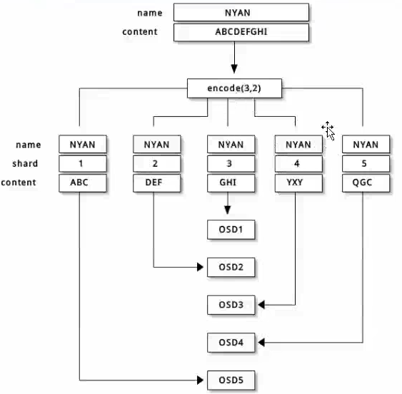
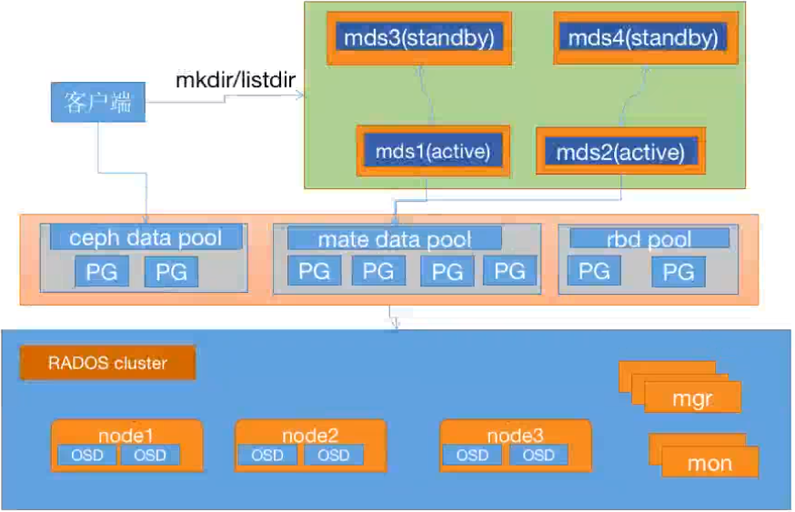
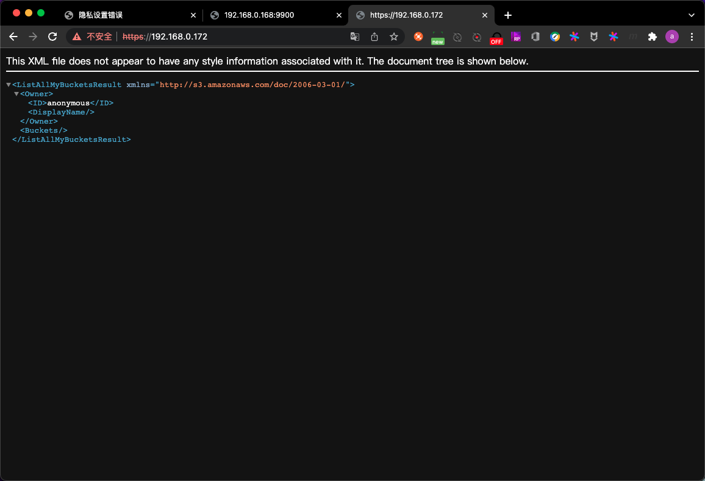

# day2

## PART1. ceph集群应用基础

### 4.3 Ceph-FS文件存储

Ceph FS即ceph filesystem,可以实现文件系统共享功能,客户端通过ceph协议挂载并使用ceph集群作为数据存储服务器.

Ceph FS需要运行Meta Data Services(MDS)服务,其守护进程为ceph-mds,ceph-mds进程管理与Ceph FS上存储的文件相关的元数据,并协调对ceph存储集群的访问.

操作系统内核版本> 2.6.34,则内核自动支持Ceph FS.


注意元数据和数据是2个不同的存储池.

#### 4.3.1 部署MDS服务

安装:

##### Ubuntu

在`ceph-mgr-1`节点安装ceph-mds服务(此处是将ceph-mds和ceph-mgr混用在1个节点上了):

```
root@ceph-mgr-1:~# apt-cache madison ceph-mds
  ceph-mds | 16.2.7-1bionic | https://mirrors.tuna.tsinghua.edu.cn/ceph/debian-pacific bionic/main amd64 Packages
  ceph-mds | 12.2.13-0ubuntu0.18.04.10 | http://mirrors.aliyun.com/ubuntu bionic-security/universe amd64 Packages
  ceph-mds | 12.2.13-0ubuntu0.18.04.10 | http://mirrors.aliyun.com/ubuntu bionic-updates/universe amd64 Packages
  ceph-mds | 12.2.4-0ubuntu1 | http://mirrors.aliyun.com/ubuntu bionic/universe amd64 Packages
      ceph | 12.2.4-0ubuntu1 | http://mirrors.aliyun.com/ubuntu bionic/main Sources
      ceph | 12.2.13-0ubuntu0.18.04.10 | http://mirrors.aliyun.com/ubuntu bionic-security/main Sources
      ceph | 12.2.13-0ubuntu0.18.04.10 | http://mirrors.aliyun.com/ubuntu bionic-updates/main Sources
```

```
root@ceph-mgr-1:~# apt install ceph-mds
...
root@ceph-mgr-1:~# 
```

##### Centos

```
yum install ceph-mds -y
```

部署:

在`ceph-deploy-1`节点上部署ceph-mds

```
ceph@ceph-deploy-1:~/ceph-cluster$ ceph-deploy mds create ceph-mgr-1
[ceph_deploy.conf][DEBUG ] found configuration file at: /home/ceph/.cephdeploy.conf
[ceph_deploy.cli][INFO  ] Invoked (2.0.1): /usr/bin/ceph-deploy mds create ceph-mgr-1
[ceph_deploy.cli][INFO  ] ceph-deploy options:
[ceph_deploy.cli][INFO  ]  username                      : None
[ceph_deploy.cli][INFO  ]  verbose                       : False
[ceph_deploy.cli][INFO  ]  overwrite_conf                : False
[ceph_deploy.cli][INFO  ]  subcommand                    : create
[ceph_deploy.cli][INFO  ]  quiet                         : False
[ceph_deploy.cli][INFO  ]  cd_conf                       : <ceph_deploy.conf.cephdeploy.Conf instance at 0x7fec0db30be0>
[ceph_deploy.cli][INFO  ]  cluster                       : ceph
[ceph_deploy.cli][INFO  ]  func                          : <function mds at 0x7fec0db0d3d0>
[ceph_deploy.cli][INFO  ]  ceph_conf                     : None
[ceph_deploy.cli][INFO  ]  mds                           : [('ceph-mgr-1', 'ceph-mgr-1')]
[ceph_deploy.cli][INFO  ]  default_release               : False
[ceph_deploy.mds][DEBUG ] Deploying mds, cluster ceph hosts ceph-mgr-1:ceph-mgr-1
[ceph-mgr-1][DEBUG ] connection detected need for sudo
[ceph-mgr-1][DEBUG ] connected to host: ceph-mgr-1 
[ceph-mgr-1][DEBUG ] detect platform information from remote host
[ceph-mgr-1][DEBUG ] detect machine type
[ceph_deploy.mds][INFO  ] Distro info: Ubuntu 18.04 bionic
[ceph_deploy.mds][DEBUG ] remote host will use systemd
[ceph_deploy.mds][DEBUG ] deploying mds bootstrap to ceph-mgr-1
[ceph-mgr-1][DEBUG ] write cluster configuration to /etc/ceph/{cluster}.conf
[ceph-mgr-1][WARNIN] mds keyring does not exist yet, creating one
[ceph-mgr-1][DEBUG ] create a keyring file
[ceph-mgr-1][DEBUG ] create path if it doesn't exist
[ceph-mgr-1][INFO  ] Running command: sudo ceph --cluster ceph --name client.bootstrap-mds --keyring /var/lib/ceph/bootstrap-mds/ceph.keyring auth get-or-create mds.ceph-mgr-1 osd allow rwx mds allow mon allow profile mds -o /var/lib/ceph/mds/ceph-ceph-mgr-1/keyring
[ceph-mgr-1][INFO  ] Running command: sudo systemctl enable ceph-mds@ceph-mgr-1
[ceph-mgr-1][WARNIN] Created symlink /etc/systemd/system/ceph-mds.target.wants/ceph-mds@ceph-mgr-1.service → /lib/systemd/system/ceph-mds@.service.
[ceph-mgr-1][INFO  ] Running command: sudo systemctl start ceph-mds@ceph-mgr-1
[ceph-mgr-1][INFO  ] Running command: sudo systemctl enable ceph.target
```

#### 4.3.2 验证MDS服务

MDS服务目前还无法正常使用,需要为MDS创建存储池用于保存MDS数据.

```
ceph@ceph-deploy-1:~/ceph-cluster$ ceph mds stat
 1 up:standby
```

1 up:standy表示备用状态,需分配pool才可用.(正常情况为active)

#### 4.3.3 创建CephFS metadata和data存储池

使用CephFS之前需要事先在集群中创建一个文件系统,并为其分别指定元数据存储池和数据存储池.如下命令将创建名为mycephfs的文件系统,它使用cephfs-metadata作为元数据存储池,使用cephfs-data为数据存储池:

在`ceph-deploy-1`节点上执行如下操作:

- 创建元数据存储池`cephfs-metadata`

```
ceph@ceph-deploy-1:~/ceph-cluster$ ceph osd pool create cephfs-metadata 32 32
pool 'cephfs-metadata' created
```

- 创建数据存储池`cephfs-data`

```
ceph@ceph-deploy-1:~/ceph-cluster$ ceph osd pool create cephfs-data 64 64
pool 'cephfs-data' created
```

- 查看ceph当前状态

```
ceph@ceph-deploy-1:~/ceph-cluster$ ceph -s
  cluster:
    id:     ca4d26ca-9a65-42a0-b61c-991e96d81b62
    health: HEALTH_OK
 
  services:
    mon: 3 daemons, quorum ceph-mon-1,ceph-mon-2,ceph-mon-3 (age 36s)
    mgr: ceph-mgr-2(active, since 3h), standbys: ceph-mgr-1
    osd: 12 osds: 12 up (since 25m), 12 in (since 25m)
    rgw: 1 daemon active (1 hosts, 1 zones)
 
  data:
    pools:   9 pools, 297 pgs
    objects: 265 objects, 92 MiB
    usage:   836 MiB used, 599 GiB / 600 GiB avail
    pgs:     297 active+clean
```

此时只是多了2个存储池,集群状态没有什么变化

```
ceph@ceph-deploy-1:~/ceph-cluster$ ceph osd pool ls
device_health_metrics
mypool
myrbd1
.rgw.root
default.rgw.log
default.rgw.control
default.rgw.meta
cephfs-metadata
cephfs-data
```

#### 4.3.4 创建cephFS并验证

```
ceph fs new <fs_name> <metadata> <data> {--force} {--allow-dangerous-metadata-overlay}
```

- `--force`:强制创建
- `--allow-dangerous-metadata-overlay`:允许不安全的元数据覆盖操作,不要加这个选项.加了可能会导致元数据一致性被破坏.

在`ceph-deploy-1`节点上执行如下操作:

```
ceph@ceph-deploy-1:~/ceph-cluster$ ceph fs new mycephfs cephfs-metadata cephfs-data
new fs with metadata pool 8 and data pool 9
```

早期的ceph版本,1个ceph集群只能创建1个cephfs.但现在支持多个了.

验证:

```
ceph@ceph-deploy-1:~/ceph-cluster$ ceph -s
  cluster:
    id:     ca4d26ca-9a65-42a0-b61c-991e96d81b62
    health: HEALTH_OK
 
  services:
    mon: 3 daemons, quorum ceph-mon-1,ceph-mon-2,ceph-mon-3 (age 88s)
    mgr: ceph-mgr-2(active, since 3h), standbys: ceph-mgr-1
    mds: 1/1 daemons up
    osd: 12 osds: 12 up (since 26m), 12 in (since 26m)
    rgw: 1 daemon active (1 hosts, 1 zones)
 
  data:
    volumes: 1/1 healthy
    pools:   9 pools, 297 pgs
    objects: 287 objects, 92 MiB
    usage:   838 MiB used, 599 GiB / 600 GiB avail
    pgs:     297 active+clean
 
  io:
    client:   1.3 KiB/s wr, 0 op/s rd, 4 op/s wr
```

可以看到多了一个mds

列出集群中的cephfs:

```
ceph@ceph-deploy-1:~/ceph-cluster$ ceph fs ls
name: mycephfs, metadata pool: cephfs-metadata, data pools: [cephfs-data ]
```

查看指定cephFS状态:

```
ceph@ceph-deploy-1:~/ceph-cluster$ ceph fs status mycephfs
mycephfs - 0 clients
========
RANK  STATE      MDS         ACTIVITY     DNS    INOS   DIRS   CAPS  
 0    active  ceph-mgr-1  Reqs:    0 /s    10     13     12      0   
      POOL         TYPE     USED  AVAIL  
cephfs-metadata  metadata  96.0k   189G  
  cephfs-data      data       0    189G  
MDS version: ceph version 16.2.7 (dd0603118f56ab514f133c8d2e3adfc983942503) pacific (stable)
```

其中RANK列即为cephfs的id

#### 4.3.5 验证cephFS服务状态

```
ceph@ceph-deploy-1:~/ceph-cluster$ ceph mds stat
mycephfs:1 {0=ceph-mgr-1=up:active}
```

可以看到mds的状态为active 

#### 4.3.6 客户端挂载cephFS

在ceph的客户端测试cephfs的挂载,需要指定mon节点(因为mon是负责认证的)的6789端口:

`ceph-deploy-1`节点操作,查看admin的key:

```
ceph@ceph-deploy-1:~/ceph-cluster$ cat ceph.client.admin.keyring
[client.admin]
	key = AQCeVSdijiOFGhAA8Sup9qfOmAYgt1zxRcw5kg==
	caps mds = "allow *"
	caps mgr = "allow *"
	caps mon = "allow *"
	caps osd = "allow *"
```

`ceph-mon-1`节点操作,查看`ceph-mds`的端口信息,`ceph-mds`就是cephfs对外提供的挂载点:

```
root@ceph-mon-1:~# ss -tnl
State    Recv-Q    Send-Q        Local Address:Port        Peer Address:Port    
LISTEN   0         128           127.0.0.53%lo:53               0.0.0.0:*       
LISTEN   0         128                 0.0.0.0:22               0.0.0.0:*       
LISTEN   0         100                 0.0.0.0:25               0.0.0.0:*       
LISTEN   0         128           192.168.0.165:3300             0.0.0.0:*       
LISTEN   0         128           192.168.0.165:6789             0.0.0.0:*       
LISTEN   0         128                    [::]:22                  [::]:*       
LISTEN   0         100                    [::]:25                  [::]:*  
```

客户端挂载(注意:内核版本需 > 2.6.34):

`ceph-client-2`操作:

```
root@ceph-client-1:~# mount -t ceph 192.168.0.165:6789:/ /mnt/data -o name=admin,secret=AQCeVSdijiOFGhAA8Sup9qfOmAYgt1zxRcw5kg==
```

`192.168.0.165:6789:/`就相当于是cephfs对外提供的一个挂载点.此处写3个mon中的任何一个都可以.

TODO:此处不知道为什么,我的cpeh-mon进程全部走了公网的网卡,没走内网的.怀疑是搭建的时候有问题.

查看挂载结果:

```
root@ceph-client-1:~# df -TH
Filesystem           Type      Size  Used Avail Use% Mounted on
udev                 devtmpfs  485M     0  485M   0% /dev
tmpfs                tmpfs     104M  6.0M   98M   6% /run
/dev/sda1            ext4       53G  4.9G   46G  10% /
tmpfs                tmpfs     517M     0  517M   0% /dev/shm
tmpfs                tmpfs     5.3M     0  5.3M   0% /run/lock
tmpfs                tmpfs     517M     0  517M   0% /sys/fs/cgroup
tmpfs                tmpfs     104M     0  104M   0% /run/user/0
/dev/rbd0            ext4      3.2G   10M  3.0G   1% /mnt/rbd0
/dev/rbd1            xfs       5.4G   41M  5.4G   1% /mnt/rbd1
192.168.0.165:6789:/ ceph      204G     0  204G   0% /mnt/data

```

多了一个ceph类型的分区

在`ceph-client-2`上也按照上述步骤做.

1个cephfs可以被多个客户端挂载,且在任何一个客户端上对文件做了变更,都会在其他客户端立刻生效.非常适合用于多web服务器之间的数据共享.

例:在客户端A修改数据,在客户端B查看数据:

- step1. 在`ceph-client-1`节点上,向cephfs写入数据

```
root@ceph-client-1:~# cd /mnt/data/
root@ceph-client-1:/mnt/data# echo "1111" >> test.txt
root@ceph-client-1:/mnt/data# cat test.txt 
1111
```

- step2. 在`ceph-client-2`节点上查看

```
root@ceph-client-2:~# ls /mnt/data/
test.txt
root@ceph-client-2:~# cat /mnt/data/test.txt 
1111
```

推荐在客户端安装ceph-common并导入key.会提升一些IO性能.


### 命令总结

- `ceph ods pool ls`:只显示存储池
- `ceph osd lspools`:列出存储池并显示id
- `ceph pg stat`:查看pg状态
- `ceph osd pool status mypool`:查看指定pool或所有pool的状态(不指定存储池,则显示所有存储池状态)
- `ceph df`:查看集群存储状态
- `ceph df detail`:查看集群存储状态详情
- `ceph osd stat`:查看osd状态
	
	- `epoch`:表示osd变更的次数.每个osd的状态变化都会产生一个新的纪元,对应值会更新
	
- `ceph osd dump`:显示osd的底层详细信息
- `ceph osd tree`:显示OSD和节点的对应关系
- `ceph mon stat`:查看mon节点状态
- `ceph mon dump`:查看mon节点的详细信息

### 4.4 ceph集群维护

#### 4.4.1 通过套接字进行单机管理 

通过单台主机的socket文件来管理osd进程.这种管理方式不多见

在`ceph-osd-1`上执行:

```
root@ceph-osd-1:~# ll /var/run/ceph/
total 0
drwxrwx---  2 ceph ceph 100 Mar 14 09:27 ./
drwxr-xr-x 25 root root 860 Mar 18 16:20 ../
srwxr-xr-x  1 ceph ceph   0 Mar 14 09:27 ceph-osd.0.asok=
srwxr-xr-x  1 ceph ceph   0 Mar 14 09:27 ceph-osd.1.asok=
srwxr-xr-x  1 ceph ceph   0 Mar 14 09:27 ceph-osd.2.asok=
```

每个osd进程都有一个对应的socket文件,这个socket文件可以和当前进程直接交互,包括配置查看和配置变更等操作都可以通过这个socket文件来做.

可在node节点或者mon节点通过ceph命令进行单机管理本机的mon或osd服务.

- step1. 先将admin认证文件同步到mon或osd节点

`ceph-deploy-1`节点上执行:

```
ceph@ceph-deploy-1:~/ceph-cluster$ scp ceph.client.admin.keyring root@172.16.1.161:/etc/ceph
root@172.16.1.161's password: 
ceph.client.admin.keyring                                                     100%  151    22.2KB/s   00:00   
```

同样操作将秘钥环文件拷贝给所有mon和osd节点

- step2. 在osd节点上执行:

```
root@ceph-osd-1:~# ceph --admin-socket /var/run/ceph/ceph-osd.0.asok --help

 General usage: 
 ==============
usage: ceph [-h] [-c CEPHCONF] [-i INPUT_FILE] [-o OUTPUT_FILE]
            [--setuser SETUSER] [--setgroup SETGROUP] [--id CLIENT_ID]
            [--name CLIENT_NAME] [--cluster CLUSTER]
            [--admin-daemon ADMIN_SOCKET] [-s] [-w] [--watch-debug]
            [--watch-info] [--watch-sec] [--watch-warn] [--watch-error]
            [-W WATCH_CHANNEL] [--version] [--verbose] [--concise]
            [-f {json,json-pretty,xml,xml-pretty,plain,yaml}]
            [--connect-timeout CLUSTER_TIMEOUT] [--block] [--period PERIOD]

Ceph administration tool
...
```

例:查看指定osd进程对应的pg状态:

```
root@ceph-osd-1:~# ceph --admin-socket /var/run/ceph/ceph-osd.0.asok pg stat
2022-03-18T18:13:16.774+0800 7fbbe204a700 -1 asok(0x7fbbdc001510) AdminSocketConfigObs::init: failed: AdminSocket::bind_and_listen: failed to bind the UNIX domain socket to '/var/run/ceph/ceph-osd.0.asok': (17) File exists
297 pgs: 297 active+clean; 92 MiB data, 860 MiB used, 599 GiB / 600 GiB avail
```

例:查看mon进程状态:

```
root@ceph-mon-1:~# ceph --admin-daemon /var/run/ceph/ceph-mon.ceph-mon-1.asok mon_status
{
    "name": "ceph-mon-1",
    "rank": 0,
    "state": "leader",
    "election_epoch": 3768,
    "quorum": [
        0,
        1,
        2
    ],
    "quorum_age": 1374,
    "features": {
        "required_con": "2449958747317026820",
        "required_mon": [
            "kraken",
            "luminous",
            "mimic",
            "osdmap-prune",
            "nautilus",
            "octopus",
            "pacific",
            "elector-pinging"
        ],
        "quorum_con": "4540138297136906239",
        "quorum_mon": [
            "kraken",
            "luminous",
            "mimic",
            "osdmap-prune",
            "nautilus",
            "octopus",
            "pacific",
            "elector-pinging"
        ]
    },
    "outside_quorum": [],
    "extra_probe_peers": [],
    "sync_provider": [],
    "monmap": {
        "epoch": 3,
        "fsid": "ca4d26ca-9a65-42a0-b61c-991e96d81b62",
        "modified": "2022-03-11T08:38:25.700455Z",
        "created": "2022-03-08T13:09:49.456861Z",
        "min_mon_release": 16,
        "min_mon_release_name": "pacific",
        "election_strategy": 1,
        "disallowed_leaders: ": "",
        "stretch_mode": false,
        "tiebreaker_mon": "",
        "features": {
            "persistent": [
                "kraken",
                "luminous",
                "mimic",
                "osdmap-prune",
                "nautilus",
                "octopus",
                "pacific",
                "elector-pinging"
            ],
            "optional": []
        },
        "mons": [
            {
                "rank": 0,
                "name": "ceph-mon-1",
                "public_addrs": {
                    "addrvec": [
                        {
                            "type": "v2",
                            "addr": "192.168.0.165:3300",
                            "nonce": 0
                        },
                        {
                            "type": "v1",
                            "addr": "192.168.0.165:6789",
                            "nonce": 0
                        }
                    ]
                },
                "addr": "192.168.0.165:6789/0",
                "public_addr": "192.168.0.165:6789/0",
                "priority": 0,
                "weight": 0,
                "crush_location": "{}"
            },
            {
                "rank": 1,
                "name": "ceph-mon-2",
                "public_addrs": {
                    "addrvec": [
                        {
                            "type": "v2",
                            "addr": "192.168.0.166:3300",
                            "nonce": 0
                        },
                        {
                            "type": "v1",
                            "addr": "192.168.0.166:6789",
                            "nonce": 0
                        }
                    ]
                },
                "addr": "192.168.0.166:6789/0",
                "public_addr": "192.168.0.166:6789/0",
                "priority": 0,
                "weight": 0,
                "crush_location": "{}"
            },
            {
                "rank": 2,
                "name": "ceph-mon-3",
                "public_addrs": {
                    "addrvec": [
                        {
                            "type": "v2",
                            "addr": "192.168.0.167:3300",
                            "nonce": 0
                        },
                        {
                            "type": "v1",
                            "addr": "192.168.0.167:6789",
                            "nonce": 0
                        }
                    ]
                },
                "addr": "192.168.0.167:6789/0",
                "public_addr": "192.168.0.167:6789/0",
                "priority": 0,
                "weight": 0,
                "crush_location": "{}"
            }
        ]
    },
    "feature_map": {
        "mon": [
            {
                "features": "0x3f01cfb9fffdffff",
                "release": "luminous",
                "num": 1
            }
        ]
    },
    "stretch_mode": false
}
```

例:查看mon进程配置:

```
root@ceph-mon-1:~# ceph --admin-daemon /var/run/ceph/ceph-mon.ceph-mon-1.asok config show
{
    "name": "mon.ceph-mon-1",
    "cluster": "ceph",
    "admin_socket": "/var/run/ceph/ceph-mon.ceph-mon-1.asok",
    "admin_socket_mode": "",
    "auth_allow_insecure_global_id_reclaim": "false",
    "auth_client_required": "cephx",
    "auth_cluster_required": "cephx",
    "auth_debug": "false",
    "auth_expose_insecure_global_id_reclaim": "true",
    "auth_mon_ticket_ttl": "259200.000000",
    "auth_service_required": "cephx",
    "auth_service_ticket_ttl": "3600.000000",
    "auth_supported": "",
    "bdev_aio": "true",
    "bdev_aio_max_queue_depth": "1024",
    "bdev_aio_poll_ms": "250",
    "bdev_aio_reap_max": "16",
    "bdev_async_discard": "false",
    "bdev_block_size": "4096",
    "bdev_debug_aio": "false",
    "bdev_debug_aio_log_age": "5.000000",
    "bdev_debug_aio_suicide_timeout": "60.000000",
    "bdev_debug_inflight_ios": "false",
    "bdev_enable_discard": "false",
    "bdev_flock_retry": "3",
    "bdev_flock_retry_interval": "0.100000",
    "bdev_inject_crash": "0",
    "bdev_inject_crash_flush_delay": "2",
    "bdev_ioring": "false",
    "bdev_ioring_hipri": "false",
    "bdev_ioring_sqthread_poll": "false",
    "bdev_nvme_unbind_from_kernel": "false",
    "bdev_type": "",
    "bluefs_alloc_size": "1048576",
    "bluefs_allocator": "hybrid",
    "bluefs_buffered_io": "true",
    "bluefs_check_for_zeros": "false",
    "bluefs_compact_log_sync": "false",
    "bluefs_log_compact_min_ratio": "5.000000",
    "bluefs_log_compact_min_size": "16777216",
    "bluefs_log_replay_check_allocations": "true",
    "bluefs_max_log_runway": "4194304",
    "bluefs_max_prefetch": "1048576",
    "bluefs_min_flush_size": "524288",
    "bluefs_min_log_runway": "1048576",
    "bluefs_replay_recovery": "false",
    "bluefs_replay_recovery_disable_compact": "false",
    "bluefs_shared_alloc_size": "65536",
    "bluefs_sync_write": "false",
    "bluestore_2q_cache_kin_ratio": "0.500000",
    "bluestore_2q_cache_kout_ratio": "0.500000",
    "bluestore_alloc_stats_dump_interval": "86400.000000",
    "bluestore_allocator": "hybrid",
    "bluestore_avl_alloc_bf_free_pct": "4",
    "bluestore_avl_alloc_bf_threshold": "131072",
    "bluestore_bitmapallocator_blocks_per_zone": "1024",
    "bluestore_bitmapallocator_span_size": "1024",
    "bluestore_blobid_prealloc": "10240",
    "bluestore_block_create": "true",
    "bluestore_block_db_create": "false",
    "bluestore_block_db_path": "",
    "bluestore_block_db_size": "0",
    "bluestore_block_path": "",
    "bluestore_block_preallocate_file": "false",
    "bluestore_block_size": "107374182400",
    "bluestore_block_wal_create": "false",
    "bluestore_block_wal_path": "",
    "bluestore_block_wal_size": "100663296",
    "bluestore_bluefs": "true",
    "bluestore_bluefs_alloc_failure_dump_interval": "0.000000",
    "bluestore_bluefs_env_mirror": "false",
    "bluestore_cache_autotune": "true",
    "bluestore_cache_autotune_interval": "5.000000",
    "bluestore_cache_kv_onode_ratio": "0.040000",
    "bluestore_cache_kv_ratio": "0.450000",
    "bluestore_cache_meta_ratio": "0.450000",
    "bluestore_cache_size": "0",
    "bluestore_cache_size_hdd": "1073741824",
    "bluestore_cache_size_ssd": "3221225472",
    "bluestore_cache_trim_interval": "0.050000",
    "bluestore_cache_trim_max_skip_pinned": "1000",
    "bluestore_cache_type": "2q",
    "bluestore_clone_cow": "true",
    "bluestore_compression_algorithm": "snappy",
    "bluestore_compression_max_blob_size": "0",
    "bluestore_compression_max_blob_size_hdd": "65536",
    "bluestore_compression_max_blob_size_ssd": "65536",
    "bluestore_compression_min_blob_size": "0",
    "bluestore_compression_min_blob_size_hdd": "8192",
    "bluestore_compression_min_blob_size_ssd": "8192",
    "bluestore_compression_mode": "none",
    "bluestore_compression_required_ratio": "0.875000",
    "bluestore_csum_type": "crc32c",
    "bluestore_debug_enforce_settings": "default",
    "bluestore_debug_freelist": "false",
    "bluestore_debug_fsck_abort": "false",
    "bluestore_debug_inject_bug21040": "false",
    "bluestore_debug_inject_csum_err_probability": "0.000000",
    "bluestore_debug_inject_read_err": "false",
    "bluestore_debug_legacy_omap": "false",
    "bluestore_debug_no_reuse_blocks": "false",
    "bluestore_debug_omit_block_device_write": "false",
    "bluestore_debug_omit_kv_commit": "false",
    "bluestore_debug_permit_any_bdev_label": "false",
    "bluestore_debug_prefill": "0.000000",
    "bluestore_debug_prefragment_max": "1048576",
    "bluestore_debug_random_read_err": "0.000000",
    "bluestore_debug_randomize_serial_transaction": "0",
    "bluestore_debug_small_allocations": "0",
    "bluestore_debug_too_many_blobs_threshold": "24576",
    "bluestore_default_buffered_read": "true",
    "bluestore_default_buffered_write": "false",
    "bluestore_deferred_batch_ops": "0",
    "bluestore_deferred_batch_ops_hdd": "64",
    "bluestore_deferred_batch_ops_ssd": "16",
    "bluestore_extent_map_inline_shard_prealloc_size": "256",
    "bluestore_extent_map_shard_max_size": "1200",
    "bluestore_extent_map_shard_min_size": "150",
    "bluestore_extent_map_shard_target_size": "500",
    "bluestore_extent_map_shard_target_size_slop": "0.200000",
    "bluestore_freelist_blocks_per_key": "128",
    "bluestore_fsck_error_on_no_per_pg_omap": "false",
    "bluestore_fsck_error_on_no_per_pool_omap": "false",
    "bluestore_fsck_error_on_no_per_pool_stats": "false",
    "bluestore_fsck_on_mkfs": "true",
    "bluestore_fsck_on_mkfs_deep": "false",
    "bluestore_fsck_on_mount": "false",
    "bluestore_fsck_on_mount_deep": "false",
    "bluestore_fsck_on_umount": "false",
    "bluestore_fsck_on_umount_deep": "false",
    "bluestore_fsck_quick_fix_on_mount": "false",
    "bluestore_fsck_quick_fix_threads": "2",
    "bluestore_fsck_read_bytes_cap": "67108864",
    "bluestore_gc_enable_blob_threshold": "0",
    "bluestore_gc_enable_total_threshold": "0",
    "bluestore_hybrid_alloc_mem_cap": "67108864",
    "bluestore_ignore_data_csum": "false",
    "bluestore_kv_sync_util_logging_s": "10.000000",
    "bluestore_kvbackend": "rocksdb",
    "bluestore_log_collection_list_age": "60.000000",
    "bluestore_log_omap_iterator_age": "5.000000",
    "bluestore_log_op_age": "5.000000",
    "bluestore_max_alloc_size": "0",
    "bluestore_max_blob_size": "0",
    "bluestore_max_blob_size_hdd": "65536",
    "bluestore_max_blob_size_ssd": "65536",
    "bluestore_max_defer_interval": "3.000000",
    "bluestore_max_deferred_txc": "32",
    "bluestore_min_alloc_size": "0",
    "bluestore_min_alloc_size_hdd": "4096",
    "bluestore_min_alloc_size_ssd": "4096",
    "bluestore_nid_prealloc": "1024",
    "bluestore_prefer_deferred_size": "0",
    "bluestore_prefer_deferred_size_hdd": "65536",
    "bluestore_prefer_deferred_size_ssd": "0",
    "bluestore_retry_disk_reads": "3",
    "bluestore_rocksdb_cf": "true",
    "bluestore_rocksdb_cfs": "m(3) p(3,0-12) O(3,0-13)=block_cache={type=binned_lru} L P",
    "bluestore_rocksdb_options": "compression=kNoCompression,max_write_buffer_number=4,min_write_buffer_number_to_merge=1,recycle_log_file_num=4,write_buffer_size=268435456,writable_file_max_buffer_size=0,compaction_readahead_size=2097152,max_background_compactions=2,max_total_wal_size=1073741824",
    "bluestore_rocksdb_options_annex": "",
    "bluestore_spdk_coremask": "0x1",
    "bluestore_spdk_io_sleep": "5",
    "bluestore_spdk_max_io_completion": "0",
    "bluestore_spdk_mem": "512",
    "bluestore_sync_submit_transaction": "false",
    "bluestore_throttle_bytes": "67108864",
    "bluestore_throttle_cost_per_io": "0",
    "bluestore_throttle_cost_per_io_hdd": "670000",
    "bluestore_throttle_cost_per_io_ssd": "4000",
    "bluestore_throttle_deferred_bytes": "134217728",
    "bluestore_throttle_trace_rate": "0.000000",
    "bluestore_tracing": "false",
    "bluestore_volume_selection_policy": "use_some_extra",
    "bluestore_volume_selection_reserved": "0",
    "bluestore_volume_selection_reserved_factor": "2.000000",
    "bluestore_warn_on_bluefs_spillover": "true",
    "bluestore_warn_on_legacy_statfs": "true",
    "bluestore_warn_on_no_per_pg_omap": "false",
    "bluestore_warn_on_no_per_pool_omap": "true",
    "bluestore_warn_on_spurious_read_errors": "true",
    "cephadm_path": "/usr/sbin/cephadm",
    "cephfs_mirror_action_update_interval": "2",
    "cephfs_mirror_directory_scan_interval": "10",
    "cephfs_mirror_max_concurrent_directory_syncs": "3",
    "cephfs_mirror_max_consecutive_failures_per_directory": "10",
    "cephfs_mirror_max_snapshot_sync_per_cycle": "3",
    "cephfs_mirror_mount_timeout": "10",
    "cephfs_mirror_restart_mirror_on_blocklist_interval": "30",
    "cephfs_mirror_restart_mirror_on_failure_interval": "20",
    "cephfs_mirror_retry_failed_directories_interval": "60",
    "cephsqlite_blocklist_dead_locker": "true",
    "cephsqlite_lock_renewal_interval": "2000",
    "cephsqlite_lock_renewal_timeout": "30000",
    "cephx_cluster_require_signatures": "false",
    "cephx_cluster_require_version": "2",
    "cephx_require_signatures": "false",
    "cephx_require_version": "2",
    "cephx_service_require_signatures": "false",
    "cephx_service_require_version": "2",
    "cephx_sign_messages": "true",
    "chdir": "",
    "client_acl_type": "",
    "client_asio_thread_count": "2",
    "client_cache_mid": "0.750000",
    "client_cache_size": "16384",
    "client_caps_release_delay": "5",
    "client_check_pool_perm": "true",
    "client_debug_force_sync_read": "false",
    "client_debug_getattr_caps": "false",
    "client_debug_inject_tick_delay": "0",
    "client_die_on_failed_dentry_invalidate": "true",
    "client_die_on_failed_remount": "false",
    "client_dirsize_rbytes": "true",
    "client_force_lazyio": "false",
    "client_fs": "",
    "client_inject_fixed_oldest_tid": "false",
    "client_inject_release_failure": "false",
    "client_max_inline_size": "4096",
    "client_mds_namespace": "",
    "client_metadata": "",
    "client_mount_gid": "-1",
    "client_mount_timeout": "300.000000",
    "client_mount_uid": "-1",
    "client_mountpoint": "/",
    "client_notify_timeout": "10",
    "client_oc": "true",
    "client_oc_max_dirty": "104857600",
    "client_oc_max_dirty_age": "5.000000",
    "client_oc_max_objects": "1000",
    "client_oc_size": "209715200",
    "client_oc_target_dirty": "8388608",
    "client_permissions": "true",
    "client_quota_df": "true",
    "client_readahead_max_bytes": "0",
    "client_readahead_max_periods": "4",
    "client_readahead_min": "131072",
    "client_reconnect_stale": "false",
    "client_shutdown_timeout": "30",
    "client_snapdir": ".snap",
    "client_tick_interval": "1",
    "client_trace": "",
    "client_try_dentry_invalidate": "false",
    "client_use_faked_inos": "false",
    "client_use_random_mds": "false",
    "clog_to_graylog": "false",
    "clog_to_graylog_host": "127.0.0.1",
    "clog_to_graylog_port": "12201",
    "clog_to_monitors": "default=true",
    "clog_to_syslog": "false",
    "clog_to_syslog_facility": "default=daemon audit=local0",
    "clog_to_syslog_level": "info",
    "cluster_addr": "-",
    "cluster_network": "172.16.1.0/24",
    "cluster_network_interface": "",
    "compressor_zlib_isal": "false",
    "compressor_zlib_level": "5",
    "compressor_zlib_winsize": "-15",
    "compressor_zstd_level": "1",
    "container_image": "docker.io/ceph/daemon-base:latest-pacific-devel",
    "crash_dir": "/var/lib/ceph/crash",
    "crimson_osd_obc_lru_size": "10",
    "crimson_osd_scheduler_concurrency": "0",
    "crush_location": "",
    "crush_location_hook": "",
    "crush_location_hook_timeout": "10",
    "daemonize": "false",
    "debug_allow_any_pool_priority": "false",
    "debug_asok": "1/5",
    "debug_asok_assert_abort": "false",
    "debug_asserts_on_shutdown": "false",
    "debug_auth": "1/5",
    "debug_bdev": "1/3",
    "debug_bluefs": "1/5",
    "debug_bluestore": "1/5",
    "debug_buffer": "0/1",
    "debug_cephfs_mirror": "0/5",
    "debug_cephsqlite": "0/5",
    "debug_civetweb": "1/10",
    "debug_client": "0/5",
    "debug_compressor": "1/5",
    "debug_context": "0/1",
    "debug_crush": "1/1",
    "debug_crypto": "1/5",
    "debug_deliberately_leak_memory": "false",
    "debug_disable_randomized_ping": "false",
    "debug_dpdk": "1/5",
    "debug_eventtrace": "1/5",
    "debug_filer": "0/1",
    "debug_filestore": "1/3",
    "debug_finisher": "1/1",
    "debug_fuse": "1/5",
    "debug_heartbeat_testing_span": "0",
    "debug_heartbeatmap": "1/5",
    "debug_immutable_obj_cache": "0/5",
    "debug_javaclient": "1/5",
    "debug_journal": "1/3",
    "debug_journaler": "0/5",
    "debug_kstore": "1/5",
    "debug_leveldb": "4/5",
    "debug_lockdep": "0/1",
    "debug_mds": "1/5",
    "debug_mds_balancer": "1/5",
    "debug_mds_locker": "1/5",
    "debug_mds_log": "1/5",
    "debug_mds_log_expire": "1/5",
    "debug_mds_migrator": "1/5",
    "debug_memdb": "4/5",
    "debug_mgr": "2/5",
    "debug_mgrc": "1/5",
    "debug_mon": "1/5",
    "debug_monc": "0/10",
    "debug_ms": "0/0",
    "debug_none": "0/5",
    "debug_objclass": "0/5",
    "debug_objectcacher": "0/5",
    "debug_objecter": "0/1",
    "debug_optracker": "0/5",
    "debug_osd": "1/5",
    "debug_paxos": "1/5",
    "debug_perfcounter": "1/5",
    "debug_prioritycache": "1/5",
    "debug_rados": "0/5",
    "debug_rbd": "0/5",
    "debug_rbd_mirror": "0/5",
    "debug_rbd_pwl": "0/5",
    "debug_rbd_replay": "0/5",
    "debug_refs": "0/0",
    "debug_reserver": "1/1",
    "debug_rgw": "1/5",
    "debug_rgw_sync": "1/5",
    "debug_rocksdb": "4/5",
    "debug_striper": "0/1",
    "debug_test": "0/5",
    "debug_throttle": "1/1",
    "debug_timer": "0/1",
    "debug_tp": "0/5",
    "device_failure_prediction_mode": "none",
    "enable_experimental_unrecoverable_data_corrupting_features": "",
    "erasure_code_dir": "/usr/lib/ceph/erasure-code",
    "err_to_graylog": "false",
    "err_to_stderr": "true",
    "err_to_syslog": "false",
    "event_tracing": "false",
    "fake_statfs_for_testing": "0",
    "fatal_signal_handlers": "true",
    "filer_max_purge_ops": "10",
    "filer_max_truncate_ops": "128",
    "filestore_apply_finisher_threads": "1",
    "filestore_blackhole": "false",
    "filestore_btrfs_clone_range": "true",
    "filestore_btrfs_snap": "true",
    "filestore_caller_concurrency": "10",
    "filestore_collect_device_partition_information": "true",
    "filestore_commit_timeout": "600.000000",
    "filestore_debug_inject_read_err": "false",
    "filestore_debug_omap_check": "false",
    "filestore_debug_random_read_err": "0.000000",
    "filestore_debug_verify_split": "false",
    "filestore_dump_file": "",
    "filestore_expected_throughput_bytes": "209715200.000000",
    "filestore_expected_throughput_ops": "200.000000",
    "filestore_fadvise": "true",
    "filestore_fail_eio": "true",
    "filestore_fd_cache_shards": "16",
    "filestore_fd_cache_size": "128",
    "filestore_fiemap": "false",
    "filestore_fiemap_threshold": "4096",
    "filestore_fsync_flushes_journal_data": "false",
    "filestore_index_retry_probability": "0.000000",
    "filestore_inject_stall": "0",
    "filestore_journal_parallel": "false",
    "filestore_journal_trailing": "false",
    "filestore_journal_writeahead": "false",
    "filestore_kill_at": "0",
    "filestore_max_alloc_hint_size": "1048576",
    "filestore_max_inline_xattr_size": "0",
    "filestore_max_inline_xattr_size_btrfs": "2048",
    "filestore_max_inline_xattr_size_other": "512",
    "filestore_max_inline_xattr_size_xfs": "65536",
    "filestore_max_inline_xattrs": "0",
    "filestore_max_inline_xattrs_btrfs": "10",
    "filestore_max_inline_xattrs_other": "2",
    "filestore_max_inline_xattrs_xfs": "10",
    "filestore_max_sync_interval": "5.000000",
    "filestore_max_xattr_value_size": "0",
    "filestore_max_xattr_value_size_btrfs": "65536",
    "filestore_max_xattr_value_size_other": "1024",
    "filestore_max_xattr_value_size_xfs": "65536",
    "filestore_merge_threshold": "-10",
    "filestore_min_sync_interval": "0.010000",
    "filestore_odsync_write": "false",
    "filestore_omap_backend": "rocksdb",
    "filestore_omap_backend_path": "",
    "filestore_omap_header_cache_size": "1024",
    "filestore_ondisk_finisher_threads": "1",
    "filestore_op_thread_suicide_timeout": "180",
    "filestore_op_thread_timeout": "60",
    "filestore_op_threads": "2",
    "filestore_punch_hole": "false",
    "filestore_queue_high_delay_multiple": "0.000000",
    "filestore_queue_high_delay_multiple_bytes": "0.000000",
    "filestore_queue_high_delay_multiple_ops": "0.000000",
    "filestore_queue_high_threshhold": "0.900000",
    "filestore_queue_low_threshhold": "0.300000",
    "filestore_queue_max_bytes": "104857600",
    "filestore_queue_max_delay_multiple": "0.000000",
    "filestore_queue_max_delay_multiple_bytes": "0.000000",
    "filestore_queue_max_delay_multiple_ops": "0.000000",
    "filestore_queue_max_ops": "50",
    "filestore_rocksdb_options": "max_background_jobs=10,compaction_readahead_size=2097152,compression=kNoCompression",
    "filestore_seek_data_hole": "false",
    "filestore_sloppy_crc": "false",
    "filestore_sloppy_crc_block_size": "65536",
    "filestore_splice": "false",
    "filestore_split_multiple": "2",
    "filestore_split_rand_factor": "20",
    "filestore_update_to": "1000",
    "filestore_wbthrottle_btrfs_bytes_hard_limit": "419430400",
    "filestore_wbthrottle_btrfs_bytes_start_flusher": "41943040",
    "filestore_wbthrottle_btrfs_inodes_hard_limit": "5000",
    "filestore_wbthrottle_btrfs_inodes_start_flusher": "500",
    "filestore_wbthrottle_btrfs_ios_hard_limit": "5000",
    "filestore_wbthrottle_btrfs_ios_start_flusher": "500",
    "filestore_wbthrottle_enable": "true",
    "filestore_wbthrottle_xfs_bytes_hard_limit": "419430400",
    "filestore_wbthrottle_xfs_bytes_start_flusher": "41943040",
    "filestore_wbthrottle_xfs_inodes_hard_limit": "5000",
    "filestore_wbthrottle_xfs_inodes_start_flusher": "500",
    "filestore_wbthrottle_xfs_ios_hard_limit": "5000",
    "filestore_wbthrottle_xfs_ios_start_flusher": "500",
    "filestore_xfs_extsize": "false",
    "filestore_zfs_snap": "false",
    "fio_dir": "/tmp/fio",
    "fsid": "ca4d26ca-9a65-42a0-b61c-991e96d81b62",
    "fuse_allow_other": "true",
    "fuse_atomic_o_trunc": "true",
    "fuse_big_writes": "true",
    "fuse_debug": "false",
    "fuse_default_permissions": "false",
    "fuse_disable_pagecache": "false",
    "fuse_max_write": "0",
    "fuse_multithreaded": "true",
    "fuse_require_active_mds": "true",
    "fuse_set_user_groups": "true",
    "fuse_splice_move": "true",
    "fuse_splice_read": "true",
    "fuse_splice_write": "true",
    "fuse_syncfs_on_mksnap": "true",
    "fuse_use_invalidate_cb": "true",
    "gss_ktab_client_file": "/var/lib/ceph/mon.ceph-mon-1/gss_client_mon.ceph-mon-1.ktab",
    "gss_target_name": "ceph",
    "heartbeat_file": "",
    "heartbeat_inject_failure": "0",
    "heartbeat_interval": "5",
    "host": "",
    "immutable_object_cache_client_dedicated_thread_num": "2",
    "immutable_object_cache_max_inflight_ops": "128",
    "immutable_object_cache_max_size": "1073741824",
    "immutable_object_cache_path": "/tmp/ceph_immutable_object_cache",
    "immutable_object_cache_qos_bps_burst": "0",
    "immutable_object_cache_qos_bps_burst_seconds": "1",
    "immutable_object_cache_qos_bps_limit": "0",
    "immutable_object_cache_qos_iops_burst": "0",
    "immutable_object_cache_qos_iops_burst_seconds": "1",
    "immutable_object_cache_qos_iops_limit": "0",
    "immutable_object_cache_qos_schedule_tick_min": "50",
    "immutable_object_cache_sock": "/var/run/ceph/immutable_object_cache_sock",
    "immutable_object_cache_watermark": "0.900000",
    "inject_early_sigterm": "false",
    "journal_aio": "true",
    "journal_align_min_size": "65536",
    "journal_block_align": "true",
    "journal_block_size": "4096",
    "journal_dio": "true",
    "journal_discard": "false",
    "journal_force_aio": "false",
    "journal_ignore_corruption": "false",
    "journal_max_write_bytes": "10485760",
    "journal_max_write_entries": "100",
    "journal_replay_from": "0",
    "journal_throttle_high_multiple": "0.000000",
    "journal_throttle_high_threshhold": "0.900000",
    "journal_throttle_low_threshhold": "0.600000",
    "journal_throttle_max_multiple": "0.000000",
    "journal_write_header_frequency": "0",
    "journal_zero_on_create": "false",
    "journaler_prefetch_periods": "10",
    "journaler_prezero_periods": "5",
    "journaler_write_head_interval": "15",
    "key": "",
    "keyfile": "",
    "keyring": "/var/lib/ceph/mon/ceph-ceph-mon-1/keyring",
    "kstore_backend": "rocksdb",
    "kstore_default_stripe_size": "65536",
    "kstore_fsck_on_mount": "false",
    "kstore_fsck_on_mount_deep": "true",
    "kstore_max_bytes": "67108864",
    "kstore_max_ops": "512",
    "kstore_nid_prealloc": "1024",
    "kstore_onode_map_size": "1024",
    "kstore_rocksdb_options": "compression=kNoCompression",
    "kstore_sync_submit_transaction": "false",
    "kstore_sync_transaction": "false",
    "leveldb_block_size": "65536",
    "leveldb_bloom_size": "0",
    "leveldb_cache_size": "536870912",
    "leveldb_compact_on_mount": "false",
    "leveldb_compression": "false",
    "leveldb_log": "",
    "leveldb_log_to_ceph_log": "true",
    "leveldb_max_open_files": "0",
    "leveldb_paranoid": "false",
    "leveldb_write_buffer_size": "33554432",
    "librados_thread_count": "2",
    "lockdep": "false",
    "lockdep_force_backtrace": "false",
    "log_coarse_timestamps": "true",
    "log_file": "/var/log/ceph/ceph-mon.ceph-mon-1.log",
    "log_flush_on_exit": "false",
    "log_graylog_host": "127.0.0.1",
    "log_graylog_port": "12201",
    "log_max_new": "1000",
    "log_max_recent": "10000",
    "log_stderr_prefix": "",
    "log_stop_at_utilization": "0.970000",
    "log_to_file": "true",
    "log_to_graylog": "false",
    "log_to_stderr": "false",
    "log_to_syslog": "false",
    "max_rotating_auth_attempts": "10",
    "mds_action_on_write_error": "1",
    "mds_alternate_name_max": "8192",
    "mds_asio_thread_count": "2",
    "mds_bal_export_pin": "true",
    "mds_bal_fragment_dirs": "true",
    "mds_bal_fragment_fast_factor": "1.500000",
    "mds_bal_fragment_interval": "5",
    "mds_bal_fragment_size_max": "100000",
    "mds_bal_idle_threshold": "0.000000",
    "mds_bal_interval": "10",
    "mds_bal_max": "-1",
    "mds_bal_max_until": "-1",
    "mds_bal_merge_size": "50",
    "mds_bal_midchunk": "0.300000",
    "mds_bal_min_rebalance": "0.100000",
    "mds_bal_min_start": "0.200000",
    "mds_bal_minchunk": "0.001000",
    "mds_bal_mode": "0",
    "mds_bal_need_max": "1.200000",
    "mds_bal_need_min": "0.800000",
    "mds_bal_replicate_threshold": "8000.000000",
    "mds_bal_sample_interval": "3.000000",
    "mds_bal_split_bits": "3",
    "mds_bal_split_rd": "25000.000000",
    "mds_bal_split_size": "10000",
    "mds_bal_split_wr": "10000.000000",
    "mds_bal_target_decay": "10.000000",
    "mds_bal_unreplicate_threshold": "0.000000",
    "mds_beacon_grace": "15.000000",
    "mds_beacon_interval": "4.000000",
    "mds_cache_memory_limit": "4294967296",
    "mds_cache_mid": "0.700000",
    "mds_cache_release_free_interval": "10",
    "mds_cache_reservation": "0.050000",
    "mds_cache_trim_decay_rate": "1.000000",
    "mds_cache_trim_interval": "1",
    "mds_cache_trim_threshold": "262144",
    "mds_cap_acquisition_throttle_retry_request_timeout": "0.500000",
    "mds_cap_revoke_eviction_timeout": "0.000000",
    "mds_client_delegate_inos_pct": "50",
    "mds_client_prealloc_inos": "1000",
    "mds_client_writeable_range_max_inc_objs": "1024",
    "mds_damage_table_max_entries": "10000",
    "mds_data": "/var/lib/ceph/mds/ceph-ceph-mon-1",
    "mds_debug_auth_pins": "false",
    "mds_debug_frag": "false",
    "mds_debug_scatterstat": "false",
    "mds_debug_subtrees": "false",
    "mds_decay_halflife": "5.000000",
    "mds_default_dir_hash": "2",
    "mds_defer_session_stale": "true",
    "mds_deny_all_reconnect": "false",
    "mds_dir_keys_per_op": "16384",
    "mds_dir_max_commit_size": "10",
    "mds_dirstat_min_interval": "1.000000",
    "mds_dump_cache_after_rejoin": "false",
    "mds_dump_cache_on_map": "false",
    "mds_dump_cache_threshold_file": "0",
    "mds_dump_cache_threshold_formatter": "1073741824",
    "mds_early_reply": "true",
    "mds_enable_op_tracker": "true",
    "mds_enforce_unique_name": "true",
    "mds_export_ephemeral_distributed": "true",
    "mds_export_ephemeral_distributed_factor": "2.000000",
    "mds_export_ephemeral_random": "true",
    "mds_export_ephemeral_random_max": "0.010000",
    "mds_forward_all_requests_to_auth": "false",
    "mds_freeze_tree_timeout": "30.000000",
    "mds_hack_allow_loading_invalid_metadata": "false",
    "mds_health_cache_threshold": "1.500000",
    "mds_health_summarize_threshold": "10",
    "mds_heartbeat_grace": "15.000000",
    "mds_inject_migrator_session_race": "false",
    "mds_inject_traceless_reply_probability": "0.000000",
    "mds_join_fs": "",
    "mds_journal_format": "1",
    "mds_kill_create_at": "0",
    "mds_kill_export_at": "0",
    "mds_kill_import_at": "0",
    "mds_kill_journal_at": "0",
    "mds_kill_journal_expire_at": "0",
    "mds_kill_journal_replay_at": "0",
    "mds_kill_link_at": "0",
    "mds_kill_mdstable_at": "0",
    "mds_kill_openc_at": "0",
    "mds_kill_rename_at": "0",
    "mds_log_events_per_segment": "1024",
    "mds_log_max_events": "-1",
    "mds_log_max_segments": "128",
    "mds_log_pause": "false",
    "mds_log_segment_size": "0",
    "mds_log_skip_corrupt_events": "false",
    "mds_log_warn_factor": "2.000000",
    "mds_max_caps_per_client": "1048576",
    "mds_max_completed_flushes": "100000",
    "mds_max_completed_requests": "100000",
    "mds_max_export_size": "20971520",
    "mds_max_file_recover": "32",
    "mds_max_purge_files": "64",
    "mds_max_purge_ops": "8192",
    "mds_max_purge_ops_per_pg": "0.500000",
    "mds_max_retries_on_remount_failure": "5",
    "mds_max_scrub_ops_in_progress": "5",
    "mds_max_snaps_per_dir": "100",
    "mds_max_xattr_pairs_size": "65536",
    "mds_metrics_update_interval": "2",
    "mds_min_caps_per_client": "100",
    "mds_min_caps_working_set": "10000",
    "mds_mon_shutdown_timeout": "5.000000",
    "mds_numa_node": "-1",
    "mds_oft_prefetch_dirfrags": "true",
    "mds_op_complaint_time": "30.000000",
    "mds_op_history_duration": "600",
    "mds_op_history_size": "20",
    "mds_op_log_threshold": "5",
    "mds_ping_grace": "15",
    "mds_ping_interval": "5",
    "mds_purge_queue_busy_flush_period": "1.000000",
    "mds_recall_global_max_decay_threshold": "131072",
    "mds_recall_max_caps": "30000",
    "mds_recall_max_decay_rate": "1.500000",
    "mds_recall_max_decay_threshold": "131072",
    "mds_recall_warning_decay_rate": "60.000000",
    "mds_recall_warning_threshold": "262144",
    "mds_reconnect_timeout": "45.000000",
    "mds_replay_interval": "1.000000",
    "mds_replay_unsafe_with_closed_session": "false",
    "mds_request_load_average_decay_rate": "60.000000",
    "mds_root_ino_gid": "0",
    "mds_root_ino_uid": "0",
    "mds_scatter_nudge_interval": "5.000000",
    "mds_session_blocklist_on_evict": "true",
    "mds_session_blocklist_on_timeout": "true",
    "mds_session_cache_liveness_decay_rate": "300.000000",
    "mds_session_cache_liveness_magnitude": "10",
    "mds_session_cap_acquisition_decay_rate": "10.000000",
    "mds_session_cap_acquisition_throttle": "500000",
    "mds_session_max_caps_throttle_ratio": "1.100000",
    "mds_sessionmap_keys_per_op": "1024",
    "mds_shutdown_check": "0",
    "mds_skip_ino": "0",
    "mds_snap_max_uid": "4294967294",
    "mds_snap_min_uid": "0",
    "mds_snap_rstat": "false",
    "mds_standby_replay_damaged": "false",
    "mds_task_status_update_interval": "2.000000",
    "mds_thrash_exports": "0",
    "mds_thrash_fragments": "0",
    "mds_tick_interval": "5.000000",
    "mds_valgrind_exit": "false",
    "mds_verify_backtrace": "1",
    "mds_verify_scatter": "false",
    "mds_wipe_ino_prealloc": "false",
    "mds_wipe_sessions": "false",
    "mempool_debug": "false",
    "memstore_debug_omit_block_device_write": "false",
    "memstore_device_bytes": "1073741824",
    "memstore_page_set": "false",
    "memstore_page_size": "65536",
    "mgr_client_bytes": "134217728",
    "mgr_client_messages": "512",
    "mgr_client_service_daemon_unregister_timeout": "1.000000",
    "mgr_connect_retry_interval": "1.000000",
    "mgr_data": "/var/lib/ceph/mgr/ceph-ceph-mon-1",
    "mgr_debug_aggressive_pg_num_changes": "false",
    "mgr_disabled_modules": "",
    "mgr_initial_modules": "restful iostat nfs",
    "mgr_mds_bytes": "134217728",
    "mgr_mds_messages": "128",
    "mgr_module_path": "/usr/share/ceph/mgr",
    "mgr_mon_bytes": "134217728",
    "mgr_mon_messages": "128",
    "mgr_osd_bytes": "536870912",
    "mgr_osd_messages": "8192",
    "mgr_service_beacon_grace": "60.000000",
    "mgr_standby_modules": "true",
    "mgr_stats_period": "5",
    "mgr_stats_threshold": "5",
    "mgr_tick_period": "2",
    "mon_accept_timeout_factor": "2.000000",
    "mon_allow_pool_delete": "false",
    "mon_allow_pool_size_one": "false",
    "mon_auth_validate_all_caps": "true",
    "mon_cache_target_full_warn_ratio": "0.660000",
    "mon_clean_pg_upmaps_per_chunk": "256",
    "mon_client_bytes": "104857600",
    "mon_client_directed_command_retry": "2",
    "mon_client_hunt_interval": "3.000000",
    "mon_client_hunt_interval_backoff": "1.500000",
    "mon_client_hunt_interval_max_multiple": "10.000000",
    "mon_client_hunt_interval_min_multiple": "1.000000",
    "mon_client_hunt_parallel": "3",
    "mon_client_log_interval": "1.000000",
    "mon_client_max_log_entries_per_message": "1000",
    "mon_client_ping_interval": "10.000000",
    "mon_client_ping_timeout": "30.000000",
    "mon_clock_drift_allowed": "0.050000",
    "mon_clock_drift_warn_backoff": "5.000000",
    "mon_cluster_log_file": "default=/var/log/ceph/ceph.$channel.log cluster=/var/log/ceph/ceph.log",
    "mon_cluster_log_file_level": "debug",
    "mon_cluster_log_to_file": "true",
    "mon_cluster_log_to_graylog": "false",
    "mon_cluster_log_to_graylog_host": "127.0.0.1",
    "mon_cluster_log_to_graylog_port": "12201",
    "mon_cluster_log_to_stderr": "false",
    "mon_cluster_log_to_syslog": "default=false",
    "mon_cluster_log_to_syslog_facility": "daemon",
    "mon_cluster_log_to_syslog_level": "info",
    "mon_compact_on_bootstrap": "false",
    "mon_compact_on_start": "false",
    "mon_compact_on_trim": "true",
    "mon_con_tracker_persist_interval": "10",
    "mon_con_tracker_score_halflife": "43200",
    "mon_config_key_max_entry_size": "65536",
    "mon_cpu_threads": "4",
    "mon_crush_min_required_version": "hammer",
    "mon_daemon_bytes": "419430400",
    "mon_data": "/var/lib/ceph/mon/ceph-ceph-mon-1",
    "mon_data_avail_crit": "5",
    "mon_data_avail_warn": "30",
    "mon_data_size_warn": "16106127360",
    "mon_debug_block_osdmap_trim": "false",
    "mon_debug_deprecated_as_obsolete": "false",
    "mon_debug_dump_json": "false",
    "mon_debug_dump_location": "/var/log/ceph/ceph-mon.ceph-mon-1.tdump",
    "mon_debug_dump_transactions": "false",
    "mon_debug_extra_checks": "false",
    "mon_debug_no_initial_persistent_features": "false",
    "mon_debug_no_require_bluestore_for_ec_overwrites": "false",
    "mon_debug_no_require_octopus": "false",
    "mon_debug_no_require_pacific": "false",
    "mon_debug_unsafe_allow_tier_with_nonempty_snaps": "false",
    "mon_delta_reset_interval": "10.000000",
    "mon_dns_srv_name": "ceph-mon",
    "mon_election_default_strategy": "1",
    "mon_election_timeout": "5.000000",
    "mon_elector_ignore_propose_margin": "0.000500",
    "mon_elector_ping_divisor": "2",
    "mon_elector_ping_timeout": "2.000000",
    "mon_enable_op_tracker": "true",
    "mon_fake_pool_delete": "false",
    "mon_force_quorum_join": "false",
    "mon_globalid_prealloc": "10000",
    "mon_health_detail_to_clog": "true",
    "mon_health_log_update_period": "5",
    "mon_health_max_detail": "50",
    "mon_health_to_clog": "true",
    "mon_health_to_clog_interval": "600",
    "mon_health_to_clog_tick_interval": "60.000000",
    "mon_host": "192.168.0.165",
    "mon_host_override": "",
    "mon_initial_members": "ceph-mon-1",
    "mon_inject_pg_merge_bounce_probability": "0.000000",
    "mon_inject_sync_get_chunk_delay": "0.000000",
    "mon_inject_transaction_delay_max": "10.000000",
    "mon_inject_transaction_delay_probability": "0.000000",
    "mon_keyvaluedb": "rocksdb",
    "mon_lease": "5.000000",
    "mon_lease_ack_timeout_factor": "2.000000",
    "mon_lease_renew_interval_factor": "0.600000",
    "mon_log_max_summary": "50",
    "mon_max_log_entries_per_event": "4096",
    "mon_max_log_epochs": "500",
    "mon_max_mdsmap_epochs": "500",
    "mon_max_mgrmap_epochs": "500",
    "mon_max_osd": "10000",
    "mon_max_pg_per_osd": "250",
    "mon_max_pool_pg_num": "65536",
    "mon_max_snap_prune_per_epoch": "100",
    "mon_mds_blocklist_interval": "86400.000000",
    "mon_mds_force_trim_to": "0",
    "mon_mds_skip_sanity": "false",
    "mon_memory_autotune": "true",
    "mon_memory_target": "2147483648",
    "mon_mgr_beacon_grace": "30",
    "mon_mgr_blocklist_interval": "86400.000000",
    "mon_mgr_digest_period": "5",
    "mon_mgr_inactive_grace": "60",
    "mon_mgr_mkfs_grace": "120",
    "mon_mgr_proxy_client_bytes_ratio": "0.300000",
    "mon_min_osdmap_epochs": "500",
    "mon_op_complaint_time": "30",
    "mon_op_history_duration": "600",
    "mon_op_history_size": "20",
    "mon_op_history_slow_op_size": "20",
    "mon_op_history_slow_op_threshold": "10",
    "mon_op_log_threshold": "5",
    "mon_osd_adjust_down_out_interval": "true",
    "mon_osd_adjust_heartbeat_grace": "true",
    "mon_osd_auto_mark_auto_out_in": "true",
    "mon_osd_auto_mark_in": "false",
    "mon_osd_auto_mark_new_in": "true",
    "mon_osd_backfillfull_ratio": "0.900000",
    "mon_osd_blocklist_default_expire": "3600.000000",
    "mon_osd_cache_size": "500",
    "mon_osd_cache_size_min": "134217728",
    "mon_osd_crush_smoke_test": "true",
    "mon_osd_destroyed_out_interval": "600",
    "mon_osd_down_out_interval": "600",
    "mon_osd_down_out_subtree_limit": "rack",
    "mon_osd_err_op_age_ratio": "128.000000",
    "mon_osd_force_trim_to": "0",
    "mon_osd_full_ratio": "0.950000",
    "mon_osd_initial_require_min_compat_client": "luminous",
    "mon_osd_laggy_halflife": "3600",
    "mon_osd_laggy_max_interval": "300",
    "mon_osd_laggy_weight": "0.300000",
    "mon_osd_mapping_pgs_per_chunk": "4096",
    "mon_osd_max_creating_pgs": "1024",
    "mon_osd_max_initial_pgs": "1024",
    "mon_osd_min_down_reporters": "2",
    "mon_osd_min_in_ratio": "0.750000",
    "mon_osd_min_up_ratio": "0.300000",
    "mon_osd_nearfull_ratio": "0.850000",
    "mon_osd_prime_pg_temp": "true",
    "mon_osd_prime_pg_temp_max_estimate": "0.250000",
    "mon_osd_prime_pg_temp_max_time": "0.500000",
    "mon_osd_report_timeout": "900",
    "mon_osd_reporter_subtree_level": "host",
    "mon_osd_snap_trim_queue_warn_on": "32768",
    "mon_osd_warn_num_repaired": "10",
    "mon_osd_warn_op_age": "32.000000",
    "mon_osdmap_full_prune_enabled": "true",
    "mon_osdmap_full_prune_interval": "10",
    "mon_osdmap_full_prune_min": "10000",
    "mon_osdmap_full_prune_txsize": "100",
    "mon_pg_check_down_all_threshold": "0.500000",
    "mon_pg_stuck_threshold": "60",
    "mon_pg_warn_max_object_skew": "10.000000",
    "mon_pg_warn_min_objects": "10000",
    "mon_pg_warn_min_per_osd": "0",
    "mon_pg_warn_min_pool_objects": "1000",
    "mon_pool_quota_crit_threshold": "0",
    "mon_pool_quota_warn_threshold": "0",
    "mon_probe_timeout": "2.000000",
    "mon_reweight_max_change": "0.050000",
    "mon_reweight_max_osds": "4",
    "mon_reweight_min_bytes_per_osd": "104857600",
    "mon_reweight_min_pgs_per_osd": "10",
    "mon_rocksdb_options": "write_buffer_size=33554432,compression=kNoCompression,level_compaction_dynamic_level_bytes=true",
    "mon_scrub_inject_crc_mismatch": "0.000000",
    "mon_scrub_inject_missing_keys": "0.000000",
    "mon_scrub_interval": "86400",
    "mon_scrub_max_keys": "100",
    "mon_scrub_timeout": "300",
    "mon_session_timeout": "300",
    "mon_smart_report_timeout": "5",
    "mon_stat_smooth_intervals": "6",
    "mon_stretch_cluster_recovery_ratio": "0.600000",
    "mon_stretch_pool_min_size": "2",
    "mon_stretch_pool_size": "4",
    "mon_stretch_recovery_min_wait": "15.000000",
    "mon_subscribe_interval": "86400.000000",
    "mon_sync_debug": "false",
    "mon_sync_max_payload_keys": "2000",
    "mon_sync_max_payload_size": "1048576",
    "mon_sync_provider_kill_at": "0",
    "mon_sync_requester_kill_at": "0",
    "mon_sync_timeout": "60.000000",
    "mon_target_pg_per_osd": "100",
    "mon_tick_interval": "5",
    "mon_timecheck_interval": "300.000000",
    "mon_timecheck_skew_interval": "30.000000",
    "mon_warn_older_version_delay": "604800",
    "mon_warn_on_cache_pools_without_hit_sets": "true",
    "mon_warn_on_crush_straw_calc_version_zero": "true",
    "mon_warn_on_degraded_stretch_mode": "true",
    "mon_warn_on_insecure_global_id_reclaim": "true",
    "mon_warn_on_insecure_global_id_reclaim_allowed": "true",
    "mon_warn_on_legacy_crush_tunables": "true",
    "mon_warn_on_misplaced": "false",
    "mon_warn_on_msgr2_not_enabled": "true",
    "mon_warn_on_older_version": "true",
    "mon_warn_on_osd_down_out_interval_zero": "true",
    "mon_warn_on_pool_no_app": "true",
    "mon_warn_on_pool_no_redundancy": "true",
    "mon_warn_on_pool_pg_num_not_power_of_two": "true",
    "mon_warn_on_slow_ping_ratio": "0.050000",
    "mon_warn_on_slow_ping_time": "0.000000",
    "mon_warn_on_too_few_osds": "true",
    "mon_warn_pg_not_deep_scrubbed_ratio": "0.750000",
    "mon_warn_pg_not_scrubbed_ratio": "0.500000",
    "monmap": "",
    "ms_async_max_op_threads": "5",
    "ms_async_op_threads": "3",
    "ms_async_rdma_buffer_size": "131072",
    "ms_async_rdma_cm": "false",
    "ms_async_rdma_device_name": "",
    "ms_async_rdma_dscp": "96",
    "ms_async_rdma_enable_hugepage": "false",
    "ms_async_rdma_gid_idx": "0",
    "ms_async_rdma_local_gid": "",
    "ms_async_rdma_polling_us": "1000",
    "ms_async_rdma_port_num": "1",
    "ms_async_rdma_receive_buffers": "32768",
    "ms_async_rdma_receive_queue_len": "4096",
    "ms_async_rdma_roce_ver": "1",
    "ms_async_rdma_send_buffers": "1024",
    "ms_async_rdma_sl": "3",
    "ms_async_rdma_support_srq": "true",
    "ms_async_rdma_type": "ib",
    "ms_async_reap_threshold": "5",
    "ms_bind_before_connect": "false",
    "ms_bind_ipv4": "true",
    "ms_bind_ipv6": "false",
    "ms_bind_msgr1": "true",
    "ms_bind_msgr2": "true",
    "ms_bind_port_max": "7300",
    "ms_bind_port_min": "6800",
    "ms_bind_prefer_ipv4": "false",
    "ms_bind_retry_count": "3",
    "ms_bind_retry_delay": "5",
    "ms_blackhole_client": "false",
    "ms_blackhole_mds": "false",
    "ms_blackhole_mgr": "false",
    "ms_blackhole_mon": "false",
    "ms_blackhole_osd": "false",
    "ms_client_mode": "crc secure",
    "ms_cluster_mode": "crc secure",
    "ms_cluster_type": "",
    "ms_connection_idle_timeout": "900",
    "ms_connection_ready_timeout": "10",
    "ms_crc_data": "true",
    "ms_crc_header": "true",
    "ms_die_on_bad_msg": "false",
    "ms_die_on_bug": "false",
    "ms_die_on_old_message": "false",
    "ms_die_on_skipped_message": "false",
    "ms_die_on_unhandled_msg": "false",
    "ms_dispatch_throttle_bytes": "104857600",
    "ms_dpdk_coremask": "0xF",
    "ms_dpdk_debug_allow_loopback": "false",
    "ms_dpdk_gateway_ipv4_addr": "",
    "ms_dpdk_host_ipv4_addr": "",
    "ms_dpdk_hugepages": "",
    "ms_dpdk_hw_flow_control": "true",
    "ms_dpdk_hw_queue_weight": "1.000000",
    "ms_dpdk_lro": "true",
    "ms_dpdk_memory_channel": "4",
    "ms_dpdk_netmask_ipv4_addr": "",
    "ms_dpdk_pmd": "",
    "ms_dpdk_port_id": "0",
    "ms_dpdk_rx_buffer_count_per_core": "8192",
    "ms_dump_corrupt_message_level": "1",
    "ms_dump_on_send": "false",
    "ms_initial_backoff": "0.200000",
    "ms_inject_delay_max": "1.000000",
    "ms_inject_delay_probability": "0.000000",
    "ms_inject_delay_type": "",
    "ms_inject_internal_delays": "0.000000",
    "ms_inject_socket_failures": "0",
    "ms_learn_addr_from_peer": "true",
    "ms_max_accept_failures": "4",
    "ms_max_backoff": "15.000000",
    "ms_mon_client_mode": "secure crc",
    "ms_mon_cluster_mode": "secure crc",
    "ms_mon_service_mode": "secure crc",
    "ms_pq_max_tokens_per_priority": "16777216",
    "ms_pq_min_cost": "65536",
    "ms_public_type": "",
    "ms_service_mode": "crc secure",
    "ms_tcp_listen_backlog": "512",
    "ms_tcp_nodelay": "true",
    "ms_tcp_prefetch_max_size": "4096",
    "ms_tcp_rcvbuf": "0",
    "ms_type": "async+posix",
    "no_config_file": "false",
    "objecter_completion_locks_per_session": "32",
    "objecter_debug_inject_relock_delay": "false",
    "objecter_inflight_op_bytes": "104857600",
    "objecter_inflight_ops": "1024",
    "objecter_inject_no_watch_ping": "false",
    "objecter_retry_writes_after_first_reply": "false",
    "objecter_tick_interval": "5.000000",
    "objecter_timeout": "10.000000",
    "objectstore_blackhole": "false",
    "openssl_engine_opts": "",
    "osd_agent_delay_time": "5.000000",
    "osd_agent_hist_halflife": "1000",
    "osd_agent_max_low_ops": "2",
    "osd_agent_max_ops": "4",
    "osd_agent_min_evict_effort": "0.100000",
    "osd_agent_quantize_effort": "0.100000",
    "osd_agent_slop": "0.020000",
    "osd_allow_recovery_below_min_size": "true",
    "osd_asio_thread_count": "2",
    "osd_async_recovery_min_cost": "100",
    "osd_auto_mark_unfound_lost": "false",
    "osd_backfill_retry_interval": "30.000000",
    "osd_backfill_scan_max": "512",
    "osd_backfill_scan_min": "64",
    "osd_backoff_on_degraded": "false",
    "osd_backoff_on_peering": "false",
    "osd_backoff_on_unfound": "true",
    "osd_beacon_report_interval": "300",
    "osd_bench_duration": "30",
    "osd_bench_large_size_max_throughput": "104857600",
    "osd_bench_max_block_size": "67108864",
    "osd_bench_small_size_max_iops": "100",
    "osd_blkin_trace_all": "false",
    "osd_calc_pg_upmaps_aggressively": "true",
    "osd_calc_pg_upmaps_local_fallback_retries": "100",
    "osd_check_for_log_corruption": "false",
    "osd_check_max_object_name_len_on_startup": "true",
    "osd_class_default_list": "cephfs hello journal lock log numops otp rbd refcount rgw rgw_gc timeindex user version cas cmpomap queue 2pc_queue fifo",
    "osd_class_dir": "/usr/lib/rados-classes",
    "osd_class_load_list": "cephfs hello journal lock log numops otp rbd refcount rgw rgw_gc timeindex user version cas cmpomap queue 2pc_queue fifo",
    "osd_class_update_on_start": "true",
    "osd_client_message_cap": "256",
    "osd_client_message_size_cap": "524288000",
    "osd_client_op_priority": "63",
    "osd_client_watch_timeout": "30",
    "osd_command_max_records": "256",
    "osd_command_thread_suicide_timeout": "900",
    "osd_command_thread_timeout": "600",
    "osd_compact_on_start": "false",
    "osd_copyfrom_max_chunk": "8388608",
    "osd_crush_chooseleaf_type": "1",
    "osd_crush_initial_weight": "-1.000000",
    "osd_crush_update_on_start": "true",
    "osd_crush_update_weight_set": "true",
    "osd_data": "/var/lib/ceph/osd/ceph-ceph-mon-1",
    "osd_debug_crash_on_ignored_backoff": "false",
    "osd_debug_deep_scrub_sleep": "0.000000",
    "osd_debug_drop_ping_duration": "0",
    "osd_debug_drop_ping_probability": "0.000000",
    "osd_debug_feed_pullee": "-1",
    "osd_debug_inject_copyfrom_error": "false",
    "osd_debug_inject_dispatch_delay_duration": "0.100000",
    "osd_debug_inject_dispatch_delay_probability": "0.000000",
    "osd_debug_misdirected_ops": "false",
    "osd_debug_no_acting_change": "false",
    "osd_debug_no_purge_strays": "false",
    "osd_debug_op_order": "false",
    "osd_debug_pg_log_writeout": "false",
    "osd_debug_pretend_recovery_active": "false",
    "osd_debug_random_push_read_error": "0.000000",
    "osd_debug_reject_backfill_probability": "0.000000",
    "osd_debug_shutdown": "false",
    "osd_debug_skip_full_check_in_backfill_reservation": "false",
    "osd_debug_skip_full_check_in_recovery": "false",
    "osd_debug_verify_cached_snaps": "false",
    "osd_debug_verify_missing_on_start": "false",
    "osd_debug_verify_snaps": "false",
    "osd_debug_verify_stray_on_activate": "false",
    "osd_deep_scrub_interval": "604800.000000",
    "osd_deep_scrub_keys": "1024",
    "osd_deep_scrub_large_omap_object_key_threshold": "200000",
    "osd_deep_scrub_large_omap_object_value_sum_threshold": "1073741824",
    "osd_deep_scrub_randomize_ratio": "0.150000",
    "osd_deep_scrub_stride": "524288",
    "osd_deep_scrub_update_digest_min_age": "7200",
    "osd_default_data_pool_replay_window": "45",
    "osd_default_notify_timeout": "30",
    "osd_delete_sleep": "0.000000",
    "osd_delete_sleep_hdd": "5.000000",
    "osd_delete_sleep_hybrid": "1.000000",
    "osd_delete_sleep_ssd": "1.000000",
    "osd_discard_disconnected_ops": "true",
    "osd_enable_op_tracker": "true",
    "osd_erasure_code_plugins": "jerasure lrc isa",
    "osd_failsafe_full_ratio": "0.970000",
    "osd_fast_fail_on_connection_refused": "true",
    "osd_fast_info": "true",
    "osd_fast_shutdown": "true",
    "osd_fast_shutdown_notify_mon": "false",
    "osd_find_best_info_ignore_history_les": "false",
    "osd_force_auth_primary_missing_objects": "100",
    "osd_force_recovery_pg_log_entries_factor": "1.300000",
    "osd_function_tracing": "false",
    "osd_heartbeat_grace": "20",
    "osd_heartbeat_interval": "6",
    "osd_heartbeat_min_healthy_ratio": "0.330000",
    "osd_heartbeat_min_peers": "10",
    "osd_heartbeat_min_size": "2000",
    "osd_heartbeat_stale": "600",
    "osd_heartbeat_use_min_delay_socket": "false",
    "osd_hit_set_max_size": "100000",
    "osd_hit_set_min_size": "1000",
    "osd_hit_set_namespace": ".ceph-internal",
    "osd_ignore_stale_divergent_priors": "false",
    "osd_inject_bad_map_crc_probability": "0.000000",
    "osd_inject_failure_on_pg_removal": "false",
    "osd_journal": "/var/lib/ceph/osd/ceph-ceph-mon-1/journal",
    "osd_journal_flush_on_shutdown": "true",
    "osd_journal_size": "5120",
    "osd_kill_backfill_at": "0",
    "osd_loop_before_reset_tphandle": "64",
    "osd_map_cache_size": "50",
    "osd_map_dedup": "true",
    "osd_map_message_max": "40",
    "osd_map_message_max_bytes": "10485760",
    "osd_map_share_max_epochs": "40",
    "osd_max_attr_name_len": "100",
    "osd_max_attr_size": "0",
    "osd_max_backfills": "1",
    "osd_max_markdown_count": "5",
    "osd_max_markdown_period": "600",
    "osd_max_object_name_len": "2048",
    "osd_max_object_namespace_len": "256",
    "osd_max_object_size": "134217728",
    "osd_max_omap_bytes_per_request": "1073741824",
    "osd_max_omap_entries_per_request": "1024",
    "osd_max_pg_blocked_by": "16",
    "osd_max_pg_log_entries": "10000",
    "osd_max_pg_per_osd_hard_ratio": "3.000000",
    "osd_max_pgls": "1024",
    "osd_max_push_cost": "8388608",
    "osd_max_push_objects": "10",
    "osd_max_scrubs": "1",
    "osd_max_snap_prune_intervals_per_epoch": "512",
    "osd_max_trimming_pgs": "2",
    "osd_max_write_op_reply_len": "32",
    "osd_max_write_size": "90",
    "osd_mclock_cost_per_byte_usec": "0.000000",
    "osd_mclock_cost_per_byte_usec_hdd": "5.200000",
    "osd_mclock_cost_per_byte_usec_ssd": "0.011000",
    "osd_mclock_cost_per_io_usec": "0.000000",
    "osd_mclock_cost_per_io_usec_hdd": "25000.000000",
    "osd_mclock_cost_per_io_usec_ssd": "50.000000",
    "osd_mclock_force_run_benchmark_on_init": "false",
    "osd_mclock_max_capacity_iops_hdd": "315.000000",
    "osd_mclock_max_capacity_iops_ssd": "21500.000000",
    "osd_mclock_profile": "high_client_ops",
    "osd_mclock_scheduler_anticipation_timeout": "0.000000",
    "osd_mclock_scheduler_background_best_effort_lim": "999999",
    "osd_mclock_scheduler_background_best_effort_res": "1",
    "osd_mclock_scheduler_background_best_effort_wgt": "1",
    "osd_mclock_scheduler_background_recovery_lim": "999999",
    "osd_mclock_scheduler_background_recovery_res": "1",
    "osd_mclock_scheduler_background_recovery_wgt": "1",
    "osd_mclock_scheduler_client_lim": "999999",
    "osd_mclock_scheduler_client_res": "1",
    "osd_mclock_scheduler_client_wgt": "1",
    "osd_mclock_skip_benchmark": "false",
    "osd_memory_base": "805306368",
    "osd_memory_cache_min": "134217728",
    "osd_memory_cache_resize_interval": "1.000000",
    "osd_memory_expected_fragmentation": "0.150000",
    "osd_memory_target": "4294967296",
    "osd_memory_target_autotune": "false",
    "osd_memory_target_cgroup_limit_ratio": "0.800000",
    "osd_min_pg_log_entries": "250",
    "osd_min_recovery_priority": "0",
    "osd_mon_heartbeat_interval": "30",
    "osd_mon_heartbeat_stat_stale": "3600",
    "osd_mon_report_interval": "5",
    "osd_mon_report_max_in_flight": "2",
    "osd_mon_shutdown_timeout": "5.000000",
    "osd_num_cache_shards": "32",
    "osd_num_op_tracker_shard": "32",
    "osd_numa_auto_affinity": "true",
    "osd_numa_node": "-1",
    "osd_numa_prefer_iface": "true",
    "osd_object_clean_region_max_num_intervals": "10",
    "osd_objecter_finishers": "1",
    "osd_objectstore": "bluestore",
    "osd_objectstore_fuse": "false",
    "osd_objectstore_tracing": "false",
    "osd_op_complaint_time": "30.000000",
    "osd_op_history_duration": "600",
    "osd_op_history_size": "20",
    "osd_op_history_slow_op_size": "20",
    "osd_op_history_slow_op_threshold": "10.000000",
    "osd_op_log_threshold": "5",
    "osd_op_num_shards": "0",
    "osd_op_num_shards_hdd": "5",
    "osd_op_num_shards_ssd": "8",
    "osd_op_num_threads_per_shard": "0",
    "osd_op_num_threads_per_shard_hdd": "1",
    "osd_op_num_threads_per_shard_ssd": "2",
    "osd_op_pq_max_tokens_per_priority": "4194304",
    "osd_op_pq_min_cost": "65536",
    "osd_op_queue": "wpq",
    "osd_op_queue_cut_off": "high",
    "osd_op_thread_suicide_timeout": "150",
    "osd_op_thread_timeout": "15",
    "osd_open_classes_on_start": "true",
    "osd_os_flags": "0",
    "osd_peering_op_priority": "255",
    "osd_pg_delete_cost": "1048576",
    "osd_pg_delete_priority": "5",
    "osd_pg_epoch_max_lag_factor": "2.000000",
    "osd_pg_epoch_persisted_max_stale": "40",
    "osd_pg_log_dups_tracked": "3000",
    "osd_pg_log_trim_max": "10000",
    "osd_pg_log_trim_min": "100",
    "osd_pg_max_concurrent_snap_trims": "2",
    "osd_pg_object_context_cache_count": "64",
    "osd_pg_stat_report_interval_max": "500",
    "osd_pool_default_cache_max_evict_check_size": "10",
    "osd_pool_default_cache_min_evict_age": "0",
    "osd_pool_default_cache_min_flush_age": "0",
    "osd_pool_default_cache_target_dirty_high_ratio": "0.600000",
    "osd_pool_default_cache_target_dirty_ratio": "0.400000",
    "osd_pool_default_cache_target_full_ratio": "0.800000",
    "osd_pool_default_crush_rule": "-1",
    "osd_pool_default_ec_fast_read": "false",
    "osd_pool_default_erasure_code_profile": "plugin=jerasure technique=reed_sol_van k=2 m=2",
    "osd_pool_default_flag_hashpspool": "true",
    "osd_pool_default_flag_nodelete": "false",
    "osd_pool_default_flag_nopgchange": "false",
    "osd_pool_default_flag_nosizechange": "false",
    "osd_pool_default_flags": "0",
    "osd_pool_default_hit_set_bloom_fpp": "0.050000",
    "osd_pool_default_min_size": "0",
    "osd_pool_default_pg_autoscale_mode": "on",
    "osd_pool_default_pg_num": "32",
    "osd_pool_default_pgp_num": "0",
    "osd_pool_default_read_lease_ratio": "0.800000",
    "osd_pool_default_size": "3",
    "osd_pool_default_type": "replicated",
    "osd_pool_erasure_code_stripe_unit": "4096",
    "osd_pool_use_gmt_hitset": "true",
    "osd_push_per_object_cost": "1000",
    "osd_read_ec_check_for_errors": "false",
    "osd_recover_clone_overlap": "true",
    "osd_recover_clone_overlap_limit": "10",
    "osd_recovery_cost": "20971520",
    "osd_recovery_delay_start": "0.000000",
    "osd_recovery_max_active": "0",
    "osd_recovery_max_active_hdd": "3",
    "osd_recovery_max_active_ssd": "10",
    "osd_recovery_max_chunk": "8388608",
    "osd_recovery_max_omap_entries_per_chunk": "8096",
    "osd_recovery_max_single_start": "1",
    "osd_recovery_op_priority": "3",
    "osd_recovery_op_warn_multiple": "16",
    "osd_recovery_priority": "5",
    "osd_recovery_retry_interval": "30.000000",
    "osd_recovery_sleep": "0.000000",
    "osd_recovery_sleep_hdd": "0.100000",
    "osd_recovery_sleep_hybrid": "0.025000",
    "osd_recovery_sleep_ssd": "0.000000",
    "osd_repair_during_recovery": "false",
    "osd_requested_scrub_priority": "120",
    "osd_rollback_to_cluster_snap": "",
    "osd_scrub_auto_repair": "false",
    "osd_scrub_auto_repair_num_errors": "5",
    "osd_scrub_backoff_ratio": "0.660000",
    "osd_scrub_begin_hour": "0",
    "osd_scrub_begin_week_day": "0",
    "osd_scrub_chunk_max": "25",
    "osd_scrub_chunk_min": "5",
    "osd_scrub_cost": "52428800",
    "osd_scrub_during_recovery": "false",
    "osd_scrub_end_hour": "0",
    "osd_scrub_end_week_day": "0",
    "osd_scrub_extended_sleep": "0.000000",
    "osd_scrub_interval_randomize_ratio": "0.500000",
    "osd_scrub_invalid_stats": "true",
    "osd_scrub_load_threshold": "0.500000",
    "osd_scrub_max_interval": "604800.000000",
    "osd_scrub_max_preemptions": "5",
    "osd_scrub_min_interval": "86400.000000",
    "osd_scrub_priority": "5",
    "osd_scrub_sleep": "0.000000",
    "osd_shutdown_pgref_assert": "false",
    "osd_skip_data_digest": "false",
    "osd_smart_report_timeout": "5",
    "osd_snap_trim_cost": "1048576",
    "osd_snap_trim_priority": "5",
    "osd_snap_trim_sleep": "0.000000",
    "osd_snap_trim_sleep_hdd": "5.000000",
    "osd_snap_trim_sleep_hybrid": "2.000000",
    "osd_snap_trim_sleep_ssd": "0.000000",
    "osd_target_pg_log_entries_per_osd": "300000",
    "osd_target_transaction_size": "30",
    "osd_tier_default_cache_hit_set_count": "4",
    "osd_tier_default_cache_hit_set_grade_decay_rate": "20",
    "osd_tier_default_cache_hit_set_period": "1200",
    "osd_tier_default_cache_hit_set_search_last_n": "1",
    "osd_tier_default_cache_hit_set_type": "bloom",
    "osd_tier_default_cache_min_read_recency_for_promote": "1",
    "osd_tier_default_cache_min_write_recency_for_promote": "1",
    "osd_tier_default_cache_mode": "writeback",
    "osd_tier_promote_max_bytes_sec": "5242880",
    "osd_tier_promote_max_objects_sec": "25",
    "osd_tracing": "false",
    "osd_use_stale_snap": "false",
    "osd_uuid": "00000000-0000-0000-0000-000000000000",
    "osdc_blkin_trace_all": "false",
    "paxos_kill_at": "0",
    "paxos_max_join_drift": "10",
    "paxos_min": "500",
    "paxos_min_wait": "0.050000",
    "paxos_propose_interval": "1.000000",
    "paxos_service_trim_max": "500",
    "paxos_service_trim_max_multiplier": "20",
    "paxos_service_trim_min": "250",
    "paxos_stash_full_interval": "25",
    "paxos_trim_max": "500",
    "paxos_trim_min": "250",
    "perf": "true",
    "pid_file": "",
    "plugin_crypto_accelerator": "crypto_isal",
    "plugin_dir": "/usr/lib/ceph",
    "public_addr": "-",
    "public_addrv": "",
    "public_bind_addr": "-",
    "public_network": "192.168.0.0/24",
    "public_network_interface": "",
    "qat_compressor_enabled": "false",
    "rados_mon_op_timeout": "0",
    "rados_osd_op_timeout": "0",
    "rados_tracing": "false",
    "rbd_atime_update_interval": "60",
    "rbd_auto_exclusive_lock_until_manual_request": "true",
    "rbd_balance_parent_reads": "false",
    "rbd_balance_snap_reads": "false",
    "rbd_blkin_trace_all": "false",
    "rbd_blocklist_expire_seconds": "0",
    "rbd_blocklist_on_break_lock": "true",
    "rbd_cache": "true",
    "rbd_cache_block_writes_upfront": "false",
    "rbd_cache_max_dirty": "25165824",
    "rbd_cache_max_dirty_age": "1.000000",
    "rbd_cache_max_dirty_object": "0",
    "rbd_cache_policy": "writearound",
    "rbd_cache_size": "33554432",
    "rbd_cache_target_dirty": "16777216",
    "rbd_cache_writethrough_until_flush": "true",
    "rbd_clone_copy_on_read": "false",
    "rbd_compression_hint": "none",
    "rbd_concurrent_management_ops": "10",
    "rbd_config_pool_override_update_timestamp": "0",
    "rbd_default_clone_format": "auto",
    "rbd_default_data_pool": "",
    "rbd_default_features": "61",
    "rbd_default_format": "2",
    "rbd_default_map_options": "",
    "rbd_default_order": "22",
    "rbd_default_pool": "rbd",
    "rbd_default_snapshot_quiesce_mode": "required",
    "rbd_default_stripe_count": "0",
    "rbd_default_stripe_unit": "0",
    "rbd_disable_zero_copy_writes": "true",
    "rbd_discard_granularity_bytes": "65536",
    "rbd_discard_on_zeroed_write_same": "true",
    "rbd_enable_alloc_hint": "true",
    "rbd_invalidate_object_map_on_timeout": "true",
    "rbd_io_scheduler": "simple",
    "rbd_io_scheduler_simple_max_delay": "0",
    "rbd_journal_commit_age": "5.000000",
    "rbd_journal_max_concurrent_object_sets": "0",
    "rbd_journal_max_payload_bytes": "16384",
    "rbd_journal_object_flush_age": "0.000000",
    "rbd_journal_object_flush_bytes": "1048576",
    "rbd_journal_object_flush_interval": "0",
    "rbd_journal_object_max_in_flight_appends": "0",
    "rbd_journal_object_writethrough_until_flush": "true",
    "rbd_journal_order": "24",
    "rbd_journal_pool": "",
    "rbd_journal_splay_width": "4",
    "rbd_localize_parent_reads": "false",
    "rbd_localize_snap_reads": "false",
    "rbd_mirror_concurrent_image_deletions": "1",
    "rbd_mirror_concurrent_image_syncs": "5",
    "rbd_mirror_delete_retry_interval": "30.000000",
    "rbd_mirror_image_perf_stats_prio": "5",
    "rbd_mirror_image_policy_migration_throttle": "300",
    "rbd_mirror_image_policy_rebalance_timeout": "0.000000",
    "rbd_mirror_image_policy_type": "simple",
    "rbd_mirror_image_policy_update_throttle_interval": "1.000000",
    "rbd_mirror_image_state_check_interval": "30",
    "rbd_mirror_journal_commit_age": "5.000000",
    "rbd_mirror_journal_poll_age": "5.000000",
    "rbd_mirror_leader_heartbeat_interval": "5",
    "rbd_mirror_leader_max_acquire_attempts_before_break": "3",
    "rbd_mirror_leader_max_missed_heartbeats": "2",
    "rbd_mirror_memory_autotune": "true",
    "rbd_mirror_memory_base": "805306368",
    "rbd_mirror_memory_cache_autotune_interval": "30.000000",
    "rbd_mirror_memory_cache_min": "134217728",
    "rbd_mirror_memory_cache_resize_interval": "5.000000",
    "rbd_mirror_memory_expected_fragmentation": "0.150000",
    "rbd_mirror_memory_target": "4294967296",
    "rbd_mirror_perf_stats_prio": "5",
    "rbd_mirror_pool_replayers_refresh_interval": "30",
    "rbd_mirror_sync_point_update_age": "30.000000",
    "rbd_mirroring_delete_delay": "0",
    "rbd_mirroring_max_mirroring_snapshots": "3",
    "rbd_mirroring_replay_delay": "0",
    "rbd_mirroring_resync_after_disconnect": "false",
    "rbd_move_parent_to_trash_on_remove": "false",
    "rbd_move_to_trash_on_remove": "false",
    "rbd_move_to_trash_on_remove_expire_seconds": "0",
    "rbd_mtime_update_interval": "60",
    "rbd_non_blocking_aio": "true",
    "rbd_op_thread_timeout": "60",
    "rbd_op_threads": "1",
    "rbd_parent_cache_enabled": "false",
    "rbd_persistent_cache_log_periodic_stats": "false",
    "rbd_persistent_cache_mode": "disabled",
    "rbd_persistent_cache_path": "/tmp",
    "rbd_persistent_cache_size": "1073741824",
    "rbd_plugins": "",
    "rbd_qos_bps_burst": "0",
    "rbd_qos_bps_burst_seconds": "1",
    "rbd_qos_bps_limit": "0",
    "rbd_qos_iops_burst": "0",
    "rbd_qos_iops_burst_seconds": "1",
    "rbd_qos_iops_limit": "0",
    "rbd_qos_read_bps_burst": "0",
    "rbd_qos_read_bps_burst_seconds": "1",
    "rbd_qos_read_bps_limit": "0",
    "rbd_qos_read_iops_burst": "0",
    "rbd_qos_read_iops_burst_seconds": "1",
    "rbd_qos_read_iops_limit": "0",
    "rbd_qos_schedule_tick_min": "50",
    "rbd_qos_write_bps_burst": "0",
    "rbd_qos_write_bps_burst_seconds": "1",
    "rbd_qos_write_bps_limit": "0",
    "rbd_qos_write_iops_burst": "0",
    "rbd_qos_write_iops_burst_seconds": "1",
    "rbd_qos_write_iops_limit": "0",
    "rbd_quiesce_notification_attempts": "10",
    "rbd_read_from_replica_policy": "default",
    "rbd_readahead_disable_after_bytes": "52428800",
    "rbd_readahead_max_bytes": "524288",
    "rbd_readahead_trigger_requests": "10",
    "rbd_request_timed_out_seconds": "30",
    "rbd_skip_partial_discard": "true",
    "rbd_sparse_read_threshold_bytes": "65536",
    "rbd_tracing": "false",
    "rbd_validate_names": "true",
    "rbd_validate_pool": "true",
    "restapi_base_url": "",
    "restapi_log_level": "",
    "rgw_acl_grants_max_num": "100",
    "rgw_admin_entry": "admin",
    "rgw_barbican_url": "",
    "rgw_bucket_default_quota_max_objects": "-1",
    "rgw_bucket_default_quota_max_size": "-1",
    "rgw_bucket_index_max_aio": "128",
    "rgw_bucket_quota_cache_size": "10000",
    "rgw_bucket_quota_ttl": "600",
    "rgw_cache_enabled": "true",
    "rgw_cache_expiry_interval": "900",
    "rgw_cache_lru_size": "10000",
    "rgw_content_length_compat": "false",
    "rgw_copy_obj_progress": "true",
    "rgw_copy_obj_progress_every_bytes": "1048576",
    "rgw_cors_rules_max_num": "100",
    "rgw_cross_domain_policy": "<allow-access-from domain=\"*\" secure=\"false\" />",
    "rgw_crypt_default_encryption_key": "",
    "rgw_crypt_kmip_addr": "",
    "rgw_crypt_kmip_ca_path": "",
    "rgw_crypt_kmip_client_cert": "",
    "rgw_crypt_kmip_client_key": "",
    "rgw_crypt_kmip_kms_key_template": "",
    "rgw_crypt_kmip_password": "",
    "rgw_crypt_kmip_s3_key_template": "$keyid",
    "rgw_crypt_kmip_username": "",
    "rgw_crypt_require_ssl": "true",
    "rgw_crypt_s3_kms_backend": "barbican",
    "rgw_crypt_s3_kms_encryption_keys": "",
    "rgw_crypt_suppress_logs": "true",
    "rgw_crypt_vault_addr": "",
    "rgw_crypt_vault_auth": "token",
    "rgw_crypt_vault_namespace": "",
    "rgw_crypt_vault_prefix": "",
    "rgw_crypt_vault_secret_engine": "transit",
    "rgw_crypt_vault_ssl_cacert": "",
    "rgw_crypt_vault_ssl_clientcert": "",
    "rgw_crypt_vault_ssl_clientkey": "",
    "rgw_crypt_vault_token_file": "",
    "rgw_crypt_vault_verify_ssl": "true",
    "rgw_curl_buffersize": "524288",
    "rgw_curl_low_speed_limit": "1024",
    "rgw_curl_low_speed_time": "300",
    "rgw_curl_wait_timeout_ms": "1000",
    "rgw_data": "/var/lib/ceph/radosgw/ceph-ceph-mon-1",
    "rgw_data_log_changes_size": "1000",
    "rgw_data_log_num_shards": "128",
    "rgw_data_log_obj_prefix": "data_log",
    "rgw_data_log_window": "30",
    "rgw_data_notify_interval_msec": "200",
    "rgw_default_data_log_backing": "fifo",
    "rgw_default_realm_info_oid": "default.realm",
    "rgw_default_region_info_oid": "default.region",
    "rgw_default_zone_info_oid": "default.zone",
    "rgw_default_zonegroup_info_oid": "default.zonegroup",
    "rgw_defer_to_bucket_acls": "",
    "rgw_delete_multi_obj_max_num": "1000",
    "rgw_dmclock_admin_lim": "0.000000",
    "rgw_dmclock_admin_res": "100.000000",
    "rgw_dmclock_admin_wgt": "100.000000",
    "rgw_dmclock_auth_lim": "0.000000",
    "rgw_dmclock_auth_res": "200.000000",
    "rgw_dmclock_auth_wgt": "100.000000",
    "rgw_dmclock_data_lim": "0.000000",
    "rgw_dmclock_data_res": "500.000000",
    "rgw_dmclock_data_wgt": "500.000000",
    "rgw_dmclock_metadata_lim": "0.000000",
    "rgw_dmclock_metadata_res": "500.000000",
    "rgw_dmclock_metadata_wgt": "500.000000",
    "rgw_dns_name": "",
    "rgw_dns_s3website_name": "",
    "rgw_dynamic_resharding": "true",
    "rgw_enable_apis": "s3, s3website, swift, swift_auth, admin, sts, iam, notifications",
    "rgw_enable_gc_threads": "true",
    "rgw_enable_lc_threads": "true",
    "rgw_enable_ops_log": "false",
    "rgw_enable_quota_threads": "true",
    "rgw_enable_static_website": "false",
    "rgw_enable_usage_log": "false",
    "rgw_enforce_swift_acls": "true",
    "rgw_exit_timeout_secs": "120",
    "rgw_expose_bucket": "false",
    "rgw_extended_http_attrs": "",
    "rgw_fcgi_socket_backlog": "1024",
    "rgw_frontend_defaults": "beast ssl_certificate=config://rgw/cert/$realm/$zone.crt ssl_private_key=config://rgw/cert/$realm/$zone.key",
    "rgw_frontends": "beast port=7480",
    "rgw_gc_max_concurrent_io": "10",
    "rgw_gc_max_deferred": "50",
    "rgw_gc_max_deferred_entries_size": "3072",
    "rgw_gc_max_objs": "32",
    "rgw_gc_max_queue_size": "134213632",
    "rgw_gc_max_trim_chunk": "16",
    "rgw_gc_obj_min_wait": "7200",
    "rgw_gc_processor_max_time": "3600",
    "rgw_gc_processor_period": "3600",
    "rgw_get_obj_max_req_size": "4194304",
    "rgw_get_obj_window_size": "16777216",
    "rgw_healthcheck_disabling_path": "",
    "rgw_host": "",
    "rgw_ignore_get_invalid_range": "false",
    "rgw_init_timeout": "300",
    "rgw_inject_notify_timeout_probability": "0.000000",
    "rgw_keystone_accepted_admin_roles": "",
    "rgw_keystone_accepted_roles": "Member, admin",
    "rgw_keystone_admin_domain": "",
    "rgw_keystone_admin_password": "",
    "rgw_keystone_admin_password_path": "",
    "rgw_keystone_admin_project": "",
    "rgw_keystone_admin_tenant": "",
    "rgw_keystone_admin_token": "",
    "rgw_keystone_admin_token_path": "",
    "rgw_keystone_admin_user": "",
    "rgw_keystone_api_version": "2",
    "rgw_keystone_barbican_domain": "",
    "rgw_keystone_barbican_password": "",
    "rgw_keystone_barbican_project": "",
    "rgw_keystone_barbican_tenant": "",
    "rgw_keystone_barbican_user": "",
    "rgw_keystone_implicit_tenants": "false",
    "rgw_keystone_token_cache_size": "10000",
    "rgw_keystone_url": "",
    "rgw_keystone_verify_ssl": "true",
    "rgw_lc_debug_interval": "-1",
    "rgw_lc_lock_max_time": "90",
    "rgw_lc_max_objs": "32",
    "rgw_lc_max_rules": "1000",
    "rgw_lc_max_worker": "3",
    "rgw_lc_max_wp_worker": "3",
    "rgw_lc_thread_delay": "0",
    "rgw_ldap_binddn": "uid=admin,cn=users,dc=example,dc=com",
    "rgw_ldap_dnattr": "uid",
    "rgw_ldap_searchdn": "cn=users,cn=accounts,dc=example,dc=com",
    "rgw_ldap_searchfilter": "",
    "rgw_ldap_secret": "/etc/openldap/secret",
    "rgw_ldap_uri": "ldaps://<ldap.your.domain>",
    "rgw_lifecycle_work_time": "00:00-06:00",
    "rgw_list_bucket_min_readahead": "1000",
    "rgw_list_buckets_max_chunk": "1000",
    "rgw_log_http_headers": "",
    "rgw_log_nonexistent_bucket": "false",
    "rgw_log_object_name": "%Y-%m-%d-%H-%i-%n",
    "rgw_log_object_name_utc": "false",
    "rgw_luarocks_location": "/tmp/luarocks",
    "rgw_max_attr_name_len": "0",
    "rgw_max_attr_size": "0",
    "rgw_max_attrs_num_in_req": "0",
    "rgw_max_chunk_size": "4194304",
    "rgw_max_concurrent_requests": "1024",
    "rgw_max_dynamic_shards": "1999",
    "rgw_max_listing_results": "1000",
    "rgw_max_notify_retries": "3",
    "rgw_max_objs_per_shard": "100000",
    "rgw_max_put_param_size": "1048576",
    "rgw_max_put_size": "5368709120",
    "rgw_max_slo_entries": "1000",
    "rgw_md_log_max_shards": "64",
    "rgw_md_notify_interval_msec": "200",
    "rgw_mime_types_file": "/etc/mime.types",
    "rgw_mp_lock_max_time": "600",
    "rgw_multipart_min_part_size": "5242880",
    "rgw_multipart_part_upload_limit": "10000",
    "rgw_nfs_fhcache_partitions": "3",
    "rgw_nfs_fhcache_size": "2017",
    "rgw_nfs_lru_lane_hiwat": "911",
    "rgw_nfs_lru_lanes": "5",
    "rgw_nfs_max_gc": "300",
    "rgw_nfs_namespace_expire_secs": "300",
    "rgw_nfs_run_gc_threads": "false",
    "rgw_nfs_run_lc_threads": "false",
    "rgw_nfs_run_quota_threads": "false",
    "rgw_nfs_run_sync_thread": "false",
    "rgw_nfs_s3_fast_attrs": "false",
    "rgw_nfs_write_completion_interval_s": "10",
    "rgw_num_async_rados_threads": "32",
    "rgw_num_control_oids": "8",
    "rgw_num_rados_handles": "1",
    "rgw_numa_node": "-1",
    "rgw_obj_stripe_size": "4194304",
    "rgw_obj_tombstone_cache_size": "1000",
    "rgw_objexp_chunk_size": "100",
    "rgw_objexp_gc_interval": "600",
    "rgw_objexp_hints_num_shards": "127",
    "rgw_olh_pending_timeout_sec": "3600",
    "rgw_op_thread_suicide_timeout": "0",
    "rgw_op_thread_timeout": "600",
    "rgw_op_tracing": "false",
    "rgw_opa_token": "",
    "rgw_opa_url": "",
    "rgw_opa_verify_ssl": "true",
    "rgw_ops_log_data_backlog": "5242880",
    "rgw_ops_log_file_path": "",
    "rgw_ops_log_rados": "true",
    "rgw_ops_log_socket_path": "",
    "rgw_override_bucket_index_max_shards": "0",
    "rgw_period_latest_epoch_info_oid": ".latest_epoch",
    "rgw_period_push_interval": "2.000000",
    "rgw_period_push_interval_max": "30.000000",
    "rgw_period_root_pool": ".rgw.root",
    "rgw_port": "",
    "rgw_print_continue": "true",
    "rgw_print_prohibited_content_length": "false",
    "rgw_put_obj_max_window_size": "67108864",
    "rgw_put_obj_min_window_size": "16777216",
    "rgw_rados_pool_autoscale_bias": "4.000000",
    "rgw_rados_pool_pg_num_min": "8",
    "rgw_rados_pool_recovery_priority": "5",
    "rgw_rados_tracing": "false",
    "rgw_realm": "",
    "rgw_realm_root_pool": ".rgw.root",
    "rgw_region": "",
    "rgw_region_root_pool": ".rgw.root",
    "rgw_relaxed_region_enforcement": "false",
    "rgw_relaxed_s3_bucket_names": "false",
    "rgw_remote_addr_param": "REMOTE_ADDR",
    "rgw_request_uri": "",
    "rgw_reshard_batch_size": "64",
    "rgw_reshard_bucket_lock_duration": "360",
    "rgw_reshard_max_aio": "128",
    "rgw_reshard_num_logs": "16",
    "rgw_reshard_thread_interval": "600",
    "rgw_resolve_cname": "false",
    "rgw_rest_getusage_op_compat": "false",
    "rgw_run_sync_thread": "true",
    "rgw_s3_auth_order": "sts, external, local",
    "rgw_s3_auth_use_keystone": "false",
    "rgw_s3_auth_use_ldap": "false",
    "rgw_s3_auth_use_rados": "true",
    "rgw_s3_auth_use_sts": "false",
    "rgw_s3_success_create_obj_status": "0",
    "rgw_safe_max_objects_per_shard": "102400",
    "rgw_scheduler_type": "throttler",
    "rgw_script_uri": "",
    "rgw_service_provider_name": "",
    "rgw_shard_warning_threshold": "90.000000",
    "rgw_socket_path": "",
    "rgw_sts_client_id": "",
    "rgw_sts_client_secret": "",
    "rgw_sts_entry": "sts",
    "rgw_sts_key": "sts",
    "rgw_sts_max_session_duration": "43200",
    "rgw_sts_min_session_duration": "900",
    "rgw_sts_token_introspection_url": "",
    "rgw_swift_account_in_url": "false",
    "rgw_swift_auth_entry": "auth",
    "rgw_swift_auth_url": "",
    "rgw_swift_custom_header": "",
    "rgw_swift_enforce_content_length": "false",
    "rgw_swift_need_stats": "true",
    "rgw_swift_tenant_name": "",
    "rgw_swift_token_expiration": "86400",
    "rgw_swift_url": "",
    "rgw_swift_url_prefix": "swift",
    "rgw_swift_versioning_enabled": "false",
    "rgw_sync_data_inject_err_probability": "0.000000",
    "rgw_sync_lease_period": "120",
    "rgw_sync_log_trim_concurrent_buckets": "4",
    "rgw_sync_log_trim_interval": "1200",
    "rgw_sync_log_trim_max_buckets": "16",
    "rgw_sync_log_trim_min_cold_buckets": "4",
    "rgw_sync_meta_inject_err_probability": "0.000000",
    "rgw_sync_obj_etag_verify": "false",
    "rgw_sync_trace_history_size": "4096",
    "rgw_sync_trace_per_node_log_size": "32",
    "rgw_sync_trace_servicemap_update_interval": "10",
    "rgw_thread_pool_size": "512",
    "rgw_torrent_comment": "",
    "rgw_torrent_createby": "",
    "rgw_torrent_encoding": "",
    "rgw_torrent_flag": "false",
    "rgw_torrent_origin": "",
    "rgw_torrent_sha_unit": "524288",
    "rgw_torrent_tracker": "",
    "rgw_trust_forwarded_https": "false",
    "rgw_usage_log_flush_threshold": "1024",
    "rgw_usage_log_tick_interval": "30",
    "rgw_usage_max_shards": "32",
    "rgw_usage_max_user_shards": "1",
    "rgw_use_opa_authz": "false",
    "rgw_user_default_quota_max_objects": "-1",
    "rgw_user_default_quota_max_size": "-1",
    "rgw_user_max_buckets": "1000",
    "rgw_user_quota_bucket_sync_interval": "180",
    "rgw_user_quota_sync_idle_users": "false",
    "rgw_user_quota_sync_interval": "86400",
    "rgw_user_quota_sync_wait_time": "86400",
    "rgw_user_unique_email": "true",
    "rgw_verify_ssl": "true",
    "rgw_website_routing_rules_max_num": "50",
    "rgw_zone": "",
    "rgw_zone_root_pool": ".rgw.root",
    "rgw_zonegroup": "",
    "rgw_zonegroup_root_pool": ".rgw.root",
    "rocksdb_block_size": "4096",
    "rocksdb_bloom_bits_per_key": "20",
    "rocksdb_cache_index_and_filter_blocks": "true",
    "rocksdb_cache_index_and_filter_blocks_with_high_priority": "false",
    "rocksdb_cache_row_ratio": "0.000000",
    "rocksdb_cache_shard_bits": "4",
    "rocksdb_cache_size": "536870912",
    "rocksdb_cache_type": "binned_lru",
    "rocksdb_collect_compaction_stats": "false",
    "rocksdb_collect_extended_stats": "false",
    "rocksdb_collect_memory_stats": "false",
    "rocksdb_delete_range_threshold": "1048576",
    "rocksdb_index_type": "binary_search",
    "rocksdb_log_to_ceph_log": "true",
    "rocksdb_metadata_block_size": "4096",
    "rocksdb_partition_filters": "false",
    "rocksdb_perf": "false",
    "rocksdb_pin_l0_filter_and_index_blocks_in_cache": "false",
    "rotating_keys_bootstrap_timeout": "30",
    "rotating_keys_renewal_timeout": "10",
    "run_dir": "/var/run/ceph",
    "setgroup": "ceph",
    "setuser": "ceph",
    "setuser_match_path": "",
    "target_max_misplaced_ratio": "0.050000",
    "thp": "false",
    "threadpool_default_timeout": "60",
    "threadpool_empty_queue_max_wait": "2",
    "throttler_perf_counter": "true"
}
```

#### 4.4.2 ceph集群的停止或重启

重启之前,要提前设置ceph集群不要将OSD标记为out,避免node节点关闭服务后被踢出集群:

`ceph-osd-1`:

```
root@ceph-osd-1:~# netstat -tanlp|grep 3300
tcp        0      0 192.168.0.161:40700     192.168.0.166:3300      ESTABLISHED 1368/ceph-osd       
tcp        0      0 192.168.0.161:40694     192.168.0.166:3300      ESTABLISHED 1367/ceph-osd       
tcp        0      0 192.168.0.161:40586     192.168.0.166:3300      ESTABLISHED 1359/ceph-osd 
```

osd进程默认情况下以6s/次的速度向mon进程汇报当前状态.此处的状态信息包括osd进程自身的状态信息,也包括该osd进程能够统计到的其他osd进程的状态.mon认为20s后存在某个osd进程没有汇报过状态,则将该osd进程标记为out.

假设osd2、osd3、osd4都向mon汇报状态表示osd1挂了,且osd1在20s之内没有向mon汇报状态,则mon会认为osd1挂了.此时ceph内部就会开始进行选举,然后进行数据同步,会把宕机磁盘中的数据进行高可用.

- step1. 关闭服务前设置noout,关闭标记osd机制

`ceph-deploy-1`:

```
ceph@ceph-deploy-1:~/ceph-cluster$ ceph osd set noout
noout is set
```

设置之后`ceph -s`.此时集群状态会报警

```
ceph@ceph-deploy-1:~/ceph-cluster$ ceph -s
  cluster:
    id:     ca4d26ca-9a65-42a0-b61c-991e96d81b62
    health: HEALTH_WARN
            noout flag(s) set
 
  services:
    mon: 3 daemons, quorum ceph-mon-1,ceph-mon-2,ceph-mon-3 (age 82m)
    mgr: ceph-mgr-2(active, since 5h), standbys: ceph-mgr-1
    mds: 1/1 daemons up
    osd: 12 osds: 12 up (since 2h), 12 in (since 2h)
         flags noout
    rgw: 1 daemon active (1 hosts, 1 zones)
 
  data:
    volumes: 1/1 healthy
    pools:   9 pools, 297 pgs
    objects: 289 objects, 92 MiB
    usage:   870 MiB used, 599 GiB / 600 GiB avail
    pgs:     297 active+clean
```

- step2. 下线osd节点

- step3. 启动服务后取消noout

```
ceph@ceph-deploy-1:~/ceph-cluster$ ceph osd unset noout
noout is unset
```

- step4. 查看集群状态

```
ceph@ceph-deploy-1:~/ceph-cluster$ ceph -s
  cluster:
    id:     ca4d26ca-9a65-42a0-b61c-991e96d81b62
    health: HEALTH_OK
 
  services:
    mon: 3 daemons, quorum ceph-mon-1,ceph-mon-2,ceph-mon-3 (age 84m)
    mgr: ceph-mgr-2(active, since 5h), standbys: ceph-mgr-1
    mds: 1/1 daemons up
    osd: 12 osds: 12 up (since 2h), 12 in (since 2h)
    rgw: 1 daemon active (1 hosts, 1 zones)
 
  data:
    volumes: 1/1 healthy
    pools:   9 pools, 297 pgs
    objects: 289 objects, 92 MiB
    usage:   870 MiB used, 599 GiB / 600 GiB avail
    pgs:     297 active+clean
```

##### 4.4.2.1 关闭顺序

1. 关闭服务前设置noout
2. 关闭存储客户端(即业务服务),停止读写数据
3. 如果使用了RGW,关闭RGW
4. 关闭cephfs元数据服务
5. 关闭ceph OSD
6. 关闭ceph manager
7. 关闭ceph monitor

- step1. 设置noout
- step2. 对`ceph-client-1`和`ceph-client-2`进行关机操作
- step3. 关闭RGW服务器,本实验环境中RGW部署在了`ceph-mgr-1`上,也就是关闭该服务器
- step4. 关闭cephfs元数据服务器,此处依旧是`ceph-mgr-1`
- step5. 关闭所有osd节点
- step6. 关闭mgr节点
- step7. 关闭mon节点

##### 4.4.2.2 启动顺序

启动顺序和关闭顺序相反

1. 启动ceph monitor
2. 启动ceph manager
3. 启动ceph OSD
4. 启动cephfs元数据服务
5. 启动RGW
6. 启动存储客户端
7. 启动服务后取消noout

重启后很有可能出现时间不同步,可以设置时钟漂移量:

`ceph-deploy-1`节点:

```
ceph-deploy --overwrite-conf push stor0{1 ..3}
```

```
# 监视器允许的时钟漂移量 默认为0.050 即50ms
mon clock drift allowed = 3

# 时钟偏移警告的退避指数 即连续多少次时间偏差后就触发警告
mon clock drift warn backoff = 10
```

配置文件修改后要下发到mon节点上(`scp ceph.conf root@192.168.0.165:/etc/ceph/`),然后重启mon服务(`systemctl restart ceph-mon@ceph-mon-1.service`).但不建议这么修改.

##### 4.4.2.3 添加服务器

- step1. 添加仓库源

- step2. 在部署节点上为新节点安装

```
ceph-deploy install 对端主机名(/etc/hosts里要能够发现)
```

- step3. 擦除磁盘

```
ceph-deploy disk zap ceph-osd-5 /dev/sdb
```

- step4. 添加osd

```
sudo ceph-deploy osd create ceph-osd-5 --data /dev/sdb
```

##### 4.4.2.4 删除服务器

停止服务器之前,要先把服务器的OSD停止并从ceph集群删除

- step1. 把osd踢出集群

```
ceph osd out
```

注:`ceph osd in osd.id`即为把osd加入集群

踢出一个OSD后,ceph内部会重新进行平衡

- step2. 等待一段时间

- step3. osd节点上停止osd.x进程

```
systemctl status ceph-osd@X.service
systemctl stop ceph-osd@X.service
```

- step4. 删除osd

```
ceph osd rm 1
```

- step5. 当前主机的其他磁盘重复以上操作
- step6. OSD全部操作完成后下线主机

### 4.5 ceph配置文件

Ceph的主配置文件是`/etc/ceph/ceph.conf`,ceph服务在启动时会检查ceph.conf,`;`和`#`在配置文件中都是注释,ceph.conf主要由以下配置段组成:

- `[global]`:全局配置
- `[osd]`:osd专用配置.可以使用`[osd.N]`来表示某一个osd专用配置,其中N为osd编号,如0、1、2等
- `[mon]`:mon专用配置.可以使用`[mon.A]`来表示是某一个monitor节点的专用配置.其中A指代节点名称,例如`ceph-mon-2`等.使用命令`ceph mon dump`可以获取节点名称
- `[client]`:客户端专用配置

ceph配置文件加载顺序:

1. `$CEPH_CONF`环境变量
2. `-c`参数指定的位置
3. `/etc/ceph/ceph.conf`
4. `~/.ceph/ceph.conf`
5. `./ceph.conf`

### 4.6 存储池、PG与CRUSH

副本池:replicated,定义每个对象在集群中保存为多少个副本,默认为3副本,1主2备,实现高可用,副本池是ceph默认的存储池类型.

```
ceph osd pool create --help
```

默认为`replicated`类型的存储池.`erasure`为纠删码类型.

创建纠删码池:

```
ceph@ceph-deploy-1:~/ceph-cluster$ ceph osd pool create erasure-testpool 32 32 erasure
pool 'erasure-testpool' created
```

纠删码(erasure code)池:把各对象存储为`N = K + M`个块,其中K为数据块数量,M为编码块数量,因此纠错码池的尺寸为`K + M`.

即:数据保存在K个数据块上,并提供M个冗余块提供数据高可用,那么最多能够接受的故障块的数量为M个,实际的磁盘占用就是`K + M`块,因此相比副本池机制比较节省存储资源,一般采用8+4机制,即8个数据块+4个冗余块,那么也就是每12个数据块中,有8个数据块保存数据,有4个实现数据冗余,即1/3的磁盘空间用于数据冗余,比默认副本池的3倍冗余节省空间,但缺点是不能出现大于一定数量的数据块故障.

这种机制类似磁盘的raid5,最多允许坏1块磁盘.

不是所有的应用都支持纠删码池.RBD只支持副本池而radosgw则可以支持纠删码池.



图中的`encode(3,2)`,其中3 + 2即为数据最终存储所需的块数量,3为存储数据的块数量,2为存储纠删码的块数量.图中的shard4和shard5即为存储纠删码的块.

纠删码池用到的场景不多,因为之所以使用ceph,就是因为ceph的多副本机制.而纠删码池不具备这个机制.所以纠删码池用到的场景不多.

验证纠删码池pg状态:

```
ceph@ceph-deploy-1:~/ceph-cluster$ ceph pg ls-by-pool erasure-testpool|awk '{print $1,$2,$15}'
PG OBJECTS ACTING
10.0 0 [10,8,2,4]p10
10.1 0 [9,6,4,0]p9
10.2 0 [1,10,4,6]p1
10.3 0 [7,3,11,2]p7
10.4 0 [8,1,10,3]p8
10.5 0 [9,1,4,8]p9
10.6 0 [5,10,1,8]p5
10.7 0 [11,0,4,6]p11
10.8 0 [11,7,3,0]p11
10.9 0 [3,0,10,7]p3
10.a 0 [11,7,4,1]p11
10.b 0 [5,0,10,8]p5
10.c 0 [4,7,10,0]p4
10.d 0 [4,7,9,2]p4
10.e 0 [4,9,8,0]p4
10.f 0 [11,4,7,2]p11
10.10 0 [9,3,6,2]p9
10.11 0 [7,1,4,9]p7
10.12 0 [10,7,4,0]p10
10.13 0 [1,11,7,3]p1
10.14 0 [1,9,8,5]p1
10.15 0 [0,9,6,5]p0
10.16 0 [3,8,0,11]p3
10.17 0 [11,6,2,5]p11
10.18 0 [2,5,10,8]p2
10.19 0 [11,5,1,8]p11
10.1a 0 [3,1,9,7]p3
10.1b 0 [2,3,9,8]p2
10.1c 0 [5,11,1,8]p5
10.1d 0 [4,0,8,10]p4
10.1e 0 [6,0,10,3]p6
10.1f 0 [3,2,8,11]p3
  
* NOTE: afterwards
```

在16版本的ceph中,纠删码池是以每4个osd组成1个pg,其中2个osd用作数据块,2个osd用作纠删码块.但数据是交叉存储的,和3副本的机制是不同的.

纠删码池默认配置文件:

```
ceph@ceph-deploy-1:~/ceph-cluster$ ceph osd erasure-code-profile get default
k=2
m=2
plugin=jerasure
technique=reed_sol_van
```

#### 4.6.1 副本池IO

将一个数据对象存储为多个副本.

在客户端写入操作时,ceph使用CRUSH算法计算出与对象相对应的PG ID和primary OSD.主OSD根据设置的副本数、对象名称、存储池名称和集群运行图(cluster map)计算出各辅助OSD,然后由OSD将数据再同步给辅助OSD.

读取数据步骤:

1. 客户端发送请求,RADOS将请求发送到主OSD
2. 主OSD从本地磁盘读取数据并返回,完成读请求

写入数据步骤:

1. 客户端APP请求写入数据,RADOS发送数据到主OSD
2. 主OSD识别副本OSDs,并发送数据到各副本OSD
3. 副本OSDs写入数据,并发送写入完成信号给主OSD
4. 主OSD发送写入完成信号给客户端APP


#### 4.6.2 纠删码池IO

Ceph从firefly版本开始支持纠删码,但是不推荐在生产环境使用纠删码池.

纠删码池降低了数据保存所需要的磁盘总空间数量,但是读写数据的计算成本比副本池要高.RGW可以支持纠删码池,RBD不支持.

纠删码池可以降低企业前期TCO(Total Cost of Ownership,总拥有成本).

纠删码池写入步骤:数据将在主OSD进行编码,然后分发到相应的OSDs上去.

1. 计算合适的数据块并进行编码
2. 对每个数据块进行编码并写入OSD



纠删码池读取步骤:从相应的OSDs中获取数据后进行解码


若此时有数据丢失,Ceph会自动从存放纠删码的OSD中读取数据进行解码


向纠删码池中写入数据:

```
ceph@ceph-deploy-1:~/ceph-cluster$ sudo rados put -p erasure-testpool testfile1 /var/log/kern.log
```

验证数据:

```
ceph@ceph-deploy-1:~/ceph-cluster$ ceph osd map erasure-testpool testfile1
osdmap e408 pool 'erasure-testpool' (10) object 'testfile1' -> pg 10.3a643fcb (10.b) -> up ([5,0,10,8], p5) acting ([5,0,10,8], p5)
```

获取数据:

```
ceph@ceph-deploy-1:~$ rados --pool erasure-testpool get testfile1 -
Feb 28 17:16:37 ubuntu kernel: [    0.000000] Linux version 4.15.0-112-generic (buildd@lcy01-amd64-027) (gcc version 7.5.0 (Ubuntu 7.5.0-3ubuntu1~18.04)) #113-Ubuntu SMP Thu Jul 9 23:41:39 UTC 2020 (Ubuntu 4.15.0-112.113-generic 4.15.18)
Feb 28 17:16:37 ubuntu kernel: [    0.000000] Command line: BOOT_IMAGE=/boot/vmlinuz-4.15.0-112-generic root=UUID=d35971ef-e02c-42c2-ade8-a5e808b3d0d1 ro net.ifnames=0 biosdevname=0
Feb 28 17:16:37 ubuntu kernel: [    0.000000] KERNEL supported cpus:
Feb 28 17:16:37 ubuntu kernel: [    0.000000]   Intel GenuineIntel
Feb 28 17:16:37 ubuntu kernel: [    0.000000]   AMD AuthenticAMD
Feb 28 17:16:37 ubuntu kernel: [    0.000000]   Centaur CentaurHauls
Feb 28 17:16:37 ubuntu kernel: [    0.000000] Disabled fast string operations
Feb 28 17:16:37 ubuntu kernel: [    0.000000] x86/fpu: x87 FPU will use FXSAVE
Feb 28 17:16:37 ubuntu kernel: [    0.000000] e820: BIOS-provided physical RAM map:
Feb 28 17:16:37 ubuntu kernel: [    0.000000] BIOS-e820: [mem 0x0000000000000000-0x000000000009f7ff] usable
Feb 28 17:16:37 ubuntu kernel: [    0.000000] BIOS-e820: [mem 0x000000000009f800-0x000000000009ffff] reserved
Feb 28 17:16:37 ubuntu kernel: [    0.000000] BIOS-e820: [mem 0x00000000000dc000-0x00000000000fffff] reserved
Feb 28 17:16:37 ubuntu kernel: [    0.000000] BIOS-e820: [mem 0x0000000000100000-0x000000007feeffff] usable
Feb 28 17:16:37 ubuntu kernel: [    0.000000] BIOS-e820: [mem 0x000000007fef0000-0x000000007fefefff] ACPI data
Feb 28 17:16:37 ubuntu kernel: [    0.000000] BIOS-e820: [mem 0x000000007feff000-0x000000007fefffff] ACPI NVS
Feb 28 17:16:37 ubuntu kernel: [    0.000000] BIOS-e820: [mem 0x000000007ff00000-0x000000007fffffff] usable
```

- `-`表示在终端显示文件内容

从纠删码池中读取文件:

```
ceph@ceph-deploy-1:~$ sudo rados get -p erasure-testpool testfile1 /tmp/testfile1
```

#### 4.6.3 PG与PGP

- PG:Placement Group,归置组
- PGP:Placement Group for Placement purpose,归置组的组合,pgp相当于时pg对应的osd的一种排列组合关系.通常情况下,PGP的数量和PG是相同的.可以设置二者数量不同,但官方不推荐这么做.

归置组(Placement group)是用于跨越多OSD将数据存储在每个存储池中的内部数据结构,归置组在OSD守护进程和ceph客户端之间生成了一个中间层,CRUSH算法负责将每个对象动态映射到一个归置组,然后再将每个归置组动态映射到1个或多个OSD守护进程,从而能够支持在信的OSD设备上线时进行数据重新平衡.

相对于存储池来说,PG是一个虚拟组件,它是对象映射到存储池时使用的虚拟层.

可以自定义存储池中的归置组数量.

ceph出于规模伸缩及性能方面的考虑,ceph将存储池细分为多个归置组,把每个单独的对象映射到归置组,并为归置组分配一个主OSD.

存储池由一系列归置组组成,而CRUSH算法则根据集群运行图和集群状态,将各PG均匀、伪随机(基于hash映射,每次的计算结果都一样)的分布到集群中的OSD上.

如果某个OSD失败或需要对集群进行重新平衡,ceph则移动或复制整个归置组而不需要单独对每个镜像进行寻址.

#### 4.6.4 PG与OSD的关系

ceph基于crush算法将归置组PG分配至OSD

当一个客户端存储对象时,CRUSH算法映射每一个对象至归置组(PG)


1个OSD可以同时属于多个PG.

#### 4.6.5 PG分配计算

归置组(PG)的数量是由管理员在创建存储池时指定的.然后由CRUSH负责创建和使用,PG的数量是2^N,每个OSD的PG不要超出250个,官方推荐每个OSD有100个左右的PG.

[官方文档](https://docs.ceph.com/en/mimic/rados/configuration/pool-pg-config-ref/)

设置每个osd默认最大接受的pg数量:

```
[global]
osd pool default pg num = 250
osd pool default pgp num = 250
```

确保设置了合适的归置组大小,我们建议每个OSD大约100个,例如,osd总数 * 100 / 副本数(即osd默认的池大小).因此,对于100个osd、存储池为4个的场景,建议每个存储池大约`(100 * 10) / 4 = 250 ≈(此处对任何计算结果都要和2^N做四舍五入,即找距离该值最近的2^N) 256`个PG.

1. 通常,PG的数量应该是数据的合理粒度的子集

	例如,一个包含256个PG的存储池,每个PG中包含大约1/256的存储池数据
	
2. 当需要将PG从一个OSD移动到另一个OSD的时候,PG的数量会对性能产生影响.

	PG的数量过少,一个OSD上保存的数据就会相对增多,那么ceph同步数据时产生的网络负载会对集群的性能输出产生一定的影响.
	
	PG的数量过多,ceph将会占用过多的CPU和内存资源用于记录PG的状态信息
	
3. PG的数量在集群分发数据和重新平衡时扮演着重要的角色作用

	在所有OSD之间进行数据持久存储以及完成数据分布会需要较多归置组,但是它们的数量应该**减少到实现ceph最大性能所需的最小PG数量值**,以节省CPU和内存资源
	
	一般来说,对于有着超过50个OSD的RADOS集群,建议每个OSD大约有50-100个PG,以平衡资源使用及取得更好的数据持久性和数据分布,而在更大的集群中,每个OSD可以有100-200个PG.
	
	至于1个pool应该使用多少个PG,可以通过下面的公式计算后,将pool的PG值四舍五入到2^N,如下先计算出ceph集群的总PG数:
	
	Total OSDs * PGPerOSD / replication factor = total PGs
	
	磁盘总数 * 每个磁盘PG数 / 副本数 = ceph总PG数(略大约2^N)
	
	官方计算公式:
	
	Total PGs = (Total_number_of_OSD * 100) / max_replication_count
	
	单个pool的PG计算如下:
	
	现有100个osd,3副本,5个pool.则:
	
	Total PGs = 100 * 100 / 3 = 3333
	
	每个pool的PG数量 = 3333 / 5 = 666.6 ≈ 512
	
	需结合数据量、磁盘数量以及磁盘大小计算PG数量.
	
	1个RADOS集群上会存在多个存储池,因此管理员还需考虑所有存储池上的PG分布后每个OSD需要映射的PG数量
	
```
ceph osd pool create testpool2 60 60 # 此时`ceph -s`会报警
ceph osd pool create testpool3 40 30 # 也报警
ceph osd pool create testpool4 45 45
```

```
ceph osd pool ls
ceph osd pool delete testpool2  testpool2 --yes-i-really-really-mean-it
```

`ceph-mon-1`:

```
ceph tell mon.* injectargs --mon-allow-pool-delete=true
```

此处顺便删除纠删码池

删除完成后将开关关闭:

```
ceph tell mon.* injectargs --mon-allow-pool-delete=false
```

#### 4.6.6 验证PG与PGP组合

```
ceph@ceph-deploy-1:~$ ceph pg ls-by-pool mypool
PG    OBJECTS  DEGRADED  MISPLACED  UNFOUND  BYTES  OMAP_BYTES*  OMAP_KEYS*  LOG  STATE         SINCE  VERSION  REPORTED  UP           ACTING       SCRUB_STAMP                      DEEP_SCRUB_STAMP               
2.0         0         0          0        0      0            0           0    0  active+clean     3h      0'0   407:433    [3,6,0]p3    [3,6,0]p3  2022-03-17T20:49:18.494998+0800  2022-03-16T19:31:56.925315+0800
2.1         0         0          0        0      0            0           0    0  active+clean     3h      0'0   407:459    [9,0,6]p9    [9,0,6]p9  2022-03-17T23:40:19.185161+0800  2022-03-17T23:40:19.185161+0800
2.2         0         0          0        0      0            0           0    0  active+clean     5h      0'0   407:407   [5,1,10]p5   [5,1,10]p5  2022-03-18T13:41:47.704823+0800  2022-03-16T21:20:50.750866+0800
2.3         0         0          0        0      0            0           0    0  active+clean     3h      0'0   407:431  [11,5,8]p11  [11,5,8]p11  2022-03-18T13:52:31.344359+0800  2022-03-16T19:31:25.566131+0800
2.4         0         0          0        0      0            0           0    0  active+clean     3h      0'0   407:423    [1,7,9]p1    [1,7,9]p1  2022-03-18T13:52:35.042326+0800  2022-03-17T01:55:04.571805+0800
2.5         0         0          0        0      0            0           0    0  active+clean     3h      0'0   407:336    [8,0,4]p8    [8,0,4]p8  2022-03-18T01:14:07.408442+0800  2022-03-15T11:31:55.920322+0800
2.6         0         0          0        0      0            0           0    0  active+clean     3h      0'0   407:439   [1,6,10]p1   [1,6,10]p1  2022-03-18T13:52:26.001809+0800  2022-03-14T09:28:53.046496+0800
2.7         0         0          0        0      0            0           0    0  active+clean     5h      0'0   407:412   [3,10,2]p3   [3,10,2]p3  2022-03-18T02:14:36.246261+0800  2022-03-16T14:35:54.724384+0800
2.8         0         0          0        0      0            0           0    6  active+clean     3h     91'6   407:112    [9,7,0]p9    [9,7,0]p9  2022-03-18T13:52:25.488833+0800  2022-03-16T22:36:51.345246+0800
2.9         0         0          0        0      0            0           0    0  active+clean     2h      0'0   407:418    [1,4,9]p1    [1,4,9]p1  2022-03-18T16:33:25.455034+0800  2022-03-17T05:31:26.250560+0800
2.a         0         0          0        0      0            0           0    0  active+clean     3h      0'0   407:333    [6,1,9]p6    [6,1,9]p6  2022-03-17T20:05:21.974965+0800  2022-03-15T11:52:11.208534+0800
2.b         0         0          0        0      0            0           0    0  active+clean     3h      0'0   407:346   [8,5,10]p8   [8,5,10]p8  2022-03-17T21:35:36.536993+0800  2022-03-16T20:51:52.856151+0800
2.c         0         0          0        0      0            0           0    0  active+clean     3h      0'0   407:336    [6,0,5]p6    [6,0,5]p6  2022-03-18T13:52:27.833042+0800  2022-03-17T04:40:49.578282+0800
2.d         0         0          0        0      0            0           0    0  active+clean     3h      0'0   407:336   [6,10,2]p6   [6,10,2]p6  2022-03-18T00:24:47.349724+0800  2022-03-18T00:24:47.349724+0800
2.e         0         0          0        0      0            0           0    0  active+clean     3h      0'0   407:424    [2,8,9]p2    [2,8,9]p2  2022-03-18T13:52:42.854583+0800  2022-03-12T16:47:51.010486+0800
2.f         0         0          0        0      0            0           0    0  active+clean     3h      0'0   407:317    [8,0,4]p8    [8,0,4]p8  2022-03-18T00:39:46.574176+0800  2022-03-15T19:37:49.394548+0800
2.10        0         0          0        0      0            0           0    0  active+clean     3h      0'0   407:454  [10,7,0]p10  [10,7,0]p10  2022-03-18T00:05:08.257838+0800  2022-03-16T18:32:33.396512+0800
2.11        0         0          0        0      0            0           0    0  active+clean     5h      0'0   407:409    [9,3,1]p9    [9,3,1]p9  2022-03-18T13:41:50.798695+0800  2022-03-16T23:30:11.831317+0800
2.12        0         0          0        0      0            0           0    0  active+clean     3h      0'0   407:304    [7,1,3]p7    [7,1,3]p7  2022-03-18T13:53:03.091715+0800  2022-03-17T00:07:57.898588+0800
2.13        0         0          0        0      0            0           0    0  active+clean     5h      0'0   407:428    [9,4,2]p9    [9,4,2]p9  2022-03-17T21:04:27.381612+0800  2022-03-16T20:49:40.599353+0800
2.14        0         0          0        0      0            0           0    0  active+clean     3h      0'0   407:451   [3,7,11]p3   [3,7,11]p3  2022-03-17T22:48:52.338022+0800  2022-03-16T21:16:15.181624+0800
2.15        0         0          0        0      0            0           0    0  active+clean     3h      0'0   407:414    [9,1,8]p9    [9,1,8]p9  2022-03-17T20:48:40.708547+0800  2022-03-16T19:37:32.750465+0800
2.16        0         0          0        0      0            0           0    0  active+clean     3h      0'0   407:416   [5,7,11]p5   [5,7,11]p5  2022-03-17T19:04:09.790555+0800  2022-03-16T18:27:37.676036+0800
2.17        0         0          0        0      0            0           0    0  active+clean     3h      0'0   407:418    [5,6,2]p5    [5,6,2]p5  2022-03-18T13:52:31.641959+0800  2022-03-14T09:28:16.635411+0800
2.18        0         0          0        0      0            0           0    0  active+clean     3h      0'0    407:80    [9,4,6]p9    [9,4,6]p9  2022-03-17T20:53:02.067935+0800  2022-03-17T20:53:02.067935+0800
2.19        0         0          0        0      0            0           0    0  active+clean     3h      0'0   407:530    [0,4,7]p0    [0,4,7]p0  2022-03-18T13:52:25.884481+0800  2022-03-14T09:28:37.564560+0800
2.1a        0         0          0        0      0            0           0    0  active+clean     3h      0'0   407:407    [3,8,2]p3    [3,8,2]p3  2022-03-18T01:36:42.270489+0800  2022-03-14T09:28:19.577948+0800
2.1b        0         0          0        0      0            0           0    0  active+clean     3h      0'0   407:357   [6,5,11]p6   [6,5,11]p6  2022-03-17T22:47:49.331178+0800  2022-03-11T15:44:35.699934+0800
2.1c        0         0          0        0      0            0           0    0  active+clean     3h      0'0   407:332    [8,4,1]p8    [8,4,1]p8  2022-03-18T13:52:28.875512+0800  2022-03-14T09:28:36.882046+0800
2.1d        0         0          0        0      0            0           0    0  active+clean     3h      0'0   407:456  [10,6,3]p10  [10,6,3]p10  2022-03-17T17:19:22.953639+0800  2022-03-17T17:19:22.953639+0800
2.1e        0         0          0        0      0            0           0    0  active+clean     3h      0'0   407:421    [2,7,9]p2    [2,7,9]p2  2022-03-17T23:14:54.569724+0800  2022-03-16T17:51:16.079388+0800
2.1f        0         0          0        0      0            0           0    0  active+clean     3h      0'0   407:437    [0,3,8]p0    [0,3,8]p0  2022-03-18T13:52:22.900683+0800  2022-03-18T13:52:22.900683+0800

* NOTE: Omap statistics are gathered during deep scrub and may be inaccurate soon afterwards depending on utilization. See http://docs.ceph.com/en/latest/dev/placement-group/#omap-statistics for further details.

```

```
ceph@ceph-deploy-1:~$ ceph pg ls-by-pool mypool|awk '{print $1,$2,$15}'
PG OBJECTS ACTING
2.0 0 [3,6,0]p3
2.1 0 [9,0,6]p9
2.2 0 [5,1,10]p5
2.3 0 [11,5,8]p11
2.4 0 [1,7,9]p1
2.5 0 [8,0,4]p8
2.6 0 [1,6,10]p1
2.7 0 [3,10,2]p3
2.8 0 [9,7,0]p9
2.9 0 [1,4,9]p1
2.a 0 [6,1,9]p6
2.b 0 [8,5,10]p8
2.c 0 [6,0,5]p6
2.d 0 [6,10,2]p6
2.e 0 [2,8,9]p2
2.f 0 [8,0,4]p8
2.10 0 [10,7,0]p10
2.11 0 [9,3,1]p9
2.12 0 [7,1,3]p7
2.13 0 [9,4,2]p9
2.14 0 [3,7,11]p3
2.15 0 [9,1,8]p9
2.16 0 [5,7,11]p5
2.17 0 [5,6,2]p5
2.18 0 [9,4,6]p9
2.19 0 [0,4,7]p0
2.1a 0 [3,8,2]p3
2.1b 0 [6,5,11]p6
2.1c 0 [8,4,1]p8
2.1d 0 [10,6,3]p10
2.1e 0 [2,7,9]p2
2.1f 0 [0,3,8]p0
  
* NOTE: afterwards
```

### 4.7 PG的状态

#### 4.7.1 Peering

正在同步状态,同一个PG中的OSD需要将准备数据同步一致,而Peering(对等)就是OSD同步过程中的状态

重启一个osd节点能够出现peering.如果一个节点osd长时间起不来,则ceph会重新分布osd

#### 4.7.2 Activating

Peering已经完成,PG正在等待所有PG实例同步Peering的结果(Info、Log等信息)

#### 4.7.3 Clean

干净态,PG当前不存在待修复对象,并且大小等于存储池的副本数.即PG的活动集(Acting Set)和上行集(Up Set)为同一组OSD且内容一致.

活动集(Acting Set):由PG当前主的OSD和其余处于活动状态的备用OSD组成,当前PG内的OSD负责处理用户的读写请求.

上行集(Up Set):在某一个OSD故障时,需要将故障的OSD更换为可用的OSD,并将PG内部的主OSD数据同步到新的OSD上.例如:PG内有OSD1、OSD2、OSD3.当OSD3故障后需要用OSD4替换OSD3,那么OSD1、OSD2、OSD4就是活动集.OSD替换完成后活动集最重要替换上行集.

可以认为出故障之前的组合是上行集,当前组合是活动集.

#### 4.7.4 Active

就绪状态或活跃状态.Active表示主OSD和备OSD处于正常工作状态,此时的PG可以正常处理来自客户端的读写请求,正常的PG默认就是Active+Clean状态

```
ceph@ceph-deploy-1:~$ ceph pg stat
329 pgs: 329 active+clean; 93 MiB data, 881 MiB used, 599 GiB / 600 GiB avail
```

#### 4.7.5 Degraded降级状态

降级状态出现于OSD被标记为down以后,那么其他映射到此OSD的PG都会转换到降级状态.

如果此OSD还能重新启动并完成Peering操作后,那么使用此OSD的PG将重新恢复为clean状态.

如果此OSD被标记为down的时间超过5分钟还没有修复,那么此OSD将会被踢出集群,然后ceph会对被降级的PG启动恢复操作,知道所有由于此OSD而被降级的PG重新恢复为clean状态.

恢复数据会从PG内的主OSD恢复,如果是主OSD故障,那么会在剩下的2个备用OSD重新选择一个作为主OSD.

#### 4.7.6 Stale

过期状态.正常状态下,每个主OSD都要周期性的向RADOS集群中的监视器(Mon)报告其作为主OSD所持有的所有PG的最新统计数据,因任何原因导致某个OSD无法正常向监视器发哦是那个汇报信息的、或者由其他OSD报告某个OSD已经down的时候,则所有以此OSD为主OSD的PG会立即被标记为stale状态,即它们的主OSD已经不是最新的数据了.如果是备份的OSD发送down的时候,则ceph会执行修复而不会触发PG改变为Stale.

#### 4.7.7 undersized

PG当前副本数小于其存储池定义的值的时候,PG会转换为undersized状态.比如2个备份OSD都down了,那么此时PG中就只有1个主OSD了,不符合ceph最少要求1个主OSD加1个备OSD的要求,那么就会导致使用此OSD的PG转换为undersized状态,直到添加备份OSD的操作完成,或修复完成.

#### 4.7.8 Scrubbing

scrub是ceph对数据的清洗状态,用来保证数据完整性的机制,ceph的OSD定期启动scrub线程来扫描部分对象,通过与其他副本比对来确认数据是否一致,如果不一致,抛出异常提示用户手动解决,scrub以PG为单位,对于每一个pg,ceph分析该pg下所有的object,产生一个类似于元数据信息摘要的数据结构,如对象大小、属性等,叫做scrubmap.比较主OSD和备OSD的scrubmap,用以保证是否有object丢失或者不匹配,扫描分为轻量级扫描和深度扫描,轻量级扫描也叫做light scrubs或者shallow scrubs或者simply scrubs,即轻量级扫描.

Light scrub(daily)比较object size和属性,deep scrub(weekly)读取数据部分并通过checksum(CRC32算法)校验数据的一致性,深度扫描过程中的PG处于srcubbing + deep状态.

#### 4.7.9 Recovering

正在恢复态,集群正在执行迁移或者同步对象和它们的副本,这可能由于添加了一个新的OSD到集群中或者某个OSD宕掉后,PG可能会被CRUSH算法重新分配不同的OSD,而由于OSD更换导致PG发生内部数据同步的过程中的PG会被标记为Recovering

#### 4.7.10 Backfilling

正在后台填充态,backfill是recovery的一种特殊场景,指peering完成后,如果基于当前权威日志无法对Up Set(上行集)当中的某些PG实例实施增量同步(例如承担这些PG实例的OSD离线太久,或者新的OSD加入集群导致的PG实例整体迁移),则通过完全拷贝当前Primary所有对象的方式进行全量同步,此过程中的PG会处于backfilling.

#### 4.7.11 Backfill-toofull

某个需要被Backfill的PG实例,其所在的OSD可用空间不足,Backfill流程当前被挂起时的PG状态.

#### PG状态演示

[PG状态演示](https://www.jianshu.com/p/36c2d5682d87)

### 4.8 数据读写流程


ceph读写对象时,客户端从ceph监视器检索出集群运行图(cluster map),然后客户端访问指定的存储池,并对存储池内PG的对象执行读写操作.

存储池的CRUSH计算结果和PG的数量,是决定ceph如何放置数据的关键因素.

基于集群的最新运行图,客户端能够了解到集群中的所有监视器和OSD以及它们各自当前的状态.

但是客户端仍然不知道对象的保存位置.

客户端在读写对象时,需要提供的是对象标识和存储池名称.

客户端需要在存储池中读写对象时,需要客户端将对象名称、对象名称的hash码、存储池中的PG数量和存储池名称作为输入信息提供给ceph,然后由CRUSH计算出PG的ID以及此PG针对的主OSD即可读写OSD中的对象.

具体操作如下:

1. APP向ceph客户端发送某个对象的请求,此请求包含对象和存储池,然后ceph客户端对访问的对象做hash计算,并根据此hash值计算出对象所在的PG,完成对象从pool到PG的映射.

	APP访问pool ID和object ID(例如:pool = pool1 and object-id = "name1")
	
	ceph client对objectID做哈希
	
	ceph client对该hash值取PG总数的模,得到PG ID(例如:32)(第2步和第3步基本保证了一个pool内部的所有PG将会被均匀的使用)
	
	ceph client对pool ID取hash(例如:"pool1" = 3)
	
	ceph client将pool ID和PG ID组合在一起(例如:3.32),得到PG的完整ID
	
	
	
2. 然后客户端根据PG、CRUSH运行图和归置组(placement group)作为输入参数再次进行计算,计算出对象所在的PG内的主OSD,从而完成对象从PG到OSD的映射

	ceph client从MON获取最新的cluster map
	
	ceph client根据第2步计算出该object将要在PG的ID
	
	ceph client再根据CRUSH算法计算出PG中目标主OSD和备OSD的ID,即可对OSD的数据进行读写
	
3. 客户端开始对主OSD进行读写请求(副本池IO),如果发生了写操作,会有ceph服务端完成对象从主OSD到备份OSD的同步
	


### 4.9 ceph存储池操作

存储池的管理通常包括创建、列出、重命名和删除等操作,管理工具使用`ceph osd pool`的子命令及参数,比如create、ls、rename、rm等

[ceph官方运维手册](https://docs.ceph.com/en/pacific/rados/)

#### 4.9.1 常用命令

创建存储池命令格式:

```
ceph osd pool create <poolname> pg_num pgp_num {replicated|erasure}
```

有时需要调整存储池的pg的数量,调整后数据会进行重新分布,调整期间IO压力会大一些.

列出存储池:

```
ceph@ceph-deploy-1:~$ ceph osd pool ls
device_health_metrics
mypool
myrbd1
.rgw.root
default.rgw.log
default.rgw.control
default.rgw.meta
cephfs-metadata
cephfs-data
erasure-testpool
```

显示存储池详细信息:

```
ceph@ceph-deploy-1:~$ ceph osd pool ls detail
pool 1 'device_health_metrics' replicated size 3 min_size 2 crush_rule 0 object_hash rjenkins pg_num 1 pgp_num 1 autoscale_mode on last_change 344 flags hashpspool stripe_width 0 pg_num_min 1 application mgr_devicehealth
pool 2 'mypool' replicated size 3 min_size 2 crush_rule 0 object_hash rjenkins pg_num 32 pgp_num 32 autoscale_mode on last_change 75 flags hashpspool stripe_width 0
pool 3 'myrbd1' replicated size 3 min_size 2 crush_rule 0 object_hash rjenkins pg_num 64 pgp_num 64 autoscale_mode on last_change 113 flags hashpspool,selfmanaged_snaps stripe_width 0 application rbd
pool 4 '.rgw.root' replicated size 3 min_size 2 crush_rule 0 object_hash rjenkins pg_num 32 pgp_num 32 autoscale_mode on last_change 141 flags hashpspool stripe_width 0 application rgw
pool 5 'default.rgw.log' replicated size 3 min_size 2 crush_rule 0 object_hash rjenkins pg_num 32 pgp_num 32 autoscale_mode on last_change 143 flags hashpspool stripe_width 0 application rgw
pool 6 'default.rgw.control' replicated size 3 min_size 2 crush_rule 0 object_hash rjenkins pg_num 32 pgp_num 32 autoscale_mode on last_change 145 flags hashpspool stripe_width 0 application rgw
pool 7 'default.rgw.meta' replicated size 3 min_size 2 crush_rule 0 object_hash rjenkins pg_num 8 pgp_num 8 autoscale_mode on last_change 255 lfor 0/255/253 flags hashpspool stripe_width 0 pg_autoscale_bias 4 pg_num_min 8 application rgw
pool 8 'cephfs-metadata' replicated size 3 min_size 2 crush_rule 0 object_hash rjenkins pg_num 32 pgp_num 32 autoscale_mode on last_change 402 flags hashpspool stripe_width 0 pg_autoscale_bias 4 pg_num_min 16 recovery_priority 5 application cephfs
pool 9 'cephfs-data' replicated size 3 min_size 2 crush_rule 0 object_hash rjenkins pg_num 64 pgp_num 64 autoscale_mode on last_change 402 flags hashpspool stripe_width 0 application cephfs
pool 10 'erasure-testpool' erasure profile default size 4 min_size 3 crush_rule 1 object_hash rjenkins pg_num 32 pgp_num 32 autoscale_mode on last_change 408 flags hashpspool stripe_width 8192
```

查看指定存储池的事件信息:

```
ceph@ceph-deploy-1:~$ ceph osd pool stats mypool
pool mypool id 2
  nothing is going on


```

重命名存储池:

```
ceph@ceph-deploy-1:~$ ceph osd pool rename mypool mypool1
pool 'mypool' renamed to 'mypool1'
```

重命名会影响到客户端已经挂载的镜像,且正在使用的存储池是不能被重命名的

显示存储池的用量信息:

```
ceph@ceph-deploy-1:~$ ceph df 
--- RAW STORAGE ---
CLASS     SIZE    AVAIL     USED  RAW USED  %RAW USED
hdd    600 GiB  599 GiB  882 MiB   882 MiB       0.14
TOTAL  600 GiB  599 GiB  882 MiB   882 MiB       0.14
 
--- POOLS ---
POOL                   ID  PGS   STORED  OBJECTS     USED  %USED  MAX AVAIL
device_health_metrics   1    1      0 B        0      0 B      0    190 GiB
mypool                  2   32      0 B        0      0 B      0    190 GiB
myrbd1                  3   64   77 MiB       44  230 MiB   0.04    190 GiB
.rgw.root               4   32  1.3 KiB        4   48 KiB      0    190 GiB
default.rgw.log         5   32  3.6 KiB      209  408 KiB      0    190 GiB
default.rgw.control     6   32      0 B        8      0 B      0    190 GiB
default.rgw.meta        7    8      0 B        0      0 B      0    190 GiB
cephfs-metadata         8   32   15 KiB       23  144 KiB      0    190 GiB
cephfs-data             9   64      5 B        1   12 KiB      0    190 GiB
erasure-testpool       10   32  984 KiB        1  1.9 MiB      0    284 GiB
```

```
ceph@ceph-deploy-1:~$ rados df
POOL_NAME                 USED  OBJECTS  CLONES  COPIES  MISSING_ON_PRIMARY  UNFOUND  DEGRADED  RD_OPS       RD  WR_OPS       WR  USED COMPR  UNDER COMPR
.rgw.root               48 KiB        4       0      12                   0        0         0       0      0 B       4    4 KiB         0 B          0 B
cephfs-data             12 KiB        1       0       3                   0        0         0       2    1 KiB       3    2 KiB         0 B          0 B
cephfs-metadata        144 KiB       23       0      69                   0        0         0       1    1 KiB      80   43 KiB         0 B          0 B
default.rgw.control        0 B        8       0      24                   0        0         0       0      0 B       0      0 B         0 B          0 B
default.rgw.log        408 KiB      209       0     627                   0        0         0  192654  188 MiB  128073   34 KiB         0 B          0 B
default.rgw.meta           0 B        0       0       0                   0        0         0       0      0 B       0      0 B         0 B          0 B
device_health_metrics      0 B        0       0       0                   0        0         0       0      0 B       0      0 B         0 B          0 B
erasure-testpool       1.9 MiB        1       0       4                   0        0         0       2  1.9 MiB       1  980 KiB         0 B          0 B
mypool                     0 B        0       0       0                   0        0         0       0      0 B       6   19 MiB         0 B          0 B
myrbd1                 230 MiB       44       0     132                   0        0         0     557  3.1 MiB     214   81 MiB         0 B          0 B

total_objects    290
total_used       882 MiB
total_avail      599 GiB
total_space      600 GiB
```

显示ceph集群状态信息:

```
ceph@ceph-deploy-1:~$ ceph status
  cluster:
    id:     ca4d26ca-9a65-42a0-b61c-991e96d81b62
    health: HEALTH_WARN
            1 pool(s) do not have an application enabled
 
  services:
    mon: 3 daemons, quorum ceph-mon-1,ceph-mon-2,ceph-mon-3 (age 8m)
    mgr: ceph-mgr-2(active, since 5h), standbys: ceph-mgr-1
    mds: 1/1 daemons up
    osd: 12 osds: 12 up (since 3h), 12 in (since 3h)
    rgw: 1 daemon active (1 hosts, 1 zones)
 
  data:
    volumes: 1/1 healthy
    pools:   10 pools, 329 pgs
    objects: 290 objects, 93 MiB
    usage:   882 MiB used, 599 GiB / 600 GiB avail
    pgs:     329 active+clean
```

- `status`:`-s`是`status`的简写 相当于`ceph -s`

#### 4.9.2 存储池的删除

如果把存储池删除会导致把存储池内的数据全部删除,因此ceph为了防止误删除存储池,设置了2个机制来防止误删除操作:

第一个机制:存储池的NODELETE标志,需要设置为false才能删除,但默认就是false

```
ceph@ceph-deploy-1:~$ ceph osd pool create mypool2 32 32
pool 'mypool2' created
```

```
ceph@ceph-deploy-1:~$ ceph osd pool get mypool2 nodelete
nodelete: false
```

若设置为true则表示不能删除,可以使用set指令重新设置为false

```
ceph@ceph-deploy-1:~$ ceph osd pool set mypool2 nodelete true
set pool 11 nodelete to true
```

```
ceph@ceph-deploy-1:~$ ceph osd pool set mypool2 nodelete false
set pool 11 nodelete to false
```

第二个机制:集群范围的配置参数`mon allow pool delete`,默认值为false,即监视器不允许删除存储池,在特定场合使用tell指令临时设置为true允许删除,在删除指定的pool之后再重新设置为false

```
ceph@ceph-deploy-1:~$ ceph tell mon.* injectargs --mon-allow-pool-delete=true
mon.ceph-mon-1: {}
mon.ceph-mon-1: mon_allow_pool_delete = 'true' 
mon.ceph-mon-2: {}
mon.ceph-mon-2: mon_allow_pool_delete = 'true' 
mon.ceph-mon-3: {}
mon.ceph-mon-3: mon_allow_pool_delete = 'true' 
```

```
ceph@ceph-deploy-1:~$ ceph osd pool rm mypool2 mypool2 --yes-i-really-really-mean-it
pool 'mypool2' removed
```

只有当这2个机制都满足时,存储池才能被删除.

删除完成后,再将该参数改为false

```
ceph@ceph-deploy-1:~$ ceph tell mon.* injectargs --mon-allow-pool-delete=false
mon.ceph-mon-1: {}
mon.ceph-mon-1: mon_allow_pool_delete = 'false' 
mon.ceph-mon-2: {}
mon.ceph-mon-2: mon_allow_pool_delete = 'false' 
mon.ceph-mon-3: {}
mon.ceph-mon-3: mon_allow_pool_delete = 'false' 
```

#### 4.9.3 存储池配额

存储池可以设置2个配额,用于对存储的对象进行限制.一个配额是最大空间(max_bytes),另一个配额是对象最大数量(max_objects).通常对存储池可能限制空间大小,但很少限制对象数量.

```
ceph@ceph-deploy-1:~$ ceph osd pool get-quota mypool
quotas for pool 'mypool':
  max objects: N/A
  max bytes  : N/A
```

- `max objects`:默认不限制对象数量
- `max bytes`:默认不限制空间大小

限制最大1000个对象:

```
ceph@ceph-deploy-1:~$ ceph osd pool set-quota mypool max_objects 1000
set-quota max_objects = 1000 for pool mypool
```

限制最大空间为10G(10737418240Bytes)

```
ceph@ceph-deploy-1:~$ ceph osd pool set-quota mypool max_bytes 10737418240
set-quota max_bytes = 10737418240 for pool mypool
```

查看配额:

```
ceph@ceph-deploy-1:~$ ceph osd pool get-quota mypool
quotas for pool 'mypool':
  max objects: 1k objects  (current num objects: 0 objects)
  max bytes  : 10 GiB  (current num bytes: 0 bytes)
```

取消配额限制只需要把对应值设为0即可:

```
ceph@ceph-deploy-1:~$ ceph osd pool set-quota mypool max_objects 0
set-quota max_objects = 0 for pool mypool
ceph@ceph-deploy-1:~$ ceph osd pool set-quota mypool max_bytes 0
set-quota max_bytes = 0 for pool mypool
ceph@ceph-deploy-1:~$ ceph osd pool get-quota mypool
quotas for pool 'mypool':
  max objects: N/A
  max bytes  : N/A
```

#### 4.9.4 存储池可用参数

size:存储池中的对象副本数,默认1主2备,共3个副本.

```
ceph@ceph-deploy-1:~$ ceph osd pool get mypool size
size: 3
```

min_size:提供服务所需的最小副本数.如果size定义为3,min_size也能定义为3,坏掉一个OSD,若pool中有副本在此块OSD上,则此pool将不再提供服务,如果将min_size设置为2,则可以继续提供服务.如果将min_size设置为1,表示只要有1块副本即可提供服务.

```
ceph@ceph-deploy-1:~$ ceph osd pool get mypool min_size
min_size: 2
```

查看当前pg数量:

```
ceph@ceph-deploy-1:~$ ceph osd pool get mypool pg_num
pg_num: 32
```

设置crush算法规则,默认为副本池,可以修改为纠删码池,但通常别碰这个选项:

```
ceph@ceph-deploy-1:~$ ceph osd pool get mypool crush_rule
crush_rule: replicated_rule
```

设置是否可以删除,默认为可以

```
ceph@ceph-deploy-1:~$ ceph osd pool get mypool nodelete
nodelete: false
```

设置是否可以更改存储池的pg_num和pgp_num.注意:该命令同时设置是否允许修改pg和pgp的数量

```
ceph@ceph-deploy-1:~$ ceph osd pool get mypool nopgchange
nopgchange: false
```

修改指定pool的pg和pgp数量:

```
ceph@ceph-deploy-1:~$ ceph osd pool set mypool pg_num 64
set pool 2 pg_num to 64
ceph@ceph-deploy-1:~$ ceph osd pool set mypool pgp_num 64
set pool 2 pgp_num to 64
```

控制是否可以更改存储池的大小,默认允许修改:

```
ceph@ceph-deploy-1:~$ ceph osd pool get mypool nosizechange
nosizechange: false
```

修改最大对象数量和存储池可用最大空间:

```
ceph osd pool set-quota mypool max_objects
ceph osd pool set-quota mypool max_bytes
```

控制是否不进行轻量扫描存储池(默认为不关闭),可临时解决高I/O问题:

```
ceph@ceph-deploy-1:~$ ceph osd pool get mypool noscrub
noscrub: false
```

关闭轻量扫描:

```
ceph@ceph-deploy-1:~$ ceph osd pool set mypool noscrub true
set pool 2 noscrub to true
```

再次查看就不进行轻量级扫描了:

```
ceph@ceph-deploy-1:~$ ceph osd pool get mypool noscrub
noscrub: true
```

控制是否不进行深度扫描存储池(默认为不关闭),可临时解决高I/O问题:

```
ceph@ceph-deploy-1:~$ ceph osd pool get mypool nodeep-scrub
nodeep-scrub: false
```

关闭深度扫描:

```
ceph@ceph-deploy-1:~$ ceph osd pool set mypool nodeep-scrub true
set pool 2 nodeep-scrub to true
```

再次查看就不进行深度扫描了:

```
ceph@ceph-deploy-1:~$ ceph osd pool get mypool nodeep-scrub
nodeep-scrub: true
```

- `scrub_min_interval`:集群存储池的最小清理时间间隔,默认没有设置,可以通过配置文件中的`osd_scrub_min_interval`参数指定间隔时间.

```
ceph osd pool get mypool scrub_min_interval # 默认没有设置(要在osd节点上查看)
```

- `srcub_max_interval`:整理存储池的最大时间间隔,默认没有设置,可以通过配置文件中的`osd_scrub_max_interval`参数指定间隔时间.

```
ceph osd pool get mypool srcub_max_interval #默认没有设置(要在osd节点上查看)
```

轻量级扫描每天1次,扫描pool中的每个pg中的每个osd中存储的每个对象的元数据.每个osd都会有一个扫描结果,结果为json格式.比如osd1,osd2,osd3扫描完成后,对比扫描结果是否一致.不一致则告警.

深层扫描每周1次,深层扫描不仅扫描元数据,还扫描数据本身.扫描过程会对比数据块,因此更加消耗I/O.

ceph node的默认配置:

```
root@ceph-osd-1:~# ll /var/run/ceph/
total 0
drwxrwx---  2 ceph ceph 100 Mar 14 09:27 ./
drwxr-xr-x 25 root root 860 Mar 19 13:50 ../
srwxr-xr-x  1 ceph ceph   0 Mar 14 09:27 ceph-osd.0.asok=
srwxr-xr-x  1 ceph ceph   0 Mar 14 09:27 ceph-osd.1.asok=
srwxr-xr-x  1 ceph ceph   0 Mar 14 09:27 ceph-osd.2.asok=
```

```
root@ceph-osd-1:~# ceph daemon osd.0 config show|grep scrub
    "mds_max_scrub_ops_in_progress": "5",
    "mon_scrub_inject_crc_mismatch": "0.000000",
    "mon_scrub_inject_missing_keys": "0.000000",
    "mon_scrub_interval": "86400",
    "mon_scrub_max_keys": "100",
    "mon_scrub_timeout": "300",
    "mon_warn_pg_not_deep_scrubbed_ratio": "0.750000",
    "mon_warn_pg_not_scrubbed_ratio": "0.500000",
    "osd_debug_deep_scrub_sleep": "0.000000",
    "osd_deep_scrub_interval": "604800.000000",
    "osd_deep_scrub_keys": "1024",
    "osd_deep_scrub_large_omap_object_key_threshold": "200000",
    "osd_deep_scrub_large_omap_object_value_sum_threshold": "1073741824",
    "osd_deep_scrub_randomize_ratio": "0.150000",
    "osd_deep_scrub_stride": "524288",
    "osd_deep_scrub_update_digest_min_age": "7200",
    "osd_max_scrubs": "1",
    "osd_requested_scrub_priority": "120",
    "osd_scrub_auto_repair": "false",
    "osd_scrub_auto_repair_num_errors": "5",
    "osd_scrub_backoff_ratio": "0.660000",
    "osd_scrub_begin_hour": "0",
    "osd_scrub_begin_week_day": "0",
    "osd_scrub_chunk_max": "25",
    "osd_scrub_chunk_min": "5",
    "osd_scrub_cost": "52428800",
    "osd_scrub_during_recovery": "false",
    "osd_scrub_end_hour": "0",
    "osd_scrub_end_week_day": "0",
    "osd_scrub_extended_sleep": "0.000000",
    "osd_scrub_interval_randomize_ratio": "0.500000",
    "osd_scrub_invalid_stats": "true",
    "osd_scrub_load_threshold": "0.500000",
    "osd_scrub_max_interval": "604800.000000",
    "osd_scrub_max_preemptions": "5",
    "osd_scrub_min_interval": "86400.000000",
    "osd_scrub_priority": "5",
    "osd_scrub_sleep": "0.000000",
```

- `osd_deep_srcub_interval`:定义深度扫描时间间隔,默认1周1次

- `osd_max_srcubs`:定义扫描时,1个ceph OSD daemon内能够同时进行srcubbing的操作数

- `osd_scrub_invalid_stats`:定义scrub是否有效

- `osd_srcub_max_interval`:定义最大执行深度scrub间隔,默认7天

- `osd_srcub_min_interval`:定义最小执行轻量scrub间隔,默认1天
```
ceph osd pool get #查看
ceph osd pool set #设置
ceph osd pool unset #取消设置
```

### 4.10 存储池快照

快照用于对存储池中的数据进行备份与还原,创建快照需要占用的磁盘空间会比较大,取决于存储池中的数据大小,使用以下命令创建快照:

#### 4.10.1 创建快照

```
ceph@ceph-deploy-1:~/ceph-cluster$ ceph osd pool ls
device_health_metrics
mypool
myrbd1
.rgw.root
default.rgw.log
default.rgw.control
default.rgw.meta
cephfs-metadata
cephfs-data
erasure-testpool
```

创建快照的命令1:

```
ceph@ceph-deploy-1:~/ceph-cluster$ ceph osd pool mksnap mypool mypool-snap1
created pool mypool snap mypool-snap1
```

创建快照的命令2:

```
ceph@ceph-deploy-1:~/ceph-cluster$ rados -p mypool mksnap mypool-snap2
created pool mypool snap mypool-snap2
```

#### 4.10.2 验证快照

```
ceph@ceph-deploy-1:~/ceph-cluster$ rados lssnap -p mypool
1	mypool-snap1	2022.03.19 14:40:13
2	mypool-snap2	2022.03.19 14:40:36
2 snaps
```

#### 4.10.3 回滚快照

测试上传文件后创建快照,然后删除文件再还原文件,基于对象还原:

- step1. 上传文件前存储池状态

```
ceph@ceph-deploy-1:~/ceph-cluster$ rados -p mypool ls
ceph@ceph-deploy-1:~/ceph-cluster$ 
```

可以看到存储池状态为空

- step2. 上传文件

```
ceph@ceph-deploy-1:~/ceph-cluster$ rados -p mypool put testfile /etc/hosts
```

- step3. 验证文件

```
ceph@ceph-deploy-1:~/ceph-cluster$ rados -p mypool ls
testfile
```

- step4. 创建快照

```
ceph@ceph-deploy-1:~/ceph-cluster$ ceph osd pool mksnap mypool mypool-snapshoot001
created pool mypool snap mypool-snapshoot001
```

- step5. 验证快照

```
ceph@ceph-deploy-1:~/ceph-cluster$ rados lssnap -p mypool
1	mypool-snap1	2022.03.19 14:40:13
2	mypool-snap2	2022.03.19 14:40:36
3	mypool-snapshoot001	2022.03.19 14:42:55
3 snaps
```

- step6. 删除文件

```
ceph@ceph-deploy-1:~/ceph-cluster$ rados -p mypool rm testfile
```

- step7. 删除文件后查看存储池状态

```
ceph@ceph-deploy-1:~/ceph-cluster$ rados -p mypool ls
testfile
```

此时虽然显示`testfile`还在,但是实际上已经被删除了.

再次删除文件:

```
ceph@ceph-deploy-1:~/ceph-cluster$ rados -p mypool rm testfile
error removing mypool>testfile: (2) No such file or directory
```

报错文件不存在

从存储池中读取文件:

```
ceph@ceph-deploy-1:~/ceph-cluster$ rados -p mypool get testfile testfile
error getting mypool/testfile: (2) No such file or directory
```

同样报错文件不存在

- step8. 通过快照还原指定文件

```
ceph@ceph-deploy-1:~/ceph-cluster$ rados rollback -p mypool testfile mypool-snapshoot001
rolled back pool mypool to snapshot mypool-snapshoot001
```

- step9. 从存储池中读取文件

```
ceph@ceph-deploy-1:~/ceph-cluster$ rados -p mypool get testfile testfile
ceph@ceph-deploy-1:~/ceph-cluster$ cat ./testfile 
127.0.0.1	localhost
127.0.1.1	ubuntu.example.local	ubuntu

# The following lines are desirable for IPv6 capable hosts
::1     localhost ip6-localhost ip6-loopback
ff02::1 ip6-allnodes
ff02::2 ip6-allrouters

172.16.1.161	ceph-osd1.example.local			ceph-osd-1
172.16.1.162	ceph-osd2.example.local			ceph-osd-2
172.16.1.163	ceph-osd3.example.local			ceph-osd-3
172.16.1.164	ceph-osd4.example.local			ceph-osd-4
172.16.1.165	ceph-mon1.example.local			ceph-mon-1
172.16.1.166	ceph-mon2.example.local			ceph-mon-2
172.16.1.167	ceph-mon3.example.local			ceph-mon-3
172.16.1.168	ceph-mgr1.example.local			ceph-mgr-1
172.16.1.169	ceph-mgr2.example.local			ceph-mgr-2
172.16.1.170	ceph-deploy1.example.local		ceph-deploy-1
```

#### 4.10.4 删除快照

```
ceph@ceph-deploy-1:~/ceph-cluster$ ceph osd pool rmsnap mypool mypool-snapshoot001
removed pool mypool snap mypool-snapshoot001
```

### 4.11 数据压缩

如果使用bluestore存储引擎,ceph支持一种称为"实时数据压缩"的功能,即边压缩边保存数据.该功能有助于节省磁盘空间们可以在BlueStore OSD上创建的每个Ceph池上启用或禁用压缩,以解决磁盘空间,默认没有开启压缩,需要后期配置并开启.

#### 4.11.1 启用压缩并指定压缩算法

指定压缩算法为snappy,其实snappy是ceph存储池的默认算法

```
ceph@ceph-deploy-1:~/ceph-cluster$ ceph osd pool set mypool compression_algorithm snappy
set pool 12 compression_algorithm to snappy
```

snappy:该配置为指定压缩使用的算法,默认为snappy.除此之外还有node.zlib、lz4、zstd和snappy等算法.zstd压缩比较好,但对CPU占用率较高,lz4和snappy对CPU占用较低,不建议使用zlib.

#### 4.11.2 指定压缩模式

```
ceph osd pool set <pool_name> compression_mode aggressive
```

- `aggressive`:压缩的模式,有none,aggressive,passive和force,默认为none
	
	- `none`:从不压缩数据
	- `passive`:除非写操作具有可压缩的提示集,否则不压缩数据
	- `aggressive`:压缩数据,除非写操作具有不可压缩的提示集
	- `force`:无论何种请都尝试压缩数据,即使客户端暗示数据不可压缩也会压缩,即所有情况都使用压缩

存储池压缩参数设置:

```
compression_algorithm # 压缩算法
compression_mode # 压缩模式
compression_required_ratio # 压缩后与压缩前的压缩比 默认为0.875
compression_max_blob_size # 大于此值的块在被压缩之前,会被分解为更小的块(blob),此设置将覆盖bluestore压缩max blob*的全局设置
compression_min_blob_size # 小于此值的块将不压缩,此设置将覆盖bluestore压缩min blob*的全局设置
```

```
ceph daemon osd.0 config show|grep compression
```

全局压缩选项,这些可以配置到ceph.conf配置文件,作用于所有存储池:

```
bluestore_compression_algorithm # 压缩算法
bluestore_compression_mode #压缩模式
bluestore_compression_required_ratio # 压缩后与压缩前的压缩比 默认为0.875
bluestore_compression_min_blob_size # 小于此值的块不压缩 默认0
bluestore_compression_max_blob_size #大于此值的块压缩前会被拆分 默认值0
bluestore_compression_min_blob_ssd # 默认8K
bluestore_compression_max_blob_ssd # 默认64K
bluestore_compression_min_blob_size_hdd # 默认128K
bluestore_compression_max_blob_size_hdd # 默认512K
```

查看结果:

```
ceph daemon osd.0 config show|grep compression
```

生产环境不推荐使用压缩,对CPU压力太大.

## PART5. CephX认证机制

Ceph使用cephx协议对客户端进行身份验证.

cephx用于对ceph保存的数据进行认证访问和授权,用对访问ceph的请求进行认证和授权检测,与mon通信的请求都要经过ceph认证通过,但是也可以mon节点关闭cephx认证,但是关闭认证之后任何访问都将被允许,因此无法保证数据的安全性.

### 5.1 授权流程

每个mon节点都可以对客户端进行身份认证并分发密钥,因此多个mon节点就不存在单节点故障和认证性能瓶颈.

mon节点会返回用于身份认证的数据结构,其中包含获取ceph服务时用到的session key.session key通过客户端密钥进行加密,密钥是在客户端提前配置好的.保存在`/etc/ceph/ceph.client.admin.keyring`中.

客户端使用session key向mon请求所需要的服务,mon向客户端提供一个ticket,用于向实际处理数据的OSD等服务验证客户端身份,MON和OSD共享同一个secret,因此OSD会信任所有MON发放的ticket.ticket存在有效期.

注意:

1. CephX身份验证功能仅限制在Ceph的各组件之间,不能扩展到其他非ceph组件
2. Ceph只负责认证授权,不能解决数据传输的加密问题


### 5.2 访问流程

无论ceph客户端是哪种类型,例如块设备、对象存储、文件系统,ceph都会在存储池中将所有数据存储为对象:

ceph用户需要拥有存储池访问权限,才能读取和写入数据

ceph用户必须拥有执行权限才能使用ceph的管理命令


### 5.3 Ceph用户

用户是指个人(ceph管理者)或系统参与者(MON/OSD/MDS).

通过创建用户,可以控制用户或哪个参与者能够访问ceph存储集群,以及可访问的存储池及存储池中的数据.

ceph支持多种类型的用户,但可管理的用户都属于client类型.

区分用户类型的原因在于,MON/OSD/MDS等系统组件也使用cephx协议,但是它们并非客户端.

通过`.`来分割用户类型和用户名,格式为`TYPE.ID`,例如client.admin:

```
 cat /etc/ceph/ceph.client.admin.keyring
[client.admin]
	key = AQCeVSdijiOFGhAA8Sup9qfOmAYgt1zxRcw5kg==
	caps mds = "allow *"
	caps mgr = "allow *"
	caps mon = "allow *"
	caps osd = "allow *"
```

### 5.4 ceph授权和使能

ceph基于使能/能力(capabilities,简称caps)来描述用户可针对MON/OSD或MDS使用的授权范围或级别.

通用的语法格式:`daemon-type 'allow-caps' [...]`

能力一览表:

- `r`:想用户授予读取权限,访问监视器(mon)以检索CRUSH运行图时需具有此能力
- `w`:向用户授予针对对象的写入权限
- `x`:授予用户调用类方法(包括读取和写入)的能力,以及在监视器中执行auth操作的能力,普通用户不需要这个能力
- `*`:授予用户对特定守护进程/存储池的读取、写入和执行权限,以及执行管理命令的能力
- `class-read`:授予用户调用类读取方法的能力,属于是`x`能力的子集
- `class-write`:授予用户调用类写入方法的能力,属于是`x`能力的子集
- `profile osd`:授予用户以某个OSD身份连接到其他OSD或监视器的权限,授予OSD权限,使OSD能够处理复制检测信号流量和状态报告(获取OSD的状态信息的能力),通常这个权限授予给osd类型的用户
- `profile mds`:授予用户以某个MDS身份连接到其他MDS或监视器的权限
- `profile bootstrap-osd`:授予用户引导OSD的权限(初始化OSD并将OSD加入ceph集群),授权给部署工具,使其在引导OSD时有权限添加密钥
- `profile bootstrap-mds`:授予用户引导元数据服务器的权限,授予部署工具权限,使其在引导元数据服务器时有权添加密钥

MON能力:包括`r/w/x`和`allow profile cap`(caph的运行图)

例如:

```
mon 'allow rwx'
mon 'allow profile osd'
```

OSD能力:包括`r/w/x`、`class-read`(类读取)、`class-write`(类写入)、`profile osd`.另外OSD能力还允许进行存储池和名称空间设置

```
osd 'allow [pool=poolname] [namespace=namespace-name]'
```

MDS能力:只需要allow或空都表示允许

```
mds 'allow'
```

### 5.5 ceph用户管理

用户管理功能可以让ceph集群管理员能够直接在ceph集群中创建、更新和删除用户,在ceph集群中创建或删除用户时,可能需要将密钥分发到客户端,以便将密钥添加到密钥环文件`/etc/ceph/ceph.client.admin.keyring`中,此文件中可以包含1个或多个用户认证信息,凡是拥有此文件的节点,将具备访问ceph的权限,而且可以使用其中任何一个账户的权限,此文件类似于linux系统中的`/etc/passwd`文件.

#### 5.5.1 列出用户

列出ceph集群中所有账号:

```
ceph@ceph-deploy-1:~/ceph-cluster$ ceph auth list
mds.ceph-mgr-1
	key: AQC1QzRiJp3BExAAN0NRywXvfLKOrcSisFTH3A==
	caps: [mds] allow
	caps: [mon] allow profile mds
	caps: [osd] allow rwx
osd.0
	key: AQBzXyhisWiZChAARfRVSShpcyrvQrod27i9lQ==
	caps: [mgr] allow profile osd
	caps: [mon] allow profile osd
	caps: [osd] allow *
osd.1
	key: AQAhYihiPtKCKBAAZRG5JMoxewLBvydYyArRog==
	caps: [mgr] allow profile osd
	caps: [mon] allow profile osd
	caps: [osd] allow *
osd.10
	key: AQAFYyhileLDGxAATIiqHXgbc9LrkvgaebqYHw==
	caps: [mgr] allow profile osd
	caps: [mon] allow profile osd
	caps: [osd] allow *
osd.11
	key: AQATYyhi/oQbLRAArjghwczxPc5p++Hoky/GGA==
	caps: [mgr] allow profile osd
	caps: [mon] allow profile osd
	caps: [osd] allow *
osd.2
	key: AQA1YihibeGjORAA4dlXTbL6qrsoemiZQH948A==
	caps: [mgr] allow profile osd
	caps: [mon] allow profile osd
	caps: [osd] allow *
osd.3
	key: AQCGYihiRZ0aIRAAVR8VM4TcCGUtAuMliLYrLQ==
	caps: [mgr] allow profile osd
	caps: [mon] allow profile osd
	caps: [osd] allow *
osd.4
	key: AQCVYihiWY9xEhAAhv5lQCxXXaTeIMX7x5gljg==
	caps: [mgr] allow profile osd
	caps: [mon] allow profile osd
	caps: [osd] allow *
osd.5
	key: AQCjYihiSPD0KRAArKJMtU72fb2DgoR3NJy0SA==
	caps: [mgr] allow profile osd
	caps: [mon] allow profile osd
	caps: [osd] allow *
osd.6
	key: AQC9YihiFac3EhAAc7lcnIssvNRw+LSeEGqXRQ==
	caps: [mgr] allow profile osd
	caps: [mon] allow profile osd
	caps: [osd] allow *
osd.7
	key: AQDQYihicZyuNhAANBrn7MpN6+gn/pAWrHkKmg==
	caps: [mgr] allow profile osd
	caps: [mon] allow profile osd
	caps: [osd] allow *
osd.8
	key: AQDgYihiW7YsFRAAW1ceyulHQEglLWYqSZF5/g==
	caps: [mgr] allow profile osd
	caps: [mon] allow profile osd
	caps: [osd] allow *
osd.9
	key: AQD1YihiEywqMRAAUYsO+XNBYTX7ZDZ1D5gB8g==
	caps: [mgr] allow profile osd
	caps: [mon] allow profile osd
	caps: [osd] allow *
client.admin
	key: AQCeVSdijiOFGhAA8Sup9qfOmAYgt1zxRcw5kg==
	caps: [mds] allow *
	caps: [mgr] allow *
	caps: [mon] allow *
	caps: [osd] allow *
client.bootstrap-mds
	key: AQCeVSdi4++FGhAAPQXQzb0KSJH8dQq2wtelyg==
	caps: [mon] allow profile bootstrap-mds
client.bootstrap-mgr
	key: AQCeVSdiu3mGGhAAKX/jJ/o2IqPxxpOFJyvtaQ==
	caps: [mon] allow profile bootstrap-mgr
client.bootstrap-osd
	key: AQCeVSdiJQKHGhAAp3SgNWXlGloI2G9dLbdu0Q==
	caps: [mon] allow profile bootstrap-osd
client.bootstrap-rbd
	key: AQCeVSdibIeHGhAArK/ogxVERkeZig684E6vgA==
	caps: [mon] allow profile bootstrap-rbd
client.bootstrap-rbd-mirror
	key: AQCeVSdi2wuIGhAAlpCvxj8XVr1I4qdogXpIrg==
	caps: [mon] allow profile bootstrap-rbd-mirror
client.bootstrap-rgw
	key: AQCeVSdidY6IGhAAwMg/UDPnSJf0D+2WzjtI0g==
	caps: [mon] allow profile bootstrap-rgw
client.rgw.ceph-mgr-1
	key: AQB0pS5igGvULxAAQ3ZYJ8kd563N2iUbTiJZzQ==
	caps: [mon] allow rw
	caps: [osd] allow rwx
mgr.ceph-mgr-1
	key: AQBdHyhiY8eeFhAA3JCYWegsaw12RS7KXsMG6Q==
	caps: [mds] allow *
	caps: [mon] allow profile mgr
	caps: [osd] allow *
mgr.ceph-mgr-2
	key: AQDKDitiqKYUIRAA7dRyLWzsjWO/1sebdNFJ/A==
	caps: [mds] allow *
	caps: [mon] allow profile mgr
	caps: [osd] allow *
installed auth entries:
```

注意:TYPE.ID表示法

针对用户采用TYPE.ID表示法,例如osd.0指定是osd泪并且ID为0的用户.client.admin是client类型的用户,其ID为admin

另外要注意,每个项包含一个key=xxx的子项,以及一个或多个caps项.

可以结合使用`-o`文件名选项和`ceph auth list`将输出保存到某个文件

```
ceph@ceph-deploy-1:~/ceph-cluster$ ceph auth list -o 123.key
installed auth entries:
```

```
ceph@ceph-deploy-1:~/ceph-cluster$ cat 123.key 
mds.ceph-mgr-1
	key: AQC1QzRiJp3BExAAN0NRywXvfLKOrcSisFTH3A==
	caps: [mds] allow
	caps: [mon] allow profile mds
	caps: [osd] allow rwx
osd.0
	key: AQBzXyhisWiZChAARfRVSShpcyrvQrod27i9lQ==
	caps: [mgr] allow profile osd
	caps: [mon] allow profile osd
	caps: [osd] allow *
osd.1
	key: AQAhYihiPtKCKBAAZRG5JMoxewLBvydYyArRog==
	caps: [mgr] allow profile osd
	caps: [mon] allow profile osd
	caps: [osd] allow *
...
```

- `osd.X`是每个OSD进程的账号,其中`osd`表示类型,`X`是ID
- `mgr.ceph-mgr-1`:是MGR节点的账号,其中`mgr`表示类型,`ceph-mgr-1`是ID

#### 5.5.2 列出指定用户信息

查看单个账号:

```
ceph@ceph-deploy-1:~/ceph-cluster$ ceph auth get client.admin
[client.admin]
	key = AQCeVSdijiOFGhAA8Sup9qfOmAYgt1zxRcw5kg==
	caps mds = "allow *"
	caps mgr = "allow *"
	caps mon = "allow *"
	caps osd = "allow *"
exported keyring for client.admin
```

#### 5.5.3 用户管理

添加一个用户会创建用户名(TYPE.ID),机密密钥,以及包含在命令中用于创建该用户的所有能力,用户可使用其密钥向Ceph存储集群进行身份验证,用户的能力授予该用户在Ceph monitor(mon)、Ceph OSD或Ceph元数据服务器(mds)上进行读取、写入或执行的能力,可以使用以下几个命令来添加用户:

#### 5.5.3.1 ceph auth add

此命令是添加用户的规范方法,它会创建用户、生成密钥,并添加所有指定的能力:

添加认证key:

```
ceph@ceph-deploy-1:~/ceph-cluster$ ceph auth add client.tom mon 'allow r' osd 'allow rwx pool=mypool'
added key for client.tom
```

使用`ceph auth add`创建用户时,不会有返回值,且创建一个已存在的用户会报错.

创建用户时并不会自动生成配置文件,所以配置文件需要手工单独保存或导出.

验证key:

```
ceph@ceph-deploy-1:~/ceph-cluster$ ceph auth get client.tom
[client.tom]
	key = AQACgzVioQbuKhAAG7RsHItihyytT/Z6KUx21g==
	caps mon = "allow r"
	caps osd = "allow rwx pool=mypool"
exported keyring for client.tom
```

#### 5.5.3.2 ceph auth get-or-create

`ceph auth get-or-create`:是创建用户较为常见的方式,它会返回包含用户名(在`[]`中的是用户名)和密钥的密钥文,若该用户已存在,此命令只以密钥文件格式返回用户名和密钥,还可以使用`-o`指定文件名选项将输出保存到某个文件.

创建用户:

```
ceph@ceph-deploy-1:~/ceph-cluster$ ceph auth get-or-create client.jack mon 'allow r' osd 'allow rwx pool=mypool'
[client.jack]
	key = AQBNgzViOCKsKxAAfVlIu6fuQRbTPkwHK1wX0Q==

```

验证用户:

```
ceph@ceph-deploy-1:~/ceph-cluster$ ceph auth get client.jack
[client.jack]
	key = AQBNgzViOCKsKxAAfVlIu6fuQRbTPkwHK1wX0Q==
	caps mon = "allow r"
	caps osd = "allow rwx pool=mypool"
exported keyring for client.jack
```

再次创建用户

```
ceph@ceph-deploy-1:~/ceph-cluster$ ceph auth get-or-create client.jack mon 'allow r' osd 'allow rwx pool=mypool'
[client.jack]
	key = AQBNgzViOCKsKxAAfVlIu6fuQRbTPkwHK1wX0Q==
```

可以看到和第一次创建用户`client.jack`时的返回值时相同的.

1个pool可以创建多个用户.

#### 5.5.3.3 ceph auth get-or-create-key

`ceph auth get-or-create-key`:是创建用户并仅返回用户密钥,对于只需要密钥的客户端(例如:libvirt),此命令非常有用,如果该用户已存在,则此命令只返回密钥,可以使用`-o`文件名选项将输出保存到某个文件.

创建客户端用户时,可以创建不具有能力的用户,不具有能力的用户可以进行身份验证,但不能执行其他操作,此类客户端无法从监视器检索集群地图.但是,如果希望稍后再添加能力,可以使用`ceph auth caps`命令创建一个不具有能力的用户.

典型的用户至少对ceph monitor具有读写功能,并对Ceph OSD具有读写功能.此外,用户的OSD权限通常限制为只能访问特定的存储池

用户有key就显示,没有就创建:

```
ceph@ceph-deploy-1:~/ceph-cluster$ ceph auth get-or-create-key client.jack mon 'allow r' osd 'allow rwx pool=mypool'
AQBNgzViOCKsKxAAfVlIu6fuQRbTPkwHK1wX0Q==
```

#### 5.5.3.4 ceph auth print-key

只获取单个指定用户的key信息:

```
ceph@ceph-deploy-1:~/ceph-cluster$ ceph auth print-key client.jack
AQBNgzViOCKsKxAAfVlIu6fuQRbTPkwHK1wX0Q==
```

#### 5.5.3.5 修改用户能力

使用`ceph auth caps`命令可以指定用户以及更改该用户的能力,设置新能力会完全覆盖当前的能力,因此要加上之前的用户已经拥有的能力和新的能力.如果看当前能力,可以使用`ceph auth get USERTYPE.USERID`;如果要添加能力,使用以下格式时,还需要指定现有能力:

```
ceph auth caps USERTYPE.USERID daemon 'allow [r|w|x|*...]\
[pool=pool-name] [namespace=namespace-name]' [daemon 'allow [r|w|x|*...]]\
[pool=pool-name] [namespace=namespace-name]']
```

例:

查看用户当前权限:

```
ceph@ceph-deploy-1:~/ceph-cluster$ ceph auth get client.jack
[client.jack]
	key = AQBNgzViOCKsKxAAfVlIu6fuQRbTPkwHK1wX0Q==
	caps mon = "allow r"
	caps osd = "allow rwx pool=mypool"
exported keyring for client.jack
```

修改用户权限:

```
ceph@ceph-deploy-1:~/ceph-cluster$ ceph auth caps client.jack mon 'allow rw' osd 'allow rw pool=mypool'
updated caps for client.jack
```

再次验证权限:

```
ceph@ceph-deploy-1:~/ceph-cluster$ ceph auth get client.jack
[client.jack]
	key = AQBNgzViOCKsKxAAfVlIu6fuQRbTPkwHK1wX0Q==
	caps mon = "allow rw"
	caps osd = "allow rw pool=mypool"
exported keyring for client.jack
```

#### 5.5.3.6 删除用户

要删除用户使用`ceph auth del TYPE.ID`,其中TYPE是client、osd、mon或mds之一,ID是用户名或守护进程的ID

```
ceph@ceph-deploy-1:~/ceph-cluster$ ceph auth del client.tom
updated
```

验证:

```
ceph@ceph-deploy-1:~/ceph-cluster$ ceph auth get client.tom
Error ENOENT: failed to find client.tom in keyring
```

### 5.6 秘钥环管理

ceph的秘钥环是一个保存了secrets、keys、certificates并且能够让客户端通过认证访问ceph的keyring file(集合文件),1个keyring file可以保存1个或者多个认证信息,每一个key都有一个实体名称+权限,其类型为`{client、mon、mds、osd}.name`

当客户端访问ceph集群时,ceph会使用以下4个密钥环文件预设置密钥环(按顺序排列):

```
/etc/ceph/<$cluster name>.<user $type>.<user $id>.keyring # 保存单个用户的keyring
/etc/ceph/cluster.keyring # 保存多个用户的keyring
/etc/ceph/keyring # 未定义集群名称的多个用户的keyring
/etc/ceph/keyring.bin # 编译后的二进制文件
```

#### 5.6.1 通过秘钥环文件备份与恢复用户

使用`ceph auth add`等命令添加的用户还需要额外使用`ceph-authtool`命令为其创建用户秘钥环文件.

创建keyring文件命令格式:

```
ceph-authtool --create-keyring FILE
```

密钥文件的另一个作用就是备份.如果用户被删除了,可以通过秘钥环文件还原.

##### 5.6.1.1 导出用户认证信息至keyring文件

将用户信息导出至keyring文件,对用户信息进行备份

- step1. 创建用户

```
ceph@ceph-deploy-1:~/ceph-cluster$ ceph auth get-or-create client.user1 mon 'allow r' osd 'allow * pool=mypool'
[client.user1]
	key = AQAEhjViKNJgHBAAehKBhGsu0jRvnGxlMoEvVQ==
```

- step2. 验证用户

```
ceph@ceph-deploy-1:~/ceph-cluster$ ceph auth get client.user1
[client.user1]
	key = AQAEhjViKNJgHBAAehKBhGsu0jRvnGxlMoEvVQ==
	caps mon = "allow r"
	caps osd = "allow * pool=mypool"
exported keyring for client.user1
```

- step3. 创建keyring文件

```
ceph@ceph-deploy-1:~/ceph-cluster$ ceph-authtool --create-keyring ceph.client.user1.keyring
creating ceph.client.user1.keyring
```

实际上这一步创建的是一个空文件,和`touch`一个文件效果是一样的

```
ceph@ceph-deploy-1:~/ceph-cluster$ file ceph.client.user1.keyring
ceph.client.user1.keyring: empty
```

- step4. 导出keyring至指定文件

```
ceph@ceph-deploy-1:~/ceph-cluster$ ceph auth get client.user1 -o ceph.client.user1.keyring
exported keyring for client.user1
```

```
ceph@ceph-deploy-1:~/ceph-cluster$ cat ceph.client.user1.keyring 
[client.user1]
	key = AQAEhjViKNJgHBAAehKBhGsu0jRvnGxlMoEvVQ==
	caps mon = "allow r"
	caps osd = "allow * pool=mypool"
```

在创建包含单个用户的秘钥环时,通常建议使用ceph集群名称、用户类型和用户名及keyring来命名,并将其保存在`/etc/ceph`目录中,例如为`client.user1`用户创建`ceph.client.user1.keyring`.

##### 5.6.1.2 从keyring文件恢复用户认证信息

可以使用`ceph auth import -i`指定keyring文件并导入到ceph,其实就是起到用户备份和恢复的目的:

- step1. 验证用户的认证文件

```
ceph@ceph-deploy-1:~/ceph-cluster$ cat ceph.client.user1.keyring 
[client.user1]
	key = AQAEhjViKNJgHBAAehKBhGsu0jRvnGxlMoEvVQ==
	caps mon = "allow r"
	caps osd = "allow * pool=mypool"
```

- step2. 删除用户

```
ceph@ceph-deploy-1:~/ceph-cluster$ ceph auth del client.user1
updated
```

```
ceph@ceph-deploy-1:~/ceph-cluster$ ceph auth get client.user1
Error ENOENT: failed to find client.user1 in keyring
```

- step3. 导入用户

```
ceph@ceph-deploy-1:~/ceph-cluster$ ceph auth import -i ceph.client.user1.keyring
imported keyring
```

- step4. 验证结果

```
ceph@ceph-deploy-1:~/ceph-cluster$ ceph auth get client.user1
[client.user1]
	key = AQAEhjViKNJgHBAAehKBhGsu0jRvnGxlMoEvVQ==
	caps mon = "allow r"
	caps osd = "allow * pool=mypool"
exported keyring for client.user1
```

#### 5.6.2 秘钥环文件多用户

一个keyring文件可以包含多个不同用户的认证文件.但一般情况下是一个用户一个keyring文件.

##### 5.6.2.1 将多用户导出至秘钥环

- step1. 在`ceph-deploy-1`的`~/ceph-cluster/`下创建keyring文件:

```
ceph@ceph-deploy-1:~/ceph-cluster$ ceph-authtool --create-keyring ceph.client.user.keyring
creating ceph.client.user.keyring
```

- step2. 把指定的admin用户的keyring文件内容导入到user用户的keyring文件

```
ceph@ceph-deploy-1:~/ceph-cluster$ ceph-authtool ./ceph.client.user.keyring --import-keyring ./ceph.client.admin.keyring
importing contents of ./ceph.client.admin.keyring into ./ceph.client.user.keyring
```

`ceph-authtool 目的文件 --import-keyring 源文件`

- step3. 验证keyring文件

```
ceph@ceph-deploy-1:~/ceph-cluster$ ceph-authtool -l ./ceph.client.user.keyring
[client.admin]
	key = AQCeVSdijiOFGhAA8Sup9qfOmAYgt1zxRcw5kg==
	caps mds = "allow *"
	caps mgr = "allow *"
	caps mon = "allow *"
	caps osd = "allow *"
```

- step4. 再导入一个其他用户的keyring:

```
ceph@ceph-deploy-1:~/ceph-cluster$ ceph-authtool ./ceph.client.user.keyring --import-keyring ./ceph.client.user1.keyring
importing contents of ./ceph.client.user1.keyring into ./ceph.client.user.keyring
```

- step5. 验证keyring文件

```
ceph@ceph-deploy-1:~/ceph-cluster$ ceph-authtool -l ./ceph.client.user.keyring
[client.admin]
	key = AQCeVSdijiOFGhAA8Sup9qfOmAYgt1zxRcw5kg==
	caps mds = "allow *"
	caps mgr = "allow *"
	caps mon = "allow *"
	caps osd = "allow *"
[client.user1]
	key = AQAEhjViKNJgHBAAehKBhGsu0jRvnGxlMoEvVQ==
	caps mon = "allow r"
	caps osd = "allow * pool=mypool"
```

## PART6. Ceph RBD使用

### 6.1 RBD架构图

Ceph可以同时提供对象存储RADOSGW,块存储RBD,文件系统存储Ceph FS.RBD即RADOS Block Device的简称,RBD块存储是常用的存储类型之一,RBD块设备类似磁盘可以被挂载,RBD块设备具有快照、多副本、克隆和一致性等特性,数据以条带化的方式存储在Ceph集群的多个OSD中.

条带化技术是一种自动的将I/O的负载均衡到多个物理磁盘上的技术,条带化技术将一块连续的数据分成很多小部分并把他们分别存储到不同磁盘上去.这就能使多个进程同时访问数据的多个不同部分而不会造成磁盘冲突,而且在需要对这种数据进行顺序访问时可以获得最大程度上的I/O并行能力,从而获得非常好的性能.


### 6.2 创建存储池

- step1. 创建存储池

```
ceph@ceph-deploy-1:~/ceph-cluster$ ceph osd pool create rbd-data1 32 32
pool 'rbd-data1' created
```

- step2. 验证存储池

```
ceph@ceph-deploy-1:~/ceph-cluster$ ceph osd pool ls
device_health_metrics
myrbd1
.rgw.root
default.rgw.log
default.rgw.control
default.rgw.meta
cephfs-metadata
cephfs-data
rbd-data1
```

- step3. 在存储池启用rbd

```
ceph osd pool application enable <poolname> <app> {--yes-really-mean-it} enable use of an application <app> [cephfs,rbd,rgw] on pool <poolname>
```

```
ceph@ceph-deploy-1:~/ceph-cluster$ ceph osd pool application enable rbd-data1 rbd
enabled application 'rbd' on pool 'rbd-data1'
```

- step4. 初始化rbd

```
ceph@ceph-deploy-1:~/ceph-cluster$ rbd pool init -p rbd-data1
```

### 6.3 创建img镜像

rbd存储池并不能直接用于块设备,而是需要事先在其中按需创建映像(image),并把镜像文件作为块设备使用.rbd命令可用于创建、查看以及删除块设备中的映像,以及克隆映像、创建快照、将映像回滚到快照等管理操作.例如,下面的命令能够在指定的RBD即rbd-data1创建一个名为myimg1的影响:

#### 6.3.1 命令格式

```
root@ceph-osd-1:~# rbd help create
usage: rbd create [--pool <pool>] [--namespace <namespace>] [--image <image>] 
                  [--image-format <image-format>] [--new-format] 
                  [--order <order>] [--object-size <object-size>] 
                  [--image-feature <image-feature>] [--image-shared] 
                  [--stripe-unit <stripe-unit>] 
                  [--stripe-count <stripe-count>] [--data-pool <data-pool>] 
                  [--mirror-image-mode <mirror-image-mode>] 
                  [--journal-splay-width <journal-splay-width>] 
                  [--journal-object-size <journal-object-size>] 
                  [--journal-pool <journal-pool>] 
                  [--thick-provision] --size <size> [--no-progress] 
                  <image-spec> 


Create an empty image.

Positional arguments
  <image-spec>              image specification
                            (example: [<pool-name>/[<namespace>/]]<image-name>)

Optional arguments
  -p [ --pool ] arg         pool name
  --namespace arg           namespace name
  --image arg               image name
  --image-format arg        image format [default: 2]
  --object-size arg         object size in B/K/M [4K <= object size <= 32M]
  --image-feature arg       image features
                            [layering(+), exclusive-lock(+*), object-map(+*),
                            deep-flatten(+-), journaling(*)]
  --image-shared            shared image
  --stripe-unit arg         stripe unit in B/K/M
  --stripe-count arg        stripe count
  --data-pool arg           data pool
  --mirror-image-mode arg   mirror image mode [journal or snapshot]
  --journal-splay-width arg number of active journal objects
  --journal-object-size arg size of journal objects [4K <= size <= 64M]
  --journal-pool arg        pool for journal objects
  --thick-provision         fully allocate storage and zero image
  -s [ --size ] arg         image size (in M/G/T) [default: M]
  --no-progress             disable progress output

Image Features:
  (*) supports enabling/disabling on existing images
  (-) supports disabling-only on existing images
  (+) enabled by default for new images if features not specified
```

#### 6.3.2 创建镜像

- step1. 创建2个镜像

```
ceph@ceph-deploy-1:~/ceph-cluster$ rbd create data-img1 --size 3G --pool rbd-data1 --image-format 2 --image-feature layering
```

```
ceph@ceph-deploy-1:~/ceph-cluster$ rbd create data-img2 --size 5G --pool rbd-data1 --image-format 2 --image-feature layering
```

- step2. 验证镜像

```
ceph@ceph-deploy-1:~/ceph-cluster$ rbd ls --pool rbd-data1
data-img1
data-img2
```

- step3. 列出指定存储池内的所有镜像信息

```
ceph@ceph-deploy-1:~/ceph-cluster$ rbd ls --pool rbd-data1 -l
NAME       SIZE   PARENT  FMT  PROT  LOCK
data-img1  3 GiB            2            
data-img2  5 GiB            2   
```

#### 6.3.3 查看镜像详细信息

```
ceph@ceph-deploy-1:~/ceph-cluster$ rbd --image data-img1 --pool rbd-data1 info
rbd image 'data-img1':
	size 3 GiB in 768 objects
	order 22 (4 MiB objects)
	snapshot_count: 0
	id: 1007acca48cb3
	block_name_prefix: rbd_data.1007acca48cb3
	format: 2
	features: layering
	op_features: 
	flags: 
	create_timestamp: Sat Mar 19 16:20:22 2022
	access_timestamp: Sat Mar 19 16:20:22 2022
	modify_timestamp: Sat Mar 19 16:20:22 2022
```

```
ceph@ceph-deploy-1:~/ceph-cluster$ rbd --image data-img2 --pool rbd-data1 info
rbd image 'data-img2':
	size 5 GiB in 1280 objects
	order 22 (4 MiB objects)
	snapshot_count: 0
	id: 1008342d30efa
	block_name_prefix: rbd_data.1008342d30efa
	format: 2
	features: layering
	op_features: 
	flags: 
	create_timestamp: Sat Mar 19 16:20:44 2022
	access_timestamp: Sat Mar 19 16:20:44 2022
	modify_timestamp: Sat Mar 19 16:20:44 2022
```

#### 6.3.4 以json格式显示镜像信息

```
ceph@ceph-deploy-1:~/ceph-cluster$ rbd ls --pool rbd-data1 -l --format json --pretty-format
[
    {
        "image": "data-img1",
        "id": "1007acca48cb3",
        "size": 3221225472,
        "format": 2
    },
    {
        "image": "data-img2",
        "id": "1008342d30efa",
        "size": 5368709120,
        "format": 2
    }
]
```

#### 6.3.5 镜像的其他特性

```
ceph@ceph-deploy-1:~/ceph-cluster$ rbd help feature enable
usage: rbd feature enable [--pool <pool>] [--namespace <namespace>] 
                          [--image <image>] 
                          [--journal-splay-width <journal-splay-width>] 
                          [--journal-object-size <journal-object-size>] 
                          [--journal-pool <journal-pool>] 
                          <image-spec> <features> [<features> ...] 

Enable the specified image feature.

Positional arguments
  <image-spec>              image specification
                            (example: [<pool-name>/[<namespace>/]]<image-name>)
  <features>                image features
                            [exclusive-lock, object-map, journaling]

Optional arguments
  -p [ --pool ] arg         pool name
  --namespace arg           namespace name
  --image arg               image name
  --journal-splay-width arg number of active journal objects
  --journal-object-size arg size of journal objects [4K <= size <= 64M]
  --journal-pool arg        pool for journal objects
```

特性简介:

- `layering`:支持镜像分层快照特性,用于快照及写时复制,可以对image创建创建快照并保护,然后从快照克隆出新的image来,父子image之间采用COW技术,共享对象数据.此处的COW是指对一个磁盘做过快照之后,再向这个磁盘上写入时,会将写入的内容复制到快照中.看起来是往磁盘上写入的,但实际上是将写入的内容复制到了快照中.确保用户对写入的文件是只读的.保证磁盘始终处于刚做完快照时的状态.
- `striping`:支持条带化v2,类似raid 0,只不过在ceph环境中的数据被分散到不同的对象中,可改善顺序读写场景较多情况下的性能
- `exclusive-lock`:支持独占锁,限制一个镜像只能被1个客户端使用
- `object-map`:支持对象映射(依赖`exclusive-lock`),加速数据导入导出及已用空间统计等,此特性开启时,会记录image所有对象的位图,用已标记对象是否真的存在,在一些场景下可以加速IO
- `fast-diff`:快速计算镜像与快照数据差异对比(依赖`object-map`)
- `deep-flatten`:支持快照扁平化操作,用与快照管理时解决快照依赖关系等
- `journaling`:修改数据是否记录日志,该特性可以通过记录的日志来恢复数据(依赖`exclusive-lock`),开启此特性会增加系统磁盘IO的使用

jewel版本之后的ceph默认开启的特性包括:layering/exclusive-lock/object-map/fast-diff/deep-flatten

#### 6.3.6 镜像特性的启用

启用指定存储池中的指定镜像特性

```
ceph@ceph-deploy-1:~/ceph-cluster$ rbd feature enable exclusive-lock --pool rbd-data1 --image data-img1
ceph@ceph-deploy-1:~/ceph-cluster$ rbd feature enable object-map --pool rbd-data1 --image data-img1
```

验证镜像特性:

```
ceph@ceph-deploy-1:~/ceph-cluster$ rbd --image data-img1 --pool rbd-data1 info
rbd image 'data-img1':
	size 3 GiB in 768 objects
	order 22 (4 MiB objects)
	snapshot_count: 0
	id: 1007acca48cb3
	block_name_prefix: rbd_data.1007acca48cb3
	format: 2
	features: layering, exclusive-lock, object-map, fast-diff
	op_features: 
	flags: object map invalid, fast diff invalid
	create_timestamp: Sat Mar 19 16:20:22 2022
	access_timestamp: Sat Mar 19 16:20:22 2022
	modify_timestamp: Sat Mar 19 16:20:22 2022
```

#### 6.3.7 镜像特性的禁用

```
ceph@ceph-deploy-1:~/ceph-cluster$ rbd feature disable object-map --pool rbd-data1 --image data-img1
ceph@ceph-deploy-1:~/ceph-cluster$ rbd feature disable exclusive-lock --pool rbd-data1 --image data-img1
```

验证镜像特性:

```
ceph@ceph-deploy-1:~/ceph-cluster$ rbd --image data-img1 --pool rbd-data1 info
rbd image 'data-img1':
	size 3 GiB in 768 objects
	order 22 (4 MiB objects)
	snapshot_count: 0
	id: 1007acca48cb3
	block_name_prefix: rbd_data.1007acca48cb3
	format: 2
	features: layering
	op_features: 
	flags: 
	create_timestamp: Sat Mar 19 16:20:22 2022
	access_timestamp: Sat Mar 19 16:20:22 2022
	modify_timestamp: Sat Mar 19 16:20:22 2022
```

### 6.4 配置客户端使用RBD

参考day1 PART4

#### 6.4.1 客户端配置yum源

#### 6.4.2 客户端安装ceph-common

#### 6.4.3 客户端使用admin账户挂载并使用RBD

##### 6.4.3.1 同步admin账户认证文件

##### 6.4.3.2 客户端映射镜像

##### 6.4.3.3 客户端验证镜像

##### 6.4.3.4 客户端格式化磁盘并挂载使用

##### 6.4.3.5 客户端验证写入数据

##### 6.4.3.6 验证mysql访问

##### 6.4.3.7 验证rbd数据

##### 6.4.3.8 查看存储池空间

#### 6.4.4 客户端使用普通账户挂载并使用RBD

测试客户端使用普通账户挂载并使用RBD

##### 6.4.4.1 创建普通账户并授权

- step1. 创建普通账户

```
ceph@ceph-deploy-1:~/ceph-cluster$ ceph auth add client.user3 mon 'allow r' osd 'allow rwx pool=rbd-data1'
added key for client.user3
```

- step2. 验证用户信息

```
ceph@ceph-deploy-1:~/ceph-cluster$ ceph auth get client.user3
[client.user3]
	key = AQDIkzViPhOJLRAAQWwLCzNu19kNY9lnYkO4nw==
	caps mon = "allow r"
	caps osd = "allow rwx pool=rbd-data1"
exported keyring for client.user3
```

- step3. 创建用户keyring文件:

```
ceph@ceph-deploy-1:~/ceph-cluster$ ceph-authtool --create-keyring ceph.client.user3.keyring
creating ceph.client.user3.keyring
```

- step4. 导出用户keyring

```
ceph@ceph-deploy-1:~/ceph-cluster$ ceph auth get client.user3 -o ceph.client.user3.keyring
exported keyring for client.user3
```

- step5. 验证keyring文件

```
ceph@ceph-deploy-1:~/ceph-cluster$ cat ceph.client.user3.keyring
[client.user3]
	key = AQDIkzViPhOJLRAAQWwLCzNu19kNY9lnYkO4nw==
	caps mon = "allow r"
	caps osd = "allow rwx pool=rbd-data1"
```

##### 6.4.4.2 安装ceph客户端

导入key:

```
wget -q -O- 'https://mirrors.tuna.tsinghua.edu.cn/ceph/keys/release.asc' | sudo apt-key add -
```

配置ceph源:

```
sudo echo "deb https://mirrors.tuna.tsinghua.edu.cn/ceph/debian-pacific bionic main" >> /etc/apt/sources.list
```

更新:

```
apt update
```

安装:

```
apt install ceph-common
```

##### 6.4.4.3 同步普通用户认证文件

下发keyring:

```
ceph@ceph-deploy-1:~/ceph-cluster$ scp ceph.conf ceph.client.user3.keyring root@172.16.1.171:/etc/ceph/
root@172.16.1.171's password: 
ceph.conf                                                                                           100%  265   266.2KB/s   00:00    
ceph.client.user3.keyring                                                                           100%  124   150.4KB/s   00:00 
```

##### 6.4.4.4 在客户端验证权限

```
root@ceph-client-1:~# ls /etc/ceph/
ceph.client.admin.keyring  ceph.client.user3.keyring  ceph.conf  rbdmap
```

使用普通用户执行简单命令,此处以查看状态为例:

```
root@ceph-client-1:~# ceph --user user3 -s
  cluster:
    id:     ca4d26ca-9a65-42a0-b61c-991e96d81b62
    health: HEALTH_OK
 
  services:
    mon: 3 daemons, quorum ceph-mon-1,ceph-mon-2,ceph-mon-3 (age 3m)
    mgr: ceph-mgr-2(active, since 26h), standbys: ceph-mgr-1
    mds: 1/1 daemons up
    osd: 12 osds: 12 up (since 24h), 12 in (since 24h)
    rgw: 1 daemon active (1 hosts, 1 zones)
 
  data:
    volumes: 1/1 healthy
    pools:   9 pools, 297 pgs
    objects: 295 objects, 92 MiB
    usage:   1.0 GiB used, 599 GiB / 600 GiB avail
    pgs:     297 active+clean
```

##### 6.4.4.5 映射rbd

- step1. 映射rbd

```
root@ceph-client-1:~# rbd --id user3 -p rbd-data1 map data-img2
/dev/rbd2
```

- step2. 验证rbd

```
root@ceph-client-1:~# fdisk -l /dev/rbd2
Disk /dev/rbd2: 5 GiB, 5368709120 bytes, 10485760 sectors
Units: sectors of 1 * 512 = 512 bytes
Sector size (logical/physical): 512 bytes / 512 bytes
I/O size (minimum/optimal): 4194304 bytes / 4194304 bytes
```

```
root@ceph-client-1:~# lsblk
NAME   MAJ:MIN RM  SIZE RO TYPE MOUNTPOINT
fd0      2:0    1    4K  0 disk 
sda      8:0    0   50G  0 disk 
└─sda1   8:1    0   50G  0 part /
sr0     11:0    1  951M  0 rom  
rbd0   252:0    0    3G  0 disk /mnt/rbd0
rbd1   252:16   0    5G  0 disk /mnt/rbd1
rbd2   252:32   0    5G  0 disk 
```

- step3. 格式化块设备

```
root@ceph-client-1:~# mkfs.ext4 /dev/rbd2
mke2fs 1.44.1 (24-Mar-2018)
Discarding device blocks: done                            
Creating filesystem with 1310720 4k blocks and 327680 inodes
Filesystem UUID: 1fc6065c-9db7-436e-bd36-367fed6b7d51
Superblock backups stored on blocks: 
	32768, 98304, 163840, 229376, 294912, 819200, 884736

Allocating group tables: done                            
Writing inode tables: done                            
Creating journal (16384 blocks): done
Writing superblocks and filesystem accounting information: done 
```

- step4. 挂载

```
root@ceph-client-1:~# mkdir -p /data/mysql
root@ceph-client-1:~# mount /dev/rbd2 /data/mysql/
```

```
root@ceph-client-1:~# df -TH
Filesystem           Type      Size  Used Avail Use% Mounted on
udev                 devtmpfs  485M     0  485M   0% /dev
tmpfs                tmpfs     104M  6.1M   98M   6% /run
/dev/sda1            ext4       53G  4.9G   46G  10% /
tmpfs                tmpfs     517M     0  517M   0% /dev/shm
tmpfs                tmpfs     5.3M     0  5.3M   0% /run/lock
tmpfs                tmpfs     517M     0  517M   0% /sys/fs/cgroup
tmpfs                tmpfs     104M     0  104M   0% /run/user/0
/dev/rbd0            ext4      3.2G   10M  3.0G   1% /mnt/rbd0
/dev/rbd1            xfs       5.4G   41M  5.4G   1% /mnt/rbd1
192.168.0.165:6789:/ ceph      204G     0  204G   0% /mnt/data
/dev/rbd2            ext4      5.3G   21M  5.0G   1% /data/mysql
```

以mysql为例测试:

- step1. 安装

```
root@ceph-client-1:~# apt install mysql-server -y
```

- step2. 修改mysql保存数据的路径

[Ubuntu修改mysql保存数据路径方法](https://blog.csdn.net/anqixiang/article/details/103100359)

- step3. 验证

```
root@ceph-client-1:~# ls /data/mysql -l
total 122956
-rwx------ 1 mysql mysql       56 Mar 19 16:38 auto.cnf
-rwx------ 1 mysql mysql     1680 Mar 19 16:38 ca-key.pem
-rwx------ 1 mysql mysql     1112 Mar 19 16:38 ca.pem
-rwx------ 1 mysql mysql     1112 Mar 19 16:38 client-cert.pem
-rwx------ 1 mysql mysql     1676 Mar 19 16:38 client-key.pem
-rwx------ 1 mysql mysql        0 Mar 19 16:38 debian-5.7.flag
-rwx------ 1 mysql mysql      292 Mar 19 16:41 ib_buffer_pool
-rwx------ 1 mysql mysql 12582912 Mar 19 16:47 ibdata1
-rwx------ 1 mysql mysql 50331648 Mar 19 16:47 ib_logfile0
-rwx------ 1 mysql mysql 50331648 Mar 19 16:38 ib_logfile1
-rw-r----- 1 mysql mysql 12582912 Mar 19 16:47 ibtmp1
drwx------ 2 mysql mysql    16384 Mar 19 16:33 lost+found
drwx------ 2 mysql mysql     4096 Mar 19 16:38 mysql
drwx------ 2 mysql mysql     4096 Mar 19 16:38 performance_schema
-rwx------ 1 mysql mysql     1680 Mar 19 16:38 private_key.pem
-rwx------ 1 mysql mysql      452 Mar 19 16:38 public_key.pem
-rwx------ 1 mysql mysql     1112 Mar 19 16:38 server-cert.pem
-rwx------ 1 mysql mysql     1680 Mar 19 16:38 server-key.pem
drwx------ 2 mysql mysql    12288 Mar 19 16:38 sys
```

- step4. 进入msyql,创建一个数据库后退出

```
root@ceph-client-1:/data/mysql# mysql -u root
Welcome to the MySQL monitor.  Commands end with ; or \g.
Your MySQL connection id is 2
Server version: 5.7.37-0ubuntu0.18.04.1 (Ubuntu)

Copyright (c) 2000, 2022, Oracle and/or its affiliates.

Oracle is a registered trademark of Oracle Corporation and/or its
affiliates. Other names may be trademarks of their respective
owners.

Type 'help;' or '\h' for help. Type '\c' to clear the current input statement.

mysql> show databases;
+---------------------+
| Database            |
+---------------------+
| information_schema  |
| #mysql50#lost+found |
| mysql               |
| performance_schema  |
| sys                 |
+---------------------+
5 rows in set (0.02 sec)

mysql> create database mytest;
Query OK, 1 row affected (0.00 sec)

mysql> exit
Bye
```

- step5. 查看rbd中是否多了一个数据库文件

```
root@ceph-client-1:/data/mysql# ll /data/mysql/mytest
total 12
drwxr-x--- 2 mysql mysql 4096 Mar 19 16:51 ./
drwx------ 7 mysql mysql 4096 Mar 19 16:51 ../
-rw-r----- 1 mysql mysql   65 Mar 19 16:51 db.opt
```

##### 6.4.4.6 格式化并使用rbd镜像 

格式化块设备:

```
mkfs.ext4 /dev/rbd0
```

挂载:

```
mkdir -p /data/mysql
mount /dev/rbd0 /data/mysql/
```

##### 6.4.4.7 验证ceph内核模块

挂载rbd之后系统内核会自动加载libceph.ko模块

###### a. Ubuntu

```
root@ceph-client-1:/data/mysql# lsmod | grep ceph
ceph                  376832  1
fscache                65536  1 ceph
libceph               315392  2 ceph,rbd
libcrc32c              16384  3 xfs,raid456,libceph
```

```
root@ceph-client-1:/data/mysql# lsmod | grep ceph
ceph                  376832  1
fscache                65536  1 ceph
libceph               315392  2 ceph,rbd
libcrc32c              16384  3 xfs,raid456,libceph
root@ceph-client-1:/data/mysql# modinfo libceph
filename:       /lib/modules/4.15.0-112-generic/kernel/net/ceph/libceph.ko
license:        GPL
description:    Ceph core library
author:         Patience Warnick <patience@newdream.net>
author:         Yehuda Sadeh <yehuda@hq.newdream.net>
author:         Sage Weil <sage@newdream.net>
srcversion:     899059C79545E4ADF47A464
depends:        libcrc32c
retpoline:      Y
intree:         Y
name:           libceph
vermagic:       4.15.0-112-generic SMP mod_unload 
signat:         PKCS#7
signer:         
sig_key:        
sig_hashalgo:   md4
```

###### b. ceph

```
lsmod | grep ceph
```

##### 6.4.4.8 rbd镜像空间拉伸

正常应该使用逻辑卷.但此处并未这么使用.

- step1. 查看当前rbd镜像空间大小

```
root@ceph-client-1:/data/mysql# rbd ls -p rbd-data1 -l
NAME       SIZE   PARENT  FMT  PROT  LOCK
data-img1  3 GiB            2            
data-img2  5 GiB            2   
```

- step2. rbd镜像空间拉伸:将`data-img2`拉伸到8G

```
rbd help size
```

```
ceph@ceph-deploy-1:~/ceph-cluster$ rbd resize --pool rbd-data1 --image data-img2 --size 8G
Resizing image: 100% complete...done.
```

##### 6.4.4.9 客户端验证镜像空间

验证:

```
root@ceph-client-1:/data/mysql# rbd ls -p rbd-data1 -l
NAME       SIZE   PARENT  FMT  PROT  LOCK
data-img1  3 GiB            2            
data-img2  8 GiB            2  
```

```
root@ceph-client-1:/data/mysql# df -TH
Filesystem           Type      Size  Used Avail Use% Mounted on
udev                 devtmpfs  485M     0  485M   0% /dev
tmpfs                tmpfs     104M  6.1M   98M   6% /run
/dev/sda1            ext4       53G  5.2G   45G  11% /
tmpfs                tmpfs     517M     0  517M   0% /dev/shm
tmpfs                tmpfs     5.3M     0  5.3M   0% /run/lock
tmpfs                tmpfs     517M     0  517M   0% /sys/fs/cgroup
tmpfs                tmpfs     104M     0  104M   0% /run/user/0
/dev/rbd0            ext4      3.2G   10M  3.0G   1% /mnt/rbd0
/dev/rbd1            xfs       5.4G   41M  5.4G   1% /mnt/rbd1
192.168.0.165:6789:/ ceph      204G     0  204G   0% /mnt/data
/dev/rbd2            ext4      5.3G  161M  4.8G   4% /data/mysql
```

此时客户端`df -TH`查看,大小并没有改变.因为客户端挂载之后没有重新格式化.但使用`fdisk -l`查看,就是会改变的.

如果没有逻辑卷,就只能分区.分成`/dev/rbd0-1`、`/dev/rbd0-2`的分区.

或者在服务端执行(xfs则使用`xfs_growfs`):

```
root@ceph-client-1:/data/mysql# rbd ls -p rbd-data1 -l
NAME       SIZE   PARENT  FMT  PROT  LOCK
data-img1  8 GiB            2            
data-img2  8 GiB            2            
root@ceph-client-1:/data/mysql# 
root@ceph-client-1:/data/mysql# resize2fs /dev/rbd2
resize2fs 1.44.1 (24-Mar-2018)
Filesystem at /dev/rbd2 is mounted on /data/mysql; on-line resizing required
old_desc_blocks = 1, new_desc_blocks = 1
The filesystem on /dev/rbd2 is now 2097152 (4k) blocks long.
```

```
root@ceph-client-1:/data/mysql# df -TH
Filesystem           Type      Size  Used Avail Use% Mounted on
udev                 devtmpfs  485M     0  485M   0% /dev
tmpfs                tmpfs     104M  6.1M   98M   6% /run
/dev/sda1            ext4       53G  5.2G   45G  11% /
tmpfs                tmpfs     517M     0  517M   0% /dev/shm
tmpfs                tmpfs     5.3M     0  5.3M   0% /run/lock
tmpfs                tmpfs     517M     0  517M   0% /sys/fs/cgroup
tmpfs                tmpfs     104M     0  104M   0% /run/user/0
/dev/rbd0            ext4      3.2G   10M  3.0G   1% /mnt/rbd0
/dev/rbd1            xfs       5.4G   41M  5.4G   1% /mnt/rbd1
192.168.0.165:6789:/ ceph      204G     0  204G   0% /mnt/data
/dev/rbd2            ext4      8.4G  164M  7.8G   3% /data/mysql
```

可以看到,`/dev/rbd2`已经被拉伸为8G了

##### 6.4.4.10 开机自动挂载

TODO:此处是开机自启动脚本的问题,需要查一下

```
rbd --user user3 -p rbd-data1 map data-img2
mount /dev/rbd0 /data/mysql
```

```
chmod a+x /etc/rc.d/rc.local
```

查看映射:

```
rbd showmapped
```

验证挂载:

```
df -TH
```

##### 6.4.4.11 卸载rbd镜像

先取消自动挂载,再把依赖该块设备的服务停止,再取消挂载,最后取消映射.

- step1. 停止服务

```
root@ceph-client-1:~# systemctl stop mysql.service 
root@ceph-client-1:~# systemctl disable mysql.service 
Synchronizing state of mysql.service with SysV service script with /lib/systemd/systemd-sysv-install.
Executing: /lib/systemd/systemd-sysv-install disable mysql
```

- step2. 取消挂载

```
root@ceph-client-1:~# umount /data/mysql
```

- step3. 取消映射:

```
root@ceph-client-1:~# rbd --id user3 -p rbd-data1 unmap data-img2
```

##### 6.4.4.12 删除rbd镜像

镜像删除后数据也会被删除,且无法恢复,因此在执行删除操作时要慎重.通常放在回收站1周没人找才删除.

```
rbd help rm
```

删除存储池rbd-data1中的data-img1镜像:

```
root@ceph-client-1:~# rbd rm --pool rbd-data1 --image data-img1
Removing image: 100% complete...done.
```

验证:

```
root@ceph-client-1:~# rbd ls -p rbd-data1 -l
NAME       SIZE   PARENT  FMT  PROT  LOCK
data-img2  8 GiB            2      
```

##### 6.4.13 rbd镜像回收站机制

删除的镜像数据无法恢复,但还有另一种方法可以先把镜像移动到回收站,后期确认删除时从回收站删除即可.

```
rbd help trash
```

- step1. 查看镜像状态

```
root@ceph-client-1:~# rbd status --pool rbd-data1 --image data-img2
Watchers: none
```

镜像状态为没有被挂载时,才能删除或移动镜像.

- step2. 将镜像移动到回收站

```
root@ceph-client-1:~# rbd trash move --pool rbd-data1 --image data-img2
```

- step3. 验证

```
root@ceph-client-1:~# rbd ls -p rbd-data1 -l
```

- step4. 查看回收站的镜像

```
root@ceph-client-1:~# rbd trash list --pool rbd-data1
1008342d30efa data-img2
```

- step5. 从回收站删除镜像

```
root@ceph-client-1:~# rbd trash remove --pool rbd-data1 1008342d30efa
Removing image: 100% complete...done.
```

还原镜像:

```
rbd trash restore --pool rbd-data1 --image data-img2 --image-id 
```

### 6.5 镜像快照

```
snap create (snap add) # 创建快照
snap limit clear # 清除镜像的快照数量限制
snap limit set # 设置一个镜像的快照上线
snap list # 列出快照 等价于snap ls
snap protect # 保护快照不被删除
snap purge # 删除所有未被保护的快照
snap remove # 删除一个快照 等价于snap remove
snap rename # 重命名快照
snap rollback # 还原快照 等价于snap revert
snap unprotect # 允许一个快照被删除 即取消快照保护
```

#### 6.5.1 客户端当前数据

```
root@ceph-client-1:~# ll /data/mysql
total 122964
drwx------ 6 mysql mysql     4096 Mar 19 18:05 ./
drwxr-xr-x 3 root  root      4096 Mar 19 16:33 ../
-rwx------ 1 mysql mysql       56 Mar 19 16:38 auto.cnf*
-rwx------ 1 mysql mysql     1680 Mar 19 16:38 ca-key.pem*
-rwx------ 1 mysql mysql     1112 Mar 19 16:38 ca.pem*
-rwx------ 1 mysql mysql     1112 Mar 19 16:38 client-cert.pem*
-rwx------ 1 mysql mysql     1676 Mar 19 16:38 client-key.pem*
-rwx------ 1 mysql mysql        0 Mar 19 16:38 debian-5.7.flag*
-rwx------ 1 mysql mysql      292 Mar 19 16:41 ib_buffer_pool*
-rwx------ 1 mysql mysql 12582912 Mar 19 18:05 ibdata1*
-rwx------ 1 mysql mysql 50331648 Mar 19 18:05 ib_logfile0*
-rwx------ 1 mysql mysql 50331648 Mar 19 16:38 ib_logfile1*
-rw-r----- 1 mysql mysql 12582912 Mar 19 18:05 ibtmp1
drwx------ 2 mysql mysql    16384 Mar 19 18:00 lost+found/
drwx------ 2 mysql mysql     4096 Mar 19 16:38 mysql/
drwx------ 2 mysql mysql     4096 Mar 19 16:38 performance_schema/
-rwx------ 1 mysql mysql     1680 Mar 19 16:38 private_key.pem*
-rwx------ 1 mysql mysql      452 Mar 19 16:38 public_key.pem*
-rwx------ 1 mysql mysql     1112 Mar 19 16:38 server-cert.pem*
-rwx------ 1 mysql mysql     1680 Mar 19 16:38 server-key.pem*
drwx------ 2 mysql mysql    12288 Mar 19 16:38 sys/

```

- 进入mysql,创建一个数据库

```
root@ceph-client-1:~# mysql -u root
Welcome to the MySQL monitor.  Commands end with ; or \g.
Your MySQL connection id is 2
Server version: 5.7.37-0ubuntu0.18.04.1 (Ubuntu)

Copyright (c) 2000, 2022, Oracle and/or its affiliates.

Oracle is a registered trademark of Oracle Corporation and/or its
affiliates. Other names may be trademarks of their respective
owners.

Type 'help;' or '\h' for help. Type '\c' to clear the current input statement.

mysql> create database n56;
Query OK, 1 row affected (0.01 sec)

mysql> exit
Bye
```

#### 6.5.2 创建并验证快照

创建快照:

```
root@ceph-client-1:~# rbd snap create --pool rbd-data1 --image data-img2 --snap img2-snap-20220319
Creating snap: 100% complete...done.
```

验证快照:

```
root@ceph-client-1:~# rbd snap list --pool rbd-data1 --image data-img2
SNAPID  NAME                SIZE   PROTECTED  TIMESTAMP               
     4  img2-snap-20220319  5 GiB             Sat Mar 19 20:32:15 2022
```

#### 6.5.3 删除数据并还原快照

删除数据:

```
root@ceph-client-1:~# rm /data/mysql/n56/ -rf
```

验证:

```
root@ceph-client-1:~# ll /data/mysql/
total 122964
drwx------ 6 mysql mysql     4096 Mar 19 20:32 ./
drwxr-xr-x 3 root  root      4096 Mar 19 16:33 ../
-rwx------ 1 mysql mysql       56 Mar 19 16:38 auto.cnf*
-rwx------ 1 mysql mysql     1680 Mar 19 16:38 ca-key.pem*
-rwx------ 1 mysql mysql     1112 Mar 19 16:38 ca.pem*
-rwx------ 1 mysql mysql     1112 Mar 19 16:38 client-cert.pem*
-rwx------ 1 mysql mysql     1676 Mar 19 16:38 client-key.pem*
-rwx------ 1 mysql mysql        0 Mar 19 16:38 debian-5.7.flag*
-rwx------ 1 mysql mysql      292 Mar 19 16:41 ib_buffer_pool*
-rwx------ 1 mysql mysql 12582912 Mar 19 18:05 ibdata1*
-rwx------ 1 mysql mysql 50331648 Mar 19 18:05 ib_logfile0*
-rwx------ 1 mysql mysql 50331648 Mar 19 16:38 ib_logfile1*
-rw-r----- 1 mysql mysql 12582912 Mar 19 18:05 ibtmp1
drwx------ 2 mysql mysql    16384 Mar 19 18:00 lost+found/
drwx------ 2 mysql mysql     4096 Mar 19 16:38 mysql/
drwx------ 2 mysql mysql     4096 Mar 19 16:38 performance_schema/
-rwx------ 1 mysql mysql     1680 Mar 19 16:38 private_key.pem*
-rwx------ 1 mysql mysql      452 Mar 19 16:38 public_key.pem*
-rwx------ 1 mysql mysql     1112 Mar 19 16:38 server-cert.pem*
-rwx------ 1 mysql mysql     1680 Mar 19 16:38 server-key.pem*
drwx------ 2 mysql mysql    12288 Mar 19 16:38 sys/
```

还原:

- step1. 停服务

```
root@ceph-client-1:~# systemctl stop mysql.service
```

- step2. 取消挂载

```
root@ceph-client-1:~# umount /data/mysql
```

- step3. 取消映射

```
root@ceph-client-1:~# rbd --id user3 -p rbd-data1 unmap /dev/rbd0
```

- step4. 管理端执行还原

```
ceph@ceph-deploy-1:~$ rbd snap rollback --pool rbd-data1 --image data-img2 --snap img2-snap-20220319
Rolling back to snapshot: 100% complete...done.
```

#### 6.5.4 客户端验证数据

- step1. 重新映射rbd

```
root@ceph-client-1:~# rbd --id user3 -p rbd-data1 map data-img2
/dev/rbd0
```

- step2. 重新挂载

```
root@ceph-client-1:~# mount /dev/rbd0 /data/mysql/
```

- step3. 验证

```
root@ceph-client-1:~# ls /data/mysql/
auto.cnf         client-key.pem   ib_logfile0  mysql               public_key.pem
ca-key.pem       debian-5.7.flag  ib_logfile1  n56                 server-cert.pem
ca.pem           ib_buffer_pool   ibtmp1       performance_schema  server-key.pem
client-cert.pem  ibdata1          lost+found   private_key.pem     sys
```

进入mysql验证:

```
root@ceph-client-1:~# systemctl start mysql.service 
root@ceph-client-1:~# mysql -u root
Welcome to the MySQL monitor.  Commands end with ; or \g.
Your MySQL connection id is 2
Server version: 5.7.37-0ubuntu0.18.04.1 (Ubuntu)

Copyright (c) 2000, 2022, Oracle and/or its affiliates.

Oracle is a registered trademark of Oracle Corporation and/or its
affiliates. Other names may be trademarks of their respective
owners.

Type 'help;' or '\h' for help. Type '\c' to clear the current input statement.

mysql> show databases;
+---------------------+
| Database            |
+---------------------+
| information_schema  |
| #mysql50#lost+found |
| mysql               |
| n56                 |
| performance_schema  |
| sys                 |
+---------------------+
6 rows in set (0.03 sec)
```

#### 6.5.5 删除快照

删除:

```
root@ceph-client-1:~# rbd snap remove --pool rbd-data1 --image data-img2 --snap img2-snap-20220319
Removing snap: 100% complete...done.
```

验证:

```
root@ceph-client-1:~# rbd snap list --pool rbd-data1 --image data-img2
```

#### 6.5.6 快照数量限制

设置与修改快照数量限制:

```
root@ceph-client-1:~# rbd snap limit set --pool rbd-data1 --image data-img2 --limit 30
```

清除快照数量限制:

```
root@ceph-client-1:~# rbd snap limit clear --pool rbd-data1 --image data-img2
```

## PART7. CephFS使用

ceph FS即ceph filesystem.可以实现文件系统共享功能,客户端通过ceph协议挂载并使用ceph集群作为数据存储服务器.

Ceph FS需要运行Meta Data Service(MDS)服务,其守护进程为ceph-mds.ceph-mds进程管理与cephFS上存储的文件相关的元数据,并协调对ceph存储集群的访问.

[ceph FS官方介绍](https://docs.ceph.com/en/pacific/cephfs/)

cephfs的元数据使用的动态子树分区,把元数据划分名称空间对应到不同的mds,写入元数据的时候将元数据按照名称保存到不同主mds上,有点类似于nginx中缓存目录分层一样.




### 7.1 部署MDS服务

如果要使用cephFS,需要部署cephfs服务

#### a. Ubuntu

`ceph-mgr-1`上安装ceph-mds:

```
root@ceph-mon-1:~# apt-cache madison ceph-mds
  ceph-mds | 16.2.7-1bionic | https://mirrors.tuna.tsinghua.edu.cn/ceph/debian-pacific bionic/main amd64 Packages
  ceph-mds | 12.2.13-0ubuntu0.18.04.10 | http://mirrors.aliyun.com/ubuntu bionic-security/universe amd64 Packages
  ceph-mds | 12.2.13-0ubuntu0.18.04.10 | http://mirrors.aliyun.com/ubuntu bionic-updates/universe amd64 Packages
  ceph-mds | 12.2.4-0ubuntu1 | http://mirrors.aliyun.com/ubuntu bionic/universe amd64 Packages
      ceph | 12.2.4-0ubuntu1 | http://mirrors.aliyun.com/ubuntu bionic/main Sources
      ceph | 12.2.13-0ubuntu0.18.04.10 | http://mirrors.aliyun.com/ubuntu bionic-security/main Sources
      ceph | 12.2.13-0ubuntu0.18.04.10 | http://mirrors.aliyun.com/ubuntu bionic-updates/main Sources
```

```
root@ceph-mon-1:~# apt install ceph-mds -y
Reading package lists... Done
Building dependency tree       
Reading state information... Done
ceph-mds is already the newest version (16.2.7-1bionic).
ceph-mds set to manually installed.
0 upgraded, 0 newly installed, 0 to remove and 180 not upgraded.
```

#### b. centos

```
yum install ceph-mds
mds create ceph-mgr1
```

#### c. 验证

```
mycephfs - 1 clients
========
RANK  STATE      MDS         ACTIVITY     DNS    INOS   DIRS   CAPS  
 0    active  ceph-mgr-1  Reqs:    0 /s    12     14     12      2   
      POOL         TYPE     USED  AVAIL  
cephfs-metadata  metadata   144k   189G  
  cephfs-data      data    12.0k   189G  
MDS version: ceph version 16.2.7 (dd0603118f56ab514f133c8d2e3adfc983942503) pacific (stable)
```

### 7.2 创建CephFS metadata和data存储池

使用CephFS之前需要事先于集群中创建一个文件系统,并为其指定元数据和数据相关的存储池,以下创建一个名为cephfs的文件系统用于测试,它使用cephfs-metadata为元数据存储池,使用cephfs-data为数据存储池:

```
ceph osd pool create cephfs-metadata 32 32
ceph osd pool create cephfs-data 64 64
```

查看当前ceph状态:

```
ceph -s
```

### 7.3 创建CephFS并验证

创建cephFS:

```
ceph fs new mycephfs cephfs-metadata cephfs-data
```

验证:

```
root@ceph-mon-1:~# ceph fs ls
name: mycephfs, metadata pool: cephfs-metadata, data pools: [cephfs-data ]
```

查看指定cephFS状态

```
ceph fs status mycephfs
```

### 7.4 验证CephFS服务状态

```
root@ceph-mon-1:~# ceph fs status mycephfs
mycephfs - 1 clients
========
RANK  STATE      MDS         ACTIVITY     DNS    INOS   DIRS   CAPS  
 0    active  ceph-mgr-1  Reqs:    0 /s    12     14     12      2   
      POOL         TYPE     USED  AVAIL  
cephfs-metadata  metadata   144k   189G  
  cephfs-data      data    12.0k   189G  
MDS version: ceph version 16.2.7 (dd0603118f56ab514f133c8d2e3adfc983942503) pacific (stable)
```

已经转变为活动状态

### 7.5 创建客户端账户

- step1. 创建账户

```
ceph@ceph-deploy-1:~$ ceph auth add client.user4 mon 'allow r' mds 'allow rw' osd 'allow rwx pool=cephfs-data'
added key for client.user4
```

- step2. 验证账户

```
ceph@ceph-deploy-1:~$ ceph auth get client.user4
[client.user4]
	key = AQCB0jViqEU/HRAA/aF561KTV4+Z8ID8Ag4r7A==
	caps mds = "allow rw"
	caps mon = "allow r"
	caps osd = "allow rwx pool=cephfs-data"
exported keyring for client.user4
```

- step3. 创建keyring文件

```
ceph@ceph-deploy-1:~$ ceph auth get client.user4 -o ceph.client.user4.keyring
exported keyring for client.user4
```

```
ceph@ceph-deploy-1:~$ ceph auth print-key client.user4 > user4.key
```

- step4. 验证

```
ceph@ceph-deploy-1:~$ cat ceph.client.user4.keyring
[client.user4]
	key = AQCB0jViqEU/HRAA/aF561KTV4+Z8ID8Ag4r7A==
	caps mds = "allow rw"
	caps mon = "allow r"
	caps osd = "allow rwx pool=cephfs-data"
```

```
ceph@ceph-deploy-1:~$ cat user4.key 
AQCB0jViqEU/HRAA/aF561KTV4+Z8ID8Ag4r7A==
```

### 7.6 安装ceph客户端

```
root@ceph-client-1:~# apt install ceph-common -y
```

### 7.7 同步客户端认证文件

```
ceph@ceph-deploy-1:~$ scp ceph.conf ceph.client.user4.keyring user4.key root@172.16.1.172:/etc/ceph/
root@172.16.1.172's password: 
ceph.conf: No such file or directory
ceph.client.user4.keyring                                             100%  149   158.6KB/s   00:00    
user4.key                                                             100%   40    54.6KB/s   00:00    

```

### 7.8 客户端验证权限

```
root@ceph-client-2:~# ceph --user user4 -s
  cluster:
    id:     ca4d26ca-9a65-42a0-b61c-991e96d81b62
    health: HEALTH_OK
 
  services:
    mon: 3 daemons, quorum ceph-mon-1,ceph-mon-2,ceph-mon-3 (age 2s)
    mgr: ceph-mgr-2(active, since 31h), standbys: ceph-mgr-1
    mds: 1/1 daemons up
    osd: 12 osds: 12 up (since 28h), 12 in (since 28h)
    rgw: 1 daemon active (1 hosts, 1 zones)
 
  data:
    volumes: 1/1 healthy
    pools:   9 pools, 297 pgs
    objects: 362 objects, 318 MiB
    usage:   1.7 GiB used, 598 GiB / 600 GiB avail
    pgs:     297 active+clean
```

### 7.9 内核空间挂载ceph-fs

客户端挂载有2种方式,一种是内核空间一种是用户空间,内核空间挂载需要内核支持ceph模块,用户空间挂载需要安装ceph-fuse.常用的是内核空间挂载.用户空间挂载性能很差,不要在生产环境使用.

#### 7.9.1 客户端通过key文件挂载

```
root@ceph-client-2:~# mkdir /data/cephfs -p
```

```
root@ceph-client-2:~# mount -t ceph 192.168.0.165:6789:/ /data/cephfs -o name=user4,secretfile=/etc/ceph/user4.key
```

写入文件:

```
root@ceph-client-2:~# cp /var/log/kern.log /data/cephfs/
```

在客户端A上写入,在客户端B上也是可以看到的.多个客户端同时打开同一个文件时,要看文件系统是否支持,和cephfs本身没有关系.

验证写入文件:

```
cp /etc/issue /data/cephfs
dd if=/dev/zero of=/data/cephfs/testfile bs=1M count=100
```

#### 7.9.2 客户端通过key挂载

把key放在挂载命令中,实际上不是很安全.

```
tail /etc/ceph/user4.key
```

```
umount /data/cephfs
```

```
mount -t ceph 172.16.1.165:6789,172.16.1.166:6789,172.16.1.167:6789:/ -o name=user4,secret=XXXX
```

#### 7.9.3 开机挂载

```
cat /etc/fstab
192.168.0.165:6789:/		/data/cephfs		ceph defaults,name=user4,secretfile=/etc/ceph/user4.key,_netdev 0 0
```

此处也可以使用secret

```
mount -a
```

#### 7.9.4 客户端模块

客户端内核加载ceph.ko模块,挂载cephfs文件系统:

```
lsmod|grep ceph
modinfo ceph
```

### 7.10 用户空间挂载ceph-fs

如果内核版本较低而没有ceph模块,那么可以安装ceph-fuse挂载,但是推荐使用内核模块挂载.

[ceph-fuse官方文档](https://docs.ceph.com/en/pacific/man/8/ceph-fuse/#)

#### 7.10.1 安装ceph-fuse

在一台新的客户端上,安装ceph-fuse

```
apt install ceph-fuse -y
apt install ceph-common -y
```

#### 7.10.2 ceph-fuse挂载

同步认证文件和配置文件:

```
scp ceph.conf ceph.client.yanyan.keyring root@clientIP:/etc/ceph/
```

通过ceph-fuse挂载ceph:

```
mkdir /data
```

```
ceph-fuse --name client.user4 -m 192.168.0.165:6789 /data
```

验证挂载:

```
df -TH
```

验证ceph-fuse读写数据:

```
ll /data/
dd if=/dev/zero of=/data/ceph-fuse-data bs=1M count=100
```

开机挂载:

指定用户会自动根据用户名称加载授权文件及配置文件ceph.conf

```
cat /etc/fstab
none /data fuse.ceph ceph.id=yanyan,ceph.conf=/etc/ceph/ceph.conf,_netdev, defaults 0 0
```

### 7.11 ceph mds高可用

ceph mds(metadata service)作为ceph的访问入口,需要实现高性能及数据备份,假设启动4个MDS进程,设置2个Rank,此时有2个MDS进程会分配给2个Rank,还剩下2个MDS进程分别作为被分配给Rank的MDS的备份.

[mds高可用](https://docs.ceph.com/en/latest/cephfs/add-remove-mds/)

设置每个Rank的备份MDS,也就是如果此Rank当前的MDS出现问题,马上切换到另一个MDS,设置备份的方法很多,常用选项如下:

- `mds_standby_replay`:值为true或false.true表示开启replay模式,这种模式下主MDS内的数量将实时与从MDS同步,如果主宕机,从可以快速切换,如果为false则只有宕机时才去同步数据,这样会有一段时间的中断
- `mds_standby_for_name`:设置当前MDS进程只用于对指定名称的MDS进行备份
- `mds_standby_for_work`:设置当前MDS进程只用于对指定的Rank进行备份,通常该选项的值为Rank编号.另外在存在多个CephFS文件系统中,还可以使用`mds_standby_for_fscid`参数来指定不同的文件系统
- `mds_standby_for_fscid`:指定CephFS文件系统ID,需联合`mds_standby_for_rank`生效.如果设置`mds_standby_for_rank`,那么就是用于指定文件系统的指定Rank,如果没有设置,就是指定文件系统的所有Rank.

#### 7.11.1 当前mds服务器状态

```
ceph@ceph-deploy-1:~$ ceph mds stat
mycephfs:1 {0=ceph-mgr-1=up:active}
```

#### 7.11.2 添加MDS服务器

在其他mds节点(此处用mon节点替代)上安装好后,将它们加入集群:

```
ceph@ceph-deploy-1:~/ceph-cluster$ ceph-deploy mds create ceph-mon-2
ceph@ceph-deploy-1:~/ceph-cluster$ ceph-deploy mds create ceph-mon-3
ceph@ceph-deploy-1:~/ceph-cluster$ ceph-deploy mds create ceph-mgr-1
ceph@ceph-deploy-1:~/ceph-cluster$ ceph-deploy mds create ceph-mon-1
```

添加进来默认都是备份MDS,因为cephfs默认只有1个激活状态的MDS.

#### 7.11.3 验证ceph集群当前状态

```
ceph@ceph-deploy-1:~/ceph-cluster$ ceph mds stat
mycephfs:1 {0=ceph-mgr-1=up:active} 3 up:standby
```

#### 7.11.4 当前的文件系统状态

```
ceph@ceph-deploy-1:~/ceph-cluster$ ceph fs get mycephfs
Filesystem 'mycephfs' (1)
fs_name	mycephfs
epoch	4
flags	12
created	2022-03-18T16:48:33.908758+0800
modified	2022-03-18T16:48:34.932090+0800
tableserver	0
root	0
session_timeout	60
session_autoclose	300
max_file_size	1099511627776
required_client_features	{}
last_failure	0
last_failure_osd_epoch	0
compat	compat={},rocompat={},incompat={1=base v0.20,2=client writeable ranges,3=default file layouts on dirs,4=dir inode in separate object,5=mds uses versioned encoding,6=dirfrag is stored in omap,7=mds uses inline data,8=no anchor table,9=file layout v2,10=snaprealm v2}
max_mds	1
in	0
up	{0=44667}
failed	
damaged	
stopped	
data_pools	[9]
metadata_pool	8
inline_data	disabled
balancer	
standby_count_wanted	1
[mds.ceph-mgr-1{0:44667} state up:active seq 236 addr [v2:192.168.0.168:6800/1703074389,v1:192.168.0.168:6801/1703074389] compat {c=[1],r=[1],i=[7ff]}]
```

#### 7.11.5 设置处于激活状态的mds数量

目前有4个mds服务器,但是是1主3备的状态,可以优化部署架构,设置为2主2备.

设置同时活跃的主mds最大值为2:

```
ceph@ceph-deploy-1:~/ceph-cluster$ ceph fs set mycephfs max_mds 2
```

验证:

```
ceph@ceph-deploy-1:~/ceph-cluster$ ceph fs get mycephfs
Filesystem 'mycephfs' (1)
fs_name	mycephfs
epoch	11
flags	12
created	2022-03-18T16:48:33.908758+0800
modified	2022-03-19T21:15:17.910488+0800
tableserver	0
root	0
session_timeout	60
session_autoclose	300
max_file_size	1099511627776
required_client_features	{}
last_failure	0
last_failure_osd_epoch	0
compat	compat={},rocompat={},incompat={1=base v0.20,2=client writeable ranges,3=default file layouts on dirs,4=dir inode in separate object,5=mds uses versioned encoding,6=dirfrag is stored in omap,7=mds uses inline data,8=no anchor table,9=file layout v2,10=snaprealm v2}
max_mds	2
in	0,1
up	{0=44667,1=66414}
failed	
damaged	
stopped	
data_pools	[9]
metadata_pool	8
inline_data	disabled
balancer	
standby_count_wanted	1
[mds.ceph-mgr-1{0:44667} state up:active seq 236 addr [v2:192.168.0.168:6800/1703074389,v1:192.168.0.168:6801/1703074389] compat {c=[1],r=[1],i=[7ff]}]
[mds.ceph-mon-1{1:66414} state up:active seq 15 addr [v2:192.168.0.165:6800/1975831234,v1:192.168.0.165:6801/1975831234] compat {c=[1],r=[1],i=[7ff]}]
```

查看集群mds状态:

```
ceph@ceph-deploy-1:~/ceph-cluster$ ceph mds stat
mycephfs:2 {0=ceph-mgr-1=up:active,1=ceph-mon-1=up:active} 2 up:standby
```

#### 7.11.6 MDS高可用优化

目前的状态时ceph-mgr-1和ceph-mon-1为active状态,ceph-mon-3和ceph-mon-2处于standby状态,现在可以将ceph-mon-2设置为ceph-mgr-1的standby,将ceph-mon-3设置为ceph-mon-2的standby,以实现每个主都有一个固定备份角色的结构,则修改配置文件如下:

设置对应主备对应关系:

```
ceph@ceph-deploy-1:~/ceph-cluster$ vim ceph.conf 
ceph@ceph-deploy-1:~/ceph-cluster$ cat ceph.conf
[global]
fsid = ca4d26ca-9a65-42a0-b61c-991e96d81b62
public_network = 192.168.0.0/24
cluster_network = 172.16.1.0/24
mon_initial_members = ceph-mon-1
mon_host = 192.168.0.165
auth_cluster_required = cephx
auth_service_required = cephx
auth_client_required = cephx

[mds.ceph-mon-2]
mds_standby_for_name = ceph-mgr-1
mds_standby_replay = true

[mds.ceph-mon-3]
mds_standby_for_name = ceph-mon-2
mds_standby_replay = true
```

#### 7.11.7 分发配置文件并重启mds服务

分发配置文件保证各mds服务重启有效:

```
ceph@ceph-deploy-1:~/ceph-cluster$ ceph-deploy --overwrite-conf config push ceph-mon-3
ceph@ceph-deploy-1:~/ceph-cluster$ ceph-deploy --overwrite-conf config push ceph-mon-2
ceph@ceph-deploy-1:~/ceph-cluster$ ceph-deploy --overwrite-conf config push ceph-mon-1
ceph@ceph-deploy-1:~/ceph-cluster$ ceph-deploy --overwrite-conf config push ceph-mgr-1
```

重新启动服务:

```
root@ceph-mon-1:~# systemctl restart ceph-mds@ceph-mon-1.service 
root@ceph-mon-2:~# systemctl restart ceph-mds@ceph-mon-2.service 
root@ceph-mon-3:~# systemctl restart ceph-mds@ceph-mon-3.service
root@ceph-mgr-1:~# systemctl restart ceph-mds@ceph-mgr-1.service 
```

#### 7.11.8 ceph集群mds高可用状态

```
ceph@ceph-deploy-1:~/ceph-cluster$ ceph fs get mycephfs
Filesystem 'mycephfs' (1)
fs_name	mycephfs
epoch	31
flags	12
created	2022-03-18T16:48:33.908758+0800
modified	2022-03-19T21:22:01.939603+0800
tableserver	0
root	0
session_timeout	60
session_autoclose	300
max_file_size	1099511627776
required_client_features	{}
last_failure	0
last_failure_osd_epoch	468
compat	compat={},rocompat={},incompat={1=base v0.20,2=client writeable ranges,3=default file layouts on dirs,4=dir inode in separate object,5=mds uses versioned encoding,6=dirfrag is stored in omap,7=mds uses inline data,8=no anchor table,9=file layout v2,10=snaprealm v2}
max_mds	2
in	0,1
up	{0=45184,1=66474}
failed	
damaged	
stopped	
data_pools	[9]
metadata_pool	8
inline_data	disabled
balancer	
standby_count_wanted	1
[mds.ceph-mon-2{0:45184} state up:active seq 14 addr [v2:192.168.0.166:6800/3539390245,v1:192.168.0.166:6801/3539390245] compat {c=[1],r=[1],i=[7ff]}]
[mds.ceph-mon-1{1:66474} state up:active seq 8 addr [v2:192.168.0.165:6800/2558708324,v1:192.168.0.165:6801/2558708324] compat {c=[1],r=[1],i=[7ff]}]
```

### 7.12 通过ganesha将cephfs导出为NFS

通过ganesha将cephfs通过NFS协议共享使用.使用场景不多,通常在客户端不支持ceph协议时使用.注意事前要安装`nfs-utils`

[文档](https://www.server-world.info/en/note?os=Ubuntu_20.04&p=ceph15&f=8)

#### 7.12.1 服务端配置

MDS节点安装:

```
apt install nfs-ganesha-ceph
cd /etc/ganesha
cat ganesha.conf(配置文件要改) 01:17:50
NFS_CORE_PARAM {
	# disable NLM
	Enable_NLM = false;
	
}
systemctl restart nfs-ganesha
```

#### 7.12.2 客户端挂载测试

```
mount -t nfs mdsIP:/dir /data
```

验证:

```
df -TH
```

测试写入数据:

```
echo "123" >> /data/xxx.txt
```

## PART8. 对象存储RadosGW使用

[官方文档](https://docs.ceph.com/en/pacific/radosgw/)

数据不需要放置在目录层次结构中,而是存在于平面地址空间内的同一级别.

应用通过唯一地址来识别每个单独的数据对象.每个对象可包含有助于检索的元数据.通过RESTful API在应用级别(而非用户级别)进行访问

### 8.1 RadosGW对象存储简介

RadosGW是对象存储(OSS,Object Storage Service)的一种实现方式,RADOS网关也称为Ceph对象网关,RadosGW、RGW是一种五福,使客户端能够利用标准对象存储API来访问Ceph集群,它支持AWS S3和Swift API,在ceph 0.8版本之后使用[Civetweb](https://github.com/civetweb/civetweb)的web服务器来响应API请求,客户端使用http/https协议通过RESTful API与RGW通信,而RGW则通过librados与ceph集群通信,RGW客户端通过s3或者swift api使用RGW用户进行身份验证,然后RGW网关代表用户利用cephx与ceph存储进行身份验证.

S3由Amazon于2006年退出,全称为Simple Storage Service,S3定义了对象存储,是对象存储事实上的标准.从某种意义上说,S3就是对象存储,对象存储就是S3,它是对象存储市场的霸主,后续的对象存储都是对S3的模仿

### 8.2 对象存储特点

通过对象存储将数据存储为对象,每个对象除了包含数据,还包含数据自身的元数据.

对象通过Object ID来检索,无法通过普通文件系统的方式通过文件路径及文件名直接访问对象,只能通过API访问,或者第三方客户端(其实也是对API的封装)

对象存储中的对象不整理到目录树中,而是存储在扁平的命名空间中,Amazon S3将这个扁平空间称为bucket,而swift称其为容器.

无论是bucket还是容器,都不能嵌套.

bucket需要被授权才能访问到,1个账户可以对多个bucket授权,而权限可以不同.方便横向扩展、快速检索数据.

不支持客户端挂载,且需要客户端在访问的时候指定文件名称

不是很适用于文件过于频繁修改及删除的场景.因为修改就只能重新上传.

ceph使用bucket作为存储桶(存储空间),实现对象数据的存储和多用户隔离,数据存储在bucket中,用户的权限也是针对bucket进行授权,可以设置用户对不同bucket拥有不同权限,以实现权限管理.

#### 8.2.1 bucket特性

存储空间是用于存储对象(Object)的容器,所有的对象都必须隶属于某个存储空间,可以设置和修改存储空间属性用来控制地域、访问权限、生命周期等,这些属性设置直接作用于该存储空间内的所有对象,因此可以通过灵活创建不同的存储空间来完成不同的管理功能.

同一个存储空间内部是扁平的,没有文件系统的目录等概念,所有的对象都直接隶属于其对应的存储空间.

每个用户可以拥有多个存储空间

存储空间的名称在OSS范围内必须全集唯一,一旦创建之后无法修改名称

存储空间内部的对象数目没有限制

#### 8.2.2 bucket命名规范

[命名规范](https://docs.amazonaws.cn/AmazonS3/latest/userguide/bucketnamingrules.html)

只能包括小写字母、数字和短横线(-)

必须以小写字母或数字开头和结尾

长度必须在3-63个字符之间

不得采用IP地址格式

同一个ceph集群中必须唯一


### 8.3 对象存储访问对比

Amazon S3:提供了user、bucket和object分别表示用户、存储桶和对象,其中bucket隶属于user,可以针对user设置不同bucket的名称空间的访问权限,而且不同用户允许访问相同的bucket

Openstack Swift:提供了user、container和object分别对应于用于、存储桶和对象,不过它还额外为user提供了父级组件account,account用于表示一个项目或租户(OpenStack用户),因此1个account中可包含1到多个user,它们可共享使用同一组container,并为container提供名称空间

RadosGW:提供了user、subuser、bucket和object,其中user对应S3的user,而subuser则对应于Swift的user,不过user和subuser都不支持为bucket提供名称空间.因此,不同用户的存储桶也不允许同名.但自从Jewel版本起,RadosGW引入了tenant(租户)用于为user和bucket提供名称空间,但它是个可选组件,RadosGW基于ACL为不同用户设置不同的权限控制,如:

Read 读权限

Write 写权限

Readwrite 读写权限

full-controll 全部控制权限

### 8.4 部署RadosGW服务

将`ceph-mgr-1`、`ceph-mgr-2`节点部署为高可用的radosGW服务

#### 8.4.1 安装radosgw服务并初始化

##### a. 安装

###### a1. ubuntu

```
root@ceph-mgr-1:~# apt install radosgw
```

`ceph-mgr-2`同上

###### a2. centos

`yum install radosgw`

##### b. 初始化

在`ceph-deploy-1`上初始化

```
ceph@ceph-deploy-1:~/ceph-cluster$ ceph-deploy rgw create ceph-mgr-1
...
[ceph-mgr-1][INFO  ] Running command: sudo systemctl enable ceph-radosgw@rgw.ceph-mgr-1
[ceph-mgr-1][INFO  ] Running command: sudo systemctl start ceph-radosgw@rgw.ceph-mgr-1
[ceph-mgr-1][INFO  ] Running command: sudo systemctl enable ceph.target
[ceph_deploy.rgw][INFO  ] The Ceph Object Gateway (RGW) is now running on host ceph-mgr-1 and default port 7480
```

```
ceph@ceph-deploy-1:~/ceph-cluster$ ceph-deploy rgw create ceph-mgr-2
...
[ceph-mgr-2][INFO  ] Running command: sudo systemctl start ceph-radosgw@rgw.ceph-mgr-2
[ceph-mgr-2][INFO  ] Running command: sudo systemctl enable ceph.target
[ceph_deploy.rgw][INFO  ] The Ceph Object Gateway (RGW) is now running on host ceph-mgr-2 and default port 7480
```

#### 8.4.2 验证radosgw服务状态

```
ceph@ceph-deploy-1:~/ceph-cluster$ ceph -s
  cluster:
    id:     ca4d26ca-9a65-42a0-b61c-991e96d81b62
    health: HEALTH_WARN
            clock skew detected on mon.ceph-mon-2, mon.ceph-mon-3
 
  services:
    mon: 3 daemons, quorum ceph-mon-1,ceph-mon-2,ceph-mon-3 (age 110m)
    mgr: ceph-mgr-2(active, since 3h), standbys: ceph-mgr-1
    mds: 2/2 daemons up, 2 standby
    osd: 12 osds: 12 up (since 4h), 12 in (since 2d)
    rgw: 2 daemons active (2 hosts, 1 zones)
 
  data:
    volumes: 1/1 healthy
    pools:   9 pools, 297 pgs
    objects: 382 objects, 318 MiB
    usage:   1.3 GiB used, 599 GiB / 600 GiB avail
    pgs:     297 active+clean
 
  io:
    client:   36 KiB/s rd, 0 B/s wr, 35 op/s rd, 23 op/s wr
```

可以看到有2个rgw进程处于active状态.rgw是无状态服务,不存在主备关系

#### 8.4.3 验证radosgw服务进程

```
root@ceph-mgr-1:~# ps -ef|grep rgw
ceph       676     1  0 14:46 ?        00:00:48 /usr/bin/radosgw -f --cluster ceph --name client.rgw.ceph-mgr-1 --setuser ceph --setgroup ceph
root      3486  3053  0 18:48 pts/0    00:00:00 grep --color=auto rgw
```

```
root@ceph-mgr-2:~# ps -ef|grep rgw
ceph     13167     1  0 17:02 ?        00:00:22 /usr/bin/radosgw -f --cluster ceph --name client.rgw.ceph-mgr-2 --setuser ceph --setgroup ceph
root     13845 12325  0 18:48 pts/0    00:00:00 grep --color=auto rgw
```

#### 8.4.4 radosgw的存储池类型

在创建rgw时会生成一些存储池:

```
ceph@ceph-deploy-1:~/ceph-cluster$ ceph osd pool ls
device_health_metrics
myrbd1
.rgw.root
default.rgw.log
default.rgw.control
default.rgw.meta
cephfs-metadata
cephfs-data
rbd-data1
```

上传数据后还会生成`default.rgw.buckets.index`和`default.rgw.buckets.data`存储池.其中`default`在概念上表示区域,称为zone.

```
ceph osd pool get default.rgw.buckets.data crush_rule # 默认为副本池
```

```
ceph osd pool get default.rgw.buckets.data size # 默认副本数为3
```

```
ceph osd pool get default.rgw.buckets.data pgp_num # 默认pgp数量32
```

```
ceph osd pool get default.rgw.buckets.data pg_num # 默认pg数量32
```

#### 8.4.5 RGW存储池功能

- `.rgw.root`:包含realm(领域信息),比如zone和zonegroup.多机房场景会用到这个存储池
- `default.rgw.log`:存储日志信息,用于记录各种log信息
- `default.rgw.control`:系统控制池,在有数据更新时,通知其他RGW更新缓存
- `default.rgw.meta`:元数据存储池,通过不同的名称空间分别存储不同的rados对象,这些名称空间包括用户UID及其bucket映射信息的名称空间users.uid、用户的密钥名称空间users.keys、用户的email名称空间users.email、用户的subuser的名称空间users.swift以及bucket的名称空间root等
- `default.rgw.buckets.index`:存放bucket到object的索引信息
- `default.rgw.buckets.data`:存放对象的数据
- `default.rgw.buckets.non-ec`:数据的额外信息存储池

#### 8.4.6 验证RGW zone信息

```
ceph@ceph-deploy-1:~/ceph-cluster$ radosgw-admin zone get --rgw-zone=default
{
    "id": "e186021b-225a-43d3-aeb9-e8732068da7c",
    "name": "default",
    "domain_root": "default.rgw.meta:root",
    "control_pool": "default.rgw.control",
    "gc_pool": "default.rgw.log:gc",
    "lc_pool": "default.rgw.log:lc",
    "log_pool": "default.rgw.log",
    "intent_log_pool": "default.rgw.log:intent",
    "usage_log_pool": "default.rgw.log:usage",
    "roles_pool": "default.rgw.meta:roles",
    "reshard_pool": "default.rgw.log:reshard",
    "user_keys_pool": "default.rgw.meta:users.keys",
    "user_email_pool": "default.rgw.meta:users.email",
    "user_swift_pool": "default.rgw.meta:users.swift",
    "user_uid_pool": "default.rgw.meta:users.uid",
    "otp_pool": "default.rgw.otp",
    "system_key": {
        "access_key": "",
        "secret_key": ""
    },
    "placement_pools": [
        {
            "key": "default-placement",
            "val": {
                "index_pool": "default.rgw.buckets.index",
                "storage_classes": {
                    "STANDARD": {
                        "data_pool": "default.rgw.buckets.data"
                    }
                },
                "data_extra_pool": "default.rgw.buckets.non-ec",
                "index_type": 0
            }
        }
    ],
    "realm_id": "",
    "notif_pool": "default.rgw.log:notif"
}
```

#### 8.4.7 访问radosgw服务


### 8.5 radosgw服务高可用配置


#### 8.5.1 radosgw http高可用

配置文件可以在ceph deploy服务器修改,然后统一推送,或单独修改每个radosgw服务器的配置为统一配置,然后重启RGW服务.

[官方文档](https://docs.ceph.com/en/pacific/radosgw/frontends/)

##### 8.5.1.1 自定义http端口

- step1. 在部署节点`ceph-deploy-1`上添加配置

```
ceph@ceph-deploy-1:~/ceph-cluster$ vim ceph.conf 
ceph@ceph-deploy-1:~/ceph-cluster$ cat ceph.conf
[global]
fsid = ca4d26ca-9a65-42a0-b61c-991e96d81b62
public_network = 192.168.0.0/24
cluster_network = 172.16.1.0/24
mon_initial_members = ceph-mon-1
mon_host = 192.168.0.165
auth_cluster_required = cephx
auth_service_required = cephx
auth_client_required = cephx

[mds.ceph-mon-2]
mds_standby_for_name = ceph-mgr-1
mds_standby_replay = true

[mds.ceph-mon-3]
mds_standby_for_name = ceph-mon-2
mds_standby_replay = true

[client.rgw.ceph-mgr-1]
rgw_host = ceph-mgr-1
# 默认rgw监听端口为7480
rgw_frontends = civetweb port=9900

[client.rgw.ceph-mgr-2]
rgw_host = ceph-mgr-2
rgw_frontends = civetweb port=9900
```

- step2. 推送配置至mgr节点

```
root@ceph-deploy-1:~# scp /home/ceph/ceph-cluster/ceph.conf root@192.168.0.168:/etc/ceph
root@192.168.0.168's password: 
ceph.conf                                                             100%  615   955.3KB/s   00:00    
root@ceph-deploy-1:~# scp /home/ceph/ceph-cluster/ceph.conf root@192.168.0.169:/etc/ceph
root@192.168.0.169's password: 
ceph.conf                                                             100%  615   649.5KB/s   00:00   
```

- step3. 对应的mgr节点重启服务

```
root@ceph-mgr-1:~# systemctl restart ceph-radosgw@rgw.ceph-mgr-1.service 
```

```
root@ceph-mgr-2:~# systemctl restart ceph-radosgw@rgw.ceph-mgr-2.service
```


##### 8.5.1.2 实现高可用

此处以`ceph-client-2`节点作为反向代理节点,安装haproxy并配置反向代理

- step1. 安装haproxy

```
root@ceph-client-2:~# apt install haproxy
```

- step2. 配置反向代理

```
root@ceph-client-2:~# vim /etc/haproxy/haproxy.cfg 
root@ceph-client-2:~# cat /etc/haproxy/haproxy.cfg
global
	log /dev/log	local0
	log /dev/log	local1 notice
	chroot /var/lib/haproxy
	stats socket /run/haproxy/admin.sock mode 660 level admin expose-fd listeners
	stats timeout 30s
	user haproxy
	group haproxy
	daemon

	# Default SSL material locations
	ca-base /etc/ssl/certs
	crt-base /etc/ssl/private

	# Default ciphers to use on SSL-enabled listening sockets.
	# For more information, see ciphers(1SSL). This list is from:
	#  https://hynek.me/articles/hardening-your-web-servers-ssl-ciphers/
	# An alternative list with additional directives can be obtained from
	#  https://mozilla.github.io/server-side-tls/ssl-config-generator/?server=haproxy
	ssl-default-bind-ciphers ECDH+AESGCM:DH+AESGCM:ECDH+AES256:DH+AES256:ECDH+AES128:DH+AES:RSA+AESGCM:RSA+AES:!aNULL:!MD5:!DSS
	ssl-default-bind-options no-sslv3

defaults
	log	global
	mode	http
	option	httplog
	option	dontlognull
        timeout connect 5000
        timeout client  50000
        timeout server  50000
	errorfile 400 /etc/haproxy/errors/400.http
	errorfile 403 /etc/haproxy/errors/403.http
	errorfile 408 /etc/haproxy/errors/408.http
	errorfile 500 /etc/haproxy/errors/500.http
	errorfile 502 /etc/haproxy/errors/502.http
	errorfile 503 /etc/haproxy/errors/503.http
	errorfile 504 /etc/haproxy/errors/504.http

listen ceph-rgw
  bind 192.168.0.172:80
  mode tcp
  server 172.16.1.168 172.16.1.168:9900 check inter 3s fall 3 rise 5
  server 172.16.1.169 172.16.1.169:9900 check inter 3s fall 3 rise 5
```

- step3. 重启haproxy

```
root@ceph-client-2:~# systemctl restart haproxy.service
```

##### 8.5.1.3 测试http反向代理


#### 8.5.2 radosgw https

在rgw节点生成签名证书并配置radosgw,启用SSL.一种方式是将证书放到nginx上(nginx在RGW的上游);另一种是使用radosgw内置的https功能

##### 8.5.2.1 自签名证书

此处以`ceph-mgr-2`节点为例演示:

- step1. 创建存放证书的目录

```
root@ceph-mgr-2:~# cd /etc/ceph/
root@ceph-mgr-2:/etc/ceph# mkdir certs
```

- step2. 生成key(私钥)

```
root@ceph-mgr-2:/etc/ceph/certs# openssl genrsa -out civetweb.key 2048
Generating RSA private key, 2048 bit long modulus (2 primes)
..........................................+++++
.....+++++
e is 65537 (0x010001)
root@ceph-mgr-2:/etc/ceph/certs# ls
civetweb.key
```

- step3. 生成crt(公钥)

```
root@ceph-mgr-2:/etc/ceph/certs# touch /root/.rnd
root@ceph-mgr-2:/etc/ceph/certs# openssl req -new -x509 -key civetweb.key -out civetweb.crt -subj "/CN=rgw.domainname.net"
```

若在centos平台,可以跳过创建.rnd文件的步骤;ubuntu下若不创建则报错

- step4. 将公钥和私钥的内容合并

nginx下可以分别放这2个证书,但radosgw https不行,所以要合并它们的内容

```
root@ceph-mgr-2:/etc/ceph/certs# cat civetweb.key civetweb.crt > civetweb.pem
root@ceph-mgr-2:/etc/ceph/certs# tree
.
├── civetweb.crt
├── civetweb.key
└── civetweb.pem

0 directories, 3 files
```

将pem文件拷贝到所有rgw节点上即可,因为所有rgw节点使用的域名是相同的.

##### 8.5.2.2 SSL配置

- step1. 修改配置

```
ceph@ceph-deploy-1:~/ceph-cluster$ vim ceph.conf 
ceph@ceph-deploy-1:~/ceph-cluster$ cat ceph.conf
[global]
fsid = ca4d26ca-9a65-42a0-b61c-991e96d81b62
public_network = 192.168.0.0/24
cluster_network = 172.16.1.0/24
mon_initial_members = ceph-mon-1
mon_host = 192.168.0.165
auth_cluster_required = cephx
auth_service_required = cephx
auth_client_required = cephx

[mds.ceph-mon-2]
mds_standby_for_name = ceph-mgr-1
mds_standby_replay = true

[mds.ceph-mon-3]
mds_standby_for_name = ceph-mon-2
mds_standby_replay = true

[client.rgw.ceph-mgr-1]
rgw_host = ceph-mgr-1
# 默认rgw监听端口为7480
rgw_frontends = civetweb port=9900

[client.rgw.ceph-mgr-2]
rgw_host = ceph-mgr-2
rgw_frontends = "civetweb port=9900+9443s ssl_certificate=/etc/ceph/certs/civetweb.pem"
```

- step2. 下发配置

```
root@ceph-deploy-1:~# scp /home/ceph/ceph-cluster/ceph.conf root@192.168.0.169:/etc/ceph
root@192.168.0.169's password: 
ceph.conf                                                                    100%  668    62.1KB/s   00:00  
root@ceph-deploy-1:~# scp /home/ceph/ceph-cluster/ceph.conf root@192.168.0.168:/etc/ceph
root@192.168.0.168's password: 
ceph.conf                                                                    100%  668   184.8KB/s   00:00    
```

- step3. 重启服务

```
root@ceph-mgr-2:~# systemctl restart ceph-radosgw@rgw.ceph-mgr-2.service
```

##### 8.5.2.3 验证https端口

```
root@ceph-mgr-2:~# ss -tnl
State    Recv-Q    Send-Q        Local Address:Port        Peer Address:Port    
LISTEN   0         128           192.168.0.169:6800             0.0.0.0:*       
LISTEN   0         128           192.168.0.169:6801             0.0.0.0:*       
LISTEN   0         128           127.0.0.53%lo:53               0.0.0.0:*       
LISTEN   0         128                 0.0.0.0:22               0.0.0.0:*       
LISTEN   0         100                 0.0.0.0:25               0.0.0.0:*       
LISTEN   0         128               127.0.0.1:34715            0.0.0.0:*       
LISTEN   0         128                 0.0.0.0:9443             0.0.0.0:*       
LISTEN   0         128                 0.0.0.0:9900             0.0.0.0:*       
LISTEN   0         128                    [::]:22                  [::]:*       
LISTEN   0         100                    [::]:25                  [::]:* 
```

##### 8.5.2.4 验证访问


注:mac chrome不安全页面,盲敲thisisunsafe即可访问

#### 8.5.3 radosgw https高可用

通过负载均衡对radosgw进行反向代理,实现高可用

##### 8.5.3.1 域名解析至VIP

编辑`/etc/hosts`文件即可.

##### 8.5.3.2 负载均衡配置

```
root@ceph-client-2:~# vim /etc/haproxy/haproxy.cfg
root@ceph-client-2:~# cat /etc/haproxy/haproxy.cfg 
global
	log /dev/log	local0
	log /dev/log	local1 notice
	chroot /var/lib/haproxy
	stats socket /run/haproxy/admin.sock mode 660 level admin expose-fd listeners
	stats timeout 30s
	user haproxy
	group haproxy
	daemon

	# Default SSL material locations
	ca-base /etc/ssl/certs
	crt-base /etc/ssl/private

	# Default ciphers to use on SSL-enabled listening sockets.
	# For more information, see ciphers(1SSL). This list is from:
	#  https://hynek.me/articles/hardening-your-web-servers-ssl-ciphers/
	# An alternative list with additional directives can be obtained from
	#  https://mozilla.github.io/server-side-tls/ssl-config-generator/?server=haproxy
	ssl-default-bind-ciphers ECDH+AESGCM:DH+AESGCM:ECDH+AES256:DH+AES256:ECDH+AES128:DH+AES:RSA+AESGCM:RSA+AES:!aNULL:!MD5:!DSS
	ssl-default-bind-options no-sslv3

defaults
	log	global
	mode	http
	option	httplog
	option	dontlognull
        timeout connect 5000
        timeout client  50000
        timeout server  50000
	errorfile 400 /etc/haproxy/errors/400.http
	errorfile 403 /etc/haproxy/errors/403.http
	errorfile 408 /etc/haproxy/errors/408.http
	errorfile 500 /etc/haproxy/errors/500.http
	errorfile 502 /etc/haproxy/errors/502.http
	errorfile 503 /etc/haproxy/errors/503.http
	errorfile 504 /etc/haproxy/errors/504.http

listen ceph-rgw
  bind 192.168.0.172:80
  mode tcp
  server 172.16.1.168 172.16.1.168:9900 check inter 3s fall 3 rise 5
  server 172.16.1.169 172.16.1.169:9900 check inter 3s fall 3 rise 5

listen ceph-rgw-ssl
  bind 192.168.0.172:443
  mode tcp
  server 172.16.1.169 172.16.1.169:9443 check inter 3s fall 3 rise 5
```

##### 8.5.3.3 重启负载均衡

```
root@ceph-client-2:~# systemctl restart haproxy.service
```

##### 8.5.3.4 测试访问



#### 8.5.4 日志及其它优化配置

- step1. 创建日志目录

```
root@ceph-mgr-2:~# mkdir /var/log/radosgw
root@ceph-mgr-2:~# chown ceph.ceph /var/log/radosgw
```

2个radosgw节点都要做

- step2. 修改配置并下发

```
ceph@ceph-deploy-1:~/ceph-cluster$ vim ceph.conf 
ceph@ceph-deploy-1:~/ceph-cluster$ cat ceph.conf 
[global]
fsid = ca4d26ca-9a65-42a0-b61c-991e96d81b62
public_network = 192.168.0.0/24
cluster_network = 172.16.1.0/24
mon_initial_members = ceph-mon-1
mon_host = 192.168.0.165
auth_cluster_required = cephx
auth_service_required = cephx
auth_client_required = cephx

[mds.ceph-mon-2]
mds_standby_for_name = ceph-mgr-1
mds_standby_replay = true

[mds.ceph-mon-3]
mds_standby_for_name = ceph-mon-2
mds_standby_replay = true

[client.rgw.ceph-mgr-1]
rgw_host = ceph-mgr-1
# 默认rgw监听端口为7480
rgw_frontends ="civetweb port=9900 error_log_file=/var/log/radosgw/civetweb.error.log access_log_file=/var/log/radosgw/civetweb.access.log request_timeout_ms=30000 num_threads=200"

[client.rgw.ceph-mgr-2]
rgw_host = ceph-mgr-2
rgw_frontends = "civetweb port=9900+9443s ssl_certificate=/etc/ceph/certs/civetweb.pem error_log_file=/var/log/radosgw/civetweb.error.log access_log_file=/var/log/radosgw/civetweb.access.log request_timeout_ms=30000 num_threads=200"
```

[radosgw配置文档](https://docs.ceph.com/en/pacific/radosgw/config-ref/)

其中`num_threads`默认值和`rgw_threads_pool_size`相同,默认值为100

```
ceph@ceph-deploy-1:~/ceph-cluster$ scp ceph.conf  root@172.16.1.168:/etc/ceph
root@172.16.1.168's password: 
ceph.conf                                                     100%  960    55.2KB/s   00:00    
ceph@ceph-deploy-1:~/ceph-cluster$ scp ceph.conf  root@172.16.1.169:/etc/ceph
root@172.16.1.169's password: 
ceph.conf                                                     100%  960   878.9KB/s   00:00    
```

- step3. 重启服务

```
root@ceph-mgr-1:~# systemctl restart ceph-radosgw@rgw.ceph-mgr-1.service
root@ceph-mgr-2:~# systemctl restart ceph-radosgw@rgw.ceph-mgr-2.service
```

- step4. 访问测试

```
ceph@ceph-deploy-1:~/ceph-cluster$ curl -k https://192.168.0.169:9443
<?xml version="1.0" encoding="UTF-8"?><ListAllMyBucketsResult xmlns="http://s3.amazonaws.com/doc/2006-03-01/"><Owner><ID>anonymous</ID><DisplayName></DisplayName></Owner><Buckets></Buckets></ListAllMyBucketsResult>
```

- step5. 验证日志

```
root@ceph-mgr-2:~# cat /var/log/radosgw/civetweb.access.log
192.168.0.170 - - [21/Mar/2022:12:17:44 +0800] "GET / HTTP/1.1" 200 414 - curl/7.58.0
```

### 8.6 测试数据读写

#### 8.6.1 RGW Server配置

在实际生产环境中,rgw1和rgw2的配置参数是完全相同的:

```
ceph@ceph-deploy-1:~/ceph-cluster$ cat ceph.conf 
[global]
fsid = ca4d26ca-9a65-42a0-b61c-991e96d81b62
public_network = 192.168.0.0/24
cluster_network = 172.16.1.0/24
mon_initial_members = ceph-mon-1
mon_host = 192.168.0.165
auth_cluster_required = cephx
auth_service_required = cephx
auth_client_required = cephx

[mds.ceph-mon-2]
mds_standby_for_name = ceph-mgr-1
mds_standby_replay = true

[mds.ceph-mon-3]
mds_standby_for_name = ceph-mon-2
mds_standby_replay = true

[client.rgw.ceph-mgr-1]
rgw_host = ceph-mgr-1
# 默认rgw监听端口为7480
rgw_frontends ="civetweb port=9900+9443s ssl_certificate=/etc/ceph/certs/civetweb.pem error_log_file=/var/log/radosgw/civetweb.error.log access_log_file=/var/log/radosgw/civetweb.access.log request_timeout_ms=30000 num_threads=200"
rgw_dns_name = rgw.domainname.net

[client.rgw.ceph-mgr-2]
rgw_host = ceph-mgr-2
rgw_frontends = "civetweb port=9900+9443s ssl_certificate=/etc/ceph/certs/civetweb.pem error_log_file=/var/log/radosgw/civetweb.error.log access_log_file=/var/log/radosgw/civetweb.access.log request_timeout_ms=30000 num_threads=200"
rgw_dns_name = rgw.domainname.net
```

#### 8.6.2 创建RGW账户

```
ceph@ceph-deploy-1:~/ceph-cluster$ radosgw-admin user create --uid="user1" --display-name="radosgwtest user1"
{
    "user_id": "user1",
    "display_name": "radosgwtest user1",
    "email": "",
    "suspended": 0,
    "max_buckets": 1000,
    "subusers": [],
    "keys": [
        {
            "user": "user1",
            "access_key": "M86FRMBLEVSD3Z82MPDA",
            "secret_key": "TGtETS2R3Voy6w1V6xdVOsTxwi67xF74AoevOxNy"
        }
    ],
    "swift_keys": [],
    "caps": [],
    "op_mask": "read, write, delete",
    "default_placement": "",
    "default_storage_class": "",
    "placement_tags": [],
    "bucket_quota": {
        "enabled": false,
        "check_on_raw": false,
        "max_size": -1,
        "max_size_kb": 0,
        "max_objects": -1
    },
    "user_quota": {
        "enabled": false,
        "check_on_raw": false,
        "max_size": -1,
        "max_size_kb": 0,
        "max_objects": -1
    },
    "temp_url_keys": [],
    "type": "rgw",
    "mfa_ids": []
}
```

- `--uid`:用户名
- `--display-name`:备注名称

把keys部分记住,后边有用.

#### 8.6.3 安装s3cmd客户端

s3cmd是一个通过命令行访问ceph RGW实现创建存储桶、上传、下载以及管理数据到对象存储的命令行客户端工具.

此处以`ceph-deploy-1`节点为radosgw的客户端.

```
ceph@ceph-deploy-1:~/ceph-cluster$ sudo apt-cache madison s3cmd
     s3cmd |    2.0.1-2 | http://mirrors.aliyun.com/ubuntu bionic/universe amd64 Packages
     s3cmd |    2.0.1-2 | http://mirrors.aliyun.com/ubuntu bionic/universe i386 Packages
     s3cmd |    2.0.1-2 | http://mirrors.aliyun.com/ubuntu bionic/universe Sources
```

```
ceph@ceph-deploy-1:~/ceph-cluster$ sudo apt install s3cmd -y
...
Processing triggers for man-db (2.8.3-2ubuntu0.1) ...
```

#### 8.6.4 配置客户端执行环境

##### 8.6.4.1 s3cmd客户端添加域名解析

s3cmd是通过域名而非IP访问radosgw的,所以要在客户端配置域名解析

```
ceph@ceph-deploy-1:~/ceph-cluster$ sudo vim /etc/hosts
ceph@ceph-deploy-1:~/ceph-cluster$ cat /etc/hosts
127.0.0.1	localhost
127.0.1.1	ubuntu.example.local	ubuntu

# The following lines are desirable for IPv6 capable hosts
::1     localhost ip6-localhost ip6-loopback
ff02::1 ip6-allnodes
ff02::2 ip6-allrouters

172.16.1.161	ceph-osd1.example.local			ceph-osd-1
172.16.1.162	ceph-osd2.example.local			ceph-osd-2
172.16.1.163	ceph-osd3.example.local			ceph-osd-3
172.16.1.164	ceph-osd4.example.local			ceph-osd-4
172.16.1.165	ceph-mon1.example.local			ceph-mon-1
172.16.1.166	ceph-mon2.example.local			ceph-mon-2
172.16.1.167	ceph-mon3.example.local			ceph-mon-3
172.16.1.168	ceph-mgr1.example.local			ceph-mgr-1
172.16.1.169	ceph-mgr2.example.local			ceph-mgr-2
172.16.1.170	ceph-deploy1.example.local		ceph-deploy-1
192.168.0.172   rgw.domainname.net
```

此处我写的是haproxy的IP

##### 8.6.4.2 配置命令执行环境

```
root@ceph-deploy-1:~# s3cmd --configure

Enter new values or accept defaults in brackets with Enter.
Refer to user manual for detailed description of all options.

Access key and Secret key are your identifiers for Amazon S3. Leave them empty for using the env variables.
Access Key: M86FRMBLEVSD3Z82MPDA
Secret Key: TGtETS2R3Voy6w1V6xdVOsTxwi67xF74AoevOxNy
Default Region [US]: 

Use "s3.amazonaws.com" for S3 Endpoint and not modify it to the target Amazon S3.
S3 Endpoint [s3.amazonaws.com]: rgw.domainname.net

Use "%(bucket)s.s3.amazonaws.com" to the target Amazon S3. "%(bucket)s" and "%(location)s" vars can be used
if the target S3 system supports dns based buckets.
DNS-style bucket+hostname:port template for accessing a bucket [%(bucket)s.s3.amazonaws.com]: rgw.domainname.net/%(bucket)

Encryption password is used to protect your files from reading
by unauthorized persons while in transfer to S3
Encryption password: 
Path to GPG program [/usr/bin/gpg]: 

When using secure HTTPS protocol all communication with Amazon S3
servers is protected from 3rd party eavesdropping. This method is
slower than plain HTTP, and can only be proxied with Python 2.7 or newer
Use HTTPS protocol [Yes]: No

On some networks all internet access must go through a HTTP proxy.
Try setting it here if you can't connect to S3 directly
HTTP Proxy server name: 
On some networks all internet access must go through a HTTP proxy.
Try setting it here if you can't connect to S3 directly
HTTP Proxy server name: 

New settings:
  Access Key: M86FRMBLEVSD3Z82MPDA
  Secret Key: TGtETS2R3Voy6w1V6xdVOsTxwi67xF74AoevOxNy
  Default Region: US
  S3 Endpoint: rgw.domainname.net
  DNS-style bucket+hostname:port template for accessing a bucket: rgw.domainname.net/%(bucket)
  Encryption password: 
  Path to GPG program: /usr/bin/gpg
  Use HTTPS protocol: False
  HTTP Proxy server name: 
  HTTP Proxy server port: 0

Test access with supplied credentials? [Y/n] Y
Please wait, attempting to list all buckets...
Success. Your access key and secret key worked fine :-)

Now verifying that encryption works...
Not configured. Never mind.

Save settings? [y/N] y
Configuration saved to '/root/.s3cfg'
```

- `Access Key`:创建RGW账户时生成的access key
- `Secret Key`:创建RGW账户时生成的secret key
- `Default Region`:不用选
- `S3 Endpoint`:配置域名解析时的域名
- `DNS-style bucket+hostname`:解析bucket的DNS风格
- `Encryption password`:对Access Key和Secret Key进行加密的密码,不写直接按回车表示不对Access Key和Secret Key进行加密
- `Path to GPG program`:GPG是一个用于加密的二进制文件,系统自带的GPG为`/usr/bin/gpg`,如使用自己安装的gpg,则需在此处指定路径
- `Use HTTPS protocol`:不使用SSL
- `HTTP Proxy server name`:有代理就写代理的域名,没有就不写
- `Test access with supplied credential`:测试连接是否成功,一定要测
- `Save settings`:保存配置

##### 8.6.4.3 验证认证文件

```
root@ceph-deploy-1:~# cat /root/.s3cfg 
[default]
access_key = M86FRMBLEVSD3Z82MPDA
access_token = 
add_encoding_exts = 
add_headers = 
bucket_location = US
ca_certs_file = 
cache_file = 
check_ssl_certificate = True
check_ssl_hostname = True
cloudfront_host = cloudfront.amazonaws.com
default_mime_type = binary/octet-stream
delay_updates = False
delete_after = False
delete_after_fetch = False
delete_removed = False
dry_run = False
enable_multipart = True
encoding = UTF-8
encrypt = False
expiry_date = 
expiry_days = 
expiry_prefix = 
follow_symlinks = False
force = False
get_continue = False
gpg_command = /usr/bin/gpg
gpg_decrypt = %(gpg_command)s -d --verbose --no-use-agent --batch --yes --passphrase-fd %(passphrase_fd)s -o %(output_file)s %(input_file)s
gpg_encrypt = %(gpg_command)s -c --verbose --no-use-agent --batch --yes --passphrase-fd %(passphrase_fd)s -o %(output_file)s %(input_file)s
gpg_passphrase = 
guess_mime_type = True
host_base = rgw.domainname.net
host_bucket = rgw.domainname.net/%(bucket)
human_readable_sizes = False
invalidate_default_index_on_cf = False
invalidate_default_index_root_on_cf = True
invalidate_on_cf = False
kms_key = 
limit = -1
limitrate = 0
list_md5 = False
log_target_prefix = 
long_listing = False
max_delete = -1
mime_type = 
multipart_chunk_size_mb = 15
multipart_max_chunks = 10000
preserve_attrs = True
progress_meter = True
proxy_host = 
proxy_port = 0
put_continue = False
recursive = False
recv_chunk = 65536
reduced_redundancy = False
requester_pays = False
restore_days = 1
restore_priority = Standard
secret_key = TGtETS2R3Voy6w1V6xdVOsTxwi67xF74AoevOxNy
send_chunk = 65536
server_side_encryption = False
signature_v2 = False
signurl_use_https = False
simpledb_host = sdb.amazonaws.com
skip_existing = False
socket_timeout = 300
stats = False
stop_on_error = False
storage_class = 
urlencoding_mode = normal
use_http_expect = False
use_https = False
use_mime_magic = True
verbosity = WARNING
website_endpoint = http://%(bucket)s.s3-website-%(location)s.amazonaws.com/
website_error = 
website_index = index.html
```

#### 8.6.5 命令行客户端s3cmd验证数据上传

##### 8.6.5.1 查看帮助信息

```
root@ceph-deploy-1:~# s3cmd --help
```

##### 8.6.5.2 创建bucket以验证权限

```
root@ceph-deploy-1:~# s3cmd mb s3://mybucket
Bucket 's3://mybucket/' created
```

```
root@ceph-deploy-1:~# s3cmd ls
2022-03-21 05:06  s3://mybucket
```

```
root@ceph-deploy-1:~# ceph osd pool ls
device_health_metrics
myrbd1
.rgw.root
default.rgw.log
default.rgw.control
default.rgw.meta
cephfs-metadata
cephfs-data
rbd-data1
default.rgw.buckets.index
```

可以看到多了一个存储池`default.rgw.buckets.index`

##### 8.6.5.3 验证上传数据

```
root@ceph-deploy-1:~# ll -dh NginxgxnWeb_jb51.rar 
-rw-r--r-- 1 root root 179M Mar 21 13:22 NginxgxnWeb_jb51.rar
```

```
root@ceph-deploy-1:~# s3cmd put /root/NginxgxnWeb_jb51.rar s3://mybucket/book/nginxBook.rar
upload: '/root/NginxgxnWeb_jb51.rar' -> 's3://mybucket/book/nginxBook.rar'  [part 1 of 12, 15MB] [1 of 1]
 15728640 of 15728640   100% in    1s    11.74 MB/s  done
upload: '/root/NginxgxnWeb_jb51.rar' -> 's3://mybucket/book/nginxBook.rar'  [part 2 of 12, 15MB] [1 of 1]
 15728640 of 15728640   100% in    1s     9.08 MB/s  done
upload: '/root/NginxgxnWeb_jb51.rar' -> 's3://mybucket/book/nginxBook.rar'  [part 3 of 12, 15MB] [1 of 1]
 15728640 of 15728640   100% in    1s    10.63 MB/s  done
upload: '/root/NginxgxnWeb_jb51.rar' -> 's3://mybucket/book/nginxBook.rar'  [part 4 of 12, 15MB] [1 of 1]
 15728640 of 15728640   100% in    1s    11.37 MB/s  done
upload: '/root/NginxgxnWeb_jb51.rar' -> 's3://mybucket/book/nginxBook.rar'  [part 5 of 12, 15MB] [1 of 1]
 15728640 of 15728640   100% in    1s    12.82 MB/s  done
upload: '/root/NginxgxnWeb_jb51.rar' -> 's3://mybucket/book/nginxBook.rar'  [part 6 of 12, 15MB] [1 of 1]
 15728640 of 15728640   100% in    1s    13.27 MB/s  done
upload: '/root/NginxgxnWeb_jb51.rar' -> 's3://mybucket/book/nginxBook.rar'  [part 7 of 12, 15MB] [1 of 1]
 15728640 of 15728640   100% in    1s     8.35 MB/s  done
upload: '/root/NginxgxnWeb_jb51.rar' -> 's3://mybucket/book/nginxBook.rar'  [part 8 of 12, 15MB] [1 of 1]
 15728640 of 15728640   100% in    0s    15.15 MB/s  done
upload: '/root/NginxgxnWeb_jb51.rar' -> 's3://mybucket/book/nginxBook.rar'  [part 9 of 12, 15MB] [1 of 1]
 15728640 of 15728640   100% in    1s    12.13 MB/s  done
upload: '/root/NginxgxnWeb_jb51.rar' -> 's3://mybucket/book/nginxBook.rar'  [part 10 of 12, 15MB] [1 of 1]
 15728640 of 15728640   100% in    1s    11.51 MB/s  done
upload: '/root/NginxgxnWeb_jb51.rar' -> 's3://mybucket/book/nginxBook.rar'  [part 11 of 12, 15MB] [1 of 1]
 15728640 of 15728640   100% in    1s    14.42 MB/s  done
upload: '/root/NginxgxnWeb_jb51.rar' -> 's3://mybucket/book/nginxBook.rar'  [part 12 of 12, 13MB] [1 of 1]
 13952519 of 13952519   100% in    1s     7.91 MB/s  done
```

可以看到,radosgw会把一个大文件拆分为多个部分.

```
root@ceph-deploy-1:~# s3cmd ls s3://mybucket/book/
2022-03-21 05:23 186967559   s3://mybucket/book/nginxBook.rar
```

```
root@ceph-deploy-1:~# ceph osd pool ls
device_health_metrics
myrbd1
.rgw.root
default.rgw.log
default.rgw.control
default.rgw.meta
cephfs-metadata
cephfs-data
rbd-data1
default.rgw.buckets.index
default.rgw.buckets.data
default.rgw.buckets.non-ec
```

可以看到,多了一个名为`default.rgw.buckets.data`的存储池.这个存储池就是rgw用于存放数据的存储池

##### 8.6.5.4 验证下载文件

```
root@ceph-deploy-1:~# s3cmd get s3://mybucket/book/nginxBook.rar /tmp/
download: 's3://mybucket/book/nginxBook.rar' -> '/tmp/nginxBook.rar'  [1 of 1]
 186967559 of 186967559   100% in    5s    31.04 MB/s  done
root@ceph-deploy-1:~# ll -dh /tmp/nginxBook.rar 
-rw-r--r-- 1 root root 179M Mar 21 05:23 /tmp/nginxBook.rar
```

注意rgw无法修改文件,只能以同样的文件名覆盖rgw中已有的文件

##### 8.6.5 删除文件

```
root@ceph-deploy-1:~# s3cmd rm s3://mybucket/book/nginxBook.rar
delete: 's3://mybucket/book/nginxBook.rar'
```

```
root@ceph-deploy-1:~# ceph osd pool get default.rgw.buckets.data size
size: 3
root@ceph-deploy-1:~# ceph osd pool get default.rgw.buckets.data crush_rule
crush_rule: replicated_rule
root@ceph-deploy-1:~# ceph osd pool get default.rgw.buckets.data pg_num
pg_num: 32
root@ceph-deploy-1:~# ceph osd pool get default.rgw.buckets.data pgp_num
pgp_num: 32
```

可以看到rgw创建的存储池默认类型为副本池,副本数为3,pg和pgp的数量为32.

## PART9. ceph crush进阶

ceph集群中由mon节点维护的5种运行图:

- `OSD map`:OSD运行图
- `PG map`:PG运行图
- `Crush map`:Controllers replication under scalable hashing,可控的、可复制的一致性hash算法.crush运行图,当新建存储池时会基于OSD map创建出新的PG组合列表用于存储数据
- `MDS map`:cephfs metadata运行图

obj存储至pg:hash(oid) % pg = pgid

obj到OSD:crush根据当前的mon运行图返回pg内的最新的OSD组合,数据即可开始往主OSD写入,然后往副OSD同步

crush算法针对目的节点的选择:目前有5种算法来实现节点的选择,包括Uniform、List、Tree、Straw、Straw2,早期版本使用的是ceph项目的发起者发明的算法straw,目前已经发展到straw2版本.

### 9.1 PG与OSD映射调整

默认情况下,crush算法自行对创建的pool中的PG分配OSD,但是可以手动基于权重设置crush算法分配数据的倾向性.例如1T的磁盘权重是1,2T的磁盘权重是2,推荐使用相同大小的设备.crush默认就有这种机制.

#### 9.1.1 查看当前状态

- weight:表示设备(device)的容量相对值,比如1TB对应1.00,那么500G的OSD的weight就应该是0.5.weight是基于此盘空间分配PG的数量,让crush算法尽可能往磁盘空间大的OSD多分配PG,往磁盘空间小的OSD分配较少的PG
- Reweight:该参数的目的是重新平衡ceph的CRUSH算法随机分配的PG,默认的分配是概率上的均衡,即使OSD都是一样的磁盘空间也会产生一些PG分布不均衡的情况,此时可以通过调整reweight参数,让cep和集群立即重新平衡当前磁盘的PG,以达到数据均衡分布的目的,reweight是PG已经分配完成,要在ceph集群重新平衡PG的分布

```
root@ceph-deploy-1:~# ceph osd df
ID  CLASS  WEIGHT   REWEIGHT  SIZE     RAW USE  DATA     OMAP     META     AVAIL    %USE  VAR   PGS  STATUS
 0    hdd  0.04880   1.00000   50 GiB  149 MiB   91 MiB    8 KiB   57 MiB   50 GiB  0.29  0.84   89      up
 1    hdd  0.04880   1.00000   50 GiB  156 MiB  121 MiB   20 KiB   35 MiB   50 GiB  0.30  0.88   94      up
 2    hdd  0.04880   1.00000   50 GiB  192 MiB  140 MiB    8 KiB   51 MiB   50 GiB  0.37  1.08   88      up
 3    hdd  0.04880   1.00000   50 GiB  173 MiB  130 MiB    9 KiB   43 MiB   50 GiB  0.34  0.98   85      up
 4    hdd  0.04880   1.00000   50 GiB  179 MiB  129 MiB    9 KiB   50 MiB   50 GiB  0.35  1.01   94      up
 5    hdd  0.04880   1.00000   50 GiB  185 MiB  124 MiB   19 KiB   61 MiB   50 GiB  0.36  1.04   91      up
 6    hdd  0.04880   1.00000   50 GiB  166 MiB  126 MiB    8 KiB   40 MiB   50 GiB  0.32  0.93   88      up
 7    hdd  0.04880   1.00000   50 GiB  225 MiB  151 MiB   11 KiB   74 MiB   50 GiB  0.44  1.27  101      up
 8    hdd  0.04880   1.00000   50 GiB  186 MiB  128 MiB   14 KiB   58 MiB   50 GiB  0.36  1.05   89      up
 9    hdd  0.04880   1.00000   50 GiB  171 MiB  126 MiB    8 KiB   45 MiB   50 GiB  0.33  0.96   90      up
10    hdd  0.04880   1.00000   50 GiB  155 MiB  108 MiB   10 KiB   48 MiB   50 GiB  0.30  0.88   94      up
11    hdd  0.04880   1.00000   50 GiB  193 MiB  144 MiB   15 KiB   49 MiB   50 GiB  0.38  1.09  104      up
                       TOTAL  600 GiB  2.1 GiB  1.5 GiB  147 KiB  612 MiB  598 GiB  0.35                   
MIN/MAX VAR: 0.84/1.27  STDDEV: 0.04
```

可以看到,有的OSD分配了104个PG,有的分配了88个,说明PG并不是完全平均的分配在每一个OSD上的.

#### 9.1.2 修改WEIGHT并验证

注意:由于weight值和reweight值调整后,ceph集群会立即重新均衡PG.所以这两个参数一定在没有太大I/O负载时再调整.

```
root@ceph-deploy-1:~# ceph osd crush reweight osd.0 1.5
reweighted item id 0 name 'osd.0' to 1.5 in crush map
```

```
root@ceph-deploy-1:~# ceph osd df
ID  CLASS  WEIGHT   REWEIGHT  SIZE     RAW USE  DATA     OMAP     META     AVAIL    %USE  VAR   PGS  STATUS
 0    hdd  1.50000   1.00000   50 GiB  169 MiB   91 MiB    8 KiB   77 MiB   50 GiB  0.33  0.91  299      up
 1    hdd  0.04880   1.00000   50 GiB  158 MiB  121 MiB   20 KiB   37 MiB   50 GiB  0.31  0.85   24      up
 2    hdd  0.04880   1.00000   50 GiB  201 MiB  145 MiB    8 KiB   56 MiB   50 GiB  0.39  1.08   27      up
 3    hdd  0.04880   1.00000   50 GiB  184 MiB  139 MiB    9 KiB   45 MiB   50 GiB  0.36  0.99   83      up
 4    hdd  0.04880   1.00000   50 GiB  187 MiB  129 MiB    9 KiB   57 MiB   50 GiB  0.36  1.01   79      up
 5    hdd  0.04880   1.00000   50 GiB  189 MiB  124 MiB   19 KiB   65 MiB   50 GiB  0.37  1.02   89      up
 6    hdd  0.04880   1.00000   50 GiB  178 MiB  130 MiB    8 KiB   48 MiB   50 GiB  0.35  0.96   80      up
 7    hdd  0.04880   1.00000   50 GiB  238 MiB  154 MiB   11 KiB   84 MiB   50 GiB  0.46  1.28   81      up
 8    hdd  0.04880   1.00000   50 GiB  194 MiB  128 MiB   14 KiB   66 MiB   50 GiB  0.38  1.05   74      up
 9    hdd  0.04880   1.00000   50 GiB  175 MiB  126 MiB    8 KiB   49 MiB   50 GiB  0.34  0.94   76      up
10    hdd  0.04880   1.00000   50 GiB  157 MiB  108 MiB   10 KiB   50 MiB   50 GiB  0.31  0.85   80      up
11    hdd  0.04880   1.00000   50 GiB  198 MiB  144 MiB   15 KiB   54 MiB   50 GiB  0.39  1.06   92      up
                       TOTAL  600 GiB  2.2 GiB  1.5 GiB  147 KiB  687 MiB  598 GiB  0.36                   
MIN/MAX VAR: 0.85/1.28  STDDEV: 0.04
```

可以看到,调整后由于osd.0的权重变高,导致其他osd节点的权重都变低了.且osd.0的PG数量变多了.

使用场景:把快满了的磁盘的权重降低,让该磁盘迁走一些数据

#### 9.1.3 修改REWEIGHT并验证

reweight值的范围是[0,1].值越低PG越少.如果调整了任何一个OSD的REWEIGHT值,那么OSD的PG会立即和其他OSD进行重新平衡,即数据的重新分配,用于当某个OSD的PG相对较多需要降低其PG数量的使用场景.

```
root@ceph-deploy-1:~# ceph osd reweight 0 0.6
reweighted osd.0 to 0.6 (9999)
root@ceph-deploy-1:~# ceph osd df
```

注意:调整reweight值时,填写的是osd的ID;调整weight值时,填写的是osd.ID.

```
root@ceph-deploy-1:~# ceph osd df
ID  CLASS  WEIGHT   REWEIGHT  SIZE     RAW USE  DATA     OMAP     META     AVAIL    %USE  VAR   PGS  STATUS
 0    hdd  0.04880   0.59999   50 GiB  152 MiB   78 MiB    8 KiB   74 MiB   50 GiB  0.30  0.81   54      up
 1    hdd  0.04880   1.00000   50 GiB  178 MiB  129 MiB   20 KiB   49 MiB   50 GiB  0.35  0.95  108      up
 2    hdd  0.04880   1.00000   50 GiB  206 MiB  146 MiB    8 KiB   60 MiB   50 GiB  0.40  1.10   93      up
 3    hdd  0.04880   1.00000   50 GiB  187 MiB  132 MiB    9 KiB   56 MiB   50 GiB  0.37  1.00   88      up
 4    hdd  0.04880   1.00000   50 GiB  196 MiB  131 MiB    9 KiB   65 MiB   50 GiB  0.38  1.05   92      up
 5    hdd  0.04880   1.00000   50 GiB  185 MiB  125 MiB   19 KiB   59 MiB   50 GiB  0.36  0.98   91      up
 6    hdd  0.04880   1.00000   50 GiB  181 MiB  127 MiB    8 KiB   54 MiB   50 GiB  0.35  0.97   88      up
 7    hdd  0.04880   1.00000   50 GiB  228 MiB  152 MiB   11 KiB   75 MiB   50 GiB  0.44  1.21  103      up
 8    hdd  0.04880   1.00000   50 GiB  188 MiB  133 MiB   14 KiB   54 MiB   50 GiB  0.37  1.00   91      up
 9    hdd  0.04880   1.00000   50 GiB  182 MiB  123 MiB    8 KiB   59 MiB   50 GiB  0.36  0.97   93      up
10    hdd  0.04880   1.00000   50 GiB  157 MiB  113 MiB   10 KiB   44 MiB   50 GiB  0.31  0.84   96      up
11    hdd  0.04880   1.00000   50 GiB  211 MiB  145 MiB   15 KiB   66 MiB   50 GiB  0.41  1.12  106      up
                       TOTAL  600 GiB  2.2 GiB  1.5 GiB  147 KiB  715 MiB  598 GiB  0.37                   
MIN/MAX VAR: 0.81/1.21  STDDEV: 0.04
```

### 9.2 cursh运行图管理

通过工具将ceph的crush运行图导出并进行编辑,然后导入.可以用于还原ceph集群的运行状态

#### 9.2.1 导出cursh运行图

注:导出的crush运行图为二进制格式,无法通过文本编辑器直接打开,需要使用crushtool工具转换为文本格式后才能通过vim等文本编辑工具打开和编辑.

```
root@ceph-deploy-1:~# mkdir -p /data/ceph
root@ceph-deploy-1:~# ceph osd getcrushmap -o /data/ceph/crushmap
54
```

54是导出的数据的数量

```
root@ceph-deploy-1:~# file /data/ceph/crushmap 
/data/ceph/crushmap: GLS_BINARY_LSB_FIRST
```

可以看到,导出的运行图是二进制格式的.

#### 9.2.2 将运行图转换为文本

导出的运行图不能直接编辑,需要转换为文本格式再进行查看与编辑

- step1. 安装`ceph-base`

```
root@ceph-deploy-1:~# apt install ceph-base -y
...
Processing triggers for libc-bin (2.27-3ubuntu1.2) ...
Processing triggers for systemd (237-3ubuntu10.42) ...
Processing triggers for man-db (2.8.3-2ubuntu0.1) ...
Processing triggers for rsyslog (8.32.0-1ubuntu4) ...
Processing triggers for ufw (0.36-0ubuntu0.18.04.1) ...
Processing triggers for ureadahead (0.100.0-21) ...
```

- step2. 导出文本格式的运行图

```
root@ceph-deploy-1:~# crushtool -d /data/ceph/crushmap > /data/ceph/crushmap.txt
```

- step3. 验证

```
root@ceph-deploy-1:~# file /data/ceph/crushmap.txt
/data/ceph/crushmap.txt: ASCII text
```

```
root@ceph-deploy-1:~# cat /data/ceph/crushmap.txt
# begin crush map
# 可调整的crush map参数 一般不改
tunable choose_local_tries 0
tunable choose_local_fallback_tries 0
tunable choose_total_tries 50
tunable chooseleaf_descend_once 1
tunable chooseleaf_vary_r 1
tunable chooseleaf_stable 1
tunable straw_calc_version 1
tunable allowed_bucket_algs 54

# devices
# 当前集群中的设备列表
device 0 osd.0 class hdd
device 1 osd.1 class hdd
device 2 osd.2 class hdd
device 3 osd.3 class hdd
device 4 osd.4 class hdd
device 5 osd.5 class hdd
device 6 osd.6 class hdd
device 7 osd.7 class hdd
device 8 osd.8 class hdd
device 9 osd.9 class hdd
device 10 osd.10 class hdd
device 11 osd.11 class hdd

# types
# 当前支持的bucket类型 type值越大表示的范围越大
type 0 osd # osd守护进程,对应到1个磁盘设备
type 1 host # 1个主机
type 2 chassis # 刀片服务器的机箱
type 3 rack # 包含若干个服务器的机柜/机架
type 4 row # 包含若干机柜的1排机柜
type 5 pdu # 机柜的接入电源插座
type 6 pod # 1个机房中的若干个小房间
type 7 room # 包含若干机柜的房间 1个数据中心由若干这样的房间组成
type 8 datacenter # 1个数据中心
type 9 zone # 
type 10 region # 1个区域 比如AWS宁夏中卫数据中心
type 11 root # bucket分层的最顶部 根

# buckets
host ceph-osd-1 { # 类型 Host名称为ceph-osd-1
	id -3		# do not change unnecessarily 非必要别动
	id -4 class hdd		# do not change unnecessarily # 非必要别动
	# weight 0.146
	alg straw2 # crush算法 管理OSD角色用
	hash 0	# rjenkins1 使用的算法 0表示使用rjenkins1算法
	item osd.0 weight 0.049 # osd0权重比例 crush会自动根据磁盘空间计算 不同的磁盘空间权重不同
	item osd.1 weight 0.049
	item osd.2 weight 0.049
}
host ceph-osd-2 {
	id -5		# do not change unnecessarily
	id -6 class hdd		# do not change unnecessarily
	# weight 0.146
	alg straw2
	hash 0	# rjenkins1
	item osd.3 weight 0.049
	item osd.4 weight 0.049
	item osd.5 weight 0.049
}
host ceph-osd-3 {
	id -7		# do not change unnecessarily
	id -8 class hdd		# do not change unnecessarily
	# weight 0.146
	alg straw2
	hash 0	# rjenkins1
	item osd.6 weight 0.049
	item osd.7 weight 0.049
	item osd.8 weight 0.049
}
host ceph-osd-4 {
	id -9		# do not change unnecessarily
	id -10 class hdd		# do not change unnecessarily
	# weight 0.146
	alg straw2
	hash 0	# rjenkins1
	item osd.9 weight 0.049
	item osd.10 weight 0.049
	item osd.11 weight 0.049
}
root default { # 根的配置
	id -1		# do not change unnecessarily
	id -2 class hdd		# do not change unnecessarily
	# weight 0.586
	alg straw2
	hash 0	# rjenkins1
	item ceph-osd-1 weight 0.146
	item ceph-osd-2 weight 0.146
	item ceph-osd-3 weight 0.146
	item ceph-osd-4 weight 0.146
}

# rules
rule replicated_rule { # 副本池的默认配置
	id 0
	type replicated
	min_size 1
	max_size 10 # 默认最大副本数为10
	step take default # 基于default定义的主机分配OSD
	step chooseleaf firstn 0 type host # 选择主机 故障域类型为主机 firstn表示选择主机时从前往后选 选到足够的之后就不往后选了 type 表示故障域
	step emit # 弹出配置即返回给客户端
}
rule erasure-code { # 纠删码池的默认配置
	id 1
	type erasure
	min_size 3
	max_size 4
	step set_chooseleaf_tries 5
	step set_choose_tries 100
	step take default
	step chooseleaf indep 0 type host
	step emit
}

# end crush map
```

#### 9.2.3 编辑文本

通常修改运行图的目的通常是为了高可用而去定义机柜等type,按照实际结构定义,1个机柜就是1个rack,使得副本均分在不同的rack上.或者按不同的datacenter均分副本.

此处先改一个不会影响到集群的参数,来验证导入运行图是否生效.将副本池的最大副本数修改为6:

```
root@ceph-deploy-1:~# vim /data/ceph/crushmap.txt
root@ceph-deploy-1:~# cat /data/ceph/crushmap.txt
# begin crush map
# 可调整的crush map参数 一般不改
tunable choose_local_tries 0
tunable choose_local_fallback_tries 0
tunable choose_total_tries 50
tunable chooseleaf_descend_once 1
tunable chooseleaf_vary_r 1
tunable chooseleaf_stable 1
tunable straw_calc_version 1
tunable allowed_bucket_algs 54

# devices
# 当前集群中的设备列表
device 0 osd.0 class hdd
device 1 osd.1 class hdd
device 2 osd.2 class hdd
device 3 osd.3 class hdd
device 4 osd.4 class hdd
device 5 osd.5 class hdd
device 6 osd.6 class hdd
device 7 osd.7 class hdd
device 8 osd.8 class hdd
device 9 osd.9 class hdd
device 10 osd.10 class hdd
device 11 osd.11 class hdd

# types
# 当前支持的bucket类型 type值越大表示的范围越大
type 0 osd # osd守护进程,对应到1个磁盘设备
type 1 host # 1个主机
type 2 chassis # 刀片服务器的机箱
type 3 rack # 包含若干个服务器的机柜/机架
type 4 row # 包含若干机柜的1排机柜
type 5 pdu # 机柜的接入电源插座
type 6 pod # 1个机房中的若干个小房间
type 7 room # 包含若干机柜的房间 1个数据中心由若干这样的房间组成
type 8 datacenter # 1个数据中心
type 9 zone # 
type 10 region # 1个区域 比如AWS宁夏中卫数据中心
type 11 root # bucket分层的最顶部 根

# buckets
host ceph-osd-1 { # 类型 Host名称为ceph-osd-1
	id -3		# do not change unnecessarily 非必要别动
	id -4 class hdd		# do not change unnecessarily # 非必要别动
	# weight 0.146
	alg straw2 # crush算法 管理OSD角色用
	hash 0	# rjenkins1 使用的算法 0表示使用rjenkins1算法
	item osd.0 weight 0.049 # osd0权重比例 crush会自动根据磁盘空间计算 不同的磁盘空间权重不同
	item osd.1 weight 0.049
	item osd.2 weight 0.049
}
host ceph-osd-2 {
	id -5		# do not change unnecessarily
	id -6 class hdd		# do not change unnecessarily
	# weight 0.146
	alg straw2
	hash 0	# rjenkins1
	item osd.3 weight 0.049
	item osd.4 weight 0.049
	item osd.5 weight 0.049
}
host ceph-osd-3 {
	id -7		# do not change unnecessarily
	id -8 class hdd		# do not change unnecessarily
	# weight 0.146
	alg straw2
	hash 0	# rjenkins1
	item osd.6 weight 0.049
	item osd.7 weight 0.049
	item osd.8 weight 0.049
}
host ceph-osd-4 {
	id -9		# do not change unnecessarily
	id -10 class hdd		# do not change unnecessarily
	# weight 0.146
	alg straw2
	hash 0	# rjenkins1
	item osd.9 weight 0.049
	item osd.10 weight 0.049
	item osd.11 weight 0.049
}
root default { # 根的配置
	id -1		# do not change unnecessarily
	id -2 class hdd		# do not change unnecessarily
	# weight 0.586
	alg straw2
	hash 0	# rjenkins1
	item ceph-osd-1 weight 0.146
	item ceph-osd-2 weight 0.146
	item ceph-osd-3 weight 0.146
	item ceph-osd-4 weight 0.146
}

# rules
rule replicated_rule { # 副本池的默认配置
	id 0
	type replicated
	min_size 1
	max_size 6 # 默认最大副本数为10
	step take default # 基于default定义的主机分配OSD
	step chooseleaf firstn 0 type host # 选择主机 故障域类型为主机 firstn表示选择主机时从前往后选 选到足够的之后就不往后选了 type 表示故障域
	step emit # 弹出配置即返回给客户端
}
rule erasure-code { # 纠删码池的默认配置
	id 1
	type erasure
	min_size 3
	max_size 4
	step set_chooseleaf_tries 5
	step set_choose_tries 100
	step take default
	step chooseleaf indep 0 type host
	step emit
}

# end crush map
```

#### 9.2.4 将文本转换为crush格式

```
root@ceph-deploy-1:~# crushtool -c /data/ceph/crushmap.txt -o /data/ceph/crushmap
```

#### 9.2.5 导入新的crush

- step1. 查看导入新的crush前的副本池最大副本数

```
root@ceph-deploy-1:~# ceph osd crush rule dump
[
    {
        "rule_id": 0,
        "rule_name": "replicated_rule",
        "ruleset": 0,
        "type": 1,
        "min_size": 1,
        "max_size": 10,
        "steps": [
            {
                "op": "take",
                "item": -1,
                "item_name": "default"
            },
            {
                "op": "chooseleaf_firstn",
                "num": 0,
                "type": "host"
            },
            {
                "op": "emit"
            }
        ]
    },
    {
        "rule_id": 1,
        "rule_name": "erasure-code",
        "ruleset": 1,
        "type": 3,
        "min_size": 3,
        "max_size": 4,
        "steps": [
            {
                "op": "set_chooseleaf_tries",
                "num": 5
            },
            {
                "op": "set_choose_tries",
                "num": 100
            },
            {
                "op": "take",
                "item": -1,
                "item_name": "default"
            },
            {
                "op": "chooseleaf_indep",
                "num": 0,
                "type": "host"
            },
            {
                "op": "emit"
            }
        ]
    }
]
```

可以看到,副本池的最大副本数为10.

- step2. 导入运行图

```
root@ceph-deploy-1:~# ceph osd setcrushmap -i /data/ceph/crushmap
55
```

- step3. 导入后查看副本池的最大副本数

```
root@ceph-deploy-1:~# ceph osd crush rule dump
[
    {
        "rule_id": 0,
        "rule_name": "replicated_rule",
        "ruleset": 0,
        "type": 1,
        "min_size": 1,
        "max_size": 6,
        "steps": [
            {
                "op": "take",
                "item": -1,
                "item_name": "default"
            },
            {
                "op": "chooseleaf_firstn",
                "num": 0,
                "type": "host"
            },
            {
                "op": "emit"
            }
        ]
    },
    {
        "rule_id": 1,
        "rule_name": "erasure-code",
        "ruleset": 1,
        "type": 3,
        "min_size": 3,
        "max_size": 4,
        "steps": [
            {
                "op": "set_chooseleaf_tries",
                "num": 5
            },
            {
                "op": "set_choose_tries",
                "num": 100
            },
            {
                "op": "take",
                "item": -1,
                "item_name": "default"
            },
            {
                "op": "chooseleaf_indep",
                "num": 0,
                "type": "host"
            },
            {
                "op": "emit"
            }
        ]
    }
]
```

可以看到副本池的最大副本数已经被修改为了6.

### 9.3 crush数据分类管理

Ceph crush算法分配PG的时候可以将PG分配到不同主机的OSD上,以实现以主机为单位的高可用,这也是默认机制.但是无法保证不同PG位于不同机柜或机房的主机上.如果要实现基于机柜或者更高级的IDC等方式的数据高可用,就需要导出crush运行图并手动编辑,之后再导入并覆盖原有的crush运行图.同样的,如果想要实现A项目的数据在SSD,B项目的数据在HDD,也需要修改运行图.


#### 9.3.1 导出cursh运行图

#### 9.3.2 将运行图转换为文本

#### 9.3.3 添加自定义配置

```
root@ceph-deploy-1:~# vim /data/ceph/crushmap_new.txt
root@ceph-deploy-1:~# cat /data/ceph/crushmap_new.txt
# begin crush map
# 可调整的crush map参数 一般不改
tunable choose_local_tries 0
tunable choose_local_fallback_tries 0
tunable choose_total_tries 50
tunable chooseleaf_descend_once 1
tunable chooseleaf_vary_r 1
tunable chooseleaf_stable 1
tunable straw_calc_version 1
tunable allowed_bucket_algs 54

# devices
# 当前集群中的设备列表
device 0 osd.0 class hdd
device 1 osd.1 class hdd
device 2 osd.2 class hdd
device 3 osd.3 class hdd
device 4 osd.4 class hdd
device 5 osd.5 class hdd
device 6 osd.6 class hdd
device 7 osd.7 class hdd
device 8 osd.8 class hdd
device 9 osd.9 class hdd
device 10 osd.10 class hdd
device 11 osd.11 class hdd

# types
# 当前支持的bucket类型 type值越大表示的范围越大
type 0 osd # osd守护进程,对应到1个磁盘设备
type 1 host # 1个主机
type 2 chassis # 刀片服务器的机箱
type 3 rack # 包含若干个服务器的机柜/机架
type 4 row # 包含若干机柜的1排机柜
type 5 pdu # 机柜的接入电源插座
type 6 pod # 1个机房中的若干个小房间
type 7 room # 包含若干机柜的房间 1个数据中心由若干这样的房间组成
type 8 datacenter # 1个数据中心
type 9 zone # 
type 10 region # 1个区域 比如AWS宁夏中卫数据中心
type 11 root # bucket分层的最顶部 根

# buckets
host ceph-osd-1 { # 类型 Host名称为ceph-osd-1
	id -3		# do not change unnecessarily 非必要别动
	id -4 class hdd		# do not change unnecessarily # 非必要别动
	# weight 0.146
	alg straw2 # crush算法 管理OSD角色用
	hash 0	# rjenkins1 使用的算法 0表示使用rjenkins1算法
	item osd.0 weight 0.049 # osd0权重比例 crush会自动根据磁盘空间计算 不同的磁盘空间权重不同
	item osd.1 weight 0.049
	item osd.2 weight 0.049
}
host ceph-osd-2 {
	id -5		# do not change unnecessarily
	id -6 class hdd		# do not change unnecessarily
	# weight 0.146
	alg straw2
	hash 0	# rjenkins1
	item osd.3 weight 0.049
	item osd.4 weight 0.049
	item osd.5 weight 0.049
}
host ceph-osd-3 {
	id -7		# do not change unnecessarily
	id -8 class hdd		# do not change unnecessarily
	# weight 0.146
	alg straw2
	hash 0	# rjenkins1
	item osd.6 weight 0.049
	item osd.7 weight 0.049
	item osd.8 weight 0.049
}
host ceph-osd-4 {
	id -9		# do not change unnecessarily
	id -10 class hdd		# do not change unnecessarily
	# weight 0.146
	alg straw2
	hash 0	# rjenkins1
	item osd.9 weight 0.049
	item osd.10 weight 0.049
	item osd.11 weight 0.049
}
root default { # 根的配置
	id -1		# do not change unnecessarily
	id -2 class hdd		# do not change unnecessarily
	# weight 0.586
	alg straw2
	hash 0	# rjenkins1
	item ceph-osd-1 weight 0.146
	item ceph-osd-2 weight 0.146
	item ceph-osd-3 weight 0.146
	item ceph-osd-4 weight 0.146
}

###############START####################

#test ssd node
# 此处的node是一个逻辑上的主机 并非真实的物理主机
# 但其中的osd.X是指代真实的磁盘
host ceph-ssdnode-1 {
        id -103           # do not change unnecessarily
        id -104 class ssd         # do not change unnecessarily
        # weight 0.049
        alg straw2
        hash 0 # rjenkins1
        item osd.0 weight 0.049
}

host ceph-ssdnode-2 {
        id -105           # do not change unnecessarily
        id -106 class ssd         # do not change unnecessarily
        # weight 0.049
        alg straw2
        hash 0 # rjenkins1
        item osd.3 weight 0.049
}

host ceph-ssdnode-3 {
        id -107           # do not change unnecessarily
        id -108 class ssd         # do not change unnecessarily
        # weight 0.098
        alg straw2
        hash 0 # rjenkins1
        item osd.6 weight 0.049
}

host ceph-ssdnode-4 {
        id -109           # do not change unnecessarily
        id -110 class ssd         # do not change unnecessarily
        # weight 0.098
        alg straw2
        hash 0 # rjenkins1
        item osd.9 weight 0.049
}

# test ssd bucket 这里的bucket相当于把ssd的主机组合到一个集合中了
root ssd {
        id -127           # do not change unnecessarily
        id -111 class ssh         # do not change unnecessarily
        # weight 0.586
        alg straw2
        hash 0 # rjenkins1
        item ceph-ssdnode-1 weight 0.146
        item ceph-ssdnode-2 weight 0.146
        item ceph-ssdnode-3 weight 0.146
        item ceph-ssdnode-4 weight 0.146
}

# test ssd rules
# rules是创建存储池的规则 之后创建存储池时要使用到这个规则
rule test_ssd_rules {
        id 20
        type replicated
        min_size 1
        max_size 5
        step take ssd # 指定bucket
        step chooseleaf firstn 0 type host
        step emit
}

#############END######################

# rules
rule replicated_rule { # 副本池的默认配置
	id 0
	type replicated
	min_size 1
	max_size 6 # 默认最大副本数为10
	step take default # 基于default定义的主机分配OSD
	step chooseleaf firstn 0 type host # 选择主机 故障域类型为主机 firstn表示选择主机时从前往后选 选到足够的之后就不往后选了 type 表示故障域
	step emit # 弹出配置即返回给客户端
}
rule erasure-code { # 纠删码池的默认配置
	id 1
	type erasure
	min_size 3
	max_size 4
	step set_chooseleaf_tries 5
	step set_choose_tries 100
	step take default
	step chooseleaf indep 0 type host
	step emit
}

# end crush map
```

```
#test ssd node
# 此处的node是一个逻辑上的主机 并非真实的物理主机
# 但其中的osd.X是指代真实的磁盘
host ceph-ssdnode-1 {
        id -103           # do not change unnecessarily
        id -104 class ssd         # do not change unnecessarily
        # weight 0.049
        alg straw2
        hash 0 # rjenkins1
        item osd.0 weight 0.049
}

host ceph-ssdnode-2 {
        id -105           # do not change unnecessarily
        id -106 class ssd         # do not change unnecessarily
        # weight 0.049
        alg straw2
        hash 0 # rjenkins1
        item osd.3 weight 0.049
}

host ceph-ssdnode-3 {
        id -107           # do not change unnecessarily
        id -108 class ssd         # do not change unnecessarily
        # weight 0.098
        alg straw2
        hash 0 # rjenkins1
        item osd.6 weight 0.049
}

host ceph-ssdnode-4 {
        id -109           # do not change unnecessarily
        id -110 class ssd         # do not change unnecessarily
        # weight 0.098
        alg straw2
        hash 0 # rjenkins1
        item osd.9 weight 0.049
}

# test ssd bucket 这里的bucket相当于把ssd的主机组合到一个集合中了
root ssd {
        id -127           # do not change unnecessarily
        id -111 class ssh         # do not change unnecessarily
        # weight 0.586
        alg straw2
        hash 0 # rjenkins1
        item ceph-ssdnode-1 weight 0.146
        item ceph-ssdnode-2 weight 0.146
        item ceph-ssdnode-3 weight 0.146
        item ceph-ssdnode-4 weight 0.146
}

# test ssd rules
# rules是创建存储池的规则 之后创建存储池时要使用到这个规则
rule test_ssd_rules {
        id 20
        type replicated
        min_size 1
        max_size 5
        step take ssd # 指定bucket
        step chooseleaf firstn 0 type host
        step emit
}
```

此处的主机是逻辑主机,最终还是根据osd来区分磁盘.

#### 9.3.4 转换为crush二进制格式

```
root@ceph-deploy-1:~# crushtool -c /data/ceph/crushmap_new.txt -o /data/ceph/crushmap_new
```

#### 9.3.5 导入新的crush运行图

```
root@ceph-deploy-1:~# ceph osd setcrushmap -i /data/ceph/crushmap_new
56
```

#### 9.3.6 验证crush运行图是否生效

```
root@ceph-deploy-1:~# ceph osd crush rule dump
[
    {
        "rule_id": 0,
        "rule_name": "replicated_rule",
        "ruleset": 0,
        "type": 1,
        "min_size": 1,
        "max_size": 6,
        "steps": [
            {
                "op": "take",
                "item": -1,
                "item_name": "default"
            },
            {
                "op": "chooseleaf_firstn",
                "num": 0,
                "type": "host"
            },
            {
                "op": "emit"
            }
        ]
    },
    {
        "rule_id": 1,
        "rule_name": "erasure-code",
        "ruleset": 1,
        "type": 3,
        "min_size": 3,
        "max_size": 4,
        "steps": [
            {
                "op": "set_chooseleaf_tries",
                "num": 5
            },
            {
                "op": "set_choose_tries",
                "num": 100
            },
            {
                "op": "take",
                "item": -1,
                "item_name": "default"
            },
            {
                "op": "chooseleaf_indep",
                "num": 0,
                "type": "host"
            },
            {
                "op": "emit"
            }
        ]
    },
    {
        "rule_id": 20,
        "rule_name": "test_ssd_rules",
        "ruleset": 20,
        "type": 1,
        "min_size": 1,
        "max_size": 5,
        "steps": [
            {
                "op": "take",
                "item": -127,
                "item_name": "ssd"
            },
            {
                "op": "chooseleaf_firstn",
                "num": 0,
                "type": "host"
            },
            {
                "op": "emit"
            }
        ]
    }
]
```

可以看到自定义规则`test_ssd_rules`已经出现了.

#### 9.3.7 测试创建存储池

```
root@ceph-deploy-1:~# ceph osd pool create test_ssdpool 32 32 test_ssd_rules
pool 'test_ssdpool' created
```

#### 9.3.8 验证pgp状态

```
root@ceph-deploy-1:~# ceph pg ls-by-pool test_ssdpool|awk '{print $1,$2,$15}'
PG OBJECTS ACTING
17.0 0 [0,6,3]p0
17.1 0 [3,9,0]p3
17.2 0 [0,3,6]p0
17.3 0 [9,0,3]p9
17.4 0 [0,9,3]p0
17.5 0 [6,0,9]p6
17.6 0 [9,0,6]p9
17.7 0 [0,6,9]p0
17.8 0 [0,3,6]p0
17.9 0 [9,3,6]p9
17.a 0 [6,0,3]p6
17.b 0 [0,9,3]p0
17.c 0 [9,3,6]p9
17.d 0 [3,9,6]p3
17.e 0 [9,0,3]p9
17.f 0 [0,9,3]p0
17.10 0 [9,3,0]p9
17.11 0 [3,0,6]p3
17.12 0 [9,6,3]p9
17.13 0 [9,6,3]p9
17.14 0 [0,6,9]p0
17.15 0 [6,9,3]p6
17.16 0 [9,0,3]p9
17.17 0 [6,3,0]p6
17.18 0 [6,3,0]p6
17.19 0 [3,0,9]p3
17.1a 0 [9,3,0]p9
17.1b 0 [6,3,0]p6
17.1c 0 [9,0,6]p9
17.1d 0 [3,6,9]p3
17.1e 0 [9,3,6]p9
17.1f 0 [9,6,0]p9
  
* NOTE: afterwards
```

可以看到,该存储池中所有的PG都只使用了ID为0、3、6、9的OSD.

## PART10. ceph dashboard及监控

### 10.1 启用dashboard插件

Ceph dashboard是通过一个web界面,对已经运行的ceph集群进行状态查看和功能配置,早期ceph使用的是第三方的dashboard组件,如:

[Calamari](https://github.com/ceph/calamari):

Calamari对外提供了十分漂亮的Web管理和监控界面,以及一套改进的REST API接口(不同于Ceph自身的REST API),在一定程度上简化了Ceph的管理,最初Calamari是作为Inktank公司的Ceph企业级商业商品来销售、红帽2015年收购了Inktank后为了更好地推动Ceph的发展,对外宣布Calamari开源

优点:

- 管理功能好
- 界面友好
- 可以利用它来部署Ceph和监控Ceph

缺点:

- 非官方
- 依赖OpenStack某些包

[VSM](https://github.com/intel/virtual-storage-manager)

Virtual Storage Manager(VSM)是Intel公司研发并且开源的一款Ceph集群管理和监控软件,简化了一些Ceph集群部署的步骤,可以简单通过WEB页面来操作

优点:

- 易部署
- 轻量级
- 灵活(可以自定义开发功能)

缺点:

- 监控选项少
- 缺乏Ceph管理功能

[Inkscope](https://github.com/inkscope/inkscope)

Inkscope是一个Ceph的管理和监控系统,依赖于Ceph提供的API,使用MongoDB来存储实时的监控数据和历史信息.

优点:

- 易部署
- 轻量级
- 灵活(可以自定义开发功能)

缺点:

- 监控选项少
- 缺乏Ceph管理功能


[Ceph-Dash](http://cephdash.crapworks.de/)

用Python开发的一个Ceph监控面板,用来监控Ceph的运行状态,同时提供REST API来访问状态数据.

优点:

- 易部署
- 轻量级
- 灵活(可以自定义开发功能)

缺点:

- 功能相对简单

#### 10.1.1 启用dashboard模块

[mgr官方文档](https://docs.ceph.com/en/pacific/mgr/)

[dashboard官方文档](https://docs.ceph.com/en/pacific/mgr/dashboard/)

[包地址](https://packages.debian.org/unstable/ceph-mgr-dashboard)

ceph mgr是一个多插件(模块化)的组件,其组件可以单独的启用或者关闭.

最新版本需要安装dashboard包,且必须安装在mgr节点没否则报错如下:


- step1. 在`ceph-mgr-1`节点上安装dashboard组件

```
root@ceph-mgr-1:~# apt install ceph-mgr-dashboard -y
...
root@ceph-mgr-1:~# 
```

- step2. 验证:列出所有模块

```
root@ceph-mgr-1:~# ceph mgr module ls
{
    "always_on_modules": [
        "balancer",
        "crash",
        "devicehealth",
        "orchestrator",
        "pg_autoscaler",
        "progress",
        "rbd_support",
        "status",
        "telemetry",
        "volumes"
    ],
    "enabled_modules": [
        "iostat",
        "nfs",
        "restful"
    ],
    "disabled_modules": [
        {
            "name": "alerts",
            "can_run": true,
            "error_string": "",
            "module_options": {
                "interval": {
                    "name": "interval",
                    "type": "secs",
                    "level": "advanced",
                    "flags": 1,
                    "default_value": "60",
                    "min": "",
                    "max": "",
                    "enum_allowed": [],
                    "desc": "How frequently to reexamine health status",
                    "long_desc": "",
                    "tags": [],
                    "see_also": []
                },
                "log_level": {
                    "name": "log_level",
                    "type": "str",
                    "level": "advanced",
                    "flags": 1,
                    "default_value": "",
                    "min": "",
                    "max": "",
                    "enum_allowed": [
                        "",
                        "critical",
                        "debug",
                        "error",
                        "info",
                        "warning"
                    ],
                    "desc": "",
                    "long_desc": "",
                    "tags": [],
                    "see_also": []
                },
                "log_to_cluster": {
                    "name": "log_to_cluster",
                    "type": "bool",
                    "level": "advanced",
                    "flags": 1,
                    "default_value": "False",
                    "min": "",
                    "max": "",
                    "enum_allowed": [],
                    "desc": "",
                    "long_desc": "",
                    "tags": [],
                    "see_also": []
                },
                "log_to_cluster_level": {
                    "name": "log_to_cluster_level",
                    "type": "str",
                    "level": "advanced",
                    "flags": 1,
                    "default_value": "info",
                    "min": "",
                    "max": "",
                    "enum_allowed": [
                        "",
                        "critical",
                        "debug",
                        "error",
                        "info",
                        "warning"
                    ],
                    "desc": "",
                    "long_desc": "",
                    "tags": [],
                    "see_also": []
                },
                "log_to_file": {
                    "name": "log_to_file",
                    "type": "bool",
                    "level": "advanced",
                    "flags": 1,
                    "default_value": "False",
                    "min": "",
                    "max": "",
                    "enum_allowed": [],
                    "desc": "",
                    "long_desc": "",
                    "tags": [],
                    "see_also": []
                },
                "smtp_destination": {
                    "name": "smtp_destination",
                    "type": "str",
                    "level": "advanced",
                    "flags": 1,
                    "default_value": "",
                    "min": "",
                    "max": "",
                    "enum_allowed": [],
                    "desc": "Email address to send alerts to",
                    "long_desc": "",
                    "tags": [],
                    "see_also": []
                },
                "smtp_from_name": {
                    "name": "smtp_from_name",
                    "type": "str",
                    "level": "advanced",
                    "flags": 1,
                    "default_value": "Ceph",
                    "min": "",
                    "max": "",
                    "enum_allowed": [],
                    "desc": "Email From: name",
                    "long_desc": "",
                    "tags": [],
                    "see_also": []
                },
                "smtp_host": {
                    "name": "smtp_host",
                    "type": "str",
                    "level": "advanced",
                    "flags": 1,
                    "default_value": "",
                    "min": "",
                    "max": "",
                    "enum_allowed": [],
                    "desc": "SMTP server",
                    "long_desc": "",
                    "tags": [],
                    "see_also": []
                },
                "smtp_password": {
                    "name": "smtp_password",
                    "type": "str",
                    "level": "advanced",
                    "flags": 1,
                    "default_value": "",
                    "min": "",
                    "max": "",
                    "enum_allowed": [],
                    "desc": "Password to authenticate with",
                    "long_desc": "",
                    "tags": [],
                    "see_also": []
                },
                "smtp_port": {
                    "name": "smtp_port",
                    "type": "int",
                    "level": "advanced",
                    "flags": 1,
                    "default_value": "465",
                    "min": "",
                    "max": "",
                    "enum_allowed": [],
                    "desc": "SMTP port",
                    "long_desc": "",
                    "tags": [],
                    "see_also": []
                },
                "smtp_sender": {
                    "name": "smtp_sender",
                    "type": "str",
                    "level": "advanced",
                    "flags": 1,
                    "default_value": "",
                    "min": "",
                    "max": "",
                    "enum_allowed": [],
                    "desc": "SMTP envelope sender",
                    "long_desc": "",
                    "tags": [],
                    "see_also": []
                },
                "smtp_ssl": {
                    "name": "smtp_ssl",
                    "type": "bool",
                    "level": "advanced",
                    "flags": 1,
                    "default_value": "True",
                    "min": "",
                    "max": "",
                    "enum_allowed": [],
                    "desc": "Use SSL to connect to SMTP server",
                    "long_desc": "",
                    "tags": [],
                    "see_also": []
                },
                "smtp_user": {
                    "name": "smtp_user",
                    "type": "str",
                    "level": "advanced",
                    "flags": 1,
                    "default_value": "",
                    "min": "",
                    "max": "",
                    "enum_allowed": [],
                    "desc": "User to authenticate as",
                    "long_desc": "",
                    "tags": [],
                    "see_also": []
                }
            }
        },
        {
            "name": "cephadm",
            "can_run": false,
            "error_string": "loading remoto library:No module named 'remoto'",
            "module_options": {
                "allow_ptrace": {
                    "name": "allow_ptrace",
                    "type": "bool",
                    "level": "advanced",
                    "flags": 0,
                    "default_value": "False",
                    "min": "",
                    "max": "",
                    "enum_allowed": [],
                    "desc": "allow SYS_PTRACE capability on ceph containers",
                    "long_desc": "The SYS_PTRACE capability is needed to attach to a process with gdb or strace.  Enabling this options can allow debugging daemons that encounter problems at runtime.",
                    "tags": [],
                    "see_also": []
                },
                "autotune_interval": {
                    "name": "autotune_interval",
                    "type": "secs",
                    "level": "advanced",
                    "flags": 0,
                    "default_value": "600",
                    "min": "",
                    "max": "",
                    "enum_allowed": [],
                    "desc": "how frequently to autotune daemon memory",
                    "long_desc": "",
                    "tags": [],
                    "see_also": []
                },
                "autotune_memory_target_ratio": {
                    "name": "autotune_memory_target_ratio",
                    "type": "float",
                    "level": "advanced",
                    "flags": 0,
                    "default_value": "0.7",
                    "min": "",
                    "max": "",
                    "enum_allowed": [],
                    "desc": "ratio of total system memory to divide amongst autotuned daemons",
                    "long_desc": "",
                    "tags": [],
                    "see_also": []
                },
                "config_checks_enabled": {
                    "name": "config_checks_enabled",
                    "type": "bool",
                    "level": "advanced",
                    "flags": 0,
                    "default_value": "False",
                    "min": "",
                    "max": "",
                    "enum_allowed": [],
                    "desc": "Enable or disable the cephadm configuration analysis",
                    "long_desc": "",
                    "tags": [],
                    "see_also": []
                },
                "config_dashboard": {
                    "name": "config_dashboard",
                    "type": "bool",
                    "level": "advanced",
                    "flags": 0,
                    "default_value": "True",
                    "min": "",
                    "max": "",
                    "enum_allowed": [],
                    "desc": "manage configs like API endpoints in Dashboard.",
                    "long_desc": "",
                    "tags": [],
                    "see_also": []
                },
                "container_image_alertmanager": {
                    "name": "container_image_alertmanager",
                    "type": "str",
                    "level": "advanced",
                    "flags": 0,
                    "default_value": "quay.io/prometheus/alertmanager:v0.20.0",
                    "min": "",
                    "max": "",
                    "enum_allowed": [],
                    "desc": "Prometheus container image",
                    "long_desc": "",
                    "tags": [],
                    "see_also": []
                },
                "container_image_base": {
                    "name": "container_image_base",
                    "type": "str",
                    "level": "advanced",
                    "flags": 1,
                    "default_value": "quay.io/ceph/ceph",
                    "min": "",
                    "max": "",
                    "enum_allowed": [],
                    "desc": "Container image name, without the tag",
                    "long_desc": "",
                    "tags": [],
                    "see_also": []
                },
                "container_image_grafana": {
                    "name": "container_image_grafana",
                    "type": "str",
                    "level": "advanced",
                    "flags": 0,
                    "default_value": "quay.io/ceph/ceph-grafana:6.7.4",
                    "min": "",
                    "max": "",
                    "enum_allowed": [],
                    "desc": "Prometheus container image",
                    "long_desc": "",
                    "tags": [],
                    "see_also": []
                },
                "container_image_haproxy": {
                    "name": "container_image_haproxy",
                    "type": "str",
                    "level": "advanced",
                    "flags": 0,
                    "default_value": "docker.io/library/haproxy:2.3",
                    "min": "",
                    "max": "",
                    "enum_allowed": [],
                    "desc": "HAproxy container image",
                    "long_desc": "",
                    "tags": [],
                    "see_also": []
                },
                "container_image_keepalived": {
                    "name": "container_image_keepalived",
                    "type": "str",
                    "level": "advanced",
                    "flags": 0,
                    "default_value": "docker.io/arcts/keepalived",
                    "min": "",
                    "max": "",
                    "enum_allowed": [],
                    "desc": "Keepalived container image",
                    "long_desc": "",
                    "tags": [],
                    "see_also": []
                },
                "container_image_node_exporter": {
                    "name": "container_image_node_exporter",
                    "type": "str",
                    "level": "advanced",
                    "flags": 0,
                    "default_value": "quay.io/prometheus/node-exporter:v0.18.1",
                    "min": "",
                    "max": "",
                    "enum_allowed": [],
                    "desc": "Prometheus container image",
                    "long_desc": "",
                    "tags": [],
                    "see_also": []
                },
                "container_image_prometheus": {
                    "name": "container_image_prometheus",
                    "type": "str",
                    "level": "advanced",
                    "flags": 0,
                    "default_value": "quay.io/prometheus/prometheus:v2.18.1",
                    "min": "",
                    "max": "",
                    "enum_allowed": [],
                    "desc": "Prometheus container image",
                    "long_desc": "",
                    "tags": [],
                    "see_also": []
                },
                "container_init": {
                    "name": "container_init",
                    "type": "bool",
                    "level": "advanced",
                    "flags": 0,
                    "default_value": "True",
                    "min": "",
                    "max": "",
                    "enum_allowed": [],
                    "desc": "Run podman/docker with `--init`",
                    "long_desc": "",
                    "tags": [],
                    "see_also": []
                },
                "daemon_cache_timeout": {
                    "name": "daemon_cache_timeout",
                    "type": "secs",
                    "level": "advanced",
                    "flags": 0,
                    "default_value": "600",
                    "min": "",
                    "max": "",
                    "enum_allowed": [],
                    "desc": "seconds to cache service (daemon) inventory",
                    "long_desc": "",
                    "tags": [],
                    "see_also": []
                },
                "default_registry": {
                    "name": "default_registry",
                    "type": "str",
                    "level": "advanced",
                    "flags": 0,
                    "default_value": "docker.io",
                    "min": "",
                    "max": "",
                    "enum_allowed": [],
                    "desc": "Registry to which we should normalize unqualified image names",
                    "long_desc": "",
                    "tags": [],
                    "see_also": []
                },
                "device_cache_timeout": {
                    "name": "device_cache_timeout",
                    "type": "secs",
                    "level": "advanced",
                    "flags": 0,
                    "default_value": "1800",
                    "min": "",
                    "max": "",
                    "enum_allowed": [],
                    "desc": "seconds to cache device inventory",
                    "long_desc": "",
                    "tags": [],
                    "see_also": []
                },
                "device_enhanced_scan": {
                    "name": "device_enhanced_scan",
                    "type": "bool",
                    "level": "advanced",
                    "flags": 0,
                    "default_value": "False",
                    "min": "",
                    "max": "",
                    "enum_allowed": [],
                    "desc": "Use libstoragemgmt during device scans",
                    "long_desc": "",
                    "tags": [],
                    "see_also": []
                },
                "facts_cache_timeout": {
                    "name": "facts_cache_timeout",
                    "type": "secs",
                    "level": "advanced",
                    "flags": 0,
                    "default_value": "60",
                    "min": "",
                    "max": "",
                    "enum_allowed": [],
                    "desc": "seconds to cache host facts data",
                    "long_desc": "",
                    "tags": [],
                    "see_also": []
                },
                "host_check_interval": {
                    "name": "host_check_interval",
                    "type": "secs",
                    "level": "advanced",
                    "flags": 0,
                    "default_value": "600",
                    "min": "",
                    "max": "",
                    "enum_allowed": [],
                    "desc": "how frequently to perform a host check",
                    "long_desc": "",
                    "tags": [],
                    "see_also": []
                },
                "log_level": {
                    "name": "log_level",
                    "type": "str",
                    "level": "advanced",
                    "flags": 1,
                    "default_value": "",
                    "min": "",
                    "max": "",
                    "enum_allowed": [
                        "",
                        "critical",
                        "debug",
                        "error",
                        "info",
                        "warning"
                    ],
                    "desc": "",
                    "long_desc": "",
                    "tags": [],
                    "see_also": []
                },
                "log_to_cluster": {
                    "name": "log_to_cluster",
                    "type": "bool",
                    "level": "advanced",
                    "flags": 0,
                    "default_value": "True",
                    "min": "",
                    "max": "",
                    "enum_allowed": [],
                    "desc": "log to the \"cephadm\" cluster log channel\"",
                    "long_desc": "",
                    "tags": [],
                    "see_also": []
                },
                "log_to_cluster_level": {
                    "name": "log_to_cluster_level",
                    "type": "str",
                    "level": "advanced",
                    "flags": 1,
                    "default_value": "info",
                    "min": "",
                    "max": "",
                    "enum_allowed": [
                        "",
                        "critical",
                        "debug",
                        "error",
                        "info",
                        "warning"
                    ],
                    "desc": "",
                    "long_desc": "",
                    "tags": [],
                    "see_also": []
                },
                "log_to_file": {
                    "name": "log_to_file",
                    "type": "bool",
                    "level": "advanced",
                    "flags": 1,
                    "default_value": "False",
                    "min": "",
                    "max": "",
                    "enum_allowed": [],
                    "desc": "",
                    "long_desc": "",
                    "tags": [],
                    "see_also": []
                },
                "manage_etc_ceph_ceph_conf": {
                    "name": "manage_etc_ceph_ceph_conf",
                    "type": "bool",
                    "level": "advanced",
                    "flags": 0,
                    "default_value": "False",
                    "min": "",
                    "max": "",
                    "enum_allowed": [],
                    "desc": "Manage and own /etc/ceph/ceph.conf on the hosts.",
                    "long_desc": "",
                    "tags": [],
                    "see_also": []
                },
                "manage_etc_ceph_ceph_conf_hosts": {
                    "name": "manage_etc_ceph_ceph_conf_hosts",
                    "type": "str",
                    "level": "advanced",
                    "flags": 0,
                    "default_value": "*",
                    "min": "",
                    "max": "",
                    "enum_allowed": [],
                    "desc": "PlacementSpec describing on which hosts to manage /etc/ceph/ceph.conf",
                    "long_desc": "",
                    "tags": [],
                    "see_also": []
                },
                "max_count_per_host": {
                    "name": "max_count_per_host",
                    "type": "int",
                    "level": "advanced",
                    "flags": 0,
                    "default_value": "10",
                    "min": "",
                    "max": "",
                    "enum_allowed": [],
                    "desc": "max number of daemons per service per host",
                    "long_desc": "",
                    "tags": [],
                    "see_also": []
                },
                "max_osd_draining_count": {
                    "name": "max_osd_draining_count",
                    "type": "int",
                    "level": "advanced",
                    "flags": 0,
                    "default_value": "10",
                    "min": "",
                    "max": "",
                    "enum_allowed": [],
                    "desc": "max number of osds that will be drained simultaneously when osds are removed",
                    "long_desc": "",
                    "tags": [],
                    "see_also": []
                },
                "migration_current": {
                    "name": "migration_current",
                    "type": "int",
                    "level": "advanced",
                    "flags": 0,
                    "default_value": "",
                    "min": "",
                    "max": "",
                    "enum_allowed": [],
                    "desc": "internal - do not modify",
                    "long_desc": "",
                    "tags": [],
                    "see_also": []
                },
                "mode": {
                    "name": "mode",
                    "type": "str",
                    "level": "advanced",
                    "flags": 0,
                    "default_value": "root",
                    "min": "",
                    "max": "",
                    "enum_allowed": [
                        "cephadm-package",
                        "root"
                    ],
                    "desc": "mode for remote execution of cephadm",
                    "long_desc": "",
                    "tags": [],
                    "see_also": []
                },
                "prometheus_alerts_path": {
                    "name": "prometheus_alerts_path",
                    "type": "str",
                    "level": "advanced",
                    "flags": 0,
                    "default_value": "/etc/prometheus/ceph/ceph_default_alerts.yml",
                    "min": "",
                    "max": "",
                    "enum_allowed": [],
                    "desc": "location of alerts to include in prometheus deployments",
                    "long_desc": "",
                    "tags": [],
                    "see_also": []
                },
                "registry_insecure": {
                    "name": "registry_insecure",
                    "type": "bool",
                    "level": "advanced",
                    "flags": 0,
                    "default_value": "False",
                    "min": "",
                    "max": "",
                    "enum_allowed": [],
                    "desc": "Registry is to be considered insecure (no TLS available). Only for development purposes.",
                    "long_desc": "",
                    "tags": [],
                    "see_also": []
                },
                "registry_password": {
                    "name": "registry_password",
                    "type": "str",
                    "level": "advanced",
                    "flags": 0,
                    "default_value": "",
                    "min": "",
                    "max": "",
                    "enum_allowed": [],
                    "desc": "Custom repository password",
                    "long_desc": "",
                    "tags": [],
                    "see_also": []
                },
                "registry_url": {
                    "name": "registry_url",
                    "type": "str",
                    "level": "advanced",
                    "flags": 0,
                    "default_value": "",
                    "min": "",
                    "max": "",
                    "enum_allowed": [],
                    "desc": "Custom repository url",
                    "long_desc": "",
                    "tags": [],
                    "see_also": []
                },
                "registry_username": {
                    "name": "registry_username",
                    "type": "str",
                    "level": "advanced",
                    "flags": 0,
                    "default_value": "",
                    "min": "",
                    "max": "",
                    "enum_allowed": [],
                    "desc": "Custom repository username",
                    "long_desc": "",
                    "tags": [],
                    "see_also": []
                },
                "ssh_config_file": {
                    "name": "ssh_config_file",
                    "type": "str",
                    "level": "advanced",
                    "flags": 0,
                    "default_value": "",
                    "min": "",
                    "max": "",
                    "enum_allowed": [],
                    "desc": "customized SSH config file to connect to managed hosts",
                    "long_desc": "",
                    "tags": [],
                    "see_also": []
                },
                "use_repo_digest": {
                    "name": "use_repo_digest",
                    "type": "bool",
                    "level": "advanced",
                    "flags": 0,
                    "default_value": "True",
                    "min": "",
                    "max": "",
                    "enum_allowed": [],
                    "desc": "Automatically convert image tags to image digest. Make sure all daemons use the same image",
                    "long_desc": "",
                    "tags": [],
                    "see_also": []
                },
                "warn_on_failed_host_check": {
                    "name": "warn_on_failed_host_check",
                    "type": "bool",
                    "level": "advanced",
                    "flags": 0,
                    "default_value": "True",
                    "min": "",
                    "max": "",
                    "enum_allowed": [],
                    "desc": "raise a health warning if the host check fails",
                    "long_desc": "",
                    "tags": [],
                    "see_also": []
                },
                "warn_on_stray_daemons": {
                    "name": "warn_on_stray_daemons",
                    "type": "bool",
                    "level": "advanced",
                    "flags": 0,
                    "default_value": "True",
                    "min": "",
                    "max": "",
                    "enum_allowed": [],
                    "desc": "raise a health warning if daemons are detected that are not managed by cephadm",
                    "long_desc": "",
                    "tags": [],
                    "see_also": []
                },
                "warn_on_stray_hosts": {
                    "name": "warn_on_stray_hosts",
                    "type": "bool",
                    "level": "advanced",
                    "flags": 0,
                    "default_value": "True",
                    "min": "",
                    "max": "",
                    "enum_allowed": [],
                    "desc": "raise a health warning if daemons are detected on a host that is not managed by cephadm",
                    "long_desc": "",
                    "tags": [],
                    "see_also": []
                }
            }
        },
        {
            "name": "dashboard",
            "can_run": true,
            "error_string": "",
            "module_options": {
                "ACCOUNT_LOCKOUT_ATTEMPTS": {
                    "name": "ACCOUNT_LOCKOUT_ATTEMPTS",
                    "type": "int",
                    "level": "advanced",
                    "flags": 0,
                    "default_value": "10",
                    "min": "",
                    "max": "",
                    "enum_allowed": [],
                    "desc": "",
                    "long_desc": "",
                    "tags": [],
                    "see_also": []
                },
                "ALERTMANAGER_API_HOST": {
                    "name": "ALERTMANAGER_API_HOST",
                    "type": "str",
                    "level": "advanced",
                    "flags": 0,
                    "default_value": "",
                    "min": "",
                    "max": "",
                    "enum_allowed": [],
                    "desc": "",
                    "long_desc": "",
                    "tags": [],
                    "see_also": []
                },
                "ALERTMANAGER_API_SSL_VERIFY": {
                    "name": "ALERTMANAGER_API_SSL_VERIFY",
                    "type": "bool",
                    "level": "advanced",
                    "flags": 0,
                    "default_value": "True",
                    "min": "",
                    "max": "",
                    "enum_allowed": [],
                    "desc": "",
                    "long_desc": "",
                    "tags": [],
                    "see_also": []
                },
                "AUDIT_API_ENABLED": {
                    "name": "AUDIT_API_ENABLED",
                    "type": "bool",
                    "level": "advanced",
                    "flags": 0,
                    "default_value": "False",
                    "min": "",
                    "max": "",
                    "enum_allowed": [],
                    "desc": "",
                    "long_desc": "",
                    "tags": [],
                    "see_also": []
                },
                "AUDIT_API_LOG_PAYLOAD": {
                    "name": "AUDIT_API_LOG_PAYLOAD",
                    "type": "bool",
                    "level": "advanced",
                    "flags": 0,
                    "default_value": "True",
                    "min": "",
                    "max": "",
                    "enum_allowed": [],
                    "desc": "",
                    "long_desc": "",
                    "tags": [],
                    "see_also": []
                },
                "ENABLE_BROWSABLE_API": {
                    "name": "ENABLE_BROWSABLE_API",
                    "type": "bool",
                    "level": "advanced",
                    "flags": 0,
                    "default_value": "True",
                    "min": "",
                    "max": "",
                    "enum_allowed": [],
                    "desc": "",
                    "long_desc": "",
                    "tags": [],
                    "see_also": []
                },
                "FEATURE_TOGGLE_CEPHFS": {
                    "name": "FEATURE_TOGGLE_CEPHFS",
                    "type": "bool",
                    "level": "advanced",
                    "flags": 0,
                    "default_value": "True",
                    "min": "",
                    "max": "",
                    "enum_allowed": [],
                    "desc": "",
                    "long_desc": "",
                    "tags": [],
                    "see_also": []
                },
                "FEATURE_TOGGLE_ISCSI": {
                    "name": "FEATURE_TOGGLE_ISCSI",
                    "type": "bool",
                    "level": "advanced",
                    "flags": 0,
                    "default_value": "True",
                    "min": "",
                    "max": "",
                    "enum_allowed": [],
                    "desc": "",
                    "long_desc": "",
                    "tags": [],
                    "see_also": []
                },
                "FEATURE_TOGGLE_MIRRORING": {
                    "name": "FEATURE_TOGGLE_MIRRORING",
                    "type": "bool",
                    "level": "advanced",
                    "flags": 0,
                    "default_value": "True",
                    "min": "",
                    "max": "",
                    "enum_allowed": [],
                    "desc": "",
                    "long_desc": "",
                    "tags": [],
                    "see_also": []
                },
                "FEATURE_TOGGLE_NFS": {
                    "name": "FEATURE_TOGGLE_NFS",
                    "type": "bool",
                    "level": "advanced",
                    "flags": 0,
                    "default_value": "True",
                    "min": "",
                    "max": "",
                    "enum_allowed": [],
                    "desc": "",
                    "long_desc": "",
                    "tags": [],
                    "see_also": []
                },
                "FEATURE_TOGGLE_RBD": {
                    "name": "FEATURE_TOGGLE_RBD",
                    "type": "bool",
                    "level": "advanced",
                    "flags": 0,
                    "default_value": "True",
                    "min": "",
                    "max": "",
                    "enum_allowed": [],
                    "desc": "",
                    "long_desc": "",
                    "tags": [],
                    "see_also": []
                },
                "FEATURE_TOGGLE_RGW": {
                    "name": "FEATURE_TOGGLE_RGW",
                    "type": "bool",
                    "level": "advanced",
                    "flags": 0,
                    "default_value": "True",
                    "min": "",
                    "max": "",
                    "enum_allowed": [],
                    "desc": "",
                    "long_desc": "",
                    "tags": [],
                    "see_also": []
                },
                "GANESHA_CLUSTERS_RADOS_POOL_NAMESPACE": {
                    "name": "GANESHA_CLUSTERS_RADOS_POOL_NAMESPACE",
                    "type": "str",
                    "level": "advanced",
                    "flags": 0,
                    "default_value": "",
                    "min": "",
                    "max": "",
                    "enum_allowed": [],
                    "desc": "",
                    "long_desc": "",
                    "tags": [],
                    "see_also": []
                },
                "GRAFANA_API_PASSWORD": {
                    "name": "GRAFANA_API_PASSWORD",
                    "type": "str",
                    "level": "advanced",
                    "flags": 0,
                    "default_value": "admin",
                    "min": "",
                    "max": "",
                    "enum_allowed": [],
                    "desc": "",
                    "long_desc": "",
                    "tags": [],
                    "see_also": []
                },
                "GRAFANA_API_SSL_VERIFY": {
                    "name": "GRAFANA_API_SSL_VERIFY",
                    "type": "bool",
                    "level": "advanced",
                    "flags": 0,
                    "default_value": "True",
                    "min": "",
                    "max": "",
                    "enum_allowed": [],
                    "desc": "",
                    "long_desc": "",
                    "tags": [],
                    "see_also": []
                },
                "GRAFANA_API_URL": {
                    "name": "GRAFANA_API_URL",
                    "type": "str",
                    "level": "advanced",
                    "flags": 0,
                    "default_value": "",
                    "min": "",
                    "max": "",
                    "enum_allowed": [],
                    "desc": "",
                    "long_desc": "",
                    "tags": [],
                    "see_also": []
                },
                "GRAFANA_API_USERNAME": {
                    "name": "GRAFANA_API_USERNAME",
                    "type": "str",
                    "level": "advanced",
                    "flags": 0,
                    "default_value": "admin",
                    "min": "",
                    "max": "",
                    "enum_allowed": [],
                    "desc": "",
                    "long_desc": "",
                    "tags": [],
                    "see_also": []
                },
                "GRAFANA_FRONTEND_API_URL": {
                    "name": "GRAFANA_FRONTEND_API_URL",
                    "type": "str",
                    "level": "advanced",
                    "flags": 0,
                    "default_value": "",
                    "min": "",
                    "max": "",
                    "enum_allowed": [],
                    "desc": "",
                    "long_desc": "",
                    "tags": [],
                    "see_also": []
                },
                "GRAFANA_UPDATE_DASHBOARDS": {
                    "name": "GRAFANA_UPDATE_DASHBOARDS",
                    "type": "bool",
                    "level": "advanced",
                    "flags": 0,
                    "default_value": "False",
                    "min": "",
                    "max": "",
                    "enum_allowed": [],
                    "desc": "",
                    "long_desc": "",
                    "tags": [],
                    "see_also": []
                },
                "ISCSI_API_SSL_VERIFICATION": {
                    "name": "ISCSI_API_SSL_VERIFICATION",
                    "type": "bool",
                    "level": "advanced",
                    "flags": 0,
                    "default_value": "True",
                    "min": "",
                    "max": "",
                    "enum_allowed": [],
                    "desc": "",
                    "long_desc": "",
                    "tags": [],
                    "see_also": []
                },
                "PROMETHEUS_API_HOST": {
                    "name": "PROMETHEUS_API_HOST",
                    "type": "str",
                    "level": "advanced",
                    "flags": 0,
                    "default_value": "",
                    "min": "",
                    "max": "",
                    "enum_allowed": [],
                    "desc": "",
                    "long_desc": "",
                    "tags": [],
                    "see_also": []
                },
                "PROMETHEUS_API_SSL_VERIFY": {
                    "name": "PROMETHEUS_API_SSL_VERIFY",
                    "type": "bool",
                    "level": "advanced",
                    "flags": 0,
                    "default_value": "True",
                    "min": "",
                    "max": "",
                    "enum_allowed": [],
                    "desc": "",
                    "long_desc": "",
                    "tags": [],
                    "see_also": []
                },
                "PWD_POLICY_CHECK_COMPLEXITY_ENABLED": {
                    "name": "PWD_POLICY_CHECK_COMPLEXITY_ENABLED",
                    "type": "bool",
                    "level": "advanced",
                    "flags": 0,
                    "default_value": "False",
                    "min": "",
                    "max": "",
                    "enum_allowed": [],
                    "desc": "",
                    "long_desc": "",
                    "tags": [],
                    "see_also": []
                },
                "PWD_POLICY_CHECK_EXCLUSION_LIST_ENABLED": {
                    "name": "PWD_POLICY_CHECK_EXCLUSION_LIST_ENABLED",
                    "type": "bool",
                    "level": "advanced",
                    "flags": 0,
                    "default_value": "False",
                    "min": "",
                    "max": "",
                    "enum_allowed": [],
                    "desc": "",
                    "long_desc": "",
                    "tags": [],
                    "see_also": []
                },
                "PWD_POLICY_CHECK_LENGTH_ENABLED": {
                    "name": "PWD_POLICY_CHECK_LENGTH_ENABLED",
                    "type": "bool",
                    "level": "advanced",
                    "flags": 0,
                    "default_value": "True",
                    "min": "",
                    "max": "",
                    "enum_allowed": [],
                    "desc": "",
                    "long_desc": "",
                    "tags": [],
                    "see_also": []
                },
                "PWD_POLICY_CHECK_OLDPWD_ENABLED": {
                    "name": "PWD_POLICY_CHECK_OLDPWD_ENABLED",
                    "type": "bool",
                    "level": "advanced",
                    "flags": 0,
                    "default_value": "True",
                    "min": "",
                    "max": "",
                    "enum_allowed": [],
                    "desc": "",
                    "long_desc": "",
                    "tags": [],
                    "see_also": []
                },
                "PWD_POLICY_CHECK_REPETITIVE_CHARS_ENABLED": {
                    "name": "PWD_POLICY_CHECK_REPETITIVE_CHARS_ENABLED",
                    "type": "bool",
                    "level": "advanced",
                    "flags": 0,
                    "default_value": "False",
                    "min": "",
                    "max": "",
                    "enum_allowed": [],
                    "desc": "",
                    "long_desc": "",
                    "tags": [],
                    "see_also": []
                },
                "PWD_POLICY_CHECK_SEQUENTIAL_CHARS_ENABLED": {
                    "name": "PWD_POLICY_CHECK_SEQUENTIAL_CHARS_ENABLED",
                    "type": "bool",
                    "level": "advanced",
                    "flags": 0,
                    "default_value": "False",
                    "min": "",
                    "max": "",
                    "enum_allowed": [],
                    "desc": "",
                    "long_desc": "",
                    "tags": [],
                    "see_also": []
                },
                "PWD_POLICY_CHECK_USERNAME_ENABLED": {
                    "name": "PWD_POLICY_CHECK_USERNAME_ENABLED",
                    "type": "bool",
                    "level": "advanced",
                    "flags": 0,
                    "default_value": "False",
                    "min": "",
                    "max": "",
                    "enum_allowed": [],
                    "desc": "",
                    "long_desc": "",
                    "tags": [],
                    "see_also": []
                },
                "PWD_POLICY_ENABLED": {
                    "name": "PWD_POLICY_ENABLED",
                    "type": "bool",
                    "level": "advanced",
                    "flags": 0,
                    "default_value": "True",
                    "min": "",
                    "max": "",
                    "enum_allowed": [],
                    "desc": "",
                    "long_desc": "",
                    "tags": [],
                    "see_also": []
                },
                "PWD_POLICY_EXCLUSION_LIST": {
                    "name": "PWD_POLICY_EXCLUSION_LIST",
                    "type": "str",
                    "level": "advanced",
                    "flags": 0,
                    "default_value": "osd,host,dashboard,pool,block,nfs,ceph,monitors,gateway,logs,crush,maps",
                    "min": "",
                    "max": "",
                    "enum_allowed": [],
                    "desc": "",
                    "long_desc": "",
                    "tags": [],
                    "see_also": []
                },
                "PWD_POLICY_MIN_COMPLEXITY": {
                    "name": "PWD_POLICY_MIN_COMPLEXITY",
                    "type": "int",
                    "level": "advanced",
                    "flags": 0,
                    "default_value": "10",
                    "min": "",
                    "max": "",
                    "enum_allowed": [],
                    "desc": "",
                    "long_desc": "",
                    "tags": [],
                    "see_also": []
                },
                "PWD_POLICY_MIN_LENGTH": {
                    "name": "PWD_POLICY_MIN_LENGTH",
                    "type": "int",
                    "level": "advanced",
                    "flags": 0,
                    "default_value": "8",
                    "min": "",
                    "max": "",
                    "enum_allowed": [],
                    "desc": "",
                    "long_desc": "",
                    "tags": [],
                    "see_also": []
                },
                "REST_REQUESTS_TIMEOUT": {
                    "name": "REST_REQUESTS_TIMEOUT",
                    "type": "int",
                    "level": "advanced",
                    "flags": 0,
                    "default_value": "45",
                    "min": "",
                    "max": "",
                    "enum_allowed": [],
                    "desc": "",
                    "long_desc": "",
                    "tags": [],
                    "see_also": []
                },
                "RGW_API_ACCESS_KEY": {
                    "name": "RGW_API_ACCESS_KEY",
                    "type": "str",
                    "level": "advanced",
                    "flags": 0,
                    "default_value": "",
                    "min": "",
                    "max": "",
                    "enum_allowed": [],
                    "desc": "",
                    "long_desc": "",
                    "tags": [],
                    "see_also": []
                },
                "RGW_API_ADMIN_RESOURCE": {
                    "name": "RGW_API_ADMIN_RESOURCE",
                    "type": "str",
                    "level": "advanced",
                    "flags": 0,
                    "default_value": "admin",
                    "min": "",
                    "max": "",
                    "enum_allowed": [],
                    "desc": "",
                    "long_desc": "",
                    "tags": [],
                    "see_also": []
                },
                "RGW_API_SECRET_KEY": {
                    "name": "RGW_API_SECRET_KEY",
                    "type": "str",
                    "level": "advanced",
                    "flags": 0,
                    "default_value": "",
                    "min": "",
                    "max": "",
                    "enum_allowed": [],
                    "desc": "",
                    "long_desc": "",
                    "tags": [],
                    "see_also": []
                },
                "RGW_API_SSL_VERIFY": {
                    "name": "RGW_API_SSL_VERIFY",
                    "type": "bool",
                    "level": "advanced",
                    "flags": 0,
                    "default_value": "True",
                    "min": "",
                    "max": "",
                    "enum_allowed": [],
                    "desc": "",
                    "long_desc": "",
                    "tags": [],
                    "see_also": []
                },
                "USER_PWD_EXPIRATION_SPAN": {
                    "name": "USER_PWD_EXPIRATION_SPAN",
                    "type": "int",
                    "level": "advanced",
                    "flags": 0,
                    "default_value": "0",
                    "min": "",
                    "max": "",
                    "enum_allowed": [],
                    "desc": "",
                    "long_desc": "",
                    "tags": [],
                    "see_also": []
                },
                "USER_PWD_EXPIRATION_WARNING_1": {
                    "name": "USER_PWD_EXPIRATION_WARNING_1",
                    "type": "int",
                    "level": "advanced",
                    "flags": 0,
                    "default_value": "10",
                    "min": "",
                    "max": "",
                    "enum_allowed": [],
                    "desc": "",
                    "long_desc": "",
                    "tags": [],
                    "see_also": []
                },
                "USER_PWD_EXPIRATION_WARNING_2": {
                    "name": "USER_PWD_EXPIRATION_WARNING_2",
                    "type": "int",
                    "level": "advanced",
                    "flags": 0,
                    "default_value": "5",
                    "min": "",
                    "max": "",
                    "enum_allowed": [],
                    "desc": "",
                    "long_desc": "",
                    "tags": [],
                    "see_also": []
                },
                "crt_file": {
                    "name": "crt_file",
                    "type": "str",
                    "level": "advanced",
                    "flags": 0,
                    "default_value": "",
                    "min": "",
                    "max": "",
                    "enum_allowed": [],
                    "desc": "",
                    "long_desc": "",
                    "tags": [],
                    "see_also": []
                },
                "debug": {
                    "name": "debug",
                    "type": "bool",
                    "level": "advanced",
                    "flags": 0,
                    "default_value": "False",
                    "min": "",
                    "max": "",
                    "enum_allowed": [],
                    "desc": "Enable/disable debug options",
                    "long_desc": "",
                    "tags": [],
                    "see_also": []
                },
                "jwt_token_ttl": {
                    "name": "jwt_token_ttl",
                    "type": "int",
                    "level": "advanced",
                    "flags": 0,
                    "default_value": "28800",
                    "min": "",
                    "max": "",
                    "enum_allowed": [],
                    "desc": "",
                    "long_desc": "",
                    "tags": [],
                    "see_also": []
                },
                "key_file": {
                    "name": "key_file",
                    "type": "str",
                    "level": "advanced",
                    "flags": 0,
                    "default_value": "",
                    "min": "",
                    "max": "",
                    "enum_allowed": [],
                    "desc": "",
                    "long_desc": "",
                    "tags": [],
                    "see_also": []
                },
                "log_level": {
                    "name": "log_level",
                    "type": "str",
                    "level": "advanced",
                    "flags": 1,
                    "default_value": "",
                    "min": "",
                    "max": "",
                    "enum_allowed": [
                        "",
                        "critical",
                        "debug",
                        "error",
                        "info",
                        "warning"
                    ],
                    "desc": "",
                    "long_desc": "",
                    "tags": [],
                    "see_also": []
                },
                "log_to_cluster": {
                    "name": "log_to_cluster",
                    "type": "bool",
                    "level": "advanced",
                    "flags": 1,
                    "default_value": "False",
                    "min": "",
                    "max": "",
                    "enum_allowed": [],
                    "desc": "",
                    "long_desc": "",
                    "tags": [],
                    "see_also": []
                },
                "log_to_cluster_level": {
                    "name": "log_to_cluster_level",
                    "type": "str",
                    "level": "advanced",
                    "flags": 1,
                    "default_value": "info",
                    "min": "",
                    "max": "",
                    "enum_allowed": [
                        "",
                        "critical",
                        "debug",
                        "error",
                        "info",
                        "warning"
                    ],
                    "desc": "",
                    "long_desc": "",
                    "tags": [],
                    "see_also": []
                },
                "log_to_file": {
                    "name": "log_to_file",
                    "type": "bool",
                    "level": "advanced",
                    "flags": 1,
                    "default_value": "False",
                    "min": "",
                    "max": "",
                    "enum_allowed": [],
                    "desc": "",
                    "long_desc": "",
                    "tags": [],
                    "see_also": []
                },
                "motd": {
                    "name": "motd",
                    "type": "str",
                    "level": "advanced",
                    "flags": 0,
                    "default_value": "",
                    "min": "",
                    "max": "",
                    "enum_allowed": [],
                    "desc": "The message of the day",
                    "long_desc": "",
                    "tags": [],
                    "see_also": []
                },
                "server_addr": {
                    "name": "server_addr",
                    "type": "str",
                    "level": "advanced",
                    "flags": 0,
                    "default_value": "::",
                    "min": "",
                    "max": "",
                    "enum_allowed": [],
                    "desc": "",
                    "long_desc": "",
                    "tags": [],
                    "see_also": []
                },
                "server_port": {
                    "name": "server_port",
                    "type": "int",
                    "level": "advanced",
                    "flags": 0,
                    "default_value": "8080",
                    "min": "",
                    "max": "",
                    "enum_allowed": [],
                    "desc": "",
                    "long_desc": "",
                    "tags": [],
                    "see_also": []
                },
                "ssl": {
                    "name": "ssl",
                    "type": "bool",
                    "level": "advanced",
                    "flags": 0,
                    "default_value": "True",
                    "min": "",
                    "max": "",
                    "enum_allowed": [],
                    "desc": "",
                    "long_desc": "",
                    "tags": [],
                    "see_also": []
                },
                "ssl_server_port": {
                    "name": "ssl_server_port",
                    "type": "int",
                    "level": "advanced",
                    "flags": 0,
                    "default_value": "8443",
                    "min": "",
                    "max": "",
                    "enum_allowed": [],
                    "desc": "",
                    "long_desc": "",
                    "tags": [],
                    "see_also": []
                },
                "standby_behaviour": {
                    "name": "standby_behaviour",
                    "type": "str",
                    "level": "advanced",
                    "flags": 0,
                    "default_value": "redirect",
                    "min": "",
                    "max": "",
                    "enum_allowed": [
                        "error",
                        "redirect"
                    ],
                    "desc": "",
                    "long_desc": "",
                    "tags": [],
                    "see_also": []
                },
                "standby_error_status_code": {
                    "name": "standby_error_status_code",
                    "type": "int",
                    "level": "advanced",
                    "flags": 0,
                    "default_value": "500",
                    "min": "400",
                    "max": "599",
                    "enum_allowed": [],
                    "desc": "",
                    "long_desc": "",
                    "tags": [],
                    "see_also": []
                },
                "url_prefix": {
                    "name": "url_prefix",
                    "type": "str",
                    "level": "advanced",
                    "flags": 0,
                    "default_value": "",
                    "min": "",
                    "max": "",
                    "enum_allowed": [],
                    "desc": "",
                    "long_desc": "",
                    "tags": [],
                    "see_also": []
                }
            }
        },
        {
            "name": "diskprediction_local",
            "can_run": true,
            "error_string": "",
            "module_options": {
                "log_level": {
                    "name": "log_level",
                    "type": "str",
                    "level": "advanced",
                    "flags": 1,
                    "default_value": "",
                    "min": "",
                    "max": "",
                    "enum_allowed": [
                        "",
                        "critical",
                        "debug",
                        "error",
                        "info",
                        "warning"
                    ],
                    "desc": "",
                    "long_desc": "",
                    "tags": [],
                    "see_also": []
                },
                "log_to_cluster": {
                    "name": "log_to_cluster",
                    "type": "bool",
                    "level": "advanced",
                    "flags": 1,
                    "default_value": "False",
                    "min": "",
                    "max": "",
                    "enum_allowed": [],
                    "desc": "",
                    "long_desc": "",
                    "tags": [],
                    "see_also": []
                },
                "log_to_cluster_level": {
                    "name": "log_to_cluster_level",
                    "type": "str",
                    "level": "advanced",
                    "flags": 1,
                    "default_value": "info",
                    "min": "",
                    "max": "",
                    "enum_allowed": [
                        "",
                        "critical",
                        "debug",
                        "error",
                        "info",
                        "warning"
                    ],
                    "desc": "",
                    "long_desc": "",
                    "tags": [],
                    "see_also": []
                },
                "log_to_file": {
                    "name": "log_to_file",
                    "type": "bool",
                    "level": "advanced",
                    "flags": 1,
                    "default_value": "False",
                    "min": "",
                    "max": "",
                    "enum_allowed": [],
                    "desc": "",
                    "long_desc": "",
                    "tags": [],
                    "see_also": []
                },
                "predict_interval": {
                    "name": "predict_interval",
                    "type": "str",
                    "level": "advanced",
                    "flags": 0,
                    "default_value": "86400",
                    "min": "",
                    "max": "",
                    "enum_allowed": [],
                    "desc": "",
                    "long_desc": "",
                    "tags": [],
                    "see_also": []
                },
                "predictor_model": {
                    "name": "predictor_model",
                    "type": "str",
                    "level": "advanced",
                    "flags": 0,
                    "default_value": "prophetstor",
                    "min": "",
                    "max": "",
                    "enum_allowed": [],
                    "desc": "",
                    "long_desc": "",
                    "tags": [],
                    "see_also": []
                },
                "sleep_interval": {
                    "name": "sleep_interval",
                    "type": "str",
                    "level": "advanced",
                    "flags": 0,
                    "default_value": "600",
                    "min": "",
                    "max": "",
                    "enum_allowed": [],
                    "desc": "",
                    "long_desc": "",
                    "tags": [],
                    "see_also": []
                }
            }
        },
        {
            "name": "influx",
            "can_run": false,
            "error_string": "influxdb python module not found",
            "module_options": {
                "batch_size": {
                    "name": "batch_size",
                    "type": "str",
                    "level": "advanced",
                    "flags": 0,
                    "default_value": "5000",
                    "min": "",
                    "max": "",
                    "enum_allowed": [],
                    "desc": "",
                    "long_desc": "",
                    "tags": [],
                    "see_also": []
                },
                "database": {
                    "name": "database",
                    "type": "str",
                    "level": "advanced",
                    "flags": 0,
                    "default_value": "ceph",
                    "min": "",
                    "max": "",
                    "enum_allowed": [],
                    "desc": "",
                    "long_desc": "",
                    "tags": [],
                    "see_also": []
                },
                "hostname": {
                    "name": "hostname",
                    "type": "str",
                    "level": "advanced",
                    "flags": 0,
                    "default_value": "None",
                    "min": "",
                    "max": "",
                    "enum_allowed": [],
                    "desc": "",
                    "long_desc": "",
                    "tags": [],
                    "see_also": []
                },
                "interval": {
                    "name": "interval",
                    "type": "str",
                    "level": "advanced",
                    "flags": 0,
                    "default_value": "30",
                    "min": "",
                    "max": "",
                    "enum_allowed": [],
                    "desc": "",
                    "long_desc": "",
                    "tags": [],
                    "see_also": []
                },
                "log_level": {
                    "name": "log_level",
                    "type": "str",
                    "level": "advanced",
                    "flags": 1,
                    "default_value": "",
                    "min": "",
                    "max": "",
                    "enum_allowed": [
                        "",
                        "critical",
                        "debug",
                        "error",
                        "info",
                        "warning"
                    ],
                    "desc": "",
                    "long_desc": "",
                    "tags": [],
                    "see_also": []
                },
                "log_to_cluster": {
                    "name": "log_to_cluster",
                    "type": "bool",
                    "level": "advanced",
                    "flags": 1,
                    "default_value": "False",
                    "min": "",
                    "max": "",
                    "enum_allowed": [],
                    "desc": "",
                    "long_desc": "",
                    "tags": [],
                    "see_also": []
                },
                "log_to_cluster_level": {
                    "name": "log_to_cluster_level",
                    "type": "str",
                    "level": "advanced",
                    "flags": 1,
                    "default_value": "info",
                    "min": "",
                    "max": "",
                    "enum_allowed": [
                        "",
                        "critical",
                        "debug",
                        "error",
                        "info",
                        "warning"
                    ],
                    "desc": "",
                    "long_desc": "",
                    "tags": [],
                    "see_also": []
                },
                "log_to_file": {
                    "name": "log_to_file",
                    "type": "bool",
                    "level": "advanced",
                    "flags": 1,
                    "default_value": "False",
                    "min": "",
                    "max": "",
                    "enum_allowed": [],
                    "desc": "",
                    "long_desc": "",
                    "tags": [],
                    "see_also": []
                },
                "password": {
                    "name": "password",
                    "type": "str",
                    "level": "advanced",
                    "flags": 0,
                    "default_value": "None",
                    "min": "",
                    "max": "",
                    "enum_allowed": [],
                    "desc": "",
                    "long_desc": "",
                    "tags": [],
                    "see_also": []
                },
                "port": {
                    "name": "port",
                    "type": "str",
                    "level": "advanced",
                    "flags": 0,
                    "default_value": "8086",
                    "min": "",
                    "max": "",
                    "enum_allowed": [],
                    "desc": "",
                    "long_desc": "",
                    "tags": [],
                    "see_also": []
                },
                "ssl": {
                    "name": "ssl",
                    "type": "str",
                    "level": "advanced",
                    "flags": 0,
                    "default_value": "false",
                    "min": "",
                    "max": "",
                    "enum_allowed": [],
                    "desc": "",
                    "long_desc": "",
                    "tags": [],
                    "see_also": []
                },
                "threads": {
                    "name": "threads",
                    "type": "str",
                    "level": "advanced",
                    "flags": 0,
                    "default_value": "5",
                    "min": "",
                    "max": "",
                    "enum_allowed": [],
                    "desc": "",
                    "long_desc": "",
                    "tags": [],
                    "see_also": []
                },
                "username": {
                    "name": "username",
                    "type": "str",
                    "level": "advanced",
                    "flags": 0,
                    "default_value": "None",
                    "min": "",
                    "max": "",
                    "enum_allowed": [],
                    "desc": "",
                    "long_desc": "",
                    "tags": [],
                    "see_also": []
                },
                "verify_ssl": {
                    "name": "verify_ssl",
                    "type": "str",
                    "level": "advanced",
                    "flags": 0,
                    "default_value": "true",
                    "min": "",
                    "max": "",
                    "enum_allowed": [],
                    "desc": "",
                    "long_desc": "",
                    "tags": [],
                    "see_also": []
                }
            }
        },
        {
            "name": "insights",
            "can_run": true,
            "error_string": "",
            "module_options": {
                "log_level": {
                    "name": "log_level",
                    "type": "str",
                    "level": "advanced",
                    "flags": 1,
                    "default_value": "",
                    "min": "",
                    "max": "",
                    "enum_allowed": [
                        "",
                        "critical",
                        "debug",
                        "error",
                        "info",
                        "warning"
                    ],
                    "desc": "",
                    "long_desc": "",
                    "tags": [],
                    "see_also": []
                },
                "log_to_cluster": {
                    "name": "log_to_cluster",
                    "type": "bool",
                    "level": "advanced",
                    "flags": 1,
                    "default_value": "False",
                    "min": "",
                    "max": "",
                    "enum_allowed": [],
                    "desc": "",
                    "long_desc": "",
                    "tags": [],
                    "see_also": []
                },
                "log_to_cluster_level": {
                    "name": "log_to_cluster_level",
                    "type": "str",
                    "level": "advanced",
                    "flags": 1,
                    "default_value": "info",
                    "min": "",
                    "max": "",
                    "enum_allowed": [
                        "",
                        "critical",
                        "debug",
                        "error",
                        "info",
                        "warning"
                    ],
                    "desc": "",
                    "long_desc": "",
                    "tags": [],
                    "see_also": []
                },
                "log_to_file": {
                    "name": "log_to_file",
                    "type": "bool",
                    "level": "advanced",
                    "flags": 1,
                    "default_value": "False",
                    "min": "",
                    "max": "",
                    "enum_allowed": [],
                    "desc": "",
                    "long_desc": "",
                    "tags": [],
                    "see_also": []
                }
            }
        },
        {
            "name": "localpool",
            "can_run": true,
            "error_string": "",
            "module_options": {
                "failure_domain": {
                    "name": "failure_domain",
                    "type": "str",
                    "level": "advanced",
                    "flags": 1,
                    "default_value": "host",
                    "min": "",
                    "max": "",
                    "enum_allowed": [],
                    "desc": "failure domain for any created local pool",
                    "long_desc": "",
                    "tags": [],
                    "see_also": []
                },
                "log_level": {
                    "name": "log_level",
                    "type": "str",
                    "level": "advanced",
                    "flags": 1,
                    "default_value": "",
                    "min": "",
                    "max": "",
                    "enum_allowed": [
                        "",
                        "critical",
                        "debug",
                        "error",
                        "info",
                        "warning"
                    ],
                    "desc": "",
                    "long_desc": "",
                    "tags": [],
                    "see_also": []
                },
                "log_to_cluster": {
                    "name": "log_to_cluster",
                    "type": "bool",
                    "level": "advanced",
                    "flags": 1,
                    "default_value": "False",
                    "min": "",
                    "max": "",
                    "enum_allowed": [],
                    "desc": "",
                    "long_desc": "",
                    "tags": [],
                    "see_also": []
                },
                "log_to_cluster_level": {
                    "name": "log_to_cluster_level",
                    "type": "str",
                    "level": "advanced",
                    "flags": 1,
                    "default_value": "info",
                    "min": "",
                    "max": "",
                    "enum_allowed": [
                        "",
                        "critical",
                        "debug",
                        "error",
                        "info",
                        "warning"
                    ],
                    "desc": "",
                    "long_desc": "",
                    "tags": [],
                    "see_also": []
                },
                "log_to_file": {
                    "name": "log_to_file",
                    "type": "bool",
                    "level": "advanced",
                    "flags": 1,
                    "default_value": "False",
                    "min": "",
                    "max": "",
                    "enum_allowed": [],
                    "desc": "",
                    "long_desc": "",
                    "tags": [],
                    "see_also": []
                },
                "min_size": {
                    "name": "min_size",
                    "type": "int",
                    "level": "advanced",
                    "flags": 1,
                    "default_value": "",
                    "min": "",
                    "max": "",
                    "enum_allowed": [],
                    "desc": "default min_size for any created local pool",
                    "long_desc": "",
                    "tags": [],
                    "see_also": []
                },
                "num_rep": {
                    "name": "num_rep",
                    "type": "int",
                    "level": "advanced",
                    "flags": 1,
                    "default_value": "3",
                    "min": "",
                    "max": "",
                    "enum_allowed": [],
                    "desc": "default replica count for any created local pool",
                    "long_desc": "",
                    "tags": [],
                    "see_also": []
                },
                "pg_num": {
                    "name": "pg_num",
                    "type": "int",
                    "level": "advanced",
                    "flags": 1,
                    "default_value": "128",
                    "min": "",
                    "max": "",
                    "enum_allowed": [],
                    "desc": "default pg_num for any created local pool",
                    "long_desc": "",
                    "tags": [],
                    "see_also": []
                },
                "prefix": {
                    "name": "prefix",
                    "type": "str",
                    "level": "advanced",
                    "flags": 1,
                    "default_value": "",
                    "min": "",
                    "max": "",
                    "enum_allowed": [],
                    "desc": "name prefix for any created local pool",
                    "long_desc": "",
                    "tags": [],
                    "see_also": []
                },
                "subtree": {
                    "name": "subtree",
                    "type": "str",
                    "level": "advanced",
                    "flags": 1,
                    "default_value": "rack",
                    "min": "",
                    "max": "",
                    "enum_allowed": [],
                    "desc": "CRUSH level for which to create a local pool",
                    "long_desc": "",
                    "tags": [],
                    "see_also": []
                }
            }
        },
        {
            "name": "mirroring",
            "can_run": true,
            "error_string": "",
            "module_options": {
                "log_level": {
                    "name": "log_level",
                    "type": "str",
                    "level": "advanced",
                    "flags": 1,
                    "default_value": "",
                    "min": "",
                    "max": "",
                    "enum_allowed": [
                        "",
                        "critical",
                        "debug",
                        "error",
                        "info",
                        "warning"
                    ],
                    "desc": "",
                    "long_desc": "",
                    "tags": [],
                    "see_also": []
                },
                "log_to_cluster": {
                    "name": "log_to_cluster",
                    "type": "bool",
                    "level": "advanced",
                    "flags": 1,
                    "default_value": "False",
                    "min": "",
                    "max": "",
                    "enum_allowed": [],
                    "desc": "",
                    "long_desc": "",
                    "tags": [],
                    "see_also": []
                },
                "log_to_cluster_level": {
                    "name": "log_to_cluster_level",
                    "type": "str",
                    "level": "advanced",
                    "flags": 1,
                    "default_value": "info",
                    "min": "",
                    "max": "",
                    "enum_allowed": [
                        "",
                        "critical",
                        "debug",
                        "error",
                        "info",
                        "warning"
                    ],
                    "desc": "",
                    "long_desc": "",
                    "tags": [],
                    "see_also": []
                },
                "log_to_file": {
                    "name": "log_to_file",
                    "type": "bool",
                    "level": "advanced",
                    "flags": 1,
                    "default_value": "False",
                    "min": "",
                    "max": "",
                    "enum_allowed": [],
                    "desc": "",
                    "long_desc": "",
                    "tags": [],
                    "see_also": []
                }
            }
        },
        {
            "name": "osd_support",
            "can_run": true,
            "error_string": "",
            "module_options": {
                "log_level": {
                    "name": "log_level",
                    "type": "str",
                    "level": "advanced",
                    "flags": 1,
                    "default_value": "",
                    "min": "",
                    "max": "",
                    "enum_allowed": [
                        "",
                        "critical",
                        "debug",
                        "error",
                        "info",
                        "warning"
                    ],
                    "desc": "",
                    "long_desc": "",
                    "tags": [],
                    "see_also": []
                },
                "log_to_cluster": {
                    "name": "log_to_cluster",
                    "type": "bool",
                    "level": "advanced",
                    "flags": 1,
                    "default_value": "False",
                    "min": "",
                    "max": "",
                    "enum_allowed": [],
                    "desc": "",
                    "long_desc": "",
                    "tags": [],
                    "see_also": []
                },
                "log_to_cluster_level": {
                    "name": "log_to_cluster_level",
                    "type": "str",
                    "level": "advanced",
                    "flags": 1,
                    "default_value": "info",
                    "min": "",
                    "max": "",
                    "enum_allowed": [
                        "",
                        "critical",
                        "debug",
                        "error",
                        "info",
                        "warning"
                    ],
                    "desc": "",
                    "long_desc": "",
                    "tags": [],
                    "see_also": []
                },
                "log_to_file": {
                    "name": "log_to_file",
                    "type": "bool",
                    "level": "advanced",
                    "flags": 1,
                    "default_value": "False",
                    "min": "",
                    "max": "",
                    "enum_allowed": [],
                    "desc": "",
                    "long_desc": "",
                    "tags": [],
                    "see_also": []
                }
            }
        },
        {
            "name": "prometheus",
            "can_run": true,
            "error_string": "",
            "module_options": {
                "cache": {
                    "name": "cache",
                    "type": "bool",
                    "level": "advanced",
                    "flags": 0,
                    "default_value": "True",
                    "min": "",
                    "max": "",
                    "enum_allowed": [],
                    "desc": "",
                    "long_desc": "",
                    "tags": [],
                    "see_also": []
                },
                "log_level": {
                    "name": "log_level",
                    "type": "str",
                    "level": "advanced",
                    "flags": 1,
                    "default_value": "",
                    "min": "",
                    "max": "",
                    "enum_allowed": [
                        "",
                        "critical",
                        "debug",
                        "error",
                        "info",
                        "warning"
                    ],
                    "desc": "",
                    "long_desc": "",
                    "tags": [],
                    "see_also": []
                },
                "log_to_cluster": {
                    "name": "log_to_cluster",
                    "type": "bool",
                    "level": "advanced",
                    "flags": 1,
                    "default_value": "False",
                    "min": "",
                    "max": "",
                    "enum_allowed": [],
                    "desc": "",
                    "long_desc": "",
                    "tags": [],
                    "see_also": []
                },
                "log_to_cluster_level": {
                    "name": "log_to_cluster_level",
                    "type": "str",
                    "level": "advanced",
                    "flags": 1,
                    "default_value": "info",
                    "min": "",
                    "max": "",
                    "enum_allowed": [
                        "",
                        "critical",
                        "debug",
                        "error",
                        "info",
                        "warning"
                    ],
                    "desc": "",
                    "long_desc": "",
                    "tags": [],
                    "see_also": []
                },
                "log_to_file": {
                    "name": "log_to_file",
                    "type": "bool",
                    "level": "advanced",
                    "flags": 1,
                    "default_value": "False",
                    "min": "",
                    "max": "",
                    "enum_allowed": [],
                    "desc": "",
                    "long_desc": "",
                    "tags": [],
                    "see_also": []
                },
                "rbd_stats_pools": {
                    "name": "rbd_stats_pools",
                    "type": "str",
                    "level": "advanced",
                    "flags": 0,
                    "default_value": "",
                    "min": "",
                    "max": "",
                    "enum_allowed": [],
                    "desc": "",
                    "long_desc": "",
                    "tags": [],
                    "see_also": []
                },
                "rbd_stats_pools_refresh_interval": {
                    "name": "rbd_stats_pools_refresh_interval",
                    "type": "int",
                    "level": "advanced",
                    "flags": 0,
                    "default_value": "300",
                    "min": "",
                    "max": "",
                    "enum_allowed": [],
                    "desc": "",
                    "long_desc": "",
                    "tags": [],
                    "see_also": []
                },
                "scrape_interval": {
                    "name": "scrape_interval",
                    "type": "float",
                    "level": "advanced",
                    "flags": 0,
                    "default_value": "15.0",
                    "min": "",
                    "max": "",
                    "enum_allowed": [],
                    "desc": "",
                    "long_desc": "",
                    "tags": [],
                    "see_also": []
                },
                "server_addr": {
                    "name": "server_addr",
                    "type": "str",
                    "level": "advanced",
                    "flags": 0,
                    "default_value": "",
                    "min": "",
                    "max": "",
                    "enum_allowed": [],
                    "desc": "",
                    "long_desc": "",
                    "tags": [],
                    "see_also": []
                },
                "server_port": {
                    "name": "server_port",
                    "type": "int",
                    "level": "advanced",
                    "flags": 0,
                    "default_value": "",
                    "min": "",
                    "max": "",
                    "enum_allowed": [],
                    "desc": "",
                    "long_desc": "",
                    "tags": [],
                    "see_also": []
                },
                "stale_cache_strategy": {
                    "name": "stale_cache_strategy",
                    "type": "str",
                    "level": "advanced",
                    "flags": 0,
                    "default_value": "log",
                    "min": "",
                    "max": "",
                    "enum_allowed": [],
                    "desc": "",
                    "long_desc": "",
                    "tags": [],
                    "see_also": []
                }
            }
        },
        {
            "name": "selftest",
            "can_run": true,
            "error_string": "",
            "module_options": {
                "log_level": {
                    "name": "log_level",
                    "type": "str",
                    "level": "advanced",
                    "flags": 1,
                    "default_value": "",
                    "min": "",
                    "max": "",
                    "enum_allowed": [
                        "",
                        "critical",
                        "debug",
                        "error",
                        "info",
                        "warning"
                    ],
                    "desc": "",
                    "long_desc": "",
                    "tags": [],
                    "see_also": []
                },
                "log_to_cluster": {
                    "name": "log_to_cluster",
                    "type": "bool",
                    "level": "advanced",
                    "flags": 1,
                    "default_value": "False",
                    "min": "",
                    "max": "",
                    "enum_allowed": [],
                    "desc": "",
                    "long_desc": "",
                    "tags": [],
                    "see_also": []
                },
                "log_to_cluster_level": {
                    "name": "log_to_cluster_level",
                    "type": "str",
                    "level": "advanced",
                    "flags": 1,
                    "default_value": "info",
                    "min": "",
                    "max": "",
                    "enum_allowed": [
                        "",
                        "critical",
                        "debug",
                        "error",
                        "info",
                        "warning"
                    ],
                    "desc": "",
                    "long_desc": "",
                    "tags": [],
                    "see_also": []
                },
                "log_to_file": {
                    "name": "log_to_file",
                    "type": "bool",
                    "level": "advanced",
                    "flags": 1,
                    "default_value": "False",
                    "min": "",
                    "max": "",
                    "enum_allowed": [],
                    "desc": "",
                    "long_desc": "",
                    "tags": [],
                    "see_also": []
                },
                "roption1": {
                    "name": "roption1",
                    "type": "str",
                    "level": "advanced",
                    "flags": 0,
                    "default_value": "",
                    "min": "",
                    "max": "",
                    "enum_allowed": [],
                    "desc": "",
                    "long_desc": "",
                    "tags": [],
                    "see_also": []
                },
                "roption2": {
                    "name": "roption2",
                    "type": "str",
                    "level": "advanced",
                    "flags": 0,
                    "default_value": "xyz",
                    "min": "",
                    "max": "",
                    "enum_allowed": [],
                    "desc": "",
                    "long_desc": "",
                    "tags": [],
                    "see_also": []
                },
                "rwoption1": {
                    "name": "rwoption1",
                    "type": "str",
                    "level": "advanced",
                    "flags": 0,
                    "default_value": "",
                    "min": "",
                    "max": "",
                    "enum_allowed": [],
                    "desc": "",
                    "long_desc": "",
                    "tags": [],
                    "see_also": []
                },
                "rwoption2": {
                    "name": "rwoption2",
                    "type": "int",
                    "level": "advanced",
                    "flags": 0,
                    "default_value": "",
                    "min": "",
                    "max": "",
                    "enum_allowed": [],
                    "desc": "",
                    "long_desc": "",
                    "tags": [],
                    "see_also": []
                },
                "rwoption3": {
                    "name": "rwoption3",
                    "type": "float",
                    "level": "advanced",
                    "flags": 0,
                    "default_value": "",
                    "min": "",
                    "max": "",
                    "enum_allowed": [],
                    "desc": "",
                    "long_desc": "",
                    "tags": [],
                    "see_also": []
                },
                "rwoption4": {
                    "name": "rwoption4",
                    "type": "str",
                    "level": "advanced",
                    "flags": 0,
                    "default_value": "",
                    "min": "",
                    "max": "",
                    "enum_allowed": [],
                    "desc": "",
                    "long_desc": "",
                    "tags": [],
                    "see_also": []
                },
                "rwoption5": {
                    "name": "rwoption5",
                    "type": "bool",
                    "level": "advanced",
                    "flags": 0,
                    "default_value": "",
                    "min": "",
                    "max": "",
                    "enum_allowed": [],
                    "desc": "",
                    "long_desc": "",
                    "tags": [],
                    "see_also": []
                },
                "rwoption6": {
                    "name": "rwoption6",
                    "type": "bool",
                    "level": "advanced",
                    "flags": 0,
                    "default_value": "True",
                    "min": "",
                    "max": "",
                    "enum_allowed": [],
                    "desc": "",
                    "long_desc": "",
                    "tags": [],
                    "see_also": []
                },
                "testkey": {
                    "name": "testkey",
                    "type": "str",
                    "level": "advanced",
                    "flags": 0,
                    "default_value": "",
                    "min": "",
                    "max": "",
                    "enum_allowed": [],
                    "desc": "",
                    "long_desc": "",
                    "tags": [],
                    "see_also": []
                },
                "testlkey": {
                    "name": "testlkey",
                    "type": "str",
                    "level": "advanced",
                    "flags": 0,
                    "default_value": "",
                    "min": "",
                    "max": "",
                    "enum_allowed": [],
                    "desc": "",
                    "long_desc": "",
                    "tags": [],
                    "see_also": []
                },
                "testnewline": {
                    "name": "testnewline",
                    "type": "str",
                    "level": "advanced",
                    "flags": 0,
                    "default_value": "",
                    "min": "",
                    "max": "",
                    "enum_allowed": [],
                    "desc": "",
                    "long_desc": "",
                    "tags": [],
                    "see_also": []
                }
            }
        },
        {
            "name": "snap_schedule",
            "can_run": true,
            "error_string": "",
            "module_options": {
                "allow_m_granularity": {
                    "name": "allow_m_granularity",
                    "type": "bool",
                    "level": "advanced",
                    "flags": 1,
                    "default_value": "False",
                    "min": "",
                    "max": "",
                    "enum_allowed": [],
                    "desc": "allow minute scheduled snapshots",
                    "long_desc": "",
                    "tags": [],
                    "see_also": []
                },
                "log_level": {
                    "name": "log_level",
                    "type": "str",
                    "level": "advanced",
                    "flags": 1,
                    "default_value": "",
                    "min": "",
                    "max": "",
                    "enum_allowed": [
                        "",
                        "critical",
                        "debug",
                        "error",
                        "info",
                        "warning"
                    ],
                    "desc": "",
                    "long_desc": "",
                    "tags": [],
                    "see_also": []
                },
                "log_to_cluster": {
                    "name": "log_to_cluster",
                    "type": "bool",
                    "level": "advanced",
                    "flags": 1,
                    "default_value": "False",
                    "min": "",
                    "max": "",
                    "enum_allowed": [],
                    "desc": "",
                    "long_desc": "",
                    "tags": [],
                    "see_also": []
                },
                "log_to_cluster_level": {
                    "name": "log_to_cluster_level",
                    "type": "str",
                    "level": "advanced",
                    "flags": 1,
                    "default_value": "info",
                    "min": "",
                    "max": "",
                    "enum_allowed": [
                        "",
                        "critical",
                        "debug",
                        "error",
                        "info",
                        "warning"
                    ],
                    "desc": "",
                    "long_desc": "",
                    "tags": [],
                    "see_also": []
                },
                "log_to_file": {
                    "name": "log_to_file",
                    "type": "bool",
                    "level": "advanced",
                    "flags": 1,
                    "default_value": "False",
                    "min": "",
                    "max": "",
                    "enum_allowed": [],
                    "desc": "",
                    "long_desc": "",
                    "tags": [],
                    "see_also": []
                }
            }
        },
        {
            "name": "stats",
            "can_run": true,
            "error_string": "",
            "module_options": {
                "log_level": {
                    "name": "log_level",
                    "type": "str",
                    "level": "advanced",
                    "flags": 1,
                    "default_value": "",
                    "min": "",
                    "max": "",
                    "enum_allowed": [
                        "",
                        "critical",
                        "debug",
                        "error",
                        "info",
                        "warning"
                    ],
                    "desc": "",
                    "long_desc": "",
                    "tags": [],
                    "see_also": []
                },
                "log_to_cluster": {
                    "name": "log_to_cluster",
                    "type": "bool",
                    "level": "advanced",
                    "flags": 1,
                    "default_value": "False",
                    "min": "",
                    "max": "",
                    "enum_allowed": [],
                    "desc": "",
                    "long_desc": "",
                    "tags": [],
                    "see_also": []
                },
                "log_to_cluster_level": {
                    "name": "log_to_cluster_level",
                    "type": "str",
                    "level": "advanced",
                    "flags": 1,
                    "default_value": "info",
                    "min": "",
                    "max": "",
                    "enum_allowed": [
                        "",
                        "critical",
                        "debug",
                        "error",
                        "info",
                        "warning"
                    ],
                    "desc": "",
                    "long_desc": "",
                    "tags": [],
                    "see_also": []
                },
                "log_to_file": {
                    "name": "log_to_file",
                    "type": "bool",
                    "level": "advanced",
                    "flags": 1,
                    "default_value": "False",
                    "min": "",
                    "max": "",
                    "enum_allowed": [],
                    "desc": "",
                    "long_desc": "",
                    "tags": [],
                    "see_also": []
                }
            }
        },
        {
            "name": "telegraf",
            "can_run": true,
            "error_string": "",
            "module_options": {
                "address": {
                    "name": "address",
                    "type": "str",
                    "level": "advanced",
                    "flags": 0,
                    "default_value": "unixgram:///tmp/telegraf.sock",
                    "min": "",
                    "max": "",
                    "enum_allowed": [],
                    "desc": "",
                    "long_desc": "",
                    "tags": [],
                    "see_also": []
                },
                "interval": {
                    "name": "interval",
                    "type": "secs",
                    "level": "advanced",
                    "flags": 0,
                    "default_value": "15",
                    "min": "",
                    "max": "",
                    "enum_allowed": [],
                    "desc": "",
                    "long_desc": "",
                    "tags": [],
                    "see_also": []
                },
                "log_level": {
                    "name": "log_level",
                    "type": "str",
                    "level": "advanced",
                    "flags": 1,
                    "default_value": "",
                    "min": "",
                    "max": "",
                    "enum_allowed": [
                        "",
                        "critical",
                        "debug",
                        "error",
                        "info",
                        "warning"
                    ],
                    "desc": "",
                    "long_desc": "",
                    "tags": [],
                    "see_also": []
                },
                "log_to_cluster": {
                    "name": "log_to_cluster",
                    "type": "bool",
                    "level": "advanced",
                    "flags": 1,
                    "default_value": "False",
                    "min": "",
                    "max": "",
                    "enum_allowed": [],
                    "desc": "",
                    "long_desc": "",
                    "tags": [],
                    "see_also": []
                },
                "log_to_cluster_level": {
                    "name": "log_to_cluster_level",
                    "type": "str",
                    "level": "advanced",
                    "flags": 1,
                    "default_value": "info",
                    "min": "",
                    "max": "",
                    "enum_allowed": [
                        "",
                        "critical",
                        "debug",
                        "error",
                        "info",
                        "warning"
                    ],
                    "desc": "",
                    "long_desc": "",
                    "tags": [],
                    "see_also": []
                },
                "log_to_file": {
                    "name": "log_to_file",
                    "type": "bool",
                    "level": "advanced",
                    "flags": 1,
                    "default_value": "False",
                    "min": "",
                    "max": "",
                    "enum_allowed": [],
                    "desc": "",
                    "long_desc": "",
                    "tags": [],
                    "see_also": []
                }
            }
        },
        {
            "name": "test_orchestrator",
            "can_run": true,
            "error_string": "",
            "module_options": {
                "log_level": {
                    "name": "log_level",
                    "type": "str",
                    "level": "advanced",
                    "flags": 1,
                    "default_value": "",
                    "min": "",
                    "max": "",
                    "enum_allowed": [
                        "",
                        "critical",
                        "debug",
                        "error",
                        "info",
                        "warning"
                    ],
                    "desc": "",
                    "long_desc": "",
                    "tags": [],
                    "see_also": []
                },
                "log_to_cluster": {
                    "name": "log_to_cluster",
                    "type": "bool",
                    "level": "advanced",
                    "flags": 1,
                    "default_value": "False",
                    "min": "",
                    "max": "",
                    "enum_allowed": [],
                    "desc": "",
                    "long_desc": "",
                    "tags": [],
                    "see_also": []
                },
                "log_to_cluster_level": {
                    "name": "log_to_cluster_level",
                    "type": "str",
                    "level": "advanced",
                    "flags": 1,
                    "default_value": "info",
                    "min": "",
                    "max": "",
                    "enum_allowed": [
                        "",
                        "critical",
                        "debug",
                        "error",
                        "info",
                        "warning"
                    ],
                    "desc": "",
                    "long_desc": "",
                    "tags": [],
                    "see_also": []
                },
                "log_to_file": {
                    "name": "log_to_file",
                    "type": "bool",
                    "level": "advanced",
                    "flags": 1,
                    "default_value": "False",
                    "min": "",
                    "max": "",
                    "enum_allowed": [],
                    "desc": "",
                    "long_desc": "",
                    "tags": [],
                    "see_also": []
                }
            }
        },
        {
            "name": "zabbix",
            "can_run": true,
            "error_string": "",
            "module_options": {
                "discovery_interval": {
                    "name": "discovery_interval",
                    "type": "str",
                    "level": "advanced",
                    "flags": 0,
                    "default_value": "100",
                    "min": "",
                    "max": "",
                    "enum_allowed": [],
                    "desc": "",
                    "long_desc": "",
                    "tags": [],
                    "see_also": []
                },
                "identifier": {
                    "name": "identifier",
                    "type": "str",
                    "level": "advanced",
                    "flags": 0,
                    "default_value": "",
                    "min": "",
                    "max": "",
                    "enum_allowed": [],
                    "desc": "",
                    "long_desc": "",
                    "tags": [],
                    "see_also": []
                },
                "interval": {
                    "name": "interval",
                    "type": "secs",
                    "level": "advanced",
                    "flags": 0,
                    "default_value": "60",
                    "min": "",
                    "max": "",
                    "enum_allowed": [],
                    "desc": "",
                    "long_desc": "",
                    "tags": [],
                    "see_also": []
                },
                "log_level": {
                    "name": "log_level",
                    "type": "str",
                    "level": "advanced",
                    "flags": 1,
                    "default_value": "",
                    "min": "",
                    "max": "",
                    "enum_allowed": [
                        "",
                        "critical",
                        "debug",
                        "error",
                        "info",
                        "warning"
                    ],
                    "desc": "",
                    "long_desc": "",
                    "tags": [],
                    "see_also": []
                },
                "log_to_cluster": {
                    "name": "log_to_cluster",
                    "type": "bool",
                    "level": "advanced",
                    "flags": 1,
                    "default_value": "False",
                    "min": "",
                    "max": "",
                    "enum_allowed": [],
                    "desc": "",
                    "long_desc": "",
                    "tags": [],
                    "see_also": []
                },
                "log_to_cluster_level": {
                    "name": "log_to_cluster_level",
                    "type": "str",
                    "level": "advanced",
                    "flags": 1,
                    "default_value": "info",
                    "min": "",
                    "max": "",
                    "enum_allowed": [
                        "",
                        "critical",
                        "debug",
                        "error",
                        "info",
                        "warning"
                    ],
                    "desc": "",
                    "long_desc": "",
                    "tags": [],
                    "see_also": []
                },
                "log_to_file": {
                    "name": "log_to_file",
                    "type": "bool",
                    "level": "advanced",
                    "flags": 1,
                    "default_value": "False",
                    "min": "",
                    "max": "",
                    "enum_allowed": [],
                    "desc": "",
                    "long_desc": "",
                    "tags": [],
                    "see_also": []
                },
                "zabbix_host": {
                    "name": "zabbix_host",
                    "type": "str",
                    "level": "advanced",
                    "flags": 0,
                    "default_value": "None",
                    "min": "",
                    "max": "",
                    "enum_allowed": [],
                    "desc": "",
                    "long_desc": "",
                    "tags": [],
                    "see_also": []
                },
                "zabbix_port": {
                    "name": "zabbix_port",
                    "type": "int",
                    "level": "advanced",
                    "flags": 0,
                    "default_value": "10051",
                    "min": "",
                    "max": "",
                    "enum_allowed": [],
                    "desc": "",
                    "long_desc": "",
                    "tags": [],
                    "see_also": []
                },
                "zabbix_sender": {
                    "name": "zabbix_sender",
                    "type": "str",
                    "level": "advanced",
                    "flags": 0,
                    "default_value": "/usr/bin/zabbix_sender",
                    "min": "",
                    "max": "",
                    "enum_allowed": [],
                    "desc": "",
                    "long_desc": "",
                    "tags": [],
                    "see_also": []
                }
            }
        }
    ]
}
```

注意dashboard模块的信息:

```
                "config_dashboard": {
                    "name": "config_dashboard",
                    "type": "bool",
                    "level": "advanced",
                    "flags": 0,
                    "default_value": "True",
                    "min": "",
                    "max": "",
                    "enum_allowed": [],
                    "desc": "manage configs like API endpoints in Dashboard.",
                    "long_desc": "",
                    "tags": [],
                    "see_also": []
                }
```

- step3. 启用模块

```
root@ceph-mgr-1:~# ceph mgr module enable dashboard
```

注意:模块启用后不能直接访问,需要配置关闭SLL或启用SLL并指定监听地址

#### 10.1.2 在mgr节点验证端口与进程

Ceph dashboard在mgr节点进行开启设置,并配置开启或关闭SSL,如下:

- step1. 在deploy节点上关闭SSL

```
root@ceph-deploy-1:~# ceph config set mgr mgr/dashboard/ssl false
```

- step2. 在deploy节点上指定dashboard监听地址

```
root@ceph-deploy-1:~# ceph config set mgr mgr/dashboard/ceph-mgr-1/server_addr 192.168.0.168
```

注:此处可以写内网地址,只是我的实验环境使用了桥接网络,故写了公网地址,便于访问.

- step3. 在deploy节点上指定dashboard监听端口

```
root@ceph-deploy-1:~# ceph config set mgr mgr/dashboard/ceph-mgr-1/server_port 9009
```

- step4. 检查集群状态

有时会因为python环境导致dashborad起不来,所以要检查状态

```
root@ceph-deploy-1:~# ceph -s
  cluster:
    id:     ca4d26ca-9a65-42a0-b61c-991e96d81b62
    health: HEALTH_OK
 
  services:
    mon: 3 daemons, quorum ceph-mon-1,ceph-mon-2,ceph-mon-3 (age 0.655168s)
    mgr: ceph-mgr-2(active, since 9m), standbys: ceph-mgr-1
    mds: 2/2 daemons up, 2 standby
    osd: 12 osds: 12 up (since 2d), 12 in (since 3d)
    rgw: 2 daemons active (2 hosts, 1 zones)
 
  data:
    volumes: 1/1 healthy
    pools:   13 pools, 401 pgs
    objects: 397 objects, 329 MiB
    usage:   2.0 GiB used, 598 GiB / 600 GiB avail
    pgs:     401 active+clean
```

- step5. 到对应的mgr节点上重启mg服务

```
root@ceph-mgr-1:~# systemctl restart ceph-mgr@ceph-mgr-1.service 
root@ceph-mgr-1:~# systemctl status ceph-mgr@ceph-mgr-1.service 
● ceph-mgr@ceph-mgr-1.service - Ceph cluster manager daemon
   Loaded: loaded (/lib/systemd/system/ceph-mgr@.service; indirect; vendor prese
   Active: active (running) since Tue 2022-03-22 15:29:57 CST; 5s ago
 Main PID: 8973 (ceph-mgr)
    Tasks: 21 (limit: 1108)
   CGroup: /system.slice/system-ceph\x2dmgr.slice/ceph-mgr@ceph-mgr-1.service
           └─8973 /usr/bin/ceph-mgr -f --cluster ceph --id ceph-mgr-1 --setuser 

Mar 22 15:29:57 ceph-mgr-1 systemd[1]: Started Ceph cluster manager daemon.
```

#### 10.1.3 dashboard访问验证


ceph-dashboard没有提供默认的访问账号和密码,所以要单独配置一个账号密码.

#### 10.1.4 设置dashboard账户及密码

13或者14版本的ceph,可以通过如下命令设置dashboard账号密码:

```
ceph dashboard set-login-creadentials username password
```

之后的版本就不行了.

##### a. Ubuntu

- step1. 创建密码文件

```
ceph@ceph-deploy-1:~/ceph-cluster$ touch pass.txt
ceph@ceph-deploy-1:~/ceph-cluster$ echo "123456" > pass.txt
```

- step2. 创建用户

```
ceph@ceph-deploy-1:~/ceph-cluster$ ceph dashboard set-login-credentials admin -i pass.txt 
******************************************************************
***          WARNING: this command is deprecated.              ***
*** Please use the ac-user-* related commands to manage users. ***
******************************************************************
Username and password updated
```

#### 10.1.5 dashboard验证

##### 10.1.5.1 登录界面


##### 10.1.5.2 登录成功界面


##### 10.1.5.3 集群信息


#### 10.1.6 dashboard SSL

如果使用SSL访问,则需要配置签名证书,证书可以使用ceph命令生成,或者opensll命令生成.

[dashboard官方文档](https://docs.ceph.com/en/pacific/mgr/dashboard/)

##### 10.1.6.1 ceph自签名证书

- step1. 生成证书

```
ceph@ceph-deploy-1:~/ceph-cluster$ ceph dashboard create-self-signed-cert
Self-signed certificate created
```

- step2. 启用SSL

```
ceph@ceph-deploy-1:~/ceph-cluster$ ceph config set mgr mgr/dashboard/ssl true
```

- step3. 查看当前dashboard状态

```
ceph@ceph-deploy-1:~/ceph-cluster$ ceph mgr services
{
    "dashboard": "http://192.168.0.169:9009/"
}
```

- step4. 配置ssl端口

```
ceph@ceph-deploy-1:~/ceph-cluster$ ceph config set mgr mgr/dashboard/server_addr 192.168.0.168
ceph@ceph-deploy-1:~/ceph-cluster$ ceph config set mgr mgr/dashboard/server_port 9009
ceph@ceph-deploy-1:~/ceph-cluster$ ceph config set mgr mgr/dashboard/ssl_server_port 9010
```

- step4. 重启mgr服务即可实现自签名证书

```
root@ceph-mgr-1:~# systemctl restart ceph-mgr@ceph-mgr-1.service
```

- step5. 查看mgr服务状态

```
ceph@ceph-deploy-1:~/ceph-cluster$ ceph mgr services
{
    "dashboard": "https://192.168.0.168:9010/"
}
```

##### 10.1.6.2 访问dashboard


##### 10.1.6.3 验证证书信息


##### 10.1.6.4 登录成功


### 10.2 通过prometheus监控ceph node节点

[prometheus下载地址](https://prometheus.io/download/)

#### 10.2.1 部署prometheus

- step1. 创建安装目录

```
root@ceph-mgr-1:~# mkdir /apps
root@ceph-mgr-1:~# mv ~/prometheus-2.23.0.linux-amd64.tar.gz /apps/
root@ceph-mgr-1:~# cd /apps/
```

- step2. 解压缩

```
root@ceph-mgr-1:/apps# tar xvf prometheus-2.23.0.linux-amd64.tar.gz 
prometheus-2.23.0.linux-amd64/
prometheus-2.23.0.linux-amd64/LICENSE
prometheus-2.23.0.linux-amd64/consoles/
prometheus-2.23.0.linux-amd64/consoles/node-cpu.html
prometheus-2.23.0.linux-amd64/consoles/prometheus-overview.html
prometheus-2.23.0.linux-amd64/consoles/node-overview.html
prometheus-2.23.0.linux-amd64/consoles/node.html
prometheus-2.23.0.linux-amd64/consoles/node-disk.html
prometheus-2.23.0.linux-amd64/consoles/index.html.example
prometheus-2.23.0.linux-amd64/consoles/prometheus.html
prometheus-2.23.0.linux-amd64/prometheus
prometheus-2.23.0.linux-amd64/console_libraries/
prometheus-2.23.0.linux-amd64/console_libraries/prom.lib
prometheus-2.23.0.linux-amd64/console_libraries/menu.lib
prometheus-2.23.0.linux-amd64/prometheus.yml
prometheus-2.23.0.linux-amd64/promtool
prometheus-2.23.0.linux-amd64/NOTICE
```

- step3. 创建软链接便于后期维护不同版本

```
root@ceph-mgr-1:/apps# ln -sv /apps/prometheus-2.23.0.linux-amd64 /apps/prometheus
'/apps/prometheus' -> '/apps/prometheus-2.23.0.linux-amd64'
```

- step4. 编辑service文件

```
root@ceph-mgr-1:/apps# vim /etc/systemd/system/prometheus.service
root@ceph-mgr-1:/apps# cat /etc/systemd/system/prometheus.service
[Unit]
Description=Prometheus Server
Documentation=https://prometheus.io/docs/introduction/overview/
After=network.target

[Service]
Restart=on-failure
WorkingDirectory=/apps/prometheus/
ExecStart=/apps/prometheus/prometheus
--config.file=/apps/prometheus/prometheus.yml

[Install]
WantedBy=multi-user.target
```

- step5. 启动prometheus并设置开机自启动

```
root@ceph-mgr-1:/apps# systemctl restart prometheus.service
root@ceph-mgr-1:/apps# systemctl enable prometheus.service
Created symlink /etc/systemd/system/multi-user.target.wants/prometheus.service → /etc/systemd/system/prometheus.service.
```

- step6. 验证

```
root@ceph-mgr-1:/apps# ss -tnl
State        Recv-Q         Send-Q                  Local Address:Port                  Peer Address:Port        
LISTEN       0              100                           0.0.0.0:25                         0.0.0.0:*           
LISTEN       0              128                           0.0.0.0:9443                       0.0.0.0:*           
LISTEN       0              128                           0.0.0.0:9900                       0.0.0.0:*           
LISTEN       0              128                     192.168.0.168:6800                       0.0.0.0:*           
LISTEN       0              128                     192.168.0.168:6801                       0.0.0.0:*           
LISTEN       0              5                       192.168.0.168:9010                       0.0.0.0:*           
LISTEN       0              128                     192.168.0.168:6802                       0.0.0.0:*           
LISTEN       0              128                     192.168.0.168:6803                       0.0.0.0:*           
LISTEN       0              128                         127.0.0.1:36595                      0.0.0.0:*           
LISTEN       0              128                     127.0.0.53%lo:53                         0.0.0.0:*           
LISTEN       0              128                           0.0.0.0:22                         0.0.0.0:*           
LISTEN       0              100                              [::]:25                            [::]:*           
LISTEN       0              128                                 *:9090                             *:*           
LISTEN       0              128                              [::]:22                            [::]:* 
```

prometheus默认监听9090端口.数据默认放在安装路径的`/data`下

```
root@ceph-mgr-1:/apps# ls /apps/prometheus/data/
chunks_head  lock  queries.active  wal
```

#### 10.2.2 访问prometheus


#### 10.2.3 部署node_exporter

在所有osd节点上部署node_exporter

[node_exporter下载地址](https://prometheus.io/download/#node_exporter)

- step1. 创建安装路径

```
root@ceph-osd-1:~# mkdir /apps/
root@ceph-osd-1:~# cd /apps/
root@ceph-osd-1:/apps# cp ~/node_exporter-1.0.1.linux-amd64.tar.gz /apps/
```

- step2. 解压缩

```
root@ceph-osd-1:/apps# tar xvf node_exporter-1.0.1.linux-amd64.tar.gz
node_exporter-1.0.1.linux-amd64/
node_exporter-1.0.1.linux-amd64/NOTICE
node_exporter-1.0.1.linux-amd64/node_exporter
node_exporter-1.0.1.linux-amd64/LICENSE
```

- step3. 为安装路径配置软链接方便版本升级

```
root@ceph-osd-1:/apps# ln -sv /apps/node_exporter-1.0.1.linux-amd64 /apps/node_exporter
'/apps/node_exporter' -> '/apps/node_exporter-1.0.1.linux-amd64'
```

- step4. 编辑service文件

```
root@ceph-osd-1:/apps# vim /etc/systemd/system/node-exporter.service
root@ceph-osd-1:/apps# cat /etc/systemd/system/node-exporter.service
[Unit]
Description=Prometheus Node Exporter
After=network.target

[Service]
ExecStart=/apps/node_exporter/node_exporter

[Install]
WantedBy=multi-user.target
```

- step5. 启动服务并设置为开机自启动

```
root@ceph-osd-1:/apps# systemctl restart node-exporter.service
root@ceph-osd-1:/apps# systemctl enable node-exporter.service 
Created symlink /etc/systemd/system/multi-user.target.wants/node-exporter.service → /etc/systemd/system/node-exporter.service.
```

- step6. 验证

```
root@ceph-osd-1:/apps# ss -tnl
State       Recv-Q        Send-Q                Local Address:Port               Peer Address:Port       
LISTEN      0             128                    172.16.1.161:6800                    0.0.0.0:*          
LISTEN      0             128                   192.168.0.161:6800                    0.0.0.0:*          
LISTEN      0             128                    172.16.1.161:6801                    0.0.0.0:*          
LISTEN      0             128                   192.168.0.161:6801                    0.0.0.0:*          
LISTEN      0             128                    172.16.1.161:6802                    0.0.0.0:*          
LISTEN      0             128                   192.168.0.161:6802                    0.0.0.0:*          
LISTEN      0             128                    172.16.1.161:6803                    0.0.0.0:*          
LISTEN      0             128                   192.168.0.161:6803                    0.0.0.0:*          
LISTEN      0             128                    172.16.1.161:6804                    0.0.0.0:*          
LISTEN      0             128                   192.168.0.161:6804                    0.0.0.0:*          
LISTEN      0             128                    172.16.1.161:6805                    0.0.0.0:*          
LISTEN      0             128                   192.168.0.161:6805                    0.0.0.0:*          
LISTEN      0             128                   127.0.0.53%lo:53                      0.0.0.0:*          
LISTEN      0             128                    172.16.1.161:6806                    0.0.0.0:*          
LISTEN      0             128                   192.168.0.161:6806                    0.0.0.0:*          
LISTEN      0             128                         0.0.0.0:22                      0.0.0.0:*          
LISTEN      0             128                    172.16.1.161:6807                    0.0.0.0:*          
LISTEN      0             128                   192.168.0.161:6807                    0.0.0.0:*          
LISTEN      0             128                    172.16.1.161:6808                    0.0.0.0:*          
LISTEN      0             128                   192.168.0.161:6808                    0.0.0.0:*          
LISTEN      0             128                    172.16.1.161:6809                    0.0.0.0:*          
LISTEN      0             128                   192.168.0.161:6809                    0.0.0.0:*          
LISTEN      0             128                    172.16.1.161:6810                    0.0.0.0:*          
LISTEN      0             128                   192.168.0.161:6810                    0.0.0.0:*          
LISTEN      0             128                    172.16.1.161:6811                    0.0.0.0:*          
LISTEN      0             128                   192.168.0.161:6811                    0.0.0.0:*          
LISTEN      0             128                               *:9100                          *:*          
LISTEN      0             128                            [::]:22                         [::]:*
```

node_exporter默认监听9100端口


#### 10.2.4 配置prometheus server数据并验证

- step1. 配置prometheus server

```
root@ceph-mgr-1:/apps# vim /apps/prometheus/prometheus.yml 
root@ceph-mgr-1:/apps# cat /apps/prometheus/prometheus.yml
# my global config
global:
  scrape_interval:     15s # Set the scrape interval to every 15 seconds. Default is every 1 minute.
  evaluation_interval: 15s # Evaluate rules every 15 seconds. The default is every 1 minute.
  # scrape_timeout is set to the global default (10s).

# Alertmanager configuration
alerting:
  alertmanagers:
  - static_configs:
    - targets:
      # - alertmanager:9093

# Load rules once and periodically evaluate them according to the global 'evaluation_interval'.
rule_files:
  # - "first_rules.yml"
  # - "second_rules.yml"

# A scrape configuration containing exactly one endpoint to scrape:
# Here it's Prometheus itself.
scrape_configs:
  # The job name is added as a label `job=<job_name>` to any timeseries scraped from this config.
  - job_name: 'prometheus'

    # metrics_path defaults to '/metrics'
    # scheme defaults to 'http'.

    static_configs:
    - targets: ['localhost:9090']

  - job_name: 'ceph-node-monitor'

    static_configs:
    - targets: ['192.168.0.161:9100','192.168.0.162:9100','192.168.0.163:9100','192.168.0.164:9100']
```

其中

```
  - job_name: 'ceph-node-monitor'

    static_configs:
    - targets: ['192.168.0.161:9100','192.168.0.162:9100','192.168.0.163:9100','192.168.0.164:9100']
```

为手动添加的内容

- step2. 重启prometheus server

```
root@ceph-mgr-1:/apps# systemctl restart prometheus.service
```

- step3. 验证


### 10.3 通过prometheus监控ceph服务

Ceph manager内部的模块中包含了prometheus的监控模块,并监听在每个manager节点的9283接口,该端口用于将采集到的信息通过http接口向prometheus提供数据

[mgr关于prometheus官方文档](https://docs.ceph.com/en/latest/mgr/prometheus/)

#### 10.3.1 启用prometheus监控模块

- step1. 启用prometheus模块

```
ceph@ceph-deploy-1:~/ceph-cluster$ ceph mgr module enable prometheus
```

- step2. 验证

```
root@ceph-mgr-1:/apps# ss -tnl
State                          Recv-Q                          Send-Q                                                      Local Address:Port                                                      Peer Address:Port                          
LISTEN                         0                               100                                                               0.0.0.0:25                                                             0.0.0.0:*                             
LISTEN                         0                               128                                                               0.0.0.0:9443                                                           0.0.0.0:*                             
LISTEN                         0                               128                                                               0.0.0.0:9900                                                           0.0.0.0:*                             
LISTEN                         0                               128                                                         192.168.0.168:6800                                                           0.0.0.0:*                             
LISTEN                         0                               128                                                         192.168.0.168:6801                                                           0.0.0.0:*                             
LISTEN                         0                               5                                                           192.168.0.168:9010                                                           0.0.0.0:*                             
LISTEN                         0                               128                                                         192.168.0.168:6802                                                           0.0.0.0:*                             
LISTEN                         0                               128                                                         192.168.0.168:6803                                                           0.0.0.0:*                             
LISTEN                         0                               128                                                             127.0.0.1:36595                                                          0.0.0.0:*                             
LISTEN                         0                               128                                                         127.0.0.53%lo:53                                                             0.0.0.0:*                             
LISTEN                         0                               128                                                               0.0.0.0:22                                                             0.0.0.0:*                             
LISTEN                         0                               100                                                                  [::]:25                                                                [::]:*                             
LISTEN                         0                               128                                                                     *:9090                                                                 *:*                             
LISTEN                         0                               5                                                                       *:9283                                                                 *:*                             
LISTEN                         0                               128                                                                  [::]:22                                                                [::]:* 
```

可以看到,9283端口已经被监听了.每个mgr节点的9283端口都会被监听.

#### 10.3.2 验证manager数据


#### 10.3.3 配置prometheus采集数据

- step1. 配置prometheus job

```
root@ceph-mgr-1:/apps# vim /apps/prometheus/prometheus.yml 
root@ceph-mgr-1:/apps# cat /apps/prometheus/prometheus.yml
# my global config
global:
  scrape_interval:     15s # Set the scrape interval to every 15 seconds. Default is every 1 minute.
  evaluation_interval: 15s # Evaluate rules every 15 seconds. The default is every 1 minute.
  # scrape_timeout is set to the global default (10s).

# Alertmanager configuration
alerting:
  alertmanagers:
  - static_configs:
    - targets:
      # - alertmanager:9093

# Load rules once and periodically evaluate them according to the global 'evaluation_interval'.
rule_files:
  # - "first_rules.yml"
  # - "second_rules.yml"

# A scrape configuration containing exactly one endpoint to scrape:
# Here it's Prometheus itself.
scrape_configs:
  # The job name is added as a label `job=<job_name>` to any timeseries scraped from this config.
  - job_name: 'prometheus'

    # metrics_path defaults to '/metrics'
    # scheme defaults to 'http'.

    static_configs:
    - targets: ['localhost:9090']

  - job_name: 'ceph-node-monitor'

    static_configs:
    - targets: ['192.168.0.161:9100','192.168.0.162:9100','192.168.0.163:9100','192.168.0.164:9100']

  - job_name: 'ceph-cluster-monitor'

    static_configs:
    - targets: ['192.168.0.168:9283']
```

- step2. 重启服务

```
root@ceph-mgr-1:/apps# systemctl restart prometheus.service
```

#### 10.3.4 验证数据


可以看到监控任务ceph-cluster-monitor已经出现了.

### 10.4 通过grafana显示监控数据

通过grafana显示对ceph的集群监控数据以及node数据.grafana是可以不和prometheus安装在同一台服务器上的.此处我们将grafana安装在deploy节点上来演示.

#### 10.4.1 安装grafana

[grafana下载地址](https://grafana.com/grafana/download/7.5.10?pg=get&plcmt=selfmanaged-box1-cta1&edition=oss)

- step1. 下载安装包

```
root@ceph-deploy-1:~# cd /usr/local/src/
root@ceph-deploy-1:/usr/local/src# wget https://dl.grafana.com/oss/release/grafana_7.5.10_amd64.deb
--2022-03-23 01:26:33--  https://dl.grafana.com/oss/release/grafana_7.5.10_amd64.deb
Resolving dl.grafana.com (dl.grafana.com)... 199.232.198.217, 199.232.194.217, 2a04:4e42:4d::729, ...
Connecting to dl.grafana.com (dl.grafana.com)|199.232.198.217|:443... connected.
HTTP request sent, awaiting response... 200 OK
Length: 52346944 (50M) [application/vnd.debian.binary-package]
Saving to: ‘grafana_7.5.10_amd64.deb’

grafana_7.5.10_amd64.deb  100%[===================================>]  49.92M  39.2KB/s    in 12m 56s 

2022-03-23 01:39:37 (65.9 KB/s) - ‘grafana_7.5.10_amd64.deb’ saved [52346944/52346944]
```

- step2. 安装依赖

```
root@ceph-deploy-1:/usr/local/src# sudo apt-get install -y adduser libfontconfig1
```

- step3. 安装

```
root@ceph-deploy-1:/usr/local/src# sudo dpkg -i grafana_7.5.10_amd64.deb
...
Processing triggers for ureadahead (0.100.0-21) ...
Processing triggers for systemd (237-3ubuntu10.42) ...
root@ceph-deploy-1:/usr/local/src# 
```

- step4. 启动

```
root@ceph-deploy-1:/usr/local/src# systemctl restart grafana-server.service
```

- step5. 验证

grafana默认监听3000端口

```
root@ceph-deploy-1:/usr/local/src# ss -tnl
State       Recv-Q       Send-Q              Local Address:Port               Peer Address:Port       
LISTEN      0            128                 127.0.0.53%lo:53                      0.0.0.0:*          
LISTEN      0            128                       0.0.0.0:22                      0.0.0.0:*          
LISTEN      0            100                       0.0.0.0:25                      0.0.0.0:*          
LISTEN      0            128                          [::]:22                         [::]:*          
LISTEN      0            128                             *:3000                          *:*          
LISTEN      0            100                          [::]:25                         [::]:*  
```

#### 10.4.2 登录grafana


初始账号密码为:admin/admin,登录后会提示修改密码

#### 10.4.3 配置数据库

需要让grafana采集prometheus的数据.


点击Save&Test即可.

#### 10.4.4 导入模板

[OSD监控模板](https://grafana.com/grafana/dashboards/5336)

[Pool监控模板](https://grafana.com/grafana/dashboards/5342)

[ceph集群监控模板](https://grafana.com/grafana/dashboards/2842)

[ceph集群监控模板](https://grafana.com/grafana/dashboards/7056)


点击import即可

## PART11. ceph使用案例

讲了K8S之后再讲这部分内容

### 11.1 rbd结合k8s提供存储卷及动态存储卷使用案例

#### 11.1.1 创建初始化rbd

#### 11.1.2 创建image

#### 11.1.3 客户端安装ceph-common

#### 11.1.4 创建ceph用户与授权

#### 11.1.5 k8s节点配置主机名称解析

#### 11.1.6 通过keyring文件挂载rbd

##### 11.1.6.1 通过keyring文件直接挂载busybox

##### 11.1.6.2 通过keyring文件直接挂载nginx

##### 11.1.6.3 宿主机验证rbd

#### 11.1.7 通过secret挂载rbd

##### 11.1.7.1 创建secret


