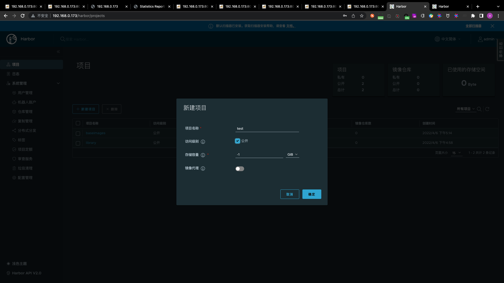

# day2-docker

## PART0. 服务器规划

### 0.1 docker-server服务器3台

|主机名|公网IP|内网IP|
|:-:|:-:|:-:|
|docker-server-1|192.168.0.173|172.16.1.173|
|docker-server-2|192.168.0.174|172.16.1.174|
|docker-server-3|192.168.0.175|172.16.1.175|

## PART1. 简介

  统称来说,容器是一种工具,指的是可以装下其它物品的工具,以方便人类归纳放置物品、存储和异地运输,具体来说比如人类使用的衣柜、行李箱、背包等可以成为容器,但今天我们所说的容器是一种IT技术.

  容器技术是虚拟化、云计算、大数据之后的一门新兴的并且是炙手可热的新技术,容器技术提高了硬件资源利用率、方便了企业的业务快速横向扩容、实现了业务宕机自愈功能,因此未来数年会是一个容器愈发流行的时代,这是一个对于IT行业来说非常有影响和价值的技术,而对于IT行业的从业者来说,熟练掌握容器技术无疑是一个很有前景的行业工作机会.
  
  
  容器技术最早出现在freebsd叫做jail.

### 1.1 docker简介

首先Docker是一个在2013年开源的应用程序并且是一个基于go语言编写的、一个开源的PAAS服务(Platform as a Service,平台即服务的缩写),go语言是由google开发,docker公司最早叫dotCloud后由于Docker开源后大受欢迎就将公司改名为Docker Inc,总部位于美国加州的旧金山,Docker是基于linux内核实现,Docker最早采用LXC技术(LinuX Container的简写,LXC是Linux原生支持的容器技术,可以提供轻量级的虚拟化,可以说docker就是基于LXC发展起来的(0.1.5(2013-04-17),提供LXC的高级封装,发展标准的配置方法),而虚拟化技术KVM(Kernel-based Virtual Machine)基于模块实现,Docker后改为自己研发并开源的runc技术运行容器(1.11.0(2016-04-13).

[项目地址](https://github.com/moby/moby)

#### 1.1.1 docker是什么

Docker相比虚拟机的交付速度更快,资源消耗更低,Docker采用客户端/服务端架构,使用远程API来管理和创建Docker容器,其可以轻松的创建一个轻量级的、可移植的、自给自足的容器,docker的三大理念是 build(构建)、ship(运输)、run(运行),Docker遵从apache 2.0协议,并通过(namespace及cgroup等)来提供容器的资源隔离与安全保障等,所以Docker容器在运行时不需要类似虚拟机(空运行的虚拟机占用物理机的一定性能开销)的额外资源开销,因此可以大幅提高资源利用率,总而言之Docker是一种用了新颖方式实现的轻量级虚拟机.类似 于VM但是在原理和应用上和VM的差别还是很大的,并且docker的专业叫法是应用容器(Application Container).

#### 1.1.2 docker的组成

[docker的组成](https://docs.docker.com/get-started/overview/#docker-architecture)

- Docker主机(Host):一个物理机或虚拟机,用于运行Docker服务进程和容器
- Docker服务端(Server):Docker守护进程,运行docker容器
- Docker客户端(Client):客户端使用docker命令或其他工具调用 docker API
- Docker仓库(Registry):保存镜像的仓库,类似于git或svn这样的版本控制系
- Docker镜像(Images):镜像可以理解为创建实例使用的模板
- Docker容器(Container):容器是从镜像生成对外提供服务的一个或一组服务.[官方仓库](https://hub.docker.com/)


#### 1.1.3 docker对比虚拟机

- 资源利用率更高:一台物理机可以运行数百个容器,但是一般只能运行数十个虚拟机
- 开销更小:不需要启动单独的虚拟机占用硬件资源
- 启动速度更快:可以在数秒内完成启动


使用虚拟机是为了更好的实现服务运行环境隔离,每个虚拟机都有独立的内核,虚拟化可以实现不同操作系统的虚拟机,但是通常一个虚拟机只运行一个服务,很明显资源利用率比较低且造成不必要的性能损耗,我们创建虚拟机的目的是为了运行应用程序,比如Nginx、PHP、Tomcat 等web程序,使用虚拟机无疑带来了一些不必要的资源开销,但是容器技术则基于减少中间运行环节带来较大的性能提升


但是,如上图一个宿主机运行了N个容器,多个容器带来的以下问题如何解决?

1. 怎么样保证每个容器都有不同的文件系统并且能互不影响?
2. 一个docker主进程内的各个容器都是其子进程,那么实现同一个主进程下不同类型的子进程? 各个进程间通信能相互访问(内存数据)吗?
3. 每个容器怎么解决IP及端口分配的问题?
4. 多个容器的主机名能一样吗?
5. 每个容器都要不要有root用户? 怎么解决账户重名问题?

#### 1.1.4 Linux Namespace技术

namespace是Linux系统的底层概念,在内核层实现,即有一些不同类型的命名空间被部署在核内,各个docker容器运行在同一个docker主进程并且共用同一个宿主机系统内核,各docker容器运行在宿主机的用户空间,每个容器都要有类似于虚拟机一样的相互隔离的运行空间,但是容器技术是在一个进程内实现运行指定服务的运行环境,并且还可以保护宿主机内核不受其他进程的干扰和影响,如文件系统空间、网络空间、进程空间等,目前主要通过以下技术实现容器运行空间的相互隔离:

|隔离类型|功能|系统调用参数|内核版本|
|:-:|:-:|:-:|:-:|
|MNT Namespace(mount)|提供磁盘挂载点和文件系统的隔离能力|CLONE_NEWNS|Linux 2.4.19|
|IPC Namespace(Inter-Process Communication)|提供进程间通信的隔离能力|CLONE_NEWIPC|Linux 2.6.19|
|UTS Namespace(UNIX Timesharing System)|提供主机名隔离能力|CLONE_NEWUTS|Linux 2.6.19|
|PID Namespace(Process Identification)|提供进程隔离能力|CLONE_NEWPID|Linux 2.6.24|
|Net Namespace(network)|提供网络隔离能力|CLONE_NEWNET|Linux 2.6.29|
|User Namespace(user)|提供用户隔离能力|CLONE_NEWUSER|Linux 3.8|


##### 1.1.4.1 MNT Namespace

每个容器都要有独立的根文件系统有独立的用户空间,以实现在容器里面启动服务并且使用容器的运行环境,即一个宿主机是ubuntu的服务器,可以在里面启动一个centos运行环境的容器并且在容器里面启动一个Nginx服务,此Nginx运行时使用的运行环境就是centos系统目录的运行环境,但是在容器里面是不能访问宿主机的资源,宿主机是使用了chroot技术把容器锁定到一个指定的运行目录里面.

例如:`/var/lib/containerd/io.containerd.runtime.v1.linux/moby/容器 ID`

##### 1.1.4.2 IPC Namespace

一个容器内的进程间通信,允许一个容器内的不同进程的(内存、缓存等)数据访问,但是不能夸容器访问其他容器的数据.


##### 1.1.4.3 UTS Namespace

UTS namespace(UNIX Timesharing System,包含了运行内核的名称、版本、底层体系结构类型等信息)用于系统标识,其中包含了hostname和域名domainname,它使得一个容器拥有属于自己的hostname标识,这个主机名标识独立于宿主机系统和其上的其他容器.

TODO:此处有验证过程

##### 1.1.4.4 PID Namespace

Linux系统中,有一个PID为1的进程(init/systemd)是其他所有进程的父进程,那么在每个容器内也要有一个父进程来管理其下属的子进程,那么多个容器的进程通PID namespace进程隔离(比如PID编号重复、器内的主进程生成与回收子进程等).

TODO:此处有试验过程


####### 1.1.4.4.1 查看宿主机上的PID信息

####### 1.1.4.4.2 查看容器中的PID信息

##### 1.1.4.5 查看宿主机的网卡信息

每一个容器都类似于虚拟机一样有自己的网卡、监听端口、TCP/IP协议栈等,Docker使用network namespace启动一个vethX接口,这样你的容器将拥有它自己的桥接ip地址,通常是docker0,而docker0实质就是Linux的虚拟网桥,网桥是在OSI七层模型的数据链路层的网络设备,通过mac地址对网络进行划分,并且在不同网络直接传递数据.


###### 1.1.4.5.1 查看宿主机的网卡信息

###### 1.1.4.5.2 查看宿主机桥接设备

###### 1.1.4.5.3 实逻辑网络图


###### 1.1.4.5.4 宿主机iptables规则

##### 1.1.4.6 User Namespace

各个容器内可能会出现重名的用户和用户组名称,或重复的用户UID或者GID,那么怎么隔离各个容器内的用户空间呢?

User Namespace允许在各个宿主机的各个容器空间内创建相同的用户名以及相同的用户UID和GID,只是会把用户的作用范围限制在每个容器内,即A容器和B容器可以有相同的用户名称和ID的账户,但是此用户的有效范围仅是当前容器内,不能访问另外一个容器内的文件系统,即相互隔离、互不影响、永不相见.

TODO:此处有验证

#### 1.1.5 Linux control groups

在一个容器,如果不对其做任何资源限制,则宿主机会允许其占用无限大的内存空间,有时候会因为代码bug程序会一直申请内存,直到把宿主机内存占完,为了避免此类的问题出现,宿主机有必要对容器进行资源分配限制,比如CPU、内存等,Linux Cgroups的全称是Linux Control Groups,它最主要的作用,就是限制一个进程组能够使用的资源上限,包括CPU、内存、磁盘、网络带宽等等.此外,还能够对进程进行优先级设置,以及将进程挂起和恢复等操作.


##### 1.1.5.1 验证系统cgroups

Cgroups,在内核层默认已经开启,从centos和ubuntu对比结果来看,显然内核较新的ubuntu支持的功能更多.

###### 1.1.5.1.1 Centos 7.6 cgroups

```
cat /etc/redhat-release
```

###### 1.1.5.1.2 ubuntu cgroups

```
root@docker-server-1:~# cat /etc/issue
Ubuntu 18.04.5 LTS \n \l
```

```
root@docker-server-1:~# uname -r
4.15.0-112-generic
```

```
root@docker-server-1:~# cat /boot/config-4.15.0-112-generic |grep CGROUP
CONFIG_CGROUPS=y
CONFIG_BLK_CGROUP=y
# CONFIG_DEBUG_BLK_CGROUP is not set
CONFIG_CGROUP_WRITEBACK=y
CONFIG_CGROUP_SCHED=y
CONFIG_CGROUP_PIDS=y
CONFIG_CGROUP_RDMA=y
CONFIG_CGROUP_FREEZER=y
CONFIG_CGROUP_HUGETLB=y
CONFIG_CGROUP_DEVICE=y
CONFIG_CGROUP_CPUACCT=y
CONFIG_CGROUP_PERF=y
CONFIG_CGROUP_BPF=y
# CONFIG_CGROUP_DEBUG is not set
CONFIG_SOCK_CGROUP_DATA=y
CONFIG_NETFILTER_XT_MATCH_CGROUP=m
CONFIG_NET_CLS_CGROUP=m
CONFIG_CGROUP_NET_PRIO=y
CONFIG_CGROUP_NET_CLASSID=y
```

###### 1.1.5.1.3 cgroups中内存模块

```
root@docker-server-1:~# cat /boot/config-4.15.0-112-generic |grep MEM |grep CG
CONFIG_MEMCG=y
CONFIG_MEMCG_SWAP=y
# CONFIG_MEMCG_SWAP_ENABLED is not set
CONFIG_SLUB_MEMCG_SYSFS_ON=y
```

###### 1.1.5.1.4 cgroups具体实现

- blkio:块设备 IO 限制
- cpu:使用调度程序为cgroup任务提供cpu的访问
- cpuacct:产生cgroup任务的cpu资源报告
- cpuset:如果是多核心的cpu,这个子系统会为cgroup任务分配单独的cpu和内存
- devices:允许或拒绝cgroup任务对设备的访问
- freezer:暂停和恢复cgroup任务
- memory:设置每个cgroup的内存限制以及产生内存资源报告
- net_cls:标记每个网络包以供cgroup方便使用
- ns:命名空间子系统
- perf_event:增加了对每group的监测跟踪的能力,可以监测属于某个特定的group的所有线程以及运行在特定CPU上的线程

###### 1.1.5.1.5 查看系统cgroups

```
root@docker-server-1:~# ll /sys/fs/cgroup/
total 0
drwxr-xr-x 15 root root 380 Mar 25 15:30 ./
drwxr-xr-x  9 root root   0 Mar 25 15:30 ../
dr-xr-xr-x  4 root root   0 Mar 25 15:30 blkio/
lrwxrwxrwx  1 root root  11 Mar 25 15:30 cpu -> cpu,cpuacct/
lrwxrwxrwx  1 root root  11 Mar 25 15:30 cpuacct -> cpu,cpuacct/
dr-xr-xr-x  4 root root   0 Mar 25 15:30 cpu,cpuacct/
dr-xr-xr-x  2 root root   0 Mar 25 15:30 cpuset/
dr-xr-xr-x  4 root root   0 Mar 25 15:30 devices/
dr-xr-xr-x  2 root root   0 Mar 25 15:30 freezer/
dr-xr-xr-x  2 root root   0 Mar 25 15:30 hugetlb/
dr-xr-xr-x  4 root root   0 Mar 25 15:30 memory/
lrwxrwxrwx  1 root root  16 Mar 25 15:30 net_cls -> net_cls,net_prio/
dr-xr-xr-x  2 root root   0 Mar 25 15:30 net_cls,net_prio/
lrwxrwxrwx  1 root root  16 Mar 25 15:30 net_prio -> net_cls,net_prio/
dr-xr-xr-x  2 root root   0 Mar 25 15:30 perf_event/
dr-xr-xr-x  4 root root   0 Mar 25 15:30 pids/
dr-xr-xr-x  2 root root   0 Mar 25 15:30 rdma/
dr-xr-xr-x  5 root root   0 Mar 25 15:30 systemd/
dr-xr-xr-x  5 root root   0 Mar 25 15:30 unified/
```

有了以上的chroot、namespace、cgroups就具备了基础的容器运行环境,但是还需要有相应的容器创建与删除的管理工具、以及怎么样把容器运行起来、容器数据怎么处理、怎么进行启动与关闭等问题需要解决,于是容器管理技术出现了.

#### 1.1.6 容器管理工具

目前主要是使用docker,早期有使用lxc.

##### 1.1.6.1 lxc

[lxc](https://linuxcontainers.org/):LXC为Linux Container的简写.可以提供轻量级的虚拟化,以便隔离进程和资源

Ubuntu安装lxc:

```
apt install lxc lxd
```

`lxc-checkconfig`:检查内核对lxc的支持情况,必须全部为lxc

`lxc-create -t 模板名称 -n 容器名称`:根据指定模板创建一个指定名称的容器

`lxc-create -t download --name alpine12 -- --dist alpine --release 3.9 --arch amd64`

- `-t`: `-t`选项后面跟的是模板,模式可以认为是一个原型,用来说明我们需要一个什么样的容器(比如容器里面需不需要有`vim`,`apache`等软件).模板实际上就是一个脚本文件(位于`/usr/share/lxc/templates`目录),我们这里指定`download`模 板(`lxc-create`会调用`lxc-download`脚本,该脚本位于刚说的模板目录中)是说明我们目前没有自己模板,需要下载官方的模板
- `--name`:容器名称
- `--`:用来说明后面的参数是传递给download脚本的,告诉脚本需要下载什么样的模板
- `--dist`:操作系统名称,指定操作系统
- `--release`:指定操作系统版本,可以是各种Linux的变种
- `--arch`:指定架构,是x86还是arm,是32位还是64位

lxc启动容器依赖于模板,比如[清华模板源](https://mirrors.tuna.tsinghua.edu.cn/help/lxc-images/).但是做模板相对较难,需要手动一步步创构建文件系统、准备基础目录及可执行程序等,而且在大规模使用容器的场景很难横向扩展,另外后期代码升级也需要重新从头构建模板,基于以上种种原因便有了docker.

##### 1.1.6.2 docker

Docker启动一个容器也需要一个外部模板用于创建镜像,docker的镜像可以保存在一个公共的地方共享使用,只要把镜像下载下来就可以使用,最主要的是可以在镜像基础之上做自定义配置并且可以再把其提交为一个镜像,一个镜像可以被启动为多个容器.

Docker的镜像是分层的,镜像底层为库文件且只读层即不能写入也不能删除数据,从镜像加载启动为一个容器后会生成一个可写层,其写入的数据会复制到容器目录,但是容器内的数据在删除容器后也会被随之删除.


##### 1.1.6.3 pouch

[pouch介绍](https://www.infoq.cn/article/alibaba-pouch)

[项目地址](https://github.com/alibaba/pouch)

#### 1.1.7 docker的优势

- 快速部署:短时间内可以部署成百上千个应用,更快速交付到线上
- 高效虚拟化:不需要额外的hypervisor支持,直接基于linux实现应用虚拟化,相比虚拟机大幅提高性能和效率
- 节省开支:提高服务器利用率,降低IT支出
- 简化配置:将运行环境打包保存至容器,使用时直接启动即可
- 快速迁移和扩展:可夸平台运行在物理机、虚拟机、公有云等环境,良好的兼容性可以方便将应用从A宿主机迁移到B宿主机,甚至是A平台迁移到B平台

#### 1.1.8 docker的缺点

- 隔离性:各应用之间的隔离不如虚拟机彻底

#### 1.1.9 docker的核心技术

##### 1.1.9.1 容器规范

容器技术除了的docker之外,还有coreOS的rkt,还有阿里的Pouch,为了保证容器生态的标准性和健康可持续发展,包括Linux基金会、Docker、微软、红帽谷歌和、IBM、等公司在2015年6月共同成立了一个叫open container(OCI)的组织,其目的就是制定开放的标准的容器规范,目前OCI一共发布了两个规范,分别是runtime spec和image format spec,有了这两个规范,不同的容器公司开发的容器只要兼容这两个规范,就可以保证容器的可移植性和相互可操作性.

###### 1.1.9.1.1 容器runtime(runtime spec)

runtime是真正运行容器的地方,因此为了运行不同的容器runtime需要和操作系统内核紧密合作相互在支持,以便为容器提供相应的运行环境.

目前主流的3种rumtime:

- Lxc:linux上早期的runtime,Docker早期就是采用lxc作为runtime
- runc:目前Docker默认的runtime,runc遵守OCI规范,因此可以兼容lxc
- rkt:是CoreOS开发的容器runtime,也符合OCI规范,所以使用rktruntime也可以运行Docker容器

runtime主要定义了以下规范,并以json格式保存在`/run/docker/runtime-runc/moby/容器ID/state.json`文件中,此文件会根据容器的状态实时更新内容:

- 版本信息:存放OCI标准的具体版本号
- 容器ID:通常是一个哈希值,可以在所有`state.json`文件中提取出容器ID对容器进行批量操作(关闭、删除等),此文件在容器关闭后会被删除,容器启动后会自动生成
- PID:在容器中运行的首个进程在宿主机上的进程号,即将宿主机的那个进程设置为容器的守护进程
- 容器文件目录:存放容器rootfs及相应配置的目录,外部程序只需读取`state.json`就可以定位到宿主机上的容器文件目录
- 容器创建:创建包括文件系统、namespaces、cgroups、用户权限在内的各项内容.
- 容器进程的启动:运行容器启动进程,该文件在`/run/containerd/io.containerd.runtime.v1.linux/moby/容器 ID/config.json`
- 容器生命周期:容器进程可以被外部程序关停,runtime规范定义了对容器操作信号的捕获,并做相应资源回收的处理,避免僵尸进程的出现

###### 1.1.9.1.2 容器镜像(image format spec)

OCI容器镜像主要包含以下内容:

- 文件系统:定义以layer保存的文件系统,在镜像里面是`layer.tar`,每个layer保存了和上层之间变化的部分,image format spec定义了layer应该保存哪些文件,怎么表示增加、修改和删除的文件等操作
- manifest文件:描述有哪些layer,tag标签及config文件名称
- config文件:是一个以hash命名的json文件,保存了镜像平台,容器运行时容器运行时需要的一些信息,比如环境变量、工作目录、命令参数等
- index文件:可选的文件,指向不同平台的manifest文件,这个文件能保证一个镜像可以跨平台使用,每个平台拥有不同的manifest文件使用index作为索引
- 父镜像:大多数层的元信息结构都包含一个parent字段,指向该镜像的父镜像
- 参数:
	- ID:镜像ID，每一层都有ID
	- tag标签:标签用于将用户指定的、具有描述性的名称对应到镜像ID
	- 仓库:Repository镜像仓库
	- os:定义类型
	- architecture:定义CPU架构
	- author:作者信息
	- create:镜像创建日期
 
##### 1.1.9.2 容器管理工具

管理工具将用户操作传递给runtime执行

- lxc是lxd的管理工具
- Runc的管理工具是docker engine,docker engine包含后台deamon和cli两部分,大家经常提到的Docker就是指的docker engine
- Rkt的管理工具是rkt cli

##### 1.1.9.3 容器定义工具

容器定义工具允许用户定义容器的属性和内容,以方便容器能够被保存、共享和重建

- Docker image:是docker容器的模,runtime依据docker image创建容器
- Dockerfile:包含N个命令的文本文件,通过dockerfile创建出 docker image
- ACI(App container image):与docker image类似,是CoreOS开发的rkt容器的镜像格式

##### 1.1.9.4 Registry

统一保存镜像而且是多个不同镜像版本的地方,叫做镜像仓库

- image registry:docker官方提供的私有仓库部署工具
- docker hub:docker官方的公共仓库,已经保存了大量的常用镜像,可以方便大家直接使用
- Harbor:vmware提供的自带web界面自带认证功能的镜像仓库,目前有很多公司使用

##### 1.1.9.5 编排工具

当多个容器在多个主机运行的时候,单独管理容器是相当复杂而且很容易出错,而且也无法实现某一台主机宕机后容器自动迁移到其他主机从而实现高可用的目的,也无法实现动态伸缩的功能,因此需要有一种工具可以实现统一管理、动态伸缩、故障自愈、批量执行等功能,这就是容器编排引擎.容器编排通常包括容器管理、调度、集群定义和服务发现等功能.

- Docker swarm:docker开发的容器编排引擎
- Kubernetes:google领导开发的容器编排引擎,内部项目为 Borg,且其同时支持docker和CoreOS
- Mesos + Marathon:通用的集群组员调度平台,mesos(资源分配)与marathon(容器编排平台)一起提供容器编排引擎功能


#### 1.1.10 docker的依赖技术

##### 1.1.10.1 容器网络

docker自带的网络docker network仅支持管理单机上的容器网络,当多主机运行的时候需要使用第三方开源网络,例如calico、flannel 等

##### 1.1.10.2 服务发现

容器的动态扩容特性决定了容器IP也会随之变化,因此需要有一种机制可以自动识别并将用户请求动态转发到新创建的容器上,kubernetes 自带服务发现功能,需要结合kube-dns服务解析内部域名

##### 1.1.10.3 容器监控

可以通过原生命令`docker ps`、`docker top`、`docker stats`查看容器运行状态,另外也可以使heapster、Prometheus等第三方监控工具监控容器的运行状态

##### 1.1.10.4 数据管理

导致其在不同的Host之间迁移,因此如何保证与容器相关的数据也能随之迁移或随时访问,可以使用逻辑卷/存储挂载等方式解决.

##### 1.1.10.5 日志收集

docker原生的日志查看工具`docker logs`,但是容器内部的日志需要通过ELK等专门的日志收集分析和展示工具进行处理

### 1.2 docker安装及基础命令介绍

[官方网址](https://www.docker.com)

系统版本选择:

Docker目前已经支持多种操作系统的安装运行,比如Ubuntu、CentOS、Redhat、Debian、Fedora,甚至是还支持了Mac和Windows,在linux系统上需要内核版本在3.10或以上,docker版本号之前一直是0.X版本或1.X版本,但是从2017年3月1号开始改为每个季度发布一次稳定版,其版本号规则也统一变更为YY.MM,例如17.09表示是2017年9月份发布的,本次演示的操作系统使用Ubuntu18.04为例.

Docker版本选择:

Docker之前没有区分版本,但是2017年初推出(将docker更名为)新的项目[Moby](https://github.com/moby/moby),Moby项目属于Docker项目的全新上游,Docker将是一个隶属于的Moby的子产品,而且之后的版本开始区分为CE版本(社区版本)和EE(企业收费版),CE社区版本和EE企业版本都是每个季度发布一个新版本,但是EE版本提供后期安全维护1年,而CE版本是4个月,本次演示的Docker版本为19.03,[官方原文](https://blog.docker.com/2017/03/docker-enterprise-edition/)如下:

Docker CE and EE are released quarterly, and CE also has a monthly “Edge” option. Each Docker EE release is supported and maintained for one year and receives security and critical bugfixes during that period. We are also improving Docker CE maintainability by maintaining each quarterly CE release for 4 months. That gets Docker CE users a new 1-month window to update from one version to the next.


与kubernetes结合使用的时候,要安装经过kubernetes官方测试通过的docker版本,避免出现不兼容等未知的及不可预估的问题发生,kubernetes测试过的docker版本可以在[github查询](https://github.com/kubernetes/kubernetes/blob/master/CHANGELOG-1.14.md#external-dependencies)

#### 1.2.1 下载rpm包安装

[Centos官方rpm包下载地址](https://download.docker.com/linux/centos/7/x86_64/stable/Packages/)

[二进制下载地址](https://download.docker.com/) 

[二进制下载地址](https://mirrors.aliyun.com/docker-ce/linux/static/stable/x86_64/)

[阿里镜像下载地址](https://mirrors.aliyun.com/docker-ce/linux/centos/7/x86_64/stable/Packages/)

#### 1.2.2 通过修改yum源安装

```
rm -rf /etc/yum.repos.d/*
wget -O /etc/yum.repos.d/CentOS-Base.repo http://mirrors.aliyun.com/repo/Centos-7.repo
wget -O /etc/yum.repos.d/epel.repo http://mirrors.aliyun.com/repo/epel-7.repo
wget -O /etc/yum.repos.d/docker-ce.repo
https://mirrors.aliyun.com/docker-ce/linux/centos/docker-ce.repo
yum install docker-ce
```

#### 1.2.3 ubuntu安装docker、启动并验证服务

- step1. 卸载之前安装的版本

	```
	root@docker-server-1:~# apt-get remove docker docker-engine docker.io containerd runc
	Reading package lists... Done
	Building dependency tree       
	Reading state information... Done
	Package 'docker-engine' is not installed, so not removed
	Package 'docker' is not installed, so not removed
	Package 'containerd' is not installed, so not removed
	Package 'docker.io' is not installed, so not removed
	Package 'runc' is not installed, so not removed
	0 upgraded, 0 newly installed, 0 to remove and 182 not upgraded.
	```

- step2. 更新并安装依赖

	- step2.1 更新

		```
		root@docker-server-1:~# apt-get update
		```

	- step2.2 安装依赖

		```
		root@docker-server-1:~# apt-get install \
		>     ca-certificates \
		>     curl \
		>     gnupg \
		>     lsb-release
		...
		Processing triggers for man-db (2.8.3-2ubuntu0.1) ...
		Processing triggers for install-info (6.5.0.dfsg.1-2) ...
		Processing triggers for libc-bin (2.27-3ubuntu1.2) ...
		Processing triggers for ca-certificates (20210119~18.04.2) ...
		Updating certificates in /etc/ssl/certs...
		0 added, 0 removed; done.
		Running hooks in /etc/ca-certificates/update.d...
		
		done.
		done.
		root@docker-server-1:~#
		```
		
- step3. 导入gpg key

```
root@docker-server-1:~# curl -fsSL https://download.docker.com/linux/ubuntu/gpg | sudo gpg --dearmor -o /usr/share/keyrings/docker-archive-keyring.gpg
```

- step4. 添加源

```
root@docker-server-1:~# echo \
>   "deb [arch=$(dpkg --print-architecture) signed-by=/usr/share/keyrings/docker-archive-keyring.gpg] https://download.docker.com/linux/ubuntu \
>   $(lsb_release -cs) stable" | sudo tee /etc/apt/sources.list.d/docker.list > /dev/null
```

- step5. 验证添加结果

```
root@docker-server-1:~# cat /etc/apt/sources.list.d/docker.list 
deb [arch=amd64 signed-by=/usr/share/keyrings/docker-archive-keyring.gpg] https://download.docker.com/linux/ubuntu   bionic stable
```

- step6. 更新以便让配置的源生效

```
root@docker-server-1:~# apt-get update
```

- step7. 验证源是否生效

```
root@docker-server-1:~# apt-cache madison docker-ce docker-ce-cli
 docker-ce | 5:20.10.14~3-0~ubuntu-bionic | https://download.docker.com/linux/ubuntu bionic/stable amd64 Packages
 docker-ce | 5:20.10.13~3-0~ubuntu-bionic | https://download.docker.com/linux/ubuntu bionic/stable amd64 Packages
 docker-ce | 5:20.10.12~3-0~ubuntu-bionic | https://download.docker.com/linux/ubuntu bionic/stable amd64 Packages
 docker-ce | 5:20.10.11~3-0~ubuntu-bionic | https://download.docker.com/linux/ubuntu bionic/stable amd64 Packages
 docker-ce | 5:20.10.10~3-0~ubuntu-bionic | https://download.docker.com/linux/ubuntu bionic/stable amd64 Packages
...
docker-ce-cli | 5:18.09.1~3-0~ubuntu-bionic | https://download.docker.com/linux/ubuntu bionic/stable amd64 Packages
docker-ce-cli | 5:18.09.0~3-0~ubuntu-bionic | https://download.docker.com/linux/ubuntu bionic/stable amd64 Packages
```

- step8. 指定安装19.03版本的docker-ce和docker-ce-cli

```
root@docker-server-1:~# apt install docker-ce=5:19.03.15~3-0~ubuntu-bionic docker-ce-cli=5:19.03.15~3-0~ubuntu-bionic
...
Processing triggers for libc-bin (2.27-3ubuntu1.2) ...
Processing triggers for systemd (237-3ubuntu10.42) ...
Processing triggers for man-db (2.8.3-2ubuntu0.1) ...
Processing triggers for ureadahead (0.100.0-21) ...
```

- step9. 验证安装结果

```
root@docker-server-1:~# docker info
Client:
 Debug Mode: false

Server:
 Containers: 0
  Running: 0
  Paused: 0
  Stopped: 0
 Images: 0
 Server Version: 19.03.15
 Storage Driver: overlay2
  Backing Filesystem: extfs
  Supports d_type: true
  Native Overlay Diff: true
 Logging Driver: json-file
 Cgroup Driver: cgroupfs
 Plugins:
  Volume: local
  Network: bridge host ipvlan macvlan null overlay
  Log: awslogs fluentd gcplogs gelf journald json-file local logentries splunk syslog
 Swarm: inactive
 Runtimes: runc
 Default Runtime: runc
 Init Binary: docker-init
 containerd version: 3df54a852345ae127d1fa3092b95168e4a88e2f8
 runc version: v1.0.3-0-gf46b6ba
 init version: fec3683
 Security Options:
  apparmor
  seccomp
   Profile: default
 Kernel Version: 4.15.0-112-generic
 Operating System: Ubuntu 18.04.5 LTS
 OSType: linux
 Architecture: x86_64
 CPUs: 1
 Total Memory: 1.947GiB
 Name: docker-server-1
 ID: QITW:W4TO:RQNZ:T42F:MZBB:4WAU:NBJF:7WYZ:6ZOL:VMTB:AUEC:XI2P
 Docker Root Dir: /var/lib/docker
 Debug Mode: false
 Registry: https://index.docker.io/v1/
 Labels:
 Experimental: false
 Insecure Registries:
  127.0.0.0/8
 Live Restore Enabled: false

WARNING: No swap limit support
```

注意:docker不支持ext3类型的磁盘分区

- step11. 设置开机自启动

```
root@docker-server-1:~# systemctl enable docker.service 
Synchronizing state of docker.service with SysV service script with /lib/systemd/systemd-sysv-install.
Executing: /lib/systemd/systemd-sysv-install enable docker
```

#### 1.2.4 验证docker版本

```
Client: Docker Engine - Community
 Version:           19.03.15
 API version:       1.40
 Go version:        go1.13.15
 Git commit:        99e3ed8919
 Built:             Sat Jan 30 03:16:51 2021
 OS/Arch:           linux/amd64
 Experimental:      false

Server: Docker Engine - Community
 Engine:
  Version:          19.03.15
  API version:      1.40 (minimum version 1.12)
  Go version:       go1.13.15
  Git commit:       99e3ed8919
  Built:            Sat Jan 30 03:15:20 2021
  OS/Arch:          linux/amd64
  Experimental:     false
 containerd:
  Version:          1.5.11
  GitCommit:        3df54a852345ae127d1fa3092b95168e4a88e2f8
 runc:
  Version:          1.0.3
  GitCommit:        v1.0.3-0-gf46b6ba
 docker-init:
  Version:          0.18.0
  GitCommit:        fec3683
```

#### 1.2.5 验证docker0网卡

在docker安装启动之后,默认会生成一个名称为docker0的网卡并且默认IP地址为172.17.0.1的网卡

```
root@docker-server-1:~# ifconfig
docker0: flags=4099<UP,BROADCAST,MULTICAST>  mtu 1500
        inet 172.17.0.1  netmask 255.255.0.0  broadcast 172.17.255.255
        ether 02:42:52:1c:79:fa  txqueuelen 0  (Ethernet)
        RX packets 0  bytes 0 (0.0 B)
        RX errors 0  dropped 0  overruns 0  frame 0
        TX packets 0  bytes 0 (0.0 B)
        TX errors 0  dropped 0 overruns 0  carrier 0  collisions 0

eth0: flags=4163<UP,BROADCAST,RUNNING,MULTICAST>  mtu 1500
        inet 192.168.0.173  netmask 255.255.255.0  broadcast 192.168.0.255
        inet6 fe80::20c:29ff:fe42:43fc  prefixlen 64  scopeid 0x20<link>
        ether 00:0c:29:42:43:fc  txqueuelen 1000  (Ethernet)
        RX packets 1757  bytes 202772 (202.7 KB)
        RX errors 0  dropped 0  overruns 0  frame 0
        TX packets 501  bytes 82076 (82.0 KB)
        TX errors 0  dropped 0 overruns 0  carrier 0  collisions 0

eth1: flags=4163<UP,BROADCAST,RUNNING,MULTICAST>  mtu 1500
        inet 172.16.1.173  netmask 255.255.255.0  broadcast 172.16.1.255
        inet6 fe80::20c:29ff:fe42:4306  prefixlen 64  scopeid 0x20<link>
        ether 00:0c:29:42:43:06  txqueuelen 1000  (Ethernet)
        RX packets 0  bytes 0 (0.0 B)
        RX errors 0  dropped 0  overruns 0  frame 0
        TX packets 17  bytes 1286 (1.2 KB)
        TX errors 0  dropped 0 overruns 0  carrier 0  collisions 0

lo: flags=73<UP,LOOPBACK,RUNNING>  mtu 65536
        inet 127.0.0.1  netmask 255.0.0.0
        inet6 ::1  prefixlen 128  scopeid 0x10<host>
        loop  txqueuelen 1000  (Local Loopback)
        RX packets 30  bytes 2646 (2.6 KB)
        RX errors 0  dropped 0  overruns 0  frame 0
        TX packets 30  bytes 2646 (2.6 KB)
        TX errors 0  dropped 0 overruns 0  carrier 0  collisions 0
```

#### 1.2.6 验证docker信息

```
root@docker-server-1:~# docker info
Client:
 Debug Mode: false

Server:
 Containers: 0 # 当前主机运行的容器总数
  Running: 0 # 当前主机正在运行的容器数量
  Paused: 0 # 当前主机处于暂停状态的容器数量
  Stopped: 0 # 当前主机处于停止状态的容器数量
 Images: 0 # 当前主机的镜像数量
 Server Version: 19.03.15 # 服务端版本
 Storage Driver: overlay2 # 正在使用的存储引擎
  Backing Filesystem: extfs # 后端文件系统,即服务器的磁盘文件系统
  Supports d_type: true # 是否支持d_type,d_type是镜像的分层功能,ext4和xfs文件系统都支持d_tpye.但docker不支持ext3
  Native Overlay Diff: true # 是否支持差异存储数据 类似于写时复制功能
 Logging Driver: json-file # 日志类型
 Cgroup Driver: cgroupfs # Cgroups类型
 Plugins: # 插件信息
  Volume: local # 数据卷
  Network: bridge host ipvlan macvlan null overlay # overlay 跨主机通信
  Log: awslogs fluentd gcplogs gelf journald json-file local logentries splunk syslog # 日志类型
 Swarm: inactive # 是否支持swarm
 Runtimes: runc # 已安装的容器运行时
 Default Runtime: runc # 默认使用的容器运行时
 Init Binary: docker-init # 初始化容器的守护进程,即pid为1的进程
 containerd version: 3df54a852345ae127d1fa3092b95168e4a88e2f8 # 容器版本
 runc version: v1.0.3-0-gf46b6ba # 运行时版本
 init version: fec3683 # init版本
 Security Options: # 安全选项
  apparmor # 安全模块,https://docs.docker.com/engine/security/apparmor/
  seccomp # 审计操作模块,https://docs.docker.com/engine/security/seccomp/
   Profile: default # 配置文件 default表示默认配置
 Kernel Version: 4.15.0-112-generic # 宿主机内核版本
 Operating System: Ubuntu 18.04.5 LTS # 宿主机操作系统
 OSType: linux # 宿主机操作系统类型
 Architecture: x86_64 # 宿主机架构
 CPUs: 1 # 宿主机 CPU 数量
 Total Memory: 1.947GiB # 宿主机总内存
 Name: docker-server-1 # 宿主机 hostname
 ID: QITW:W4TO:RQNZ:T42F:MZBB:4WAU:NBJF:7WYZ:6ZOL:VMTB:AUEC:XI2P #宿主机ID
 Docker Root Dir: /var/lib/docker # 宿主机数据保存目录,通常会放到一个独立的磁盘上
 Debug Mode: false # 是否开启debug
 Registry: https://index.docker.io/v1/ #镜像仓库
 Labels: # 其他标签
 Experimental: false # 是否测试版
 Insecure Registries:  # 非安全的镜像仓库,如果是自己搭建的镜像仓库,docker会认为是非安全的镜像仓库.必须要让docker信任自己搭建的仓库,才能从私有仓库下载镜像
  127.0.0.0/8
 Live Restore Enabled: false # 是否开启活动重启,即重启 docker-daemon不关闭容器
WARNING: No swap limit support # 系统警告信息(没有开启 swap资源限制)
```

#### 1.2.7 解决不支持swap限制警告

docker默认不支持交换分区,一种方案是需修改内核参数并重启服务器;另一种则是直接关闭交换分区.

##### 1.2.7.1 关闭交换分区的方式

通常生产环境是不开交换分区的.所以关闭交换分区是更常见的做法

- step1. 注释掉交换分区

```
root@docker-server-1:~# cat /etc/fstab
# /etc/fstab: static file system information.
#
# Use 'blkid' to print the universally unique identifier for a
# device; this may be used with UUID= as a more robust way to name devices
# that works even if disks are added and removed. See fstab(5).
#
# <file system> <mount point>   <type>  <options>       <dump>  <pass>
# / was on /dev/sda1 during installation
UUID=d35971ef-e02c-42c2-ade8-a5e808b3d0d1 /               ext4    errors=remount-ro 0       1
# /swapfile                                 none            swap    sw              0       0
/dev/fd0        /media/floppy0  auto    rw,user,noauto,exec,utf8 0       0
```

可以看到`/swapfile`(类型为swap)的分区被注释掉了

- step2. 关闭交换分区

```
root@docker-server-1:~# swapoff -a
```

##### 1.2.7.2 修改内核参数

- step1. 修改内核参数

```
root@docker-server-1:~# vim /etc/default/grub
root@docker-server-1:~# cat /etc/default/grub 
# If you change this file, run 'update-grub' afterwards to update
# /boot/grub/grub.cfg.
# For full documentation of the options in this file, see:
#   info -f grub -n 'Simple configuration'

GRUB_DEFAULT=0
GRUB_TIMEOUT_STYLE=hidden
GRUB_TIMEOUT=2
GRUB_DISTRIBUTOR=`lsb_release -i -s 2> /dev/null || echo Debian`
GRUB_CMDLINE_LINUX_DEFAULT=""
GRUB_CMDLINE_LINUX="net.ifnames=0 biosdevname=0 cgroup_enable=memory swapaccount=1"

# Uncomment to enable BadRAM filtering, modify to suit your needs
# This works with Linux (no patch required) and with any kernel that obtains
# the memory map information from GRUB (GNU Mach, kernel of FreeBSD ...)
#GRUB_BADRAM="0x01234567,0xfefefefe,0x89abcdef,0xefefefef"

# Uncomment to disable graphical terminal (grub-pc only)
#GRUB_TERMINAL=console

# The resolution used on graphical terminal
# note that you can use only modes which your graphic card supports via VBE
# you can see them in real GRUB with the command `vbeinfo'
#GRUB_GFXMODE=640x480

# Uncomment if you don't want GRUB to pass "root=UUID=xxx" parameter to Linux
#GRUB_DISABLE_LINUX_UUID=true

# Uncomment to disable generation of recovery mode menu entries
#GRUB_DISABLE_RECOVERY="true"

# Uncomment to get a beep at grub start
#GRUB_INIT_TUNE="480 440 1"
```

修改选项`GRUB_CMDLINE_LINUX`,添加2个内核参数`cgroup_enable=memory`和`swapaccount=1`

- step2. 更新grub使配置生效

```
root@docker-server-1:~# update-grub
Sourcing file `/etc/default/grub'
Generating grub configuration file ...
Found linux image: /boot/vmlinuz-4.15.0-112-generic
Found initrd image: /boot/initrd.img-4.15.0-112-generic
done
```

- step3. 重启

```
root@docker-server-1:~# reboot
```

#### 1.2.8 docker存储引擎

目前docker的默认存储引擎为overlay2,不同的存储引擎需要相应的系统支持,如需要磁盘分区的时候传递d-type文件分层功能,即需要传递内核参数开启格式化磁盘的时候的指定功能.

[历史更新信息](https://github.com/moby/moby/blob/master/CHANGELOG.md)

[官方文档关于存储引擎的选择文档](https://docs.docker.com/storage/storagedriver/select-storage-driver/)

存储驱动类型:

- AUFS:Another Union FS.是一种Union FS,是文件级的存储驱动.所谓UnionFS就是把不同物理位置的目录合并mount到同一个目录中.简单来说就是支持将不同目录挂载到同一个虚拟文件系统下的文件系统.这种文件系统可以一层一层地叠加修改文件.无论底下有多少层都是只读的,只有最上层的文件系统是可写的.当需要修改一个文件时,AUFS创建该文件的一个副本,使用CoW将文件从只读层复制到可写层进行修改,结果也保存在可写层.在Docker中,底下的只读层就是image,可写层就是Container,是Docker 18.06及更早版本的首选存储驱动程序,在内核3.13上运行Ubuntu 14.04时不支持overlay2.
- Overlay:一种Union FS文件系统,Linux内核3.18后支持
- overlay2:Overlay的升级版,到目前为止,所有Linux发行版推荐使用的存储类型
- devicemapper:是CentOS和RHEL的推荐存储驱动程序,因为之前的内核版本不支持overlay2,但是当前较新版本的CentOS和RHEL现在已经支持overlay2,因此推荐使用overlay2
-  ZFS(Sun-2005)/btrfs(Oracle-2007):目前没有广泛使用
-  vfs:用于测试环境,适用于无法使用copy-on-write文件系统的情况.此存储驱动程序的性能很差,通常不建议用于生产

Docker官方推荐首选存储引擎为overlay2,devicemapper存在使用空间方面的一些限制,虽然可以通过后期配置解决,但是官方依然推荐使用overlay2,[网上查到了部分资料](https://www.cnblogs.com/youruncloud/p/5736718.html).

##### 1.2.8.1 修改docker存储引擎

在docker.service文件中加参数修改存储引擎,但会把Docker Root Dir(即`/var/lib/docker`)格式化并重新生成,会导致数据丢失.

将ExecStart参数修改为:

```
ExecStart=/usr/bin/dockerd -H fd:// --containerd=/run/containerd/containerd.sock --storage-dirver overlay
```

然后重启docker服务即可.

实验:修改存储引擎后,下载镜像并重启,查看镜像是否还存在

- step1. 修改存储引擎

```
root@docker-server-2:/usr/local/src# vim /lib/systemd/system/docker.service 
root@docker-server-2:/usr/local/src# cat /lib/systemd/system/docker.service
...
ExecStart=/usr/bin/dockerd -H fd:// --containerd=/run/containerd/containerd.sock --storage-driver overlay
...
```

- step2. 下载镜像

```
root@docker-server-2:/usr/local/src# docker pull alpine
Using default tag: latest
latest: Pulling from library/alpine
40e059520d19: Pull complete 
Digest: sha256:f22945d45ee2eb4dd463ed5a431d9f04fcd80ca768bb1acf898d91ce51f7bf04
Status: Downloaded newer image for alpine:latest
docker.io/library/alpine:latest
```

- step3. 查看下载结果

```
root@docker-server-2:/usr/local/src# docker images
REPOSITORY          TAG                 IMAGE ID            CREATED             SIZE
alpine              latest              76c8fb57b6fc        7 hours ago         5.57MB
```

- step4. 重启docker

```
root@docker-server-2:/usr/local/src# systemctl daemon-reload
root@docker-server-2:/usr/local/src# systemctl restart docker
```

- step5. 查看镜像是否存在

```
root@docker-server-2:/usr/local/src# docker images
REPOSITORY          TAG                 IMAGE ID            CREATED             SIZE
```

##### 1.2.8.2 修改docker数据存储路径

- step1. 创建目录

```
root@docker-server-1:~# mkdir -p /data/docker
```

- step2. 修改数据保存路径

查看参数及其对应用途的方法:

```
root@docker-server-1:~# dockerd --help
```

修改service文件

```
root@docker-server-1:~# vim /lib/systemd/system/docker.service 
root@docker-server-1:~# cat /lib/systemd/system/docker.service
ExecStart=/usr/bin/dockerd -H fd:// --containerd=/run/containerd/containerd.sock --data-root /data/docker
```

可以看出这个文件会经常的被修改.所以通常会把所有的修改保存在一个文件中而非直接写入到service文件中.保存修改的文件为`/etc/docker/daemon.json`(默认没有这个文件)

- step3. 重启docker并查看docker info

重启:

```
root@docker-server-1:~# systemctl daemon-reload
root@docker-server-1:~# systemctl restart docker
```

查看结果:

```
root@docker-server-1:~# docker info|grep Dir
 Docker Root Dir: /data/docker
```

#### 1.2.9 docker服务进程

### 1.3 docker镜像加速配置

#### 1.3.1 获取加速地址

#### 1.3.2 生成配置文件

编写docker配置文件daemon.json

```
root@docker-server-1:~# vim /etc/docker/daemon.json
root@docker-server-1:~# cat /etc/docker/daemon.json
{
    "registry-mirrors": ["https://sb6xpp51.mirror.aliyuncs.com"]
}
```

本文件用于保存所有配置.

#### 1.3.3 重启docker服务

- step1. 重启服务

```
root@docker-server-1:~# systemctl restart docker
```

- step2. 查看结果

```
root@docker-server-1:~# docker info|grep -1 Mirrors
  127.0.0.0/8
 Registry Mirrors:
  https://sb6xpp51.mirror.aliyuncs.com/
```

#### 1.3.4 将所有的配置统一保存到1个文件中

将所有修改都保存到`/etc/docker/daemon.json`中:

- step1. 将修改写入到daemon.json中

```
root@docker-server-1:~# vim /etc/docker/daemon.json 
root@docker-server-1:~# cat /etc/docker/daemon.json
{
    "registry-mirrors": ["https://sb6xpp51.mirror.aliyuncs.com"],
    "storage-driver": "overlay2",
    "data-root": "/data/docker"
}
```

- step2. 重启docker

```
root@docker-server-1:~# systemctl daemon-reload
root@docker-server-1:~# systemctl restart docker
```

所有的配置也都应该写入到该文件中.

### 1.4 docker镜像管理

Docker镜像含有启动容器所需要的文件系统及所需要的内容,因此镜像主要用于创建并启动docker容器.

Docker镜像含里面是一层层文件系统,叫做Union File System(Union FS联合文件系统),2004年由纽约州立大学石溪分校开发,联合文件系统可以将多个目录挂载到一起从而形成一整个虚拟文件系统,该虚拟文件系统的目录结构就像普通linux的目录结构一样,docker通过这些文件再加上宿主机的内核提供了一个linux的虚拟环境,每一层文件系统我们叫做一层layer,联合文件系统可以对每一层文件系统设置三种权限,只读(readonly)、读写(readwrite)和写出 (whiteout-able),但是docker镜像中每一层文件系统都是只读的,构建镜像的时候,从一个最基本的操作系统开始,每个构建的操作都相当于做一层的修改,增加了一层文件系统,一层层往上叠加,上层的修改会覆盖底层该位置的可见性,这也很容易理解,就像上层把底层遮住了一样,当使用镜像的时候,我们只会看到一个完全的整体,不知道里面有几层也不需要知道里面有几层,结构如下:


一个典型的Linux文件系统由bootfs和rootfs两部分组成,bootfs(bootfilesystem)主要包含bootloader和kernel,bootloader主要用于引导加载kernel,当kernel被加载到内存中后bootfs会被umount掉,rootfs(root file system)包含的就是典型Linux系统中的`/dev`、`/proc`、`/bin`、`/etc`等标准目录和文件,下图就是docker image中最基础的两层结构,不同的 linux发行版(如ubuntu和CentOS)在rootfs这一层会有所区别.

但是docker镜像通常都比较小,官方提供的centos基础镜像在200MB 左右,一些其他版本的镜像甚至只有几MB,docker镜像直接调用宿主机的内核,镜像中只提供rootfs,也就是只需要包括最基本的命令、工具和程序库就可以了,比如alpine镜像,在5M左右.

下图就是有两个不同的镜像在一个宿主机内核上实现不同的rootfs


docker命令是最常使用的docker客户端命令,其后面可以加不同的参数以实现相应的功能,常用的命令如下:

#### 1.4.1 搜索镜像

在官方的docker仓库中搜索指定名称的docker镜像,也会有很多镜像


```
root@docker-server-1:~# docker search nginx
NAME                                              DESCRIPTION                                     STARS               OFFICIAL            AUTOMATED
nginx                                             Official build of Nginx.                        16535               [OK]                
bitnami/nginx                                     Bitnami nginx Docker Image                      120                                     [OK]
ubuntu/nginx                                      Nginx, a high-performance reverse proxy & we…   37                                      
bitnami/nginx-ingress-controller                  Bitnami Docker Image for NGINX Ingress Contr…   17                                      [OK]
rancher/nginx-ingress-controller                                                                  10                                      
ibmcom/nginx-ingress-controller                   Docker Image for IBM Cloud Private-CE (Commu…   4                                       
bitnami/nginx-ldap-auth-daemon                                                                    3                                       
bitnami/nginx-exporter                                                                            2                                       
circleci/nginx                                    This image is for internal use                  2                                       
rancher/nginx-ingress-controller-defaultbackend                                                   2                                       
vmware/nginx                                                                                      2                                       
vmware/nginx-photon                                                                               1                                       
rancher/nginx                                                                                     1                                       
bitnami/nginx-intel                                                                               1                                       
wallarm/nginx-ingress-controller                  Kubernetes Ingress Controller with Wallarm e…   0                                       
rancher/nginx-conf                                                                                0                                       
rancher/nginx-ssl                                                                                 0                                       
continuumio/nginx-ingress-ws                                                                      0                                       
ibmcom/nginx-ppc64le                              Docker image for nginx-ppc64le                  0                                       
rancher/nginx-ingress-controller-amd64                                                            0                                       
ibmcom/nginx-ingress-controller-ppc64le           Docker Image for IBM Cloud Private-CE (Commu…   0                                       
kasmweb/nginx                                     An Nginx image based off nginx:alpine and in…   0                                       
rancher/nginx-proxy                                                                               0                                       
wallarm/nginx-ingress-controller-amd64            Kubernetes Ingress Controller with Wallarm e…   0                                       
ibmcom/nginx-ingress-controller-s390x                                                             0                                                                            
root@docker-server-1:~# 
```

搜索镜像时不带版本号默认版本号为latest.

#### 1.4.2 下载镜像

从docker仓库将镜像下载到本地,命令格式为:`docker pull 仓库服务器:端口/仓库名称/镜像名称:tag`

```
root@docker-server-1:~# docker pull nginx:1.18.0-alpine
1.18.0-alpine: Pulling from library/nginx
ddad3d7c1e96: Pull complete 
c7974bc8b744: Pull complete 
d04f0a2e9201: Pull complete 
df7ae1cb4591: Pull complete 
4259d8811e1d: Pull complete 
Digest: sha256:93baf2ec1bfefd04d29eb070900dd5d79b0f79863653453397e55a5b663a6cb1
Status: Downloaded newer image for nginx:1.18.0-alpine
docker.io/library/nginx:1.18.0-alpine
```

可以看到,最终镜像的下载地址为:`docker.io/library/nginx:1.18-apline`

生产环境中的镜像地址示例:`harbor.xxx.net/repoName/imageName:ad2lp908:2022-03-30_15-00-02`

#### 1.4.3 查看本地镜像

下载完成的镜像比下载的大,因为下载完成后会解压

```
root@docker-server-1:~# docker images
REPOSITORY          TAG                 IMAGE ID            CREATED             SIZE
n56-nginx           1.18.0-alpine-v2    684dbf9f01f3        11 months ago       21.9MB
nginx               1.18.0-alpine       684dbf9f01f3        11 months ago       21.9MB
```

#### 1.4.4 镜像导出

可以将镜像从本地导出问为一个压缩文件,然后复制到其他服务器进行导入使用.

##### 1.4.4.1 导出方法1

使用`docker save`命令的`-o`参数导出

```
root@docker-server-1:~# docker save mysql:5.6.51 -o mysql-5.6.51-image.tar.gz
root@docker-server-1:~# ls
mysql-5.6.51-image.tar.gz
```

##### 1.4.4.2 导出方法2

使用`docker save`命令和重定向符导出

```
root@docker-server-1:~# docker save mysql:5.6.51 > mysql-5.6.51-image.tar.gz
```

##### 1.4.4.3 查看镜像内容

```
root@docker-server-1:~# mkdir mysql_image
root@docker-server-1:~# tar xvf mysql-5.6.51-image.tar.gz -C ./mysql_image/
01b68c61bf755e415c175ee646a06dcbedcb46fcc2cf0e4cf131ddac3306a284/
01b68c61bf755e415c175ee646a06dcbedcb46fcc2cf0e4cf131ddac3306a284/VERSION
...
root@docker-server-1:~# cd mysql_image/
root@docker-server-1:~/mysql_image# ls
01b68c61bf755e415c175ee646a06dcbedcb46fcc2cf0e4cf131ddac3306a284
232cbf3fbd28ad8076133bb999d03bbbd5c84920f591f5703768e6191875fba6
2f9c1216bfd6b0e53eacae99c0372e88de51e1a34bcb8c9d53039b7a83f52179
66d129cdcd69cd5d5ed143601a61560e4d135f7ad4ee51910fb8562a2adae55b
6aaaff74974675851c62c479ef8f58f6ef50c3349861ba06a8bad568424ab5bf
78ae412d9cfdf96fd5d9b8242c5a532919a4676a9636ba27374b1356a511499e
7a8d2d86ded94207dc55979b5c47650e5da3f2ac6d171362cb1332c822549700
8795d5c8e779905080ff0847019cd7d8d01fcf208009fdaec1bd812670b3812b
d4a364077257f585686eb8d2eb6db08be306454a16e0d9a32cb34faa0c6d3c80
d8f1bbb3b46fae7f6995c643db964bff978afa9f46c4d901bb0eb5e22e36dc86
dd3b2a5dcb48ff61113592ed5ddd762581be4387c7bc552375a2159422aa6bf5.json
f1daba93c46e3c588a4c66e8768c02d927f007f87c5cadaa850f1b086323cd7d
manifest.json
repositories
root@docker-server-1:~# 
```

`manifest.json`中包含了镜像的相关配置,包括配置文件和镜像的分层信息

```
root@docker-server-1:~/mysql_image# cat manifest.json 
[{"Config":"dd3b2a5dcb48ff61113592ed5ddd762581be4387c7bc552375a2159422aa6bf5.json","RepoTags":["mysql:5.6.51"],"Layers":["66d129cdcd69cd5d5ed143601a61560e4d135f7ad4ee51910fb8562a2adae55b/layer.tar","2f9c1216bfd6b0e53eacae99c0372e88de51e1a34bcb8c9d53039b7a83f52179/layer.tar","78ae412d9cfdf96fd5d9b8242c5a532919a4676a9636ba27374b1356a511499e/layer.tar","d4a364077257f585686eb8d2eb6db08be306454a16e0d9a32cb34faa0c6d3c80/layer.tar","232cbf3fbd28ad8076133bb999d03bbbd5c84920f591f5703768e6191875fba6/layer.tar","6aaaff74974675851c62c479ef8f58f6ef50c3349861ba06a8bad568424ab5bf/layer.tar","d8f1bbb3b46fae7f6995c643db964bff978afa9f46c4d901bb0eb5e22e36dc86/layer.tar","01b68c61bf755e415c175ee646a06dcbedcb46fcc2cf0e4cf131ddac3306a284/layer.tar","7a8d2d86ded94207dc55979b5c47650e5da3f2ac6d171362cb1332c822549700/layer.tar","8795d5c8e779905080ff0847019cd7d8d01fcf208009fdaec1bd812670b3812b/layer.tar","f1daba93c46e3c588a4c66e8768c02d927f007f87c5cadaa850f1b086323cd7d/layer.tar"]}]
```

#### 1.4.5 镜像导入

##### 1.4.5.1 导入方法1

使用`docker load`的`-i`参数导入

```
root@docker-server-2:~# docker load -i mysql-5.6.51-image.tar.gz 
2b83e5699838: Loading layer  58.51MB/58.51MB
2e1029557391: Loading layer  338.4kB/338.4kB
d414fdead0b9: Loading layer  10.46MB/10.46MB
4085e588967d: Loading layer  4.176MB/4.176MB
7ea96a4e341b: Loading layer  2.048kB/2.048kB
e3dce1c82d4e: Loading layer   41.4MB/41.4MB
2612088e90f6: Loading layer  26.11kB/26.11kB
eba393347f89: Loading layer  3.584kB/3.584kB
7c5a5c1986b1: Loading layer  192.7MB/192.7MB
49a1ca1cd2b8: Loading layer  17.92kB/17.92kB
7137327a7221: Loading layer  1.536kB/1.536kB
Loaded image: mysql:5.6.51
```

##### 1.4.5.2 导入方法2

使用`docker load`命令和重定向符导入

```
root@docker-server-2:~# docker load < mysql-5.6.51-image.tar.gz 
2b83e5699838: Loading layer  58.51MB/58.51MB
2e1029557391: Loading layer  338.4kB/338.4kB
d414fdead0b9: Loading layer  10.46MB/10.46MB
4085e588967d: Loading layer  4.176MB/4.176MB
7ea96a4e341b: Loading layer  2.048kB/2.048kB
e3dce1c82d4e: Loading layer   41.4MB/41.4MB
2612088e90f6: Loading layer  26.11kB/26.11kB
eba393347f89: Loading layer  3.584kB/3.584kB
7c5a5c1986b1: Loading layer  192.7MB/192.7MB
49a1ca1cd2b8: Loading layer  17.92kB/17.92kB
7137327a7221: Loading layer  1.536kB/1.536kB
Loaded image: mysql:5.6.51
```

##### 1.4.5.3 验证

```
root@docker-server-2:~# docker images
REPOSITORY          TAG                 IMAGE ID            CREATED             SIZE
alpine              latest              76c8fb57b6fc        36 hours ago        5.57MB
mysql               5.6.51              dd3b2a5dcb48        3 months ago        303MB
```

#### 1.4.6 删除镜像

```
root@docker-server-1:~# docker rmi alpine:latest
Untagged: alpine:latest
Untagged: alpine@sha256:21a3deaa0d32a8057914f36584b5288d2e5ecc984380bc0118285c70fa8c9300
Deleted: sha256:c059bfaa849c4d8e4aecaeb3a10c2d9b3d85f5165c66ad3a4d937758128c4d18
Deleted: sha256:8d3ac3489996423f53d6087c81180006263b79f206d3fdec9e66f0e27ceb8759
```

#### 1.4.7 对已有的镜像重新打tag

```
root@docker-server-1:~/mysql_image# docker images
REPOSITORY          TAG                 IMAGE ID            CREATED             SIZE
nginx               1.18.0-alpine       684dbf9f01f3        11 months ago       21.9MB
```

可以看到现有一个tag为`nginx:1.18.0-alpine`的镜像

修改tag:

```
root@docker-server-1:~/mysql_image# docker tag nginx:1.18.0-alpine n56-nginx:1.18.0-alpine-v2
```

验证:

```
root@docker-server-1:~/mysql_image# docker images
REPOSITORY          TAG                 IMAGE ID            CREATED             SIZE
nginx               1.18.0-alpine       684dbf9f01f3        11 months ago       21.9MB
n56-nginx           1.18.0-alpine-v2    684dbf9f01f3        11 months ago       21.9MB
```

可以看到镜像的tag改变了但镜像的ID没有变.

### 1.5 容器操作基础命令

#### 1.5.1 从镜像启动一个容器

`docker run`命令会直接进入到容器,并随机生成容器ID和名称

```
root@docker-server-1:~# docker run -it centos bash
[root@7700380feed3 /]# 
```

退出容器不注销的快捷键:`ctrl + p + q`

```
[root@7700380feed3 /]# 
root@docker-server-1:~# docker ps
CONTAINER ID        IMAGE               COMMAND             CREATED             STATUS              PORTS               NAMES
7700380feed3        centos              "bash"              35 seconds ago      Up 34 seconds                           dreamy_elgamal
```

#### 1.5.2 显示正在运行的容器

仅显示运行状态的容器:

```
root@docker-server-1:~# docker ps
CONTAINER ID        IMAGE               COMMAND             CREATED             STATUS              PORTS               NAMES
7700380feed3        centos              "bash"              3 minutes ago       Up 3 minutes                            dreamy_elgamal
```

#### 1.5.3 显示所有容器

包括当前正在运行以及已经关闭的所有容器:

```
root@docker-server-1:~# docker ps -a
CONTAINER ID        IMAGE               COMMAND             CREATED             STATUS                      PORTS               NAMES
08fdbb5fdef0        centos              "bash"              5 seconds ago       Exited (0) 3 seconds ago                        pensive_ramanujan
ec38cf3b096a        centos              "bash"              14 seconds ago      Exited (0) 12 seconds ago                       vibrant_wiles
7700380feed3        centos              "bash"              2 minutes ago       Up 2 minutes                                    dreamy_elgamal
```

#### 1.5.4 删除运行中的容器

##### 1.5.4.1 删除退出状态的容器

```
root@docker-server-1:~# docker ps -a
CONTAINER ID        IMAGE               COMMAND             CREATED              STATUS                          PORTS               NAMES
08fdbb5fdef0        centos              "bash"              About a minute ago   Exited (0) About a minute ago                       pensive_ramanujan
ec38cf3b096a        centos              "bash"              About a minute ago   Exited (0) About a minute ago                       vibrant_wiles
7700380feed3        centos              "bash"              3 minutes ago        Up 3 minutes                                        dreamy_elgamal
root@docker-server-1:~# docker rm 08fdbb5fdef0
08fdbb5fdef0
root@docker-server-1:~# docker rm ec38cf3b096a
ec38cf3b096a
```

##### 1.5.4.2 删除运行状态的容器

对于运行状态的容器,要么使用`docker rm -f`参数强制删除;要么先终止再关闭

终止运行状态的容器:

```
root@docker-server-1:~# docker stop 7700380feed3
7700380feed3
root@docker-server-1:~# docker ps -a
CONTAINER ID        IMAGE               COMMAND             CREATED             STATUS                      PORTS               NAMES
7700380feed3        centos              "bash"              6 minutes ago       Exited (0) 10 seconds ago                       dreamy_elgamal
```

删除容器:

```
root@docker-server-1:~# docker rm 7700380feed3
7700380feed3
```

##### 1.5.4.3 批量强制关闭正在运行的容器

- step1. 启动3个容器

```
root@docker-server-1:~# docker run -d nginx:1.18.0-alpine
d38a6eff24c0035abb4c713653c31be8efa086fbf9f68cdcb6124036e17807ae
root@docker-server-1:~# docker run -d nginx:1.18.0-alpine
d64cf1e894f8bc5e32a0e134dd4fbdcf98af31013a13feb5261e486b9774702e
root@docker-server-1:~# docker run -d nginx:1.18.0-alpine
27c8ed08540079408b4041fa638a8738d35cb50c975edc271477e845e1d3a1d4
```

- step2. 批量强制关闭

```
root@docker-server-1:~# docker kill $(docker ps -aq)
27c8ed085400
d64cf1e894f8
d38a6eff24c0
```

- step3. 验证

```
root@docker-server-1:~# docker ps -a
CONTAINER ID        IMAGE                 COMMAND                  CREATED              STATUS                            PORTS               NAMES
27c8ed085400        nginx:1.18.0-alpine   "/docker-entrypoint.…"   About a minute ago   Exited (137) About a minute ago                       wonderful_stonebraker
d64cf1e894f8        nginx:1.18.0-alpine   "/docker-entrypoint.…"   About a minute ago   Exited (137) About a minute ago                       goofy_shtern
d38a6eff24c0        nginx:1.18.0-alpine   "/docker-entrypoint.…"   About a minute ago   Exited (137) About a minute ago                       objective_galileo
```

##### 1.5.4.4 批量强制删除已退出的容器

```
root@docker-server-1:~# docker rm -f `docker ps -aq -f status=exited`
27c8ed085400
d64cf1e894f8
d38a6eff24c0
```

##### 1.5.4.5 批量删除所有容器

- step1. 启动6个容器,并退出其中的3个

```
root@docker-server-1:~# docker run -it centos bash
[root@12d9aa2b5d33 /]# exit
exit
root@docker-server-1:~# docker run -it centos bash
[root@75d71e651a98 /]# exit
exit
root@docker-server-1:~# docker run -it centos bash
[root@afb144cde2b4 /]# exit
exit
root@docker-server-1:~# docker ps -a
CONTAINER ID        IMAGE               COMMAND             CREATED             STATUS                     PORTS               NAMES
afb144cde2b4        centos              "bash"              4 seconds ago       Exited (0) 1 second ago                        boring_tereshkova
75d71e651a98        centos              "bash"              9 seconds ago       Exited (0) 6 seconds ago                       sad_wu
12d9aa2b5d33        centos              "bash"              12 seconds ago      Exited (0) 9 seconds ago                       vigorous_jackson
root@docker-server-1:~# docker run -d nginx:1.18.0-alpine
5c99b26dde5c1bb27076f0748de971680a0896348e779cf0051bb07d2a10c7ae
root@docker-server-1:~# docker run -d nginx:1.18.0-alpine
a39a912ee95a0dc15822c497d4006dd165a5c481a9dbf41ad710403bc15b74bd
root@docker-server-1:~# docker run -d nginx:1.18.0-alpine
e451b06479241d63beb8ffddedf140fba3f24f9e99ed78e4b712606209dc3c8b
root@docker-server-1:~# docker ps -a
CONTAINER ID        IMAGE                 COMMAND                  CREATED             STATUS                      PORTS               NAMES
e451b0647924        nginx:1.18.0-alpine   "/docker-entrypoint.…"   3 seconds ago       Up 2 seconds                80/tcp              xenodochial_yalow
a39a912ee95a        nginx:1.18.0-alpine   "/docker-entrypoint.…"   4 seconds ago       Up 3 seconds                80/tcp              happy_solomon
5c99b26dde5c        nginx:1.18.0-alpine   "/docker-entrypoint.…"   5 seconds ago       Up 4 seconds                80/tcp              suspicious_cray
afb144cde2b4        centos                "bash"                   25 seconds ago      Exited (0) 23 seconds ago                       boring_tereshkova
75d71e651a98        centos                "bash"                   30 seconds ago      Exited (0) 28 seconds ago                       sad_wu
12d9aa2b5d33        centos                "bash"                   33 seconds ago      Exited (0) 31 seconds ago                       vigorous_jackson
```

- step2. 批量删除所有容器

```
root@docker-server-1:~# docker rm -f `docker ps -aq`
e451b0647924
a39a912ee95a
5c99b26dde5c
afb144cde2b4
75d71e651a98
12d9aa2b5d33
```

- step3. 验证

```
root@docker-server-1:~# docker ps -a
CONTAINER ID        IMAGE               COMMAND             CREATED             STATUS              PORTS               NAMES
```

##### 1.5.4.6 批量终止运行状态的容器

- step1. 启动3个容器

```
root@docker-server-1:~# docker run -itd centos bash
cb91e256f0c71383e3c867362d49b534c71a72ada91d5e807ab5e2dd50d5b8cc
root@docker-server-1:~# docker run -itd centos bash
52ab07b5470813f1ff4a9ce781c4b11f055e66715227c3f01776c037b2cc50ab
root@docker-server-1:~# docker run -itd centos bash
4aff0afe588f3ed5e447de24a90e53e9a93e82de3db2caddad5aadc587d6e08a
root@docker-server-1:~# docker ps -a
CONTAINER ID        IMAGE               COMMAND             CREATED             STATUS              PORTS               NAMES
4aff0afe588f        centos              "bash"              2 seconds ago       Up 1 second                             gifted_banach
52ab07b54708        centos              "bash"              4 seconds ago       Up 3 seconds                            festive_payne
cb91e256f0c7        centos              "bash"              5 seconds ago       Up 5 seconds                            reverent_faraday
```

- step2. 批量终止

```
root@docker-server-1:~# docker stop $(docker ps -aq -f status=running)
4aff0afe588f
52ab07b54708
cb91e256f0c7
```

#### 1.5.5 随机映射端口

`docker run`命令的`-P`参数表示随机映射宿主机端口到容器

```
root@docker-server-1:~# docker run -d -P nginx:1.18.0-alpine
718ec9e306c83c971c28421978df30f7412aac78d304055fd63ae2f481a61785
root@docker-server-1:~# docker ps
CONTAINER ID        IMAGE                 COMMAND                  CREATED             STATUS              PORTS                   NAMES
718ec9e306c8        nginx:1.18.0-alpine   "/docker-entrypoint.…"   4 seconds ago       Up 3 seconds        0.0.0.0:32768->80/tcp   sweet_meninsky
```

实际上随机端口映射是从宿主机的32768端口开始映射.

```
root@docker-server-1:~# ss -tnl
State                               Recv-Q                               Send-Q                                                               Local Address:Port                                                                Peer Address:Port                               
LISTEN                              0                                    128                                                                  127.0.0.53%lo:53                                                                       0.0.0.0:*                                  
LISTEN                              0                                    128                                                                        0.0.0.0:22                                                                       0.0.0.0:*                                  
LISTEN                              0                                    128                                                                           [::]:22                                                                          [::]:*                                  
LISTEN                              0                                    128                                                                              *:32768                                                                          *:*                                 
```

#### 1.5.6 指定端口映射

##### 1.5.6.1 本地端口81映射到容器80端口

```
root@docker-server-1:~# docker run -d -p 81:80 --name nginx-test-port1 nginx:1.18.0-alpine
5e8bdd68325d088eb3108d1ed285ce11936afd4ce5981ee4c76ef661ec55a705
```

注:`--name`选项为运行的容器指定名称,但实际上该选项很少用到,因为即使不指定名称docker也会在容器运行时为该容器创建一个名称.


##### 1.5.6.2 本地IP:本地端口:容器端口

```
root@docker-server-1:~# docker run -d -p 192.168.0.173:82:80 nginx:1.18.0-alpine
48bb6fddb6722fea85a57c809c99af2b240444b3d7d22a8680d070ae01634b17
```


##### 1.5.6.3 本地IP:随机端口:容器端口

```
root@docker-server-1:~# docker run -d -p 192.168.0.173::80 nginx:1.18.0-alpine
4872eb56366b9764cf5380083e6ec7a0dfcfa6c188fa3f9e087288c4fec872bc
root@docker-server-1:~# ss -tnl
State                               Recv-Q                               Send-Q                                                               Local Address:Port                                                                Peer Address:Port                               
LISTEN                              0                                    128                                                                  192.168.0.173:32768                                                                    0.0.0.0:*                                  
LISTEN                              0                                    128                                                                  192.168.0.173:82                                                                       0.0.0.0:*                                  
LISTEN                              0                                    128                                                                  127.0.0.53%lo:53                                                                       0.0.0.0:*                                  
LISTEN                              0                                    128                                                                        0.0.0.0:22                                                                       0.0.0.0:*                                  
LISTEN                              0                                    128                                                                           [::]:22                                                                          [::]:*                   
```


##### 1.5.6.4 本地IP:本地端口:容器端口/协议

默认为tcp协议,可以指定为udp协议

```
root@docker-server-1:~# docker run -d -p 192.168.0.173:83:80/udp nginx:1.18.0-alpine
c7e53477e8cad47016da4b335a0190bc4d82db9cd8593ec9bf414eeb1456c95d
root@docker-server-1:~# ss -unl
State                               Recv-Q                               Send-Q                                                                Local Address:Port                                                               Peer Address:Port                               
UNCONN                              0                                    0                                                                     127.0.0.53%lo:53                                                                      0.0.0.0:*                                  
UNCONN                              0                                    0                                                                     192.168.0.173:83                                                                      0.0.0.0:*                                
```

##### 1.5.6.5 一次性映射多个端口+协议

```
root@docker-server-1:~# docker run -d -p 192.168.0.173:84:80 -p 443:443 -p 5300:53/udp nginx:1.18.0-alpine
638349cffe50f88c6ffc6248e3d7dc97ffb49f080119eb5283e31ed57e5af52a
```

##### 1.5.6.6 查看容器日志

###### a. 一次性查看

```
root@docker-server-1:~# docker logs 48bb6fddb672
/docker-entrypoint.sh: /docker-entrypoint.d/ is not empty, will attempt to perform configuration
/docker-entrypoint.sh: Looking for shell scripts in /docker-entrypoint.d/
/docker-entrypoint.sh: Launching /docker-entrypoint.d/10-listen-on-ipv6-by-default.sh
10-listen-on-ipv6-by-default.sh: Getting the checksum of /etc/nginx/conf.d/default.conf
10-listen-on-ipv6-by-default.sh: Enabled listen on IPv6 in /etc/nginx/conf.d/default.conf
/docker-entrypoint.sh: Launching /docker-entrypoint.d/20-envsubst-on-templates.sh
/docker-entrypoint.sh: Configuration complete; ready for start up
192.168.0.101 - - [31/Mar/2022:08:27:38 +0000] "GET / HTTP/1.1" 200 612 "-" "Mozilla/5.0 (Macintosh; Intel Mac OS X 10_15_7) AppleWebKit/537.36 (KHTML, like Gecko) Chrome/99.0.4844.84 Safari/537.36" "-"
192.168.0.101 - - [31/Mar/2022:08:27:38 +0000] "GET /favicon.ico HTTP/1.1" 404 555 "http://192.168.0.173:82/" "Mozilla/5.0 (Macintosh; Intel Mac OS X 10_15_7) AppleWebKit/537.36 (KHTML, like Gecko) Chrome/99.0.4844.84 Safari/537.36" "-"
2022/03/31 08:27:38 [error] 29#29: *1 open() "/usr/share/nginx/html/favicon.ico" failed (2: No such file or directory), client: 192.168.0.101, server: localhost, request: "GET /favicon.ico HTTP/1.1", host: "192.168.0.173:82", referrer: "http://192.168.0.173:82/"
```

###### b. 持续查看

```
root@docker-server-1:~# docker logs -f 48bb6fddb672
/docker-entrypoint.sh: /docker-entrypoint.d/ is not empty, will attempt to perform configuration
/docker-entrypoint.sh: Looking for shell scripts in /docker-entrypoint.d/
/docker-entrypoint.sh: Launching /docker-entrypoint.d/10-listen-on-ipv6-by-default.sh
10-listen-on-ipv6-by-default.sh: Getting the checksum of /etc/nginx/conf.d/default.conf
10-listen-on-ipv6-by-default.sh: Enabled listen on IPv6 in /etc/nginx/conf.d/default.conf
/docker-entrypoint.sh: Launching /docker-entrypoint.d/20-envsubst-on-templates.sh
/docker-entrypoint.sh: Configuration complete; ready for start up
192.168.0.101 - - [31/Mar/2022:08:27:38 +0000] "GET / HTTP/1.1" 200 612 "-" "Mozilla/5.0 (Macintosh; Intel Mac OS X 10_15_7) AppleWebKit/537.36 (KHTML, like Gecko) Chrome/99.0.4844.84 Safari/537.36" "-"
192.168.0.101 - - [31/Mar/2022:08:27:38 +0000] "GET /favicon.ico HTTP/1.1" 404 555 "http://192.168.0.173:82/" "Mozilla/5.0 (Macintosh; Intel Mac OS X 10_15_7) AppleWebKit/537.36 (KHTML, like Gecko) Chrome/99.0.4844.84 Safari/537.36" "-"
2022/03/31 08:27:38 [error] 29#29: *1 open() "/usr/share/nginx/html/favicon.ico" failed (2: No such file or directory), client: 192.168.0.101, server: localhost, request: "GET /favicon.ico HTTP/1.1", host: "192.168.0.173:82", referrer: "http://192.168.0.173:82/"

192.168.0.101 - - [31/Mar/2022:08:38:13 +0000] "GET / HTTP/1.1" 304 0 "-" "Mozilla/5.0 (Macintosh; Intel Mac OS X 10_15_7) AppleWebKit/537.36 (KHTML, like Gecko) Chrome/99.0.4844.84 Safari/537.36" "-"
```

#### 1.5.7 查看容器已经映射的端口

- step1. 启动容器

```
root@docker-server-1:~# docker run -d -p 192.168.0.173:84:80 -p 443:443 -p 5300:53/udp nginx:1.18.0-alpine
5f64fa4abc0bd780dd765fb9bdad43131dd2417a4feabebf04f9e2aa8c3501d6
```

- step2. 查看端口

```
root@docker-server-1:~# docker port 5f64fa4ab
443/tcp -> 0.0.0.0:443
53/udp -> 0.0.0.0:5300
80/tcp -> 192.168.0.173:84
```

#### 1.5.8 自定义容器名称

使用`docker run`命令的`--name`参数即可

#### 1.5.9 后台启动容器

使用`docker run`命令的`-d`参数即可

#### 1.5.10 创建并进入容器

```
root@docker-server-1:~# docker run -it centos /bin/bash
[root@90dd2ba85948 /]# 
```

#### 1.5.11 单次运行

使用`docker run`命令的`--rm`参数即可实现容器退出后自动删除的功能

```
root@docker-server-1:~# docker run -it --rm centos /bin/bash
[root@6c92f5ab422f /]# exit
root@docker-server-1:~# docker ps -a
CONTAINER ID        IMAGE               COMMAND             CREATED             STATUS              PORTS               NAMES
```

#### 1.5.12 传递运行命令

容器需要有一个前台运行的进程才能保持容器的运行,通过传递运行参数是一种方式,另外也可以在构建镜像时指定容器启动时运行的前台命令

```
root@docker-server-1:~# docker run -d centos /usr/bin/tail -f '/etc/hosts'
187ee87454ad9ddfb40e9a15836e5d1ba38b4c5c79b2936b2eff675cd11680ac
root@docker-server-1:~# docker ps -a
CONTAINER ID        IMAGE               COMMAND                  CREATED             STATUS              PORTS               NAMES
187ee87454ad        centos              "/usr/bin/tail -f /e…"   4 seconds ago       Up 3 seconds                            competent_haibt
```

#### 1.5.13 容器的启动和关闭

- 启动容器:`docker start`
- 终止容器:`docker stop`

#### 1.5.14 进入到正在运行的容器

##### 1.5.14.1 使用attach命令

使用`docker attach`命令可以进入到一个正在运行中的容器.该命令类似于vnc,操作会在各个容器界面显示并同步,**所有使用此方式进入容器的操作都是同步显示的且exit后容器将被关闭,不推荐使用,**需要进入到有shell环境的容器,比如centos:

- step1. 在第1个窗口启动并进入容器

```
root@docker-server-1:~# docker run -it centos bash
[root@4bf6c3582677 /]# 
```

- step2. 在第2个窗口执行`docker attach`命令

```
root@docker-server-1:~# docker attach 4bf6c3582677
[root@4bf6c3582677 /]# 
```

此时在任何一个窗口执行任何命令,另一个窗口都会同步显示,包括`exit`命令

- step3. 在窗口2执行一些命令

```
[root@4bf6c3582677 /]# ls
bin  etc   lib	  lost+found  mnt  proc  run   srv  tmp  var
dev  home  lib64  media       opt  root  sbin  sys  usr
[root@4bf6c3582677 /]# pwd
/
```

- step4. 窗口1的显示情况

```
[root@4bf6c3582677 /]# ls
bin  etc   lib	  lost+found  mnt  proc  run   srv  tmp  var
dev  home  lib64  media       opt  root  sbin  sys  usr
[root@4bf6c3582677 /]# pwd
/
```

- step5. 在窗口1退出容器

```
[root@4bf6c3582677 /]# exit
exit
```

- step5. 窗口2也同步退出容器

```
[root@4bf6c3582677 /]# exit
exit
root@docker-server-1:~# 
```

- step6. 查看容器状态

```
root@docker-server-1:~# docker ps -a
CONTAINER ID        IMAGE               COMMAND                  CREATED             STATUS                     PORTS               NAMES
4bf6c3582677        centos              "bash"                   8 minutes ago       Exited (0) 3 minutes ago                       laughing_austin
```

##### 1.5.14.2 使用exec命令

执行单次命令与进入容器,不是非常推荐这种方式,使用这种方式进入容器,exit后容器仍处于运行状态

- step1. 启动一个容器

```
root@docker-server-1:~# docker run -itd centos bash
84725246c78a2c758138a4c7a302388183c800886b8dc0d953fde0d82de60d64
```

- step2. 进入容器

```
root@docker-server-1:~# docker exec -it 84725246c7 bash
[root@84725246c78a /]# ls
bin  dev  etc  home  lib  lib64  lost+found  media  mnt  opt  proc  root  run  sbin  srv  sys  tmp  usr  var
[root@84725246c78a /]# pwd
/
```

- step3. 从容器中退出

```
[root@84725246c78a /]# exit
exit
```

- step4. 查看容器状态

```
root@docker-server-1:~# docker ps -a
CONTAINER ID        IMAGE               COMMAND             CREATED              STATUS              PORTS               NAMES
84725246c78a        centos              "bash"              About a minute ago   Up About a minute                       gracious_rosalind
```

可以看到容器仍然处于运行状态

##### 1.5.14.3 使用nsenter命令

推荐使用此方式,`nsenter`命令需要通过PID(进程ID)进入到容器内部,可以使用`docker inspect`获取容器PID.

- step1. 安装`nsenter`命令

```
root@docker-server-1:~# apt install -y util-linux
...
Processing triggers for ureadahead (0.100.0-21) ...
Processing triggers for systemd (237-3ubuntu10.42) ...
Processing triggers for man-db (2.8.3-2ubuntu0.1) ...
Processing triggers for mime-support (3.60ubuntu1) ...
root@docker-server-1:~# 
```

- step2. 启动容器并获取该容器的PID

```
root@docker-server-1:~# docker run -itd centos bash
dbddf7e8d29843acb3c339d6c31afcd1e2de4c399d1d2f803f070b44d1b9906d
root@docker-server-1:~# docker ps -a
CONTAINER ID        IMAGE               COMMAND             CREATED             STATUS              PORTS               NAMES
dbddf7e8d298        centos              "bash"              2 seconds ago       Up 1 second                             romantic_chandrasekhar
root@docker-server-1:~# docker inspect -f "{{.State.Pid}}" dbddf7e8d298
7212
```

- step3. 使用`nsenter`命令进入容器

```
root@docker-server-1:~# nsenter -t 7212 -m -u -i -n -p
[root@dbddf7e8d298 /]# ls
bin  dev  etc  home  lib  lib64  lost+found  media  mnt  opt  proc  root  run  sbin  srv  sys  tmp  usr  var
[root@dbddf7e8d298 /]# pwd
/
```

##### 1.5.14.4 脚本方式

将`nsenter`命令写入到脚本进行调用.

- step1. 编写脚本

```
root@docker-server-1:~# vim docker-in.sh
root@docker-server-1:~# cat docker-in.sh
```

```sh
#!/bin/bash
docker_in(){
	CONTAINER_ID=$1
	PID=$(docker inspect -f "{{.State.Pid}}" ${CONTAINER_ID})
	nsenter -t ${PID} -m -u -i -n -p
}

docker_in $1
```

- step2. 赋予可执行权限

```
root@docker-server-1:~# chmod a+x docker-in.sh 
```

- step3. 验证

```
root@docker-server-1:~# ./docker-in.sh dbddf7e8d298
[root@dbddf7e8d298 /]# ls
bin  dev  etc  home  lib  lib64  lost+found  media  mnt  opt  proc  root  run  sbin  srv  sys  tmp  usr  var
[root@dbddf7e8d298 /]# pwd
/
```

#### 1.5.15 查看容器内部的hosts文件

- step1. 在宿主机上查看容器的IP

```
root@docker-server-1:~# docker inspect -f "{{.NetworkSettings.IPAddress}}" dbddf7e8d298
172.17.0.2
```

- step2. 进入容器查看hosts文件

```
root@docker-server-1:~# ./docker-in.sh dbddf7e8d298
[root@dbddf7e8d298 /]# cat /etc/hosts 
127.0.0.1	localhost
::1	localhost ip6-localhost ip6-loopback
fe00::0	ip6-localnet
ff00::0	ip6-mcastprefix
ff02::1	ip6-allnodes
ff02::2	ip6-allrouters
172.17.0.2	dbddf7e8d298
```

可以看到容器默认会把实例的IP添加到自身的hosts文件中

#### 1.5.16 批量关闭正在运行的容器

见1.5.4.6小节

TODO:补链接

#### 1.5.17 批量强制关闭正在运行中的容器

见1.5.4.3小节

TODO:补链接

#### 1.5.18 批量删除已退出的容器

见1.5.4.4小节

TODO:补链接

#### 1.5.19 批量删除所有容器

见1.5.4.5小节

TODO:补链接

#### 1.5.20 指定容器DNS

DNS服务默认采用宿主机的DNS地址,通常有2种方式配置容器的DNS.

1. 将DNS地址配置在宿主机
2. 将参数配置在`docker run --dns`中,例:

```
root@docker-server-1:~# docker run -itd --dns=1.1.1.1 centos
823b7b21d36e490b0c178c73485e5729f61ad57d9ae5947dbb0b68deac43b705
```

#### 1.5.21 其他命令
- 更新容器配置信息:`docker update`
- 获取dockerd的实时事件:`docker events`

## PART2. docker镜像与制作

- Docker镜像有没有内核?

从镜像大小上面来说,一个比较小的镜像只有十几MB,而内核文件需要一百多兆,因此镜像里面是没有内核的,镜像在被启动为容器后将直接使用宿主机的内核,而镜像本身则只提供相应的rootfs,即系统正常运行所必须的用户空间的文件系统,比如`/dev/`、`/proc`、`/bin`、`/etc`等目录,所以容器当中基本是没有`/boot`目录的,而`/boot`当中保存的就是与内核相关的文件和目录.

- 为什么没有内核?

由于容器启动和运行过程中是直接使用了宿主机的内核,所以没有直接调用过物理硬件,所以也不会涉及到硬件驱动,因此也用不上内核和驱动,另外有内核的是虚拟机,而非镜像.

### 2.1 手动制作yum版nginx镜像

Docker制作镜像类似于虚拟机的模板制作,即按照公司的实际业务务求将需要安装的软件、相关配置等基础环境配置完成,然后将虚拟机再提交为模板,最后再批量从模板批量创建新的虚拟机,这样可以极大的简化业务中相同环境的虚拟机运行环境的部署工作,Docker的镜像制作分为手动制作和自动制作(基于DockerFile),企业通常都是基于Dockerfile制作镜像,其中手动制作镜像步骤具体如下:

#### 2.1.1 下载镜像并初始化系统

基于某个基础镜像之上重新制作,因此需要先有一个基础镜像,本次使用官方提供的centos镜像为基础:

```
root@docker-server-1:~# docker pull centos:7.9.2009
7.9.2009: Pulling from library/centos
2d473b07cdd5: Pull complete 
Digest: sha256:9d4bcbbb213dfd745b58be38b13b996ebb5ac315fe75711bd618426a630e0987
Status: Downloaded newer image for centos:7.9.2009
docker.io/library/centos:7.9.2009
root@docker-server-1:~# docker run -it centos:7.9.2009 bash
```

容器内更改yum源:

- step1. 下载`wget`命令

```
[root@4c1590bc4761 /]# yum install wget -y
...
Installed:
  wget.x86_64 0:1.14-18.el7_6.1                                                                                                                                                                                                               

Complete!
```

- step2. 修改`yum`源

```
[root@4c1590bc4761 /]# cd /etc/yum.repos.d/
[root@4c1590bc4761 yum.repos.d]# rm -rf ./*
[root@4c1590bc4761 yum.repos.d]# wget -O /etc/yum.repos.d/CentOS-Base.repo http://mirrors.aliyun.com/repo/Centos-7.repo
--2022-04-02 18:15:50--  http://mirrors.aliyun.com/repo/Centos-7.repo
Resolving mirrors.aliyun.com (mirrors.aliyun.com)... 111.32.130.72, 111.32.168.99, 111.32.168.98, ...
Connecting to mirrors.aliyun.com (mirrors.aliyun.com)|111.32.130.72|:80... connected.
HTTP request sent, awaiting response... 200 OK
Length: 2523 (2.5K) [application/octet-stream]
Saving to: '/etc/yum.repos.d/CentOS-Base.repo'

100%[====================================================================================================================================================================================================>] 2,523       --.-K/s   in 0.006s  

2022-04-02 18:15:51 (418 KB/s) - '/etc/yum.repos.d/CentOS-Base.repo' saved [2523/2523]

[root@4c1590bc4761 yum.repos.d]# wget -O /etc/yum.repos.d/epel.repo http://mirrors.aliyun.com/repo/epel-7.repo
--2022-04-02 18:16:21--  http://mirrors.aliyun.com/repo/epel-7.repo
Resolving mirrors.aliyun.com (mirrors.aliyun.com)... 111.32.168.96, 111.32.130.77, 111.32.168.97, ...
Connecting to mirrors.aliyun.com (mirrors.aliyun.com)|111.32.168.96|:80... connected.
HTTP request sent, awaiting response... 200 OK
Length: 664 [application/octet-stream]
Saving to: '/etc/yum.repos.d/epel.repo'

100%[====================================================================================================================================================================================================>] 664         --.-K/s   in 0s      

2022-04-02 18:16:21 (32.4 MB/s) - '/etc/yum.repos.d/epel.repo' saved [664/664]
```

#### 2.1.2 yum安装并配置nginx

```
[root@4c1590bc4761 yum.repos.d]# yum install nginx –y
...
Installed:
  nginx.x86_64 1:1.20.1-9.el7                                                                                                                                                                                                                 

Dependency Installed:
  centos-indexhtml.noarch 0:7-9.el7.centos    centos-logos.noarch 0:70.0.6-3.el7.centos    gperftools-libs.x86_64 0:2.6.1-1.el7    make.x86_64 1:3.82-24.el7    nginx-filesystem.noarch 1:1.20.1-9.el7    openssl.x86_64 1:1.0.2k-25.el7_9   
  openssl11-libs.x86_64 1:1.1.1k-2.el7       

Dependency Updated:
  openssl-libs.x86_64 1:1.0.2k-25.el7_9                                                                                                                                                                                                       

Complete!
[root@4c1590bc4761 yum.repos.d]# yum install -y vim wget pcre pcre-devel zlib zlib-devel openssl openssl-devel iproute net-tools iotop
...
Updated:
  zlib.x86_64 0:1.2.7-19.el7_9                                                                                                                                                                                                                

Dependency Updated:
  krb5-libs.x86_64 0:1.15.1-51.el7_9                                                                                                                                                                                                          

Complete!
```

#### 2.1.3 关闭nginx后台运行

```
[root@4c1590bc4761 /]# vim /etc/nginx/nginx.conf
[root@4c1590bc4761 /]# cat /etc/nginx/nginx.conf
# For more information on configuration, see:
#   * Official English Documentation: http://nginx.org/en/docs/
#   * Official Russian Documentation: http://nginx.org/ru/docs/

user nginx;
worker_processes auto;
error_log /var/log/nginx/error.log;
pid /run/nginx.pid;
# 关闭后台运行
daemon off;
...
```

此处仅添加一行`daemon off;`,无其他变更

#### 2.1.4 自定义web页面

```
[root@4c1590bc4761 /]# cd /usr/share/nginx/html/
[root@4c1590bc4761 html]# vim index.html
[root@4c1590bc4761 html]# cat index.html 
Docker Yum Nginx
```

#### 2.1.5 提交为镜像

在宿主机基于容器ID提交为镜像:

```
root@docker-server-1:~# docker ps -a
CONTAINER ID        IMAGE               COMMAND             CREATED             STATUS                            PORTS               NAMES
4c1590bc4761        centos:7.9.2009     "bash"              15 minutes ago      Exited (130) About a minute ago                       interesting_vaughan
root@docker-server-1:~# docker commit -m "nginx image" -a "40486453@qq.com" 4c1590bc4761 40486453/centos-nginx
sha256:c7bb8ccff1d7059af97a3cc0cf8022aff2afef6c1419fdc83a9f6853bb3a2a06
```

#### 2.1.6 带tag的镜像提交

提交的时候标记tag号:标记tag号,生产当中比较常用,后期可以根据tag标记创建不同版本的镜像以及创建不同版本的容器

```
root@docker-server-1:~# docker commit -m "nginx image" -a "40486453@qq.com" 4c1590bc4761 40486453/centos-nginx:v1
sha256:ac10eeb76874b223ec2df95c3ffa86e12d70f062af4718ef8f8222e4a50cf574
```

```
root@docker-server-1:~# docker images
REPOSITORY               TAG                 IMAGE ID            CREATED              SIZE
40486453/centos-nginx    v1                  ac10eeb76874        58 seconds ago       503MB
40486453/centos-nginx    latest              c7bb8ccff1d7        About a minute ago   503MB
centos                   7.9.2009            eeb6ee3f44bd        6 months ago         204MB
centos                   latest              5d0da3dc9764        6 months ago         231MB
nginx                    1.18.0-alpine       684dbf9f01f3        11 months ago        21.9MB
lorel/docker-stress-ng   latest              1ae56ccafe55        6 years ago          8.1MB
```

推送:需事前在docker hub上创建对应镜像名称的仓库

```
root@docker-server-1:~# docker login
Login with your Docker ID to push and pull images from Docker Hub. If you don't have a Docker ID, head over to https://hub.docker.com to create one.
Username: 40486453
Password: 
Login Succeeded
root@docker-server-1:~# docker push 40486453/centos-nginx:v1
The push refers to repository [docker.io/40486453/centos-nginx]
91626a6b80fc: Pushed 
174f56854903: Mounted from library/centos 
v1: digest: sha256:fafc67ce98b0e74f80ee3b9a0285b7a9ddc3940f5bceae05b3850a306b1becda size: 742
```

[镜像地址](https://hub.docker.com/repository/docker/40486453/centos-nginx)

#### 2.1.7 从自己的镜像启动容器

```
root@docker-server-1:~# docker run -d -p 80:80 40486453/centos-nginx:v1 /usr/sbin/nginx
6dfe7d862eb65d10cf0521d581a29df383d3b8d10b02d0a88e5c5e3eb19f058c
```

#### 2.1.8 访问测试


### 2.2 DockerFile制作编译版nginx1.18.0镜像

DockerFile可以说是一种可以被Docker程序解释的脚本,DockerFile是由一条条的命令组成的,每条命令对应linux下面的一条命令,Docker程序将这些DockerFile指令再翻译成真正的linux 命令,其有自己的书写方式和支持的命令,Docker程序读取DockerFile并根据指令生成Docker镜像,相比手动制作镜像的方式,DockerFile更能直观的展示镜像是怎么产生的,有了写好的各种各样DockerFile文件,当后期某个镜像有额外的需求时,只要在之前的DockerFile添加或者修改相应的操作即可重新生成新的Docker镜像,避免了重复手动制作镜像的麻烦,[官方文档](https://docs.docker.com/engine/reference/builder/)

#### 2.2.1 下载镜像并初始化系统

- 下载镜像

```
root@docker-server-1:~# docker pull centos:7.9.2009
7.9.2009: Pulling from library/centos
Digest: sha256:9d4bcbbb213dfd745b58be38b13b996ebb5ac315fe75711bd618426a630e0987
Status: Image is up to date for centos:7.9.2009
docker.io/library/centos:7.9.2009
```

- 创建Dockerfile目录

目录结构按照业务类型或系统类型等方式划分,方便后期镜像较多的时候进行分类

```
root@docker-server-1:~# cd /opt/
root@docker-server-1:/opt# mkdir -pv dockerfile/nginx
mkdir: created directory 'dockerfile'
mkdir: created directory 'dockerfile/nginx'
root@docker-server-1:/opt# cd dockerfile/nginx/
root@docker-server-1:/opt/dockerfile/nginx
root@docker-server-1:/opt/dockerfile/nginx# pwd
/opt/dockerfile/nginx
```

#### 2.2.2 编写DockerFile

Dockerfile中的nginx安装包是从[官网下载](https://nginx.org/en/download.html)的.

```
root@docker-server-1:/opt/dockerfile/nginx# vim Dockerfile 
root@docker-server-1:/opt/dockerfile/nginx# cat Dockerfile
FROM centos:7.9.2009
MAINTAINER 40486453 40486453@qq.com
RUN yum install wget -y
WORKDIR /etc/yum.repos.d/
RUN rm -rf ./*
RUN wget -O /etc/yum.repos.d/CentOS-Base.repo http://mirrors.aliyun.com/repo/Centos-7.repo
RUN wget -O /etc/yum.repos.d/epel.repo http://mirrors.aliyun.com/repo/epel-7.repo
RUN yum update -y && yum install -y vim wget tree lrzsz gcc gcc-c++ automake pcre pcre-devel zlib zlib-devel openssl openssl-devel iproute net-tools iotop
# ADD命令会自动将tar包解压缩
ADD nginx-1.18.0.tar.gz /usr/local/src/
RUN cd /usr/local/src/nginx-1.18.0 && ./configure --prefix=/usr/local/nginx && make && make install
RUN useradd nginx -s /sbin/nologin
RUN ln -sv /usr/local/nginx/sbin/nginx /usr/sbin/nginx
RUN echo "test nginx page" > /usr/local/nginx/html/index.html
# 容器对外开放的端口
EXPOSE 80 443
CMD ["nginx", "-g", "daemon off;"]
```

#### 2.2.3 准备源码包与配置文件

#### 2.2.4 执行镜像构建

```
root@docker-server-1:/opt/dockerfile/nginx# docker build -t 40486453/my-centos-nginx:v1 .
Sending build context to Docker daemon  1.043MB
Step 1/15 : FROM centos:7.9.2009
 ---> eeb6ee3f44bd
Step 2/15 : MAINTAINER 40486453 40486453@qq.com
 ---> Running in b35c78df905b
Removing intermediate container b35c78df905b
 ---> e2857f5957bd
Step 3/15 : RUN yum install wget -y
 ---> Running in 77fd3fa1c819
Loaded plugins: fastestmirror, ovl
Determining fastest mirrors
 * base: mirrors.huaweicloud.com
 * extras: mirrors.huaweicloud.com
 * updates: mirrors.163.com
Resolving Dependencies
--> Running transaction check
---> Package wget.x86_64 0:1.14-18.el7_6.1 will be installed
--> Finished Dependency Resolution
...
```

#### 2.2.5 构建完成

```
...
Step 15/15 : CMD ["nginx", "-g", "daemon off;"]
 ---> Running in aea74a20557b
Removing intermediate container aea74a20557b
 ---> 67bf0a608f8d
Successfully built 67bf0a608f8d
Successfully tagged 40486453/my-centos-nginx:v1
```

#### 2.2.6 查看是否生成本地镜像

```
root@docker-server-1:/opt/dockerfile/nginx# docker images
REPOSITORY                 TAG                 IMAGE ID            CREATED             SIZE
40486453/my-centos-nginx   v1                  67bf0a608f8d        3 minutes ago       862MB
40486453/centos-nginx      v1                  ac10eeb76874        18 hours ago        503MB
40486453/centos-nginx      latest              c7bb8ccff1d7        18 hours ago        503MB
centos                     7.9.2009            eeb6ee3f44bd        6 months ago        204MB
centos                     latest              5d0da3dc9764        6 months ago        231MB
nginx                      1.18.0-alpine       684dbf9f01f3        11 months ago       21.9MB
lorel/docker-stress-ng     latest              1ae56ccafe55        6 years ago         8.1MB
```

#### 2.2.7 从镜像启动容器

```
root@docker-server-1:/opt/dockerfile/nginx# docker run -d -p 80:80 40486453/my-centos-nginx:v1
b95301d328e5fe75c44e27def6aa19060598daeb74aedd3bd464a63d9152fff5
```

#### 2.2.8 访问web界面


#### 2.2.9 镜像编译制作过程

制作镜像过程中,需要启动一个临时的容器进行相应的指令操作,操作完成后再把此容器转换为image.在镜像编译过程中,再开启一个连接,执行`docker ps`指令即可查看到

### 2.3 手动制作编译版本nginx1.18.0镜像

过程为在centos基础镜像之上手动编译安装nginx,然后再提交为镜像.

#### 2.3.1 下载镜像并初始化系统

```
root@docker-server-1:~# docker pull centos:7.9.2009
7.9.2009: Pulling from library/centos
Digest: sha256:9d4bcbbb213dfd745b58be38b13b996ebb5ac315fe75711bd618426a630e0987
Status: Image is up to date for centos:7.9.2009
docker.io/library/centos:7.9.2009
```

```
root@docker-server-1:~# docker run -it centos:7.9.2009 bash
[root@5bde0aacdd9f /]# yum install wget -y
...
Installed:
  wget.x86_64 0:1.14-18.el7_6.1                                                                                                                                                                                                                                                 

Complete!
[root@5bde0aacdd9f /]# cd /etc/yum.repos.d/
[root@5bde0aacdd9f yum.repos.d]# rm -rf ./*
[root@5bde0aacdd9f yum.repos.d]#  wget -O /etc/yum.repos.d/CentOS-Base.repo http://mirrors.aliyun.com/repo/Centos-7.repo
...
Saving to: '/etc/yum.repos.d/CentOS-Base.repo'

100%[======================================================================================================================================================================================================================================>] 2,523       --.-K/s   in 0s      

2022-04-04 06:48:37 (65.5 MB/s) - '/etc/yum.repos.d/CentOS-Base.repo' saved [2523/2523]

[root@5bde0aacdd9f yum.repos.d]# wget -O /etc/yum.repos.d/epel.repo http://mirrors.aliyun.com/repo/epel-7.repo
Saving to: '/etc/yum.repos.d/epel.repo'

100%[======================================================================================================================================================================================================================================>] 664         --.-K/s   in 0s      

2022-04-04 06:48:45 (27.0 MB/s) - '/etc/yum.repos.d/epel.repo' saved [664/664]
```

#### 2.3.2 编译安装nginx

```
[root@5bde0aacdd9f yum.repos.d]# yum install -y vim wget tree lrzsz gcc gcc-c++ automake pcre pcre-devel zlib zlib-devel openssl openssl-devel iproute net-tools iotop
...
Installed:
  automake.noarch 0:1.13.4-3.el7      gcc.x86_64 0:4.8.5-44.el7                 gcc-c++.x86_64 0:4.8.5-44.el7      iotop.noarch 0:0.6-4.el7      iproute.x86_64 0:4.11.0-30.el7           lrzsz.x86_64 0:0.12.20-36.el7         net-tools.x86_64 0:2.0-0.25.20131004git.el7   
  openssl.x86_64 1:1.0.2k-25.el7_9    openssl-devel.x86_64 1:1.0.2k-25.el7_9    pcre-devel.x86_64 0:8.32-17.el7    tree.x86_64 0:1.6.0-10.el7    vim-enhanced.x86_64 2:7.4.629-8.el7_9    zlib-devel.x86_64 0:1.2.7-19.el7_9   

Dependency Installed:
  autoconf.noarch 0:2.69-11.el7            cpp.x86_64 0:4.8.5-44.el7                       glibc-devel.x86_64 0:2.17-325.el7_9         glibc-headers.x86_64 0:2.17-325.el7_9            gpm-libs.x86_64 0:1.20.7-6.el7             groff-base.x86_64 0:1.22.2-8.el7           
  iptables.x86_64 0:1.4.21-35.el7          kernel-headers.x86_64 0:3.10.0-1160.59.1.el7    keyutils-libs-devel.x86_64 0:1.5.8-3.el7    krb5-devel.x86_64 0:1.15.1-51.el7_9              libcom_err-devel.x86_64 0:1.42.9-19.el7    libgomp.x86_64 0:4.8.5-44.el7              
  libkadm5.x86_64 0:1.15.1-51.el7_9        libmnl.x86_64 0:1.0.3-7.el7                     libmpc.x86_64 0:1.0.1-3.el7                 libnetfilter_conntrack.x86_64 0:1.0.6-1.el7_3    libnfnetlink.x86_64 0:1.0.1-4.el7          libselinux-devel.x86_64 0:2.5-15.el7       
  libsepol-devel.x86_64 0:2.5-10.el7       libstdc++-devel.x86_64 0:4.8.5-44.el7           libverto-devel.x86_64 0:0.2.5-4.el7         m4.x86_64 0:1.4.16-10.el7                        make.x86_64 1:3.82-24.el7                  mpfr.x86_64 0:3.1.1-4.el7                  
  perl.x86_64 4:5.16.3-299.el7_9           perl-Carp.noarch 0:1.26-244.el7                 perl-Data-Dumper.x86_64 0:2.145-3.el7       perl-Encode.x86_64 0:2.51-7.el7                  perl-Exporter.noarch 0:5.68-3.el7          perl-File-Path.noarch 0:2.09-2.el7         
  perl-File-Temp.noarch 0:0.23.01-3.el7    perl-Filter.x86_64 0:1.49-3.el7                 perl-Getopt-Long.noarch 0:2.40-3.el7        perl-HTTP-Tiny.noarch 0:0.033-3.el7              perl-PathTools.x86_64 0:3.40-5.el7         perl-Pod-Escapes.noarch 1:1.04-299.el7_9   
  perl-Pod-Perldoc.noarch 0:3.20-4.el7     perl-Pod-Simple.noarch 1:3.28-4.el7             perl-Pod-Usage.noarch 0:1.63-3.el7          perl-Scalar-List-Utils.x86_64 0:1.27-248.el7     perl-Socket.x86_64 0:2.010-5.el7           perl-Storable.x86_64 0:2.45-3.el7          
  perl-Test-Harness.noarch 0:3.28-3.el7    perl-Text-ParseWords.noarch 0:3.29-4.el7        perl-Thread-Queue.noarch 0:3.02-2.el7       perl-Time-HiRes.x86_64 4:1.9725-3.el7            perl-Time-Local.noarch 0:1.2300-2.el7      perl-constant.noarch 0:1.27-2.el7          
  perl-libs.x86_64 4:5.16.3-299.el7_9      perl-macros.x86_64 4:5.16.3-299.el7_9           perl-parent.noarch 1:0.225-244.el7          perl-podlators.noarch 0:2.5.1-3.el7              perl-threads.x86_64 0:1.87-4.el7           perl-threads-shared.x86_64 0:1.43-6.el7    
  vim-common.x86_64 2:7.4.629-8.el7_9      vim-filesystem.x86_64 2:7.4.629-8.el7_9         which.x86_64 0:2.20-7.el7                  

Updated:
  zlib.x86_64 0:1.2.7-19.el7_9                                                                                                                                                                                                                                                  

Dependency Updated:
  glibc.x86_64 0:2.17-325.el7_9                                 glibc-common.x86_64 0:2.17-325.el7_9                                 krb5-libs.x86_64 0:1.15.1-51.el7_9                                 openssl-libs.x86_64 1:1.0.2k-25.el7_9                                

Complete!
[root@5bde0aacdd9f yum.repos.d]# cd /usr/local/src/
[root@5bde0aacdd9f src]# wget http://nginx.org/download/nginx-1.18.0.tar.gz
...
2022-04-04 06:52:21 (248 KB/s) - 'nginx-1.18.0.tar.gz' saved [1039530/1039530]
[root@5bde0aacdd9f src]# tar xvf nginx-1.18.0.tar.gz
[root@5bde0aacdd9f src]# cd nginx-1.18.0
[root@5bde0aacdd9f nginx-1.18.0]# ./configure --prefix=/apps/nginx
...
Configuration summary
  + using system PCRE library
  + OpenSSL library is not used
  + using system zlib library

  nginx path prefix: "/apps/nginx"
  nginx binary file: "/apps/nginx/sbin/nginx"
  nginx modules path: "/apps/nginx/modules"
  nginx configuration prefix: "/apps/nginx/conf"
  nginx configuration file: "/apps/nginx/conf/nginx.conf"
  nginx pid file: "/apps/nginx/logs/nginx.pid"
  nginx error log file: "/apps/nginx/logs/error.log"
  nginx http access log file: "/apps/nginx/logs/access.log"
  nginx http client request body temporary files: "client_body_temp"
  nginx http proxy temporary files: "proxy_temp"
  nginx http fastcgi temporary files: "fastcgi_temp"
  nginx http uwsgi temporary files: "uwsgi_temp"
  nginx http scgi temporary files: "scgi_temp"
[root@5bde0aacdd9f nginx-1.18.0]# make && make install
...
make[1]: Leaving directory `/usr/local/src/nginx-1.18.0'
[root@5bde0aacdd9f nginx-1.18.0]# cd /apps/nginx/
```

#### 2.3.3 关闭nginx后台运行

```
[root@5bde0aacdd9f nginx]# vim /apps/nginx/conf/nginx.conf
[root@5bde0aacdd9f nginx]# cat /apps/nginx/conf/nginx.conf

user  nginx;
worker_processes  1;
daemon off;
...
```

此处仅添加了一行`daemon off;`,并将`user`修改为了`nginx`,无其他改动.

```
[root@5bde0aacdd9f nginx]# ln -sv /apps/nginx/sbin/nginx /usr/sbin/nginx
'/usr/sbin/nginx' -> '/apps/nginx/sbin/nginx'
```

#### 2.3.4 自定义web界面

```
[root@5bde0aacdd9f html]# echo "my-nginx-test-page" > /apps/nginx/html/index.html 
[root@5bde0aacdd9f html]# cat /apps/nginx/html/index.html
my-nginx-test-page
```

#### 2.3.5 创建用户及授权

```
[root@5bde0aacdd9f html]# useradd -u 2019 nginx -s /sbin/nologin
[root@5bde0aacdd9f html]# chown -R nginx.nginx /usr/sbin/nginx  
```

#### 2.3.6 在宿主机提交为镜像

```
[root@5bde0aacdd9f html]# exit
root@docker-server-1:~# docker ps -a
CONTAINER ID        IMAGE                         COMMAND                  CREATED             STATUS                      PORTS               NAMES
5bde0aacdd9f        centos:7.9.2009               "bash"                   15 minutes ago      Exited (0) 5 seconds ago                        serene_blackburn
ff5a474dcfb4        centos:7.9.2009               "bash"                   16 minutes ago      Exited (1) 15 minutes ago                       serene_beaver
b95301d328e5        40486453/my-centos-nginx:v1   "nginx -g 'daemon of…"   19 hours ago        Exited (0) 15 minutes ago                       blissful_lamport
root@docker-server-1:~# docker commit -m "my test nginx" 5bde0aacdd9f 40486453/my-test-nginx:v1
sha256:4686c88169a699924a1d976a9a94b6892c22c00efe55da6bd096b3ea82838ebf
```

#### 2.3.7 从自己的镜像启动容器

```
root@docker-server-1:~# docker run -d -p 80:80 40486453/my-test-nginx:v1 /usr/sbin/nginx
0e8363821502194d9c2850bae2422fe5f06fc21e12d0b4b38aa9c495656f216d
```

#### 2.3.8 访问测试


#### 2.3.9 查看Nginx访问日志

```
root@docker-server-1:~# docker exec -it 0e83638215 bash
[root@0e8363821502 /]# tail -f /apps/nginx/logs/access.log 
192.168.0.101 - - [04/Apr/2022:07:05:05 +0000] "GET / HTTP/1.1" 200 19 "-" "Mozilla/5.0 (Macintosh; Intel Mac OS X 10_15_7) AppleWebKit/537.36 (KHTML, like Gecko) Chrome/99.0.4844.84 Safari/537.36"
192.168.0.101 - - [04/Apr/2022:07:07:44 +0000] "GET / HTTP/1.1" 304 0 "-" "Mozilla/5.0 (Macintosh; Intel Mac OS X 10_15_7) AppleWebKit/537.36 (KHTML, like Gecko) Chrome/99.0.4844.84 Safari/537.36"
```

### 2.4 自定义Tomcat业务镜像

基于官方提供的centos、debain、ubuntu、alpine等基础镜像构建 JDK(Java 环境),然后再基于自定义的JDK镜像构建出业务需要的tomcat镜像.

#### 2.4.1 构建JDK镜像

先基于官方提供的基础镜像,制作出安装了常用命令的自定义基础镜像,然后在基础镜像的基础之上,再制作JDK镜像、Tomcat镜像等.

##### 2.4.1.1 自定义Centos基础镜像

```
root@docker-server-1:~# mkdir -pv /opt/dockerfile/system/centos
mkdir: created directory '/opt/dockerfile/system'
mkdir: created directory '/opt/dockerfile/system/centos'
root@docker-server-1:~# cd /opt/dockerfile/system/centos/
root@docker-server-1:/opt/dockerfile/system/centos# vim Dockerfile
root@docker-server-1:/opt/dockerfile/system/centos# cat Dockerfile 
# Centos Base Image
FROM centos:7.9.2009
MAINTAINER 40486453 40486453@qq.com
RUN rpm -ivh http://mirrors.aliyun.com/epel/epel-release-latest-7.noarch.rpm
RUN yum install -y vim wget tree lrzsz gcc gcc-c++ automake pcre pcre-devel zlib zlib-devel openssl openssl-devel iproute net-tools iotop
RUN groupadd www -g 2020 && useradd www -u 2020 -g www
root@docker-server-1:/opt/dockerfile/system/centos# docker build -t centos-base:v1 .
Sending build context to Docker daemon  2.048kB
Step 1/5 : FROM centos:7.9.2009
 ---> eeb6ee3f44bd
Step 2/5 : MAINTAINER 40486453 40486453@qq.com
 ---> Using cache
 ---> e2857f5957bd
Step 3/5 : RUN rpm -ivh http://mirrors.aliyun.com/epel/epel-release-latest-7.noarch.rpm
 ---> Running in f009b5a383cf
warning: /var/tmp/rpm-tmp.5f87FX: Header V4 RSA/SHA256 Signature, key ID 352c64e5: NOKEY
Retrieving http://mirrors.aliyun.com/epel/epel-release-latest-7.noarch.rpm
...
Step 5/5 : RUN groupadd www -g 2020 && useradd www -u 2020 -g www
 ---> Running in d68331c2b93c
Removing intermediate container d68331c2b93c
 ---> a8e4721ef38a
Successfully built a8e4721ef38a
Successfully tagged centos-base:v1
```

##### 2.4.1.2 执行构建JDK镜像

```
root@docker-server-1:/# mkdir -pv /opt/dockerfile/jdk
mkdir: created directory '/opt/dockerfile/jdk'
```

```
root@docker-server-1:/opt/dockerfile/jdk# vim Dockerfile 
root@docker-server-1:/opt/dockerfile/jdk# cat Dockerfile
FROM centos-base:v1
MAINTAINER 40486453 40486453@qq.com
ADD jdk-8u212-linux-x64.tar.gz /usr/local/src/
RUN ln -sv /usr/local/src/jdk1.8.0_212 /usr/local/jdk
ENV JAVA_HOME /usr/local/jdk
ENV JRE_HOME $JAVA_HOME/jre
ENV CLASSPATH $JAVA_HOME/lib/:$JRE_HOME/lib/ 
ENV PATH $PATH:$JAVA_HOME/bin
RUN rm -rf /etc/localtime && ln -snf /usr/share/zoneinfo/Asia/Shanghai /etc/localtime
```

##### 2.4.1.3 上传JDK压缩包和profile文件

将[JDK压缩包](https://www.oracle.com/java/technologies/javase/javase8u211-later-archive-downloads.html#license-lightbox)上传到Dockerfile当前目录,然后执行构建:

```
[root@dc93f3f48f7d etc]# cat profile
# /etc/profile

# System wide environment and startup programs, for login setup
# Functions and aliases go in /etc/bashrc

# It's NOT a good idea to change this file unless you know what you
# are doing. It's much better to create a custom.sh shell script in
# /etc/profile.d/ to make custom changes to your environment, as this
# will prevent the need for merging in future updates.

pathmunge () {
    case ":${PATH}:" in
        *:"$1":*)
            ;;
        *)
            if [ "$2" = "after" ] ; then
                PATH=$PATH:$1
            else
                PATH=$1:$PATH
            fi
    esac
}


if [ -x /usr/bin/id ]; then
    if [ -z "$EUID" ]; then
        # ksh workaround
        EUID=`/usr/bin/id -u`
        UID=`/usr/bin/id -ru`
    fi
    USER="`/usr/bin/id -un`"
    LOGNAME=$USER
    MAIL="/var/spool/mail/$USER"
fi

# Path manipulation
if [ "$EUID" = "0" ]; then
    pathmunge /usr/sbin
    pathmunge /usr/local/sbin
else
    pathmunge /usr/local/sbin after
    pathmunge /usr/sbin after
fi

HOSTNAME=`/usr/bin/hostname 2>/dev/null`
HISTSIZE=1000
if [ "$HISTCONTROL" = "ignorespace" ] ; then
    export HISTCONTROL=ignoreboth
else
    export HISTCONTROL=ignoredups
fi

export PATH USER LOGNAME MAIL HOSTNAME HISTSIZE HISTCONTROL

# By default, we want umask to get set. This sets it for login shell
# Current threshold for system reserved uid/gids is 200
# You could check uidgid reservation validity in
# /usr/share/doc/setup-*/uidgid file
if [ $UID -gt 199 ] && [ "`/usr/bin/id -gn`" = "`/usr/bin/id -un`" ]; then
    umask 002
else
    umask 022
fi

for i in /etc/profile.d/*.sh /etc/profile.d/sh.local ; do
    if [ -r "$i" ]; then
        if [ "${-#*i}" != "$-" ]; then 
            . "$i"
        else
            . "$i" >/dev/null
        fi
    fi
done

unset i
unset -f pathmunge
```

##### 2.4.1.4 执行构建自定义JDK基础镜像

```
root@docker-server-1:/opt/dockerfile/jdk# docker build -t jdk-base:v8.212 .
Sending build context to Docker daemon    195MB
Step 1/9 : FROM centos-base:v1
 ---> a8e4721ef38a
Step 2/9 : MAINTAINER 40486453 40486453@qq.com
 ---> Using cache
 ---> 204f665a423c
Step 3/9 : ADD jdk-8u212-linux-x64.tar.gz /usr/local/src/
 ---> Using cache
 ---> 5475a6e4245c
Step 4/9 : RUN ln -sv /usr/local/src/jdk1.8.0_212 /usr/local/jdk
 ---> Using cache
 ---> 94433e9dc9f8
Step 5/9 : ENV JAVA_HOME /usr/local/jdk
 ---> Running in eed89783fe86
Removing intermediate container eed89783fe86
 ---> e5dd57d0f520
Step 6/9 : ENV JRE_HOME $JAVA_HOME/jre
 ---> Running in fd830ac8d146
Removing intermediate container fd830ac8d146
 ---> 56e99e84903d
Step 7/9 : ENV CLASSPATH $JAVA_HOME/lib/:$JRE_HOME/lib/
 ---> Running in 78de93a67e45
Removing intermediate container 78de93a67e45
 ---> 50b831afe89e
Step 8/9 : ENV PATH $PATH:$JAVA_HOME/bin
 ---> Running in 41a0d6883090
Removing intermediate container 41a0d6883090
 ---> dee93a7a614e
Step 9/9 : RUN rm -rf /etc/localtime && ln -snf /usr/share/zoneinfo/Asia/Shanghai /etc/localtime
 ---> Running in 58c9ac7e95ef
Removing intermediate container 58c9ac7e95ef
 ---> 6ab964b2f375
Successfully built 6ab964b2f375
Successfully tagged jdk-base:v8.212
```

##### 2.4.1.5 验证镜像构建完成

```
root@docker-server-1:/opt/dockerfile/jdk# docker images
REPOSITORY                 TAG                 IMAGE ID            CREATED              SIZE
jdk-base                   v8.212              6ab964b2f375        About a minute ago   1.01GB
centos-base                v1                  a8e4721ef38a        37 minutes ago       601MB
40486453/my-test-nginx     v1                  4686c88169a6        About an hour ago    600MB
40486453/my-centos-nginx   v1                  67bf0a608f8d        20 hours ago         862MB
40486453/centos-nginx      v1                  ac10eeb76874        38 hours ago         503MB
40486453/centos-nginx      latest              c7bb8ccff1d7        38 hours ago         503MB
centos                     7.9.2009            eeb6ee3f44bd        6 months ago         204MB
centos                     latest              5d0da3dc9764        6 months ago         231MB
nginx                      1.18.0-alpine       684dbf9f01f3        11 months ago        21.9MB
lorel/docker-stress-ng     latest              1ae56ccafe55        6 years ago          8.1MB
```

##### 2.4.1.6 验证镜像JDK环境

```
root@docker-server-1:/opt/dockerfile/jdk# docker run -it --rm jdk-base:v8.212 bash
[root@9d3ecdbad9f3 /]# java -version
java version "1.8.0_212"
Java(TM) SE Runtime Environment (build 1.8.0_212-b10)
Java HotSpot(TM) 64-Bit Server VM (build 25.212-b10, mixed mode)
```

#### 2.4.2 从JDK镜像构建tomcat 8 Base镜像

基于自定义的JDK基础镜像,构建出通用的自定义Tomcat基础镜像,此镜像后期会被多个业务的多个服务共同引用(相同的JDK版本和Tomcat版本).

##### 2.4.2.1 编辑Dockerfile

```
root@docker-server-1:/# mkdir -pv /opt/dockerfile/tomcat/tomcat-base
mkdir: created directory '/opt/dockerfile/tomcat'
mkdir: created directory '/opt/dockerfile/tomcat/tomcat-base'
root@docker-server-1:/# cd /opt/dockerfile/tomcat/tomcat-base
```

```
root@docker-server-1:/opt/dockerfile/tomcat/tomcat-base# vim Dockerfile
root@docker-server-1:/opt/dockerfile/tomcat/tomcat-base# cat Dockerfile
# Tomcat Base Image
FROM jdk-base:v8.212

# env
ENV TZ "Asia/Shanghai"
ENV LANG en_US.UTF-8
ENV TERM xterm
ENV TOMCAT_MAJOR_VERSION 8
ENV TOMCAT_MINOR_VERSION 8.5.45
ENV CATALINA_HOME /apps/tomcat
ENV APP_DIR ${CATALINA_HOME}/webapps

#tomcat
RUN mkdir /apps
ADD apache-tomcat-8.5.45.tar.gz /apps
RUN ln -sv /apps/apache-tomcat-8.5.45 /apps/tomcat
```

##### 2.4.2.2 上传tomcat压缩包

[tomcat8.5.45压缩包下载地址](https://archive.apache.org/dist/tomcat/tomcat-8/v8.5.45/bin/apache-tomcat-8.5.45.tar.gz)

##### 2.4.2.3 构建镜像

```
root@docker-server-1:/opt/dockerfile/tomcat/tomcat-base# docker build -t tomcat-base:v8.5.45 .
Sending build context to Docker daemon  9.725MB
Step 1/11 : FROM jdk-base:v8.212
 ---> 6ab964b2f375
Step 2/11 : ENV TZ "Asia/Shanghai"
 ---> Running in 5204cdf1a0d4
Removing intermediate container 5204cdf1a0d4
 ---> d91b3fc981f7
Step 3/11 : ENV LANG en_US.UTF-8
 ---> Running in 4b071476f452
Removing intermediate container 4b071476f452
 ---> 17ecabe6f74c
Step 4/11 : ENV TERM xterm
 ---> Running in 1060891fd0db
Removing intermediate container 1060891fd0db
 ---> d1aff30c81d2
Step 5/11 : ENV TOMCAT_MAJOR_VERSION 8
 ---> Running in bfcfc196c7cd
Removing intermediate container bfcfc196c7cd
 ---> a81e6af7bc2a
Step 6/11 : ENV TOMCAT_MINOR_VERSION 8.5.45
 ---> Running in b4d1d44467c4
Removing intermediate container b4d1d44467c4
 ---> 919a6faadf54
Step 7/11 : ENV CATALINA_HOME /apps/tomcat
 ---> Running in 3a31501189a1
Removing intermediate container 3a31501189a1
 ---> 521777addbea
Step 8/11 : ENV APP_DIR ${CATALINA_HOME}/webapps
 ---> Running in cb79a8565b07
Removing intermediate container cb79a8565b07
 ---> 512ea3f621a0
Step 9/11 : RUN mkdir /apps
 ---> Running in 306384a3b8ae
Removing intermediate container 306384a3b8ae
 ---> 5eaaa0c2b63e
Step 10/11 : ADD apache-tomcat-8.5.45.tar.gz /apps
 ---> 603b1de985dd
Step 11/11 : RUN ln -sv /apps/apache-tomcat-8.5.45 /apps/tomcat
 ---> Running in 8e645656dd10
‘/apps/tomcat’ -> ‘/apps/apache-tomcat-8.5.45’
Removing intermediate container 8e645656dd10
 ---> 96910e038c3a
Successfully built 96910e038c3a
Successfully tagged tomcat-base:v8.5.45
```

##### 2.4.2.4 验证镜像构建完成

```
root@docker-server-1:/opt/dockerfile/tomcat/tomcat-base# docker images
REPOSITORY                 TAG                 IMAGE ID            CREATED             SIZE
tomcat-base                v8.5.45             96910e038c3a        33 seconds ago      1.02GB
jdk-base                   v8.212              6ab964b2f375        18 minutes ago      1.01GB
centos-base                v1                  a8e4721ef38a        53 minutes ago      601MB
40486453/my-test-nginx     v1                  4686c88169a6        About an hour ago   600MB
40486453/my-centos-nginx   v1                  67bf0a608f8d        20 hours ago        862MB
40486453/centos-nginx      v1                  ac10eeb76874        38 hours ago        503MB
40486453/centos-nginx      latest              c7bb8ccff1d7        38 hours ago        503MB
centos                     7.9.2009            eeb6ee3f44bd        6 months ago        204MB
centos                     latest              5d0da3dc9764        6 months ago        231MB
nginx                      1.18.0-alpine       684dbf9f01f3        11 months ago       21.9MB
lorel/docker-stress-ng     latest              1ae56ccafe55        6 years ago         8.1MB
```

#### 2.4.3 构建业务镜像1

创建tomcat app1和tomcat app2两个目录,表示基于tomcat自定义基础镜像构建出不同业务的tomcat app镜像.

##### 2.4.3.1 准备Dockerfile

```
root@docker-server-1:/# mkdir -pv /opt/dockerfile/tomcat/tomcat-app1
mkdir: created directory '/opt/dockerfile/tomcat/tomcat-app1'
root@docker-server-1:/# cd /opt/dockerfile/tomcat/tomcat-app1
root@docker-server-1:/opt/dockerfile/tomcat/tomcat-app1# vim Dockerfile
root@docker-server-1:/opt/dockerfile/tomcat/tomcat-app1# cat Dockerfile 
# Tomcat Web Image
FROM tomcat-base:v8.5.45

ADD run_tomcat.sh /apps/tomcat/bin/run_tomcat.sh 
ADD myapp/* /apps/tomcat/webapps/ROOT/
RUN rm -f /apps/tomcat/webapps/ROOT/index.jsp

RUN chown -R www.www /apps/

EXPOSE 8080 8009

CMD ["/apps/tomcat/bin/run_tomcat.sh"]
```

##### 2.4.3.2 准备自定义myapp页面

```
root@docker-server-1:/opt/dockerfile/tomcat/tomcat-app1# mkdir myapp
root@docker-server-1:/opt/dockerfile/tomcat/tomcat-app1# echo "Tomcat Web Page" > myapp/index.html
root@docker-server-1:/opt/dockerfile/tomcat/tomcat-app1# cat myapp/index.html 
Tomcat Web Page
```

##### 2.4.3.3 准备容器启动执行脚本

```
root@docker-server-1:/opt/dockerfile/tomcat/tomcat-app1# vim run_tomcat.sh 
root@docker-server-1:/opt/dockerfile/tomcat/tomcat-app1# cat run_tomcat.sh
#!/bin/bash
echo "1.1.1.1 abc.test.com" >> /etc/hosts
echo "nameserver 223.5.5.5" > /etc/resolv.conf
/apps/tomcat/bin/catalina.sh start
tail -f /etc/hosts
```

##### 2.4.3.4 构建镜像

```
root@docker-server-1:/opt/dockerfile/tomcat/tomcat-app1# chmod a+x *.sh
root@docker-server-1:/opt/dockerfile/tomcat/tomcat-app1# docker build -t tomcat-web:app1 .
Sending build context to Docker daemon  4.608kB
Step 1/7 : FROM tomcat-base:v8.5.45
 ---> 96910e038c3a
Step 2/7 : ADD run_tomcat.sh /apps/tomcat/bin/run_tomcat.sh
 ---> Using cache
 ---> 28ee1a6364fa
Step 3/7 : ADD myapp/* /apps/tomcat/webapps/ROOT/
 ---> 438175620461
Step 4/7 : RUN rm -f /apps/tomcat/webapps/ROOT/index.jsp
 ---> Running in cf96f7e6e996
Removing intermediate container cf96f7e6e996
 ---> 94ec8ae46d90
Step 5/7 : RUN chown -R www.www /apps/
 ---> Running in cbf84d14cb3c
Removing intermediate container cbf84d14cb3c
 ---> f60b2701d234
Step 6/7 : EXPOSE 8080 8009
 ---> Running in cab9eaeb37d5
Removing intermediate container cab9eaeb37d5
 ---> c00a70ed3781
Step 7/7 : CMD ["/apps/tomcat/bin/run_tomcat.sh"]
 ---> Running in 49549ee2a057
Removing intermediate container 49549ee2a057
 ---> babd3cfb1b20
Successfully built babd3cfb1b20
Successfully tagged tomcat-web:app1
```

##### 2.4.3.5 测试

```
root@docker-server-1:/opt/dockerfile/tomcat/tomcat-app1# docker run -d --rm -p 8081:8080 tomcat-web:app1
71568de137ae143ea19ba5ca05213c50815525b49973841b594a80cef86229a5
```

##### 2.4.3.6 访问测试


#### 2.4.4 构建业务镜像2

第2个tomcat服务镜像

##### 2.4.4.1 准备Dockerfime

```
root@docker-server-1:/opt/dockerfile/tomcat# mkdir -pv /opt/dockerfile/tomcat/tomcat-app2
mkdir: created directory '/opt/dockerfile/tomcat/tomcat-app2'
root@docker-server-1:/opt/dockerfile/tomcat/tomcat-app2# vim Dockerfile
root@docker-server-1:/opt/dockerfile/tomcat/tomcat-app2# cat Dockerfile
# Tomcat Web Image
FROM tomcat-base:v8.5.45

ADD run_tomcat.sh /apps/tomcat/bin/run_tomcat.sh 
ADD myapp/* /apps/tomcat/webapps/ROOT/
RUN rm -f /apps/tomcat/webapps/ROOT/index.jsp

RUN chown -R www.www /apps/

EXPOSE 8080 8009

CMD ["/apps/tomcat/bin/run_tomcat.sh"]
```

##### 2.4.4.2 准备自定义页面

```
root@docker-server-1:/opt/dockerfile/tomcat/tomcat-app2# mkdir myapp
root@docker-server-1:/opt/dockerfile/tomcat/tomcat-app2# echo "Tomcat Web Page2" > myapp/index.html
root@docker-server-1:/opt/dockerfile/tomcat/tomcat-app2# cat myapp/index.html
Tomcat Web Page2
```

##### 2.4.4.3 准备容器启动脚本

```
root@docker-server-1:/opt/dockerfile/tomcat/tomcat-app2# vim run_tomcat.sh
root@docker-server-1:/opt/dockerfile/tomcat/tomcat-app2# cat run_tomcat.sh
#!/bin/bash
echo "1.1.1.1 abc.test.com" >> /etc/hosts
echo "nameserver 223.5.5.5" > /etc/resolv.conf
/apps/tomcat/bin/catalina.sh start
tail -f /etc/hosts
```

##### 2.4.4.4 构建

```
root@docker-server-1:/opt/dockerfile/tomcat/tomcat-app2# chmod a+x *.sh
root@docker-server-1:/opt/dockerfile/tomcat/tomcat-app2# docker build -t tomcat-web:app2 .
Sending build context to Docker daemon  4.608kB
Step 1/7 : FROM tomcat-base:v8.5.45
 ---> 96910e038c3a
Step 2/7 : ADD run_tomcat.sh /apps/tomcat/bin/run_tomcat.sh
 ---> Using cache
 ---> 28ee1a6364fa
Step 3/7 : ADD myapp/* /apps/tomcat/webapps/ROOT/
 ---> d71087a9f2e4
Step 4/7 : RUN rm -f /apps/tomcat/webapps/ROOT/index.jsp
 ---> Running in 54cb18cadcab
Removing intermediate container 54cb18cadcab
 ---> 9f469f002ffe
Step 5/7 : RUN chown -R www.www /apps/
 ---> Running in c362a1aa2ddc
Removing intermediate container c362a1aa2ddc
 ---> 8a0d3c103ffb
Step 6/7 : EXPOSE 8080 8009
 ---> Running in c7bf815fa1ac
Removing intermediate container c7bf815fa1ac
 ---> 958d23b9fb1b
Step 7/7 : CMD ["/apps/tomcat/bin/run_tomcat.sh"]
 ---> Running in 6ae6253118ab
Removing intermediate container 6ae6253118ab
 ---> 24e792ae9acc
Successfully built 24e792ae9acc
Successfully tagged tomcat-web:app2
```

##### 2.4.4.5 启动容器

```
root@docker-server-1:/opt/dockerfile/tomcat/tomcat-app2# docker run -it -d -p 8082:8080 tomcat-web:app2
edabdccce4f7b212e66c1d8a56bbdd07c772549d424cab217f6852ade52de34f
```


### 2.5 构建haproxy镜像

构建出haproxy镜像,将haproxy通过容器的方式运行

#### 2.5.1 准备dockerfile

```
root@docker-server-1:~# mkdir -pv /opt/dockerfile/haproxy
mkdir: created directory '/opt/dockerfile/haproxy'
root@docker-server-1:~# cd /opt/dockerfile/haproxy
root@docker-server-1:/opt/dockerfile/haproxy# vim Dockerfile
root@docker-server-1:/opt/dockerfile/haproxy# cat Dockerfile
#Haproxy Base Image
FROM centos-base:v1
LABEL maintainer="40486453 <40486453@qq.com>"

ADD haproxy-2.1.2.tar.gz /usr/local/src/

RUN yum install -y nstall gcc gcc-c++ glibc glibc-devel pcre pcre-devel openssl openssl-devel systemd-devel net-tools vim iotop bc zip unzip zlib-devel lrzsz tree s creen lsof tcpdump wget ntpdate

RUN cd /usr/local/src/haproxy-2.1.2 \
    && make ARCH=x86_64 TARGET=linux-glibc USE_PCRE=1 USE_OPENSSL=1 USE_ZLIB=1 USE_SYSTEMD=1 USE_CPU_AFFINITY=1 PREFIX=/apps/haproxy \
    && make install PREFIX=/apps/haproxy \
    && ln -s /apps/haproxy/sbin/haproxy  /usr/sbin/ \
    && mkdir /apps/haproxy/run \
    && rm -rf /usr/local/src/haproxy*

ADD haproxy.cfg /etc/haproxy/
ADD run_haproxy.sh /usr/bin

EXPOSE 80 9999
CMD ["run_haproxy.sh"]
```

#### 2.5.2 准备haproxy源码和脚本

[haproxy下载地址](http://www.haproxy.org/download/2.1/src/haproxy-2.1.2.tar.gz)

```
root@docker-server-1:/opt/dockerfile/haproxy# vim run_haproxy.sh
root@docker-server-1:/opt/dockerfile/haproxy# cat run_haproxy.sh
#!/bin/bash
haproxy -f /etc/haproxy/haproxy.cfg
tail -f /etc/hosts
root@docker-server-1:/opt/dockerfile/haproxy# chmod a+x *.sh
```

#### 2.5.3 准备haproxy配置文件

```
root@docker-server-1:/opt/dockerfile/haproxy# vim haproxy.cfg
root@docker-server-1:/opt/dockerfile/haproxy# cat haproxy.cfg 
global
chroot /apps/haproxy
#stats socket /var/lib/haproxy/haproxy.sock mode 600 level admin
uid 99
gid 99
daemon
nbproc 1
pidfile /apps/haproxy/run/haproxy.pid
log 127.0.0.1 local3 info
defaults
option http-keep-alive
option forwardfor
mode http
timeout connect 300000ms
timeout client 300000ms
timeout server 300000ms
listen stats
 mode http
 bind 0.0.0.0:9999
 stats enable
 log global
 stats uri   /haproxy-status
 stats auth  haadmin:123456 

listen web_port
 bind 0.0.0.0:80
 mode http
 log global
 balance roundrobin
 server web1 192.168.0.173:8081 check inter 3000 fall 2 rise 5
 server web2 192.168.0.173:8082 check inter 3000 fall 2 rise 5
```

#### 2.5.4 执行构建haproxy镜像

```
root@docker-server-1:/opt/dockerfile/haproxy# docker build -t haproxy:2.0.5 .
...
Successfully built 258d7eb2dd6b
Successfully tagged haproxy:2.0.5
```

#### 2.5.5 从镜像启动容器

```
root@docker-server-1:/opt/dockerfile/haproxy# docker run -it -d -p 80:80 -p 9999:9999 haproxy:2.0.5
a538734c21ac73161910cfee12e9aa60d4e910995ff309ff0ee74d87ceef7fcd
```

#### 2.5.6 web访问验证


#### 2.5.8 访问haproxy控制端


### 2.6 基于官方alpine基础镜像制作自定义镜像

```
FROM alpine
MAINTAINER 40486453 "40486453@qq.com"
COPY repositories /etc/apk/repositories
RUN apk update && apk add iotop gcc libgcc libc-dev libcurl libc-utils pcre-dev zlib-dev libnfs make pcre pcre2 zip unzip net-tools pstree wget libevent libevent-dev iproute2
ADD nginx-1.16.1.tar.gz /opt/
RUN cd /opt/nginx-1.16.1 && ./configure --prefix=/apps/nginx && make && make install && ln -sv /apps/nginx/sbin/nginx /usr/bin/
RUN addgroup -g 2019 -S nginx && adduser -s /sbin/nologin -S -D -u 2019 -G nginx nginx
COPY nginx.conf /apps/nginx/conf/nginx.conf
ADD static.tar.gz /data/nginx/html
RUN chown nginx.nginx /data/nginx/ /apps/nginx/ -R
EXPOSE 80 443 CMD ["nginx"]
```

### 2.7 基于官方Ubuntu基础镜像制作自定义镜像

```
FROM ubuntu:18.04
MAINTAINER 40486453 "40486453@qq.com"
COPY sources.list /etc/apt/sources.list

RUN apt update && apt install -y iproute2 ntpdate tcpdump telnet traceroute nfs-kernel-server nfs-common lrzsz tree openssl libssl-dev libpcre3 libpcre3-dev zlib1g-dev ntpdate tcpdump telnet traceroute gcc openssh-server lrzsz tree openssl libssl-dev libpcre3 libpcre3-dev zlib1g-dev ntpdate tcpdump telnet traceroute iotop unzip zip make && touch /tmp/linux.txt
ADD nginx-1.16.1.tar.gz /usr/local/src
RUN cd /usr/local/src/nginx-1.16.1 && ./configure --prefix=/apps/nginx && make && make install && ln -sv /apps/nginx/sbin/nginx /usr/bin && rm
-rf /usr/local/src/nginx-1.16.1 && rm -rf /usr/local/src/nginx-1.16.1.tar.gz
ADD nginx.conf /apps/nginx/conf/nginx.conf
ADD static.tar.gz /data/nginx/html
RUN groupadd -g 2019 nginx && useradd -g nginx -s /usr/sbin/nologin -u 2019 nginx && chown -R nginx.nginx /apps/nginx /data/nginx
EXPOSE 80 443 CMD ["nginx"]
```

### 2.8 本地镜像上传至官方docker仓库

#### 2.8.1 准备账户

#### 2.8.2 填写账户基本信息

#### 2.8.3 在虚拟机使用自己的账号登录

#### 2.8.4 查看认证信息

#### 2.8.5 给镜像做tag并开始上传

#### 2.8.6 上传完成

#### 2.8.7 到docker官网验证

#### 2.8.8 更换到其他docker服务器下载镜像

#### 2.8.9 从镜像启动一个容器

### 2.9 本地镜像上传到阿里云

#### 2.9.1 将镜像推送到 Registry

#### 2.9.2 阿里云验证镜像

## PART3. Docker数据管理

如果正在运行中的容器修如果生成了新的数据或者修改了现有的一个已经存在的文件内容,那么新产生的数据将会被复制到读写层进行持久化保存,这个读写层也就是容器的工作目录,此即"写时复制(COW,copy on write")机制.

如下图是将对根的数据写入到了容器的可写层,但是把`/data`中的数据写入到了一个另外的volume中用于数据持久化


### 3.1 数据类型

Docker的镜像是分层设计的,镜像层是只读的,通过镜像启动的容器添加了一层可读写的文件系统,用户写入的数据都保存在这一层当中.

如果要将写入到容器的数据永久保存,则需要将容器中的数据保存到宿主机的指定目录,目前Docker的数据类型分为两种:

一是数据卷(data volume),数据卷类似于挂载的一块磁盘,数据容器是将数据保存在一个容器上.

二是数据卷容器(Data volume container),数据卷容器是将宿主机的目录挂载至一个专门的数据卷容器,然后让其他容器通过数据卷容器读写宿主机的数据


```
root@docker-server-1:/opt/dockerfile/haproxy# docker inspect a538734c21ac -f "{{.GraphDriver.Data}}"
map[LowerDir:/data/docker/overlay2/ccbed4c0b651e8c76fa143dc0a4da4f1a9e61defd5adda849c6999b45f732f0b-init/diff:/data/docker/overlay2/9359da3a46aa1ecb441ae368b7e5be801c63cfc63c459c3ea4acc2945ae0f794/diff:/data/docker/overlay2/65ffa3326a8bb2f5e0b40982a2c5294bc9bb5bcc7b97ec1ff9846c5a528d9dca/diff:/data/docker/overlay2/68edda2ac532127afb6fdc5c2528601dfe928a13b0854f07ef8775129ed6ec10/diff:/data/docker/overlay2/93179a61c10aa17a94792a80220c1be9c7bb34b2e9ff0e1022c54bb3680f503b/diff:/data/docker/overlay2/6b1a0324e16ccc0a11eacc4c1c638fd1916e3bde9b19f28278091446fe6ea7e9/diff:/data/docker/overlay2/cf97a143b146bcb98fccbc1e6cdc59bbdb816297ce0059fa8b99b9fa71461e5d/diff:/data/docker/overlay2/315fb3c7e8ec9a05c2b838ac3fbdb7e6de42692b3f0f73e2503bed2e56f1115e/diff:/data/docker/overlay2/cede171615cf708ab46baca02d0ad2ae146e1448cedb20b476eb62eedd612799/diff:/data/docker/overlay2/e6cd2ccbc049f7c6951ef749a5337181745f533d50967bbebf61602c09e25a1f/diff MergedDir:/data/docker/overlay2/ccbed4c0b651e8c76fa143dc0a4da4f1a9e61defd5adda849c6999b45f732f0b/merged UpperDir:/data/docker/overlay2/ccbed4c0b651e8c76fa143dc0a4da4f1a9e61defd5adda849c6999b45f732f0b/diff WorkDir:/data/docker/overlay2/ccbed4c0b651e8c76fa143dc0a4da4f1a9e61defd5adda849c6999b45f732f0b/work]
```

- `Lower Dir`:image镜像层(镜像本身,只读)
- `Upper Dir`:容器的上层(读写)
- `Merged Dir`:容器的文件系统,使用Union FS(联合文件系统)将Lower Dir和Upper Dir合并给容器使用
- `Work Dir`:容器在宿主机的工作目录

在容器生成数据:

```
root@docker-server-1:/opt/dockerfile/haproxy# docker exec -it a538734c21ac bash
[root@a538734c21ac /]# dd if=/dev/zero of=file bs=1M count=100
100+0 records in
100+0 records out
104857600 bytes (105 MB) copied, 0.188943 s, 555 MB/s
[root@a538734c21ac /]# md5sum file
2f282b84e7e608d5852449ed940bfc51  file
```

数据在宿主机的什么位置?

```
root@docker-server-1:/opt/dockerfile/haproxy# md5sum /data/docker/overlay2/ccbed4c0b651e8c76fa143dc0a4da4f1a9e61defd5adda849c6999b45f732f0b/diff/file 
2f282b84e7e608d5852449ed940bfc51  /data/docker/overlay2/ccbed4c0b651e8c76fa143dc0a4da4f1a9e61defd5adda849c6999b45f732f0b/diff/file
```

当容器被删除后,宿主机的数据还在吗?

#### 3.1.1 什么是数据卷(data volume)

数据卷实际上就是宿主机上的目录或者文件,可以被直接`mount`到容器中使用.

实际生产环境中,需要针对不同类型的服务、不同类型的数据存储要求做相应的规划,最终保证服务的可扩展性、稳定性以及数据的安全性.

如下图:

左侧是无状态的http请求服务,右侧为有状态

下层为不需要存储的服务,上层为需要存储的服务


##### 3.1.1.1 创建APP目录并生成web页面

在宿主机上创建一个路径,该路径以数据卷的方式,提供给容器使用,比如容器可以直接挂载宿主机本地的路径,前提条件是将代码提前添加到容器中,此方式适用于小型web站点.

```
root@docker-server-1:~# mkdir -pv /data/testapp
mkdir: created directory '/data/testapp'
root@docker-server-1:~# echo "testapp page" > /data/testapp/index.html
root@docker-server-1:~# cat /data/testapp/index.html
testapp page
```

##### 3.1.1.2 启动容器并验证数据

启动2个容器,分别测试能否在容器内访问到宿主机的数据

注意:`-v`参数用于将宿主机目录映射到容器内部,`ro`表示在容器内对该目录只读,默认权限为可读可写

```
root@docker-server-1:~# docker run -d -v /data/testapp/:/apps/tomcat/webapps/testapp -p 8083:8080 tomcat-web:app1
4568933bbb90a1d1578f57fb4b488338a6619d06e092e09ddb1262d67c9648b4
root@docker-server-1:~# docker run -d -v /data/testapp/:/apps/tomcat/webapps/testapp:ro -p 8084:8080 tomcat-web:app2
a08c8139b31c644d25587a05015f26482c46de617eae1bdfef9497fe5f6dcf95
```

##### 3.1.1.3 进入到容器内查看数据

```
[root@4568933bbb90 /]# cat /apps/tomcat/webapps/testapp/index.html 
testapp page
[root@4568933bbb90 /]# exit
exit
root@docker-server-1:~# docker exec -it a08c8139b31c6 bash
[root@a08c8139b31c /]# cat /apps/tomcat/webapps/testapp/index.html
testapp page
[root@a08c8139b31c /]# exit
exit
```

##### 3.1.1.4 web界面访问


##### 3.1.1.5 在容器内修改数据

```
root@docker-server-1:~# docker exec -it 4568933bbb bash
[root@4568933bbb90 /]# echo "web v2" >> /apps/tomcat/webapps/testapp/index.html
[root@4568933bbb90 /]# cat /apps/tomcat/webapps/testapp/index.html
testapp page
web v2
[root@4568933bbb90 /]# exit
exit
root@docker-server-1:~# docker exec -it a08c8139b31c6 bash
[root@a08c8139b31c /]# echo "web v2" >> /apps/tomcat/webapps/testapp/index.html
bash: /apps/tomcat/webapps/testapp/index.html: Read-only file system
[root@a08c8139b31c /]# exit
exit
```

##### 3.1.1.6 访问验证


##### 3.1.1.7 删除容器

删除容器的时候指定参数`-v`,会删除`$DockerRootDir/containers/`下的容器数据目录,但不会删除数据卷的内容

```
root@docker-server-1:~# docker stop a08c8139b31c
a08c8139b31c
root@docker-server-1:~# ls /data/docker/containers/a08c8139b31c644d25587a05015f26482c46de617eae1bdfef9497fe5f6dcf95/
a08c8139b31c644d25587a05015f26482c46de617eae1bdfef9497fe5f6dcf95-json.log  checkpoints  config.v2.json  hostconfig.json  hostname  hosts  mounts  resolv.conf  resolv.conf.hash
root@docker-server-1:~# docker rm -v a08c8139b31c
a08c8139b31c
root@docker-server-1:~# ls /data/docker/containers/a08c8139b31c644d25587a05015f26482c46de617eae1bdfef9497fe5f6dcf95/
ls: cannot access '/data/docker/containers/a08c8139b31c644d25587a05015f26482c46de617eae1bdfef9497fe5f6dcf95/': No such file or directory
```

##### 3.1.1.8 验证宿主机的数据

```
root@docker-server-1:~# ls /data/testapp/
index.html
```

##### 3.1.1.9 数据卷的特点及使用

1. 数据卷是宿主机的目录或者文件,并且可以在多个容器之间共同使用
2. 在宿主机对数据卷更改数据后会在所有容器里面会立即更新
3. 数据卷的数据可以持久保存,即使删除使用使用该容器卷的容器也不影响
4. 在容器里面的写入数据不会影响到镜像本身

#### 3.1.2 文件挂载

文件挂载用于很少更改文件内容的场景,比如nginx的配置文件、tomcat的配置文件等

##### 3.1.2.1 创建容器并挂载配置文件

- 编写配置文件

```
root@docker-server-1:~# vim /data/testapp/catalina.sh
root@docker-server-1:~# cat /data/testapp/catalina.sh
JAVA_OPTS="-server -Xms4g -Xmx4g -Xss512k -Xmn1g
-XX:CMSInitiatingOccupancyFraction=65 -XX:+UseFastAccessorMethods
-XX:+AggressiveOpts -XX:+UseBiasedLocking -XX:+DisableExplicitGC
-XX:MaxTenuringThreshold=10 -XX:NewSize=2048M -XX:MaxNewSize=2048M
-XX:NewRatio=2 -XX:PermSize=128m -XX:MaxPermSize=512m
-XX:CMSFullGCsBeforeCompaction=5 -XX:+ExplicitGCInvokesConcurrent
-XX:+UseConcMarkSweepGC -XX:+UseParNewGC -XX:+CMSParallelRemarkEnabled
-XX:+UseCMSCompactAtFullCollection -XX:LargePageSizeInBytes=128m
-XX:+UseFastAccessorMethods"
root@docker-server-1:~# chmod a+x /data/testapp/catalina.sh
```

- 创建容器

```
root@docker-server-1:~# docker run -it -d -p 8084:8080 -v /data/testapp/catalina.sh:/apps/tomcat/bin/catalina.sh:ro tomcat-web:app2
c05a2df4364abbcb25196c03fdcadb591eb31bdd8a94d74314b0fec3b4083417
```

##### 3.1.2.2 验证参数生效

```
root@docker-server-1:~# ps -ef|grep tomcat
root      1253  1227  0 09:52 pts/0    00:00:00 /bin/bash /apps/tomcat/bin/run_tomcat.sh
root      1293  1253  0 09:52 pts/0    00:00:11 /usr/local/jdk/jre/bin/java -Djava.util.logging.config.file=/apps/tomcat/conf/logging.properties -Djava.util.logging.manager=org.apache.juli.ClassLoaderLogManager -Djdk.tls.ephemeralDHKeySize=2048 -Djava.protocol.handler.pkgs=org.apache.catalina.webresources -Dorg.apache.catalina.security.SecurityListener.UMASK=0027 -Dignore.endorsed.dirs= -classpath /apps/tomcat/bin/bootstrap.jar:/apps/tomcat/bin/tomcat-juli.jar -Dcatalina.base=/apps/tomcat -Dcatalina.home=/apps/tomcat -Djava.io.tmpdir=/apps/tomcat/temp org.apache.catalina.startup.Bootstrap start
root      1363  1336  0 09:52 pts/0    00:00:00 /bin/bash /apps/tomcat/bin/run_tomcat.sh
root      1400  1363  0 09:52 pts/0    00:00:10 /usr/local/jdk/jre/bin/java -Djava.util.logging.config.file=/apps/tomcat/conf/logging.properties -Djava.util.logging.manager=org.apache.juli.ClassLoaderLogManager -Djdk.tls.ephemeralDHKeySize=2048 -Djava.protocol.handler.pkgs=org.apache.catalina.webresources -Dorg.apache.catalina.security.SecurityListener.UMASK=0027 -Dignore.endorsed.dirs= -classpath /apps/tomcat/bin/bootstrap.jar:/apps/tomcat/bin/tomcat-juli.jar -Dcatalina.base=/apps/tomcat -Dcatalina.home=/apps/tomcat -Djava.io.tmpdir=/apps/tomcat/temp org.apache.catalina.startup.Bootstrap start
root      3199  3175  0 11:10 pts/0    00:00:00 /bin/bash /apps/tomcat/bin/run_tomcat.sh
root      3236  1175  0 11:10 pts/0    00:00:00 grep --color=auto tomcat
```

TODO:此处参数没有生效 原因不明

##### 3.1.2.3 进入容器测试文件读写

```
root@docker-server-1:~# docker exec -it c05a2df4364 bash
[root@c05a2df4364a /]# echo "test" >> /apps/tomcat/bin/catalina.sh
bash: /apps/tomcat/bin/catalina.sh: Read-only file system
[root@c05a2df4364a /]# 
```

##### 3.1.2.4 挂载多个目录

```
root@docker-server-1:~# mkdir /data/testapp2
root@docker-server-1:~# echo "test app2" > /data/testapp2/index.html
root@docker-server-1:~# mkdir -pv /data/testapp3
mkdir: created directory '/data/testapp3'
root@docker-server-1:~# echo "test app3" > /data/testapp3/index.html
root@docker-server-1:~# docker run -d -v /data/testapp2/:/apps/tomcat/webapps/testapp2 -v /data/testapp3/:/apps/tomcat/webapps/testapp3 -p 8085:8080 tomcat-web:app1
45ea3dd3b54bf942e70b9753526db51c360324f16f70bf28d703077848dec712
```

##### 3.1.2.5 验证web访问


##### 3.1.2.6 数据卷使用场景

1. 日志输出
2. 静态web页面
3. 应用配置文件
4. 多容器间目录或文件共享

#### 3.1.3 数据卷容器

数据卷容器功能是可以让数据在多个docker容器之间共享,即可以让B容器访问A容器的内容,而容器C也可以访问A容器的内容,即先要创建一个后台运行的容器作为Server,用于卷提供,这个卷可以为其他容器提供数据存储服务,其他使用此卷的容器作为client端:

##### 3.1.3.1 启动一个卷容器Server

先启动一个容器,并挂载宿主机的数据目录:

将宿主机的`/data/testapp2`和`/data/testapp3`的web页面,分别挂载到卷容器server端,然后通过server端共享给client使用

```
root@docker-server-1:~# docker run -d --name volome-server -v /data/testapp2/:/apps/tomcat/webapps/testapp2 -v /data/testapp3/:/apps/tomcat/webapps/testapp3 tomcat-web:app1
d352be4fed9ed343cbfea984e917d29cc51f3f9ee46e1f1c1ba8506da4dc3b73
```

##### 3.1.3.2 启动2个端容器Client

```
root@docker-server-1:~# docker run --name web1 -d -p 8086:8080 --volumes-from volome-server tomcat-web:app1
f56d00ee459d038408cebf7ed6651944fb404518e195f66ffc81d9a95b5c6abf
root@docker-server-1:~# docker run --name web2 -d -p 8087:8080 --volumes-from volome-server tomcat-web:app1
e0d58ef08e762a61b9e714e2a0021ad7e1423194e1aa8c2032f20e93263deb51
```

##### 3.1.3.3 测试访问页面


##### 3.1.3.4 关闭卷容器Server测试能否启动新容器

- 关闭卷容器

```
root@docker-server-1:~# docker stop volome-server
volome-server
```

- 创建新容器

```
root@docker-server-1:~# docker run --name web3 -d -p 8088:8080 --volumes-from volome-server tomcat-web:app1
be52b4f6eb50c1596208ee6bc997cf046e195502ec96221f3aa2846521b19908
root@docker-server-1:~# docker ps
CONTAINER ID        IMAGE               COMMAND                  CREATED             STATUS              PORTS                                        NAMES
be52b4f6eb50        tomcat-web:app1     "/apps/tomcat/bin/ru…"   50 seconds ago      Up 49 seconds       8009/tcp, 0.0.0.0:8088->8080/tcp             web3
e0d58ef08e76        tomcat-web:app1     "/apps/tomcat/bin/ru…"   7 minutes ago       Up 7 minutes        8009/tcp, 0.0.0.0:8087->8080/tcp             web2
f56d00ee459d        tomcat-web:app1     "/apps/tomcat/bin/ru…"   7 minutes ago       Up 7 minutes        8009/tcp, 0.0.0.0:8086->8080/tcp             web1
45ea3dd3b54b        tomcat-web:app1     "/apps/tomcat/bin/ru…"   28 minutes ago      Up 28 minutes       8009/tcp, 0.0.0.0:8085->8080/tcp             naughty_wu
c3eff5ec0f37        haproxy:2.0.5       "run_haproxy.sh"         5 hours ago         Up 5 hours          0.0.0.0:80->80/tcp, 0.0.0.0:9999->9999/tcp   flamboyant_bell
efd9100e0c46        tomcat-web:app1     "/apps/tomcat/bin/ru…"   5 hours ago         Up 5 hours          8009/tcp, 0.0.0.0:8081->8080/tcp             quizzical_curran
24d8379fd26f        tomcat-web:app2     "/apps/tomcat/bin/ru…"   5 hours ago         Up 5 hours          8009/tcp, 0.0.0.0:8082->8080/tcp             goofy_bell
```

结论:停止volume-server可以创建新容器

删除源卷容器,对已经创建的容器不会造成影响,但无法创建新的容器.

在当前环境下,即使把提供卷的容器Server删除,已经运行的容器Client依然可以使用挂载的卷,因为容器是通过挂载访问数据的,但是无法创建新的卷容器客户端,但是再把卷容器Server创建后即可正常创建卷容器Client,此方式可以用于线上共享数据目录等环境,因为即使数据卷容器被删除了,其他已经运行的容器依然可以挂载使用

数据卷容器可以作为共享的方式为其他容器提供文件共享,类似于NFS共享,可以在生产中启动一个实例挂载本地的目录,然后其他的容器分别挂载此容器的目录,即可保证各容器之间的数据一致性

## PART4. 网络部分

### 4.1 docker结合负载实现网站高可用

#### 4.1.1 整体规划图

#### 4.1.2 安装并配置keepalived

#### 4.1.3 安装并配置haproxy

#### 4.1.4 服务器启动nginx容器并验证

### 4.2 容器之间的互联

#### 4.2.1 通过容器名称互联

#### 4.2.2 通过自定义容器别名互联

### 4.3 创建自定义网络

#### 4.3.1 创建自定义docker网络

#### 4.3.2 创建不同网络的容器测试通信

#### 4.3.3 当前iptables规则

#### 4.3.4 如何与使用默认网络的容器通信

#### 4.3.5 重新导入iptables并验证通信

## PART5. Docker仓库之单机Docker Registry

### 5.1 下载docker registry镜像

### 5.2 搭建单机仓库

#### 5.2.1 创建授权使用目录

#### 5.2.2 创建用户

#### 5.2.3 验证用户名密码

#### 5.2.4 启动docker registry

#### 5.2.5 验证端口和容器

#### 5.2.6 测试登录仓库

#### 5.2.7 在Server1登录后上传镜像

#### 5.2.8 Server2下载镜像并启动容器

## PART6. docker仓库之分布式Harbor

Harbor是一个用于存储和分发Docker镜像的企业级Registry服务器,由vmware开源,其通过添加一些企业必需的功能特性,例如安全、标识和管理等,扩展了开源Docker Distribution.作为一个企业级私有Registry服务器,Harbor提供了更好的性能和安全.提升用户使用Registry构建和运行环境传输镜像的效率.Harbor支持安装在多个Registry节点的镜像资源复制,镜像全部保存在私有Registry中,确保数据和知识产权在公司内部网络中管控,另外,Harbor也提供了高级的安全特性,诸如用户管理,访问控制和活动审计等

[vmware官方开源服务列表地址](https://github.com/vmware/)

[harbor官方github地址](https://github.com/goharbor/harbor)

[harbor官方地址](https://goharbor.io/)


### 6.1 Harbor功能官方介绍

基于角色的访问控制:用户与Docker镜像仓库通过"项目"进行组织管理,一个用户可以对多个镜像仓库在同一命名空间(project)里有不同的权限.

- 镜像复制:镜像可以在多个Registry实例中复制(同步).尤其适合于负载均衡,高可用,混合云和多云的场景
- 图形化用户界面:用户可以通过浏览器来浏览,检索当前Docker镜像仓库,管理项目和命名空间
- AD/LDAP支:Harbor可以集成企业内部已有的AD/LDAP,用于鉴权认证管理
- 审计管理:所有针对镜像仓库的操作都可以被记录追溯,用于审计管理
- 国际化:已拥有英文、中文、德文、日文和俄文的本地化版本.更多的语言将会添加进来
- RESTful API:提供给管理员对于Harbor更多的操控,使得与其他管理软件集成变得更容易
- 部署简单:提供在线和离线两种安装工具,也可以安装到vSphere平台(OVA方式)虚拟设备

harbor架构:

- nginx:harbor的一个反向代理组件,代理registry、ui、token 等服务.这个代理会转发harbor web和docker client的各种请求到后端服务上
- harbor-adminserver:harbor系统管理接口,可以修改系统配置以及获取系统信息
- harbor-db:存储项目的元数据、用户、规则、复制策略等信息
- harbor-jobservice:harbor里面主要是为了镜像仓库之前同步使用的
- harbor-log:收集其他harbor的日志信息
- harbor-ui:一个用户界面模块,用来管理registry
- registry:存储docker images的服务,并且提供pull/push服务
- redis:存储缓存信息
- webhook:当registry中的image状态发生变化的时候去记录更新日志、复制等操作
- token service:在docker client进行pull/push的时候负责token的发放


### 6.2 安装Harbor

[下载地址](https://github.com/goharbor/harbor/tags)

此处下载离线版

本次使用的版本为2.3.2

[安装文档](https://goharbor.io/docs/2.4.0/install-config/)

#### 6.2.1 服务器1安装docker

#### 6.2.2 服务器2安装docker

#### 6.2.3 下载Harbor安装包

[下载地址](https://github.com/goharbor/harbor/tags)

此处推荐下载离线完整安装包,即`harbor-offline-installer-vX.X.X.tgz`.不推荐使用在线安装包

注意:harbor依赖docker和docker-compose

### 6.3 配置Harbor

#### 6.3.1 解压并编辑harbor.cfg

- step1. 创建目录

```
root@docker-server-1:~# mkdir -pv /apps
mkdir: created directory '/apps'
```

- step2. 解压

```
root@docker-server-1:/apps# tar xvf harbor-offline-installer-v2.3.2.tgz 
harbor/harbor.v2.3.2.tar.gz
harbor/prepare
harbor/LICENSE
harbor/install.sh
harbor/common.sh
harbor/harbor.yml.tmpl
```

- step3. 修改配置

```
root@docker-server-1:/apps# cd harbor/
root@docker-server-1:/apps/harbor# cp harbor.yml.tmpl harbor.yml
root@docker-server-1:/apps/harbor# vim harbor.yml
root@docker-server-1:/apps/harbor# cat harbor.yml
# Configuration file of Harbor

# The IP address or hostname to access admin UI and registry service.
# DO NOT use localhost or 127.0.0.1, because Harbor needs to be accessed by external clients.
hostname: 192.168.0.173

# http related config
http:
  # port for http, default is 80. If https enabled, this port will redirect to https port
  port: 80

# https related config
# https:
  # https port for harbor, default is 443
  # port: 443
  # The path of cert and key files for nginx
  # certificate: /your/certificate/path
  # private_key: /your/private/key/path

# # Uncomment following will enable tls communication between all harbor components
# internal_tls:
#   # set enabled to true means internal tls is enabled
#   enabled: true
#   # put your cert and key files on dir
#   dir: /etc/harbor/tls/internal

# Uncomment external_url if you want to enable external proxy
# And when it enabled the hostname will no longer used
# external_url: https://reg.mydomain.com:8433

# The initial password of Harbor admin
# It only works in first time to install harbor
# Remember Change the admin password from UI after launching Harbor.
harbor_admin_password: 123456

# Harbor DB configuration
database:
  # The password for the root user of Harbor DB. Change this before any production use.
  password: root123
  # The maximum number of connections in the idle connection pool. If it <=0, no idle connections are retained.
  max_idle_conns: 100
  # The maximum number of open connections to the database. If it <= 0, then there is no limit on the number of open connections.
  # Note: the default number of connections is 1024 for postgres of harbor.
  max_open_conns: 900

# The default data volume
# 如果镜像很多 则一定要修改此项 推荐单独放置一个数据盘
data_volume: /data/harbor
...
```

此处所有的修改均已体现,省略部分均未修改过

共4项内容修改:

1. IP地址
2. admin密码
3. 注释https
4. 数据存储地址

- step4. 创建数据存储目录

注:通常会单独给这个目录配置一块磁盘

```
root@docker-server-1:/apps/harbor# mkdir -p /data/harbor
```

- step5. 安装

```
root@docker-server-1:/apps/harbor# ./install.sh --with-trivy
...
[Step 5]: starting Harbor ...
[+] Running 11/11
 ⠿ Network harbor_harbor        Created                                                                                                                                                                                                                                    0.0s
 ⠿ Container harbor-log         Started                                                                                                                                                                                                                                    1.1s
 ⠿ Container harbor-portal      Started                                                                                                                                                                                                                                    2.6s
 ⠿ Container registryctl        Started                                                                                                                                                                                                                                    2.9s
 ⠿ Container harbor-db          Started                                                                                                                                                                                                                                    2.8s
 ⠿ Container redis              Started                                                                                                                                                                                                                                    2.2s
 ⠿ Container registry           Started                                                                                                                                                                                                                                    2.8s
 ⠿ Container trivy-adapter      Started                                                                                                                                                                                                                                    3.0s
 ⠿ Container harbor-core        Started                                                                                                                                                                                                                                    3.5s
 ⠿ Container harbor-jobservice  Started                                                                                                                                                                                                                                    4.9s
 ⠿ Container nginx              Started                                                                                                                                                                                                                                    4.8s
✔ ----Harbor has been installed and started successfully.----
```

#### 6.3.2 更新harbor配置

如果需要在安装完成后修改配置,则执行如下脚本:

```
root@docker-server-1:/apps/harbor# ./prepare
```

`--help`指令可以查看所有可更新的配置项

#### 6.3.3 官方方式启动Harbor

#### 6.3.4 非官方方式启动

#### 6.3.5 web访问Harbor管理界面


#### 6.3.6 登录成功界面


`docker-server-2`节点也按照这个操作,先安装2个单节点的harbor.

#### 6.3.7 创建项目

在`docker-server-1`和`docker-server-2`的harbor上分别创建项目`baseimages`和`test`





### 6.4 配置docker使用harbor仓库上传下载镜像

#### 6.4.1 编辑docker配置文件

添加不安全的仓库地址,若有端口,则格式为:`IP:port`

```
root@docker-server-1:/apps/harbor# vim /etc/docker/daemon.json 
root@docker-server-1:/apps/harbor# cat /etc/docker/daemon.json
{
    "registry-mirrors": ["https://sb6xpp51.mirror.aliyuncs.com"],
    "storage-driver": "overlay2",
    "data-root": "/data/docker",
    "insecure-registries": ["192.168.0.173", "192.168.0.174"]
}
```

#### 6.4.2 重启docker服务

```
root@docker-server-1:/apps/harbor# systemctl restart docker
root@docker-server-1:/apps/harbor# docker info
Client:
 Context:    default
 Debug Mode: false
 Plugins:
  app: Docker App (Docker Inc., v0.9.1-beta3)
  buildx: Docker Buildx (Docker Inc., v0.8.1-docker)

Server:
 Containers: 25
  Running: 9
  Paused: 0
  Stopped: 16
 Images: 101
 Server Version: 20.10.14
 Storage Driver: overlay2
  Backing Filesystem: extfs
  Supports d_type: true
  Native Overlay Diff: true
  userxattr: false
 Logging Driver: json-file
 Cgroup Driver: cgroupfs
 Cgroup Version: 1
 Plugins:
  Volume: local
  Network: bridge host ipvlan macvlan null overlay
  Log: awslogs fluentd gcplogs gelf journald json-file local logentries splunk syslog
 Swarm: inactive
 Runtimes: io.containerd.runc.v2 io.containerd.runtime.v1.linux runc
 Default Runtime: runc
 Init Binary: docker-init
 containerd version: 3df54a852345ae127d1fa3092b95168e4a88e2f8
 runc version: v1.0.3-0-gf46b6ba
 init version: de40ad0
 Security Options:
  apparmor
  seccomp
   Profile: default
 Kernel Version: 4.15.0-112-generic
 Operating System: Ubuntu 18.04.5 LTS
 OSType: linux
 Architecture: x86_64
 CPUs: 1
 Total Memory: 985.6MiB
 Name: docker-server-1
 ID: QITW:W4TO:RQNZ:T42F:MZBB:4WAU:NBJF:7WYZ:6ZOL:VMTB:AUEC:XI2P
 Docker Root Dir: /data/docker
 Debug Mode: false
 Username: 40486453
 Registry: https://index.docker.io/v1/
 Labels:
 Experimental: false
 Insecure Registries:
  192.168.0.173
  192.168.0.174
  127.0.0.0/8
 Registry Mirrors:
  https://sb6xpp51.mirror.aliyuncs.com/
 Live Restore Enabled: false
```

#### 6.4.3 验证能否登录harbor

```
root@docker-server-1:~# docker login 192.168.0.173
Username: admin
Password: 
WARNING! Your password will be stored unencrypted in /root/.docker/config.json.
Configure a credential helper to remove this warning. See
https://docs.docker.com/engine/reference/commandline/login/#credentials-store

Login Succeeded
```

#### 6.4.4 测试上传镜像

- 上传镜像

```
root@docker-server-1:~# docker tag nginx:1.18.0-alpine 192.168.0.173/test/alpine-nginx:v1
root@docker-server-1:~# docker push 192.168.0.173/test/alpine-nginx:v1
The push refers to repository [192.168.0.173/test/alpine-nginx]
f88365b5c5d3: Pushed 
bda4c7e5e442: Pushed 
154dfe1bc87d: Pushed 
d1cf28aead06: Pushed 
9a5d14f9f550: Pushed 
v1: digest: sha256:ca9fac83c6c89a09424279de522214e865e322187b22a1a29b12747a4287b7bd size: 1360
```

- 查看保存结果

```
root@docker-server-1:~# ls /data/harbor/registry/docker/registry/v2/repositories/
test
```


#### 6.4.5 验证从harbor服务器下载镜像并启动容器

#### 6.4.6 从镜像启动容器并验证

### 6.5 实现harbor高可用


Harbor支持基于策略的Docker镜像复制功能,这类似于MySQL的主从同步,其可以实现不同的数据中心、不同的运行环境之间同步镜像,并提供友好的管理界面,大大简化了实际运维中的镜像管理工作,已经有用很多互联网公司使用harbor搭建内网docker仓库的案例,并且还有实现了双向复制的案列,此处将实现双向复制的部署.

#### 6.5.1 新部署一台harbor服务器

在`docker-server-2`上按照上述步骤部署harbor即可

#### 6.5.2 验证从harbor登录

#### 6.5.3 创建一个nginx项目

#### 6.5.4 在主harbor服务器配置同步测试

#### 6.5.5 定义复制规则


#### 6.5.6 编辑同步策略


#### 6.5.7 主harbor查看镜像同步状态

#### 6.5.8 从harbor查看镜像

#### 6.5.9 测试推送

```
root@docker-server-1:~# docker tag lorel/docker-stress-ng:latest 192.168.0.173/test/alpine-nginx:v2
root@docker-server-1:~# docker push 192.168.0.173/test/alpine-nginx:v2
The push refers to repository [192.168.0.173/test/alpine-nginx]
5f70bf18a086: Pushed 
ea580b0285fe: Pushed 
6102f0d2ad33: Pushed 
v2: digest: sha256:5768a5d8e196be8c8fabbda04d937aabe1407f397b2f12e1fea2573e4b9d9bef size: 1563
```


若配置了haproxy,需要在`daemon.json`中添加haproxy的IP和端口,重新启动docker后,docker login到haproxy即可

### 6.6 实现harbor双向同步

#### 6.6.1 在docker客户端导入centos基础镜像

#### 6.6.2 镜像打tag

#### 6.6.3 上传到从harbor

#### 6.6.4 从harbor界面验证

#### 6.6.5 从harbor创建同步规则

#### 6.6.6 到主harbor验证镜像

#### 6.6.7 docker镜像端测试

### 6.7 harbor https配置

## PART7. 单机编排之Docker Compose

### 7.1 基础环境准备

#### 7.1.1 安装python-pip软件包

#### 7.1.2 安装docker compose

#### 7.1.3 验证docker compose版本

#### 7.1.4 查看docker compose帮助

### 7.2 从docker compose启动单个容器

#### 7.2.1 单个容器的docker compose文件

#### 7.2.2 启动容器

#### 7.2.3 启动完成

#### 7.2.4 web访问测试

#### 7.2.5 后台启动服务

#### 7.2.6 自定义容器名称

#### 7.2.7 验证容器

#### 7.2.8 查看容器进程

### 7.3 从docker compose启动多个容器

#### 7.3.1 编辑docker compose文件

#### 7.3.2 重新启动容器

#### 7.3.3 web访问测试

### 7.4 定义数据卷挂载

#### 7.4.1 创建数据目录和文件

#### 7.4.2 编辑compose配置文件

#### 7.4.3 重启容器

#### 7.4.4 验证web访问

#### 7.4.5 其他常用命令

### 7.5 实现单机版的Nginx+Tomcat

#### 7.5.1 制作haproxy镜像

#### 7.5.2 准备nginx镜像

#### 7.5.3 准备tomcat镜像

#### 7.5.4 编辑docker compose文件及环境准备

#### 7.5.5 验证容器启动成功

#### 7.5.6 查看启动日志

#### 7.5.7 访问haroxy管理界面

#### 7.5.8 访问nginx静态页面

#### 7.5.9 访问tomcat静态页面

#### 7.5.10 访问tomcat动态页面

#### 7.5.11 验证nginx容器访问日志

# 附 资源限制介绍

[资源限制介绍](https://docs.docker.com/config/containers/resource_constraints/)

By default, a container has no resource constraints and can use as much of a given resource as the host’s kernel scheduler allows. Docker provides ways to control how much memory, or CPU a container can use, setting runtime configuration flags of the docker run command. This section provides details on when you should set such limits and the possible implications of setting them.

Many of these features require your kernel to support Linux capabilities. To check for support, you can use the docker info command. If a capability is disabled in your kernel, you may see a warning at the end of the output like the following:

```

WARNING: No swap limit support

```

默认情况下,容器没有资源限制,可以使用主机内核调度程序允许范围下尽可能多的给定资源,Docker提供了控制容器可以限制容器使用多少内存或CPU的方法,设置`docker run`命令的运行时参数即可实现.

其中许多功能都要求宿主机内核支持Linux功能,要检查是否支持,可以使用`docker info`命令,如果内核中禁用了某项功能,可能会在输出结尾处看到警告,如下所示:

```

WARNING: No swap limit support

```

对于Linux主机,如果没有足够的内存来执行其他重要的系统任务,将会抛出OOM(Out of Memory Exception,内存溢出、内存泄漏、内存异常),随后系统会开始杀死进程以便释放内存,凡是运行在宿主机的进程都有可能被kill,包括Dockerd和其他应用程序,如果重要的系统进程被kill,会导致和该进程相关的服务全部宕机.

产生OOM异常时,Dockerd尝试通过调整Docker守护进程上的OOM优先级来减轻这些风险,以便它比系统上的其他进程更不可能被杀死,但容器的优先级未调整,这使得但个容器被杀死的可能性比Docker守护程序或其他系统进程被杀死的可能性更大,不推荐通过在守护程序或容器上手动设置`--oom-score-adj`为极端负数,同样的手段还有在容器上设置`--oom-kill-disable`,这些都可以绕过系统kill进程的机制,但都不推荐.

## OOM优先机制

linux会为每个进程算一个分数,最终系统会将分数最高的进程kill.

- `/proc/PID/oom_score_adj`:范围为-1000到1000,值越高越容器被宿主机kill掉,如果将该值设置为-1000,则进程永远不会被宿主机kernel kill
- `/proc/PID/oom_adj`:范围为-17到+15,取值越高越容易被kill.如果值为-17,则表示不能被kill,该设置参数的存在是为了和旧版本的Linux内核兼容
- `/proc/PID/oom_score`:这个值时系统总和进程的内存消耗量、CPU时间(utime + stime)、存活时间(uptime - start time)和oom_adj计算出的进程得分,消耗内存越多得分越高,越容易被宿主机kernel强制kill.


```
root@docker-server-1:~# cat /proc/1132/oom_score_adj
0
root@docker-server-1:~# cat /proc/1132/oom_score
7
root@docker-server-1:~# cat /proc/1132/oom_adj
0
```

容器日志保存路径:`Docker Root Dir/overlay2/`

```
root@docker-server-1:~# find /data/docker/ -name *.log
/data/docker/overlay2/561c90d94cca36073535332d4743f64186f99531d9070dcda0af758658b7a8b3/diff/var/log/nginx/access.log
/data/docker/overlay2/561c90d94cca36073535332d4743f64186f99531d9070dcda0af758658b7a8b3/diff/var/log/nginx/error.log
/data/docker/overlay2/e433c4bcfe3bf25b8ed4254782c07518c32f168c6fffd3a4769c71baefb74deb/diff/var/log/anaconda/program.log
/data/docker/overlay2/e433c4bcfe3bf25b8ed4254782c07518c32f168c6fffd3a4769c71baefb74deb/diff/var/log/anaconda/dbus.log
/data/docker/overlay2/e433c4bcfe3bf25b8ed4254782c07518c32f168c6fffd3a4769c71baefb74deb/diff/var/log/anaconda/journal.log
/data/docker/overlay2/e433c4bcfe3bf25b8ed4254782c07518c32f168c6fffd3a4769c71baefb74deb/diff/var/log/anaconda/ks-script-qd3_8joc.log
/data/docker/overlay2/e433c4bcfe3bf25b8ed4254782c07518c32f168c6fffd3a4769c71baefb74deb/diff/var/log/anaconda/dnf.librepo.log
/data/docker/overlay2/e433c4bcfe3bf25b8ed4254782c07518c32f168c6fffd3a4769c71baefb74deb/diff/var/log/anaconda/lvm.log
/data/docker/overlay2/e433c4bcfe3bf25b8ed4254782c07518c32f168c6fffd3a4769c71baefb74deb/diff/var/log/anaconda/storage.log
/data/docker/overlay2/e433c4bcfe3bf25b8ed4254782c07518c32f168c6fffd3a4769c71baefb74deb/diff/var/log/anaconda/ks-script-jlchoocc.log
/data/docker/overlay2/e433c4bcfe3bf25b8ed4254782c07518c32f168c6fffd3a4769c71baefb74deb/diff/var/log/anaconda/hawkey.log
/data/docker/overlay2/e433c4bcfe3bf25b8ed4254782c07518c32f168c6fffd3a4769c71baefb74deb/diff/var/log/anaconda/packaging.log
/data/docker/overlay2/e433c4bcfe3bf25b8ed4254782c07518c32f168c6fffd3a4769c71baefb74deb/diff/var/log/anaconda/ks-script-4luisyla.log
/data/docker/overlay2/e433c4bcfe3bf25b8ed4254782c07518c32f168c6fffd3a4769c71baefb74deb/diff/var/log/anaconda/anaconda.log
/data/docker/overlay2/e433c4bcfe3bf25b8ed4254782c07518c32f168c6fffd3a4769c71baefb74deb/diff/usr/lib/rpm/rpm.log
/data/docker/overlay2/e433c4bcfe3bf25b8ed4254782c07518c32f168c6fffd3a4769c71baefb74deb/diff/root/anaconda-post.log
```

### 1.1 容器的内存限制

Docker可以强制执行硬性内存限制,即只允许容器使用给定的内存大小

Docker也可以执行非硬性内存限制,即容器可以使用尽可能多的内存,除非内核检测到主机上的内存不够用了

Most of these options take a positive integer, followed by a suffix of b, k, m, g, to indicate bytes, kilobytes, megabytes, or gigabytes.

大部分的选项去正整数,后跟一个b,k,m,g表示字节,千字节,兆字节或千兆字节

- 内存限制参数:

	- `--oom-score-adj`:宿主机kernel对进程使用的内存进行评分,评分最高的将被宿主机内核kill掉(越低越不容易被kill),可以指定一个容器的评分为比较低的负数,但是不推荐手动指定
	- `--oom-kill-disable`:对某个容器关闭oom机制.该参数仅可在设置了`--memory`选项的容器上禁用OOM.若`--memory`参数未设置,则产生OOM时,主机为了释放内存还是会杀死系统进程
	- `-m`或`--momory`:限制容器可以使用的最大内存量,如果设置此选项,则允许的最小值为6m(6兆字节)
	- `--memory-swap`:容器可以使用的交换分区大小,必须要在设置了物理内存限制的前提下才能设置交换分区的限制
	- `--memory-swapiness`:设置容器使用交换分区的倾向性,值越高表示越倾向使用swap,范围为0-100,0表示能不用就不用,100表示能用就用
	- `--kernel-memory`:容器可以使用的最大内核内存量,最小为4m.由于内核内存与用户空间内存隔离,因此无法与用户空间内存直接交换,因此内核内存不足的额容器可能会阻塞宿主主机资源,这会对主机和其他服务进程产生影响,因此不要设置内核内存大小
	- `--memory-reservation`:允许指定小于`--memory`的软限制,当Docker检测到主机上的争用或内存不足时会激活该限制,如果使用`--memory-reservation`,则必须将其设置为低于`--memory`才能使其优先.因为该参数是软限制,所以不能保证容器不超过限制.默认该参数的值为`--memory`的80%左右

- swap限制:

	- `--memory-swap`:只有在设置了`--memory`后才有意义.使用swap可以让容器将超出限制部分的内存换置到磁盘上,WARNING:经常将内存交换到磁盘的应用程序会降低性能.且`--memory-swap`的值必须小于`--memory`的值.因为容器能使用的交换分区大小的计算方式为:`--memory-swap`的值 - `--memory`的值.因此`--memory-swap`的值必须大于`--memory`的值

	```
	[root@f261ecbe7d93 /]# ls
	bin  dev  etc  home  lib  lib64  lost+found  media  mnt  opt  proc  root  run  sbin  srv  sys  tmp  usr  var
	[root@f261ecbe7d93 /]# pwd
	/
	[root@f261ecbe7d93 /]# exit
	exit
	```
	
	```
	root@docker-server-1:~# docker run -it --memory 64m --memory-swap 32m centos
	docker: Error response from daemon: Minimum memoryswap limit should be larger than memory limit, see usage.
	See 'docker run --help'.
	```

不同的`--memory-swap`设置会产生不同的效果:

- `--memory-swap`值为正数:则`--memory`和`--memory-swap`都必须要设置,`--memory-swap`表示容器能使用的内存和swap分区大小的总和.例如:`--memory=300m`且`--memory-swap=1g`,那么该容器能够使用300m内存和700m的swap,即`--memory`是实际物理内存大小值不变,而swap的实际大小计算方式为(`--memory-swap`) - (`--memory`) = 容器可用swap
- `--memory-swap`值为0:则忽略该设置并将该值视为未设置,即未设置交换分区
- `--memory-swap`等于`--memory`的值:且`--memory`的值为正整数,容器无权访问swap,相当于没有设置交换分区
- `--memory-swap`被设置为unset:如果宿主机开启了swap,则是即容器中的swap值为2 * (`--memory`),即两倍于物理内存的大小,但是并不精确.在容器中使用`free`命令看到的`swap`空间并不精确,毕竟每个容器都可以看到具体大小,但是宿主机的swap是有上限且不是所有容器看到的累计大小
- `--memory-swap`值为-1:若宿主机开启了swap,则容器可以使用主机上swap的最大空间

### 内存限制验证

加入一个容器未做内存使用限制,则该容器可以利用到系统内存最大空间,默认创建的容器没有做内存资源限制

- step1. 拉取测试镜像

```
root@docker-server-1:~# docker pull lorel/docker-stress-ng
Using default tag: latest
latest: Pulling from lorel/docker-stress-ng
Image docker.io/lorel/docker-stress-ng:latest uses outdated schema1 manifest format. Please upgrade to a schema2 image for better future compatibility. More information at https://docs.docker.com/registry/spec/deprecated-schema-v1/
c52e3ed763ff: Pull complete 
a3ed95caeb02: Pull complete 
7f831269c70e: Pull complete 
Digest: sha256:c8776b750869e274b340f8e8eb9a7d8fb2472edd5b25ff5b7d55728bca681322
Status: Downloaded newer image for lorel/docker-stress-ng:latest
docker.io/lorel/docker-stress-ng:latest
```

该镜像用于对CPU和内存做压测.该容器会将分配给它的CPU和内存都耗尽.

- step2. 查看帮助信息

```
root@docker-server-1:~# docker run -it --rm lorel/docker-stress-ng --help
```

### 内存大小硬限制

启动2个工作进程,每个工作进程最大允许使用内存256M,且宿主机不限制当前容器最大内存

```
root@docker-server-1:~# docker run -it --rm lorel/docker-stress-ng --vm 2 --vm-bytes 256m
stress-ng: info: [1] defaulting to a 86400 second run per stressor
stress-ng: info: [1] dispatching hogs: 2 vm
```

```
root@docker-server-1:~# docker stats
CONTAINER ID        NAME                   CPU %               MEM USAGE / LIMIT     MEM %               NET I/O             BLOCK I/O           PIDS
408cad6b7cae        priceless_tereshkova   99.35%              523.8MiB / 985.6MiB   53.15%              836B / 0B           0B / 0B             5
```

宿主机上查看容器内存限制:

```
root@docker-server-1:~# docker run -it -m 128m --rm lorel/docker-stress-ng --vm 2 --vm-bytes 256m
stress-ng: info: [1] defaulting to a 86400 second run per stressor
stress-ng: info: [1] dispatching hogs: 2 vm
```

```
root@docker-server-1:~# docker ps 
CONTAINER ID        IMAGE                    COMMAND                  CREATED             STATUS              PORTS               NAMES
cc6b02d88b58        lorel/docker-stress-ng   "/usr/bin/stress-ng …"   28 seconds ago      Up 27 seconds                           heuristic_bouman
root@docker-server-1:~# cat /sys/fs/cgroup/memory/docker/cc6b02d88b58e7398a98975c54f9cab4d875e78c5dbcb169c67c6b2eaaf0112b/memory.limit_in_bytes 
134217728
```

此处显示的内存限制大小单位为字节.可以通过调整该参数来动态调整容器内存限制范围.

```
root@docker-server-1:~# echo "268435456" > /sys/fs/cgroup/memory/docker/cc6b02d88b58e7398a98975c54f9cab4d875e78c5dbcb169c67c6b2eaaf0112b/memory.limit_in_bytes 
root@docker-server-1:~# cat /sys/fs/cgroup/memory/docker/cc6b02d88b58e7398a98975c54f9cab4d875e78c5dbcb169c67c6b2eaaf0112b/memory.limit_in_bytes
268435456
root@docker-server-1:~# docker stats
CONTAINER ID        NAME                CPU %               MEM USAGE / LIMIT   MEM %               NET I/O             BLOCK I/O           PIDS
cc6b02d88b58        heuristic_bouman    91.88%              180.1MiB / 256MiB   70.36%              1.05kB / 0B         193kB / 0B          5
```

可以看到内存限制已经被调整为了256M

### 内存大小软限制

```
root@docker-server-1:~# docker run -it --rm -m 256m --memory-reservation 128m lorel/docker-stress-ng --vm 2 --vm-bytes 256m
stress-ng: info: [1] defaulting to a 86400 second run per stressor
stress-ng: info: [1] dispatching hogs: 2 vm
```

宿主机查看容器内存大小软限制:

```
root@docker-server-1:~# cat /sys/fs/cgroup/memory/docker/027e9ae2c4cdbeb928546dfe9316da56aa5c7253245bcbc5ed3453236da756e4//memory.soft_limit_in_bytes 
134217728
```

实际上容器运行起来也会超过这个软限制

```
root@docker-server-1:~# docker stats
CONTAINER ID        NAME                CPU %               MEM USAGE / LIMIT   MEM %               NET I/O             BLOCK I/O           PIDS
027e9ae2c4cd        eager_buck          95.20%              168.3MiB / 256MiB   65.73%              1.05kB / 0B         193kB / 0B          5
```

### 关闭OOM机制

```
root@docker-server-1:~# docker run -it --rm -m 256m --oom-kill-disable lorel/docker-stress-ng --vm 2 --vm-bytes 256m
stress-ng: info: [1] defaulting to a 86400 second run per stressor
stress-ng: info: [1] dispatching hogs: 2 vm
```

宿主机上查看:

```
root@docker-server-1:~# cat /sys/fs/cgroup/memory/docker/eeaf807111fb741046c8e807eb3d486351f4f97628ff368e6da4d33225d95322//memory.oom_control 
oom_kill_disable 1
under_oom 1
oom_kill 0
```

注意:在部署K8S时,需要关闭交换分区.

## 1.2 容器的CPU限制

[简介](https://docs.docker.com/config/containers/resource_constraints/)

一个宿主机,有几十个核心的CPU,但是宿主机上可以同时运行成百上千个不同进程用以处理不同的任务,多进程共用1个CPU的核心依赖技术就是为了可以压缩资源,即1个CPU核心可以通过调度而运行多个进程,但是同一个单位时间内只有1个进程在CPU内运行,那么这么多进程是怎么在CPU上执行和调度的呢?

实时优先级:0-99

非实时优先级(nice):-20-19,对应100-139的进程优先级

Linux kernel进程的调度基于CFS(Completely Fair Scheduler),完全公平调度

CPU密集型的场景:优先级越低越好,计算密集型任务的特点时要进行大量的计算,消耗CPU资源,比如计算圆周率、数据处理、对视频进行高清解码等,全靠CPU的运算能力

IO密集型的场景:优先级值较高,涉及到网络、磁盘IO的任务都是IO密集型任务,这类任务的特点是CPU消耗很少,任务的大部分时间都在等待IO操作完成(因为IO的速度远远低于CPU和内存的速度),比如Web应用,高并发,数据量大的动态网站来说,数据库应该为IO密集型.

磁盘调度算法:

```
root@docker-server-1:~# cat /sys/block/sda/queue/scheduler 
noop deadline [cfq] 
```

默认情况下,每个容器对主机CPU周期的访问权限是不受限制的,但是我们可以设置各种约束来限制给定容器访问主机的CPU周期,大多数用户使用的是默认的CFS调度方式,在Docker 1.13及更高的版本汇总还可以配置实时优先级.

参数:

- `--cpus`:指定容器可以使用多少CPU资源.例如,如果主机有2个CPU,并且设置了`--cpus="1.5"`,那么该容器将保证最多可以访问1.5个CPU(假设宿主机为4核的CPU,那么就是4个核上每个核用一点,但总计为1.5个核心的CPU),这相当于设置`--cpu-period="100000"`(CPU调度周期)和`--cpu-quota="150000"`(CPU调度限制),`--cpus`主要在Docker1.13和更高版本中使用,目的是替代`--cpu-period`和`--cpu-quota`这两个参数,从而使配置更简单,但是最大不能超出宿主机的CPU总核心数(在操作系统看到的CPU超线程后的数值).不指定该参数则表示容器对CPU资源不做任何访问限制.


注:图中没有标注的蓝色长方形表示CPU

```
root@docker-server-1:~# cat /proc/cpuinfo
processor	: 0
vendor_id	: GenuineIntel
cpu family	: 6
model		: 158
model name	: Intel(R) Core(TM) i5-9400F CPU @ 2.90GHz
stepping	: 10
microcode	: 0xb4
cpu MHz		: 2904.002
cache size	: 9216 KB
physical id	: 0
siblings	: 1
core id		: 0
cpu cores	: 1
apicid		: 0
initial apicid	: 0
fpu		: yes
fpu_exception	: yes
cpuid level	: 22
wp		: yes
flags		: fpu vme de pse tsc msr pae mce cx8 apic sep mtrr pge mca cmov pat pse36 clflush mmx fxsr sse sse2 ss syscall nx pdpe1gb rdtscp lm constant_tsc arch_perfmon nopl xtopology tsc_reliable nonstop_tsc cpuid pni pclmulqdq ssse3 fma cx16 pcid sse4_1 sse4_2 x2apic movbe popcnt tsc_deadline_timer aes xsave avx f16c rdrand hypervisor lahf_lm abm 3dnowprefetch cpuid_fault invpcid_single pti ssbd ibrs ibpb stibp fsgsbase tsc_adjust bmi1 avx2 smep bmi2 invpcid rdseed adx smap xsaveopt arat md_clear flush_l1d arch_capabilities
bugs		: cpu_meltdown spectre_v1 spectre_v2 spec_store_bypass l1tf mds swapgs itlb_multihit srbds
bogomips	: 5808.00
clflush size	: 64
cache_alignment	: 64
address sizes	: 42 bits physical, 48 bits virtual
power management:
```

可以看到宿主机只有1个逻辑CPU.

```
root@docker-server-1:~# docker run -it --rm --cpus=8 lorel/docker-stress-ng --vm 8
docker: Error response from daemon: Range of CPUs is from 0.01 to 1.00, as there are only 1 CPUs available.
See 'docker run --help'.
```

对容器限制CPU的数量时,不能超过宿主机的CPU数量.且通常该参数会被设置为一个整数.

启动容器时不限制CPU:

```
root@docker-server-1:~# docker run -it --rm lorel/docker-stress-ng --vm 8
stress-ng: info: [1] defaulting to a 86400 second run per stressor
stress-ng: info: [1] dispatching hogs: 8 vm
```

```
root@docker-server-1:~# docker stats
CONTAINER ID        NAME                CPU %               MEM USAGE / LIMIT     MEM %               NET I/O             BLOCK I/O           PIDS
6c492a3ca6b9        gracious_jennings   99.43%              545.1MiB / 985.6MiB   55.31%              906B / 0B           205kB / 0B          17
```

启动容器时指定限制使用1个CPU:

```
root@docker-server-1:~# docker run -it --cpus=1 --rm lorel/docker-stress-ng --vm 8
stress-ng: info: [1] defaulting to a 86400 second run per stressor
stress-ng: info: [1] dispatching hogs: 8 vm
```

宿主机上查看:

```
root@docker-server-1:~# cat /sys/fs/cgroup/cpu,cpuacct/docker/c76f2594d15b4e774f95a6494263fc3abf3fcb17444568982c97a414cd553f49/cpu.cfs_quota_us 
100000
```

`cpu.cfs_quota_us`:每个逻辑CPU会以1000为单位(即1000表示1%个逻辑CPU,即1个毫核)转换成百分比进行资源划分,1个核心的CPU即为100000 / 1000 = 100%,4个核心的CPU即为400000 / 1000 = 400%,以此类推.

同样的,也可以通过修改这个数字来实现限制容器对CPU的访问.这个修改也是立即生效的.

- `--cpu-period`:设置CPU的CFS调度程序周期,必须与`--cpu-quota`一起使用,默认周期为100微秒(microsecond)
- `--cpu-quota`:在容器上添加CPU CFS配额,计算方式为`cpu-quota`/`cpu-cpu-period`,早期的docker使用此方式小和值对容器的CPU限制值,新版本docker(1.13及以上版本)通常使用`--cpus`设置此值
- `--cpuset-cpus`:用于指定容器运行的CPU编号,也就是所谓的绑核.例如,将容器运行到第2和第4个逻辑CPU上:`--cpuset-cpus 1,3`.此处的第几个逻辑CPU为`/proc/cpuinfo`中的`processor`项的值,从0开始计算.表示方法有:
	- `--cpuset-cpus 1,3`:表示使用第2个和第4个逻辑CPU
	- `--cpuset-cpus 0-2`:表示从第1个逻辑CPU开始,一直到第3个逻辑CPU为止,全部指定给该容器
	- `--cpuset-cpus 0-2,4`:表示从第1个逻辑CPU开始,一直到第3个逻辑CPU为止,再加上第5个逻辑CPU,指定给该容器
- `--cpuset-mem`:设置使用哪个CPU的内存,仅对非同一内存访问(NUMA)架构有效
- `cpu-shares`:用预设值cfs中调度的相对最大比例权重,`cpu-shares`值越高的容器,将会分得更多的时间片(宿主机多核CPU总数为100%,假如容器A为1024,容器B为2048,则容器B将最大是容器A的可用CPU的两倍),默认的时间片为1024,最大为262144.实际上如果设置了该参数,docker会以所有容器的该参数的最小值为单位比例,为所有容器分配CPU时间片.也就是说该值在实际计算时,是以所有容器的最小值为单位,做一个相对的权重计算的.通过修改`/sys/fs/cgroup/cpu,cpuacct/docker/容器ID/cpu.shares`文件的值,可以动态调整容器对CPU时间片的权重

注意:CPU资源限制是将分配给容器的2个核心分配到了宿主机的每一个逻辑CPU上,也就是容器的总CPU值是在宿主机的每一个逻辑CPU上分配了部分比例.

### 将容器运行到指定的CPU上

```
root@docker-server-1:~# docker run -it --cpus=1 --cpuset-cpus 0 --rm lorel/docker-stress-ng --vm 4
stress-ng: info: [1] defaulting to a 86400 second run per stressor
stress-ng: info: [1] dispatching hogs: 4 vm
```

宿主机上查看:

```
root@docker-server-1:~# cat /sys/fs/cgroup/cpuset/docker/f83a91fde530d1fe7ddfdd9b4dfe4012c88b16bb886213205413b61f50184370/cpuset.cpus 
0
```

