# day7-kubernetes

## k8s集群中添加master和node节点

### 添加master节点

```
root@k8s-master-1:/etc/kubeasz# ./ezctl add-master k8s-my-cluster 192.168.0.183
...
PLAY RECAP *********************************************************************************************************************************************************************************************************************************************************************
192.168.0.181              : ok=5    changed=3    unreachable=0    failed=0    skipped=2    rescued=0    ignored=0   
192.168.0.182              : ok=5    changed=3    unreachable=0    failed=0    skipped=2    rescued=0    ignored=0   
192.168.0.183              : ok=5    changed=2    unreachable=0    failed=0    skipped=2    rescued=0    ignored=0   
192.168.0.186              : ok=1    changed=0    unreachable=0    failed=0    skipped=2    rescued=0    ignored=0   
192.168.0.187              : ok=1    changed=0    unreachable=0    failed=0    skipped=2    rescued=0    ignored=0   
192.168.0.188              : ok=1    changed=0    unreachable=0    failed=0    skipped=2    rescued=0    ignored=0   
192.168.0.189              : ok=0    changed=0    unreachable=1    failed=0    skipped=0    rescued=0    ignored=0   
192.168.0.190              : ok=0    changed=0    unreachable=1    failed=0    skipped=0    rescued=0    ignored=0   
192.168.0.191              : ok=5    changed=3    unreachable=0    failed=0    skipped=2    rescued=0    ignored=0   
192.168.0.192              : ok=5    changed=3    unreachable=0    failed=0    skipped=2    rescued=0    ignored=0   
localhost                  : ok=1    changed=0    unreachable=0    failed=0    skipped=0    rescued=0    ignored=0   
```

其中`192.168.0.189`和`192.168.0.190`是haproxy节点,不需要k8s管理.

### 添加node节点

```
root@k8s-master-1:/etc/kubeasz# ./ezctl add-node k8s-my-cluster 192.168.0.193
...
PLAY RECAP *********************************************************************************************************************************************************************************************************************************************************************
192.168.0.193              : ok=94   changed=82   unreachable=0    failed=0    skipped=187  rescued=0    ignored=0   
```

```
root@k8s-master-1:/etc/kubeasz# kubectl get node
NAME            STATUS                     ROLES    AGE     VERSION
192.168.0.181   Ready,SchedulingDisabled   master   45h     v1.21.0
192.168.0.182   Ready,SchedulingDisabled   master   45h     v1.21.0
192.168.0.183   Ready,SchedulingDisabled   master   18m     v1.21.0
192.168.0.191   Ready                      node     45h     v1.21.0
192.168.0.192   Ready                      node     45h     v1.21.0
192.168.0.193   Ready                      node     8m24s   v1.21.0
```

## k8s集群升级

比较简单的策略是蓝绿升级.保持当前集群不动,再部署一套新版本的K8S集群.最后通过负载均衡把流量迁移到新的集群中.缺点是需要足够多的服务器.成本较高.

另一种常用的方式是滚动升级.先下线1个master(在node的反向代理中把该master的IP删掉并重启nginx),升级后再加入到集群中.依次升级master.对于node而言,停止kubelet和kube-proxy,然后替换二进制,替换后再启动服务即可.

### 升级master

#### 1. 在node节点中删除待升级的master节点IP

```
root@k8s-node-1:~# vim /etc/kube-lb/conf/kube-lb.conf 
root@k8s-node-1:~# cat /etc/kube-lb/conf/kube-lb.conf
user root;
worker_processes 1;

error_log  /etc/kube-lb/logs/error.log warn;

events {
    worker_connections  3000;
}

stream {
    upstream backend {
        server 192.168.0.183:6443    max_fails=2 fail_timeout=3s;
        #server 192.168.0.181:6443    max_fails=2 fail_timeout=3s;
        server 192.168.0.182:6443    max_fails=2 fail_timeout=3s;
    }

    server {
        listen 127.0.0.1:6443;
        proxy_connect_timeout 1s;
        proxy_pass backend;
    }
}
```

此处以升级master1节点为例演示.本步骤需在所有worker节点上都执行一遍.

#### 2. 重启kube-lb

```
root@k8s-node-1:~# systemctl restart kube-lb.service
```

本步骤需在所有worker节点上都执行一遍

实际上在所有的master节点上,也有kube-lb服务.但本环境中,由于worker和master通信是通过haproxy来通信的,所以可以不修改master节点上的`kube-lb.conf`.因为当某个master节点下线时,haproxy会把流量转发给其他节点的.

#### 3. 升级master节点

升级master节点时,共有6个需要升级的二进制:

- kube-apiserver
- kube-controller-manager
- kubectl
- kubelet
- kube-proxy
- kube-scheduler

只有kubectl不是通过service文件的形式启动的,因为它是个客户端工具,剩下的都是通过service文件的形式启动的.所以升级时必须先把服务关掉,否则二进制一直在被某个进程占用,无法替换二进制.当然,升级时必须事先准备好二进制

此处当前K8S版本为1.21.0,准备升级为1.21.5

[源码包](https://dl.k8s.io/v1.21.5/kubernetes.tar.gz)

[客户端二进制](https://dl.k8s.io/v1.21.5/kubernetes-client-linux-amd64.tar.gz)

[服务端二进制](https://dl.k8s.io/v1.21.5/kubernetes-server-linux-amd64.tar.gz)

[node节点二进制](https://dl.k8s.io/v1.21.5/kubernetes-node-linux-amd64.tar.gz)

下载后上传至待升级节点(此处为`k8s-master-1`节点)的`/usr/local/src/`下

- 解压缩

```
root@k8s-master-1:/etc/kubeasz# cd /usr/local/src/
root@k8s-master-1:/usr/local/src# ls
kubernetes-client-linux-amd64.tar.gz  kubernetes-node-linux-amd64.tar.gz  kubernetes-server-linux-amd64.tar.gz  kubernetes.tar.gz
root@k8s-master-1:/usr/local/src# tar xf kubernetes-client-linux-amd64.tar.gz 
root@k8s-master-1:/usr/local/src# tar xf kubernetes-node-linux-amd64.tar.gz 
root@k8s-master-1:/usr/local/src# tar xf kubernetes-server-linux-amd64.tar.gz 
root@k8s-master-1:/usr/local/src# tar xf kubernetes.tar.gz 
```

- 停止`kube-apiserver`、`kube-controller-manager`、`kubelet`、`kube-proxy`、`kube-scheduler`服务

```
root@k8s-master-1:/usr/local/src/kubernetes# systemctl stop kube-apiserver.service kube-controller-manager.service kube-proxy.service kube-scheduler.service kubelet.service 
```

- 复制新版本的二进制文件到`/usr/local/bin/`下

```
root@k8s-master-1:~# cd /usr/local/src/kubernetes/server/bin
root@k8s-master-1:/usr/local/src/kubernetes/server/bin# \cp kube-apiserver kube-controller-manager kube-proxy kube-scheduler kubelet kubectl /usr/local/bin/
```

- 启动服务

```
root@k8s-master-1:/usr/local/src/kubernetes/server/bin# systemctl start kube-apiserver.service kube-controller-manager.service kube-proxy.service kube-scheduler.service kubelet.service
```

- 查看结果

```
root@k8s-master-1:/usr/local/src/kubernetes/server/bin# kubectl get node
NAME            STATUS                     ROLES    AGE   VERSION
192.168.0.181   Ready,SchedulingDisabled   master   46h   v1.21.5
192.168.0.182   Ready,SchedulingDisabled   master   46h   v1.21.0
192.168.0.183   Ready,SchedulingDisabled   master   79m   v1.21.0
192.168.0.191   Ready                      node     46h   v1.21.0
192.168.0.192   Ready                      node     46h   v1.21.0
192.168.0.193   Ready                      node     69m   v1.21.0
```

**注意:小版本升级不会涉及到service文件中参数无法使用的情况,但大版本升级就不一定了,所以要测试.**

后续按照相同方法升级`k8s-master-2`和`k8s-master-3`即可.

### 升级node

node只需升级kubelet和kube-proxy即可

#### 1. 停止服务

```
root@k8s-node-1:~# systemctl stop kubelet.service kube-proxy.service 
```

#### 2. 替换kublet和kube-proxy的二进制

此步骤只需从master节点上将kubelet和kube-proxy的二进制复制过去即可

```
root@k8s-master-1:/usr/local/src/kubernetes/server/bin# scp kubectl kube-proxy kubelet 192.168.0.191:/usr/local/bin
kubectl                                                                                                                                                                                                                                       100%   44MB  84.6MB/s   00:00    
kube-proxy                                                                                                                                                                                                                                    100%   41MB  90.2MB/s   00:00    
kubelet                                                                                                                                                                                                                                       100%  113MB  89.3MB/s   00:01    
```

#### 3. 启动服务

```
root@k8s-node-1:~# systemctl start kubelet.service kube-proxy.service 
```

#### 4. 查看结果

```
root@k8s-node-1:~# kubectl get node
NAME            STATUS                     ROLES    AGE    VERSION
192.168.0.181   Ready,SchedulingDisabled   master   47h    v1.21.5
192.168.0.182   Ready,SchedulingDisabled   master   47h    v1.21.5
192.168.0.183   Ready,SchedulingDisabled   master   115m   v1.21.5
192.168.0.191   Ready                      node     47h    v1.21.5
192.168.0.192   Ready                      node     47h    v1.21.0
192.168.0.193   Ready                      node     105m   v1.21.0
```

其他节点同样操作即可.

## etcd客户端使用、数据备份与恢复

etcd节点最好用SSD,且内存尽可能足够大.

复制式/镜像式集群:mysql、zookeeper、etcd、redis哨兵

分片式集群:redis cluster、kafka、elasticsearch

### 使用

#### 查询

- 查询所有key

etcd的数据是经过特殊序列化的,使用`etcdctl`命令只能查看key,不能直接查看value.

```
root@k8s-etcd-1:~# etcdctl get / --prefix --keys-only
...
/registry/services/specs/default/kubernetes

/registry/services/specs/kube-system/kube-dns

/registry/services/specs/kubernetes-dashboard/dashboard-metrics-scraper

/registry/services/specs/kubernetes-dashboard/kubernetes-dashboard
```

- 根据指定的key查询数据

```
root@k8s-etcd-1:~# etcdctl get /registry/services/specs/kubernetes-dashboard/kubernetes-dashboard
/registry/services/specs/kubernetes-dashboard/kubernetes-dashboard
k8s

v1Service?
?
kubernetes-dashboardkubernetes-dashboard"*$d2867f80-c743-4191-9df6-fae286f445f82??ђZ
k8s-appkubernetes-dashboardb?
0kubectl.kubernetes.io/last-applied-configuration?{"apiVersion":"v1","kind":"Service","metadata":{"annotations":{},"labels":{"k8s-app":"kubernetes-dashboard"},"name":"kubernetes-dashboard","namespace":"kubernetes-dashboard"},"spec":{"ports":[{"nodePort":30002,"port":443,"targetPort":8443}],"selector":{"k8s-app":"kubernetes-dashboard"},"type":"NodePort"}}
z??
kubectl-client-side-applyUpdatev??ђFieldsV1:?
?{"f:metadata":{"f:annotations":{".":{},"f:kubectl.kubernetes.io/last-applied-configuration":{}},"f:labels":{".":{},"f:k8s-app":{}}},"f:spec":{"f:externalTrafficPolicy":{},"f:ports":{".":{},"k:{\"port\":443,\"protocol\":\"TCP\"}":{".":{},"f:nodePort":{},"f:port":{},"f:protocol":{},"f:targetPort":{}}},"f:selector":{".":{},"f:k8s-app":{}},"f:sessionAffinity":{},"f:type":{}}}?

TCP??A(??
k8s-appkubernetes-dashboard
                           10.100.29.33NodePort:NoneBRZCluster`h?
                                                                 SingleStack?
                                                                             10.100.29.33?IPv4
"
```

#### 新增

```
root@k8s-etcd-1:~# etcdctl put /name "tom"
OK
root@k8s-etcd-1:~# etcdctl get /name
/name
tom
```

#### 修改

```
root@k8s-etcd-1:~# etcdctl get /name
/name
tom
root@k8s-etcd-1:~# etcdctl put /name "fuck"
OK
root@k8s-etcd-1:~# etcdctl get /name
/name
fuck
```

#### 删除

```
root@k8s-etcd-1:~# etcdctl del /name
1
root@k8s-etcd-1:~# etcdctl get /name
root@k8s-etcd-1:~#
```

### etcd的watch机制

watch命令也可以对一个不存在的key监听

- 在`k8s-etcd-1`上监听`/name`

```
root@k8s-etcd-1:~# etcdctl watch /name
```

- 在`k8s-etcd-2`上新增、修改、查看并删除`/name`

	- 新增
	
	```
	root@k8s-etcd-2:~# etcdctl put /name "fuck"
	OK
	```
	
	- `k8s-etcd-1`监听到的状态变化
	
	```
	root@k8s-etcd-1:~# etcdctl watch /name
	PUT
	/name
	fuck
	```

	- 修改
	
	```
	root@k8s-etcd-2:~# etcdctl put /name "shit"
	OK
	```
	
	- `k8s-etcd-1`监听到的状态变化
	
	```
	root@k8s-etcd-1:~# etcdctl watch /name
	PUT
	/name
	fuck
	PUT
	/name
	shit
	```

	- 查看
	
	```
	root@k8s-etcd-2:~# etcdctl get /name
	/name
	shit
	```
	
	- `k8s-etcd-1`监听到的状态变化
	
	```
	root@k8s-etcd-1:~# etcdctl watch /name
	PUT
	/name
	fuck
	PUT
	/name
	shit
	```
	
	注:watch无法监听到get事件

	- 删除
	
	```
	root@k8s-etcd-2:~# etcdctl del /name
	1
	```
	
	- `k8s-etcd-1`监听到的状态变化
	
	```
	root@k8s-etcd-1:~# etcdctl watch /name
	PUT
	/name
	fuck
	PUT
	/name
	shit
	DELETE
	/name
	```

### etcd数据备份与恢复机制

etcd的数据类型分为2种:

- WAL:write ahead log,也就是在执行真正的写操作之前先写一个日志,即预写日志.WAL最大的作用是记录了整个数据变化的全部历程,在etcd中,所有数据的修改在提交之前,都要先写入WAL中.可以用于恢复数据.
- 真正写入的数据

#### 备份

备份本质上就是给etcd做快照

```
root@k8s-etcd-1:~# etcdctl snapshot save snapshot-2022-04-14.db
{"level":"info","ts":1649874713.62476,"caller":"snapshot/v3_snapshot.go:119","msg":"created temporary db file","path":"snapshot-2022-04-14.db.part"}
{"level":"info","ts":"2022-04-14T02:31:53.626+0800","caller":"clientv3/maintenance.go:200","msg":"opened snapshot stream; downloading"}
{"level":"info","ts":1649874713.62631,"caller":"snapshot/v3_snapshot.go:127","msg":"fetching snapshot","endpoint":"127.0.0.1:2379"}
{"level":"info","ts":"2022-04-14T02:31:53.751+0800","caller":"clientv3/maintenance.go:208","msg":"completed snapshot read; closing"}
{"level":"info","ts":1649874713.7762592,"caller":"snapshot/v3_snapshot.go:142","msg":"fetched snapshot","endpoint":"127.0.0.1:2379","size":"5.5 MB","took":0.150641933}
{"level":"info","ts":1649874713.7777443,"caller":"snapshot/v3_snapshot.go:152","msg":"saved","path":"snapshot-2022-04-14.db"}
Snapshot saved at snapshot-2022-04-14.db
```

- 查看备份状态

```
root@k8s-etcd-1:~# etcdctl snapshot status snapshot-2022-04-14.db
5b67dc38, 227011, 1294, 5.5 MB
```

#### 恢复

当etcd集群宕机数量超过集群总节点数的一半以上时,就会导致整个集群宕机,后期需要重新恢复数据,流程如下:

1. 恢复服务器系统
2. 重新部署etcd集群
3. 停止kube-apiserver/kube-controller-manager/kube-scheduler/kubelet/kube-proxy
4. 停止etcd集群
5. 启动各节点并验证etcd集群
6. 启动kube-apiserver/kube-controller-manager/kube-scheduler/kubelet/kube-proxy
7. 验证k8s master状态及pod数据

```
root@k8s-etcd-1:~# etcdctl snapshot restore snapshot-2022-04-14.db --data-dir=/tmp/etcd
{"level":"info","ts":1649874972.6225843,"caller":"snapshot/v3_snapshot.go:296","msg":"restoring snapshot","path":"snapshot-2022-04-14.db","wal-dir":"/tmp/etcd/member/wal","data-dir":"/tmp/etcd","snap-dir":"/tmp/etcd/member/snap"}
{"level":"info","ts":1649874972.8073356,"caller":"mvcc/kvstore.go:380","msg":"restored last compact revision","meta-bucket-name":"meta","meta-bucket-name-key":"finishedCompactRev","restored-compact-revision":226191}
{"level":"info","ts":1649874972.8554616,"caller":"membership/cluster.go:392","msg":"added member","cluster-id":"cdf818194e3a8c32","local-member-id":"0","added-peer-id":"8e9e05c52164694d","added-peer-peer-urls":["http://localhost:2380"]}
{"level":"info","ts":1649874972.9443147,"caller":"snapshot/v3_snapshot.go:309","msg":"restored snapshot","path":"snapshot-2022-04-14.db","wal-dir":"/tmp/etcd/member/wal","data-dir":"/tmp/etcd","snap-dir":"/tmp/etcd/member/snap"}
```

注意:`--data-dir`参数用于指定数据的还原路径.指定的路径必须是一个不存在的路径.

- `--data-dir`还原数据时的目录结构.本例中只是演示,实际上应该还原到etcd的service文件中的`--data-dir`参数所指定的路径.还原时需要先停服务,再恢复数据至service文件中的`--data-dir`参数所指定的路径.

```
root@k8s-etcd-1:~# tree /tmp/etcd/
/tmp/etcd/
└── member
    ├── snap
    │   ├── 0000000000000001-0000000000000001.snap
    │   └── db
    └── wal
        └── 0000000000000000-0000000000000000.wal

3 directories, 3 files
```

#### 自动备份

- 编写脚本

```
root@k8s-etcd-1:~# vim etcd_snapshot.sh
root@k8s-etcd-1:~# cat etcd_snapshot.sh
#!/bin/bash
source /etc/profile
DATE=`date +%Y-%m-%d_%H-%M-%S`
ETCDCTL_API=3 /usr/local/bin/etcdctl snapshot save /data/etcd-backup-dir/etcd-snapshot-${DATE}.db
```

- 测试

```
root@k8s-etcd-1:~# mkdir -pv /data/etcd-backup-dir/
mkdir: created directory '/data'
mkdir: created directory '/data/etcd-backup-dir/'
root@k8s-etcd-1:~# bash ./etcd_snapshot.sh 
{"level":"info","ts":1649875303.8596163,"caller":"snapshot/v3_snapshot.go:119","msg":"created temporary db file","path":"/data/etcd-backup-dir/etcd-snapshot-2022-04-14_02-41-43.db.part"}
{"level":"info","ts":"2022-04-14T02:41:43.860+0800","caller":"clientv3/maintenance.go:200","msg":"opened snapshot stream; downloading"}
{"level":"info","ts":1649875303.8630772,"caller":"snapshot/v3_snapshot.go:127","msg":"fetching snapshot","endpoint":"127.0.0.1:2379"}
{"level":"info","ts":"2022-04-14T02:41:43.973+0800","caller":"clientv3/maintenance.go:208","msg":"completed snapshot read; closing"}
{"level":"info","ts":1649875303.9795525,"caller":"snapshot/v3_snapshot.go:142","msg":"fetched snapshot","endpoint":"127.0.0.1:2379","size":"5.5 MB","took":0.11921798}
{"level":"info","ts":1649875303.9808254,"caller":"snapshot/v3_snapshot.go:152","msg":"saved","path":"/data/etcd-backup-dir/etcd-snapshot-2022-04-14_02-41-43.db"}
Snapshot saved at /data/etcd-backup-dir/etcd-snapshot-2022-04-14_02-41-43.db
```

### 基于ezctl的etcd备份

```
root@k8s-master-1:/etc/kubeasz# ./ezctl backup k8s-my-cluster
...
PLAY RECAP *********************************************************************************************************************************************************************************************************************************************************************
localhost                  : ok=10   changed=6    unreachable=0    failed=0    skipped=0    rescued=0    ignored=0   
```

```
root@k8s-master-1:/etc/kubeasz# ls ./clusters/k8s-my-cluster/backup/
snapshot_202204140321.db  snapshot.db
```

### 基于ezctl的etcd恢复

恢复时涉及到一个问题:恢复期间是否需要向etcd集群中写入数据?

因此恢复时需要停止服务.

- step1. 查看当前k8s集群中的pod

```
root@k8s-master-1:/etc/kubeasz# kubectl get pod -A
NAMESPACE              NAME                                        READY   STATUS    RESTARTS   AGE
default                net-test1                                   1/1     Running   0          77m
default                net-test2                                   1/1     Running   0          77m
default                net-test3                                   1/1     Running   0          77m
kube-system            calico-kube-controllers-75b57c64c6-k7zb8    1/1     Running   3          41h
kube-system            calico-node-l7666                           1/1     Running   2          12h
kube-system            calico-node-m7fdq                           1/1     Running   4          12h
kube-system            calico-node-nmf4n                           1/1     Running   2          12h
kube-system            calico-node-qh58b                           1/1     Running   2          12h
kube-system            calico-node-s9kvs                           1/1     Running   3          12h
kube-system            calico-node-vclp7                           1/1     Running   3          12h
kube-system            coredns-5b86cf85-dj256                      1/1     Running   8          41h
kubernetes-dashboard   dashboard-metrics-scraper-69995b67c-4pk2m   1/1     Running   4          41h
kubernetes-dashboard   kubernetes-dashboard-54d6cc67d5-hcm7n       1/1     Running   5          41h
```

- step2. 在etcd中删除net-test1的数据

```
root@k8s-etcd-1:~# etcdctl del /registry/pods/default/net-test1
1
```

- step3. 查看删除数据后k8s集群中的pod

```
root@k8s-master-1:/etc/kubeasz# kubectl get pod -A
NAMESPACE              NAME                                        READY   STATUS    RESTARTS   AGE
default                net-test2                                   1/1     Running   0          78m
default                net-test3                                   1/1     Running   0          78m
kube-system            calico-kube-controllers-75b57c64c6-k7zb8    1/1     Running   3          41h
kube-system            calico-node-l7666                           1/1     Running   2          12h
kube-system            calico-node-m7fdq                           1/1     Running   4          12h
kube-system            calico-node-nmf4n                           1/1     Running   2          12h
kube-system            calico-node-qh58b                           1/1     Running   2          12h
kube-system            calico-node-s9kvs                           1/1     Running   3          12h
kube-system            calico-node-vclp7                           1/1     Running   3          12h
kube-system            coredns-5b86cf85-dj256                      1/1     Running   8          41h
kubernetes-dashboard   dashboard-metrics-scraper-69995b67c-4pk2m   1/1     Running   4          41h
kubernetes-dashboard   kubernetes-dashboard-54d6cc67d5-hcm7n       1/1     Running   5          41h
```

- step4. 基于ezctl工具恢复pod

```
root@k8s-master-1:/etc/kubeasz# ./ezctl restore k8s-my-cluster
...
PLAY RECAP *********************************************************************************************************************************************************************************************************************************************************************
192.168.0.181              : ok=5    changed=4    unreachable=0    failed=0    skipped=0    rescued=0    ignored=0   
192.168.0.182              : ok=5    changed=4    unreachable=0    failed=0    skipped=0    rescued=0    ignored=0   
192.168.0.183              : ok=5    changed=4    unreachable=0    failed=0    skipped=0    rescued=0    ignored=0   
192.168.0.186              : ok=10   changed=7    unreachable=0    failed=0    skipped=0    rescued=0    ignored=0   
192.168.0.187              : ok=10   changed=8    unreachable=0    failed=0    skipped=0    rescued=0    ignored=0   
192.168.0.188              : ok=10   changed=8    unreachable=0    failed=0    skipped=0    rescued=0    ignored=0   
192.168.0.191              : ok=3    changed=2    unreachable=0    failed=0    skipped=0    rescued=0    ignored=0   
192.168.0.192              : ok=3    changed=2    unreachable=0    failed=0    skipped=0    rescued=0    ignored=0   
192.168.0.193              : ok=3    changed=2    unreachable=0    failed=0    skipped=0    rescued=0    ignored=0   
```

- step5. 查看恢复后k8s集群中的pod

```
root@k8s-master-1:/etc/kubeasz# kubectl get pod -A
NAMESPACE              NAME                                        READY   STATUS    RESTARTS   AGE
default                net-test1                                   1/1     Running   0          83m
default                net-test2                                   1/1     Running   0          83m
default                net-test3                                   1/1     Running   0          83m
kube-system            calico-kube-controllers-75b57c64c6-k7zb8    1/1     Running   3          41h
kube-system            calico-node-l7666                           1/1     Running   2          12h
kube-system            calico-node-m7fdq                           1/1     Running   4          12h
kube-system            calico-node-nmf4n                           1/1     Running   2          12h
kube-system            calico-node-qh58b                           1/1     Running   2          12h
kube-system            calico-node-s9kvs                           1/1     Running   3          12h
kube-system            calico-node-vclp7                           1/1     Running   3          12h
kube-system            coredns-5b86cf85-dj256                      1/1     Running   8          41h
kubernetes-dashboard   dashboard-metrics-scraper-69995b67c-4pk2m   1/1     Running   4          41h
kubernetes-dashboard   kubernetes-dashboard-54d6cc67d5-hcm7n       1/1     Running   5          41h
```

## yaml文件详解

### yaml文件语法基础

json文件的特点:

- 不能写注释
- 可读性较差
- 语法严格
- 比较适用于API的返回值,也可用于配置文件,但不适合做配置文件用

yaml文件的特点:

- 大小写敏感
- 使用缩进表示层级关系
- 缩进时不允许使用tab键,只允许使用空格,通常是2个空格
- 缩进的空格数量不重要,只要相同层级的元素左侧对齐即可
- 使用`#`表示注释
- 比json更适用于配置文件

### yaml文件主要特性

k8s中的yaml文件以及其他场景的yaml文件,大部分是以下类型:

- 上下级从属关系
- 列表
- 键值对

### 使用yaml文件创建namespace

- 使用命令行创建namespace

```
root@k8s-master-1:/etc/kubeasz# kubectl create ns my-namespace
namespace/my-namespace created
```

- 验证

```
root@k8s-master-1:/etc/kubeasz# kubectl get ns
NAME                   STATUS   AGE
default                Active   2d10h
kube-node-lease        Active   2d10h
kube-public            Active   2d10h
kube-system            Active   2d10h
kubernetes-dashboard   Active   2d1h
my-namespace           Active   5s
```

但通常都是使用yaml文件创建namespace.

**注意:删除namespace是一个非常危险的操作,因为会把namespace中的pod全部删除**

- 删除

```
root@k8s-master-1:/etc/kubeasz# kubectl delete ns my-namespace
namespace "my-namespace" deleted
```

- 使用yaml文件创建namespace

	- 编辑yaml文件
	
	```
	root@k8s-master-1:~# mkdir -p k8s-my-cluster-yaml/20220414
	root@k8s-master-1:~/k8s-my-cluster-yaml/20220414# vim foo-namespace.yaml
	root@k8s-master-1:~/k8s-my-cluster-yaml/20220414# cat foo-namespace.yaml 
	apiVersion: v1 # api版本
	kind: Namespace # 资源类型
	metadata:
	  name: foo # 资源名称
	```
	
	- 创建namespace
	
	```
	root@k8s-master-1:~/k8s-my-cluster-yaml/20220414# kubectl apply -f foo-namespace.yaml 
	namespace/foo created
	```
	
	- 验证
	
	```
	root@k8s-master-1:~/k8s-my-cluster-yaml/20220414# kubectl get ns
	NAME                   STATUS   AGE
	default                Active   2d10h
	foo                    Active   117s
	kube-node-lease        Active   2d10h
	kube-public            Active   2d10h
	kube-system            Active   2d10h
	kubernetes-dashboard   Active   2d1h
	```

注:实在不会写yaml文件时,可以使用`kubectl explan 资源类型`来查看对应yaml文件的写法

### 使用yaml文件创建pod

- 编写yaml文件

```
root@k8s-master-1:~/k8s-my-cluster-yaml/20220414# vim erp-nginx-deployment.yaml 
root@k8s-master-1:~/k8s-my-cluster-yaml/20220414# cat erp-nginx-deployment.yaml
```

```yaml
# 资源/控制器类型
kind: Deployment
# API版本
apiVersion: apps/v1
# pod的元数据信息 此处我认为是deployment的元数据
metadata:
  # pod的标签 可以自定义 此处我认为是deployment的标签
  labels:
    # 标签名:app 标签值:mycluster-nginx-deployment-label
    app: erp-nginx-deployment-label
  # pod的名称 同一个namespace内 名称不能重复
  name: erp-nginx-deployment
  # 指定pod隶属的namespace 不写的话默认为default 通常同一个项目的pod会放在同一个namespace下
  namespace: erp
# 定义deployment中容器的详细信息
spec:
  # 副本数 不写的话默认为1
  replicas: 1
  # 定义标签选择器
  selector:
    # 定义匹配的标签 必须设置
    matchLabels:
      # 匹配时的目的标签
      app: erp-nginx-selector
  # 定义模板 必须定义 模板用于描述要创建的pod deployment控制器是基于模板创建pod的
  template:
    # 定义模板元数据
    metadata:
      # 定义模板label 
      labels:
        # 定义标签 该k-v需等于deployment.spec.selector.matchLabels
        app: erp-nginx-selector
    spec:
      containers:
      # 容器名称
      - name: erp-nginx-container
        # 镜像地址 后期维护通常就是修改镜像地址
        image: harbor.k8s.com/erp/nginx:1.16.1
        # 容器启动时执行的命令或脚本
        # command: ["/apps/tomcat/bin/run_tomcat.sh"]
        # 镜像拉取策略 IfNotPresent:本地不存在则拉取 Always:总是拉取 None:从不拉取
        # 生产环境通常打镜像时的tag命名策略:git提交的版本号(7位或8位)-年-月-日_时分秒
        imagePullPolicy: Always
        # 声明容器端口列表 此处只是一个声明 类似于Dockerfile中的EXPORT指令
        # 并不能通过此处声明的端口来访问容器 想要访问容器需通过service来访问
        ports:
        # 定义端口
        - containerPort: 80
          # 端口协议
          protocol: TCP
          # 端口名称
          name: nginx-http
        - containerPort: 443
          protocol: TCP
          name: nginx-https
        # 配置环境变量
        env:
        # 变量名称
        - name: "password"
          # 变量值
          value: "123456"
        - name: "age"
          value: "18"
        # 对资源的请求设置和限制设置
        resources:
          # 资源限制设置 即pod可以使用的资源上限
          limits:
            # cpu资源限制 单位为core数量 m表示毫核 500毫核 = 0.5核
            cpu: 300m
            # 内存限制 单位可以为Mi或Gi 该参数将用于docker run --memory参数
            memory: 256Mi
          # 资源请求设置 可以认为是资源限制的下限 节点必须符合所有下限条件 才能参与pod的调度
          requests:
            cpu: 200m
            memory: 128Mi
      # nodeSelector:
        # 相当于是项目名 同一个项目的pod放在同一个group中
        # group: erp
```

- 创建pod

```
root@k8s-master-1:~/k8s-my-cluster-yaml/20220414# kubectl apply -f erp-nginx-deployment.yaml 
deployment.apps/erp-nginx-deployment created
```

- 验证

```
root@k8s-master-1:~/k8s-my-cluster-yaml/20220414# kubectl get pods -n erp -o wide
NAME                                    READY   STATUS    RESTARTS   AGE    IP              NODE            NOMINATED NODE   READINESS GATES
erp-nginx-deployment-5c4b9ddbdc-b9tvr   1/1     Running   0          5m8s   10.200.140.71   192.168.0.192   <none>           <none>
```

- 进入容器

```
root@k8s-master-1:~/k8s-my-cluster-yaml/20220414# kubectl exec -it erp-nginx-deployment-5c4b9ddbdc-b9tvr sh -n erp
kubectl exec [POD] [COMMAND] is DEPRECATED and will be removed in a future version. Use kubectl exec [POD] -- [COMMAND] instead.
# 
```

### 使用yaml文件创建service

通过service才能访问pod

- 编写yaml文件

```
root@k8s-master-1:~/k8s-my-cluster-yaml/20220414# vim erp-nginx-svc.yaml
root@k8s-master-1:~/k8s-my-cluster-yaml/20220414# cat erp-nginx-svc.yaml 
# 资源类型为service
kind: Service
# service API版本 使用kubectl explain service命令可以查询API版本信息
apiVersion: v1
# 定义service元数据
metadata:
  # 自定义标签
  labels:
    # 定义service标签的内容
    app: erp-nginx
  # 定义service的名称
  name: erp-nginx-service
  # 定义该service隶属的namespace
  namespace: erp
# 定义service的详细信息
spec:
  # service的类型 定义服务的访问方式 默认为ClusterIP
  type: NodePort
  # 定义访问端口
  ports:
  # 端口名称
  - name: nginx-svc-http
    # service的端口
    port: 81
    # 协议类型
    protocol: TCP
    # 目标pod的端口
    targetPort: 80
    # node节点暴露的端口
    nodePort: 30001
  - name: nginx-svc-https
    port: 1443
    protocol: TCP
    targetPort: 443
    nodePort: 30043
  # service的标签选择器 定义要访问的目标pod
  selector:
    # 将流量路由到选择的pod上 该值需等于Deployment.spec.selector.matchLabels
    app: erp-nginx-selector
```

- 创建service

```
root@k8s-master-1:~/k8s-my-cluster-yaml/20220414# kubectl apply -f erp-nginx-svc.yaml 
service/erp-nginx-service created
```

- 验证

```
root@k8s-master-1:~/k8s-my-cluster-yaml/20220414# kubectl get service -n erp
NAME                TYPE       CLUSTER-IP       EXTERNAL-IP   PORT(S)                       AGE
erp-nginx-service   NodePort   10.100.117.255   <none>        81:30001/TCP,1443:30043/TCP   11s
root@k8s-master-1:~/k8s-my-cluster-yaml/20220414# kubectl get ep -n erp
NAME                ENDPOINTS                            AGE
erp-nginx-service   10.200.140.71:443,10.200.140.71:80   11m
```

ep:endpoint,表示service转发流量的端口

- 测试访问

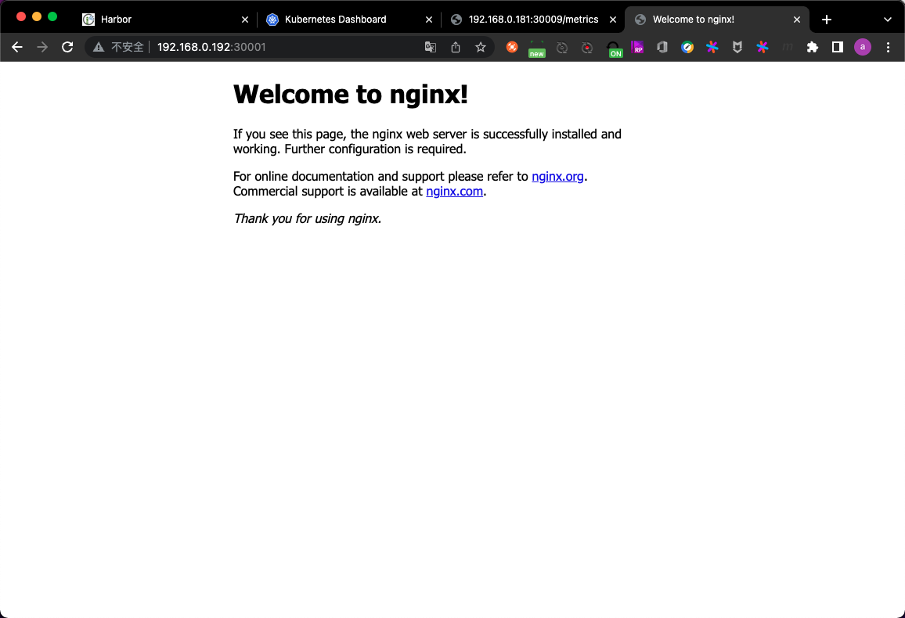

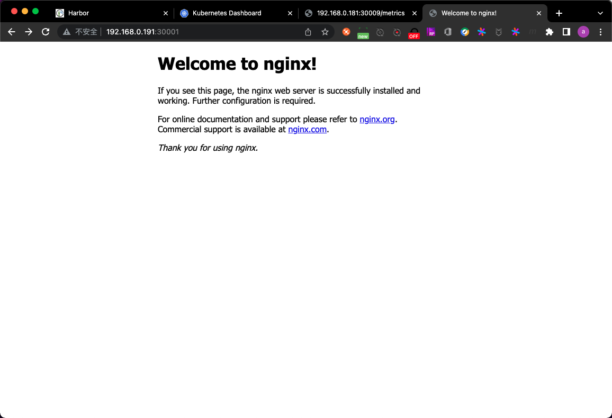


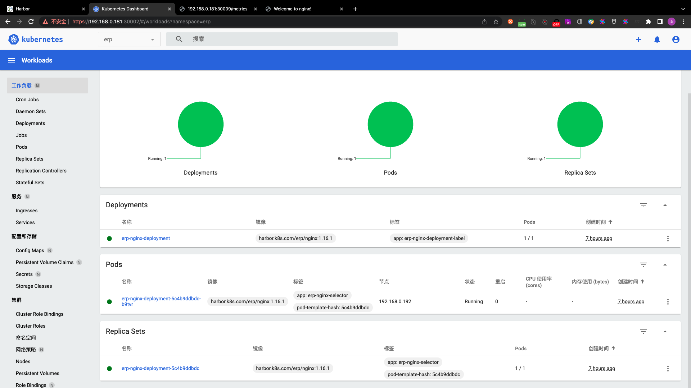

注意:这个30001端口,并不是只在service所在的node上监听,而是所有worker node的30001端口都被监听.

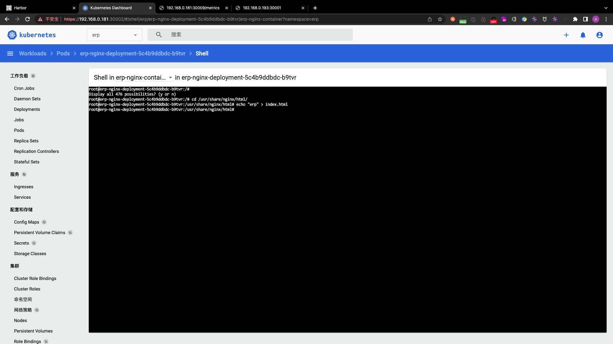


## K8S资源对象

### K8S资源管理核心概念

#### K8S的设计理念-分层架构

[K8S架构](http://docs.kubernetes.org.cn/251.html)

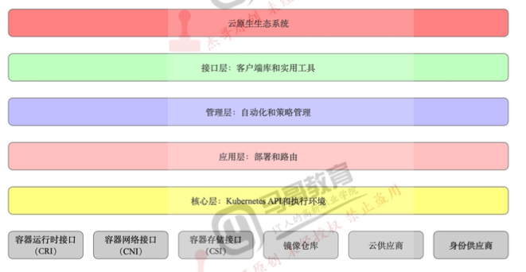

CRI:container runtime interface,容器运行时接口.目前主流运行环境为runc.containerd和rkt也是CRI

CSI:container storage interface,容器存储接口

CNI:container network interface,容器网络接口.如calico,flannel

#### K8S的设计理念-API设计原则

[K8S设计理念](https://www.kubernetes.org.cn/kubernetes%e8%ae%be%e8%ae%a1%e7%90%86%e5%bf%b5)

- 所有API应该是声明式的
- API对象是彼此互补而且可组合的
- 高层API以操作意图为基础设计
- 低层API根据高层API的控制需要设计
- 尽量避免简单封装,不要有在外部API无法显式知道的内部隐藏的机制
- API操作复杂度与对象数量成正比
- API对象状态不能依赖于网络连接状态
- 尽量避免让操作机制依赖于全局状态,因为在分布式系统中要保证全局状态的同步是非常困难的

#### API对象的使用

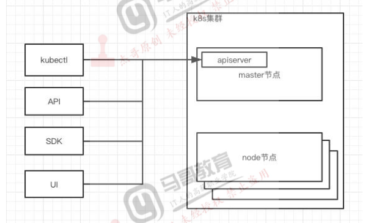

使用API,需要认证,认证文件为`~/.kube/config`.

对于通过UI调用apiserver的方式而言,rancher和kuboard也是dashboard的组件.

#### K8S资源对象

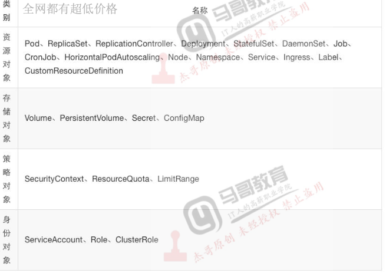

资源对象:

- Pod:通常很少直接创建pod,因为直接创建的pod没有高可用机制.一旦pod被删除或pod所在节点宕机,无法恢复
- ReplicaSet、ReplicationController、Deployment:想要实现Pod的重建机制,需要通过控制器创建pod.这3这就是用于创建无状态服务的控制器
- StatefulSet:用于运行有状态服务,例如MySQL
- DaemonSet:通常用于在每个节点上都运行一个进程,比如所有节点上运行一个日志收集进程.calico和flannel就是DaemonSet.
- Job:运行一些单次执行的任务,例如一些计算任务
- CronJob:运行一些周期性的任务.一般对数据进行归类时,才会用到Job和CronJob
- HorizontalPodAutoscaling:简称HPA控制器,用于对Pod进行弹性伸缩.当CPU利用率或内存占用超过某个阈值时,会对Pod进行弹性伸缩
- Ingress:用于暴露K8S的服务端口,和Service有一些相似
- Label:HPA控制器通过Label来寻找Pod
- CustomResourceDefinition:自定义资源

存储对象:

- Volume:用得不多
- PersistentVolume:简称PV,用于数据持久化.很多场景下容器是直接挂NFS的.
- Secret:用于提供密钥,以base64的方式加密
- ConfigMap:对K8S中的服务提供配置

策略对象:

- SecurityContext:提供安全上下文,用于认证
- ResourceQuota:用于资源限制
- LimitRange:用于资源限制

身份对象:

- ServiceAccount:实际上就是账户
- Role:用于对namespace授权
- ClusterRole:用于对集群授权


### K8S命令使用

#### kubectl get

功能:查看资源类型信息

格式:`kubectl get 资源类型`

可选参数:

- `--all-namespaces`/`-A`:显示所有namespace下的资源类型信息
- `-n`:指定namespace下的资源类型信息
- `-o`:输出格式,常用`-o wide`

#### kubectl describe

功能:查看指定资源对象的信息.此处的信息指的并非日志,而是创建该资源对象时,K8S产生的信息.包括调度过程,当前运行状态等信息.可以认为是K8S中的资源对象信息.通常在创建资源对象失败时常用该命令

格式:`kubectl describe 资源类型 资源名称`

可选参数:

- `-n`:指定namespace下的资源类型信息

示例:

```
root@k8s-master-1:~# kubectl describe pod erp-nginx-deployment-5c4b9ddbdc-b9tvr -n erp
Name:         erp-nginx-deployment-5c4b9ddbdc-b9tvr
Namespace:    erp
Priority:     0
Node:         192.168.0.192/192.168.0.192
Start Time:   Thu, 14 Apr 2022 16:41:43 +0800
Labels:       app=erp-nginx-selector
              pod-template-hash=5c4b9ddbdc
Annotations:  <none>
Status:       Running
IP:           10.200.140.71
IPs:
  IP:           10.200.140.71
Controlled By:  ReplicaSet/erp-nginx-deployment-5c4b9ddbdc
Containers:
  erp-nginx-container:
    Container ID:   docker://8e1856efac28ac4e12b860a1e9bc9a2305d3b4e544dceb03d32e32a24290a0fd
    Image:          harbor.k8s.com/erp/nginx:1.16.1
    Image ID:       docker-pullable://harbor.k8s.com/erp/nginx@sha256:2963fc49cc50883ba9af25f977a9997ff9af06b45c12d968b7985dc1e9254e4b
    Ports:          80/TCP, 443/TCP
    Host Ports:     0/TCP, 0/TCP
    State:          Running
      Started:      Thu, 14 Apr 2022 16:41:51 +0800
    Ready:          True
    Restart Count:  0
    Limits:
      cpu:     300m
      memory:  256Mi
    Requests:
      cpu:     200m
      memory:  128Mi
    Environment:
      password:  123456
      age:       18
    Mounts:
      /var/run/secrets/kubernetes.io/serviceaccount from kube-api-access-g2ssf (ro)
Conditions:
  Type              Status
  Initialized       True 
  Ready             True 
  ContainersReady   True 
  PodScheduled      True 
Volumes:
  kube-api-access-g2ssf:
    Type:                    Projected (a volume that contains injected data from multiple sources)
    TokenExpirationSeconds:  3607
    ConfigMapName:           kube-root-ca.crt
    ConfigMapOptional:       <nil>
    DownwardAPI:             true
QoS Class:                   Burstable
Node-Selectors:              <none>
Tolerations:                 node.kubernetes.io/not-ready:NoExecute op=Exists for 300s
                             node.kubernetes.io/unreachable:NoExecute op=Exists for 300s
Events:                      <none>
```

#### kubectl scale

功能:调整pod的副本数

格式:`kubectl scale -n 命名空间 资源类型 资源名称 --replicas=N`

#### kubectl label

功能:用于给node标记label,通常用于pod与node的亲和与反亲和.即把pod创建到指定的node上

格式:`kubectl label node node名称 KEY1=VAL1 ... KEYN=VALN`

删除label:`kubectl label node node名称 KEY1=- ... KEYN=-`

#### kubectl cluster-info

功能:显示一些集群信息

#### kubectl top

功能:显示集群对CPU和内存的资源利用率,需要依赖Metrics API

#### kubectl cordon

功能:标记node不参与调度

格式:`kubectl cordon node名称`

#### kubectl uncordon

功能:对不参与调度的node,取消其标记

格式:`kubectl uncordon node名称`

#### kubectl drain

功能:驱逐node上的pod(即先在其他节点上重建,然后把pod在当前节点上强制删除),用于node下线等场景.当然,像calico这种DaemonSet会直接被删除.因为在其他节点重建这些DaemonSet也没有意义.执行该命令时有可能出错.出错时可以尝试添加`--force`(对ReplicationController、ReplicaSet等资源对象强制删除)和`--ignore-daemonsets`(忽略DaemonSets对象)以及`--delete-emptydir-data`参数.

格式:`kubectl drain node名称`

注意:经过该操作的node并不会直接被踢出集群,而是被标记为不可调度.

取消驱逐:`kubectl undrain node名称`

#### kubectl taint

功能:给node标记污点,实现反亲和.即pod不会创建在有污点的node上.

#### kubectl api-resources

功能:显示资源对象的信息

格式:`kubectl api-resources`

#### kubectl api-versions

功能:查看API版本信息

格式:`kubectl api-versions`

#### kubectl version

功能:查看kubectl的版本信息

格式:`kubectl version`

#### kubectl config

功能:查看客户端的配置信息

#### kubectl edit

功能:动态编辑资源文件,修改后立即生效.但这种修改不会保存到资源对象的配置文件,所以通常不会使用该命令修改资源对象的配置.

格式:`kubectl edit 资源类型 资源名称 -n 命名空间`

#### kubectl logs

功能:查看容器的日志信息.通过该命令查看到的日志内容是容器的标准输出日志和错误日志.

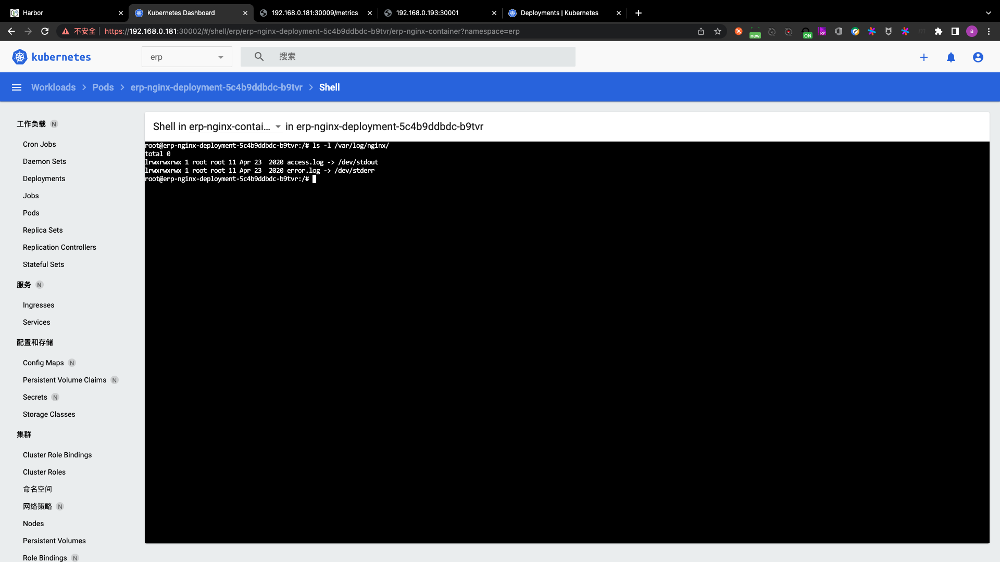

格式:`kubectl logs pod名称`

可选参数:

- `-n`:指定namespace下的资源类型信息

示例:

```
root@k8s-master-1:~# kubectl logs erp-nginx-deployment-5c4b9ddbdc-b9tvr -n erp
192.168.0.192 - - [14/Apr/2022:15:51:24 +0000] "GET / HTTP/1.1" 200 612 "-" "Mozilla/5.0 (Macintosh; Intel Mac OS X 10_15_7) AppleWebKit/537.36 (KHTML, like Gecko) Chrome/100.0.4896.75 Safari/537.36" "-"
2022/04/14 15:51:24 [error] 7#7: *1 open() "/usr/share/nginx/html/favicon.ico" failed (2: No such file or directory), client: 192.168.0.192, server: localhost, request: "GET /favicon.ico HTTP/1.1", host: "192.168.0.192:30001", referrer: "http://192.168.0.192:30001/"
192.168.0.192 - - [14/Apr/2022:15:51:24 +0000] "GET /favicon.ico HTTP/1.1" 404 555 "http://192.168.0.192:30001/" "Mozilla/5.0 (Macintosh; Intel Mac OS X 10_15_7) AppleWebKit/537.36 (KHTML, like Gecko) Chrome/100.0.4896.75 Safari/537.36" "-"
10.200.109.64 - - [14/Apr/2022:16:03:58 +0000] "GET / HTTP/1.1" 200 612 "-" "Mozilla/5.0 (Macintosh; Intel Mac OS X 10_15_7) AppleWebKit/537.36 (KHTML, like Gecko) Chrome/100.0.4896.75 Safari/537.36" "-"
2022/04/14 16:03:59 [error] 7#7: *3 open() "/usr/share/nginx/html/favicon.ico" failed (2: No such file or directory), client: 10.200.109.64, server: localhost, request: "GET /favicon.ico HTTP/1.1", host: "192.168.0.191:30001", referrer: "http://192.168.0.191:30001/"
10.200.109.64 - - [14/Apr/2022:16:03:59 +0000] "GET /favicon.ico HTTP/1.1" 404 555 "http://192.168.0.191:30001/" "Mozilla/5.0 (Macintosh; Intel Mac OS X 10_15_7) AppleWebKit/537.36 (KHTML, like Gecko) Chrome/100.0.4896.75 Safari/537.36" "-"
10.200.76.128 - - [14/Apr/2022:16:04:06 +0000] "GET / HTTP/1.1" 200 612 "-" "Mozilla/5.0 (Macintosh; Intel Mac OS X 10_15_7) AppleWebKit/537.36 (KHTML, like Gecko) Chrome/100.0.4896.75 Safari/537.36" "-"
10.200.76.128 - - [14/Apr/2022:16:04:06 +0000] "GET /favicon.ico HTTP/1.1" 404 555 "http://192.168.0.193:30001/" "Mozilla/5.0 (Macintosh; Intel Mac OS X 10_15_7) AppleWebKit/537.36 (KHTML, like Gecko) Chrome/100.0.4896.75 Safari/537.36" "-"
2022/04/14 16:04:06 [error] 7#7: *5 open() "/usr/share/nginx/html/favicon.ico" failed (2: No such file or directory), client: 10.200.76.128, server: localhost, request: "GET /favicon.ico HTTP/1.1", host: "192.168.0.193:30001", referrer: "http://192.168.0.193:30001/"
10.200.76.128 - - [14/Apr/2022:16:16:57 +0000] "GET / HTTP/1.1" 200 4 "-" "Mozilla/5.0 (Macintosh; Intel Mac OS X 10_15_7) AppleWebKit/537.36 (KHTML, like Gecko) Chrome/100.0.4896.75 Safari/537.36" "-"
```

如果此处看不到日志,需要进入容器查看系统日志(`/var/log/syslog`(Ubuntu)或`/var/log/message`(Centos))

#### kubectl create

功能:通过yaml文件创建资源对象.通过`kubectl create`命令创建的资源对象,后期若对应的yaml文件有所修改,必须将之前的资源对象删除后才能创建.若资源对象第一次创建时使用的是`kubectl create`命令,则后续yaml文件修改后无法通过`kubectl apply`命令创建资源对象.

格式:`kubectl create -f yaml文件路径`

可选参数:

- `--save-config`:创建资源对象时保存配置(实际上是保存到了etcd).用于后续资源对象更新时对比差异,后续更新时可以使用`kubectl apply`命令创建更新后的资源对象,创建时只执行变化的部分.

#### kubectl apply

功能:通过yaml文件创建资源对象.`kubectl apply`命令可以通过一个被修改过的yaml文件创建资源对象.创建资源对象时,是先创建新的资源对象,再终止旧的资源对象.

格式:`kubectl apply -f yaml文件路径`

可选参数:

- `--record`:记录资源对象的版本信息.实际上记录的是创建容器时执行的命令

#### kubectl delete

功能:根据指定的yaml文件删除资源对象

格式:`kubectl delete -f yaml文件路径`或`kubectl delete 资源类型 资源名称`,但一般不会是用后者的方式删除资源对象,因为以后者的方式删除后,pod会立即被重建.

#### kubectl exec

功能:进入容器中执行命令

[K8S命令帮助](https://kubernetes.io/zh/docs/concepts/workloads/controllers/deployment/)

## K8S中的API对象

### K8S的几个重要概念

- 对象

Q:使用K8S时,是和什么组件交互?

A:K8S的声明式API

- yaml文件

Q:如何和K8S交互?

A:通过yaml文件调用声明式API

- 必须字段

Q:如何声明?

A:

1. apiVersion:创建该对象所使用的Kubernetes API版本
2. kind:想要创建的对象的类型
3. metadata:帮助识别对象唯一性的数据,包括一个name名称、可选的namespace
4. spec:定义pod的详细信息
5. status(Pod创建完成后K8S自动生成status),使用`kubectl describe deployments.apps deployment资源名称 -n 命名空间`即可查看

```
root@k8s-master-1:~/k8s-my-cluster-yaml/20220414# kubectl describe deployments.apps erp-nginx-deployment -n erp
Name:                   erp-nginx-deployment
Namespace:              erp
CreationTimestamp:      Thu, 14 Apr 2022 16:41:43 +0800
Labels:                 app=erp-nginx-deployment-label
Annotations:            deployment.kubernetes.io/revision: 1
Selector:               app=erp-nginx-selector
Replicas:               1 desired | 1 updated | 1 total | 1 available | 0 unavailable
StrategyType:           RollingUpdate
MinReadySeconds:        0
RollingUpdateStrategy:  25% max unavailable, 25% max surge
Pod Template:
  Labels:  app=erp-nginx-selector
  Containers:
   erp-nginx-container:
    Image:       harbor.k8s.com/erp/nginx:1.16.1
    Ports:       80/TCP, 443/TCP
    Host Ports:  0/TCP, 0/TCP
    Limits:
      cpu:     300m
      memory:  256Mi
    Requests:
      cpu:     200m
      memory:  128Mi
    Environment:
      password:  123456
      age:       18
    Mounts:      <none>
  Volumes:       <none>
Conditions:
  Type           Status  Reason
  ----           ------  ------
  Progressing    True    NewReplicaSetAvailable
  Available      True    MinimumReplicasAvailable
OldReplicaSets:  <none>
NewReplicaSet:   erp-nginx-deployment-5c4b9ddbdc (1/1 replicas created)
Events:          <none>
```

以上输出内容均为status信息

注意:`Replicas:               1 desired | 1 updated | 1 total | 1 available | 0 unavailable`

- `1 desired`:副本数期望1个
- `1 updated`:事件更新数量为1,即node节点将pod状态更新到了apiserver上,然后apiserver写到了etcd上
- `1 total`:总共1个副本
- `1 available`:可用数量为1个副本
- `0 unavailable`:不可用数量为0个副本

yaml文件的必须字段:每个API对象都有3大类属性:

- metadata:元数据
- spec:规范
- status:状态

### spec和status的区别

spec是期望状态,status是实际状态

## Pod

### 概述

1. pod是k8s中的最小单元
2. 1个pod中可以运行1个容器,也可以运行多个容器
3. 1个pod中运行多个容器的话,这些容器是一起被调度的
4. pod的生命周期是短暂的,不会自愈,是用完就销毁的实体
5. 一般通过controller来创建和管理pod

Q:为什么推荐1个pod中只运行1个容器?

A:因为pod是k8s中的最小单元.1个pod中同时运行容器A和容器B,则升级容器A时,同时会导致容器B被升级.本质上是一个K8S中调度的粒度与应用运行时的粒度不同的问题.

### pod的生命周期

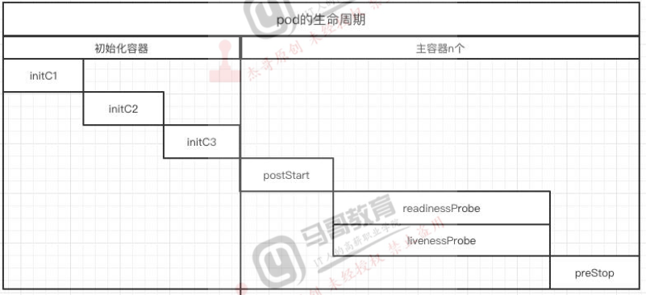

- `init`:在worker节点上初始化容器.图中的`initC1`、`initC2`、`initC3`表示顺序创建多个容器.

- `postStart`:在容器启动之前执行一些命令,例如检查当前容器中的运行环境、应用的版本、应用的权限、应用的路径等环境信息是否符合条件
- `readinessProbe`:对容器中的服务进行周期性的探测,类似负载均衡对real server进行探测.该探针为就绪探针,如果容器中的服务无法访问或者服务挂了,`readinessProbe`探针会将该pod从service中删除,service不会将流量转发给该pod.
- `livenessProbe`:存活探针.用于检测pod是否存活,若pod不存活,则执行重启.
- `preStop`:pod回收之前,先将pod中的服务按正确的方式停止,再回收pod.

### livenessProbe和readinessProbe

- livenessProbe:存活探针

	- 用于检测应用是否发生故障,例如不能提供服务、超时等情况
	- 检测失败则重启pod

- readinessProbe:就绪探针

	- 检测pod启动之后应用是否就绪,是否可以提供服务
	- 检测成功,pod才开始接收流量

## Controller

Controller用于维持pod的副本数

- Replication Controller:第一代pod副本控制器
- ReplicaSet:第二代pod副本控制器
- Deployment:第三代pod副本控制器

### Replication Controller,ReplicaSet和Deployment

- [Replication Controller](https://kubernetes.io/zh/docs/concepts/workloads/controllers/replicationcontroller/)

	[label](https://kubernetes.io/zh/docs/concepts/overview/working-with-objects/labels/)
	
	第1代副本控制器在选择pod时,只支持`=`和`!=`运算符.通常使用`=`做精确匹配
	
	- replication controller使用案例
	
		```
		root@k8s-master-1:~/k8s-my-cluster-yaml# mkdir -p ~/k8s-my-cluster-yaml/case/case1
		root@k8s-master-1:~/k8s-my-cluster-yaml# cd ~/k8s-my-cluster-yaml/case/case1
		root@k8s-master-1:~/k8s-my-cluster-yaml/case/case1# vim rc.yaml
		root@k8s-master-1:~/k8s-my-cluster-yaml/case/case1# cat rc.yaml
		```
		
		```yaml
		apiVersion: v1
		kind: ReplicationController
		metadata:
		  name: ng-rc
		spec:
		  replicas: 2
		  selector:
		    app: ng-rc-80
		  template:
		    metadata:
		      # labels的内容要和spec.selector的完全相同
		      labels:
		        app: ng-rc-80
		    spec:
		      # 通过containers部分创建的容器 会继承template.label
		      containers:
		        - name: ng-rc-80
		          image: harbor.k8s.com/erp/nginx:1.16.1
		          ports:
		            - containerPort: 80
		```
		
		```
		root@k8s-master-1:~/k8s-my-cluster-yaml/case/case1# kubectl apply -f rc.yaml 
		replicationcontroller/ng-rc created
		root@k8s-master-1:~/k8s-my-cluster-yaml/case/case1# kubectl get pod -o wide
		NAME          READY   STATUS    RESTARTS   AGE   IP              NODE            NOMINATED NODE   READINESS GATES
		net-test1     1/1     Running   0          47m   10.200.76.131   192.168.0.193   <none>           <none>
		net-test2     1/1     Running   0          47m   10.200.140.72   192.168.0.192   <none>           <none>
		net-test3     1/1     Running   0          47m   10.200.76.132   192.168.0.193   <none>           <none>
		ng-rc-5nq48   1/1     Running   0          17s   10.200.76.133   192.168.0.193   <none>           <none>
		ng-rc-74pvw   1/1     Running   0          17s   10.200.140.73   192.168.0.192   <none>           <none>
		```
		
		在K8S中,同一namespace下pod不能重名,所以k8s在创建pod时,在用户指定的pod名后随机添加了一些字符,确保pod名唯一.
		
		通过replication controller(以下简称rc)创建的pod,在手动删除后,rc会自动重建,以确保pod的副本数和声明的副本数相同
		
		- 删除前的pod信息
		
		```
		root@k8s-master-1:~/k8s-my-cluster-yaml/case/case1# kubectl get pod -o wide
		NAME          READY   STATUS    RESTARTS   AGE   IP              NODE            NOMINATED NODE   READINESS GATES
		net-test1     1/1     Running   0          47m   10.200.76.131   192.168.0.193   <none>           <none>
		net-test2     1/1     Running   0          47m   10.200.140.72   192.168.0.192   <none>           <none>
		net-test3     1/1     Running   0          47m   10.200.76.132   192.168.0.193   <none>           <none>
		ng-rc-5nq48   1/1     Running   0          17s   10.200.76.133   192.168.0.193   <none>           <none>
		ng-rc-74pvw   1/1     Running   0          17s   10.200.140.73   192.168.0.192   <none>           <none>
		```
		
		- 执行删除
		
		```
		root@k8s-master-1:~/k8s-my-cluster-yaml/case/case1# kubectl delete pod ng-rc-5nq48
		pod "ng-rc-5nq48" deleted
		```
		
		- 删除后的pod信息
		
		```
		root@k8s-master-1:~/k8s-my-cluster-yaml/case/case1# kubectl get pod -o wide
		NAME          READY   STATUS    RESTARTS   AGE    IP              NODE            NOMINATED NODE   READINESS GATES
		net-test1     1/1     Running   0          50m    10.200.76.131   192.168.0.193   <none>           <none>
		net-test2     1/1     Running   0          50m    10.200.140.72   192.168.0.192   <none>           <none>
		net-test3     1/1     Running   0          50m    10.200.76.132   192.168.0.193   <none>           <none>
		ng-rc-74pvw   1/1     Running   0          4m1s   10.200.140.73   192.168.0.192   <none>           <none>
		ng-rc-v5pw8   1/1     Running   0          40s    10.200.140.74   192.168.0.192   <none>           <none>
		```
		
		若确实需要删除pod,则直接删除rc即可
		
		- 删除rc
		
		```
		root@k8s-master-1:~/k8s-my-cluster-yaml/case/case1# kubectl delete -f rc.yaml 
		replicationcontroller "ng-rc" deleted
		```
		
		- 查看删除后的pod信息
		
		```
		root@k8s-master-1:~/k8s-my-cluster-yaml/case/case1# kubectl get pod -o wide
		NAME        READY   STATUS    RESTARTS   AGE   IP              NODE            NOMINATED NODE   READINESS GATES
		net-test1   1/1     Running   0          52m   10.200.76.131   192.168.0.193   <none>           <none>
		net-test2   1/1     Running   0          52m   10.200.140.72   192.168.0.192   <none>           <none>
		net-test3   1/1     Running   0          52m   10.200.76.132   192.168.0.193   <none>           <none>
		```
		
		- rc控制器信息
		
		```
		root@k8s-master-1:~/k8s-my-cluster-yaml/case/case1# kubectl get rc
		NAME    DESIRED   CURRENT   READY   AGE
		ng-rc   2         2         2       114s
		```
		
		```
		root@k8s-master-1:~/k8s-my-cluster-yaml/case/case1# kubectl describe rc ng-rc
		Name:         ng-rc
		Namespace:    default
		Selector:     app=ng-rc-80
		Labels:       app=ng-rc-80
		Annotations:  <none>
		Replicas:     2 current / 2 desired
		Pods Status:  2 Running / 0 Waiting / 0 Succeeded / 0 Failed
		Pod Template:
		  Labels:  app=ng-rc-80
		  Containers:
		   ng-rc-80:
		    Image:        harbor.k8s.com/erp/nginx:1.16.1
		    Port:         80/TCP
		    Host Port:    0/TCP
		    Environment:  <none>
		    Mounts:       <none>
		  Volumes:        <none>
		Events:
		  Type    Reason            Age    From                    Message
		  ----    ------            ----   ----                    -------
		  Normal  SuccessfulCreate  2m26s  replication-controller  Created pod: ng-rc-qkwgq
		  Normal  SuccessfulCreate  2m26s  replication-controller  Created pod: ng-rc-hmn8m
		```

- [ReplicaSet](https://kubernetes.io/zh/docs/concepts/workloads/controllers/replicaset/)

	副本控制集(以下简称rs),与rc的区别:对选择器的支持更好一些,除`=`和`!=`之外,还支持`in`、`notin`、正则等更复杂的匹配条件

	- ReplicaSet使用案例
		
		```
		root@k8s-master-1:~/k8s-my-cluster-yaml/case/case1# vim rs.yaml
		root@k8s-master-1:~/k8s-my-cluster-yaml/case/case1# cat rs.yaml
		```
		
		```
		apiVersion: apps/v1
		kind: ReplicaSet
		metadata:
		  name: frontend
		spec:
		  replicas: 2
		  selector:
		    # ReplicaSet控制器的标签匹配多了一层matchLabels
		    matchLabels:
		      app: ng-rs-80
		    # ReplicaSet支持正则匹配和in notin匹配 但由于匹配的范围过大 因此很少使用
		    # matchExpressions:
		      # 以如下的In匹配为例 假设服务A的label为 app: ng-rs-80,服务B的label为 app: ng-rs-81
		      # 则按照如下方式管理pod,表示服务A的pod和服务B的pod加起来的副本数为2 这样范围就过于宽泛了
		      # - {key: app, operator: In, values: [ng-rs-80,ng-rs-81]}
		  template:
		    metadata:
		      labels:
		        app: ng-rs-80
		    spec:
		      containers:
		      - name: ng-rs-80
		        image: harbor.k8s.com/erp/nginx:1.16.1
		        ports:
		          - containerPort: 80
		```
		
		```
		root@k8s-master-1:~/k8s-my-cluster-yaml/case/case1# kubectl get pod -o wide
		NAME             READY   STATUS    RESTARTS   AGE   IP              NODE            NOMINATED NODE   READINESS GATES
		frontend-fl6fs   1/1     Running   0          10s   10.200.76.135   192.168.0.193   <none>           <none>
		frontend-pjhn4   1/1     Running   0          10s   10.200.140.76   192.168.0.192   <none>           <none>
		net-test1        1/1     Running   0          72m   10.200.76.131   192.168.0.193   <none>           <none>
		net-test2        1/1     Running   0          72m   10.200.140.72   192.168.0.192   <none>           <none>
		net-test3        1/1     Running   0          72m   10.200.76.132   192.168.0.193   <none>           <none>
		```

- [Deployment](https://kubernetes.io/zh/docs/concepts/workloads/controllers/deployment/)

	比rs更高一级的控制器,除了有rs的功能之外,还有很多高级功能,比较重要的功能有:滚动升级、回滚等
	
	Deployment控制器并不是直接管理pod的,而是通过rs实现管理pod的.deployment的功能主要是滚动升级、回滚
	
	当需要升级pod时,此处我们假设通过deployment创建了1个rs(rsA)2个pod(podA和podB),现在要对这2个pod做升级:
	
	- step1. 创建一个新的rs(rsA')
	- step2. 创建一个新的podA',创建成功后回收podA
	- step3. 创建一个新的podB',创建成功后回收podB
	
	- Deployment使用案例
		
		```
		root@k8s-master-1:~/k8s-my-cluster-yaml/case/case1# vim deployment.yaml
		root@k8s-master-1:~/k8s-my-cluster-yaml/case/case1# cat deployment.yaml
		```
		
		```yaml
		apiVersion: apps/v1
		kind: Deployment
		metadata:
		  name: nginx-deployment
		spec:
		  replicas: 2
		  selector:
		    # Deployment控制器也有一层matchLabels
		    matchLabels:
		      app: ng-deploy-80
		    # matchExpressions:
		      # - {key: app, operator: In, values: [ng-deploy-80, ng-rs-81]}
		  template:
		    metadata:
		      labels:
		        app: ng-deploy-80
		    spec:
		      containers:
		      - name: ng-deploy-80
		        image: harbor.k8s.com/erp/nginx:1.16.1
		        ports:
		          - containerPort: 80
		```
		
		```
		root@k8s-master-1:~/k8s-my-cluster-yaml/case/case1# kubectl apply -f deployment.yaml 
		deployment.apps/nginx-deployment created
		root@k8s-master-1:~/k8s-my-cluster-yaml/case/case1# kubectl get pod
		NAME                                READY   STATUS    RESTARTS   AGE
		net-test1                           1/1     Running   0          99m
		net-test2                           1/1     Running   0          99m
		net-test3                           1/1     Running   0          99m
		nginx-deployment-84d79b455d-dk6hx   1/1     Running   0          4s
		nginx-deployment-84d79b455d-k6j48   1/1     Running   0          4s
		```
		
		通过deployment创建的pod的命名规则:
		
		- `nginx-deployment`是deployment控制器的名称
		- `84d79b455d`是ReplicaSet的名称
		- `dk6hx`和`k6j48`是pod的名称

		- 升级镜像
		
		```
		root@k8s-master-1:~/k8s-my-cluster-yaml/case/case1# vim deployment.yaml 
		root@k8s-master-1:~/k8s-my-cluster-yaml/case/case1# cat deployment.yaml
		```
		
		```yaml
		apiVersion: apps/v1
		kind: Deployment
		metadata:
		  name: nginx-deployment
		spec:
		  replicas: 2
		  selector:
		    # Deployment控制器也有一层matchLabels
		    matchLabels:
		      app: ng-deploy-80
		    # matchExpressions:
		      # - {key: app, operator: In, values: [ng-deploy-80, ng-rs-81]}
		  template:
		    metadata:
		      labels:
		        app: ng-deploy-80
		    spec:
		      containers:
		      - name: ng-deploy-80
		        image: harbor.k8s.com/erp/nginx:1.18.0
		        ports:
		          - containerPort: 80
		```
		
		```
		root@k8s-master-1:~/k8s-my-cluster-yaml/case/case1# kubectl apply -f deployment.yaml 
		deployment.apps/nginx-deployment configured
		```
		
		- 创建新的rs,并创建一个新的pod,同时停止1个旧的pod
		
		```
		root@k8s-master-1:~/k8s-my-cluster-yaml/case/case1# kubectl get pod
		NAME                                READY   STATUS              RESTARTS   AGE
		net-test1                           1/1     Running             0          109m
		net-test2                           1/1     Running             0          109m
		net-test3                           1/1     Running             0          109m
		nginx-deployment-84d79b455d-dk6hx   1/1     Terminating         0          9m44s
		nginx-deployment-84d79b455d-k6j48   1/1     Running             0          9m44s
		nginx-deployment-86df679699-fds4t   1/1     Running             0          6s
		nginx-deployment-86df679699-xhp46   0/1     ContainerCreating   0          0s
		```
		
		- 新的pod创建完成后,回收旧的pod
		
		```
		root@k8s-master-1:~/k8s-my-cluster-yaml/case/case1# kubectl get pod
		NAME                                READY   STATUS              RESTARTS   AGE
		net-test1                           1/1     Running             0          109m
		net-test2                           1/1     Running             0          109m
		net-test3                           1/1     Running             0          109m
		nginx-deployment-84d79b455d-k6j48   1/1     Running             0          9m47s
		nginx-deployment-86df679699-fds4t   1/1     Running             0          9s
		nginx-deployment-86df679699-xhp46   0/1     ContainerCreating   0          3s
		```
		
		- 按照此步骤循环,直到所有旧的pod都被回收完毕,即所有新的pod都创建完成
		
		```
		root@k8s-master-1:~/k8s-my-cluster-yaml/case/case1# kubectl get pod
		NAME                                READY   STATUS    RESTARTS   AGE
		net-test1                           1/1     Running   0          109m
		net-test2                           1/1     Running   0          109m
		net-test3                           1/1     Running   0          109m
		nginx-deployment-86df679699-fds4t   1/1     Running   0          28s
		nginx-deployment-86df679699-xhp46   1/1     Running   0          22s
		```
		
		- 旧的replicaset则不会被自动回收
		
		```
		root@k8s-master-1:~/k8s-my-cluster-yaml/case/case1# kubectl get replicasets
		NAME                          DESIRED   CURRENT   READY   AGE
		nginx-deployment-84d79b455d   0         0         0       15m
		nginx-deployment-86df679699   2         2         2       5m30s
		```

### Service

Q: 为什么需要Service?

A: pod重建之后ip会发生变化,pod之间直接访问会有问题

Q: Service的作用是什么?

A: 解耦服务和应用

Q: 如何使用?

A: 一般有2种方式

- K8S集群内的service:selector指定pod,自动创建Endpoints
- K8S集群外的service:手动创建Endpoints,指定外部服务的ip,端口和协议

#### kube-proxy和service的关系

kube-proxy负责维护本机的iptables或ipvs转发规则.kube-proxy监听k8s-apiserver,当有事件(例如创建新的pod、暴露端口等)产生时,kube-proxy在本机上调用内核实现

kube-proxy监听k8s-apiserver,当service资源发生变化(调用k8s-api修改services信息)时,kube-proxy就会生成对应对的负载调度的调整,这样就保证了service始终处于最新状态.

kube-proxy调度模型:

- userspace:k8s1.1之前
- iptables:1.2-k8s1.11之前
- ipvs:k8s1.11之后,如果没有开启ipvs,则自动降级为iptables

#### service的使用案例

- step1. 创建pod

```
root@k8s-master-1:~/k8s-my-cluster-yaml/case/case2# vim 1-deploy_node.yaml
root@k8s-master-1:~/k8s-my-cluster-yaml/case/case2# cat 1-deploy_node.yaml
```

```yaml
apiVersion: apps/v1
kind: Deployment
metadata:
  name: nginx-deployment
spec:
  replicas: 1
  selector:
    matchLabels:
      app: ng-deploy-80
    # matchExpressions:
      # - {key: app, operator: In, values: [ng-deploy-80,ng-re-81]}
  template:
    metadata:
      labels:
        app: ng-deploy-80
    spec:
      containers:
      - name: ng-deploy-80
        image: harbor.k8s.com/erp/nginx:1.16.1
        ports:
        - containerPort: 80
```

```
root@k8s-master-1:~/k8s-my-cluster-yaml/case/case2# kubectl apply -f 1-deploy_node.yaml 
deployment.apps/nginx-deployment created
root@k8s-master-1:~/k8s-my-cluster-yaml/case/case2# kubectl get pod
NAME                                READY   STATUS    RESTARTS   AGE
net-test1                           1/1     Running   0          3h15m
net-test2                           1/1     Running   0          3h15m
net-test3                           1/1     Running   0          3h15m
nginx-deployment-84d79b455d-jvjp7   1/1     Running   0          10s
```

此时虽然pod被启动了,但是没有暴露端口,所以无法从外网访问.

- step2. 创建ClusterIP类型的service

ClusterIP类型的service只能在K8S集群内部访问,无法从外网访问pod

```
root@k8s-master-1:~/k8s-my-cluster-yaml/case/case2# vim 2-svc_service.yaml
root@k8s-master-1:~/k8s-my-cluster-yaml/case/case2# cat 2-svc_service.yaml 
```

```yaml
apiVersion: v1
kind: Service
metadata:
  name: ng-deploy-80
spec:
  ports:
  - name: http
    # service的端口号
    port: 88
    # 目标pod的端口号
    targetPort: 80
    protocol: TCP
  # ClusterIP只能在集群内部访问
  type: ClusterIP
  selector:
    # 选择pod用的label
    app: ng-deploy-80
```

```
root@k8s-master-1:~/k8s-my-cluster-yaml/case/case2# kubectl apply -f 2-svc_service.yaml 
service/ng-deploy-80 created
root@k8s-master-1:~/k8s-my-cluster-yaml/case/case2# kubectl get svc
NAME           TYPE        CLUSTER-IP      EXTERNAL-IP   PORT(S)   AGE
kubernetes     ClusterIP   10.100.0.1      <none>        443/TCP   4d23h
ng-deploy-80   ClusterIP   10.100.68.102   <none>        88/TCP    6s
root@k8s-master-1:~/k8s-my-cluster-yaml/case/case2# kubectl get ep
NAME           ENDPOINTS                                                  AGE
kubernetes     192.168.0.181:6443,192.168.0.182:6443,192.168.0.183:6443   4d23h
ng-deploy-80   10.200.140.79:80                                           59s
```

其中`10.200.140.79:80`即为step1创建的容器地址

```
root@k8s-master-1:~/k8s-my-cluster-yaml/case/case2# kubectl get pod -o wide
NAME                                READY   STATUS    RESTARTS   AGE     IP              NODE            NOMINATED NODE   READINESS GATES
net-test1                           1/1     Running   0          3h23m   10.200.76.131   192.168.0.193   <none>           <none>
net-test2                           1/1     Running   0          3h23m   10.200.140.72   192.168.0.192   <none>           <none>
net-test3                           1/1     Running   0          3h23m   10.200.76.132   192.168.0.193   <none>           <none>
nginx-deployment-84d79b455d-jvjp7   1/1     Running   0          8m43s   10.200.140.79   192.168.0.192   <none>           <none>
```

- step3. 删除ClusterIP类型的service,并创建一个NodePort类型的service

```
root@k8s-master-1:~/k8s-my-cluster-yaml/case/case2# kubectl delete -f 2-svc_service.yaml 
service "ng-deploy-80" deleted
root@k8s-master-1:~/k8s-my-cluster-yaml/case/case2# vim 3-svc_NodePort.yaml
root@k8s-master-1:~/k8s-my-cluster-yaml/case/case2# cat 3-svc_NodePort.yaml
```

```yaml
apiVersion: v1
kind: Service
metadata:
  name: ng-deploy-80
spec:
  ports:
  - name: http
    port: 90
    targetPort: 80
    nodePort: 30012
    protocol: TCP
  type: NodePort
  selector:
    app: ng-deploy-80
```

```
root@k8s-master-1:~/k8s-my-cluster-yaml/case/case2# kubectl apply -f 3-svc_NodePort.yaml 
service/ng-deploy-80 created
root@k8s-master-1:~/k8s-my-cluster-yaml/case/case2# kubectl get svc
NAME           TYPE        CLUSTER-IP      EXTERNAL-IP   PORT(S)        AGE
kubernetes     ClusterIP   10.100.0.1      <none>        443/TCP        4d23h
ng-deploy-80   NodePort    10.100.56.189   <none>        90:30012/TCP   16s
```

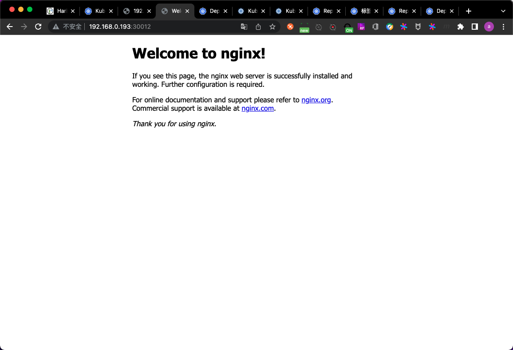

- step4. 在`k8s-haproxy-1`节点上对NodePort设置负载均衡

```
root@k8s-haproxy-1:~# vim /etc/haproxy/haproxy.cfg 
root@k8s-haproxy-1:~# cat /etc/haproxy/haproxy.cfg
global
	log /dev/log	local0
	log /dev/log	local1 notice
	chroot /var/lib/haproxy
	stats socket /run/haproxy/admin.sock mode 660 level admin expose-fd listeners
	stats timeout 30s
	user haproxy
	group haproxy
	daemon

	# Default SSL material locations
	ca-base /etc/ssl/certs
	crt-base /etc/ssl/private

	# Default ciphers to use on SSL-enabled listening sockets.
	# For more information, see ciphers(1SSL). This list is from:
	#  https://hynek.me/articles/hardening-your-web-servers-ssl-ciphers/
	# An alternative list with additional directives can be obtained from
	#  https://mozilla.github.io/server-side-tls/ssl-config-generator/?server=haproxy
	ssl-default-bind-ciphers ECDH+AESGCM:DH+AESGCM:ECDH+AES256:DH+AES256:ECDH+AES128:DH+AES:RSA+AESGCM:RSA+AES:!aNULL:!MD5:!DSS
	ssl-default-bind-options no-sslv3

defaults
	log	global
	mode	http
	option	httplog
	option	dontlognull
        timeout connect 5000
        timeout client  50000
        timeout server  50000
	errorfile 400 /etc/haproxy/errors/400.http
	errorfile 403 /etc/haproxy/errors/403.http
	errorfile 408 /etc/haproxy/errors/408.http
	errorfile 500 /etc/haproxy/errors/500.http
	errorfile 502 /etc/haproxy/errors/502.http
	errorfile 503 /etc/haproxy/errors/503.http
	errorfile 504 /etc/haproxy/errors/504.http

listen k8s-6443
  bind 192.168.0.118:6443
  mode tcp
  server k8s-master-1 192.168.0.181:6443 check inter 3s fall 3 rise 5
  server k8s-master-2 192.168.0.182:6443 check inter 3s fall 3 rise 5
  server k8s-master-3 192.168.0.183:6443 check inter 3s fall 3 rise 5


listen erp-nginx-80
  bind 192.168.0.119:80
  mode tcp
  server k8s-master-1 192.168.0.181:30012 check inter 3s fall 3 rise 5
  server k8s-master-2 192.168.0.182:30012 check inter 3s fall 3 rise 5
  server k8s-master-3 192.168.0.183:30012 check inter 3s fall 3 rise 5
```

- step2. 重启服务并确认监听情况

```
root@k8s-haproxy-1:~# systemctl restart haproxy.service 
root@k8s-haproxy-1:~# ss -tnl
State                          Recv-Q                           Send-Q                                                      Local Address:Port                                                     Peer Address:Port                          
LISTEN                         0                                128                                                         127.0.0.53%lo:53                                                            0.0.0.0:*                             
LISTEN                         0                                128                                                               0.0.0.0:22                                                            0.0.0.0:*                             
LISTEN                         0                                128                                                         192.168.0.118:6443                                                          0.0.0.0:*                             
LISTEN                         0                                128                                                         192.168.0.118:80                                                            0.0.0.0:*                             
LISTEN                         0                                128                                                                  [::]:22                                                               [::]:*        
```

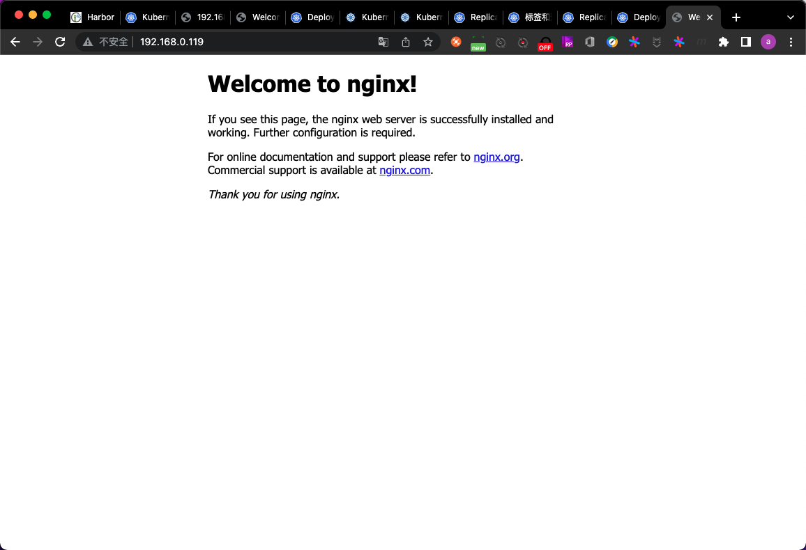

后续只需配置dns解析,即可通过域名访问service

### Volume

[Volume](https://kubernetes.io/zh/docs/concepts/storage/volumes/)

Q:Volume是什么?

A:K8S抽象出的一个对象,用于保存数据,做存储用

Q:Volume的作用是什么?

A:实现了数据和镜像的解耦,以及容器间的数据共享

常用的Volume类型:

- emptyDir:本地临时卷
- hostPath:本地卷
- nfs等:共享卷
- configmap:配置文件

#### emptyDir

当Pod被分配给节点时,首先创建emptyDir卷,并且只要该Pod在该节点上运行,该卷就会存在.正如卷的名字所述,它最初是空的.Pod中的容器可以读取和写入emptyDir卷中的相同文件,尽管该卷可以挂载到每个容器中的相同或不同路径上.当出于任何原因从节点中删除Pod时,emptyDir中的数据将被永久删除.很少用

##### emptyDir的使用案例

其实很少用到emptyDir

- 声明deploy,同时指定emptyDir

```
root@k8s-master-1:~/k8s-my-cluster-yaml/case/case3# vim deploy_empty.yaml
root@k8s-master-1:~/k8s-my-cluster-yaml/case/case3# cat deploy_empty.yaml
```

```yaml
apiVersion: apps/v1
kind: Deployment
metadata:
  name: nginx-deployment
spec:
  replicas: 1
  selector:
    matchLabels:
      app: ng-deploy-80
  template:
    metadata:
      labels:
        app: ng-deploy-80
    spec:
      containers:
        - name: ng-deploy-80
          image: harbor.k8s.com/erp/nginx:1.16.1
          ports:
          - containerPort: 80
          # 容器中的挂载点信息
          volumeMounts:
            # 指定容器中的挂载点
            - mountPath: /cache
              # 指定挂载卷的名称
              name: cache-volume-ng-deploy-80
      # 声明卷 此处声明的卷是针对整个pod中所有的容器声明的
      volumes:
        # 卷的名称
        - name: cache-volume-ng-deploy-80
          emptyDir: {}
```

```
root@k8s-master-1:~/k8s-my-cluster-yaml/case/case3# kubectl apply -f deploy_empty.yaml 
deployment.apps/nginx-deployment created
root@k8s-master-1:~/k8s-my-cluster-yaml/case/case3# kubectl get pod -o wide
NAME                                READY   STATUS    RESTARTS   AGE     IP              NODE            NOMINATED NODE   READINESS GATES
net-test1                           1/1     Running   0          4h15m   10.200.76.131   192.168.0.193   <none>           <none>
net-test2                           1/1     Running   0          4h15m   10.200.140.72   192.168.0.192   <none>           <none>
net-test3                           1/1     Running   0          4h15m   10.200.76.132   192.168.0.193   <none>           <none>
nginx-deployment-5f5db8f8b7-w4ls5   1/1     Running   0          85s     10.200.140.80   192.168.0.192   <none>           <none>
```

进入容器并在emptyDir下写入数据:

```
root@k8s-master-1:~/k8s-my-cluster-yaml/case/case3# kubectl exec -it nginx-deployment-5f5db8f8b7-w4ls5 bash
kubectl exec [POD] [COMMAND] is DEPRECATED and will be removed in a future version. Use kubectl exec [POD] -- [COMMAND] instead.
root@nginx-deployment-5f5db8f8b7-w4ls5:/# cd /cache/
root@nginx-deployment-5f5db8f8b7-w4ls5:/cache# touch /cache/erp.txt
root@nginx-deployment-5f5db8f8b7-w4ls5:/cache# echo 123 > /cache/erp.txt 
root@nginx-deployment-5f5db8f8b7-w4ls5:/cache# exit
exit
```

在宿主机上查看emptyDir中的数据:

```
root@k8s-node-2:~# cat /var/lib/kubelet/pods/69e370ff-9837-4b07-bc80-dceac1a6be60/volumes/kubernetes.io~empty-dir/cache-volume-ng-deploy-80/erp.txt
123
```

emptyDir在宿主机上的位置:`/var/lib/kubelet/pods/$ID/volumes/kubernetes.io~empty-dir/`

#### hostPath

hostPath卷将主机节点的文件系统中的文件或目录挂载到集群中,pod删除时卷不会被删除

##### hostPath使用案例

其实hostPath也很少使用,因为无法数据共享.容器被重建之后,有可能就不在之前的节点上了,所以无法数据共享是导致hostPath很少使用的原因.

```
root@k8s-master-1:~/k8s-my-cluster-yaml/case/case3# kubectl delete -f .
deployment.apps "nginx-deployment" deleted
root@k8s-master-1:~/k8s-my-cluster-yaml/case/case3# cd ..
root@k8s-master-1:~/k8s-my-cluster-yaml/case# mkdir case4
root@k8s-master-1:~/k8s-my-cluster-yaml/case# cd case4/
root@k8s-master-1:~/k8s-my-cluster-yaml/case/case4# vim deploy_hostPath.yaml
root@k8s-master-1:~/k8s-my-cluster-yaml/case/case4# cat deploy_hostPath.yaml
```

```yaml
root@k8s-master-1:~/k8s-my-cluster-yaml/case/case4# cat deploy_hostPath.yaml
apiVersion: apps/v1
kind: Deployment
metadata:
  name: nginx-deployment
spec:
  replicas: 1
  selector:
    matchLabels:
      app: ng-deploy-80
  template:
    metadata:
      labels:
        app: ng-deploy-80
    spec:
      containers:
        - name: ng-deploy-80
          image: harbor.k8s.com/erp/nginx:1.16.1
          ports:
          - containerPort: 80
          volumeMounts:
          - mountPath: /data/erp
            name: cache-erp-volume
      volumes:
        - name: cache-erp-volume
          hostPath:
            # 此处若宿主机没有该目录 会自动创建
            path: /opt/erp
```

```
root@k8s-master-1:~/k8s-my-cluster-yaml/case/case4# kubectl apply -f deploy_hostPath.yaml 
deployment.apps/nginx-deployment created
root@k8s-master-1:~/k8s-my-cluster-yaml/case/case4# kubectl get pod -o wide
NAME                                READY   STATUS    RESTARTS   AGE     IP              NODE            NOMINATED NODE   READINESS GATES
net-test1                           1/1     Running   0          4h29m   10.200.76.131   192.168.0.193   <none>           <none>
net-test2                           1/1     Running   0          4h29m   10.200.140.72   192.168.0.192   <none>           <none>
net-test3                           1/1     Running   0          4h29m   10.200.76.132   192.168.0.193   <none>           <none>
nginx-deployment-5ff84568f7-d9sds   1/1     Running   0          5s      10.200.140.81   192.168.0.192   <none>           <none>
```

进入容器并在hostPath内写入一些数据

```
root@k8s-master-1:~/k8s-my-cluster-yaml/case/case4# kubectl exec -it nginx-deployment-5ff84568f7-d9sds bash
kubectl exec [POD] [COMMAND] is DEPRECATED and will be removed in a future version. Use kubectl exec [POD] -- [COMMAND] instead.
root@nginx-deployment-5ff84568f7-d9sds:/# cd /data/erp/
root@nginx-deployment-5ff84568f7-d9sds:/data/erp# echo 123 > /data/erp/nginx.log
root@nginx-deployment-5ff84568f7-d9sds:/data/erp# exit
exit
```

到宿主机上查看

```
root@k8s-node-2:~# cat /opt/erp/nginx.log 
123
```

pod被删除后,宿主机上的数据卷会被保留

#### nfs等共享存储

nfs卷允许将现有的NFS(网络文件系统)共享挂载到容器中.不
像emptyDir,当删除Pod时,nfs卷的内容被保留,卷仅仅是被卸载.这意味着NFS卷可以预填充数据,并且可以在pod之间"切换"数据.NFS可以被多个写入者同时挂载.

##### nfs使用案例

创建1个pod测试挂载多个NFS

- step1. 安装nfs

此处以`k8s-haproxy-1`节点作为nfs节点使用.

```
root@k8s-haproxy-1:~# apt update
root@k8s-haproxy-1:~# apt install -y nfs-server
```

- step2. 创建目录并共享

```
root@k8s-haproxy-1:~# mkdir -p /data/erp/mysite
root@k8s-haproxy-1:~# mkdir -p /data/erp/js
root@k8s-haproxy-1:~# vim /etc/exports 
root@k8s-haproxy-1:~# cat /etc/exports
# /etc/exports: the access control list for filesystems which may be exported
#		to NFS clients.  See exports(5).
#
# Example for NFSv2 and NFSv3:
# /srv/homes       hostname1(rw,sync,no_subtree_check) hostname2(ro,sync,no_subtree_check)
#
# Example for NFSv4:
# /srv/nfs4        gss/krb5i(rw,sync,fsid=0,crossmnt,no_subtree_check)
# /srv/nfs4/homes  gss/krb5i(rw,sync,no_subtree_check)
#

/data/erp/mysite *(rw,no_root_squash)
/data/erp/js *(rw,no_root_squash)
root@k8s-haproxy-1:~# systemctl restart nfs-server.service
root@k8s-haproxy-1:~# systemctl enable nfs-server.service
```

- step3. 检测配置结果

```
root@k8s-master-1:~/k8s-my-cluster-yaml/case/case4# showmount -e 172.16.1.189
Export list for 172.16.1.189:
/data/erp/js     *
/data/erp/mysite *
```

- step4. 创建pod

```
root@k8s-master-1:~/k8s-my-cluster-yaml/case/case4# kubectl delete -f .
deployment.apps "nginx-deployment" deleted
root@k8s-master-1:~/k8s-my-cluster-yaml/case/case4# cd ..
root@k8s-master-1:~/k8s-my-cluster-yaml/case# mkdir case5
root@k8s-master-1:~/k8s-my-cluster-yaml/case# cd case5
root@k8s-master-1:~/k8s-my-cluster-yaml/case/case5# vim deploy_nfs.yaml
root@k8s-master-1:~/k8s-my-cluster-yaml/case/case5# cat deploy_nfs.yaml
```

```yaml
apiVersion: apps/v1
kind: Deployment
metadata:
  name: nginx-deployment
spec:
  replicas: 1
  selector:
    matchLabels:
      app: ng-deploy-80
  template:
    metadata:
      labels:
        app: ng-deploy-80
    spec:
      containers:
      - name: ng-deploy-80
        image: harbor.k8s.com/erp/nginx:1.16.1 
        ports:
        - containerPort: 80
        volumeMounts:
        - mountPath: /usr/share/nginx/html/mysite
          name: erp-nfs-volume
        - mountPath: /usr/share/nginx/html/js
          name: erp-nfs-js
      volumes:
      - name: erp-nfs-volume
        nfs:
          server: 172.16.1.189
          path: /data/erp/mysite
      - name: erp-nfs-js
        nfs:
          server: 172.16.1.189
          path: /data/erp/js
---
apiVersion: v1
kind: Service
metadata:
  name: ng-deploy-80
spec:
  ports:
  - name: http
    port: 81
    targetPort: 80
    nodePort: 30016
    protocol: TCP
  type: NodePort
  selector:
    app: ng-deploy-80
```

```
root@k8s-master-1:~/k8s-my-cluster-yaml/case/case5# kubectl get pod
NAME                                READY   STATUS    RESTARTS   AGE
net-test1                           1/1     Running   0          5h8m
net-test2                           1/1     Running   0          5h8m
net-test3                           1/1     Running   0          5h8m
nginx-deployment-7f77dffd64-klw9s   1/1     Running   0          53s
```

设置负载均衡

```
root@k8s-haproxy-1:~# vim /etc/haproxy/haproxy.cfg 
root@k8s-haproxy-1:~# cat /etc/haproxy/haproxy.cfg
global
	log /dev/log	local0
	log /dev/log	local1 notice
	chroot /var/lib/haproxy
	stats socket /run/haproxy/admin.sock mode 660 level admin expose-fd listeners
	stats timeout 30s
	user haproxy
	group haproxy
	daemon

	# Default SSL material locations
	ca-base /etc/ssl/certs
	crt-base /etc/ssl/private

	# Default ciphers to use on SSL-enabled listening sockets.
	# For more information, see ciphers(1SSL). This list is from:
	#  https://hynek.me/articles/hardening-your-web-servers-ssl-ciphers/
	# An alternative list with additional directives can be obtained from
	#  https://mozilla.github.io/server-side-tls/ssl-config-generator/?server=haproxy
	ssl-default-bind-ciphers ECDH+AESGCM:DH+AESGCM:ECDH+AES256:DH+AES256:ECDH+AES128:DH+AES:RSA+AESGCM:RSA+AES:!aNULL:!MD5:!DSS
	ssl-default-bind-options no-sslv3

defaults
	log	global
	mode	http
	option	httplog
	option	dontlognull
        timeout connect 5000
        timeout client  50000
        timeout server  50000
	errorfile 400 /etc/haproxy/errors/400.http
	errorfile 403 /etc/haproxy/errors/403.http
	errorfile 408 /etc/haproxy/errors/408.http
	errorfile 500 /etc/haproxy/errors/500.http
	errorfile 502 /etc/haproxy/errors/502.http
	errorfile 503 /etc/haproxy/errors/503.http
	errorfile 504 /etc/haproxy/errors/504.http

listen k8s-6443
  bind 192.168.0.118:6443
  mode tcp
  server k8s-master-1 192.168.0.181:6443 check inter 3s fall 3 rise 5
  server k8s-master-2 192.168.0.182:6443 check inter 3s fall 3 rise 5
  server k8s-master-3 192.168.0.183:6443 check inter 3s fall 3 rise 5


listen erp-nginx-80
  bind 192.168.0.119:80
  mode tcp
  server k8s-master-1 192.168.0.181:30016 check inter 3s fall 3 rise 5
  server k8s-master-2 192.168.0.182:30016 check inter 3s fall 3 rise 5
  server k8s-master-3 192.168.0.183:30016 check inter 3s fall 3 rise 5
root@k8s-haproxy-1:~# systemctl restart haproxy.service 
```

上传一些图片到`k8s-haproxy-1`节点的`/data/erp/mysite/`下,然后访问

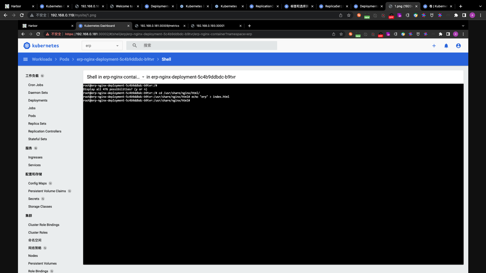

实际上是把nfs的路径挂载到了pod的宿主机上,然后映射给pod

```
root@k8s-node-3:~# df -TH
Filesystem                    Type      Size  Used Avail Use% Mounted on
udev                          devtmpfs  2.1G     0  2.1G   0% /dev
tmpfs                         tmpfs     414M   11M  404M   3% /run
/dev/sda1                     ext4       53G  7.3G   43G  15% /
tmpfs                         tmpfs     2.1G     0  2.1G   0% /dev/shm
tmpfs                         tmpfs     5.3M     0  5.3M   0% /run/lock
tmpfs                         tmpfs     2.1G     0  2.1G   0% /sys/fs/cgroup
tmpfs                         tmpfs     2.1G   13k  2.1G   1% /var/lib/kubelet/pods/078827a2-10d1-49f5-95c2-883abc2430d3/volumes/kubernetes.io~secret/etcd-certs
tmpfs                         tmpfs     2.1G   13k  2.1G   1% /var/lib/kubelet/pods/078827a2-10d1-49f5-95c2-883abc2430d3/volumes/kubernetes.io~projected/kube-api-access-hqrvk
overlay                       overlay    53G  7.3G   43G  15% /var/lib/docker/overlay2/d9a5964b4c455afd05ab7defb0350ca9f122c33037f64411d8ea638a6df3a199/merged
shm                           tmpfs      68M     0   68M   0% /var/lib/docker/containers/42276824a40fefbc34895460fa6f2a5be926bcb7f70396dade8710fec1b04efe/mounts/shm
overlay                       overlay    53G  7.3G   43G  15% /var/lib/docker/overlay2/569e1589afd4dfefd34a5f6c39cdfe266679a75bdc8a465a5e8f05cca41db02d/merged
tmpfs                         tmpfs     414M     0  414M   0% /run/user/0
tmpfs                         tmpfs     2.1G   13k  2.1G   1% /var/lib/kubelet/pods/4ea8fec7-75c1-49e8-b62c-a5926ea5c96f/volumes/kubernetes.io~projected/kube-api-access-hkt94
overlay                       overlay    53G  7.3G   43G  15% /var/lib/docker/overlay2/f0271e873ba7f7e38371ee0237de46536b83cb2d206e968b1750d62328a18072/merged
shm                           tmpfs      68M     0   68M   0% /var/lib/docker/containers/81b9d53ec8cf07c33165e679cfb749b55445fde3ec95112bded4be2e895d8e90/mounts/shm
overlay                       overlay    53G  7.3G   43G  15% /var/lib/docker/overlay2/5733dd851b4a8780ab1b696c6437f270d80e268576347853c80003e50594d4a8/merged
tmpfs                         tmpfs     2.1G   13k  2.1G   1% /var/lib/kubelet/pods/c42fc922-2d99-4fec-88e6-9c4ef927b42c/volumes/kubernetes.io~projected/kube-api-access-mc5jt
overlay                       overlay    53G  7.3G   43G  15% /var/lib/docker/overlay2/7e9904f8c146e0e0a891dbb0a0229d4092730a22ece5fe0a6007f72028355bff/merged
shm                           tmpfs      68M     0   68M   0% /var/lib/docker/containers/5a3ec2678a47476d769f14c4663e428a588ab6b7485382b77448de20df2a7f3a/mounts/shm
overlay                       overlay    53G  7.3G   43G  15% /var/lib/docker/overlay2/04fa2b85d3abfd3d89abd020a5d98a2dd64599d4fa9952e7037126cf70c9d10e/merged
tmpfs                         tmpfs     2.1G   13k  2.1G   1% /var/lib/kubelet/pods/8421c4bb-ecee-4fbe-b1fe-e717c9a28b15/volumes/kubernetes.io~projected/kube-api-access-57s4r
172.16.1.189:/data/erp/js     nfs4       53G  4.8G   46G  10% /var/lib/kubelet/pods/8421c4bb-ecee-4fbe-b1fe-e717c9a28b15/volumes/kubernetes.io~nfs/erp-nfs-js
172.16.1.189:/data/erp/mysite nfs4       53G  4.8G   46G  10% /var/lib/kubelet/pods/8421c4bb-ecee-4fbe-b1fe-e717c9a28b15/volumes/kubernetes.io~nfs/erp-nfs-volume
overlay                       overlay    53G  7.3G   43G  15% /var/lib/docker/overlay2/94a167359ef0daf840599bbd34e557c35a596eebc04d0a6aebcb0baccb51152d/merged
shm                           tmpfs      68M     0   68M   0% /var/lib/docker/containers/081dc1976334b8687e8f02fa14740bc6969d37c3d2bc2dc79bd8fbb270e2ffa8/mounts/shm
overlay                       overlay    53G  7.3G   43G  15% /var/lib/docker/overlay2/0aa2e29df95b9a4055633a209c15ef205b5c1dfebd7e9240d99a8aee0af6dd0d/merged
```

#### ConfigMap

Q: ConfigMap是什么?

A:将配置信息放到configmap对象中,然后在pod对象中导入configmap对象,实现导入配置的操作

Q:为什么需要ConfigMap?

A:实现配置信息和镜像解耦

Q:如何实现?

A:声明一个ConfigMap对象,作为Volume挂载到pod中

##### ConfigMap使用案例

```
root@k8s-master-1:~/case-yaml/case6# vim deploy_configmap.yaml 
root@k8s-master-1:~/case-yaml/case6# cat deploy_configmap.yaml
```

```yaml
apiVersion: v1
kind: ConfigMap
metadata:
  name: nginx-config
data:
 default: |
    server {
       listen       80;
       server_name  www.mysite.com;
       index        index.html;

       location / {
           root /data/nginx/html;
           if (!-e $request_filename) {
               rewrite ^/(.*) /index.html last;
           }
       }
    }

---
apiVersion: apps/v1
kind: Deployment
metadata:
  name: nginx-deployment
spec:
  replicas: 1
  selector:
    matchLabels:
      app: ng-deploy-80
  template:
    metadata:
      labels:
        app: ng-deploy-80
    spec:
      containers:
      - name: ng-deploy-80
        image: harbor.k8s.com/erp/nginx:1.16.1  
        ports:
        - containerPort: 80
        # volumeMounts的声明级别是针对container的
        volumeMounts:
        - mountPath: /data/nginx/html
          name: nginx-static-dir
          # 将名为nginx-config的volume挂载到当前容器中的/etc/nginx/conf.d上
        - name: nginx-config
          mountPath:  /etc/nginx/conf.d
      # volume的声明级别是针对pod的    
      volumes:
      - name: nginx-static-dir
        hostPath:
          path: /data/erp
      - name: nginx-config
        configMap:
          # configMap的名称
          name: nginx-config
          items:
               # 此处的default 就是configMap.data
             - key: default
               # 容器中的挂载点
               path: mysite.conf

---
apiVersion: v1
kind: Service
metadata:
  name: ng-deploy-80
spec:
  ports:
  - name: http
    port: 81
    targetPort: 80
    nodePort: 30019
    protocol: TCP
  type: NodePort
  selector:
    app: ng-deploy-80
```

```
root@k8s-master-1:~/case-yaml/case6# kubectl apply -f deploy_configmap.yaml 
configmap/nginx-config created
deployment.apps/nginx-deployment created
service/ng-deploy-80 created
root@k8s-master-1:~/case-yaml/case6# kubectl get pod
NAME                                READY   STATUS    RESTARTS   AGE
net-test1                           1/1     Running   0          13h
net-test2                           1/1     Running   0          13h
net-test3                           1/1     Running   0          13h
nginx-deployment-7cf4ff98b7-j6lpw   1/1     Running   0          16s
```

进入容器查看文件内容:

```
root@k8s-master-1:~/case-yaml/case6# kubectl exec -it nginx-deployment-7cf4ff98b7-j6lpw bash
root@nginx-deployment-7cf4ff98b7-j6lpw:/# cat /etc/nginx/conf.d/mysite.conf
server {
   listen       80;
   server_name  www.mysite.com;
   index        index.html;

   location / {
       root /data/nginx/html;
       if (!-e $request_filename) {
           rewrite ^/(.*) /index.html last;
       }
   }
}
```

更新configMap中的内容,此处以取消挂载为例:

```
root@k8s-master-1:~/case-yaml/case6# vim deploy_configmap.yaml 
root@k8s-master-1:~/case-yaml/case6# cat deploy_configmap.yaml
```

```yaml
apiVersion: v1
kind: ConfigMap
metadata:
  name: nginx-config
data:
 default: |
    server {
       listen       80;
       server_name  www.mysite.com;
       index        index.html;

       location / {
           root /data/nginx/html;
           if (!-e $request_filename) {
               rewrite ^/(.*) /index.html last;
           }
       }
    }

---
apiVersion: apps/v1
kind: Deployment
metadata:
  name: nginx-deployment
spec:
  replicas: 1
  selector:
    matchLabels:
      app: ng-deploy-80
  template:
    metadata:
      labels:
        app: ng-deploy-80
    spec:
      containers:
      - name: ng-deploy-80
        image: harbor.k8s.com/erp/nginx:1.16.1  
        ports:
        - containerPort: 80
        # volumeMounts的声明级别是针对container的
        volumeMounts:
        - mountPath: /data/nginx/html
          name: nginx-static-dir
          # 将名为nginx-config的volume挂载到当前容器中的/etc/nginx/conf.d上
        #- name: nginx-config
        #  mountPath:  /etc/nginx/conf.d
      # volume的声明级别是针对pod的    
      volumes:
      - name: nginx-static-dir
        hostPath:
          path: /data/erp
      - name: nginx-config
        configMap:
          # configMap的名称
          name: nginx-config
          items:
               # 此处的default 就是configMap.data
             - key: default
               # 容器中的挂载点
               path: mysite.conf

---
apiVersion: v1
kind: Service
metadata:
  name: ng-deploy-80
spec:
  ports:
  - name: http
    port: 81
    targetPort: 80
    nodePort: 30019
    protocol: TCP
  type: NodePort
  selector:
    app: ng-deploy-80
```

```
root@k8s-master-1:~/case-yaml/case6# kubectl apply -f deploy_configmap.yaml 
configmap/nginx-config unchanged
deployment.apps/nginx-deployment configured
service/ng-deploy-80 unchanged
```

进入容器查看:

```
root@k8s-master-1:~/case-yaml/case6# kubectl exec -it nginx-deployment-6dcf9898d5-2g4ts bash
kubectl exec [POD] [COMMAND] is DEPRECATED and will be removed in a future version. Use kubectl exec [POD] -- [COMMAND] instead.
root@nginx-deployment-6dcf9898d5-2g4ts:/# ls /etc/nginx/conf.d/
default.conf
```

可以看到,没有configMap中的内容了

尝试访问该pod:

- step1. 恢复configMap中的配置

```
root@k8s-master-1:~/case-yaml/case6# vim deploy_configmap.yaml 
root@k8s-master-1:~/case-yaml/case6# cat deploy_configmap.yaml
```

```yaml
apiVersion: v1
kind: ConfigMap
metadata:
  name: nginx-config
data:
 default: |
    server {
       listen       80;
       server_name  www.mysite.com;
       index        index.html;

       location / {
           root /data/nginx/html;
           if (!-e $request_filename) {
               rewrite ^/(.*) /index.html last;
           }
       }
    }

---
apiVersion: apps/v1
kind: Deployment
metadata:
  name: nginx-deployment
spec:
  replicas: 1
  selector:
    matchLabels:
      app: ng-deploy-80
  template:
    metadata:
      labels:
        app: ng-deploy-80
    spec:
      containers:
      - name: ng-deploy-80
        image: harbor.k8s.com/erp/nginx:1.16.1  
        ports:
        - containerPort: 80
        # volumeMounts的声明级别是针对container的
        volumeMounts:
        - mountPath: /data/nginx/html
          name: nginx-static-dir
          # 将名为nginx-config的volume挂载到当前容器中的/etc/nginx/conf.d上
        - name: nginx-config
          mountPath:  /etc/nginx/conf.d
      # volume的声明级别是针对pod的    
      volumes:
      - name: nginx-static-dir
        hostPath:
          path: /data/erp
      - name: nginx-config
        configMap:
          # configMap的名称
          name: nginx-config
          items:
               # 此处的default 就是configMap.data
             - key: default
               # 容器中的挂载点
               path: mysite.conf

---
apiVersion: v1
kind: Service
metadata:
  name: ng-deploy-80
spec:
  ports:
  - name: http
    port: 81
    targetPort: 80
    nodePort: 30019
    protocol: TCP
  type: NodePort
  selector:
    app: ng-deploy-80
```

```
root@k8s-master-1:~/case-yaml/case6# kubectl apply -f deploy_configmap.yaml 
configmap/nginx-config unchanged
deployment.apps/nginx-deployment configured
service/ng-deploy-80 unchanged
```

```
root@k8s-master-1:~/case-yaml/case6# kubectl get pod -A -o wide
NAMESPACE              NAME                                        READY   STATUS    RESTARTS   AGE   IP              NODE            NOMINATED NODE   READINESS GATES
default                net-test1                                   1/1     Running   0          14h   10.200.109.65   192.168.0.191   <none>           <none>
default                net-test2                                   1/1     Running   0          14h   10.200.140.65   192.168.0.192   <none>           <none>
default                net-test3                                   1/1     Running   0          14h   10.200.109.66   192.168.0.191   <none>           <none>
default                nginx-deployment-7cf4ff98b7-5kdx6           1/1     Running   0          15s   10.200.76.131   192.168.0.193   <none>           <none>
kube-system            calico-kube-controllers-75b57c64c6-wjftl    1/1     Running   0          14h   192.168.0.192   192.168.0.192   <none>           <none>
kube-system            calico-node-4q6dp                           1/1     Running   0          13h   192.168.0.183   192.168.0.183   <none>           <none>
kube-system            calico-node-5dmf4                           1/1     Running   0          13h   192.168.0.193   192.168.0.193   <none>           <none>
kube-system            calico-node-6nsdd                           1/1     Running   0          13h   192.168.0.191   192.168.0.191   <none>           <none>
kube-system            calico-node-8qsb6                           1/1     Running   0          13h   192.168.0.182   192.168.0.182   <none>           <none>
kube-system            calico-node-jc4j6                           1/1     Running   0          13h   192.168.0.181   192.168.0.181   <none>           <none>
kube-system            calico-node-lks6l                           1/1     Running   0          13h   192.168.0.192   192.168.0.192   <none>           <none>
kube-system            coredns-5b86cf85-rsqhs                      1/1     Running   0          13h   10.200.140.66   192.168.0.192   <none>           <none>
kubernetes-dashboard   dashboard-metrics-scraper-69995b67c-q2cmv   1/1     Running   0          13h   10.200.140.69   192.168.0.192   <none>           <none>
kubernetes-dashboard   kubernetes-dashboard-54d6cc67d5-zqtl6       1/1     Running   0          13h   10.200.109.69   192.168.0.191   <none>           <none>
```

- step2. 在负载均衡器节点上设置转发规则

```
root@k8s-haproxy-1:~# vim /etc/haproxy/haproxy.cfg 
root@k8s-haproxy-1:~# cat /etc/haproxy/haproxy.cfg
global
	log /dev/log	local0
	log /dev/log	local1 notice
	chroot /var/lib/haproxy
	stats socket /run/haproxy/admin.sock mode 660 level admin expose-fd listeners
	stats timeout 30s
	user haproxy
	group haproxy
	daemon

	# Default SSL material locations
	ca-base /etc/ssl/certs
	crt-base /etc/ssl/private

	# Default ciphers to use on SSL-enabled listening sockets.
	# For more information, see ciphers(1SSL). This list is from:
	#  https://hynek.me/articles/hardening-your-web-servers-ssl-ciphers/
	# An alternative list with additional directives can be obtained from
	#  https://mozilla.github.io/server-side-tls/ssl-config-generator/?server=haproxy
	ssl-default-bind-ciphers ECDH+AESGCM:DH+AESGCM:ECDH+AES256:DH+AES256:ECDH+AES128:DH+AES:RSA+AESGCM:RSA+AES:!aNULL:!MD5:!DSS
	ssl-default-bind-options no-sslv3

defaults
	log	global
	mode	http
	option	httplog
	option	dontlognull
        timeout connect 5000
        timeout client  50000
        timeout server  50000
	errorfile 400 /etc/haproxy/errors/400.http
	errorfile 403 /etc/haproxy/errors/403.http
	errorfile 408 /etc/haproxy/errors/408.http
	errorfile 500 /etc/haproxy/errors/500.http
	errorfile 502 /etc/haproxy/errors/502.http
	errorfile 503 /etc/haproxy/errors/503.http
	errorfile 504 /etc/haproxy/errors/504.http

listen k8s-6443
  # bind的地址即keepalived配置的IP地址
  bind 192.168.0.118:6443
  mode tcp
  # server的IP地址即为kub-apiserver的节点地址 即本例中所有的k8s-master地址
  server k8s-master-1 192.168.0.181:6443 check inter 3s fall 3 rise 5
  server k8s-master-2 192.168.0.182:6443 check inter 3s fall 3 rise 5
  server k8s-master-3 192.168.0.183:6443 check inter 3s fall 3 rise 5

listen erp-nginx-80
  bind 192.168.0.119:80
  mode tcp
  server k8s-node-1 192.168.0.191:30019 check inter 3s fall 3 rise 5
  server k8s-node-1 192.168.0.192:30019 check inter 3s fall 3 rise 5
  server k8s-node-1 192.168.0.193:30019 check inter 3s fall 3 rise 5
root@k8s-haproxy-1:~# systemctl restart haproxy.service 
```

- step3. 宿主机上添加一条hosts记录

```
root@192 ~ % sudo vim /etc/hosts
root@192 ~ % cat /etc/hosts
# Host Database
#
# localhost is used to configure the loopback interface
# when the system is booting.  Do not change this entry.
##
127.0.0.1	localhost
255.255.255.255	broadcasthost
::1             localhost
# Added by Docker Desktop
# To allow the same kube context to work on the host and the container:
127.0.0.1 kubernetes.docker.internal
# End of section
192.168.0.184 harbor.k8s.com
192.168.0.119 www.mysite.com
```

- step4. 写入一个页面文件

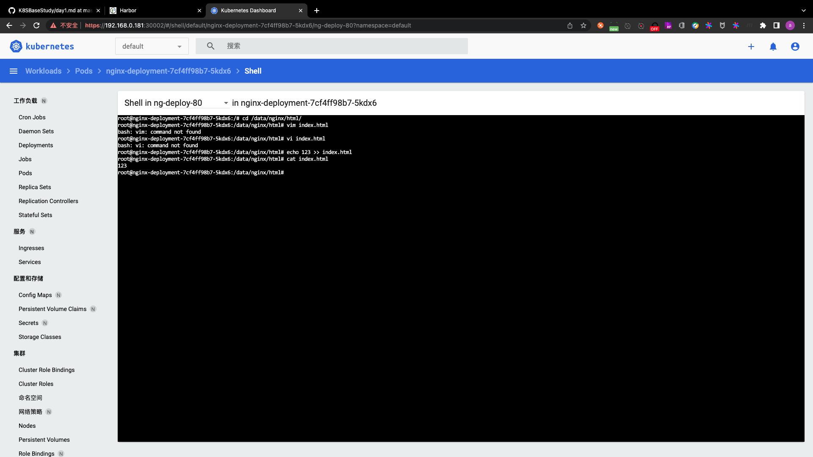

- step5. 访问


##### 使用configMap向容器提供环境变量

```
root@k8s-master-1:~/case-yaml/case6# vim deploy_configmapenv.yaml 
root@k8s-master-1:~/case-yaml/case6# cat deploy_configmapenv.yaml
```

```yaml
apiVersion: v1
kind: ConfigMap

metadata:
  name: nginx-config
data:
  # 可以使用configMap 向容器提供环境变量的值
  username: user1


---
apiVersion: apps/v1
kind: Deployment
metadata:
  name: nginx-deployment
spec:
  replicas: 1
  selector:
    matchLabels:
      app: ng-deploy-80
  template:
    metadata:
      labels:
        app: ng-deploy-80
    spec:
      containers:
      - name: ng-deploy-80
        image: harbor.k8s.com/erp/nginx:1.16.1
        # 使用env字段 在yaml文件中为容器提供环境变量的变量名
        env:
        - name: MY_USERNAME
          valueFrom:
            configMapKeyRef:
              name: nginx-config
              key: username
        ports:
        - containerPort: 80
```

```
root@k8s-master-1:~/case-yaml/case6# kubectl apply -f deploy_configmapenv.yaml 
configmap/nginx-config configured
deployment.apps/nginx-deployment configured
```

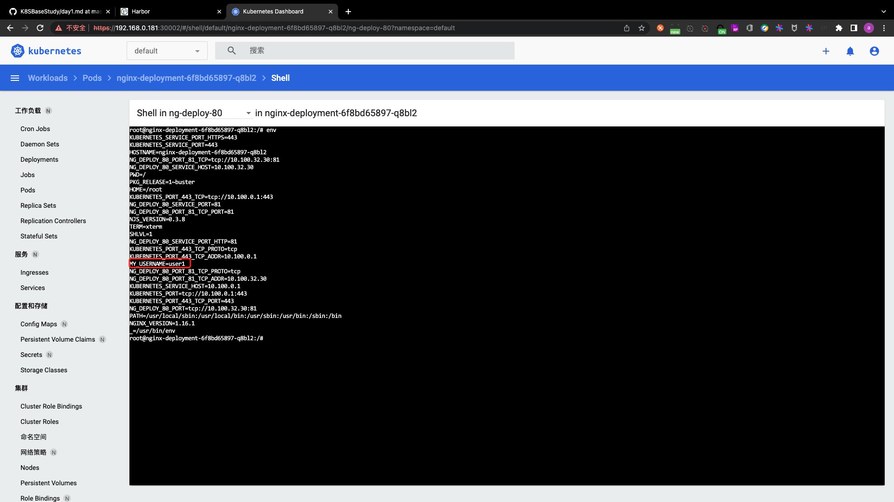

实际上这种方式用的不是特别多,比较多的是直接使用env字段指定:

```
root@k8s-master-1:~/case-yaml/case6# vim deploy_configmapenv.yaml 
root@k8s-master-1:~/case-yaml/case6# cat deploy_configmapenv.yaml
```

```yaml
apiVersion: v1
kind: ConfigMap

metadata:
  name: nginx-config
data:
  # 可以使用configMap 向容器提供环境变量的值
  username: user1


---
apiVersion: apps/v1
kind: Deployment
metadata:
  name: nginx-deployment
spec:
  replicas: 1
  selector:
    matchLabels:
      app: ng-deploy-80
  template:
    metadata:
      labels:
        app: ng-deploy-80
    spec:
      containers:
      - name: ng-deploy-80
        image: harbor.k8s.com/erp/nginx:1.16.1
        # 使用env字段 在yaml文件中为容器提供环境变量的变量名
        env:
        - name: "MY_USERNAME"
          value: "123456"
        - name: "age"
          value: "18"
        ports:
        - containerPort: 80
```

#### Statefulset

Q:为什么需要Statefulset?

A:为了解决有状态服务的问题

Q:Statefulset是什么?

A:Statefulset所管理的Pod有固定的名称、主机名、启停顺序

Q:如何使用?

A:创建一个statefulset类型的pod,并指定serviceName,创建headless类型的svc

[statefulset演示](https://kubernetes.io/zh/docs/concepts/workloads/controllers/statefulset/)

使用Statefulset创建pod时,是按顺序创建的,只有当第1个pod创建完毕并启动成功后,才会创建第2个pod.

和Statefulset不同,使用deployment创建pod时,会同时创建多个pod.

后期再演示,因为需要存储.

#### DaemonSet

DaemonSet在当前集群中每个节点运行同一个pod,当有新的节点加入集群时也会为新的节点配置相同的pod,当节点从集群中移除时其pod也会被kubernetes回收,但是删除DaemonSet将删除其创建的所有的pod.

[DaemonSet介绍](https://kubernetes.io/zh/docs/concepts/workloads/controllers/daemonset/)

DaemonSet使用场景:

- 在每个节点上运行集群守护进程
- 在每个节点上运行日志收集守护进程
- 在每个节点上运行监控守护进程

使用DaemonSet运行网络组件:

```
root@k8s-master-1:~/case-yaml/case6# kubectl get daemonset -A
NAMESPACE     NAME          DESIRED   CURRENT   READY   UP-TO-DATE   AVAILABLE   NODE SELECTOR            AGE
kube-system   calico-node   6         6         6       6            6           kubernetes.io/os=linux   15h
```

##### Daemonset演示

```
root@k8s-master-1:~/case-yaml# mkdir case7
root@k8s-master-1:~/case-yaml# cd case7
root@k8s-master-1:~/case-yaml/case7# vim daemonset.yaml
root@k8s-master-1:~/case-yaml/case7# cat daemonset.yaml
```

```yaml
apiVersion: apps/v1
kind: DaemonSet
metadata:
  name: fluentd-elasticsearch
  namespace: kube-system
  labels:
    k8s-app: fluentd-logging
spec:
  selector:
    matchLabels:
      name: fluentd-elasticsearch
  template:
    metadata:
      labels:
        name: fluentd-elasticsearch
    spec:
      tolerations:
      # this toleration is to have the daemonset runnable on master nodes
      # remove it if your masters can't run pods
      - key: node-role.kubernetes.io/master
        operator: Exists
        effect: NoSchedule
      containers:
      - name: fluentd-elasticsearch
        image: harbor.k8s.com/baseimages/fluentd:v2.5.2
        resources:
          limits:
            memory: 200Mi
          requests:
            cpu: 100m
            memory: 200Mi
        volumeMounts:
        - name: varlog
          mountPath: /var/log
        - name: varlibdockercontainers
          mountPath: /var/lib/docker/containers
          readOnly: true
      terminationGracePeriodSeconds: 30
      volumes:
      # 系统日志
      - name: varlog
        hostPath:
          # 要收集宿主机的日志 但日志收集服务是通过pod起来的 所以现在面临的问题是pod要拿到宿主机的日志
          # 1. 日志标准化 所有服务的日志要存放到统一的位置 例如: /data/log/nginx /data/log/kafka /data/log/mysql等
          # 2. 写简单正则 获取所有日志文件 例如: /data/*/*.log
          path: /var/log
      # 容器日志
      - name: varlibdockercontainers
        hostPath:
          # /var/lib/docker/containers 是docker默认存放日志的路径
          path: /var/lib/docker/containers
```

```
root@k8s-master-1:~/case-yaml/case7# kubectl apply -f daemonset.yaml 
daemonset.apps/fluentd-elasticsearch created
root@k8s-master-1:~/case-yaml/case7# kubectl get pod -A
NAMESPACE              NAME                                        READY   STATUS    RESTARTS   AGE
default                net-test1                                   1/1     Running   0          16h
default                net-test2                                   1/1     Running   0          16h
default                net-test3                                   1/1     Running   0          16h
default                nginx-deployment-645fc9c5bf-s8wdf           1/1     Running   0          64m
kube-system            calico-kube-controllers-75b57c64c6-wjftl    1/1     Running   0          16h
kube-system            calico-node-4q6dp                           1/1     Running   0          15h
kube-system            calico-node-5dmf4                           1/1     Running   0          15h
kube-system            calico-node-6nsdd                           1/1     Running   0          15h
kube-system            calico-node-8qsb6                           1/1     Running   0          15h
kube-system            calico-node-jc4j6                           1/1     Running   0          15h
kube-system            calico-node-lks6l                           1/1     Running   0          15h
kube-system            coredns-5b86cf85-rsqhs                      1/1     Running   0          15h
kube-system            fluentd-elasticsearch-5tws5                 1/1     Running   0          29s
kube-system            fluentd-elasticsearch-cvvm7                 1/1     Running   0          29s
kube-system            fluentd-elasticsearch-jzd59                 1/1     Running   0          29s
kube-system            fluentd-elasticsearch-lqrt7                 1/1     Running   0          29s
kube-system            fluentd-elasticsearch-mddg9                 1/1     Running   0          29s
kube-system            fluentd-elasticsearch-tq9l4                 1/1     Running   0          29s
kubernetes-dashboard   dashboard-metrics-scraper-69995b67c-q2cmv   1/1     Running   0          15h
kubernetes-dashboard   kubernetes-dashboard-54d6cc67d5-zqtl6       1/1     Running   0          15h
```

#### PV/PVC

Q:为什么需要PV和PVC?

A:实现pod和storage的解耦,这样在修改storage时不需要修改pod,也可以实现存储和应用权限的隔离

Q:PV和PVC是什么?

A:PersistentVolume和PersistentVolumeClaim.PV和PVC是一个逻辑抽象,它们并不是直接存储数据,而是在storage和k8s之间做了一层隔离(权限控制、业务数据隔离等).

PersistentVolume(PV)是由管理员设置的存储,它是集群的一部分.就像节点是集群中的资源一样,PV也是集群中的资源,不属于某个Pod.PV是Volume之类的卷插件,但具有独立于使用PV的Pod的 生命周期.此API对象包含存储实现的细节,即NFS、iSCSI或特定于云供应商的存储系统.

PersistentVolumeClaim(PVC)是用户存储的请求.它与Pod相似.Pod消耗节点资源,PVC消耗PV资源.Pod可以请求特定级别的资源(CPU和内存).声明可以请求特定的大小和访问模式(例如:可以以读/写一次或只读多次模式挂载)

PVC是一种接口,并不能直接对接物理存储,pod通过PVC对接到PV.PV实际上是个驱动,和物理存储对接.因此要先创建PV,再创建PVC.

PVC分为2类:一种是手动创建的,另一种是动态创建.这种方式需要提前在K8S中创建一个存储类(实际上是PVC的模板,用于定义PVC的大小等信息),当需要创建PVC时通过存储类创建PVC.当然,Pod和PVC的绑定关系最终还是记录到etcd中的.

[官方文档](https://kubernetes.io/zh/docs/concepts/storage/persistent-volumes/)

PV的创建参数:

capacity:不得大于底层存储的空间

accessModes:用于控制PV能否同时被多个Pod挂载

- ReadWriteOnce:PV只能被单个节点以读写权限挂载,RWO.使用场景:有状态服务,例如MySQL主从.主库有自己的PV,从库也有自己的PV.
- ReadOnlyMany:PV可以被多个节点挂载,但权限为只读,ROX.使用场景:Nginx.用的不多.
- ReadWriteMany:PV可以被多个节点以读写权限挂载,RWX.使用较多

persistentVolumeReclaimPolicy:删除机制,即删除存储卷时,通过该PV创建的数据将被如何操作:

- Retain:删除PV后数据保持原状不动,需要管理员手动删除.这种机制用的比较多
- Recycle:空间回收,即删除存储卷上的所有数据(包括目录和隐藏文件),目前仅支持NFS和hostPath
- Delete:自动删除存储卷.实际上和Retain一样

volumeMode:卷类型.定义存储卷使用的文件系统是块设备还是文件系统,默认为文件系统

mountOptions:附加的挂载选项列表,实现更精细的权限控制

[各种文件系统对附加挂载项的支持](https://kubernetes.io/zh/docs/concepts/storage/persistent-volumes/#access-modes)

PVC的创建参数:

accessModes:用于控制PV能否同时被多个Pod挂载

- ReadWriteOnce:PV只能被单个节点以读写权限挂载,RWO.使用场景:有状态服务,例如MySQL主从.主库有自己的PV,从库也有自己的PV.
- ReadOnlyMany:PV可以被多个节点挂载,但权限为只读,ROX.使用场景:Nginx.用的不多.
- ReadWriteMany:PV可以被多个节点以读写权限挂载,RWX.使用较多

resources:资源大小.该值需小于等于PVC对应的PV的大小.

注意:PV的namespace可以随便写一个,因为PV是K8S集群全局资源.但PVC的namespace必须和要关联的Pod处于同一个namespace下.

selector:标签选择器,选择要绑定的PV

matchLabels:匹配标签名称

matchExpressions:基于正则表达式匹配

volumeName:指定要绑定的PV的名称.这种方式比selector更加精确

例如:PVC命名为`redis-datadir-pvc-1`,PV命名为`redis-datadir-pv-1`.如果redis是个集群,则可以继续向后命名:`redis-datadir-pvc-2`和`redis-datadir-pv-2`.以此类推.

volumeMode:PVC类型.定义存储卷使用的文件系统是块设备还是文件系统,默认为文件系统

##### 示例:基于PV和PVC运行zookeeper集群

- step1. 拉取java8镜像并上传至harbor

```
root@ks8-harbor-2:~# docker pull elevy/slim_java:8
8: Pulling from elevy/slim_java
88286f41530e: Pull complete 
7141511c4dad: Pull complete 
fd529fe251b3: Pull complete 
Digest: sha256:044e42fb89cda51e83701349a9b79e8117300f4841511ed853f73caf7fc98a51
Status: Downloaded newer image for elevy/slim_java:8
docker.io/elevy/slim_java:8
root@ks8-harbor-2:~# docker tag elevy/slim_java:8 harbor.k8s.com/baseimages/slim_java:8
root@ks8-harbor-2:~# docker push harbor.k8s.com/baseimages/slim_java:8
The push refers to repository [harbor.k8s.com/baseimages/slim_java]
e053edd72ca6: Pushed 
aba783efb1a4: Pushed 
5bef08742407: Pushed 
8: digest: sha256:817d0af5d4f16c29509b8397784f5d4ec3accb1bfde4e474244ed3be7f41a604 size: 952
```

- step2. 准备业务镜像

注意:打镜像时一定要加日期,否则后续的镜像清理工作没法做.

配置zookeeper集群需添加如下配置:

```
server.1=zoo1:2888:3888
server.2=zoo2:2888:3888
server.3=zoo3:2888:3888
```

其中zoo1表示域名,也可以写IP地址.但在K8S中,pod的IP是不固定的,因此也没有办法给pod配置域名解析.因此要使用service.给每个pod配一个service.由于还需要存储,所以还要给每个pod配置单独的**一套**PV和PVC

server.1表示集群中的节点,同一个集群内节点ID不能重复.

选举机制:

- step1. 集群第一次启动时,优先对比事务ID,但此时没有数据,所以所有节点的事务ID是一样的.因此对比不出来.
- step2. 对比serverID.ID最大的节点将成为leader节点

2888:集群端口,是leader节点向slaver节点同步数据时使用的.该端口只有leader节点才会监听

3888:集群端口,用于选举.

- step2.1 下载zookeeper

[zookeeper3.4.14](https://archive.apache.org/dist/zookeeper/zookeeper-3.4.14/zookeeper-3.4.14.tar.gz)

[zookeeper-3.4.14.tar.gz.asc](https://archive.apache.org/dist/zookeeper/zookeeper-3.4.14/zookeeper-3.4.14.tar.gz.asc)

[KEY](https://archive.apache.org/dist/zookeeper/KEYS)

- step2.2 编写启动zookeeper的脚本

```
root@ks8-harbor-2:/opt/k8s-data/zookeeper# pwd
/opt/k8s-data/zookeeper
root@ks8-harbor-2:/opt/k8s-data/zookeeper# cd ./bin/
root@ks8-harbor-2:/opt/k8s-data/zookeeper/bin# vim zkReady.sh 
root@ks8-harbor-2:/opt/k8s-data/zookeeper/bin# cat zkReady.sh
#!/bin/bash

/zookeeper/bin/zkServer.sh status | egrep 'Mode: (standalone|leading|following|observing)'
```

注:zsServer.sh在`zookeeper-3.4.14.tar.gz`解压缩后的`bin/`目录下,用于启动zookeeper的脚本

- step2.3 编写容器启动时执行的脚本

前面说过,以集群的方式启动zookeeper时,需要编写配置文件,向配置文件中添加serverID和对应的域名以及端口.此处以脚本的形式完成该任务

```
root@ks8-harbor-2:/opt/k8s-data/zookeeper/bin# cd ..
root@ks8-harbor-2:/opt/k8s-data/zookeeper# vim entrypoint.sh 
root@ks8-harbor-2:/opt/k8s-data/zookeeper# cat entrypoint.sh
#!/bin/bash

# 生成serverID并打印 MYID是创建pod时写入的环境变量
echo ${MYID:-1} > /zookeeper/data/myid

# SERVERS是创建pod时写入的环境变量
if [ -n "$SERVERS" ]; then
	IFS=\, read -a servers <<<"$SERVERS"
	for i in "${!servers[@]}"; do 
		# 将serverID追加到zk的配置文件中
		printf "\nserver.%i=%s:2888:3888" "$((1 + $i))" "${servers[$i]}" >> /zookeeper/conf/zoo.cfg
	done
fi

cd /zookeeper
exec "$@"
```

- step2.4 编写Dockerfile

```
root@ks8-harbor-2:/opt/k8s-data/zookeeper# vim Dockerfile 
root@ks8-harbor-2:/opt/k8s-data/zookeeper# cat Dockerfile
FROM harbor.k8s.com/baseimages/slim_java:8
ENV ZK_VERSION 3.4.14
# 更换镜像仓库
ADD repositories /etc/apk/repositories

# 将zookeeper复制到镜像中
COPY zookeeper-3.4.14.tar.gz /tmp/zk.tgz
COPY zookeeper-3.4.14.tar.gz.asc /tmp/zk.tgz.asc
COPY KEYS /tmp/KEYS

# 安装依赖
RUN apk add --no-cache --virtual .build-deps \
      ca-certificates   \
      gnupg             \
      tar               \
      wget &&           \
    #
    # Install dependencies
    apk add --no-cache  \
      bash &&           \
    #
    #
    # 校验KEY
    export GNUPGHOME="$(mktemp -d)" && \
    gpg -q --batch --import /tmp/KEYS && \
    gpg -q --batch --no-auto-key-retrieve --verify /tmp/zk.tgz.asc /tmp/zk.tgz && \
    #
    # 创建zookeeper安装路径
    #
    mkdir -p /zookeeper/data /zookeeper/wal /zookeeper/log && \
    #
    # 安装zookeeper
    tar -x -C /zookeeper --strip-components=1 --no-same-owner -f /tmp/zk.tgz && \
    #
    # Slim down
    cd /zookeeper && \
    cp dist-maven/zookeeper-${ZK_VERSION}.jar . && \
    rm -rf \
      *.txt \
      *.xml \
      bin/README.txt \
      bin/*.cmd \
      conf/* \
      contrib \
      dist-maven \
      docs \
      lib/*.txt \
      lib/cobertura \
      lib/jdiff \
      recipes \
      src \
      zookeeper-*.asc \
      zookeeper-*.md5 \
      zookeeper-*.sha1 && \
    #
    # 清理安装包
    apk del .build-deps && \
    rm -rf /tmp/* "$GNUPGHOME"

COPY conf /zookeeper/conf/
COPY bin/zkReady.sh /zookeeper/bin/
COPY entrypoint.sh /

ENV PATH=/zookeeper/bin:${PATH} \
    ZOO_LOG_DIR=/zookeeper/log \
    ZOO_LOG4J_PROP="INFO, CONSOLE, ROLLINGFILE" \
    JMXPORT=9010

# 该脚本用于生成serverID 并追加到配置文件
ENTRYPOINT [ "/entrypoint.sh" ]

CMD [ "zkServer.sh", "start-foreground" ]
```

- step2.5 编写构建并推送镜像的脚本

```
root@ks8-harbor-2:/opt/k8s-data/zookeeper# cat build_command.sh
#!/bin/bash
TAG=$1
docker build -t harbor.k8s.com/erp/zookeeper:${TAG} . --network=host
sleep 1
docker push harbor.k8s.com/erp/zookeeper:${TAG}
```

- step2.6 运行脚本构建并推送镜像

```
root@ks8-harbor-2:/opt/k8s-data/zookeeper# chmod a+x *.sh
root@ks8-harbor-2:/opt/k8s-data/zookeeper# bash build_command.sh uvxb8yrg_20220425_154023
Sending build context to Docker daemon  37.76MB
Step 1/14 : FROM harbor.k8s.com/baseimages/slim_java:8
 ---> 0776147f4957
Step 2/14 : ENV ZK_VERSION 3.4.14
 ---> Running in 98d5ac04b0b2
Removing intermediate container 98d5ac04b0b2
 ---> 4fa70c3558cb
Step 3/14 : ADD repositories /etc/apk/repositories
 ---> d928c1678f28
Step 4/14 : COPY zookeeper-3.4.14.tar.gz /tmp/zk.tgz
 ---> 80fc92a59b3d
Step 5/14 : COPY zookeeper-3.4.14.tar.gz.asc /tmp/zk.tgz.asc
 ---> e8b6fab8499a
Step 6/14 : COPY KEYS /tmp/KEYS
 ---> 4ca25cc747a9
Step 7/14 : RUN apk add --no-cache --virtual .build-deps       ca-certificates         gnupg                   tar                     wget &&               apk add --no-cache        bash &&               export GNUPGHOME="$(mktemp -d)" &&     gpg -q --batch --import /tmp/KEYS &&     gpg -q --batch --no-auto-key-retrieve --verify /tmp/zk.tgz.asc /tmp/zk.tgz &&     mkdir -p /zookeeper/data /zookeeper/wal /zookeeper/log &&     tar -x -C /zookeeper --strip-components=1 --no-same-owner -f /tmp/zk.tgz &&     cd /zookeeper &&     cp dist-maven/zookeeper-${ZK_VERSION}.jar . &&     rm -rf       *.txt       *.xml       bin/README.txt       bin/*.cmd       conf/*       contrib       dist-maven       docs       lib/*.txt       lib/cobertura       lib/jdiff       recipes       src       zookeeper-*.asc       zookeeper-*.md5       zookeeper-*.sha1 &&     apk del .build-deps &&     rm -rf /tmp/* "$GNUPGHOME"
 ---> Running in cb3e19157ca2
fetch http://mirrors.aliyun.com/alpine/v3.6/main/x86_64/APKINDEX.tar.gz
fetch http://mirrors.aliyun.com/alpine/v3.6/community/x86_64/APKINDEX.tar.gz
(1/19) Installing ca-certificates (20161130-r3)
(2/19) Installing libgpg-error (1.27-r0)
(3/19) Installing libassuan (2.4.3-r0)
(4/19) Installing libcap (2.25-r1)
(5/19) Installing ncurses-terminfo-base (6.0_p20171125-r1)
(6/19) Installing ncurses-terminfo (6.0_p20171125-r1)
(7/19) Installing ncurses-libs (6.0_p20171125-r1)
(8/19) Installing pinentry (1.0.0-r0)
Executing pinentry-1.0.0-r0.post-install
(9/19) Installing libbz2 (1.0.6-r5)
(10/19) Installing libgcrypt (1.7.10-r0)
(11/19) Installing libksba (1.3.4-r0)
(12/19) Installing db (5.3.28-r0)
(13/19) Installing libsasl (2.1.26-r10)
(14/19) Installing libldap (2.4.44-r5)
(15/19) Installing npth (1.2-r0)
(16/19) Installing gnupg (2.1.20-r1)
(17/19) Installing tar (1.32-r0)
(18/19) Installing wget (1.20.3-r0)
(19/19) Installing .build-deps (0)
Executing busybox-1.26.2-r5.trigger
Executing ca-certificates-20161130-r3.trigger
Executing glibc-bin-2.26-r0.trigger
OK: 28 MiB in 33 packages
fetch http://mirrors.aliyun.com/alpine/v3.6/main/x86_64/APKINDEX.tar.gz
fetch http://mirrors.aliyun.com/alpine/v3.6/community/x86_64/APKINDEX.tar.gz
(1/2) Installing readline (6.3.008-r5)
(2/2) Installing bash (4.3.48-r1)
Executing bash-4.3.48-r1.post-install
Executing busybox-1.26.2-r5.trigger
Executing glibc-bin-2.26-r0.trigger
OK: 29 MiB in 35 packages
gpg: Signature made Wed Mar  6 18:47:14 2019 UTC
gpg:                using RSA key FFE35B7F15DFA1BA
gpg: Good signature from "Andor Molnar <andor@apache.org>" [unknown]
gpg: WARNING: This key is not certified with a trusted signature!
gpg:          There is no indication that the signature belongs to the owner.
Primary key fingerprint: 3F7A 1D16 FA42 17B1 DC75  E1C9 FFE3 5B7F 15DF A1BA
WARNING: Ignoring APKINDEX.2009dfa3.tar.gz: No such file or directory
WARNING: Ignoring APKINDEX.59e841ee.tar.gz: No such file or directory
(1/16) Purging .build-deps (0)
(2/16) Purging ca-certificates (20161130-r3)
Executing ca-certificates-20161130-r3.post-deinstall
(3/16) Purging gnupg (2.1.20-r1)
(4/16) Purging pinentry (1.0.0-r0)
Executing pinentry-1.0.0-r0.post-deinstall
(5/16) Purging tar (1.32-r0)
(6/16) Purging wget (1.20.3-r0)
(7/16) Purging libksba (1.3.4-r0)
(8/16) Purging libassuan (2.4.3-r0)
(9/16) Purging libgcrypt (1.7.10-r0)
(10/16) Purging libgpg-error (1.27-r0)
(11/16) Purging libcap (2.25-r1)
(12/16) Purging libbz2 (1.0.6-r5)
(13/16) Purging libldap (2.4.44-r5)
(14/16) Purging libsasl (2.1.26-r10)
(15/16) Purging db (5.3.28-r0)
(16/16) Purging npth (1.2-r0)
Executing busybox-1.26.2-r5.trigger
Executing glibc-bin-2.26-r0.trigger
OK: 19 MiB in 19 packages
Removing intermediate container cb3e19157ca2
 ---> feac0aa7664f
Step 8/14 : COPY conf /zookeeper/conf/
 ---> da71c1ce97cc
Step 9/14 : COPY bin/zkReady.sh /zookeeper/bin/
 ---> 3bcd4d555e4f
Step 10/14 : COPY entrypoint.sh /
 ---> 389cd4288065
Step 11/14 : ENV PATH=/zookeeper/bin:${PATH}     ZOO_LOG_DIR=/zookeeper/log     ZOO_LOG4J_PROP="INFO, CONSOLE, ROLLINGFILE"     JMXPORT=9010
 ---> Running in 6e0d363716cf
Removing intermediate container 6e0d363716cf
 ---> 9bdcb8e1c7b6
Step 12/14 : ENTRYPOINT [ "/entrypoint.sh" ]
 ---> Running in 8ed6c7c03b0e
Removing intermediate container 8ed6c7c03b0e
 ---> a9e73b1d9cc9
Step 13/14 : CMD [ "zkServer.sh", "start-foreground" ]
 ---> Running in 971aa5dd291f
Removing intermediate container 971aa5dd291f
 ---> c9055ce22d4d
Step 14/14 : EXPOSE 2181 2888 3888 9010
 ---> Running in 7946f49f95f5
Removing intermediate container 7946f49f95f5
 ---> 46c829092f75
Successfully built 46c829092f75
Successfully tagged harbor.k8s.com/erp/zookeeper:uvxb8yrg_20220425_154023
The push refers to repository [harbor.k8s.com/erp/zookeeper]
7dd075a6d6d1: Pushed 
24cdefb03aa1: Pushed 
510ba47982bf: Pushed 
6333f25680cd: Pushed 
5aa677049597: Pushed 
c8b86d012266: Pushed 
6fa9ccf132e7: Pushed 
f8cc35520434: Pushed 
e053edd72ca6: Pushed 
aba783efb1a4: Pushed 
5bef08742407: Pushed 
uvxb8yrg_20220425_154023: digest: sha256:fc04c9ea75f8da776f7575b5b43b8d184963cc12909e8215b23a589e733d6393 size: 2621
```

- step2.7 测试

```
root@ks8-harbor-2:/opt/k8s-data/zookeeper# docker run -it --rm harbor.k8s.com/erp/zookeeper:uvxb8yrg_20220425_154023
ZooKeeper JMX enabled by default
ZooKeeper remote JMX Port set to 9010
ZooKeeper remote JMX authenticate set to false
ZooKeeper remote JMX ssl set to false
ZooKeeper remote JMX log4j set to true
Using config: /zookeeper/bin/../conf/zoo.cfg
2022-04-25 08:10:30,210 [myid:] - INFO  [main:QuorumPeerConfig@136] - Reading configuration from: /zookeeper/bin/../conf/zoo.cfg
2022-04-25 08:10:30,215 [myid:] - INFO  [main:DatadirCleanupManager@78] - autopurge.snapRetainCount set to 3
2022-04-25 08:10:30,216 [myid:] - INFO  [main:DatadirCleanupManager@79] - autopurge.purgeInterval set to 1
2022-04-25 08:10:30,217 [myid:] - WARN  [main:QuorumPeerMain@116] - Either no config or no quorum defined in config, running  in standalone mode
2022-04-25 08:10:30,218 [myid:] - INFO  [main:QuorumPeerConfig@136] - Reading configuration from: /zookeeper/bin/../conf/zoo.cfg
2022-04-25 08:10:30,219 [myid:] - INFO  [main:ZooKeeperServerMain@98] - Starting server
2022-04-25 08:10:30,225 [myid:] - INFO  [PurgeTask:DatadirCleanupManager$PurgeTask@138] - Purge task started.
2022-04-25 08:10:30,239 [myid:] - INFO  [main:Environment@100] - Server environment:zookeeper.version=3.4.14-4c25d480e66aadd371de8bd2fd8da255ac140bcf, built on 03/06/2019 16:18 GMT
2022-04-25 08:10:30,240 [myid:] - INFO  [main:Environment@100] - Server environment:host.name=edf839362bfd
2022-04-25 08:10:30,241 [myid:] - INFO  [main:Environment@100] - Server environment:java.version=1.8.0_144
2022-04-25 08:10:30,241 [myid:] - INFO  [main:Environment@100] - Server environment:java.vendor=Oracle Corporation
2022-04-25 08:10:30,241 [myid:] - INFO  [main:Environment@100] - Server environment:java.home=/usr/lib/jvm/java-8-oracle
2022-04-25 08:10:30,243 [myid:] - INFO  [main:Environment@100] - Server environment:java.class.path=/zookeeper/bin/../zookeeper-server/target/classes:/zookeeper/bin/../build/classes:/zookeeper/bin/../zookeeper-server/target/lib/*.jar:/zookeeper/bin/../build/lib/*.jar:/zookeeper/bin/../lib/slf4j-log4j12-1.7.25.jar:/zookeeper/bin/../lib/slf4j-api-1.7.25.jar:/zookeeper/bin/../lib/netty-3.10.6.Final.jar:/zookeeper/bin/../lib/log4j-1.2.17.jar:/zookeeper/bin/../lib/jline-0.9.94.jar:/zookeeper/bin/../lib/audience-annotations-0.5.0.jar:/zookeeper/bin/../zookeeper-3.4.14.jar:/zookeeper/bin/../zookeeper-server/src/main/resources/lib/*.jar:/zookeeper/bin/../conf:
2022-04-25 08:10:30,243 [myid:] - INFO  [main:Environment@100] - Server environment:java.library.path=/usr/java/packages/lib/amd64:/usr/lib64:/lib64:/lib:/usr/lib
2022-04-25 08:10:30,243 [myid:] - INFO  [main:Environment@100] - Server environment:java.io.tmpdir=/tmp
2022-04-25 08:10:30,244 [myid:] - INFO  [main:Environment@100] - Server environment:java.compiler=<NA>
2022-04-25 08:10:30,247 [myid:] - INFO  [main:Environment@100] - Server environment:os.name=Linux
2022-04-25 08:10:30,248 [myid:] - INFO  [main:Environment@100] - Server environment:os.arch=amd64
2022-04-25 08:10:30,248 [myid:] - INFO  [main:Environment@100] - Server environment:os.version=4.15.0-112-generic
2022-04-25 08:10:30,249 [myid:] - INFO  [main:Environment@100] - Server environment:user.name=root
2022-04-25 08:10:30,249 [myid:] - INFO  [main:Environment@100] - Server environment:user.home=/root
2022-04-25 08:10:30,249 [myid:] - INFO  [main:Environment@100] - Server environment:user.dir=/zookeeper
2022-04-25 08:10:30,252 [myid:] - INFO  [PurgeTask:DatadirCleanupManager$PurgeTask@144] - Purge task completed.
2022-04-25 08:10:30,253 [myid:] - INFO  [main:ZooKeeperServer@836] - tickTime set to 2000
2022-04-25 08:10:30,254 [myid:] - INFO  [main:ZooKeeperServer@845] - minSessionTimeout set to -1
2022-04-25 08:10:30,254 [myid:] - INFO  [main:ZooKeeperServer@854] - maxSessionTimeout set to -1
2022-04-25 08:10:30,261 [myid:] - INFO  [main:ServerCnxnFactory@117] - Using org.apache.zookeeper.server.NIOServerCnxnFactory as server connection factory
2022-04-25 08:10:30,265 [myid:] - INFO  [main:NIOServerCnxnFactory@89] - binding to port 0.0.0.0/0.0.0.0:2181
exit
```

打镜像时完整的目录结构如下:

```
root@ks8-harbor-2:/opt/k8s-data/zookeeper# tree ./
./
├── bin
│   └── zkReady.sh
├── build_command.sh
├── conf
│   ├── log4j.properties
│   └── zoo.cfg
├── Dockerfile
├── entrypoint.sh
├── KEYS
├── repositories
├── zookeeper-3.4.14.tar.gz
└── zookeeper-3.4.14.tar.gz.asc

2 directories, 10 files
```

- step3. 创建PV

```
root@k8s-master-1:~# mkdir k8s-data
root@k8s-master-1:~# cd k8s-data/
root@k8s-master-1:~/k8s-data# mkdir -pv zookeeper-yaml/pv
mkdir: created directory 'zookeeper-yaml'
mkdir: created directory 'zookeeper-yaml/pv'
root@k8s-master-1:~/k8s-data# cd zookeeper-yaml/pv/
root@k8s-master-1:~/k8s-data/zookeeper-yaml/pv# vim zookeeper-persistentvolume.yaml
root@k8s-master-1:~/k8s-data/zookeeper-yaml/pv# cat zookeeper-persistentvolume.yaml
```

```yaml
---
apiVersion: v1
kind: PersistentVolume
metadata:
  name: zookeeper-datadir-pv-1
spec:
  capacity:
    storage: 2Gi
  accessModes:
    # 此处设计为1个pod对应1个pv 故pv的访问模式为ReadWriteOnce
    - ReadWriteOnce
  nfs:
    server: 172.16.1.189
    path: /data/k8sdata/erp/zookeeper-datadir-1
---
apiVersion: v1
kind: PersistentVolume
metadata:
  name: zookeeper-datadir-pv-2
spec:
  capacity:
    storage: 2Gi
  accessModes:
    - ReadWriteOnce
  nfs:
    server: 172.16.1.189
    path: /data/k8sdata/erp/zookeeper-datadir-2
---
apiVersion: v1
kind: PersistentVolume
metadata:
  name: zookeeper-datadir-pv-3
spec:
  capacity:
    storage: 2Gi
  accessModes:
    - ReadWriteOnce
  nfs:
    server: 172.16.1.189
    path: /data/k8sdata/erp/zookeeper-datadir-3
```

```
root@k8s-master-1:~/k8s-data/zookeeper-yaml/pv# kubectl apply -f zookeeper-persistentvolume.yaml 
persistentvolume/zookeeper-datadir-pv-1 created
persistentvolume/zookeeper-datadir-pv-2 created
persistentvolume/zookeeper-datadir-pv-3 created
root@k8s-master-1:~/k8s-data/zookeeper-yaml/pv# kubectl get pv
NAME                     CAPACITY   ACCESS MODES   RECLAIM POLICY   STATUS      CLAIM   STORAGECLASS   REASON   AGE
zookeeper-datadir-pv-1   2Gi        RWO            Retain           Available                                   4s
zookeeper-datadir-pv-2   2Gi        RWO            Retain           Available                                   4s
zookeeper-datadir-pv-3   2Gi        RWO            Retain           Available                                   4s
```

- step4. 创建namespace

```
root@k8s-master-1:~/k8s-data/zookeeper-yaml/pv# cd ..
root@k8s-master-1:~/k8s-data/zookeeper-yaml# mkdir namespace
root@k8s-master-1:~/k8s-data/zookeeper-yaml# cd namespace/
root@k8s-master-1:~/k8s-data/zookeeper-yaml/namespace# vim erp.yaml
root@k8s-master-1:~/k8s-data/zookeeper-yaml/namespace# cat erp.yaml 
```

```yaml
apiVersion: v1
kind: Namespace
metadata:
  name: erp
```  

```
root@k8s-master-1:~/k8s-data/zookeeper-yaml/namespace# kubectl apply -f erp.yaml 
namespace/erp created
root@k8s-master-1:~/k8s-data/zookeeper-yaml/namespace# kubectl get ns
NAME                   STATUS   AGE
default                Active   2d10h
erp                    Active   5s
kube-node-lease        Active   2d10h
kube-public            Active   2d10h
kube-system            Active   2d10h
kubernetes-dashboard   Active   2d9h
```

- step5. 创建pvc

注意:pvc必须和pod处于同一namespace下才能绑定

```
root@k8s-master-1:~/k8s-data/zookeeper-yaml/namespace# cd ..
root@k8s-master-1:~/k8s-data/zookeeper-yaml# mkdir pvc
root@k8s-master-1:~/k8s-data/zookeeper-yaml# cd pvc/
root@k8s-master-1:~/k8s-data/zookeeper-yaml/pvc# vim zookeeper-persistentvolumeclaim.yaml
root@k8s-master-1:~/k8s-data/zookeeper-yaml/pvc# cat zookeeper-persistentvolumeclaim.yaml
```

```yaml
---
apiVersion: v1
kind: PersistentVolumeClaim
metadata:
  # pvc的名称 后续pod通过pvc的名称和指定的pvc产生绑定关系
  name: zookeeper-datadir-pvc-1
  namespace: erp
spec:
  accessModes:
    - ReadWriteOnce
    # pv的名称 pvc通过pv的名称和pv产生绑定关系
  volumeName: zookeeper-datadir-pv-1
  resources:
    requests:
      storage: 1Gi
---
apiVersion: v1
kind: PersistentVolumeClaim
metadata:
  # pvc的名称 后续pod通过pvc的名称和指定的pvc产生绑定关系
  name: zookeeper-datadir-pvc-2
  namespace: erp
spec:
  accessModes:
    - ReadWriteOnce
    # pv的名称 pvc通过pv的名称和pv产生绑定关系
  volumeName: zookeeper-datadir-pv-2
  resources:
    requests:
      storage: 1Gi
---
apiVersion: v1
kind: PersistentVolumeClaim
metadata:
  # pvc的名称 后续pod通过pvc的名称和指定的pvc产生绑定关系
  name: zookeeper-datadir-pvc-3
  namespace: erp
spec:
  accessModes:
    - ReadWriteOnce
    # pv的名称 pvc通过pv的名称和pv产生绑定关系
  volumeName: zookeeper-datadir-pv-3
  resources:
    requests:
      storage: 1Gi
```

```
root@k8s-master-1:~/k8s-data/zookeeper-yaml/pvc# kubectl apply -f zookeeper-persistentvolumeclaim.yaml 
persistentvolumeclaim/zookeeper-datadir-pvc-1 created
persistentvolumeclaim/zookeeper-datadir-pvc-2 created
persistentvolumeclaim/zookeeper-datadir-pvc-3 created
root@k8s-master-1:~/k8s-data/zookeeper-yaml/pvc# kubectl get pvc -n erp
NAME                      STATUS   VOLUME                   CAPACITY   ACCESS MODES   STORAGECLASS   AGE
zookeeper-datadir-pvc-1   Bound    zookeeper-datadir-pv-1   2Gi        RWO                           7s
zookeeper-datadir-pvc-2   Bound    zookeeper-datadir-pv-2   2Gi        RWO                           6s
zookeeper-datadir-pvc-3   Bound    zookeeper-datadir-pv-3   2Gi        RWO                           6s
```

- step6. 创建pod

```
root@k8s-master-1:~/k8s-data/zookeeper-yaml/namespace# cd ..
root@k8s-master-1:~/k8s-data/zookeeper-yaml# mkdir pod
root@k8s-master-1:~/k8s-data/zookeeper-yaml# cd pod
root@k8s-master-1:~/k8s-data/zookeeper-yaml/pod# vim zookeeper.yaml
root@k8s-master-1:~/k8s-data/zookeeper-yaml/pod# cat zookeeper.yaml
```

```yaml
---
kind: Deployment
apiVersion: apps/v1
metadata:
  name: zookeeper1
  namespace: erp
spec:
  replicas: 1
  selector:
    matchLabels:
      app: zookeeper
  template:
    metadata:
      labels:
        app: zookeeper
        # 后续service通过该标签选择指定的pod
        server-id: "1"
    spec:
      containers:
        - name: server
          image: harbor.k8s.com/erp/zookeeper:uvxb8yrg_20220425_154023
          imagePullPolicy: Always
          env:
            # 此处定义的环境变量即为容器启动时执行的脚本entrypoint.sh中使用的环境变量
            - name: MYID
              value: "1"
            - name: SERVERS
              value: "zookeeper1,zookeeper2,zookeeper3"
            - name: JVMFLAGS
              value: "-Xmx1G"
          ports:
            - containerPort: 2181
            - containerPort: 2888
            - containerPort: 3888
          volumeMounts:
            # 此处的挂载点为zookeeper保存数据的路径 在构建镜像时 /conf/zoo.cfg中定义了该路径
            - mountPath: "/zookeeper/data"
              name: zookeeper-datadir-pvc-1
      volumes:
        - name: zookeeper-datadir-pvc-1
          persistentVolumeClaim:
            # 通过pvc的名称指定要绑定的pvc
            claimName: zookeeper-datadir-pvc-1
---
kind: Deployment
apiVersion: apps/v1
metadata:
  name: zookeeper2
  namespace: erp
spec:
  replicas: 1
  selector:
    matchLabels:
      app: zookeeper
  template:
    metadata:
      labels:
        app: zookeeper
        # 后续service通过该标签选择指定的pod
        server-id: "2"
    spec:
      containers:
        - name: server
          image: harbor.k8s.com/erp/zookeeper:uvxb8yrg_20220425_154023
          imagePullPolicy: Always
          env:
            # 此处定义的环境变量即为容器启动时执行的脚本entrypoint.sh中使用的环境变量
            - name: MYID
              value: "2"
            - name: SERVERS
              value: "zookeeper1,zookeeper2,zookeeper3"
            - name: JVMFLAGS
              value: "-Xmx1G"
          ports:
            - containerPort: 2181
            - containerPort: 2888
            - containerPort: 3888
          volumeMounts:
            # 此处的挂载点为zookeeper保存数据的路径 在构建镜像时 /conf/zoo.cfg中定义了该路径
            - mountPath: "/zookeeper/data"
              name: zookeeper-datadir-pvc-2
      volumes:
        - name: zookeeper-datadir-pvc-2
          persistentVolumeClaim:
            # 通过pvc的名称指定要绑定的pvc
            claimName: zookeeper-datadir-pvc-2
---
kind: Deployment
apiVersion: apps/v1
metadata:
  name: zookeeper3
  namespace: erp
spec:
  replicas: 1
  selector:
    matchLabels:
      app: zookeeper
  template:
    metadata:
      labels:
        app: zookeeper
        # 后续service通过该标签选择指定的pod
        server-id: "3"
    spec:
      containers:
        - name: server
          image: harbor.k8s.com/erp/zookeeper:uvxb8yrg_20220425_154023
          imagePullPolicy: Always
          env:
            # 此处定义的环境变量即为容器启动时执行的脚本entrypoint.sh中使用的环境变量
            - name: MYID
              value: "3"
            - name: SERVERS
              value: "zookeeper1,zookeeper2,zookeeper3"
            - name: JVMFLAGS
              value: "-Xmx1G"
          ports:
            - containerPort: 2181
            - containerPort: 2888
            - containerPort: 3888
          volumeMounts:
            # 此处的挂载点为zookeeper保存数据的路径 在构建镜像时 /conf/zoo.cfg中定义了该路径
            - mountPath: "/zookeeper/data"
              name: zookeeper-datadir-pvc-3
      volumes:
        - name: zookeeper-datadir-pvc-3
          persistentVolumeClaim:
            # 通过pvc的名称指定要绑定的pvc
            claimName: zookeeper-datadir-pvc-3
```

```
root@k8s-master-1:~/k8s-data/zookeeper-yaml/pod# kubectl apply -f zookeeper.yaml 
deployment.apps/zookeeper1 created
deployment.apps/zookeeper2 created
deployment.apps/zookeeper3 created
root@k8s-master-1:~/k8s-data/zookeeper-yaml/pod# kubectl get pod -n erp
NAME                          READY   STATUS    RESTARTS   AGE
zookeeper1-7ff6fbfbf-85krr    1/1     Running   0          10s
zookeeper2-94cfd4596-mhzkk    1/1     Running   0          10s
zookeeper3-7f55657779-h7s4z   1/1     Running   0          10s
```

- step7. 创建service

```
root@k8s-master-1:~/k8s-data/zookeeper-yaml/pod# cd ..
root@k8s-master-1:~/k8s-data/zookeeper-yaml# mkdir service
root@k8s-master-1:~/k8s-data/zookeeper-yaml# vim zookeeper.yaml
root@k8s-master-1:~/k8s-data/zookeeper-yaml# cat zookeeper.yaml
```

```yaml
---
apiVersion: v1
kind: Service
metadata:
  name: zookeeper1
  namespace: erp
spec:
  type: NodePort
  ports:
    - name: client
      # 只写port不写targetPort 默认targetPort的端口号和port相同?
      port: 2181
      nodePort: 42181
    - name: followers
      port: 2888
    - name: election
      port: 3888
  selector:
    app: zookeeper
    server-id: "1"
---
apiVersion: v1
kind: Service
metadata:
  name: zookeeper2
  namespace: erp
spec:
  type: NodePort
  ports:
    - name: client
      # 只写port不写targetPort 默认targetPort的端口号和port相同?
      port: 2181
      nodePort: 42182
    - name: followers
      port: 2888
    - name: election
      port: 3888
  selector:
    app: zookeeper
    server-id: "2"
---
apiVersion: v1
kind: Service
metadata:
  name: zookeeper3
  namespace: erp
spec:
  type: NodePort
  ports:
    - name: client
      # 只写port不写targetPort 默认targetPort的端口号和port相同?
      port: 2181
      nodePort: 42183
    - name: followers
      port: 2888
    - name: election
      port: 3888
  selector:
    app: zookeeper
    server-id: "3"
```

```
root@k8s-master-1:~/k8s-data/zookeeper-yaml# kubectl apply -f zookeeper.yaml 
service/zookeeper1 created
service/zookeeper2 created
service/zookeeper3 created
root@k8s-master-1:~/k8s-data/zookeeper-yaml# kubectl get service -n erp
NAME         TYPE       CLUSTER-IP       EXTERNAL-IP   PORT(S)                                        AGE
zookeeper1   NodePort   10.100.184.160   <none>        2181:42181/TCP,2888:43385/TCP,3888:39547/TCP   18s
zookeeper2   NodePort   10.100.17.68     <none>        2181:42182/TCP,2888:62636/TCP,3888:36521/TCP   17s
zookeeper3   NodePort   10.100.146.59    <none>        2181:42183/TCP,2888:34167/TCP,3888:47769/TCP   17s
```

- step8. 查看数据是否写入nfs

```
root@k8s-haproxy-1:/data/k8sdata/erp/zookeeper-datadir-1# ls
myid  version-2
root@k8s-haproxy-1:/data/k8sdata/erp/zookeeper-datadir-1# cd ..
root@k8s-haproxy-1:/data/k8sdata/erp# ls zookeeper-datadir-1
myid  version-2
root@k8s-haproxy-1:/data/k8sdata/erp# ls zookeeper-datadir-2
myid  version-2
root@k8s-haproxy-1:/data/k8sdata/erp# ls zookeeper-datadir-3
myid  version-2
root@k8s-haproxy-1:/data/k8sdata/erp# cat zookeeper-datadir-1/myid 
1
root@k8s-haproxy-1:/data/k8sdata/erp# cat zookeeper-datadir-2/myid 
2
root@k8s-haproxy-1:/data/k8sdata/erp# cat zookeeper-datadir-3/myid 
3
```

- step9. 查看zookeeper是否为集群

```
root@k8s-master-1:~/k8s-data/zookeeper-yaml# kubectl exec -it -n erp zookeeper1-7ff6fbfbf-85krr bash
kubectl exec [POD] [COMMAND] is DEPRECATED and will be removed in a future version. Use kubectl exec [POD] -- [COMMAND] instead.
bash-4.3# /zookeeper/bin/zkServer.sh status
ZooKeeper JMX enabled by default
ZooKeeper remote JMX Port set to 9010
ZooKeeper remote JMX authenticate set to false
ZooKeeper remote JMX ssl set to false
ZooKeeper remote JMX log4j set to true
Using config: /zookeeper/bin/../conf/zoo.cfg
Mode: follower
```

注:如果是3个单机 则Mode为standAlone

- step10. 测试端口是否被监听

```
root@k8s-master-1:~/k8s-data/zookeeper-yaml# telnet 192.168.0.193 42181
Trying 192.168.0.193...
Connected to 192.168.0.193.
```

## 附1:制作dashboard登录时验证的配置文件

- step1. 复制kubernetes认证文件并添加token

```
root@k8s-master-1:~/k8s-my-cluster-yaml/20220414# cp /root/.kube/config /root/
root@k8s-master-1:~/k8s-my-cluster-yaml/20220414# vim ~/config 
root@k8s-master-1:~/k8s-my-cluster-yaml/20220414# cat ~/config 
apiVersion: v1
clusters:
- cluster:
    certificate-authority-data: LS0tLS1CRUdJTiBDRVJUSUZJQ0FURS0tLS0tCk1JSUR1RENDQXFDZ0F3SUJBZ0lVYnVhaEczbWdxRDhFU2U4cmF1RHhrNThzbFprd0RRWUpLb1pJaHZjTkFRRUwKQlFBd1lURUxNQWtHQTFVRUJoTUNRMDR4RVRBUEJnTlZCQWdUQ0VoaGJtZGFhRzkxTVFzd0NRWURWUVFIRXdKWQpVekVNTUFvR0ExVUVDaE1EYXpoek1ROHdEUVlEVlFRTEV3WlRlWE4wWlcweEV6QVJCZ05WQkFNVENtdDFZbVZ5CmJtVjBaWE13SUJjTk1qSXdOREV4TURNMU16QXdXaGdQTWpFeU1qQXpNVGd3TXpVek1EQmFNR0V4Q3pBSkJnTlYKQkFZVEFrTk9NUkV3RHdZRFZRUUlFd2hJWVc1bldtaHZkVEVMTUFrR0ExVUVCeE1DV0ZNeEREQUtCZ05WQkFvVApBMnM0Y3pFUE1BMEdBMVVFQ3hNR1UzbHpkR1Z0TVJNd0VRWURWUVFERXdwcmRXSmxjbTVsZEdWek1JSUJJakFOCkJna3Foa2lHOXcwQkFRRUZBQU9DQVE4QU1JSUJDZ0tDQVFFQXUwcWo5VVlHL0lTTkVrQklwUUYyWWw1aFhYWkoKUXRUb2VzL015bm1oU1djRzJuUVNVdlBwQmJ5cnJRNC9OVHdKMWU1dE0rcmhESldtVVhoWFFQN3d0cjNPejZIcApnWnNOa3RRZExBTWhNazhoVzYxM3FDUWExQy9kblhMdW1aUDlDUCt1bHh3RVMxQ3ZTV0RnelBFVWtmNXNWZUxFClArWEhWU3gwZlZrTE51NWcydGdubHk3ZmRPWk84QWNmTlNoMnJlMGNyazdvb3RPZUlHOWVYOXFDa0lxdklTRHUKWDk2VlJNUnlJcEdKbVk3VnhCdnJEb3haUDJ5ZDZyalUzcU5yZmpkY09lS1NRTmVSajQxd3Q5OGtURU9NcGlhVgo3NnBWNmdFM0tUVWdBRVduTlRwb0xRYVJDdlN1aUJ6OWZNSHQwbFh6TW9MUytiYjdkYThRbld1ZlF3SURBUUFCCm8yWXdaREFPQmdOVkhROEJBZjhFQkFNQ0FRWXdFZ1lEVlIwVEFRSC9CQWd3QmdFQi93SUJBakFkQmdOVkhRNEUKRmdRVWs2VVJ1blRxK3h4WXhZbUw4SHJEZ2VWaDNYb3dId1lEVlIwakJCZ3dGb0FVazZVUnVuVHEreHhZeFltTAo4SHJEZ2VWaDNYb3dEUVlKS29aSWh2Y05BUUVMQlFBRGdnRUJBQ2p4Z2JlN3lpYnE2RXQvbFhmQ1VZTm1yRUNGCm9EOFo5NDRGei9obVdqMXRJSlJXLzdMZG5Pa1pmdkRwbVVyUXZLSkgrU0lnZFJmM2puSks1ZmRUaVdiZ2R3WnoKZjJPUXpMRDR4NG1pY3hndTd3OUM2S29FMmNZVEJBZkVIUTJHTWkvUkcvS05GeGMvazkwVS9jM3JRci9QZkVYYgp5bU9mZkN4cmN2aERnV0NiVXMxRXA1UjMzQ01LeVRSVDk1elVUWjJDNmFicWlhMzM0YWxSbS90L0FkcE96cjFLCjZyWDdTSjZmSzloYW5rZ0dMYWNZUVhsSG9qNzVYWUhLTXo3ZHpQV0xvamQwNDVQcnV3M1pML3BsTFhyc2ZGWkMKRTUvbmRRM2FEc1Z1NmVGWHQ3UnBuM0I3VWdTUTAzZFRhTzdrWkR3QmYwZzJFWnZicFIwMjhkZFVxeEk9Ci0tLS0tRU5EIENFUlRJRklDQVRFLS0tLS0K
    server: https://127.0.0.1:6443
  name: cluster1
contexts:
- context:
    cluster: cluster1
    user: admin
  name: context-cluster1
current-context: context-cluster1
kind: Config
preferences: {}
users:
- name: admin
  user:
    client-certificate-data: LS0tLS1CRUdJTiBDRVJUSUZJQ0FURS0tLS0tCk1JSUQxekNDQXIrZ0F3SUJBZ0lVVUVPVjJoMXdpMFhsRlFqQk81aTJWZ0RPd1JVd0RRWUpLb1pJaHZjTkFRRUwKQlFBd1lURUxNQWtHQTFVRUJoTUNRMDR4RVRBUEJnTlZCQWdUQ0VoaGJtZGFhRzkxTVFzd0NRWURWUVFIRXdKWQpVekVNTUFvR0ExVUVDaE1EYXpoek1ROHdEUVlEVlFRTEV3WlRlWE4wWlcweEV6QVJCZ05WQkFNVENtdDFZbVZ5CmJtVjBaWE13SUJjTk1qSXdOREV4TURrd01UQXdXaGdQTWpBM01qQXpNamt3T1RBeE1EQmFNR2N4Q3pBSkJnTlYKQkFZVEFrTk9NUkV3RHdZRFZRUUlFd2hJWVc1bldtaHZkVEVMTUFrR0ExVUVCeE1DV0ZNeEZ6QVZCZ05WQkFvVApEbk41YzNSbGJUcHRZWE4wWlhKek1ROHdEUVlEVlFRTEV3WlRlWE4wWlcweERqQU1CZ05WQkFNVEJXRmtiV2x1Ck1JSUJJakFOQmdrcWhraUc5dzBCQVFFRkFBT0NBUThBTUlJQkNnS0NBUUVBcnRPbU9vV3ErTFp2dDVOVFM3TUIKU0habS9yT0o2OWJzaUZRQ3U2eG1HSjhXNzA5dzRlYkhEWlpvK0h4MlBCeitUVWQ2MUhZMStWMkZzUWtEWVhCKwpqMENGR0NKVHFCVUs4dkJwS1VxeHAyQzdrZDk1NlNWR1ZSSytJTzQwVVA0WVE5QjdsTnByMlJKYXIwSTF1MEFuCjF1WnVNY1V2VzdyUnh1cWxkblJOQmhSekFRdGY3ZWMya1p3YU9kdFVVRGp1ZnlCaVdzZ0YwMGhiTEZrb2h3UjYKSk1lZm9SUG5HQjlja1FuYnEzSGhLb0JJQnFRNXhlbFlBZktrakFYckJTVXBzZXlHM3lkN0RPY1RkQmZlYUp1QQp0NmhYdXFRSzhRRHhRMEp1WE00em1qSmNTdlJJTW1LODlhUVZIS24yUGhDbmc1dXJZZmVYeWIrcm1VbnpFVm01Ci93SURBUUFCbzM4d2ZUQU9CZ05WSFE4QkFmOEVCQU1DQmFBd0hRWURWUjBsQkJZd0ZBWUlLd1lCQlFVSEF3RUcKQ0NzR0FRVUZCd01DTUF3R0ExVWRFd0VCL3dRQ01BQXdIUVlEVlIwT0JCWUVGTkZ3NG82bmN6YjBEUzVRWGZnagpuWkxhZk5FYU1COEdBMVVkSXdRWU1CYUFGSk9sRWJwMDZ2c2NXTVdKaS9CNnc0SGxZZDE2TUEwR0NTcUdTSWIzCkRRRUJDd1VBQTRJQkFRQnVYUkduakRZYlF6TmE5RzhvRjNjUkVZbFRObmhKeGtpYkgzcGpOT2NLMU1YcC9xblAKR1g4SE9BZzFWVXNxbDhJQXhlbnR2ME42d3JYRWJncDFhZ0I1emdoeVBCdW0wbmVBNEtLOVVhZ3ozRkI5THlzKwo3ZU1wVTlyR1hFU1d3SXovZVI5bUZwMW9EamZITE1KWGthWEFzaFVaOUdqdjZFN1I4eVcxS0RuaW11Si8zM3p2CnBGMmRqaytBQ2pZZnJNTis5Ui82ck1tZ2hNcTZpdTNOenZ6SzVrcTNncllKQ1IrcXlkN05QRU9CMFY4RVU1eGgKMHlvaXpBaFpXMEZldHhkWnlIMnlWanFUckRaNFh1c1l0cm1WeFptamFHbzFybnlhRWhTQjFsbXdNcnZvWlpPcwpNYlgybVZmQitXMU1jYkxYSWxVZlZrVkdjd2tlaEpMS0orUEwKLS0tLS1FTkQgQ0VSVElGSUNBVEUtLS0tLQo=
    client-key-data: LS0tLS1CRUdJTiBSU0EgUFJJVkFURSBLRVktLS0tLQpNSUlFcEFJQkFBS0NBUUVBcnRPbU9vV3ErTFp2dDVOVFM3TUJTSFptL3JPSjY5YnNpRlFDdTZ4bUdKOFc3MDl3CjRlYkhEWlpvK0h4MlBCeitUVWQ2MUhZMStWMkZzUWtEWVhCK2owQ0ZHQ0pUcUJVSzh2QnBLVXF4cDJDN2tkOTUKNlNWR1ZSSytJTzQwVVA0WVE5QjdsTnByMlJKYXIwSTF1MEFuMXVadU1jVXZXN3JSeHVxbGRuUk5CaFJ6QVF0Zgo3ZWMya1p3YU9kdFVVRGp1ZnlCaVdzZ0YwMGhiTEZrb2h3UjZKTWVmb1JQbkdCOWNrUW5icTNIaEtvQklCcVE1CnhlbFlBZktrakFYckJTVXBzZXlHM3lkN0RPY1RkQmZlYUp1QXQ2aFh1cVFLOFFEeFEwSnVYTTR6bWpKY1N2UkkKTW1LODlhUVZIS24yUGhDbmc1dXJZZmVYeWIrcm1VbnpFVm01L3dJREFRQUJBb0lCQVFDRE5YR1Nobk4weW1jNgpIYVhzTUdLTUllRFcwNlIxamc1am1ybWFaSjhUWjRMdEJIQXgrdVAxdktiM3AyR05hQzByanJRTzlORTVZQWxRCmZ2VThraE5LTENBM3BydW1jSFNSTkFHWTdlZzdPSXhOeEsxWVg1TlRrZ2VENjRMMExsL0R0WnFxY3V0eU5TWSsKVnJEQTRqdUVPOWtFSFh1WG1yU0tWOXpxOUFwQ3ZxUGMvUmZwR0JwZU92M2xQRGdhdzRLbkJ5Sy9hVWNYOFl6Ygo1THcvQ3dBYzllSnVlMUxTSStYcWE1aFk5MGJVelpEZkZTb3dkMk9wYmhKTGxuOEgwbGEyN2RWc1p1SVBZQlJTCmZYNk9tTkhSMXc0cUxIUHF0ak9qVGNCbFQySnBpVVhFbmtPdTJKMC82ZW1Yb1llNTV4UFZFS0htNkFUdFc2STcKWnhCRkxSclJBb0dCQU1UOHc5TStGOERPNEp2WER1bkJIMjhvdTJ6dHJxd0FrUkRtYUZObW1sVCsvZW5IVmo1eQpRQ3dhUkwyY2ZSL3NaVHVOY2x1ekUxalVlKzgvOEUyaFYza0xLZEhRNVRyOWlIMVBhOEx6RUE0VmhnaWJJT2tRCmhUZ2pGSy8vOEtkemhqUHYyOHlOamo0Q0VNcFFSc3VqRTZyeklDaFI5blp1NlNXMWVzaE9NTisxQW9HQkFPTXoKVzBWVU1sVDRHRHNoRXBHdTNHTHdDZ2grVTVtQWVsUC9vSDNWZ0dwVVFYd2VKSW9HclJhWVFvRi9SQWpPcU92SQp5UTd3QWc4ME16Ukl0OUtCK1RBN3o1VDQ5WjBENWNQeElzKzFnUFB2c0wzazdLOFFtR0RySC9QZlRyM1BVV0ZiCjBGQUZ2WnJnbDhWVW9Zc1ZVNVdWTWc3SDRLeW9WV0tqVmpDZklydGpBb0dBRkF1WXJjMWF3MjhKNGpIZlBhQSsKWDZSb2RpdzFveUVub2UyZ1hpUkp2aTU0amlxUHR5a1BLSzIvb3YvaXA3WDVremJRbFU1Q3dMNVdva0VDWmhQdAovODVJQWliY3ZNVUI5NloyVTg5Q0tmeTh0L0Y1UnQ0OGdEcnBwd05IYlBMUGpFZHpPWHlLSmZzMTFEQ1pFNjNUCm1ZakdFL1JMUFVBS0Q2RkpEa3NPcENVQ2dZQlpLamFQcHRONTlVUE5NTldReHdkRzdOMkRKOUMzVld5c3VvM0oKMUpocElsZncxZ09SQjcyMk9Gc2haMGpVREFiUFFpVmw3MXRmakNUc1IvMmNaOVhiMEIxUFljVkNzZHppWVNoQQpUQU1udU5Hc05NT09rUHk4VElwbHN5Vzc2RGtQOUhCMGQweEtGQXA4THhLVyt1K3FyTHJRZ2pEeWtiMncwRmxyCkM0a2Q4UUtCZ1FDbEFueFArNUJydDR2VTRXY2V6QjlobDU0aENTS3hNOWR0MWlrVktzME1XaG9wTjJTdThmazUKTW9kajBwSmhhWVFjYnQ0ZlB4dlRvUWdXUEIwTUVuMmRrNkJvYlZBdS9DQ2RQdXQyN1hCSkpEL0tjbVR2Q2d1SQpBQW1MTmIvSXVwR2lEbnNxdUJxNjZHVVNtU3lxYU5aV2RCVUszWXRPcUtUbS95YVVJREwyd1E9PQotLS0tLUVORCBSU0EgUFJJVkFURSBLRVktLS0tLQo=
    token: eyJhbGciOiJSUzI1NiIsImtpZCI6ImUzT3IyWkJaRFVWQS13VTdUR3hXY2d3dEZpd1VSVDQtb3ZXdkNCMnkzOFEifQ.eyJpc3MiOiJrdWJlcm5ldGVzL3NlcnZpY2VhY2NvdW50Iiwia3ViZXJuZXRlcy5pby9zZXJ2aWNlYWNjb3VudC9uYW1lc3BhY2UiOiJrdWJlcm5ldGVzLWRhc2hib2FyZCIsImt1YmVybmV0ZXMuaW8vc2VydmljZWFjY291bnQvc2VjcmV0Lm5hbWUiOiJhZG1pbi11c2VyLXRva2VuLWNramJiIiwia3ViZXJuZXRlcy5pby9zZXJ2aWNlYWNjb3VudC9zZXJ2aWNlLWFjY291bnQubmFtZSI6ImFkbWluLXVzZXIiLCJrdWJlcm5ldGVzLmlvL3NlcnZpY2VhY2NvdW50L3NlcnZpY2UtYWNjb3VudC51aWQiOiI4N2EyY2YzNi01NGQ1LTQ4NTktYjk2OS0xNWExNzM3ZTdiMjciLCJzdWIiOiJzeXN0ZW06c2VydmljZWFjY291bnQ6a3ViZXJuZXRlcy1kYXNoYm9hcmQ6YWRtaW4tdXNlciJ9.ZFh31-Zae4dl4x56kJpGm7bqVrofH4H9rFiXlOqxyZAQf66BPAJL0hI86EtSyCaB7OwbeYFySLQfsnShtJdBbB2cmynR8fmvqI0VGw2vYVY1WgVq1ARPoCZndgSHXgZnk1y4eStZIN0qPeThbKgFdowOAtWqqXuH1OxC1heVrWpeGG6tQIGwZwdPFAD6-jV3KxVzCDxfyAoSmcHQAnQiyjYACoK-e4icbClCdzsEevNSBflIDV4cSahVSA9lNoP-t6IuONBttwcrh-ya2MPjG4CEJXmVYK-o6LNjr_Lt4t4ZWHdjP-l9NvDuOpd1Zkbwc66o6HTGtnLC2h7njTe8HA
```

此处只需按yaml文件的缩进,将token信息添加到文件末尾即可

- step2. 重命名复制出来的认证文件并下载至本地

```
root@k8s-master-1:~/k8s-my-cluster-yaml/20220414# mv ~/config ~/k8s-my-cluster-config
```

再次登录时选择使用kubeconfig文件的方式登录即可

## 附2:集群运维的一些问题

### A. etcd启动失败

直接清数据,然后通过快照还原即可

### B. calico起不来

直接ezctl restore即可

### C. coredns或dashborad挂了

直接kubectl delete然后在kubectl apply


