# day8-kubernetes

## PART1. 自定义镜像-运行nginx与tomcat并实现动静分离示例

本例中需要使用filebeat做日志收集.本例中使用filebeat的版本为7.6.2

[filebeat7.6.2下载地址](https://artifacts.elastic.co/downloads/beats/filebeat/filebeat-7.6.2-x86_64.rpm)

通常工作中打镜像的流程如下图示:

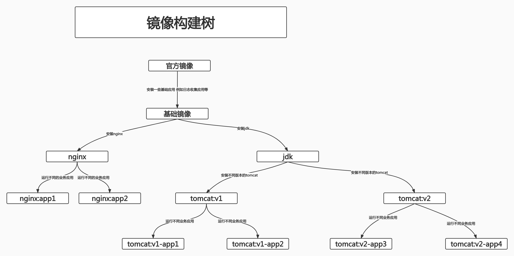

### 1.1 构建基础镜像

- step1 拉取官方镜像并上传至harbor

```
root@ks8-harbor-2:/opt/k8s-data# mkdir -pv base-img/system/centos7.8.2003
mkdir: created directory 'base-img'
mkdir: created directory 'base-img/system'
mkdir: created directory 'base-img/system/centos7.8.2003'
root@ks8-harbor-2:/opt/k8s-data# cd base-img/system/centos7.8.2003
root@ks8-harbor-2:/opt/k8s-data/base-img/system/centos7.8.2003# docker pull centos:7.8.2003
7.8.2003: Pulling from library/centos
9b4ebb48de8d: Pull complete 
Digest: sha256:8540a199ad51c6b7b51492fa9fee27549fd11b3bb913e888ab2ccf77cbb72cc1
Status: Downloaded newer image for centos:7.8.2003
docker.io/library/centos:7.8.2003
root@ks8-harbor-2:/opt/k8s-data/base-img/system/centos7.8.2003# docker tag centos:7.8.2003 harbor.k8s.com/baseimages/centos:7.8.2003
root@ks8-harbor-2:/opt/k8s-data/base-img/system/centos7.8.2003# docker push harbor.k8s.com/baseimages/centos:7.8.2003
The push refers to repository [harbor.k8s.com/baseimages/centos]
fb82b029bea0: Pushed 
7.8.2003: digest: sha256:50b9a3bc27378889210f88d6d0695938e45a912aa99b3fdacfb9a0fef511f15a size: 529
```

- step2 编写构建基础镜像的Dockerfile

```
root@ks8-harbor-2:/opt/k8s-data/base-img/system/centos7.8.2003# vim Dockerfile
root@ks8-harbor-2:/opt/k8s-data/base-img/system/centos7.8.2003# cat Dockerfile 
# 系统镜像
FROM harbor.k8s.com/baseimages/centos:7.8.2003
MAINTAINER Roach 40486453@qq.com

ADD filebeat-7.6.2-x86_64.rpm /tmp
RUN yum install -y /tmp/filebeat-7.6.2-x86_64.rpm vim wget tree  lrzsz gcc gcc-c++ automake pcre pcre-devel zlib zlib-devel openssl openssl-devel iproute net-tools iotop &&  rm -rf /etc/localtime /tmp/filebeat-7.6.2-x86_64.rpm && ln -snf /usr/share/zoneinfo/Asia/Shanghai /etc/localtime && useradd  www -u 2020 && useradd nginx -u 2021
```

- step3. 下载filebeat

```
root@ks8-harbor-2:/opt/k8s-data/base-img/system/centos7.8.2003# tree ./
./
├── Dockerfile
└── filebeat-7.6.2-x86_64.rpm

0 directories, 2 files
```

- step4. 编写构建基础镜像的脚本build-command.sh

```
root@ks8-harbor-2:/opt/k8s-data/base-img/system/centos7.8.2003# vim build-command.sh
root@ks8-harbor-2:/opt/k8s-data/base-img/system/centos7.8.2003# cat build-command.sh
```

```shell
#!/bin/bash
docker build -t harbor.k8s.com/baseimages/erp-centos-base:7.8.2003 . --network=host
docker push harbor.k8s.com/baseimages/erp-centos-base:7.8.2003

root@ks8-harbor-2:/opt/k8s-data/base-img/system/centos7.8.2003# chmod a+x build-command.sh 
```

- step5. 构建镜像并推送

```
root@ks8-harbor-2:/opt/k8s-data/base-img/system/centos7.8.2003# bash build-command.sh 
...
 ---> ea0de0e02bd4
Successfully built ea0de0e02bd4
Successfully tagged harbor.k8s.com/baseimages/erp-centos-base:7.8.2003
The push refers to repository [harbor.k8s.com/baseimages/erp-centos-base]
9af9a18fb5a7: Pushed 
0c09dd020e8e: Pushed 
fb82b029bea0: Mounted from baseimages/centos 
7.8.2003: digest: sha256:777da9535a0ef2253e98af5896b9a5099a4d49dff03405e1f0632d475a7ad7df size: 954
```

### 1.2 构建nginx镜像

#### 1.2.1 构建公共nginx1.18.0

公共镜像即nginx、jdk、tomcat等镜像,这种镜像无论哪个项目都可以用.

- step1. 编写Dockerfile

```
root@ks8-harbor-2:/opt/k8s-data/base-img/system/centos7.8.2003# cd ../../../
root@ks8-harbor-2:/opt/k8s-data# mkdir -p pub-img/nginx-base
root@ks8-harbor-2:/opt/k8s-data# cd pub-img/nginx-base
root@ks8-harbor-2:/opt/k8s-data/pub-img/nginx-base# vim Dockerfile
root@ks8-harbor-2:/opt/k8s-data/pub-img/nginx-base# cat Dockerfile
FROM harbor.k8s.com/baseimages/erp-centos-base:7.8.2003
MAINTAINER Roach 40486453@qq.com
ADD nginx-1.18.0.tar.gz /usr/local/src/
RUN yum install -y vim wget tree  lrzsz gcc gcc-c++ automake pcre pcre-devel zlib zlib-devel openssl openssl-devel iproute net-tools iotop
RUN cd /usr/local/src/nginx-1.18.0 && ./configure  && make && make install && ln -sv  /usr/local/nginx/sbin/nginx /usr/sbin/nginx  &&rm -rf /usr/local/src/nginx-1.18.0.tar.gz 
```

- step2. 下载nginx1.18.0安装包

```
root@ks8-harbor-2:/opt/k8s-data/pub-img/nginx-base# tree ./
./
├── Dockerfile
└── nginx-1.18.0.tar.gz

0 directories, 2 files
```

- step3. 编写构建公共镜像的脚本build-command.sh

```
root@ks8-harbor-2:/opt/k8s-data/pub-img/nginx-base# vim build-command.sh
root@ks8-harbor-2:/opt/k8s-data/pub-img/nginx-base# cat build-command.sh 
```

```shell
#!/bin/bash
docker build -t harbor.k8s.com/pub-images/nginx-base:v1.18.0 . --network=host
sleep 1
docker push harbor.k8s.com/pub-images/nginx-base:v1.18.0
root@ks8-harbor-2:/opt/k8s-data/pub-img/nginx-base# chmod a+x build-command.sh 
```

注意:此处是将构件好的镜像推送到了harbor中一个名为pub-images的项目中.并非baseimages项目.

- step4. 构建镜像并推送

```
root@ks8-harbor-2:/opt/k8s-data/pub-img/nginx-base# bash build-command.sh 
...
Successfully built e59b79b986d5
Successfully tagged harbor.k8s.com/pub-images/nginx-base:v1.18.0
The push refers to repository [harbor.k8s.com/pub-images/nginx-base]
3e556698af01: Pushed 
7ec25d195c38: Pushed 
a3d52d356904: Pushed 
9af9a18fb5a7: Mounted from baseimages/erp-centos-base 
0c09dd020e8e: Mounted from baseimages/erp-centos-base 
fb82b029bea0: Mounted from baseimages/erp-centos-base 
v1.18.0: digest: sha256:c10ae728795e6ff3f437bc8193992cd6bd9e35f904a72c9f756ee5fabfcd10bb size: 1588
```

- step5. 测试

```
root@ks8-harbor-2:~# docker run -it -p 8088:80 harbor.k8s.com/pub-images/nginx-base:v1.18.0
[root@f5ecb5427b33 /]# nginx
[root@f5ecb5427b33 /]# ss -tnl
State      Recv-Q Send-Q Local Address:Port               Peer Address:Port              
LISTEN     0      128          *:80                       *:*   
```

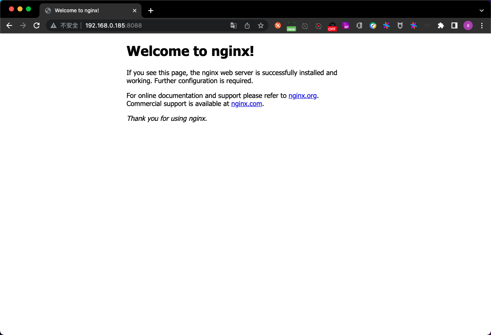

#### 1.2.2 基于nginx公共镜像构建业务镜像nginx-webapp

- step1. 编写nginx.conf

此处假定有一个项目需要运行在上一步编写的公共镜像上.故需要给该项目配置nginx的转发规则,因此需要编写nginx.conf

```
root@ks8-harbor-2:~# cd /opt/k8s-data/
root@ks8-harbor-2:/opt/k8s-data# mkdir -pv biz-img/webapp
mkdir: created directory 'biz-img'
mkdir: created directory 'biz-img/webapp'
root@ks8-harbor-2:/opt/k8s-data# cd biz-img/webapp
root@ks8-harbor-2:/opt/k8s-data/biz-img/webapp# vim nginx.conf
root@ks8-harbor-2:/opt/k8s-data/biz-img/webapp# cat nginx.conf
user  nginx nginx;
worker_processes  auto;

#error_log  logs/error.log;
#error_log  logs/error.log  notice;
#error_log  logs/error.log  info;

#pid        logs/nginx.pid;
daemon off;

events {
    worker_connections  1024;
}


http {
    include       mime.types;
    default_type  application/octet-stream;

    #log_format  main  '$remote_addr - $remote_user [$time_local] "$request" '
    #                  '$status $body_bytes_sent "$http_referer" '
    #                  '"$http_user_agent" "$http_x_forwarded_for"';

    #access_log  logs/access.log  main;

    sendfile        on;
    #tcp_nopush     on;

    #keepalive_timeout  0;
    keepalive_timeout  65;

    #gzip  on;

    server {
        listen       80;
        server_name  localhost;

        #charset koi8-r;

        #access_log  logs/host.access.log  main;

        location / {
            root   html;
            index  index.html index.htm;
        }

        # 业务项目转发规则
        location /webapp {
            root   html;
            index  index.html index.htm;
        }

        #error_page  404              /404.html;

        # redirect server error pages to the static page /50x.html
        #
        error_page   500 502 503 504  /50x.html;
        location = /50x.html {
            root   html;
        }

        # proxy the PHP scripts to Apache listening on 127.0.0.1:80
        #
        #location ~ \.php$ {
        #    proxy_pass   http://127.0.0.1;
        #}

        # pass the PHP scripts to FastCGI server listening on 127.0.0.1:9000
        #
        #location ~ \.php$ {
        #    root           html;
        #    fastcgi_pass   127.0.0.1:9000;
        #    fastcgi_index  index.php;
        #    fastcgi_param  SCRIPT_FILENAME  /scripts$fastcgi_script_name;
        #    include        fastcgi_params;
        #}

        # deny access to .htaccess files, if Apache's document root
        # concurs with nginx's one
        #
        #location ~ /\.ht {
        #    deny  all;
        #}
    }


    # another virtual host using mix of IP-, name-, and port-based configuration
    #
    #server {
    #    listen       8000;
    #    listen       somename:8080;
    #    server_name  somename  alias  another.alias;

    #    location / {
    #        root   html;
    #        index  index.html index.htm;
    #    }
    #}


    # HTTPS server
    #
    #server {
    #    listen       443 ssl;
    #    server_name  localhost;

    #    ssl_certificate      cert.pem;
    #    ssl_certificate_key  cert.key;

    #    ssl_session_cache    shared:SSL:1m;
    #    ssl_session_timeout  5m;

    #    ssl_ciphers  HIGH:!aNULL:!MD5;
    #    ssl_prefer_server_ciphers  on;

    #    location / {
    #        root   html;
    #        index  index.html index.htm;
    #    }
    #}

}
```

- step2. 编写一个页面,用于模拟业务项目,并将该html文件打包

```
root@ks8-harbor-2:/opt/k8s-data/biz-img/webapp# vim webapp-index.html
root@ks8-harbor-2:/opt/k8s-data/biz-img/webapp# cat webapp-index.html
```

```html
<!DOCTYPE html>
<html lang="en">
<head>
    <meta charset="UTF-8">
    <title>Devops</title>
</head>
<body>
<h1>webapp V1 index page</h1>
</body>
</html>
```

```
root@ks8-harbor-2:/opt/k8s-data/biz-img/webapp# tar -zcvf webapp.tar.gz webapp-index.html 
webapp-index.html
```

- step3. 编写一个页面,用于替换nginx默认的index页面

```
root@ks8-harbor-2:/opt/k8s-data/biz-img/webapp# vim index.html
root@ks8-harbor-2:/opt/k8s-data/biz-img/webapp# cat index.html
```

```html
<!DOCTYPE html>
<html lang="en">
<head>
    <meta charset="UTF-8">
    <title>default index</title>
</head>
<body>
<h1>default index page</h1>
</body>
</html>
```

- step4. 编写Dockerfile

```
root@ks8-harbor-2:/opt/k8s-data/biz-img/webapp# vim Dockerfile 
root@ks8-harbor-2:/opt/k8s-data/biz-img/webapp# cat Dockerfile 
FROM harbor.k8s.com/pub-images/nginx-base:v1.18.0
ADD nginx.conf /usr/local/nginx/conf/nginx.conf
ADD webapp.tar.gz /usr/local/nginx/html/webapp/
ADD index.html /usr/local/nginx/html/index.html

# 静态资源挂载路径 用于在K8S上创建pod时作为挂载点使用
RUN mkdir -p /usr/local/nginx/html/webapp/static /usr/local/nginx/html/webapp/images

EXPOSE 80 443

CMD ["nginx"]
```

- step5. 编写构建业务镜像的脚本build-command.sh

```
root@ks8-harbor-2:/opt/k8s-data/biz-img/webapp# vim build-command.sh
root@ks8-harbor-2:/opt/k8s-data/biz-img/webapp# cat build-command.sh
```

```shell
#!/bin/bash
TAG=$1
docker build -t harbor.k8s.com/erp/nginx-webapp:${TAG} .
echo "build image complete.Start push image to harbor now."
sleep 1
docker push harbor.k8s.com/erp/nginx-webapp:${TAG}
echo "Push image successfully."
```

```
root@ks8-harbor-2:/opt/k8s-data/biz-img/webapp# chmod a+x build-command.sh
```

- step6. 构建镜像

```
root@ks8-harbor-2:/opt/k8s-data/biz-img/webapp# bash build-command.sh v1
Sending build context to Docker daemon  9.728kB
Step 1/7 : FROM harbor.k8s.com/pub-images/nginx-base:v1.18.0
 ---> e59b79b986d5
Step 2/7 : ADD nginx.conf /usr/local/nginx/conf/nginx.conf
 ---> 7022378e0312
Step 3/7 : ADD webapp.tar.gz /usr/local/nginx/html/webapp/
 ---> d2d4c4dcd8ac
Step 4/7 : ADD index.html /usr/local/nginx/html/index.html
 ---> 4131a0cf3f8c
Step 5/7 : RUN mkdir -p /usr/local/nginx/html/webapp/static /usr/local/nginx/html/webapp/images
 ---> Running in 2495b0aa39b9
Removing intermediate container 2495b0aa39b9
 ---> 4a17b34542ee
Step 6/7 : EXPOSE 80 443
 ---> Running in 26c4a20a837d
Removing intermediate container 26c4a20a837d
 ---> 222a54e240c6
Step 7/7 : CMD ["nginx"]
 ---> Running in 67df6fca3835
Removing intermediate container 67df6fca3835
 ---> a9ef6eab8083
Successfully built a9ef6eab8083
Successfully tagged harbor.k8s.com/erp/nginx-webapp:v1
build image complete.Start push image to harbor now.
The push refers to repository [harbor.k8s.com/erp/nginx-webapp]
de97b4b129e3: Pushed 
3289eaca9977: Pushed 
f50410fd587b: Pushed 
8e0a97def235: Pushed 
3e556698af01: Mounted from pub-images/nginx-base 
7ec25d195c38: Mounted from pub-images/nginx-base 
a3d52d356904: Mounted from pub-images/nginx-base 
9af9a18fb5a7: Mounted from pub-images/nginx-base 
0c09dd020e8e: Mounted from pub-images/nginx-base 
fb82b029bea0: Mounted from pub-images/nginx-base 
v1: digest: sha256:6fcc23d64fb6b6051c71f84f0f0c5d83f7143980feb1129ffb11c706536b9f17 size: 2417
Push image successfully.
```

- step7. 测试

```
root@ks8-harbor-2:/opt/k8s-data/biz-img/webapp# docker run -it -p 8088:80 --rm harbor.k8s.com/erp/nginx-webapp:v1 bash
[root@9098a86ad3df /]# /usr/sbin/nginx 
```

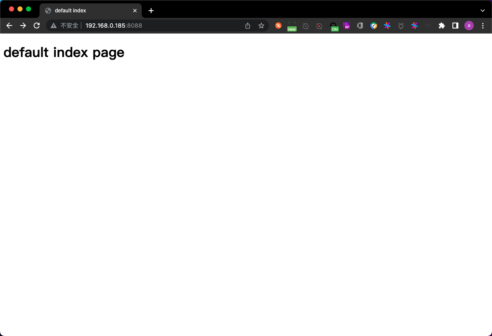

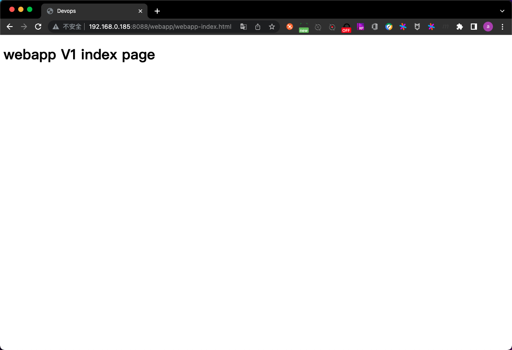

### 1.3 在K8S上运行nginx-webapp

#### 1.3.1 创建pod

```
root@k8s-master-1:~/k8s-data# mkdir nginx-webapp-yaml
root@k8s-master-1:~/k8s-data# cd nginx-webapp-yaml/
root@k8s-master-1:~/k8s-data/nginx-webapp-yaml# vim nginx-webapp-deployment.yaml
root@k8s-master-1:~/k8s-data/nginx-webapp-yaml# cat nginx-webapp-deployment.yaml
```

```yaml
kind: Deployment
apiVersion: apps/v1
metadata:
  labels:
    app: erp-nginx-webapp-deployment-label
  name: erp-nginx-webapp-deployment
  namespace: erp
spec:
  replicas: 1
  selector:
    matchLabels:
      app: erp-nginx-webapp-selector
  template:
    metadata:
      labels:
        app: erp-nginx-webapp-selector
    spec:
      containers:
        - name: erp-nginx-webapp-container
          image: harbor.k8s.com/erp/nginx-webapp:v1
          imagePullPolicy: Always
          ports:
            - containerPort: 80
              protocol: TCP
              name: http
            - containerPort: 443
              protocol: TCP
              name: https
          resources:
            limits:
              cpu: 300m
              memory: 256Mi
            requests:
              cpu: 200m
              memory: 128Mi
          volumeMounts:
            - name: nginx-webapp-images
              # 此处的挂载点是打镜像时创建的路径
              mountPath: /usr/local/nginx/html/webapp/images
              readOnly: false
            - name: nginx-webapp-static
              # 此处的挂载点是打镜像时创建的路径
              mountPath: /usr/local/nginx/html/webapp/static
              readOnly: false
      volumes:
        - name: nginx-webapp-images
          nfs:
            server: 172.16.1.189
            path: /data/k8sdata/nginx-webapp/images
        - name: nginx-webapp-static
          nfs:
            server: 172.16.1.189
            path: /data/k8sdata/nginx-webapp/static
```

```
root@k8s-master-1:~/k8s-data/nginx-webapp-yaml# kubectl apply -f nginx-webapp-deployment.yaml 
deployment.apps/erp-nginx-webapp-deployment created
root@k8s-master-1:~/k8s-data/nginx-webapp-yaml# kubectl get pod -n erp
NAME                                          READY   STATUS    RESTARTS   AGE
erp-nginx-webapp-deployment-5584658db-6xlps   1/1     Running   0          24s
zookeeper1-7ff6fbfbf-85krr                    1/1     Running   0          14h
zookeeper2-94cfd4596-mhzkk                    1/1     Running   0          14h
zookeeper3-7f55657779-h7s4z                   1/1     Running   0          14h
```

#### 1.3.2 创建service

```
root@k8s-master-1:~/k8s-data/nginx-webapp-yaml# vim nginx-webapp-service.yaml
root@k8s-master-1:~/k8s-data/nginx-webapp-yaml# cat nginx-webapp-service.yaml
```

```yaml
kind: Service
apiVersion: v1
metadata:
  labels:
    app: erp-nginx-webapp-service-label
  name: erp-nginx-webapp-service
  namespace: erp
spec:
  type: NodePort
  ports:
    - name: http
      port: 80
      protocol: TCP
      targetPort: 80
      nodePort: 40002
    - name: https
      port: 443
      protocol: TCP
      targetPort: 443
      nodePort: 40443
  selector:
    app: erp-nginx-webapp-selector
```

```
root@k8s-master-1:~/k8s-data/nginx-webapp-yaml# kubectl apply -f nginx-webapp-service.yaml 
service/erp-nginx-webapp-service created
root@k8s-master-1:~/k8s-data/nginx-webapp-yaml# kubectl get service -n erp
NAME                       TYPE       CLUSTER-IP       EXTERNAL-IP   PORT(S)                                        AGE
erp-nginx-webapp-service   NodePort   10.100.9.36      <none>        80:40002/TCP,443:40443/TCP                     9s
zookeeper1                 NodePort   10.100.184.160   <none>        2181:42181/TCP,2888:43385/TCP,3888:39547/TCP   14h
zookeeper2                 NodePort   10.100.17.68     <none>        2181:42182/TCP,2888:62636/TCP,3888:36521/TCP   14h
zookeeper3                 NodePort   10.100.146.59    <none>        2181:42183/TCP,2888:34167/TCP,3888:47769/TCP   14h
```

### 1.3.3 测试


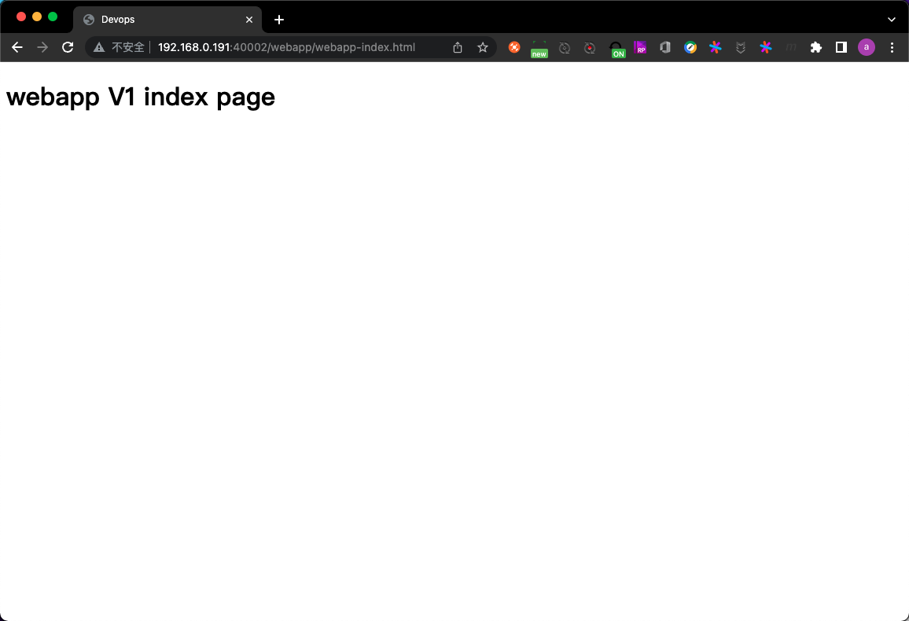

### 1.3.4 代码升级

此处以修改webapp-index.html为例,模拟代码升级

- step1. 修改webapp-index.html的内容并重新打包

```
root@ks8-harbor-2:/opt/k8s-data/biz-img/webapp# vim webapp-index.html 
root@ks8-harbor-2:/opt/k8s-data/biz-img/webapp# cat webapp-index.html
```

```html
<!DOCTYPE html>
<html lang="en">
<head>
    <meta charset="UTF-8">
    <title>Devops</title>
</head>
<body>
<h1>webapp V2 index page</h1>
</body>
</html>
```

```
root@ks8-harbor-2:/opt/k8s-data/biz-img/webapp# rm webapp.tar.gz 
root@ks8-harbor-2:/opt/k8s-data/biz-img/webapp# tar -zcvf webapp.tar.gz webapp-index.html 
webapp-index.html
```

- step2. 构建新版本镜像

```
root@ks8-harbor-2:/opt/k8s-data/biz-img/webapp# bash build-command.sh v2
Sending build context to Docker daemon  9.728kB
Step 1/7 : FROM harbor.k8s.com/pub-images/nginx-base:v1.18.0
 ---> e59b79b986d5
Step 2/7 : ADD nginx.conf /usr/local/nginx/conf/nginx.conf
 ---> Using cache
 ---> 7022378e0312
Step 3/7 : ADD webapp.tar.gz /usr/local/nginx/html/webapp/
 ---> 8ff9a4195fcc
Step 4/7 : ADD index.html /usr/local/nginx/html/index.html
 ---> c3092f24c7ef
Step 5/7 : RUN mkdir -p /usr/local/nginx/html/webapp/static /usr/local/nginx/html/webapp/images
 ---> Running in bd19b97931fb
Removing intermediate container bd19b97931fb
 ---> 8f3065fdbecb
Step 6/7 : EXPOSE 80 443
 ---> Running in 4a8b5347ce6c
Removing intermediate container 4a8b5347ce6c
 ---> 30e12091c0b3
Step 7/7 : CMD ["nginx"]
 ---> Running in 4ba19b10d3e5
Removing intermediate container 4ba19b10d3e5
 ---> 880d8f4f0053
Successfully built 880d8f4f0053
Successfully tagged harbor.k8s.com/erp/nginx-webapp:v2
build image complete.Start push image to harbor now.
The push refers to repository [harbor.k8s.com/erp/nginx-webapp]
1a81aede1289: Pushed 
6bfab14e75ca: Pushed 
19bbb1cbe21d: Pushed 
8e0a97def235: Layer already exists 
3e556698af01: Layer already exists 
7ec25d195c38: Layer already exists 
a3d52d356904: Layer already exists 
9af9a18fb5a7: Layer already exists 
0c09dd020e8e: Layer already exists 
fb82b029bea0: Layer already exists 
v2: digest: sha256:6f831b3f557cb7c842622f3f09d6688869809e88bd8cd8c0413736cbe2c14a9e size: 2417
Push image successfully.
```

- step3. 修改创建pod的yaml文件

```
root@k8s-master-1:~/k8s-data/nginx-webapp-yaml# vim nginx-webapp-deployment.yaml 
root@k8s-master-1:~/k8s-data/nginx-webapp-yaml# cat nginx-webapp-deployment.yaml
```

```yaml
kind: Deployment
apiVersion: apps/v1
metadata:
  labels:
    app: erp-nginx-webapp-deployment-label
  name: erp-nginx-webapp-deployment
  namespace: erp
spec:
  replicas: 1
  selector:
    matchLabels:
      app: erp-nginx-webapp-selector
  template:
    metadata:
      labels:
        app: erp-nginx-webapp-selector
    spec:
      containers:
        - name: erp-nginx-webapp-container
          image: harbor.k8s.com/erp/nginx-webapp:v2
          imagePullPolicy: Always
          ports:
            - containerPort: 80
              protocol: TCP
              name: http
            - containerPort: 443
              protocol: TCP
              name: https
          resources:
            limits:
              cpu: 300m
              memory: 256Mi
            requests:
              cpu: 200m
              memory: 128Mi
          volumeMounts:
            - name: nginx-webapp-images
              # 此处的挂载点是打镜像时创建的路径
              mountPath: /usr/local/nginx/html/webapp/images
              readOnly: false
            - name: nginx-webapp-static
              # 此处的挂载点是打镜像时创建的路径
              mountPath: /usr/local/nginx/html/webapp/static
              readOnly: false
      volumes:
        - name: nginx-webapp-images
          nfs:
            server: 172.16.1.189
            path: /data/k8sdata/nginx-webapp/images
        - name: nginx-webapp-static
          nfs:
            server: 172.16.1.189
            path: /data/k8sdata/nginx-webapp/static
```

```
root@k8s-master-1:~/k8s-data/nginx-webapp-yaml# kubectl apply -f nginx-webapp-deployment.yaml 
deployment.apps/erp-nginx-webapp-deployment configured
root@k8s-master-1:~/k8s-data/nginx-webapp-yaml# kubectl get pod -n erp
NAME                                           READY   STATUS        RESTARTS   AGE
erp-nginx-webapp-deployment-5584658db-6xlps    0/1     Terminating   0          14m
erp-nginx-webapp-deployment-699bc7887f-pql59   1/1     Running       0          29s
zookeeper1-7ff6fbfbf-85krr                     1/1     Running       0          15h
zookeeper2-94cfd4596-mhzkk                     1/1     Running       0          15h
zookeeper3-7f55657779-h7s4z                    1/1     Running       0          15h
root@k8s-master-1:~/k8s-data/nginx-webapp-yaml# kubectl get pod -n erp
NAME                                           READY   STATUS    RESTARTS   AGE
erp-nginx-webapp-deployment-699bc7887f-pql59   1/1     Running   0          44s
zookeeper1-7ff6fbfbf-85krr                     1/1     Running   0          15h
zookeeper2-94cfd4596-mhzkk                     1/1     Running   0          15h
zookeeper3-7f55657779-h7s4z                    1/1     Running   0          15h
```

可以看到,旧版本的pod被终止,新版本的pod正在运行

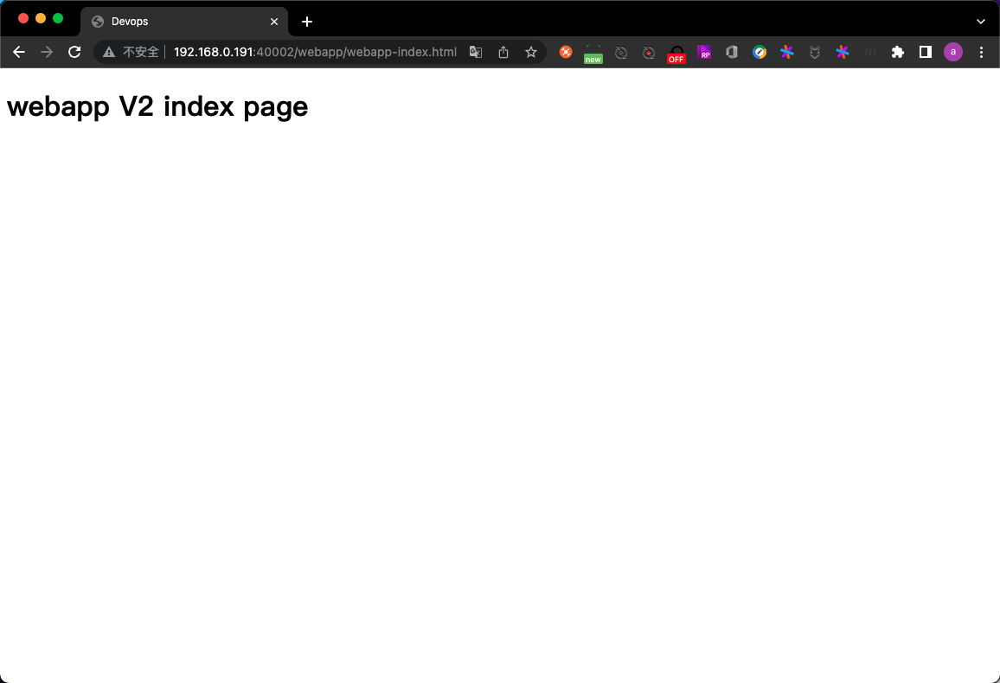

### 1.4 构建tomcat镜像

#### 1.4.1 构建jdk公共镜像

- step1. 上传jdk安装包和profile

```
root@ks8-harbor-2:/opt/k8s-data/pub-img# mkdir jdk-1.8.212
root@ks8-harbor-2:/opt/k8s-data/pub-img# cd jdk-1.8.212/
root@ks8-harbor-2:/opt/k8s-data/pub-img/jdk-1.8.212# tree ./
./
├── jdk-8u212-linux-x64.tar.gz
└── profile

0 directories, 2 files
```

- step2. 编写Dockerfile

```
root@ks8-harbor-2:/opt/k8s-data/pub-img/jdk-1.8.212# vim Dockerfile
root@ks8-harbor-2:/opt/k8s-data/pub-img/jdk-1.8.212# cat Dockerfile
FROM harbor.k8s.com/baseimages/erp-centos-base:7.8.2003
MAINTAINER Roach 40486453@qq.com
ADD jdk-8u212-linux-x64.tar.gz /usr/local/src/
RUN ln -sv /usr/local/src/jdk1.8.0_212 /usr/local/jdk 
ADD profile /etc/profile

ENV JAVA_HOME /usr/local/jdk
ENV JRE_HOME $JAVA_HOME/jre
ENV CLASSPATH $JAVA_HOME/lib/:$JRE_HOME/lib/
ENV PATH $PATH:$JAVA_HOME/bin
```

- step3. 编写构建jdk公共镜像的脚本build-command.sh

```
root@ks8-harbor-2:/opt/k8s-data/pub-img/jdk-1.8.212# vim build-command.sh
root@ks8-harbor-2:/opt/k8s-data/pub-img/jdk-1.8.212# cat build-command.sh
```

```shell
#!/bin/bash
docker build -t harbor.k8s.com/pub-images/jdk-base:v8.212 . 
sleep 1
docker push harbor.k8s.com/pub-images/jdk-base:v8.212
```

```
root@ks8-harbor-2:/opt/k8s-data/pub-img/jdk-1.8.212# chmod a+x build-command.sh 
```

- step4. 构建镜像

```
root@ks8-harbor-2:/opt/k8s-data/pub-img/jdk-1.8.212# bash build-command.sh 
Sending build context to Docker daemon    195MB
Step 1/9 : FROM harbor.k8s.com/baseimages/erp-centos-base:7.8.2003
 ---> ea0de0e02bd4
Step 2/9 : MAINTAINER Roach 40486453@qq.com
 ---> Using cache
 ---> 5f0777954f3e
Step 3/9 : ADD jdk-8u212-linux-x64.tar.gz /usr/local/src/
 ---> 3b7292bd1c67
Step 4/9 : RUN ln -sv /usr/local/src/jdk1.8.0_212 /usr/local/jdk
 ---> Running in 518cd88b7948
'/usr/local/jdk' -> '/usr/local/src/jdk1.8.0_212'
Removing intermediate container 518cd88b7948
 ---> 272b5ca87636
Step 5/9 : ADD profile /etc/profile
 ---> b93692b8e454
Step 6/9 : ENV JAVA_HOME /usr/local/jdk
 ---> Running in 02845ccfe24e
Removing intermediate container 02845ccfe24e
 ---> 84e2fa3945b3
Step 7/9 : ENV JRE_HOME $JAVA_HOME/jre
 ---> Running in c1f344bd74cd
Removing intermediate container c1f344bd74cd
 ---> 5d5cef6f6ca2
Step 8/9 : ENV CLASSPATH $JAVA_HOME/lib/:$JRE_HOME/lib/
 ---> Running in cc17cea50b6a
Removing intermediate container cc17cea50b6a
 ---> 31e9d0da4e99
Step 9/9 : ENV PATH $PATH:$JAVA_HOME/bin
 ---> Running in 4f21b8d32016
Removing intermediate container 4f21b8d32016
 ---> 7e075f036c9b
Successfully built 7e075f036c9b
Successfully tagged harbor.k8s.com/pub-images/jdk-base:v8.212
The push refers to repository [harbor.k8s.com/pub-images/jdk-base]
039fc3b13371: Pushed 
4ac69e34cb8f: Pushed 
2ee5b94985e2: Pushed 
9af9a18fb5a7: Mounted from pub-images/nginx-base 
0c09dd020e8e: Mounted from pub-images/nginx-base 
fb82b029bea0: Mounted from pub-images/nginx-base 
v8.212: digest: sha256:9ee335001c734dd36b072348242cdadab9cd999e275aaff6399beefed1ec1112 size: 1582
```

- step5. 测试

```
root@ks8-harbor-2:/opt/k8s-data/pub-img/jdk-1.8.212# docker run -it --rm harbor.k8s.com/pub-images/jdk-base:v8.212 bash
[root@0ad67e21aeeb /]# java -version
java version "1.8.0_212"
Java(TM) SE Runtime Environment (build 1.8.0_212-b10)
Java HotSpot(TM) 64-Bit Server VM (build 25.212-b10, mixed mode)
```

#### 1.4.2 构建tomcat公共镜像

- step1. 上传tomcat安装包

```
root@ks8-harbor-2:/opt/k8s-data/pub-img/tomcat-base-8.5.43# tree ./
./
└── apache-tomcat-8.5.43.tar.gz

0 directories, 1 file
```

- step2. 编写Dockerfile

```
root@ks8-harbor-2:/opt/k8s-data/pub-img/tomcat-base-8.5.43# vim Dockerfile
root@ks8-harbor-2:/opt/k8s-data/pub-img/tomcat-base-8.5.43# cat Dockerfile
FROM harbor.k8s.com/pub-images/jdk-base:v8.212
MAINTAINER Roach 40486453@qq.com

# /apps 用于tomcat的安装路径
# /data/tomcat/webapps 用于存放代码
# /data/tomcat/logs 用于存放tomcat日志
RUN mkdir -pv /apps /data/tomcat/webapps /data/tomcat/logs
ADD apache-tomcat-8.5.43.tar.gz  /apps
RUN useradd tomcat -u 2022 && ln -sv /apps/apache-tomcat-8.5.43 /apps/tomcat && chown -R tomcat.tomcat /apps /data -R
```

- step3. 编写构建公共镜像的脚本build-command.sh

```
root@ks8-harbor-2:/opt/k8s-data/pub-img/tomcat-base-8.5.43# vim build-command.sh
root@ks8-harbor-2:/opt/k8s-data/pub-img/tomcat-base-8.5.43# cat build-command.sh
```

```shell
#!/bin/bash
docker build -t harbor.k8s.com/pub-images/tomcat-base:v8.5.43 .
sleep 3
docker push harbor.k8s.com/pub-images/tomcat-base:v8.5.43
```

```
root@ks8-harbor-2:/opt/k8s-data/pub-img/tomcat-base-8.5.43# chmod a+x build-command.sh 
```

- step4. 构建镜像

```
root@ks8-harbor-2:/opt/k8s-data/pub-img/tomcat-base-8.5.43# bash build-command.sh 
Sending build context to Docker daemon  9.721MB
Step 1/5 : FROM harbor.k8s.com/pub-images/jdk-base:v8.212
 ---> 7e075f036c9b
Step 2/5 : MAINTAINER Roach 40486453@qq.com
 ---> Running in 25522b46eb49
Removing intermediate container 25522b46eb49
 ---> 16122955f193
Step 3/5 : RUN mkdir -pv /apps /data/tomcat/webapps /data/tomcat/logs
 ---> Running in e338b53805a2
mkdir: created directory '/apps'
mkdir: created directory '/data'
mkdir: created directory '/data/tomcat'
mkdir: created directory '/data/tomcat/webapps'
mkdir: created directory '/data/tomcat/logs'
Removing intermediate container e338b53805a2
 ---> cd8369021a92
Step 4/5 : ADD apache-tomcat-8.5.43.tar.gz  /apps
 ---> 87414d822f0c
Step 5/5 : RUN useradd tomcat -u 2022 && ln -sv /apps/apache-tomcat-8.5.43 /apps/tomcat && chown -R tomcat.tomcat /apps /data -R
 ---> Running in 3436470b7f02
'/apps/tomcat' -> '/apps/apache-tomcat-8.5.43'
Removing intermediate container 3436470b7f02
 ---> ac083b512a5e
Successfully built ac083b512a5e
Successfully tagged harbor.k8s.com/pub-images/tomcat-base:v8.5.43
The push refers to repository [harbor.k8s.com/pub-images/tomcat-base]
2bd93493f37e: Pushed 
055705620574: Pushed 
00316608f3f7: Pushed 
039fc3b13371: Mounted from pub-images/jdk-base 
4ac69e34cb8f: Mounted from pub-images/jdk-base 
2ee5b94985e2: Mounted from pub-images/jdk-base 
9af9a18fb5a7: Mounted from pub-images/jdk-base 
0c09dd020e8e: Mounted from pub-images/jdk-base 
fb82b029bea0: Mounted from pub-images/jdk-base 
v8.5.43: digest: sha256:51e668e7861a6e065074a34adb3cc9a1084c81ffd37047af7a610317ace1a95b size: 2211
```

#### 1.4.3 构建tomcat业务镜像

- step1. 创建一些html文件模拟业务代码并打包

```
root@ks8-harbor-2:/opt/k8s-data/pub-img/tomcat-base-8.5.43# cd ../../biz-img/
root@ks8-harbor-2:/opt/k8s-data/biz-img# mkdir tomcatapp
root@ks8-harbor-2:/opt/k8s-data/biz-img# cd tomcatapp/
root@ks8-harbor-2:/opt/k8s-data/biz-img/tomcatapp# mkdir app
root@ks8-harbor-2:/opt/k8s-data/biz-img/tomcatapp# cd app/
root@ks8-harbor-2:/opt/k8s-data/biz-img/tomcatapp/app# vim index.html
root@ks8-harbor-2:/opt/k8s-data/biz-img/tomcatapp/app# cat index.html
```

```html
<!DOCTYPE html>
<html lang="en">
<head>
    <meta charset="UTF-8">
    <title>app服务首页</title>
</head>
<body>
<h1>app V1 index page</h1>
</body>
</html>
```

```
root@ks8-harbor-2:/opt/k8s-data/biz-img/tomcatapp/app# vim index1.html
root@ks8-harbor-2:/opt/k8s-data/biz-img/tomcatapp/app# cat index1.html
```

```html
<!DOCTYPE html>
<html lang="en">
<head>
    <meta charset="UTF-8">
    <title>app服务首页</title>
</head>
<body>
<h1>app V1 index1 page</h1>
</body>
</html>
```

```
root@ks8-harbor-2:/opt/k8s-data/biz-img/tomcatapp/app# mkdir -v dir1 dir2
mkdir: created directory 'dir1'
mkdir: created directory 'dir2'
root@ks8-harbor-2:/opt/k8s-data/biz-img/tomcatapp/app# cd dir1
root@ks8-harbor-2:/opt/k8s-data/biz-img/tomcatapp/app/dir1# vim index.html
root@ks8-harbor-2:/opt/k8s-data/biz-img/tomcatapp/app/dir1# cat index.html
```

```html
<!DOCTYPE html>
<html lang="en">
<head>
    <meta charset="UTF-8">
    <title>app/dir1</title>
</head>
<body>
<h1>app/dir1 index page</h1>
</body>
</html>
```

```
root@ks8-harbor-2:/opt/k8s-data/biz-img/tomcatapp/app/dir1# cd ../dir2/
root@ks8-harbor-2:/opt/k8s-data/biz-img/tomcatapp/app/dir2# vim index.html
root@ks8-harbor-2:/opt/k8s-data/biz-img/tomcatapp/app/dir2# cat index.html
```

```html
<!DOCTYPE html>
<html lang="en">
<head>
    <meta charset="UTF-8">
    <title>app/dir2</title>
</head>
<body>
<h1>app/dir2 index page</h1>
</body>
</html>
```

```
root@ks8-harbor-2:/opt/k8s-data/biz-img/tomcatapp# mkdir myapp
root@ks8-harbor-2:/opt/k8s-data/biz-img/tomcatapp# cd myapp/
root@ks8-harbor-2:/opt/k8s-data/biz-img/tomcatapp/myapp# vim index.html
root@ks8-harbor-2:/opt/k8s-data/biz-img/tomcatapp/myapp# cat index.html
```

```html
<!DOCTYPE html>
<html lang="en">
<head>
    <meta charset="UTF-8">
    <title>myapp服务首页</title>
</head>
<body>
<h1>myapp V1 index1 page</h1>
</body>
</html>
```

打包:

```
root@ks8-harbor-2:/opt/k8s-data/biz-img/tomcatapp/app# cd ..
root@ks8-harbor-2:/opt/k8s-data/biz-img/tomcatapp# tar -zcvf app.tar.gz ./app/
./app/
./app/dir1/
./app/dir1/index.html
./app/index.html
./app/index1.html
./app/dir2/
./app/dir2/index.html
```

总体目录结构如下:

```
root@ks8-harbor-2:/opt/k8s-data/biz-img/tomcatapp# tree ./
./
├── app
│   ├── dir1
│   │   └── index.html
│   ├── dir2
│   │   └── index.html
│   ├── index1.html
│   └── index.html
├── app.tar.gz
└── myapp
    └── index.html

4 directories, 6 files
```

- step2. 编写catalina.sh

```
root@ks8-harbor-2:/opt/k8s-data/biz-img/tomcatapp# vim catalina.sh
root@ks8-harbor-2:/opt/k8s-data/biz-img/tomcatapp# cat catalina.sh
```

```shell
#!/bin/sh

# Licensed to the Apache Software Foundation (ASF) under one or more
# contributor license agreements.  See the NOTICE file distributed with
# this work for additional information regarding copyright ownership.
# The ASF licenses this file to You under the Apache License, Version 2.0
# (the "License"); you may not use this file except in compliance with
# the License.  You may obtain a copy of the License at
#
#     http://www.apache.org/licenses/LICENSE-2.0
#
# Unless required by applicable law or agreed to in writing, software
# distributed under the License is distributed on an "AS IS" BASIS,
# WITHOUT WARRANTIES OR CONDITIONS OF ANY KIND, either express or implied.
# See the License for the specific language governing permissions and
# limitations under the License.

# -----------------------------------------------------------------------------
# Control Script for the CATALINA Server
#
# Environment Variable Prerequisites
#
#   Do not set the variables in this script. Instead put them into a script
#   setenv.sh in CATALINA_BASE/bin to keep your customizations separate.
#
#   CATALINA_HOME   May point at your Catalina "build" directory.
#
#   CATALINA_BASE   (Optional) Base directory for resolving dynamic portions
#                   of a Catalina installation.  If not present, resolves to
#                   the same directory that CATALINA_HOME points to.
#
#   CATALINA_OUT    (Optional) Full path to a file where stdout and stderr
#                   will be redirected.
#                   Default is $CATALINA_BASE/logs/catalina.out
#
#   CATALINA_OPTS   (Optional) Java runtime options used when the "start",
#                   "run" or "debug" command is executed.
#                   Include here and not in JAVA_OPTS all options, that should
#                   only be used by Tomcat itself, not by the stop process,
#                   the version command etc.
#                   Examples are heap size, GC logging, JMX ports etc.
#
#   CATALINA_TMPDIR (Optional) Directory path location of temporary directory
#                   the JVM should use (java.io.tmpdir).  Defaults to
#                   $CATALINA_BASE/temp.
#
#   JAVA_HOME       Must point at your Java Development Kit installation.
#                   Required to run the with the "debug" argument.
#
#   JRE_HOME        Must point at your Java Runtime installation.
#                   Defaults to JAVA_HOME if empty. If JRE_HOME and JAVA_HOME
#                   are both set, JRE_HOME is used.
#
#   JAVA_OPTS       (Optional) Java runtime options used when any command
#                   is executed.
#                   Include here and not in CATALINA_OPTS all options, that
#                   should be used by Tomcat and also by the stop process,
#                   the version command etc.
#                   Most options should go into CATALINA_OPTS.
#
#   JAVA_ENDORSED_DIRS (Optional) Lists of of colon separated directories
#                   containing some jars in order to allow replacement of APIs
#                   created outside of the JCP (i.e. DOM and SAX from W3C).
#                   It can also be used to update the XML parser implementation.
#                   Note that Java 9 no longer supports this feature.
#                   Defaults to $CATALINA_HOME/endorsed.
#
#   JPDA_TRANSPORT  (Optional) JPDA transport used when the "jpda start"
#                   command is executed. The default is "dt_socket".
#
#   JPDA_ADDRESS    (Optional) Java runtime options used when the "jpda start"
#                   command is executed. The default is localhost:8000.
#
#   JPDA_SUSPEND    (Optional) Java runtime options used when the "jpda start"
#                   command is executed. Specifies whether JVM should suspend
#                   execution immediately after startup. Default is "n".
#
#   JPDA_OPTS       (Optional) Java runtime options used when the "jpda start"
#                   command is executed. If used, JPDA_TRANSPORT, JPDA_ADDRESS,
#                   and JPDA_SUSPEND are ignored. Thus, all required jpda
#                   options MUST be specified. The default is:
#
#                   -agentlib:jdwp=transport=$JPDA_TRANSPORT,
#                       address=$JPDA_ADDRESS,server=y,suspend=$JPDA_SUSPEND
#
#   JSSE_OPTS       (Optional) Java runtime options used to control the TLS
#                   implementation when JSSE is used. Default is:
#                   "-Djdk.tls.ephemeralDHKeySize=2048"
#
#   CATALINA_PID    (Optional) Path of the file which should contains the pid
#                   of the catalina startup java process, when start (fork) is
#                   used
#
#   LOGGING_CONFIG  (Optional) Override Tomcat's logging config file
#                   Example (all one line)
#                   LOGGING_CONFIG="-Djava.util.logging.config.file=$CATALINA_BASE/conf/logging.properties"
#
#   LOGGING_MANAGER (Optional) Override Tomcat's logging manager
#                   Example (all one line)
#                   LOGGING_MANAGER="-Djava.util.logging.manager=org.apache.juli.ClassLoaderLogManager"
#
#   USE_NOHUP       (Optional) If set to the string true the start command will
#                   use nohup so that the Tomcat process will ignore any hangup
#                   signals. Default is "false" unless running on HP-UX in which
#                   case the default is "true"
# -----------------------------------------------------------------------------

JAVA_OPTS="-server -Xms1g -Xmx1g -Xss512k -Xmn1g -XX:CMSInitiatingOccupancyFraction=65  -XX:+UseFastAccessorMethods -XX:+AggressiveOpts -XX:+UseBiasedLocking -XX:+DisableExplicitGC -XX:MaxTenuringThreshold=10 -XX:NewSize=2048M -XX:MaxNewSize=2048M -XX:NewRatio=2 -XX:PermSize=128m -XX:MaxPermSize=512m -XX:CMSFullGCsBeforeCompaction=5 -XX:+ExplicitGCInvokesConcurrent -XX:+UseConcMarkSweepGC -XX:+UseParNewGC -XX:+CMSParallelRemarkEnabled"

# OS specific support.  $var _must_ be set to either true or false.
cygwin=false
darwin=false
os400=false
hpux=false
case "`uname`" in
CYGWIN*) cygwin=true;;
Darwin*) darwin=true;;
OS400*) os400=true;;
HP-UX*) hpux=true;;
esac

# resolve links - $0 may be a softlink
PRG="$0"

while [ -h "$PRG" ]; do
  ls=`ls -ld "$PRG"`
  link=`expr "$ls" : '.*-> \(.*\)$'`
  if expr "$link" : '/.*' > /dev/null; then
    PRG="$link"
  else
    PRG=`dirname "$PRG"`/"$link"
  fi
done

# Get standard environment variables
PRGDIR=`dirname "$PRG"`

# Only set CATALINA_HOME if not already set
[ -z "$CATALINA_HOME" ] && CATALINA_HOME=`cd "$PRGDIR/.." >/dev/null; pwd`

# Copy CATALINA_BASE from CATALINA_HOME if not already set
[ -z "$CATALINA_BASE" ] && CATALINA_BASE="$CATALINA_HOME"

# Ensure that any user defined CLASSPATH variables are not used on startup,
# but allow them to be specified in setenv.sh, in rare case when it is needed.
CLASSPATH=

if [ -r "$CATALINA_BASE/bin/setenv.sh" ]; then
  . "$CATALINA_BASE/bin/setenv.sh"
elif [ -r "$CATALINA_HOME/bin/setenv.sh" ]; then
  . "$CATALINA_HOME/bin/setenv.sh"
fi

# For Cygwin, ensure paths are in UNIX format before anything is touched
if $cygwin; then
  [ -n "$JAVA_HOME" ] && JAVA_HOME=`cygpath --unix "$JAVA_HOME"`
  [ -n "$JRE_HOME" ] && JRE_HOME=`cygpath --unix "$JRE_HOME"`
  [ -n "$CATALINA_HOME" ] && CATALINA_HOME=`cygpath --unix "$CATALINA_HOME"`
  [ -n "$CATALINA_BASE" ] && CATALINA_BASE=`cygpath --unix "$CATALINA_BASE"`
  [ -n "$CLASSPATH" ] && CLASSPATH=`cygpath --path --unix "$CLASSPATH"`
fi

# Ensure that neither CATALINA_HOME nor CATALINA_BASE contains a colon
# as this is used as the separator in the classpath and Java provides no
# mechanism for escaping if the same character appears in the path.
case $CATALINA_HOME in
  *:*) echo "Using CATALINA_HOME:   $CATALINA_HOME";
       echo "Unable to start as CATALINA_HOME contains a colon (:) character";
       exit 1;
esac
case $CATALINA_BASE in
  *:*) echo "Using CATALINA_BASE:   $CATALINA_BASE";
       echo "Unable to start as CATALINA_BASE contains a colon (:) character";
       exit 1;
esac

# For OS400
if $os400; then
  # Set job priority to standard for interactive (interactive - 6) by using
  # the interactive priority - 6, the helper threads that respond to requests
  # will be running at the same priority as interactive jobs.
  COMMAND='chgjob job('$JOBNAME') runpty(6)'
  system $COMMAND

  # Enable multi threading
  export QIBM_MULTI_THREADED=Y
fi

# Get standard Java environment variables
if $os400; then
  # -r will Only work on the os400 if the files are:
  # 1. owned by the user
  # 2. owned by the PRIMARY group of the user
  # this will not work if the user belongs in secondary groups
  . "$CATALINA_HOME"/bin/setclasspath.sh
else
  if [ -r "$CATALINA_HOME"/bin/setclasspath.sh ]; then
    . "$CATALINA_HOME"/bin/setclasspath.sh
  else
    echo "Cannot find $CATALINA_HOME/bin/setclasspath.sh"
    echo "This file is needed to run this program"
    exit 1
  fi
fi

# Add on extra jar files to CLASSPATH
if [ ! -z "$CLASSPATH" ] ; then
  CLASSPATH="$CLASSPATH":
fi
CLASSPATH="$CLASSPATH""$CATALINA_HOME"/bin/bootstrap.jar

if [ -z "$CATALINA_OUT" ] ; then
  CATALINA_OUT="$CATALINA_BASE"/logs/catalina.out
fi

if [ -z "$CATALINA_TMPDIR" ] ; then
  # Define the java.io.tmpdir to use for Catalina
  CATALINA_TMPDIR="$CATALINA_BASE"/temp
fi

# Add tomcat-juli.jar to classpath
# tomcat-juli.jar can be over-ridden per instance
if [ -r "$CATALINA_BASE/bin/tomcat-juli.jar" ] ; then
  CLASSPATH=$CLASSPATH:$CATALINA_BASE/bin/tomcat-juli.jar
else
  CLASSPATH=$CLASSPATH:$CATALINA_HOME/bin/tomcat-juli.jar
fi

# Bugzilla 37848: When no TTY is available, don't output to console
have_tty=0
if [ "`tty`" != "not a tty" ]; then
    have_tty=1
fi

# For Cygwin, switch paths to Windows format before running java
if $cygwin; then
  JAVA_HOME=`cygpath --absolute --windows "$JAVA_HOME"`
  JRE_HOME=`cygpath --absolute --windows "$JRE_HOME"`
  CATALINA_HOME=`cygpath --absolute --windows "$CATALINA_HOME"`
  CATALINA_BASE=`cygpath --absolute --windows "$CATALINA_BASE"`
  CATALINA_TMPDIR=`cygpath --absolute --windows "$CATALINA_TMPDIR"`
  CLASSPATH=`cygpath --path --windows "$CLASSPATH"`
  JAVA_ENDORSED_DIRS=`cygpath --path --windows "$JAVA_ENDORSED_DIRS"`
fi

if [ -z "$JSSE_OPTS" ] ; then
  JSSE_OPTS="-Djdk.tls.ephemeralDHKeySize=2048"
fi
JAVA_OPTS="$JAVA_OPTS $JSSE_OPTS"

# Register custom URL handlers
# Do this here so custom URL handles (specifically 'war:...') can be used in the security policy
JAVA_OPTS="$JAVA_OPTS -Djava.protocol.handler.pkgs=org.apache.catalina.webresources"

# Set juli LogManager config file if it is present and an override has not been issued
if [ -z "$LOGGING_CONFIG" ]; then
  if [ -r "$CATALINA_BASE"/conf/logging.properties ]; then
    LOGGING_CONFIG="-Djava.util.logging.config.file=$CATALINA_BASE/conf/logging.properties"
  else
    # Bugzilla 45585
    LOGGING_CONFIG="-Dnop"
  fi
fi

if [ -z "$LOGGING_MANAGER" ]; then
  LOGGING_MANAGER="-Djava.util.logging.manager=org.apache.juli.ClassLoaderLogManager"
fi

# Java 9 no longer supports the java.endorsed.dirs
# system property. Only try to use it if
# JAVA_ENDORSED_DIRS was explicitly set
# or CATALINA_HOME/endorsed exists.
ENDORSED_PROP=ignore.endorsed.dirs
if [ -n "$JAVA_ENDORSED_DIRS" ]; then
    ENDORSED_PROP=java.endorsed.dirs
fi
if [ -d "$CATALINA_HOME/endorsed" ]; then
    ENDORSED_PROP=java.endorsed.dirs
fi

# Uncomment the following line to make the umask available when using the
# org.apache.catalina.security.SecurityListener
#JAVA_OPTS="$JAVA_OPTS -Dorg.apache.catalina.security.SecurityListener.UMASK=`umask`"

if [ -z "$USE_NOHUP" ]; then
    if $hpux; then
        USE_NOHUP="true"
    else
        USE_NOHUP="false"
    fi
fi
unset _NOHUP
if [ "$USE_NOHUP" = "true" ]; then
    _NOHUP=nohup
fi

# Add the JAVA 9 specific start-up parameters required by Tomcat
JDK_JAVA_OPTIONS="$JDK_JAVA_OPTIONS --add-opens=java.base/java.lang=ALL-UNNAMED"
JDK_JAVA_OPTIONS="$JDK_JAVA_OPTIONS --add-opens=java.rmi/sun.rmi.transport=ALL-UNNAMED"
export JDK_JAVA_OPTIONS

# ----- Execute The Requested Command -----------------------------------------

# Bugzilla 37848: only output this if we have a TTY
if [ $have_tty -eq 1 ]; then
  echo "Using CATALINA_BASE:   $CATALINA_BASE"
  echo "Using CATALINA_HOME:   $CATALINA_HOME"
  echo "Using CATALINA_TMPDIR: $CATALINA_TMPDIR"
  if [ "$1" = "debug" ] ; then
    echo "Using JAVA_HOME:       $JAVA_HOME"
  else
    echo "Using JRE_HOME:        $JRE_HOME"
  fi
  echo "Using CLASSPATH:       $CLASSPATH"
  if [ ! -z "$CATALINA_PID" ]; then
    echo "Using CATALINA_PID:    $CATALINA_PID"
  fi
fi

if [ "$1" = "jpda" ] ; then
  if [ -z "$JPDA_TRANSPORT" ]; then
    JPDA_TRANSPORT="dt_socket"
  fi
  if [ -z "$JPDA_ADDRESS" ]; then
    JPDA_ADDRESS="localhost:8000"
  fi
  if [ -z "$JPDA_SUSPEND" ]; then
    JPDA_SUSPEND="n"
  fi
  if [ -z "$JPDA_OPTS" ]; then
    JPDA_OPTS="-agentlib:jdwp=transport=$JPDA_TRANSPORT,address=$JPDA_ADDRESS,server=y,suspend=$JPDA_SUSPEND"
  fi
  CATALINA_OPTS="$JPDA_OPTS $CATALINA_OPTS"
  shift
fi

if [ "$1" = "debug" ] ; then
  if $os400; then
    echo "Debug command not available on OS400"
    exit 1
  else
    shift
    if [ "$1" = "-security" ] ; then
      if [ $have_tty -eq 1 ]; then
        echo "Using Security Manager"
      fi
      shift
      exec "$_RUNJDB" "$LOGGING_CONFIG" $LOGGING_MANAGER $JAVA_OPTS $CATALINA_OPTS \
        -D$ENDORSED_PROP="$JAVA_ENDORSED_DIRS" \
        -classpath "$CLASSPATH" \
        -sourcepath "$CATALINA_HOME"/../../java \
        -Djava.security.manager \
        -Djava.security.policy=="$CATALINA_BASE"/conf/catalina.policy \
        -Dcatalina.base="$CATALINA_BASE" \
        -Dcatalina.home="$CATALINA_HOME" \
        -Djava.io.tmpdir="$CATALINA_TMPDIR" \
        org.apache.catalina.startup.Bootstrap "$@" start
    else
      exec "$_RUNJDB" "$LOGGING_CONFIG" $LOGGING_MANAGER $JAVA_OPTS $CATALINA_OPTS \
        -D$ENDORSED_PROP="$JAVA_ENDORSED_DIRS" \
        -classpath "$CLASSPATH" \
        -sourcepath "$CATALINA_HOME"/../../java \
        -Dcatalina.base="$CATALINA_BASE" \
        -Dcatalina.home="$CATALINA_HOME" \
        -Djava.io.tmpdir="$CATALINA_TMPDIR" \
        org.apache.catalina.startup.Bootstrap "$@" start
    fi
  fi

elif [ "$1" = "run" ]; then

  shift
  if [ "$1" = "-security" ] ; then
    if [ $have_tty -eq 1 ]; then
      echo "Using Security Manager"
    fi
    shift
    eval exec "\"$_RUNJAVA\"" "\"$LOGGING_CONFIG\"" $LOGGING_MANAGER $JAVA_OPTS $CATALINA_OPTS \
      -D$ENDORSED_PROP="\"$JAVA_ENDORSED_DIRS\"" \
      -classpath "\"$CLASSPATH\"" \
      -Djava.security.manager \
      -Djava.security.policy=="\"$CATALINA_BASE/conf/catalina.policy\"" \
      -Dcatalina.base="\"$CATALINA_BASE\"" \
      -Dcatalina.home="\"$CATALINA_HOME\"" \
      -Djava.io.tmpdir="\"$CATALINA_TMPDIR\"" \
      org.apache.catalina.startup.Bootstrap "$@" start
  else
    eval exec "\"$_RUNJAVA\"" "\"$LOGGING_CONFIG\"" $LOGGING_MANAGER $JAVA_OPTS $CATALINA_OPTS \
      -D$ENDORSED_PROP="\"$JAVA_ENDORSED_DIRS\"" \
      -classpath "\"$CLASSPATH\"" \
      -Dcatalina.base="\"$CATALINA_BASE\"" \
      -Dcatalina.home="\"$CATALINA_HOME\"" \
      -Djava.io.tmpdir="\"$CATALINA_TMPDIR\"" \
      org.apache.catalina.startup.Bootstrap "$@" start
  fi

elif [ "$1" = "start" ] ; then

  if [ ! -z "$CATALINA_PID" ]; then
    if [ -f "$CATALINA_PID" ]; then
      if [ -s "$CATALINA_PID" ]; then
        echo "Existing PID file found during start."
        if [ -r "$CATALINA_PID" ]; then
          PID=`cat "$CATALINA_PID"`
          ps -p $PID >/dev/null 2>&1
          if [ $? -eq 0 ] ; then
            echo "Tomcat appears to still be running with PID $PID. Start aborted."
            echo "If the following process is not a Tomcat process, remove the PID file and try again:"
            ps -f -p $PID
            exit 1
          else
            echo "Removing/clearing stale PID file."
            rm -f "$CATALINA_PID" >/dev/null 2>&1
            if [ $? != 0 ]; then
              if [ -w "$CATALINA_PID" ]; then
                cat /dev/null > "$CATALINA_PID"
              else
                echo "Unable to remove or clear stale PID file. Start aborted."
                exit 1
              fi
            fi
          fi
        else
          echo "Unable to read PID file. Start aborted."
          exit 1
        fi
      else
        rm -f "$CATALINA_PID" >/dev/null 2>&1
        if [ $? != 0 ]; then
          if [ ! -w "$CATALINA_PID" ]; then
            echo "Unable to remove or write to empty PID file. Start aborted."
            exit 1
          fi
        fi
      fi
    fi
  fi

  shift
  touch "$CATALINA_OUT"
  if [ "$1" = "-security" ] ; then
    if [ $have_tty -eq 1 ]; then
      echo "Using Security Manager"
    fi
    shift
    eval $_NOHUP "\"$_RUNJAVA\"" "\"$LOGGING_CONFIG\"" $LOGGING_MANAGER $JAVA_OPTS $CATALINA_OPTS \
      -D$ENDORSED_PROP="\"$JAVA_ENDORSED_DIRS\"" \
      -classpath "\"$CLASSPATH\"" \
      -Djava.security.manager \
      -Djava.security.policy=="\"$CATALINA_BASE/conf/catalina.policy\"" \
      -Dcatalina.base="\"$CATALINA_BASE\"" \
      -Dcatalina.home="\"$CATALINA_HOME\"" \
      -Djava.io.tmpdir="\"$CATALINA_TMPDIR\"" \
      org.apache.catalina.startup.Bootstrap "$@" start \
      >> "$CATALINA_OUT" 2>&1 "&"

  else
    eval $_NOHUP "\"$_RUNJAVA\"" "\"$LOGGING_CONFIG\"" $LOGGING_MANAGER $JAVA_OPTS $CATALINA_OPTS \
      -D$ENDORSED_PROP="\"$JAVA_ENDORSED_DIRS\"" \
      -classpath "\"$CLASSPATH\"" \
      -Dcatalina.base="\"$CATALINA_BASE\"" \
      -Dcatalina.home="\"$CATALINA_HOME\"" \
      -Djava.io.tmpdir="\"$CATALINA_TMPDIR\"" \
      org.apache.catalina.startup.Bootstrap "$@" start \
      >> "$CATALINA_OUT" 2>&1 "&"

  fi

  if [ ! -z "$CATALINA_PID" ]; then
    echo $! > "$CATALINA_PID"
  fi

  echo "Tomcat started."

elif [ "$1" = "stop" ] ; then

  shift

  SLEEP=5
  if [ ! -z "$1" ]; then
    echo $1 | grep "[^0-9]" >/dev/null 2>&1
    if [ $? -gt 0 ]; then
      SLEEP=$1
      shift
    fi
  fi

  FORCE=0
  if [ "$1" = "-force" ]; then
    shift
    FORCE=1
  fi

  if [ ! -z "$CATALINA_PID" ]; then
    if [ -f "$CATALINA_PID" ]; then
      if [ -s "$CATALINA_PID" ]; then
        kill -0 `cat "$CATALINA_PID"` >/dev/null 2>&1
        if [ $? -gt 0 ]; then
          echo "PID file found but no matching process was found. Stop aborted."
          exit 1
        fi
      else
        echo "PID file is empty and has been ignored."
      fi
    else
      echo "\$CATALINA_PID was set but the specified file does not exist. Is Tomcat running? Stop aborted."
      exit 1
    fi
  fi

  eval "\"$_RUNJAVA\"" $LOGGING_MANAGER $JAVA_OPTS \
    -D$ENDORSED_PROP="\"$JAVA_ENDORSED_DIRS\"" \
    -classpath "\"$CLASSPATH\"" \
    -Dcatalina.base="\"$CATALINA_BASE\"" \
    -Dcatalina.home="\"$CATALINA_HOME\"" \
    -Djava.io.tmpdir="\"$CATALINA_TMPDIR\"" \
    org.apache.catalina.startup.Bootstrap "$@" stop

  # stop failed. Shutdown port disabled? Try a normal kill.
  if [ $? != 0 ]; then
    if [ ! -z "$CATALINA_PID" ]; then
      echo "The stop command failed. Attempting to signal the process to stop through OS signal."
      kill -15 `cat "$CATALINA_PID"` >/dev/null 2>&1
    fi
  fi

  if [ ! -z "$CATALINA_PID" ]; then
    if [ -f "$CATALINA_PID" ]; then
      while [ $SLEEP -ge 0 ]; do
        kill -0 `cat "$CATALINA_PID"` >/dev/null 2>&1
        if [ $? -gt 0 ]; then
          rm -f "$CATALINA_PID" >/dev/null 2>&1
          if [ $? != 0 ]; then
            if [ -w "$CATALINA_PID" ]; then
              cat /dev/null > "$CATALINA_PID"
              # If Tomcat has stopped don't try and force a stop with an empty PID file
              FORCE=0
            else
              echo "The PID file could not be removed or cleared."
            fi
          fi
          echo "Tomcat stopped."
          break
        fi
        if [ $SLEEP -gt 0 ]; then
          sleep 1
        fi
        if [ $SLEEP -eq 0 ]; then
          echo "Tomcat did not stop in time."
          if [ $FORCE -eq 0 ]; then
            echo "PID file was not removed."
          fi
          echo "To aid diagnostics a thread dump has been written to standard out."
          kill -3 `cat "$CATALINA_PID"`
        fi
        SLEEP=`expr $SLEEP - 1 `
      done
    fi
  fi

  KILL_SLEEP_INTERVAL=5
  if [ $FORCE -eq 1 ]; then
    if [ -z "$CATALINA_PID" ]; then
      echo "Kill failed: \$CATALINA_PID not set"
    else
      if [ -f "$CATALINA_PID" ]; then
        PID=`cat "$CATALINA_PID"`
        echo "Killing Tomcat with the PID: $PID"
        kill -9 $PID
        while [ $KILL_SLEEP_INTERVAL -ge 0 ]; do
            kill -0 `cat "$CATALINA_PID"` >/dev/null 2>&1
            if [ $? -gt 0 ]; then
                rm -f "$CATALINA_PID" >/dev/null 2>&1
                if [ $? != 0 ]; then
                    if [ -w "$CATALINA_PID" ]; then
                        cat /dev/null > "$CATALINA_PID"
                    else
                        echo "The PID file could not be removed."
                    fi
                fi
                echo "The Tomcat process has been killed."
                break
            fi
            if [ $KILL_SLEEP_INTERVAL -gt 0 ]; then
                sleep 1
            fi
            KILL_SLEEP_INTERVAL=`expr $KILL_SLEEP_INTERVAL - 1 `
        done
        if [ $KILL_SLEEP_INTERVAL -lt 0 ]; then
            echo "Tomcat has not been killed completely yet. The process might be waiting on some system call or might be UNINTERRUPTIBLE."
        fi
      fi
    fi
  fi

elif [ "$1" = "configtest" ] ; then

    eval "\"$_RUNJAVA\"" $LOGGING_MANAGER $JAVA_OPTS \
      -D$ENDORSED_PROP="\"$JAVA_ENDORSED_DIRS\"" \
      -classpath "\"$CLASSPATH\"" \
      -Dcatalina.base="\"$CATALINA_BASE\"" \
      -Dcatalina.home="\"$CATALINA_HOME\"" \
      -Djava.io.tmpdir="\"$CATALINA_TMPDIR\"" \
      org.apache.catalina.startup.Bootstrap configtest
    result=$?
    if [ $result -ne 0 ]; then
        echo "Configuration error detected!"
    fi
    exit $result

elif [ "$1" = "version" ] ; then

    "$_RUNJAVA"   \
      -classpath "$CATALINA_HOME/lib/catalina.jar" \
      org.apache.catalina.util.ServerInfo

else

  echo "Usage: catalina.sh ( commands ... )"
  echo "commands:"
  if $os400; then
    echo "  debug             Start Catalina in a debugger (not available on OS400)"
    echo "  debug -security   Debug Catalina with a security manager (not available on OS400)"
  else
    echo "  debug             Start Catalina in a debugger"
    echo "  debug -security   Debug Catalina with a security manager"
  fi
  echo "  jpda start        Start Catalina under JPDA debugger"
  echo "  run               Start Catalina in the current window"
  echo "  run -security     Start in the current window with security manager"
  echo "  start             Start Catalina in a separate window"
  echo "  start -security   Start in a separate window with security manager"
  echo "  stop              Stop Catalina, waiting up to 5 seconds for the process to end"
  echo "  stop n            Stop Catalina, waiting up to n seconds for the process to end"
  echo "  stop -force       Stop Catalina, wait up to 5 seconds and then use kill -KILL if still running"
  echo "  stop n -force     Stop Catalina, wait up to n seconds and then use kill -KILL if still running"
  echo "  configtest        Run a basic syntax check on server.xml - check exit code for result"
  echo "  version           What version of tomcat are you running?"
  echo "Note: Waiting for the process to end and use of the -force option require that \$CATALINA_PID is defined"
  exit 1

fi
```

- step3. 编写server.xml

```
root@ks8-harbor-2:/opt/k8s-data/biz-img/tomcatapp# vim server.xml
root@ks8-harbor-2:/opt/k8s-data/biz-img/tomcatapp# cat server.xml
```

```xml
<?xml version='1.0' encoding='utf-8'?>
<!--
  Licensed to the Apache Software Foundation (ASF) under one or more
  contributor license agreements.  See the NOTICE file distributed with
  this work for additional information regarding copyright ownership.
  The ASF licenses this file to You under the Apache License, Version 2.0
  (the "License"); you may not use this file except in compliance with
  the License.  You may obtain a copy of the License at

      http://www.apache.org/licenses/LICENSE-2.0

  Unless required by applicable law or agreed to in writing, software
  distributed under the License is distributed on an "AS IS" BASIS,
  WITHOUT WARRANTIES OR CONDITIONS OF ANY KIND, either express or implied.
  See the License for the specific language governing permissions and
  limitations under the License.
-->
<!-- Note:  A "Server" is not itself a "Container", so you may not
     define subcomponents such as "Valves" at this level.
     Documentation at /docs/config/server.html
 -->
<Server port="8005" shutdown="SHUTDOWN">
  <Listener className="org.apache.catalina.startup.VersionLoggerListener" />
  <!-- Security listener. Documentation at /docs/config/listeners.html
  <Listener className="org.apache.catalina.security.SecurityListener" />
  -->
  <!--APR library loader. Documentation at /docs/apr.html -->
  <Listener className="org.apache.catalina.core.AprLifecycleListener" SSLEngine="on" />
  <!-- Prevent memory leaks due to use of particular java/javax APIs-->
  <Listener className="org.apache.catalina.core.JreMemoryLeakPreventionListener" />
  <Listener className="org.apache.catalina.mbeans.GlobalResourcesLifecycleListener" />
  <Listener className="org.apache.catalina.core.ThreadLocalLeakPreventionListener" />

  <!-- Global JNDI resources
       Documentation at /docs/jndi-resources-howto.html
  -->
  <GlobalNamingResources>
    <!-- Editable user database that can also be used by
         UserDatabaseRealm to authenticate users
    -->
    <Resource name="UserDatabase" auth="Container"
              type="org.apache.catalina.UserDatabase"
              description="User database that can be updated and saved"
              factory="org.apache.catalina.users.MemoryUserDatabaseFactory"
              pathname="conf/tomcat-users.xml" />
  </GlobalNamingResources>

  <!-- A "Service" is a collection of one or more "Connectors" that share
       a single "Container" Note:  A "Service" is not itself a "Container",
       so you may not define subcomponents such as "Valves" at this level.
       Documentation at /docs/config/service.html
   -->
  <Service name="Catalina">

    <!--The connectors can use a shared executor, you can define one or more named thread pools-->
    <!--
    <Executor name="tomcatThreadPool" namePrefix="catalina-exec-"
        maxThreads="150" minSpareThreads="4"/>
    -->


    <!-- A "Connector" represents an endpoint by which requests are received
         and responses are returned. Documentation at :
         Java HTTP Connector: /docs/config/http.html (blocking & non-blocking)
         Java AJP  Connector: /docs/config/ajp.html
         APR (HTTP/AJP) Connector: /docs/apr.html
         Define a non-SSL/TLS HTTP/1.1 Connector on port 8080
    -->
    <Connector port="8080" protocol="HTTP/1.1"
               connectionTimeout="20000"
               redirectPort="8443" />
    <!-- A "Connector" using the shared thread pool-->
    <!--
    <Connector executor="tomcatThreadPool"
               port="8080" protocol="HTTP/1.1"
               connectionTimeout="20000"
               redirectPort="8443" />
    -->
    <!-- Define a SSL/TLS HTTP/1.1 Connector on port 8443
         This connector uses the NIO implementation that requires the JSSE
         style configuration. When using the APR/native implementation, the
         OpenSSL style configuration is required as described in the APR/native
         documentation -->
    <!--
    <Connector port="8443" protocol="org.apache.coyote.http11.Http11NioProtocol"
               maxThreads="150" SSLEnabled="true" scheme="https" secure="true"
               clientAuth="false" sslProtocol="TLS" />
    -->

    <!-- Define an AJP 1.3 Connector on port 8009 -->
    <Connector port="8009" protocol="AJP/1.3" redirectPort="8443" />


    <!-- An Engine represents the entry point (within Catalina) that processes
         every request.  The Engine implementation for Tomcat stand alone
         analyzes the HTTP headers included with the request, and passes them
         on to the appropriate Host (virtual host).
         Documentation at /docs/config/engine.html -->

    <!-- You should set jvmRoute to support load-balancing via AJP ie :
    <Engine name="Catalina" defaultHost="localhost" jvmRoute="jvm1">
    -->
    <Engine name="Catalina" defaultHost="localhost">

      <!--For clustering, please take a look at documentation at:
          /docs/cluster-howto.html  (simple how to)
          /docs/config/cluster.html (reference documentation) -->
      <!--
      <Cluster className="org.apache.catalina.ha.tcp.SimpleTcpCluster"/>
      -->

      <!-- Use the LockOutRealm to prevent attempts to guess user passwords
           via a brute-force attack -->
      <Realm className="org.apache.catalina.realm.LockOutRealm">
        <!-- This Realm uses the UserDatabase configured in the global JNDI
             resources under the key "UserDatabase".  Any edits
             that are performed against this UserDatabase are immediately
             available for use by the Realm.  -->
        <Realm className="org.apache.catalina.realm.UserDatabaseRealm"
               resourceName="UserDatabase"/>
      </Realm>

      <!-- appBase:存放代码的路径 unpackWARs:自动解压缩 修改为false autoDeploy:自动部署 修改为false -->
      <Host name="localhost"  appBase="/data/tomcat/webapps"  unpackWARs="false" autoDeploy="false">

        <!-- SingleSignOn valve, share authentication between web applications
             Documentation at: /docs/config/valve.html -->
        <!--
        <Valve className="org.apache.catalina.authenticator.SingleSignOn" />
        -->

        <!-- Access log processes all example.
             Documentation at: /docs/config/valve.html
             Note: The pattern used is equivalent to using pattern="common" -->
        <Valve className="org.apache.catalina.valves.AccessLogValve" directory="logs"
               prefix="localhost_access_log" suffix=".txt"
               pattern="%h %l %u %t &quot;%r&quot; %s %b" />

      </Host>
    </Engine>
  </Service>
</Server>
```

- step4. 编写启动tomcat的脚本run_tomcat.sh

```
root@ks8-harbor-2:/opt/k8s-data/biz-img/tomcatapp# vim run_tomcat.sh
root@ks8-harbor-2:/opt/k8s-data/biz-img/tomcatapp# cat run_tomcat.sh
```

```shell
#!/bin/bash
# 此处必须以和nginx容器中启动nginx的用户相同的用户启动tomcat
# 否则nginx转发给时会报403错误 该用户在构建centos基础镜像时就已经创建了
su - nginx -c "/apps/tomcat/bin/catalina.sh start"
tail -f /etc/hosts
```

- step5. 编写Dockerfile

```
root@ks8-harbor-2:/opt/k8s-data/biz-img/tomcatapp# vim Dockerfile
root@ks8-harbor-2:/opt/k8s-data/biz-img/tomcatapp# cat Dockerfile
FROM harbor.k8s.com/pub-images/tomcat-base:v8.5.43
MAINTAINER Roach 40486453@qq.com

ADD catalina.sh /apps/tomcat/bin/catalina.sh
ADD server.xml /apps/tomcat/conf/server.xml
ADD app.tar.gz /data/tomcat/webapps/myapp/
ADD run_tomcat.sh /apps/tomcat/bin/run_tomcat.sh

# 此处需将tomcat的安装路径和业务代码的存放路径的属主属组修改为和nginx容器中运行
# nginx的用户相同的用户
RUN chown  -R nginx.nginx /data/ /apps/

EXPOSE 8080 8443

CMD ["/apps/tomcat/bin/run_tomcat.sh"]
```

- step6. 编写构建业务镜像的脚本build-command.sh

```
root@ks8-harbor-2:/opt/k8s-data/biz-img/tomcatapp# vim build-command.sh
root@ks8-harbor-2:/opt/k8s-data/biz-img/tomcatapp# cat build-command.sh
```

```shell
#!/bin/bash
TAG=$1
docker build -t  harbor.k8s.com/erp/tomcat-webapp:${TAG} .
sleep 3
docker push  harbor.k8s.com/erp/tomcat-webapp:${TAG}
```

```
root@ks8-harbor-2:/opt/k8s-data/biz-img/tomcatapp# chmod a+x *.sh
```

- step7. 构建镜像

```
root@ks8-harbor-2:/opt/k8s-data/biz-img/tomcatapp# bash build-command.sh v1
Sending build context to Docker daemon  44.03kB
Step 1/9 : FROM harbor.k8s.com/pub-images/tomcat-base:v8.5.43
 ---> ac083b512a5e
Step 2/9 : MAINTAINER Roach 40486453@qq.com
 ---> Running in f2817ab5fa46
Removing intermediate container f2817ab5fa46
 ---> 799298e705b1
Step 3/9 : ADD catalina.sh /apps/tomcat/bin/catalina.sh
 ---> ecddeeb41fcb
Step 4/9 : ADD server.xml /apps/tomcat/conf/server.xml
 ---> 813a5bf8b051
Step 5/9 : ADD app.tar.gz /data/tomcat/webapps/myapp/
 ---> 7bcc93679457
Step 6/9 : ADD run_tomcat.sh /apps/tomcat/bin/run_tomcat.sh
 ---> c16be89d0932
Step 7/9 : RUN chown  -R nginx.nginx /data/ /apps/
 ---> Running in e6f16f8c061a
Removing intermediate container e6f16f8c061a
 ---> 895e0e1b0fb1
Step 8/9 : EXPOSE 8080 8443
 ---> Running in 4b6f782caa04
Removing intermediate container 4b6f782caa04
 ---> a0b76e2a68bc
Step 9/9 : CMD ["/apps/tomcat/bin/run_tomcat.sh"]
 ---> Running in 462c50c306af
Removing intermediate container 462c50c306af
 ---> 5e5d996c838e
Successfully built 5e5d996c838e
Successfully tagged harbor.k8s.com/erp/tomcat-webapp:v1
The push refers to repository [harbor.k8s.com/erp/tomcat-webapp]
88aac6338261: Pushed 
14ad979cf953: Pushed 
569863613c87: Pushed 
c7eccf4a21b0: Pushed 
7599dd58f7bb: Pushed 
2bd93493f37e: Mounted from pub-images/tomcat-base 
055705620574: Mounted from pub-images/tomcat-base 
00316608f3f7: Mounted from pub-images/tomcat-base 
039fc3b13371: Mounted from pub-images/tomcat-base 
4ac69e34cb8f: Mounted from pub-images/tomcat-base 
2ee5b94985e2: Mounted from pub-images/tomcat-base 
9af9a18fb5a7: Mounted from erp/nginx-webapp 
0c09dd020e8e: Mounted from erp/nginx-webapp 
fb82b029bea0: Mounted from erp/nginx-webapp 
v1: digest: sha256:162a11a955aeb6e97cbc635afed47e1e6850dfd411ca62fb31486bf1a490ba26 size: 3252
```

- step8. 测试

```
root@ks8-harbor-2:/opt/k8s-data/biz-img/tomcatapp# docker run -it --rm -p 9900:8080 harbor.k8s.com/erp/tomcat-webapp:v1
Using CATALINA_BASE:   /apps/tomcat
Using CATALINA_HOME:   /apps/tomcat
Using CATALINA_TMPDIR: /apps/tomcat/temp
Using JRE_HOME:        /usr/local/jdk
Using CLASSPATH:       /apps/tomcat/bin/bootstrap.jar:/apps/tomcat/bin/tomcat-juli.jar
Tomcat started.
127.0.0.1	localhost
::1	localhost ip6-localhost ip6-loopback
fe00::0	ip6-localnet
ff00::0	ip6-mcastprefix
ff02::1	ip6-allnodes
ff02::2	ip6-allrouters
172.17.0.2	25b69bedae0c
```

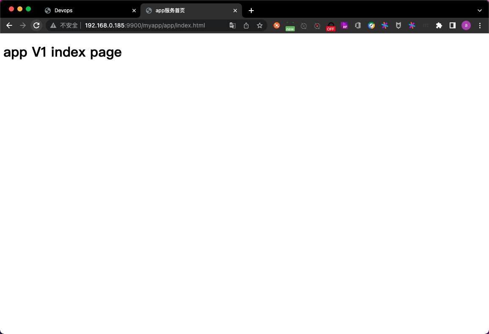

### 1.5 在K8S上运行tomcat-webapp

#### 1.5.1 创建pod

```
root@k8s-master-1:~/k8s-data# mkdir tomcat-webapp-yaml
root@k8s-master-1:~/k8s-data# cd tomcat-webapp-yaml/
root@k8s-master-1:~/k8s-data/tomcat-webapp-yaml# vim tomcat-webapp-deployment.yaml
root@k8s-master-1:~/k8s-data/tomcat-webapp-yaml# cat tomcat-webapp-deployment.yaml 
```

```yaml
kind: Deployment
apiVersion: apps/v1
metadata:
  labels:
    app: erp-tomcat-webapp-deployment-label
  name: erp-tomcat-webapp-deployment
  namespace:
    erp
spec:
  replicas: 1
  selector:
    matchLabels:
      app: erp-tomcat-webapp-selector
  template:
    metadata:
      labels:
        app: erp-tomcat-webapp-selector
    spec:
      containers:
        - name: erp-tomcat-webapp-container
          image: harbor.k8s.com/erp/tomcat-webapp:v1
          imagePullPolicy: Always
          ports:
            - containerPort: 8080
              protocol: TCP
              name: http
          resources:
            limits:
              cpu: 1
              memory: "512Mi"
            requests:
              cpu: 500m
              memory: "512Mi"
          volumeMounts:
            - name: tomcat-webapp-images
              mountPath: /usr/local/nginx/html/webapp/images
              readOnly: false
            - name: tomcat-webapp-static
              mountPath: /usr/local/nginx/html/webapp/static
              readOnly: false
      volumes:
        - name: tomcat-webapp-images
          nfs:
            server: 172.16.1.189
            path: /data/k8sdata/nginx-webapp/images
        - name: tomcat-webapp-static
          nfs:
            server: 172.16.1.189
            path: /data/k8sdata/nginx-webapp/static
```

```
root@k8s-master-1:~/k8s-data/tomcat-webapp-yaml# kubectl apply -f tomcat-webapp-deployment.yaml 
deployment.apps/erp-tomcat-webapp-deployment created
root@k8s-master-1:~/k8s-data/tomcat-webapp-yaml# kubectl get pod -n erp
NAME                                            READY   STATUS    RESTARTS   AGE
erp-nginx-webapp-deployment-699bc7887f-ctrb9    1/1     Running   0          126m
erp-tomcat-webapp-deployment-84bbf6b865-wgtjj   1/1     Running   0          22s
zookeeper1-7ff6fbfbf-j428g                      1/1     Running   0          127m
zookeeper2-94cfd4596-9bgll                      1/1     Running   0          127m
zookeeper3-7f55657779-h62k6                     1/1     Running   0          127m
```

#### 1.5.2 创建service

```
root@k8s-master-1:~/k8s-data/tomcat-webapp-yaml# vim tomcat-webapp-service.yaml
root@k8s-master-1:~/k8s-data/tomcat-webapp-yaml# cat tomcat-webapp-service.yaml
```

```yaml
kind: Service
apiVersion: v1
metadata: 
  labels:
    app: erp-tomcat-webapp-service-label
  name: erp-tomcat-webapp-service
  namespace: erp
spec:
  type: NodePort
  ports:
  - name: http
    port: 80
    protocol: TCP
    targetPort: 8080
    nodePort: 40003
  selector:
    app: erp-tomcat-webapp-selector
```

```
root@k8s-master-1:~/k8s-data/tomcat-webapp-yaml# kubectl apply -f tomcat-webapp-service.yaml 
service/erp-tomcat-webapp-service created
root@k8s-master-1:~/k8s-data/tomcat-webapp-yaml# kubectl get service -n erp
NAME                        TYPE       CLUSTER-IP       EXTERNAL-IP   PORT(S)                                        AGE
erp-nginx-webapp-service    NodePort   10.100.9.36      <none>        80:40002/TCP,443:40443/TCP                     13d
erp-tomcat-webapp-service   NodePort   10.100.139.19    <none>        80:40003/TCP                                   10s
zookeeper1                  NodePort   10.100.184.160   <none>        2181:42181/TCP,2888:43385/TCP,3888:39547/TCP   14d
zookeeper2                  NodePort   10.100.17.68     <none>        2181:42182/TCP,2888:62636/TCP,3888:36521/TCP   14d
zookeeper3                  NodePort   10.100.146.59    <none>        2181:42183/TCP,2888:34167/TCP,3888:47769/TCP   14d
```

#### 1.5.3 测试

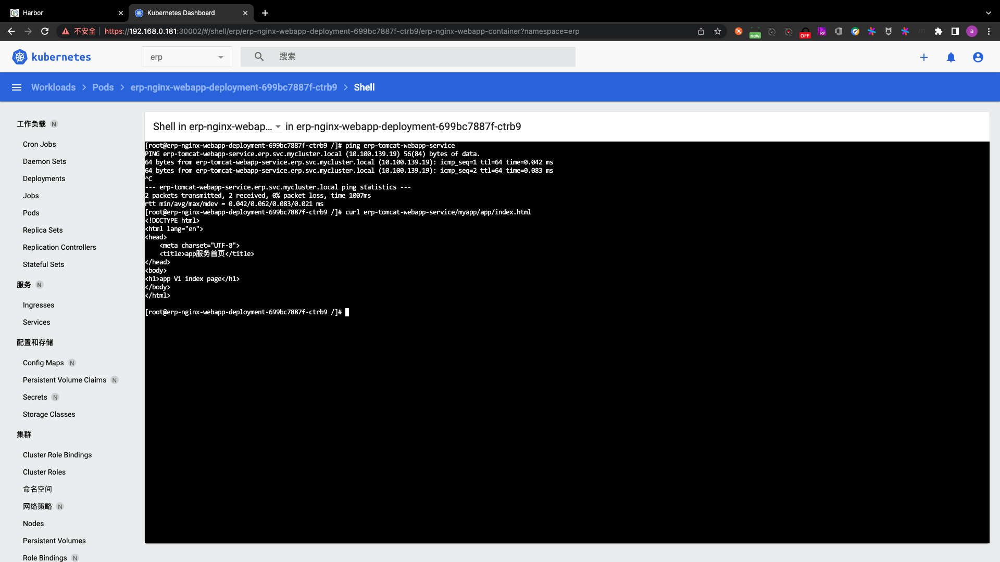

### 1.6 修改nginx.conf,将对myapp的请求转发给tomcatService

这一步修改后需要重新打镜像.

- step1. 修改nginx.conf文件

此处需配置转发规则和对应的upstream

```
root@ks8-harbor-2:/opt/k8s-data/biz-img/webapp# vim nginx.conf 
root@ks8-harbor-2:/opt/k8s-data/biz-img/webapp# cat nginx.conf
user  nginx nginx;
worker_processes  auto;

#error_log  logs/error.log;
#error_log  logs/error.log  notice;
#error_log  logs/error.log  info;

#pid        logs/nginx.pid;
daemon off;

events {
    worker_connections  1024;
}


http {
    include       mime.types;
    default_type  application/octet-stream;

    #log_format  main  '$remote_addr - $remote_user [$time_local] "$request" '
    #                  '$status $body_bytes_sent "$http_referer" '
    #                  '"$http_user_agent" "$http_x_forwarded_for"';

    #access_log  logs/access.log  main;

    sendfile        on;
    #tcp_nopush     on;

    #keepalive_timeout  0;
    keepalive_timeout  65;

    #gzip  on;
    
    # 定义upstream
    upstream  tomcat_webserver {
	    # 此处写的是service的全称 格式为:serviceName.namespace.svc.后缀:service的端口
	    # 其中后缀在创建集群时定义
            server   erp-tomcat-webapp-service.erp.svc.mycluster.local:80;
    }
    server {
        listen       80;
        server_name  localhost;

        #charset koi8-r;

        #access_log  logs/host.access.log  main;

        location / {
            root   html;
            index  index.html index.htm;
        }

        # 业务项目转发规则 此处的/webapp,指的是相对于nginx安装路径的webapp
        location /webapp {
            root   html;
            index  index.html index.htm;
        }

		# 将/myapp的请求转发给tomcat
        location /myapp {
             proxy_pass  http://tomcat_webserver;
             proxy_set_header   Host    $host;
             proxy_set_header   X-Forwarded-For $proxy_add_x_forwarded_for;
             proxy_set_header X-Real-IP $remote_addr;
        }

        #error_page  404              /404.html;

        # redirect server error pages to the static page /50x.html
        #
        error_page   500 502 503 504  /50x.html;
        location = /50x.html {
            root   html;
        }

        # proxy the PHP scripts to Apache listening on 127.0.0.1:80
        #
        #location ~ \.php$ {
        #    proxy_pass   http://127.0.0.1;
        #}

        # pass the PHP scripts to FastCGI server listening on 127.0.0.1:9000
        #
        #location ~ \.php$ {
        #    root           html;
        #    fastcgi_pass   127.0.0.1:9000;
        #    fastcgi_index  index.php;
        #    fastcgi_param  SCRIPT_FILENAME  /scripts$fastcgi_script_name;
        #    include        fastcgi_params;
        #}

        # deny access to .htaccess files, if Apache's document root
        # concurs with nginx's one
        #
        #location ~ /\.ht {
        #    deny  all;
        #}
    }


    # another virtual host using mix of IP-, name-, and port-based configuration
    #
    #server {
    #    listen       8000;
    #    listen       somename:8080;
    #    server_name  somename  alias  another.alias;

    #    location / {
    #        root   html;
    #        index  index.html index.htm;
    #    }
    #}


    # HTTPS server
    #
    #server {
    #    listen       443 ssl;
    #    server_name  localhost;

    #    ssl_certificate      cert.pem;
    #    ssl_certificate_key  cert.key;

    #    ssl_session_cache    shared:SSL:1m;
    #    ssl_session_timeout  5m;

    #    ssl_ciphers  HIGH:!aNULL:!MD5;
    #    ssl_prefer_server_ciphers  on;

    #    location / {
    #        root   html;
    #        index  index.html index.htm;
    #    }
    #}

}
```

- step2. 构建镜像

```
root@ks8-harbor-2:/opt/k8s-data/biz-img/webapp# bash build-command.sh v3
Sending build context to Docker daemon  10.24kB
Step 1/7 : FROM harbor.k8s.com/pub-images/nginx-base:v1.18.0
 ---> e59b79b986d5
Step 2/7 : ADD nginx.conf /usr/local/nginx/conf/nginx.conf
 ---> 77f0aca61980
Step 3/7 : ADD webapp.tar.gz /usr/local/nginx/html/webapp/
 ---> 539207c82ab1
Step 4/7 : ADD index.html /usr/local/nginx/html/index.html
 ---> ce694bedc263
Step 5/7 : RUN mkdir -p /usr/local/nginx/html/webapp/static /usr/local/nginx/html/webapp/images
 ---> Running in 73ede26c66ab
Removing intermediate container 73ede26c66ab
 ---> bf8481e15271
Step 6/7 : EXPOSE 80 443
 ---> Running in ac6405288567
Removing intermediate container ac6405288567
 ---> 3677b8129af2
Step 7/7 : CMD ["nginx"]
 ---> Running in 37f05cd3c965
Removing intermediate container 37f05cd3c965
 ---> c5b834834e38
Successfully built c5b834834e38
Successfully tagged harbor.k8s.com/erp/nginx-webapp:v3
build image complete.Start push image to harbor now.
The push refers to repository [harbor.k8s.com/erp/nginx-webapp]
b0651be0dc1d: Pushed 
bf11459c5e8f: Pushed 
6d57d8337e10: Pushed 
8a8aac29dc06: Pushed 
3e556698af01: Layer already exists 
7ec25d195c38: Layer already exists 
a3d52d356904: Layer already exists 
9af9a18fb5a7: Layer already exists 
0c09dd020e8e: Layer already exists 
fb82b029bea0: Layer already exists 
v3: digest: sha256:587d0e0fd196e0bf931bcc2a19fb41d50c0a2ec74acfd674ab6b87ab9e08277c size: 2417
Push image successfully.
```

- step3. 更新K8S中的镜像版本

```
root@k8s-master-1:~/k8s-data/nginx-webapp-yaml# vim nginx-webapp-deployment.yaml 
root@k8s-master-1:~/k8s-data/nginx-webapp-yaml# cat nginx-webapp-deployment.yaml
```

```yaml
kind: Deployment
apiVersion: apps/v1
metadata:
  labels:
    app: erp-nginx-webapp-deployment-label
  name: erp-nginx-webapp-deployment
  namespace: erp
spec:
  replicas: 1
  selector:
    matchLabels:
      app: erp-nginx-webapp-selector
  template:
    metadata:
      labels:
        app: erp-nginx-webapp-selector
    spec:
      containers:
        - name: erp-nginx-webapp-container
          image: harbor.k8s.com/erp/nginx-webapp:v3
          imagePullPolicy: Always
          ports:
            - containerPort: 80
              protocol: TCP
              name: http
            - containerPort: 443
              protocol: TCP
              name: https
          resources:
            limits:
              cpu: 300m
              memory: 256Mi
            requests:
              cpu: 200m
              memory: 128Mi
          volumeMounts:
            - name: nginx-webapp-images
              # 此处的挂载点是打镜像时创建的路径
              mountPath: /usr/local/nginx/html/webapp/images
              readOnly: false
            - name: nginx-webapp-static
              # 此处的挂载点是打镜像时创建的路径
              mountPath: /usr/local/nginx/html/webapp/static
              readOnly: false
      volumes:
        - name: nginx-webapp-images
          nfs:
            server: 172.16.1.189
            path: /data/k8sdata/nginx-webapp/images
        - name: nginx-webapp-static
          nfs:
            server: 172.16.1.189
            path: /data/k8sdata/nginx-webapp/static
```

```
root@k8s-master-1:~/k8s-data/nginx-webapp-yaml# kubectl apply -f nginx-webapp-deployment.yaml 
deployment.apps/erp-nginx-webapp-deployment configured
root@k8s-master-1:~/k8s-data/nginx-webapp-yaml# kubectl get pod -n erp
NAME                                            READY   STATUS    RESTARTS   AGE
erp-nginx-webapp-deployment-65fb86d9f6-jkswq    1/1     Running   0          16s
erp-tomcat-webapp-deployment-84bbf6b865-wgtjj   1/1     Running   0          43m
zookeeper1-7ff6fbfbf-j428g                      1/1     Running   0          170m
zookeeper2-94cfd4596-9bgll                      1/1     Running   0          170m
zookeeper3-7f55657779-h62k6                     1/1     Running   0          170m
```

- step4. 测试

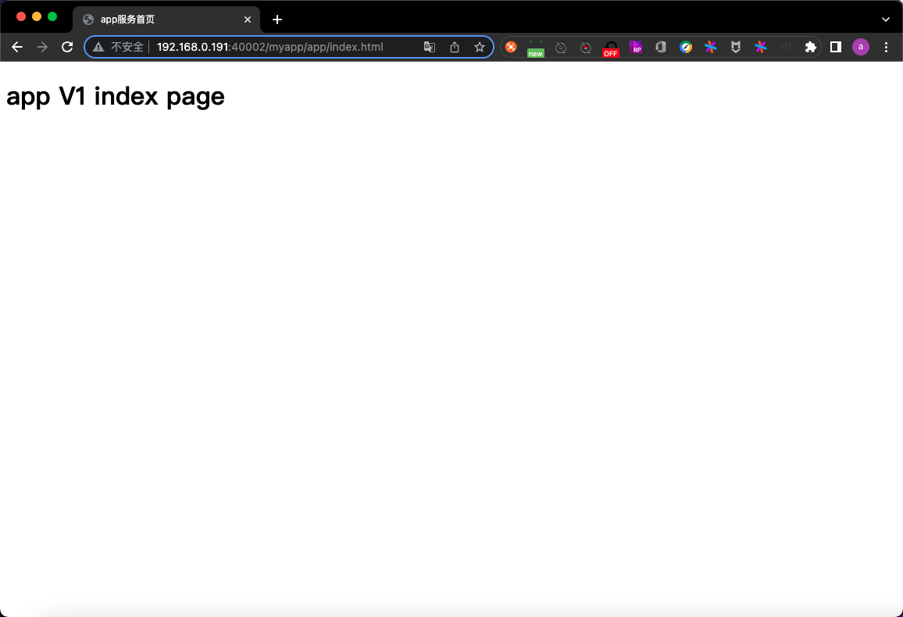

- step5. 为nginx配置haproxy

```
root@k8s-haproxy-1:~# vim /etc/haproxy/haproxy.cfg 
root@k8s-haproxy-1:~# cat /etc/haproxy/haproxy.cfg
global
	log /dev/log	local0
	log /dev/log	local1 notice
	chroot /var/lib/haproxy
	stats socket /run/haproxy/admin.sock mode 660 level admin expose-fd listeners
	stats timeout 30s
	user haproxy
	group haproxy
	daemon

	# Default SSL material locations
	ca-base /etc/ssl/certs
	crt-base /etc/ssl/private

	# Default ciphers to use on SSL-enabled listening sockets.
	# For more information, see ciphers(1SSL). This list is from:
	#  https://hynek.me/articles/hardening-your-web-servers-ssl-ciphers/
	# An alternative list with additional directives can be obtained from
	#  https://mozilla.github.io/server-side-tls/ssl-config-generator/?server=haproxy
	ssl-default-bind-ciphers ECDH+AESGCM:DH+AESGCM:ECDH+AES256:DH+AES256:ECDH+AES128:DH+AES:RSA+AESGCM:RSA+AES:!aNULL:!MD5:!DSS
	ssl-default-bind-options no-sslv3

defaults
	log	global
	mode	http
	option	httplog
	option	dontlognull
        timeout connect 5000
        timeout client  50000
        timeout server  50000
	errorfile 400 /etc/haproxy/errors/400.http
	errorfile 403 /etc/haproxy/errors/403.http
	errorfile 408 /etc/haproxy/errors/408.http
	errorfile 500 /etc/haproxy/errors/500.http
	errorfile 502 /etc/haproxy/errors/502.http
	errorfile 503 /etc/haproxy/errors/503.http
	errorfile 504 /etc/haproxy/errors/504.http

listen k8s-6443
  # bind的地址即keepalived配置的IP地址
  bind 192.168.0.118:6443
  mode tcp
  # server的IP地址即为kub-apiserver的节点地址 即本例中所有的k8s-master地址
  server k8s-master-1 192.168.0.181:6443 check inter 3s fall 3 rise 5
  server k8s-master-2 192.168.0.182:6443 check inter 3s fall 3 rise 5
  server k8s-master-3 192.168.0.183:6443 check inter 3s fall 3 rise 5

#listen erp-nginx-80
#  bind 192.168.0.119:80
#  mode tcp
#  server k8s-node-1 192.168.0.191:30019 check inter 3s fall 3 rise 5
#  server k8s-node-1 192.168.0.192:30019 check inter 3s fall 3 rise 5
#  server k8s-node-1 192.168.0.193:30019 check inter 3s fall 3 rise 5


listen erp-nginx-80
  bind 192.168.0.119:80
  mode tcp
  server k8s-node-1 192.168.0.191:40002 check inter 3s fall 3 rise 5
  server k8s-node-1 192.168.0.192:40002 check inter 3s fall 3 rise 5
  server k8s-node-1 192.168.0.193:40002 check inter 3s fall 3 rise 5
```

```
root@k8s-haproxy-1:~# systemctl restart haproxy.service
```


### 1.7 在tomcat上生成文件,并通过nginx访问

- step1. 在tomcat上生成文件

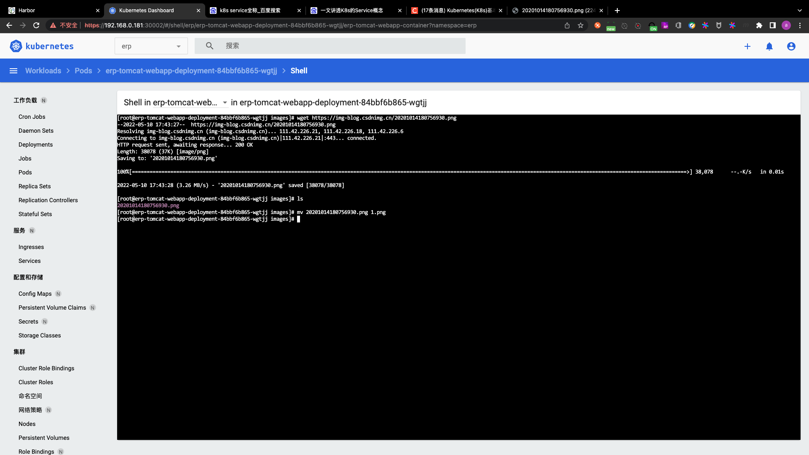

- step2. 在nginx上查看

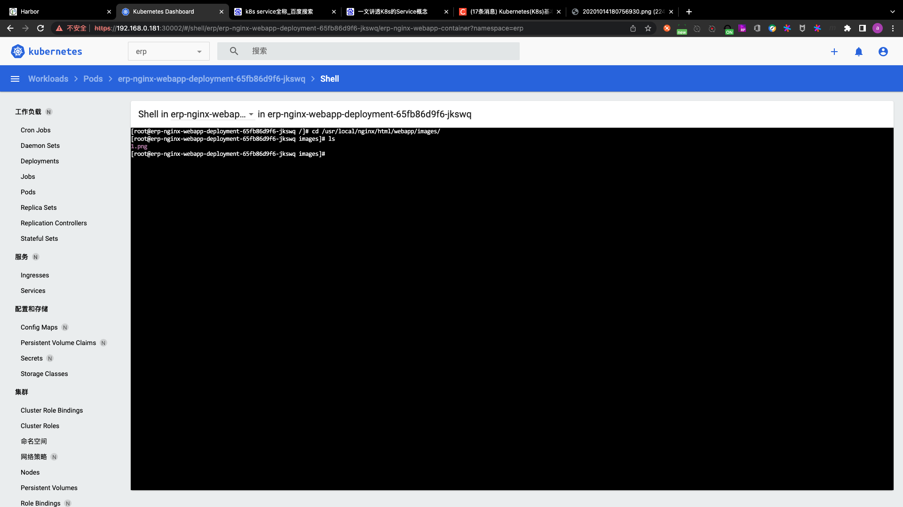

- step3. 使用浏览器访问

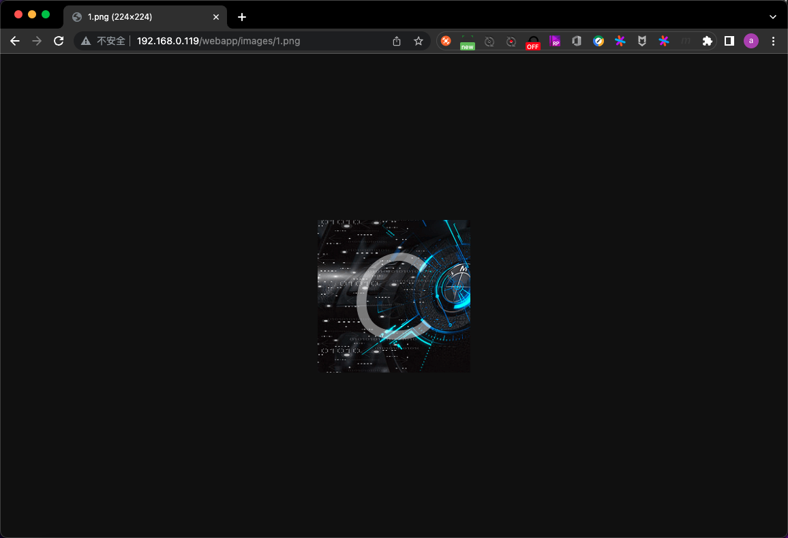

- step4. 在存储上查看文件

```
root@k8s-haproxy-1:~# cd /data/k8sdata/nginx-webapp/images
root@k8s-haproxy-1:/data/k8sdata/nginx-webapp/images# ll
total 48
drwxr-xr-x 2 root root  4096 May 10 17:43 ./
drwxr-xr-x 4 root root  4096 Apr 27 01:47 ../
-rw-r--r-- 1 root root 38078 Oct 14  2020 1.png
```

## PART2. ceph + k8s

本部分见day2笔记PART11和PART12

## PART3. Pod状态和探针