# day9-kubernetes

## PART1. K8S运行redis

### 1.1 构建镜像

- step1. 下载二进制安装包

[redis4.0.14下载地址](https://download.redis.io/releases/redis-4.0.14.tar.gz)

```
root@ks8-harbor-2:~# cd /opt/k8s-data/
root@ks8-harbor-2:/opt/k8s-data# ls
base-img  biz-img  pub-img  zookeeper  zookeeper-yaml
root@ks8-harbor-2:/opt/k8s-data# mkdir redis-img
root@ks8-harbor-2:/opt/k8s-data# cd redis-img/
root@ks8-harbor-2:/opt/k8s-data/redis-img# wget https://download.redis.io/releases/redis-4.0.14.tar.gz
--2022-05-16 19:02:44--  https://download.redis.io/releases/redis-4.0.14.tar.gz
Resolving download.redis.io (download.redis.io)... 45.60.125.1
Connecting to download.redis.io (download.redis.io)|45.60.125.1|:443... connected.
HTTP request sent, awaiting response... 200 OK
Length: 1740967 (1.7M) [application/octet-stream]
Saving to: ‘redis-4.0.14.tar.gz’

redis-4.0.14.tar.gz                                                 100%[===================================================================================================================================================================>]   1.66M   323KB/s    in 5.3s    

2022-05-16 19:02:50 (318 KB/s) - ‘redis-4.0.14.tar.gz’ saved [1740967/1740967]
```

- step2. 编写redis.conf

本步骤的目的是为了定义redis的数据存储目录和快照频率

```
root@ks8-harbor-2:/opt/k8s-data/redis-img# vim redis.conf
root@ks8-harbor-2:/opt/k8s-data/redis-img# cat redis.conf
```

```
# Redis configuration file example.
#
# Note that in order to read the configuration file, Redis must be
# started with the file path as first argument:
#
# ./redis-server /path/to/redis.conf

# Note on units: when memory size is needed, it is possible to specify
# it in the usual form of 1k 5GB 4M and so forth:
#
# 1k => 1000 bytes
# 1kb => 1024 bytes
# 1m => 1000000 bytes
# 1mb => 1024*1024 bytes
# 1g => 1000000000 bytes
# 1gb => 1024*1024*1024 bytes
#
# units are case insensitive so 1GB 1Gb 1gB are all the same.

################################## INCLUDES ###################################

# Include one or more other config files here.  This is useful if you
# have a standard template that goes to all Redis servers but also need
# to customize a few per-server settings.  Include files can include
# other files, so use this wisely.
#
# Notice option "include" won't be rewritten by command "CONFIG REWRITE"
# from admin or Redis Sentinel. Since Redis always uses the last processed
# line as value of a configuration directive, you'd better put includes
# at the beginning of this file to avoid overwriting config change at runtime.
#
# If instead you are interested in using includes to override configuration
# options, it is better to use include as the last line.
#
# include /path/to/local.conf
# include /path/to/other.conf

################################## MODULES #####################################

# Load modules at startup. If the server is not able to load modules
# it will abort. It is possible to use multiple loadmodule directives.
#
# loadmodule /path/to/my_module.so
# loadmodule /path/to/other_module.so

################################## NETWORK #####################################

# By default, if no "bind" configuration directive is specified, Redis listens
# for connections from all the network interfaces available on the server.
# It is possible to listen to just one or multiple selected interfaces using
# the "bind" configuration directive, followed by one or more IP addresses.
#
# Examples:
#
# bind 192.168.1.100 10.0.0.1
# bind 127.0.0.1 ::1
#
# ~~~ WARNING ~~~ If the computer running Redis is directly exposed to the
# internet, binding to all the interfaces is dangerous and will expose the
# instance to everybody on the internet. So by default we uncomment the
# following bind directive, that will force Redis to listen only into
# the IPv4 lookback interface address (this means Redis will be able to
# accept connections only from clients running into the same computer it
# is running).
#
# IF YOU ARE SURE YOU WANT YOUR INSTANCE TO LISTEN TO ALL THE INTERFACES
# JUST COMMENT THE FOLLOWING LINE.
# ~~~~~~~~~~~~~~~~~~~~~~~~~~~~~~~~~~~~~~~~~~~~~~~~~~~~~~~~~~~~~~~~~~~~~~~~
bind 0.0.0.0

# Protected mode is a layer of security protection, in order to avoid that
# Redis instances left open on the internet are accessed and exploited.
#
# When protected mode is on and if:
#
# 1) The server is not binding explicitly to a set of addresses using the
#    "bind" directive.
# 2) No password is configured.
#
# The server only accepts connections from clients connecting from the
# IPv4 and IPv6 loopback addresses 127.0.0.1 and ::1, and from Unix domain
# sockets.
#
# By default protected mode is enabled. You should disable it only if
# you are sure you want clients from other hosts to connect to Redis
# even if no authentication is configured, nor a specific set of interfaces
# are explicitly listed using the "bind" directive.
protected-mode yes

# Accept connections on the specified port, default is 6379 (IANA #815344).
# If port 0 is specified Redis will not listen on a TCP socket.
port 6379

# TCP listen() backlog.
#
# In high requests-per-second environments you need an high backlog in order
# to avoid slow clients connections issues. Note that the Linux kernel
# will silently truncate it to the value of /proc/sys/net/core/somaxconn so
# make sure to raise both the value of somaxconn and tcp_max_syn_backlog
# in order to get the desired effect.
tcp-backlog 511

# Unix socket.
#
# Specify the path for the Unix socket that will be used to listen for
# incoming connections. There is no default, so Redis will not listen
# on a unix socket when not specified.
#
# unixsocket /tmp/redis.sock
# unixsocketperm 700

# Close the connection after a client is idle for N seconds (0 to disable)
timeout 0

# TCP keepalive.
#
# If non-zero, use SO_KEEPALIVE to send TCP ACKs to clients in absence
# of communication. This is useful for two reasons:
#
# 1) Detect dead peers.
# 2) Take the connection alive from the point of view of network
#    equipment in the middle.
#
# On Linux, the specified value (in seconds) is the period used to send ACKs.
# Note that to close the connection the double of the time is needed.
# On other kernels the period depends on the kernel configuration.
#
# A reasonable value for this option is 300 seconds, which is the new
# Redis default starting with Redis 3.2.1.
tcp-keepalive 300

################################# GENERAL #####################################

# By default Redis does not run as a daemon. Use 'yes' if you need it.
# Note that Redis will write a pid file in /var/run/redis.pid when daemonized.
daemonize yes

# If you run Redis from upstart or systemd, Redis can interact with your
# supervision tree. Options:
#   supervised no      - no supervision interaction
#   supervised upstart - signal upstart by putting Redis into SIGSTOP mode
#   supervised systemd - signal systemd by writing READY=1 to $NOTIFY_SOCKET
#   supervised auto    - detect upstart or systemd method based on
#                        UPSTART_JOB or NOTIFY_SOCKET environment variables
# Note: these supervision methods only signal "process is ready."
#       They do not enable continuous liveness pings back to your supervisor.
supervised no

# If a pid file is specified, Redis writes it where specified at startup
# and removes it at exit.
#
# When the server runs non daemonized, no pid file is created if none is
# specified in the configuration. When the server is daemonized, the pid file
# is used even if not specified, defaulting to "/var/run/redis.pid".
#
# Creating a pid file is best effort: if Redis is not able to create it
# nothing bad happens, the server will start and run normally.
pidfile /var/run/redis_6379.pid

# Specify the server verbosity level.
# This can be one of:
# debug (a lot of information, useful for development/testing)
# verbose (many rarely useful info, but not a mess like the debug level)
# notice (moderately verbose, what you want in production probably)
# warning (only very important / critical messages are logged)
loglevel notice

# Specify the log file name. Also the empty string can be used to force
# Redis to log on the standard output. Note that if you use standard
# output for logging but daemonize, logs will be sent to /dev/null
logfile ""

# To enable logging to the system logger, just set 'syslog-enabled' to yes,
# and optionally update the other syslog parameters to suit your needs.
# syslog-enabled no

# Specify the syslog identity.
# syslog-ident redis

# Specify the syslog facility. Must be USER or between LOCAL0-LOCAL7.
# syslog-facility local0

# Set the number of databases. The default database is DB 0, you can select
# a different one on a per-connection basis using SELECT <dbid> where
# dbid is a number between 0 and 'databases'-1
databases 16

# By default Redis shows an ASCII art logo only when started to log to the
# standard output and if the standard output is a TTY. Basically this means
# that normally a logo is displayed only in interactive sessions.
#
# However it is possible to force the pre-4.0 behavior and always show a
# ASCII art logo in startup logs by setting the following option to yes.
always-show-logo yes

################################ SNAPSHOTTING  ################################
#
# Save the DB on disk:
#
#   save <seconds> <changes>
#
#   Will save the DB if both the given number of seconds and the given
#   number of write operations against the DB occurred.
#
#   In the example below the behaviour will be to save:
#   after 900 sec (15 min) if at least 1 key changed
#   after 300 sec (5 min) if at least 10 keys changed
#   after 60 sec if at least 10000 keys changed
#
#   Note: you can disable saving completely by commenting out all "save" lines.
#
#   It is also possible to remove all the previously configured save
#   points by adding a save directive with a single empty string argument
#   like in the following example:
#
#   save ""

save 900 1
save 5 1
save 300 10
save 60 10000

# By default Redis will stop accepting writes if RDB snapshots are enabled
# (at least one save point) and the latest background save failed.
# This will make the user aware (in a hard way) that data is not persisting
# on disk properly, otherwise chances are that no one will notice and some
# disaster will happen.
#
# If the background saving process will start working again Redis will
# automatically allow writes again.
#
# However if you have setup your proper monitoring of the Redis server
# and persistence, you may want to disable this feature so that Redis will
# continue to work as usual even if there are problems with disk,
# permissions, and so forth.
stop-writes-on-bgsave-error no

# Compress string objects using LZF when dump .rdb databases?
# For default that's set to 'yes' as it's almost always a win.
# If you want to save some CPU in the saving child set it to 'no' but
# the dataset will likely be bigger if you have compressible values or keys.
rdbcompression yes

# Since version 5 of RDB a CRC64 checksum is placed at the end of the file.
# This makes the format more resistant to corruption but there is a performance
# hit to pay (around 10%) when saving and loading RDB files, so you can disable it
# for maximum performances.
#
# RDB files created with checksum disabled have a checksum of zero that will
# tell the loading code to skip the check.
rdbchecksum yes

# The filename where to dump the DB
dbfilename dump.rdb

# The working directory.
#
# The DB will be written inside this directory, with the filename specified
# above using the 'dbfilename' configuration directive.
#
# The Append Only File will also be created inside this directory.
#
# Note that you must specify a directory here, not a file name.
dir /data/redis-data

################################# REPLICATION #################################

# Master-Slave replication. Use slaveof to make a Redis instance a copy of
# another Redis server. A few things to understand ASAP about Redis replication.
#
# 1) Redis replication is asynchronous, but you can configure a master to
#    stop accepting writes if it appears to be not connected with at least
#    a given number of slaves.
# 2) Redis slaves are able to perform a partial resynchronization with the
#    master if the replication link is lost for a relatively small amount of
#    time. You may want to configure the replication backlog size (see the next
#    sections of this file) with a sensible value depending on your needs.
# 3) Replication is automatic and does not need user intervention. After a
#    network partition slaves automatically try to reconnect to masters
#    and resynchronize with them.
#
# slaveof <masterip> <masterport>

# If the master is password protected (using the "requirepass" configuration
# directive below) it is possible to tell the slave to authenticate before
# starting the replication synchronization process, otherwise the master will
# refuse the slave request.
#
# masterauth <master-password>

# When a slave loses its connection with the master, or when the replication
# is still in progress, the slave can act in two different ways:
#
# 1) if slave-serve-stale-data is set to 'yes' (the default) the slave will
#    still reply to client requests, possibly with out of date data, or the
#    data set may just be empty if this is the first synchronization.
#
# 2) if slave-serve-stale-data is set to 'no' the slave will reply with
#    an error "SYNC with master in progress" to all the kind of commands
#    but to INFO and SLAVEOF.
#
slave-serve-stale-data yes

# You can configure a slave instance to accept writes or not. Writing against
# a slave instance may be useful to store some ephemeral data (because data
# written on a slave will be easily deleted after resync with the master) but
# may also cause problems if clients are writing to it because of a
# misconfiguration.
#
# Since Redis 2.6 by default slaves are read-only.
#
# Note: read only slaves are not designed to be exposed to untrusted clients
# on the internet. It's just a protection layer against misuse of the instance.
# Still a read only slave exports by default all the administrative commands
# such as CONFIG, DEBUG, and so forth. To a limited extent you can improve
# security of read only slaves using 'rename-command' to shadow all the
# administrative / dangerous commands.
slave-read-only yes

# Replication SYNC strategy: disk or socket.
#
# -------------------------------------------------------
# WARNING: DISKLESS REPLICATION IS EXPERIMENTAL CURRENTLY
# -------------------------------------------------------
#
# New slaves and reconnecting slaves that are not able to continue the replication
# process just receiving differences, need to do what is called a "full
# synchronization". An RDB file is transmitted from the master to the slaves.
# The transmission can happen in two different ways:
#
# 1) Disk-backed: The Redis master creates a new process that writes the RDB
#                 file on disk. Later the file is transferred by the parent
#                 process to the slaves incrementally.
# 2) Diskless: The Redis master creates a new process that directly writes the
#              RDB file to slave sockets, without touching the disk at all.
#
# With disk-backed replication, while the RDB file is generated, more slaves
# can be queued and served with the RDB file as soon as the current child producing
# the RDB file finishes its work. With diskless replication instead once
# the transfer starts, new slaves arriving will be queued and a new transfer
# will start when the current one terminates.
#
# When diskless replication is used, the master waits a configurable amount of
# time (in seconds) before starting the transfer in the hope that multiple slaves
# will arrive and the transfer can be parallelized.
#
# With slow disks and fast (large bandwidth) networks, diskless replication
# works better.
repl-diskless-sync no

# When diskless replication is enabled, it is possible to configure the delay
# the server waits in order to spawn the child that transfers the RDB via socket
# to the slaves.
#
# This is important since once the transfer starts, it is not possible to serve
# new slaves arriving, that will be queued for the next RDB transfer, so the server
# waits a delay in order to let more slaves arrive.
#
# The delay is specified in seconds, and by default is 5 seconds. To disable
# it entirely just set it to 0 seconds and the transfer will start ASAP.
repl-diskless-sync-delay 5

# Slaves send PINGs to server in a predefined interval. It's possible to change
# this interval with the repl_ping_slave_period option. The default value is 10
# seconds.
#
# repl-ping-slave-period 10

# The following option sets the replication timeout for:
#
# 1) Bulk transfer I/O during SYNC, from the point of view of slave.
# 2) Master timeout from the point of view of slaves (data, pings).
# 3) Slave timeout from the point of view of masters (REPLCONF ACK pings).
#
# It is important to make sure that this value is greater than the value
# specified for repl-ping-slave-period otherwise a timeout will be detected
# every time there is low traffic between the master and the slave.
#
# repl-timeout 60

# Disable TCP_NODELAY on the slave socket after SYNC?
#
# If you select "yes" Redis will use a smaller number of TCP packets and
# less bandwidth to send data to slaves. But this can add a delay for
# the data to appear on the slave side, up to 40 milliseconds with
# Linux kernels using a default configuration.
#
# If you select "no" the delay for data to appear on the slave side will
# be reduced but more bandwidth will be used for replication.
#
# By default we optimize for low latency, but in very high traffic conditions
# or when the master and slaves are many hops away, turning this to "yes" may
# be a good idea.
repl-disable-tcp-nodelay no

# Set the replication backlog size. The backlog is a buffer that accumulates
# slave data when slaves are disconnected for some time, so that when a slave
# wants to reconnect again, often a full resync is not needed, but a partial
# resync is enough, just passing the portion of data the slave missed while
# disconnected.
#
# The bigger the replication backlog, the longer the time the slave can be
# disconnected and later be able to perform a partial resynchronization.
#
# The backlog is only allocated once there is at least a slave connected.
#
# repl-backlog-size 1mb

# After a master has no longer connected slaves for some time, the backlog
# will be freed. The following option configures the amount of seconds that
# need to elapse, starting from the time the last slave disconnected, for
# the backlog buffer to be freed.
#
# Note that slaves never free the backlog for timeout, since they may be
# promoted to masters later, and should be able to correctly "partially
# resynchronize" with the slaves: hence they should always accumulate backlog.
#
# A value of 0 means to never release the backlog.
#
# repl-backlog-ttl 3600

# The slave priority is an integer number published by Redis in the INFO output.
# It is used by Redis Sentinel in order to select a slave to promote into a
# master if the master is no longer working correctly.
#
# A slave with a low priority number is considered better for promotion, so
# for instance if there are three slaves with priority 10, 100, 25 Sentinel will
# pick the one with priority 10, that is the lowest.
#
# However a special priority of 0 marks the slave as not able to perform the
# role of master, so a slave with priority of 0 will never be selected by
# Redis Sentinel for promotion.
#
# By default the priority is 100.
slave-priority 100

# It is possible for a master to stop accepting writes if there are less than
# N slaves connected, having a lag less or equal than M seconds.
#
# The N slaves need to be in "online" state.
#
# The lag in seconds, that must be <= the specified value, is calculated from
# the last ping received from the slave, that is usually sent every second.
#
# This option does not GUARANTEE that N replicas will accept the write, but
# will limit the window of exposure for lost writes in case not enough slaves
# are available, to the specified number of seconds.
#
# For example to require at least 3 slaves with a lag <= 10 seconds use:
#
# min-slaves-to-write 3
# min-slaves-max-lag 10
#
# Setting one or the other to 0 disables the feature.
#
# By default min-slaves-to-write is set to 0 (feature disabled) and
# min-slaves-max-lag is set to 10.

# A Redis master is able to list the address and port of the attached
# slaves in different ways. For example the "INFO replication" section
# offers this information, which is used, among other tools, by
# Redis Sentinel in order to discover slave instances.
# Another place where this info is available is in the output of the
# "ROLE" command of a master.
#
# The listed IP and address normally reported by a slave is obtained
# in the following way:
#
#   IP: The address is auto detected by checking the peer address
#   of the socket used by the slave to connect with the master.
#
#   Port: The port is communicated by the slave during the replication
#   handshake, and is normally the port that the slave is using to
#   list for connections.
#
# However when port forwarding or Network Address Translation (NAT) is
# used, the slave may be actually reachable via different IP and port
# pairs. The following two options can be used by a slave in order to
# report to its master a specific set of IP and port, so that both INFO
# and ROLE will report those values.
#
# There is no need to use both the options if you need to override just
# the port or the IP address.
#
# slave-announce-ip 5.5.5.5
# slave-announce-port 1234

################################## SECURITY ###################################

# Require clients to issue AUTH <PASSWORD> before processing any other
# commands.  This might be useful in environments in which you do not trust
# others with access to the host running redis-server.
#
# This should stay commented out for backward compatibility and because most
# people do not need auth (e.g. they run their own servers).
#
# Warning: since Redis is pretty fast an outside user can try up to
# 150k passwords per second against a good box. This means that you should
# use a very strong password otherwise it will be very easy to break.
#
requirepass 123456

# Command renaming.
#
# It is possible to change the name of dangerous commands in a shared
# environment. For instance the CONFIG command may be renamed into something
# hard to guess so that it will still be available for internal-use tools
# but not available for general clients.
#
# Example:
#
# rename-command CONFIG b840fc02d524045429941cc15f59e41cb7be6c52
#
# It is also possible to completely kill a command by renaming it into
# an empty string:
#
# rename-command CONFIG ""
#
# Please note that changing the name of commands that are logged into the
# AOF file or transmitted to slaves may cause problems.

################################### CLIENTS ####################################

# Set the max number of connected clients at the same time. By default
# this limit is set to 10000 clients, however if the Redis server is not
# able to configure the process file limit to allow for the specified limit
# the max number of allowed clients is set to the current file limit
# minus 32 (as Redis reserves a few file descriptors for internal uses).
#
# Once the limit is reached Redis will close all the new connections sending
# an error 'max number of clients reached'.
#
# maxclients 10000

############################## MEMORY MANAGEMENT ################################

# Set a memory usage limit to the specified amount of bytes.
# When the memory limit is reached Redis will try to remove keys
# according to the eviction policy selected (see maxmemory-policy).
#
# If Redis can't remove keys according to the policy, or if the policy is
# set to 'noeviction', Redis will start to reply with errors to commands
# that would use more memory, like SET, LPUSH, and so on, and will continue
# to reply to read-only commands like GET.
#
# This option is usually useful when using Redis as an LRU or LFU cache, or to
# set a hard memory limit for an instance (using the 'noeviction' policy).
#
# WARNING: If you have slaves attached to an instance with maxmemory on,
# the size of the output buffers needed to feed the slaves are subtracted
# from the used memory count, so that network problems / resyncs will
# not trigger a loop where keys are evicted, and in turn the output
# buffer of slaves is full with DELs of keys evicted triggering the deletion
# of more keys, and so forth until the database is completely emptied.
#
# In short... if you have slaves attached it is suggested that you set a lower
# limit for maxmemory so that there is some free RAM on the system for slave
# output buffers (but this is not needed if the policy is 'noeviction').
#
# maxmemory <bytes>

# MAXMEMORY POLICY: how Redis will select what to remove when maxmemory
# is reached. You can select among five behaviors:
#
# volatile-lru -> Evict using approximated LRU among the keys with an expire set.
# allkeys-lru -> Evict any key using approximated LRU.
# volatile-lfu -> Evict using approximated LFU among the keys with an expire set.
# allkeys-lfu -> Evict any key using approximated LFU.
# volatile-random -> Remove a random key among the ones with an expire set.
# allkeys-random -> Remove a random key, any key.
# volatile-ttl -> Remove the key with the nearest expire time (minor TTL)
# noeviction -> Don't evict anything, just return an error on write operations.
#
# LRU means Least Recently Used
# LFU means Least Frequently Used
#
# Both LRU, LFU and volatile-ttl are implemented using approximated
# randomized algorithms.
#
# Note: with any of the above policies, Redis will return an error on write
#       operations, when there are no suitable keys for eviction.
#
#       At the date of writing these commands are: set setnx setex append
#       incr decr rpush lpush rpushx lpushx linsert lset rpoplpush sadd
#       sinter sinterstore sunion sunionstore sdiff sdiffstore zadd zincrby
#       zunionstore zinterstore hset hsetnx hmset hincrby incrby decrby
#       getset mset msetnx exec sort
#
# The default is:
#
# maxmemory-policy noeviction

# LRU, LFU and minimal TTL algorithms are not precise algorithms but approximated
# algorithms (in order to save memory), so you can tune it for speed or
# accuracy. For default Redis will check five keys and pick the one that was
# used less recently, you can change the sample size using the following
# configuration directive.
#
# The default of 5 produces good enough results. 10 Approximates very closely
# true LRU but costs more CPU. 3 is faster but not very accurate.
#
# maxmemory-samples 5

############################# LAZY FREEING ####################################

# Redis has two primitives to delete keys. One is called DEL and is a blocking
# deletion of the object. It means that the server stops processing new commands
# in order to reclaim all the memory associated with an object in a synchronous
# way. If the key deleted is associated with a small object, the time needed
# in order to execute the DEL command is very small and comparable to most other
# O(1) or O(log_N) commands in Redis. However if the key is associated with an
# aggregated value containing millions of elements, the server can block for
# a long time (even seconds) in order to complete the operation.
#
# For the above reasons Redis also offers non blocking deletion primitives
# such as UNLINK (non blocking DEL) and the ASYNC option of FLUSHALL and
# FLUSHDB commands, in order to reclaim memory in background. Those commands
# are executed in constant time. Another thread will incrementally free the
# object in the background as fast as possible.
#
# DEL, UNLINK and ASYNC option of FLUSHALL and FLUSHDB are user-controlled.
# It's up to the design of the application to understand when it is a good
# idea to use one or the other. However the Redis server sometimes has to
# delete keys or flush the whole database as a side effect of other operations.
# Specifically Redis deletes objects independently of a user call in the
# following scenarios:
#
# 1) On eviction, because of the maxmemory and maxmemory policy configurations,
#    in order to make room for new data, without going over the specified
#    memory limit.
# 2) Because of expire: when a key with an associated time to live (see the
#    EXPIRE command) must be deleted from memory.
# 3) Because of a side effect of a command that stores data on a key that may
#    already exist. For example the RENAME command may delete the old key
#    content when it is replaced with another one. Similarly SUNIONSTORE
#    or SORT with STORE option may delete existing keys. The SET command
#    itself removes any old content of the specified key in order to replace
#    it with the specified string.
# 4) During replication, when a slave performs a full resynchronization with
#    its master, the content of the whole database is removed in order to
#    load the RDB file just transfered.
#
# In all the above cases the default is to delete objects in a blocking way,
# like if DEL was called. However you can configure each case specifically
# in order to instead release memory in a non-blocking way like if UNLINK
# was called, using the following configuration directives:

lazyfree-lazy-eviction no
lazyfree-lazy-expire no
lazyfree-lazy-server-del no
slave-lazy-flush no

############################## APPEND ONLY MODE ###############################

# By default Redis asynchronously dumps the dataset on disk. This mode is
# good enough in many applications, but an issue with the Redis process or
# a power outage may result into a few minutes of writes lost (depending on
# the configured save points).
#
# The Append Only File is an alternative persistence mode that provides
# much better durability. For instance using the default data fsync policy
# (see later in the config file) Redis can lose just one second of writes in a
# dramatic event like a server power outage, or a single write if something
# wrong with the Redis process itself happens, but the operating system is
# still running correctly.
#
# AOF and RDB persistence can be enabled at the same time without problems.
# If the AOF is enabled on startup Redis will load the AOF, that is the file
# with the better durability guarantees.
#
# Please check http://redis.io/topics/persistence for more information.

appendonly no

# The name of the append only file (default: "appendonly.aof")

appendfilename "appendonly.aof"

# The fsync() call tells the Operating System to actually write data on disk
# instead of waiting for more data in the output buffer. Some OS will really flush
# data on disk, some other OS will just try to do it ASAP.
#
# Redis supports three different modes:
#
# no: don't fsync, just let the OS flush the data when it wants. Faster.
# always: fsync after every write to the append only log. Slow, Safest.
# everysec: fsync only one time every second. Compromise.
#
# The default is "everysec", as that's usually the right compromise between
# speed and data safety. It's up to you to understand if you can relax this to
# "no" that will let the operating system flush the output buffer when
# it wants, for better performances (but if you can live with the idea of
# some data loss consider the default persistence mode that's snapshotting),
# or on the contrary, use "always" that's very slow but a bit safer than
# everysec.
#
# More details please check the following article:
# http://antirez.com/post/redis-persistence-demystified.html
#
# If unsure, use "everysec".

# appendfsync always
appendfsync everysec
# appendfsync no

# When the AOF fsync policy is set to always or everysec, and a background
# saving process (a background save or AOF log background rewriting) is
# performing a lot of I/O against the disk, in some Linux configurations
# Redis may block too long on the fsync() call. Note that there is no fix for
# this currently, as even performing fsync in a different thread will block
# our synchronous write(2) call.
#
# In order to mitigate this problem it's possible to use the following option
# that will prevent fsync() from being called in the main process while a
# BGSAVE or BGREWRITEAOF is in progress.
#
# This means that while another child is saving, the durability of Redis is
# the same as "appendfsync none". In practical terms, this means that it is
# possible to lose up to 30 seconds of log in the worst scenario (with the
# default Linux settings).
#
# If you have latency problems turn this to "yes". Otherwise leave it as
# "no" that is the safest pick from the point of view of durability.

no-appendfsync-on-rewrite no

# Automatic rewrite of the append only file.
# Redis is able to automatically rewrite the log file implicitly calling
# BGREWRITEAOF when the AOF log size grows by the specified percentage.
#
# This is how it works: Redis remembers the size of the AOF file after the
# latest rewrite (if no rewrite has happened since the restart, the size of
# the AOF at startup is used).
#
# This base size is compared to the current size. If the current size is
# bigger than the specified percentage, the rewrite is triggered. Also
# you need to specify a minimal size for the AOF file to be rewritten, this
# is useful to avoid rewriting the AOF file even if the percentage increase
# is reached but it is still pretty small.
#
# Specify a percentage of zero in order to disable the automatic AOF
# rewrite feature.

auto-aof-rewrite-percentage 100
auto-aof-rewrite-min-size 64mb

# An AOF file may be found to be truncated at the end during the Redis
# startup process, when the AOF data gets loaded back into memory.
# This may happen when the system where Redis is running
# crashes, especially when an ext4 filesystem is mounted without the
# data=ordered option (however this can't happen when Redis itself
# crashes or aborts but the operating system still works correctly).
#
# Redis can either exit with an error when this happens, or load as much
# data as possible (the default now) and start if the AOF file is found
# to be truncated at the end. The following option controls this behavior.
#
# If aof-load-truncated is set to yes, a truncated AOF file is loaded and
# the Redis server starts emitting a log to inform the user of the event.
# Otherwise if the option is set to no, the server aborts with an error
# and refuses to start. When the option is set to no, the user requires
# to fix the AOF file using the "redis-check-aof" utility before to restart
# the server.
#
# Note that if the AOF file will be found to be corrupted in the middle
# the server will still exit with an error. This option only applies when
# Redis will try to read more data from the AOF file but not enough bytes
# will be found.
aof-load-truncated yes

# When rewriting the AOF file, Redis is able to use an RDB preamble in the
# AOF file for faster rewrites and recoveries. When this option is turned
# on the rewritten AOF file is composed of two different stanzas:
#
#   [RDB file][AOF tail]
#
# When loading Redis recognizes that the AOF file starts with the "REDIS"
# string and loads the prefixed RDB file, and continues loading the AOF
# tail.
#
# This is currently turned off by default in order to avoid the surprise
# of a format change, but will at some point be used as the default.
aof-use-rdb-preamble no

################################ LUA SCRIPTING  ###############################

# Max execution time of a Lua script in milliseconds.
#
# If the maximum execution time is reached Redis will log that a script is
# still in execution after the maximum allowed time and will start to
# reply to queries with an error.
#
# When a long running script exceeds the maximum execution time only the
# SCRIPT KILL and SHUTDOWN NOSAVE commands are available. The first can be
# used to stop a script that did not yet called write commands. The second
# is the only way to shut down the server in the case a write command was
# already issued by the script but the user doesn't want to wait for the natural
# termination of the script.
#
# Set it to 0 or a negative value for unlimited execution without warnings.
lua-time-limit 5000

################################ REDIS CLUSTER  ###############################
#
# ++++++++++++++++++++++++++++++++++++++++++++++++++++++++++++++++++++++++++++
# WARNING EXPERIMENTAL: Redis Cluster is considered to be stable code, however
# in order to mark it as "mature" we need to wait for a non trivial percentage
# of users to deploy it in production.
# ++++++++++++++++++++++++++++++++++++++++++++++++++++++++++++++++++++++++++++
#
# Normal Redis instances can't be part of a Redis Cluster; only nodes that are
# started as cluster nodes can. In order to start a Redis instance as a
# cluster node enable the cluster support uncommenting the following:
#
# cluster-enabled yes

# Every cluster node has a cluster configuration file. This file is not
# intended to be edited by hand. It is created and updated by Redis nodes.
# Every Redis Cluster node requires a different cluster configuration file.
# Make sure that instances running in the same system do not have
# overlapping cluster configuration file names.
#
# cluster-config-file nodes-6379.conf

# Cluster node timeout is the amount of milliseconds a node must be unreachable
# for it to be considered in failure state.
# Most other internal time limits are multiple of the node timeout.
#
# cluster-node-timeout 15000

# A slave of a failing master will avoid to start a failover if its data
# looks too old.
#
# There is no simple way for a slave to actually have an exact measure of
# its "data age", so the following two checks are performed:
#
# 1) If there are multiple slaves able to failover, they exchange messages
#    in order to try to give an advantage to the slave with the best
#    replication offset (more data from the master processed).
#    Slaves will try to get their rank by offset, and apply to the start
#    of the failover a delay proportional to their rank.
#
# 2) Every single slave computes the time of the last interaction with
#    its master. This can be the last ping or command received (if the master
#    is still in the "connected" state), or the time that elapsed since the
#    disconnection with the master (if the replication link is currently down).
#    If the last interaction is too old, the slave will not try to failover
#    at all.
#
# The point "2" can be tuned by user. Specifically a slave will not perform
# the failover if, since the last interaction with the master, the time
# elapsed is greater than:
#
#   (node-timeout * slave-validity-factor) + repl-ping-slave-period
#
# So for example if node-timeout is 30 seconds, and the slave-validity-factor
# is 10, and assuming a default repl-ping-slave-period of 10 seconds, the
# slave will not try to failover if it was not able to talk with the master
# for longer than 310 seconds.
#
# A large slave-validity-factor may allow slaves with too old data to failover
# a master, while a too small value may prevent the cluster from being able to
# elect a slave at all.
#
# For maximum availability, it is possible to set the slave-validity-factor
# to a value of 0, which means, that slaves will always try to failover the
# master regardless of the last time they interacted with the master.
# (However they'll always try to apply a delay proportional to their
# offset rank).
#
# Zero is the only value able to guarantee that when all the partitions heal
# the cluster will always be able to continue.
#
# cluster-slave-validity-factor 10

# Cluster slaves are able to migrate to orphaned masters, that are masters
# that are left without working slaves. This improves the cluster ability
# to resist to failures as otherwise an orphaned master can't be failed over
# in case of failure if it has no working slaves.
#
# Slaves migrate to orphaned masters only if there are still at least a
# given number of other working slaves for their old master. This number
# is the "migration barrier". A migration barrier of 1 means that a slave
# will migrate only if there is at least 1 other working slave for its master
# and so forth. It usually reflects the number of slaves you want for every
# master in your cluster.
#
# Default is 1 (slaves migrate only if their masters remain with at least
# one slave). To disable migration just set it to a very large value.
# A value of 0 can be set but is useful only for debugging and dangerous
# in production.
#
# cluster-migration-barrier 1

# By default Redis Cluster nodes stop accepting queries if they detect there
# is at least an hash slot uncovered (no available node is serving it).
# This way if the cluster is partially down (for example a range of hash slots
# are no longer covered) all the cluster becomes, eventually, unavailable.
# It automatically returns available as soon as all the slots are covered again.
#
# However sometimes you want the subset of the cluster which is working,
# to continue to accept queries for the part of the key space that is still
# covered. In order to do so, just set the cluster-require-full-coverage
# option to no.
#
# cluster-require-full-coverage yes

# This option, when set to yes, prevents slaves from trying to failover its
# master during master failures. However the master can still perform a
# manual failover, if forced to do so.
#
# This is useful in different scenarios, especially in the case of multiple
# data center operations, where we want one side to never be promoted if not
# in the case of a total DC failure.
#
# cluster-slave-no-failover no

# In order to setup your cluster make sure to read the documentation
# available at http://redis.io web site.

########################## CLUSTER DOCKER/NAT support  ########################

# In certain deployments, Redis Cluster nodes address discovery fails, because
# addresses are NAT-ted or because ports are forwarded (the typical case is
# Docker and other containers).
#
# In order to make Redis Cluster working in such environments, a static
# configuration where each node knows its public address is needed. The
# following two options are used for this scope, and are:
#
# * cluster-announce-ip
# * cluster-announce-port
# * cluster-announce-bus-port
#
# Each instruct the node about its address, client port, and cluster message
# bus port. The information is then published in the header of the bus packets
# so that other nodes will be able to correctly map the address of the node
# publishing the information.
#
# If the above options are not used, the normal Redis Cluster auto-detection
# will be used instead.
#
# Note that when remapped, the bus port may not be at the fixed offset of
# clients port + 10000, so you can specify any port and bus-port depending
# on how they get remapped. If the bus-port is not set, a fixed offset of
# 10000 will be used as usually.
#
# Example:
#
# cluster-announce-ip 10.1.1.5
# cluster-announce-port 6379
# cluster-announce-bus-port 6380

################################## SLOW LOG ###################################

# The Redis Slow Log is a system to log queries that exceeded a specified
# execution time. The execution time does not include the I/O operations
# like talking with the client, sending the reply and so forth,
# but just the time needed to actually execute the command (this is the only
# stage of command execution where the thread is blocked and can not serve
# other requests in the meantime).
#
# You can configure the slow log with two parameters: one tells Redis
# what is the execution time, in microseconds, to exceed in order for the
# command to get logged, and the other parameter is the length of the
# slow log. When a new command is logged the oldest one is removed from the
# queue of logged commands.

# The following time is expressed in microseconds, so 1000000 is equivalent
# to one second. Note that a negative number disables the slow log, while
# a value of zero forces the logging of every command.
slowlog-log-slower-than 10000

# There is no limit to this length. Just be aware that it will consume memory.
# You can reclaim memory used by the slow log with SLOWLOG RESET.
slowlog-max-len 128

################################ LATENCY MONITOR ##############################

# The Redis latency monitoring subsystem samples different operations
# at runtime in order to collect data related to possible sources of
# latency of a Redis instance.
#
# Via the LATENCY command this information is available to the user that can
# print graphs and obtain reports.
#
# The system only logs operations that were performed in a time equal or
# greater than the amount of milliseconds specified via the
# latency-monitor-threshold configuration directive. When its value is set
# to zero, the latency monitor is turned off.
#
# By default latency monitoring is disabled since it is mostly not needed
# if you don't have latency issues, and collecting data has a performance
# impact, that while very small, can be measured under big load. Latency
# monitoring can easily be enabled at runtime using the command
# "CONFIG SET latency-monitor-threshold <milliseconds>" if needed.
latency-monitor-threshold 0

############################# EVENT NOTIFICATION ##############################

# Redis can notify Pub/Sub clients about events happening in the key space.
# This feature is documented at http://redis.io/topics/notifications
#
# For instance if keyspace events notification is enabled, and a client
# performs a DEL operation on key "foo" stored in the Database 0, two
# messages will be published via Pub/Sub:
#
# PUBLISH __keyspace@0__:foo del
# PUBLISH __keyevent@0__:del foo
#
# It is possible to select the events that Redis will notify among a set
# of classes. Every class is identified by a single character:
#
#  K     Keyspace events, published with __keyspace@<db>__ prefix.
#  E     Keyevent events, published with __keyevent@<db>__ prefix.
#  g     Generic commands (non-type specific) like DEL, EXPIRE, RENAME, ...
#  $     String commands
#  l     List commands
#  s     Set commands
#  h     Hash commands
#  z     Sorted set commands
#  x     Expired events (events generated every time a key expires)
#  e     Evicted events (events generated when a key is evicted for maxmemory)
#  A     Alias for g$lshzxe, so that the "AKE" string means all the events.
#
#  The "notify-keyspace-events" takes as argument a string that is composed
#  of zero or multiple characters. The empty string means that notifications
#  are disabled.
#
#  Example: to enable list and generic events, from the point of view of the
#           event name, use:
#
#  notify-keyspace-events Elg
#
#  Example 2: to get the stream of the expired keys subscribing to channel
#             name __keyevent@0__:expired use:
#
#  notify-keyspace-events Ex
#
#  By default all notifications are disabled because most users don't need
#  this feature and the feature has some overhead. Note that if you don't
#  specify at least one of K or E, no events will be delivered.
notify-keyspace-events ""

############################### ADVANCED CONFIG ###############################

# Hashes are encoded using a memory efficient data structure when they have a
# small number of entries, and the biggest entry does not exceed a given
# threshold. These thresholds can be configured using the following directives.
hash-max-ziplist-entries 512
hash-max-ziplist-value 64

# Lists are also encoded in a special way to save a lot of space.
# The number of entries allowed per internal list node can be specified
# as a fixed maximum size or a maximum number of elements.
# For a fixed maximum size, use -5 through -1, meaning:
# -5: max size: 64 Kb  <-- not recommended for normal workloads
# -4: max size: 32 Kb  <-- not recommended
# -3: max size: 16 Kb  <-- probably not recommended
# -2: max size: 8 Kb   <-- good
# -1: max size: 4 Kb   <-- good
# Positive numbers mean store up to _exactly_ that number of elements
# per list node.
# The highest performing option is usually -2 (8 Kb size) or -1 (4 Kb size),
# but if your use case is unique, adjust the settings as necessary.
list-max-ziplist-size -2

# Lists may also be compressed.
# Compress depth is the number of quicklist ziplist nodes from *each* side of
# the list to *exclude* from compression.  The head and tail of the list
# are always uncompressed for fast push/pop operations.  Settings are:
# 0: disable all list compression
# 1: depth 1 means "don't start compressing until after 1 node into the list,
#    going from either the head or tail"
#    So: [head]->node->node->...->node->[tail]
#    [head], [tail] will always be uncompressed; inner nodes will compress.
# 2: [head]->[next]->node->node->...->node->[prev]->[tail]
#    2 here means: don't compress head or head->next or tail->prev or tail,
#    but compress all nodes between them.
# 3: [head]->[next]->[next]->node->node->...->node->[prev]->[prev]->[tail]
# etc.
list-compress-depth 0

# Sets have a special encoding in just one case: when a set is composed
# of just strings that happen to be integers in radix 10 in the range
# of 64 bit signed integers.
# The following configuration setting sets the limit in the size of the
# set in order to use this special memory saving encoding.
set-max-intset-entries 512

# Similarly to hashes and lists, sorted sets are also specially encoded in
# order to save a lot of space. This encoding is only used when the length and
# elements of a sorted set are below the following limits:
zset-max-ziplist-entries 128
zset-max-ziplist-value 64

# HyperLogLog sparse representation bytes limit. The limit includes the
# 16 bytes header. When an HyperLogLog using the sparse representation crosses
# this limit, it is converted into the dense representation.
#
# A value greater than 16000 is totally useless, since at that point the
# dense representation is more memory efficient.
#
# The suggested value is ~ 3000 in order to have the benefits of
# the space efficient encoding without slowing down too much PFADD,
# which is O(N) with the sparse encoding. The value can be raised to
# ~ 10000 when CPU is not a concern, but space is, and the data set is
# composed of many HyperLogLogs with cardinality in the 0 - 15000 range.
hll-sparse-max-bytes 3000

# Active rehashing uses 1 millisecond every 100 milliseconds of CPU time in
# order to help rehashing the main Redis hash table (the one mapping top-level
# keys to values). The hash table implementation Redis uses (see dict.c)
# performs a lazy rehashing: the more operation you run into a hash table
# that is rehashing, the more rehashing "steps" are performed, so if the
# server is idle the rehashing is never complete and some more memory is used
# by the hash table.
#
# The default is to use this millisecond 10 times every second in order to
# actively rehash the main dictionaries, freeing memory when possible.
#
# If unsure:
# use "activerehashing no" if you have hard latency requirements and it is
# not a good thing in your environment that Redis can reply from time to time
# to queries with 2 milliseconds delay.
#
# use "activerehashing yes" if you don't have such hard requirements but
# want to free memory asap when possible.
activerehashing yes

# The client output buffer limits can be used to force disconnection of clients
# that are not reading data from the server fast enough for some reason (a
# common reason is that a Pub/Sub client can't consume messages as fast as the
# publisher can produce them).
#
# The limit can be set differently for the three different classes of clients:
#
# normal -> normal clients including MONITOR clients
# slave  -> slave clients
# pubsub -> clients subscribed to at least one pubsub channel or pattern
#
# The syntax of every client-output-buffer-limit directive is the following:
#
# client-output-buffer-limit <class> <hard limit> <soft limit> <soft seconds>
#
# A client is immediately disconnected once the hard limit is reached, or if
# the soft limit is reached and remains reached for the specified number of
# seconds (continuously).
# So for instance if the hard limit is 32 megabytes and the soft limit is
# 16 megabytes / 10 seconds, the client will get disconnected immediately
# if the size of the output buffers reach 32 megabytes, but will also get
# disconnected if the client reaches 16 megabytes and continuously overcomes
# the limit for 10 seconds.
#
# By default normal clients are not limited because they don't receive data
# without asking (in a push way), but just after a request, so only
# asynchronous clients may create a scenario where data is requested faster
# than it can read.
#
# Instead there is a default limit for pubsub and slave clients, since
# subscribers and slaves receive data in a push fashion.
#
# Both the hard or the soft limit can be disabled by setting them to zero.
client-output-buffer-limit normal 0 0 0
client-output-buffer-limit slave 256mb 64mb 60
client-output-buffer-limit pubsub 32mb 8mb 60

# Client query buffers accumulate new commands. They are limited to a fixed
# amount by default in order to avoid that a protocol desynchronization (for
# instance due to a bug in the client) will lead to unbound memory usage in
# the query buffer. However you can configure it here if you have very special
# needs, such us huge multi/exec requests or alike.
#
# client-query-buffer-limit 1gb

# In the Redis protocol, bulk requests, that are, elements representing single
# strings, are normally limited ot 512 mb. However you can change this limit
# here.
#
# proto-max-bulk-len 512mb

# Redis calls an internal function to perform many background tasks, like
# closing connections of clients in timeout, purging expired keys that are
# never requested, and so forth.
#
# Not all tasks are performed with the same frequency, but Redis checks for
# tasks to perform according to the specified "hz" value.
#
# By default "hz" is set to 10. Raising the value will use more CPU when
# Redis is idle, but at the same time will make Redis more responsive when
# there are many keys expiring at the same time, and timeouts may be
# handled with more precision.
#
# The range is between 1 and 500, however a value over 100 is usually not
# a good idea. Most users should use the default of 10 and raise this up to
# 100 only in environments where very low latency is required.
hz 10

# When a child rewrites the AOF file, if the following option is enabled
# the file will be fsync-ed every 32 MB of data generated. This is useful
# in order to commit the file to the disk more incrementally and avoid
# big latency spikes.
aof-rewrite-incremental-fsync yes

# Redis LFU eviction (see maxmemory setting) can be tuned. However it is a good
# idea to start with the default settings and only change them after investigating
# how to improve the performances and how the keys LFU change over time, which
# is possible to inspect via the OBJECT FREQ command.
#
# There are two tunable parameters in the Redis LFU implementation: the
# counter logarithm factor and the counter decay time. It is important to
# understand what the two parameters mean before changing them.
#
# The LFU counter is just 8 bits per key, it's maximum value is 255, so Redis
# uses a probabilistic increment with logarithmic behavior. Given the value
# of the old counter, when a key is accessed, the counter is incremented in
# this way:
#
# 1. A random number R between 0 and 1 is extracted.
# 2. A probability P is calculated as 1/(old_value*lfu_log_factor+1).
# 3. The counter is incremented only if R < P.
#
# The default lfu-log-factor is 10. This is a table of how the frequency
# counter changes with a different number of accesses with different
# logarithmic factors:
#
# +--------+------------+------------+------------+------------+------------+
# | factor | 100 hits   | 1000 hits  | 100K hits  | 1M hits    | 10M hits   |
# +--------+------------+------------+------------+------------+------------+
# | 0      | 104        | 255        | 255        | 255        | 255        |
# +--------+------------+------------+------------+------------+------------+
# | 1      | 18         | 49         | 255        | 255        | 255        |
# +--------+------------+------------+------------+------------+------------+
# | 10     | 10         | 18         | 142        | 255        | 255        |
# +--------+------------+------------+------------+------------+------------+
# | 100    | 8          | 11         | 49         | 143        | 255        |
# +--------+------------+------------+------------+------------+------------+
#
# NOTE: The above table was obtained by running the following commands:
#
#   redis-benchmark -n 1000000 incr foo
#   redis-cli object freq foo
#
# NOTE 2: The counter initial value is 5 in order to give new objects a chance
# to accumulate hits.
#
# The counter decay time is the time, in minutes, that must elapse in order
# for the key counter to be divided by two (or decremented if it has a value
# less <= 10).
#
# The default value for the lfu-decay-time is 1. A Special value of 0 means to
# decay the counter every time it happens to be scanned.
#
# lfu-log-factor 10
# lfu-decay-time 1

########################### ACTIVE DEFRAGMENTATION #######################
#
# WARNING THIS FEATURE IS EXPERIMENTAL. However it was stress tested
# even in production and manually tested by multiple engineers for some
# time.
#
# What is active defragmentation?
# -------------------------------
#
# Active (online) defragmentation allows a Redis server to compact the
# spaces left between small allocations and deallocations of data in memory,
# thus allowing to reclaim back memory.
#
# Fragmentation is a natural process that happens with every allocator (but
# less so with Jemalloc, fortunately) and certain workloads. Normally a server
# restart is needed in order to lower the fragmentation, or at least to flush
# away all the data and create it again. However thanks to this feature
# implemented by Oran Agra for Redis 4.0 this process can happen at runtime
# in an "hot" way, while the server is running.
#
# Basically when the fragmentation is over a certain level (see the
# configuration options below) Redis will start to create new copies of the
# values in contiguous memory regions by exploiting certain specific Jemalloc
# features (in order to understand if an allocation is causing fragmentation
# and to allocate it in a better place), and at the same time, will release the
# old copies of the data. This process, repeated incrementally for all the keys
# will cause the fragmentation to drop back to normal values.
#
# Important things to understand:
#
# 1. This feature is disabled by default, and only works if you compiled Redis
#    to use the copy of Jemalloc we ship with the source code of Redis.
#    This is the default with Linux builds.
#
# 2. You never need to enable this feature if you don't have fragmentation
#    issues.
#
# 3. Once you experience fragmentation, you can enable this feature when
#    needed with the command "CONFIG SET activedefrag yes".
#
# The configuration parameters are able to fine tune the behavior of the
# defragmentation process. If you are not sure about what they mean it is
# a good idea to leave the defaults untouched.

# Enabled active defragmentation
# activedefrag yes

# Minimum amount of fragmentation waste to start active defrag
# active-defrag-ignore-bytes 100mb

# Minimum percentage of fragmentation to start active defrag
# active-defrag-threshold-lower 10

# Maximum percentage of fragmentation at which we use maximum effort
# active-defrag-threshold-upper 100

# Minimal effort for defrag in CPU percentage
# active-defrag-cycle-min 25

# Maximal effort for defrag in CPU percentage
# active-defrag-cycle-max 75
```

注意配置文件中的`dir /data/redis-data`.该配置项指定了redis将数据持久化存储的路径.


注意配置文件中:

```
save 900 1
save 5 1
save 300 10
save 60 10000
```

这部分内容定义了redis的快照频率.

- step3. 编写redis运行脚本

```
root@ks8-harbor-2:/opt/k8s-data/redis-img# vim run_redis.sh
root@ks8-harbor-2:/opt/k8s-data/redis-img# cat run_redis.sh
```

```shell
#!/bin/bash

/usr/sbin/redis-server /usr/local/redis/redis.conf

tail -f  /etc/hosts
```

- step4. 编写Dockerfile

```
root@ks8-harbor-2:/opt/k8s-data/redis-img# vim Dockerfile
root@ks8-harbor-2:/opt/k8s-data/redis-img# cat Dockerfile
```

```Dockerfile
FROM harbor.k8s.com/baseimages/erp-centos-base:7.8.2003
MAINTAINER Roach 40486453@qq.com

ADD redis-4.0.14.tar.gz /usr/local/src
RUN ln -sv /usr/local/src/redis-4.0.14 /usr/local/redis && cd /usr/local/redis && make && cp src/redis-cli /usr/sbin/ && cp src/redis-server  /usr/sbin/ && mkdir -pv /data/redis-data 
ADD redis.conf /usr/local/redis/redis.conf 
ADD run_redis.sh /usr/local/redis/run_redis.sh

EXPOSE 6379

CMD ["/usr/local/redis/run_redis.sh"]
```

- step5. 编写构建镜像脚本

```
root@ks8-harbor-2:/opt/k8s-data/redis-img# vim build-command.sh
root@ks8-harbor-2:/opt/k8s-data/redis-img# cat build-command.sh
```

```shell
#!/bin/bash
TAG=$1
docker build -t harbor.k8s.com/erp/redis:${TAG} . --network=host
docker push harbor.k8s.com/erp/redis:${TAG}
```

完整目录结构如下:

```
root@ks8-harbor-2:/opt/k8s-data/redis-img# tree ./
./
├── build-command.sh
├── Dockerfile
├── redis-4.0.14.tar.gz
├── redis.conf
└── run_redis.sh

0 directories, 5 files
```

- step6. 构建镜像

```
root@ks8-harbor-2:/opt/k8s-data/redis-img# chmod a+x *.sh
root@ks8-harbor-2:/opt/k8s-data/redis-img# bash build-command.sh v4.0.14
Sending build context to Docker daemon  1.805MB
Step 1/8 : FROM harbor.k8s.com/baseimages/erp-centos-base:7.8.2003
 ---> ea0de0e02bd4
Step 2/8 : MAINTAINER Roach 40486453@qq.com
 ---> Using cache
 ---> 5f0777954f3e
Step 3/8 : ADD redis-4.0.14.tar.gz /usr/local/src
 ---> 3cb450812baa
Step 4/8 : RUN ln -sv /usr/local/src/redis-4.0.14 /usr/local/redis && cd /usr/local/redis && make && cp src/redis-cli /usr/sbin/ && cp src/redis-server  /usr/sbin/ && mkdir -pv /data/redis-data
 ---> Running in 8f9700a1177d
...
Successfully built 736c309fb78a
Successfully tagged harbor.k8s.com/erp/redis:v4.0.14
The push refers to repository [harbor.k8s.com/erp/redis]
18d80465ac18: Pushed 
f939d105c1fa: Pushed 
af17467eb05a: Pushed 
ccabe75eee29: Pushed 
9af9a18fb5a7: Mounted from erp/tomcat-app1 
0c09dd020e8e: Mounted from erp/tomcat-app1 
fb82b029bea0: Mounted from erp/tomcat-app1 
v4.0.14: digest: sha256:96adf8b651894e2a4788260b03b99606109055a0081386a7ac68cf39632bac8d size: 1793
```

- step7. 测试

```
root@ks8-harbor-2:/opt/k8s-data/redis-img# docker run -it --rm harbor.k8s.com/erp/redis:v4.0.14
6:C 16 May 19:51:40.473 # oO0OoO0OoO0Oo Redis is starting oO0OoO0OoO0Oo
6:C 16 May 19:51:40.474 # Redis version=4.0.14, bits=64, commit=00000000, modified=0, pid=6, just started
6:C 16 May 19:51:40.474 # Configuration loaded
127.0.0.1	localhost
::1	localhost ip6-localhost ip6-loopback
fe00::0	ip6-localnet
ff00::0	ip6-mcastprefix
ff02::1	ip6-allnodes
ff02::2	ip6-allrouters
172.17.0.2	1f7d4d0908de
```

### 1.2 将镜像运行到K8S上

- step1. 为redis创建nfs存储目录

```
root@k8s-haproxy-1:~# mkdir /data/k8sdata/erp/redis-datadir-1
root@k8s-haproxy-1:~# vim /etc/exports 
root@k8s-haproxy-1:~# cat /etc/exports
# /etc/exports: the access control list for filesystems which may be exported
#		to NFS clients.  See exports(5).
#
# Example for NFSv2 and NFSv3:
# /srv/homes       hostname1(rw,sync,no_subtree_check) hostname2(ro,sync,no_subtree_check)
#
# Example for NFSv4:
# /srv/nfs4        gss/krb5i(rw,sync,fsid=0,crossmnt,no_subtree_check)
# /srv/nfs4/homes  gss/krb5i(rw,sync,no_subtree_check)
#
/data/erp *(rw,no_root_squash)
/data/k8sdata/erp *(rw,no_root_squash)
/data/k8sdata/nginx-webapp/images *(rw,no_root_squash)
/data/k8sdata/nginx-webapp/static *(rw,no_root_squash)
/data/k8sdata/erp/redis-datadir-1 *(rw,no_root_squash)
root@k8s-haproxy-1:~# systemctl restart nfs-server.service
root@k8s-haproxy-1:~# showmount -e 172.16.1.189
Export list for 172.16.1.189:
/data/k8sdata/erp/redis-datadir-1 *
/data/k8sdata/nginx-webapp/static *
/data/k8sdata/nginx-webapp/images *
/data/k8sdata/erp                 *
/data/erp                         *
```

- step2. 创建PV

```
root@k8s-master-1:~# cd k8s-data/
root@k8s-master-1:~/k8s-data# mkdir redis-yaml
root@k8s-master-1:~/k8s-data# cd redis-yaml/
root@k8s-master-1:~/k8s-data/redis-yaml# mkdir pv
root@k8s-master-1:~/k8s-data/redis-yaml# cd pv/
root@k8s-master-1:~/k8s-data/redis-yaml/pv# vim redis-persistentVolume.yaml
root@k8s-master-1:~/k8s-data/redis-yaml/pv# vim redis-persistentVolume.yaml 
root@k8s-master-1:~/k8s-data/redis-yaml/pv# cat redis-persistentVolume.yaml
```

```yaml
apiVersion: v1
kind: PersistentVolume
metadata:
  name: redis-pv-1
  namespace: erp
spec:
  capacity:
    storage: 2Gi
  accessModes:
    - ReadWriteOnce
  nfs:
    path: /data/k8sdata/erp/redis-datadir-1
    server: 172.16.1.189
```

```
root@k8s-master-1:~/k8s-data/redis-yaml/pv# kubectl apply -f redis-persistentVolume.yaml 
persistentvolume/redis-pv-1 created
root@k8s-master-1:~/k8s-data/redis-yaml/pv# kubectl get pv -n erp
NAME                                       CAPACITY   ACCESS MODES   RECLAIM POLICY   STATUS      CLAIM                         STORAGECLASS                  REASON   AGE
pvc-6c711e3a-1251-435f-95ac-b1867cafc8b4   5Gi        RWO            Delete           Failed      default/mysql-data-pvc        ceph-storage-class-k8s-user            2d16h
redis-pv-1                                 2Gi        RWO            Retain           Available                                                                        14s
zookeeper-datadir-pv-1                     2Gi        RWO            Retain           Bound       erp/zookeeper-datadir-pvc-1                                          20d
zookeeper-datadir-pv-2                     2Gi        RWO            Retain           Bound       erp/zookeeper-datadir-pvc-2                                          20d
zookeeper-datadir-pv-3                     2Gi        RWO            Retain           Bound       erp/zookeeper-datadir-pvc-3                                          20d
```

- step3. 创建PVC

```
root@k8s-master-1:~/k8s-data/redis-yaml/pv# vim redis-persistentVolumeClaim.yaml
root@k8s-master-1:~/k8s-data/redis-yaml/pv# cat redis-persistentVolumeClaim.yaml
```

```yaml
apiVersion: v1
kind: PersistentVolumeClaim
metadata:
  name: redis-pvc-1 
  namespace: erp
spec:
  volumeName: redis-pv-1
  accessModes:
    - ReadWriteOnce
  resources:
    requests:
      storage: 2Gi
```

```
root@k8s-master-1:~/k8s-data/redis-yaml/pv# kubectl apply -f redis-persistentVolumeClaim.yaml 
persistentvolumeclaim/redis-pvc-1 created
root@k8s-master-1:~/k8s-data/redis-yaml/pv# kubectl get pvc -n erp
NAME                      STATUS   VOLUME                   CAPACITY   ACCESS MODES   STORAGECLASS   AGE
redis-pvc-1               Bound    redis-pv-1               2Gi        RWO                           17s
zookeeper-datadir-pvc-1   Bound    zookeeper-datadir-pv-1   2Gi        RWO                           20d
zookeeper-datadir-pvc-2   Bound    zookeeper-datadir-pv-2   2Gi        RWO                           20d
zookeeper-datadir-pvc-3   Bound    zookeeper-datadir-pv-3   2Gi        RWO                           20d
```

- step4. 创建Pod

```
root@k8s-master-1:~/k8s-data/redis-yaml# vim redis-deployment.yaml 
root@k8s-master-1:~/k8s-data/redis-yaml# cat redis-deployment.yaml
```

```yaml
kind: Deployment
apiVersion: apps/v1
metadata:
  labels:
    app: erp-redis-deployment
  name: redis-deployment
  namespace: erp
spec:
  replicas: 1 
  selector:
    matchLabels:
      app: erp-redis
  template:
    metadata:
      labels:
        app: erp-redis
    spec:
      containers:
        - name: redis-container
          image: harbor.k8s.com/erp/redis:v4.0.14
          imagePullPolicy: Always
          volumeMounts:
          - mountPath: "/data/redis-data/"
            name: redis-datadir
      volumes:
        - name: redis-datadir
          persistentVolumeClaim:
            claimName: redis-pvc-1
```

```
root@k8s-master-1:~/k8s-data/redis-yaml# kubectl apply -f redis-deployment.yaml 
deployment.apps/redis-deployment created
root@k8s-master-1:~/k8s-data/redis-yaml# kubectl get pod -n erp
NAME                                            READY   STATUS    RESTARTS   AGE
erp-nginx-webapp-deployment-65fb86d9f6-fl6jl    1/1     Running   2          156m
erp-tomcat-webapp-deployment-84bbf6b865-zjswf   1/1     Running   0          156m
redis-deployment-6d85975b47-rll89               1/1     Running   0          6s
zookeeper1-7ff6fbfbf-zmt4c                      1/1     Running   0          156m
zookeeper2-94cfd4596-k6ljk                      1/1     Running   0          156m
zookeeper3-7f55657779-7t97r                     1/1     Running   0          156m
```

- step5. 创建service

```
root@k8s-master-1:~/k8s-data/redis-yaml# vim redis-service.yaml
root@k8s-master-1:~/k8s-data/redis-yaml# cat redis-service.yaml
```

```yaml
kind: Service
apiVersion: v1
metadata:
  labels:
    app: erp-redis-service
  name: redis-service
  namespace: erp
spec:
  type: NodePort
  ports:
  - name: http
    port: 6379 
    targetPort: 6379
    nodePort: 36379 
  selector:
    app: erp-redis
  # session亲和性
  # ClientIP表示同一个IP地址的请求转发给同一个后端服务器
  sessionAffinity: ClientIP
  sessionAffinityConfig:
    clientIP:
      # 会话保持时间
      timeoutSeconds: 10800
```

```
root@k8s-master-1:~/k8s-data/redis-yaml# kubectl apply -f redis-service.yaml 
service/redis-service created
root@k8s-master-1:~/k8s-data/redis-yaml# kubectl get svc -n erp
NAME                        TYPE       CLUSTER-IP       EXTERNAL-IP   PORT(S)                                        AGE
erp-nginx-webapp-service    NodePort   10.100.9.36      <none>        80:40002/TCP,443:40443/TCP                     19d
erp-tomcat-webapp-service   NodePort   10.100.139.19    <none>        80:40003/TCP                                   6d3h
redis-service               NodePort   10.100.1.198     <none>        6379:36379/TCP                                 5s
zookeeper1                  NodePort   10.100.184.160   <none>        2181:42181/TCP,2888:43385/TCP,3888:39547/TCP   20d
zookeeper2                  NodePort   10.100.17.68     <none>        2181:42182/TCP,2888:62636/TCP,3888:36521/TCP   20d
zookeeper3                  NodePort   10.100.146.59    <none>        2181:42183/TCP,2888:34167/TCP,3888:47769/TCP   20d
root@k8s-master-1:~/k8s-data/redis-yaml# kubectl get ep -n erp
NAME                        ENDPOINTS                                                  AGE
erp-nginx-webapp-service    10.200.140.91:443,10.200.140.91:80                         19d
erp-tomcat-webapp-service   10.200.76.162:8080                                         6d3h
redis-service               10.200.109.104:6379                                        13s
zookeeper1                  10.200.76.164:2181,10.200.76.164:2888,10.200.76.164:3888   20d
zookeeper2                  10.200.76.159:2181,10.200.76.159:2888,10.200.76.159:3888   20d
zookeeper3                  10.200.140.92:2181,10.200.140.92:2888,10.200.140.92:3888   20d
```

- step6. 尝试向redis中写入数据

```
root@k8s-master-1:~/k8s-data/redis-yaml# kubectl exec -it redis-deployment-6d85975b47-rll89 bash -n erp
kubectl exec [POD] [COMMAND] is DEPRECATED and will be removed in a future version. Use kubectl exec [POD] -- [COMMAND] instead.
[root@redis-deployment-6d85975b47-rll89 /]# ss -tnl
State      Recv-Q Send-Q                                                                                           Local Address:Port                                                                                                          Peer Address:Port              
LISTEN     0      128                                                                                                          *:6379                                                                                                                     *:*                  
[root@redis-deployment-6d85975b47-rll89 /]# redis-cli
127.0.0.1:6379> AUTH 123456
OK
127.0.0.1:6379> SET erp test
OK
127.0.0.1:6379> GET erp
"test"
```

- step7. 查看数据是否保存到了nfs上

```
root@k8s-haproxy-1:~# ls /data/k8sdata/erp/redis-datadir-1
dump.rdb
```

## PART2. K8S运行MySQL主从

[基于StatefulSet实现的MySQL主从](https://kubernetes.io/zh/docs/tasks/run-application/run-replicated-stateful-application/)

Pod调度运行时,如果应用不需要任何稳定的标示、有序的部署、删除和扩展,则应该使用一组无状态副本的控制器来部署应用,例如Deployment或ReplicaSet更适合无状态服务需求.而StatefulSet适合管理所有有状态的服务,比如MySQL、MongoDB集群等.

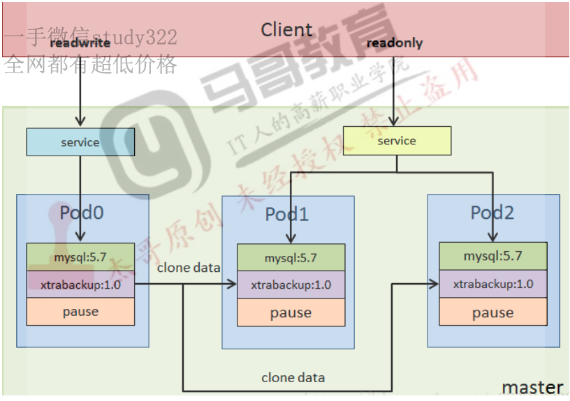

 
StatefulSet本质上是Deployment的一种变体,在v1.9版本中已成为GA版本,它为了解决有状态服务的问题,它所管理的Pod拥有固定的Pod名称、启停顺序.在StatefulSet中,Pod名字称为网络标识(hostname),还必须要用到共享存储.

在Deployment中,与之对应的服务是service,而在StatefulSet中与之对应的Headless Service.Headless Service,即无头服务.与service的区别就是它没有Cluster IP,解析它的名称时将返回该Headless Service对应的全部Pod的Endpoint列表.

StatefulSet特点:

- 给每个pod分配固定且唯一的网络标识符 
- 给每个pod分配固定且持久化的外部存储 

	- 这种场景下,PV、PVC和Pod是存在绑定关系的.这个绑定关系会被记录到etcd.后续无论Pod重建多少次,始终会使用绑定好的存储,确保数据不会丢失.

- 对pod进行**有序**的部署和扩展

	- 以MySQL为例,StatefulSet会将第1个创建的Pod作为master使用.后续创建的Pod会被当做slave.
	- 部署的时候也是有顺序的.部署的时候会先部署第1个Pod,当第1个Pod完全启动之后,再启动第2个Pod.以此类推,直到创建的Pod数量达到要求为止.若第1个Pod创建失败,就会hang在这个步骤上,不会继续创建Pod.
	
- 对pod进**有序**的删除和终止

	- 删除/终止也是有序的.部署的时候是从第1个Pod开始部署,直到最后一个Pod部署完毕为止;删除的时候顺序相反,先删除最后一个部署的Pod,再删除倒数第二个部署的Pod,以此类推,最后删除第1个被部署的Pod.
	- 之所以删除顺序和部署顺序相反,是为了减少变更带来的影响.还是以MySQL为例,如果删除顺序和部署顺序相同,那么相当于直接删除主库.假设删除前共3个Pod(1主2从),只是想将架构变为1主1从,则删除操作会直接删除主库.

- 对pod进**有序**的自动滚动更新

	- 更新顺序和部署顺序相同.也是按照从前往后的顺序更新的.

### 2.1 构建镜像

本示例共需构建2个镜像.一个是MySQL的镜像,另一个是用于数据同步的镜像xtrabackup

#### 2.1.1 构建MySQL镜像

- step1. 拉取官方镜像

```
root@ks8-harbor-2:/opt/k8s-data/redis-img# cd ..
root@ks8-harbor-2:/opt/k8s-data# mkdir mysql-img
root@ks8-harbor-2:/opt/k8s-data# cd mysql-img/
root@ks8-harbor-2:/opt/k8s-data/mysql-img# docker pull mysql:5.7
5.7: Pulling from library/mysql
72a69066d2fe: Pull complete 
93619dbc5b36: Pull complete 
99da31dd6142: Pull complete 
626033c43d70: Pull complete 
37d5d7efb64e: Pull complete 
ac563158d721: Pull complete 
d2ba16033dad: Pull complete 
0ceb82207cd7: Pull complete 
37f2405cae96: Pull complete 
e2482e017e53: Pull complete 
70deed891d42: Pull complete 
Digest: sha256:f2ad209efe9c67104167fc609cca6973c8422939491c9345270175a300419f94
Status: Downloaded newer image for mysql:5.7
docker.io/library/mysql:5.7
```

- step2. 验证

```
root@ks8-harbor-2:/opt/k8s-data/mysql-img# docker run -it --rm mysql:5.7 bash
root@3db7e844bf50:/# mysql -V
mysql  Ver 14.14 Distrib 5.7.36, for Linux (x86_64) using  EditLine wrapper
root@3db7e844bf50:/# exit
exit
```

- step3. 推送至harbor

```
root@ks8-harbor-2:/opt/k8s-data/mysql-img# docker tag mysql:5.7 harbor.k8s.com/pub-images/mysql:5.7.35
root@ks8-harbor-2:/opt/k8s-data/mysql-img# docker push harbor.k8s.com/pub-images/mysql:5.7.35
The push refers to repository [harbor.k8s.com/pub-images/mysql]
e889c671872c: Pushed 
789f3aa31b3f: Pushed 
35ba198e64f5: Pushed 
9b64bb048d04: Pushed 
aad27784b762: Pushed 
0d17fee8db40: Pushed 
d7a777f6c3a4: Pushed 
a0c2a050fee2: Pushed 
0798f2528e83: Pushed 
fba7b131c5c3: Pushed 
ad6b69b54919: Pushed 
5.7.35: digest: sha256:398f124948bb3d5789c0ac7c004d02e6d9a3ae95aa9804d7a3b33a344ff3c9cd size: 2621
```

#### 2.1.2 构建xtrabackup镜像

- step1. 拉取镜像

```
root@ks8-harbor-2:/opt/k8s-data/mysql-img# docker pull registry.cn-hangzhou.aliyuncs.com/hxpdocker/xtrabackup:1.0
1.0: Pulling from hxpdocker/xtrabackup
1fad42e8a0d9: Pull complete 
dac06889328b: Pull complete 
90d87ab7dc00: Pull complete 
Digest: sha256:92ef9832ee300642529677b4c6f6707fc292e7c6a9a9a1940f346f753ac0fdeb
Status: Downloaded newer image for registry.cn-hangzhou.aliyuncs.com/hxpdocker/xtrabackup:1.0
registry.cn-hangzhou.aliyuncs.com/hxpdocker/xtrabackup:1.0
```

- step2. 推送镜像至harbor

```
root@ks8-harbor-2:/opt/k8s-data/mysql-img# docker tag registry.cn-hangzhou.aliyuncs.com/hxpdocker/xtrabackup:1.0 harbor.k8s.com/pub-images/xtrabackup:1.0
root@ks8-harbor-2:/opt/k8s-data/mysql-img# docker push harbor.k8s.com/pub-images/xtrabackup:1.0
The push refers to repository [harbor.k8s.com/pub-images/xtrabackup]
f85c58969eb0: Pushed 
82d548d175dd: Pushed 
fe4c16cbf7a4: Pushed 
1.0: digest: sha256:39f106eb400e18dcb4bded651a7ab308b39c305578ce228ae35f3c76bc715510 size: 949
```

- step3. 为MySQL创建nfs存储路径

此处创建5个nfs共享目录给MySQL,也就表示后续会创建5个PV.这也就意味着后续将会创建5个MySQL Pod.

```
root@k8s-haproxy-1:~# mkdir /data/k8sdata/erp/mysql-datadir-1
root@k8s-haproxy-1:~# mkdir /data/k8sdata/erp/mysql-datadir-2
root@k8s-haproxy-1:~# mkdir /data/k8sdata/erp/mysql-datadir-3
root@k8s-haproxy-1:~# mkdir /data/k8sdata/erp/mysql-datadir-4
root@k8s-haproxy-1:~# mkdir /data/k8sdata/erp/mysql-datadir-5
root@k8s-haproxy-1:~# vim /etc/exports 
root@k8s-haproxy-1:~# cat /etc/exports
# /etc/exports: the access control list for filesystems which may be exported
#		to NFS clients.  See exports(5).
#
# Example for NFSv2 and NFSv3:
# /srv/homes       hostname1(rw,sync,no_subtree_check) hostname2(ro,sync,no_subtree_check)
#
# Example for NFSv4:
# /srv/nfs4        gss/krb5i(rw,sync,fsid=0,crossmnt,no_subtree_check)
# /srv/nfs4/homes  gss/krb5i(rw,sync,no_subtree_check)
#
/data/erp *(rw,no_root_squash)
/data/k8sdata/erp *(rw,no_root_squash)
/data/k8sdata/nginx-webapp/images *(rw,no_root_squash)
/data/k8sdata/nginx-webapp/static *(rw,no_root_squash)
/data/k8sdata/erp/redis-datadir-1 *(rw,no_root_squash)
/data/k8sdata/erp/mysql-datadir-1 *(rw,no_root_squash)
/data/k8sdata/erp/mysql-datadir-2 *(rw,no_root_squash)
/data/k8sdata/erp/mysql-datadir-3 *(rw,no_root_squash)
/data/k8sdata/erp/mysql-datadir-4 *(rw,no_root_squash)
/data/k8sdata/erp/mysql-datadir-5 *(rw,no_root_squash)
root@k8s-haproxy-1:~# showmount -e 172.16.1.189
Export list for 172.16.1.189:
/data/k8sdata/erp/mysql-datadir-5 *
/data/k8sdata/erp/mysql-datadir-4 *
/data/k8sdata/erp/mysql-datadir-3 *
/data/k8sdata/erp/mysql-datadir-2 *
/data/k8sdata/erp/mysql-datadir-1 *
/data/k8sdata/erp/redis-datadir-1 *
/data/k8sdata/nginx-webapp/static *
/data/k8sdata/nginx-webapp/images *
/data/k8sdata/erp                 *
/data/erp                         *
```

- step4. 创建PV

```
root@k8s-master-1:~/k8s-data/mysql-yaml/pv# vim mysql-persistentVolume1.yaml 
root@k8s-master-1:~/k8s-data/mysql-yaml/pv# cat mysql-persistentVolume1.yaml
```

```yaml
apiVersion: v1
kind: PersistentVolume
metadata:
  name: mysql-datadir-1
  namespace: erp
spec:
  capacity:
    storage: 1Gi
  accessModes:
    - ReadWriteOnce
  nfs:
    path: /data/k8sdata/erp/mysql-datadir-1 
    server: 172.16.1.189
```

```
root@k8s-master-1:~/k8s-data/mysql-yaml/pv# kubectl apply -f mysql-persistentVolume1.yaml
persistentvolume/mysql-datadir-1 created
root@k8s-master-1:~/k8s-data/mysql-yaml/pv# kubectl get pv -n erp
NAME                                       CAPACITY   ACCESS MODES   RECLAIM POLICY   STATUS      CLAIM                         STORAGECLASS                  REASON   AGE
mysql-datadir-1                            1Gi        RWO            Retain           Available                                                                        7s
pvc-6c711e3a-1251-435f-95ac-b1867cafc8b4   5Gi        RWO            Delete           Failed      default/mysql-data-pvc        ceph-storage-class-k8s-user            3d10h
redis-pv-1                                 2Gi        RWO            Retain           Bound       erp/redis-pvc-1                                                      18h
zookeeper-datadir-pv-1                     2Gi        RWO            Retain           Bound       erp/zookeeper-datadir-pvc-1                                          21d
zookeeper-datadir-pv-2                     2Gi        RWO            Retain           Bound       erp/zookeeper-datadir-pvc-2                                          21d
zookeeper-datadir-pv-3                     2Gi        RWO            Retain           Bound       erp/zookeeper-datadir-pvc-3                                          21d
```

```
root@k8s-master-1:~/k8s-data/mysql-yaml/pv# vim mysql-persistentVolume2.yaml 
root@k8s-master-1:~/k8s-data/mysql-yaml/pv# cat mysql-persistentVolume2.yaml
```

```yaml
apiVersion: v1
kind: PersistentVolume
metadata:
  name: mysql-datadir-2
  namespace: erp
spec:
  capacity:
    storage: 1Gi
  accessModes:
    - ReadWriteOnce
  nfs:
    path: /data/k8sdata/erp/mysql-datadir-2
```

```
root@k8s-master-1:~/k8s-data/mysql-yaml/pv# kubectl apply -f mysql-persistentVolume2.yaml 
persistentvolume/mysql-datadir-2 created
root@k8s-master-1:~/k8s-data/mysql-yaml/pv# kubectl get pv -n erp
NAME                                       CAPACITY   ACCESS MODES   RECLAIM POLICY   STATUS      CLAIM                         STORAGECLASS                  REASON   AGE
mysql-datadir-1                            1Gi        RWO            Retain           Available                                                                        4m7s
mysql-datadir-2                            1Gi        RWO            Retain           Available                                                                        5s
pvc-6c711e3a-1251-435f-95ac-b1867cafc8b4   5Gi        RWO            Delete           Failed      default/mysql-data-pvc        ceph-storage-class-k8s-user            3d10h
redis-pv-1                                 2Gi        RWO            Retain           Bound       erp/redis-pvc-1                                                      18h
zookeeper-datadir-pv-1                     2Gi        RWO            Retain           Bound       erp/zookeeper-datadir-pvc-1                                          21d
zookeeper-datadir-pv-2                     2Gi        RWO            Retain           Bound       erp/zookeeper-datadir-pvc-2                                          21d
zookeeper-datadir-pv-3                     2Gi        RWO            Retain           Bound       erp/zookeeper-datadir-pvc-3                                          21d
```

```
root@k8s-master-1:~/k8s-data/mysql-yaml/pv# kubectl get pv -n erp
NAME                                       CAPACITY   ACCESS MODES   RECLAIM POLICY   STATUS      CLAIM                         STORAGECLASS                  REASON   AGE
mysql-datadir-1                            1Gi        RWO            Retain           Available                                                                        9m44s
mysql-datadir-2                            1Gi        RWO            Retain           Available                                                                        5m42s
mysql-datadir-3                            1Gi        RWO            Retain           Available                                                                        2m15s
pvc-6c711e3a-1251-435f-95ac-b1867cafc8b4   5Gi        RWO            Delete           Failed      default/mysql-data-pvc        ceph-storage-class-k8s-user            3d10h
redis-pv-1                                 2Gi        RWO            Retain           Bound       erp/redis-pvc-1                                                      18h
zookeeper-datadir-pv-1                     2Gi        RWO            Retain           Bound       erp/zookeeper-datadir-pvc-1                                          21d
zookeeper-datadir-pv-2                     2Gi        RWO            Retain           Bound       erp/zookeeper-datadir-pvc-2                                          21d
zookeeper-datadir-pv-3                     2Gi        RWO            Retain           Bound       erp/zookeeper-datadir-pvc-3                                          21d
```

```
root@k8s-master-1:~/k8s-data/mysql-yaml/pv# vim mysql-persistentVolume4.yaml 
root@k8s-master-1:~/k8s-data/mysql-yaml/pv# cat mysql-persistentVolume4.yaml
```

```yaml
apiVersion: v1
kind: PersistentVolume
metadata:
  name: mysql-datadir-4
  namespace: erp
spec:
  capacity:
    storage: 1Gi
  accessModes:
    - ReadWriteOnce
  nfs:
    path: /data/k8sdata/erp/mysql-datadir-4
    server: 172.16.1.189
```

```
root@k8s-master-1:~/k8s-data/mysql-yaml/pv# kubectl apply -f mysql-persistentVolume4.yaml 
persistentvolume/mysql-datadir-4 created
root@k8s-master-1:~/k8s-data/mysql-yaml/pv# kubectl get pv -n erp
NAME                                       CAPACITY   ACCESS MODES   RECLAIM POLICY   STATUS      CLAIM                         STORAGECLASS                  REASON   AGE
mysql-datadir-1                            1Gi        RWO            Retain           Available                                                                        12m
mysql-datadir-2                            1Gi        RWO            Retain           Available                                                                        8m40s
mysql-datadir-3                            1Gi        RWO            Retain           Available                                                                        5m13s
mysql-datadir-4                            1Gi        RWO            Retain           Available                                                                        4s
pvc-6c711e3a-1251-435f-95ac-b1867cafc8b4   5Gi        RWO            Delete           Failed      default/mysql-data-pvc        ceph-storage-class-k8s-user            3d10h
redis-pv-1                                 2Gi        RWO            Retain           Bound       erp/redis-pvc-1                                                      18h
zookeeper-datadir-pv-1                     2Gi        RWO            Retain           Bound       erp/zookeeper-datadir-pvc-1                                          21d
zookeeper-datadir-pv-2                     2Gi        RWO            Retain           Bound       erp/zookeeper-datadir-pvc-2                                          21d
zookeeper-datadir-pv-3                     2Gi        RWO            Retain           Bound       erp/zookeeper-datadir-pvc-3                                          21d
```

```
root@k8s-master-1:~/k8s-data/mysql-yaml/pv# vim mysql-persistentVolume5.yaml 
root@k8s-master-1:~/k8s-data/mysql-yaml/pv# cat mysql-persistentVolume5.yaml
```

```yaml
apiVersion: v1
kind: PersistentVolume
metadata:
  name: mysql-datadir-5
  namespace: erp
spec:
  capacity:
    storage: 1Gi
  accessModes:
    - ReadWriteOnce
  nfs:
    path: /data/k8sdata/erp/mysql-datadir-5
    server: 172.16.1.189
```

```
root@k8s-master-1:~/k8s-data/mysql-yaml/pv# kubectl apply -f mysql-persistentVolume5.yaml 
persistentvolume/mysql-datadir-5 created
root@k8s-master-1:~/k8s-data/mysql-yaml/pv# kubectl get pv -n erp
NAME                                       CAPACITY   ACCESS MODES   RECLAIM POLICY   STATUS      CLAIM                         STORAGECLASS                  REASON   AGE
mysql-datadir-1                            1Gi        RWO            Retain           Available                                                                        15m
mysql-datadir-2                            1Gi        RWO            Retain           Available                                                                        11m
mysql-datadir-3                            1Gi        RWO            Retain           Available                                                                        7m43s
mysql-datadir-4                            1Gi        RWO            Retain           Available                                                                        2m34s
mysql-datadir-5                            1Gi        RWO            Retain           Available                                                                        6s
pvc-6c711e3a-1251-435f-95ac-b1867cafc8b4   5Gi        RWO            Delete           Failed      default/mysql-data-pvc        ceph-storage-class-k8s-user            3d10h
redis-pv-1                                 2Gi        RWO            Retain           Bound       erp/redis-pvc-1                                                      18h
zookeeper-datadir-pv-1                     2Gi        RWO            Retain           Bound       erp/zookeeper-datadir-pvc-1                                          21d
zookeeper-datadir-pv-2                     2Gi        RWO            Retain           Bound       erp/zookeeper-datadir-pvc-2                                          21d
zookeeper-datadir-pv-3                     2Gi        RWO            Retain           Bound       erp/zookeeper-datadir-pvc-3                                          21d
```

注:如需删除一个已经和Pod产生绑定关系的PVC,执行如下命令即可.

1. `kubectl patch pvc data-mysql-0 -p '{"metadata":{"finalizers":null}}' -n erp`
2. `kubectl delete pvc data-mysql-0 -n erp`

注:如需删除一个已经和PVC产生绑定关系的PV,执行如下命令即可.

`kubectl patch pv mysql-datadir-4 -p '{"metadata":{"finalizers":null}}' -n erp`

- step5. 创建ConfigMap

```
root@k8s-master-1:~/k8s-data/mysql-yaml# vim mysql-configmap.yaml 
root@k8s-master-1:~/k8s-data/mysql-yaml# cat mysql-configmap.yaml 
```

```yaml
apiVersion: v1
kind: ConfigMap
metadata:
  name: mysql-conf
  namespace: erp
  labels:
    app: mysql-conf
data:
  master.cnf: |
    # 仅master节点会使用该配置
    [mysqld]
    log-bin
    log_bin_trust_function_creators=1
    lower_case_table_names=1
  slave.cnf: |
    # 仅slave节点会使用该配置
    [mysqld]
    super-read-only
    log_bin_trust_function_creators=1
```

- step6. 创建Service

```
root@k8s-master-1:~/k8s-data/mysql-yaml# vim mysql-master-services.yaml 
root@k8s-master-1:~/k8s-data/mysql-yaml# cat mysql-master-services.yaml
```

```yaml
apiVersion: v1
kind: Service
metadata:
  namespace: erp
  name: mysql
  labels:
    app: mysql
spec:
  ports:
  - name: mysql
    port: 3306
  clusterIP: None
  selector:
    app: mysql
```

```
root@k8s-master-1:~/k8s-data/mysql-yaml# kubectl apply -f mysql-master-services.yaml 
service/mysql created
root@k8s-master-1:~/k8s-data/mysql-yaml# kubectl get svc -n erp
NAME                        TYPE        CLUSTER-IP       EXTERNAL-IP   PORT(S)                                        AGE
erp-nginx-webapp-service    NodePort    10.100.9.36      <none>        80:40002/TCP,443:40443/TCP                     22d
erp-tomcat-webapp-service   NodePort    10.100.139.19    <none>        80:40003/TCP                                   9d
mysql                       ClusterIP   None             <none>        3306/TCP                                       7s
redis-service               NodePort    10.100.1.198     <none>        6379:36379/TCP                                 2d22h
zookeeper1                  NodePort    10.100.184.160   <none>        2181:42181/TCP,2888:43385/TCP,3888:39547/TCP   23d
zookeeper2                  NodePort    10.100.17.68     <none>        2181:42182/TCP,2888:62636/TCP,3888:36521/TCP   23d
zookeeper3                  NodePort    10.100.146.59    <none>        2181:42183/TCP,2888:34167/TCP,3888:47769/TCP   23d
```

注意:这个名为mysql的service是一个headless service.

```
root@k8s-master-1:~/k8s-data/mysql-yaml# vim mysql-slave-services.yaml 
root@k8s-master-1:~/k8s-data/mysql-yaml# cat mysql-slave-services.yaml
```

```yaml
apiVersion: v1
kind: Service
metadata:
  name: mysql-read
  namespace: erp
  labels:
    app: mysql
spec:
  ports:
  - name: mysql
    port: 3306
  selector:
    app: mysql
```

```
root@k8s-master-1:~/k8s-data/mysql-yaml# kubectl apply -f mysql-slave-services.yaml 
service/mysql-read created
root@k8s-master-1:~/k8s-data/mysql-yaml# kubectl get svc -n erp
NAME                        TYPE        CLUSTER-IP       EXTERNAL-IP   PORT(S)                                        AGE
erp-nginx-webapp-service    NodePort    10.100.9.36      <none>        80:40002/TCP,443:40443/TCP                     22d
erp-tomcat-webapp-service   NodePort    10.100.139.19    <none>        80:40003/TCP                                   9d
mysql                       ClusterIP   None             <none>        3306/TCP                                       83s
mysql-read                  ClusterIP   10.100.11.41     <none>        3306/TCP                                       6s
redis-service               NodePort    10.100.1.198     <none>        6379:36379/TCP                                 2d22h
zookeeper1                  NodePort    10.100.184.160   <none>        2181:42181/TCP,2888:43385/TCP,3888:39547/TCP   23d
zookeeper2                  NodePort    10.100.17.68     <none>        2181:42182/TCP,2888:62636/TCP,3888:36521/TCP   23d
zookeeper3                  NodePort    10.100.146.59    <none>        2181:42183/TCP,2888:34167/TCP,3888:47769/TCP   23d
```

- step7. 创建Pod

```
root@k8s-master-1:~/k8s-data/mysql-yaml# vim mysql-statefulSet.yaml 
root@k8s-master-1:~/k8s-data/mysql-yaml# cat mysql-statefulSet.yaml
```

```yaml 
apiVersion: apps/v1
kind: StatefulSet
metadata:
  name: mysql
  namespace: erp
spec:
  selector:
    matchLabels:
      app: mysql
  serviceName: mysql
  replicas: 3
  template:
    metadata:
      labels:
        app: mysql
    spec:
      initContainers:
      - name: init-mysql
        image: harbor.k8s.com/pub-images/mysql:5.7.35
        command:
        - bash
        - "-c"
        - |
          set -ex
          # 基于 Pod 序号生成 MySQL 服务器的 ID。
          [[ `hostname` =~ -([0-9]+)$ ]] || exit 1
          ordinal=${BASH_REMATCH[1]}
          echo [mysqld] > /mnt/conf.d/server-id.cnf
          # 添加偏移量以避免使用 server-id=0 这一保留值。
          echo server-id=$((100 + $ordinal)) >> /mnt/conf.d/server-id.cnf
          # Copy appropriate conf.d files from config-map to emptyDir.
          # 将合适的 conf.d 文件从 config-map 复制到 emptyDir。
          if [[ $ordinal -eq 0 ]]; then
            cp /mnt/config-map/master.cnf /mnt/conf.d/
          else
            cp /mnt/config-map/slave.cnf /mnt/conf.d/
          fi          
        volumeMounts:
        - name: conf
          mountPath: /mnt/conf.d
        - name: config-map
          mountPath: /mnt/config-map
      - name: clone-mysql
        image: harbor.k8s.com/pub-images/xtrabackup:1.0
        command:
        - bash
        - "-c"
        - |
          set -ex
          # 如果已有数据，则跳过克隆。
          [[ -d /var/lib/mysql/mysql ]] && exit 0
          # 跳过主实例（序号索引 0）的克隆。
          [[ `hostname` =~ -([0-9]+)$ ]] || exit 1
          ordinal=${BASH_REMATCH[1]}
          [[ $ordinal -eq 0 ]] && exit 0
          # 从原来的对等节点克隆数据。
          ncat --recv-only mysql-$(($ordinal-1)).mysql 3307 | xbstream -x -C /var/lib/mysql
          # 准备备份。
          xtrabackup --prepare --target-dir=/var/lib/mysql          
        volumeMounts:
        - name: data
          mountPath: /var/lib/mysql
          subPath: mysql
        - name: conf
          mountPath: /etc/mysql/conf.d
      containers:
      - name: mysql
        image: mysql:5.7
        env:
        - name: MYSQL_ALLOW_EMPTY_PASSWORD
          value: "1"
        ports:
        - name: mysql
          containerPort: 3306
        volumeMounts:
        - name: data
          mountPath: /var/lib/mysql
          subPath: mysql
        - name: conf
          mountPath: /etc/mysql/conf.d
        resources:
          requests:
            cpu: 500m
            memory: 200Mi
        livenessProbe:
          exec:
            command: ["mysqladmin", "ping"]
          initialDelaySeconds: 30
          periodSeconds: 10
          timeoutSeconds: 5
        readinessProbe:
          exec:
            # 检查我们是否可以通过 TCP 执行查询（skip-networking 是关闭的）。
            command: ["mysql", "-h", "127.0.0.1", "-e", "SELECT 1"]
          initialDelaySeconds: 5
          periodSeconds: 2
          timeoutSeconds: 1
      - name: xtrabackup
        image: harbor.k8s.com/pub-images/xtrabackup:1.0
        ports:
        - name: xtrabackup
          containerPort: 3307
        command:
        - bash
        - "-c"
        - |
          set -ex
          cd /var/lib/mysql

          # 确定克隆数据的 binlog 位置（如果有的话）。
          if [[ -f xtrabackup_slave_info && "x$(<xtrabackup_slave_info)" != "x" ]]; then
            # XtraBackup 已经生成了部分的 “CHANGE MASTER TO” 查询
            # 因为我们从一个现有副本进行克隆。(需要删除末尾的分号!)
            cat xtrabackup_slave_info | sed -E 's/;$//g' > change_master_to.sql.in
            # 在这里要忽略 xtrabackup_binlog_info （它是没用的）。
            rm -f xtrabackup_slave_info xtrabackup_binlog_info
          elif [[ -f xtrabackup_binlog_info ]]; then
            # 我们直接从主实例进行克隆。解析 binlog 位置。
            [[ `cat xtrabackup_binlog_info` =~ ^(.*?)[[:space:]]+(.*?)$ ]] || exit 1
            rm -f xtrabackup_binlog_info xtrabackup_slave_info
            echo "CHANGE MASTER TO MASTER_LOG_FILE='${BASH_REMATCH[1]}',\
                  MASTER_LOG_POS=${BASH_REMATCH[2]}" > change_master_to.sql.in
          fi

          # 检查我们是否需要通过启动复制来完成克隆。
          if [[ -f change_master_to.sql.in ]]; then
            echo "Waiting for mysqld to be ready (accepting connections)"
            until mysql -h 127.0.0.1 -e "SELECT 1"; do sleep 1; done

            echo "Initializing replication from clone position"
            mysql -h 127.0.0.1 \
                  -e "$(<change_master_to.sql.in), \
                          MASTER_HOST='mysql-0.mysql', \
                          MASTER_USER='root', \
                          MASTER_PASSWORD='', \
                          MASTER_CONNECT_RETRY=10; \
                        START SLAVE;" || exit 1
            # 如果容器重新启动，最多尝试一次。
            mv change_master_to.sql.in change_master_to.sql.orig
          fi

          # 当对等点请求时，启动服务器发送备份。
          exec ncat --listen --keep-open --send-only --max-conns=1 3307 -c \
            "xtrabackup --backup --slave-info --stream=xbstream --host=127.0.0.1 --user=root"          
        volumeMounts:
        - name: data
          mountPath: /var/lib/mysql
          subPath: mysql
        - name: conf
          mountPath: /etc/mysql/conf.d
        resources:
          requests:
            cpu: 100m
            memory: 100Mi
      volumes:
      - name: conf
        emptyDir: {}
      - name: config-map
        configMap:
          name: mysql-conf
  # statefulset会根据PV自动创建PVC 并将PVC和PV的绑定关系
  # 保存到etcd
  volumeClaimTemplates:
  - metadata:
      name: data
    spec:
      accessModes: ["ReadWriteOnce"]
      resources:
        requests:
          storage: 2Gi
```

```
root@k8s-master-1:~/k8s-data/mysql-yaml# kubectl apply -f mysql-statefulSet.yaml 
statefulset.apps/mysql created
```

注意Pod的创建顺序:

1. 先创建第1个Pod

	```
	root@k8s-master-1:~/k8s-data/mysql-yaml# kubectl get pod -n erp
	NAME                                            READY   STATUS     RESTARTS   AGE
	erp-nginx-webapp-deployment-65fb86d9f6-z8xn5    1/1     Running    0          61m
	erp-tomcat-webapp-deployment-84bbf6b865-zc8qd   1/1     Running    0          61m
	mysql-0                                         0/2     Init:1/2   0          3s
	redis-deployment-6d85975b47-6bvbd               1/1     Running    0          61m
	zookeeper1-7ff6fbfbf-p2sxc                      1/1     Running    0          61m
	zookeeper2-94cfd4596-qqpzw                      1/1     Running    0          61m
	zookeeper3-7f55657779-cz5qj                     1/1     Running    0          61m
	```

2. 第1个Pod创建完毕后,再创建第2个Pod

	```
	root@k8s-master-1:~/k8s-data/mysql-yaml# kubectl get pod -n erp
	NAME                                            READY   STATUS    RESTARTS   AGE
	erp-nginx-webapp-deployment-65fb86d9f6-z8xn5    1/1     Running   0          61m
	erp-tomcat-webapp-deployment-84bbf6b865-zc8qd   1/1     Running   0          61m
	mysql-0                                         2/2     Running   0          10s
	mysql-1                                         0/2     Pending   0          1s
	redis-deployment-6d85975b47-6bvbd               1/1     Running   0          61m
	zookeeper1-7ff6fbfbf-p2sxc                      1/1     Running   0          61m
	zookeeper2-94cfd4596-qqpzw                      1/1     Running   0          61m
	zookeeper3-7f55657779-cz5qj                     1/1     Running   0          61m
	```

3. 第2个Pod创建完毕后,再创建第3个Pod

	```
	root@k8s-master-1:~/k8s-data/mysql-yaml# kubectl get pod -n erp
	NAME                                            READY   STATUS    RESTARTS   AGE
	erp-nginx-webapp-deployment-65fb86d9f6-z8xn5    1/1     Running   0          61m
	erp-tomcat-webapp-deployment-84bbf6b865-zc8qd   1/1     Running   0          61m
	mysql-0                                         2/2     Running   0          15s
	mysql-1                                         1/2     Running   0          6s
	redis-deployment-6d85975b47-6bvbd               1/1     Running   0          61m
	zookeeper1-7ff6fbfbf-p2sxc                      1/1     Running   0          61m
	zookeeper2-94cfd4596-qqpzw                      1/1     Running   0          61m
	zookeeper3-7f55657779-cz5qj                     1/1     Running   0          61m
	```

4. 最后创建第3个Pod

	```
	root@k8s-master-1:~/k8s-data/mysql-yaml# kubectl get pod -n erp
	NAME                                            READY   STATUS    RESTARTS   AGE
	erp-nginx-webapp-deployment-65fb86d9f6-z8xn5    1/1     Running   0          61m
	erp-tomcat-webapp-deployment-84bbf6b865-zc8qd   1/1     Running   0          61m
	mysql-0                                         2/2     Running   0          20s
	mysql-1                                         2/2     Running   0          11s
	mysql-2                                         0/2     Pending   0          1s
	redis-deployment-6d85975b47-6bvbd               1/1     Running   0          61m
	zookeeper1-7ff6fbfbf-p2sxc                      1/1     Running   0          61m
	zookeeper2-94cfd4596-qqpzw                      1/1     Running   0          61m
	zookeeper3-7f55657779-cz5qj                     1/1     Running   0          61m
	```
	
	```
	root@k8s-master-1:~/k8s-data/mysql-yaml# kubectl get pod -n erp
	NAME                                            READY   STATUS     RESTARTS   AGE
	erp-nginx-webapp-deployment-65fb86d9f6-z8xn5    1/1     Running    0          61m
	erp-tomcat-webapp-deployment-84bbf6b865-zc8qd   1/1     Running    0          61m
	mysql-0                                         2/2     Running    0          25s
	mysql-1                                         2/2     Running    0          16s
	mysql-2                                         0/2     Init:1/2   0          6s
	redis-deployment-6d85975b47-6bvbd               1/1     Running    0          61m
	zookeeper1-7ff6fbfbf-p2sxc                      1/1     Running    0          61m
	zookeeper2-94cfd4596-qqpzw                      1/1     Running    0          61m
	zookeeper3-7f55657779-cz5qj                     1/1     Running    0          61m
	```
	
	```
	root@k8s-master-1:~/k8s-data/mysql-yaml# kubectl get pod -n erp
	NAME                                            READY   STATUS     RESTARTS   AGE
	erp-nginx-webapp-deployment-65fb86d9f6-z8xn5    1/1     Running    0          61m
	erp-tomcat-webapp-deployment-84bbf6b865-zc8qd   1/1     Running    0          61m
	mysql-0                                         2/2     Running    0          28s
	mysql-1                                         2/2     Running    0          19s
	mysql-2                                         0/2     Init:1/2   0          9s
	redis-deployment-6d85975b47-6bvbd               1/1     Running    0          61m
	zookeeper1-7ff6fbfbf-p2sxc                      1/1     Running    0          61m
	zookeeper2-94cfd4596-qqpzw                      1/1     Running    0          61m
	zookeeper3-7f55657779-cz5qj                     1/1     Running    0          61m
	```
	
	```
	root@k8s-master-1:~/k8s-data/mysql-yaml# kubectl get pod -n erp
	NAME                                            READY   STATUS            RESTARTS   AGE
	erp-nginx-webapp-deployment-65fb86d9f6-z8xn5    1/1     Running           0          61m
	erp-tomcat-webapp-deployment-84bbf6b865-zc8qd   1/1     Running           0          61m
	mysql-0                                         2/2     Running           0          31s
	mysql-1                                         2/2     Running           0          22s
	mysql-2                                         0/2     PodInitializing   0          12s
	redis-deployment-6d85975b47-6bvbd               1/1     Running           0          61m
	zookeeper1-7ff6fbfbf-p2sxc                      1/1     Running           0          61m
	zookeeper2-94cfd4596-qqpzw                      1/1     Running           0          61m
	zookeeper3-7f55657779-cz5qj                     1/1     Running           0          61m
	```
	
	```
	root@k8s-master-1:~/k8s-data/mysql-yaml# kubectl get pod -n erp
	NAME                                            READY   STATUS    RESTARTS   AGE
	erp-nginx-webapp-deployment-65fb86d9f6-z8xn5    1/1     Running   0          61m
	erp-tomcat-webapp-deployment-84bbf6b865-zc8qd   1/1     Running   0          61m
	mysql-0                                         2/2     Running   0          34s
	mysql-1                                         2/2     Running   0          25s
	mysql-2                                         1/2     Running   0          15s
	redis-deployment-6d85975b47-6bvbd               1/1     Running   0          61m
	zookeeper1-7ff6fbfbf-p2sxc                      1/1     Running   0          61m
	zookeeper2-94cfd4596-qqpzw                      1/1     Running   0          61m
	zookeeper3-7f55657779-cz5qj                     1/1     Running   0          61m
	```

- step8. 测试

查看主库状态:

```
root@k8s-master-1:~/k8s-data/mysql-yaml# kubectl exec -it mysql-0 bash -n erp
kubectl exec [POD] [COMMAND] is DEPRECATED and will be removed in a future version. Use kubectl exec [POD] -- [COMMAND] instead.
Defaulted container "mysql" out of: mysql, xtrabackup, init-mysql (init), clone-mysql (init)
root@mysql-0:/# mysql
Welcome to the MySQL monitor.  Commands end with ; or \g.
Your MySQL connection id is 87
Server version: 5.7.36-log MySQL Community Server (GPL)

Copyright (c) 2000, 2021, Oracle and/or its affiliates.

Oracle is a registered trademark of Oracle Corporation and/or its
affiliates. Other names may be trademarks of their respective
owners.

Type 'help;' or '\h' for help. Type '\c' to clear the current input statement.

mysql> show databases;
+------------------------+
| Database               |
+------------------------+
| information_schema     |
| mysql                  |
| performance_schema     |
| sys                    |
| xtrabackup_backupfiles |
+------------------------+
5 rows in set (0.00 sec)

mysql> show master status\G;
*************************** 1. row ***************************
             File: mysql-0-bin.000003
         Position: 154
     Binlog_Do_DB: 
 Binlog_Ignore_DB: 
Executed_Gtid_Set: 
1 row in set (0.00 sec)

ERROR: 
No query specified
```

查看从库状态:

```
root@k8s-master-1:~/k8s-data/mysql-yaml# kubectl exec -it mysql-1 bash -n erp
kubectl exec [POD] [COMMAND] is DEPRECATED and will be removed in a future version. Use kubectl exec [POD] -- [COMMAND] instead.
Defaulted container "mysql" out of: mysql, xtrabackup, init-mysql (init), clone-mysql (init)
root@mysql-1:/# mysql
Welcome to the MySQL monitor.  Commands end with ; or \g.
Your MySQL connection id is 50
Server version: 5.7.36 MySQL Community Server (GPL)

Copyright (c) 2000, 2021, Oracle and/or its affiliates.

Oracle is a registered trademark of Oracle Corporation and/or its
affiliates. Other names may be trademarks of their respective
owners.

Type 'help;' or '\h' for help. Type '\c' to clear the current input statement.

mysql> show slave status\G;
*************************** 1. row ***************************
               Slave_IO_State: Waiting for master to send event
                  Master_Host: mysql-0.mysql
                  Master_User: root
                  Master_Port: 3306
                Connect_Retry: 10
              Master_Log_File: mysql-0-bin.000003
          Read_Master_Log_Pos: 154
               Relay_Log_File: mysql-1-relay-bin.000002
                Relay_Log_Pos: 322
        Relay_Master_Log_File: mysql-0-bin.000003
             Slave_IO_Running: Yes
            Slave_SQL_Running: Yes
              Replicate_Do_DB: 
          Replicate_Ignore_DB: 
           Replicate_Do_Table: 
       Replicate_Ignore_Table: 
      Replicate_Wild_Do_Table: 
  Replicate_Wild_Ignore_Table: 
                   Last_Errno: 0
                   Last_Error: 
                 Skip_Counter: 0
          Exec_Master_Log_Pos: 154
              Relay_Log_Space: 531
              Until_Condition: None
               Until_Log_File: 
                Until_Log_Pos: 0
           Master_SSL_Allowed: No
           Master_SSL_CA_File: 
           Master_SSL_CA_Path: 
              Master_SSL_Cert: 
            Master_SSL_Cipher: 
               Master_SSL_Key: 
        Seconds_Behind_Master: 0
Master_SSL_Verify_Server_Cert: No
                Last_IO_Errno: 0
                Last_IO_Error: 
               Last_SQL_Errno: 0
               Last_SQL_Error: 
  Replicate_Ignore_Server_Ids: 
             Master_Server_Id: 100
                  Master_UUID: 2861ee8b-d7fe-11ec-bf64-52a33fc271e2
             Master_Info_File: /var/lib/mysql/master.info
                    SQL_Delay: 0
          SQL_Remaining_Delay: NULL
      Slave_SQL_Running_State: Slave has read all relay log; waiting for more updates
           Master_Retry_Count: 86400
                  Master_Bind: 
      Last_IO_Error_Timestamp: 
     Last_SQL_Error_Timestamp: 
               Master_SSL_Crl: 
           Master_SSL_Crlpath: 
           Retrieved_Gtid_Set: 
            Executed_Gtid_Set: 
                Auto_Position: 0
         Replicate_Rewrite_DB: 
                 Channel_Name: 
           Master_TLS_Version: 
1 row in set (0.00 sec)

ERROR: 
No query specified
```

从库的`Slave_IO_Running`和`Slave_SQL_Running`状态应为`YES`.

- step9. 尝试连接到主库

此处在erp命名空间下随便找一个pod,尝试ping一下主库即可

```
root@k8s-master-1:~/k8s-data/mysql-yaml# kubectl exec -it erp-nginx-webapp-deployment-65fb86d9f6-8mhhb bash -n erp 
kubectl exec [POD] [COMMAND] is DEPRECATED and will be removed in a future version. Use kubectl exec [POD] -- [COMMAND] instead.
[root@erp-nginx-webapp-deployment-65fb86d9f6-8mhhb /]# ping mysql-0.mysql.erp.svc.mycluster.local
PING mysql-0.mysql.erp.svc.mycluster.local (10.200.109.73) 56(84) bytes of data.
64 bytes from mysql-0.mysql.erp.svc.mycluster.local (10.200.109.73): icmp_seq=1 ttl=62 time=0.267 ms
64 bytes from mysql-0.mysql.erp.svc.mycluster.local (10.200.109.73): icmp_seq=2 ttl=62 time=0.636 ms
64 bytes from mysql-0.mysql.erp.svc.mycluster.local (10.200.109.73): icmp_seq=3 ttl=62 time=0.589 ms
^C
--- mysql-0.mysql.erp.svc.mycluster.local ping statistics ---
3 packets transmitted, 3 received, 0% packet loss, time 2032ms
rtt min/avg/max/mdev = 0.267/0.497/0.636/0.165 ms
```

注意格式:`Pod名.Service名.Namesapce名.svc.CLUSTER_DNS_DOMAIN`

注意:此处解析的是Pod的IP地址.只有StatefulSet的Pod可以直接被解析.Deployment的Pod不能直接被解析.且此场景由于名为`mysql`的Service是一个Headless Service,所以可以通过这种Pod名的方式访问.

其中`CLUSTER_DNS_DOMAIN`可以在`kubeasz/clusters/集群名称/hosts`文件中查看

## PART3. K8S运行JAVA类型服务-jenkins

### 3.1 构建镜像

[jenkins下载地址](https://www.jenkins.io/download/)

- step1. 下载二进制包

```
root@ks8-harbor-2:/opt/k8s-data# mkdir jenkins-img
root@ks8-harbor-2:/opt/k8s-data# cd jenkins-img/
root@ks8-harbor-2:/opt/k8s-data/jenkins-img# tree ./
./
└── jenkins-2.190.1.war

0 directories, 1 file
```

- step2. 编写启动脚本

```
root@ks8-harbor-2:/opt/k8s-data/jenkins-img# vim run_jenkins.sh
root@ks8-harbor-2:/opt/k8s-data/jenkins-img# cat run_jenkins.sh
#!/bin/bash
cd /apps/jenkins && java -server -Xms1024m -Xmx1024m -Xss512k -jar jenkins-2.190.1.war --webroot=/apps/jenkins/jenkins-data --httpPort=8080
```

- step3. 编写Dockerfile

```
root@ks8-harbor-2:/opt/k8s-data/jenkins-img# vim Dockerfile
root@ks8-harbor-2:/opt/k8s-data/jenkins-img# cat Dockerfile
FROM harbor.k8s.com/pub-images/jdk-base:v8.212

MAINTAINER Roach 40486453@qq.com

ADD jenkins-2.190.1.war /apps/jenkins/
ADD run_jenkins.sh /usr/bin/


EXPOSE 8080 

CMD ["/usr/bin/run_jenkins.sh"]
```

- step4. 编写构建镜像脚本

```
root@ks8-harbor-2:/opt/k8s-data/jenkins-img# vim build-command.sh
root@ks8-harbor-2:/opt/k8s-data/jenkins-img# cat build-command.sh
#!/bin/bash
docker build -t harbor.k8s.com/erp/jenkins:v2.190.1 . --network=host
echo "build image success!"
sleep 1
docker push harbor.k8s.com/erp/jenkins:v2.190.1
echo "push image success!"
```

完整目录结构如下:

```
root@ks8-harbor-2:/opt/k8s-data/jenkins-img# tree ./ 
./
├── build-command.sh
├── Dockerfile
├── jenkins-2.190.1.war
└── run_jenkins.sh

0 directories, 4 files
```

- step5. 构建并推送镜像至harbor

```
root@ks8-harbor-2:/opt/k8s-data/jenkins-img# vim build-command.sh
root@ks8-harbor-2:/opt/k8s-data/jenkins-img# cat build-command.sh
#!/bin/bash
docker build -t harbor.k8s.com/erp/jenkins:v2.190.1 . --network=host
echo "build image success!"
sleep 1
docker push harbor.k8s.com/erp/jenkins:v2.190.1
echo "push image success!"
root@ks8-harbor-2:/opt/k8s-data/jenkins-img# chmod a+x *.sh
root@ks8-harbor-2:/opt/k8s-data/jenkins-img# bash build-command.sh 
Sending build context to Docker daemon  78.25MB
Step 1/6 : FROM harbor.k8s.com/pub-images/jdk-base:v8.212
 ---> 7e075f036c9b
Step 2/6 : MAINTAINER Roach 40486453@qq.com
 ---> Using cache
 ---> 16122955f193
Step 3/6 : ADD jenkins-2.190.1.war /apps/jenkins/
 ---> f19e4aa50166
Step 4/6 : ADD run_jenkins.sh /usr/bin/
 ---> ec9244e5eb99
Step 5/6 : EXPOSE 8080
 ---> Running in c791e2e36aa7
Removing intermediate container c791e2e36aa7
 ---> d5a14412adae
Step 6/6 : CMD ["/usr/bin/run_jenkins.sh"]
 ---> Running in bb9096b759e3
Removing intermediate container bb9096b759e3
 ---> 4f97a73d8bbf
Successfully built 4f97a73d8bbf
Successfully tagged harbor.k8s.com/erp/jenkins:v2.190.1
build image success!
The push refers to repository [harbor.k8s.com/erp/jenkins]
5338ad9d46e4: Pushed 
2157aa37fe4d: Pushed 
039fc3b13371: Mounted from erp/tomcat-app1 
4ac69e34cb8f: Mounted from erp/tomcat-app1 
2ee5b94985e2: Mounted from erp/tomcat-app1 
9af9a18fb5a7: Mounted from erp/redis 
0c09dd020e8e: Mounted from erp/redis 
fb82b029bea0: Mounted from erp/redis 
v2.190.1: digest: sha256:0ed9a607ae66e4fc710c6797068b86611ed5963849a0957e87c74266cb451fff size: 2001
push image success!
```

- step6. 测试

```
root@ks8-harbor-2:/opt/k8s-data/jenkins-img# docker run -it --rm harbor.k8s.com/erp/jenkins:v2.190.1
Running from: /apps/jenkins/jenkins-2.190.1.war

2022-05-20 06:27:57.263+0000 [id=1]	INFO	org.eclipse.jetty.util.log.Log#initialized: Logging initialized @1389ms to org.eclipse.jetty.util.log.JavaUtilLog
2022-05-20 06:27:57.521+0000 [id=1]	INFO	winstone.Logger#logInternal: Beginning extraction from war file
2022-05-20 06:28:00.630+0000 [id=1]	WARNING	o.e.j.s.handler.ContextHandler#setContextPath: Empty contextPath
2022-05-20 06:28:00.915+0000 [id=1]	INFO	org.eclipse.jetty.server.Server#doStart: jetty-9.4.z-SNAPSHOT; built: 2019-05-02T00:04:53.875Z; git: e1bc35120a6617ee3df052294e433f3a25ce7097; jvm 1.8.0_212-b10
2022-05-20 06:28:02.736+0000 [id=1]	INFO	o.e.j.w.StandardDescriptorProcessor#visitServlet: NO JSP Support for /, did not find org.eclipse.jetty.jsp.JettyJspServlet
2022-05-20 06:28:02.952+0000 [id=1]	INFO	o.e.j.s.s.DefaultSessionIdManager#doStart: DefaultSessionIdManager workerName=node0
2022-05-20 06:28:02.953+0000 [id=1]	INFO	o.e.j.s.s.DefaultSessionIdManager#doStart: No SessionScavenger set, using defaults
2022-05-20 06:28:02.974+0000 [id=1]	INFO	o.e.j.server.session.HouseKeeper#startScavenging: node0 Scavenging every 600000ms
Jenkins home directory: /root/.jenkins found at: $user.home/.jenkins
2022-05-20 06:28:05.427+0000 [id=1]	INFO	o.e.j.s.handler.ContextHandler#doStart: Started w.@2fd1731c{Jenkins v2.190.1,/,file:///apps/jenkins/jenkins-data/,AVAILABLE}{/apps/jenkins/jenkins-data}
2022-05-20 06:28:05.646+0000 [id=1]	INFO	o.e.j.server.AbstractConnector#doStart: Started ServerConnector@305ffe9e{HTTP/1.1,[http/1.1]}{0.0.0.0:8080}
2022-05-20 06:28:05.662+0000 [id=1]	INFO	org.eclipse.jetty.server.Server#doStart: Started @9789ms
2022-05-20 06:28:05.679+0000 [id=20]	INFO	winstone.Logger#logInternal: Winstone Servlet Engine v4.0 running: controlPort=disabled
2022-05-20 06:28:07.302+0000 [id=26]	INFO	jenkins.InitReactorRunner$1#onAttained: Started initialization
2022-05-20 06:28:07.448+0000 [id=26]	INFO	jenkins.InitReactorRunner$1#onAttained: Listed all plugins
2022-05-20 06:28:08.998+0000 [id=26]	INFO	jenkins.InitReactorRunner$1#onAttained: Prepared all plugins
2022-05-20 06:28:09.004+0000 [id=25]	INFO	jenkins.InitReactorRunner$1#onAttained: Started all plugins
2022-05-20 06:28:09.220+0000 [id=26]	INFO	jenkins.InitReactorRunner$1#onAttained: Augmented all extensions
2022-05-20 06:28:13.378+0000 [id=25]	INFO	jenkins.InitReactorRunner$1#onAttained: Loaded all jobs
2022-05-20 06:28:13.425+0000 [id=39]	INFO	hudson.model.AsyncPeriodicWork$1#run: Started Download metadata
2022-05-20 06:28:13.479+0000 [id=39]	INFO	hudson.util.Retrier#start: Attempt #1 to do the action check updates server
2022-05-20 06:28:15.386+0000 [id=26]	INFO	o.s.c.s.AbstractApplicationContext#prepareRefresh: Refreshing org.springframework.web.context.support.StaticWebApplicationContext@70c11ea2: display name [Root WebApplicationContext]; startup date [Fri May 20 14:28:15 CST 2022]; root of context hierarchy
2022-05-20 06:28:15.387+0000 [id=26]	INFO	o.s.c.s.AbstractApplicationContext#obtainFreshBeanFactory: Bean factory for application context [org.springframework.web.context.support.StaticWebApplicationContext@70c11ea2]: org.springframework.beans.factory.support.DefaultListableBeanFactory@52bc45ac
2022-05-20 06:28:15.398+0000 [id=26]	INFO	o.s.b.f.s.DefaultListableBeanFactory#preInstantiateSingletons: Pre-instantiating singletons in org.springframework.beans.factory.support.DefaultListableBeanFactory@52bc45ac: defining beans [authenticationManager]; root of factory hierarchy
2022-05-20 06:28:15.611+0000 [id=26]	INFO	o.s.c.s.AbstractApplicationContext#prepareRefresh: Refreshing org.springframework.web.context.support.StaticWebApplicationContext@40fe6c8d: display name [Root WebApplicationContext]; startup date [Fri May 20 14:28:15 CST 2022]; root of context hierarchy
2022-05-20 06:28:15.612+0000 [id=26]	INFO	o.s.c.s.AbstractApplicationContext#obtainFreshBeanFactory: Bean factory for application context [org.springframework.web.context.support.StaticWebApplicationContext@40fe6c8d]: org.springframework.beans.factory.support.DefaultListableBeanFactory@61e54566
2022-05-20 06:28:15.613+0000 [id=26]	INFO	o.s.b.f.s.DefaultListableBeanFactory#preInstantiateSingletons: Pre-instantiating singletons in org.springframework.beans.factory.support.DefaultListableBeanFactory@61e54566: defining beans [filter,legacy]; root of factory hierarchy
2022-05-20 06:28:15.863+0000 [id=26]	INFO	jenkins.install.SetupWizard#init: 

*************************************************************
*************************************************************
*************************************************************

Jenkins initial setup is required. An admin user has been created and a password generated.
Please use the following password to proceed to installation:

bd9626decc6345d780b4b6ab6ea8fe2f

This may also be found at: /root/.jenkins/secrets/initialAdminPassword

*************************************************************
*************************************************************
*************************************************************

^C2022-05-20 06:28:17.737+0000 [id=21]	INFO	winstone.Logger#logInternal: JVM is terminating. Shutting down Jetty
```

### 3.2 在K8S上运行

#### 3.2.1 创建PV和PVC

jenkins的运行需要2个目录:

1. `~/.jenkins`:用于存储jenkins的插件
2. jenkins的工作目录.这个目录是由用户指定的.在本示例中,启动脚本`run_jenkins.sh`中通过`--webroot=/apps/jenkins/jenkins-data`指定了该路径为`/apps/jenkins/jenkins-data`

因此,需要为jenkins创建2个PV和PVC

##### 3.2.1.1 创建PV

- step1. 创建保存插件的PV

```
root@k8s-master-1:~/k8s-data/mysql-yaml# cd ..
root@k8s-master-1:~/k8s-data# mkdir jenkins-yaml
root@k8s-master-1:~/k8s-data# cd jenkins-yaml/
root@k8s-master-1:~/k8s-data/jenkins-yaml# mkdir pv
root@k8s-master-1:~/k8s-data/jenkins-yaml# cd pv
root@k8s-master-1:~/k8s-data/jenkins-yaml/pv# vim jenkins-root-data-pv.yaml 
root@k8s-master-1:~/k8s-data/jenkins-yaml/pv# cat jenkins-root-data-pv.yaml
```

```yaml
apiVersion: v1
kind: PersistentVolume
metadata:
  name: jenkins-root-datadir-pv
  namespace: erp
spec:
  capacity:
    storage: 4Gi
  accessModes:
    - ReadWriteOnce
  nfs:
    server: 172.16.1.189
    path: /data/k8sdata/erp/jenkins-root-data
```

- step2. 创建工作目录的PV

```
root@k8s-master-1:~/k8s-data/jenkins-yaml/pv# vim jenkins-data-pv.yaml
root@k8s-master-1:~/k8s-data/jenkins-yaml/pv# vim jenkins-data-pv.yaml
root@k8s-master-1:~/k8s-data/jenkins-yaml/pv# cat jenkins-data-pv.yaml
```

```yaml
apiVersion: v1
kind: PersistentVolume
metadata:
  name: jenkins-datadir-pv
  namespace: erp
spec:
  capacity:
    storage: 4Gi
  accessModes:
    - ReadWriteOnce
  nfs:
    server: 172.16.1.189
    path: /data/k8sdata/erp/jenkins-data 
```

- step3. 创建NFS存储目录

```
root@k8s-haproxy-1:/data/k8sdata/erp# mkdir /data/k8sdata/erp/jenkins-data
root@k8s-haproxy-1:/data/k8sdata/erp# mkdir /data/k8sdata/erp/jenkins-root-data
root@k8s-haproxy-1:/data/k8sdata/erp# vim /etc/exports 
root@k8s-haproxy-1:/data/k8sdata/erp# cat /etc/exports 
# /etc/exports: the access control list for filesystems which may be exported
#		to NFS clients.  See exports(5).
#
# Example for NFSv2 and NFSv3:
# /srv/homes       hostname1(rw,sync,no_subtree_check) hostname2(ro,sync,no_subtree_check)
#
# Example for NFSv4:
# /srv/nfs4        gss/krb5i(rw,sync,fsid=0,crossmnt,no_subtree_check)
# /srv/nfs4/homes  gss/krb5i(rw,sync,no_subtree_check)
#
/data/erp *(rw,no_root_squash)
/data/k8sdata/erp *(rw,no_root_squash)
/data/k8sdata/nginx-webapp/images *(rw,no_root_squash)
/data/k8sdata/nginx-webapp/static *(rw,no_root_squash)
/data/k8sdata/erp/redis-datadir-1 *(rw,no_root_squash)

/data/k8sdata/erp/mysql-datadir-1 *(rw,no_root_squash)
/data/k8sdata/erp/mysql-datadir-2 *(rw,no_root_squash)
/data/k8sdata/erp/mysql-datadir-3 *(rw,no_root_squash)
/data/k8sdata/erp/mysql-datadir-4 *(rw,no_root_squash)
/data/k8sdata/erp/mysql-datadir-5 *(rw,no_root_squash)
/data/k8sdata/erp/mysql-datadir-6 *(rw,no_root_squash)


/data/k8sdata/erp/jenkins-root-data *(rw,no_root_squash)
/data/k8sdata/erp/jenkins-data  *(rw,no_root_squash)
```

```
root@k8s-haproxy-1:/data/k8sdata/erp# systemctl restart nfs-server.service 
root@k8s-haproxy-1:/data/k8sdata/erp# showmount -e 172.16.1.189
Export list for 172.16.1.189:
/data/k8sdata/erp/jenkins-data      *
/data/k8sdata/erp/jenkins-root-data *
/data/k8sdata/erp/mysql-datadir-6   *
/data/k8sdata/erp/mysql-datadir-5   *
/data/k8sdata/erp/mysql-datadir-4   *
/data/k8sdata/erp/mysql-datadir-3   *
/data/k8sdata/erp/mysql-datadir-2   *
/data/k8sdata/erp/mysql-datadir-1   *
/data/k8sdata/erp/redis-datadir-1   *
/data/k8sdata/nginx-webapp/static   *
/data/k8sdata/nginx-webapp/images   *
/data/k8sdata/erp                   *
/data/erp                           *
```

- step4. 创建PV

```
root@k8s-master-1:~/k8s-data/jenkins-yaml/pv# kubectl apply -f jenkins-data-pv.yaml 
persistentvolume/jenkins-datadir-pv created
root@k8s-master-1:~/k8s-data/jenkins-yaml/pv# kubectl apply -f jenkins-
jenkins-data-pv.yaml       jenkins-root-data-pv.yaml  
root@k8s-master-1:~/k8s-data/jenkins-yaml/pv# kubectl apply -f jenkins-root-data-pv.yaml 
persistentvolume/jenkins-root-datadir-pv created
root@k8s-master-1:~/k8s-data/jenkins-yaml/pv# kubectl get pv -n erp
NAME                                       CAPACITY   ACCESS MODES   RECLAIM POLICY   STATUS      CLAIM                         STORAGECLASS                  REASON   AGE
jenkins-datadir-pv                         4Gi        RWO            Retain           Available                                                                        12s
jenkins-root-datadir-pv                    4Gi        RWO            Retain           Available                                                                        6s
mysql-datadir-1                            2Gi        RWO            Retain           Bound       erp/data-mysql-0                                                     86m
mysql-datadir-2                            2Gi        RWO            Retain           Bound       erp/data-mysql-2                                                     86m
mysql-datadir-3                            2Gi        RWO            Retain           Bound       erp/data-mysql-1                                                     86m
mysql-datadir-4                            2Gi        RWO            Retain           Available                                                                        86m
mysql-datadir-5                            2Gi        RWO            Retain           Available                                                                        86m
pvc-6c711e3a-1251-435f-95ac-b1867cafc8b4   5Gi        RWO            Delete           Failed      default/mysql-data-pvc        ceph-storage-class-k8s-user            6d10h
redis-pv-1                                 2Gi        RWO            Retain           Bound       erp/redis-pvc-1                                                      3d18h
zookeeper-datadir-pv-1                     2Gi        RWO            Retain           Bound       erp/zookeeper-datadir-pvc-1                                          24d
zookeeper-datadir-pv-2                     2Gi        RWO            Retain           Bound       erp/zookeeper-datadir-pvc-2                                          24d
zookeeper-datadir-pv-3                     2Gi        RWO            Retain           Bound       erp/zookeeper-datadir-pvc-3                                          24d
```

##### 3.2.1.2 创建PVC

- step1. 创建保存插件的PVC

```
root@k8s-master-1:~/k8s-data/jenkins-yaml/pvc# vim jenkins-root-data-pvc.yaml
root@k8s-master-1:~/k8s-data/jenkins-yaml/pvc# cat jenkins-root-data-pvc.yaml
```

```yaml
apiVersion: v1
kind: PersistentVolumeClaim
metadata:
  name: jenkins-root-data-pvc
  namespace: erp
spec:
  volumeName: jenkins-root-datadir-pv
  accessModes:
    - ReadWriteOnce
  resources:
    requests:
      storage: 4Gi
```

```
root@k8s-master-1:~/k8s-data/jenkins-yaml/pvc# kubectl apply -f jenkins-root-data-pvc.yaml 
persistentvolumeclaim/jenkins-root-data-pvc created
root@k8s-master-1:~/k8s-data/jenkins-yaml/pvc# kubectl get pvc -n erp
NAME                      STATUS   VOLUME                    CAPACITY   ACCESS MODES   STORAGECLASS   AGE
data-mysql-0              Bound    mysql-datadir-1           2Gi        RWO                           89m
data-mysql-1              Bound    mysql-datadir-3           2Gi        RWO                           88m
data-mysql-2              Bound    mysql-datadir-2           2Gi        RWO                           88m
jenkins-root-data-pvc     Bound    jenkins-root-datadir-pv   4Gi        RWO                           5s
redis-pvc-1               Bound    redis-pv-1                2Gi        RWO                           3d18h
zookeeper-datadir-pvc-1   Bound    zookeeper-datadir-pv-1    2Gi        RWO                           24d
zookeeper-datadir-pvc-2   Bound    zookeeper-datadir-pv-2    2Gi        RWO                           24d
zookeeper-datadir-pvc-3   Bound    zookeeper-datadir-pv-3    2Gi        RWO                           24d
```

- step2. 创建工作目录的PVC

```
root@k8s-master-1:~/k8s-data/jenkins-yaml/pvc# vim jenkins-data-pvc.yaml
root@k8s-master-1:~/k8s-data/jenkins-yaml/pvc# cat jenkins-data-pvc.yaml
```

```yaml
apiVersion: v1
kind: PersistentVolumeClaim
metadata:
  name: jenkins-datadir-pvc
  namespace: erp
spec:
  volumeName: jenkins-datadir-pv
  accessModes:
    - ReadWriteOnce
  resources:
    requests:
      storage: 4Gi
```

```      
root@k8s-master-1:~/k8s-data/jenkins-yaml/pvc# kubectl apply -f jenkins-data-pvc.yaml 
persistentvolumeclaim/jenkins-datadir-pvc created
root@k8s-master-1:~/k8s-data/jenkins-yaml/pvc# kubectl get pvc -n erp
NAME                      STATUS   VOLUME                    CAPACITY   ACCESS MODES   STORAGECLASS   AGE
data-mysql-0              Bound    mysql-datadir-1           2Gi        RWO                           90m
data-mysql-1              Bound    mysql-datadir-3           2Gi        RWO                           90m
data-mysql-2              Bound    mysql-datadir-2           2Gi        RWO                           89m
jenkins-datadir-pvc       Bound    jenkins-datadir-pv        4Gi        RWO                           5s
jenkins-root-data-pvc     Bound    jenkins-root-datadir-pv   4Gi        RWO                           89s
redis-pvc-1               Bound    redis-pv-1                2Gi        RWO                           3d18h
zookeeper-datadir-pvc-1   Bound    zookeeper-datadir-pv-1    2Gi        RWO                           24d
zookeeper-datadir-pvc-2   Bound    zookeeper-datadir-pv-2    2Gi        RWO                           24d
zookeeper-datadir-pvc-3   Bound    zookeeper-datadir-pv-3    2Gi        RWO                           24d
```

#### 3.2.2 创建Pod

```
root@k8s-master-1:~/k8s-data/jenkins-yaml/pvc# cd ..
root@k8s-master-1:~/k8s-data/jenkins-yaml# vim jenkins-deployment.yaml
root@k8s-master-1:~/k8s-data/jenkins-yaml# cat jenkins-deployment.yaml
```

```yaml
kind: Deployment
apiVersion: apps/v1
metadata:
  labels:
    app: erp-jenkins
  name: erp-jenkins-deployment
  namespace: erp
spec:
  replicas: 1
  selector:
    matchLabels:
      app: erp-jenkins
  template:
    metadata:
      labels:
        app: erp-jenkins
    spec:
      containers:
      - name: erp-jenkins-container
        image: harbor.k8s.com/erp/jenkins:v2.190.1 
        imagePullPolicy: Always
        ports:
        - containerPort: 8080
          protocol: TCP
          name: http
        volumeMounts:
        - mountPath: "/apps/jenkins/jenkins-data/"
          name: jenkins-datadir
        - mountPath: "/root/.jenkins"
          name: jenkins-root-datadir
      volumes:
        - name: jenkins-datadir
          persistentVolumeClaim:
            claimName: jenkins-datadir-pvc
        - name: jenkins-root-datadir
          persistentVolumeClaim:
            claimName: jenkins-root-data-pvc
```

```
root@k8s-master-1:~/k8s-data/jenkins-yaml# kubectl apply -f jenkins-deployment.yaml 
deployment.apps/erp-jenkins-deployment created
```

#### 3.2.3 创建Service

```
root@k8s-master-1:~/k8s-data/jenkins-yaml# vim jenkins-service.yaml
root@k8s-master-1:~/k8s-data/jenkins-yaml# cat jenkins-service.yaml
```

```yaml
kind: Service
apiVersion: v1
metadata:
  labels:
    app: erp-jenkins
  name: erp-jenkins-service
  namespace: erp
spec:
  type: NodePort
  ports:
  - name: http
    port: 80
    protocol: TCP
    targetPort: 8080
    nodePort: 38080
  selector:
    app: erp-jenkins
```

```
root@k8s-master-1:~/k8s-data/jenkins-yaml# kubectl apply -f jenkins-service.yaml 
service/erp-jenkins-service created
root@k8s-master-1:~/k8s-data/jenkins-yaml# kubectl get svc -n erp
NAME                        TYPE        CLUSTER-IP       EXTERNAL-IP   PORT(S)                                        AGE
erp-jenkins-service         NodePort    10.100.192.166   <none>        80:38080/TCP                                   5s
erp-nginx-webapp-service    NodePort    10.100.9.36      <none>        80:40002/TCP,443:40443/TCP                     23d
erp-tomcat-webapp-service   NodePort    10.100.139.19    <none>        80:40003/TCP                                   9d
mysql                       ClusterIP   None             <none>        3306/TCP                                       20h
mysql-read                  ClusterIP   10.100.11.41     <none>        3306/TCP                                       20h
redis-service               NodePort    10.100.1.198     <none>        6379:36379/TCP                                 3d18h
zookeeper1                  NodePort    10.100.184.160   <none>        2181:42181/TCP,2888:43385/TCP,3888:39547/TCP   24d
zookeeper2                  NodePort    10.100.17.68     <none>        2181:42182/TCP,2888:62636/TCP,3888:36521/TCP   24d
zookeeper3                  NodePort    10.100.146.59    <none>        2181:42183/TCP,2888:34167/TCP,3888:47769/TCP   24d
```

#### 3.2.4 测试

- step1. 获取密码

```
[root@erp-jenkins-deployment-696696cb65-b79sr /]# cat /root/.jenkins/secrets/initialAdminPassword
91aba8178e2949eb869eee221c0759f3
```

- step2. 测试

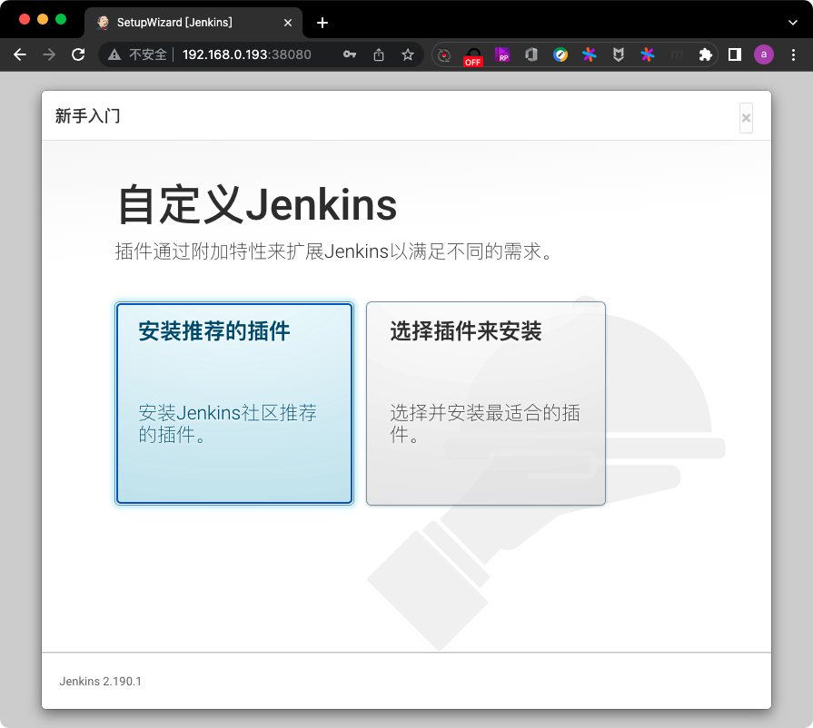

## PART4. K8S实现Nginx + PHP + WordPress + MySQL实现完全容器化的web站点案例

LNMP案例基于Nginx+PHP实现WordPress博客站点,要求Nginx+PHP运行在同一个Pod的不同容器.MySQL运行在erp的namespace下并可以通过service name增删改查数据库.

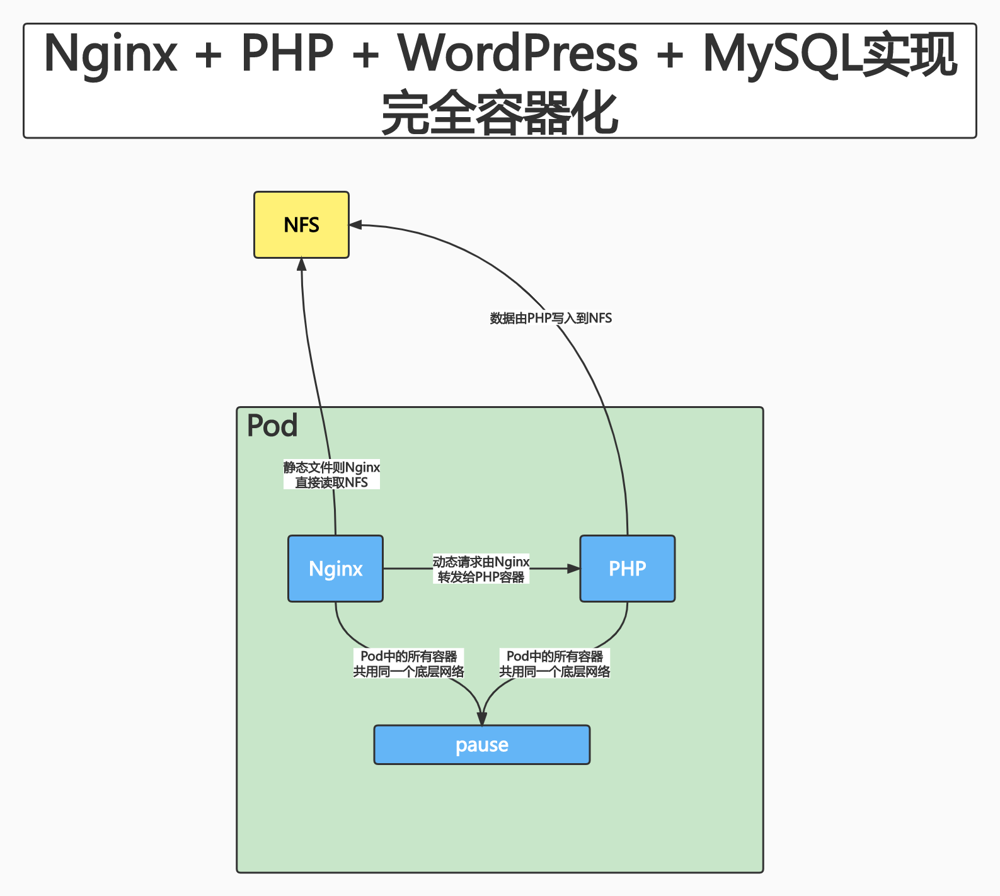

### 4.1 构建镜像

#### 4.1.1 构建Nginx基础镜像

- step1. 下载二进制包

```
root@ks8-harbor-2:/opt/k8s-data/wordpress/dockerfile/nginx-base-wordpress# tree ./
./
└── nginx-1.14.2.tar.gz

0 directories, 1 files
```

- step2. 编写Dockerfile

```
root@ks8-harbor-2:/opt/k8s-data/jenkins-img# cd ..
root@ks8-harbor-2:/opt/k8s-data# mkdir wordpress
root@ks8-harbor-2:/opt/k8s-data# cd wordpress/
root@ks8-harbor-2:/opt/k8s-data/wordpress# mkdir dockerfile
root@ks8-harbor-2:/opt/k8s-data/wordpress# cd dockerfile
root@ks8-harbor-2:/opt/k8s-data/wordpress/dockerfile# mkdir nginx-base-wordpress
root@ks8-harbor-2:/opt/k8s-data/wordpress/dockerfile# cd nginx-base-wordpress/
root@ks8-harbor-2:/opt/k8s-data/wordpress/dockerfile/nginx-base-wordpress# vim Dockerfile 
root@ks8-harbor-2:/opt/k8s-data/wordpress/dockerfile/nginx-base-wordpress# cat Dockerfile
FROM harbor.k8s.com/baseimages/erp-centos-base:7.8.2003
```

```Dockerfile
MAINTAINER  Roach 40486453@qq.com

RUN yum install -y vim wget tree  lrzsz gcc gcc-c++ automake pcre pcre-devel zlib zlib-devel openssl openssl-devel iproute net-tools iotop
ADD nginx-1.14.2.tar.gz /usr/local/src/
RUN cd /usr/local/src/nginx-1.14.2 && ./configure --prefix=/apps/nginx  && make && make install && ln -sv  /apps/nginx/sbin/nginx /usr/sbin/nginx  &&rm -rf /usr/local/src/nginx-1.14.2.tar.gz 
```

- step3. 编写构建并推送镜像的脚本

```
root@ks8-harbor-2:/opt/k8s-data/wordpress/dockerfile/nginx-base-wordpress# vim build-command.sh
root@ks8-harbor-2:/opt/k8s-data/wordpress/dockerfile/nginx-base-wordpress# cat build-command.sh
```

```shell
#!/bin/bash
docker build -t harbor.k8s.com/pub-images/nginx-base-wordpress:v1.14.2  . --network=host
sleep 1
docker push  harbor.k8s.com/pub-images/nginx-base-wordpress:v1.14.2
```

- step4. 构建并推送镜像

```
root@ks8-harbor-2:/opt/k8s-data/wordpress/dockerfile/nginx-base-wordpress# chmod a+x *.sh
root@ks8-harbor-2:/opt/k8s-data/wordpress/dockerfile/nginx-base-wordpress# bash build-command.sh 
Sending build context to Docker daemon  1.019MB
Step 1/5 : FROM harbor.k8s.com/baseimages/erp-centos-base:7.8.2003
 ---> ea0de0e02bd4
Step 2/5 : MAINTAINER  Roach 40486453@qq.com
 ---> Using cache
 ---> 5f0777954f3e
Step 3/5 : RUN yum install -y vim wget tree  lrzsz gcc gcc-c++ automake pcre pcre-devel zlib zlib-devel openssl openssl-devel iproute net-tools iotop
 ---> Running in 37cdb97698ca
...
Removing intermediate container 3c334f4ee204
 ---> 7ef8e1a72cad
Successfully built 7ef8e1a72cad
Successfully tagged harbor.k8s.com/pub-images/nginx-base-wordpress:v1.14.2
The push refers to repository [harbor.k8s.com/pub-images/nginx-base-wordpress]
4658ecaf04da: Pushed 
1a4c5c1fd352: Pushed 
92cfa67864ff: Pushed 
9af9a18fb5a7: Mounted from pub-images/tomcat-base 
0c09dd020e8e: Mounted from pub-images/tomcat-base 
fb82b029bea0: Mounted from pub-images/tomcat-base 
v1.14.2: digest: sha256:80e58f5dbd7649b6a4f65194b744aedcd4933b63e022a31a1aafab340ea354b9 size: 1588
```

#### 4.1.2 构建供给WordPress用的Nginx镜像

- step1. 编写Dockerfile

```
root@ks8-harbor-2:/opt/k8s-data/wordpress/dockerfile/nginx# vim Dockerfile 
root@ks8-harbor-2:/opt/k8s-data/wordpress/dockerfile/nginx# cat Dockerfile
```

```
FROM harbor.k8s.com/pub-images/nginx-base-wordpress:v1.14.2

ADD nginx.conf /apps/nginx/conf/nginx.conf
ADD run_nginx.sh /apps/nginx/sbin/run_nginx.sh
ADD test.html /home/nginx/wordpress/test.html
RUN mkdir -pv /home/nginx/wordpress
RUN chown nginx.nginx /home/nginx/wordpress/ -R

EXPOSE 80 443

CMD ["/apps/nginx/sbin/run_nginx.sh"] 
```

- step2. 编写nginx的配置文件

```
root@ks8-harbor-2:/opt/k8s-data/wordpress/dockerfile/nginx# vim nginx.conf 
root@ks8-harbor-2:/opt/k8s-data/wordpress/dockerfile/nginx# cat nginx.conf
user  nginx nginx;
worker_processes  auto;

#error_log  logs/error.log;
#error_log  logs/error.log  notice;
#error_log  logs/error.log  info;

#pid        logs/nginx.pid;

#daemon off;

events {
    worker_connections  1024;
}


http {
    include       mime.types;
    default_type  application/octet-stream;

    #log_format  main  '$remote_addr - $remote_user [$time_local] "$request" '
    #                  '$status $body_bytes_sent "$http_referer" '
    #                  '"$http_user_agent" "$http_x_forwarded_for"';

    #access_log  logs/access.log  main;

    sendfile        on;
    #tcp_nopush     on;

    keepalive_timeout  65;
    client_max_body_size 10M;
    client_body_buffer_size 16k;
    client_body_temp_path  /apps/nginx/tmp   1 2 2;
    gzip  on;


    server {
        listen       80;
        server_name  blogs.erp.net;

        #charset koi8-r;

        #access_log  logs/host.access.log  main;


        location / {
            root    /home/nginx/wordpress;
            index   index.php index.html index.htm;
            #if ($http_user_agent ~ "ApacheBench|WebBench|TurnitinBot|Sogou web spider|Grid Service") {
            #    proxy_pass http://www.baidu.com;
            #    #return 403;
            #}
        }

        location ~ \.php$ {
            root           /home/nginx/wordpress;
            fastcgi_pass   127.0.0.1:9000;
            fastcgi_index  index.php;
            #fastcgi_param  SCRIPT_FILENAME  /scripts$fastcgi_script_name;
            fastcgi_param  SCRIPT_FILENAME  $document_root$fastcgi_script_name;
             include        fastcgi_params;
        }


        #error_page  404              /404.html;

        # redirect server error pages to the static page /50x.html
        #
        error_page   500 502 503 504  /50x.html;
        location = /50x.html {
            root   html;
        }

        # proxy the PHP scripts to Apache listening on 127.0.0.1:80
        #
        #location ~ \.php$ {
        #    proxy_pass   http://127.0.0.1;
        #}

        # pass the PHP scripts to FastCGI server listening on 127.0.0.1:9000
        #
        #location ~ \.php$ {
        #    root           html;
        #    fastcgi_pass   127.0.0.1:9000;
        #    fastcgi_index  index.php;
        #    fastcgi_param  SCRIPT_FILENAME  /scripts$fastcgi_script_name;
        #    include        fastcgi_params;
        #}

        # deny access to .htaccess files, if Apache's document root
        # concurs with nginx's one
        #
        #location ~ /\.ht {
        #    deny  all;
        #}
    }


    # another virtual host using mix of IP-, name-, and port-based configuration
    #
    #server {
    #    listen       8000;
    #    listen       somename:8080;
    #    server_name  somename  alias  another.alias;

    #    location / {
    #        root   html;
    #        index  index.html index.htm;
    #    }
    #}


    # HTTPS server
    #
    #server {
    #    listen       443 ssl;
    #    server_name  localhost;

    #    ssl_certificate      cert.pem;
    #    ssl_certificate_key  cert.key;

    #    ssl_session_cache    shared:SSL:1m;
    #    ssl_session_timeout  5m;

    #    ssl_ciphers  HIGH:!aNULL:!MD5;
    #    ssl_prefer_server_ciphers  on;

    #    location / {
    #        root   html;
    #        index  index.html index.htm;
    #    }
    #}

}
```

- step3. 编写index.html文件,便于后续测试

```
root@ks8-harbor-2:/opt/k8s-data/wordpress/dockerfile/nginx# vim test.html
root@ks8-harbor-2:/opt/k8s-data/wordpress/dockerfile/nginx# cat test.html 
```

```html
<!DOCTYPE html>
<html>
<head>
	<meta charset="utf-8">
	<meta name="viewport" content="width=device-width, initial-scale=1">
	<title>test page</title>
</head>
<body>
test content
</body>
</html>
```

- step4. 编写nginx的启动脚本

```
root@ks8-harbor-2:/opt/k8s-data/wordpress/dockerfile/nginx# vim run_nginx.sh
root@ks8-harbor-2:/opt/k8s-data/wordpress/dockerfile/nginx# cat run_nginx.sh
```

```shell
#!/bin/bash
/apps/nginx/sbin/nginx
tail -f /etc/hosts
```

- step5. 编写镜像的构建脚本

```
root@ks8-harbor-2:/opt/k8s-data/wordpress/dockerfile/nginx# vim build-command.sh
root@ks8-harbor-2:/opt/k8s-data/wordpress/dockerfile/nginx# cat build-command.sh
```

```shell
#!/bin/bash
TAG=$1
docker build -t harbor.k8s.com/erp/wordpress-nginx:${TAG} .
echo "build image success!"
sleep 1
docker push harbor.k8s.com/erp/wordpress-nginx:${TAG}
echo "push image success!"
```

- step6. 构建镜像

```
root@ks8-harbor-2:/opt/k8s-data/wordpress/dockerfile/nginx# chmod a+x *.sh
root@ks8-harbor-2:/opt/k8s-data/wordpress/dockerfile/nginx# bash build-command.sh v1
Sending build context to Docker daemon  9.216kB
Step 1/8 : FROM harbor.k8s.com/pub-images/nginx-base-wordpress:v1.14.2
 ---> 7ef8e1a72cad
Step 2/8 : ADD nginx.conf /apps/nginx/conf/nginx.conf
 ---> 4704d890634c
Step 3/8 : ADD run_nginx.sh /apps/nginx/sbin/run_nginx.sh
 ---> 65d6e7ad389d
Step 4/8 : ADD test.html /home/nginx/wordpress/test.html
 ---> a72a53969b1a
Step 5/8 : RUN mkdir -pv /home/nginx/wordpress
 ---> Running in 59cf989a3a00
Removing intermediate container 59cf989a3a00
 ---> dbbc0328d874
Step 6/8 : RUN chown nginx.nginx /home/nginx/wordpress/ -R
 ---> Running in e14f7569c5ff
Removing intermediate container e14f7569c5ff
 ---> 8a862093f7c5
Step 7/8 : EXPOSE 80 443
 ---> Running in 259ca465ed74
Removing intermediate container 259ca465ed74
 ---> b1d9596ffdcb
Step 8/8 : CMD ["/apps/nginx/sbin/run_nginx.sh"]
 ---> Running in 9d0881f7ba2c
Removing intermediate container 9d0881f7ba2c
 ---> 4f41293295df
Successfully built 4f41293295df
Successfully tagged harbor.k8s.com/erp/wordpress-nginx:v1
build image success!
The push refers to repository [harbor.k8s.com/erp/wordpress-nginx]
d911ea778ce3: Pushed 
44fa82e9cd90: Pushed 
0418138c901b: Pushed 
e5993bc457be: Pushed 
4658ecaf04da: Layer already exists 
1a4c5c1fd352: Layer already exists 
92cfa67864ff: Layer already exists 
9af9a18fb5a7: Layer already exists 
0c09dd020e8e: Layer already exists 
fb82b029bea0: Layer already exists 
v1: digest: sha256:6185a7db26ecc43986dbf0e3ca479bdd4824ec1149d48ae748cec24d8666cfa4 size: 2417
push image success!
```

- step7. 测试

```
root@ks8-harbor-2:/opt/k8s-data/wordpress/dockerfile/nginx# docker run -d -p 8089:80 harbor.k8s.com/erp/wordpress-nginx:v1
439dd0d5de74ef52eade2c2091246506ced6902ebb46dc46a4ac2a22d93892c3
```


#### 4.1.3 构建PHP镜像

- step1. 编写Dockerfile

```
root@ks8-harbor-2:/opt/k8s-data/wordpress/dockerfile/nginx# cd ..
root@ks8-harbor-2:/opt/k8s-data/wordpress/dockerfile# mkdir php
root@ks8-harbor-2:/opt/k8s-data/wordpress/dockerfile# cd php
root@ks8-harbor-2:/opt/k8s-data/wordpress/dockerfile/php# vim Dockerfile
root@ks8-harbor-2:/opt/k8s-data/wordpress/dockerfile/php# cat Dockerfile
```

```Dockerfile
FROM harbor.k8s.com/baseimages/erp-centos-base:7.8.2003
MAINTAINER  Roach 40486453@qq.com

RUN yum install -y  https://mirrors.tuna.tsinghua.edu.cn/remi/enterprise/remi-release-7.rpm && yum install  php56-php-fpm php56-php-mysql -y 
ADD www.conf /opt/remi/php56/root/etc/php-fpm.d/www.conf
#RUN useradd nginx -u 2019
ADD run_php.sh /usr/local/bin/run_php.sh
EXPOSE 9000

CMD ["/usr/local/bin/run_php.sh"]
```

- step2. 编写PHP的配置文件

```
root@ks8-harbor-2:/opt/k8s-data/wordpress/dockerfile/php# vim www.conf
root@ks8-harbor-2:/opt/k8s-data/wordpress/dockerfile/php# cat www.conf 
; Start a new pool named 'www'.
; the variable $pool can we used in any directive and will be replaced by the
; pool name ('www' here)
[www]

; Per pool prefix
; It only applies on the following directives:
; - 'slowlog'
; - 'listen' (unixsocket)
; - 'chroot'
; - 'chdir'
; - 'php_values'
; - 'php_admin_values'
; When not set, the global prefix (or @php_fpm_prefix@) applies instead.
; Note: This directive can also be relative to the global prefix.
; Default Value: none
;prefix = /path/to/pools/$pool

; Unix user/group of processes
; Note: The user is mandatory. If the group is not set, the default user's group
;       will be used.
; RPM: apache user chosen to provide access to the same directories as httpd
user = nginx
; RPM: Keep a group allowed to write in log dir.
group = nginx

; The address on which to accept FastCGI requests.
; Valid syntaxes are:
;   'ip.add.re.ss:port'    - to listen on a TCP socket to a specific IPv4 address on
;                            a specific port;
;   '[ip:6:addr:ess]:port' - to listen on a TCP socket to a specific IPv6 address on
;                            a specific port;
;   'port'                 - to listen on a TCP socket to all IPv4 addresses on a
;                            specific port;
;   '[::]:port'            - to listen on a TCP socket to all addresses
;                            (IPv6 and IPv4-mapped) on a specific port;
;   '/path/to/unix/socket' - to listen on a unix socket.
; Note: This value is mandatory.
listen = 0.0.0.0:9000

; Set listen(2) backlog.
; Default Value: 65535
;listen.backlog = 65535

; Set permissions for unix socket, if one is used. In Linux, read/write
; permissions must be set in order to allow connections from a web server.
; Default Values: user and group are set as the running user
;                 mode is set to 0660
;listen.owner = nobody
;listen.group = nobody
;listen.mode = 0660

; When POSIX Access Control Lists are supported you can set them using
; these options, value is a comma separated list of user/group names.
; When set, listen.owner and listen.group are ignored
;listen.acl_users = apache
;listen.acl_groups =

; List of addresses (IPv4/IPv6) of FastCGI clients which are allowed to connect.
; Equivalent to the FCGI_WEB_SERVER_ADDRS environment variable in the original
; PHP FCGI (5.2.2+). Makes sense only with a tcp listening socket. Each address
; must be separated by a comma. If this value is left blank, connections will be
; accepted from any ip address.
; Default Value: any
; listen.allowed_clients = 127.0.0.1

; Specify the nice(2) priority to apply to the pool processes (only if set)
; The value can vary from -19 (highest priority) to 20 (lower priority)
; Note: - It will only work if the FPM master process is launched as root
;       - The pool processes will inherit the master process priority
;         unless it specified otherwise
; Default Value: no set
; process.priority = -19

; Set the process dumpable flag (PR_SET_DUMPABLE prctl) even if the process user
; or group is differrent than the master process user. It allows to create process
; core dump and ptrace the process for the pool user.
; Default Value: no
; process.dumpable = yes

; Choose how the process manager will control the number of child processes.
; Possible Values:
;   static  - a fixed number (pm.max_children) of child processes;
;   dynamic - the number of child processes are set dynamically based on the
;             following directives. With this process management, there will be
;             always at least 1 children.
;             pm.max_children      - the maximum number of children that can
;                                    be alive at the same time.
;             pm.start_servers     - the number of children created on startup.
;             pm.min_spare_servers - the minimum number of children in 'idle'
;                                    state (waiting to process). If the number
;                                    of 'idle' processes is less than this
;                                    number then some children will be created.
;             pm.max_spare_servers - the maximum number of children in 'idle'
;                                    state (waiting to process). If the number
;                                    of 'idle' processes is greater than this
;                                    number then some children will be killed.
;  ondemand - no children are created at startup. Children will be forked when
;             new requests will connect. The following parameter are used:
;             pm.max_children           - the maximum number of children that
;                                         can be alive at the same time.
;             pm.process_idle_timeout   - The number of seconds after which
;                                         an idle process will be killed.
; Note: This value is mandatory.
pm = dynamic

; The number of child processes to be created when pm is set to 'static' and the
; maximum number of child processes when pm is set to 'dynamic' or 'ondemand'.
; This value sets the limit on the number of simultaneous requests that will be
; served. Equivalent to the ApacheMaxClients directive with mpm_prefork.
; Equivalent to the PHP_FCGI_CHILDREN environment variable in the original PHP
; CGI. The below defaults are based on a server without much resources. Don't
; forget to tweak pm.* to fit your needs.
; Note: Used when pm is set to 'static', 'dynamic' or 'ondemand'
; Note: This value is mandatory.
pm.max_children = 50

; The number of child processes created on startup.
; Note: Used only when pm is set to 'dynamic'
; Default Value: min_spare_servers + (max_spare_servers - min_spare_servers) / 2
pm.start_servers = 5

; The desired minimum number of idle server processes.
; Note: Used only when pm is set to 'dynamic'
; Note: Mandatory when pm is set to 'dynamic'
pm.min_spare_servers = 5

; The desired maximum number of idle server processes.
; Note: Used only when pm is set to 'dynamic'
; Note: Mandatory when pm is set to 'dynamic'
pm.max_spare_servers = 35
 
; The number of seconds after which an idle process will be killed.
; Note: Used only when pm is set to 'ondemand'
; Default Value: 10s
;pm.process_idle_timeout = 10s;

; The number of requests each child process should execute before respawning.
; This can be useful to work around memory leaks in 3rd party libraries. For
; endless request processing specify '0'. Equivalent to PHP_FCGI_MAX_REQUESTS.
; Default Value: 0
;pm.max_requests = 500

; The URI to view the FPM status page. If this value is not set, no URI will be
; recognized as a status page. It shows the following informations:
;   pool                 - the name of the pool;
;   process manager      - static, dynamic or ondemand;
;   start time           - the date and time FPM has started;
;   start since          - number of seconds since FPM has started;
;   accepted conn        - the number of request accepted by the pool;
;   listen queue         - the number of request in the queue of pending
;                          connections (see backlog in listen(2));
;   max listen queue     - the maximum number of requests in the queue
;                          of pending connections since FPM has started;
;   listen queue len     - the size of the socket queue of pending connections;
;   idle processes       - the number of idle processes;
;   active processes     - the number of active processes;
;   total processes      - the number of idle + active processes;
;   max active processes - the maximum number of active processes since FPM
;                          has started;
;   max children reached - number of times, the process limit has been reached,
;                          when pm tries to start more children (works only for
;                          pm 'dynamic' and 'ondemand');
; Value are updated in real time.
; Example output:
;   pool:                 www
;   process manager:      static
;   start time:           01/Jul/2011:17:53:49 +0200
;   start since:          62636
;   accepted conn:        190460
;   listen queue:         0
;   max listen queue:     1
;   listen queue len:     42
;   idle processes:       4
;   active processes:     11
;   total processes:      15
;   max active processes: 12
;   max children reached: 0
;
; By default the status page output is formatted as text/plain. Passing either
; 'html', 'xml' or 'json' in the query string will return the corresponding
; output syntax. Example:
;   http://www.foo.bar/status
;   http://www.foo.bar/status?json
;   http://www.foo.bar/status?html
;   http://www.foo.bar/status?xml
;
; By default the status page only outputs short status. Passing 'full' in the
; query string will also return status for each pool process.
; Example:
;   http://www.foo.bar/status?full
;   http://www.foo.bar/status?json&full
;   http://www.foo.bar/status?html&full
;   http://www.foo.bar/status?xml&full
; The Full status returns for each process:
;   pid                  - the PID of the process;
;   state                - the state of the process (Idle, Running, ...);
;   start time           - the date and time the process has started;
;   start since          - the number of seconds since the process has started;
;   requests             - the number of requests the process has served;
;   request duration     - the duration in µs of the requests;
;   request method       - the request method (GET, POST, ...);
;   request URI          - the request URI with the query string;
;   content length       - the content length of the request (only with POST);
;   user                 - the user (PHP_AUTH_USER) (or '-' if not set);
;   script               - the main script called (or '-' if not set);
;   last request cpu     - the %cpu the last request consumed
;                          it's always 0 if the process is not in Idle state
;                          because CPU calculation is done when the request
;                          processing has terminated;
;   last request memory  - the max amount of memory the last request consumed
;                          it's always 0 if the process is not in Idle state
;                          because memory calculation is done when the request
;                          processing has terminated;
; If the process is in Idle state, then informations are related to the
; last request the process has served. Otherwise informations are related to
; the current request being served.
; Example output:
;   ************************
;   pid:                  31330
;   state:                Running
;   start time:           01/Jul/2011:17:53:49 +0200
;   start since:          63087
;   requests:             12808
;   request duration:     1250261
;   request method:       GET
;   request URI:          /test_mem.php?N=10000
;   content length:       0
;   user:                 -
;   script:               /home/fat/web/docs/php/test_mem.php
;   last request cpu:     0.00
;   last request memory:  0
;
; Note: There is a real-time FPM status monitoring sample web page available
;       It's available in: @EXPANDED_DATADIR@/fpm/status.html
;
; Note: The value must start with a leading slash (/). The value can be
;       anything, but it may not be a good idea to use the .php extension or it
;       may conflict with a real PHP file.
; Default Value: not set
;pm.status_path = /status
 
; The ping URI to call the monitoring page of FPM. If this value is not set, no
; URI will be recognized as a ping page. This could be used to test from outside
; that FPM is alive and responding, or to
; - create a graph of FPM availability (rrd or such);
; - remove a server from a group if it is not responding (load balancing);
; - trigger alerts for the operating team (24/7).
; Note: The value must start with a leading slash (/). The value can be
;       anything, but it may not be a good idea to use the .php extension or it
;       may conflict with a real PHP file.
; Default Value: not set
;ping.path = /ping

; This directive may be used to customize the response of a ping request. The
; response is formatted as text/plain with a 200 response code.
; Default Value: pong
;ping.response = pong
 
; The access log file
; Default: not set
;access.log = log/$pool.access.log

; The access log format.
; The following syntax is allowed
;  %%: the '%' character
;  %C: %CPU used by the request
;      it can accept the following format:
;      - %{user}C for user CPU only
;      - %{system}C for system CPU only
;      - %{total}C  for user + system CPU (default)
;  %d: time taken to serve the request
;      it can accept the following format:
;      - %{seconds}d (default)
;      - %{miliseconds}d
;      - %{mili}d
;      - %{microseconds}d
;      - %{micro}d
;  %e: an environment variable (same as $_ENV or $_SERVER)
;      it must be associated with embraces to specify the name of the env
;      variable. Some exemples:
;      - server specifics like: %{REQUEST_METHOD}e or %{SERVER_PROTOCOL}e
;      - HTTP headers like: %{HTTP_HOST}e or %{HTTP_USER_AGENT}e
;  %f: script filename
;  %l: content-length of the request (for POST request only)
;  %m: request method
;  %M: peak of memory allocated by PHP
;      it can accept the following format:
;      - %{bytes}M (default)
;      - %{kilobytes}M
;      - %{kilo}M
;      - %{megabytes}M
;      - %{mega}M
;  %n: pool name
;  %o: output header
;      it must be associated with embraces to specify the name of the header:
;      - %{Content-Type}o
;      - %{X-Powered-By}o
;      - %{Transfert-Encoding}o
;      - ....
;  %p: PID of the child that serviced the request
;  %P: PID of the parent of the child that serviced the request
;  %q: the query string
;  %Q: the '?' character if query string exists
;  %r: the request URI (without the query string, see %q and %Q)
;  %R: remote IP address
;  %s: status (response code)
;  %t: server time the request was received
;      it can accept a strftime(3) format:
;      %d/%b/%Y:%H:%M:%S %z (default)
;  %T: time the log has been written (the request has finished)
;      it can accept a strftime(3) format:
;      %d/%b/%Y:%H:%M:%S %z (default)
;  %u: remote user
;
; Default: "%R - %u %t \"%m %r\" %s"
;access.format = "%R - %u %t \"%m %r%Q%q\" %s %f %{mili}d %{kilo}M %C%%"

; The log file for slow requests
; Default Value: not set
; Note: slowlog is mandatory if request_slowlog_timeout is set
slowlog = /opt/remi/php56/root/var/log/php-fpm/www-slow.log

; The timeout for serving a single request after which a PHP backtrace will be
; dumped to the 'slowlog' file. A value of '0s' means 'off'.
; Available units: s(econds)(default), m(inutes), h(ours), or d(ays)
; Default Value: 0
;request_slowlog_timeout = 0

; The timeout for serving a single request after which the worker process will
; be killed. This option should be used when the 'max_execution_time' ini option
; does not stop script execution for some reason. A value of '0' means 'off'.
; Available units: s(econds)(default), m(inutes), h(ours), or d(ays)
; Default Value: 0
;request_terminate_timeout = 0
 
; Set open file descriptor rlimit.
; Default Value: system defined value
;rlimit_files = 1024
 
; Set max core size rlimit.
; Possible Values: 'unlimited' or an integer greater or equal to 0
; Default Value: system defined value
;rlimit_core = 0
 
; Chroot to this directory at the start. This value must be defined as an
; absolute path. When this value is not set, chroot is not used.
; Note: you can prefix with '$prefix' to chroot to the pool prefix or one
; of its subdirectories. If the pool prefix is not set, the global prefix
; will be used instead.
; Note: chrooting is a great security feature and should be used whenever
;       possible. However, all PHP paths will be relative to the chroot
;       (error_log, sessions.save_path, ...).
; Default Value: not set
;chroot = 
 
; Chdir to this directory at the start.
; Note: relative path can be used.
; Default Value: current directory or / when chroot
;chdir = /var/www
 
; Redirect worker stdout and stderr into main error log. If not set, stdout and
; stderr will be redirected to /dev/null according to FastCGI specs.
; Note: on highloaded environement, this can cause some delay in the page
; process time (several ms).
; Default Value: no
;catch_workers_output = yes
 
; Clear environment in FPM workers
; Prevents arbitrary environment variables from reaching FPM worker processes
; by clearing the environment in workers before env vars specified in this
; pool configuration are added.
; Setting to "no" will make all environment variables available to PHP code
; via getenv(), $_ENV and $_SERVER.
; Default Value: yes
;clear_env = no

; Limits the extensions of the main script FPM will allow to parse. This can
; prevent configuration mistakes on the web server side. You should only limit
; FPM to .php extensions to prevent malicious users to use other extensions to
; exectute php code.
; Note: set an empty value to allow all extensions.
; Default Value: .php
;security.limit_extensions = .php .php3 .php4 .php5

; Pass environment variables like LD_LIBRARY_PATH. All $VARIABLEs are taken from
; the current environment.
; Default Value: clean env
;env[HOSTNAME] = $HOSTNAME
;env[PATH] = /usr/local/bin:/usr/bin:/bin
;env[TMP] = /tmp
;env[TMPDIR] = /tmp
;env[TEMP] = /tmp

; Additional php.ini defines, specific to this pool of workers. These settings
; overwrite the values previously defined in the php.ini. The directives are the
; same as the PHP SAPI:
;   php_value/php_flag             - you can set classic ini defines which can
;                                    be overwritten from PHP call 'ini_set'. 
;   php_admin_value/php_admin_flag - these directives won't be overwritten by
;                                     PHP call 'ini_set'
; For php_*flag, valid values are on, off, 1, 0, true, false, yes or no.

; Defining 'extension' will load the corresponding shared extension from
; extension_dir. Defining 'disable_functions' or 'disable_classes' will not
; overwrite previously defined php.ini values, but will append the new value
; instead.

; Note: path INI options can be relative and will be expanded with the prefix
; (pool, global or @prefix@)

; Default Value: nothing is defined by default except the values in php.ini and
;                specified at startup with the -d argument
;php_admin_value[sendmail_path] = /usr/sbin/sendmail -t -i -f www@my.domain.com
;php_flag[display_errors] = off
php_admin_value[error_log] = /opt/remi/php56/root/var/log/php-fpm/www-error.log
php_admin_flag[log_errors] = on
;php_admin_value[memory_limit] = 128M

; Set the following data paths to directories owned by the FPM process user.
;
; Do not change the ownership of existing system directories, if the process
; user does not have write permission, create dedicated directories for this
; purpose.
;
; See warning about choosing the location of these directories on your system
; at http://php.net/session.save-path
php_value[session.save_handler] = files
php_value[session.save_path]    = /opt/remi/php56/root/var/lib/php/session
php_value[soap.wsdl_cache_dir]  = /opt/remi/php56/root/var/lib/php/wsdlcache
```

注意:运行PHP的用户要和运行Nginx的用户是同一个用户(权限相同即可)

- step3. 编写启动脚本

```
root@ks8-harbor-2:/opt/k8s-data/wordpress/dockerfile/php# vim run_php.sh
root@ks8-harbor-2:/opt/k8s-data/wordpress/dockerfile/php# cat run_php.sh
```

```shell
#!/bin/bash
/opt/remi/php56/root/usr/sbin/php-fpm
tail -f /etc/hosts
```

- step4. 编写构建并推送镜像的脚本

```
root@ks8-harbor-2:/opt/k8s-data/wordpress/dockerfile/php# vim build-command.sh 
root@ks8-harbor-2:/opt/k8s-data/wordpress/dockerfile/php# cat build-command.sh
```

```
#!/bin/bash
TAG=$1
docker build -t harbor.k8s.com/erp/wordpress-php-5.6:${TAG} . --network=host
echo "build image success"
sleep 1
docker push harbor.k8s.com/erp/wordpress-php-5.6:${TAG}
echo "push image success"
```

- step5. 构建镜像

```
root@ks8-harbor-2:/opt/k8s-data/wordpress/dockerfile/php# chmod a+x *.sh
root@ks8-harbor-2:/opt/k8s-data/wordpress/dockerfile/php# bash build-command.sh v1
Sending build context to Docker daemon  24.06kB
Step 1/7 : FROM harbor.k8s.com/baseimages/erp-centos-base:7.8.2003
 ---> ea0de0e02bd4
Step 2/7 : MAINTAINER  Roach 40486453@qq.com
 ---> Using cache
 ---> 5f0777954f3e
Step 3/7 : RUN yum install -y  https://mirrors.tuna.tsinghua.edu.cn/remi/enterprise/remi-release-7.rpm && yum install  php56-php-fpm php56-php-mysql -y
 ---> Running in f2ffc240116f
...
Successfully built f90ea9c43840
Successfully tagged harbor.k8s.com/erp/wordpress-php-5.6:v1
build image success
The push refers to repository [harbor.k8s.com/erp/wordpress-php-5.6]
479e79cd092f: Pushed 
a408d4a810e8: Pushed 
468644db17b0: Pushed 
9af9a18fb5a7: Mounted from erp/wordpress-nginx 
0c09dd020e8e: Mounted from erp/wordpress-nginx 
fb82b029bea0: Mounted from erp/wordpress-nginx 
v1: digest: sha256:9ebb16c5347fa83e5cb444259cc5be02611cb873a92daeb122f52ebcf7866bec size: 1582
push image success
```

### 4.2 在K8S上运行

#### 4.2.1 创建NFS存储

```
root@k8s-haproxy-1:/data/k8sdata/erp# mkdir /data/k8sdata/erp/wordpress
root@k8s-haproxy-1:/data/k8sdata/erp# vim /etc/exports 
root@k8s-haproxy-1:/data/k8sdata/erp# cat /etc/exports
# /etc/exports: the access control list for filesystems which may be exported
#		to NFS clients.  See exports(5).
#
# Example for NFSv2 and NFSv3:
# /srv/homes       hostname1(rw,sync,no_subtree_check) hostname2(ro,sync,no_subtree_check)
#
# Example for NFSv4:
# /srv/nfs4        gss/krb5i(rw,sync,fsid=0,crossmnt,no_subtree_check)
# /srv/nfs4/homes  gss/krb5i(rw,sync,no_subtree_check)
#
/data/erp *(rw,no_root_squash)
/data/k8sdata/erp *(rw,no_root_squash)
/data/k8sdata/nginx-webapp/images *(rw,no_root_squash)
/data/k8sdata/nginx-webapp/static *(rw,no_root_squash)
/data/k8sdata/erp/redis-datadir-1 *(rw,no_root_squash)

/data/k8sdata/erp/mysql-datadir-1 *(rw,no_root_squash)
/data/k8sdata/erp/mysql-datadir-2 *(rw,no_root_squash)
/data/k8sdata/erp/mysql-datadir-3 *(rw,no_root_squash)
/data/k8sdata/erp/mysql-datadir-4 *(rw,no_root_squash)
/data/k8sdata/erp/mysql-datadir-5 *(rw,no_root_squash)
/data/k8sdata/erp/mysql-datadir-6 *(rw,no_root_squash)


/data/k8sdata/erp/jenkins-root-data *(rw,no_root_squash)
/data/k8sdata/erp/jenkins-data  *(rw,no_root_squash)

/data/k8sdata/erp/wordpress  *(rw,no_root_squash)
root@k8s-haproxy-1:/data/k8sdata/erp# systemctl restart nfs-server.service 
root@k8s-haproxy-1:/data/k8sdata/erp# showmount -e 172.16.1.189
Export list for 172.16.1.189:
/data/k8sdata/erp/wordpress         *
/data/k8sdata/erp/jenkins-data      *
/data/k8sdata/erp/jenkins-root-data *
/data/k8sdata/erp/mysql-datadir-6   *
/data/k8sdata/erp/mysql-datadir-5   *
/data/k8sdata/erp/mysql-datadir-4   *
/data/k8sdata/erp/mysql-datadir-3   *
/data/k8sdata/erp/mysql-datadir-2   *
/data/k8sdata/erp/mysql-datadir-1   *
/data/k8sdata/erp/redis-datadir-1   *
/data/k8sdata/nginx-webapp/static   *
/data/k8sdata/nginx-webapp/images   *
/data/k8sdata/erp                   *
/data/erp                           *
``` 

#### 4.2.2 创建Pod

```
root@k8s-master-1:~/k8s-data/jenkins-yaml# cd ..
root@k8s-master-1:~/k8s-data# mkdir wordpress-yaml
root@k8s-master-1:~/k8s-data# cd wordpress-yaml/
root@k8s-master-1:~/k8s-data/wordpress-yaml# vim wordpress-deployment.yaml
root@k8s-master-1:~/k8s-data/wordpress-yaml# cat wordpress-deployment.yaml
```

```yaml
kind: Deployment
apiVersion: apps/v1
metadata:
  labels:
    app: wordpress-app
  name: wordpress-app-deployment
  namespace: erp
spec:
  replicas: 1
  selector:
    matchLabels:
      app: wordpress-app
  template:
    metadata:
      labels:
        app: wordpress-app
    spec:
      containers:
      - name: wordpress-app-nginx
        image: harbor.k8s.com/erp/wordpress-nginx:v1
        imagePullPolicy: Always
        ports:
        - containerPort: 80
          protocol: TCP
          name: http
        - containerPort: 443
          protocol: TCP
          name: https
        volumeMounts:
        - name: wordpress
          mountPath: /home/nginx/wordpress
          readOnly: false

      - name: wordpress-app-php
        image: harbor.k8s.com/erp/wordpress-php-5.6:v1
        imagePullPolicy: Always
        ports:
        - containerPort: 9000
          protocol: TCP
          name: http
        volumeMounts:
        - name: wordpress
          mountPath: /home/nginx/wordpress
          readOnly: false

      volumes:
      - name: wordpress
        nfs:
          server: 172.16.1.189
          path: /data/k8sdata/erp/wordpress
```

```
root@k8s-master-1:~/k8s-data/wordpress-yaml# kubectl apply -f wordpress-deployment.yaml 
deployment.apps/wordpress-app-deployment created
root@k8s-master-1:~/k8s-data/wordpress-yaml# kubectl get pod -n erp
NAME                                            READY   STATUS    RESTARTS   AGE
erp-jenkins-deployment-696696cb65-b79sr         1/1     Running   0          5h19m
erp-nginx-webapp-deployment-65fb86d9f6-8mhhb    1/1     Running   6          7h34m
erp-tomcat-webapp-deployment-84bbf6b865-fdq8z   1/1     Running   1          7h34m
mysql-0                                         2/2     Running   2          6h59m
mysql-1                                         2/2     Running   2          6h59m
mysql-2                                         2/2     Running   2          6h59m
redis-deployment-6d85975b47-9nns2               1/1     Running   1          7h34m
wordpress-app-deployment-7fcb55bd59-l745v       2/2     Running   0          20s
zookeeper1-7ff6fbfbf-pstf9                      1/1     Running   1          7h34m
zookeeper2-94cfd4596-z56n9                      1/1     Running   1          7h34m
zookeeper3-7f55657779-62hvf                     1/1     Running   1          7h34m
```

#### 4.2.3 创建Service

```
root@k8s-master-1:~/k8s-data/wordpress-yaml# vim wordpress-service.yaml
root@k8s-master-1:~/k8s-data/wordpress-yaml# cat wordpress-service.yaml
```

```yaml
kind: Service
apiVersion: v1
metadata:
  labels:
    app: wordpress-app
  name: wordpress-app-spec
  namespace: erp
spec:
  type: NodePort
  ports:
  - name: http
    port: 80
    protocol: TCP
    targetPort: 80
    nodePort: 30031
  - name: https
    port: 443
    protocol: TCP
    targetPort: 443
    nodePort: 30033
  selector:
    app: wordpress-app
```

```
root@k8s-master-1:~/k8s-data/wordpress-yaml# kubectl apply -f wordpress-service.yaml 
service/wordpress-app-spec created
root@k8s-master-1:~/k8s-data/wordpress-yaml# kubectl get svc -n erp
NAME                        TYPE        CLUSTER-IP       EXTERNAL-IP   PORT(S)                                        AGE
erp-jenkins-service         NodePort    10.100.192.166   <none>        80:38080/TCP                                   5h19m
erp-nginx-webapp-service    NodePort    10.100.9.36      <none>        80:40002/TCP,443:40443/TCP                     23d
erp-tomcat-webapp-service   NodePort    10.100.139.19    <none>        80:40003/TCP                                   10d
mysql                       ClusterIP   None             <none>        3306/TCP                                       25h
mysql-read                  ClusterIP   10.100.11.41     <none>        3306/TCP                                       25h
redis-service               NodePort    10.100.1.198     <none>        6379:36379/TCP                                 4d
wordpress-app-spec          NodePort    10.100.247.126   <none>        80:30031/TCP,443:30033/TCP                     4s
zookeeper1                  NodePort    10.100.184.160   <none>        2181:42181/TCP,2888:43385/TCP,3888:39547/TCP   24d
zookeeper2                  NodePort    10.100.17.68     <none>        2181:42182/TCP,2888:62636/TCP,3888:36521/TCP   24d
zookeeper3                  NodePort    10.100.146.59    <none>        2181:42183/TCP,2888:34167/TCP,3888:47769/TCP   24d
```

#### 4.2.4 测试

- step1. 写静态页测试

```
root@k8s-master-1:~/k8s-data/wordpress-yaml# kubectl exec -it wordpress-app-deployment-7fcb55bd59-l745v bash -n erp -c wordpress-app-nginx
kubectl exec [POD] [COMMAND] is DEPRECATED and will be removed in a future version. Use kubectl exec [POD] -- [COMMAND] instead.
[root@wordpress-app-deployment-7fcb55bd59-l745v /]# cd /home/nginx/wordpress/
[root@wordpress-app-deployment-7fcb55bd59-l745v wordpress]# echo "test page for wordpress" > index.html
```


- step2. 写一个PHP脚本测试

```
[root@wordpress-app-deployment-7fcb55bd59-l745v wordpress]# cat index.php
<?php
phpinfo();
?>
```

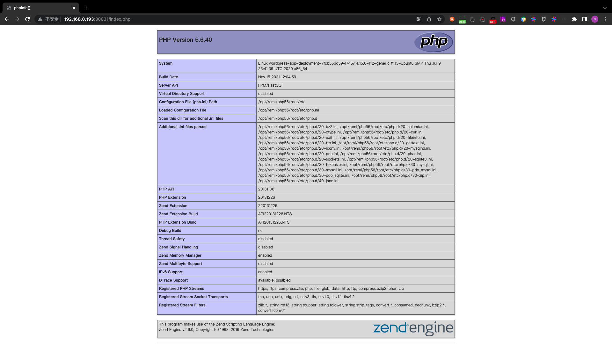

#### 4.2.5 配置wordpress

- step1. 将源码上传到nfs,并调整nfs的属主和属组

实际上nginx.conf中的location就是nfs存储的数据卷,因此直接将wordpress的源码放到nfs上即可

```
root@k8s-haproxy-1:/# cd /data/k8sdata/erp/wordpress
root@k8s-haproxy-1:/data/k8sdata/erp/wordpress# tree ./ -L 1
./
└── wordpress

1 directory, 0 files
root@k8s-haproxy-1:/data/k8sdata/erp/wordpress# mv wordpress/* .
root@k8s-haproxy-1:/data/k8sdata/erp/wordpress# ls
index.php    readme.html  wp-activate.php  wp-blog-header.php    wp-config-sample.php  wp-cron.php  wp-links-opml.php  wp-login.php  wp-settings.php  wp-trackback.php
license.txt  wordpress    wp-admin         wp-comments-post.php  wp-content            wp-includes  wp-load.php        wp-mail.php   wp-signup.php    xmlrpc.php
root@k8s-haproxy-1:/# cd /data/k8sdata/erp/
root@k8s-haproxy-1:/data/k8sdata/erp# chown 2021.2021 wordpress/ -R
```

由于wordpress后续会做一些需要写入的操作(例如生成连接数据库的配置文件),所以需要调整nfs的用户权限.

- step2. 在Pod中调整源码文件的属主和属组

```
[root@wordpress-app-deployment-7fcb55bd59-l745v wordpress]# ls
index.php    readme.html      wp-admin            wp-comments-post.php  wp-content   wp-includes        wp-load.php   wp-mail.php      wp-signup.php     xmlrpc.php
license.txt  wp-activate.php  wp-blog-header.php  wp-config-sample.php  wp-cron.php  wp-links-opml.php  wp-login.php  wp-settings.php  wp-trackback.php
[root@wordpress-app-deployment-7fcb55bd59-l745v wordpress]# chown nginx.nginx ./* -R
[root@wordpress-app-deployment-7fcb55bd59-l745v wordpress]# ls -l
total 196
-rw-r--r--  1 nginx nginx   418 May 20 21:03 index.php
-rw-r--r--  1 nginx nginx 19935 May 20 21:03 license.txt
-rw-r--r--  1 nginx nginx  6989 May 20 21:03 readme.html
-rw-r--r--  1 nginx nginx  6878 May 20 21:03 wp-activate.php
drwxr-xr-x  9 nginx nginx  4096 May 20 21:04 wp-admin
-rw-r--r--  1 nginx nginx   364 May 20 21:03 wp-blog-header.php
-rw-r--r--  1 nginx nginx  1889 May 20 21:03 wp-comments-post.php
-rw-r--r--  1 nginx nginx  2735 May 20 21:03 wp-config-sample.php
drwxr-xr-x  5 nginx nginx  4096 May 20 21:04 wp-content
-rw-r--r--  1 nginx nginx  3669 May 20 21:03 wp-cron.php
drwxr-xr-x 19 nginx nginx 12288 May 20 21:04 wp-includes
-rw-r--r--  1 nginx nginx  2422 May 20 21:03 wp-links-opml.php
-rw-r--r--  1 nginx nginx  3306 May 20 21:03 wp-load.php
-rw-r--r--  1 nginx nginx 37296 May 20 21:03 wp-login.php
-rw-r--r--  1 nginx nginx  8048 May 20 21:03 wp-mail.php
-rw-r--r--  1 nginx nginx 17421 May 20 21:03 wp-settings.php
-rw-r--r--  1 nginx nginx 30091 May 20 21:03 wp-signup.php
-rw-r--r--  1 nginx nginx  4620 May 20 21:03 wp-trackback.php
-rw-r--r--  1 nginx nginx  3065 May 20 21:03 xmlrpc.php
```

- step3. 为Pod配置负载均衡

```
root@k8s-haproxy-1:/# vim /etc/haproxy/haproxy.cfg 
root@k8s-haproxy-1:/# cat /etc/haproxy/haproxy.cfg
global
	log /dev/log	local0
	log /dev/log	local1 notice
	chroot /var/lib/haproxy
	stats socket /run/haproxy/admin.sock mode 660 level admin expose-fd listeners
	stats timeout 30s
	user haproxy
	group haproxy
	daemon

	# Default SSL material locations
	ca-base /etc/ssl/certs
	crt-base /etc/ssl/private

	# Default ciphers to use on SSL-enabled listening sockets.
	# For more information, see ciphers(1SSL). This list is from:
	#  https://hynek.me/articles/hardening-your-web-servers-ssl-ciphers/
	# An alternative list with additional directives can be obtained from
	#  https://mozilla.github.io/server-side-tls/ssl-config-generator/?server=haproxy
	ssl-default-bind-ciphers ECDH+AESGCM:DH+AESGCM:ECDH+AES256:DH+AES256:ECDH+AES128:DH+AES:RSA+AESGCM:RSA+AES:!aNULL:!MD5:!DSS
	ssl-default-bind-options no-sslv3

defaults
	log	global
	mode	http
	option	httplog
	option	dontlognull
        timeout connect 5000
        timeout client  50000
        timeout server  50000
	errorfile 400 /etc/haproxy/errors/400.http
	errorfile 403 /etc/haproxy/errors/403.http
	errorfile 408 /etc/haproxy/errors/408.http
	errorfile 500 /etc/haproxy/errors/500.http
	errorfile 502 /etc/haproxy/errors/502.http
	errorfile 503 /etc/haproxy/errors/503.http
	errorfile 504 /etc/haproxy/errors/504.http

listen k8s-6443
  # bind的地址即keepalived配置的IP地址
  bind 192.168.0.118:6443
  mode tcp
  # server的IP地址即为kub-apiserver的节点地址 即本例中所有的k8s-master地址
  server k8s-master-1 192.168.0.181:6443 check inter 3s fall 3 rise 5
  server k8s-master-2 192.168.0.182:6443 check inter 3s fall 3 rise 5
  server k8s-master-3 192.168.0.183:6443 check inter 3s fall 3 rise 5

#listen erp-nginx-80
#  bind 192.168.0.119:80
#  mode tcp
#  server k8s-node-1 192.168.0.191:30019 check inter 3s fall 3 rise 5
#  server k8s-node-1 192.168.0.192:30019 check inter 3s fall 3 rise 5
#  server k8s-node-1 192.168.0.193:30019 check inter 3s fall 3 rise 5


#listen erp-nginx-80
#  bind 192.168.0.119:80
#  mode tcp
#  server k8s-node-1 192.168.0.191:40002 check inter 3s fall 3 rise 5
#  server k8s-node-1 192.168.0.192:40002 check inter 3s fall 3 rise 5
#  server k8s-node-1 192.168.0.193:40002 check inter 3s fall 3 rise 5

listen erp-nginx-80
  bind 192.168.0.120:80
  mode tcp
  server k8s-node-1 192.168.0.191:30031 check inter 3s fall 3 rise 5
  server k8s-node-1 192.168.0.192:30031 check inter 3s fall 3 rise 5
  server k8s-node-1 192.168.0.193:30031 check inter 3s fall 3 rise 5
root@k8s-haproxy-1:/# systemctl restart haproxy.service 
```

- step4. 为本机(你自己的物理机,不是虚拟机)配置域名解析

```
root@192 ~ # vim /etc/hosts
root@192 ~ # cat /etc/hosts
# Host Database
#
# localhost is used to configure the loopback interface
# when the system is booting.  Do not change this entry.
##
127.0.0.1	localhost
255.255.255.255	broadcasthost
::1             localhost
# Added by Docker Desktop
# To allow the same kube context to work on the host and the container:
127.0.0.1 kubernetes.docker.internal
# End of section
192.168.0.184 harbor.k8s.com
192.168.0.119 www.mysite.com
192.168.0.120 blogs.erp.net
```

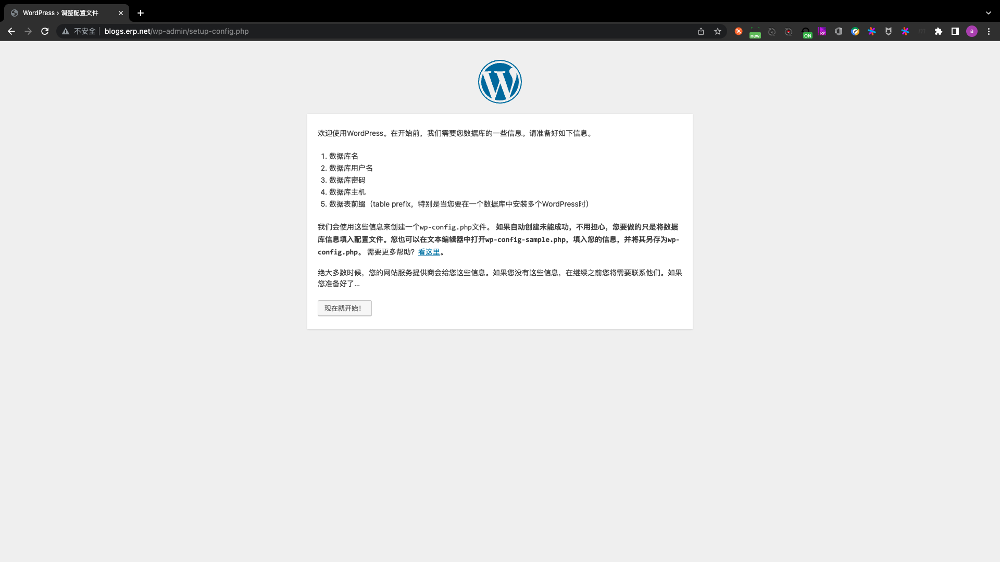

- step6. 为wordpress创建数据库和用户

```
root@k8s-master-1:~/k8s-data/wordpress-yaml# kubectl exec -it mysql-0 bash -n erp
kubectl exec [POD] [COMMAND] is DEPRECATED and will be removed in a future version. Use kubectl exec [POD] -- [COMMAND] instead.
Defaulted container "mysql" out of: mysql, xtrabackup, init-mysql (init), clone-mysql (init)
root@mysql-0:/# mysql
Welcome to the MySQL monitor.  Commands end with ; or \g.
Your MySQL connection id is 14725
Server version: 5.7.36-log MySQL Community Server (GPL)

Copyright (c) 2000, 2021, Oracle and/or its affiliates.

Oracle is a registered trademark of Oracle Corporation and/or its
affiliates. Other names may be trademarks of their respective
owners.

Type 'help;' or '\h' for help. Type '\c' to clear the current input statement.

mysql> CREATE DATABASE wordpress;
Query OK, 1 row affected (0.02 sec)

mysql> GRANT ALL PRIVILEGES ON wordpress.* TO "wordpress"@"%" IDENTIFIED BY "wordpress";
Query OK, 0 rows affected, 1 warning (0.00 sec)
```

- step7. 配置wordpress

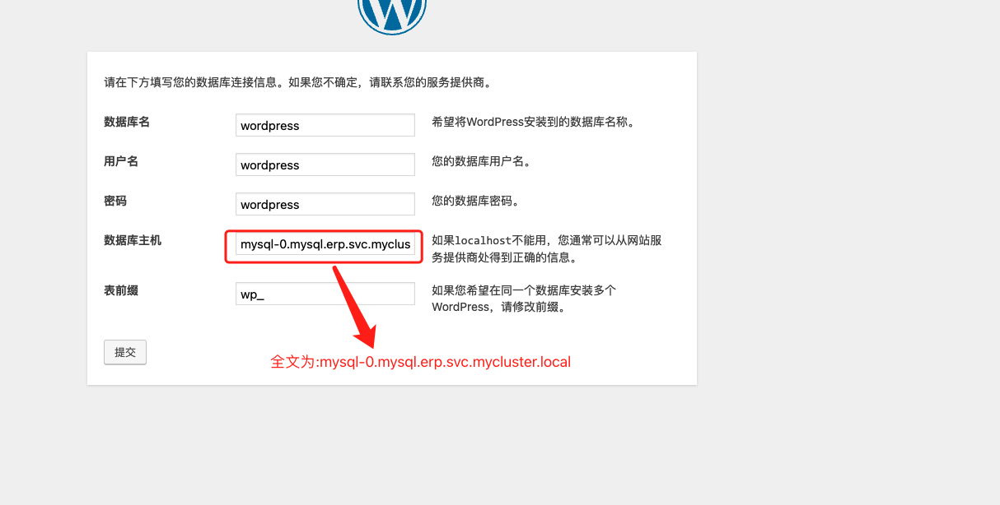

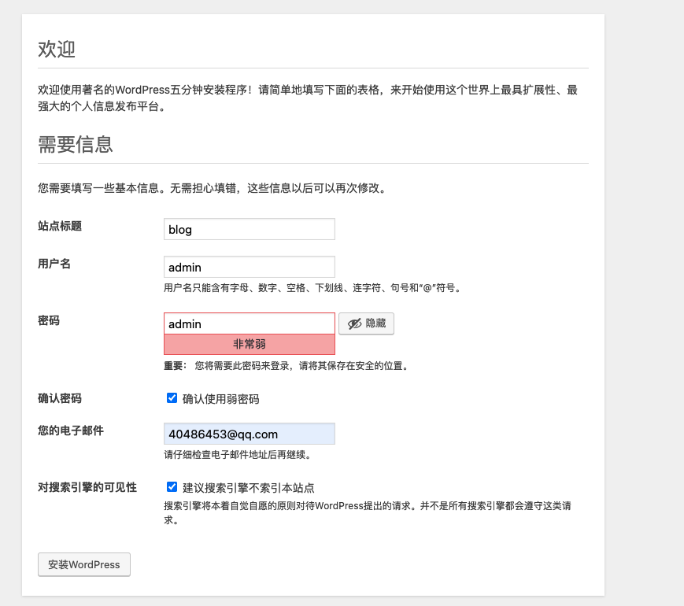

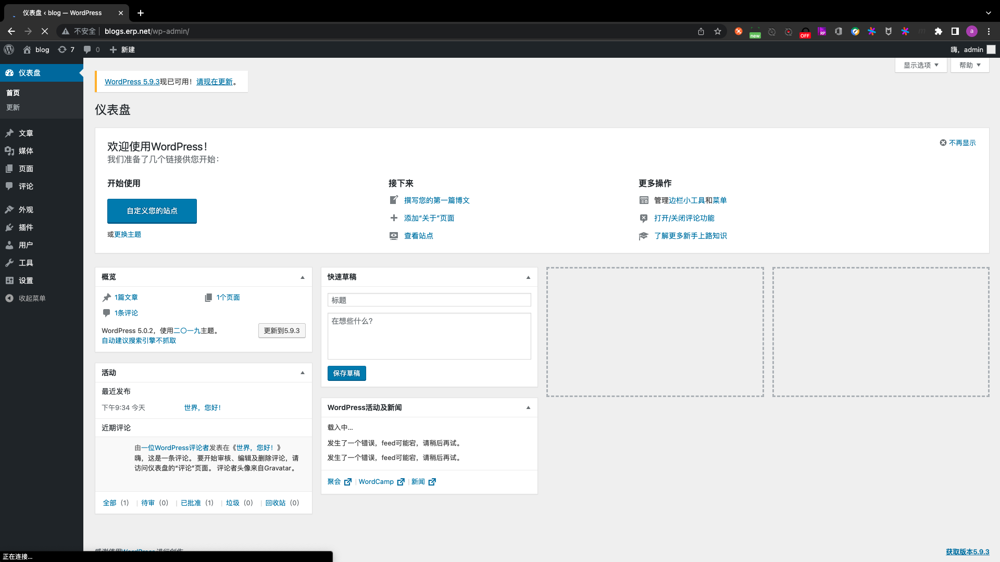


本步骤是为了检测图片是否能够正确存储和访问,即验证读写权限是否正确

## PART5. K8S运行dubbo + zookeeper微服务


### 5.1 K8S运行Provider

[demo下载地址](https://github.com/apache/dubbo/tree/dubbo-2.5.2/dubbo-demo)

本示例中所有demo均使用dubbo官方示例.

#### 5.1.1 构建Provider镜像

- step1. 下载demo

```
root@ks8-harbor-2:/opt/k8s-data# mkdir dubbo-img
root@ks8-harbor-2:/opt/k8s-data# cd dubbo-img/
root@ks8-harbor-2:/opt/k8s-data/dubbo-img# mkdir provider
root@ks8-harbor-2:/opt/k8s-data/dubbo-img# cd provider/
root@ks8-harbor-2:/opt/k8s-data/dubbo-img/provider# ls
dubbo-demo-provider-2.1.5-assembly.tar.gz
```

- step2. 解压缩并修改配置

此处主要修改zookeeper的地址,修改为之前搭建的zookeeper的地址

解压缩:

```
root@ks8-harbor-2:/opt/k8s-data/dubbo-img/provider# tar zxvf dubbo-demo-provider-2.1.5-assembly.tar.gz 
dubbo-demo-provider-2.1.5/bin/
dubbo-demo-provider-2.1.5/bin/server.sh
dubbo-demo-provider-2.1.5/bin/restart.sh
dubbo-demo-provider-2.1.5/bin/start.sh
dubbo-demo-provider-2.1.5/bin/stop.sh
dubbo-demo-provider-2.1.5/bin/dump.sh
dubbo-demo-provider-2.1.5/bin/start.bat
dubbo-demo-provider-2.1.5/conf/
dubbo-demo-provider-2.1.5/conf/dubbo.properties
dubbo-demo-provider-2.1.5/lib/dubbo-demo-2.1.5.jar
dubbo-demo-provider-2.1.5/lib/dubbo-2.1.5.jar
dubbo-demo-provider-2.1.5/lib/log4j-1.2.16.jar
dubbo-demo-provider-2.1.5/lib/javassist-3.15.0-GA.jar
dubbo-demo-provider-2.1.5/lib/spring-2.5.6.SEC03.jar
dubbo-demo-provider-2.1.5/lib/commons-logging-1.1.1.jar
dubbo-demo-provider-2.1.5/lib/netty-3.2.5.Final.jar
dubbo-demo-provider-2.1.5/lib/jetty-6.1.26.jar
dubbo-demo-provider-2.1.5/lib/jetty-util-6.1.26.jar
dubbo-demo-provider-2.1.5/lib/servlet-api-2.5-20081211.jar
dubbo-demo-provider-2.1.5/lib/zookeeper-3.3.3.jar
dubbo-demo-provider-2.1.5/lib/jline-0.9.94.jar
dubbo-demo-provider-2.1.5/lib/jedis-2.0.0.jar
dubbo-demo-provider-2.1.5/lib/commons-pool-1.5.5.jar
dubbo-demo-provider-2.1.5/lib/mina-core-1.1.7.jar
dubbo-demo-provider-2.1.5/lib/slf4j-api-1.6.2.jar
dubbo-demo-provider-2.1.5/lib/grizzly-core-2.1.4.jar
dubbo-demo-provider-2.1.5/lib/grizzly-framework-2.1.4.jar
dubbo-demo-provider-2.1.5/lib/gmbal-api-only-3.0.0-b023.jar
dubbo-demo-provider-2.1.5/lib/management-api-3.0.0-b012.jar
dubbo-demo-provider-2.1.5/lib/grizzly-portunif-2.1.4.jar
dubbo-demo-provider-2.1.5/lib/grizzly-rcm-2.1.4.jar
dubbo-demo-provider-2.1.5/lib/httpclient-4.1.2.jar
dubbo-demo-provider-2.1.5/lib/httpcore-4.1.2.jar
dubbo-demo-provider-2.1.5/lib/commons-codec-1.4.jar
dubbo-demo-provider-2.1.5/lib/hessian-4.0.7.jar
dubbo-demo-provider-2.1.5/lib/fastjson-1.1.8.jar
dubbo-demo-provider-2.1.5/lib/validation-api-1.0.0.GA.jar
dubbo-demo-provider-2.1.5/lib/hibernate-validator-4.2.0.Final.jar
dubbo-demo-provider-2.1.5/lib/cache-api-0.4.jar
dubbo-demo-provider-2.1.5/lib/dubbo-demo-provider-2.1.5.jar
tar: A lone zero block at 22566
```

修改配置中关于zookeeper地址的部分:

```
root@ks8-harbor-2:/opt/k8s-data/dubbo-img/provider# cd dubbo-demo-provider-2.1.5/
root@ks8-harbor-2:/opt/k8s-data/dubbo-img/provider/dubbo-demo-provider-2.1.5# cd conf/
root@ks8-harbor-2:/opt/k8s-data/dubbo-img/provider/dubbo-demo-provider-2.1.5/conf# vim dubbo.properties 
root@ks8-harbor-2:/opt/k8s-data/dubbo-img/provider/dubbo-demo-provider-2.1.5/conf# cat dubbo.properties
##
# Copyright 1999-2011 Alibaba Group.
#  
# Licensed under the Apache License, Version 2.0 (the "License");
# you may not use this file except in compliance with the License.
# You may obtain a copy of the License at
#  
#      http://www.apache.org/licenses/LICENSE-2.0
#  
# Unless required by applicable law or agreed to in writing, software
# distributed under the License is distributed on an "AS IS" BASIS,
# WITHOUT WARRANTIES OR CONDITIONS OF ANY KIND, either express or implied.
# See the License for the specific language governing permissions and
# limitations under the License.
##
dubbo.container=log4j,spring
dubbo.application.name=demo-provider
dubbo.application.owner=
dubbo.registry.address=zookeeper://zookeeper1.erp.svc.mycluster.local:2181 | zookeeper://zookeeper2.erp.svc.mycluster.local:2181 | zookeeper://zookeeper3.erp.svc.mycluster.local:2181
dubbo.monitor.protocol=registry
dubbo.protocol.name=dubbo
dubbo.protocol.port=20880
dubbo.log4j.file=logs/dubbo-demo-provider.log
dubbo.log4j.level=WARN
```

注意:这个zookeeper的地址最好提前在其他pod中试一下,看看能不能ping通.格式为:`serviceName.NamespaceName.svc.ClusterDNSDomain`

- step3. 编写Dockerfile

```
root@ks8-harbor-2:/opt/k8s-data/dubbo-img/provider# vim Dockerfile
root@ks8-harbor-2:/opt/k8s-data/dubbo-img/provider# cat Dockerfile
```

```Dockerfile
FROM harbor.k8s.com/pub-images/jdk-base:v8.212 

MAINTAINER Roach 40486453@qq.com

RUN yum install file nc -y
RUN mkdir -p /apps/dubbo/provider
ADD dubbo-demo-provider-2.1.5/  /apps/dubbo/provider
ADD run_java.sh /apps/dubbo/provider/bin 
RUN chown nginx.nginx /apps -R
RUN chmod a+x /apps/dubbo/provider/bin/*.sh

CMD ["/apps/dubbo/provider/bin/run_java.sh"]
```

- step4. 编写启动脚本

```
root@ks8-harbor-2:/opt/k8s-data/dubbo-img/provider# vim run_java.sh
root@ks8-harbor-2:/opt/k8s-data/dubbo-img/provider# cat run_java.sh
```

```sh
#!/bin/bash
su - nginx -c "/apps/dubbo/provider/bin/start.sh"
tail -f /etc/hosts
```

- step5. 编写构建镜像脚本

```
root@ks8-harbor-2:/opt/k8s-data/dubbo-img/provider# vim build-command.sh 
root@ks8-harbor-2:/opt/k8s-data/dubbo-img/provider# cat build-command.sh
```

```sh
#!/bin/bash
TAG=$1
docker build -t harbor.k8s.com/erp/dubbo-demo-provider:${TAG} . --network=host
sleep 3
docker push harbor.k8s.com/erp/dubbo-demo-provider:${TAG}
```

- step6. 构建镜像

```
root@ks8-harbor-2:/opt/k8s-data/dubbo-img/provider# chmod a+x *.sh
root@ks8-harbor-2:/opt/k8s-data/dubbo-img/provider# bash build-command.sh v1
Sending build context to Docker daemon  21.84MB
Step 1/9 : FROM harbor.k8s.com/pub-images/jdk-base:v8.212
 ---> 7e075f036c9b
Step 2/9 : MAINTAINER Roach 40486453@qq.com
 ---> Using cache
 ---> 16122955f193
Step 3/9 : RUN yum install file nc -y
 ---> Running in 266d4bea84ae
Loaded plugins: fastestmirror, ovl
Determining fastest mirrors
 * base: ftp.sjtu.edu.cn
 * extras: ftp.sjtu.edu.cn
 * updates: ftp.sjtu.edu.cn
Resolving Dependencies
...
Step 9/9 : CMD ["/apps/dubbo/provider/bin/run_java.sh"]
 ---> Running in d334d3d38cc9
Removing intermediate container d334d3d38cc9
 ---> 20bf99dec6f2
Successfully built 20bf99dec6f2
Successfully tagged harbor.k8s.com/erp/dubbo-demo-provider:v1
The push refers to repository [harbor.k8s.com/erp/dubbo-demo-provider]
aab825532866: Pushed 
f26b33639521: Pushed 
d36802747dad: Pushed 
0f4bc59302f3: Pushed 
24767f059447: Pushed 
7900453c45b4: Pushed 
039fc3b13371: Mounted from erp/jenkins 
4ac69e34cb8f: Mounted from erp/jenkins 
2ee5b94985e2: Mounted from erp/jenkins 
9af9a18fb5a7: Mounted from erp/wordpress-php-5.6 
0c09dd020e8e: Mounted from erp/wordpress-php-5.6 
fb82b029bea0: Mounted from erp/wordpress-php-5.6 
v1: digest: sha256:a052a56abadd7913648b80a6c55d447a1f47821301c5528484592064c856b6cf size: 2840
```

由于此时zookeeper的地址写的是K8S中Service的地址,所以无法测试.

#### 5.1.2 创建Provider Pod

- step1. 创建Pod

```
root@k8s-master-1:~/k8s-data/wordpress-yaml# cd ..
root@k8s-master-1:~/k8s-data# mkdir dubbo-yaml
root@k8s-master-1:~/k8s-data# cd dubbo-yaml/
root@k8s-master-1:~/k8s-data/dubbo-yaml# mkdir provider
root@k8s-master-1:~/k8s-data/dubbo-yaml# cd provider/
root@k8s-master-1:~/k8s-data/dubbo-yaml/provider# vim provider-deployment.yaml
root@k8s-master-1:~/k8s-data/dubbo-yaml/provider# cat provider-deployment.yaml
```

```yaml
kind: Deployment
apiVersion: apps/v1
metadata:
  labels:
    app: erp-provider
  name: erp-provider-deployment
  namespace: erp
spec:
  replicas: 1
  selector:
    matchLabels:
      app: erp-provider
  template:
    metadata:
      labels:
        app: erp-provider
    spec:
      containers:
      - name: erp-provider-container
        image: harbor.k8s.com/erp/dubbo-demo-provider:v1
        imagePullPolicy: Always
        ports:
        - containerPort: 20880
          protocol: TCP
          name: http
```

```
root@k8s-master-1:~/k8s-data/dubbo-yaml/provider# kubectl apply -f provider-deployment.yaml 
deployment.apps/erp-provider-deployment created
root@k8s-master-1:~/k8s-data/dubbo-yaml/provider# kubectl get pod -n erp
NAME                                            READY   STATUS    RESTARTS   AGE
erp-jenkins-deployment-696696cb65-b79sr         1/1     Running   0          11h
erp-nginx-webapp-deployment-65fb86d9f6-8mhhb    1/1     Running   6          13h
erp-provider-deployment-747df899c4-4z7gb        1/1     Running   0          11s
erp-tomcat-webapp-deployment-84bbf6b865-fdq8z   1/1     Running   1          13h
mysql-0                                         2/2     Running   2          13h
mysql-1                                         2/2     Running   2          13h
mysql-2                                         2/2     Running   2          13h
redis-deployment-6d85975b47-9nns2               1/1     Running   1          13h
wordpress-app-deployment-7fcb55bd59-l745v       2/2     Running   0          6h6m
zookeeper1-7ff6fbfbf-pstf9                      1/1     Running   1          13h
zookeeper2-94cfd4596-z56n9                      1/1     Running   1          13h
zookeeper3-7f55657779-62hvf                     1/1     Running   1          13h
```

#### 5.1.3 创建Provider Service

```
root@k8s-master-1:~/k8s-data/dubbo-yaml/provider# vim provider-service.yaml
root@k8s-master-1:~/k8s-data/dubbo-yaml/provider# cat provider-service.yaml
```

```yaml
kind: Service
apiVersion: v1
metadata:
  labels:
    app: erp-provider
  name: erp-provider-service
  namespace: erp
spec:
  type: NodePort
  ports:
  - name: http
    port: 80
    protocol: TCP
    targetPort: 20880
  selector:
    app: erp-provider
```    
    
```
root@k8s-master-1:~/k8s-data/dubbo-yaml/provider# kubectl apply -f provider-service.yaml 
service/erp-provider-service created
root@k8s-master-1:~/k8s-data/dubbo-yaml/provider# kubectl get svc -n erp
NAME                        TYPE        CLUSTER-IP       EXTERNAL-IP   PORT(S)                                        AGE
erp-jenkins-service         NodePort    10.100.192.166   <none>        80:38080/TCP                                   11h
erp-nginx-webapp-service    NodePort    10.100.9.36      <none>        80:40002/TCP,443:40443/TCP                     24d
erp-provider-service        NodePort    10.100.0.236     <none>        80:45130/TCP                                   8s
erp-tomcat-webapp-service   NodePort    10.100.139.19    <none>        80:40003/TCP                                   10d
mysql                       ClusterIP   None             <none>        3306/TCP                                       31h
mysql-read                  ClusterIP   10.100.11.41     <none>        3306/TCP                                       31h
redis-service               NodePort    10.100.1.198     <none>        6379:36379/TCP                                 4d6h
wordpress-app-spec          NodePort    10.100.247.126   <none>        80:30031/TCP,443:30033/TCP                     6h4m
zookeeper1                  NodePort    10.100.184.160   <none>        2181:42181/TCP,2888:43385/TCP,3888:39547/TCP   24d
zookeeper2                  NodePort    10.100.17.68     <none>        2181:42182/TCP,2888:62636/TCP,3888:36521/TCP   24d
zookeeper3                  NodePort    10.100.146.59    <none>        2181:42183/TCP,2888:34167/TCP,3888:47769/TCP   24d
```

#### 5.1.4 测试

- step1. 查看zookeeper中的数据和Pod信息是否相符

[ZooInspector下载地址](https://issues.apache.org/jira/secure/attachment/12436620/ZooInspector.zip)

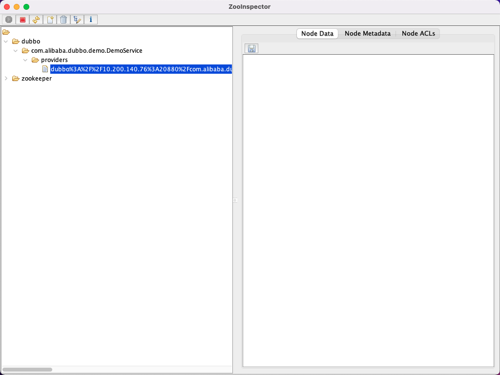

数据中显示Pod的IP地址为`10.200.140.76`,查看Pod的IP地址:

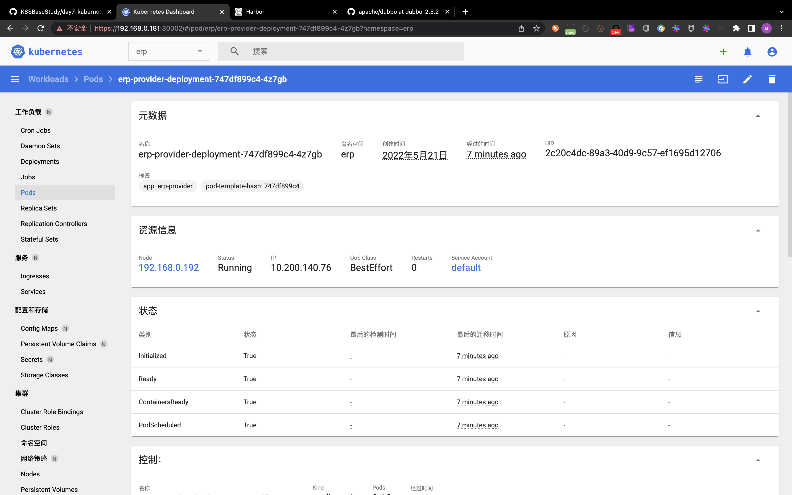

- step2. 进入Pod查看duboo日志和端口占用情况

查看dubbo日志:

```
root@k8s-master-1:~/k8s-data/dubbo-yaml/provider# kubectl exec -it erp-provider-deployment-747df899c4-4z7gb bash -n erp
kubectl exec [POD] [COMMAND] is DEPRECATED and will be removed in a future version. Use kubectl exec [POD] -- [COMMAND] instead.
[root@erp-provider-deployment-747df899c4-4z7gb /]# cd /apps/dubbo/provider/logs/
[root@erp-provider-deployment-747df899c4-4z7gb logs]# tail -f dubbo-demo-provider.log 
2022-05-21 02:39:39,677 [New I/O server worker #1-1] WARN  com.alibaba.dubbo.remoting.transport.AbstractServer (AbstractServer.java:199) -  [DUBBO] All clients has discontected from /127.0.0.1:20880. You can graceful shutdown now., dubbo version: 2.1.5, current host: 127.0.0.1
2022-05-21 02:39:41,686 [New I/O server worker #1-2] WARN  com.alibaba.dubbo.remoting.transport.AbstractServer (AbstractServer.java:199) -  [DUBBO] All clients has discontected from /127.0.0.1:20880. You can graceful shutdown now., dubbo version: 2.1.5, current host: 127.0.0.1
2022-05-21 02:39:43,697 [New I/O server worker #1-1] WARN  com.alibaba.dubbo.remoting.transport.AbstractServer (AbstractServer.java:199) -  [DUBBO] All clients has discontected from /127.0.0.1:20880. You can graceful shutdown now., dubbo version: 2.1.5, current host: 127.0.0.1
2022-05-21 02:39:45,711 [New I/O server worker #1-2] WARN  com.alibaba.dubbo.remoting.transport.AbstractServer (AbstractServer.java:199) -  [DUBBO] All clients has discontected from /127.0.0.1:20880. You can graceful shutdown now., dubbo version: 2.1.5, current host: 127.0.0.1
2022-05-21 02:39:47,722 [New I/O server worker #1-1] WARN  com.alibaba.dubbo.remoting.transport.AbstractServer (AbstractServer.java:199) -  [DUBBO] All clients has discontected from /127.0.0.1:20880. You can graceful shutdown now., dubbo version: 2.1.5, current host: 127.0.0.1
2022-05-21 02:39:49,734 [New I/O server worker #1-2] WARN  com.alibaba.dubbo.remoting.transport.AbstractServer (AbstractServer.java:199) -  [DUBBO] All clients has discontected from /127.0.0.1:20880. You can graceful shutdown now., dubbo version: 2.1.5, current host: 127.0.0.1
2022-05-21 02:39:51,748 [New I/O server worker #1-1] WARN  com.alibaba.dubbo.remoting.transport.AbstractServer (AbstractServer.java:199) -  [DUBBO] All clients has discontected from /127.0.0.1:20880. You can graceful shutdown now., dubbo version: 2.1.5, current host: 127.0.0.1
2022-05-21 02:39:53,762 [New I/O server worker #1-2] WARN  com.alibaba.dubbo.remoting.transport.AbstractServer (AbstractServer.java:199) -  [DUBBO] All clients has discontected from /127.0.0.1:20880. You can graceful shutdown now., dubbo version: 2.1.5, current host: 127.0.0.1
2022-05-21 02:39:55,773 [New I/O server worker #1-1] WARN  com.alibaba.dubbo.remoting.transport.AbstractServer (AbstractServer.java:199) -  [DUBBO] All clients has discontected from /127.0.0.1:20880. You can graceful shutdown now., dubbo version: 2.1.5, current host: 127.0.0.1
2022-05-21 02:39:57,789 [New I/O server worker #1-2] WARN  com.alibaba.dubbo.remoting.transport.AbstractServer (AbstractServer.java:199) -  [DUBBO] All clients has discontected from /127.0.0.1:20880. You can graceful shutdown now., dubbo version: 2.1.5, current host: 127.0.0.1
^C
```

注:这个警告是表示没有客户端连接到该生产者,并不是dubbo出现问题了

端口占用情况:

```
[root@erp-provider-deployment-747df899c4-4z7gb logs]# ss -tnl
State      Recv-Q Send-Q                                                                                           Local Address:Port                                                                                                          Peer Address:Port              
LISTEN     0      50                                                                                                           *:20880                                                                                                                    *:*                  
[root@erp-provider-deployment-747df899c4-4z7gb logs]# 
```

### 5.2 K8S运行Customer

#### 5.2.1 构建Customer镜像

- step1. 下载demo

```
root@ks8-harbor-2:/opt/k8s-data/dubbo-img# mkdir customer
root@ks8-harbor-2:/opt/k8s-data/dubbo-img# cd customer/
root@ks8-harbor-2:/opt/k8s-data/dubbo-img/customer# ls
dubbo-demo-consumer-2.1.5-assembly.tar.gz
```

- step2. 解压缩并修改配置

解压缩:

```
root@ks8-harbor-2:/opt/k8s-data/dubbo-img/customer# tar zxvf dubbo-demo-consumer-2.1.5-assembly.tar.gz 
dubbo-demo-consumer-2.1.5/bin/
dubbo-demo-consumer-2.1.5/bin/server.sh
dubbo-demo-consumer-2.1.5/bin/restart.sh
dubbo-demo-consumer-2.1.5/bin/start.sh
dubbo-demo-consumer-2.1.5/bin/stop.sh
dubbo-demo-consumer-2.1.5/bin/dump.sh
dubbo-demo-consumer-2.1.5/bin/start.bat
dubbo-demo-consumer-2.1.5/conf/
dubbo-demo-consumer-2.1.5/conf/dubbo.properties
dubbo-demo-consumer-2.1.5/lib/dubbo-demo-2.1.5.jar
dubbo-demo-consumer-2.1.5/lib/dubbo-2.1.5.jar
dubbo-demo-consumer-2.1.5/lib/log4j-1.2.16.jar
dubbo-demo-consumer-2.1.5/lib/javassist-3.15.0-GA.jar
dubbo-demo-consumer-2.1.5/lib/spring-2.5.6.SEC03.jar
dubbo-demo-consumer-2.1.5/lib/commons-logging-1.1.1.jar
dubbo-demo-consumer-2.1.5/lib/netty-3.2.5.Final.jar
dubbo-demo-consumer-2.1.5/lib/jetty-6.1.26.jar
dubbo-demo-consumer-2.1.5/lib/jetty-util-6.1.26.jar
dubbo-demo-consumer-2.1.5/lib/servlet-api-2.5-20081211.jar
dubbo-demo-consumer-2.1.5/lib/zookeeper-3.3.3.jar
dubbo-demo-consumer-2.1.5/lib/jline-0.9.94.jar
dubbo-demo-consumer-2.1.5/lib/jedis-2.0.0.jar
dubbo-demo-consumer-2.1.5/lib/commons-pool-1.5.5.jar
dubbo-demo-consumer-2.1.5/lib/mina-core-1.1.7.jar
dubbo-demo-consumer-2.1.5/lib/slf4j-api-1.6.2.jar
dubbo-demo-consumer-2.1.5/lib/grizzly-core-2.1.4.jar
dubbo-demo-consumer-2.1.5/lib/grizzly-framework-2.1.4.jar
dubbo-demo-consumer-2.1.5/lib/gmbal-api-only-3.0.0-b023.jar
dubbo-demo-consumer-2.1.5/lib/management-api-3.0.0-b012.jar
dubbo-demo-consumer-2.1.5/lib/grizzly-portunif-2.1.4.jar
dubbo-demo-consumer-2.1.5/lib/grizzly-rcm-2.1.4.jar
dubbo-demo-consumer-2.1.5/lib/httpclient-4.1.2.jar
dubbo-demo-consumer-2.1.5/lib/httpcore-4.1.2.jar
dubbo-demo-consumer-2.1.5/lib/commons-codec-1.4.jar
dubbo-demo-consumer-2.1.5/lib/hessian-4.0.7.jar
dubbo-demo-consumer-2.1.5/lib/fastjson-1.1.8.jar
dubbo-demo-consumer-2.1.5/lib/validation-api-1.0.0.GA.jar
dubbo-demo-consumer-2.1.5/lib/hibernate-validator-4.2.0.Final.jar
dubbo-demo-consumer-2.1.5/lib/cache-api-0.4.jar
dubbo-demo-consumer-2.1.5/lib/dubbo-demo-consumer-2.1.5.jar
tar: A lone zero block at 22566
```

修改配置:

```
root@ks8-harbor-2:/opt/k8s-data/dubbo-img/customer# cd dubbo-demo-consumer-2.1.5/
root@ks8-harbor-2:/opt/k8s-data/dubbo-img/customer/dubbo-demo-consumer-2.1.5# cd conf/
root@ks8-harbor-2:/opt/k8s-data/dubbo-img/customer/dubbo-demo-consumer-2.1.5/conf# vim dubbo.properties 
root@ks8-harbor-2:/opt/k8s-data/dubbo-img/customer/dubbo-demo-consumer-2.1.5/conf# cat dubbo.properties
##
# Copyright 1999-2011 Alibaba Group.
#  
# Licensed under the Apache License, Version 2.0 (the "License");
# you may not use this file except in compliance with the License.
# You may obtain a copy of the License at
#  
#      http://www.apache.org/licenses/LICENSE-2.0
#  
# Unless required by applicable law or agreed to in writing, software
# distributed under the License is distributed on an "AS IS" BASIS,
# WITHOUT WARRANTIES OR CONDITIONS OF ANY KIND, either express or implied.
# See the License for the specific language governing permissions and
# limitations under the License.
##
dubbo.container=log4j,spring
dubbo.application.name=demo-consumer
dubbo.application.owner=
dubbo.registry.address=zookeeper://zookeeper1.erp.svc.mycluster.local:2181 | zookeeper://zookeeper2.erp.svc.mycluster.local:2181 | zookeeper://zookeeper3.erp.svc.mycluster.local:2181
dubbo.monitor.protocol=registry
dubbo.log4j.file=logs/dubbo-demo-consumer.log
dubbo.log4j.level=WARN
```

此处修改的zookeeper地址和provider的zookeeper地址是相同的

- step3. 编写Dockerfile

```
root@ks8-harbor-2:/opt/k8s-data/dubbo-img/customer/dubbo-demo-consumer-2.1.5/conf# cd ..
root@ks8-harbor-2:/opt/k8s-data/dubbo-img/customer/dubbo-demo-consumer-2.1.5# cd ..
root@ks8-harbor-2:/opt/k8s-data/dubbo-img/customer# vim Dockerfile
root@ks8-harbor-2:/opt/k8s-data/dubbo-img/customer# cat Dockerfile
```

```Dockerfile
FROM harbor.k8s.com/pub-images/jdk-base:v8.212 

MAINTAINER Roach 40486453@qq.com

RUN yum install file -y
RUN mkdir -p /apps/dubbo/consumer 
ADD dubbo-demo-consumer-2.1.5  /apps/dubbo/consumer
ADD run_java.sh /apps/dubbo/consumer/bin 
RUN chown nginx.nginx /apps -R
RUN chmod a+x /apps/dubbo/consumer/bin/*.sh

CMD ["/apps/dubbo/consumer/bin/run_java.sh"]
```

- step4. 编写启动脚本

```
root@ks8-harbor-2:/opt/k8s-data/dubbo-img/customer# vim run_java.sh
root@ks8-harbor-2:/opt/k8s-data/dubbo-img/customer# cat run_java.sh
```

```sh
#!/bin/bash
su - nginx -c "/apps/dubbo/consumer/bin/start.sh"
tail -f /etc/hosts
```

- step5. 编写构建镜像脚本

```
root@ks8-harbor-2:/opt/k8s-data/dubbo-img/customer# vim build-command.sh
root@ks8-harbor-2:/opt/k8s-data/dubbo-img/customer# cat build-command.sh
```

```sh
#!/bin/bash
TAG=$1
docker build -t harbor.k8s.com/erp/dubbo-demo-consumer:${TAG} . --network=host
sleep 3
docker push harbor.k8s.com/erp/dubbo-demo-consumer:${TAG}
```

- step6. 构建镜像

```
root@ks8-harbor-2:/opt/k8s-data/dubbo-img/customer# chmod a+x *.sh
root@ks8-harbor-2:/opt/k8s-data/dubbo-img/customer# bash build-command.sh v1
Sending build context to Docker daemon  21.84MB
Step 1/9 : FROM harbor.k8s.com/pub-images/jdk-base:v8.212
 ---> 7e075f036c9b
Step 2/9 : MAINTAINER Roach 40486453@qq.com
 ---> Using cache
 ---> 16122955f193
Step 3/9 : RUN yum install file -y
 ---> Running in 3eb5b58434d4
Loaded plugins: fastestmirror, ovl
Determining fastest mirrors
 * base: mirrors.bfsu.edu.cn
 * extras: mirrors.bfsu.edu.cn
 * updates: mirrors.huaweicloud.com
Resolving Dependencies
...
Successfully built 87454f52c39b
Successfully tagged harbor.k8s.com/erp/dubbo-demo-consumer:v1
The push refers to repository [harbor.k8s.com/erp/dubbo-demo-consumer]
e755c3b5707c: Pushed 
870108ea1ca7: Pushed 
284e45a702e1: Pushed 
304d27f073e1: Pushed 
28ba5c0d9bdc: Pushed 
f5892a688ceb: Pushed 
039fc3b13371: Mounted from erp/dubbo-demo-provider 
4ac69e34cb8f: Mounted from erp/dubbo-demo-provider 
2ee5b94985e2: Mounted from erp/dubbo-demo-provider 
9af9a18fb5a7: Mounted from erp/dubbo-demo-provider 
0c09dd020e8e: Mounted from erp/dubbo-demo-provider 
fb82b029bea0: Mounted from erp/dubbo-demo-provider 
v1: digest: sha256:6a620acb2077545ebd13e5283ae229f9dd550aea18e3a256c5494b29519bd35f size: 2840
```

#### 5.2.2 创建Customer Pod

```
root@k8s-master-1:~/k8s-data/dubbo-yaml# mkdir customer
root@k8s-master-1:~/k8s-data/dubbo-yaml# cd customer/
root@k8s-master-1:~/k8s-data/dubbo-yaml/customer# vim customer-deployment.yaml
root@k8s-master-1:~/k8s-data/dubbo-yaml/customer# cat customer-deployment.yaml
```

```yaml
kind: Deployment
apiVersion: apps/v1
metadata:
  labels:
    app: erp-consumer
  name: erp-consumer-deployment
  namespace: erp
spec:
  replicas: 1
  selector:
    matchLabels:
      app: erp-consumer
  template:
    metadata:
      labels:
        app: erp-consumer
    spec:
      containers:
      - name: erp-consumer-container
        image: harbor.k8s.com/erp/dubbo-demo-consumer:v1
        imagePullPolicy: Always
        ports:
        - containerPort: 80
          protocol: TCP
          name: http
```

```
root@k8s-master-1:~/k8s-data/dubbo-yaml/customer# kubectl apply -f customer-deployment.yaml 
deployment.apps/erp-consumer-deployment created
root@k8s-master-1:~/k8s-data/dubbo-yaml/customer# kubectl get pod -n erp
NAME                                            READY   STATUS    RESTARTS   AGE
erp-consumer-deployment-79d5876d79-5wxx4        1/1     Running   0          7s
erp-jenkins-deployment-696696cb65-b79sr         1/1     Running   0          12h
erp-nginx-webapp-deployment-65fb86d9f6-8mhhb    1/1     Running   6          14h
erp-provider-deployment-747df899c4-4z7gb        1/1     Running   0          41m
erp-tomcat-webapp-deployment-84bbf6b865-fdq8z   1/1     Running   1          14h
mysql-0                                         2/2     Running   2          13h
mysql-1                                         2/2     Running   2          13h
mysql-2                                         2/2     Running   2          13h
redis-deployment-6d85975b47-9nns2               1/1     Running   1          14h
wordpress-app-deployment-7fcb55bd59-l745v       2/2     Running   0          6h48m
zookeeper1-7ff6fbfbf-pstf9                      1/1     Running   1          14h
zookeeper2-94cfd4596-z56n9                      1/1     Running   1          14h
zookeeper3-7f55657779-62hvf                     1/1     Running   1          14h
```

#### 5.2.3 创建Customer Service

```
root@k8s-master-1:~/k8s-data/dubbo-yaml/customer# vim customer-service.yaml
root@k8s-master-1:~/k8s-data/dubbo-yaml/customer# cat customer-service.yaml
```

```yaml
kind: Service
apiVersion: v1
metadata:
  labels:
    app: erp-consumer
  name: erp-consumer-service
  namespace: erp
spec:
  type: NodePort
  ports:
  - name: http
    port: 80
    protocol: TCP
    targetPort: 80
  selector:
    app: erp-consumer
```

```
root@k8s-master-1:~/k8s-data/dubbo-yaml/customer# kubectl apply -f customer-service.yaml 
service/erp-consumer-service created
root@k8s-master-1:~/k8s-data/dubbo-yaml/customer# kubectl get svc -n erp
NAME                        TYPE        CLUSTER-IP       EXTERNAL-IP   PORT(S)                                        AGE
erp-consumer-service        NodePort    10.100.77.189    <none>        80:49341/TCP                                   7s
erp-jenkins-service         NodePort    10.100.192.166   <none>        80:38080/TCP                                   12h
erp-nginx-webapp-service    NodePort    10.100.9.36      <none>        80:40002/TCP,443:40443/TCP                     24d
erp-provider-service        NodePort    10.100.0.236     <none>        80:45130/TCP                                   41m
erp-tomcat-webapp-service   NodePort    10.100.139.19    <none>        80:40003/TCP                                   10d
mysql                       ClusterIP   None             <none>        3306/TCP                                       32h
mysql-read                  ClusterIP   10.100.11.41     <none>        3306/TCP                                       32h
redis-service               NodePort    10.100.1.198     <none>        6379:36379/TCP                                 4d6h
wordpress-app-spec          NodePort    10.100.247.126   <none>        80:30031/TCP,443:30033/TCP                     6h45m
zookeeper1                  NodePort    10.100.184.160   <none>        2181:42181/TCP,2888:43385/TCP,3888:39547/TCP   24d
zookeeper2                  NodePort    10.100.17.68     <none>        2181:42182/TCP,2888:62636/TCP,3888:36521/TCP   24d
zookeeper3                  NodePort    10.100.146.59    <none>        2181:42183/TCP,2888:34167/TCP,3888:47769/TCP   24d
```

#### 5.2.4 测试

- step1. 查看zookeeper中的customer数据

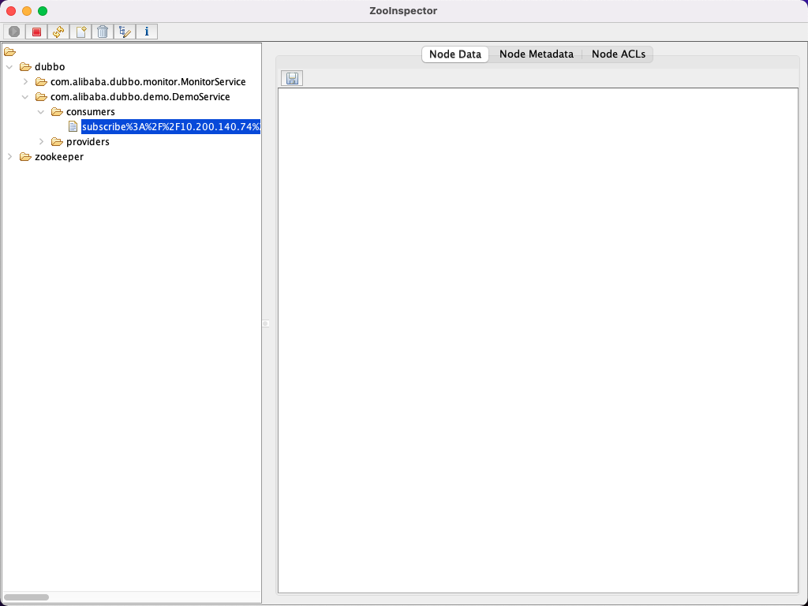


可以看到,IP地址信息是相符的

- step2. 到provider中追踪日志

```
root@k8s-master-1:~/k8s-data/dubbo-yaml/customer# kubectl exec -it erp-provider-deployment-747df899c4-4z7gb bash -n erp
kubectl exec [POD] [COMMAND] is DEPRECATED and will be removed in a future version. Use kubectl exec [POD] -- [COMMAND] instead.
[root@erp-provider-deployment-747df899c4-4z7gb /]# cd /apps/dubbo/provider/logs/
[root@erp-provider-deployment-747df899c4-4z7gb logs]# tail -f stdout.log 
[03:27:36] Hello world236, request from consumer: /10.200.140.74:60130
[03:27:38] Hello world237, request from consumer: /10.200.140.74:60130
[03:27:40] Hello world238, request from consumer: /10.200.140.74:60130
[03:27:42] Hello world239, request from consumer: /10.200.140.74:60130
[03:27:44] Hello world240, request from consumer: /10.200.140.74:60130
[03:27:46] Hello world241, request from consumer: /10.200.140.74:60130
[03:27:48] Hello world242, request from consumer: /10.200.140.74:60130
[03:27:50] Hello world243, request from consumer: /10.200.140.74:60130
[03:27:52] Hello world244, request from consumer: /10.200.140.74:60130
[03:27:54] Hello world245, request from consumer: /10.200.140.74:60130
[03:27:56] Hello world246, request from consumer: /10.200.140.74:60130
[03:27:58] Hello world247, request from consumer: /10.200.140.74:60130
^C
```

整体通信流程如图所示:

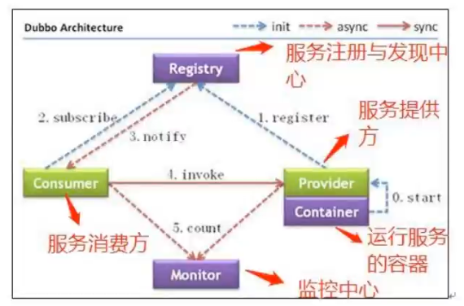

### 5.3 K8S运行dubbo admin

dubbo admin相当于一个管理端,起到一个monitor的作用.并非必需品.

#### 5.3.1 构建镜像

- step1. 拉取镜像

```
root@ks8-harbor-2:/opt/k8s-data/dubbo-img/admin# docker pull apache/dubbo-admin:0.4.0
0.4.0: Pulling from apache/dubbo-admin
647acf3d48c2: Pull complete 
b02967ef0034: Pull complete 
e1ad2231829e: Pull complete 
3accde8486ae: Pull complete 
39bc74563c28: Pull complete 
f0455cc186e3: Pull complete 
261a68d319f8: Pull complete 
fd80c9396349: Pull complete 
e90d021aa5a9: Pull complete 
Digest: sha256:17e3a246848c7331a18542b73006fb7c0ec0fda767ee788fc164ad8fa52c0600
Status: Downloaded newer image for apache/dubbo-admin:0.4.0
docker.io/apache/dubbo-admin:0.4.0
```

- step2. 推送镜像

```
root@ks8-harbor-2:/opt/k8s-data/dubbo-img/admin# docker tag apache/dubbo-admin:0.4.0 harbor.k8s.com/erp/dubboadmin:v1
root@ks8-harbor-2:/opt/k8s-data/dubbo-img/admin# docker push harbor.k8s.com/erp/dubboadmin:v1
The push refers to repository [harbor.k8s.com/erp/dubboadmin]
f42e7bbf7527: Pushed 
e591dd24c9e2: Pushed 
33880ed71840: Pushed 
d4f4648dec26: Pushed 
0ec71953e0a3: Pushed 
50ae39e22ba5: Pushed 
a4aba4e59b40: Pushed 
5499f2905579: Pushed 
a36ba9e322f7: Pushed 
v1: digest: sha256:17e3a246848c7331a18542b73006fb7c0ec0fda767ee788fc164ad8fa52c0600 size: 2213
```

#### 5.3.2 创建Pod

```
root@k8s-master-1:~/k8s-data/dubbo-yaml/admin# vim admin-deployment.yaml 
root@k8s-master-1:~/k8s-data/dubbo-yaml/admin# cat admin-deployment.yaml
```

```yaml
apiVersion: apps/v1
kind: Deployment
metadata:
  name: dubbo-admin-deploy
  namespace: erp
  labels:
    app: dubbo-admin-deploy
spec:
  replicas: 1
  selector:
    matchLabels:
      app: dubbo-admin
  template:
    metadata:
      labels:
        app: dubbo-admin
    spec:
      containers:
        - name: dubbo-admin
          image: harbor.k8s.com/erp/dubboadmin:v1
          imagePullPolicy: Always
          command: [ "/bin/bash", "-ce", "java -Dadmin.registry.address=zookeeper://zookeeper1.erp.svc.mycluster.local:2181 -Dadmin.config-center=zookeeper://zookeeper1.erp.svc.mycluster.local:2181 -Dadmin.metadata-report.address=zookeeper://zookeeper1.erp.svc.mycluster.local:2181 -jar /app.jar"]
          readinessProbe:
            tcpSocket:
              port: 8080
            initialDelaySeconds: 60 
            periodSeconds: 20
```

```
root@k8s-master-1:~/k8s-data/dubbo-yaml/admin# kubectl apply -f admin-deployment.yaml 
deployment.apps/dubbo-admin-deploy created
root@k8s-master-1:~/k8s-data/dubbo-yaml/admin# kubectl get pod -n erp
NAME                                            READY   STATUS    RESTARTS   AGE
dubbo-admin-deploy-697654f7d9-htbjn             1/1     Running   0          91s
erp-consumer-deployment-79d5876d79-5wxx4        1/1     Running   0          163m
erp-jenkins-deployment-696696cb65-b79sr         1/1     Running   0          14h
erp-nginx-webapp-deployment-65fb86d9f6-8mhhb    1/1     Running   6          17h
erp-provider-deployment-747df899c4-4z7gb        1/1     Running   0          3h24m
erp-tomcat-webapp-deployment-84bbf6b865-fdq8z   1/1     Running   1          17h
mysql-0                                         2/2     Running   2          16h
mysql-1                                         2/2     Running   2          16h
mysql-2                                         2/2     Running   2          16h
redis-deployment-6d85975b47-9nns2               1/1     Running   1          17h
wordpress-app-deployment-7fcb55bd59-l745v       2/2     Running   0          9h
zookeeper1-7ff6fbfbf-pstf9                      1/1     Running   1          17h
zookeeper2-94cfd4596-z56n9                      1/1     Running   1          17h
zookeeper3-7f55657779-62hvf                     1/1     Running   1          17h
```

注:由于配置了就绪探针,所以该Pod需要等待1分钟后才能运行

#### 5.3.3 创建Service

```
root@k8s-master-1:~/k8s-data/dubbo-yaml/admin# vim admin-service.yaml 
root@k8s-master-1:~/k8s-data/dubbo-yaml/admin# cat admin-service.yaml
```

```yaml
apiVersion: v1
kind: Service
metadata:
  name: dubbo-admin-service
  namespace: erp
  labels:
    app: dubbo-admin-service
spec:
  selector:
    app: dubbo-admin
  type: NodePort
  ports:
    - name: dubbo-admin-8080
      port: 8080
      targetPort: 8080
      nodePort: 30088
```

```
root@k8s-master-1:~/k8s-data/dubbo-yaml/admin# kubectl apply -f admin-service.yaml 
service/dubbo-admin-service created
root@k8s-master-1:~/k8s-data/dubbo-yaml/admin# kubectl get svc -n erp
NAME                        TYPE        CLUSTER-IP       EXTERNAL-IP   PORT(S)                                        AGE
dubbo-admin-service         NodePort    10.100.87.210    <none>        8080:30088/TCP                                 11s
erp-consumer-service        NodePort    10.100.77.189    <none>        80:49341/TCP                                   162m
erp-jenkins-service         NodePort    10.100.192.166   <none>        80:38080/TCP                                   14h
erp-nginx-webapp-service    NodePort    10.100.9.36      <none>        80:40002/TCP,443:40443/TCP                     24d
erp-provider-service        NodePort    10.100.0.236     <none>        80:45130/TCP                                   3h23m
erp-tomcat-webapp-service   NodePort    10.100.139.19    <none>        80:40003/TCP                                   10d
mysql                       ClusterIP   None             <none>        3306/TCP                                       34h
mysql-read                  ClusterIP   10.100.11.41     <none>        3306/TCP                                       34h
redis-service               NodePort    10.100.1.198     <none>        6379:36379/TCP                                 4d9h
wordpress-app-spec          NodePort    10.100.247.126   <none>        80:30031/TCP,443:30033/TCP                     9h
zookeeper1                  NodePort    10.100.184.160   <none>        2181:42181/TCP,2888:43385/TCP,3888:39547/TCP   24d
zookeeper2                  NodePort    10.100.17.68     <none>        2181:42182/TCP,2888:62636/TCP,3888:36521/TCP   24d
zookeeper3                  NodePort    10.100.146.59    <none>        2181:42183/TCP,2888:34167/TCP,3888:47769/TCP   24d
```

#### 5.3.4 测试

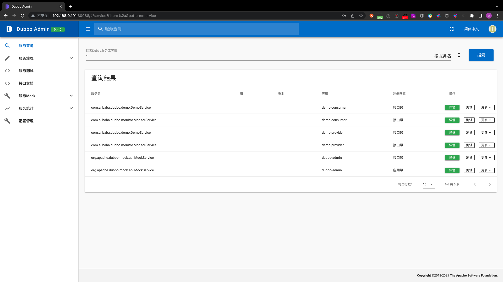

注:默认用户名密码均为root

## PART6. Ingress简介

### 6.1 K8S Service的类型

[服务类型](https://kubernetes.io/zh/docs/concepts/services-networking/service/#publishing-services-service-types)

#### a. ClusterIP

ClusterIP:默认的类型,用于k8s内部之间的服务访问.即通过内部的service ip实现服务间的访问,service IP仅可以在内部访问,不能从外部访问.

#### b. NodePort

NodePort:在cluster IP的基础之上,通过在每个node节点监听一个可以指定的宿主机端口(nodePort)来暴露服务,从而允许外部client访问k8s集群中的服务,nodePort把外部client的请求转发至service进行处理.

#### c. LoadBalancer

LoadBalancer:主要在公有云如阿里云、AWS上使用,LoadBalancer构建在nodePort基础之上,通过公有云服务商提供的负载均衡器将k8s集群中的服务暴露给集群外部的client访问.

#### d. ExternalName

ExternalName:用于将k8s集群外部的服务映射至k8s集群内部访问,从而让集群内部的pod能够通过固定的service name访问集群外部的服务,有时候也用于将不同namespace之间的pod通过ExternalName进行访问.

可以通过`kubectl explain service.spec.type`查看service类型

#### e. Ingress

[Ingress](https://kubernetes.io/zh/docs/concepts/services-networking/ingress/)是kubernetes API中的标准资源类型之一,ingress实现的功能是将客户端请求的host名称或请求的URL路径转发到指定的service资源的规则,即用于将kubernetes集群外部的请求资源转发至集群内部的service,再被service转发至pod处理客户端的请求.

[Ingress Controller](https://kubernetes.io/zh/docs/concepts/services-networking/ingress-controllers/):Ingress资源需要指定监听地址、请求的host和URL等配置,然后根据这些规则的匹配机制将客户端的请求进行转发,这种能够为ingress配置资源监听并转发流量的组件称为ingress控制器(ingress controller).ingress controller是kubernetes的一个附件,类似于dashboard或者flannel一样,需要单独部署.

Ingress基于应用层,可以实现类似于nginx的七层代理与https等功能.Ingress基于NodePort,在NodePort的基础上又衍生出的另一种暴露K8S内部服务的方式.

Ingress工作在第7层(应用层),类似nginx.Ingress的工作方式为:在NodePort的基础上,在K8S内部内置一个7层的负载均衡器.也就是说流量是先到Ingress上,在Ingress做一些配置,用于匹配用户请求的域名、端口、请求方式等信息.匹配成功后再将请求转发给后边的Service.

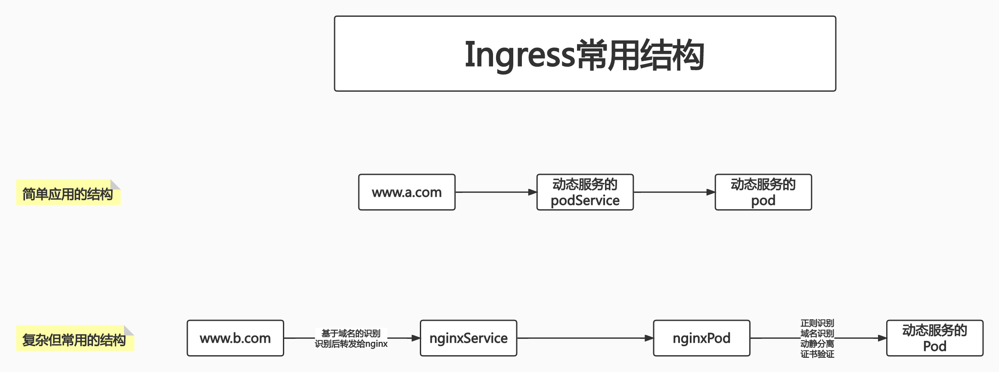

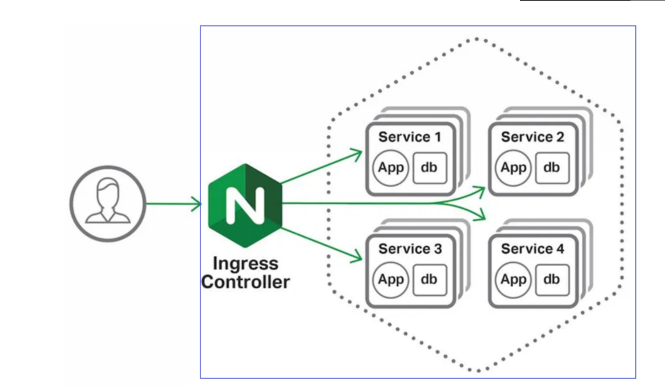

[Ingress选型](https://kubernetes.io/zh/docs/concepts/services-networking/ingress-controllers/)

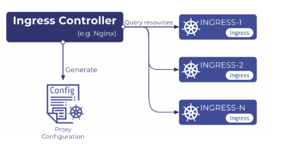

Ingress主进程读取配置,然后根据配置创建线程.类似于nginx的master进程和worker进程之间的关系.

使用Ingress的优点:入口唯一,这样管理起来就比较方便.

使用Ingress的缺点:当流量较大时,Ingress会成为性能瓶颈.

### 6.2 运行Ingress Controller

#### 6.2.1 镜像准备

##### a. nginx-ingress-controller镜像

```
root@ks8-harbor-2:~# docker pull quay.io/kubernetes-ingress-controller/nginx-ingress-controller:0.33.0
0.33.0: Pulling from kubernetes-ingress-controller/nginx-ingress-controller
cbdbe7a5bc2a: Pull complete 
11f3b8b7eea2: Pull complete 
8914224c9c90: Pull complete 
42d2a0e40de7: Pull complete 
b306c26b2152: Pull complete 
0e937a600754: Pull complete 
8a92de035314: Pull complete 
09a3a6adb7ed: Pull complete 
966ec1120b67: Pull complete 
1b7b41b3144e: Pull complete 
59fc0191cff0: Pull complete 
c3c2bd8bcea6: Pull complete 
24b8b0282442: Pull complete 
7f21ee2ccc91: Pull complete 
1b47f1fd101a: Pull complete 
Digest: sha256:fc650620719e460df04043512ec4af146b7d9da163616960e58aceeaf4ea5ba1
Status: Downloaded newer image for quay.io/kubernetes-ingress-controller/nginx-ingress-controller:0.33.0
quay.io/kubernetes-ingress-controller/nginx-ingress-controller:0.33.0
root@ks8-harbor-2:~# docker tag quay.io/kubernetes-ingress-controller/nginx-ingress-controller:0.33.0 harbor.k8s.com/ingress/nginx-ingress-controller:0.33.0
root@ks8-harbor-2:~# docker push harbor.k8s.com/ingress/nginx-ingress-controller:0.33.0
The push refers to repository [harbor.k8s.com/ingress/nginx-ingress-controller]
c1a19c5d6c1c: Pushed 
ad2b0c034668: Pushed 
435bd169fb0e: Pushed 
cad00259deb3: Pushed 
fc61ccffc2c4: Pushed 
63fc60852e71: Pushed 
7f16463c2512: Pushed 
02a3a18a366c: Pushed 
7cd38015fddc: Pushed 
a46fe26caee6: Pushed 
af89a9a077ee: Pushed 
c4d79695750f: Pushed 
a00053f4b396: Pushed 
72d93ca3d27e: Pushed 
3e207b409db3: Pushed 
0.33.0: digest: sha256:98b48d756cf01fcf223f19dc5ea7514a395077ccb0e4af2f150956ad3f8a908e size: 3464
```

##### b. kube-webhook-certgen镜像

```
root@ks8-harbor-2:~# docker pull jettech/kube-webhook-certgen:v1.2.0
v1.2.0: Pulling from jettech/kube-webhook-certgen
9ff2acc3204b: Pull complete 
69e2f037cdb3: Pull complete 
8ac3c60fe81d: Pull complete 
Digest: sha256:c6f018afe5dfce02110b332ea75bb846144e65d4993c7534886d8505a6960357
Status: Downloaded newer image for jettech/kube-webhook-certgen:v1.2.0
docker.io/jettech/kube-webhook-certgen:v1.2.0
root@ks8-harbor-2:~# docker tag docker.io/jettech/kube-webhook-certgen:v1.2.0 harbor.k8s.com/ingress/kube-webhook-certgen:v1.2.0
root@ks8-harbor-2:~# docker push harbor.k8s.com/ingress/kube-webhook-certgen:v1.2.0
The push refers to repository [harbor.k8s.com/ingress/kube-webhook-certgen]
26090dab1e9e: Pushed 
f47163e8de57: Pushed 
0d1435bd79e4: Pushed 
v1.2.0: digest: sha256:a5130405b0476373946b5c8f25a5506d0e4e480afb803ef0f0908a5ffd14111a size: 950
```

#### 6.2.2 创建Pod

```
root@k8s-master-1:~# cd ~/k8s-data/
root@k8s-master-1:~/k8s-data# mkdir ingress
root@k8s-master-1:~/k8s-data# cd ingress/
root@k8s-master-1:~/k8s-data/ingress# vim ingress-controller-deploy.yaml
root@k8s-master-1:~/k8s-data/ingress# cat ingress-controller-deploy.yaml
```

```yaml

apiVersion: v1
kind: Namespace
metadata:
  name: ingress-nginx
  labels:
    app.kubernetes.io/name: ingress-nginx
    app.kubernetes.io/instance: ingress-nginx

---
# Source: ingress-nginx/templates/controller-serviceaccount.yaml
apiVersion: v1
kind: ServiceAccount
metadata:
  labels:
    helm.sh/chart: ingress-nginx-2.4.0
    app.kubernetes.io/name: ingress-nginx
    app.kubernetes.io/instance: ingress-nginx
    app.kubernetes.io/version: 0.33.0
    app.kubernetes.io/managed-by: Helm
    app.kubernetes.io/component: controller
  name: ingress-nginx
  namespace: ingress-nginx
---
# Source: ingress-nginx/templates/controller-configmap.yaml
apiVersion: v1
kind: ConfigMap
metadata:
  labels:
    helm.sh/chart: ingress-nginx-2.4.0
    app.kubernetes.io/name: ingress-nginx
    app.kubernetes.io/instance: ingress-nginx
    app.kubernetes.io/version: 0.33.0
    app.kubernetes.io/managed-by: Helm
    app.kubernetes.io/component: controller
  name: ingress-nginx-controller
  namespace: ingress-nginx
data:
---
# Source: ingress-nginx/templates/clusterrole.yaml
apiVersion: rbac.authorization.k8s.io/v1
kind: ClusterRole
metadata:
  labels:
    helm.sh/chart: ingress-nginx-2.4.0
    app.kubernetes.io/name: ingress-nginx
    app.kubernetes.io/instance: ingress-nginx
    app.kubernetes.io/version: 0.33.0
    app.kubernetes.io/managed-by: Helm
  name: ingress-nginx
  namespace: ingress-nginx
rules:
  - apiGroups:
      - ''
    resources:
      - configmaps
      - endpoints
      - nodes
      - pods
      - secrets
    verbs:
      - list
      - watch
  - apiGroups:
      - ''
    resources:
      - nodes
    verbs:
      - get
  - apiGroups:
      - ''
    resources:
      - services
    verbs:
      - get
      - list
      - update
      - watch
  - apiGroups:
      - extensions
      - networking.k8s.io   # k8s 1.14+
    resources:
      - ingresses
    verbs:
      - get
      - list
      - watch
  - apiGroups:
      - ''
    resources:
      - events
    verbs:
      - create
      - patch
  - apiGroups:
      - extensions
      - networking.k8s.io   # k8s 1.14+
    resources:
      - ingresses/status
    verbs:
      - update
  - apiGroups:
      - networking.k8s.io   # k8s 1.14+
    resources:
      - ingressclasses
    verbs:
      - get
      - list
      - watch
---
# Source: ingress-nginx/templates/clusterrolebinding.yaml
apiVersion: rbac.authorization.k8s.io/v1
kind: ClusterRoleBinding
metadata:
  labels:
    helm.sh/chart: ingress-nginx-2.4.0
    app.kubernetes.io/name: ingress-nginx
    app.kubernetes.io/instance: ingress-nginx
    app.kubernetes.io/version: 0.33.0
    app.kubernetes.io/managed-by: Helm
  name: ingress-nginx
  namespace: ingress-nginx
roleRef:
  apiGroup: rbac.authorization.k8s.io
  kind: ClusterRole
  name: ingress-nginx
subjects:
  - kind: ServiceAccount
    name: ingress-nginx
    namespace: ingress-nginx
---
# Source: ingress-nginx/templates/controller-role.yaml
apiVersion: rbac.authorization.k8s.io/v1
kind: Role
metadata:
  labels:
    helm.sh/chart: ingress-nginx-2.4.0
    app.kubernetes.io/name: ingress-nginx
    app.kubernetes.io/instance: ingress-nginx
    app.kubernetes.io/version: 0.33.0
    app.kubernetes.io/managed-by: Helm
    app.kubernetes.io/component: controller
  name: ingress-nginx
  namespace: ingress-nginx
rules:
  - apiGroups:
      - ''
    resources:
      - namespaces
    verbs:
      - get
  - apiGroups:
      - ''
    resources:
      - configmaps
      - pods
      - secrets
      - endpoints
    verbs:
      - get
      - list
      - watch
  - apiGroups:
      - ''
    resources:
      - services
    verbs:
      - get
      - list
      - update
      - watch
  - apiGroups:
      - extensions
      - networking.k8s.io   # k8s 1.14+
    resources:
      - ingresses
    verbs:
      - get
      - list
      - watch
  - apiGroups:
      - extensions
      - networking.k8s.io   # k8s 1.14+
    resources:
      - ingresses/status
    verbs:
      - update
  - apiGroups:
      - networking.k8s.io   # k8s 1.14+
    resources:
      - ingressclasses
    verbs:
      - get
      - list
      - watch
  - apiGroups:
      - ''
    resources:
      - configmaps
    resourceNames:
      - ingress-controller-leader-nginx
    verbs:
      - get
      - update
  - apiGroups:
      - ''
    resources:
      - configmaps
    verbs:
      - create
  - apiGroups:
      - ''
    resources:
      - endpoints
    verbs:
      - create
      - get
      - update
  - apiGroups:
      - ''
    resources:
      - events
    verbs:
      - create
      - patch
---
# Source: ingress-nginx/templates/controller-rolebinding.yaml
apiVersion: rbac.authorization.k8s.io/v1
kind: RoleBinding
metadata:
  labels:
    helm.sh/chart: ingress-nginx-2.4.0
    app.kubernetes.io/name: ingress-nginx
    app.kubernetes.io/instance: ingress-nginx
    app.kubernetes.io/version: 0.33.0
    app.kubernetes.io/managed-by: Helm
    app.kubernetes.io/component: controller
  name: ingress-nginx
  namespace: ingress-nginx
roleRef:
  apiGroup: rbac.authorization.k8s.io
  kind: Role
  name: ingress-nginx
subjects:
  - kind: ServiceAccount
    name: ingress-nginx
    namespace: ingress-nginx
---
# Source: ingress-nginx/templates/controller-service-webhook.yaml
apiVersion: v1
kind: Service
metadata:
  labels:
    helm.sh/chart: ingress-nginx-2.4.0
    app.kubernetes.io/name: ingress-nginx
    app.kubernetes.io/instance: ingress-nginx
    app.kubernetes.io/version: 0.33.0
    app.kubernetes.io/managed-by: Helm
    app.kubernetes.io/component: controller
  name: ingress-nginx-controller-admission
  namespace: ingress-nginx
spec:
  type: ClusterIP
  ports:
    - name: https-webhook
      port: 443
      targetPort: webhook
  selector:
    app.kubernetes.io/name: ingress-nginx
    app.kubernetes.io/instance: ingress-nginx
    app.kubernetes.io/component: controller
---
# Source: ingress-nginx/templates/controller-service.yaml
apiVersion: v1
kind: Service
metadata:
  labels:
    helm.sh/chart: ingress-nginx-2.4.0
    app.kubernetes.io/name: ingress-nginx
    app.kubernetes.io/instance: ingress-nginx
    app.kubernetes.io/version: 0.33.0
    app.kubernetes.io/managed-by: Helm
    app.kubernetes.io/component: controller
  name: ingress-nginx-controller
  namespace: ingress-nginx
spec:
  type: NodePort
  ports:
    - name: http
      port: 80
      protocol: TCP
      targetPort: http
      # 指定ingress-nginx-controller的监听端口
      nodePort: 40080
    - name: https
      port: 443
      protocol: TCP
      targetPort: https
      # 指定ingress-nginx-controller的监听端口
      nodePort: 40444
  selector:
    app.kubernetes.io/name: ingress-nginx
    app.kubernetes.io/instance: ingress-nginx
    app.kubernetes.io/component: controller
---
# Source: ingress-nginx/templates/controller-deployment.yaml
apiVersion: apps/v1
kind: Deployment
metadata:
  labels:
    helm.sh/chart: ingress-nginx-2.4.0
    app.kubernetes.io/name: ingress-nginx
    app.kubernetes.io/instance: ingress-nginx
    app.kubernetes.io/version: 0.33.0
    app.kubernetes.io/managed-by: Helm
    app.kubernetes.io/component: controller
  name: ingress-nginx-controller
  namespace: ingress-nginx
spec:
  selector:
    matchLabels:
      app.kubernetes.io/name: ingress-nginx
      app.kubernetes.io/instance: ingress-nginx
      app.kubernetes.io/component: controller
  revisionHistoryLimit: 10
  minReadySeconds: 0
  template:
    metadata:
      labels:
        app.kubernetes.io/name: ingress-nginx
        app.kubernetes.io/instance: ingress-nginx
        app.kubernetes.io/component: controller
    spec:
      dnsPolicy: ClusterFirst
      hostNetwork: true
      containers:
        - name: controller
          image: harbor.k8s.com/ingress/nginx-ingress-controller:0.33.0
          imagePullPolicy: IfNotPresent
          lifecycle:
            preStop:
              exec:
                command:
                  - /wait-shutdown
          args:
            - /nginx-ingress-controller
            - --election-id=ingress-controller-leader
            - --ingress-class=nginx
            - --configmap=ingress-nginx/ingress-nginx-controller
            - --validating-webhook=:8443
            - --validating-webhook-certificate=/usr/local/certificates/cert
            - --validating-webhook-key=/usr/local/certificates/key
          securityContext:
            capabilities:
              drop:
                - ALL
              add:
                - NET_BIND_SERVICE
            runAsUser: 101
            allowPrivilegeEscalation: true
          env:
            - name: POD_NAME
              valueFrom:
                fieldRef:
                  fieldPath: metadata.name
            - name: POD_NAMESPACE
              valueFrom:
                fieldRef:
                  fieldPath: metadata.namespace
          livenessProbe:
            httpGet:
              path: /healthz
              port: 10254
              scheme: HTTP
            initialDelaySeconds: 10
            periodSeconds: 10
            timeoutSeconds: 1
            successThreshold: 1
            failureThreshold: 3
          readinessProbe:
            httpGet:
              path: /healthz
              port: 10254
              scheme: HTTP
            initialDelaySeconds: 10
            periodSeconds: 10
            timeoutSeconds: 1
            successThreshold: 1
            failureThreshold: 3
          ports:
            - name: http
              containerPort: 80
              protocol: TCP
            - name: https
              containerPort: 443
              protocol: TCP
            - name: webhook
              containerPort: 8443
              protocol: TCP
          volumeMounts:
            - name: webhook-cert
              mountPath: /usr/local/certificates/
              readOnly: true
          resources:
            requests:
              cpu: 100m
              memory: 90Mi
      serviceAccountName: ingress-nginx
      terminationGracePeriodSeconds: 300
      volumes:
        - name: webhook-cert
          secret:
            secretName: ingress-nginx-admission
---
# Source: ingress-nginx/templates/admission-webhooks/validating-webhook.yaml
apiVersion: admissionregistration.k8s.io/v1beta1
kind: ValidatingWebhookConfiguration
metadata:
  labels:
    helm.sh/chart: ingress-nginx-2.4.0
    app.kubernetes.io/name: ingress-nginx
    app.kubernetes.io/instance: ingress-nginx
    app.kubernetes.io/version: 0.33.0
    app.kubernetes.io/managed-by: Helm
    app.kubernetes.io/component: admission-webhook
  name: ingress-nginx-admission
  namespace: ingress-nginx
webhooks:
  - name: validate.nginx.ingress.kubernetes.io
    rules:
      - apiGroups:
          - extensions
          - networking.k8s.io
        apiVersions:
          - v1beta1
        operations:
          - CREATE
          - UPDATE
        resources:
          - ingresses
    failurePolicy: Fail
    clientConfig:
      service:
        namespace: ingress-nginx
        name: ingress-nginx-controller-admission
        path: /extensions/v1beta1/ingresses
---
# Source: ingress-nginx/templates/admission-webhooks/job-patch/clusterrole.yaml
apiVersion: rbac.authorization.k8s.io/v1
kind: ClusterRole
metadata:
  name: ingress-nginx-admission
  annotations:
    helm.sh/hook: pre-install,pre-upgrade,post-install,post-upgrade
    helm.sh/hook-delete-policy: before-hook-creation,hook-succeeded
  labels:
    helm.sh/chart: ingress-nginx-2.4.0
    app.kubernetes.io/name: ingress-nginx
    app.kubernetes.io/instance: ingress-nginx
    app.kubernetes.io/version: 0.33.0
    app.kubernetes.io/managed-by: Helm
    app.kubernetes.io/component: admission-webhook
  namespace: ingress-nginx
rules:
  - apiGroups:
      - admissionregistration.k8s.io
    resources:
      - validatingwebhookconfigurations
    verbs:
      - get
      - update
---
# Source: ingress-nginx/templates/admission-webhooks/job-patch/clusterrolebinding.yaml
apiVersion: rbac.authorization.k8s.io/v1
kind: ClusterRoleBinding
metadata:
  name: ingress-nginx-admission
  annotations:
    helm.sh/hook: pre-install,pre-upgrade,post-install,post-upgrade
    helm.sh/hook-delete-policy: before-hook-creation,hook-succeeded
  labels:
    helm.sh/chart: ingress-nginx-2.4.0
    app.kubernetes.io/name: ingress-nginx
    app.kubernetes.io/instance: ingress-nginx
    app.kubernetes.io/version: 0.33.0
    app.kubernetes.io/managed-by: Helm
    app.kubernetes.io/component: admission-webhook
  namespace: ingress-nginx
roleRef:
  apiGroup: rbac.authorization.k8s.io
  kind: ClusterRole
  name: ingress-nginx-admission
subjects:
  - kind: ServiceAccount
    name: ingress-nginx-admission
    namespace: ingress-nginx
---
# Source: ingress-nginx/templates/admission-webhooks/job-patch/job-createSecret.yaml
apiVersion: batch/v1
kind: Job
metadata:
  name: ingress-nginx-admission-create
  annotations:
    helm.sh/hook: pre-install,pre-upgrade
    helm.sh/hook-delete-policy: before-hook-creation,hook-succeeded
  labels:
    helm.sh/chart: ingress-nginx-2.4.0
    app.kubernetes.io/name: ingress-nginx
    app.kubernetes.io/instance: ingress-nginx
    app.kubernetes.io/version: 0.33.0
    app.kubernetes.io/managed-by: Helm
    app.kubernetes.io/component: admission-webhook
  namespace: ingress-nginx
spec:
  template:
    metadata:
      name: ingress-nginx-admission-create
      labels:
        helm.sh/chart: ingress-nginx-2.4.0
        app.kubernetes.io/name: ingress-nginx
        app.kubernetes.io/instance: ingress-nginx
        app.kubernetes.io/version: 0.33.0
        app.kubernetes.io/managed-by: Helm
        app.kubernetes.io/component: admission-webhook
    spec:
      containers:
        - name: create
          image: harbor.k8s.com/ingress/kube-webhook-certgen:v1.2.0
          imagePullPolicy: IfNotPresent
          args:
            - create
            - --host=ingress-nginx-controller-admission,ingress-nginx-controller-admission.ingress-nginx.svc
            - --namespace=ingress-nginx
            - --secret-name=ingress-nginx-admission
      restartPolicy: OnFailure
      serviceAccountName: ingress-nginx-admission
      securityContext:
        runAsNonRoot: true
        runAsUser: 2000
---
# Source: ingress-nginx/templates/admission-webhooks/job-patch/job-patchWebhook.yaml
apiVersion: batch/v1
kind: Job
metadata:
  name: ingress-nginx-admission-patch
  annotations:
    helm.sh/hook: post-install,post-upgrade
    helm.sh/hook-delete-policy: before-hook-creation,hook-succeeded
  labels:
    helm.sh/chart: ingress-nginx-2.4.0
    app.kubernetes.io/name: ingress-nginx
    app.kubernetes.io/instance: ingress-nginx
    app.kubernetes.io/version: 0.33.0
    app.kubernetes.io/managed-by: Helm
    app.kubernetes.io/component: admission-webhook
  namespace: ingress-nginx
spec:
  template:
    metadata:
      name: ingress-nginx-admission-patch
      labels:
        helm.sh/chart: ingress-nginx-2.4.0
        app.kubernetes.io/name: ingress-nginx
        app.kubernetes.io/instance: ingress-nginx
        app.kubernetes.io/version: 0.33.0
        app.kubernetes.io/managed-by: Helm
        app.kubernetes.io/component: admission-webhook
    spec:
      containers:
        - name: patch
          image: harbor.k8s.com/ingress/kube-webhook-certgen:v1.2.0
          imagePullPolicy: IfNotPresent
          args:
            - patch
            - --webhook-name=ingress-nginx-admission
            - --namespace=ingress-nginx
            - --patch-mutating=false
            - --secret-name=ingress-nginx-admission
            - --patch-failure-policy=Fail
      restartPolicy: OnFailure
      serviceAccountName: ingress-nginx-admission
      securityContext:
        runAsNonRoot: true
        runAsUser: 2000
---
# Source: ingress-nginx/templates/admission-webhooks/job-patch/role.yaml
apiVersion: rbac.authorization.k8s.io/v1
kind: Role
metadata:
  name: ingress-nginx-admission
  annotations:
    helm.sh/hook: pre-install,pre-upgrade,post-install,post-upgrade
    helm.sh/hook-delete-policy: before-hook-creation,hook-succeeded
  labels:
    helm.sh/chart: ingress-nginx-2.4.0
    app.kubernetes.io/name: ingress-nginx
    app.kubernetes.io/instance: ingress-nginx
    app.kubernetes.io/version: 0.33.0
    app.kubernetes.io/managed-by: Helm
    app.kubernetes.io/component: admission-webhook
  namespace: ingress-nginx
rules:
  - apiGroups:
      - ''
    resources:
      - secrets
    verbs:
      - get
      - create
---
# Source: ingress-nginx/templates/admission-webhooks/job-patch/rolebinding.yaml
apiVersion: rbac.authorization.k8s.io/v1
kind: RoleBinding
metadata:
  name: ingress-nginx-admission
  annotations:
    helm.sh/hook: pre-install,pre-upgrade,post-install,post-upgrade
    helm.sh/hook-delete-policy: before-hook-creation,hook-succeeded
  labels:
    helm.sh/chart: ingress-nginx-2.4.0
    app.kubernetes.io/name: ingress-nginx
    app.kubernetes.io/instance: ingress-nginx
    app.kubernetes.io/version: 0.33.0
    app.kubernetes.io/managed-by: Helm
    app.kubernetes.io/component: admission-webhook
  namespace: ingress-nginx
roleRef:
  apiGroup: rbac.authorization.k8s.io
  kind: Role
  name: ingress-nginx-admission
subjects:
  - kind: ServiceAccount
    name: ingress-nginx-admission
    namespace: ingress-nginx
---
# Source: ingress-nginx/templates/admission-webhooks/job-patch/serviceaccount.yaml
apiVersion: v1
kind: ServiceAccount
metadata:
  name: ingress-nginx-admission
  annotations:
    helm.sh/hook: pre-install,pre-upgrade,post-install,post-upgrade
    helm.sh/hook-delete-policy: before-hook-creation,hook-succeeded
  labels:
    helm.sh/chart: ingress-nginx-2.4.0
    app.kubernetes.io/name: ingress-nginx
    app.kubernetes.io/instance: ingress-nginx
    app.kubernetes.io/version: 0.33.0
    app.kubernetes.io/managed-by: Helm
    app.kubernetes.io/component: admission-webhook
  namespace: ingress-nginx
```

```
root@k8s-master-1:~/k8s-data/ingress# kubectl apply -f ingress-controller-deploy.yaml 
namespace/ingress-nginx created
serviceaccount/ingress-nginx created
configmap/ingress-nginx-controller created
clusterrole.rbac.authorization.k8s.io/ingress-nginx created
clusterrolebinding.rbac.authorization.k8s.io/ingress-nginx created
role.rbac.authorization.k8s.io/ingress-nginx created
rolebinding.rbac.authorization.k8s.io/ingress-nginx created
service/ingress-nginx-controller-admission created
service/ingress-nginx-controller created
deployment.apps/ingress-nginx-controller created
Warning: admissionregistration.k8s.io/v1beta1 ValidatingWebhookConfiguration is deprecated in v1.16+, unavailable in v1.22+; use admissionregistration.k8s.io/v1 ValidatingWebhookConfiguration
validatingwebhookconfiguration.admissionregistration.k8s.io/ingress-nginx-admission created
clusterrole.rbac.authorization.k8s.io/ingress-nginx-admission created
clusterrolebinding.rbac.authorization.k8s.io/ingress-nginx-admission created
job.batch/ingress-nginx-admission-create created
job.batch/ingress-nginx-admission-patch created
role.rbac.authorization.k8s.io/ingress-nginx-admission created
rolebinding.rbac.authorization.k8s.io/ingress-nginx-admission created
serviceaccount/ingress-nginx-admission created
root@k8s-master-1:~/k8s-data/ingress# kubectl get pod -n ingress-nginx
NAME                                        READY   STATUS      RESTARTS   AGE
ingress-nginx-admission-create-f5jhh        0/1     Completed   0          32s
ingress-nginx-admission-patch-sf87d         0/1     Completed   1          32s
ingress-nginx-controller-7b6c74cf4c-c9fkg   0/1     Running     0          43s
```

注:本段yaml文件是直接从[官方文档](https://raw.githubusercontent.com/kubernetes/ingress-nginx/controller-v1.2.0/deploy/static/provider/cloud/deploy.yaml)上抄过来的,具体是啥意思我也不知道


### 6.3 实现单个域名的Ingress

这种场景下,域名和Service的关系是1对1.

#### 6.3.1 构建服务

Ingress是用于代理后边的服务的,因此先要有一个服务.

```
root@k8s-master-1:~/k8s-data/ingress# kubectl get svc -n erp
NAME                        TYPE        CLUSTER-IP       EXTERNAL-IP   PORT(S)                                        AGE
dubbo-admin-service         NodePort    10.100.87.210    <none>        8080:30088/TCP                                 42h
erp-consumer-service        NodePort    10.100.77.189    <none>        80:49341/TCP                                   45h
erp-jenkins-service         NodePort    10.100.192.166   <none>        80:38080/TCP                                   2d9h
erp-nginx-webapp-service    NodePort    10.100.9.36      <none>        80:40002/TCP,443:40443/TCP                     25d
erp-provider-service        NodePort    10.100.0.236     <none>        80:45130/TCP                                   46h
erp-tomcat-webapp-service   NodePort    10.100.139.19    <none>        80:40003/TCP                                   12d
mysql                       ClusterIP   None             <none>        3306/TCP                                       3d5h
mysql-read                  ClusterIP   10.100.11.41     <none>        3306/TCP                                       3d5h
redis-service               NodePort    10.100.1.198     <none>        6379:36379/TCP                                 6d4h
wordpress-app-spec          NodePort    10.100.247.126   <none>        80:30031/TCP,443:30033/TCP                     2d4h
zookeeper1                  NodePort    10.100.184.160   <none>        2181:42181/TCP,2888:43385/TCP,3888:39547/TCP   26d
zookeeper2                  NodePort    10.100.17.68     <none>        2181:42182/TCP,2888:62636/TCP,3888:36521/TCP   26d
zookeeper3                  NodePort    10.100.146.59    <none>        2181:42183/TCP,2888:34167/TCP,3888:47769/TCP   26d
```

此处我们使用之前构建的[`erp-tomcat-webapp-service`](https://github.com/rayallen20/K8SBaseStudy/blob/master/day8-kubernetes/day8-kubernetes.md#152-%E5%88%9B%E5%BB%BAservice)作为Ingress代理的服务.

#### 6.3.2 创建规则

```
root@k8s-master-1:~/k8s-data/ingress# vim ingress-single-host.yaml
root@k8s-master-1:~/k8s-data/ingress# cat ingress-single-host.yaml
```

```yaml
apiVersion: networking.k8s.io/v1beta1
kind: Ingress
metadata:
  name: ingress-tomcat-webapp
  # ingress必须和要代理的service处于同一个namespace下
  namespace: erp
  annotations:
    # 指定Ingress Controller的类型
    kubernetes.io/ingress.class: "nginx"
    # SSL重定向 即:将http请求强制重定向为https请求
    # nginx.ingress.kubernetes.io/ssl-redirect: "true"
    # 指定rules定义的path可以使用正则表达式
    nginx.ingress.kubernetes.io/use-regex: "true"
    # 连接超时时间 单位:秒 默认为5s
    nginx.ingress.kubernetes.io/proxy-connect-timeout: "600"
    # 后端服务器回转数据的超时时间 单位:秒 默认为60s
    nginx.ingress.kubernetes.io/proxy-send-timeout: "600"
    # 后端服务器响应超时时间 单位:秒 默认为60s
    nginx.ingress.kubernetes.io/proxy-read-timeout: "600"
    # 客户端上传文件最大大小 默认为20m
    nginx.ingress.kubernetes.io/proxy-body-size: "50m"
    # URL重写
    # nginx.ingress.kubernetes.io/rewrite-target: /
    # 若用户请求的URL不存在 跳到哪个URL
    nginx.ingress.kubernetes.io/app-root: /myapp/app/index.html
spec:
  # 路由规则
  rules:
    # 客户端访问的host域名
    - host: www.tomcatapp.com
      http:
        paths:
          # path没有指定 则表示整个域名的转发规则
          - path:
            backend:
              # 指定转发的service
              serviceName: erp-tomcat-webapp-service
              # 转发的service的端口号
              servicePort: 80
```

```
root@k8s-master-1:~/k8s-data/ingress# kubectl apply -f ingress-single-host.yaml
Warning: networking.k8s.io/v1beta1 Ingress is deprecated in v1.19+, unavailable in v1.22+; use networking.k8s.io/v1 Ingress
ingress.networking.k8s.io/ingress-tomcat-webapp created
root@k8s-master-1:~/k8s-data/ingress# kubectl get ingress -n erp
NAME                    CLASS    HOSTS               ADDRESS         PORTS   AGE
ingress-tomcat-webapp   <none>   www.tomcatapp.com   192.168.0.192   80      2m17s
```

#### 6.3.3 修改负载均衡的配置

修改配置:

```
root@k8s-haproxy-1:~# vim /etc/haproxy/haproxy.cfg 
root@k8s-haproxy-1:~# cat /etc/haproxy/haproxy.cfg
global
	log /dev/log	local0
	log /dev/log	local1 notice
	chroot /var/lib/haproxy
	stats socket /run/haproxy/admin.sock mode 660 level admin expose-fd listeners
	stats timeout 30s
	user haproxy
	group haproxy
	daemon

	# Default SSL material locations
	ca-base /etc/ssl/certs
	crt-base /etc/ssl/private

	# Default ciphers to use on SSL-enabled listening sockets.
	# For more information, see ciphers(1SSL). This list is from:
	#  https://hynek.me/articles/hardening-your-web-servers-ssl-ciphers/
	# An alternative list with additional directives can be obtained from
	#  https://mozilla.github.io/server-side-tls/ssl-config-generator/?server=haproxy
	ssl-default-bind-ciphers ECDH+AESGCM:DH+AESGCM:ECDH+AES256:DH+AES256:ECDH+AES128:DH+AES:RSA+AESGCM:RSA+AES:!aNULL:!MD5:!DSS
	ssl-default-bind-options no-sslv3

defaults
	log	global
	mode	http
	option	httplog
	option	dontlognull
        timeout connect 5000
        timeout client  50000
        timeout server  50000
	errorfile 400 /etc/haproxy/errors/400.http
	errorfile 403 /etc/haproxy/errors/403.http
	errorfile 408 /etc/haproxy/errors/408.http
	errorfile 500 /etc/haproxy/errors/500.http
	errorfile 502 /etc/haproxy/errors/502.http
	errorfile 503 /etc/haproxy/errors/503.http
	errorfile 504 /etc/haproxy/errors/504.http

listen k8s-6443
  # bind的地址即keepalived配置的IP地址
  bind 192.168.0.118:6443
  mode tcp
  # server的IP地址即为kub-apiserver的节点地址 即本例中所有的k8s-master地址
  server k8s-master-1 192.168.0.181:6443 check inter 3s fall 3 rise 5
  server k8s-master-2 192.168.0.182:6443 check inter 3s fall 3 rise 5
  server k8s-master-3 192.168.0.183:6443 check inter 3s fall 3 rise 5

#listen erp-nginx-80
#  bind 192.168.0.119:80
#  mode tcp
#  server k8s-node-1 192.168.0.191:30019 check inter 3s fall 3 rise 5
#  server k8s-node-1 192.168.0.192:30019 check inter 3s fall 3 rise 5
#  server k8s-node-1 192.168.0.193:30019 check inter 3s fall 3 rise 5


#listen erp-nginx-80
#  bind 192.168.0.119:80
#  mode tcp
#  server k8s-node-1 192.168.0.191:40002 check inter 3s fall 3 rise 5
#  server k8s-node-1 192.168.0.192:40002 check inter 3s fall 3 rise 5
#  server k8s-node-1 192.168.0.193:40002 check inter 3s fall 3 rise 5

listen erp-tomcat-ingress-80
  bind 192.168.0.120:80
  mode tcp
  server k8s-node-1 192.168.0.191:40080 check inter 3s fall 3 rise 5
  server k8s-node-1 192.168.0.192:40080 check inter 3s fall 3 rise 5
  server k8s-node-1 192.168.0.193:40080 check inter 3s fall 3 rise 5

listen erp-tomcat-ingress-443
  bind 192.168.0.120:443
  mode tcp
  server k8s-node-1 192.168.0.191:40444 check inter 3s fall 3 rise 5
  server k8s-node-1 192.168.0.192:40444 check inter 3s fall 3 rise 5
  server k8s-node-1 192.168.0.193:40444 check inter 3s fall 3 rise 5
```

重启服务:

```
root@k8s-haproxy-1:~# systemctl restart haproxy.service 
```

#### 6.3.4 配置本地域名解析

注:此处修改的是本机(物理机)的域名解析

```
root@192 ~ % vim /etc/hosts
root@192 ~ % cat /etc/hosts
# Host Database
#
# localhost is used to configure the loopback interface
# when the system is booting.  Do not change this entry.
##
127.0.0.1	localhost
255.255.255.255	broadcasthost
::1             localhost
# Added by Docker Desktop
# To allow the same kube context to work on the host and the container:
127.0.0.1 kubernetes.docker.internal
# End of section
192.168.0.184 harbor.k8s.com
192.168.0.119 www.mysite.com
192.168.0.120 blogs.erp.net www.tomcatapp.com
```

#### 6.3.5 访问测试


### 6.4 实现多个域名的Ingress

#### 6.4.1 构建服务

此处由于要实现多域名对多个service的转发规则,所以需要至少2个Service.此处除了使用刚刚的[`erp-tomcat-webapp-service`](https://github.com/rayallen20/K8SBaseStudy/blob/master/day8-kubernetes/day8-kubernetes.md#152-%E5%88%9B%E5%BB%BAservice)服务外,还使用之前构建的[`erp-nginx-webapp-service`](https://github.com/rayallen20/K8SBaseStudy/blob/master/day8-kubernetes/day8-kubernetes.md#132-%E5%88%9B%E5%BB%BAservice)

#### 6.4.2 创建规则

此处由于又使用了之前的`erp-tomcat-webapp-service`服务,所以需要先停止刚刚创建的单域名规则.

```
root@k8s-master-1:~/k8s-data/ingress# kubectl delete -f ingress-single-host.yaml 
Warning: networking.k8s.io/v1beta1 Ingress is deprecated in v1.19+, unavailable in v1.22+; use networking.k8s.io/v1 Ingress
ingress.networking.k8s.io "ingress-tomcat-webapp" deleted
```

```
root@k8s-master-1:~/k8s-data/ingress# vim ingress-multi-host.yaml
root@k8s-master-1:~/k8s-data/ingress# cat ingress-multi-host.yaml
```

```yaml
apiVersion: networking.k8s.io/v1beta1
kind: Ingress
metadata:
  name: ingress-tomcat-nginx-webapp
  namespace: erp
  annotations:
    kubernetes.io/ingress.class: "nginx"
    nginx.ingress.kubernetes.io/use-regex: "true"
    nginx.ingress.kubernetes.io/proxy-connect-timeout: "600"
    nginx.ingress.kubernetes.io/proxy-send-timeout: "600"
    nginx.ingress.kubernetes.io/proxy-read-timeout: "600"
    nginx.ingress.kubernetes.io/proxy-body-size: "50m"
    nginx.ingress.kubernetes.io/app-root: /myapp/app/index.html
spec:
  rules:
    - host: www.tomcatapp.com
      http:
        paths:
          - path:
            backend:
              serviceName: erp-tomcat-webapp-service
              servicePort: 80

    - host: mobile.tomcatapp.com
      http:
        paths:
          - path:
            backend:
              serviceName: erp-nginx-webapp-service
              servicePort: 80
```

```
root@k8s-master-1:~/k8s-data/ingress# kubectl apply -f ingress-multi-host.yaml
Warning: networking.k8s.io/v1beta1 Ingress is deprecated in v1.19+, unavailable in v1.22+; use networking.k8s.io/v1 Ingress
ingress.networking.k8s.io/ingress-tomcat-nginx-webapp created
```

```
root@k8s-master-1:~/k8s-data/ingress# kubectl get ingresses -n erp
NAME                          CLASS    HOSTS                                    ADDRESS         PORTS   AGE
ingress-tomcat-nginx-webapp   <none>   www.tomcatapp.com,mobile.tomcatapp.com   192.168.0.192   80      50s
```

#### 6.4.3 配置本地域名解析

```
root@192 ~ % vim /etc/hosts
root@192 ~ % cat /etc/hosts
# Host Database
#
# localhost is used to configure the loopback interface
# when the system is booting.  Do not change this entry.
##
127.0.0.1	localhost
255.255.255.255	broadcasthost
::1             localhost
# Added by Docker Desktop
# To allow the same kube context to work on the host and the container:
127.0.0.1 kubernetes.docker.internal
# End of section
192.168.0.184 harbor.k8s.com
192.168.0.119 www.mysite.com
192.168.0.120 blogs.erp.net www.tomcatapp.com mobile.tomcatapp.com
```

##### 6.4.5 测试访问


### 6.5 实现基于URL请求流量转发的ingress

实际上基于URL的请求流量转发,就类似于在nginx.conf中配置了多个location,每个location配置不同的proxy_pass,本质上是一样的.

#### 6.5.1 创建规则

同样,先删除之前的规则

```
root@k8s-master-1:~/k8s-data/ingress# kubectl delete -f ingress-multi-host.yaml 
Warning: networking.k8s.io/v1beta1 Ingress is deprecated in v1.19+, unavailable in v1.22+; use networking.k8s.io/v1 Ingress
ingress.networking.k8s.io "ingress-tomcat-nginx-webapp" deleted
```

```
root@k8s-master-1:~/k8s-data/ingress# vim ingress-url.yaml
root@k8s-master-1:~/k8s-data/ingress# cat ingress-url.yaml
```

```yaml
apiVersion: networking.k8s.io/v1beta1
kind: Ingress
metadata:
  name: ingress-url-tomcat-nginx
  namespace: erp
  annotations:
    kubernetes.io/ingress.class: "nginx"
    nginx.ingress.kubernetes.io/use-regex: "true"
    nginx.ingress.kubernetes.io/proxy-connect-timeout: "600"
    nginx.ingress.kubernetes.io/proxy-send-timeout: "600"
    nginx.ingress.kubernetes.io/proxy-read-timeout: "600"
    nginx.ingress.kubernetes.io/proxy-body-size: "50m"
    nginx.ingress.kubernetes.io/app-root: /myapp/app/index.html
spec:
  rules:
    - host: www.tomcatapp.com
      http:
        paths:
          # /myapp的URL 转发到tomcatService
          - path: /myapp
            backend:
              serviceName: erp-tomcat-webapp-service
              servicePort: 80
          # /webapp的URL 转发到nginxService
          - path: /webapp
            backend:
              serviceName: erp-nginx-webapp-service
              servicePort: 80
```

```
root@k8s-master-1:~/k8s-data/ingress# kubectl apply -f ingress-url.yaml 
Warning: networking.k8s.io/v1beta1 Ingress is deprecated in v1.19+, unavailable in v1.22+; use networking.k8s.io/v1 Ingress
ingress.networking.k8s.io/ingress-url-tomcat-nginx created
root@k8s-master-1:~/k8s-data/ingress# kubectl get ingress -n erp
NAME                       CLASS    HOSTS               ADDRESS   PORTS   AGE
ingress-url-tomcat-nginx   <none>   www.tomcatapp.com             80      11s
```

#### 6.5.2 测试访问


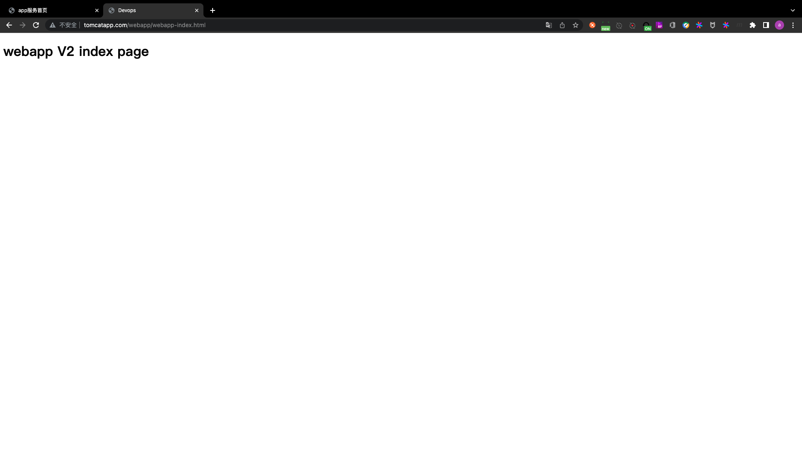

注:此时若访问`http://www.tomcatapp.com/webapp/index.html`则会报404,这是因为对于`erp-nginx-webapp-service`而言,在location下并没有`/webapp/index.html`这个文件

制作一个index.html:

```
root@k8s-master-1:~/k8s-data/ingress# kubectl exec -it erp-nginx-webapp-deployment-65fb86d9f6-8mhhb bash -n erp
[root@erp-nginx-webapp-deployment-65fb86d9f6-8mhhb /]# cd /usr/local/nginx/html/
[root@erp-nginx-webapp-deployment-65fb86d9f6-8mhhb html]# ls
50x.html  index.html  webapp
[root@erp-nginx-webapp-deployment-65fb86d9f6-8mhhb html]# cd webapp/
[root@erp-nginx-webapp-deployment-65fb86d9f6-8mhhb webapp]# ls
images  static  webapp-index.html
[root@erp-nginx-webapp-deployment-65fb86d9f6-8mhhb webapp]# vim index.html
[root@erp-nginx-webapp-deployment-65fb86d9f6-8mhhb webapp]# 
```


注:若想实现多域名的多URL转发,则按照如下格式配置即可:

```
apiVersion: networking.k8s.io/v1beta1
kind: Ingress
metadata:
  name: ingress-url-tomcat-nginx
  namespace: erp
  annotations:
    kubernetes.io/ingress.class: "nginx"
    nginx.ingress.kubernetes.io/use-regex: "true"
    nginx.ingress.kubernetes.io/proxy-connect-timeout: "600"
    nginx.ingress.kubernetes.io/proxy-send-timeout: "600"
    nginx.ingress.kubernetes.io/proxy-read-timeout: "600"
    nginx.ingress.kubernetes.io/proxy-body-size: "50m"
    nginx.ingress.kubernetes.io/app-root: /myapp/app/index.html
spec:
  rules:
    - host: www.tomcatapp.com
      http:
        paths:
          # /myapp的URL 转发到tomcatService
          - path: /myapp
            backend:
              serviceName: erp-tomcat-webapp-service
              servicePort: 80
          # /webapp的URL 转发到nginxService
          - path: /webapp
            backend:
              serviceName: erp-nginx-webapp-service
              servicePort: 80

    - host: mobile.tomcatapp.com
      http:
        paths:
          # /myapp的URL 转发到tomcatService
          - path: /myapp
            backend:
              serviceName: erp-tomcat-webapp-service
              servicePort: 80
          # /webapp的URL 转发到nginxService
          - path: /webapp
            backend:
              serviceName: erp-nginx-webapp-service
              servicePort: 80
```

### 6.6 实现单个https域名的ingress

在K8S中实现HTTPS域名,通常不会把证书放在容器里边,而是放在容器外边.可以放在K8S之外的LB上,当然也可以放在运行nginx的Pod上,这个要看需求.

#### 6.6.1 生成证书并配置K8S Secret

生成ca证书:

```
root@k8s-master-1:~/k8s-data/ingress# mkdir certs
root@k8s-master-1:~/k8s-data/ingress# cd certs/
root@k8s-master-1:~/k8s-data/ingress/certs# openssl req -x509 -sha256 -newkey rsa:4096 -keyout ca.key -out ca.crt -days 3560 -nodes -subj '/CN=www.tomcatapp.com'
Can't load /root/.rnd into RNG
140103720653248:error:2406F079:random number generator:RAND_load_file:Cannot open file:../crypto/rand/randfile.c:88:Filename=/root/.rnd
Generating a RSA private key
............................................................................++++
...............................++++
writing new private key to 'ca.key'
root@k8s-master-1:~/k8s-data/ingress/certs# ls
ca.crt  ca.key
```

生成csl文件:

```
root@k8s-master-1:~/k8s-data/ingress/certs# openssl req -new -newkey rsa:4096 -keyout server.key -out server.csr -nodes -subj '/CN=www.tomcatapp.com'
Can't load /root/.rnd into RNG
140086245650880:error:2406F079:random number generator:RAND_load_file:Cannot open file:../crypto/rand/randfile.c:88:Filename=/root/.rnd
Generating a RSA private key
....................................++++
...................................................................................................++++
writing new private key to 'server.key'
-----
root@k8s-master-1:~/k8s-data/ingress/certs# ls
ca.crt  ca.key  server.csr  server.key
```

将csr文件签发为crt证书:

```
root@k8s-master-1:~/k8s-data/ingress/certs# openssl x509 -req -sha256 -days 3650 -in server.csr -CA ca.crt -CAkey ca.key -set_serial 01 -out server.crt
Signature ok
subject=CN = www.tomcatapp.com
Getting CA Private Key
root@k8s-master-1:~/k8s-data/ingress/certs# ls
ca.crt  ca.key  server.crt  server.csr  server.key
```

其中公钥为`server.crt`,私钥为`server.key`

在K8S中创建secret,用于保存密钥信息:

```
root@k8s-master-1:~/k8s-data/ingress/certs# kubectl  create secret generic nginx-tls-secret --from-file=tls.crt=server.crt --from-file=tls.key=server.key -n erp
secret/tomcat-tls-secret created
```

其中:

- `tomcat-tls-secret`:K8S中secret的名字
- `tls.crt`:K8S中的secret以KV形式存储密钥信息.tls.crt表示key的名字,此处表示的是公钥的key
- `server.crt`:公钥文件的文件名
- `tls.key`:私钥的key
- `server.key`:私钥文件的文件名

查看secret:

```
root@k8s-master-1:~/k8s-data/ingress/certs# kubectl get secrets -n erp
NAME                  TYPE                                  DATA   AGE
default-token-td2cn   kubernetes.io/service-account-token   3      26d
nginx-tls-secret     Opaque                                2      92s
```

#### 6.6.2 创建规则

删除之前的规则:

```
root@k8s-master-1:~/k8s-data/ingress# kubectl delete -f ingress-url.yaml 
Warning: networking.k8s.io/v1beta1 Ingress is deprecated in v1.19+, unavailable in v1.22+; use networking.k8s.io/v1 Ingress
ingress.networking.k8s.io "ingress-url-tomcat-nginx" deleted
```

创建规则:

```
root@k8s-master-1:~/k8s-data/ingress/certs# cd ..
root@k8s-master-1:~/k8s-data/ingress# vim ingress-https-single-host.yaml 
root@k8s-master-1:~/k8s-data/ingress# cat ingress-https-single-host.yaml
```

```yaml
apiVersion: networking.k8s.io/v1beta1
kind: Ingress
metadata:
  name: ingress-https
  namespace: erp
  annotations:
    kubernetes.io/ingress.class: "nginx"
    nginx.ingress.kubernetes.io/ssl-redirect: 'true'
    nginx.ingress.kubernetes.io/enable-access-log: "true"
    nginx.ingress.kubernetes.io/configuration-snippet: |
       access_log /var/log/nginx/tomcatapp.com.access.log upstreaminfo if=$loggable;
       error_log  /var/log/nginx/tomcatapp.com.error.log;
spec:
  tls:
  - hosts:
    - www.tomcatapp.com
    secretName: nginx-tls-secret
  rules:
  - host: www.tomcatapp.com
    http:
      paths:
      - path: /
        backend:
          serviceName: erp-nginx-webapp-service
          servicePort: 80
```

```
root@k8s-master-1:~/k8s-data/ingress# kubectl apply -f ingress-https-single-host.yaml 
Warning: networking.k8s.io/v1beta1 Ingress is deprecated in v1.19+, unavailable in v1.22+; use networking.k8s.io/v1 Ingress
ingress.networking.k8s.io/ingress-tomcat-nginx-webapp created
root@k8s-master-1:~/k8s-data/ingress# kubectl get ingresses -n erp
NAME            CLASS    HOSTS               ADDRESS         PORTS     AGE
ingress-https   <none>   www.tomcatapp.com   192.168.0.193   80, 443   4m22s
```

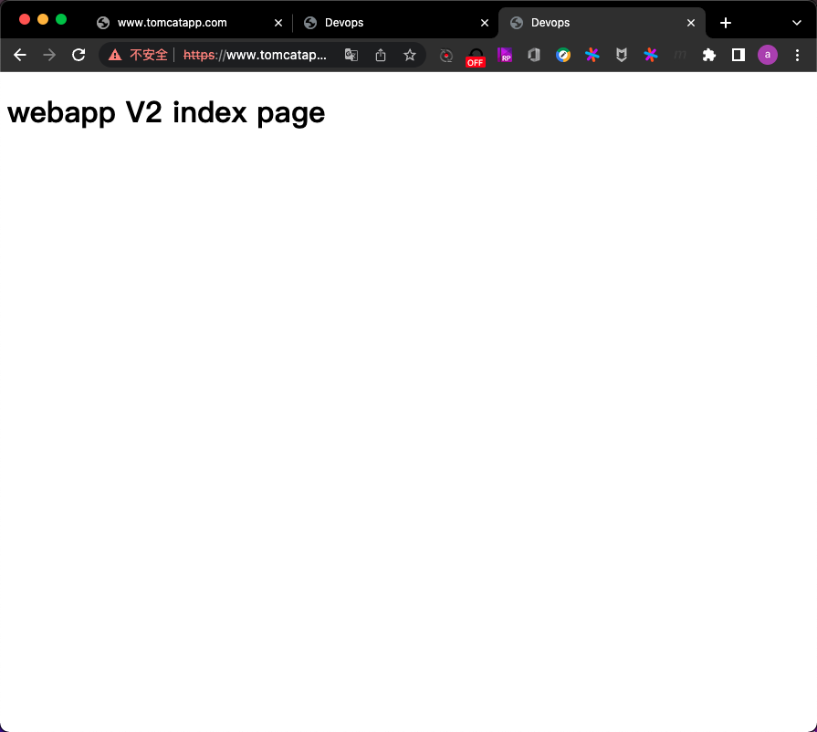

### 6.7 实现多个https域名的ingress

#### 6.7.1 生成证书并配置K8S Secret

```
root@k8s-master-1:~/k8s-data/ingress/certs# openssl req -new -newkey rsa:4096 -keyout mobile.key -out mobile.csr -nodes -subj '/CN=mobile.tomcatapp.com'
Generating a RSA private key
...............++++
..........................++++
writing new private key to 'mobile.key'
-----
root@k8s-master-1:~/k8s-data/ingress/certs# openssl x509 -req -sha256 -days 3650 -in mobile.csr -CA ca.crt -CAkey ca.key -set_serial 01  -out mobile.crt
Signature ok
subject=CN = mobile.tomcatapp.com
Getting CA Private Key
root@k8s-master-1:~/k8s-data/ingress/certs# kubectl  create secret generic mobile-tls-secret --from-file=tls.crt=mobile.crt --from-file=tls.key=mobile.key -n erp
secret/mobile-tls-secret created
```

#### 6.7.2 创建规则

删除之前的规则:

```
root@k8s-master-1:~/k8s-data/ingress# kubectl delete -f ingress-https-single-host.yaml 
Warning: networking.k8s.io/v1beta1 Ingress is deprecated in v1.19+, unavailable in v1.22+; use networking.k8s.io/v1 Ingress
ingress.networking.k8s.io "ingress-https" deleted
```

创建规则:

```
root@k8s-master-1:~/k8s-data/ingress# vim ingress-https-multi-host.yaml
root@k8s-master-1:~/k8s-data/ingress# cat ingress-https-multi-host.yaml
```

```yaml
apiVersion: networking.k8s.io/v1beta1
kind: Ingress
metadata:
  name: ingress-multi-https
  namespace: erp
  annotations:
    kubernetes.io/ingress.class: "nginx"
    nginx.ingress.kubernetes.io/ssl-redirect: 'true'
spec:
  tls:
  - hosts:
    - www.tomcatapp.com
    secretName: nginx-tls-secret
  - hosts:
    - mobile.tomcatapp.com
    secretName: mobile-tls-secret
  rules:
  - host: www.tomcatapp.com
    http:
      paths:
      - path: /
        backend:
          serviceName: erp-nginx-webapp-service
          servicePort: 80
  - host: mobile.tomcatapp.com
    http:
      paths:
      - path: /
        backend:
          serviceName: erp-tomcat-webapp-service
          servicePort: 80
```

```
root@k8s-master-1:~/k8s-data/ingress# kubectl apply -f ingress-https-multi-host.yaml 
Warning: networking.k8s.io/v1beta1 Ingress is deprecated in v1.19+, unavailable in v1.22+; use networking.k8s.io/v1 Ingress
ingress.networking.k8s.io/ingress-multi-https created
```

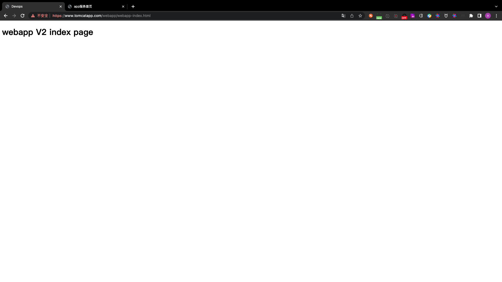


## PART7. HPA

kubectl autoscale⾃动控制在k8s集群中运⾏的pod数量(⽔平⾃动伸缩),**需要提前设置pod范围及触发条件**.
K8S从1.1版本开始增加了名称为HPA(Horizontal Pod Autoscaler)的控制器,⽤于实现基于pod中资源
(CPU/Memory)利⽤率进⾏对pod的⾃动扩缩容功能的实现,早期的版本只能基于Heapster组件实现对CPU利⽤率
做为触发条件,但是在K8S 1.11版本开始使⽤Metrices Server完成数据采集,然后将采集到的数据通过
API(Aggregated API,即汇总API.例如metrics.k8s.io、custom.metrics.k8s.io、external.metrics.k8s.io等然后再把数据提供给HPA控制器进⾏查询,以实现基于某个资源利⽤率对pod进⾏扩缩容的⽬的.


查看K8S集群的资源利用率:

- 查看node资源利用率:`kubectl top node`
- 查看pod资源利用率:`kubectl top pod`

需要安装Metrics API后才能使用.

控制管理器默认每隔15s(可以通过`–horizontal-pod-autoscaler-sync-period`修改)查询metrics的资源使
⽤情况.

```
root@k8s-master-1:~/k8s-data/ingress# kube-controller-manager --help | grep horizontal-pod-autoscaler-sync-period
      --horizontal-pod-autoscaler-sync-period duration                 The period for syncing the number of pods in horizontal pod autoscaler. (default 15s)
```

⽀持以下三种metrics指标类型:

- 预定义metrics(⽐如Pod的CPU)以利⽤率的⽅式计算
- ⾃定义的Pod metrics,以原始值(raw value)的⽅式计算
- ⾃定义的object metrics

⽀持两种metrics查询⽅式:

- Heapster(已废弃)
- ⾃定义的REST API


⽀持多metrics

### 7.1 部署metrics-server

#### 7.1.1 构建metrics-server镜像

使⽤[metrics-server](https://github.com/kubernetes-sigs/metrics-server)作为HPA数据源.推荐使用0.4.X版本的metrics-server.

```
root@ks8-harbor-2:~# docker pull registry.cn-hangzhou.aliyuncs.com/google_containers/metrics-server:v0.4.4
v0.4.4: Pulling from google_containers/metrics-server
5dea5ec2316d: Pull complete 
4aa3a7cd5702: Pull complete 
Digest: sha256:f8643f007c8a604388eadbdac43d76b95b56ccd13f7447dd0934b594b9f7b363
Status: Downloaded newer image for registry.cn-hangzhou.aliyuncs.com/google_containers/metrics-server:v0.4.4
registry.cn-hangzhou.aliyuncs.com/google_containers/metrics-server:v0.4.4
root@ks8-harbor-2:~# docker tag registry.cn-hangzhou.aliyuncs.com/google_containers/metrics-server:v0.4.4 harbor.k8s.com/hpa-images/metrics-server:v0.4.4
root@ks8-harbor-2:~# docker push harbor.k8s.com/hpa-images/metrics-server:v0.4.4
The push refers to repository [harbor.k8s.com/hpa-images/metrics-server]
f7ddbfcf39e1: Pushed 
417cb9b79ade: Pushed 
v0.4.4: digest: sha256:e6ec40715308dac19766bdfcecba651f73adbc527e1ac8abddcc3a52547b95d6 size: 739
```

#### 7.1.2 创建metrics-server Pod

[v0.4.4版本yaml文件地址](https://github.com/kubernetes-sigs/metrics-server/releases/download/v0.4.4/components.yaml)

```
root@k8s-master-1:~/k8s-data/ingress# cd ..
root@k8s-master-1:~/k8s-data# mkdir hpa
root@k8s-master-1:~/k8s-data# cd hpa
root@k8s-master-1:~/k8s-data/hpa# vim components-v0.4.4.yaml
root@k8s-master-1:~/k8s-data/hpa# cat components-v0.4.4.yaml
```

```yaml
apiVersion: v1
kind: ServiceAccount
metadata:
  labels:
    k8s-app: metrics-server
  name: metrics-server
  namespace: kube-system
---
apiVersion: rbac.authorization.k8s.io/v1
kind: ClusterRole
metadata:
  labels:
    k8s-app: metrics-server
    rbac.authorization.k8s.io/aggregate-to-admin: "true"
    rbac.authorization.k8s.io/aggregate-to-edit: "true"
    rbac.authorization.k8s.io/aggregate-to-view: "true"
  name: system:aggregated-metrics-reader
rules:
- apiGroups:
  - metrics.k8s.io
  resources:
  - pods
  - nodes
  verbs:
  - get
  - list
  - watch
---
apiVersion: rbac.authorization.k8s.io/v1
kind: ClusterRole
metadata:
  labels:
    k8s-app: metrics-server
  name: system:metrics-server
rules:
- apiGroups:
  - ""
  resources:
  - pods
  - nodes
  - nodes/stats
  - namespaces
  - configmaps
  verbs:
  - get
  - list
  - watch
---
apiVersion: rbac.authorization.k8s.io/v1
kind: RoleBinding
metadata:
  labels:
    k8s-app: metrics-server
  name: metrics-server-auth-reader
  namespace: kube-system
roleRef:
  apiGroup: rbac.authorization.k8s.io
  kind: Role
  name: extension-apiserver-authentication-reader
subjects:
- kind: ServiceAccount
  name: metrics-server
  namespace: kube-system
---
apiVersion: rbac.authorization.k8s.io/v1
kind: ClusterRoleBinding
metadata:
  labels:
    k8s-app: metrics-server
  name: metrics-server:system:auth-delegator
roleRef:
  apiGroup: rbac.authorization.k8s.io
  kind: ClusterRole
  name: system:auth-delegator
subjects:
- kind: ServiceAccount
  name: metrics-server
  namespace: kube-system
---
apiVersion: rbac.authorization.k8s.io/v1
kind: ClusterRoleBinding
metadata:
  labels:
    k8s-app: metrics-server
  name: system:metrics-server
roleRef:
  apiGroup: rbac.authorization.k8s.io
  kind: ClusterRole
  name: system:metrics-server
subjects:
- kind: ServiceAccount
  name: metrics-server
  namespace: kube-system
---
apiVersion: v1
kind: Service
metadata:
  labels:
    k8s-app: metrics-server
  name: metrics-server
  namespace: kube-system
spec:
  ports:
  - name: https
    port: 443
    protocol: TCP
    targetPort: https
  selector:
    k8s-app: metrics-server
---
apiVersion: apps/v1
kind: Deployment
metadata:
  labels:
    k8s-app: metrics-server
  name: metrics-server
  namespace: kube-system
spec:
  selector:
    matchLabels:
      k8s-app: metrics-server
  strategy:
    rollingUpdate:
      maxUnavailable: 0
  template:
    metadata:
      labels:
        k8s-app: metrics-server
    spec:
      containers:
      - args:
        - --cert-dir=/tmp
        - --secure-port=4443
        - --kubelet-preferred-address-types=InternalIP,ExternalIP,Hostname
        - --kubelet-use-node-status-port
        image: harbor.k8s.com/hpa-images/metrics-server:v0.4.4
        imagePullPolicy: IfNotPresent
        livenessProbe:
          failureThreshold: 3
          httpGet:
            path: /livez
            port: https
            scheme: HTTPS
          periodSeconds: 10
        name: metrics-server
        ports:
        - containerPort: 4443
          name: https
          protocol: TCP
        readinessProbe:
          failureThreshold: 3
          httpGet:
            path: /readyz
            port: https
            scheme: HTTPS
          periodSeconds: 10
        securityContext:
          readOnlyRootFilesystem: true
          runAsNonRoot: true
          runAsUser: 1000
        volumeMounts:
        - mountPath: /tmp
          name: tmp-dir
      nodeSelector:
        kubernetes.io/os: linux
      priorityClassName: system-cluster-critical
      serviceAccountName: metrics-server
      volumes:
      - emptyDir: {}
        name: tmp-dir
---
apiVersion: apiregistration.k8s.io/v1
kind: APIService
metadata:
  labels:
    k8s-app: metrics-server
  name: v1beta1.metrics.k8s.io
spec:
  group: metrics.k8s.io
  groupPriorityMinimum: 100
  insecureSkipTLSVerify: true
  service:
    name: metrics-server
    namespace: kube-system
  version: v1beta1
  versionPriority: 100
```

```
root@k8s-master-1:~/k8s-data/hpa# kubectl apply -f components-v0.4.4.yaml
serviceaccount/metrics-server created
clusterrole.rbac.authorization.k8s.io/system:aggregated-metrics-reader created
clusterrole.rbac.authorization.k8s.io/system:metrics-server created
rolebinding.rbac.authorization.k8s.io/metrics-server-auth-reader created
clusterrolebinding.rbac.authorization.k8s.io/metrics-server:system:auth-delegator created
clusterrolebinding.rbac.authorization.k8s.io/system:metrics-server created
service/metrics-server created
deployment.apps/metrics-server created
apiservice.apiregistration.k8s.io/v1beta1.metrics.k8s.io created
root@k8s-master-1:~/k8s-data/hpa# kubectl get pod -n kube-system
NAME                                       READY   STATUS    RESTARTS   AGE
calico-kube-controllers-75b57c64c6-kw5b6   1/1     Running   0          7h33m
calico-node-4q6dp                          1/1     Running   2          29d
calico-node-5dmf4                          1/1     Running   13         29d
calico-node-6nsdd                          1/1     Running   12         29d
calico-node-8qsb6                          1/1     Running   2          29d
calico-node-jc4j6                          1/1     Running   4          29d
calico-node-lks6l                          1/1     Running   13         29d
coredns-5b86cf85-7nwl5                     1/1     Running   0          7h33m
fluentd-elasticsearch-5tws5                1/1     Running   2          29d
fluentd-elasticsearch-cvvm7                1/1     Running   2          29d
fluentd-elasticsearch-jzd59                1/1     Running   11         29d
fluentd-elasticsearch-lqrt7                1/1     Running   12         29d
fluentd-elasticsearch-mddg9                1/1     Running   2          29d
fluentd-elasticsearch-tq9l4                1/1     Running   12         29d
metrics-server-98bccff87-dh7mt             1/1     Running   0          7s
```

此处要求`metrics-server`必须是能起来的.

此时就可以使用`kubectl top`命令查看资源利用率了:

```
root@k8s-master-1:~/k8s-data/hpa# kubectl top node
W0523 21:14:27.943196   30635 top_node.go:119] Using json format to get metrics. Next release will switch to protocol-buffers, switch early by passing --use-protocol-buffers flag
NAME            CPU(cores)   CPU%   MEMORY(bytes)   MEMORY%   
192.168.0.181   101m         5%     1245Mi          98%       
192.168.0.182   103m         5%     1306Mi          102%      
192.168.0.183   123m         6%     1300Mi          102%      
192.168.0.191   94m          4%     755Mi           23%       
192.168.0.192   139m         6%     718Mi           22%       
192.168.0.193   185m         9%     2099Mi          65%  
```

```
root@k8s-master-1:~/k8s-data/hpa# kubectl top pod -n erp
W0523 21:15:20.001391   31472 top_pod.go:140] Using json format to get metrics. Next release will switch to protocol-buffers, switch early by passing --use-protocol-buffers flag
NAME                                            CPU(cores)   MEMORY(bytes)   
dubbo-admin-deploy-697654f7d9-ssnnp             3m           276Mi           
erp-consumer-deployment-79d5876d79-tzk6x        0m           6Mi             
erp-jenkins-deployment-696696cb65-84nts         1m           529Mi           
erp-nginx-webapp-deployment-65fb86d9f6-x9vwv    0m           5Mi             
erp-provider-deployment-747df899c4-xcf7w        10m          9Mi             
erp-tomcat-webapp-deployment-84bbf6b865-6rpj7   2m           166Mi           
mysql-0                                         6m           206Mi           
mysql-1                                         6m           206Mi           
mysql-2                                         7m           205Mi           
redis-deployment-6d85975b47-8bw4p               1m           3Mi             
wordpress-app-deployment-7fcb55bd59-s79d6       1m           16Mi            
zookeeper1-7ff6fbfbf-4frpw                      1m           70Mi            
zookeeper2-94cfd4596-8ztxj                      1m           60Mi            
zookeeper3-7f55657779-ssbxf                     1m           58Mi   
```

且dashboard中也会显示每个pod的资源利用率:

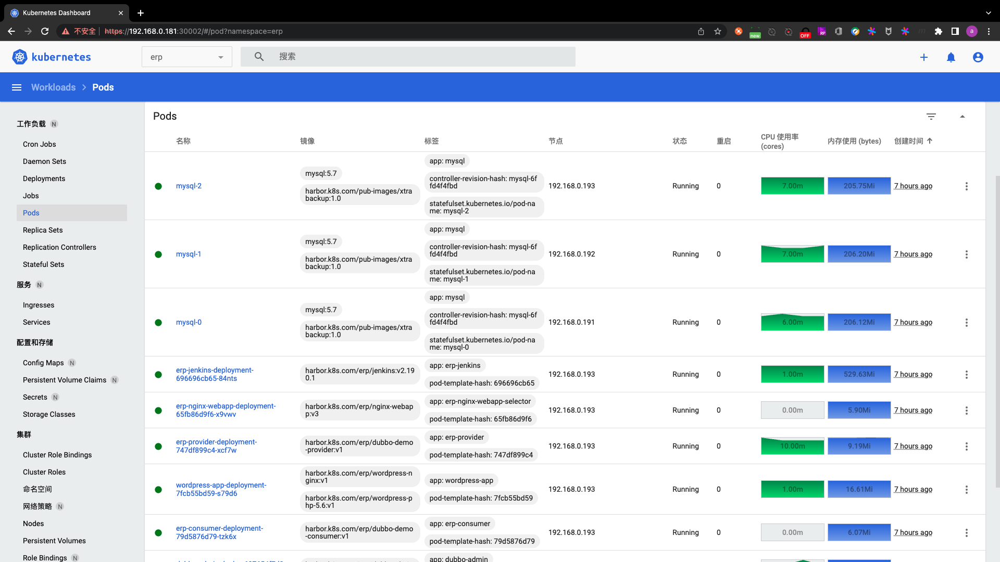

### 7.2 配置扩缩容

#### 7.2.1 通过命令行配置扩缩容

这种方式很少使用,了解即可.通常测试用,生产环境不会允许这么创建HPA的.

```
root@k8s-master-1:~/k8s-data/hpa# kubectl autoscale deployment erp-tomcat-webapp-deployment --min=2 --max=10 --cpu-percent=80 -n erp
horizontalpodautoscaler.autoscaling/erp-tomcat-webapp-deployment autoscaled
root@k8s-master-1:~/k8s-data/hpa# kubectl get hpa -n erp
NAME                           REFERENCE                                 TARGETS   MINPODS   MAXPODS   REPLICAS   AGE
erp-tomcat-webapp-deployment   Deployment/erp-tomcat-webapp-deployment   0%/80%    2         10        2          43s
```

其中:

- `--min=2`:最小副本数
- `--max=10`:最大副本数
- `--cpu-percent=80`:扩缩容条件

注:注意TARGETS列,值必须不能为UNKNOWN.若为UNKNOWN则说明HPA未能成功采集到数据.

注:测试完成后记得删除这个HPA

不设置条件,直接手动控制副本数:

```
kubectl scale deployment erp-tomcat-webapp-deployment --replicas=2 -n erp
```

#### 7.2.2 通过yaml文件配置扩缩容

通常HPA是和Service、Deployment的yaml文件是放在一起的.

```
root@k8s-master-1:~/k8s-data/hpa# cd ..
root@k8s-master-1:~/k8s-data# cd tomcat-webapp-yaml/
root@k8s-master-1:~/k8s-data/tomcat-webapp-yaml# vim tomcat-webapp-hpa.yaml
root@k8s-master-1:~/k8s-data/tomcat-webapp-yaml# cat tomcat-webapp-hpa.yaml
```

```yaml
apiVersion: autoscaling/v1 
kind: HorizontalPodAutoscaler
metadata:
  # HPA要和它所管理的资源处于同一个namespace下
  namespace: erp
  name: erp-tomcat-webapp-podautoscaler
  labels:
    app: erp-tomcat-webapp-podautoscaler
    version: v2beta1
spec:
  scaleTargetRef:
    apiVersion: apps/v1
    # 指定HPA要管理的资源类型
    kind: Deployment
    # 指定HPA要管理的资源名称
    name: erp-tomcat-webapp-deployment
  # 最小副本数  
  minReplicas: 2
  # 最大副本数
  maxReplicas: 20
  # 扩缩容条件 不支持对内存设置扩缩容条件
  targetCPUUtilizationPercentage: 60
  # 早期(apiVersion为autoscaling/v2beta1)的写法如下
  #metrics:
  #- type: Resource
  #  resource:
  #    name: cpu
  #    targetAverageUtilization: 60
  #- type: Resource
  #  resource:
  #    name: memory
```

创建HPA前,查看Pod的副本数:

```
root@k8s-master-1:~/k8s-data/tomcat-webapp-yaml# kubectl get pod -n erp
NAME                                            READY   STATUS    RESTARTS   AGE
dubbo-admin-deploy-697654f7d9-ssnnp             1/1     Running   0          8h
erp-consumer-deployment-79d5876d79-tzk6x        1/1     Running   0          8h
erp-jenkins-deployment-696696cb65-84nts         1/1     Running   0          8h
erp-nginx-webapp-deployment-65fb86d9f6-x9vwv    1/1     Running   0          8h
erp-provider-deployment-747df899c4-xcf7w        1/1     Running   0          8h
erp-tomcat-webapp-deployment-84bbf6b865-6rpj7   1/1     Running   0          8h
mysql-0                                         2/2     Running   0          7h31m
mysql-1                                         2/2     Running   0          7h30m
mysql-2                                         2/2     Running   0          7h30m
redis-deployment-6d85975b47-8bw4p               1/1     Running   0          8h
wordpress-app-deployment-7fcb55bd59-s79d6       2/2     Running   0          8h
zookeeper1-7ff6fbfbf-4frpw                      1/1     Running   0          8h
zookeeper2-94cfd4596-8ztxj                      1/1     Running   0          8h
zookeeper3-7f55657779-ssbxf                     1/1     Running   0          8h
```

可以看到,Pod只有1个副本.

创建HPA:

```
root@k8s-master-1:~/k8s-data/tomcat-webapp-yaml# kubectl apply -f tomcat-webapp-hpa.yaml 
horizontalpodautoscaler.autoscaling/erp-tomcat-webapp-podautoscaler created
NAME                              REFERENCE                                 TARGETS   MINPODS   MAXPODS   REPLICAS   AGE
erp-tomcat-webapp-podautoscaler   Deployment/erp-tomcat-webapp-deployment   0%/60%    2         20        2          23s
```

查看HPA:

```
root@k8s-master-1:~/k8s-data/tomcat-webapp-yaml# kubectl describe hpa erp-tomcat-webapp-podautoscaler -n erp
Name:                                                  erp-tomcat-webapp-podautoscaler
Namespace:                                             erp
Labels:                                                app=erp-tomcat-webapp-podautoscaler
                                                       version=v2beta1
Annotations:                                           <none>
CreationTimestamp:                                     Mon, 23 May 2022 21:43:28 +0800
Reference:                                             Deployment/erp-tomcat-webapp-deployment
Metrics:                                               ( current / target )
  resource cpu on pods  (as a percentage of request):  0% (2m) / 60%
Min replicas:                                          2
Max replicas:                                          20
Deployment pods:                                       2 current / 2 desired
Conditions:
  Type            Status  Reason               Message
  ----            ------  ------               -------
  AbleToScale     True    ScaleDownStabilized  recent recommendations were higher than current one, applying the highest recent recommendation
  ScalingActive   True    ValidMetricFound     the HPA was able to successfully calculate a replica count from cpu resource utilization (percentage of request)
  ScalingLimited  True    TooFewReplicas       the desired replica count is less than the minimum replica count
Events:
  Type    Reason             Age   From                       Message
  ----    ------             ----  ----                       -------
  Normal  SuccessfulRescale  47s   horizontal-pod-autoscaler  New size: 2; reason: Current number of replicas below Spec.MinReplicas
```

可以看到,47秒前,HPA又创建了一个Pod.

查看Pod:

```
root@k8s-master-1:~/k8s-data/tomcat-webapp-yaml# kubectl get pod -n erp
NAME                                            READY   STATUS    RESTARTS   AGE
dubbo-admin-deploy-697654f7d9-ssnnp             1/1     Running   0          8h
erp-consumer-deployment-79d5876d79-tzk6x        1/1     Running   0          8h
erp-jenkins-deployment-696696cb65-84nts         1/1     Running   0          8h
erp-nginx-webapp-deployment-65fb86d9f6-x9vwv    1/1     Running   0          8h
erp-provider-deployment-747df899c4-xcf7w        1/1     Running   0          8h
erp-tomcat-webapp-deployment-84bbf6b865-6rpj7   1/1     Running   0          8h
erp-tomcat-webapp-deployment-84bbf6b865-nh2t9   1/1     Running   0          87s
mysql-0                                         2/2     Running   0          7h35m
mysql-1                                         2/2     Running   0          7h35m
mysql-2                                         2/2     Running   0          7h35m
redis-deployment-6d85975b47-8bw4p               1/1     Running   0          8h
wordpress-app-deployment-7fcb55bd59-s79d6       2/2     Running   0          8h
zookeeper1-7ff6fbfbf-4frpw                      1/1     Running   0          8h
zookeeper2-94cfd4596-8ztxj                      1/1     Running   0          8h
zookeeper3-7f55657779-ssbxf                     1/1     Running   0          8h
```

确认又创建了一个新的Pod.

实际上执行伸缩是HPA调用Deployment实现的.